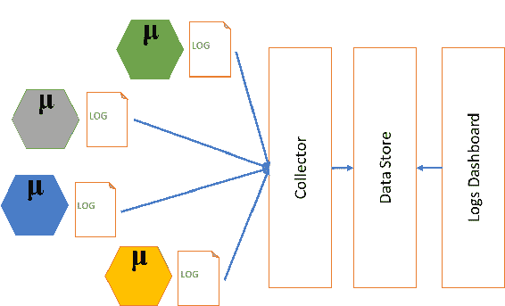
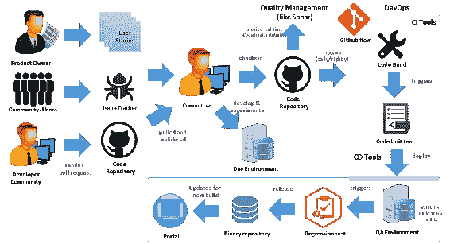

# 第二章：云原生简介

云计算的出现和移动设备的普及导致了消费者面向公司（如亚马逊、Netflix、优步、谷歌和 Airbnb）的崛起，它们重新定义了整个客户体验。这些公司在云上构建了它们的应用程序（包括 Web 和移动界面），利用功能或服务，使它们能够根据需求进行扩展或缩减，随时可用，并准备好处理各个层面的故障。

传统企业正在关注这些面向消费者的公司，并希望采纳它们的一些最佳实践。他们这样做是为了帮助扩展他们快速发展的企业应用程序，使它们能够利用云的弹性和可伸缩性。

在我们深入了解云原生之前，让我们看看这一章节包含什么。本章将涵盖以下主题：

+   为什么要采用云原生？

+   什么是云原生？

+   12 要素应用简介

+   为什么要从单片应用迁移到基于分布式微服务的应用程序？

+   构建基于分布式微服务的应用程序的优势

# 为什么要采用云原生？

让我们看看以下几点，以了解为什么我们需要采用云原生：

+   云采用的第一波浪潮是关于成本节约和业务敏捷性（特别是基础设施供应和廉价存储）。随着云的不断普及，企业开始发现基础设施即服务（IaaS）和平台即服务（PaaS）服务以及它们在构建应用程序中的利用，这些应用程序利用了云的弹性和可伸缩性，同时接受了云平台固有的故障。

+   许多企业正在数字化倡议领域采用绿地设计和微服务的开发。在处理物联网（IoT）、移动设备、SaaS 集成和在线业务模式时，企业正在与市场上的利基玩家合作。这些新时代的商业模式被设计和开发为企业端的创新系统。这些模型被迅速迭代，以识别和挖掘客户的需求、他们的偏好、什么有效，什么无效。

+   企业还在基于其产品线开发数字服务。产品通过物联网得到增强，使其能够发出有关产品性能的数据。这些数据被汇总和分析，以发现预测性维护、使用模式和外部因素等模式。来自客户的数据被汇总和聚合，以构建产品增强和新功能的新模型。许多这些新数字服务使用云原生模型。

+   这些现代数字解决方案使用来自各种提供商的 API，例如用于位置的谷歌地图，用于身份验证的 Facebook/谷歌，以及用于社交协作的 Facebook/Twitter。将所有这些 API 与企业业务的功能和功能结合起来，使它们能够为客户构建独特的建议。所有这些集成都是在 API 级别进行的。移动应用程序不是为数十亿用户而设计的，而是为数百万用户而设计的。这意味着随着负载的增加，底层应用程序功能应该能够扩展，以为客户提供无缝的体验。

+   企业扩展资源的一种方式是在负载增加或出现故障时进行服务/环境供应的繁重工作。另一种方式是将底层服务的繁重工作转移到云平台提供商。这是构建云原生应用程序的甜蜜点，利用云提供商的平台服务使企业能够卸载可伸缩性的关键方面，并专注于价值生成部分。

# 什么是云原生？

当应用程序被设计和架构以利用云计算平台支持的基础 IaaS 和 PaaS 服务时，它们被称为云原生应用。

这意味着构建可靠的系统应用，如五个九（99.999%），在三个九（99.9%）的基础设施和应用组件上运行。我们需要设计我们的应用组件来处理故障。为了处理这样的故障，我们需要一个结构化的可扩展性和可用性方法。为了支持应用程序的整个规模，所有部分都需要自动化。

云采用通常是一系列步骤，企业在开始构建云原生应用之前开始探索服务。采用始于将 Dev/Test 环境迁移到云中，业务和开发人员社区对快速配置是关键需求。一旦企业度过环境配置阶段，下一步/模型是企业应用迁移到云原生模型，将在以下部分讨论。

# 举起和转移

传统上，企业开始其云计算之旅是通过 IaaS 服务。他们将业务应用工作负载从本地数据中心转移到云计算平台上的相应租用容量。这是云计算平台采用的第一波浪潮，企业从资本支出模式转变为运营支出模式。

IaaS，顾名思义，专注于基础设施——计算节点、网络和存储。在这种模式下，企业可以利用云的弹性，根据需求或负载来增加或减少计算节点。虚拟机（VM）抽象出底层硬件，并提供了通过几次点击来扩展或缩减 VM 数量的能力。

企业通常在第一波浪潮中使用 IaaS，原因如下：

+   资源的可变性：随意添加/删除资源的能力，从而实现更多的业务敏捷性

+   实用模型：IaaS 提供按小时租用的基本资源，更具可预测性和运营支出模式

# 原生应用

一旦企业开始对 IaaS 感到满意，下一波采用的浪潮就是采用 PaaS 作为应用工作负载的一部分。在这个阶段，企业开始发现具有以下好处的服务：

+   平台服务替换：这涉及识别企业的潜在平台特性，举起和转移工作负载，并用云提供商的等效平台服务替换。例如：

+   用云提供商提供的排队系统（如 AWS SQS）替换应用消息系统

+   用等效的托管数据服务（如 AWS RDS）替换数据存储或关系数据库管理系统（RDMBS）

+   用托管目录或安全服务（如 AWS Directory 和 AWS IAM）替换安全或目录服务

+   这些服务使企业摆脱所有运营工作，如数据存储备份、可用性、可扩展性和冗余，并用提供所有这些功能的托管服务替换它们

+   应用服务替换：企业发现可以替换其自有平台或实用服务的新服务。例如：

+   用云提供商的等效 DevOps 服务（如 AWS CodePipeline、AWS CodeCommit 或 AWS CodeDeploy）替换构建和发布服务或产品

+   用等效的应用平台服务（如 AWS API Gateway、AWS SWF 和 AWS SES）替换应用服务或产品

+   用等效的应用分析服务（如 AWS Data Pipeline 和 AWS EMR）替换分析工作负载服务

一旦应用程序开始采用平台服务，应用程序开始抽象出**商业现成**（**COTS**）产品提供的功能或功能（如消息传递、通知、安全、工作流和 API 网关），并用等效的功能平台服务替换它们。例如，不再托管和运行消息传递 IaaS，转向等效的平台服务意味着转向一种模式，您只支付发送的消息数量，而不会产生任何额外的运营成本。这种模式带来了显著的节省，因为您从租用和运营产品转向了仅在利用时租用产品的模式。

# 走向无服务器

一旦企业采用 PaaS 构建应用程序，下一步就是将应用程序逻辑抽象为一系列较小的函数并部署它们。这些函数作为对用户或代理的事件的反应而被调用，这导致这些函数计算传入的事件并返回结果。这是最高级别的抽象，应用程序已被划分为一系列函数，这些函数独立部署。这些函数使用异步通信模型相互通信。云计算平台提供了 AWS Lambda 和 Azure Functions 等功能，用于实现无服务器化。

# 云原生和微服务

为了实现 IaaS 和 PaaS 服务的采用，需要对应用程序的设计和架构进行改变。

在基础平台（即：应用服务器）上设计企业应用程序的模式意味着应用程序的可伸缩性和可用性的重要工作是平台的责任。企业开发人员将专注于使用标准化的 JEE 模式和开发组件（展示、业务、数据和集成）来构建完全功能和事务性的应用程序。应用程序的可伸缩性受到底层平台能力（节点集群和分布式缓存）的限制：

单片应用程序

作为单片应用程序构建的业务应用程序通常具有以下特征：

+   整个应用程序逻辑被打包成一个单独的 EAR 文件

+   应用程序的重用是通过共享 JAR 文件实现的

+   应用程序的更改通常提前数月计划，通常是每个季度进行一次大规模推动

+   有一个数据库包含了整个应用程序的架构

+   有成千上万的测试用例表示回归的数量

+   应用程序的设计、开发和部署需要多个团队之间的协调和重大的管理

随着社交互动和移动用户的出现，应用程序用户和数据的规模开始呈指数级增长。企业很快发现，平台在以下问题方面成为了瓶颈：

+   **业务敏捷性**：由于应用程序的单片结构，管理应用程序平台和不断更改功能/功能的运营成本受到了阻碍。即使是一个小的功能更改，整个回归测试和在服务器集群上的部署周期也在影响创新的整体速度。

移动革命意味着问题不仅仅存在于渠道层，而且还渗透到集成和记录系统层。除非企业跨越这些层面解决问题，否则在市场上创新和竞争的能力将受到威胁。

+   **成本**：为了满足增加的需求，IT 运营团队不断添加新的服务器实例来处理负载。然而，随着每个新实例的增加，复杂性和许可成本（取决于核心数）也在增加。与世界上的 Facebook 不同，企业每用户成本随着每个用户的获取而增加。

此时，企业开始关注开源产品以及消费者面向公司如何构建现代应用程序，为数百万用户提供服务，处理 PB 级数据，并部署到云端。

面向消费者的公司在其生命周期的早期就遇到了这些障碍。大量的创新导致了新的开源产品的设计和开发，以及云计算的设计模式。

在这种情况下，**面向服务的架构**（SOA）的整个前提被重新审视，企业调查了应用架构如何采用设计自治服务的原则，这些服务是隔离的、离散的，并且可以与其他服务集成和组合。这导致了微服务模型的兴起，它与云服务模型非常适配和整合，其中一切都作为服务和 HTTP 端点可用。

微服务是用于构建灵活、可独立部署的软件系统的面向服务架构（SOA）的专业化和实现方法

- 维基百科

微服务是设计和开发的，考虑到一个业务应用可以通过组合这些服务来构建。微服务围绕以下原则设计：

+   **单一责任原则**：每个微服务只实现有界域上下文中的一个业务责任。从软件角度来看，系统需要分解为多个组件，其中每个组件都成为一个微服务。微服务必须轻量级，以便实现更小的内存占用和更快的启动时间。

+   **无共享**：微服务是自治的、自包含的、无状态的，并通过基于容器的封装模型管理服务状态（内存/存储）。私有数据由一个服务管理，没有其他服务对数据的争用。无状态的微服务比有状态的微服务更容易扩展和启动更快，因为在关闭时没有状态需要备份或在启动时激活。

+   **反应式**：这适用于具有并发负载或较长响应时间的微服务。异步通信和回调模型允许资源的最佳利用，从而提高微服务的可用性和吞吐量。

+   **外部化配置**：这将配置外部化到配置服务器中，以便可以按环境维护它们的分层结构。

+   **一致性**：服务应该按照编码标准和命名约定指南以一致的风格编写。

+   **韧性**：服务应该处理由技术原因（连接和运行时）和业务原因（无效输入）引起的异常，并且不会崩溃。诸如断路器和批量标头之类的模式有助于隔离和遏制故障。

+   **良好的公民**：微服务应通过 JMX API 或 HTTP API 报告它们的使用统计信息，它们被访问的次数，它们的平均响应时间等。

+   **版本化**：微服务可能需要支持不同客户的多个版本，直到所有客户迁移到更高版本。在支持新功能和修复错误方面，应该有明确的版本策略。

+   **独立部署**：每个微服务都应该可以独立部署，而不会损害应用程序的完整性：

从单片到基于微服务的应用程序的转变

微服务的设计、开发和部署考虑在后续章节中详细介绍。我们将看到如何为电子商务产品构建服务。我相信每个人都对电子商务非常熟悉，并且会很容易理解产品需求。

# 12 要素应用

为了构建一个可以在云提供商之间部署的分布式、基于微服务的应用程序，Heroku 的工程师提出了需要由任何现代云原生应用程序实施的 12 个因素：

+   **单一代码库**：应用程序必须有一个代码库，每个应用程序（即：微服务）都可以在多个环境（开发、测试、暂存和生产环境）中部署。两个微服务不共享相同的代码库。这种模式允许灵活更改和部署服务，而不会影响应用程序的其他部分。

+   **依赖关系**：应用程序必须明确声明其代码依赖关系，并将它们添加到应用程序或微服务中。这些依赖关系被打包为微服务 JAR/WAR 文件的一部分。这有助于隔离微服务之间的依赖关系，并减少同一 JAR 的多个版本带来的任何副作用。

+   **配置**：应用程序配置数据被移出应用程序或微服务，并通过配置管理工具进行外部化。应用程序或微服务将根据其运行的环境选择配置，从而允许相同的部署单元在各个环境中传播。

+   **后备服务**：所有外部资源访问都应该是可寻址的 URL。例如，SMTP URL、数据库 URL、服务 HTTP URL、队列 URL 和 TCP URL。这允许 URL 被外部化到配置中，并为每个环境进行管理。

+   **构建、发布和运行**：整个构建、发布和运行过程被视为三个独立的步骤。这意味着作为构建的一部分，应用程序被构建为一个不可变的实体。这个不可变的实体将根据环境（开发、测试、暂存或生产）选择相关的配置来运行进程。

+   **进程**：微服务建立在并遵循共享无状态模型。这意味着服务是无状态的，状态被外部化到缓存或数据存储中。这允许无缝扩展，并允许负载均衡或代理将请求发送到服务的任何实例。

+   **端口绑定**：微服务是在容器内构建的。服务将通过端口（包括 HTTP）导出和绑定所有其接口。

+   **并发性**：微服务进程是按比例扩展的，这意味着为了处理增加的流量，会向环境中添加更多的微服务进程。在微服务进程内部，可以利用反应式模型来优化资源利用率。

+   **可处置性**：构建微服务的想法是将其作为不可变的，具有单一职责，以最大程度地提高鲁棒性和更快的启动时间。不可变性也有助于服务的可处置性。

+   **开发/生产一致性**：应用程序生命周期中的环境（DEV、TEST、STAGING 和 PROD）尽量保持相似，以避免后续出现任何意外。

+   **日志**：在不可变的微服务实例中，作为服务处理的一部分生成的日志是状态的候选者。这些日志应被视为事件流，并推送到日志聚合基础设施。

+   **管理进程**：微服务实例是长时间运行的进程，除非它们被终止或替换为更新版本。所有其他管理和管理任务都被视为一次性进程：

12 要素应用

遵循 12 要素的应用程序不对外部环境做任何假设，这使它们可以部署在任何云提供商平台上。这允许在各种环境中运行相同的工具/流程/脚本，并以一致的方式部署分布式微服务应用程序。

# 微服务启用的服务生态系统

为了成功运行微服务，需要一些必要的启用组件/服务。这些启用服务可以被标记为 PaaS，用于支持微服务的构建、发布、部署和运行。

在云原生模型的情况下，这些服务可以作为云提供商自身的 PaaS 服务提供：

+   **服务发现**：当应用程序被分解为微服务模型时，一个典型的应用程序可能由数百个微服务组成。每个微服务运行多个实例，很快就会有成千上万个微服务实例在运行。为了发现服务端点，有必要有一个可以查询的服务注册表，以发现所有微服务实例。此外，服务注册表跟踪每个服务实例的心跳，以确保所有服务都正常运行。

此外，服务注册表有助于在服务实例之间实现负载均衡请求。我们可以有两种负载均衡模型：

+   客户端负载均衡：

+   服务消费者向注册表请求服务实例

+   服务注册表返回服务运行的服务列表

+   服务器端负载均衡：

+   服务端点被 Nginx、API 网关或其他反向代理隐藏

这个领域的典型产品有 Consul 和 Zookeeper：

服务注册表

+   **配置服务器**：微服务需要用多个参数初始化（例如，数据库 URL、队列 URL、功能参数和依赖标志）。在文件或环境变量中管理超过一定数量的属性可能变得难以控制。为了跨环境管理这些属性，所有这些配置都在配置服务器上进行外部管理。在启动时，微服务将通过调用配置服务器上的 API 加载属性。

微服务还使用监听器来监听配置服务器上属性的任何更改。微服务可以立即捕获属性的运行时更改。这些属性通常被分类为多个级别：

+   **特定于服务的属性**：保存与微服务相关的所有属性

+   **共享属性**：保存可能在服务之间共享的属性

+   **公共属性**：保存在服务之间共同的属性

配置服务器可以将这些属性备份到源代码控制系统中。这个领域的典型产品有 Consul、Netflix Archaius 和 Spring Cloud Config 服务器：

配置服务器

+   **服务管理/监控**：一个普通的业务应用程序通常会被分解成大约 400 个微服务。即使我们运行了两到三个实例的这些微服务，我们也将需要管理超过 1,000 个微服务实例。如果没有自动化模型，管理/监控这些服务将成为一个运营挑战。以下是需要被管理和监控的关键指标：

+   **服务健康**：每个服务都需要发布其健康状态。这些需要被管理/跟踪以识别慢或死亡的服务。

+   **服务指标**：每个服务还发布吞吐量指标数据，如 HTTP 请求/响应的数量、请求/响应大小和响应延迟。

+   **进程信息**：每个服务将发布 JVM 指标数据（如堆利用率、线程数和进程状态），通常作为 Java VisualVM 的一部分。

+   **作为流记录事件**：每个服务也可以将日志事件发布为一组流事件。

所有这些信息都是从服务中提取出来的，并结合在一起来管理和监控应用服务的景观。需要进行两种类型的分析——事件相关性和纠正决策。警报和执行服务是作为服务监控系统的一部分构建的。例如，如果需要维护一定数量的服务实例，而数量减少（由于健康检查导致服务不可用），那么执行服务可以将该事件视为添加另一个相同服务实例的指示器。

此外，为了跟踪服务调用流程通过微服务模型，有第三方软件可用于帮助创建请求标识并跟踪服务调用如何通过微服务流动。这种软件通常会将代理部署到容器上，将它们编织到服务中并跟踪服务指标：

服务指标

+   **容器管理/编排**：微服务环境的另一个关键基础设施部分是容器管理和编排。服务通常打包在容器中，并部署在 PaaS 环境中。环境可以基于 OpenShift 模型、Cloud Foundry 模型或纯 VM 模型，具体取决于它们是部署在私有云还是公共云上。为了部署和管理容器之间的依赖关系，需要容器管理和编排软件。通常，它应该能够理解容器之间的相互依赖关系，并将容器部署为一个应用程序。例如，如果应用程序有四个部分——一个用于 UI，两个用于业务服务，一个用于数据存储——那么所有这些容器应该被标记在一起，并作为一个单元部署，注入相互依赖和正确的实例化顺序。

+   **日志聚合**：12 个因素之一是将日志视为事件流。容器应该是无状态的。日志语句通常是需要在容器的生命周期之外持久化的有状态事件。因此，来自容器的所有日志都被视为可以推送/拉取到集中日志存储库的事件流。所有日志都被聚合，可以对这些日志运行各种模型以获取各种警报。人们可以通过这些日志跟踪安全和故障事件，这些事件可以反馈到服务管理/监控系统以进行进一步的操作：

日志聚合

+   **API 网关/管理**：服务应该是简单的，并遵循单一责任模型。问题是：谁来处理其他关注点，比如服务认证、服务计量、服务限流、服务负载平衡和服务免费/付费模型？这就是 API 网关或管理软件出现的地方。API 网关代表微服务处理所有这些关注点。API 网关提供了多种管理服务端点的选项，还可以提供转换、路由和调解能力。与典型的企业服务总线相比，API 网关更轻量级。

API 管理网关

+   **DevOps**：另一个关键方面是持续集成/部署管道，以及需要设置基于微服务的应用程序的自动化操作。开发人员编写代码时，它经历一系列需要自动化的步骤，并与门控标准进行映射，以允许发布经过回归测试的代码：

开发生命周期

# 微服务采用

企业内的微服务采用受到数字转型的共同主题的推动，无论他们是要重新架构现有的单片应用程序以增加业务敏捷性和减少技术债务，还是要开发允许他们快速创新和尝试不同业务模式的全新应用程序。

# 整体转型

企业一直在运行基于 JEE 原则构建的通道应用程序，运行在应用服务器集群上。这些应用程序多年来积累了大量技术债务，并成为一个主要问题——庞大、笨重，难以不断变化。

随着商业环境竞争的加剧和渠道的增加，企业正在寻求更快的创新，并提供无缝的客户体验。另一方面，他们不希望放弃现有应用程序的投资。

在这种情况下，企业正在进行多个项目，将现有应用程序重构和重新架构为现代、分布式、基于微服务的模型，以提供快速迭代的货币化，并具有未来的保障。

企业正在以双管齐下的方式解决这个问题：

1.  建立提供核心生态系统作为一组服务来部署和运行微服务的基础平台。这些服务包括配置管理、服务发现、弹性计算、容器管理、安全、管理和监控、DevOps 管道等。企业通常在使用公共云和建立私有云之间权衡。云平台的选择取决于所涉及的行业和企业战略的成熟度。

1.  第二种方法是逐步削减整体应用程序，一次一个功能模块，将核心业务逻辑迁移到微服务模型。GUI 部分则单独迁移到使用 AngularJS 和 ReactJS 等框架的 SPA 模型。例如，许多电子商务企业已将其目录和搜索服务迁移到弹性云提供商。只有当客户点击结账时，他们才将客户带到内部数据中心。

一旦企业建立了关于平台服务的生态系统，增加更多基于微服务的功能变得容易，为业务敏捷性和创新提供所需的推动力。

我们将在第十二章中更详细地介绍数字转型，“数字转型”。

# 摘要

在本章中，我们介绍了什么是云原生编程以及为什么要选择它。我们看到了企业在云原生应用方面的各种采用模型。我们介绍了分布式应用的 12 个因素，以及微服务设计在云原生启用中的使用。我们介绍了构建基于微服务的应用程序的启用生态系统。

随着我们在本书中的进展，我们将介绍如何设计，构建和运行您的云原生应用程序。我们还将介绍使用两个云提供商平台（AWS 和 Azure）进行云原生应用程序开发。我们将利用它们的平台服务来构建云原生应用程序。

我们还将介绍云原生应用程序的运营方面——DevOps、部署、监控和管理。最后，我们将介绍如何将现有的单片应用程序转变为现代分布式云原生应用程序。在下一章中，我们将直接开始创建我们的第一个云原生应用程序。
