# 编写您的第一个云原生应用程序

本章将介绍构建第一个云原生应用程序的基本要素。我们将采取最少的步骤，在我们的开发环境中运行一个微服务。

如果您是一名有经验的 Java 开发人员，使用 Eclipse 等 IDE，您会发现自己置身熟悉的领域。尽管大部分内容与构建传统应用程序相似，但也有一些细微差别，我们将在本章中讨论并在最后进行总结。

开始开发的设置步骤将根据开发人员的类型而有所不同：

+   对于业余爱好者、自由职业者或在家工作的开发人员，可以自由访问互联网，云开发相对简单。

+   对于在封闭环境中为客户或业务团队开发项目的企业开发人员，并且必须通过代理访问互联网，您需要遵循企业开发指南。您将受到在下载、运行和配置方面的限制。话虽如此，作为这种类型的开发人员的好处是您并不孤单。您有团队和同事的支持，他们可以通过非正式的帮助或维基文档提供正式的帮助。

在本章结束时，您将在自己的机器上运行一个云原生微服务。为了达到这个目标，我们将涵盖以下主题：

+   开发者的工具箱和生态系统

+   互联网连接

+   开发生命周期

+   框架选择

+   编写云原生微服务

+   启用一些云原生行为

+   审查云开发的关键方面

# 设置您的开发者工具箱

对于任何职业来说，工具都非常重要，编码也是如此。在编写一行代码之前，我们需要准备好正确的设备。

# 获取一个 IDE

**集成开发环境**（**IDE**）不仅仅是一个代码编辑器；它还包括自动完成、语法、格式化等工具，以及搜索和替换等其他杂项功能。IDE 具有高级功能，如重构、构建、测试和在运行时容器的帮助下运行程序。

流行的 IDE 包括 Eclipse、IntelliJ IDEA 和 NetBeans。在这三者中，Eclipse 是最受欢迎的开源 Java IDE。它拥有庞大的社区，并经常更新。它具有工作区和可扩展的插件系统。在各种语言中应用程序的开发潜力是无限的。基于 Eclipse 的其他一些开发 IDE 包括以下内容：

+   如果您只打算进行 Spring 开发，那么称为**Spring Tool Suite**（**STS**）的 Eclipse 衍生产品是一个不错的选择。

+   还有一些云 IDE，比如被誉为下一代 Eclipse 的 Eclipse Che。它不需要任何安装。您可以在连接到 Che 服务器的浏览器中进行开发，该服务器在 Docker 容器中远程构建工作区（包含库、运行时和依赖项）。因此，您可以从任何机器进行开发，任何人都可以通过一个 URL 为您的项目做出贡献。如果您认为这很酷，并且需要一个与位置和机器无关的开发环境，请试一试。

为了这本书的目的，让我们坚持使用基本且非常受欢迎的 Eclipse。在撰写本书时，当前版本是 Neon。庞大的社区和可配置的插件支持使其成为云基 Java 开发的首选 IDE。

从以下网址下载最新版本：[`www.eclipse.org/`](https://www.eclipse.org/)。假设您已安装了 JDK 8 或更高版本，Eclipse 应该可以正常启动。

配置一个将存储项目文件和设置的工作区：

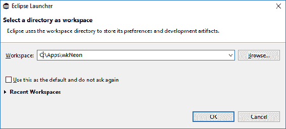

当您点击确定时，Eclipse IDE 应该会打开。Eclipse Neon 将自动为您获取我们开发所需的两个重要插件：

+   **Git 客户端**：这将允许我们连接到 Git 源代码控制存储库。本书假设您使用 Git，因为它很受欢迎并且功能强大，但在企业中还有许多旧的选项，如 Subversion 和 Perforce。如果您使用其他选项，请按照您的项目团队或团队 wiki 中给出的开发人员设置说明下载相应的插件。如果这些说明不存在，请要求为新团队成员建立一个。

+   **Maven 支持**：Maven 和 Gradle 都是很好的项目管理和配置工具。它们有助于诸如获取依赖项、编译、构建等任务。我们选择 Maven 是因为它在企业中的成熟度。

如果你第一次接触这两个工具，请通过阅读它们各自的网站来熟悉它们。

# 建立互联网连接

如果您在企业中工作并且必须通过代理访问互联网，根据您的企业政策限制您的操作，这可能会很麻烦。

对于我们的开发目的，我们需要以下互联网连接：

+   下载依赖库，如 Log4j 和 Spring，这些库被配置为 Maven 存储库的一部分。这是一次性活动，因为一旦下载，这些库就成为本地 Maven 存储库的一部分。如果您的组织有一个存储库，您需要进行配置。

+   随着我们样例应用的发展，从市场中获取 Eclipse 插件。

+   您的程序调用了公共云中的服务或 API。

对于编写我们的第一个服务，只有第一个点很重要。请获取您的代理详细信息，并在主菜单的 Maven 设置中进行配置，路径为 Windows | Preferences。

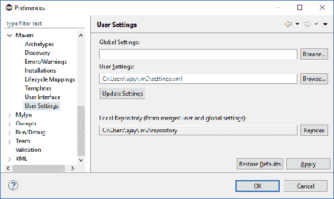

对`settings.xml`文件进行更改，添加代理部分：

```java
<proxies> 
   <proxy>
      <id>myproxy</id>
      <active>true</active> 
      <protocol>http</protocol> 
      <host>proxy.yourorg.com</host> 
      <port>8080</port> 
      <username>mahajan</username> 
      <password>****</password> 
      <nonProxyHosts>localhost,127.0.0.1</nonProxyHosts> 
    </proxy> 
    <proxy> 
      <id>myproxy1</id> 
      <active>true</active> 
      <protocol>https</protocol> 
      <host> proxy.yourorg.com</host> 
      <port>8080</port> 
      <username>mahajan</username> 
      <password>****</password> 
      <nonProxyHosts>localhost,127.0.0.1</nonProxyHosts> 
    </proxy> 
```

保存文件并重新启动 Eclipse。当我们创建一个项目时，我们将知道它是否起作用。

# 了解开发生命周期

专业软件编写经历各种阶段。在接下来的章节中，我们将讨论在开发应用程序时将遵循的各个阶段。

# 需求/用户故事

在开始任何编码或设计之前，了解要解决的问题陈述是很重要的。敏捷开发方法建议将整个项目分解为模块和服务，然后逐步实现一些功能作为用户故事。其思想是获得一个**最小可行产品**（MVP），然后不断添加功能。

我们要解决的问题是电子商务领域。由于在线购物，我们大多数人都熟悉电子商务作为消费者。现在是时候来看看它的内部运作了。

起点是一个`product`服务，它执行以下操作：

+   根据产品 ID 返回产品的详细信息

+   获取给定产品类别的产品 ID 列表

# 架构

本书的后面有专门的章节来讨论这个问题。简而言之，一旦需求确定，架构就是关于做出关键决策并创建需求实现蓝图的过程，而设计则是关于合同和机制来实现这些决策。对于云原生开发，我们决定实施微服务架构。

微服务架构范式建议使用包含功能单元的较小部署单元。因此，我们的`product`服务将运行自己的进程并拥有自己的运行时。这使得更容易打包整个运行时，并将其从开发环境带到测试环境，然后再到生产环境，并保持一致的行为。每个`product`服务将在服务注册表中注册自己，以便其他服务可以发现它。我们将在后面讨论技术选择。

# 设计

设计深入探讨了服务的接口和实现决策。`product`服务将具有一个简单的接口，接受产品 ID 并返回一个 Java 对象。如果在存储库中找不到产品，可以决定返回异常或空产品。访问被记录下来，记录了服务被访问的次数和所花费的时间。这些都是设计决策。

我们将在后面的章节中详细讨论特定于云开发的架构和设计原则。

# 测试和开发

在任何现代企业软件开发中，测试都不是事后或开发后的活动。它是通过诸如**测试驱动开发**（**TDD**）和**行为驱动开发**（**BDD**）等概念与开发同时进行或在开发之前进行的。首先编写测试用例，最初失败。然后编写足够的代码来通过测试用例。这个概念对于产品未来迭代中的回归测试非常重要，并与后面讨论的**持续集成**（**CI**）和**持续交付**（**CD**）概念完美融合。

# 构建和部署

构建和部署是从源代码创建部署单元并将其放入目标运行时环境的步骤。开发人员在 IDE 中执行大部分步骤。然而，根据 CI 原则，集成服务器进行编译、自动化测试用例执行、构建部署单元，并将其部署到目标运行时环境。

在云环境中，可部署单元部署在虚拟环境中，如**虚拟机**（**VM**）或容器中。作为部署的一部分，将必要的运行时和依赖项包含在构建过程中非常重要。这与将`.war`或`.ear`放入每个环境中运行的应用服务器的传统过程不同。将所有依赖项包含在可部署单元中使其在不同环境中完整和一致。这减少了出现错误的机会，即服务器上的依赖项与开发人员本地机器上的依赖项不匹配。

# 选择框架

在了解了基础知识之后，让我们编写我们的`product`服务。在 IDE 设置之后，下一步是选择一个框架来编写服务。微服务架构提出了一些有趣的设计考虑，这将帮助我们选择框架：

+   **轻量级运行时**：服务应该体积小，部署快速

+   **高弹性**：应该支持诸如断路器和超时等模式

+   **可测量和可监控**：应该捕获指标并公开钩子供监控代理使用

+   **高效**：应该避免阻塞资源，在负载增加的情况下实现高可伸缩性和弹性

可以在以下网址找到一个很好的比较：[`cdelmas.github.io/2015/11/01/A-comparison-of-Microservices-Frameworks.html`](https://cdelmas.github.io/2015/11/01/A-comparison-of-Microservices-Frameworks.html)。在 Java 领域，有三个框架正在变得流行，符合前述要求：Dropwizard，Vert.x 和 Spring Boot。

# Dropwizard

Dropwizard 是最早推广 fat JAR 概念的框架之一，通过将容器运行时与所有依赖项和库一起放入部署单元，而不是将部署单元放入容器。它整合了 Jetty 用于 HTTP，Jackson 用于 JSON，Jersey 用于 REST 和 Metrics 等库，创建了一个完美的组合来构建 RESTful web 服务。它是早期用于微服务开发的框架之一。

它的选择，如 JDBI，Freemarker 和 Moustache，可能对一些希望在实现选择上灵活的组织来说有所限制。

# Vert.x

Vert.x 是一个出色的框架，用于构建不会阻塞资源（线程）的反应式应用程序，因此非常可伸缩和弹性，因此具有弹性。它是一个相对较新的框架（在 3.0 版本中进行了重大升级）。

然而，它的响应式编程模型在行业中并不十分流行，因此它只是在获得采用，特别是对于需要非常高的弹性和可伸缩性的用例。

# Spring Boot

Spring Boot 正在迅速成为构建云原生微服务的 Java 框架中最受欢迎的。以下是一些很好的理由：

+   它建立在 Spring 和 Spring MVC 的基础上，这在企业中已经很受欢迎

+   与 Dropwizard 一样，它汇集了最合理的默认值，并采用了一种偏向的方法来组装所需的服务依赖项，减少了配置所需的 XML

+   它可以直接集成 Spring Cloud，提供诸如 Hystrix 和 Ribbon 之类的有用库，用于云部署所需的分布式服务开发

+   它的学习曲线较低；您可以在几分钟内开始（接下来我们将看到）

+   它有 40 多个起始 Maven **项目对象模型（POMs）**的概念，为选择和开发应用程序提供了很好的灵活性

Spring Boot 适用于适合云原生部署的各种工作负载，因此对于大多数用例来说是一个很好的首选。

现在让我们开始编写一个 Spring Boot 服务。

# 编写产品服务

为了简单起见，我们的`product`服务有两个功能：

+   `List<int> getProducts(int categoryId)`

+   `Product getProduct(int prodId)`

这两种方法的意图非常明确。第一个返回给定类别 ID 的产品 ID 列表，第二个返回给定产品 ID 的产品详细信息（作为对象）。

# 服务注册和发现

服务注册和发现为什么重要？到目前为止，我们一直通过其 URL 调用服务，其中包括 IP 地址，例如`http://localhost:8080/prod`，因此我们期望服务在该地址运行。即使我们可能替换测试和生产 URL，调用特定 IP 地址和端口的服务步骤仍然是静态的。

然而，在云环境中，事情变化很快。如果服务在给定的 IP 上停机，它可以在不同的 IP 地址上启动，因为它在某个容器上启动。虽然我们可以通过虚拟 IP 和反向代理来缓解这一问题，但最好在服务调用时动态查找服务，然后在 IP 地址上调用服务。查找地址可以在客户端中缓存，因此不需要为每个服务调用执行动态查找。

在这种情况下，注册表（称为服务注册表）很有帮助。当服务启动时，它会在注册表中注册自己。注册表和服务之间也有心跳，以确保注册表中只保留活动的服务。如果心跳停止，注册表将注销该服务实例。

对于这个快速入门，我们将使用 Spring Cloud Netflix，它与 Spring Boot 很好地集成。现在我们需要三个组件：

+   **产品服务**：我们已经编写了这个

+   **服务注册表**：我们将使用 Eureka，它是 Spring Cloud 的一部分

+   **服务客户端**：我们将编写一个简单的客户端来调用我们的服务，而不是直接通过浏览器调用

# 创建一个 Maven 项目

打开您的 IDE（Eclipse Neon 或其他），然后按以下步骤创建一个新的 Maven 项目：

1.  在 Package Explorer 上右键单击，然后选择 New 和 Project...，如下截图所示：

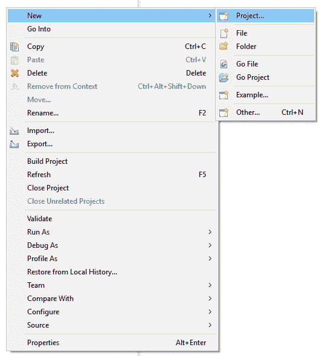

1.  选择 Maven 项目：

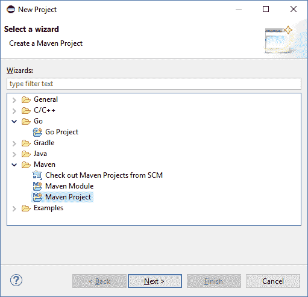

1.  在向导的下一个窗口中，选择创建一个简单的项目。

1.  下一个对话框将要求输入许多参数。其中，Group Id（你的项目名称）和 Artifact Id（应用程序或服务名称）很重要。选择合理的名称，如下面的截图所示：


1.  选择完成。你应该看到以下结构：

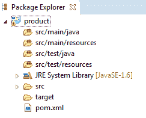

如果 JRE System Library [JavaSE-1.6]不存在，或者你有一个更新的版本，去项目属性中编辑它，选择你的 Eclipse 配置的版本。你可以通过右键单击 JRE System Library [JavaSE-1.6]来改变属性。这是调整 JRE System Library 到 1.8 后的截图。

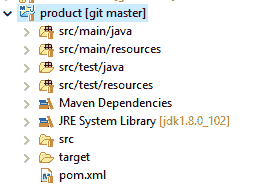

1.  现在，你有一个干净的板面。打开 Maven 文件`pom.xml`，并添加一个依赖项`spring-boot-starter-web`。这将告诉 Spring Boot 配置这个项目以获取 web 开发的库：

```java
<project xmlns.... 
  <modelVersion>4.0.0</modelVersion> 
  <parent> 
    <groupId>org.springframework.boot</groupId> 
    <artifactId>spring-boot-starter-parent</artifactId> 
    <version>1.4.3.RELEASE</version> 
  </parent> 
  <groupId>com.mycompany.petstore</groupId> 
  <artifactId>product</artifactId> 
  <version>0.0.1-SNAPSHOT</version>    
<dependencies> 
    <dependency> 
        <groupId>org.springframework.boot</groupId> 
        <artifactId>spring-boot-starter-web</artifactId> 
    </dependency> 
</dependencies> 
</project> 
```

保存这个 POM 文件时，你的 IDE 将构建工作区并下载依赖的库，假设你的互联网连接正常（直接或通过之前配置的代理），你已经准备好开发服务了。

# 编写一个 Spring Boot 应用程序类

这个类包含了执行开始的主方法。这个主方法将引导 Spring Boot 应用程序，查看配置，并启动相应的捆绑容器，比如 Tomcat，如果执行 web 服务：

```java
package com.mycompany.product;

import org.springframework.boot.SpringApplication;
import org.springframework.boot.autoconfigure.EnableAutoConfiguration;

@SpringBootApplication
public class ProductSpringApp {
  publicstaticvoid main(String[] args) throws Exception {
    SpringApplication.run(ProductSpringApp.class, args);
    }
  } 
```

注意注解`@SpringBootApplication`。

`@SpringBootApplication`注解等同于使用`@Configuration`，`@EnableAutoConfiguration`和`@ComponentScan`，它们分别执行以下操作：

+   `@Configuration`：这是一个核心的 Spring 注解。它告诉 Spring 这个类是`Bean`定义的来源。

+   `@EnableAutoConfiguration`：这个注解告诉 Spring Boot 根据你添加的 JAR 依赖来猜测你想要如何配置 Spring。我们添加了 starter web，因此应用程序将被视为 Spring MVC web 应用程序。

+   `@ComponentScan`：这个注解告诉 Spring 扫描任何组件，例如我们将要编写的`RestController`。注意扫描发生在当前和子包中。因此，拥有这个组件扫描的类应该在包层次结构的顶部。

# 编写服务和领域对象

Spring Boot 中的注解使得提取参数和路径变量并执行服务变得容易。现在，让我们模拟响应，而不是从数据库中获取数据。

创建一个简单的 Java 实体，称为`Product`类。目前，它是一个简单的**POJO**类，有三个字段：

```java
publicclass Product {
  privateint id = 1 ;
  private String name = "Oranges " ;
  privateint catId = 2 ;
```

添加获取器和设置器方法以及接受产品 ID 的构造函数：

```java
  public Product(int id) {
    this.id = id;
    }
```

另外，添加一个空的构造函数，将在后面由服务客户端使用：

```java
  public Product() {
   } 
```

然后，编写`ProductService`类如下：

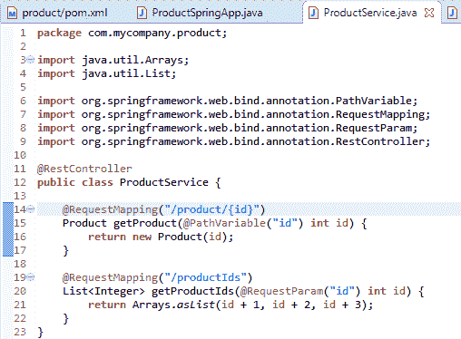

# 运行服务

有许多方法可以运行服务。

右键单击项目，选择 Run As | Maven build，并配置 Run Configurations 来执行`spring-boot:run`目标如下：


点击运行，如果互联网连接和配置正常，你将看到以下控制台输出：

```java
[INFO] Building product 0.0.1-SNAPSHOT 
... 
[INFO] Changes detected - recompiling the module! 
[INFO] Compiling 3 source files to C:Appswkneonproducttargetclasses 
... 
 :: Spring Boot ::        (v1.4.3.RELEASE) 

2016-10-28 13:41:16.714  INFO 2532 --- [           main] com.mycompany.product.ProductSpringApp   : Starting ProductSpringApp on L-156025577 with PID 2532 (C:Appswkneonproducttargetclasses started by MAHAJAN in C:Appswkneonproduct) 
... 
2016-10-28 13:41:19.892  INFO 2532 --- [           main] s.b.c.e.t.TomcatEmbeddedServletContainer : Tomcat initialized with port(s): 8080 (http) 
... 
2016-10-28 13:41:21.201  INFO 2532 --- [           main] s.w.s.m.m.a.RequestMappingHandlerMapping : Mapped "{[/product/{id}]}" onto com.mycompany.product.Product com.mycompany.product.ProductService.getProduct(int) 
2016-10-28 13:41:21.202  INFO 2532 --- [           main] s.w.s.m.m.a.RequestMappingHandlerMapping : Mapped "{[/productIds]}" onto java.util.List<java.lang.Integer> com.mycompany.product.ProductService.getProductIds(int) 
... 
... 
2016-10-28 13:41:21.915  INFO 2532 --- [           main] s.b.c.e.t.TomcatEmbeddedServletContainer : Tomcat started on port(s): 8080 (http) 
2016-10-28 13:41:21.922  INFO 2532 --- [           main] com.mycompany.product.ProductSpringApp   : Started ProductSpringApp in 6.203 seconds (JVM running for 14.199) 
```

注意 Maven 执行的阶段：

1.  首先，Maven 任务编译所有的 Java 文件。目前我们有三个简单的 Java 类。

1.  下一步将其作为一个应用程序运行，其中一个 Tomcat 实例启动。

1.  注意将 URL `/product/`和`/productIds`映射到`Bean`方法。

1.  Tomcat 监听端口`8080`以接收服务请求。

你也可以通过在 Package Explorer 中右键单击具有主方法的类（`ProductSpringApp`）然后选择 Run As | Java Application 来运行服务。

# 在浏览器上测试服务

打开浏览器，访问以下 URL：`http://localhost:8080/product/1`。

你应该得到以下响应：

```java
{"id":1,"name":"Oranges ","catId":2}
```

现在，尝试另一个服务（URL—`http://localhost:8080/productIds`）。你得到什么响应？一个错误，如下所示：

```java
    There was an unexpected error (type=Bad Request, status=400).
    Required int parameter 'id' is not present
```

你能猜到为什么吗？这是因为你写的服务定义有一个期望请求参数的方法：

```java
@RequestMapping("/productIds")
List<Integer> getProductIds(@RequestParam("id") int id) {
```

因此，URL 需要一个`id`，由于你没有提供它，所以会出错。

给出参数，再次尝试  `http://localhost:8080/productIds?id=5`。

现在你会得到一个正确的响应：

```java
[6,7,8]
```

# 创建可部署文件

我们不打算在 Eclipse 上运行我们的服务。我们想要在服务器上部署它。有两种选择：

+   创建一个 WAR 文件，并将其部署到 Tomcat 或任何其他 Web 容器中。这是传统的方法。

+   创建一个包含运行时（Tomcat）的 JAR，这样你只需要 Java 来执行服务。

在云应用程序开发中，第二个选项，也称为 fat JAR 或 uber JAR，因以下原因而变得流行：

+   可部署文件是自包含的，具有其所需的所有依赖项。这减少了环境不匹配的可能性，因为可部署单元被部署到开发、测试、UAT 和生产环境。如果在开发中工作，它很可能会在所有其他环境中工作。

+   部署服务的主机、服务器或容器不需要预安装应用服务器或 servlet 引擎。只需一个基本的 JRE 就足够了。

让我们看看创建 JAR 文件并运行它的步骤。

包括 POM 文件的以下依赖项：

```java
<build><plugins><plugin> 
            <groupId>org.springframework.boot</groupId> 
            <artifactId>spring-boot-maven-plugin</artifactId> 
</plugin></plugins></build> 
```

现在，通过在资源管理器中右键单击项目并选择 Run As | Maven Install 来运行它。

你将在项目文件夹结构的目标目录中看到`product-0.0.1-SNAPSHOT.jar`。

导航到`product`文件夹，以便在命令行中看到目标目录，然后通过 Java 命令运行 JAR，如下面的屏幕截图所示：


你将看到 Tomcat 在启动结束时监听端口。再次通过浏览器测试。里程碑达成。

# 启用云原生行为

我们刚刚开发了一个基本的服务，有两个 API 响应请求。让我们添加一些功能，使其成为一个良好的云服务。我们将讨论以下内容：

+   外部化配置

+   仪器化—健康和指标

+   服务注册和发现

# 外部化配置

配置可以是在环境或生产部署之间可能不同的任何属性。典型的例子是队列和主题名称、端口、URL、连接和池属性等。

可部署文件不应该包含配置。配置应该从外部注入。这使得可部署单元在生命周期的各个阶段（如开发、QA 和 UAT）中是不可变的。

假设我们必须在不同的环境中运行我们的`product`服务，其中 URL 区分环境。因此，我们在请求映射中做的小改变如下：

```java
@RequestMapping("/${env}product/{id}")
Product getProduct(@PathVariable("id") int id) {
```

我们可以以各种方式注入这个变量。一旦注入，该值在部署的生命周期内不应该改变。最简单的方法是通过命令行参数传递。打开运行配置对话框，在参数中添加命令行参数`-env=dev/`，如下所示：

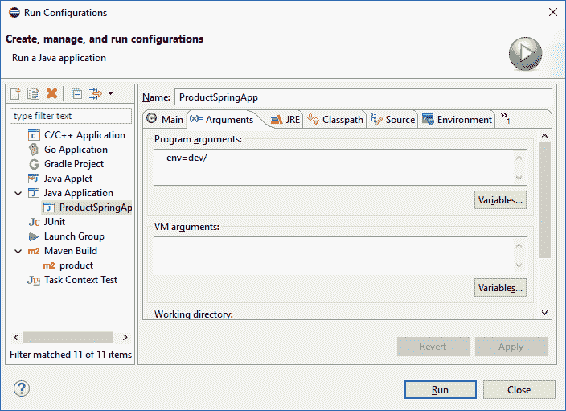

现在，运行配置。在启动过程中，你会发现值被替换在日志声明中，如下所示：

```java
... Mapped "{[/dev/product/{id}]}" onto com.mycompany.product.Product com.mycompany.product.ProductService.getProduct(int) 
```

配置也可以通过配置文件、数据库、操作系统环境属性等提供。

Spring 应用程序通常使用`application.properties`来存储一些属性，如端口号。最近，YAML，它是 JSON 的超集，由于属性的分层定义，变得更加流行。

在应用程序的`/product/src/main/resources`文件夹中创建一个`application.yml`文件，并输入以下内容：

```java
server: 
  port: 8081 
```

这告诉`product`服务在端口`8081`上运行，而不是默认的`8080`。这个概念进一步扩展到配置文件。因此，可以通过加载特定于配置文件的配置来加载不同的配置文件。

Spring Cloud Config 作为一个项目很好地处理了这个问题。它使用`bootstrap.yml`文件来启动应用程序，并加载配置的名称和详细信息。因此，`bootstrap.yml`包含应用程序名称和配置服务器详细信息，然后加载相应的配置文件。

在应用程序的`resources`文件夹中创建一个`bootstrap.yml`文件，并输入以下内容：

```java
spring: 
  application: 
    name: product 
```

当我们讨论服务注册时，我们将回到这些文件。

# 计量您的服务

仪器化对于云应用程序非常重要。您的服务应该公开健康检查和指标，以便更好地进行监控。Spring Boot 通过`actuator`模块更容易进行仪器化。

在 POM 中包含以下内容：

```java
    <dependency> 
        <groupId>org.springframework.boot</groupId> 
        <artifactId>spring-boot-starter-actuator</artifactId> 
    </dependency> 
```

运行服务。在启动过程中，您将看到创建了许多映射。

您可以直接访问这些 URL（例如`http://localhost:8080/env`）并查看显示的信息：

```java
{ 
  "profiles": [], 
  "server.ports": { 
    "local.server.port": 8082 
  }, 
  "commandLineArgs": { 
    "env": "dev/" 
  }, 
  "servletContextInitParams": {}, 
  "systemProperties": { 
    "java.runtime.name": "Java(TM) SE Runtime Environment", 
    "sun.boot.library.path": "C:\Program Files\Java\jdk1.8.0_73\jrebin", 
    "java.vm.version": "25.73-b02", 
    "java.vm.vendor": "Oracle Corporation", 
    "java.vendor.url": "http://java.oracle.com/", 
    "path.separator": ";", 
    "java.vm.name": "Java HotSpot(TM) 64-Bit Server VM", 
    "file.encoding.pkg": "sun.io", 
    "user.country": "IN", 
    "user.script": "", 
    "sun.java.launcher": "SUN_STANDARD", 
    "sun.os.patch.level": "Service Pack 1", 
    "PID": "9332", 
    "java.vm.specification.name": "Java Virtual Machine Specification", 
    "user.dir": "C:\Apps\wkneon\product", 
```

指标尤其有趣（`http://localhost:8080/metrics`）：

```java
{ 
  "mem": 353416, 
  "mem.free": 216921, 
  "processors": 4, 
  "instance.uptime": 624968, 
  "uptime": 642521, 
... 
  "gauge.servo.response.dev.product.id": 5, 
... 
   threads.peak": 38, 
  "threads.daemon": 35, 
  "threads.totalStarted": 45, 
  "threads": 37, 
... 
```

信息包括计数器和量规，用于存储服务被访问的次数和响应时间。

# 运行服务注册表

Consul 和 Eureka 是两个流行的动态服务注册表。它们在心跳方法和基于代理的操作方面存在微妙的概念差异，但注册表的基本概念是相似的。注册表的选择将受企业的需求和决策的驱动。对于我们的示例，让我们继续使用 Spring Boot 和 Spring Cloud 生态系统，并为此示例使用 Eureka。Spring Cloud 包括 Spring Cloud Netflix，它支持 Eureka 注册表。

执行以下步骤以运行服务注册表：

1.  创建一个新的 Maven 项目，`artifactId`为`eureka-server`。

1.  编辑 POM 文件并添加以下内容：

+   父级为`spring-boot-starter-parent`

+   依赖于`eureka-server`为`spring-cloud-starter-eureka-server`

+   `dependencyManagement`为`spring-cloud-netflix`：

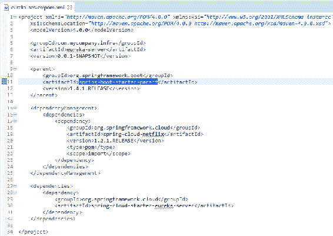

1.  创建一个类似于我们为`product`项目创建的应用程序类。注意注解。注解`@EnableEurekaServer`将 Eureka 作为服务启动：

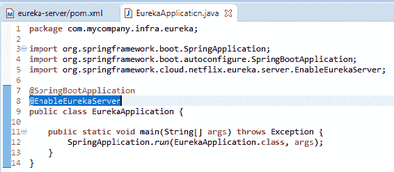

1.  在应用程序的`/product/src/main/resources`文件夹中创建一个`application.yml`文件，并输入以下内容：

```java
server: 
  port: 8761 
```

1.  在应用程序的`resources`文件夹中创建一个`bootstrap.yml`文件，并输入以下内容：

```java
spring: 
  application: 
    name: eureka 
```

1.  构建`eureka-server` Maven 项目（就像我们为`product`做的那样），然后运行它。

1.  除了一些连接错误（稍后会详细介绍），您应该看到以下 Tomcat 启动消息：


启动完成后，访问`localhost:8761`上的 Eureka 服务器，并检查是否出现以下页面：

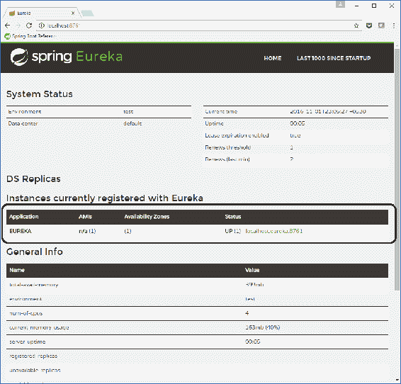

查看前面截图中的圈定部分。当前注册到 Eureka 的实例是`EUREKA`本身。我们可以稍后更正这一点。现在，让我们专注于将我们的`product`服务注册到这个 Eureka 服务注册表。

# 注册产品服务

`product`服务启动并监听端口`8081`以接收`product`服务请求。现在，我们将添加必要的指示，以便服务实例将自身注册到 Eureka 注册表中。由于 Spring Boot，我们只需要进行一些配置和注解：

1.  在`product`服务 POM 中添加`dependencyManagement`部分，依赖于`spring-cloud-netflix`和现有依赖项部分中的`spring-cloud-starter-eureka`如下所示：

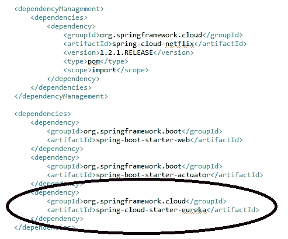

1.  `product`服务会在特定间隔内不断更新其租约。通过在`application.yml`中明确定义一个条目，将其减少到 5 秒：

```java
server: 
  port: 8081 

eureka: 
  instance: 
    leaseRenewalIntervalInSeconds: 5
```

1.  在`product`项目的启动应用程序类中包含`@EnableDiscoveryClient`注解，换句话说，`ProductSpringApp`。`@EnableDiscoveryClient`注解激活 Netflix Eureka `DiscoveryClient`实现，因为这是我们在 POM 文件中定义的。还有其他实现适用于其他服务注册表，如 HashiCorp Consul 或 Apache Zookeeper：

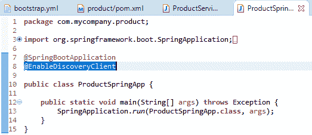

1.  现在，像以前一样启动`product`服务：


在`product`服务初始化结束时，您将看到注册服务到 Eureka 服务器的日志声明。

要检查`product`服务是否已注册，请刷新您刚访问的 Eureka 服务器页面：

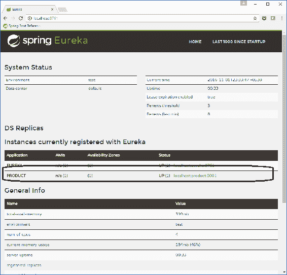

还要留意 Eureka 日志。您会发现`product`服务的租约续订日志声明。

# 创建产品客户端

我们已经创建了一个动态产品注册表，甚至注册了我们的服务。现在，让我们使用这个查找来访问`product`服务。

我们将使用 Netflix Ribbon 项目，该项目提供了负载均衡器以及从服务注册表中查找地址的功能。Spring Cloud 使配置和使用这一切变得更加容易。

现在，让我们在与服务本身相同的项目中运行客户端。客户端将在 Eureka 中查找产品定义后，向服务发出 HTTP 调用。所有这些都将由 Ribbon 库完成，我们只需将其用作端点：

1.  在`product`项目的 Maven POM 中添加依赖如下：

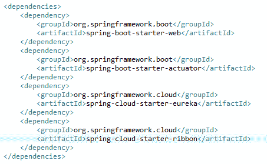

1.  创建一个`ProductClient`类，它简单地监听`/client`，然后在进行查找后将请求转发到实际的`product`服务：

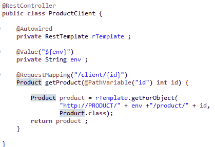

URL 构造`http://PRODUCT/`将在运行时由 Ribbon 进行翻译。我们没有提供服务的 IP 地址。

1.  `restTemplate`通过自动装配在这里注入。但是，在最新的 Spring 版本中需要初始化它。因此，在主应用程序类中声明如下，这也充当配置类：


`@LoadBalanced`注解告诉 Spring 使用 Ribbon 负载均衡器（因为 Ribbon 在类路径中由 Maven 提供）。

# 查看查找的实际操作

现在，我们已经准备好运行产品客户端了。简而言之，在这个阶段，我们有一个 Eureka 服务器项目和一个具有以下结构的`product`项目：

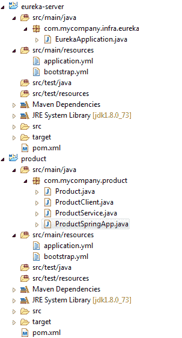

让我们花几分钟时间来回顾一下我们做了什么：

1.  我们创建了一个 Maven 项目并定义了启动器和依赖项。

1.  我们为引导和应用程序属性创建了 YML 文件。

1.  我们创建了包含主方法的`ProductSpringApp`类，这是应用程序的起点。

1.  对于`product`项目，我们有以下类：

+   `Product`：我们稍后将增强的领域或实体

+   `ProductService`：负责实现服务和 API 的微服务

+   `ProductClient`：用于测试服务查找的客户端

现在，让我们看看它的实际操作：

1.  运行`EurekaApplication`类（或在`eureka-server`项目上运行 Maven 构建）。观察日志中的最后几行：

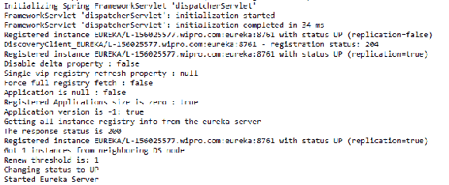

1.  运行`ProductSpringApp`类（或在`product`项目上运行 Maven 构建）。注意日志中的最后几行：


1.  直接访问`product`服务：`http://localhost:8081/dev/product/4`。

您将看到以下响应：

```java
{"id":4,"name":"Oranges ","catId":2}
```

1.  现在，访问客户端 URL，`http://localhost:8081/client/4`，它会从服务注册表中查找`product`服务并将其指向相应的`product`服务。

您将看到以下响应：

```java
 {"id":4,"name":"Oranges ","catId":2}
```

您可能会看到内部服务器错误（`PRODUCT`没有可用实例）。这可能发生在心跳完成并且地址被 Ribbon 负载均衡器重新选择时。等待几秒钟，直到注册表更新，然后再试一次。

在获取此响应的过程中发生了很多事情：

1.  处理`/client/4`的 HTTP 请求是由`ProductClient`类中的`getProduct`方法处理的。

1.  它从 Eureka 注册表中查找了该服务。这就是我们找到的日志语句如下：

```java
c.n.l.DynamicServerListLoadBalancer: Using serverListUpdater PollinServerListUpdater
c.netflix.config.ChainedDynamicProperty: Flipping property: PRODUCT.ribbon.ActiveConnectionsLimit to use NEXT property: niws.loadbalancer
c.n.l.DynamicServerListLoadBalancer: DynamicServerListLoadBalancer for client PRODUCT intiated: DynamicServerListLoadBalancer:
```

1.  在进行查找后，它通过 Ribbon 负载均衡器库将请求转发到实际的`ProductService`。

这只是一个客户端通过动态查找调用服务的简单机制。在后面的章节中，我们将添加功能，使其在从数据库获取数据方面具有弹性和功能性。

# 摘要

让我们回顾一下到目前为止我们讨论过的云应用程序的关键概念。通过在 servlet 引擎上运行并在不到 15 秒内启动，我们使我们的应用程序变得**轻量级**。我们的应用程序是**自包含**的，因为 fat JAR 包含了运行我们的服务所需的所有库。我们只需要一个 JVM 来运行这个 JAR 文件。它通过从命令行注入环境和从`application.yml`和`bootstrap.yml`中注入属性，实现了**外部化配置**（在某种程度上）。我们将在第七章 *Cloud-Native Application Runtime*中更深入地研究外部化的下一阶段。Spring 执行器帮助捕获所有指标，并使它们的 URL 可供使用，从而实现了**仪表化**。**位置抽象**是由 Eureka 实现的。

在接下来的章节中，我们将通过向其添加数据层和弹性，以及添加缓存行为和其他我们在本章中跳过的增强功能，来增强此服务。
