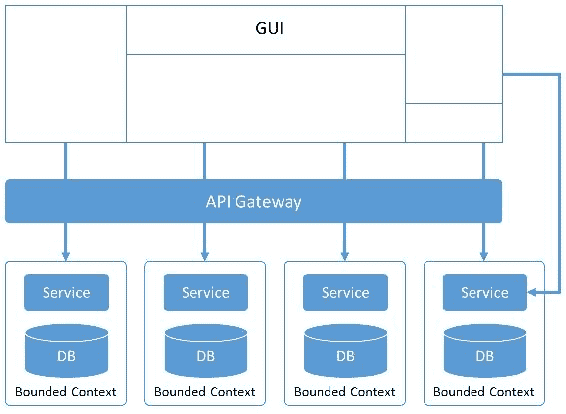
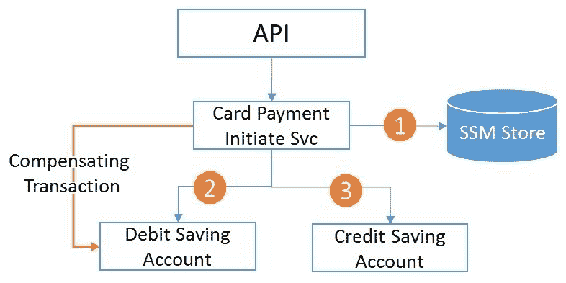
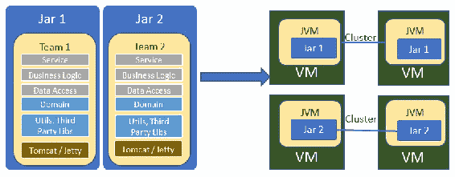
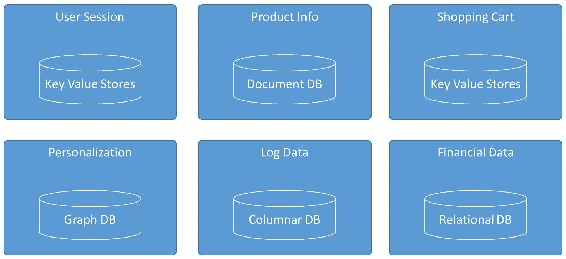

# 设计您的云原生应用程序

在本章中，我们暂停应用程序开发，退一步看设计云应用的整体情况。正如在第一章中所看到的，云中的应用比我们迄今为止开发的传统企业应用有更多独特的挑战。此外，敏捷的业务需求必须在不牺牲性能、稳定性和弹性的情况下得到满足。因此，看待第一原则变得重要。

在第一章中，我们看到了云环境和传统企业之间的差异，以及 DevOps、12 因素应用程序、微服务和生态系统的概念是如何重要的。在这里，我们将看一下各种原则和技术，使我们能够设计健壮、可扩展和敏捷的应用程序。

我们将涵盖的一些领域包括使用 REST、HTTP 和 JSON 构建 API 的主导地位，API 网关的作用，如何解耦应用程序，如何识别微服务，各种微服务设计指南，数据架构的作用，以及在设计 API 时安全性的作用。

我们将在本章中涵盖以下主题：

+   REST、HTTP 和 JSON 的流行

+   API 的兴起和流行

+   API 网关的角色

+   解耦-需要更小的应用边界

+   微服务识别

+   微服务设计指南

+   微服务模式

+   数据架构

+   安全角色

# 三者-REST、HTTP 和 JSON

网络使得 HTTP 变得非常流行，并成为访问互联网内容的事实集成机制。有趣的是，这项技术在依赖本地和二进制协议（如 RMI 和 CORBA）进行应用程序访问的应用程序中并不是非常流行。

当社交消费公司（如 Google、Amazon、Facebook 和 Twitter）开始发布 API 以连接/集成其产品时，跨网络的集成的事实标准变成了 HTTP/REST。社交消费公司开始投资于平台，以吸引开发人员开发各种应用程序，从而导致依赖 HTTP 作为协议的应用程序的大量增加。

浏览器端的应用程序是 HTML 和 JavaScript 的混合。从服务器返回的信息或其他应用程序需要以简单和可用的格式。 JavaScript 支持数据操作，最适合的数据格式是**JavaScript 对象表示**（**JSON**）。

REST 是一种状态表示风格，提供了一种处理 HTTP 交换的方式。 REST 有很多优势：

+   利用 HTTP 协议标准，为 WWW 上的任何事物提供了巨大的优势

+   隔离对实体的访问（`GET`/`PUT`/`POST`/`DELETE`）的机制，同时利用相同的 HTTP 请求模型

+   支持 JSON 作为数据格式

REST 与 JSON 已经成为主导模型，超过了 SOAP/XML 模型。根据可编程 Web 的统计数据：

73%的可编程 Web API 使用 REST。 SOAP 远远落后，但在 17%的 API 中仍有所体现。

让我们来看一些 REST/JSON 模型受欢迎的高级原因：

+   SOAP 的契约优先方法使得制作 Web 服务变得困难。

+   与 REST 相比，SOAP 更复杂，学习曲线更陡。

+   与 SOAP 相比，REST 更轻量级，不会像 SOAP 那样占用带宽。

+   在 Java 世界之外，对 SOAP 的支持有限，主要将 SOAP 局限于企业世界。

+   客户端上的 XML 解析需要大量内存和计算资源，这不适合移动世界。

+   XML 模式/标记提供了结构定义和验证模型，但需要额外的解析。 JSON 具有松散的语法，允许对数据模型进行快速迭代。

今天，现实是 REST/JSON 已经成为跨编程语言集成的标准，为通过互联网集成 API 提供了一种简单易行的方式。

# API 的兴起和流行

**应用程序编程接口**（**API**）提供了一个标准的接口或契约，以通过互联网消费其服务。API 定义了输入和输出的结构，并在 API 版本的整个生命周期内保持不变。

API 是客户端层和企业之间的契约。它们是面向消费者的，即由客户端设计，并且将服务实现细节从客户端抽象出来。

回到社交消费者公司的出现，创建新的应用程序并不意味着从头开始。例如，如果我的应用程序需要使用地理地图，我可以利用 Google 地图 API 并在此基础上构建我的应用程序。同样，我可以利用 OAuth 而不是构建自己的身份验证模型，并使用 Google、Facebook 或 Twitter 作为一些 OAuth 提供者。

将一个可重复但通常复杂的功能作为可重用服务提供的整个模型，导致开发人员开始使用这些现有的 API 构建应用程序，从而提高了开发人员的生产力，并推动了现代应用程序或移动应用程序经济的发展。

公司开始寻求是否可以将 API 商品化，这意味着多家公司正在编写/发布提供类似功能的 API。这导致了 API 的民主化，使任何人都可以访问功能/函数。

API 的整个民主化意味着，突然之间，每个流程或功能都可以作为一组 API 来提供，可以编排或编排以构建新的功能。以前需要几个月甚至几年的时间，现在只需要几周甚至几天。所有这些生产力意味着更短的开发周期，允许快速迭代提供新的创新功能。

今天，各种类型的 API 都可以使用：从 Facebook、Google 和 Twitter 等社交公司到 Salesforce、NetSuite 和 PaaS/IaaS 提供商，如 AWS、Azure、**Google Cloud Engine**（**GCE**）等，它们都提供从提供虚拟机到数据库实例，再到 Watson、AWS AI 和 Azure ML 等 AI 提供商的功能。

# API 网关的作用

API 网关是一个单一的接口，它在重定向到内部服务器之前处理所有传入的请求。API 网关通常提供以下功能：

+   将传入流量路由到提供者的数据中心/云中托管的适当服务。提供反向代理模型，限制提供者数据中心/云中托管的各种 API 和服务的暴露。

+   过滤来自各种渠道的所有传入流量——Web、移动等。

+   实施安全机制（如 OAuth）来验证和记录服务的使用情况。

+   提供了对某些服务的流量控制和限制能力。

+   在服务消费者和提供者之间转换数据。

+   提供一个或多个 API，映射到底层的服务提供者。例如，对于不同类型的消费者——移动、Web、付费服务或免费服务，相同的底层服务可以分成多个自定义 API，暴露给不同的消费者，以便消费者只看到它需要的功能：

# API 网关的好处

使用 API 网关提供以下好处：

+   **关注点分离**：在应用程序端将微服务提供者与服务消费者隔离开来。这允许将应用程序层与服务请求客户端分离。

+   面向消费者：API 网关为大量的 API 和微服务提供了一个统一的中心。这使得消费者可以专注于 API 的实用性，而不是寻找服务的托管位置，管理服务请求限制，安全性等。

+   面向 API：根据客户端的类型和所需的协议提供最佳的 API。

+   编排：提供了将多个服务调用编排成一个 API 调用的能力，从而简化了客户端的逻辑。现在，它可以调用一个 API 而不是调用多个服务。较少的请求意味着较少的调用开销，从而提高了消费者的整体体验。API 网关对移动应用程序至关重要。

+   监控：API 网关还提供了监控 API 调用的能力，从而使企业能够评估 API 的成功和使用情况。

除了总体利益外，API 网关为整体拼图增加了更多的部分。这意味着需要管理更多的基础设施、更多的配置、更多的故障点和额外的请求跳转。因此，除非利益超过了缺点，否则需要仔细审查 API 网关的使用，以满足业务需求和利益。

接下来，我们将看到将应用程序功能拆分为一组 API 或微服务的过程。

# 应用程序解耦

传统的应用程序开发模型，将所有功能和功能捆绑在一个称为单体应用程序的大型包中，由于多种原因而变得不太受欢迎。单体应用程序以功能和逻辑的形式承担了太多的责任。正是这一特征使它们具有高耦合和低内聚。单体应用程序中的重用因子往往较低，因为功能的一部分无法与其余的功能和逻辑分离。

当我们开始拆分单体功能或设计新应用程序时，重点需要放在定义服务边界上。定义正确的服务边界及其相关的交互是导致高内聚和低耦合模型的关键。

问题是，应用程序应该根据什么基础被解耦为服务，并定义服务边界？

# 有界上下文/领域驱动设计

作为应用程序设计的一部分，业务领域需要被拆分为更小的子领域或业务能力。我们需要仔细审查业务实体及其属性，以定义服务边界。例如，在客户 ID 实体的情况下，客户的地址可能是客户的一部分。在应用程序的上下文中，地址维护可能是一个单独的活动，可能需要单独处理。同样，个性化可能需要客户偏好或购物习惯。在这种情况下，个性化引擎更感兴趣这一系列属性。

我们应该组合一个包含所有属性的大型客户服务，还是可以根据业务派生的不同视角进行划分？这些不同的视角导致了领域驱动设计中有界上下文的定义。

有界上下文是一种领域驱动设计范式，有助于添加一个接缝并创建服务组。有界上下文在解决方案空间中工作，表明服务相关并属于一个共同的功能域。它是由一个团队根据反向康威定律与一个业务单元一起构建的。有界上下文可以通过以下方式与其他服务/业务能力进行通信：

+   暴露内部 API 或服务

+   在事件总线上发出事件

有界上下文可以拥有自己的数据存储，服务共用，或采用每个服务一个数据存储的范式。

每个有界上下文都有自己的生命周期，并形成一个产品。团队围绕这些有界上下文组织，并全权负责服务的全栈实现。团队是跨职能的，并从开发、测试、用户体验、数据库、部署和项目管理中带来技能。每个产品可能会被拆分成较小的服务集，它们之间异步通信。请记住，重点不是一组功能，而是业务能力。

我们开始围绕业务能力构建我们的服务。服务拥有其业务数据和功能。服务是这些数据的主人，其他服务不能拥有该服务的任何数据。

# 上游/下游服务的分类

另一种拆分应用系统的方法是通过上游和下游数据流模型对其进行分类。系统中的核心实体包括上游服务。这些上游服务会触发事件，下游服务会订阅这些事件以增强其功能。这旨在解耦系统，并有助于提高整体业务敏捷性。这与反应式架构概念相吻合，也被称为事件驱动架构。

让我们以电子商务应用程序为例，其中核心实体是客户和产品。订单服务依赖于核心实体客户和产品的信息。接下来，我们正在构建为客户提供推荐和个性化服务的服务。推荐和个性化服务依赖于核心实体客户、产品和订单的数据。当核心实体发生变化时，变化会被发布。这些变化会被推荐和个性化服务接收，它们会使用额外的属性来提供相关服务。推荐和个性化服务是这些服务的下游服务。

将业务能力分类为上游和下游的模型有助于定义服务之间的依赖关系，并改变上游服务对下游服务的影响。

# 业务事件

随着系统的发展，服务将开始聚集成自然的盟友。这意味着找出服务是否依赖于类似的数据元素或提供重叠/配角功能，并且可能成为同一有界上下文的一部分。

在同一领域内工作的有界上下文服务可能需要依赖于主服务以实现准确的功能。这可能意味着一些主服务数据属性需要提供给相关的有界上下文服务。例如，在我们之前的例子中，我们谈到了客户偏好。现在，这些偏好可能需要映射到客户的位置（地址）。在这种情况下，客户偏好是否需要每次调用客户地址服务来构建偏好，还是可以将相关属性复制到自己的领域中？在不重复数据的情况下，这两个服务开始紧密耦合，导致双向通信模型。为了打破这种紧密耦合，我们允许客户偏好服务使用事件来缓存或复制相关的客户属性。这种异步模型打破了服务之间的时间紧密耦合。每当客户地址发生变化时，服务都会发布一个业务事件进行必要的更改。客户偏好服务会订阅这个变化，以更新其偏好模型。

这种异步模型使我们能够确保：

+   数据所有权仍然清晰。对数据的任何更改都会通知依赖服务。允许依赖服务保存或复制数据，但不更改本地副本，除非更新主副本（黄金源原则）。依赖服务仅存储所需和功能相关的数据子集（需要知道原则）。

+   异步业务事件导致服务之间的低耦合。核心服务的更改会导致事件。事件向下游传递给感兴趣的依赖服务。唯一的依赖是发布的业务事件的格式。

+   下游服务遵循最终一致性原则；所有业务事件都以顺序方式存储，以构建/状态一个较晚的时间（事件源/CQRS）。查询模型可以与记录系统不同。

+   业务事件的异步模型也促进了编排而不是管弦乐，从而导致了松散耦合的系统/服务。

有时，当团队开始一个新产品时，可能无法事先定义界限上下文或服务分解。因此，团队开始构建应用程序作为一个单片应用程序，通过将其功能公开为一组服务。随着团队实施更多的故事，他们可以确定功能的部分，这些功能以快速的速度变化（通常是体验或渠道服务）与变化缓慢的部分（通常是核心服务或实体服务）。

团队可以开始将服务分为两类——体验和系统服务。系统服务可以进一步围绕实体和相互关系进行分组。体验服务映射到客户旅程。团队通常会有冲刺来清理/重构代码，以清除每个周期积累的技术债务。

那么，下一个问题是，什么标识一个服务为微服务？

# 微服务识别

微服务的名称并不一定意味着服务必须体积小。但它具有以下特点：

+   单一责任原则：这是微服务的核心设计原则。它们应该完成一个业务任务单元并完全完成它。如果耦合度低，服务将更容易修改和部署，甚至完全替换。

+   粒度：微服务的粒度包含在单个功能域、单个数据域及其直接依赖、自包含的打包和技术域的交集中。

+   界限：服务应该可以访问其界限上下文中由同一团队管理的资源。但是，它不应直接访问其他模块的资源，如缓存和数据库。如果服务需要访问其他模块，应通过内部 API 或服务层进行。这有助于减少耦合并促进敏捷性。

+   独立：每个微服务都是独立开发、测试和部署的，在其自己的源中。它可以使用第三方或共享库。

# 微服务和服务导向架构（SOA）之间的区别

以下是微服务和服务导向架构（SOA）之间的区别：

+   服务执行整个业务工作单元。例如，如果一个服务需要客户或产品数据，最好将其存储在服务数据存储中。通常，不需要通过 ESB 获取客户记录。

+   服务有自己的私有数据库或仅在其界限上下文中共享的数据库，并且可以存储为服务业务工作单元提供所需的信息。

+   服务是一个智能端点，通常通过 Swagger 或类似的存储库中的合同定义公开 REST 接口。一些被其他部门或客户使用的服务通过 API 平台公开。

# 服务粒度

以下是服务的类型：

+   **原子或系统服务**：这些服务执行单元级别的工作，并且足以通过引用数据库或下游源来服务请求。

+   **复合或过程服务**：这些服务依赖于两个或多个原子服务之间的协调。通常情况下，除非业务案例已经涉及使用现有的原子服务，否则不鼓励使用复合微服务。例如，从储蓄账户进行信用卡支付需要调用两个服务，一个是借记储蓄账户，另一个是贷记信用卡账户。复合微服务还引入了固有的复杂性，例如在分布式场景中难以处理的状态管理和事务。

+   **体验服务**：这些服务与客户旅程相关，并部署在基础架构的边缘。这些服务处理来自移动和 Web 应用程序的请求。这些服务通过使用诸如 API 网关之类的工具，通过反向代理公开。

# 微服务设计指南

整个微服务的概念是关于关注点的分离。这需要在具有不同责任的服务之间进行逻辑和架构上的分离。以下是设计微服务的一些建议。

这些指南符合 Heroku 工程师提出的 12 因素应用程序指南。

+   **轻量级**：微服务必须轻量级，以便实现更小的内存占用和更快的启动时间。这有助于更快的 MTTR，并允许服务部署在更小的运行时实例上，因此在水平方面更好地扩展。与重型运行时（如应用服务器）相比，更适合的是较小的运行时，如 Tomcat、Netty、Node.js 和 Undertow。此外，服务应该使用轻量级文本格式（如 JSON）或二进制格式（如 Avro、Thrift 或 Protocol Buffers）交换数据。

+   **响应式**：这适用于具有高并发负载或稍长的响应时间的服务。典型的服务器实现会阻塞线程以执行命令式编程风格。由于微服务可能依赖于其他微服务或 I/O 资源（如数据库），阻塞线程可能会增加操作系统的开销。响应式风格采用非阻塞 I/O，使用回调处理程序，并对事件做出反应。这不会阻塞线程，因此可以更好地增加微服务的可伸缩性和负载处理特性。例如，数据库驱动程序已开始支持响应式范例，比如 MongoDB 响应式流 Java 驱动程序。

+   **无状态**：无状态服务具有更好的扩展性和更快的启动速度，因为在关闭或启动时不需要在磁盘上存储状态。它们也更具弹性，因为终止服务不会导致数据丢失。无状态也是朝着轻量级的一步。如果需要状态，服务可以将状态存储委托给高速持久（键值）存储，或者将其保存在分布式缓存中。

+   **原子性**：这是微服务的核心设计原则。如果服务足够小并且执行可以独立完成的最小业务单元，那么它们应该易于更改、测试和部署。如果耦合度低，服务将更容易修改和独立部署。可能需要根据需要使用复合微服务，但设计应该受到限制。

+   **外部化配置**：传统上，典型的应用程序属性和配置是作为配置文件进行管理的。鉴于微服务的多个和大规模部署，随着服务规模的增加，这种做法将变得繁琐。因此，最好将配置外部化到配置服务器中，以便可以按环境在分层结构中进行维护。诸如热更改之类的功能也可以更容易地同时反映多个服务。

+   **一致性**：服务应该按照编码标准和命名约定指南以一致的风格编写。常见关注点，如序列化、REST、异常处理、日志记录、配置、属性访问、计量、监控、供应、验证和数据访问应该通过可重用资产、注释等一致地完成。另一个团队的开发人员应该更容易理解服务的意图和操作。 

+   **具有弹性**：服务应该处理由技术原因（连接性、运行时）和业务原因（无效输入）引起的异常，并且不会崩溃。它们应该使用超时和断路器等模式来确保故障得到谨慎处理。

+   **良好的服务对象**：通过 JMX API 报告其使用统计数据、访问次数、平均响应时间等，并/或通过库发布到中央监控基础设施、日志审计、错误和业务事件中。通过健康检查接口公开其状态，例如 Spring Actuator 所做的那样。

+   **版本化**：微服务可能需要支持不同客户端的多个版本，直到所有客户端迁移到更高版本。因此，部署和 URL 应该支持语义版本控制，即 X.X.X。

此外，微服务还需要利用通常在企业级别构建的额外能力，比如：

+   **动态服务注册表**：微服务在启动时会向服务注册表注册自己。

+   **日志聚合**：微服务生成的日志可以被聚合起来进行集中分析和故障排除。日志聚合是一个独立的基础设施，通常建立为异步模型。产品如 Splunk 和 ELK Stack 与事件流（如 Kafka）一起被用来构建/部署日志聚合系统。

+   **外部配置**：微服务可以从外部配置（如 Consul 和 Zookeeper）中获取参数和属性以初始化和运行。

+   **供应和自动扩展**：如果 PaaS 环境检测到需要根据传入负载启动额外实例、某些服务失败或未及时响应，则服务将自动启动。

+   **API 网关**：微服务接口可以通过 API 网关向客户端或其他部门公开，提供抽象、安全性、限流和服务聚合。

在我们开始构建和部署服务时，我们将在后续章节中涵盖所有服务设计指南。

# 设计和部署模式

在您开始设计应用程序时，您需要了解各种服务设计和集成模式。

# 设计模式

微服务设计模式可以根据所解决的问题进行多种分类。最常见的分类和相关模式将在以下部分讨论。

# 内容聚合模式

随着微服务和有界上下文，内容聚合有了额外的责任。客户端可能需要跨多个领域或业务领域（或在解决方案术语中，有界上下文）获取信息。所需的内容可能无法由一个服务提供。这些模式有助于识别和建模体验服务类别。因此，有各种聚合模式可以应用。

# 客户端聚合

最后一英里的聚合。这适用于 Web 浏览器或合理的*处理能力*用户界面，它显示来自各个领域的内容。这种模式通常用于聚合各种主题领域的主页。此外，这是亚马逊广泛使用的模式。

**好处**

使用客户端模式进行聚合的好处如下：

+   服务层的解耦方法。更容易实现每个单独服务的灵活性和可维护性。

+   在 UI 层面，感知性能更快，因为请求可以并行运行，以填充屏幕上的各个区域。当有更高的带宽可用于并行获取数据时，效果更好。

**权衡**

与客户端模式相关的权衡如下：

+   需要复杂的用户界面处理能力，如 Ajax 和单页面应用程序。

+   聚合的知识暴露在 UI 层，因此，如果类似的输出被作为数据集提供给第三方，就需要进行聚合。

# API 聚合

在门上进行聚合。这适用于不想了解聚合细节的移动或第三方用例，而是希望在单个请求中期望一个数据结构。API 网关被设计用于进行此聚合，然后向客户端公开统一的服务。如果在内容聚合期间不需要显示任何数据部分，API 网关也可以选择消除这些数据部分：

！

**好处**

使用 API 聚合模式的好处如下：

+   API 网关将客户端与个别服务的细节抽象出来。因此，它可以在不影响客户端层的情况下灵活更改服务。

+   在带宽受限的情况下更好，不适合运行并行 HTTP 请求的情况。

+   在 UI 处理受限的情况下更好，处理能力可能不足以进行并发页面生成。

**权衡**

与 API 聚合模式相关的权衡如下：

+   在有足够带宽的情况下，此选项的延迟高于客户端的聚合。这是因为 API 网关在发送数据给客户端之前需要等待所有内容被聚合。

# 微服务聚合

业务层的聚合。在这种方法中，一个微服务聚合来自各个组成微服务的响应。如果在聚合数据时需要应用任何实时业务逻辑，这种模式非常有用。例如，显示跨各种业务的客户持有总价值：

！

**好处**

使用微服务聚合模式的好处如下：

+   对聚合的更精细控制。此外，还有可能根据聚合数据应用业务逻辑。因此，提供了更丰富的内容聚合能力。

+   对 API 网关能力的依赖较低。

**权衡**

与微服务聚合模式相关的权衡如下：

+   由于引入了额外的步骤，延迟更低，代码更多。

+   失败或出错的机会更多。来自微服务的并行聚合将需要诸如响应式或回调机制等复杂的代码。

# 数据库聚合

数据层的聚合。在这种方法中，数据被预先聚合到一个**运营数据存储**（**ODS**）中，通常是文档数据库。这种方法对于存在额外业务推断的情况非常有用，这些推断很难通过微服务实时计算，因此可以由分析引擎预先计算：

！

**好处**

使用数据库聚合模式的好处如下：

+   通过分析作业对数据进行额外丰富。例如，在基于 ODS 中聚合的客户投资组合的客户 360°视图中，可以应用额外的分析来实现**下一步最佳行动**（**NBA**）场景。

+   与早期方法相比更灵活和功能更强，对数据模型可以进行更精细的控制。

**权衡**

与数据库聚合模式相关的权衡如下：

+   更高的复杂性

+   数据重复和更多的数据存储需求

+   需要额外的 ETL 或**变更数据捕获**（**CDC**）工具来将数据从记录系统发送到中央 ODS 存储

# 协调模式

理想情况下，微服务应该能够执行业务工作单元。然而，在某些业务场景中，微服务必须利用其他服务作为依赖项或组合。例如，考虑首先从储蓄账户借记，然后向信用卡账户贷记的信用卡支付。在这种情况下，两个基础服务，如借记和贷记，可以由各自的储蓄账户和信用卡领域公开，并且它们之间需要协调。

# 业务流程管理（BPM）

涉及长时间运行过程的复杂协调最好由 BPM 完成。企业可能已经拥有 BPM 产品。然而，对于简单的两步或三步协调，BPM 可能过于复杂。

# 复合服务

指导方针是对于低复杂度（或简单）但高容量的协调使用复合服务。在讨论的其余部分，这样的协调可以被称为微流程。

# 为什么使用复合服务？

在微服务架构中，服务定义的实现是通过较小的可部署单元而不是在应用服务器中运行的大型单体应用程序来完成的。这使得服务更容易编写，更快更改和测试，以及更快部署。但这也为跨两个或多个微服务的微流程，甚至跨多个有界上下文的微流程带来了挑战。在单体应用程序中，这样的微流程可以作为单个事务在单个可部署单元中部署的两个模块之间的协调。在微服务架构中，分布式事务是不鼓励的，因此，微流程必须使用组合方法来解决。

# 微服务协调的能力

本节列出了复合服务所需的能力：

+   **状态管理**：通常需要状态管理器组件来管理它协调的服务的输出状态。这种状态将需要保存在对**服务器端状态管理**（**SSM**）故障免疫的持久存储中。另一个 SSM 实例应该能够检索状态并从上次离开的地方开始。

+   **事务控制**：微服务会影响事务边界。现在，对单个事务中的两个方法进行两个独立的函数调用，现在变成了通过复合服务进行两个独立的服务调用。有两种方法来处理这种情况。

+   **分布式事务**：这些支持两阶段提交协议。它们不具有可伸缩性，会增加延迟和死锁情况，并且需要昂贵的产品和基础设施来支持它们。它们可能不受选定协议的支持，例如 REST 或消息传递。这种风格的好处是系统始终处于一致的状态。

+   **补偿事务**：在这种情况下，事务控制是通过运行功能性反向事务来实现，而不是尝试回滚到较早的事务。这是一种更解耦的，因此可扩展的方法。

由于技术产品要求的简化，我们建议使用补偿事务而不是分布式事务。

+   **邮件服务调度**：原子服务调用可能会成功，也就是说，当组成服务成功完成其工作时；或者失败，当协调服务之一未响应或由于技术或功能错误而在处理中失败时。复合服务将需要获取已完成服务的响应，并决定下一步的行动。

+   **超时处理**：在启动微流程时启动计时器。如果服务在启动微流程后的特定时间内没有响应，则触发一个事件发送到事件总线。

+   **可配置性**：SSM 组件的多个实例将运行以满足各种微流程。在每个微流程中，服务协调、计时器和操作都会有所不同。因此，提供一个可以对计时器、补偿事务和后处理操作进行参数化配置的框架非常重要。

# 协调模型

我们将讨论复合服务微流程的以下协调样式。

# 异步并行

复合服务异步地启动对组成原子服务的服务调用，然后监听服务响应。如果任一服务失败，它会向另一个服务发送补偿事务。

这类似于 EIP 的散射-聚集或组合消息处理器模式：

# 异步顺序

在管道处理中，复合服务按顺序向原子服务发送消息。它在调用下一个服务之前等待前一个服务返回成功。如果任何一个服务失败，那么复合服务将向先前成功的服务发送补偿事务。这类似于 EIP 中的过程管理器模式：

# 使用请求/响应进行编排

与前面的部分类似，但是以请求/响应和同步方式进行，而不是异步消息传递。

# 合并微服务

当复合服务与其组成微服务之间存在耦合时，可以将服务合并并作为单个组件运行。例如，可以通过账户服务实现资金转移，额外的`transferFunds`方法接受`fromAcc`、`toAcc`和资金金额。然后，它可以作为单个事务的一部分发出`debit`和`credit`方法调用。然而，这种方法需要经过充分考虑后才能决定。缺点包括耦合部署信用卡和储蓄领域的借记和贷记服务：

# 部署模式

微服务试图解决单体应用程序的问题，如依赖关系，并通过具有单独的可部署单元来实现敏捷性。我们可以以各种风格将微服务部署到目标运行时。这些选项按照隔离度（好）和成本（坏）的增加顺序进行描述。

# 每个 WAR 文件中的多个服务

尽管开发可能是以微服务风格进行的（为服务单独的代码库，不同的团队负责不同的服务），但部署基本上遵循单体应用程序的风格：

# 利弊

与完全的单体应用程序风格相比，唯一的好处是由于有单独的代码库和较少的依赖关系，对通用代码元素的依赖较低。然而，它并不提供服务行为之间的运行时隔离，因此没有真正的微服务架构模型的好处，如独立发布、扩展单个服务或限制一个服务问题对其他服务的影响。

# 适用性

这并不是很有用的情况，因为它并不提供运行时隔离。然而，它可能是释放完全分离的中间步骤。

# 每个 WAR/EAR 的服务

该模型将服务的构建过程分离，以创建每个服务的单独`.war`/`.ear`文件。然而，它们最终被部署到同一个 Web 容器或应用服务器中：

# 利弊

这种风格通过将每个服务的构建过程分开来创建可部署单元，进一步提高了隔离。然而，由于它们部署在同一个 Web 容器或应用服务器上，它们共享相同的进程。因此，服务之间没有运行时隔离。

# 适用性

一些团队可能会在目标部署上遇到约束，使用与单体风格开发中使用的相同软件或硬件。在这种情况下，这种部署风格是合适的，因为团队仍然可以独立开发，而不会互相干扰，但在部署到传统生产基础设施时，他们将不得不与其他团队协调发布。

# 每个进程的服务

这种风格使用了之前讨论过的 fat JAR 的概念，将应用服务器或 Web 容器作为部署单元的一部分。因此，目标运行环境只需要一个 JVM 来运行服务。Dropwizard 和 Spring Boot 框架鼓励这种类型的部署构建。我们还在第二章中看到了创建这样一个部署单元的示例，*编写您的第一个云原生应用程序*：

# 好处和权衡

与每个进程风格相关的服务的好处和权衡如下：

+   这种方法有助于分离服务运行的运行时进程。因此，它在服务之间创建了隔离，这样一个进程中的内存泄漏或 fat 异常不会在一定程度上影响其他服务。

+   这允许有选择地扩展服务，允许在现有硬件上部署更多的服务，与其他服务相比。

+   它还给团队自由，可以根据特定用例或团队需求使用不同的应用服务器/ Web 容器。

+   然而，它无法阻止任何一个服务占用系统资源（如 CPU、I/O 和内存），从而影响其他服务的性能。

+   它还减少了运维团队对运行时的控制，因为在这种模型中没有中央 Web 容器或应用服务器。

+   这种风格需要良好的治理来限制部署环境的变化，并且需要有实质性的用例来支持分歧。

# 适用性

这种风格为那些受限于使用现有生产基础设施并且尚未拥有 Docker 容器或小型 VM 配置的团队提供了最佳折衷方案。

# 每个 Docker 容器的服务

在这种风格中，服务以一个带有必要先决条件（如 JVM）的 Docker 容器中的 fat JAR 部署。它比 Linux 容器技术提供的隔离更高一步：

# 好处和权衡

与每个 Docker 容器风格相关的服务的好处和权衡如下：

+   Linux 容器技术限制了服务的 CPU 和内存消耗，同时提供了网络和文件访问隔离。这种隔离程度对许多服务来说是足够的。

+   容器从镜像启动速度快。因此，可以非常快速地生成基于应用程序或服务镜像的新容器，以满足应用程序的波动需求。

+   容器可以通过各种编排机制进行编排，例如 Kubernetes、Swarm 和 DC/OS，以便根据明确定义的应用蓝图自动创建整个应用程序配置。

+   与之前的风格一样，可以在容器中运行各种服务技术。例如，除了 Java 服务外，还可以运行 Node.js 服务，因为容器镜像将位于操作系统级别，因此可以由编排框架无缝启动。

+   容器在资源需求方面的开销比虚拟机低得多，因为它们更轻量级。因此，与在自己的虚拟机中运行每个服务相比，它们更便宜。

+   然而，容器重用主机系统的内核。因此，无法在容器技术上运行需要不同操作系统的工作负载，例如 Windows 或 Solaris。

# 适用性

这种部署风格在隔离和成本之间取得了很好的平衡。这是推荐的风格，适用于大多数服务部署。

# 每个虚拟机一个服务

在这种风格中，fat JAR 直接部署在虚拟机上，就像*每个进程一个服务*部分一样。然而，在这里，每个虚拟机只部署一个服务。这确保了该服务与其他服务完全隔离。

部署是通过诸如 Chef 和 Puppet 等工具自动化的，这些工具可以获取基础镜像（例如已安装 Java）然后运行一系列步骤在虚拟机上安装应用程序 JAR 和其他实用程序：

# 优点和权衡

与每个虚拟机一个服务风格相关的优点和权衡如下：

+   如果有任何需要完全 OS 级别隔离的用例，那么这种风格是合适的

+   这种风格还允许我们在虚拟机上混合完全不同的工作负载，例如 Linux、Windows 和 Solaris

+   然而，与前一种风格相比，这种风格更加资源密集，启动速度更慢，因为虚拟机包括完整的客户操作系统启动

+   因此，与之前的选项相比，它的成本效率较低

# 适用性

这种部署风格倾向于增加成本。这是推荐的风格，适用于云镜像部署，例如创建**Amazon Machine Images**（**AMI**）。

# 每个主机一个服务

这将隔离从虚拟机的 hypervisor（对于虚拟机）提升到硬件级别，通过在不同的物理主机上部署服务。可以使用微服务器或专门的设备概念来实现这一目的。

# 优点和权衡

与每个主机一个服务风格相关的优点和权衡如下：

+   硬件（如处理器、内存和 I/O）可以完全调整到服务的用例。英特尔提供了一系列微服务器，针对特定任务进行了调整，例如图形处理、Web 内容服务等。

+   这种解决方案可以实现非常高的组件密度。

+   这种部署风格适用于非常少数需要从硬件级别隔离或专门硬件需求中受益的用例。

+   这是一种成熟的技术，因此目前还没有很多数据中心云提供商提供。然而，到本书出版时，它将已经成熟。

# 适用性

这种部署风格非常罕见，因为很少有用例需要这种高级别的隔离或专门的硬件要求。Web 内容或图形处理的设备是一些受益于这种部署风格的专门用例。

# 发布模式

以下是服务中使用的不同发布模式：

+   **Fat JAR**：如第二章中所讨论的，*编写您的第一个云原生应用程序*，fat JAR 有助于将 Web 容器与可部署内容捆绑在一起。这确保了在开发、测试和生产环境中部署版本之间没有不一致。

+   **蓝绿部署**：这种模式建议维护两个相同的生产环境。新版本发布到一个未使用的环境，比如绿色环境。从路由器切换流量到绿色部署。如果成功，绿色环境将成为新的生产环境，蓝色环境可以被停用。如果出现问题，回滚更容易。下一个周期将以相反的方式进行，部署到蓝色环境，因此在两个环境之间交替。存在一些挑战，比如数据库升级。对于异步微服务，可以使用这种技术来发布一个微服务或一组具有不同输入队列的微服务。从连接参数加载的配置决定将请求消息放入一个队列还是另一个队列。

+   **语义化版本控制**：语义化版本控制是关于使用版本号发布软件，以及它们如何改变底层代码的含义，以及从一个版本到下一个版本进行了什么修改。有关更多详细信息，请参阅[`semver.org/`](http://semver.org/)。在异步微服务中，使用每个微服务一个输入队列的类似策略适用。然而，在这种情况下，两个服务都是活动的，一个用于传统的服务，一个用于新的更改。根据请求，可以使用基于内容的路由模式来切换队列以发送请求。

+   **金丝雀发布**：这种模式用于向一小部分用户引入变更，使用选择一组客户的路由逻辑来实现。在异步服务方面，可以通过两组输入队列来处理，重定向逻辑现在决定将请求消息放入哪个队列。

+   **不可变服务器/不可变交付**：不可变服务器和不可变交付是相关的。其目的是从配置管理存储库自动构建服务器（虚拟机或容器）及其软件和应用程序。构建后，它不会被改变，即使在从一个环境移动到另一个环境时也不会改变。只有配置参数通过环境、JNDI 或独立的配置服务器注入，比如 Consul 或使用 Git。这确保在生产部署中没有未记录在版本控制系统中的临时更改。

+   **功能切换**：这允许在生产中发布的功能从一些配置设置中切换开或关。这个切换通常在前端或 API 网关实现，以便可以对服务/功能的最终用户可见或不可见。这种模式对于暗黑发布能力非常有用，这将在接下来的部分中讨论。

+   **暗黑发布**：由 Facebook 推广。暗黑发布意味着在计划发布之前很长时间将服务/能力发布到生产中。这为在生产环境中测试集成点和复杂服务提供了机会。只有前端或 API 的更改使用了之前讨论的金丝雀发布和功能切换。

# 微服务的数据架构

微服务的一个关键设计理念是有界上下文和管理数据存储的服务。在有界上下文中，多个服务可能访问一个共同的数据存储，或者采用每个服务一个数据存储的范式。

由于可能有多个服务实例在运行，我们如何确保数据读取/更新操作不会导致资源死锁？

# 命令查询职责分离（CQRS）

CQRS 引入了一个有趣的范例，挑战了使用相同数据存储来创建/更新和查询系统的传统思想。其思想是将改变系统状态的命令与幂等的查询分开。物化视图就是这种模式的一个例子。这种分离还提供了使用不同的数据模型进行更新和查询的灵活性。例如，关系模型可以用于更新，但从更新生成的事件可以用于更新更适合读取的缓存或文档数据库。

用户请求可以广泛分类为两部分，即改变系统状态的命令和为用户获取系统状态的查询。对于命令处理，参与系统收集足够的业务数据，以便可以调用系统记录上的相应服务来执行命令。对于查询，参与系统可以选择要么调用系统记录，要么从专为读取工作负载而设计的本地存储获取信息。这种策略的分离可以产生巨大的好处，例如减少对系统记录的负载和减少延迟：

CQRS 模式有助于利用旧的记录系统以及较新的文档数据库和缓存。我们将在下一章中介绍如何在您的服务中实现 CQRS。

# 数据重复

在有界上下文内，服务是数据的监护人。但是如果另一个服务需要您数据的子集怎么办？一些可能出现的问题/解决方案如下：

+   我应该调用服务来获取那些数据吗？

+   服务之间的通信增加

+   两个服务之间的紧密耦合

+   我可以直接从另一个有界上下文中访问数据存储吗？

+   打破了有界上下文模型

那么，另一个服务（驻留在另一个有界上下文中）如何访问数据的子集？（例如，在个性化服务中需要客户的地址属性（来自客户服务）。）

在这种情况下，最好的方法是从主域中复制数据。所需的更改由主域发布为事件，任何对这些更改感兴趣的域都会订阅这些事件。事件从事件总线中获取，并且使用事件中的数据来更新重复数据存储中的更改：

# 好处

复制数据的好处如下：

+   有助于解耦服务边界

+   包含数据的业务事件是服务之间唯一的关系

+   有助于避免跨边界的昂贵分布式事务模型

+   允许我们在不妨碍系统其他部分进展的情况下对服务边界进行更改

+   我们可以决定希望多快或多慢地看到外部世界的其余部分，并最终变得一致

+   使用适合我们服务模型的技术在我们自己的数据库中存储数据的能力

+   灵活性使我们能够对架构/数据库进行更改

+   使我们变得更具可伸缩性、容错性和灵活性

# 缺点

复制数据相关的缺点如下：

+   大量数据更改可能意味着两端需要更强大的基础设施，并且处理丢失事件的能力需要事件的持久性

+   导致最终一致性模型

+   复杂的系统，非常难以调试

# 适用于特定目的

有界上下文模型意味着所包含的数据只能通过定义的服务接口或 API 进行修改。这意味着实际的模式或用于存储数据的存储技术对 API 功能没有影响。这使我们有可能使用适合特定目的的数据存储。如果我们正在构建搜索功能，并且内存数据存储对于给定的业务需求更合适，我们可以继续使用它。

由于数据访问受服务 API 的管理，数据存储的选择和结构对实际服务消费者来说并不重要：

服务 API 模型还提供了灵活性，可以在不影响其他消费服务的情况下从一个数据存储转移到另一个数据存储，只要服务契约得到维护。Martin Fowler 将其称为多语言持久性。

# 安全性的作用

随着微服务的普及，管理这些服务的安全性的挑战变得更加困难。除了**开放式 Web 应用安全项目**（**OWASP**）十大网络漏洞之外，还需要回答一些问题，例如：

+   服务在服务调用之前是否需要客户端进行身份验证（例如 OAuth）？

+   客户端是否可以调用任何服务，还是只能调用其被授权的服务？

+   服务是否知道请求的发起客户端的身份，并且是否将其传递给下游服务？下游服务是否有机制来验证其调用的授权？

+   服务之间的流量调用是否安全（HTTPS）？

+   我们如何验证来自经过身份验证的用户的请求是否未被篡改？

+   我们如何检测并拒绝请求的重放？

在分布式微服务模型中，我们需要控制和限制调用方的特权，以及在安全漏洞的情况下每次调用可访问的数据量（最小特权）。大量的微服务和支持数据库意味着存在需要保护的大攻击面。服务之间的服务器加固变成了保护网络的重要和关键活动。监控服务访问并对威胁进行建模非常重要，以分解我们最脆弱的流程并集中精力进行防范。我们将看到 API 网关在解决一些安全问题方面的作用。

# 总结

这让我们得出了云应用程序的设计原则的结论。在本章中，您了解了 API 受欢迎的原因，如何解耦您的单体应用程序，以及微服务设计的各种模式和数据架构原则。我们还看到了微服务中安全性的作用以及 API 网关的作用。

在下一章中，我们将以第二章中的示例，*编写您的第一个云原生应用程序*，并开始添加更多内容，使其更适合生产。我们将添加数据访问，缓存选项及其考虑因素，应用 CQRS 和错误处理。
