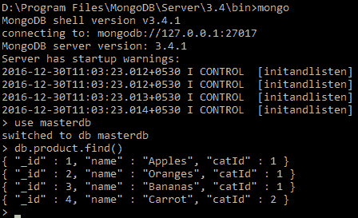
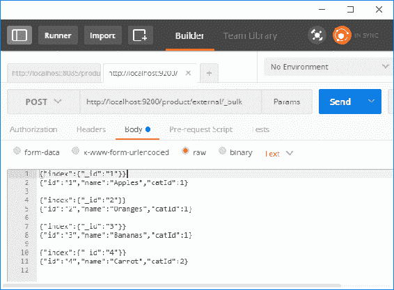
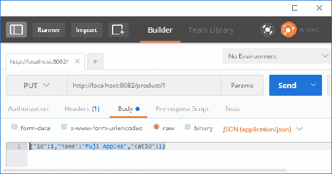
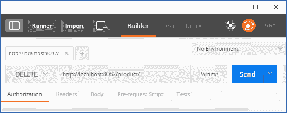

# 扩展您的云原生应用

在理解了设计原则之后，让我们拿出在第二章中开发的骨架服务，*编写您的第一个云原生应用*，并对它们进行一些真正的工作，使它们能够投入生产。

我们定义了两个获取服务；`getProduct`用于给定产品 ID，`getProducts`用于给定类别。这两个服务具有高度的非功能性要求。它们必须始终可用，并以尽可能低的延迟提供数据。以下步骤将带领我们实现这一目标：

1.  访问数据：服务访问跨各种资源的数据

1.  缓存：进行缓存的选项及其考虑因素

1.  应用 CQRS：使我们能够拥有不同的数据模型来服务不同的请求

1.  错误处理：如何恢复，发送什么返回代码，以及实现断路器等模式

我们还将研究添加修改数据的方法，例如`insert`，`update`和`delete`。在本章中，我们将涵盖：

+   验证：确保数据在处理之前是干净的

+   保持两个 CQRS 模型同步：数据一致性

+   事件驱动和异步更新：它如何扩展架构并同时解耦

# 实现获取服务

让我们继续开发在第二章中开发的`product`项目，*编写您的第一个云原生应用*。我们将在讨论概念的同时逐步增强它。

让我们仔细考虑一下我们两个服务的数据库。`getProduct`返回产品信息，而`getProducts`搜索属于该类别的产品列表。首先，对于简单和标准的要求，这两个查询都可以由关系数据库中的单个数据模型回答：

1.  您将在一个固定数量的列中的产品表中存储产品。

1.  然后，您将对类别进行索引，以便对其进行的查询可以快速运行。

现在，这个设计对于大多数中等规模公司的要求来说都是可以的。

# 简单的产品表

让我们在标准关系数据库中使用产品表，并使用 Spring Data 在我们的服务中访问它。Spring Data 提供了优秀的抽象，以使用**Java 持久化 API**（**JPA**），并使编写**数据访问对象**（**DAO**）变得更加容易。Spring Boot 进一步帮助我们开始时编写最少的代码，并在前进时进行扩展。

Spring Boot 可以与嵌入式数据库一起工作，例如 H2、HSQLDB 或外部数据库。进程内嵌入式数据库在我们的 Java 服务中启动一个进程，然后在进程终止时终止。这对于开始是可以的。稍后，依赖项和 URL 可以更改为指向实际数据库。

您可以从第二章中获取项目，*编写您的第一个云原生应用*，并添加以下步骤，或者只需从 GitHub（[`github.com/PacktPublishing/Cloud-Native-Applications-in-Java`](https://github.com/PacktPublishing/Cloud-Native-Applications-in-Java)）下载已完成的代码：

1.  Maven POM：包括 POM 依赖项：


这将告诉 Spring Boot 包含 Spring Boot starter JPA 并在嵌入模式下使用 HSQLDB。

1.  实体：根据 JPA，我们将开始使用实体的概念。我们已经有一个名为`Product`的领域对象来自我们之前的项目。重构它以放入一个实体包中。然后，添加`@Entity`，`@Id`和`@Column`的标记，如下所示的`Product.java`文件：

```java
package com.mycompany.product.entity ; 

import javax.persistence.Column; 
import javax.persistence.Entity; 
import javax.persistence.GeneratedValue; 
import javax.persistence.GenerationType; 
import javax.persistence.Id; 

@Entity 
public class Product { 

   @Id 
   @GeneratedValue(strategy=GenerationType.AUTO) 
   private int id ; 

   @Column(nullable = false) 
   private String name ; 

   @Column(nullable = false) 
   private int catId ; 
```

其余的代码，如构造函数和 getter/setter，保持不变。

1.  **存储库**：Spring Data 提供了一个存储库，类似于 DAO 类，并提供了执行数据的**创建**、**读取**、**更新**和**删除**（**CRUD**）操作的方法。`CrudRepository`接口中已经提供了许多标准操作。从现在开始，我们将只使用查询操作。

在我们的情况下，由于我们的领域实体是`Product`，所以存储库将是`ProductRepository`，它扩展了 Spring 的`CrudRepository`，并管理`Product`实体。在扩展期间，需要使用泛型指定实体和主键的数据类型，如下面的`ProductRepository.java`文件所示：

```java
package com.mycompany.product.dao; 

import java.util.List; 
import org.springframework.data.repository.CrudRepository; 
import com.mycompany.product.entity.Product; 

public interface ProductRepository extends CrudRepository<Product, Integer> { 

   List<Product> findByCatId(int catId); 
} 
```

首先要考虑的问题是，这段代码是否足够工作。它只有一个接口定义。如何能足够处理我们的两个方法，即`getProduct`（根据产品 ID）和`getProducts`（根据类别）？

Spring Data 中发生的魔术有助于处理样板代码。`CrudRepository`接口带有一组默认方法来实现最常见的操作。这些包括`save`、`delete`、`find`、`count`和`exists`操作，这些操作足以满足大部分查询和更新任务。我们将在本章的后半部分讨论`update`操作，但让我们先专注于查询操作。

根据`CrudRepository`中的`findOne`方法，已经存在根据 ID 查找产品的操作。因此，我们不需要显式调用它。

在我们的`ProductRepository`接口中，根据给定类别查找产品的任务由`findByCatId`方法完成。Spring Data 存储库基础设施内置的查询构建器机制对于构建存储库实体的查询非常有用。该机制会剥离方法的前缀，如`find`、`read`、`query`、`count`和`get`，然后根据实体解析剩余部分。该机制非常强大，因为关键字和组合的选择意味着方法名足以执行大部分查询操作，包括操作符（`and`/`or`）、distinct 子句等。请参阅 Spring Data 参考文档（[`docs.spring.io/spring-data/jpa/docs/current/reference/html/`](https://docs.spring.io/spring-data/jpa/docs/current/reference/html/)）了解详细信息。

这些约定允许 Spring Data 和 Spring Boot 根据解析接口来注入方法的实现。

1.  **更改服务**：在第二章中，*编写您的第一个云原生应用程序*，我们的`product`服务返回了虚拟的硬编码数据。让我们将其更改为针对数据库的有用内容。我们通过使用之前定义的`ProductRepository`接口，并通过`@Autowiring`注入到我们的`ProductService`类中来实现这一点，如下面的`ProductService.java`文件所示：

```java
@RestController 
public class ProductService { 

   @Autowired 
   ProductRepository prodRepo ; 

   @RequestMapping("/product/{id}") 
   Product getProduct(@PathVariable("id") int id) { 
         return prodRepo.findOne(id); 
   } 

   @RequestMapping("/products") 
   List<Product> getProductsForCategory(@RequestParam("id") int id) { 
         return prodRepo.findByCatId(id); 
   } 
} 
```

存储库中的`findOne`方法根据主键获取对象，我们定义的`findByCatId`方法有助于根据类别查找产品。

1.  **模式定义**：目前，我们将模式创建留给`hibernate`自动生成脚本。由于我们确实想要看到生成的脚本，让我们在`application.properties`文件中启用对类的`logging`，如下所示：

```java
logging.level.org.hibernate.tool.hbm2ddl=DEBUG 
logging.level.org.hibernate.SQL=DEBUG 
```

1.  **测试数据**：由于我们将稍后插入产品，因此需要初始化数据库并添加一些产品。因此，请将以下行添加到`import.sql`中，并将其放在资源中（与`application.properties`和引导文件所在的位置）：

```java
-- Adding a few initial products
insert into product(id, name, cat_Id) values (1, 'Apples', 1) 
insert into product(id, name, cat_Id) values (2, 'Oranges', 1) 
insert into product(id, name, cat_Id) values (3, 'Bananas', 1) 
insert into product(id, name, cat_Id) values (4, 'Carrot', 2) 
```

1.  **让 Spring Data 和 Spring Boot 来解决其余问题：**但在生产应用程序中，我们希望对连接 URL、用户 ID、密码、连接池属性等进行精细控制。

# 运行服务

要运行我们的`product`服务，请执行以下步骤：

1.  启动 Eureka 服务器（就像我们在第二章中所做的那样，*编写您的第一个云原生应用程序*），使用`EurekaApplication`类。我们将始终保持 Eureka 服务运行。

1.  一旦`Eureka`项目启动，运行`product`服务。

注意由`hibernate`生成的日志。它首先自动使用 HSQLDB 方言，然后创建并运行以下`Product`表 SQL：

```java
HHH000227: Running hbm2ddl schema export 
drop table product if exists 
create table product (id integer generated by default as identity (start with 1), cat_id integer not null, name varchar(255) not null, primary key (id)) 
HHH000476: Executing import script '/import.sql' 
HHH000230: Schema export complete 
```

一旦服务开始监听端口，请在浏览器中发出查询：`http://localhost:8082/product/1`。这将返回以下内容：

```java
{"id":1,"name":"Apples","catId":1} 
```

当您看到日志时，您会观察到后台运行的 SQL：

```java
select product0_.id as id1_0_0_, product0_.cat_id as cat_id2_0_0_, product0_.name as name3_0_0_ from product product0_ where product0_.id=? 
```

现在，再次发出一个返回给定类别产品的查询：`http://localhost:8082/products?id=1`。这将返回以下内容：

```java
[{"id":1,"name":"Apples","catId":1},{"id":2,"name":"Oranges","catId":1},{"id":3,"name":"Bananas","catId":1}] 
```

为此条件运行的 SQL 如下：

```java
select product0_.id as id1_0_, product0_.cat_id as cat_id2_0_, product0_.name as name3_0_ from product product0_ where product0_.cat_id=? 
```

尝试使用不同的类别，`http://localhost:8082/products?id=2`，将返回如下内容：

```java
[{"id":4,"name":"Carrot","catId":2}] 
```

这完成了一个针对数据源的简单查询服务。

为了生产目的，这将需要增强以将标准数据库作为 Oracle、PostgreSQL 或 MySQL 数据库。您将在类别列上引入索引，以便查询运行更快。

# 传统数据库的局限性

但是在以下情况下，公司扩大产品和客户会发生什么？

+   关系数据库的可伸缩性（产品数量和并发请求数量）成为瓶颈。

+   产品结构根据类别不同，在关系数据库的固定模式中很难建模。

+   搜索条件开始扩大范围。目前，我们只按类别搜索；以后，我们可能希望按产品描述、过滤字段以及类别描述进行搜索。

单个关系数据库是否足以满足所有需求？

让我们用一些设计技术来解决这些问题。

# 缓存

随着服务在数据量和并发请求方面的扩展，数据库将开始成为瓶颈。为了扩展，我们可以采用缓存解决方案，通过从缓存中服务请求来减少对数据库的访问次数，如果值在缓存中可用的话。

Spring 提供了通过注解包含缓存的机制，以便 Spring 可以返回缓存值而不是调用实际处理或检索方法。

从概念上讲，缓存分为两种类型，如下节所讨论的。

# 本地缓存

本地缓存存在于与服务相同的 JVM 中。它的范围是有限的，因为它只能被服务实例访问，并且必须完全由服务实例管理。

让我们首先使我们的产品在本地缓存中可缓存。

Spring 3.1 引入了自己的注释来返回缓存条目、清除或填充条目。但后来，JSR 107 JCache 引入了不同的注释。Spring 4.1 及更高版本也支持这些。

让我们首先使用 Spring 的注释：

1.  告诉 Spring 应用程序启用缓存并寻找可缓存的实例。这是一次性声明，因此最好在启动类中完成。在主类中添加`@``EnableCaching`注释：

```java
@SpringBootApplication
@EnableDiscoveryClient 
@EnableCaching 
public class ProductSpringApp { 
```

1.  在我们的`ProductRepository`中启用缓存以通过添加可缓存注释获取产品，我们将提供一个明确的缓存名称，并将用于此方法：

```java
public interface ProductRepository extends CrudRepository<Product, Integer> { 

   @Cacheable("productsByCategoryCache") 
   List<Product> findByCatId(int catId); 
} 
```

现在，再次运行服务，并观察当您在浏览器中运行以下一组查询时的日志：

1.  `http://localhost:8082/products?id=1`

1.  `http://localhost:8082/products?id=2`

1.  `http://localhost:8082/products?id=1`

1.  `http://localhost:8082/products?id=2`

您会看到以下 SQL 只被触发了两次：

```java
select product0_.id as id1_0_, product0_.cat_id as cat_id2_0_, product0_.name as name3_0_ from product product0_ where product0_.cat_id=? 
```

这意味着仓库只有在缓存中找不到类别条目时才执行了`findByCatId`方法。

# 底层

尽管 Spring 在幕后处理了许多关注点，如缓存实现，但重要的是要了解正在发生的事情，并意识到其中的局限性。

在内部，缓存是通过内部类（如缓存管理器和缓存解析器）实现的。当没有提供缓存产品或框架时，Spring 默认使用`ConcurrentHashMap`。Spring 的缓存实现了许多其他本地缓存，如 EHCache、Guava 和 Caffeine。

查看 Spring 文档（[`docs.spring.io/spring/docs/current/javadoc-api/org/springframework/cache/annotation/Cacheable.html`](https://docs.spring.io/spring/docs/current/javadoc-api/org/springframework/cache/annotation/Cacheable.html)）以获取更多诸如`sync=true`和条件缓存等复杂性。

# 本地缓存的局限性

本地缓存在有限的用例中很有用（例如非更改静态数据），因为使用 Spring 注释（如`@CachePut`、`@CacheEvict`等）在一个服务中进行的更新无法与运行多个服务实例的其他实例上的缓存同步，以实现负载平衡或弹性目的。

# 分布式缓存

Hazelcast、Gemfire 和/或 Coherence 等分布式缓存是网络感知的，缓存实例作为进程模型（对等模型）运行，其中缓存是服务运行时的一部分，或者作为客户端-服务器模型运行，其中缓存请求从服务到单独的专用缓存实例。

对于此示例，我们选择了 Hazelcast，因为它是一个非常轻量但功能强大的分布式缓存解决方案。它还与 Spring Boot 集成得非常好。以下是如何操作的：

1.  在 POM（Maven 文件）中，添加对`hazelcast-spring`的依赖。`hazelcast-spring`具有一个`HazelcastCacheManager`，用于配置要使用的 Hazelcast 实例：

```java
<dependency> 
   <groupId>org.springframework.boot</groupId> 
   <artifactId>spring-boot-starter-cache</artifactId> 
</dependency> 
<dependency> 
   <groupId>com.hazelcast</groupId> 
   <artifactId>hazelcast-spring</artifactId>              
</dependency>
```

1.  由于 Hazelcast 是一个分布式缓存，它需要元素是可序列化的。因此，我们需要确保我们的`Product`实体是可序列化的：

```java
public class Product implements Serializable {
```

1.  一个简化的 Hazelcast 配置文件，告诉各种 Hazelcast 实例如何发现并与彼此同步：

```java
<hazelcast  
   xsi:schemaLocation="http://www.hazelcast.com/schema/config http://www.hazelcast.com/schema/config/hazelcast-config-3.6.xsd" 
   > 

   <group> 
         <name>ProductCluster</name> 
         <password>letmein</password> 
   </group> 
   <network> 
        <join> 
            <multicast enabled="true"/> 
        </join> 
    </network> 
</hazelcast>
```

现在，让我们测试这些更改。为此，我们必须运行两个`product`服务的实例来检查它是否有效。我们可以通过更改端口号来运行两个实例：

1.  使用端口`8082`（已配置）运行服务。

1.  将`application.properties`更改为`8083`。

1.  再次运行服务。

您将在一个服务上看到 Hazelcast 消息，该服务启动如下：

```java
Loading 'hazelcast.xml' from classpath. 
[LOCAL] [ProductCluster] [3.6.5] Picked Address[169.254.104.186]:5701, using socket  
[169.254.104.186]:5701 [ProductCluster] [3.6.5] Hazelcast 3.6.5 (20160823 - e4af3d9) starting 
Members [1] { 
Member [169.254.104.186]:5701 this 
}
```

但是，一旦第二个服务启动，成员定义就会被`2`更新：

```java
Members [2] { 
   Member [169.254.104.186]:5701 
   Member [169.254.104.186]:5702 this 
} 
```

现在，在浏览器上运行以下查询，并观察控制台中的日志：

1.  `http://localhost:8082/products?id=1`

1.  `http://localhost:8082/products?id=2`

1.  `http://localhost:8082/products?id=1`

1.  `http://localhost:8082/products?id=2`

1.  `http://localhost:8083/products?id=1`

1.  `http://localhost:8083/products?id=2`

您会发现在 SQL 中，调试日志只在第一个服务中出现两次。其他四次，缓存条目都是从 Hazelcast 中提取的。与以前的本地缓存不同，缓存条目在两个实例之间是同步的。

# 将 CQRS 应用于分离数据模型和服务

分布式缓存是解决扩展问题的一种方法。但是，它引入了某些挑战，例如缓存陈旧（使缓存与数据库同步）和额外的内存需求。

此外，缓存是过渡到 CQRS 范例的开始。重新审视我们在第三章*设计您的云原生应用程序*中讨论的 CQRS 概念。

查询是从缓存中回答的（除了第一次命中），这是查询与从记录系统（即数据库）传递的命令进行分离，并稍后更新查询模型（缓存更新）。

让我们在 CQRS 中迈出下一步，以便清晰地进行这种分离。CQRS 引入的复杂性是：

+   需要维护两个（或多个）模型，而不是一个

+   当数据发生变化时更新所有模型的开销

+   不同模型之间的一致性保证

因此，只有在用例需要高并发、高容量和快速敏捷性需求的情况下才应遵循这种模式。

# 关系数据库上的物化视图

物化视图是 CQRS 的最简单形式。如果我们假设对产品的更新发生的频率比对产品和类别的读取频率低，那么我们可以有两种不同的模型支持`getProduct`（根据 ID）和`getProducts`（根据给定的类别）。

搜索查询`getProducts`针对此视图，而基于主键的传统`getProduct`则转到常规表。

如果数据库（例如 Oracle）支持，这应该很容易。如果数据库不支持物化视图，默认情况下可以手动完成，如果有需要，可以通过手动更新统计信息或摘要表来完成，当主产品表使用触发器或更好的事件驱动架构（例如业务事件）更新时。我们将在本章的后半部分看到这一点，当我们为我们的服务集添加`addProduct`功能时。

# Elasticsearch 和文档数据库

为了解决灵活模式、高搜索能力和更高容量处理的限制，我们可以选择 NoSQL 技术：

+   为了提供不同类型的产品，我们可以选择使用文档数据库及其灵活的模式，例如 MongoDB。

+   为了处理搜索请求，基于 Lucene 的 Elasticsearch 技术由于其强大的索引能力将是有益的。

# 为什么不仅使用文档数据库或 Elasticsearch？

也可以考虑以下选项：

+   Elasticsearch 通常是一种补充技术，而不是用作主数据库。因此，产品信息应该在可靠的关系型或 NoSQL 数据库中维护。

+   像 MongoDB 这样的文档数据库也可以构建索引。但是，性能或索引能力无法与 Elasticsearch 相匹敌。

这是一个典型的适用场景示例。您的选择将取决于您的用例：

+   无论您是否需要灵活的模式

+   可扩展和高容量的应用程序

+   高度灵活的搜索需求

# 文档数据库上的核心产品服务

保持 REST 接口不变，让我们将内部实现从使用关系数据库（例如我们的 HSQLDB）更改为 MongoDB。我们将 MongoDB 作为服务器单独运行，而不是在进程中运行，例如 HSQLDB。

# 准备 MongoDB 的测试数据

下载和安装 MongoDB 的步骤如下：

1.  安装 MongoDB。在 MongoDB 网站上（[`www.mongodb.com/`](https://www.mongodb.com/)）可以很容易地按照各种平台的说明进行操作。

1.  运行`mongod.exe`启动 MongoDB 的一个实例。

1.  创建一个包含我们示例数据的测试文件（类似于`import.sql`）。但是，这次我们将数据保留在 JSON 格式中，而不是 SQL 语句。`products.json`文件如下：

```java
{"_id":"1","name":"Apples","catId":1} 
{"_id":"2","name":"Oranges","catId":1} 
{"_id":"3","name":"Bananas","catId":1} 
{"_id":"4","name":"Carrot","catId":2} 
```

请注意`_id`，这是 MongoDB 的主键表示法。如果您不提供`_id`，MongoDB 将使用`ObjectId`定义自动生成该字段。

1.  将示例数据加载到 MongoDB。我们将创建一个名为`masterdb`的数据库，并加载到一个名为`product`的集合中：

```java
mongoimport --db masterdb --collection product --drop --file D:datamongoscriptsproducts.json 
```

1.  通过使用`use masterdb`后，通过命令行检查数据是否加载，使用`db.product.find()`命令如下：



# 创建产品服务

创建`product`服务的步骤如下：

1.  最好从零开始。从之前的带有 Hazelcast 和 HSQLDB 的示例项目复制或从 GitHub 存储库中拉取（[`github.com/PacktPublishing/Cloud-Native-Applications-in-Java`](https://github.com/PacktPublishing/Cloud-Native-Applications-in-Java)）。

1.  调整 Maven POM 文件以具有以下依赖项。删除其他依赖项，因为它们对我们的小例子不是必需的：

```java
<dependencies> 
         <dependency> 
               <groupId>org.springframework.boot</groupId> 
               <artifactId>spring-boot-starter-web</artifactId> 
         </dependency> 
         <dependency> 
               <groupId>org.springframework.boot</groupId> 
               <artifactId>spring-boot-starter-actuator</artifactId> 
         </dependency> 
         <dependency> 
               <groupId>org.springframework.cloud</groupId> 
               <artifactId>spring-cloud-starter-eureka</artifactId> 
         </dependency> 
         <dependency> 
               <groupId>org.springframework.boot</groupId> 
               <artifactId>spring-boot-starter-data- 
                mongodb</artifactId> 
        </dependency> 
</dependencies> 
```

1.  `Product`实体应该只有一个`@Id`字段。在类级别放置`@Document`注解是可选的。如果不这样做，首次插入性能会受到影响。现在，让我们在`Product.java`文件中放置注解：

```java
@Document 
public class Product  { 

   @Id 
   private String id ;      
   private String name ;    
   private int catId ; 

   public Product() {} 

   .... (other constructors, getters and setters) 
```

请注意，这里的`id`是`String`而不是`int`。原因是 NoSQL 数据库在生成 ID 时（GUID）比关系系统（如数据库）中的递增整数更好。原因是数据库变得更加分布式，因此相对于生成 GUID，可靠地生成递增数字稍微困难一些。

1.  `ProductRepository`现在扩展了`MongoRepository`，其中有从 MongoDB 检索产品的方法，如`ProductRepository.java`文件中所示：

```java
package com.mycompany.product.dao; 

import java.util.List; 
import org.springframework.data.mongodb.repository.MongoRepository; 
import com.mycompany.product.entity.Product; 

public interface ProductRepository extends MongoRepository<Product, String> { 

   List<Product> findByCatId(int catId); 
}
```

1.  我们只需向`application.properties`添加一个属性，告诉服务从 MongoDB 的`masterdb`数据库获取数据。此外，最好在不同的端口上运行它，这样我们以后可以并行运行服务，如果我们想这样做的话：

```java
server.port=8085 
eureka.instance.leaseRenewalIntervalInSeconds=5 
spring.data.mongodb.database=masterdb 
```

由于接口没有更改，因此`ProductService`类也不会更改。

现在，启动 Eureka 服务器，然后启动服务，并在浏览器中执行以下查询：

1.  `http://localhost:8085/products?id=1`

1.  `http://localhost:8085/products?id=2`

1.  `http://localhost:8085/product/1`

1.  `http://localhost:8085/product/2`

您将得到与以前相同的 JSON。这是微服务的内部实现更改。

# 拆分服务

让我们从学习的角度采用所建议的分离的简单实现。由于我们正在分离主模型和搜索模型，将服务拆分是有意义的，因为搜索功能可以被视为**产品**主模型的下游功能。

对于类别的`getProducts`功能是搜索功能的一部分，它本身可以成为一个复杂且独立的业务领域。因此，现在是重新考虑是否有意义将它们保留在同一个微服务中，还是将它们拆分为核心**产品**服务和**产品搜索**服务的时候了。


# 产品搜索服务

让我们创建一个专门进行高速、高容量搜索的新微服务。支持搜索微服务的搜索数据存储不需要是产品数据的主数据，而可以作为补充的搜索模型。Elasticsearch 在各种搜索用例中都非常受欢迎，并且符合极端搜索需求的需求。

# 准备 Elasticsearch 的测试数据

以下是准备 Elasticsearch 的测试数据的步骤：

1.  安装 Elastic 版本。使用版本 2.4.3，因为最近的 5.1 版本与 Spring Data 不兼容。Spring Data 使用在端口`9300`上与服务器通信的 Java 驱动程序，因此在客户端和服务器上具有相同的版本非常重要。

1.  创建一个包含我们的样本数据的测试文件（类似于`products.json`）。格式与以前的情况略有不同，但是针对 Elasticsearch 而不是 MongoDB。`products.json`文件如下：

```java
{"index":{"_id":"1"}} 
{"id":"1","name":"Apples","catId":1} 

{"index":{"_id":"2"}} 
{"id":"2","name":"Oranges","catId":1} 

{"index":{"_id":"3"}} 
{"id":"3","name":"Bananas","catId":1} 

{"index":{"_id":"4"}} 
{"id":"4","name":"Carrot","catId":2} 
```

1.  使用 Postman 或 cURL 调用 Elasticsearch 上的 REST 服务来加载数据。请参阅以下屏幕截图以查看 Postman 扩展中的输出。在 Elasticsearch 中，数据库的等价物是索引，我们可以命名我们的索引为`product`。Elasticsearch 还有一个类型的概念，但稍后再说：



1.  通过在 Postman、浏览器或 cURL 中运行简单的`*`查询来检查数据是否已加载：

```java
http://localhost:9200/product/_search?q=*&pretty
```

因此，您应该得到添加的四个产品。

# 创建产品搜索服务

到目前为止，我们已经完成了两个数据库，现在你一定对这个流程很熟悉了。这与我们为 HSQLDB 和 MongoDB 所做的并没有太大的不同。复制 Mongo 项目以创建`productsearch`服务，并像以前一样对 Maven POM、实体、存储库类和应用程序属性进行更改：

1.  在 Maven POM 中，`spring-boot-starter-data-elasticsearch`取代了之前两个服务示例中的`spring-boot-starter-data-mongodb`或`spring-boot-starter-data-jpa`。

1.  在`Product`实体中，`@Document`现在表示一个 Elasticsearch 文档。它应该有一个定义相同的`index`和`type`，因为我们用来加载测试数据，如`Product.java`文件所示：

```java
package com.mycompany.product.entity ; 

import org.springframework.data.annotation.Id; 
import org.springframework.data.elasticsearch.annotations.Document; 

@Document(indexName = "product", type = "external" ) 
public class Product  { 

   @Id 
   private String id ;      
   private String name ;    
   private int catId ;           //Remaining class is same as before 
```

1.  `ProductRepository`现在扩展了`ElasticsearchRepository`，如`ProductRepository.java`文件所示：

```java
package com.mycompany.product.dao; 

import java.util.List; 
import org.springframework.data.elasticsearch.repository.ElasticsearchRepository; 
import com.mycompany.product.entity.Product; 

public interface ProductRepository extends ElasticsearchRepository<Product, String> { 

   List<Product> findByCatId(int catId); 
} 
```

1.  在`application.properties`中进行更改，指示`elasticsearch`的服务器模型（与嵌入式模型相对，就像我们为 HSQLDB 所做的那样）：

```java
server.port=8086 
eureka.instance.leaseRenewalIntervalInSeconds=5 

spring.data.elasticsearch.repositories.enabled=true 
spring.data.elasticsearch.cluster-name=elasticsearch 
spring.data.elasticsearch.cluster-nodes=localhost:9300 
```

现在，启动 Eureka 服务器，然后启动`productsearch`服务，并按照以下顺序在浏览器中发出以下查询：

1.  `http://localhost:8085/products?id=1`。

1.  `http://localhost:8085/products?id=2`。

你将得到与之前相同的 JSON。这是微服务的内部实现变化，从第二章中的硬编码实现到 HSQLDB、MongoDB，现在是 Elasticsearch。 

由于 Spring Data 框架，访问驱动程序并与其通信的代码已经被大大抽象化，所以我们只需要添加以下内容：

1.  Maven POM 文件中的依赖项。

1.  在存储库的情况下扩展的基类。

1.  用于实体的注解。

1.  在应用程序属性中配置的属性。

# 数据更新服务

到目前为止，我们已经看过了获取数据。让我们看一些数据修改操作，比如创建、更新和删除（CRUD 操作）。

鉴于 REST 在基于云的 API 操作中的流行度，我们将通过 REST 方法进行数据操作。

让我们选择在本章之前使用 Hazelcast 的 HSQLDB 示例。

# REST 惯例

GET 方法是一个不用大脑思考的选择，但是对于创建、插入和删除等操作的方法的选择需要一些考虑。我们将遵循行业指南的惯例：

| **URL** | **HTTP 操作** | **服务方法** | **描述** |
| --- | --- | --- | --- |
| `/product/{id}` | `GET` | `getProduct` | 获取给定 ID 的产品 |
| `/product` | `POST` | `insertProduct` | 插入产品并返回一个新的 ID |
| `/product/{id}` | `PUT` | `updateProduct` | 使用请求体中的数据更新给定 ID 的产品 |
| `/product/{id}` | `DELETE` | `deleteProduct` | 删除提供的 ID 的产品 |

让我们看看`ProductService`类中的实现。我们已经在本章前面有了`getProduct`的实现。让我们添加其他方法。

# 插入产品

暂且不考虑验证（我们一会儿会讨论），插入看起来非常简单，实现 REST 接口。

我们将`POST`操作映射到`insertProduct`方法，在实现中，我们只需在已经定义的存储库上调用`save`：

```java
@RequestMapping(value="/product", method = RequestMethod.POST) 
ResponseEntity<Product> insertProduct(@RequestBody Product product) { 

   Product savedProduct = prodRepo.save(product) ; 
   return new ResponseEntity<Product>(savedProduct, HttpStatus.OK);         
}  
```

注意一下我们之前编码的`getProduct`方法有一些不同之处：

+   我们在`@RequestMapping`中添加了一个`POST`方法，这样当使用 HTTP `POST`时，URL 将映射到`insertProduct`方法。

+   我们从`@RequestBody`注解中捕获`product`的详细信息。这在插入新产品时应该提供。Spring 会为我们将 JSON（或 XML）映射到`Product`类。

+   我们返回一个`ResponseEntity`而不是像`getProduct`方法中那样只返回一个`Product`对象。这使我们能够自定义 HTTP 响应和标头，在 REST 架构中这很重要。对于成功的插入，我们返回一个 HTTP `OK`（`200`）响应，告诉客户端他添加产品的请求成功了。

# 测试

测试我们的`insertProduct`方法的步骤如下：

1.  启动 Eureka 服务器，然后启动`product`服务（假设它在`8082`上监听）。

1.  请注意，现在浏览器不够用了，因为我们想要指示 HTTP 方法并提供响应主体。改用 Postman 或 cURL。

1.  将内容类型设置为 application/json，因为我们将以 JSON 格式提交新的产品信息。

1.  以 JSON 格式提供产品信息，例如`{"name":"Grapes","catId":1}`。注意我们没有提供产品 ID：


1.  点击发送。你会得到一个包含产品 JSON 的响应。这次，ID 将被填充。这是存储库生成的 ID（它又从底层数据库中获取）。

# 更新产品

在这里，我们将使用`PUT`方法，指示 URL 模式中要更新的产品的 ID。与`POST`方法一样，要更新的产品的详细信息在`@RequestBody`注解中提供：

```java
@RequestMapping(value="/product/{id}", method = RequestMethod.PUT) 
ResponseEntity<Product> updateProduct(@PathVariable("id") int id, @RequestBody Product product) { 

   // First fetch an existing product and then modify it.  
   Product existingProduct = prodRepo.findOne(id);  

   // Now update it back  
   existingProduct.setCatId(product.getCatId()); 
   existingProduct.setName(product.getName()); 
   Product savedProduct = prodRepo.save(existingProduct) ; 

   // Return the updated product with status ok  
   return new ResponseEntity<Product>(savedProduct, HttpStatus.OK);         
} 
```

实现包括：

1.  从存储库中检索现有产品。

1.  根据业务逻辑对其进行更改。

1.  将其保存回存储库。

1.  返回更新后的产品（供客户端验证），状态仍然是`OK`。

如果你没有注意到，最后两个步骤与插入情况完全相同。只是检索和更新产品是新步骤。

# 测试

测试我们的`insertProduct`方法的步骤如下：

1.  与插入产品一样，再次启动 Eureka 和`ProductService`。

1.  让我们将第一个产品的产品描述更改为`Fuji Apples`。所以，我们的 JSON 看起来像`{"id":1,"name":"Fuji Apples","catId":1}`。

1.  准备 Postman 提交`PUT`请求如下：



1.  点击发送。你会得到一个包含 JSON `{"id":1,"name":"Fuji Apples","catId":1}`的响应 200 OK。

1.  发送一个`GET`请求`http://localhost:8082/product/1`来检查变化。你会发现`apples`变成了`Fuji Apples`。

# 删除产品

删除产品的映射和实现如下：

```java
@RequestMapping(value="/product/{id}", method = RequestMethod.DELETE) 
ResponseEntity<Product> deleteProduct(@PathVariable("id") int id) {         
   prodRepo.delete(id); 
   return new ResponseEntity<Product>(HttpStatus.OK);           
} 
```

我们在存储库上调用`delete`操作，并假设一切正常向客户端返回`OK`。

# 测试

为了测试，在 Postman 上对产品 ID `1` 发送一个`DELETE`请求：



你会得到一个 200 OK 的响应。要检查它是否真的被删除，尝试对同一产品进行`GET`请求。你会得到一个空的响应。

# 缓存失效

如果进行填充缓存的获取操作，那么当进行`PUT`/`POST`/`DELETE`操作更新数据时，缓存要么更新，要么失效。

如果你还记得，我们有一个缓存，保存着与类别 ID 对应的产品。当我们使用为插入、更新和删除创建的 API 添加和移除产品时，缓存需要刷新。我们首选检查是否可以更新缓存条目。然而，拉取与缓存对应的类别的业务逻辑存在于数据库中（通过`WHERE`子句）。因此，最好在产品更新时使包含关系的缓存失效。

缓存使用情况的一般假设是读取远远高于插入和更新。

为了启用缓存驱逐，我们必须在`ProductRepository`类中添加方法并提供注释。因此，我们在接口中除了现有的`findByCatId`方法之外添加了两个新方法，并标记驱逐为 false：

```java
public interface ProductRepository extends CrudRepository<Product, Integer> { 

   @Cacheable("productsByCategoryCache") 
   List<Product> findByCatId(int catId); 

   @CacheEvict(cacheNames="productsByCategoryCache", allEntries=true) 
   Product save(Product product); 

   @CacheEvict(cacheNames="productsByCategoryCache", allEntries=true) 
   void delete(Product product); 
} 
```

尽管前面的代码是有效的解决方案，但并不高效。它会清除整个缓存。我们的缓存可能有数百个类别，清除与插入、更新或删除产品无关的类别是不正确的。

我们可以更加智能地只清除与正在操作的类别相关的条目：

```java
@CacheEvict(cacheNames="productsByCategoryCache", key = "#result?.catId") 
Product save(Product product); 

@CacheEvict(cacheNames="productsByCategoryCache", key = "#p0.catId") 
void delete(Product product); 
```

由于**Spring 表达式语言**（**SpEL**）和`CacheEvict`的文档，代码有点晦涩：

1.  `key`表示我们要清除的缓存条目。

1.  `#result`表示返回结果。我们从中提取`catId`并用它来清除数据。

1.  `#p0`表示调用方法中的第一个参数。这是我们想要使用类别并删除对象的`product`对象。

为了测试缓存清除是否正常工作，启动服务和 Eureka，发送以下请求，并观察结果：

| **请求** | **结果** |
| --- | --- |
| `http://localhost:8082/products?id=1` | 获取与类别`1`对应的产品并将其缓存。SQL 将显示在输出日志中。 |
| `http://localhost:8082/products?id=1` | 从缓存中获取产品。SQL 中没有更新条目。 |
| `POST`到`http://localhost:8082/product`添加`{"name":"Mango","catId":1}`作为`application/json` | 将新的芒果产品添加到数据库。 |
| `http://localhost:8082/products?id=1` | 反映了新添加的芒果。SQL 表明数据已刷新。 |

# 验证和错误消息

到目前为止，我们一直在非常安全的领域中前行，假设一切都是顺利的。但并不是一切都会一直正确。有许多情景，例如：

1.  `GET`、`PUT`、`DELETE`请求的产品不存在。

1.  `PUT`和`POST`缺少关键信息，例如，没有产品名称或类别。

1.  业务验证，例如产品，应属于已知类别，名称应超过 10 个字符。

1.  提交的数据格式不正确，例如类别 ID 的字母数字混合，而预期只有整数。

而且这些还不是详尽无遗的。因此，当出现问题时，进行验证并返回适当的错误代码和消息是非常重要的。

# 格式验证

如果请求的请求体格式有错误（例如，无效的 JSON），那么 Spring 在到达方法之前就会抛出错误。

例如，对于`POST`请求到`http://localhost:8082/product`，如果提交的主体缺少逗号，例如`{"id":1 "name":"Fuji Apples" "catId":1}`，那么返回的错误代码是`400`。这表示这是一个格式不正确的请求：

```java
{ 
  "timestamp": 1483701698917, 
  "status": 400, 
  "error": "Bad Request", 
  "exception": "org.springframework.http.converter.HttpMessageNotReadableException", 
  "message": "Could not read document: Unexpected character ('"' (code 34)): was expecting comma to separate Object entriesn at ... 
```

同样，例如在 ID 中使用字母而不是数字，将会很早地被捕获。例如，`http://localhost:8082/product/A`将导致`无法转换值`错误：


# 数据验证

一些错误可以在实体级别捕获，如果它们是不允许的。例如，当我们已经将`Product`实体注释为以下内容时，没有提供产品描述：

```java
@Column(nullable = false) 
private String name ; 
```

这将导致错误消息，尝试在请求中保存没有名称的产品，例如`{"id":1, "catId":1}`。

服务器返回`500`内部服务器错误，并给出详细消息如下：

```java
could not execute statement; SQL [n/a]; constraint [null]; nested exception is org.hibernate.exception.ConstraintViolationException: 
```

这不是一个很清晰的消息返回给客户。因此，最好在前期捕获验证并向客户返回`400`错误代码。

# 业务验证

这通常会在代码中完成，因为它是特定于正在解决的功能或业务用例的。例如，在更新或删除产品之前检查产品。这是一个简单的基于代码的验证，如下所示：

```java
@RequestMapping(value="/product/{id}", method = RequestMethod.DELETE) 
ResponseEntity<Product> deleteProduct(@PathVariable("id") int id) { 

   // First fetch an existing product and then delete it.  
   Product existingProduct = prodRepo.findOne(id);  
   if (existingProduct == null) { 
         return new ResponseEntity<Product>(HttpStatus.NOT_FOUND); 
   } 

   // Return the inserted product with status ok 
   prodRepo.delete(existingProduct); 
   return new ResponseEntity<Product>(HttpStatus.OK);           
} 
```

# 异常和错误消息

在出现错误的情况下，最简单的开始是指示一个错误消息，告诉我们出了什么问题，特别是在出现错误的输入请求或业务验证的情况下，因为客户端（或请求者）可能不知道出了什么问题。例如，在前面的情况下，返回`NOT_FOUND`状态码，但没有提供其他细节。

Spring 提供了有趣的注释，如`ExceptionHandler`和`ControllerAdvice`来处理这个错误。让我们看看这是如何工作的。

其次，服务方法之前直接通过发送 HTTP 代码来操作`ResponseEntity`。我们将其恢复为返回业务对象，如`Product`，而不是`ResponseEntity`，使其更像 POJO。将之前讨论的`deleteProduct`代码恢复如下：

```java
@RequestMapping(value="/product/{id}", method = RequestMethod.DELETE) 
Product deleteProduct(@PathVariable("id") int id) { 

   // First fetch an existing product and then delete it.  
   Product existingProduct = prodRepo.findOne(id);  
   if (existingProduct == null) { 
     String errMsg = "Product Not found with code " + id ;            
     throw new BadRequestException(BadRequestException.ID_NOT_FOUND, errMsg); 
   }      
   // Return the deleted product  
   prodRepo.delete(existingProduct); 
   return existingProduct ;             
} 
```

在上述代码中：

1.  我们返回`Product`而不是`ResponseEntity`，因为处理错误代码和响应将在外部完成。

1.  抛出异常（运行时异常或其扩展版本），告诉我们请求出了什么问题。

1.  `Product`方法的范围到此结束。

`BadRequestException`类是一个简单的类，提供了一个 ID，并继承自`RuntimeException`类。

```java
public class BadRequestException extends RuntimeException { 

   public static final int ID_NOT_FOUND = 1 ;       
   private static final long serialVersionUID = 1L; 

   int errCode ; 

   public BadRequestException(int errCode, String msg) { 
         super(msg); 
         this.errCode = errCode ; 
   } 
} 
```

当您现在执行服务时，不仅会得到`404 Not Found`状态，还会得到一个明确指出出了什么问题的消息。查看发送的请求和收到的异常的截图：


然而，发送`500`并在日志中得到异常堆栈并不干净。`500`表明错误处理不够健壮，堆栈跟踪被抛出。

因此，我们应该捕获和处理这个错误。Spring 提供了`@ExceptionHandler`，可以在服务中使用。在方法上使用这个注解，Spring 就会调用这个方法来处理错误：

```java
@ExceptionHandler(BadRequestException.class) 
void handleBadRequests(BadRequestException bre, HttpServletResponse response) throws IOException { 

   int respCode = (bre.errCode == BadRequestException.ID_NOT_FOUND) ? 
         HttpStatus.NOT_FOUND.value() : HttpStatus.BAD_REQUEST.value() ; 

   response.sendError(respCode, bre.errCode + ":" + bre.getMessage()); 
} 
```

当我们现在执行服务，并调用一个不可用的产品 ID 的`DELETE`方法时，错误代码变得更加具体和清晰：


现在，再进一步，如果我们希望所有的服务都遵循这种提出`BadRequestException`并返回正确的错误代码的模式呢？Spring 提供了一种称为`ControllerAdvice`的机制，当在一个类中使用时，该类中的异常处理程序可以普遍应用于范围内的所有服务。

创建一个新的类如下，并将其放在异常包中：

```java
@ControllerAdvice 
public class GlobalControllerExceptionHandler { 

   @ExceptionHandler(BadRequestException.class) 
   void handleBadRequests(BadRequestException bre, HttpServletResponse response) throws IOException { 

         ... Same code as earlier ...  
   } 
} 
```

这允许异常以一致的方式在服务之间处理。

# CQRS 的数据更新

如前一章讨论的，并且我们在前一节中看到的，CQRS 模式为处理命令和查询提供了高效和合适的数据模型。回顾一下，我们在 MongoDB 中有一个灵活的文档模型来处理具有事务保证的命令模式。我们在 Elasticsearch 中有一个灵活的查询模型来处理复杂的搜索条件。

尽管这种模式由于合适的查询模型而允许更容易的查询，但挑战在于跨各种模型更新数据。在前一章中，我们讨论了多种机制来保持信息在模型之间的更新，如分布式事务，使用发布-订阅消息的最终一致模型。

在接下来的章节中，我们将看看使用消息传递和异步更新数据的机制。

# 异步消息

HTTP/REST 提供了请求响应机制来执行服务。客户端等待（或者说是阻塞），直到处理完成并使用服务结束时提供的结果。因此，处理被称为同步的。

在异步处理中，客户端不等待响应。异步处理可以用于两种情况，如**发送和忘记**和**请求/响应**。

在“发送并忘记”中，客户端向下游服务发送命令或请求，然后不需要响应。它通常用于管道处理架构，其中一个服务对请求进行丰富和处理，然后将其发送到另一个服务，后者发送到第三个服务，依此类推。

在异步请求/响应中，客户端向服务发送请求，但与同步处理不同，它不会等待或阻塞响应。当服务完成处理时，必须通知客户端，以便客户端可以使用响应。

在 CQRS 中，我们使用消息传递将更新事件发送到各种服务，以便更新读取或查询模型。

首先，我们将在本章中使用 ActiveMQ 作为可靠的消息传递机制，然后在接下来的章节中查看 Kafka 作为可扩展的分布式消息传递系统。

# 启动 ActiveMQ

设置 ActiveMQ 的步骤如下：

1.  从 Apache 网站（[`activemq.apache.org/`](http://activemq.apache.org/)）下载 ActiveMQ。

1.  将其解压到一个文件夹中。

1.  导航到`bin`文件夹。

1.  运行`activemq start`命令。

打开控制台查看消息并管理 ActiveMQ，网址为`http://localhost:8161/admin`，使用`admin/admin`登录。您应该看到以下 UI 界面：


# 创建一个主题

点击“主题”链接，创建一个名为`ProductT`的主题。您可以按照您习惯的命名约定进行操作。此主题将获取产品的所有更新。这些更新可以用于各种下游处理目的，例如保持本地数据模型的最新状态。创建主题后，它将出现在管理控制台的主题列表中，如下所示。另外两个主题是 ActiveMQ 自己的主题，我们将不予理睬：


# 黄金源更新

当 CQRS 中有多个模型时，我们遵循之前讨论的黄金源模式：

1.  一个模型（命令模型）被认为是黄金源。

1.  在更新到黄金源之前进行所有验证。

1.  对黄金源的更新发生在一个事务中，以避免任何不一致的更新和失败状态。因此，更新操作是自动的。

1.  更新完成后，将在一个主题上放置广播消息。

1.  如果在将消息放在主题上时出现错误，则事务将被回滚，并向客户端发送错误。

我们使用 MongoDB 和 Elasticsearch 进行了 CQRS 实现。在我们的情况下，MongoDB 是产品数据的黄金源（也是命令模型）。Elasticsearch 是包含从搜索角度组织的数据的查询模型。

首先让我们来看看更新命令模型或黄金源。

# 服务方法

我们在 HSQLDB 实现中做了三种方法：插入、更新和删除。将相同的方法复制到基于 MongoDB 的项目中，以便该项目中的服务类与 HSQLDB 项目中的完全相同。

此外，复制在 HSQLDB 项目中完成的异常类和`ControllerAdvice`。您的包结构应该与 HSQLDB 项目完全相同，如下所示：


在这个项目中的不同之处在于 ID 是一个字符串，因为这样可以更好地在 MongoDB 中进行 ID 创建的本地处理。因此，方法签名将是字符串 ID，而不是我们 HSQLDB 项目中的整数。

显示更新 MongoDB 的`PUT`操作如下：

```java
@RequestMapping(value="/product/{id}", method = RequestMethod.PUT) 
Product updateProduct(@PathVariable("id") String id, @RequestBody Product product) { 

   // First fetch an existing product and then modify it.  
   Product existingProduct = prodRepo.findOne(id);  
   if (existingProduct == null) { 
         String errMsg = "Product Not found with code " + id ; 
         throw new BadRequestException(BadRequestException.ID_NOT_FOUND, errMsg); 
   } 

   // Now update it back  
   existingProduct.setCatId(product.getCatId()); 
   existingProduct.setName(product.getName()); 
   Product savedProduct = prodRepo.save(existingProduct) ; 

   // Return the updated product   
   return savedProduct ;          
} 
```

测试获取、插入、更新和删除操作是否按预期运行。

# 在数据更新时引发事件

当插入、删除或更新操作发生时，黄金源系统广播更改是很重要的，这样许多下游操作就可以发生。这包括：

1.  依赖系统的缓存清除。

1.  系统中本地数据模型的更新。

1.  进一步进行业务处理，例如在添加新产品时向感兴趣的客户发送电子邮件。

# 使用 Spring JMSTemplate 发送消息

使用 JMSTemplate 的步骤如下：

1.  在我们的 POM 文件中包含 Spring ActiveMQ 的启动器：

```java
        <dependency> 
            <groupId>org.springframework.boot</groupId> 
            <artifactId>spring-boot-starter-activemq</artifactId> 
        </dependency>
```

1.  我们必须为我们的 Spring 应用程序启用 JMS 支持。因此，请在`ProductSpringApp.java`文件中包括注解，并提供消息转换器。消息转换器将帮助将对象转换为 JSON，反之亦然：

```java
@SpringBootApplication 
@EnableDiscoveryClient 
@EnableJms 
public class ProductSpringApp {
```

1.  创建一个封装`Product`和操作的实体，这样无论谁收到产品消息，都会知道执行的操作是删除还是插入/更新，通过在`ProductUpdMsg.java`文件中添加实体，如下所示：

```java
public class ProductUpdMsg { 

   Product product ; 
   boolean isDelete = false ; 
// Constructor, getters and setters 
```

如果有更多操作，请随时根据您的用例将`isDelete`标志更改为字符串操作标志。

1.  在`application.properties`文件中配置 JMS 属性。`pub-sub-domain`表示应使用主题而不是队列。请注意，默认情况下，消息是持久的：

```java
spring.activemq.broker-url=tcp://localhost:61616 
jms.ProductTopic=ProductT 
spring.jms.pub-sub-domain=true 
```

1.  创建一个消息生产者组件，它将负责发送消息：

+   这是基于 Spring 的`JmsMessagingTemplate`

+   使用`JacksonJmsMessageConverter`将对象转换为消息结构

`ProductMsgProducer.java`文件如下：

```java
@Component 
public class ProductMsgProducer { 

   @Autowired  
   JmsTemplate prodUpdtemplate ; 

   @Value("${jms.ProductTopic}") 
   private String productTopic ; 

@Bean 
   public MessageConverter jacksonJmsMessageConverter() { 
         MappingJackson2MessageConverter converter = new MappingJackson2MessageConverter(); 
         converter.setTargetType(MessageType.TEXT); 
         converter.setTypeIdPropertyName("_type"); 
         return converter; 

   public void sendUpdate(Product product, boolean isDelete) { 
         ProductUpdMsg msg = new ProductUpdMsg(product, isDelete);          
         prodUpdtemplate.convertAndSend(productTopic, msg);  
   }      
} 
```

1.  最后，在您的服务中，声明`producer`，并在完成插入、更新和删除操作之后调用它，然后返回响应。`DELETE`方法如下所示，其中标志`isDelete`为 true。其他方法的标志将为 false。`ProductService.java`文件如下：

```java
@Autowired 
ProductMsgProducer producer ; 

@RequestMapping(value="/product/{id}", method = RequestMethod.DELETE) 
Product deleteProduct(@PathVariable("id") String id) { 

   // First fetch an existing product and then delete it.  
   Product existingProduct = prodRepo.findOne(id);  
   if (existingProduct == null) { 
         String errMsg = "Product Not found with code " + id ;              
         throw new BadRequestException(BadRequestException.ID_NOT_FOUND, errMsg); 
   } 

   // Return the deleted product  
   prodRepo.delete(existingProduct); 
   producer.sendUpdate(existingProduct, true); 
   return existingProduct ;             
} 
```

这将在主题上发送消息，您可以在管理控制台的主题部分看到。

# 查询模型更新

在`productsearch`项目中，我们将不得不进行更改以更新 Elasticsearch 中的记录。

# 插入、更新和删除方法

这些方法与我们在 MongoDB 中设计的方法非常不同。以下是区别：

1.  MongoDB 方法有严格的验证。对于 Elasticsearch，不需要验证，因为假定主服务器（命令模型或黄金源）已更新，我们必须将更新应用到查询模型中。

1.  更新查询模型时的任何错误都必须得到警告，不应被忽视。我们将在后面的章节中看到这一方面。

1.  我们不分开插入和更新方法。由于我们的`ProductRepository`类，单个保存方法就足够了。

1.  此外，这些方法不必暴露为 REST HTTP 服务，因为除了通过消息更新之外，可能不会直接调用它们。我们之所以在这里这样做，只是为了方便。

1.  在`product-nosql`（MongoDB）项目中，我们从`ProductService`类中调用了我们的`ProductMsgProducer`类。在`productsearch-nosql`项目中，情况将完全相反，`ProductUpdListener`将调用服务方法。

以下是更改：

1.  Maven POM—依赖于 ActiveMQ：

```java
<dependency> 
   <groupId>org.springframework.boot</groupId> 
   <artifactId>spring-boot-starter-activemq</artifactId> 
</dependency> 
```

1.  应用程序属性包括主题和连接详细信息：

```java
spring.activemq.broker-url=tcp://localhost:61616 
jms.ProductTopic=ProductT 
spring.jms.pub-sub-domain=true
```

1.  `Product`服务包括调用存储库保存和删除方法：

```java
   @PutMapping("/product/{id}") 
   public void insertUpdateProduct(@RequestBody Product product) {          
         prodRepo.save(product) ;                         
   } 

   @DeleteMapping("/product/{id}") 
   public void deleteProduct(@RequestBody Product product) { 
         prodRepo.delete(product); 
   } 
```

JMS 相关的类和更改如下：

1.  在`ProductSpringApp`中，包括`EnableJms`注解，就像在 MongoDB 项目中一样。

1.  创建一个调用服务的`ProductUpdListener`类：

```java
@Component 
public class ProductUpdListener { 

   @Autowired 
   ProductService prodService ; 

   @JmsListener(destination = "${jms.ProductTopic}", subscription = "productSearchListener") 
   public void receiveMessage(ProductUpdMsg msg) { 

         Product product = msg.getProduct() ; 
         boolean isDelete = msg.isDelete() ; 
         if (isDelete) { 
               prodService.deleteProduct(product); 
               System.out.println("deleted " + product.getId()); 
         } else { 
               prodService.insertUpdateProduct(product);        
               System.out.println("upserted " + product.getId()); 
         } 
   } 

   @Bean // Serialize message content to json using TextMessage 
   public MessageConverter jacksonJmsMessageConverter() { 
         MappingJackson2MessageConverter converter = new  
         MappingJackson2MessageConverter(); 
         converter.setTargetType(MessageType.BYTES); 
         converter.setTypeIdPropertyName("_type"); 
         return converter; 
   } 
}  
```

# 测试 CQRS 更新场景端到端

为了测试我们的场景，请执行以下步骤：

1.  在本地计算机上启动三个服务器进程，例如 Elasticsearch、MongoDB 和 ActiveMQ，如前面所讨论的。

1.  启动 Eureka 服务器。

1.  启动两个应用程序，一个连接到 MongoDB（黄金源，命令模型），监听`8085`，另一个连接到 Elasticsearch（查询模型），监听`8086`。

1.  在 Elasticsearch 上测试`GET`请求—`http://localhost:8086/products?id=1`，并注意 ID 和描述。

1.  现在，通过在 Postman 上发出以下命令来更改黄金源上的产品描述，假设服务正在端口`8085`上监听：


1.  再次在 Elasticsearch 上测试`GET`请求——`http://localhost:8086/products?id=1`。您会发现 Elasticsearch 中的产品描述已更新。

# 摘要

在本章中，我们涵盖了许多核心概念，从添加常规关系数据库来支持我们的 GET 请求开始。我们通过本地缓存和分布式缓存 Hazelcast 增强了其性能。我们还研究了 CQRS 模式，用 MongoDB 替换了我们的关系数据库，以实现灵活的模式和 Elasticsearch 的灵活搜索和查询功能。

我们为我们的`product`服务添加了插入、更新和删除操作，并确保在关系项目的情况下进行必要的缓存失效。我们为我们的 API 添加了输入验证和适当的错误消息。我们涵盖了事件处理，以确保查询模型与命令模型保持最新。这是通过命令模型服务发送更改的广播，以及查询模型服务监听更改并更新其数据模型来实现的。

接下来，我们将看看如何使这些项目足够健壮，以在运行时环境中运行。
