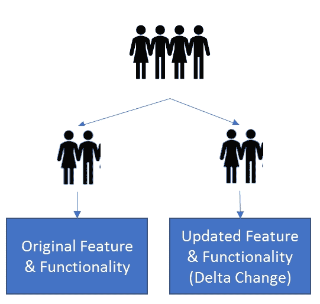
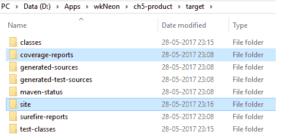
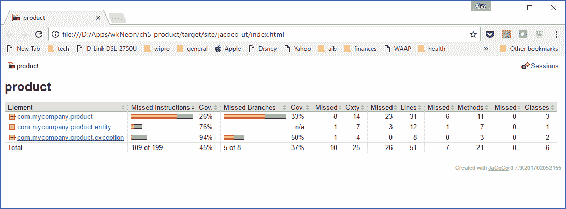
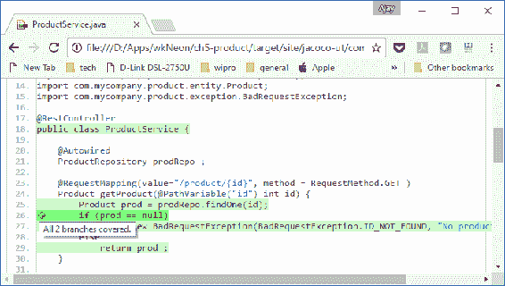

# 第六章：测试云原生应用程序

在本章中，我们将深入探讨测试云原生应用程序。测试从手动测试发展到使用各种测试工具、策略和模式进行自动化测试。这种方法的好处是可以频繁地进行测试，以确保云开发的重要性。

在本章中，我们将涵盖以下主题：

+   测试概念，如**行为驱动开发（BDD）**和**测试驱动开发（TDD）**

+   测试模式，如 A/B 测试和测试替身

+   测试工具，如 JUnit，Cucumber，JaCoCo 和 Spring Test

+   测试类型，如单元测试、集成测试、性能测试和压力测试

+   将 BDD 和集成测试的概念应用到我们在第二章中开发的产品服务，并在第四章中进行了增强，*扩展您的云原生应用程序*

# 在开发之前编写测试用例

在本书中，我们在第二章中开始使用 Spring Boot 开发一个简单的服务，*编写您的第一个云原生应用程序*，以激发您对云开发的兴趣。然而，真正的开发遵循不同的最佳实践风格。

# TDD

项目始于理解需求并编写验证需求的测试用例。由于此时代码不存在，测试用例将失败。然后编写通过测试用例的代码。这个过程迭代直到测试用例和所需的代码完成以实现业务功能。Kent Beck 在这个主题上有一本优秀的书，*通过示例进行测试驱动开发*。在下一节中，我们将使用本章的原则重新进行第四章中的产品服务。但在此之前，让我们看看另一个重要概念，BDD。

# BDD

借鉴敏捷开发原则和用户故事，BDD 鼓励我们将开发看作一系列场景，在这些场景中，给定某些条件，系统对设置的刺激以一种特定、可预测的方式做出反应。如果这些场景、条件和行为可以用业务和 IT 团队之间易于理解的共同语言来表达，这将为开发带来很多清晰度，并减少犯错的机会。这是一种编写易于测试的规范的方法。

在本章中，我们将采用 Cucumber 工具对我们的产品服务应用 BDD。

# 测试模式

为云端测试大型互联网应用程序需要一个有纪律的方法，其中一些模式非常有用。

# A/B 测试

A/B 测试的最初目的，也称为**分割测试**，是为了通过实验找出少数选定用户对具有相同功能的两个不同网页的用户响应。如果用户对某种模式的响应比其他模式更好，那么就选择该模式。

这个概念可以扩展到分阶段引入新功能。功能、活动、布局或新服务被引入到一组受控的用户中，并且对其响应进行测量：



测试窗口结束后，结果被汇总以规划更新功能的有效性。

这种测试的策略是对于选定的用户组，使用 HTTP `302`（临时重定向）将用户从常规网站切换到新设计的网站。这将需要在测试期间运行网站或功能服务的变体。一旦测试成功，该功能将逐渐扩展到更多用户，并合并到主网站/代码库中。

# 测试替身

通常，受测试的功能依赖于由其他团队独立开发的组件和 API，这具有以下缺点：

+   它们可能在开发功能时无法进行测试

+   它们可能并不总是可用，并且需要设置所需的数据来测试各种情况

+   每次使用实际组件可能会更慢

因此，测试替身的概念变得流行。测试替身（就像电影中的替身演员）是一个替换实际组件并模仿其行为的组件/ API。测试替身组件通常是一个轻量级且易于更改的组件，由构建功能的团队控制，而不像可能是依赖项或外部进程的真实组件。

有许多类型的测试替身，例如虚拟、伪装、测试桩和模拟。

# 测试桩

当下游组件返回改变系统行为的响应时，测试桩非常有用；例如，如果我们的产品服务要调用一个决定产品服务行为的参考数据服务。参考数据服务的测试桩可以模仿导致产品服务行为改变的各种响应类型：


# 模拟对象

下一个测试替身类型是模拟对象，它记录系统如何与其行为，并将记录呈现以进行验证。例如，模拟数据库组件可以检查是否应该从缓存层而不是数据库中调用产品。

以下是关于模拟的生态系统的基本图表表示：


# 模拟 API

在云开发中，您将构建一个依赖于其他服务或主要通过这些服务访问的 API 的服务。通常，其他服务将无法立即进行测试。但您不能停止开发。这就是模拟或添加虚拟服务的有用模式来测试您的服务的地方。

服务模拟模拟了真实服务的所有合同和行为。一些示例，如[WireMock.org](http://wiremock.org/)或[Mockable.io](https://www.mockable.io/)，帮助我们模拟 API 并测试主要情况、边缘情况和故障情况。

# 确保代码审查和覆盖率

通过自动代码审查工具来增强对代码的手动审查。这有助于识别代码中可能的错误，并确保覆盖完整并测试所有路径。

我们稍后将看一下代码覆盖工具 JaCoCo。

# 测试类型

我们稍后在本章中讨论的各种测试类型在云计算变得流行之前就已经被了解。使用**持续集成**（**CI**）和**持续开发**（**CD**）的敏捷开发原则使得自动化这些测试类型变得重要，以便它们在每次代码检入和构建发生时执行。

# 单元测试

单元测试的目的是测试每个类或代码组件，并确保其按预期执行。JUnit 是流行的 Java 单元测试框架。

使用模拟对象模式和测试桩，可以隔离正在测试的服务的依赖组件，以便测试集中在系统正在测试的系统上。

JUnit 是执行单元测试的最流行的工具。

# 集成测试

组件测试的目的是检查组件（如产品服务）是否按预期执行。

诸如`spring-boot-test`之类的组件有助于运行测试套件并对整个组件进行测试。我们将在本章中看到这一点。

# 负载测试

负载测试涉及向系统发送大量并发请求一段时间，并观察其影响，如系统的响应时间和错误率。如果添加更多服务实例使系统能够处理额外的负载，则称系统具有水平可扩展性。

JMeter 和 Gatling 是流行的工具，用于覆盖这个维度。

# 回归测试

在引入新功能时，现有功能不应该中断。回归测试可以覆盖这一点。

Selenium 是一个基于 Web 浏览器的开源工具，在这个领域很受欢迎，用于执行回归测试。

# 测试产品服务

让我们将我们学到的测试原则应用于迄今为止构建的产品服务。我们从用户的角度开始，因此从验收测试开始。

# 通过 Cucumber 进行 BDD

第一步是回顾我们产品服务的规范。在第四章中，*扩展您的云原生应用*，我们构建了一些关于产品服务的功能，允许我们获取、添加、修改和删除产品，并在给定产品类别的情况下获取产品 ID 列表。

让我们在 Cucumber 中表示这些特性。

# 为什么选择 Cucumber？

Cucumber 允许用一种类似于普通英语的语言**Gherkin**表达行为。这使得领域驱动设计术语中的通用语言成为可能，从而使业务、开发和测试之间的沟通变得无缝和易于理解。

# Cucumber 是如何工作的？

让我们了解一下 Cucumber 是如何工作的：

1.  Cucumber 的第一步是将用户故事表达为具有场景和`Given`-`When`-`Then`条件的特性：

+   给定：为行为设置前提条件

+   当：触发改变系统状态的操作，例如向服务发出请求

+   然后：服务应该如何响应

1.  这些被翻译为自动化测试用例，使用`cucumber-spring`翻译层，以便可以执行。

让我们从一个简单的`getProduct`验收测试用例开始。我们将用 Gherkin 编写一个简单的特性，如果产品 ID 存在，则获取产品，如果找不到产品 ID，则返回错误。

让我们以真正的 BDD 风格实现以下功能。产品服务上的“获取”API 返回产品细节，例如描述和类别 ID，给定产品 ID。如果找不到产品，它也可以返回错误，例如 404。让我们将这两种行为表示为我们的 Gherkin 特性文件上的两个独立场景。

**特性**：“获取产品”

获取产品 ID 的产品细节。

**场景 1**：产品 ID 有效且存在。将返回产品名称和所属类别：

1.  给定产品服务正在运行

1.  当使用现有产品 ID 1 调用获取产品服务时

1.  那么我们应该得到一个带有 HTTP 状态码 200 的响应

1.  并返回产品细节，名称为“苹果”，类别为`1`

**场景 2**：产品 ID 无效或不存在。应返回错误：

1.  给定产品服务正在运行

1.  当使用不存在的产品 ID 456 调用获取产品服务时

1.  然后返回 404 未找到状态

1.  并返回错误消息“ID 456 没有产品”

场景 1 是一个成功的场景，其中返回并验证了数据库中存在的产品 ID。

场景 2 检查数据库中不存在的 ID 的失败情况。

每个场景分为多个部分。对于正常路径场景：

+   给定设置了一个前提条件。在我们的情况下，这很简单：产品服务应该正在运行。

+   当改变系统的状态时，在我们的情况下，是通过提供产品 ID 向服务发出请求。

+   然后和并是系统预期的结果。在这种情况下，我们期望服务返回 200 成功代码，并为给定产品返回有效的描述和类别代码。

正如您可能已经注意到的，这是我们的服务的文档，可以被业务和测试团队以及开发人员理解。它是技术无关的；也就是说，如果通过 Spring Boot、Ruby 或.NET 微服务进行实现，它不会改变。

在下一节中，我们将映射到我们开发的 Spring Boot 应用程序的服务。

# 使用 JaCoCo 进行代码覆盖

JaCoCo 是由 EclEmma 团队开发的代码覆盖库。JaCoCo 在 JVM 中嵌入代理，扫描遍历的代码路径并创建报告。

此报告可以导入更广泛的 DevOps 代码质量工具，如 SonarQube。SonarQube 是一个平台，帮助管理代码质量，具有众多插件，并与 DevOps 流程很好地集成（我们将在后面的章节中看到）。它是开源的，但也有商业版本。它是一个平台，因为它有多个组件，如服务器（计算引擎服务器、Web 服务器和 Elasticsearch）、数据库和特定于语言的扫描器。

# Spring Boot 测试

Spring Boot 测试扩展并简化了 Spring 框架提供的 Spring-test 模块。让我们看一下编写我们的验收测试的基本要素，然后我们可以在本章后面重新讨论细节：

1.  将我们在第四章中创建的项目，*使用 HSQLDB 和 Hazelcast 扩展您的云原生应用*，复制为本章的新项目。

1.  在 Maven POM 文件中包含 Spring 的依赖项：

```java
        <dependency> 
            <groupId>org.springframework.boot</groupId> 
            <artifactId>spring-boot-starter-test</artifactId> 
            <scope>test</scope> 
        </dependency> 
```

正如您可能已经注意到的，`scope`已更改为`test`。这意味着我们定义的依赖项不是正常运行时所需的，只是用于编译和测试执行。

1.  向 Maven 添加另外两个依赖项。我们正在下载 Cucumber 及其 Java 翻译的库，以及`spring-boot-starter-test`：

```java
        <dependency> 
            <groupId>info.cukes</groupId> 
            <artifactId>cucumber-spring</artifactId> 
            <version>1.2.5</version> 
            <scope>test</scope> 
        </dependency> 
        <dependency> 
            <groupId>info.cukes</groupId> 
            <artifactId>cucumber-junit</artifactId> 
            <version>1.2.5</version> 
            <scope>test</scope> 
        </dependency> 
```

`CucumberTest`类是启动 Cucumber 测试的主类：

```java
@RunWith(Cucumber.class) 
@CucumberOptions(features = "src/test/resources") 
public class CucumberTest { 

} 
```

`RunWith`告诉 JUnit 使用 Spring 的测试支持，然后使用 Cucumber。我们给出我们的`.feature`文件的路径，其中包含了前面讨论的 Gherkin 中的测试用例。

`Productservice.feature`文件是以 Gherkin 语言编写的包含场景的文本文件，如前所述。我们将在这里展示两个测试用例。该文件位于`src/test/resources`文件夹中。

`CucumberTestSteps`类包含了从 Gherkin 步骤到等效 Java 代码的翻译。每个步骤对应一个方法，方法根据 Gherkin 文件中的场景构造而被调用。让我们讨论与一个用例相关的所有步骤：

```java
@SpringBootTest(webEnvironment = SpringBootTest.WebEnvironment.RANDOM_PORT) 
@ContextConfiguration 
public class CucumberTestSteps { 

    @Autowired 
    private TestRestTemplate restTemplate; 

    private ResponseEntity<Product> productResponse; 
    private ResponseEntity<String> errResponse; 

    @Given("(.*) Service is running") 
    public void checkServiceRunning(String serviceName) { 
         ResponseEntity<String> healthResponse = restTemplate.getForEntity("/health",String.class, new HashMap<>()); 
         Assert.assertEquals(HttpStatus.OK, healthResponse.getStatusCode()); 
    } 

    @When("get (.*) service is called with existing product id (\d+)$") 
    public void callService(String serviceName, int prodId) throws Throwable { 
         productResponse = this.restTemplate.getForEntity("/"+serviceName+"/" + prodId, Product.class, new HashMap<>()); 
    } 

    @Then("I should get a response with HTTP status code (.*)") 
    public void shouldGetResponseWithHttpStatusCode(int statusCode) { 
         Assert.assertEquals(statusCode, productResponse.getStatusCodeValue()); 
    } 

    @And("return Product details with name (.*) and category (\d+)$") 
    public void theResponseShouldContainTheMessage(String prodName, int categoryId) { 
         Product product = productResponse.getBody() ; 
         Assert.assertEquals(prodName, product.getName()); 
         Assert.assertEquals(categoryId, product.getCatId());       
    } 
```

`@SpringBootTest`注解告诉 Spring Boot 框架这是一个测试类。`RANDOM_PORT`表示测试服务在随机端口上启动 Tomcat 进行测试。

我们注入一个自动装配的`restTemplate`，它将帮助访问 HTTP/REST 服务并接收将被测试的响应。

现在，请注意带有注释`@Given`、`@When`和`@Then`的方法。每个方法使用正则表达式从特性文件中提取变量，并在方法中用于断言。我们已经通过以下方式系统地测试了这一点：

1.  首先通过访问`/health`（就像我们在第二章中为 Spring Boot 执行器所做的那样）检查服务是否正在运行。

1.  使用产品 ID 调用服务。

1.  检查返回代码是否为`200`，并且响应的描述和类别是否与预期结果匹配。

1.  运行测试。

1.  右键单击`CucumberTest.java`文件，选择 Run As | JUnit Test：


您将看到控制台启动并显示启动消息。最后，JUnit 将反映测试结果如下：


作为练习，尝试向`ProductService`类中的插入、更新和删除产品方法添加测试用例。

# 集成 JaCoCo

让我们将 JaCoCo 集成到我们现有的项目中：

1.  首先，在 POM 文件中包含包含 JaCoCo 的插件：

```java
<plugin> 
   <groupId>org.jacoco</groupId> 
   <artifactId>jacoco-maven-plugin</artifactId> 
   <version>0.7.9</version> 
</plugin> 
```

第二步和第三步是将前置执行和后置执行包含到前面的插件中。

1.  预执行准备代理配置并添加到命令行。

1.  后置执行确保报告在输出文件夹中创建：

```java
<executions> 
   <execution> 
         <id>pre-unit-test</id> 
         <goals> 
               <goal>prepare-agent</goal> 
         </goals> 
         <configuration> 
               <destFile>${project.build.directory}/coverage-reports/jacoco-ut.exec</destFile> 
               <propertyName>surefireArgLine</propertyName> 
         </configuration> 
   </execution> 
   <execution> 
         <id>post-unit-test</id> 
         <phase>test</phase> 
         <goals> 
               <goal>report</goal> 
         </goals> 
         <configuration> 
               <dataFile>${project.build.directory}/coverage-reports/jacoco-ut.exec</dataFile> 
   <outputDirectory>${project.reporting.outputDirectory}/jacoco-ut</outputDirectory> 
         </configuration> 
   </execution> 
</executions> 
```

1.  最后，创建的命令行更改必须插入到`maven-surefire-plugin`中，如下所示：

```java
<plugin> 
   <groupId>org.apache.maven.plugins</groupId> 
   <artifactId>maven-surefire-plugin</artifactId> 
   <configuration> 
         <!-- Sets the VM argument line used when unit tests are run. --> 
         <argLine>${surefireArgLine}</argLine> 
         <excludes> 
               <exclude>**/IT*.java</exclude> 
         </excludes>        
   </configuration> 
</plugin> 
```

1.  现在，我们已经准备好运行覆盖报告了。右键单击项目，选择 Run As | Maven test 来测试程序，如下面的截图所示：


1.  随着控制台填满 Spring Boot 的启动，您会发现以下行：

```java
2 Scenarios ([32m2 passed[0m) 
8 Steps ([32m8 passed[0m) 
0m0.723s 
Tests run: 10, Failures: 0, Errors: 0, Skipped: 0, Time elapsed: 26.552 sec - in com.mycompany.product.CucumberTest......Results :Tests run: 10, Failures: 0, Errors: 0, Skipped: 0[INFO] [INFO] --- jacoco-maven-plugin:0.7.9:report (post-unit-test) @ product ---[INFO] Loading execution data file D:AppswkNeonch5-producttargetcoverage-reportsjacoco-ut.exec[INFO] Analyzed bundle 'product' with 6 classes 
```

1.  这告诉我们有两种情况执行了`8 步`（与之前一样）。但另外，`coverage-reports`也生成并放置在`target`目录中：



1.  在`site`文件夹中，点击`index.html`；您将看到覆盖报告如下：



1.  在调查`product`包时，您可以看到`ProductService`只覆盖了`24%`，如下面的截图所示：


1.  原因是我们只覆盖了服务中的`getProduct` API。`insertProduct`和`updateProduct`没有被覆盖。这在下面的钻取报告中展示：


1.  在`getProduct`方法上，覆盖率是完整的。这是因为在两种情况下，我们已经覆盖了正常路径以及错误条件：



1.  另一方面，您会发现我们错过了`ExceptionHandler`类中的分支覆盖，如下所示：


# 摘要

在接下来的章节中，我们将把覆盖报告与 DevOps 管道集成，并在 CI 和 CD 期间看到它的工作。但首先，让我们看一下部署机制。
