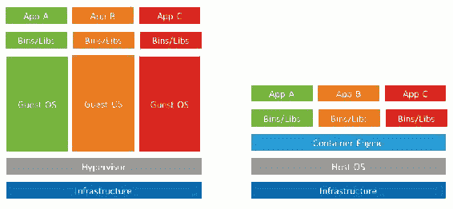
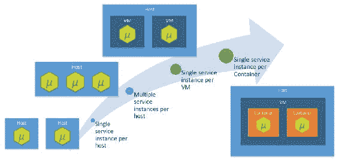
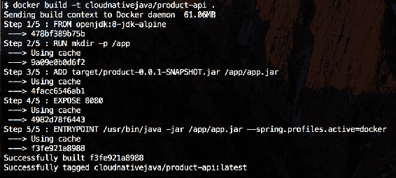
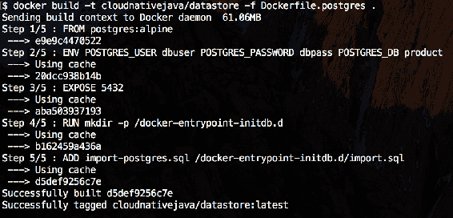
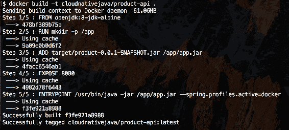
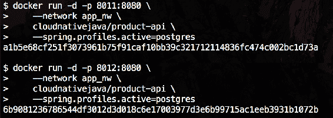
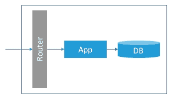
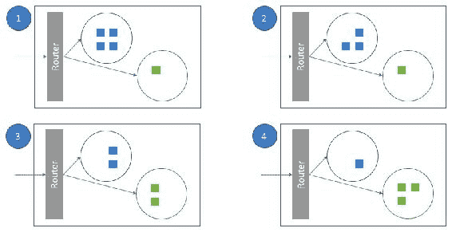
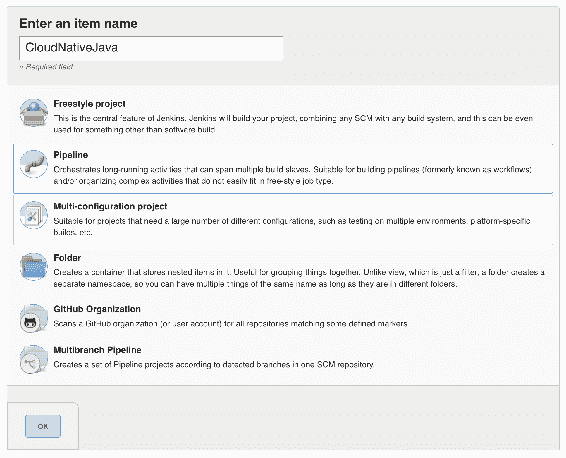

# 第七章：云原生应用部署

云原生应用最独特的一点是它们的部署方式。在传统的应用部署中，团队通过登录服务器并安装应用程序来部署他们的应用。但在云中通常有许多服务器，登录到每台服务器并手动安装应用程序是不可行的，而且可能非常容易出错。为了解决这些问题，我们使用云配置工具来自动部署云原生应用。

在本章中，我们将深入探讨微服务的部署模型，包括如何将应用程序打包为 Docker 容器、如何设置 CI/CD 流水线以及如何保护您的服务免受分布式拒绝服务（DDoS）等安全攻击。我们将涵盖以下内容：

+   部署模型、打包和容器化（使用 Docker）

+   部署模式（蓝绿部署、金丝雀发布和暗部署）

+   DDoS

+   CI/CD

# 部署模型

我们将涵盖在云环境中部署我们的应用程序所使用的部署模型。

# 虚拟化

云的基本构建块是虚拟机（从现在开始称为 VM），它相当于用户可以登录并安装或维护应用程序的物理服务器（或主机）。不同之处在于可以在单个主机上托管多个 VM，从而增加资源利用率。这是通过使用虚拟化实现的，其中在主机上安装了一个可以将物理服务器上可用的资源（如计算、内存、存储和网络）分配给托管在其上的不同 VM 的 hypervisor。云原生应用可以使用以下策略部署在这些 VM 上：

+   每个 VM 上有多个应用程序

+   每个 VM 上一个应用程序

在每个 VM 上运行多个应用程序时，有可能一个应用程序占用了 VM 上所有可用的资源，使其他应用程序无法运行。另一方面，每个 VM 上只运行一个应用程序可以确保应用程序被隔离，以便它们不会相互影响，但这种部署方式的缺点是资源的浪费，因为每个应用程序可能并不总是消耗所有可用的资源。

# PaaS

PaaS 或平台即服务是部署云原生应用的另一个流行选项。PaaS 提供了补充开发、扩展和维护云原生应用的附加服务。通过构建包，自动化构建和部署等服务大大减少了设置额外基础设施来支持这些活动所需的时间。PaaS 还提供了一些基本的基础设施服务，如监控、日志聚合、秘密管理和负载均衡。Cloud Foundry、Google App Engine、Heroku 和 OpenShift 是 PaaS 的一些示例。

# 容器

为了提供所需的独立运行级别的隔离，并节约资源利用，人们开发了容器技术。通过利用 Linux 内核的特性，容器在进程级别提供了 CPU、内存、存储和网络隔离。下图展示了虚拟化的差异：



容器消除了对客户操作系统的需求，因此大大增加了可以在同一主机上运行的容器数量，与可以在同一主机上运行的虚拟机数量相比。容器的占用空间也更小，大约为 MB 级别，而虚拟机很容易超过几 GB。

容器在 CPU 和内存方面也非常高效，因为它们不必支持运行完整操作系统时必须支持的许多外围系统：



前面的图表显示了云原生应用部署策略的演变，旨在增加资源利用率和应用程序的隔离性。在堆栈的顶部是在主机上运行的 VM 中运行的容器。这允许应用程序按两个程度进行扩展：

+   增加 VM 中容器的数量

+   增加运行容器的 VM 数量

# Docker

Docker 是一个备受欢迎的容器运行时平台，已经证明自己是部署云原生应用程序的强大平台。Docker 在 Windows、Mac 和 Linux 等所有主要平台上都可用。由于容器需要 Linux 内核，因此在 Linux 环境中更容易运行 Docker 引擎。但是，在 Windows 和 Mac 环境中有多种资源可用于舒适地运行 Docker 容器。我们将演示如何将我们迄今为止开发的服务部署为 Docker 容器，包括连接到在其自己的容器中运行的外部数据库。

在我们的示例中，我们将使用 Docker Toolbox 并使用 Docker Machine 创建一个 VM，在其中将运行 Docker 引擎。我们将使用 Docker 命令行客户端连接到此引擎，并使用提供的各种命令。

# 构建 Docker 镜像

我们将开始将我们当前的项目作为一组 Docker 容器进行容器化。我们将逐步介绍每个项目的步骤。

# Eureka 服务器

1.  在`$WORKSPACE/eureka-server/.dockerignore`中添加一个`.dockerignore`文件，内容如下：

```java
.* 
target/* 
!target/eureka-server-*.jar 
```

1.  在`$WORKSPACE/eureka-server/Dockerfile`中添加一个包含以下内容的 Dockerfile：

```java
FROM openjdk:8-jdk-alpine 

RUN mkdir -p /app 

ADD target/eureka-server-0.0.1-SNAPSHOT.jar /app/app.jar 

EXPOSE 8761 

ENTRYPOINT [ "/usr/bin/java", "-jar", "/app/app.jar" ] 
```

1.  构建可运行的 JAR，将在目标文件夹中可用：

```java
mvn package 
```

1.  构建 Docker 容器：

```java
docker build -t cloudnativejava/eureka-server . 
```

上一个命令的输出如下截图所示：


1.  在运行容器之前，我们需要创建一个网络，不同的容器可以在其中自由通信。可以通过运行以下命令来创建这个网络：

```java
docker network create app_nw 
```

上一个命令的输出如下截图所示：


1.  使用名称`eureka`运行容器，并将其附加到之前创建的网络：

```java
docker run -d --network app_nw --name eureka cloudnativejava/eureka-server 
```

上一个命令的输出如下截图所示：


# 产品 API

接下来我们将在产品 API 项目上进行工作：

1.  通过将以下内容附加到现有文件中，在`application.yml`中添加一个新的 Spring 配置文件`docker`：

```java
--- 
spring: 
  profiles: docker 
eureka: 
  instance: 
    preferIpAddress: true 
  client: 
    serviceUrl: 
      defaultZone: http://eureka:8761/eureka/ 
```

1.  构建 Spring Boot JAR 以反映对`application.yml`的更改：

```java
mvn clean package 
```

1.  添加一个`.dockerignore`文件，内容如下：

```java
.* 
target/* 
!target/product-*.jar 
```

1.  添加一个包含以下内容的 Dockerfile：

```java
FROM openjdk:8-jdk-alpine 

RUN mkdir -p /app 

ADD target/product-0.0.1-SNAPSHOT.jar /app/app.jar 

EXPOSE 8080 

ENTRYPOINT [ "/usr/bin/java", "-jar", "/app/app.jar", "--spring.profiles.active=docker" ] 
```

1.  构建 Docker 容器：

```java
docker build -t cloudnativejava/product-api . 
```

上一个命令的输出如下截图所示：



1.  启动多个 Docker 容器：

```java
docker run -d -p 8011:8080 \ 
    --network app_nw \ 
    cloudnativejava/product-api 

docker run -d -p 8012:8080 \ 
    --network app_nw \ 
    cloudnativejava/product-api 
```

上一个命令的输出如下截图所示：


产品 API 将在以下 URL 上可用：

+   `http://<docker-host>:8011/product/1`

+   `http://<docker-host>:8012/product/1`

# 连接到外部 Postgres 容器

为了将`product` API 连接到外部数据库而不是内存数据库，首先创建一个包含数据的容器镜像：

1.  创建一个文件`import-postgres.sql`，内容如下：

```java
create table product(id serial primary key, name varchar(20), cat_id int not null); 
begin; 
insert into product(name, cat_id) values ('Apples', 1); 
insert into product(name, cat_id) values ('Oranges', 1); 
insert into product(name, cat_id) values ('Bananas', 1); 
insert into product(name, cat_id) values ('Carrots', 2); 
insert into product(name, cat_id) values ('Beans', 2); 
insert into product(name, cat_id) values ('Peas', 2); 
commit; 
```

1.  创建一个包含以下内容的`Dockerfile.postgres`：

```java
FROM postgres:alpine 

ENV POSTGRES_USER=dbuser  
    POSTGRES_PASSWORD=dbpass  
    POSTGRES_DB=product 

EXPOSE 5432 

RUN mkdir -p /docker-entrypoint-initdb.d 

ADD import-postgres.sql /docker-entrypoint-initdb.d/import.sql 
```

1.  现在构建包含数据库初始化内容的 Postgres 容器镜像：

```java
docker build -t cloudnativejava/datastore -f Dockerfile.postgres . 
```

上一个命令的输出如下截图所示：



1.  通过将以下内容附加到现有文件中，在`application.yml`中添加一个新的 Spring 配置文件`postgres`：

```java
--- 
spring: 
  profiles: postgres 
  datasource: 
    url: jdbc:postgresql://<docker-host>:5432/product 
    username: dbuser 
    password: dbpass 
    driver-class-name: org.postgresql.Driver 
  jpa: 
    database-platform: org.hibernate.dialect.PostgreSQLDialect 
    hibernate: 
      ddl-auto: none 
```

确保将`<docker-host>`替换为适合您环境的值。

1.  构建 Spring Boot JAR 以反映对`application.yml`的更改：

```java
mvn clean package 
```

1.  构建 Docker 容器：

```java
docker build -t cloudnativejava/product-api . 
```

上述命令的输出如下截图所示：



1.  如果您已经有容器在旧镜像上运行，可以停止并删除它们：

```java
old_ids=$(docker ps -f ancestor=cloudnativejava/product-api -q) 
docker stop $old_ids 
docker rm $old_ids 
```

1.  启动数据库容器：

```java
docker run -d -p 5432:5432  
    --network app_nw  
    --name datastore  
    cloudnativejava/datastore 
```

上述命令的输出如下截图所示：


1.  启动几个产品 API 的 Docker 容器：

```java
docker run -d -p 8011:8080  
    --network app_nw  
    cloudnativejava/product-api  
    --spring.profiles.active=postgres 

docker run -d -p 8012:8080  
    --network app_nw  
    cloudnativejava/product-api  
    --spring.profiles.active=postgres 
```

上述命令的输出如下截图所示：



产品 API 将在以下 URL 上可用：

+   `http://<docker-host>:8011/product/1`

+   `http://<docker-host>:8012/product/1`

# 部署模式

在介绍了云原生应用程序的打包和部署模型之后，我们将介绍用于部署云原生应用程序的模式。传统上，应用程序在多个环境中部署，如开发、测试、暂存、预生产等，每个环境可能是最终生产环境的缩减版本。应用程序通过一系列预生产环境，并最终部署到生产环境。然而，一个重要的区别是，虽然其他环境中容忍停机时间，但在生产部署中的停机时间可能导致严重的业务后果。

使用云原生应用程序，可以实现零停机发布软件。这是通过对开发、测试和部署的每个方面严格应用自动化来实现的。我们将在后面的部分介绍**持续集成**（**CI**）/ **持续部署**（**CD**），但在这里我们将介绍一些能够快速部署应用程序的模式。所有这些模式都依赖于路由器组件的存在，它类似于负载均衡器，可以将请求路由到一定数量的应用实例。在某些情况下，应用程序本身构建了隐藏在功能标志后面的功能，可以通过对应用程序配置的更改来启用。

# 蓝绿部署

蓝绿部署是一个分为三个阶段的模式。部署的初始状态如下图所示。所有应用流量都路由到现有实例，这些实例被视为蓝色实例。蓝绿部署的表示如下：



在蓝绿部署的第一阶段，使用新版本的应用程序的一组新实例被配置并变为可用。在这个阶段，新的绿色应用实例对最终用户不可用，并且部署在内部进行验证。如下所示：


在部署的下一个阶段，路由器上会打开一个象征性的开关，现在开始将所有请求路由到绿色实例，而不是旧的蓝色实例。旧的蓝色实例会保留一段时间进行观察，如果检测到任何关键问题，我们可以根据需要快速回滚部署到旧的应用实例：


在部署的最后阶段，应用的旧蓝色实例被废弃，绿色实例成为下一个稳定的生产版本：


蓝绿部署在切换两个稳定版本的应用程序之间以及通过备用环境确保快速恢复时非常有效。

# 金丝雀部署

金丝雀部署也是蓝绿部署的一种变体。金丝雀部署解决了同时运行两个生产实例时浪费资源的问题，尽管时间很短。在金丝雀部署中，绿色环境是蓝色环境的缩减版本，并且依赖路由器的能力，始终将一小部分请求路由到新的绿色环境，而大部分请求则路由到蓝色环境。以下图表描述了这一点：


当发布应用程序的新功能需要与一些测试用户进行测试，然后根据这些用户群的反馈进行全面发布时，这种方法尤其有用。一旦确定绿色环境准备好全面发布，绿色环境的实例将增加，同时蓝色环境的实例将减少。以下是一系列图表的最佳说明：



这样就避免了运行两个生产级环境的问题，并且在从一个版本平稳过渡到另一个版本的同时，还提供了回退到旧版本的便利。

# 暗部署

另一种常用的部署模式是暗部署模式，用于部署云原生应用程序。在这种模式下，新功能被隐藏在功能标志后，并且仅对一组特定用户启用，或者在某些情况下，用户完全不知道该功能，而应用程序模拟用户行为并执行应用程序的隐藏功能。一旦确定功能准备好并且稳定可供所有用户使用，就通过切换功能标志来启用它。

# 应用 CI/CD 进行自动化

云原生应用程序部署的核心方面之一在于能够有效地自动化和构建软件交付流水线。这主要是通过使用能够从源代码库获取源代码、运行测试、构建可部署构件并将其部署到目标环境的 CI/CD 工具来实现的。大多数现代的 CI/CD 工具，如 Jenkins，都支持配置构建流水线，可以根据脚本形式的配置文件构建多个构件。

我们将以 Jenkins 流水线脚本为例，演示如何配置一个简单的构建流水线。在我们的示例中，我们将简单构建两个构件，即`eureka-server`和`product-api`可运行的 JAR 包。添加一个名为`Jenkinsfile`的新文件，内容如下：

```java
node { 
  def mvnHome 
  stage('Preparation') { // for display purposes 
    // Get some code from a GitHub repository 
    git 'https://github.com/...' 
    // Get the Maven tool. 
    // ** NOTE: This 'M3' Maven tool must be configured 
    // **       in the global configuration. 
    mvnHome = tool 'M3' 
  } 
  stage('Eureka Server') { 
    dir('eureka-server') { 
      stage('Build - Eureka Server') { 
        // Run the maven build 
        if (isUnix()) { 
          sh "'${mvnHome}/bin/mvn' -Dmaven.test.failure.ignore clean package" 
        } else { 
          bat(/"${mvnHome}binmvn" -Dmaven.test.failure.ignore clean package/) 
        } 
      } 
      stage('Results - Eureka Server') { 
        archiveArtifacts 'target/*.jar' 
      } 
    }    
  } 
  stage('Product API') { 
    dir('product') { 
      stage('Build - Product API') { 
        // Run the maven build 
        if (isUnix()) { 
          sh "'${mvnHome}/bin/mvn' -Dmaven.test.failure.ignore clean package" 
        } else { 
          bat(/"${mvnHome}binmvn" -Dmaven.test.failure.ignore clean package/) 
        } 
      } 
      stage('Results - Product API') { 
        junit '**/target/surefire-reports/TEST-*.xml' 
        archiveArtifacts 'target/*.jar' 
      } 
    } 
  } 
} 
```

流水线脚本的功能如下：

1.  从 GitHub 检出源代码

1.  配置 Maven 工具

1.  通过在检出的源代码库的两个目录中运行 Maven 构建来构建两个构件

1.  存储构建的测试结果和结果 JAR 包

在 Jenkins 中创建一个新的流水线作业：



在流水线配置中，指定 GitHub 仓库和 Git 仓库中`Jenkinsfile`的路径：


运行构建后，应该会构建出两个构件：


可以通过扩展流水线脚本来构建我们在本章中手动构建的 Docker 容器，使用 Jenkins 的 Docker 插件。

# 总结

在本章中，我们了解了可以用于部署云原生应用程序的各种部署模式，以及如何使用 Jenkins 等持续集成工具来自动化构建和部署。我们还学习了如何使用 Docker 容器构建和运行示例云原生应用程序。
