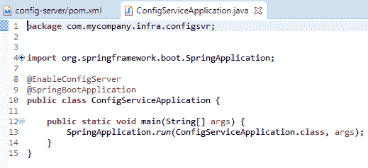
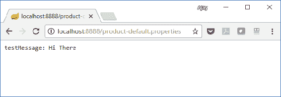
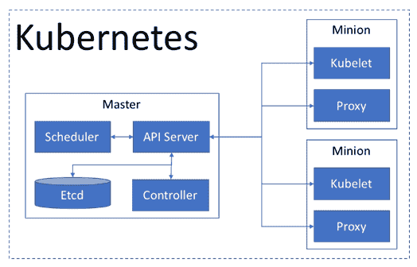
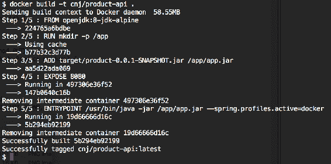
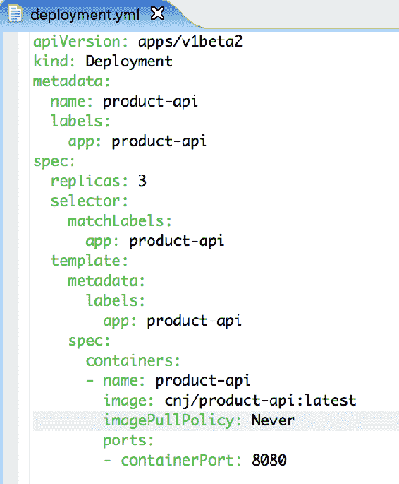
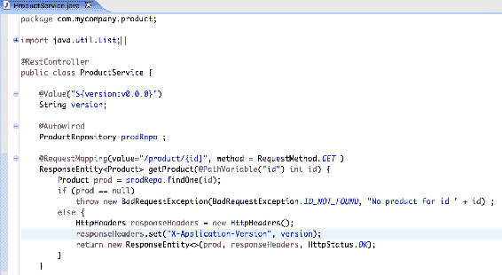
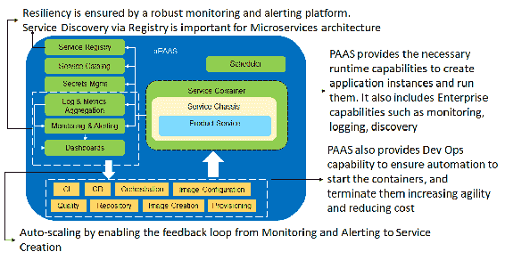

# 第八章：云原生应用程序运行时

在本章中，我们将研究我们的应用程序或服务运行的运行时生态系统。我们将涵盖以下主题：

+   全面运行时的需求，包括操作和管理大量服务中的问题的总结

+   实施参考运行时架构，包括：

+   服务注册表

+   配置服务器

+   服务前端、API 网关、反向代理和负载均衡器

+   以 Zuul 作为反向代理的介绍

+   通过 Kubernetes 和 Minikube 进行容器管理和编排

+   在**平台即服务**（PaaS）上运行：

+   PaaS 平台如何帮助实现我们在前一章讨论的服务运行时参考架构

+   安装 Cloud Foundry 并在 Cloud Foundry 上运行我们的`product`服务

# 运行时的需求

我们已经开发了我们的服务，为它们编写了测试，自动化了持续集成，并在容器中运行它们。我们还需要什么？

在生产环境中运行许多服务并不容易。随着更多服务在生产环境中发布，它们的管理变得复杂。因此，这里是对在微服务生态系统中讨论的问题的总结，并在前一章的一些代码示例中得到解决：

+   **在云中运行的服务：**传统的大型应用程序托管在应用服务器上，并在 IP 地址和端口上运行。另一方面，微服务在多个容器中以各种 IP 地址和端口运行，因此跟踪生产服务可能会变得复杂。

+   **服务像打地鼠游戏中的鼹鼠一样上下运行：**有数百个服务，它们的负载被平衡和故障转移实例在云空间中运行。由于 DevOps 和敏捷性，许多团队正在部署新服务并关闭旧服务。因此，正如我们所看到的，基于微服务的云环境非常动态。

服务注册表跟踪服务来解决这两个问题。因此，客户端可以查找与名称对应的服务在哪里运行，使用客户端负载平衡模式。然而，如果我们想要将客户端与查找分离，那么我们使用服务器端负载平衡模式，其中负载均衡器（如 Nginx）、API 网关（如 Apigee）或反向代理或路由器（如 Zuul）将客户端与服务的实际地址抽象出来。

+   **跨微服务管理我的配置：**如果部署单元已分解为多个服务，那么打包的配置项（如连接地址、用户 ID、日志级别等）也会分解为属性文件。因此，如果我需要更改一组服务或流程的日志级别，我是否需要在所有应用程序的属性文件中进行更改？在这里，我们将看到如何通过 Spring Config Server 或 Consul 将属性文件集中化，以按层次结构管理属性。

+   **处理如此多的日志文件：**每个微服务都会生成一个（或多个）日志文件，如`.out`和`.err`以及 Log4j 文件。我们如何在多个服务的多个日志文件中搜索日志消息？

解决这个问题的模式是日志聚合，使用商业工具（如 Splunk）或开源工具（如 Logstash 或 Galaxia）实现。它们也默认存在于 PaaS 提供的工具中，如 Pivotal Cloud Foundry。

另一个选项是将日志流式传输到聚合器（如 Kafka），然后可以在其中进行集中存储。

+   **来自每个服务的指标：**在第二章中，*编写您的第一个云原生应用程序*，我们添加了 Spring 执行器指标，这些指标会暴露为端点。还有许多其他指标，如 Dropwizard 指标，可以被捕获和暴露。

要么一个代理必须监视所有服务执行器指标，要么它们可以被导出，然后在监控和报告工具中进行聚合。

另一个选项是应用程序监控工具，如 Dynatrace、AppDynamics 来监控应用程序，并在 Java 级别提取指标。我们将在下一章中介绍这些。

# 实施运行时参考架构

前一节讨论的问题由以下参考运行时架构解决：


所有这些组件已经在第一章中讨论过，*云原生简介*。现在，我们继续选择技术并展示实现。

# 服务注册表

运行服务注册表 Eureka 在第二章中已经讨论过，*编写您的第一个云原生应用程序*。请参考该章节，回顾一下`product`服务如何在 Eureka 中注册自己以及客户端如何使用 Ribbon 和 Eureka 找到`product`服务。

如果我们使用 Docker 编排（如 Kubernetes），服务注册表的重要性会稍微降低。在这种情况下，Kubernetes 本身管理服务的注册，代理查找并重定向到服务。

# 配置服务器

配置服务器以分层方式存储配置。这样，应用程序只需要知道配置服务器的地址，然后连接到它以获取其余的配置。

有两个流行的配置服务器。一个是 Hashicorp 的 Consul，另一个是 Spring Config Server。我们将使用 Spring Config Server 来保持堆栈与 Spring 一致。

让我们来看看启动使用配置服务器的步骤。使用外部化配置有两个部分：服务器（提供属性）和客户端。

# 配置服务器的服务器部分

有许多选项可以通过 HTTP 连接提供属性，Consul 和 Zookeeper 是流行的选项之一。然而，对于 Spring 项目，Spring Cloud 提供了一个灵活的配置服务器，可以连接到多个后端，包括 Git、数据库和文件系统。鉴于最好将属性存储在版本控制中，我们将在此示例中使用 Spring Cloud Config 的 Git 后端。

Spring Cloud Config 服务器的代码、配置和运行时与 Eureka 非常相似，像我们在第二章中为 Eureka 做的那样，很容易启动一个实例，*编写您的第一个云原生应用程序*。

按照以下步骤运行服务注册表：

1.  创建一个新的 Maven 项目，将 artifact ID 设置为`config-server`。

1.  编辑 POM 文件并添加以下内容：

1\. 父项为`spring-boot-starter-parent`

2\. 依赖项为`spring-cloud-config-server`

3\. 依赖管理为`spring-cloud-config`


1.  创建一个`ConfigServiceApplication`类，该类将有注解来启动配置服务器：



1.  在应用程序的`config-server/src/main/resources`文件夹中创建一个`application.yml`文件，并添加以下内容：

```java
server: 
  port: 8888 
spring: 
  cloud: 
    config: 
      server: 
        git: 
          uri: file:../.. 
```

端口号是配置服务器将在 HTTP 连接上监听配置请求的地方。

`spring.cloud.config.server.git.uri`的另一个属性是 Git 的位置，我们已经为开发配置了一个本地文件夹。这是 Git 应该在本地机器上运行的地方。如果不是，请在此文件夹上运行`git init`命令。

我们在这里不涵盖 Git 身份验证或加密。请查看 Spring Cloud Config 手册（[`spring.io/guides/gs/centralized-configuration/`](https://spring.io/guides/gs/centralized-configuration/)）了解更多详情。

1.  在`product.properties`文件中，我们将保存最初保存在实际`product`项目的`application.properties`文件中的属性。这些属性将由配置服务器加载。我们将从一个小属性开始，如下所示：

```java
testMessage=Hi There 
```

此属性文件应该存在于我们刚刚在上一步中引用的 Git 文件夹中。请使用以下命令将属性文件添加到 Git 文件夹中：

```java
git add product.properties and then commit.
```

1.  在应用程序的`resources`文件夹中创建一个`bootstrap.yml`文件，并输入此项目的名称：

```java
spring: 
  application: 
    name: configsvr 
```

1.  构建 Maven 项目，然后运行它。

1.  您应该看到一个`Tomcat started`消息，如下所示：

`ConfigurationServiceApplication`已启动，并在端口`8888`上监听

让我们检查我们添加的属性是否可供使用。

打开浏览器，检查`product.properties`。有两种方法可以做到这一点。第一种是将属性文件视为 JSON，第二种是将其视为文本文件：

1.  `http://localhost:8888/product/default`:


1.  `http://localhost:8888/product-default.properties`:



如果您在想，默认是配置文件名称。Spring Boot 应用程序支持配置文件覆盖，例如，用于测试和用户验收测试（UAT）环境，其中可以用`product-test.properties`文件替换生产配置。因此，配置服务器支持以下形式的 URL 读取：`http://configsvrURL/{application}/{profile}`或`http://configsvrURL/{application-profile}.properties`或`.yml`。

在生产环境中，我们几乎不太可能直接访问配置服务器，就像之前展示的那样。将是客户端访问配置服务器；我们将在下面看到这一点。

# 配置客户端

我们将使用先前开发的`product`服务代码作为基线，开始将属性从应用程序中提取到配置服务器中。

1.  从 eclipse 中复制`product`服务项目，创建一个新的项目用于本章。

1.  将`spring-cloud-starter-config`依赖项添加到 POM 文件的依赖项列表中：


1.  我们的主要工作将在资源上进行。告诉`product`服务使用运行在`http://localhost:8888`的配置服务器。

`failFast`标志表示如果找不到配置服务器，我们不希望应用程序继续加载。这很重要，因为它将确保`product`服务在找不到配置服务器时不应假定默认值：

```java
spring: 
  application: 
    name: product 

  cloud: 
    config: 
      uri: http://localhost:8888 
      failFast: true 
```

1.  将`product`服务的`resources`文件夹中的`application.properties`部分中的所有属性转移到我们在上一节中定义的`git`文件夹的`product.properties`中。

您的`product.properties`文件现在将具有有用的配置，除了我们之前放入进行测试的`Hi There`消息之外：

```java
server.port=8082 
eureka.instance.leaseRenewalIntervalInSeconds=15 
logging.level.org.hibernate.tool.hbm2ddl=DEBUG 
logging.level.org.hibernate.SQL=DEBUG 
testMessage=Hi There 
```

1.  现在可以删除`product`服务的`resources`文件夹中存在的`application.properties`文件。

1.  让我们向`product`服务添加一个测试方法，以检查从配置服务器设置的属性：

```java
    @Value("${testMessage:Hello default}") 
    private String message; 

   @RequestMapping("/testMessage") 
   String getTestMessage() { 
         return message ; 
   }
```

1.  启动 Eureka 服务器，就像在之前的章节中所做的那样。

1.  确保上一节中的配置服务器仍在运行。

1.  现在，从`ProductSpringApp`的主类开始启动`product`服务。在日志的开头，您将看到以下语句：


当 ProductSpringApp 启动时，它首先从运行在 8888 端口的外部配置服务获取配置

在`bootstrap.yml`文件中，选择`name=product`的环境作为我们的应用程序名称。

`product`服务应该监听的端口号是从这个配置服务器中获取的，还有其他属性，比如我们现在将看到的测试消息：

`ProductSpringApp`在端口`8082`上启动，从外部化配置中获取。

使用以下两个 URL 测试应用程序：

+   `http://localhost:8082/testMessage`：这将返回我们配置的消息`Hi There`

运行其他 REST 服务之一，例如产品视图。您将看到所需的产品信息，以表明我们的服务正常运行。

+   `http://localhost:8082/product/1`：这将返回`{"id":1,"name":"Apples","catId":1}`

# 刷新属性

现在，如果您想要在所有服务上集中反映属性的更改，该怎么办？

1.  您可以将`product.properties`文件中的消息更改为新消息，例如`Hi Spring`。

1.  您会注意到配置服务器在下一次读取时接收到了这一更改，如下所示：


但是，该属性不会立即被服务接收，因为调用`http://localhost:8082/testMessage`会导致旧的`Hi There`消息。我们如何在命令行上刷新属性？

这就是执行器命令`/refresh`派上用场的地方。我们配置这些 bean 作为`@RefreshScope`注解的一部分。当从 Postman 应用程序执行`POST`方法调用`http://localhost:8082/refresh`时，这些 bean 将被重新加载。查看以下日志，以查看调用刷新会导致重新加载属性的结果：


第一行显示了`product`服务在执行`http://localhost:8082/refresh`时刷新其属性的日志

您可以查看，在标记线之后，属性加载重新开始，并在调用`http://localhost:8082/testMessage`后反映出消息。 

# 微服务前端

使用反向代理、负载均衡器、边缘网关或 API 网关来作为微服务的前端是一种流行的模式，复杂度逐渐增加。

+   **反向代理**：反向代理被定义为使下游资源可用，就好像它是自己发出的一样。在这方面，Web 服务器前端和应用服务器也充当反向代理。反向代理在云原生应用中非常有用，因为它确保客户端无需像我们在第二章中所做的那样查找服务然后访问它们。他们必须访问反向代理，反向代理查找微服务，调用它们，并使响应可用于客户端。

+   **负载均衡器**：负载均衡器是反向代理的扩展形式，可以平衡来自客户端的请求，使其分布在多个服务之间。这增加了服务的可用性。负载均衡器可以与服务注册表一起工作，找出哪些是活动服务，然后在它们之间平衡请求。Nginx 和 HAProxy 是可以用于微服务前端的负载均衡器的良好例子。

+   **边缘网关**：顾名思义，边缘网关是部署在企业或部门边缘的高阶组件，比负载均衡器具有更多功能，如身份验证、授权、流量控制和路由功能。Netfix Zuul 是这种模式的一个很好的例子。我们将在本节中介绍使用 Zuul 的代码示例。

+   **API 网关**：随着移动和 API 的流行，这个组件提供了更复杂的功能，比如将请求分发到多个服务之间进行编排，拦截和增强请求或响应，或转换它们的格式，对请求进行复杂的分析。也可以同时使用 API 网关和负载均衡器、反向代理或边缘在一个流中。这种方法有助于责任的分离，但也会因为额外的跳跃而增加延迟。我们将在后面的章节中看到 API 网关。

# Netflix Zuul

Netflix Zuul 是 Netflix 推广的一种流行的边缘网关，后来作为 Spring Cloud 的一部分提供。Zuul 意味着守门人，并执行所有这些功能，包括身份验证、流量控制，最重要的是路由，正如前面讨论的那样。它与 Eureka 和 Hystrix 很好地集成，用于查找服务和报告指标。企业或域中的服务可以由 Zuul 前端化。

让我们在我们的`product`服务前面放一个 Zuul 网关：

1.  创建一个新的 Maven 项目，并将其 artifact ID 设置为`zuul-server`。

1.  编辑 POM 文件并添加以下内容：

1. 将父级设置为`spring-boot-starter-parent`

2. 在`spring-cloud-starter-zuul`，`-eureka`和`-web`项目上设置依赖管理

3. 在`spring-cloud-starter-netflix`上设置依赖管理。


1.  创建一个带有注释以启用 Zuul 代理的应用程序类：


`application.yml`中的配置信息对于 Zuul 非常重要。这是我们配置 Zuul 的路由能力以将其重定向到正确的微服务的地方。

1.  由于 Zuul 与 Eureka 的交互良好，我们将利用这一点：

```java
eureka: 
  client: 
    serviceUrl: 
defaultZone: http://127.0.0.1:8761/eureka/ 
```

这告诉 Zuul 在运行该端口的 Eureka 注册表中查找服务。

1.  将端口配置为`8080`。

1.  最后，配置路由。

这些是 REST 请求中 URL 到相应服务的映射：

```java
zuul: 
  routes: 
    product: 
      path: /product*/** 
      stripPrefix: false 
```

# 幕后发生了什么

让我们来看看幕后发生了什么：

1.  路由定义中的`product`部分告诉 Zuul，配置在`/product*/**`之后的路径应该被重定向到`product`服务，如果它在 Zuul 服务器中配置的 Eureka 注册表中存在。

1.  路径配置为`/product*/**`。为什么有三个`*`？如果您记得，我们的`product`服务可以处理两种类型的 REST 服务：`/product/1 GET`和`/product PUT`，`DELETE`，`POST`请求。`/products?id=1 GET`请求要求它返回给定类别 ID 的产品列表。因此，`product*`映射到 URL 中的`/product`和`/products`。

1.  `stripPrefix`的`false`设置允许`/product/`传递到`product`服务。如果未设置该标志，则仅在`/product*/`之后的 URL 的其余部分将传递给微服务。我们的`product`微服务包括`/product`，因此我们希望在转发到`product`服务时保留前缀。

# 一次性运行它们

现在让我们尝试运行我们的`product`服务，以及其他生态系统的其余部分：

1.  按照依赖关系的相反顺序启动服务。

1.  通过运行项目的主类或通过 Maven 启动配置服务器和 Eureka 服务器。

1.  启动`product`服务。

1.  启动 Zuul 服务。

观察日志窗口，并等待所有服务器启动。

1.  现在，在浏览器中运行以下请求：

+   `http://localhost:8080/product/3`

+   `http://localhost:8080/products?id=1`

您应该在第一个请求中看到产品`3`，在第二个请求中看到与类别`1`对应的产品。

让我们来看看 Zuul 和`product`服务的日志：

+   在 Zuul 中，您可以看到`/product*/**`的映射已经解析，并且从 Eureka 注册表中获取了指向`product`服务的端点：


Zuul 边缘现在已注册以映射对`product`服务的请求，并将其转发到 Eureka 指向的服务地址

+   在`product`服务中，通过在数据库上运行查询来执行服务：


# Kubernetes - 容器编排

到目前为止，我们一直在单独部署诸如 Eureka、配置服务器、`product`服务和 Zuul 等服务。

从上一章中可以看出，我们可以通过 CI（如 Jenkins）自动化部署它们。我们还看到了如何使用 Docker 容器进行部署。

然而，在运行时，容器仍然独立运行。没有机制来扩展容器，或者在其中一个容器失败时重新启动它们。此外，手动决定将哪个服务部署在哪个 VM 上，这意味着服务始终部署在静态 VM 上，而不是智能地混合部署。简而言之，管理我们应用服务的编排层缺失。

Kubernetes 是一种流行的编排机制，使部署和运行时管理变得更加容易。

# Kubernetes 架构和服务

Kubernetes 是由 Google 主导的开源项目。它试图实现一些在其内部容器编排系统 Borg 中实现的经过验证的想法。Kubernetes 架构由两个组件组成：主节点和从节点。主节点具有以下组件：

+   **控制器**：管理节点、副本和服务

+   **API 服务器**：提供`kubectl`客户端和从节点使用的 REST 端点

+   **调度程序**：决定特定容器必须生成的位置

+   **Etcd**：用于存储集群状态和配置

从节点包含两个组件：

+   **Kubelet**：与主节点通信资源可用性并启动调度程序指定的容器的代理

+   **代理**：将网络请求路由到 kubernetes 服务



Kubernetes 是一个容器调度程序，使用两个基本概念，即 Pod 和 Service。Pod 是一组相关容器，可以使用特定的标签进行标记；服务可以使用这些标签来定位 Pod 并公开端点。以下图示了这个概念：


Pods are considered ephemeral in kubernetes and may be killed. However, if the Pods were created using a `ReplicaSet`, where we can specify how many replicas or instances of a certain Pod have to be present in the system, then the kubernetes scheduler will automatically schedule new instances of the Pod and once the Pod becomes available, the service will start routing traffic to it. As you may notice that a Pod may be targeted by multiple services provided the labels match, this feature is useful to do rolling deployments.

我们现在将看看如何在 kubernetes 上部署一个简单的 API 并进行滚动升级。

# Minikube

Minikube 是一个项目，可以在虚拟机上运行一个工作的单节点 Kubernetes。

您可以按照以下说明安装 Minikube：[`github.com/kubernetes/minikube`](https://github.com/kubernetes/minikube)。

对于 Windows，请确保已完成以下步骤：

+   kubectl 二进制文件也需要下载并放置在路径中，以便一旦 Minikube 运行 kubernetes，我们可以从命令提示符通信和管理 kubernetes 资源。您可以从以下网址下载：[`storage.googleapis.com/kubernetes-release/release/v1.9.0/bin/windows/amd64/kubectl.exe.`](https://storage.googleapis.com/kubernetes-release/release/v1.9.0/bin/windows/amd64/kubectl.exe)

+   您必须从与`Users`目录位于同一驱动器（例如`C:`）上运行 Minikube。

# 在 Kubernetes 中运行产品服务

让我们将现有的`product`服务更改为通过 Kubernetes 容器编排运行：


1.  您可以通过运行它来测试配置是否有效，如下面的屏幕截图所示：


1.  设置 Docker 客户端以连接到在 Minikube VM 中运行的 Docker 守护程序，如下所示：


1.  根据我们在前几章中创建 Docker 镜像的说明构建 Docker 镜像：



1.  创建一个`deployment`文件（请注意，`imagePullPolicy`设置为`never`，因为否则，Kubernetes 的默认行为是从 Docker 注册表中拉取）：



1.  验证三个实例是否正在运行：


1.  创建一个`service.yml`文件，以便我们可以访问 Pods：


现在，按照以下方式运行`service.yml`文件：


现在，您可以获取服务的地址：


现在，您可以访问 API，该 API 将路由请求到所有三个 Pod：


您可以使用`-v`来获取以下详细信息的单个命令：


1.  更改代码如下：



1.  使用新标签构建 Docker 镜像：


1.  更新`deployment.yml`文件：


1.  应用更改：


# 平台即服务（PaaS）

云原生应用程序的另一个流行运行时是使用 PaaS 平台，具体来说是应用程序 PaaS 平台。PaaS 提供了一种轻松部署云原生应用程序的方式。它们提供了额外的服务，如文件存储、加密、键值存储和数据库，可以轻松绑定到应用程序上。PaaS 平台还提供了一种轻松的机制来扩展云原生应用程序。现在让我们了解一下为什么 PaaS 平台为云原生应用程序提供了出色的运行时。

# PaaS 的案例

在运行时架构实现中，我们看到许多组件，例如配置服务器、服务注册表、反向代理、监控、日志聚合和指标，必须共同实现可扩展的微服务架构。除了`ProductService`中的业务逻辑外，其余的服务和组件都是纯粹的支持组件，因此涉及大量的平台构建和工程。

如果我们构建的所有组件都是作为服务提供的平台的一部分，会怎么样？因此，PaaS 是对容器编排的更高级抽象。PaaS 提供了我们在容器编排中讨论的所有基本基础设施服务，例如重新启动服务、扩展服务和负载平衡。此外，PaaS 还提供了补充开发、扩展和维护云原生应用程序的其他服务。这种方法的折衷之处在于它减少了在选择和微调组件方面的选择。然而，对于大多数专注于业务问题的企业来说，这将是一个很好的折衷。

因此，使用 PaaS，开发人员现在可以专注于编写代码，而不必担心他/她将部署在哪个基础设施上。所有的工程现在都变成了开发人员和运维团队可以配置的配置。



PaaS 的另外一些优势包括：

+   **运行时**：为开发人员提供各种运行时，如 Java、Go、Node.js 或.NET。因此，开发人员专注于生成部署，可以在 PaaS 环境提供的各种运行时中运行。

+   **服务**：PaaS 提供应用程序服务，如数据库和消息传递，供应用程序使用。这是有益的，因为开发人员和运营人员不必单独安装或管理它们。

+   **多云**：PaaS 将开发人员与基础架构（或 IaaS）抽象出来。因此，开发人员可以为 PaaS 环境开发，而不必担心将其部署在数据中心或各种云提供商（如 AWS、Azure 或 Google Cloud Platform）上，如果 PaaS 在这些基础设施上运行。这避免了对基础设施或云环境的锁定。

PaaS 环境的权衡是它们可能会限制并降低灵活性。默认选择的服务和运行时可能不适用于所有用例。然而，大多数 PaaS 提供商提供插入点和 API 来包含更多服务和配置，并提供策略来微调运行时行为，以减轻权衡。

# Cloud Foundry

Cloud Foundry 是 Cloud Foundry 基金会拥有的最成熟的开源 PaaS 之一。

它主要由以下部分组成：

+   **应用程序运行时**：开发人员部署 Java 或 Node.js 应用程序等应用程序工作负载的基础平台。应用程序运行时提供应用程序生命周期、应用程序执行和支持功能，如路由、身份验证、平台服务，包括消息传递、指标和日志记录。

+   **容器运行时**：容器运行的运行时抽象。这提供了基于 Kubernetes 的容器的部署、管理和集成，应用程序运行在其上，它基于 Kubo 项目。

+   **应用程序服务**：这些是应用程序绑定的数据库等服务。通常由第三方提供商提供。

+   **Cloud Foundry 组件**：有很多，比如 BOSH（用于容器运行时）、Diego（用于应用程序运行时）、**公告板系统**（**BBS**）、NATS、Cloud Controller 等等。然而，这些组件负责提供 PaaS 的各种功能，并可以从开发人员中抽象出来。它们与运营和基础设施相关且感兴趣。

# 组织、帐户和空间的概念

Cloud Foundry 具有详细的**基于角色的访问控制**（**RBAC**）来管理应用程序及其各种资源：

+   **组织**：这代表一个组织，可以将多个用户绑定到其中。一个组织共享应用程序、服务可用性、资源配额和计划。

+   **用户帐户**：用户帐户代表可以在 Cloud Foundry 中操作应用程序或操作的个人登录。

+   **空间**：每个应用程序或服务都在一个空间中运行，该空间绑定到组织，并由用户帐户管理。一个组织至少有一个空间。

+   **角色和权限**：属于组织的用户具有可以执行受限操作（或权限）的角色。详细信息已记录在：[`docs.cloudfoundry.org/concepts/roles.html`](https://docs.cloudfoundry.org/concepts/roles.html)。

# Cloud Foundry 实施的需求

在安装和运行原始 Cloud Foundry 中涉及了大量的工程工作。因此，有许多 PaaS 实现使用 Cloud Foundry 作为基础，并提供额外的功能，最流行的是 IBM 的 Bluemix、Redhat 的 OpenShift 和 Pivotal 的**Pivotal Cloud Foundry**（PCF）。

# Pivotal Cloud Foundry（PCF）

Pivotal 的 Cloud Foundry 旨在提高开发人员的生产力和运营效率，并提供安全性和可用性。

尽管本书的读者可以自由选择基于 Cloud Foundry 的 PaaS 实现，但我们选择 Pivotal 有几个原因：

+   Pivotal 一直以来都支持 Spring Framework，我们在书中广泛使用了它。Pivotal 的 Cloud Foundry 实现原生支持 Spring Framework 及其组件，如 Spring Boot 和 Spring Cloud。因此，我们创建的 Spring Boot 可部署文件可以直接部署到 Cloud Foundry 的应用运行时并进行管理。

+   Pivotal 的服务市场非常丰富，涵盖了大多数合作伙伴提供的平台组件，包括 MongoDB、PostgreSQL、Redis，以及 Pivotal 开发的 MySQL 和 Cloud Cache 的原生支持服务。

+   Pivotal 在这个领域进行了多次发布，因此服务提供频繁更新。

# PCF 组件

Pivotal 网站[pivotal.io/platform](https://pivotal.io/platform)提供了一个非常简单的 Cloud Foundry 实现图表，与我们之前的讨论相对应：

+   Pivotal 应用程序服务（PAS）：这是一个应用程序的抽象，对应于 Cloud Foundry 中的应用程序运行时。在内部，它使用 Diego，但这对开发人员来说是隐藏的。PAS 对 Spring Boot 和 Spring Cloud 有很好的支持，但也可以运行其他 Java、.NET 和 Node 应用程序。它适用于运行自定义编写的应用程序工作负载。

+   Pivotal 容器服务（PKS）：这是一个容器的抽象，与 Cloud Foundry 中的容器运行时相对应。它在内部使用 BOSH。它适用于运行作为容器提供的工作负载，即独立服务供应商（ISV）应用程序，如 Elasticsearch。

+   Pivotal Function Service（PFS）：这是 Pivotal 在 Cloud Foundry 平台之外的新产品。它提供了函数的抽象。它推动了无服务器计算。这些函数在 HTTP 请求（同步）或消息到达时（异步）被调用。

+   **市场**：这对应于 Cloud Foundry 中的应用程序服务。鉴于 PCF 的流行，市场上有很多可用的服务。

+   **共享组件**：这些包括运行函数、应用程序和容器所需的支持服务，如身份验证、授权、日志记录、监控（PCF watch）、扩展、网络等。


PCF 可以在包括 Google Compute Platform、Azure、AWS 和 Open Stack（IaaS）在内的大多数热门云上运行，并托管在数据中心。

虽然 PCF 及其组件非常适合服务器端负载，但对于在本地机器上构建软件的开发人员来说可能会很麻烦。我们现在就处于这个阶段。我们已经开发了`product`服务，并通过各个阶段成熟，以达到云原生运行时。

整个 PCF 及其运行时组件难以适应笔记本电脑进行开发。

# PCF Dev

PCF Dev 是一个精简的 PCF 发行版，可以在台式机或笔记本电脑上本地运行。它承诺能够在开发人员主要 PCF 环境上拥有相同的环境，因此当为 PCF Dev 设计的应用程序在主要 PCF 环境上运行时不会有任何差异。请参考[`docs.pivotal.io/pcf-dev/index.html`](https://docs.pivotal.io/pcf-dev/index.html)中的表格，了解 PCF Dev 与完整 PCF 和 Cloud Foundry（CF）提供的大小和功能的确切比较：

+   它支持 Java、Ruby、PHP 和 Python 的应用程序运行时。

+   它具有 PAS 的迷你版本，为我们迄今为止讨论的服务开发提供了必要的功能，如日志记录和指标、路由、Diego（Docker）支持、应用程序服务、扩展、监控和故障恢复。

+   它还内置了四个应用程序服务，它们是：Spring Cloud Services（SCS）、Redis、RabbitMQ 和 MySQL。

+   但是，它不适用于生产。它没有 BOSH，它在基础架构层上进行编排。

如果您的台式机/笔记本内存超过 8GB，磁盘空间超过 25GB，让我们开始吧。

# 安装

PCF Dev 可以在 Mac、Linux 或 Windows 环境中运行。按照说明，例如，[`docs.pivotal.io/pcf-dev/install-windows.html`](https://docs.pivotal.io/pcf-dev/install-windows.html) for Windows，来在您的机器上运行 PCF Dev。这基本上分为三个步骤：

+   获取 Virtual Box

+   CF 命令行界面

+   最后，PCF Dev

# 启动 PCF Dev

第一次使用 cf dev start 时，下载 VM 映像（4GB）、提取它（20GB），然后启动 PCF 的各种服务需要很长时间。因此，一旦 VM 下载并运行，我们将暂停和恢复带有 Cloud Foundry 服务的 VM。

启动 PCF Dev 的命令行选项如下：

1.  假设您有多核机器，您可以为该 VM 分配一半的核心，例如对于四核机器，可以使用`-c 2`。

1.  SCS 版本将使用 8GB 内存；为了保持缓冲区，让我们在命令行上使用以 MB 表示的 10GB 内存。

1.  在下一章中，我们将需要 MySQL 和 SCS 的服务。在内部，SCS 需要 RabbitMQ 来运行。因此，在运行实例时，让我们包括所有服务器。

1.  给出域和 IP 地址是可选的，因此我们将跳过`-d`和`-i`选项。

1.  将环境变量`PCFDEV_HOME`设置为具有足够空间的特定驱动器上的特定文件夹，以便它不会默认为主文件夹。我们建议主文件夹是像 SSD 这样的快速驱动器，因为 Cloud Foundry 的启动和停止操作非常 I/O 密集。

因此，我们的启动命令将如下所示：

```java
cf dev start -c 2 -s all -m 10000 
```

这将花费很长时间，直到您的 PCF Dev 环境准备就绪。

**加快开发时间**

每次启动整个 PCF Dev 环境时等待 20 分钟是很困难的。一旦您完成了当天的工作或在关闭笔记本电脑之前，您可以使用`cf dev suspend`来暂停 PCF Dev，并在第二天使用`cf dev resume`命令来恢复它。

其他有用的命令包括：

+   默认的 PCF Dev 创建了两个用户—admin 和 user。要安装或管理应用程序，您应该登录为其中一个用户。命令`cf dev target`会将您登录为默认用户。

+   `cf dev trust`命令安装证书以启用 SSL 通信，因此您无需每次在命令行或浏览器中的应用程序管理器上登录时使用参数`-skip ssl`。

+   `cf marketplace`命令（一旦您以用户身份登录）显示可以在组织和空间中安装的各种服务。

让我们看一下迄今为止讨论的命令的输出：


正如我们在市场中看到的，由于我们使用了所有服务选项启动 PCF Dev，我们可以看到市场已准备好了七项服务。

# 在 PCF 上创建 MySQL 服务

从列表中，在本章中，我们将配置我们的`product`服务以与 MySQL 数据库一起工作，并在下一章中查看 Spring Cloud 服务，例如断路器仪表板和其他服务。

运行以下命令：

```java
cf create-service p-mysql 512mb prod-db 
```

检查服务是否正在运行：


# 在 PCF Dev 上运行产品服务

让我们创建`product`服务的简化版本，它只是连接到我们之前创建的 MySQL 服务以运行查询。

您可以从第三章的练习代码*设计您的云原生应用程序*中编写练习代码，也可以从 Git 下载文件到您的 Eclipse 环境。值得注意的工件有：

+   在 Maven 文件中：

+   请注意，在下面的截图中，我们已将我们的工件重命名为`pcf-product`。

+   一个值得注意的新依赖是`spring-cloud-cloudfoundry-connector`。它发现了绑定到 Cloud Foundry 应用程序的服务，比如 MySQL 配置，并使用它们。

+   我们已经为 JPA 包含了一个 MySQL 连接器，用于连接到 MySQL 数据库：


+   在`application.properties`文件中：

+   请注意，我们没有提供任何 MySQL 连接属性，比如数据库、用户或密码。当应用程序上传到 Cloud Foundry 并与 MySQL 数据库服务绑定时，这些属性会被 Spring 应用程序自动获取。

+   在 MySQL 的自动创建设置中，仅在开发目的下应该为`true`，因为它会在每次应用程序部署时重新创建数据库。在 UAT 或生产配置文件中，此设置将为`none`：

```java
management.security.enabled=false
logging.level.org.hibernate.tool.hbm2ddl=DEBUG 
logging.level.org.hibernate.SQL=DEBUG 
spring.jpa.hibernate.ddl-auto=create 
```

+   `ProductSpringApp`类被简化为一个普通的 Spring Boot 启动应用程序。我们将在下一章中增强这一点，包括指标、查找、负载平衡、监控和管理：


+   `ProductRepository`类只有一个名为`findByCatId`的方法。其余的方法，比如`get`、`save`、`delete`和`update`都是在存储库中自动派生的。

+   `ProductService`、`product`和其他类与第三章中的相同，*设计您的云原生应用程序*。

+   在`manifest.yml`文件中：

+   这是一个包含部署到云 Foundry 的说明的新文件

+   我们将编写最基本的版本，包括应用程序名称、分配 1GB 内存空间以及与 CloudFoundry 中的 MySQL 服务绑定

+   随机路由允许应用程序在没有冲突的情况下获取 URL 的路由，以防多个版本的情况发生：


一旦项目准备好，运行`mvn install`来在`target`目录中创建全面的`.jar`文件。它的名称应该与`manifest.yml`文件中的`.jar`文件的名称匹配。

# 部署到 Cloud Foundry

部署到 Cloud Floundry 很简单，使用命令`cf push pcf-product`，如下所示：


Cloud Foundry 在空间中创建应用程序、创建路由以到达应用程序，然后将各种服务与应用程序绑定时做了很多工作。如果你对底层发生的事情感兴趣，也许应该多了解一下 Cloud Foundry。

部署完成后，您将看到以下成功方法：


注意在前面截图中生成的 URL。

它是`http://pcf-product-undedicated-spirketting.local.pcfdev.io`。我们将在下一章中看到如何缩短这个 URL。

如果在启动时出现错误，例如配置错误或缺少一些步骤，您可以通过在命令行中输入以下命令来查看日志：

```java
cf logs pcf-product --recent 
```

现在是时候测试我们的服务了。在浏览器窗口中，运行通常运行的两个服务：

+   `http://pcf-product-undedicated-spirketting.local.pcfdev.io/product/1`

+   `http://pcf-product-undedicated-spirketting.local.pcfdev.io/products?id=1`

您将看到来自数据库的响应，即输出和日志，如下所示：


这完成了将我们简单的`product`服务部署到 PCF 上的 PCF Dev。

# 总结

在本章中，我们看到了支持云原生应用程序的各种运行时组件，并在各种运行时环境中运行了我们的应用程序，比如 Kubernetes 和 Cloud Foundry。

在下一章中，我们将在 AWS Cloud 上部署我们的服务。
