# 第十章：平台部署 - Azure

本章讨论了 Azure 的应用程序设计和部署——这是微软的公共云平台。云原生开发的本质是能够将您的应用程序与云提供商提供的 PaaS 平台集成。作为开发人员，您专注于创造价值（解决客户问题），并允许云提供商为您的应用程序的基础设施进行繁重的工作。

在本章中，我们将学习以下内容：

+   Azure 提供的不同类别的 PaaS 服务。我们将深入研究将被我们的样例应用程序使用的服务。

+   将我们的样例应用程序迁移到 Azure，并了解各种可用选项。我们还将评估所有选项，并了解每个选项的利弊。

我们正在介绍 Azure 平台，目的是展示如何构建和部署应用程序。我们不打算深入研究 Azure，并期望读者使用 Azure 文档（[`docs.microsoft.com/en-us/azure/`](https://docs.microsoft.com/en-us/azure/)）来探索其他选项。

Azure 支持多种编程语言，但出于本书的目的，我们将关注 Azure 对 Java 应用程序的支持。

# Azure 平台

Azure 提供了越来越多的 PaaS 和 IaaS，涵盖了各种技术领域。对于我们的目的，我们将关注直接适用于我们应用程序的子集领域和服务。

为了方便使用，我已经在最相关的技术领域中创建了这个服务分类模型：

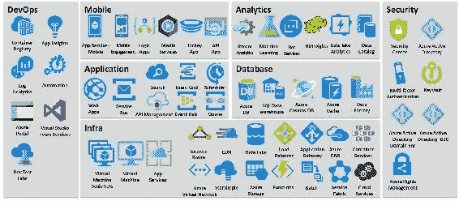

*这只是一个指示性列表，绝不是一个详尽的列表。请参考 Azure 门户以获取完整列表。*

在前述分类模型中，我们将服务分为以下领域：

+   **基础设施**：这是 Azure 提供的一系列服务，用于部署和托管我们的应用程序。我们已经将计算、存储和网络等服务结合在这个类别中。为了我们样例 Java 应用程序的目的，我们将研究以下一系列服务。

+   **应用服务**：我们如何将现有的 Spring Boot 应用程序部署到我们的 Azure 平台？这更像是一个搬迁和部署的场景。在这里，应用程序没有重构，但依赖项被部署在应用服务上。使用其中一个数据库服务，应用程序可以被部署和托管。Azure 提供了 PostgreSQL 和 MySQL 作为托管数据库模型，还有其他各种选项。

+   **容器服务**：对于打包为 Docker 容器的应用程序，我们可以探索如何将 Docker 容器部署到平台上。

+   **函数**：这是无服务器平台模型，您无需担心应用程序的托管和部署。您创建一个函数，让平台为您进行繁重的工作。截至目前，基于 Java 的 Azure 云函数处于测试阶段。我们将探讨如何在开发环境中创建一个函数并进行本地测试。

+   **服务布局**：服务布局是一个用于部署和管理微服务和容器应用程序的分布式系统平台。我们将探讨如何在服务布局中部署我们的样例“产品”API。

+   **应用程序**：这是一个帮助构建分布式应用程序的服务列表。随着我们转向分布式微服务模型，我们需要解耦我们的应用程序组件和服务。队列、事件中心、事件网格和 API 管理等功能有助于构建一组稳健的 API 和服务。

+   **数据库**：这是 Azure 平台提供的数据存储选项列表。其中包括关系型、键值、Redis 缓存和数据仓库等。

+   **DevOps**：对于在云中构建和部署应用程序，我们需要强大的 CI/CD 工具集的支持。Visual Studio 团队服务用于托管代码、问题跟踪和自动构建。同样，开源工具在 Azure 门户中仍然不是一流的公民。您可以随时使用所需软件的托管版本。

+   **安全**：云应用程序的另一个关键因素是安全服务。在这一领域，提供了 Active Directory、权限管理、密钥保管库和多重身份验证等关键服务。

+   **移动**：如果您正在构建移动应用程序，该平台提供了关键服务，如移动应用程序服务、媒体服务和移动参与服务等。

+   **分析**：在分析领域，该平台通过 HDInsight 和数据湖服务提供了 MapReduce、Storm、Spark 等领域的强大服务，用于分析和数据存储库。

此外，Azure 还提供了多个其他技术领域的服务——**物联网**（**IoT**）、监控、管理、**人工智能**（**AI**）以及认知和企业集成领域。

# Azure 平台部署选项

正如我们在前一节中看到的，Azure 提供了许多选项来构建和部署平台上的应用程序。我们将使用我们的“产品”API REST 服务的示例来检查 Azure 提供的各种选项，以部署和运行我们的应用程序。

在我们开始之前，我假设您熟悉 Azure 平台，并已经在门户中注册。

Azure 支持多种编程语言，并提供 SDK 以支持各自领域的开发。对于我们的目的，我们主要探索 Azure 平台内对 Java 应用程序的支持。

我们将在以下四个领域探索应用程序托管服务：

+   应用服务

+   容器服务

+   服务织物

+   功能

有关更多详细信息和入门，请参考以下链接：[`azure.microsoft.com/en-in/downloads/`](https://azure.microsoft.com/en-in/downloads/)。

# 将 Spring Boot API 部署到 Azure 应用服务

在本节中，我们将把我们的“产品”API 服务迁移到 Azure 应用服务。我们将查看应用程序为满足 Azure 应用服务的要求所做的额外更改。

我已经拿取了我们在第三章中构建的“产品”API REST 服务，*设计您的云原生应用程序*。在服务中，我们做出以下更改：

在项目的根文件夹中添加一个名为`web.config`的文件：

```java
<?xml version="1.0" encoding="UTF-8"?>
<configuration>
  <system.webServer>
    <handlers>
      <add name="httpPlatformHandler" path="*" verb="*" 
       modules="httpPlatformHandler" resourceType="Unspecified"/>
    </handlers>
    <httpPlatform processPath="%JAVA_HOME%binjava.exe"
     arguments="-Djava.net.preferIPv4Stack=true -            
     Dserver.port=%HTTP_PLATFORM_PORT% -jar &quot;
     %HOME%sitewwwrootproduct-0.0.1-SNAPSHOT.jar&quot;">
    </httpPlatform>
  </system.webServer>
</configuration>
```

文件添加了以下更改，`product-0.0.1-SNAPSHOT.jar`，这是我们应用程序的包名称。如果您的应用程序名称不同，您将需要进行更改。

我们首先检查这里的“产品”API 代码：[`azure.microsoft.com/en-in/downloads/`](https://azure.microsoft.com/en-in/downloads/)。


我们运行`mvn clean package`命令将项目打包为一个 fat JAR：

```java
[INFO] Scanning for projects... 
[INFO]                                                                          
[INFO] ------------------------------------------------------------------------ 
[INFO] Building product 0.0.1-SNAPSHOT 
[INFO] ------------------------------------------------------------------------ 
[INFO]  
[INFO] ...... 
[INFO]  
[INFO] --- maven-jar-plugin:2.6:jar (default-jar) @ product --- 
[INFO] Building jar: /Users/admin/Documents/workspace/CloudNativeJava/ch10-product/target/product-0.0.1-SNAPSHOT.jar 
[INFO]  
[INFO] --- spring-boot-maven-plugin:1.4.3.RELEASE:repackage (default) @ product --- 
[INFO] ------------------------------------------------------------------------ 
[INFO] BUILD SUCCESS 
[INFO] ------------------------------------------------------------------------ 
[INFO] Total time: 14.182 s 
[INFO] Finished at: 2018-01-15T15:06:56+05:30 
[INFO] Final Memory: 40M/353M 
[INFO] ------------------------------------------------------------------------ 
```

接下来，我们登录到 Azure 门户（[`portal.azure.com/`](https://portal.azure.com/)）。

1.  在左侧列中单击“应用服务”菜单项，如下截图所示：

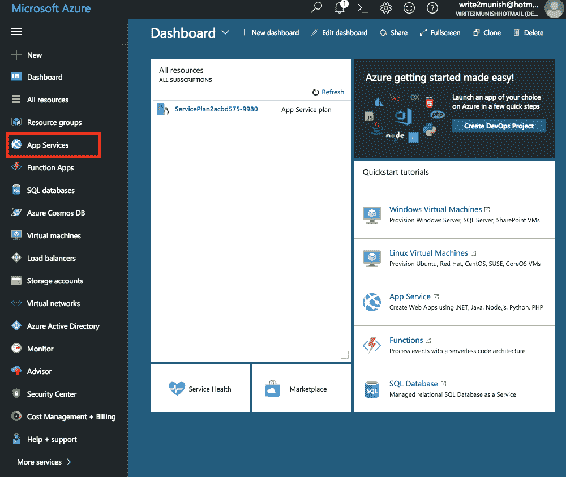

在 Azure 门户中选择应用服务

1.  单击“添加”链接：

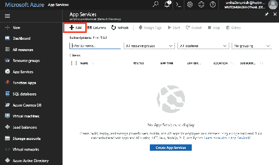

1.  接下来，单击所示的“Web 应用”链接：

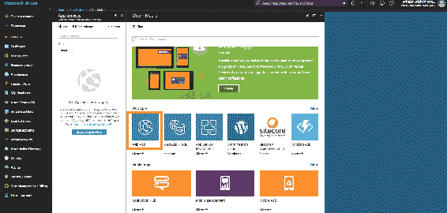

通过 Azure 门户 | 应用服务 | 添加导航选择 Web 应用。

1.  单击“创建”按钮链接，您应该会看到以下页面

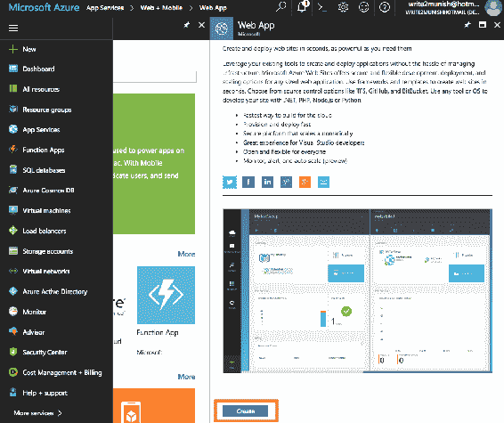

1.  我们填写我们的“产品”API 的详细信息。我已经填写了应用程序名称为`ch10product`，并将其他选项保留为默认。

1.  接下来，单击页面底部的“创建”按钮。

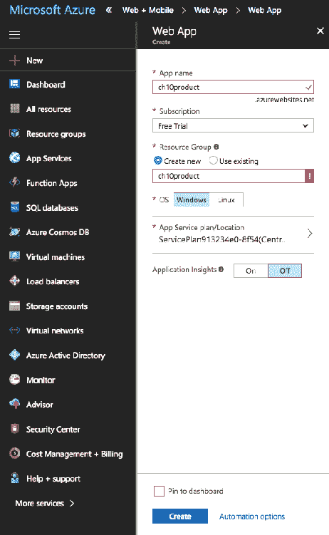

这将创建应用服务。

1.  我们点击 App Services 下的`ch10product`，这将带我们到菜单：


1.  注意部署应用程序的 URL 和 FTP 主机名。我们需要在两个地方进行更改——应用程序设置和部署凭据：


1.  我们点击“应用程序设置”链接，并在下拉菜单中选择以下选项：

1.  选择 Java 8 作为 Java 版本

1.  选择 Java 次要版本为最新

1.  选择最新的 Tomcat 9.0 作为 Web 容器（实际上不会使用此容器；Azure 使用作为 Spring Boot 应用程序一部分捆绑的容器。）

1.  点击保存

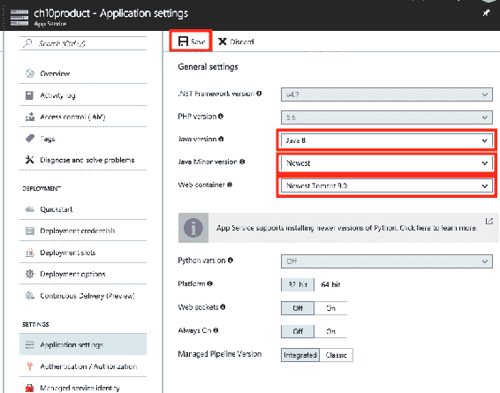

1.  接下来，我们点击左侧的“部署凭据”链接。在这里，我们捕获 FTP/部署用户名和密码，以便能够将我们的应用程序推送到主机，并点击保存，如下截图所示：

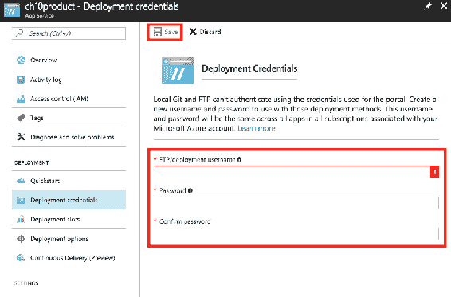

1.  连接到我们在*步骤 8*中看到的 FTP 主机名，并使用*步骤 10*中保存的凭据登录：

```java
ftp  
open ftp://waws-prod-dm1-035.ftp.azurewebsites.windows.net 
user ch10productwrite2munish 
password *******
```

1.  接下来，我们切换到远程服务器上的`site/wwwroot`目录，并将 fat JAR 和`web.config`传输到该文件夹：

```java
cd site/wwwroot 
put product-0.0.1-SNAPSHOT.jar 
put web.config 
```

1.  我们返回到概述部分并重新启动应用程序。我们应该能够启动应用程序并看到我们的 REST API 正常工作。


在本节中，我们看到了如何将现有的 REST API 应用程序部署到 Azure。这不是部署的最简单和最佳方式。这个选项更多的是一种搬迁，我们将现有的应用程序迁移到云中。对于部署 Web 应用程序，Azure 提供了一个 Maven 插件，可以直接将您的应用程序推送到云中。有关更多详细信息，请参阅以下链接：[`docs.microsoft.com/en-in/java/azure/spring-framework/deploy-spring-boot-java-app-with-maven-plugin`](https://docs.microsoft.com/en-in/java/azure/spring-framework/deploy-spring-boot-java-app-with-maven-plugin)。

REST API 部署在 Windows Server VM 上。Azure 正在增加对 Java 应用程序的支持，但它们的长处仍然是.NET 应用程序。

如果您想使用 Linux 并部署 REST API 应用程序，您可以选择使用基于 Docker 的部署。我们将在下一节介绍基于 Docker 的部署。

# 将 Docker 容器部署到 Azure 容器服务

让我们部署我们的 Docker 容器应用程序。我已经为上一节中使用的“产品”API 示例创建了 Docker 镜像。可以通过以下命令从 Docker hub 拉取 Docker 镜像：

```java
docker pull cloudnativejava/ch10productapi 
```

让我们开始并登录到 Azure 门户。我们应该看到以下内容：

1.  点击左侧栏的“应用服务”菜单项。我们应该看到以下屏幕。点击“新建”，如截图所示：

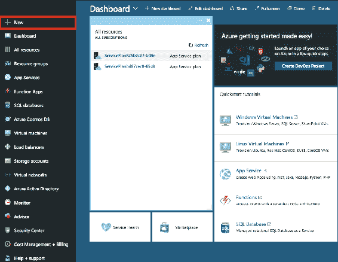

1.  在“新建”中搜索`Web App for Containers`：


1.  选择 Web App for Containers 后，点击“创建”如指示的那样：

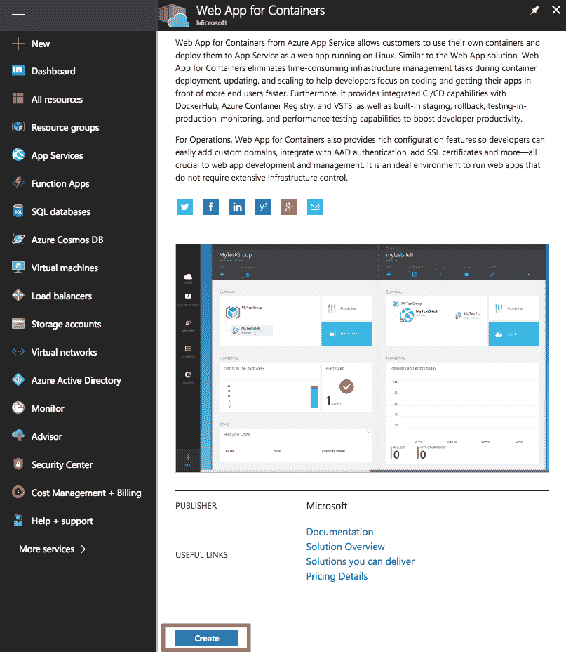

通过 App Services | 添加 | Web App 导航选择创建

1.  我们将填写我们的`product` API 容器的详细信息：

1.  我已经填写了应用程序名称和资源组为`ch10productContainer`，并将其他选项保持默认。

1.  在“配置容器”部分，我们选择容器存储库。如果 Docker hub 中已经有 Docker 镜像，请提供镜像拉取标签`cloudnativejava/ch10productapi`。

1.  点击页面底部的“确定”。它会验证图像。

1.  接下来，我们点击页面底部的“创建”：

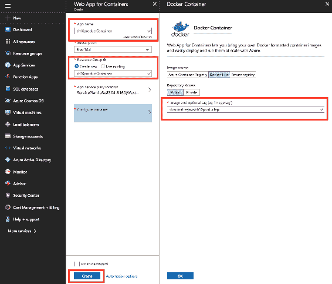

通过 Azure 门户导航选择创建|新建|搜索`Web App for Containers`

1.  这将创建应用服务：


通过 Azure 门户导航选择新创建的应用程序容器|应用服务

1.  我们点击 App Services 下的`ch10productcontainer`，这将带我们到菜单，我们可以看到标记的 URL，`https://ch10productcontainer.azurewebsites.net`，容器可用的地方。


主机 Docker 应用程序可以访问的 URL

1.  我们可以在浏览器中看到我们的`product` API 正在运行：


这是将您的应用程序部署到云平台的一种简单方法。在前面的两种情况下，我们都没有使用任何专门的应用程序或数据存储服务。对于真正的云原生应用程序，我们需要利用提供者提供的平台服务。整个想法是应用程序的可扩展性和可用性方面的重要工作由本地平台处理。我们作为开发人员，专注于构建关键的业务功能和与其他组件的集成。

# 将 Spring Boot API 部署到 Azure Service Fabric

构建和部署应用程序到基础 IaaS 平台是大多数组织开始与公共云提供商合作的方式。随着云流程的舒适度和成熟度的提高，应用程序开始具备 PaaS 功能。因此，应用程序开始包括排队、事件处理、托管数据存储、安全性和其他平台服务的功能。

但是，关于非功能需求，一个关键问题仍然存在。谁会考虑应用程序的能力？

+   如何确保有足够的应用程序实例在运行？

+   当实例宕机时会发生什么？

+   应用程序如何根据流量的增减而扩展/缩减？

+   我们如何监视所有运行的实例？

+   我们如何管理分布式有状态服务？

+   我们如何对部署的服务执行滚动升级？

编排引擎登场。诸如 Kubernetes、Mesos 和 Docker Swarm 等产品提供了管理应用程序容器的能力。Azure 发布了 Service Fabric，这是用于应用程序/容器管理的软件。它可以在本地或云中运行。

Service Fabric 提供以下关键功能：

+   允许您部署可以大规模扩展并提供自愈平台的应用程序

+   允许您安装/部署有状态和无状态的基于微服务的应用程序

+   提供监视和诊断应用程序健康状况的仪表板

+   定义自动修复和升级的策略

在当前版本中，Service Fabric 支持两种基础操作系统——Windows Server 和 Ubuntu 16.04 的版本。最好选择 Windows Server 集群，因为支持、工具和文档是最好的。

为了演示 Service Fabric 的功能和用法，我将使用 Ubuntu 镜像进行本地测试，并使用 Service Fabric party 集群将我们的`product` API 示例在线部署到 Service Fabric 集群。我们还将研究如何扩展应用程序实例和 Service Fabric 的自愈功能。

# 基本环境设置

我使用的是 macOS 机器。我们需要设置以下内容：

1.  本地 Service Fabric 集群设置——拉取 Docker 镜像：

```java
docker pull servicefabricoss/service-fabric-onebox 
```

1.  在主机上更新 Docker 守护程序配置，并重新启动 Docker 守护程序：

```java
{ 
    "ipv6": true, 
    "fixed-cidr-v6": "fd00::/64" 
}
```

1.  启动从 Docker Hub 拉取的 Docker 镜像：

```java
docker run -itd -p 19080:19080 servicefabricoss/service-fabric-onebox bash 
```

1.  在容器 shell 中添加以下命令：

```java
./setup.sh      
./run.sh        
```

完成最后一步后，将启动一个可以从浏览器访问的开发 Service Fabric 集群，地址为`http://localhost:19080`。

现在我们需要为容器和客户可执行文件设置 Yeoman 生成器：

1.  首先，我们需要确保 Node.js 和 Node Package Manager（NPM）已安装。可以使用 HomeBrew 安装该软件，如下所示：

```java
brew install node node -v npm -v 
```

1.  接下来，我们从 NPM 安装 Yeoman 模板生成器：

```java
npm install -g yo 
```

1.  接下来，我们安装将用于使用 Yeoman 创建 Service Fabric 应用程序的 Yeoman 生成器。按照以下步骤进行：

```java
# for Service Fabric Java Applications npm install -g generator-azuresfjava # for Service Fabric Guest executables npm install -g generator-azuresfguest # for Service Fabric Container Applications npm install -g generator-azuresfcontainer
```

1.  要在 macOS 上构建 Service Fabric Java 应用程序，主机机器必须安装 JDK 版本 1.8 和 Gradle。可以使用 Homebrew 安装该软件，方法如下：

```java
brew update 
brew cask install java 
brew install gradle 
```

这样就完成了环境设置。接下来，我们将把我们的`product` API 应用程序打包为 Service Fabric 应用程序，以便在集群中进行部署。

# 打包产品 API 应用程序

我们登录到`product` API 项目（完整代码可在[`github.com/PacktPublishing/Cloud-Native-Applications-in-Java`](https://github.com/PacktPublishing/Cloud-Native-Applications-in-Java)找到），并运行以下命令：

```java
yo azuresfguest
```

我们应该看到以下屏幕：

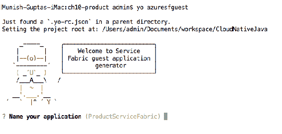

我们输入以下值：

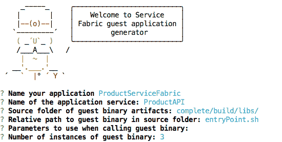

这将创建一个包含一组文件的应用程序包：

```java
ProductServiceFabric/ProductServiceFabric/ApplicationManifest.xml 
ProductServiceFabric/ProductServiceFabric/ProductAPIPkg/ServiceManifest.xml 
ProductServiceFabric/ProductServiceFabric/ProductAPIPkg/config/Settings.xml 
ProductServiceFabric/install.sh 
ProductServiceFabric/uninstall.sh 
```

接下来，我们转到`/ProductServiceFabric/ProductServiceFabric/ProductAPIPkg`文件夹。

创建一个名为`code`的目录，并在其中创建一个名为`entryPoint.sh`的文件，其中包含以下内容：

```java
#!/bin/bash 
BASEDIR=$(dirname $0) 
cd $BASEDIR 
java -jar product-0.0.1-SNAPSHOT.jar 
```

还要确保将我们打包的 JAR（`product-0.0.1-SNAPSHOT.jar`）复制到此文件夹中。

`Number of instances of guest binary`的值应该是`1`，用于本地环境开发，对于云中的 Service Fabric 集群，可以是更高的数字。

接下来，我们将在 Service Fabric 集群中托管我们的应用程序。我们将利用 Service Fabric party 集群。

# 启动 Service Fabric 集群

我们将使用我们的 Facebook 或 GitHub ID 登录[`try.servicefabric.azure.com`](https://try.servicefabric.azure.com)：

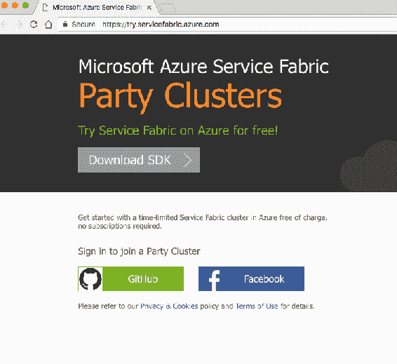

加入 Linux 集群：

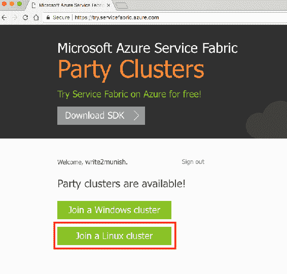

我们将被引导到包含集群详细信息的页面。该集群可用时间为一小时。

默认情况下，某些端口是开放的。当我们部署我们的`product` API 应用程序时，我们可以在端口`8080`上访问相同的应用程序：

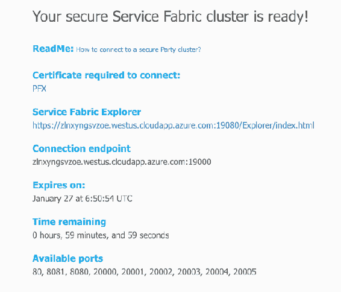

Service Fabric 集群资源管理器可在先前提到的 URL 上找到。由于集群使用基于证书的身份验证，您需要将 PFX 文件导入到您的钥匙链中。

如果您访问该 URL，您可以看到 Service Fabric 集群资源管理器。默认情况下，该集群有三个节点。您可以将多个应用程序部署到集群中。根据应用程序设置，集群将管理您的应用程序可用性。

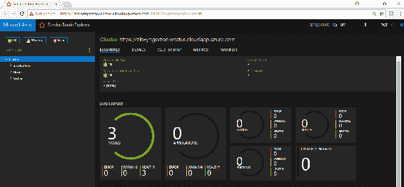

Azure Party 集群默认视图

# 将产品 API 应用程序部署到 Service Fabric 集群

要将我们的应用程序部署到为应用程序创建的 Service Fabric 脚手架的`ProductServiceFabric`文件夹中，我们需要登录。

# 连接到本地集群

我们可以使用以下命令在此处连接到本地集群：

```java
sfctl cluster select --endpoint http://localhost:19080 
```

这将连接到在 Docker 容器中运行的 Service Fabric 集群。

# 连接到 Service Fabric party 集群

由于 Service Fabric party 集群使用基于证书的身份验证，我们需要在`/ProductServiceFabric`工作文件夹中下载 PFX 文件。

运行以下命令：

```java
openssl pkcs12 -in party-cluster-1496019028-client-cert.pfx -out party-cluster-1496019028-client-cert.pem -nodes -passin pass: 
```

接下来，我们将使用**隐私增强邮件**（**PEM**）文件连接到 Service Fabric party 集群：

```java
sfctl cluster select --endpoint https://zlnxyngsvzoe.westus.cloudapp.azure.com:19080 --pem ./party-cluster-1496019028-client-cert.pem --no-verify 
```

一旦我们连接到 Service Fabric 集群，我们需要通过运行以下命令来安装我们的应用程序：

```java
./install.sh 
```

我们应该看到我们的应用程序被上传并部署到集群中：


安装并启动 Docker 容器中的 Service Fabric 集群

一旦应用程序被上传，我们可以在 Service Fabric 资源管理器中看到应用程序，并且可以访问应用程序的功能：

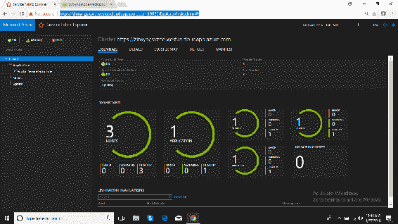

观察在 Azure Party Cluster 中部署的应用程序

API 功能可在以下网址找到：`http://zlnxyngsvzoe.westus.cloudapp.azure.com:8080/product/2`。

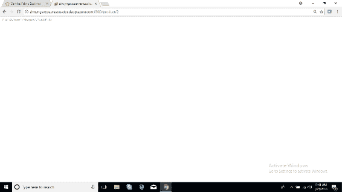

验证 API 是否正常工作

我们可以看到应用程序当前部署在一个节点（`_lnxvm_2`）上。如果我们关闭该节点，应用程序实例将自动部署在另一个节点实例上：


观察应用程序部署在三个可用主机中的单个节点上

通过选择节点菜单中的选项（在下面的截图中突出显示）来关闭节点（`_lnxvm_2`）：

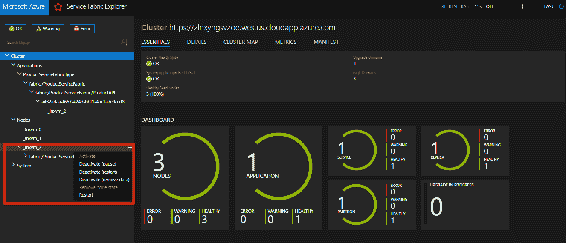

观察在 Azure Party Cluster 上禁用主机的选项

立即，我们可以看到应用程序作为集群的自愈模型部署在节点`_lnxvm_0`上：

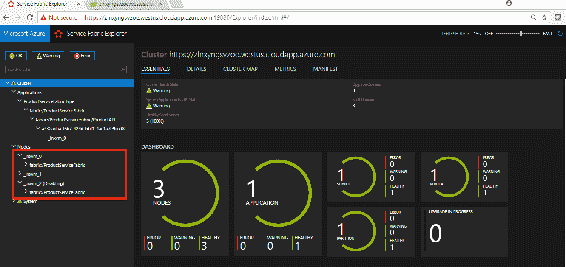

在一个节点上禁用应用程序后，它会在 Service Fabric Cluster 的另一个节点上启动

再次，我希望读者足够好奇，继续探索集群的功能。对 Java 应用程序和多个版本的 Linux 的支持有限。Azure 正在努力增加对平台的额外支持，以支持各种类型的应用程序。

# Azure 云函数

随着我们将应用程序迁移到云端，我们正在使用平台服务来提高我们对业务功能的关注，而不用担心应用程序的可伸缩性。无服务器应用程序是下一个前沿。开发人员的重点是构建应用程序，而不用担心服务器的配置、可用性和可伸缩性。

Java 函数目前处于测试阶段，不在 Azure 门户上提供。

我们可以下载并尝试在本地机器上创建 Java 函数。我们将看到功能的简要预览。

# 环境设置

Azure Functions Core Tools SDK 为编写、运行和调试 Java Azure Functions 提供了本地开发环境：

```java
npm install -g azure-functions-core-tools@core 
```

# 创建一个新的 Java 函数项目

让我们创建一个示例 Java 函数项目。我们将利用以下 Maven 原型来生成虚拟项目结构：

```java
mvn archetype:generate  -DarchetypeGroupId=com.microsoft.azure  -DarchetypeArtifactId=azure-functions-archetype 
```

我们运行`mvn`命令来提供必要的输入：

```java
Define value for property 'groupId': : com.mycompany.product 
Define value for property 'artifactId': : mycompany-product 
Define value for property 'version':  1.0-SNAPSHOT: :  
Define value for property 'package':  com.mycompany.product: :  
Define value for property 'appName':  ${artifactId.toLowerCase()}-${package.getClass().forName("java.time.LocalDateTime").getMethod("now").invoke(null).format($package.Class.forName("java.time.format.DateTimeFormatter").getMethod("ofPattern", $package.Class).invoke(null, "yyyyMMddHHmmssSSS"))}: : productAPI 
Define value for property 'appRegion':  ${package.getClass().forName("java.lang.StringBuilder").getConstructor($package.getClass().forName("java.lang.String")).newInstance("westus").toString()}: : westus 
Confirm properties configuration: 
groupId: com.mycompany.product 
artifactId: mycompany-product 
version: 1.0-SNAPSHOT 
package: com.mycompany.product 
appName: productAPI 
appRegion: westus 
 Y: : y 
```

# 构建和运行 Java 函数

让我们继续构建包：

```java
mvn clean package 
```

接下来，我们可以按以下方式运行函数：

```java
mvn azure-functions:run 
```

我们可以在以下图像中看到函数的启动：

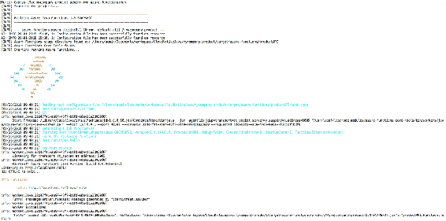

构建您的 Java 云函数

默认函数可在以下网址找到：

```java
http://localhost:7071/api/hello 
```

如果我们访问`http://localhost:7071/api/hello?name=cloudnative`，我们可以看到函数的输出：


# 深入代码

如果我们深入代码，我们可以看到主要的代码文件，其中定义了默认函数`hello`：

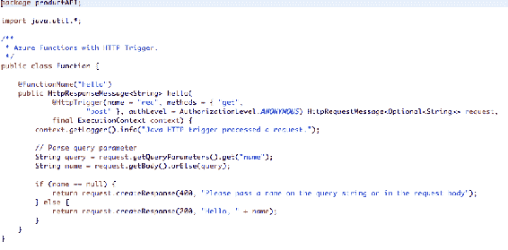

该方法使用`@HttpTrigger`进行注释，我们在其中定义了触发器的名称、允许的方法、使用的授权模型等。

当函数编译时，会生成一个`function.json`文件，其中定义了函数绑定。

```java
{ 
  "scriptFile" : "../mycompany-product-1.0-SNAPSHOT.jar", 
  "entryPoint" : "productAPI.Function.hello", 
  "bindings" : [ { 
    "type" : "httpTrigger", 
    "name" : "req", 
    "direction" : "in", 
    "authLevel" : "anonymous", 
    "methods" : [ "get", "post" ] 
  }, { 
    "type" : "http", 
    "name" : "$return", 
    "direction" : "out" 
  } ], 
  "disabled" : false 
} 
```

您可以看到输入和输出数据绑定。函数只有一个触发器。触发器会携带一些相关数据触发函数，通常是触发函数的有效负载。

输入和输出绑定是一种声明性的方式，用于在代码内部连接数据。绑定是可选的，一个函数可以有多个输入和输出绑定。

您可以通过 Azure 门户开发函数。触发器和绑定直接在`function.json`文件中配置。

Java 函数仍然是一个预览功能。功能集仍处于测试阶段，文档很少。我们需要等待 Java 在 Azure Functions 的世界中成为一流公民。

这就是我们使用 Azure 进行平台开发的结束。

# 总结

在本章中，我们看到了 Azure 云平台提供的各种功能和服务。当我们将应用程序转移到云原生模型时，我们从应用服务|容器服务|服务布置|无服务器模型（云函数）中转移。当我们构建全新的应用程序时，我们跳过初始步骤，直接采用平台服务，实现自动应用程序可伸缩性和可用性管理。

在下一章中，我们将介绍各种类型的 XaaS API，包括 IaaS、PaaS、iPaaS 和 DBaaS。我们将介绍在构建自己的 XaaS 时涉及的架构和设计问题。
