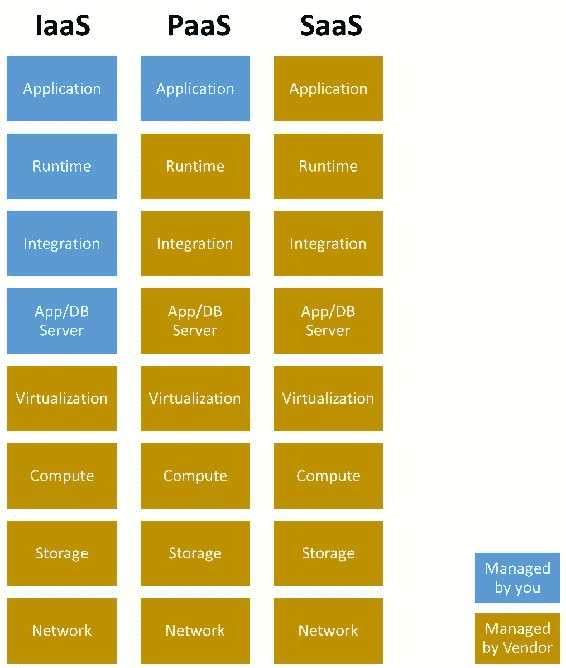
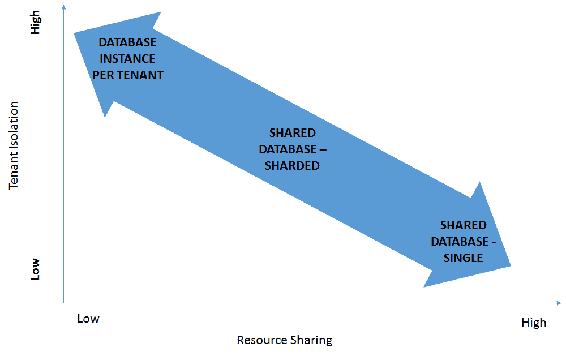
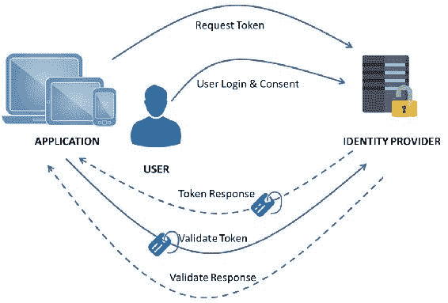

# 第十一章：作为服务集成

本章讨论了各种 XaaS 类型，包括基础设施即服务（IaaS）、平台即服务（PaaS）、集成平台即服务（iPaaS）和数据库即服务（DBaaS），以及在将基础设施或平台元素公开为服务时需要考虑的一切。在云原生模式下，您的应用程序可能正在集成社交媒体 API 或 PaaS API，或者您可能正在托管其他应用程序将使用的服务。本章涵盖了构建自己的 XaaS 模型时需要处理的问题。

本章将涵盖以下主题：

+   构建自己的 XaaS 时的架构和设计问题

+   构建移动应用程序时的架构和设计问题

+   各种后端作为服务提供商——数据库、授权、云存储、分析等

# XaaS

云计算开创了弹性、按需、IT 托管服务的分发模式。任何作为服务交付的 IT 部分都宽泛地归入云计算的范畴。

在云计算主题中，根据 IT 服务的类型，云的特定服务有各种术语。大多数术语是 XaaS 的不同变体，其中 X 是一个占位符，可以更改以代表多种事物。

让我们看看云计算的最常见交付模式：

+   IaaS：当计算资源（计算、网络和存储）作为服务提供以部署和运行操作系统和应用程序时，被称为 IaaS。如果组织不想投资于建立数据中心和购买服务器和存储，这是一种正确的选择。亚马逊网络服务（AWS）、Azure 和谷歌云平台（GCP）是 IaaS 提供商的主要例子。在这种模式下，您负责以下事项：

+   管理、打补丁和升级所有操作系统、应用程序和相关工具、数据库系统等。

+   从成本优化的角度来看，您将负责启动和关闭环境。

+   计算资源的供应几乎是即时的。计算资源的弹性是 IaaS 供应商的最大卖点之一。

+   通常，服务器镜像可以由云提供商备份，因此在使用云提供商时备份和恢复很容易管理。

+   PaaS：一旦计算、网络和存储问题解决，接下来就需要开发平台和相关环境来构建应用程序。PaaS 平台提供了整个软件开发生命周期（SDLC）的服务。运行时（如 Java 和.NET）、数据库（MySQL 和 Oracle）和 Web 服务器（如 Tomcat 和 Apache Web 服务器）等服务被视为 PaaS 服务。云计算供应商仍将管理运行时、中间件、操作系统、虚拟化、服务器、存储和网络的基础运营方面。在这种模式下，您将负责以下事项：

+   开发人员的关注将局限于管理应用程序和相关数据。应用程序的任何更改/更新都需要由您管理。

+   PaaS 的抽象层级较高（消息传递、Lambda、容器等），使团队能够专注于核心能力，满足客户需求。

+   **SaaS**：接下来是您租用整个应用程序的模式。您不需要构建、部署或维护任何东西。您订阅应用程序，提供商将为您或您的组织提供一个应用程序实例供您使用。您可以通过浏览器访问应用程序，或者可以集成提供商提供的公共 API。Gmail、Office 365 和 Salesforce 等服务就是 SaaS 服务的例子。在这种模式下，提供商为所有租户提供标准版本的功能/功能，定制能力非常有限。SaaS 供应商可能提供一个安全模型，您可以使用**轻量级目录访问协议**（**LDAP**）存储库与供应商集成，使用**安全断言标记语言**（**SAML**）或 OAuth 模型。这种模式非常适用于定制需求较低的标准软件。Office365 和 Salesforce 是 SaaS 供应商的典范：

在构建您的组织及其应用程序组合时，您可能会订阅不同供应商提供的各种类型的服务。现在，如果您试图构建下一个 Facebook 或 Instagram 或 Uber，您将需要解决特定的架构问题，以满足全球数十亿用户的各种需求。

# 构建 XaaS 时的关键设计问题

让我们回顾一下在构建 XaaS 并为其提供消费服务时需要解决的关键设计问题：

+   **多租户**：当您开始为公众使用设计您的服务时，首要要求之一是能够支持多个租户或客户。随着人们开始注册使用您的服务，服务需要能够为客户数据提供安全边界。通常，SaaS 是多租户设计问题的一个很好的候选者。对于每个租户，数据和应用程序工作负载可能需要进行分区。租户请求在租户数据的范围内。要在应用程序中设计多租户，您需要查看以下内容：

+   **隔离**：数据应该在租户之间隔离。一个租户不应该能够访问任何其他租户的数据。这种隔离不仅限于数据，还可以扩展到底层资源（包括计算、存储、网络等）和为每个租户标记的操作过程（备份、恢复、DevOps、管理员功能、应用程序属性等）。

+   **成本优化**：下一个重要问题是如何优化设计以降低云资源的总体成本，同时仍然满足各种客户的需求。您可以考虑多种技术来管理成本。例如，对于免费层客户，您可以基于租户 ID 的租赁模型。这种模型允许您优化数据库许可证、整体计算和存储成本、DevOps 流程等。同样，对于大客户，甚至可以考虑专用基础设施以提供保证的**服务级别协议**（**SLA**）。有许多小公司从少数大客户那里获得数百万美元的业务。另一方面，有大公司为数百万小客户提供服务。

+   **DevOps 流水线**：如果您最终为客户构建同一服务的多个实例，当客户要求为他们提供特定功能时，您将遇到问题。这很快会导致代码碎片化，并成为一个难以管理的代码问题。问题在于如何平衡为所有客户推出新功能/功能的能力，同时仍能够提供每个客户所需的定制或个性化水平。DevOps 流程需要支持多租户隔离，并维护/监视每个租户的流程和数据库架构，以在所有服务实例中推出更改。除非 DevOps 得到简化，否则在整个服务中推出更改可能会变得非常复杂和令人望而却步。所有这些都会导致成本增加和客户满意度降低。

+   **可扩展性**：其中一个基本要求是能够注册新客户并扩展服务。随着客户规模的增长，预期成本/服务或整体服务成本应该下降。除非我们的服务考虑到前面三种租户类型，否则服务将无法扩展并在您的业务模型周围提供人为的壕沟。

接下来，当您开始设计多租户服务时，您有以下设计选项：

+   +   **每个租户一个数据库**：每个租户都有自己的数据库。这种模型为租户数据提供了完全隔离。

+   **共享数据库（单一）**：所有租户都托管在单个数据库中，并由租户 ID 标识。

+   **共享数据库（分片）**：在这种模型中，单个数据库被分片成多个数据库。通常，分片键是从哈希、范围或列表分区派生的。租户分布在分片中，并且可以通过租户 ID 和分片的组合访问：

+   **更快的配置**：在构建 XaaS 模型时，另一个关键问题是能够为新客户提供配置的能力，这意味着客户的入职应该是自助的。注册后，客户应立即能够开始使用服务。所有这些都需要一个模型，其中新租户可以轻松快速地配置。提供基础计算资源、任何数据库架构创建和/或特定的 DevOps 流水线的能力应该非常高效和完全自动化。从客户体验的角度来看，能够为用户提供正在运行的应用程序版本也是有帮助的。对于任何旨在成为大众市场的服务，更快的配置都是必须的。但是，如果您提供的是非常特定的服务，并且需要与企业客户的本地数据中心集成，那么可能无法提供分秒级的配置。在这种情况下，我们应该构建可以尽快解决一些常见集成场景的工具/脚本，以尽快为客户提供服务。

+   **审计**：安全性周围的另一个关键问题是审计对服务和基础数据存储的访问和更改的能力。所有审计跟踪都需要存储，以用于任何违规行为、安全问题或合规目的。将需要一个集中的审计存储库，用于跟踪系统中生成的事件。您应该能够在审计存储库之上运行分析，以标记任何异常行为并采取预防或纠正措施：

您可以利用 Lambda 架构，它同时使用实时流和从历史数据生成的模型来标记异常行为。一些公共云提供商提供此服务。

+   **安全性**: 根据服务的性质，租户需要安全访问其数据。服务需要包含身份验证和授权的基本要求。所有客户都有安全密钥和密码短语来连接和访问其信息。可能需要企业访问和多个用户。在这种情况下，您可能需要为企业构建委托管理模型。您还可以使用 OAuth 等安全机制（通过 Google、Facebook 等）来启用对服务的访问。

+   **数据存储**: 您的服务可能需要存储不同类型的数据；根据数据类型，存储需求将不同。存储需求通常分为以下几个领域：

+   **关系数据存储**: 租户数据可能是关系型的，我们谈到了各种多租户策略来存储这些数据。租户特定的应用程序配置数据可能需要存储在关系模型中。

+   **NoSQL 存储**: 租户数据可能并非始终是关系型的；它可能是列式的、键值对的、图形的或面向文档的模型。在这种情况下，需要设计并构建适当的数据存储。

+   **Blob 存储**: 如果您的服务需要 Blob 存储或二进制数据存储，那么您将需要访问对象文件存储。您可以利用 AWS 或 Azure 等提供的 Blob 存储来存储您的二进制文件。

+   **监控**: 需要监控整个应用程序堆栈。您可能会为客户签署严格的 SLA。在这种情况下，监控不仅仅是关于服务或系统的可用性，还涉及任何成本惩罚和声誉损失。有时，个别组件可能具有冗余和高可用性，但在堆栈级别，所有故障率可能会相互叠加，从而降低堆栈的整体可用性。跨堆栈监控资源变得重要，并且是管理可用性和定义的 SLA 的关键。监控涵盖硬件和软件。需要检测任何异常行为并自动执行纠正响应。通常，监控和自动修复需要多次迭代才能成熟。

+   **错误处理**: 服务的关键方面之一将是处理故障的能力以及如何响应服务消费者。故障可能发生在多个级别；数据存储不可用、表被锁定、查询超时、服务实例宕机、会话数据丢失等都是您将遇到的一些问题。您的服务需要强大到能够处理所有这些以及更多的故障场景。诸如 CQRS、断路器、隔离、响应式等模式需要纳入到您的服务设计中。

+   **自动化构建/部署**: 随着服务消费者数量的增加，推出新功能和修复错误将需要自动化的构建和部署模型。这类似于在汽车行驶时更换轮胎。升级软件并发布补丁/安全修复，而不会对消费者的调用产生任何影响，这是一门微妙的艺术，需要时间来掌握。以前，我们可以在夜间系统流量减少时寻找一些系统停机时间，但是随着来自世界各地的客户，再也没有这样的时间了。蓝绿部署是一种技术，可以帮助在对客户造成最小影响的情况下发布新变更，并降低整体风险：

+   **客户层**：另一个关键问题是如何为不同的客户群建立和定价您的服务。公司一直在创建多个层次来满足众多客户的需求。这些需求帮助公司确定客户层，然后开始定价服务成本。这些因素如下：

+   **计算**：限制每小时/每天/每月的调用次数。这使您能够预测租户所需的容量以及网络带宽要求。

+   **存储**：另一个参数是底层数据存储所需的存储空间。这使您可以适当平衡数据库分片。

+   **安全性**：对于企业客户，可能存在与 SAML 使用企业安全模型集成的单独要求。这可能需要额外的硬件和支持。

+   **SLA/支持模型**：这是另一个需要考虑的领域，当决定客户层时需要考虑。支持模型——社区、值班、专用等——具有不同的成本结构。根据目标市场——消费者或企业——您可以评估哪种支持模型最适合您的服务。

+   **功能标志**：在构建 XaaS 模型时，一个关键问题是如何处理多个租户的代码更改、功能发布等。我应该为每个客户拥有多个代码分支，还是应该在所有客户之间使用一个代码库？如果我使用一个代码库，如何发布特定于一个租户的功能/功能？如果您的目标市场是 8-10 个客户，那么为每个客户拥有特定的代码分支是一个潜在的可行选项。但如果目标市场是数百个客户，那么代码分支是一个糟糕的选择。代码分支通常是一个糟糕的主意。为了处理不同客户的功能/功能差异或管理尚未准备发布的新功能，功能标志是处理此类要求的一个很好的方法。

功能标志允许您在生产中发布代码，而不立即为用户发布功能。您可以使用功能标志根据客户购买的服务级别为应用程序的不同客户提供/限制某些功能。您还可以与 A/B 测试结合使用功能标志，向部分用户发布新功能/功能，以检查其响应和功能正确性，然后再向更广泛的受众发布。

+   自助服务门户：您的服务的一个关键方面将是一个自助服务门户，用户可以在那里注册、提供服务，并管理应用程序数据和服务的所有方面。该门户允许用户管理企业方面，如身份验证/授权（使用委托管理员模型）、监视已提供的服务的可用性，在服务的关键指标上设置自定义警报/警报，并解决可能在服务器端出现的任何问题。精心设计的门户有助于增加用户对服务性能的整体信心。您还可以为付费客户构建基于客户层的高级监控和分析服务。请记住，任何人都可以复制您的服务提供的功能/功能，但围绕您的服务构建附加值功能成为您服务的独特差异化因素。

+   软件开发工具包（SDKs）：作为启用用户采纳性的关键措施之一，您可能希望为您的消费者构建并提供 SDK。这不是必须的，但是是一个可取的特性，特别是当客户在应用程序代码级别与您的服务集成时。在这种情况下，SDK 应该支持多种语言，并提供良好的示例和文档，以帮助客户端的开发人员上手。如果您的应用程序或服务很复杂，那么拥有一个解释如何调用您的服务或与现有服务集成（如 SAML、OAuth 等）的 SDK 对于更快地采用您的服务至关重要。

+   文档和社区支持：服务可采纳性的另一个方面是产品/服务的文档水平以及社区对其的支持。文档应该至少涵盖以下几点：

+   如何注册该服务

+   如何调用和使用服务

+   如何将服务整合到客户的景观中以及可用于集成的 SDK

+   如何批量导入或批量导出您的数据

+   如何与企业 LDAP/Active Directory（AD）服务器进行安全整合进行身份验证/授权

接下来你需要考虑的是建立一个积极的社区支持。你需要为人们互动提供适当的论坛。你需要有积极的专业主题专家来回答来自各个论坛（内部和外部）的问题。像 Stack Overflow 这样的网站会收到很多问题；你应该设置警报，监控帖子，并帮助回答用户的问题/查询。一个积极的社区是对你的产品感兴趣的一个迹象。许多组织也利用这个论坛来识别早期采用者，并在产品路线图中寻求他们的反馈。

+   产品路线图：一个好的产品可能从一个最小可行产品（MVP）开始，但通常都有一个坚实的愿景和产品路线图作为支持。当你从客户那里收到反馈时，你可以不断更新产品路线图并重新排列优先级。一个好的路线图表明了产品愿景的力量。当你遇到外部利益相关者——客户、合作伙伴、风险投资者等等——他们首先要求的是一个产品路线图。

路线图通常包括战略重点和计划发布，以及高层功能和维护/错误修复发布的计划，等等：

我们已经涵盖了一些在尝试构建您的 XaaS 模型时需要考虑的设计问题。我们已经涵盖了每个问题的基础知识。每个问题都需要至少一个章节。希望这能让您了解在尝试围绕 XaaS 构建业务模型时需要考虑的其他非服务方面。服务的实际设计和开发是基于我们从第二章开始涵盖的问题。

# 与第三方 API 的集成

在前一节中，我们看到了构建自己的服务提供商时的设计问题。在本节中，我们将看到，如果您正在尝试构建一个消费者应用程序，如何利用第三方公司提供的 REST 服务。例如，您正在尝试构建一个漂亮的移动应用程序，您的核心竞争力是构建视觉设计和创建移动应用程序。您不想被管理托管/管理应用程序数据的所有复杂性所拖累。该应用程序将需要包括存储、通知、位置、社交集成、用户管理、聊天功能和分析等服务。所有这些提供商都被归类为**后端即服务**（**BaaS**）提供商。没有必要为这些服务注册单一供应商；您可以挑选符合您业务需求和预算的提供商。每个提供商通常都采用免费模式，每月提供一定数量的免费 API 调用，以及商业模式，您需要付费。这也属于构建无服务器应用程序的范畴，作为开发人员，您不需要维护任何运行软件的服务器。

在这方面，我们将看看构建一个完整的无服务器应用程序所需的第三方服务：

+   **身份验证服务**：任何应用程序需要的第一件事情之一是能够注册用户。注册用户为应用程序开发人员提供了提供个性化服务并了解他的喜好/不喜欢的机会。这些数据使他能够优化用户体验并提供必要的支持，以从应用程序中获得最大价值。

身份验证作为服务专注于围绕用户身份验证的业务功能的封装。身份验证需要一个身份提供者。这个提供者可以映射到您的应用程序或企业，或者您可以使用一些消费者公司，如谷歌、Facebook、Twitter 等。有多个可用的身份验证服务提供商，如 Auth0、Back&、AuthRocket 等。这些提供商应该提供至少以下功能：

+   **多因素身份验证**（**MFA**）（包括对社交身份提供者的支持）：作为主要要求之一，提供商应该提供身份提供者实例，应用程序可以在其中管理用户。功能包括用户注册，通过短信或电子邮件进行两因素身份验证，以及与社交身份提供者的集成。大多数提供商使用 OAuth2/OpenID 模型。

+   **用户管理**：除了 MFA，身份验证提供商应该提供用户界面，允许对已注册应用程序的用户进行管理。您应该能够提取电子邮件和电话号码，以向客户发送推送通知。您应该能够重置用户凭据并通过使用安全领域或根据应用程序的需求将用户添加到某些预定义角色来保护资源。

+   **插件/小部件**：最后但并非最不重要的是，提供商应该提供可以嵌入应用程序代码中以提供用户身份验证的小部件/插件作为无缝服务：

+   **无服务器服务**：过去，您需要管理应用程序服务器和底层 VM 来部署代码。抽象级别已经转移到所谓的业务功能。您编写一个接受请求、处理请求并输出响应的函数。没有运行时，没有应用程序服务器，没有 Web 服务器，什么都没有。只有一个函数！提供商将自动提供运行时来运行该函数，以及服务器。作为开发人员，您不需要担心任何事情。您根据对函数的调用次数和函数运行时间的组合收费，这意味着在低谷时期，您不会产生任何费用。

通过函数，您可以访问数据存储并管理用户和应用程序特定数据。两个函数可以使用队列模型相互通信。函数可以通过提供商的 API 网关公开为 API。

所有公共云供应商都有一个无服务器模型的版本——AWS 有 Lamda，Azure 有 Azure Functions，Google 有 Cloud Functions，Bluemix 有 Openwhisk 等：

+   **数据库/存储服务**：应用程序通常需要存储空间来管理客户数据。这可以是简单的用户配置文件信息（例如照片、姓名、电子邮件 ID、密码和应用程序首选项）或用户特定数据（例如消息、电子邮件和应用程序数据）。根据数据的类型和存储格式，可以选择适当的数据库/存储服务。对于二进制存储，我们有 AWS S3 和 Azure Blob Storage 等服务，适用于各种二进制文件。要直接从移动应用程序中以 JSON 格式存储数据，您可以使用 Google Firebase 等云提供商，或者您可以使用 MongoDB 作为服务（[www.mlab.com](https://mlab.com/)）。AWS、Azure 和 GCP 提供了多种数据库模型，可用于管理各种不同的存储需求。您可能需要使用 AWS Lambda 或 Google Cloud Functions 来访问存储数据。例如，如果应用程序请求在存储数据之前需要进行一些验证或处理，您可以编写一个 Lambda 函数，该函数可以公开为 API。移动应用程序访问调用 Lambda 函数的 API，在请求处理后，数据存储在数据存储中。

+   **通知服务**：应用程序通常会注册用户和设备，以便能够向设备发送通知。AWS 提供了一项名为 Amazon **Simple Notification Service** (**SNS**)的服务，可用于从您的移动应用程序注册和发送通知。AWS 服务支持向 iOS、Android、Fire OS、Windows 和基于百度的设备发送推送通知。您还可以向 macOS 桌面和 iOS 设备上的**VoIP**应用程序发送推送通知，向超过 200 个国家/地区的用户发送电子邮件和短信。

+   **分析服务**：一旦客户开始采用该应用程序，您将想要了解应用程序的哪些功能正在使用，用户在哪些地方遇到问题或挑战，以及用户在哪些地方退出。为了了解所有这些，您需要订阅一个分析服务，该服务允许您跟踪用户的操作，然后将其汇总到一个中央服务器。您可以访问该中央存储库并深入了解用户的活动。您可以利用这些对客户行为的洞察来改善整体客户体验。Google Analytics 是这一领域中的一项热门服务。您可以跟踪用户的多个整体参数，包括位置、使用的浏览器、使用的设备、时间、会话详细信息等。您还可以通过添加自定义参数来增强它。这些工具通常提供一定数量的预定义报告。您还可以添加/设计自己的报告模板。

+   位置服务：应用程序使用的另一个服务是位置服务。你的应用程序可能需要功能，需要根据给定的上下文进行策划（在这种情况下，位置可以是上下文属性之一）。上下文感知功能允许你个性化地将功能/服务适应最终客户的需求，并有助于改善整体客户体验。Google Play 服务位置 API 提供了这样的功能。围绕位置服务有一整套服务/应用程序。例如，像 Uber、Lyft 和 Ola（印度）这样的公司是围绕位置服务构建的商业案例的很好的例子。大多数物流企业（特别是最后一英里）都利用位置服务进行路线优化和交付等工作。

+   社交整合服务：你的应用程序可能需要与流行的社交网络（Facebook、Twitter、Instagram 等）进行社交整合。你需要能够访问已登录用户的社交动态，代表他们发布内容，和/或访问他们的社交网络。有多种方式可以访问这些社交网络。大多数这些网络为其他应用程序提供访问，并公开一组 API 来连接它们。然后还有聚合器，允许你提供与一组社交网络的整合。

+   广告服务：应用程序使用的另一个关键服务，特别是移动应用程序，是向用户提供广告。根据应用程序模型（免费/付费），你需要决定应用程序的货币化模式。为了向用户提供广告（称为应用内广告），你需要注册广告网络提供商并调用他们的 API 服务。谷歌的 AdMob 服务是这一领域的先驱之一。

在构建应用程序时，可能还有其他许多服务提供商值得关注。我们已经涵盖了主要突出的类别。根据你的应用程序需求，你可能想在特定需求领域搜索提供者。我相信已经有人在提供这项服务。还有一些综合性的提供商被称为 BaaS。这些 BaaS 提供商通常提供多种服务供使用，并减少了应用程序端的整体集成工作。你不必与多个提供者打交道；相反，你只需与一个提供者合作。这个提供者会满足你的多种需求。

BaaS 作为一个市场细分是非常竞争的。由于多个提供者的竞争，你会发现在这个领域也有很多的并购。最近发生了以下情况：

+   Parse：被 Facebook 收购。Parse 提供了一个后端来存储你的数据，推送通知到多个设备的能力，以及整合你的应用程序的社交层。

+   GoInstant：被 Salesforce 收购。GoInstant 提供了一个 JavaScript API，用于将实时的多用户体验集成到任何 Web 或移动应用程序中。它易于使用，并提供了所需的完整堆栈，从客户端小部件到发布/订阅消息到实时数据存储。

有提供特定领域服务或 API 的垂直和水平 BaaS 提供商。在电子商务领域、游戏领域、分析领域等都有提供者。

在注册之前记得检查提供者的可信度。记住，如果提供者倒闭，你的应用程序也会陷入困境。确保你了解他们的商业模式，产品路线图，资金模式（特别是对于初创公司），以及他们对客户的倾听程度。你希望与愿意全程帮助你的合作伙伴合作。

# 总结

在本章中，我们涵盖了在尝试构建您的 XaaS 提供商时的一些关键问题。我们还涵盖了光谱的另一面，我们看到了可用于构建应用程序的典型服务。

在下一章中，我们将涵盖 API 最佳实践，我们将看到如何设计以消费者为中心的 API，这些 API 是细粒度和功能导向的。我们还将讨论 API 设计方面的最佳实践，例如如何识别将用于形成 API 的资源，如何对 API 进行分类，API 错误处理，API 版本控制等等。
