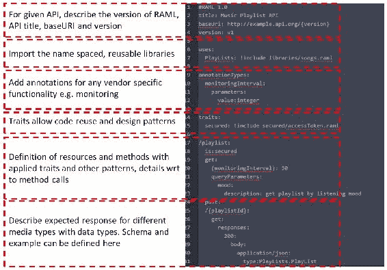

# 第十二章：API 设计最佳实践

本章讨论如何设计以消费者为中心的 API，这些 API 是细粒度的，以功能为导向的。它还讨论了 API 设计关注的各种最佳实践，例如如何识别将用于形成 API 的资源，如何对 API 进行分类，API 错误处理，API 版本控制等。我们将通过 Open API 和 RAML 来描述 API 的模型。

我们将涵盖以下主题：

+   API 设计关注点

+   API 网关部署

# API 设计关注点

API 旨在被消费并定义了 API 如何被消费。API 指定了所需与 API 交互的命令/操作列表以及这些命令的格式/模式。

在定义 REST API 时，信息的关键抽象是资源。资源被定义为对一组实体的概念映射。API 设计围绕着构成设计核心的资源。**统一资源标识符**（**URI**），操作（使用 HTTP 方法）和资源表示（JSON 模式）都是以资源为中心构建的。拥有正确的资源抽象对于启用 API 的消费、可重用性和可维护性非常重要。

资源可以指向单个实体或一组实体。例如，产品是一个单一的资源，而产品是一组资源。我们将在两个层面上介绍设计准则：

+   如何确定正确的资源粒度水平

+   如何围绕已识别的资源设计 API

# API 资源识别

API 的设计与问题域的基础业务领域模型相关联。API 需要以消费者为中心，关注消费者的需求。领域驱动设计原则被应用于确定正确的粒度。有界上下文模式是帮助将问题领域划分为不同有界上下文并明确它们关系的中心模式。对于企业，资源识别也受到中央/组架构团队定义的规范模型的驱动。

此外，根据 API 的定义位置和其暴露的功能/功能，API 可以分为三个广泛的类别：


让我们在接下来的章节中详细讨论这些类别。

# 系统 API

关键企业资源或记录系统需要作为一组 API 对所有下游系统开放或暴露，以便这些服务周围构建逻辑/体验。对于绿地项目，系统 API 通常代表作为功能的一部分开发的记录系统或数据存储。当涉及企业时，系统 API 代表所有企业系统，例如核心企业资源规划（ERP）系统、运营数据存储、主机应用程序，或许多商业现成产品，例如客户关系管理（CRM）等，这些产品运行企业的核心流程。系统 API 的一些显著特点如下：

+   领域驱动设计的起源源于查看核心系统领域，并创建有界上下文来定义系统 API。

+   这些记录系统通常映射到 HTTP 资源类型—名词—并提供实体服务。例如，在银行账户的情况下，抵押贷款、证券和卡片是构建系统 API 的核心实体或名词。

+   有界上下文模型定义了服务拥有其数据存储。但在现有系统的情况下，例如企业资源规划（ERP），服务可能共享相同的基础系统。这需要对基础业务流程进行仔细研究，识别领域（也称为名词），并将其作为系统 API 公开。账户可以是一个系统 API，但账户转账将是一个利用基础账户系统 API 提供服务的过程 API。

+   系统 API 传统上非常稳定，并且不受渠道或过程 API 层变化的影响。这些是核心、稳定的企业端的一部分。

+   企业系统的组合和集成机制定义了系统 API 如何与基础系统集成。例如，一个主机可能会规定使用 MQ 作为集成机制，从而使系统 API 实现 MQ 以将主机功能暴露为 API。

+   系统 API 最大的问题是它们的正常运行时间和弹性与基础系统的稳定性相关联。如果核心应用程序频繁崩溃或出现问题，这些问题往往会传递到系统 API 层。

# 过程 API

纯粹主义者会说，系统 API 暴露了系统的核心功能，应用程序应该从系统 API 中整合功能，以向最终客户提供所需的功能。这对于较小的应用程序或应用程序的初始迭代可能效果很好。随着应用程序变得更大，或者开始在多个渠道或设备上公开功能，您开始看到功能开始复制的情况，这意味着缺乏重用，导致系统难以维护。过程 API 的一些显着特点如下：

+   过程 API 提供了在系统 API 基础上构建的更丰富的功能。例如，我们可以将账户转账功能编写为过程 API，而不是每个渠道都编写账户转账功能，以便在各个渠道之间提供一致且可重用的模型。

+   从消费者的角度来看，过程 API 提供了一个更简单的模型来访问功能，而不是尝试编排多个系统 API。这有助于改善客户端的易用性，并有助于减少 API 网关层的流量。

+   过程 API 还可以用于为应用程序提供跨渠道/全渠道功能。此级别可以处理诸如渠道上下文切换等问题。

+   应用程序倾向于引入过程 API 以改善整体系统的性能。如果系统 API 与速度慢或只能处理有限吞吐量的系统相关联，可以使用过程 API 来缓存来自系统 API 的数据，以避免每次都访问基础系统。如果系统记录不可用，随后系统 API 也不可用，过程 API 可以用于处理此类请求，提供替代的功能流程。

+   过程 API 也可以充当适配器，用于外部第三方调用，而不是应用程序直接进行第三方调用。使用过程 API 可以处理第三方 API 失败不影响应用程序其余部分的情况。过程 API 可以应用模式，例如断路器和限流对外部请求进行处理以处理多种情况。

# 渠道 API

最终的 API 分类是通道 API。顾名思义，这些 API 是特定于通道的，并映射到作为应用程序一部分构建的客户旅程。这些也被称为体验 API 或旅程 API。例如，如果您正在使用 Angular 或 React 构建应用程序，则需要将**单页应用程序**（**SPA**）的客户旅程映射到通道 API 可以提供的底层服务。通道 API 的一些显着特点如下：

+   通道 API 映射到与通道不可避免地相关的客户旅程。有时也称为体验 API。这些 API 可以是有状态的，因为它们在客户旅程中为客户提供服务，并且需要携带会话上下文。人们可以通过将状态外部化到诸如 Redis 之类的会话存储中来构建无状态服务。

+   每当客户旅程发生变化时，通道 API 将发生变化。通道 API 之间的可重用性系数并不是很高。通常在 10-15%之间。例如，如果类似的客户旅程映射到 Android 和 iOS 应用程序，则有可能重用相同的 API。

+   通道 API 通常不具有业务逻辑或任何服务编排逻辑，因为这些问题通常由过程 API 层处理。

+   诸如安全性（CQRS，CORS）、身份验证、授权、节流等问题是在 API 网关层处理的，而不是传递到通道 API 层。

+   有时，在 API 开发过程中，人们可能对 API 进行了严格的区分和定义。但在许多应用程序迭代过程中，这些区分开始出现在 API 中，人们可以开始看到应用程序朝着这些分类发展。

+   接下来，我们将介绍适用于我们看到的三种分类的 API 设计指南。

# API 设计指南

一旦确定了正确的资源粒度级别，API 设计指南的其余部分将帮助制定合适的合同/接口，以实现可消费性、可重用性和可维护性。

RESTful 客户端应能够通过访问 URI 路径发现所有可用的操作和资源。客户端应能够处理以下内容：

+   **请求**：处理发送到服务器端的入站处理消息

+   **响应**：服务器提供的封装信息

+   **路径**：所请求资源的唯一标识符

+   **参数**：作为键/值对添加到请求中以指定操作（如过滤器、子集等）的元素

当我们开始设计 API 时，我们分享了多年来遇到的一些最佳实践。

# 命名和关联

资源名称通常指的是从业务领域提取的名词。一旦确定了名词，API 合同就可以被建模为针对这些名词的 HTTP 动词：

+   资源的选择需要考虑细粒度与粗粒度模型。过于细粒度意味着过于啰嗦，而粗粒度意味着过于狭窄的焦点，导致对变化的支持。人们可以通过在一定程度上使用系统与过程 API 模型来推理。但问题在于，如果资源过于细粒度，系统 API 的数量会增加，导致难以维护的复杂性。

+   API 是通过查看消费者的需求来设计的。根据客户旅程和它们如何映射到底层数据存储来推导您的 API 需求。这意味着，使用顶层设计方法来查看 API 设计。首先进行数据建模的底层模型可能不会产生正确的平衡。如果您有现有的企业资产，您将需要执行一种中间相遇的方法，通过编写帮助弥合差距的过程 API 来平衡客户的需求。

# 资源的基本 URL

这取决于您如何处理资源——作为单例还是作为集合。因此，理想情况下，您将得到一个资源的两个基本 URL，一个用于集合，另一个用于实体。例如：

| **资源** | `POST`(**创建**) | `GET`(**读取**) | `PUT`(**更新**) | `DELETE`(**删除**) |
| --- | --- | --- | --- | --- |
| `/orders` | 创建新订单 | 订单列表 | 替换为新订单 | 错误（不想删除所有订单） |
| `/orders/1234` | 错误 | 显示 ID 为`1234`的订单 | 如果存在则更新订单；如果不存在则创建新订单 | 删除 ID 为`1234`的订单 |

# 处理错误

利用标准 HTTP 状态代码指示问题/错误：

+   如果使用 JSON，错误应该是一个顶级属性

+   在出现错误时，要描述清楚、正确和有信息性

以下是一个示例错误消息片段：

```java
{ 
   "type": "error", 
   "status":400, 
   "code": "bad_request", 
   "context_info": { 
         "errors": [ 
         { 
               "reason": "missing_argument", 
               "message": "order_id is required", 
               "name": "order_id", 
               "location": "query_param" 
         } 
         ] 
   }, 
   "help_url": "http://developers.some.com/api/docs/#error_code", 
   "message": "Bad Request" 
   "request_id": "8233232980923412494933" 
} 
```

以下是 HTTP 代码使用的一些示例：

+   400 错误的请求

+   401 未经授权

+   403 禁止

+   404 未找到

+   409 冲突

+   429 请求过多

+   5xx API 有故障

# 版本控制

有多种服务版本模型：

+   **URL**：您只需将 API 版本添加到 URL 中，例如：`https://getOrder/order/v2.0/sobjects/Account`。经常使用，但不是良好的实践。

+   **接受标头**：您可以修改接受标头以指定版本，例如：`Accept: application/vnd.getOrders.v2+json`。客户端很少使用，且繁琐。

+   **模式级别**：使用模式强制执行验证，难以强制执行 JSON，与 XML 配合效果很好。良好的实践/罕见。

+   **API 外观层**：使用外观层来隐藏客户端的版本复杂性。

请记住，资源是一个语义模型；资源的表现形式和状态可能随时间变化，但标识符必须始终指向相同的资源。因此，只有在概念发生根本变化时才应使用新的 URI。API 外观层可以将北向 API 与底层服务和模式版本抽象出来。API 管理平台支持创建 API 外观层。

# 分页

使用带有分页信息的 URL 来处理结果的偏移和限制。例如，`/orders?limit=25&offset=50`。

# 属性

API 应支持使用查询参数模型由消费者请求的数据属性。例如，`/orders?fields=id,orderDate,total`。

# 数据格式

API 应根据消费者的要求提供多种数据格式的支持。例如，`/orders/1234.json`以 JSON 格式返回数据。

# 客户端支持有限的 HTTP 方法

根据设备及其有限的支持 HTTP 动词的能力，您可能希望使用以下方法来提供对 HTTP 方法的支持：

+   **创建**：`/orders?method=post`

+   **读取**：`/orders`

+   **更新**：`/orders/1234?method=put&location=park`

+   **删除** `/orders/1234?method=delete`

# 身份验证和授权

REST 服务在适当时使用基于角色的成员资格，并提供独立启用`GET`、`POST`、`PUT`和`DELETE`的能力。

通常，这个问题应该在 API 网关级别处理。您不应该将其作为服务的一部分处理。

# 端点重定向

服务清单可能会因业务或技术原因随时间变化。可能无法立即替换所有对旧端点的引用。

通过采用这种设计实践，服务端点的消费者在服务清单重组时会自动适应。它会自动将访问过时端点标识符的服务消费者引用到当前标识符：


HTTP 原生支持使用 3xx 状态代码和标准标头的端点重定向模式：

+   301 永久移动

+   307 临时重定向

+   位置/新 URI

# 内容协商

服务消费者可能会以不向后兼容的方式更改其要求。一个服务可能需要支持旧的和新的消费者，而不必为每种消费者引入特定的能力。

服务可以指定特定的内容和数据表示格式，以便在运行时作为其调用的一部分接受或返回。服务合同涉及多种标准化媒体类型。

# 安全

始终使用 SSL 来保护您的 URI。SSL 确保了加密通信，从而简化了身份验证的工作——不需要为每个 API 请求签名。

这涵盖了一些与 API 设计相关的最佳实践。可以从谷歌、Facebook 和亚马逊是如何定义他们的公共 API 中学习，并将其作为 API 设计的基础。

# API 建模

有两种标准在竞相描述 API——开放 API 和 RESTful API。我们将在以下部分更详细地讨论它们。

# 开放 API

开放 API 倡议旨在创建和推广基于 Swagger 规范的供应商中立的 API 描述格式。开放 API 规范允许我们为 REST API 定义一个标准的、与语言无关的接口，这使得人类和计算机都能够在没有访问源代码的情况下发现和理解服务的能力。

在下图中，我们描述了一个基于开放 API 的示例 API 定义以及各个部分：


代码在下图中继续：


代码在下图中继续：


# RESTful API 建模语言（RAML）

**RESTful API 建模语言**（**RAML**）是一种描述 RESTful API 的标准语言。RAML 以与 YAML 相同的方式编写，YAML 是一种人类可读的数据序列化语言。RAML 的目标是提供描述 API 所需的所有必要信息。RAML 提供了一种可供各种 API 管理工具读取的机器可读的 API 设计。

在下图中，我们描述了一个示例 RAML 以及各个部分：



RAML 映射到完整的 API 设计生命周期，可以分为以下几类：


让我们来看一下流程：

1.  **设计**：API 供应商提供编辑器作为 API 开发套件的一部分，以帮助设计/编写 API/RAML 定义，从而实现更快的开发和更少的错误。生成的 RAML 可以用模拟数据进行增强，并允许与业务所有者/消费者进行迭代，以进行验证和正确性。

1.  **构建**：生成的 RAML 提供了 API 构建的规范。开发套件可以基于 RAML 生成存根，以便插入逻辑。

1.  **测试**：RAML 可以用于生成测试脚本。诸如 Postman 和 Abao 之类的工具允许导入 RAML 规范并生成用于验证 API 的测试。此外，诸如 API Fortress 和 SmartBear 之类的工具还可以测试响应延迟、有效负载和错误。

1.  **文档**：RAML 规范可以转换为基于 HTML 的模型。诸如 RAML2HTML for PHP、API Console 等工具提供了一种将 RAML 指定的文档公开的简单方法。该模型允许在规范中进行任何更改，并将其反映在文档中并保持同步。

1.  **集成**：API 生命周期的最后阶段是能够集成或消费 API。使用 RAML，供应商/工具可以创建多种集成和消费 API 的方式。使用 RAML，可以构建特定于 API 的 SDK。供应商还提供可以利用 RAML 与客户端逻辑集成的工具。

两种标准之间的选择取决于组织选择的 API 网关产品堆栈。大多数产品都更偏好一种标准，尽管每个产品都声称支持两种标准。

# API 网关部署模型

API 网关提供了一个外观模式，封装了系统的内部工作，为所有传入客户端提供了一个统一的入口点。API 网关可以为每种类型的客户端提供定制的 API，同时解决诸如安全性、身份验证、授权、限流、负载平衡等问题。

让我们来看看影响 API 如何部署在 API 网关上的因素。

+   **客户端或通道类型**：根据请求的设备或通道的不同，API 可能需要为不同的数据子集提供服务。例如，服务的桌面版本可能需要更多的细节，而移动客户端则需要更少。甚至手机和平板之间的数据也可能有差异。我们如何确保同一个微服务可以为所有设备类型的请求提供服务，并且仍然处理这些变化？在这种情况下，我们为不同的设备类型创建多个 API，以满足客户端的特定需求，而不会打扰微服务。

+   **数据转换**：有时，后端的服务是构建为提供 JSON 内容的。有一个要求要求提供 XML 响应或反之。在这种情况下，API 网关在网关级别进行数据转换，同时提供一个提供 XML 响应的 API，使服务能够在不改变或了解客户端需求的情况下工作。

+   **版本控制**：对于公共 API 或与未在 URI 中添加版本控制的资源相关的 API，API 网关可以根据客户端和使用的版本将传入的请求路由到正确的服务。在这种情况下，API 网关可以使用多种技术解析服务版本：

+   客户端标识符可用于识别它们是否已切换到新版本或正在使用旧版本。

+   根据 SLA 将客户端分为多个类别。当新版本发布时，较低的类别或低使用率的客户端可以被要求切换到新版本。随着客户端升级，API 网关可以将它们重定向到正确的服务版本。

+   **编排**：有时，API 可能需要调用多个后端服务并聚合结果。在这种情况下，API 网关必须同时调用多个服务并聚合结果。有时，服务调用之间可能存在依赖关系。例如，传入请求可能需要在实际服务调用之前进行身份验证，或者可能需要提取额外的客户端或会话信息以调用该调用。可以在 API 网关层编写整个编排逻辑，因为一些产品提供了运行时支持。另一个选择可能是编写一个执行跨其他服务的编排并提供一个整合 API 供消费的过程 API。这有助于减少交互并从客户端的角度提高整体性能。

我们在第三章《设计您的云原生应用程序》中介绍了编排模式。

+   **服务发现**：随着服务实例的上下，服务注册表是关于服务端点在任何给定时间可用的唯一真实数据源。API 网关应该能够在运行时调用服务注册表以获取服务端点，并使用它来调用服务。服务注册表可以用作跨注册服务实例的负载平衡机制。

+   **处理超时**：对于在合理时间内没有响应的服务，API 网关允许您设置超时请求。这使得网关可以处理超时失败，并为客户端提供故障模式。其中一种选择可以是提供缓存数据（如果适用并根据服务类型），或者快速失败模式，其中网关可以立即返回错误或失败，而不调用服务。

+   **数据缓存**：API 网关还可以为提供静态数据或不经常更改的数据的服务调用缓存数据。这种模式可以减少服务实例上的流量，提高整体响应延迟和整体系统的弹性。缓存的数据也可以用作次要故障流程，以防主要流程失败。

+   **服务调用**：部署的服务可以使用多个接口或协议。例如，您可能有使用异步消息传递机制（如 JMS、MQ、Kafka 等）的服务，或者其他服务可能使用 HTTP 或 Thrift 等同步模型。API 网关应该能够支持多种服务调用模型，并在这些调用方法之上提供编排模型。

+   **服务计量/限流**：对于某些类别的客户，您可能希望限制他们可以进行的服务调用次数。例如，如果您提供了一个功能减少的免费模式服务，以及在一定时间内可以进行的调用次数限制。根据客户类型（免费或付费）对传入请求进行计量和限流的能力有助于围绕您的 API 和基础服务提供商业模式。如果您正在对另一个 SaaS 提供商进行外部 API 调用，通过 API 网关路由这些调用可以帮助预测/管理外部调用的数量，并在使用账单出现时避免不必要的冲击。

+   **API 监控**：另一个重要问题是监控 API 调用是否有任何偏差，无论是在各种百分位数的响应延迟、失败率、API 可用性等方面。这些指标需要在仪表板上绘制，并配备适当的警报和通知系统。根据失败类型，可以自动化恢复脚本以克服它们。

这些是可以应用于 API 网关的各种使用场景和模式，以将您的服务作为 API 向消费者公开。

# 总结

在本章中，我们看到了 API 如何根据其主要用途和基础资源进行分类。我们了解了关于整体 API 设计的最佳实践以及通过 Open API 或 RAML 规范对 API 进行建模的标准。接下来，我们看到了 API 网关如何利用来解决服务层未处理的问题。

在下一章中，我们将介绍云开发对企业现有格局的影响，以及它如何实现向数字化企业转型。
