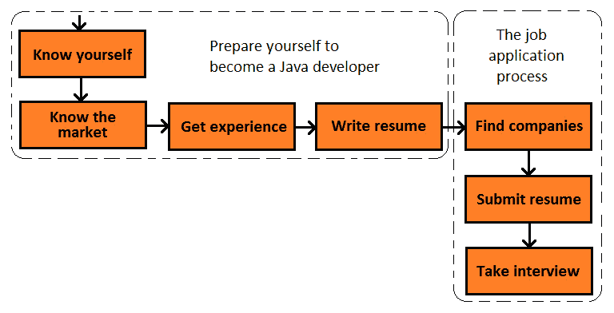
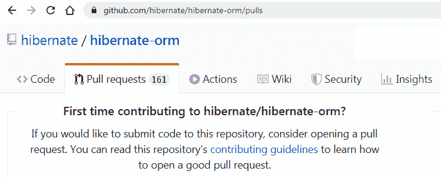

# 第二章

*第一章*：

# 从哪里开始，如何为面试做准备

本章是一个全面的指南，涵盖了从最开始到被聘用的 Java 面试准备过程。更确切地说，我们想要强调可以确保未来职业道路顺利和成功的主要检查点。当然，在你阅读本书的时候，你可能会发现自己处于这些检查点中的任何一个：

+   尽早开始面试准备

+   获得正确的经验

+   向世界展示你的工作

+   准备你的简历

+   参加面试

在本章结束时，你将清楚地了解如何根据你目前的状态实现前述检查点。因此，让我们从覆盖第一个检查点开始，看看新手面试路线图。

# 新手面试路线图

让我们从一个基本的真理开始，这是绝对必要的，但不足以成为成功的开发者：最优秀的 Java 开发者对他们的工作充满激情，而且，随着时间的推移，真正的激情会变成职业。长期来看，激情是无价的，它会让你脱颖而出，远远超过那些技术娴熟但缺乏激情的人。

既然你买了这本书，你想要在 Java 软件开发职业中投入一些时间和金钱。主要是，你想成为令人惊叹的 Java 生态系统的一部分！你已经感受到了专注于使用 Java 工作所带来的力量和能量，因此，即使你还没有积极地考虑过，你已经开始为 Java 面试做准备。

很可能，你是一名学生，或者刚刚获得了 IT、计算机科学学士学位，或者你只是发现自己对 Java 语言有天赋。然而，既然你在这里，你一定有很多关于如何在 Java 生态系统中找到梦想工作的问题和疑虑。

是时候制定成功的计划了！以下流程图代表了一个学生或 Java 新手的面试路线图，他们想成为 Java 生态系统的一部分：

图 1.1 - 新手面试路线图

在这一章中，我们将涵盖前面图表中的每一项。让我们从第一项开始，*了解自己*。

# 了解自己

在寻找工作之前，了解自己是很重要的。这意味着你应该知道自己是什么样的开发者，想要什么样的工作。

这对于获得正确的经验、发展你的技能包和找到合适的雇主至关重要。很可能，你可以涵盖各种 Java 编程任务，但你是否觉得它们都同样吸引人？做一些自己不喜欢的事情短期内是可以的，但长期来看是行不通的。

理想情况下，长期来看，你必须专注于自己最喜欢做的事情！这样，你最大程度地提高了成为顶尖 Java 开发者的机会。但是，做自己最喜欢的事情应该考虑到 IT 市场提供的内容（无论是短期还是长期）。一些 Java 技术在工作机会中得到了广泛覆盖，而其他一些可能需要很长时间才能找到工作，或者必须做一些非常不愉快的权衡（例如，搬迁）。强烈建议定期参考并参与（每一票都很重要）由网站如 blogs.oracle.com、snyk.io、jaxenter.com、codeburst.io、jetbrains.com 和 dzone.com 进行的最相关的 Java 调查。有很多公司可供选择，从统计学上来看，最大程度地提高了找到适合你的公司的机会。这是问题的一半，另一半是为确保你想要的工作的公司也想要你而做好准备。

现在，让我们来看看 10 个问题，这些问题将帮助你确定你计划成为什么样的开发者。审视自己，尝试将你的个性和技能与以下问题和解释相重叠：

1.  你对开发用户界面或在幕后执行的重要业务逻辑感兴趣？开发出色的用户界面是图形界面的一个极其重要的方面。毕竟，图形界面是最终用户看到和与之交互的内容。它需要创造力、创新、远见和心理学（例如，开发多设备界面是相当具有挑战性的）。它需要对 Java AWT、Swing、JavaFX、Vaadin 等有所了解。另一方面，在幕后执行并回应最终用户操作的业务逻辑是界面背后的引擎，但对于最终用户来说，它大部分时间是一个黑匣子。业务逻辑需要强大的编码技能和对算法、数据结构、框架（如 Spring Boot、Jakarta EE 和 Hibernate）、数据库等的扎实知识。大多数 Java 开发人员选择编写幕后的业务逻辑（用于桌面和网络应用程序）。

1.  你觉得哪种应用程序最吸引人（桌面、移动、网络或其他）？每种类型的应用程序都有特定的挑战和专用的工具套件。如今，公司的目标是尽可能多地吸引消费者，因此现代应用程序应该适用于多平台设备。最重要的是，你应该能够在编码时知道该应用程序将在不同的设备上公开，并与其他系统进行交互。

1.  你是否特别感兴趣测试、调试和/或代码审查？具有编写有价值的测试、发现错误和审查代码的强大技能是保证高质量最终产品的最重要的技能。在这三个领域中，我们应该专注于测试，因为几乎任何 Java 开发人员的工作描述都要求候选人具有编写单元测试和集成测试的强大技能（最常用的工具是 JUnit、TestNG、Mockito 和 Cucumber-JVM）。然而，试图找到一个专门的 Java 测试工作或 Java 代码审查员是相当具有挑战性的，通常在大公司（特别是在提供远程工作的公司，如 Upstack 或 Crossover）中遇到。大多数公司更喜欢*成对代码审查*，每个 Java 开发人员都应该编写有意义的测试，为他们编写的代码提供高覆盖率。因此，你必须能够做到两者：编写令人惊讶的代码，并为该代码编写测试。

1.  你对与数据库交互的应用程序感兴趣，还是试图避免这样的应用程序？大多数 Java 应用程序使用数据库（关系数据库或 NoSQL 数据库）。广泛的 Java 开发人员工作将必然要求你对通过对象关系映射框架（如 Hibernate）、JPA 实现（如 Hibernate JPA 或 Eclipse Link）或 SQL 中心库（如 jOOQ）编码具有强大的知识。大多数 Java 应用程序与关系数据库交互，如 MySQL、PostgreSQL、Oracle 或 SQL Server。但在相当数量的应用程序中也会遇到 NoSQL 数据库，如 MongoDB、Redis 或 Cassandra。试图避免开发与数据库交互的应用程序可能会严重限制提供的工作范围。如果这是你的情况，那么你应该从今天开始重新考虑这一方面。

1.  你是否偏爱代码优化和性能？关心代码性能是一项非常受赞赏的技能。这样的行为会让你被归类为一个注重细节的完美主义者。拥有优化代码并提高性能的解决方案将很快让你参与设计和架构功能需求的解决方案。但在面试时（编码挑战阶段），不要专注于代码优化和性能！只需专注于提供一个可行的解决方案，并尽可能地编写清晰的代码。

1.  对你来说，更吸引人的是专注于编码的工作还是成为软件架构师？作为一名 Java 开发人员，你在职业生涯的开始阶段将专注于编码并在代码层面上做出实现设计决策。随着时间的推移，一些开发人员发现自己在设计大型应用程序方面有能力和兴趣。这意味着是时候从 Java 开发人员进化为 Java 架构师，甚至是 Java 首席架构师。虽然编码仍然是你工作的一部分，但作为架构师，你将在同一天戴上不同的帽子。你需要在会议、架构设计和编码之间分配时间。如果你觉得自己有设计和架构项目不同部分的能力，那么建议你考虑一些软件架构方面的培训。此外，在专注于编码的工作期间，挑战自己看看你能找到什么解决方案，并将其与应用程序当前架构师实施的解决方案进行比较。

1.  你更倾向于小公司还是大公司？选择小公司还是大公司是一种权衡。理想情况下，大公司（品牌）会提供稳定性、职业发展路径和良好的薪酬计划。但你可能会感到受到官僚主义、缺乏沟通和部门之间的竞争以及冷漠僵化的环境的限制。在小公司，你有机会更加强烈地感到自己是成功的一部分，并且会感受到成为一个小社区（甚至是一个家庭）的温暖愉悦感。然而，小公司可能会很快失败，你可能会在一两年内被解雇，很可能没有任何补偿计划。

1.  你是针对软件公司（从事各种项目）还是特定行业（例如石油工业、医药、汽车工业等）？软件公司管理来自各个领域的项目（例如，软件公司可能同时为好莱坞明星开发网站、开发金融应用程序和航空交通管制应用程序）。从开发者的角度来看，这意味着你需要多方面思考，能够快速适应并理解不同业务领域的要求，而不需要深入了解这些领域。另一方面，大型行业（例如石油工业）更倾向于创建自己的 IT 部门，开发和维护特定于该公司领域的应用程序。在这种情况下，你很可能也会接受一些关于该公司领域的培训。你将有机会成为开发特定领域应用程序的专家。

1.  你更喜欢远程工作吗？在过去几年中，大量公司决定雇佣远程开发人员。此外，像 Upwork、Remote|OK、X-Team 和 Crossover 这样的新公司是 100%远程公司，只招聘远程职位。在世界的任何一个角落工作并拥有灵活的工作时间是非常吸引人的。这些公司为初级、中级和高级开发人员提供工作机会，其中一些公司（例如 Crossover）还提供远程管理职位。但是，你也必须意识到这种安排的一些其他方面：可能会通过网络摄像头进行监控（例如，每 10 分钟拍摄一次快照）；你需要在完全远程的团队中工作，团队成员来自不同的时区（例如，参加夜间会议可能会有挑战）；你需要熟悉 JIRA、GitHub、Zoom、Slack、Meetup 和内部市场平台等工具；你可能会面临大量摩擦（大量电子邮件）和缺乏沟通；你需要支付税款，最后但同样重要的是，你可能需要实现不切实际的指标以牺牲质量来保持你的职位。

1.  **管理是否吸引您？**通常，达到管理职位是需要领导能力的目标。换句话说，您应该能够在技术和人类层面上做出重要决策。从这个角度来看，您需要避免那些提供扎实技术职业道路但不提供晋升到管理层的机会的公司。

重要提示

了解自己是生活中做出最佳决定所需的最困难的部分之一。有时，询问其他人的意见是消除您对自己的主观看法的最佳方式。大多数时候，询问您的老师、父母和朋友将帮助您更好地了解您的技能和最适合您的位置。独自做出重要决定是有风险的。

一旦了解自己，就是了解市场的时候了。

# 了解市场

知道自己想要什么很好，但还不够。作为下一步，您应该研究市场对您的需求。目标是获得您想要的和市场提供的完美结合。

重要提示

发展市场技能是在不久的将来找工作的重要方面。

首先，您必须检查过去几年中最受欢迎的 Java 技术以及未来趋势。随着时间的推移，保持相对稳定受欢迎度的技术是公司中最常用的技术。

花时间阅读来自重要网站的过去 2-3 年的几项调查，如 blogs.oracle.com，snyk.io，jaxenter.com，codeburst.io，jetbrains.com 和 dzone.com。主要可以在 Google 上搜索*java technologies survey 2019*或类似的关键词组合。同时，不要忽视财务部分，确保搜索*java salaries survey 2019*。

您将找到许多调查，它们很好地总结了最受欢迎的技术，正如您在以下两个图中所看到的。第一个显示了应用服务器的受欢迎程度：

图 1.2 - 使用的应用服务器

以下图显示了开发人员更喜欢使用的框架：

图 1.3 - 开发人员更喜欢使用的框架

阅读时，列出并记录哪些 Java 技术最受欢迎，哪些技术目前不值得关注。这将是一个类似于以下的列表：

图 1.4 - 按受欢迎程度分割技术

通过这种方式，您可以快速过滤市场上最需要的技术。学习热门技术最大化了您在不久的将来找工作的机会。

此外，通过以下方式了解市场对您添加到*Popular*列的技术的态度：

+   **社交网络**：大量社交网络包含有关技术和 IT 行业趋势的帖子。一些主要参与者是 LinkedIn，Stack Overflow，Twitter，Reddit 和 Facebook。

+   **书店**：图书出版商努力满足编程社区对最受欢迎技术的兴趣。他们通过对值得在他们的书中涵盖的主题进行严肃的研究活动来进行过滤。一本新书或某一主题或技术的大量书籍是编程社区对该主题的兴趣的良好指标。然而，要注意突然变得流行的技术。大多数时候，这样的技术不会立即被公司采用。可能需要多年才能被采用，或者它们可能永远留在阴影中。

+   **课程和培训**：除了学院和大学外，大量网站致力于提供热门和热门话题的课程和培训。

# 一切都是关于获得正确的经验

你知道自己想要什么和市场提供了什么。这很酷！现在是时候获得正确的经验了！没有经验就没有简历，没有简历就没有面试，因此，这是一个重要且费力的步骤。接下来的小节将帮助你实现两个主要目标：

+   积累大量的技术知识和技能。

+   在 Java 生态系统中赢得信任和可见度。

注意 - 这两个目标不会一夜之间实现！这需要时间和毅力，但有一个明确且有保证的结果 - 你将成为顶尖的 Java 开发者。所以，让我们开始吧！

## 开始做些什么

对于学生或应届毕业生来说，很难决定从哪里开始获得经验并写简历。你知道你应该*开始做些什么*，但你无法决定那个*什么*应该是什么。嗯，那个*什么*应该是**代码**。在你有任何正式工作之前，参与学校项目、实习、编程、志愿工作和任何形式的实践经验。

## 是时候在网上大放异彩了

尽快上网展示你的能力是必不可少的（例如从学校开始）。公司和编程社区都希望看到你在网上的成长。但在你跳入之前，确保你遵循下面的两条黄金规则：

+   **非常重要的是要注意在网上展示你的工作时使用的身份。**不要使用虚假的凭据、头像、昵称、电子邮件、密码等。你现在创建的账户（例如 GitHub、Stack Overflow、LinkedIn、YouTube、Twitter 等）很可能会在整个互联网上共享，并让你出名。始终使用你的全名（例如 Mark Janel，Joana Nimar），为你的个人资料使用一张相关的照片（如下图所示），并在账户（例如@markjanel，joananimar）和电子邮件地址（例如 mark.janel@gmail.com）中使用你的名字。虚假的名字、电子邮件和昵称很难与你和你的工作联系在一起：

图 1.5-使用相关照片

+   **始终接受批评并保持礼貌。**在网上展示你的工作会吸引批评。你收到的极少部分评论是毫无逻辑的恶意评论。在这种情况下，最好的做法是忽略这样的评论。但大多数评论都是积极和建设性的。始终用论据回应这样的评论，并始终保持礼貌。**常识是最重要的技能！**要开放并保持对其他观点的开放！

不要感到失望或沮丧。永远不要放弃！

### 为开源项目做贡献

为开源项目做贡献是衡量你的技能并迅速获得经验和向寻找候选人的公司展示自己的超音速途径。不要低估自己！小小的贡献也同样重要。甚至阅读和理解开源项目的代码也是获得编码经验和学习编码技巧的绝佳机会。

许多开源项目鼓励和支持开发者做出贡献。例如，查看以下截图中的 Hibernate ORM 开源项目：

图 1.6-为开源项目做贡献

你有机会在你以后的日常工作中使用的代码上留下自己的印记！而且它也被数百万的开发者使用。多酷啊！？

### 开始你自己的 GitHub 账户

除了为开源项目做贡献外，建议开设自己的 GitHub 账户。雇主会在见到你之前评估你的 GitHub 个人资料内容。不要忽视任何方面！花时间整理你的 GitHub 个人资料，让它展现你最好的代码。请记住，最糟糕的 GitHub 账户是空账户或者长期低活跃度的账户，如下图左侧所示：

图 1.7 - 四个月的 GitHub 贡献

表现出对清晰代码和有意义的`README.md`文件的偏好，并避免长期低活跃度，如前一张截图所示。

### 开始你自己的 Stack Overflow 账户

Stack Overflow 是评估你工作的下一个站点。你在 Stack Overflow 上的问题和答案将出现在谷歌搜索中，因此，你必须特别注意你发布的内容（问题和答案）。一般来说，你的问题可能会显示你的知识水平，因此*不要*发布简单的问题、在文档中有简单答案的问题、隐藏在琐碎编程挑战背后的问题等。另一方面，确保提供有价值的答案，不要重复别人的答案。提供能为你带来徽章的内容，而不是负面评价。将你的 GitHub 个人资料链接到你的答案，以提供完整的解决方案。

### 开设自己的 YouTube 频道

除了娱乐，YouTube 也是一个巨大的技术知识来源。在 YouTube 上，你可以发布完整的编程解决方案，向人们展示如何编程，如何成为更好的程序员。如果你做到以下几点，你可以迅速增加你的 YouTube 订阅者：

+   不要制作过长的视频（保持在 10-20 分钟的课程）！

+   确保你有一个好的网络摄像头和麦克风。一个好的网络摄像头至少有 1080p 的分辨率，一个好的麦克风是 Snowball ICE；录制时使用免费或低成本的工具，比如 Free2X Webcam Recorder（free2x.com/webcam-recorder）和 Loom（loom.com）；Camtasia Studio 也很棒（techsmith.com/video-editor.html）。

+   展现出优秀的英语能力（英语在 YouTube 上最常用）。

+   介绍自己（但要快速）。

+   热情（向人们展示你享受你的工作，但不要夸大其词）。

+   务实（人们喜欢现场编码）。

+   抓住机会证明你的演讲技巧（这将为你打开参加技术会议的大门）。

+   推广你的工作（添加链接和提示，以获取更多视频、源代码等）。

+   回应人们的反馈/问题（不要忽视人们对你视频的评论）。

+   接受批评并保持礼貌。

将你的 GitHub 和 Stack Overflow 账户链接到你的 YouTube 视频，以获得更多曝光和粉丝。

### 开始你的技术博客

你在 GitHub、Stack Overflow 和 YouTube 上的出色工作可以很容易地在技术博客的故事中进行推广。写有关编程主题的文章，特别是你解决的编程问题，并写教程、技巧等。持续发布高质量内容将增加你的流量，并将你的博客索引到搜索引擎上。有一天，这些有价值的内容可以被利用来写一本惊人的书，或者开发一部优秀的 Udemy（udemy.com）或 PluralSight（learn.pluralsight.com）视频。

有很多博客平台，比如 Blogger（blogger.com）、WordPress（wordpress.org）和 Medium（medium.com）。选择你喜欢的平台并开始。

### 写文章并吸引大量流量和/或获得报酬

如果你想发布技术文章并赚钱，或者吸引大量流量到你的作品，那么个人博客在一段时间内可能不会很有用（1-2 年）。但你可以为那些每天注册大量流量的网站写技术文章。例如，DZone（dzone.com）是一个很棒的技术平台，你可以免费写作，或者加入不同的计划，按照你的工作获得报酬。通过简单地创建一个免费的 DZone 账户，你可以立即开始通过他们的在线编辑器发布技术文章。1-5 天内，他们将审查你的作品并在网上发布。几乎立即，成千上万的人会阅读你的文章。除了 DZone，其他很棒的技术平台也会支付你为他们写作（通常每篇文章 10-150 美元，取决于长度、主题、内部政策等）。其中一些平台包括 InformIT（informit.com）、InfoQ（infoq.com）、Mkyong（mkyong.com）、developer.com（developer.com）、Java Code Geeks（javacodegeeks.com）、GeeksForGeeks（geeksforgeeks.org）和 SitePoint（sitepoint.com）。

### 推广自己和自己的作品（作品集）

工作很重要，但展示你所做的事情并获得他人的反馈也很重要。

重要提示

*管理你的在线资料非常重要。*招聘人员使用在线资料来寻找理想的候选人，更好地了解你，并准备深入或定制的面试问题。

除了 GitHub、Stack Overflow 等，招聘人员还会在 Google 上搜索你的名字，并查看你的个人网站和社交网络资料。

个人网站

个人网站（或作品集）是展示你工作的网站。只需添加你制作/贡献的应用程序的截图，并简要描述你的工作。解释你在每个项目中的角色，并提供项目的链接。注意不要暴露私人和专有公司信息。你可以从互联网上快速获得灵感（例如，codeburst.io/10-awesome-web-developer-portfolios-d266b32e6154）

在建立个人网站时，你可以依赖免费或低成本的网站构建工具，如 Google Sites（sites.google.com）和 Wix（wix.com）。

#### 社交网络资料

最重要的社交网络之一是 Twitter。在 Twitter 上，你可以在全世界最优秀的 Java 开发者面前推广你的工作。从第一天开始，搜索并关注最优秀的 Java 开发者，很快他们也会关注你！作为一个提示，开始关注你能找到的尽可能多的 Java Champions（全球最优秀的 Java 开发者的独家社区）。Twitter 上有一个庞大而有价值的 Java 开发者社区。尽快认识他们！

其他社交网络，如 Facebook 和 Instagram，也会被招聘人员扫描。注意你的帖子内容。显然，激进主义、种族主义、狂热主义、琐碎或性内容、政治内容、口号和煽动暴力、诽谤和冒犯性内容等都会让招聘人员退后一步。

#### CodersRank 很重要

CodersRank（codersrank.io/）是一个收集关于你工作的信息的平台（例如，它从 GitHub、Stack Overflow、Bitbucket、HakerRank 等收集信息），并试图将你与全球数百万其他开发者进行排名。在下面的截图中，你可以看到一个开发者的个人资料页面：

图 1.8 - CodersRank 个人资料摘要

这也是招聘人员的另一个重要指标。

学习，编码，学习，编码...

一旦你成为开发者，你必须遵循“学习->编码”实践，以便跻身顶尖并保持在那里。永远不要停止学习，永远不要停止编码！作为一个经验法则，“学习->编码”实践可以通过“以例学习”或“教学是我的学习方式”等方法来应用，或者任何其他适合你的方法。

### 认证怎么样？

一旦你访问 education.oracle.com/certification，你会发现 Oracle 提供了一套 Java 认证。虽然获得认证（来自 Oracle 或其他方）没有错，但在职位描述中并不要求。获得这些认证需要大量的金钱和时间，而且大多数时候并不值得。你可以更明智地利用这段时间参与项目（副业项目，学校项目，开源项目等）。这是给雇主留下更好印象的方法。因此，证书的价值有限，获得它们需要大量资源。此外，证书是有限期的。想想在 2020 年，成为 Java 6 认证的价值有多大，或者在 2030 年成为 Java 12 认证的价值有多大！

但是如果你真的想考虑认证，那么以下是提供的顶级认证（有关更多信息，请在 Google 上搜索，因为链接可能会随时间而中断）：

+   OCAJP（Oracle 认证助理，Java 程序员 1）和 OCPJP（Oracle 认证专业人员，Java 程序员 2）

+   Spring 专业认证

+   OCEWCD（Oracle 认证专家，Java EE 6 Web 组件开发人员）

+   Apache Spark Cert HDPCD（HDP 认证开发人员）

+   专业 Scrum 大师

+   项目管理（PMP）

+   AWS 解决方案架构师

+   Oracle 认证大师

在互联网上拥有经验和知名度（粉丝）对你的职业生涯是一个巨大的加分。但是你仍然需要一份有用的简历来申请 Java 工作。所以，现在是写简历的时候了。

# 写简历的时间

写一份令人印象深刻的简历并不容易。有很多平台承诺如果你让他们为你做，你的简历会很棒。也有很多简历模板，大多数都相当复杂和繁琐。另一方面，简历是个人的东西，最好自己做。记住以下几点就足以为招聘人员制作一份吸引人的简历。让我们看看这些要点以及如何处理它们。

## 简历筛选者在寻找什么

首先，简历筛选者想要找出你是否是一个优秀的编码人员，是否聪明。其次，他们想要找出你是否适合某个可用职位（他们会检查你的经验是否符合该职位所需的特定技术和工具）。

努力突出你是一个优秀的编码人员，聪明。这意味着尽可能在一个集中的形式中尽可能技术化。注意：太多的字会稀释你简历的本质，导致失去焦点。**要技术化，清晰，简洁**。

## 简历应该有多长

要回答简历应该有多长，你必须回答另一个问题：你认为招聘人员花多长时间阅读一份简历？很可能是 10-20 秒。换句话说，招聘人员在字里行间阅读，试图快速确定他们感兴趣的内容。

一般来说，简历不应超过一页。如果你有 10 年以上的经验，那么可以用 2 页。

你可能认为在 1-2 页内概括你的丰富经验是不可能的，但这并不是真的。首先，优先考虑内容，其次，添加这些内容直到覆盖 1-2 页。跳过剩余的内容。不要担心招聘人员不会知道你做过的一切！他们会对你的简历亮点印象深刻，并乐于在面试中发现你的其余经验。

**写一份适合一页的简历。**

如果你有 10 年以上的经验，那么考虑两页。请记住，一些招聘人员可能会在没有阅读一行的情况下跳过长篇简历。他们想要立即找到最令人印象深刻的项目。添加不太重要的项目和/或太多的字会分散招聘人员的注意力，让他们浪费时间。

## 如何列出你的工作经历

如果你的就业历史很短（2-4 个角色），那么把所有的都加到简历中。如果你有很长的角色列表（4 个以上的角色），那就不要列出你的完整就业历史。只选择 4 个最令人印象深刻的角色（在重要公司的角色、领导角色、取得了巨大成就和/或做出了重大贡献的角色）。

对于每个角色，遵循*成就->行动->效果*模型。始终从成就开始！这将成为招聘人员的磁铁。一旦他们读到成就，你就吸引了他们继续阅读。

例如，假设你在公司*Foo*工作，通过调整参数，你成功将连接池的性能提高了 30%。现在应用程序可以额外容纳 15%的交易吞吐量。将这一成就以单一陈述方式添加到简历中：

*通过调整其参数，将连接池的性能提高了 30%，从而提高了 15%的交易吞吐量。*

**通过成就->行动->效果陈述列出最相关的角色**。始终尝试衡量你创造的收益。不要说，“通过压缩...，我减少了内存占用”，而是说，“通过压缩...，我减少了内存占用 5%”。

## 列出最相关的项目（前五个）

一些招聘人员更喜欢直接跳到你的简历的*我的项目*部分。他们遵循*不要废话，只谈实质*的原则。你不必列出所有的项目！列出前五个并只添加那些。不要从同一类别中添加所有五个。选择一个或两个独立项目，一个或两个开源贡献等。一个拥有高 GitHub 星级评分的独立项目才是真正会给招聘人员留下深刻印象的。

列出顶级项目及其相关细节。这是失去谦逊、尽力给人留下深刻印象的正确地方。

## 提名你的技术技能

*技术技能*部分是必须的。在这里，你必须列出你所了解的编程语言、软件和工具。它不必像命名那样冗长，但也不必是一个简短的部分。它必须与列出的项目相关并协调一致。以下列表明了编写*技术技能*部分时要遵循的主要标准：

+   **不要列出所有的 Java 变种**：不要添加 Spring MVC、Spring Data、Spring Data REST、Spring Security 等列表。只说 Spring。或者，如果你是 Java EE 的人，不要列出 JPA、EJB、JSF、JAX-RX、JSON-B、JSON-P、JASPIC 等列表。只说 Java EE、Jakarta EE。或者，如果在职位描述中以这种方式列出它们，那么你可以在括号中添加它们。例如：“Spring（MVC、Data 包括 Data REST、Security）”或“Java EE（JPA、EJB、JSF、JAX-RX、JSON-B、JSON-B、JASPIC）”。

+   **不要添加软件版本**：避免添加 Java 8、Spring Boot 2 或 Hibernate 5 等内容。如果这些细节是必要的，面试官会问你。

+   **不要列出实用技术**：避免列出项目中常用的实用库。例如，不要添加 Apache Commons、Google Guava、Eclipse Collections 等。可能招聘人员没有听说过它们。或者，如果他们听说过，他们会带着讽刺的微笑。

+   **不要列出你只是轻微接触过的技术**：列出你只是偶尔和/或肤浅地使用过的技术是相当冒险的。在面试中，你可能会被问到这些技术的问题，这会让你陷入困境。

+   对于每种技术，添加你的经验：例如，写上*Java（专家）、Spring Boot（高级）、Jakarta EE（熟练）、Hibernate（专家）*。

+   **不要用技术的使用年限来衡量你的经验**：大多数时候，这并不相关。这个度量标准对招聘人员来说并没有太多意义。你的经验是通过你的项目展现出来的。

+   **避免常见技术**：不要列出操作系统、Microsoft Office、Gmail、Slack 等。列出这些东西只会给招聘者带来干扰。

+   **仔细检查您的英语**：如果简历有拼写错误，招聘者可能会将其丢弃。如果您不是以英语为母语的人，那么请找一个以英语为母语的人来校对您的简历。

+   **不要列出单一的编程语言**：理想情况下，您应该列出两到三种编程语言（例如，*Java（专家）、C++（中级）、Python（有经验）*），但不要说您在所有这些语言中都是专家。没有人会相信你！另一方面，单一的编程语言可能被解释为您不愿意学习新技术。

+   **将技术分成类别**：不要将技术列为一个长长的、逗号分隔的列表。例如，避免类似于*Java、Ruby、C++、Java EE、Spring Boot、Hibernate、JMeter、JUnit、MySQL、PostgreSQL、AWS、Ocean 和 Vue.js*这样的列表。将它们分成类别，并按经验排序，如下例所示：

a. **编程语言**：Java（专家）、Ruby（中级）和 C++（初学者）

b. **框架**：Java EE（专家）、Spring Boot（高级）

c. **对象关系映射**（**ORM**）：Hibernate（专家）

d. **测试**：JMeter（专家）、JUnit（高级）

e. **数据库**：MySQL（专家）、PostgreSQL（中级）

f. **云**：AWS（专家）、Ocean（初学者）

g. **JavaScript 框架**：Vue.js（中级）

## LinkedIn 简历

很可能，您的 LinkedIn 个人资料将是招聘者的第一站。此外，大量的电子工作平台在您尝试申请工作时都要求您的 LinkedIn 账户。甚至有些情况下，这个账户是强制性的。

LinkedIn 是一个专门用于跟踪专业联系的社交网络。本质上，LinkedIn 是一个在线简历的增强版。在 LinkedIn 上，您可以创建工作提醒，同事、客户和朋友可以为您或您的工作背书，这可能非常有价值。

重要提示

注意保持您的 LinkedIn 简历与纸质简历同步。此外，如果您通过 LinkedIn 寻找工作，请注意，所有您的联系人都会收到关于您更新的通知。这些联系人包括您当前公司的人，而且很可能您不希望他们知道您在找新工作。解决方案是在更新之前禁用这些通知。

现在，我们可以讨论求职流程了。

# 求职流程

技术公司更喜欢多阶段面试。但是，在被邀请参加面试之前，您必须找到正在招聘的公司，申请他们的工作，然后最终与他们见面。

## 寻找正在招聘的公司

过去几年（2017 年以后）的调查估计，70%-85%的工作都是通过人际网络填补的（linkedin.com/pulse/new-survey-reveals-85-all-jobs-filled-via-networking-lou-adler/）。技术工作（尤其是 IT 领域）代表了利用人际网络的主要领域。

在几乎任何国家，都有几个电子工作平台。我们称它们为*本地*电子工作平台。通常，*本地*电子工作平台列出了在该国活跃的公司或全球招聘的公司的工作机会。

全球范围内，我们有全球性的电子工作平台。这些平台包括一些主要的参与者（所有这些网站都允许您上传简历或在线创建简历）：

+   **LinkedIn**（linkedin.com）：拥有超过 6.1 亿用户，覆盖全球 200 多个国家，这是全球最大的专业社交网络和社交招聘平台。

+   **Indeed**（indeed.com）：这是一个领先的职位网站，收集了来自数千个网站的数百万个工作机会。

+   **CareerBuilder**（careerbuilder.com）：这是另一个发布来自全球各地的大量工作机会的巨大平台。

+   **Stack Overflow**（stackoverflow.com/jobs）：这是开发人员学习、分享编程知识和发展职业的最大、最值得信赖的在线社区。

+   **FlexJobs**（flexjobs.com）和**Upwork**（upwork.com）：这些是专门为自由职业者提供高级、灵活的远程工作的平台。

提供寻找工作有用的服务的其他平台包括以下内容：

+   **Dice**（dice.com）：这是每个阶段的技术专家的领先职业目的地。

+   **Glassdoor**（glassdoor.com）：这是一个包括公司特定评级和评论的复杂平台。

除了这些平台，还有许多其他平台，你可以自己发现。

## 提交简历

一旦你找到想申请的公司，就是提交你的简历的时候了。

首先，看看公司的网站。这可以帮助你找到以下内容：

+   看看是否可以直接通过公司网站申请（通过绕过就业机构，你可以加快流程，公司可以直接雇佣你，而不必向就业机构支付佣金）。

+   你可以在公司数据库中注册，以便在合适的职位开放时联系你。

+   你有机会了解公司的历史、愿景、项目、文化等等。

+   你可以找到公司相关人员的联系方式（例如，你可以找到详细和支持的电话号码）。

第二，仔细检查你的简历和在线资料。很可能，如果你的简历给招聘人员留下了深刻印象，他们会在谷歌上搜索你的名字，并检查你的社交网络活动。从技术内容到社交媒体，一切都将在发送面试邀请之前进行扫描。

第三，不要向所有公司发送完全相同的简历！对于每家公司，都要对简历进行调整，使其尽可能与职位描述相关。

# 我得到了面试！现在怎么办？

如果你迄今为止都按照路线图进行，那么只是几天的事情，你就会收到一封电子邮件或电话邀请你参加面试。哦，等等...你是说你已经有了面试？太棒了！是时候准备好自己了！

## 电话筛选阶段

大多数 IT 公司更喜欢从*电话筛选*开始多步面试流程。电话筛选通常是通过 Skype、Zoom 或 Meetup（或类似平台）完成的，你需要分享你的网络摄像头。还需要麦克风和一副耳机。如果你选择远程职位，电话筛选非常受欢迎，但最近，它们被用于各种职位。

通常，公司使用两种方法：

+   **与人力资源或就业机构人员进行电话筛选**：这是一个可选的、非技术性的 15-30 分钟面试，旨在详细说明提供条款，展示你的个性、关注点，你和他们的期望等等。这可能在技术电话筛选之前或之后进行。

+   **首先是技术电话筛选**：有些公司会直接邀请你参加技术电话筛选。在这种情况下，你可以期待几个技术问题，也许是一场测验，以及一个或多个编码挑战环节（解决编码挑战是本书的主要重点）。如果你通过了技术电话筛选，那么很可能会有一个非技术的电话筛选。

## 参加面试

除非你选择远程职位，下一步将是面对面的面试。有些情况下，没有电话筛选，这是面试的第一步。在这种情况下，你可能会先接受人力资源部门的面试，然后是技术面试。但是，如果你经历了电话筛选，那么可能会联系你，也可能不会。这取决于公司如何评估电话筛选。如果他们决定不继续进行下一阶段的面试，那么你可能会收到一些反馈，涵盖了你电话筛选表现的优点和不足之处。不要忽视反馈，仔细阅读并客观地看待。这可能会帮助你避免重复同样的错误。说到错误…

## 避免常见的错误

注意以下可能导致面试失败的常见错误：

+   **忽视信息的力量**: 有时面试失败后，我们会找朋友谈谈面试情况。这时，你的朋友可能会说：“我的朋友，我认识一个人两个月前在这家公司成功面试过！为什么你之前不告诉我？我肯定他可以给你一些建议！”显然，现在已经太迟了！避免这种情况，尽量获取尽可能多的信息。**看看你或你的朋友在公司是否有联系，在社交媒体上问问等。**这样可以获取非常有用的信息。

+   **回答缺乏清晰和连贯性**: 你的回答应该是技术性的、清晰的、有意义的、表达力强的，并且始终与话题相关。**认真回答问题**。口吃、回答不完整、插话等都不受面试官欢迎。

+   **认为形象不重要**: 不要忽视你的形象！着装要专业，去理发店，保持干净整洁！所有这些都是第一印象的一部分。**如果你看起来邋遢，也许你的代码也是如此。如果你穿着得体，那么面试官会把你视为高人一等。**然而，着装得体并不意味着你应该奢华。

+   **没有充分展示自己**: 面试官必须看到你的价值。没有人比你更能向他们传达你的价值。告诉他们你曾经遇到的问题（在以前的公司，某个项目中等），并解释你是如何与团队或独立解决的。雇主希望找到既是优秀团队合作者又能独立工作的人。采用*SAR（Situation|Action|Result）*方法。首先描述情况，然后解释你采取的行动，最后描述结果。

+   **不练习编码挑战**: 在某个时候，你将被安排至少一次编码挑战。大多数情况下，一般的编码技能是不够的！这些挑战是特定于面试的，你必须在面试前练习。一般来说，解决编码挑战（问题）遵循*方法->分解->构建*的解决模式。显然，你不能记住解决方案，因此你需要尽可能多地练习。在本书的后面，我们将讨论解决编码挑战的最佳方法。

面试结束后，就是等待回复的时候了。大多数公司会告诉你他们需要多少时间来提供最终答复，并通常会提供一个代表着录取、拒绝、下一轮面试或者申请状态的答复。祝你好运！

# 摘要

本章总结了在 Java 生态系统中获得工作应遵循的最佳实践。我们谈到了选择适当的工作和我们的资格，获取经验，制作简历等等。大部分建议都是针对学生或刚刚毕业的人。当然，不要把这些建议看作是一个详尽的清单或者应该完全应用的清单。这些实践将帮助你收获你认为有吸引力的果实，并允许你在过程中加入自己的触摸。

接下来，让我们看看大公司是如何进行面试的。
