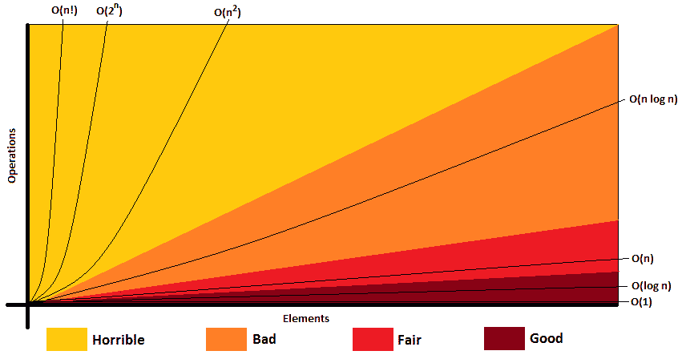
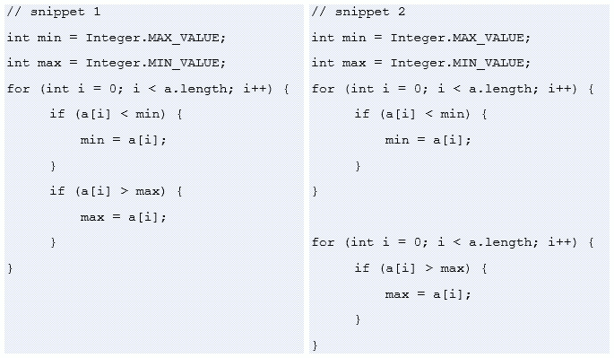
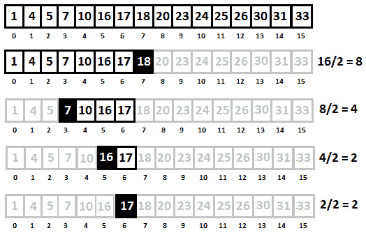
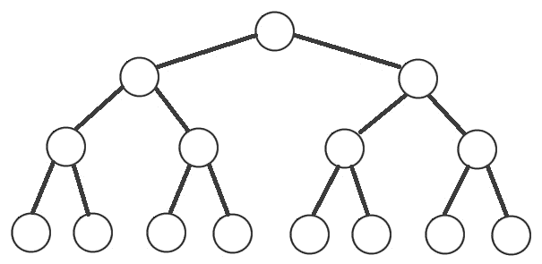
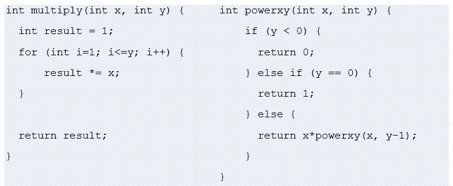

# 第九章

*第七章*：

# 算法的大 O 分析

本章将涵盖分析算法效率和可扩展性的最流行的度量标准——大 O 符号——在技术面试的背景下。

有很多文章专门讨论这个话题。其中一些是纯数学的（学术性的），而其他一些则试图以更友好的方式解释它。纯数学的方法很难理解，在面试中也不太有用，所以我们将采用更友好的方法，这将更加熟悉于面试官和开发人员。

即使如此，这并不是一项容易的任务，因为除了是衡量算法效率和可扩展性的最流行的度量标准外，大 O 符号通常也是你从未有动力学习的东西，尽管你知道它会出现在每一次面试中。从初级到高级的战士，大 O 符号可能是每个人最大的软肋。然而，让我们努力将这个软肋变成我们面试的一个强项。

我们将快速介绍大 O 符号，并强调最重要的事情。接下来，我们将深入研究精心设计的示例，涵盖各种问题，因此在本章结束时，你将能够确定并表达几乎任何给定代码的大 O。我们的议程包括以下内容：

+   类比

+   大 O 复杂度时间

+   最佳情况、最坏情况和预期情况

+   大 O 示例

所以，让我们开始我们的大 O 之旅！

# 类比

想象一种情景，你在互联网上找到了自己喜欢的电影之一。你可以订购或下载它。由于你想尽快看到它，最好的方法是什么？如果你订购，那么需要一天才能送到。如果你下载，那么需要半天的时间。所以，下载更快。这就是要走的路！

但等等！就在你准备下载时，你发现了*指环王大师收藏*，价格很优惠，所以你也考虑下载它。只是这一次，下载需要 2 天的时间。然而，如果你下订单，仍然只需要一天。所以，下订单更快！

现在，我们可以得出结论，无论我们订购多少物品，运输时间都保持不变。我们称之为 O(1)。这是一个恒定的运行时间。

此外，我们得出结论，下载时间与文件大小成正比。我们称之为 O(n)。这是一种渐近运行时间。

从日常观察中，我们还可以得出结论，网上订购比网上下载更具扩展性。

**这正是大 O 时间的含义：渐近运行时间测量或渐近函数。**

作为一种渐近测量，我们谈论的是大 O 复杂度时间（这也可以是复杂度空间）。

# 大 O 复杂度时间

以下图表显示，在某个时间点，O(n)超过了 O(1)。因此，在 O(n)超过 O(1)之前，我们可以说 O(n)的性能优于 O(1)：


图 7.1 – 渐近运行时间（大 O 时间）

除了 O(1)——常数时间——和 O(n)——线性时间运行时间——我们还有许多其他运行时间，比如 O(log n)、O(n log n)——对数时间——O(n2)——二次时间，O(2n)——指数时间，以及 O(n!)——阶乘时间。这些是最常见的运行时间，但还有许多其他存在。

以下图表代表了大 O 复杂度图表：



图 7.2 – 大 O 复杂度图表

正如你所看到的，并非所有的 O 时间表现都相同。O(n!)、O(2n)和 O(n2)被认为是**可怕的**，我们应该努力编写超出这个范围的算法。O(n log n)比 O(n!)更好，但仍然**糟糕**。O(n)被认为是**公平的**，而 O(log n)和 O(1)被认为是**好的**。

有时，我们需要多个变量来表示运行时性能。例如，修剪足球场草坪的时间可以表示为 O（wl），其中 w 是足球场的宽度，l 是足球场的长度。或者，如果你必须修剪 p 个足球场，那么你可以表示为 O（wlp）。

然而，这并不全是关于时间。我们也关心空间。例如，构建一个包含*n*个元素的数组需要 O（n）的空间。构建一个*n* x *n*元素的矩阵需要 O（n2）的空间。

# 最佳情况、最坏情况和预期情况

如果我们简化事情，我们可以考虑算法的效率，以*最佳情况*、*最坏情况*和*预期情况*来衡量。最佳情况是当我们的算法的输入满足一些特殊条件，使其表现最佳。最坏情况是在另一个极端，输入处于不利的状态，使我们的算法表现最差。然而，通常这些惊人或可怕的情况不会发生。因此，我们引入了预期性能。

大多数情况下，我们关心最坏和预期情况，对于大多数算法来说，它们通常是相同的。最佳情况是理想的性能，因此它仍然是理想的。主要是，对于几乎任何算法，我们都可以找到一个特殊的输入，导致 O（1）的最佳情况性能。

有关 Big O 的更多细节，我强烈建议您阅读 Big O 速查表（[`www.bigocheatsheet.com/`](https://www.bigocheatsheet.com/)）。

现在，让我们来解决一堆例子。

# 大 O 的例子

我们将尝试确定不同代码片段的 Big O，就像你在面试中看到的那样，我们将经历需要学习的几个相关课程。换句话说，让我们采用*以例子学习*的方法。

前六个例子将突出 Big O 的基本规则，列举如下：

+   去掉常数

+   去掉非主导项

+   不同的输入意味着不同的变量

+   不同的步骤被求和或相乘

让我们开始尝试一些例子。

## 例 1 - O（1）

考虑以下三个代码片段并计算它们的 Big O：

```java
// snippet 1
return 23;
```

由于这段代码返回一个常数，Big O 是 O（1）。无论代码的其余部分做什么，这行代码都会以恒定的速度执行：

```java
// snippet 2 - 'cars' is an array 
int thirdCar = cars[3];
```

通过索引访问数组是以 O（1）完成的。无论数组中有多少元素，从特定索引获取元素都是一个恒定的操作：

```java
// snippet 3 - 'cars' is a 'java.util.Queue'
Car car = cars.peek();
```

`Queue#peek()`方法检索但不删除队列的头（第一个元素）。不管头部后面有多少元素，通过`peek()`方法检索头部的时间都是 O（1）。

因此，前面代码块中的所有三个代码片段都具有 O（1）的复杂度时间。同样，从队列中插入和删除，从栈中推送和弹出，插入链表中的节点，以及从数组中检索节点的左/右子节点也是 O（1）时间的情况。

## 例 2 - O（n），线性时间算法

考虑以下代码片段并计算 Big O：

```java
// snippet 1 - 'a' is an array
for (int i = 0; i < a.length; i++) {
    System.out.println(a[i]);
}
```

为了确定这段代码的 Big O 值，我们必须回答以下问题：*这个* `for` *循环迭代了多少次？*答案是`a.length`次。我们无法准确地说这意味着多少时间，但我们可以说随着给定数组的大小（表示输入），时间会线性增长。因此，这段代码将具有 O（`a.length`）时间，被称为线性时间。它表示为 O（n）。

## 例 3 - O（n），去掉常数

考虑以下代码片段并计算 Big O：

```java
// snippet 1 - 'a' is an array
for (int i = 0; i < a.length; i++) {
    System.out.println("Current element:");
    System.out.println(a[i]);
    System.out.println("Current element + 1:");
    System.out.println(a[i] + 1);
}
```

即使我们在循环中添加了更多的指令，我们仍然会像*例 2*中一样具有相同的运行时间。运行时间仍然会随着其输入`a.length`的大小呈线性增长。就像*例 2*中我们在循环中有一行代码，而在这里我们在循环中有四行代码，你可能期望大 O 是 O(n + 4)或类似的。然而，这种推理不准确或准确 - 它是错误的！这里的大 O 仍然是 O(n)。

重要说明

请记住，大 O 不取决于代码行数。它取决于运行时间的增长率，这不会被常数时间操作修改。

为了加强这种情况，让我们考虑以下两个代码片段，它们计算给定数组`a`的最小值和最大值：



7.3 - 代码比较

那么，这两个代码片段中哪一个运行得更快？

第一个代码片段使用了一个循环，但有两个`if`语句，而第二个代码片段使用了两个循环，但每个循环中有一个`if`语句。

这样的思考方式会让人发疯！计算语句可以继续深入。例如，我们可以继续在编译器级别计算语句（操作），或者我们可能想要考虑编译器优化。嗯，这不是大 O 的意义所在！

重要说明

大 O 不是关于计算代码语句的。它的目标是表达输入大小的运行时间增长，并表达运行时间的规模。简而言之，大 O 只是描述运行时间的增长率。

此外，不要陷入这样的陷阱，认为因为第一个片段有一个循环，所以大 O 是 O(n)，而在第二个片段的情况下，因为它有两个循环，所以大 O 是 O(2n)。只需去掉 2*n*中的 2，因为 2 是一个常数！

重要说明

按照经验法则，当你表达大 O 时，去掉运行时间中的常数。

因此，前面两个代码片段都有一个大 O 值为 O(n)。

例 4 - 去掉非主导项

考虑以下代码片段并计算大 O（`a`是一个数组）：


7.4 - 在 O(n)中执行的代码片段

第一个`for`循环的执行时间是 O(n)，而第二个`for`循环的执行时间是 O(n2)。所以，我们可能会认为这个问题的答案是 O(n) + O(n2) = O(n + n2)。但这是不正确的！增长率由*n*2 给出，而*n*是一个非主导项。如果数组的大小增加，那么*n*2 对增长率的影响要比*n*大得多，所以*n*不相关。考虑一些更多的例子：

+   O(2n + 2n) -> 去掉常数和非主导项 -> O(2n)。

+   O(n + log n) -> 去掉非主导项 -> O(n)。

+   O(3*n2 + n + 2*n) -> 去掉常数和非主导项 -> O(n2)。

重要说明

按照经验法则，当你表达大 O 时，去掉非主导项。

接下来，让我们专注于两个常让候选人感到困惑的例子。

例 5 - 不同的输入意味着不同的变量

考虑以下两个代码片段（`a`和`b`是数组）。应该使用多少变量来表达大 O？


7.5 - 代码片段 1 和 2

在第一个片段中，我们有两个`for`循环，循环同一个数组`a`（我们对两个循环都有相同的输入），所以大 O 可以表示为 O(n)，其中*n*指的是`a`。在第二个代码片段中，我们也有两个`for`循环，但它们循环不同的数组（我们有两个输入，`a`和`b`）。这次，大 O 不是 O(n)！*n*指的是`a`还是`b`？假设*n*指的是`a`。如果我们增加`b`的大小，那么 O(n)就不能反映运行时间的增长率。因此，大 O 是这两个运行时间的总和（`a`的运行时间加上`b`的运行时间）。这意味着大 O 必须指代这两个运行时间。为此，我们可以使用两个变量分别指代`a`和`b`。因此，大 O 表示为 O(a + b)。这次，如果我们增加`a`和/或`b`的大小，那么 O(a + b)就能捕捉到运行时间的增长率。

重要提示

作为一个经验法则，不同的输入意味着不同的变量。

接下来，让我们看看在添加和乘以算法步骤时会发生什么。

## 示例 6 - 不同步骤是求和还是乘积

考虑以下两个代码片段（`a`和`b`是数组）。如何为这两个片段中的每一个表达大 O？


7.6 - 代码片段 a 和 b

我们已经从前面的例子中知道，在第一个片段的情况下，大 O 是 O(a + b)。我们对运行时间求和，因为它们的工作不像第二个片段那样交织在一起。所以，在第二个片段中，我们不能对运行时间求和，因为对于每个`a[i]`的情况，代码都会循环`b`数组，所以大 O 是 O(a * b)。

在决定对运行时间求和还是乘积之前三思。这是面试中常见的错误。而且，很常见的是没有注意到有多个输入（这里有两个），并错误地使用单个变量表示大 O。那是错误的！一定要注意有多少个输入。对于每个影响运行时间增长率的输入，你应该有一个单独的变量（参见*示例 5*）。

重要提示

作为一个经验法则，不同的步骤可以求和或相乘。根据以下两个陈述，运行时间应该求和或相乘：

如果你描述你的算法为**它 foos，当它完成时，它就 buzzes**，那么就对运行时间求和。

如果你描述你的算法为**每次它 foos，它就 buzzes**，那么就乘以运行时间。

现在，让我们讨论*log n*的运行时间。

## 示例 7 - 对数 n 运行时间

写一个大 O 为 O(log n)的伪代码片段。

为了理解 O(log n)的运行时间，让我们从二分搜索算法开始。二分搜索算法的详细信息和实现在*第十四章*，*排序和搜索*中可用。这个算法描述了在数组`a`中查找元素`x`的步骤。考虑一个有 16 个元素的有序数组`a`，如下所示：


图 7.7 - 16 个元素的有序数组

首先，我们将`x`与数组`p`的中点进行比较。如果它们相等，那么我们将返回相应的数组索引作为最终结果。如果`x > p`，那么我们在数组的右侧搜索。如果`x < p`，那么我们在数组的左侧搜索。以下是用于查找数字 17 的二分搜索算法的图形表示：



图 7.8 - 二分搜索算法

注意，我们从 16 个元素开始，最后剩下 1 个。第一步之后，我们剩下 16/2 = 8 个元素。第二步，我们剩下 8/2 = 4 个元素。第三步，我们剩下 4/2 = 2 个元素。然后，在最后一步，我们找到了搜索的数字 17。如果我们将这个算法转换成伪代码，那么我们得到如下内容：

```java
search 17 in {1, 4, 5, 7, 10, 16, 17, 18, 20, 
              23, 24, 25, 26, 30, 31, 33}
    compare 17 to 18 -> 17 < 18
    search 17 in {1, 4, 5, 7, 10, 16, 17, 18}
        compare 17 to 7 -> 17 > 7
        search 17 in {7, 10, 16, 17}
            compare 17 to 16 -> 17 > 16
            search 17 in {16, 17}
                compare 17 to 17
                return
```

现在，让我们为这个伪代码表示大 O。我们可以观察到，该算法由数组的连续半衰期组成，直到只剩下一个元素。因此，总运行时间取决于我们需要多少步才能在数组中找到某个数字。

在我们的例子中，我们有四步（我们将数组减半了 4 次），可以表示为以下形式：


或者，如果我们压缩它，我们得到：


再进一步，我们可以将其表示为一般情况（*n*是数组的大小，*k*是达到解决方案所需的步数）：


但是，2k = n 正是对数的意思 - *表示必须提高一个固定数字（底数）的幂以产生给定数字的数量*。因此，我们可以写成如下形式：


在我们的情况下，2k = *n*意味着 24 = 16，即 log216 = 4。

因此，二分搜索算法的大 O 是 O(log n)。然而，对数的底在哪里？简短的答案是，对数的底不需要用于表示大 O，因为不同底数的对数只相差一个常数因子。

重要说明

作为一个经验法则，当你必须为一个在每一步/迭代中将其输入减半的算法表示大 O 时，它很有可能是 O(log n)的情况。

接下来，让我们谈谈递归运行时间的大 O 评估。

示例 8 - 递归运行时间

以下是代码片段的大 O 是多少？

```java
int fibonacci(int k) {
    if (k <= 1) {
        return k;
    }
    return fibonacci(k - 2) + fibonacci(k - 1);
}
```

在我们的第一印象中，我们可能将大 O 表示为 O(n2)。很可能，我们会得出这个结果，因为我们被`return`中`fibonacci()`方法的两次调用所误导。然而，让我们给*k*赋值并快速勾画运行时。例如，如果我们调用`fibonacci(7)`并将递归调用表示为一棵树，那么我们会得到以下图表：


图 7.9 - 调用树

我们几乎立即注意到这棵树的深度等于 7，因此一般树的深度等于*k*。此外，除了终端级别外，每个节点都有两个子节点，因此几乎每个级别的调用数量都是上面一个级别的两倍。这意味着我们可以将大 O 表示为 O(分支深度)。在我们的情况下，这是 O(2k)，表示为 O(2n)。

在面试中，只说 O(2n)应该是可以接受的答案。如果我们想更准确，那么我们应该考虑终端级别，特别是最后一级（或调用堆栈的底部），有时可能只包含一个调用。这意味着我们并不总是有两个分支。更准确的答案应该是 O(1.6n)。提到实际值小于 2 应该足够让任何面试官满意。

如果我们想以空间复杂度的术语来表示大 O，那么我们得到 O(n)。不要被运行时复杂度为 O(2n)所迷惑。在任何时刻，我们不能有超过*k*个数字。如果我们看看前面的树，我们只能看到从 1 到 7 的数字。

## 示例 9 - 二叉树的中序遍历

考虑一个给定的完美二叉搜索树。如果你需要快速回顾二叉树，那么请考虑*第十三章**,* *树和图*的*概要*部分。以下是代码片段的大 O 是多少？

```java
void printInOrder(Node node) {
    if (node != null) {
       printInOrder(node.left);
       System.out.print(" " + node.element);
       printInOrder(node.right);
    }
}
```

完美的二叉搜索树是一棵二叉搜索树，其内部节点恰好有两个子节点，所有叶节点都在同一级别或深度上。在下面的图表中，我们有一棵典型的完美二叉搜索树（再次，可视化运行时输入非常有用）：



图 7.10 - 高度平衡的二叉搜索树

我们从经验中知道（更确切地说，从前面的例子中知道），当我们面对一个具有分支的递归问题时，我们可能会有一个 O(分支深度)的情况。在我们的情况下，我们有两个分支（每个节点有两个子节点），因此我们有 O(2 深度)。指数时间看起来很奇怪，但让我们看看节点数量和深度之间的关系。在前面的图表中，我们有 15 个节点，深度为 4。如果我们有 7 个节点，那么深度将是 3，如果我们有 31 个节点，那么深度将是 5。现在，如果我们不知道理论上完美二叉树的深度是对数的，那么也许我们可以观察以下内容：

+   对于 15 个节点，我们有 4 层深度；因此，我们有 24 = 16，相当于 log216 = 4。

+   对于 7 个节点，我们有 3 层深度；因此，我们有 23 = 8，相当于 log28 = 3。

+   对于 31 个节点，我们有 5 层深度；因此，我们有 25 = 32，相当于 log232 = 5。

根据前面的观察，我们可以得出结论，我们可以将大 O 表示为 O(2log n)，因为深度大约是*log n*。因此，我们可以写成以下形式：


图 7.11 – 大 O 表达式

因此，在这种情况下，大 O 是 O(n)。如果我们意识到这段代码实际上是二叉树的中序遍历，我们也可以得出相同的结论，在这种遍历中（正如前序遍历和后序遍历一样），每个节点只被访问一次。此外，对于每个遍历的节点，有一个恒定的工作量，因此大 O 是 O(n)。

## 示例 10 – n 可能变化

以下代码片段的大 O 是多少？

```java
void printFibonacci(int k) {
    for (int i = 0; i < k; i++) {
        System.out.println(i + ": " + fibonacci(i));
    }
}
int fibonacci(int k) {
    if (k <= 1) {
        return k;
    }
    return fibonacci(k - 2) + fibonacci(k - 1);
}
```

从*示例 8*中，我们已经知道`fibonacci()`方法的大 O 值为 O(2n)。`printFibonacci()`调用`fibonacci()`*n*次，因此很容易将总的大 O 值表示为 O(n)*O(2n) = O(n2n)。然而，这是真的吗，还是我们匆忙给出了一个表面上容易的答案？

嗯，这里的诀窍是*n*是变化的。例如，让我们来可视化运行时间：


我们不能说我们执行相同的代码*n*次，因此这是 O(2n)。

## 示例 11 – 记忆化

以下代码片段的大 O 是多少？

```java
void printFibonacci(int k) {
    int[] cache = new int[k];
    for (int i = 0; i < k; i++) {
        System.out.println(i + ": " + fibonacci(i, cache));
    }
}
int fibonacci(int k, int[] cache) {
    if (k <= 1) {
        return k;
    } else if (cache[k] > 0) {
        return cache[k];
    }
    cache[k] = fibonacci(k - 2, cache) 
        + fibonacci(k - 1, cache);
    return cache[k];
}
```

这段代码通过递归计算斐波那契数。然而，这段代码使用了一种称为*记忆化*的技术。主要思想是缓存返回值并使用它来减少递归调用。我们已经从*示例 8*中知道`fibonacci()`方法的大 O 是 O(2n)。由于*记忆化*应该减少递归调用（它引入了一种优化），我们可以猜测这段代码的大 O 应该比 O(2n)好。然而，这只是一种直觉，所以让我们来可视化*k* = 7 的运行时间：

```java
Calling fibonacci(0):
Result of fibonacci(0) is 0
Calling fibonacci(1):
Result of fibonacci(1) is 1
Calling fibonacci(2):
 fibonacci(0)
 fibonacci(1)
 fibonacci(2) is computed and cached at cache[2]
Result of fibonacci(2) is 1
Calling fibonacci(3):
 fibonacci(1)
 fibonacci(2) is fetched from cache[2] as: 1
 fibonacci(3) is computed and cached at cache[3]
Result of fibonacci(3) is 2
Calling fibonacci(4):
 fibonacci(2) is fetched from cache[2] as: 1
 fibonacci(3) is fetched from cache[3] as: 2
 fibonacci(4) is computed and cached at cache[4]
Result of fibonacci(4) is 3
Calling fibonacci(5):
 fibonacci(3) is fetched from cache[3] as: 2
 fibonacci(4) is fetched from cache[4] as: 3
 fibonacci(5) is computed and cached at cache[5]
Result of fibonacci(5) is 5
Calling fibonacci(6):
 fibonacci(4) is fetched from cache[4] as: 3
 fibonacci(5) is fetched from cache[5] as: 5
 fibonacci(6) is computed and cached at cache[6]
Result of fibonacci(6) is 8
```

每个`fibonacci(k)`方法都是从缓存的`fibonacci(k-1)`和`fibonacci(k-2)`方法计算出来的。从缓存中获取计算出的值并对它们求和是一个恒定的工作量。由于我们这样做了*k*次，这意味着大 O 可以表示为 O(n)。

除了*记忆化*，我们还可以使用另一种方法，称为*表格法*。更多细节请参阅*第八章*，*递归和动态规划*。

示例 12 – 循环矩阵的一半

以下两个代码片段（`a`是一个数组）的大 O 是多少？


7.12 – 大 O 的代码片段

这些代码片段几乎是相同的，只是在第一个片段中，`j`从`0`开始，而在第二个片段中，它从`i+1`开始。

我们可以很容易地给出数组大小的值，并可视化这两个代码片段的运行时间。例如，让我们假设数组大小为 5。左侧矩阵是第一个代码片段的运行时间，而右侧矩阵对应于第二个代码片段的运行时间：


图 7.13 – 可视化运行时间

与第一段代码对应的矩阵显示了一个*n*n*大小，而与第二段代码对应的矩阵大致显示了一个*n*n*/2 大小。因此，我们可以写成以下形式：

+   代码段 1 的运行时间是：。

+   代码段 2 的运行时间是： 因为我们消除了常数。

因此，这两段代码的时间复杂度都是 O(n2)。

或者，你可以这样想：

+   对于第一个代码段，内部循环不做任何工作，外部循环运行了*n*次，所以*n*n = n*2，结果是 O(n2)。

+   对于第二段代码，内部循环大致做了*n*/2 的工作，并且外部循环运行了*n*次，所以*n*n*/2 = *n*2/2 = *n*2 * 1/2，去除常数后得到 O(n2)。

## 示例 13 - 识别 O(1)循环

以下代码段的大 O 是多少（`a`是一个数组）？

```java
for (int i = 0; i < a.length; i++) {
    for (int j = 0; j < a.length; j++) {
        for (int q = 0; q < 1_000_000; q++) {
            System.out.println(a[i] + a[j]);
        }
    }
}
```

如果我们忽略第三个循环（`q`循环），那么我们已经知道大 O 是 O(n2)。那么第三个循环如何影响总的大 O 值呢？第三个循环独立于数组大小，迭代从 0 到 100 万，因此这个循环的大 O 是 O(1)，是一个常数。由于第三个循环不依赖于输入大小的变化，我们可以写成以下形式：

```java
for (int i = 0; i < a.length; i++) {
    for (int j = 0; j < a.length; j++) {
        // O(1)  
    }
}
```

现在，很明显这个例子的大 O 是 O(n2)。

## 示例 14 - 循环数组的一半

以下代码段的大 O 是多少（`a`是一个数组）？

```java
for (int i = 0; i < a.length / 2; i++) {
    System.out.println(a[i]);
}
```

这里可能会引起混淆，因为这段代码只循环了数组的一半。不要犯将大 O 表达为 O(n/2)的常见错误。记住常数应该被去除，所以大 O 是 O(n)。只迭代数组的一半不会影响大 O 时间。

## 示例 15 - 减少大 O 表达式

以下哪个可以表示为 O(n)？

+   O(n + p)

+   O(n + log n)

答案是 O(n + log n)可以简化为 O(n)，因为*log* *n*是一个非主导项，可以被去除。另一方面，O(n + p)不能简化为 O(n)，因为我们不知道*p*的情况。在我们确定*p*是什么以及*n*和*p*之间的关系之前，我们必须保留它们两个。

## 示例 16 - 具有 O(log n)的循环

以下代码段的大 O 是多少（`a`是一个数组）？

```java
for (int i = 0; i < a.length; i++) {
    for (int j = a.length; j > 0; j /= 2) {
        System.out.println(a[i] + ", " + j);
    }
}
```

让我们只关注外部循环。根据之前示例的经验，我们可以迅速将大 O 表达为 O(n)。

内部循环呢？我们可以注意到`j`从数组长度开始，并且在每次迭代时减半。记住*示例 7*中的重要说明：*当你必须为每一步减半的算法表达大 O 时，很可能是 O(log n)的情况*。

重要说明

每当你认为这很可能是 O(log n)的情况时，建议使用除数的幂的测试数字。如果输入被除以 2（被减半），那么使用除数的幂的数字（例如，23 = 8，24 = 16，25 = 32 等）。如果输入被除以 3，那么使用除数的幂的数字（例如，32 = 9，33 = 27 等）。这样，很容易计算除法的次数。

因此，让我们给`a.length`赋值并可视化运行时间。假设`a.length`是 16。这意味着`j`将取 12、8、4、2 和 1 的值。我们已经将`j`除以 2 四次，所以有以下结果：

.jpg)

图 7.14 - 具有 O(log n)的循环

因此，内部循环的大 O 是 O(log n)。为了计算总的大 O，我们考虑外部循环执行了*n*次，在这个循环内，另一个循环执行了*log* *n*次。因此，总的大 O 结果是 O(n)* O (log n) = O(n log n)。

作为提示，许多排序算法（例如，归并排序和堆排序）具有 O(n log n)的运行时间。 此外，许多 O(n log n)算法是递归的。 一般来说，属于**分而治之**（**D&C**）类别的算法是 O(n log n)。 希望记住这些提示在面试中会非常有用。

## 示例 17 – 字符串比较

以下代码片段的大 O 是多少？（注意`a`是一个数组，请仔细阅读注释）：

```java
String[] sortArrayOfString(String[] a) {
    for (int i = 0; i < a.length; i++) {
        // sort each string via O(n log n) algorithm           
    }
    // sort the array itself via O(n log n) algorithm               
    return a;
}
```

`sortArrayOfString()`接收一个`String`数组并执行两个主要操作。 它对该数组中的每个字符串和数组本身进行排序。 这两种排序都是通过运行时表达为 O(n log n)的算法完成的。

现在，让我们专注于`for`循环，并看看候选人通常给出的错误答案。 我们已经知道对单个字符串进行排序会给我们带来 O(n log n)。 对每个字符串进行这样的操作意味着 O(n) * (n log n) = O(n*n log n) = O(n2 log n)。 接下来，我们对数组本身进行排序，这也表示为 O(n log n)。 将所有结果放在一起，总的大 O 值是 O(n2 log n) + O(n log n) = O(n2 log n + n log n)，这是 O(n2 log n)，因为*n* *log* *n*是一个非主导项。 但是，这是正确的吗？ 简短的答案是否定的！ 但为什么不是呢？ 我们犯了两个主要错误：我们使用*n*来表示两个东西（数组的大小和字符串的长度），并且我们假设比较`String`需要一个常数时间，就像对于固定宽度的整数一样。

让我们详细说明第一个问题。 因此，对单个字符串进行排序会给我们带来 O(n log n)，其中*n*代表该字符串的长度。 我们对`a.length`个字符串进行排序，所以*n*现在代表数组的大小。 这就是混淆的原因，因为当我们说`for`循环是 O(n2 log n)时，我们指的是哪个*n*？ 由于我们正在处理两个变量，我们需要以不同的方式表示它们。 例如，我们可以考虑以下内容：

+   *s*：最长`String`的长度。

+   *p*：`String`数组的大小。

用这些术语来说，对单个字符串进行排序是 O(s log s)，这样做*p*次的结果是 O(p)*O(s log s) = O(p*s log s)。

现在，让我们解决第二个问题。 用我们的新术语来说，对数组进行排序是 O(p log p) – 我刚刚用*p*替换了*n*。 但是，`String`的比较是否需要像固定宽度整数一样的常数时间呢？ 答案是否定的！ `String`排序改变了 O(p log p)，因为`String`比较本身具有可变成本。 `String`的长度是变化的，因此比较时间也是变化的。 因此，在我们的情况下，每个`String`比较都需要 O(s)，由于我们有 O(p log p)次比较，结果是对字符串数组进行排序是 O(s) * O(p log p) = O(s*p log p)。

最后，我们必须将 O(p*s log s)加到 O(s*p log p)上= O(s*p(log s + log p))。 完成！

## 示例 18 – 阶乘的大 O

以下代码片段的大 O 是多少？

```java
long factorial(int num) {
    if (num >= 1) {
        return num * factorial(num - 1);
    } else {
        return 1;
    }
}
```

很明显，这段代码是计算阶乘的递归实现。 不要犯认为大 O 是 O(n!)的常见错误。 这是不正确的！ 要仔细分析代码，不要提前假设。

递归过程遍历序列*n*–1，*n*–2，... 1 次；因此，这是 O(n)。

## 示例 19 – 谨慎使用 n 符号

以下两个代码片段的大 O 是多少？



7.15 – 代码片段

左侧的第一个代码片段对`y`次进行了常量工作。 `x`输入不会影响运行时间的增长速度，因此大 O 可以表示为 O(y)。 请注意，我们不说 O(n)，因为*n*也可能与`x`混淆。

第二个代码片段（在右侧）递归遍历`y`-1、`y`-2、...、0。每个`y`输入只遍历一次，因此大 O 可以表示为 O（y）。再次强调，`x`输入不会影响运行时间的增长率。此外，我们避免说 O（n），因为有多个输入，O（n）会引起混淆。

例 20 - 总和和计数

以下代码片段的大 O 是多少（`x`和`y`为正数）？

```java
int div(int x, int y) {
    int count = 0;
    int sum = y;
    while (sum <= x) {
       sum += y;
       count++;
    }
    return count;
}
```

让我们给`x`和`y`赋值，并观察`count`变量，该变量计算迭代次数。考虑`x`=10 和`y`=2。对于这种情况，`count`将为 5（10/2 = 5）。按照相同的逻辑，我们有`x`=14，`y`=4，`count`=3（14/4 = 3.5），或`x`=22，`y`=3，或`count`=7（22/3 = 7.3）。我们可以注意到，在最坏的情况下，`count`是`x`/`y`，因此大 O 可以表示为 O（x/y）。

## 示例 21 - 大 O 中的迭代计数

以下代码片段尝试猜测一个数字的平方根。大 O 是多少？

```java
int sqrt(int n) {
    for (int guess = 1; guess * guess <= n; guess++) {
        if (guess * guess == n) {
            return guess;
        }
    }
    return -1;
}
```

让我们假设数字（`n`）是一个完全平方根，例如 144，我们已经知道 sqrt（144）= 12。由于`guess`变量从 1 开始，并在`guess*guess <= n`时停止，步长为 1，因此很容易计算出`guess`将取值 1、2、3、...，12。当`guess`为 12 时，我们有 12*12 = 144，循环停止。因此，我们有 12 次迭代，这恰好是 sqrt（144）。

我们对非完全平方根采用相同的逻辑。假设`n`是 15。这次，`guess`将取 1、2 和 3 的值。当`guess`=4 时，我们有 4*4 > 15，循环停止。返回值为-1。因此，我们有 3 次迭代。

总之，我们有 sqrt（`n`）次迭代，因此大 O 可以表示为 O（sqrt（n））。

## 示例 22 - 数字

以下代码片段总结了整数的数字。大 O 是多少？

```java
int sumDigits(int n) {
    int result = 0;
    while (n > 0) {
        result += n % 10;
        n /= 10;
    }
    return result;
}
```

在每次迭代中，`n`被 10 除。这样，代码会将数字的右侧孤立出来（例如，56643/10 = 5664.3）。为了遍历所有数字，`while`循环需要的迭代次数等于数字的位数（例如，对于 56,643，它需要 5 次迭代来孤立 3、4、6、6 和 5）。

然而，一个有 5 位数字的数字可以达到 105 = 100,000，这意味着 99,999 次迭代。一般来说，这意味着一个具有*d*位数的数字（`n`）可以达到 10d。因此，我们可以说以下内容：


图 7.16 - 数字关系

## 示例 23 - 排序

以下代码片段的大 O 是多少？

```java
boolean matching(int[] x, int[] y) {
    mergesort(y);
    for (int i : x) {
        if (binarySearch(y, i) >= 0) {
            return true;
        }
    }
    return false;
}
```

在*示例 16*中，我们说很多排序算法（包括归并排序）的运行时间为 O（n log n）。这意味着`mergesort(y)`的运行时间为 O（y log y）。

在*E**xample 7*中，我们说二分搜索算法的运行时间为 O（log n）。这意味着`binarySearch(y, i)`的运行时间为 O（log y）。在最坏的情况下，`for`循环将遍历整个`x`数组，因此二分搜索算法将被执行`x.length`次。`for`循环的运行时间为 O（x log y）。

因此，总的大 O 值可以表示为 O（y log y）+ O（x log y）= O（y log y + x log y）。

完成！这是这里介绍的最后一个示例。接下来，让我们尝试提取几个关键提示，这些提示可以帮助你在面试中确定和表达大 O。

# 面试中要寻找的关键提示

在面试中，时间和压力是可以影响集中力的严重因素。具有识别模板、识别特定情况、猜测正确答案等能力会给你带来重大优势。正如我们在*第五章*中所述，*如何应对编码挑战*，在*图 5.2*中，构建示例（或用例）是应对编码挑战的第二步。即使面试官提供了代码，构建示例对于确定大 O 仍然非常有用。

您可能已经注意到，在我们涵盖的几乎每个非平凡示例中，我们更喜欢为一个或多个具体案例可视化运行时间。这样，您可以真正理解代码的细节，识别输入，确定代码的静态（常数）和动态（变量）部分，并对代码的工作方式有一个总体了解。

以下是一些关键提示的非尽事项清单，可以帮助您在面试中：

+   `x`，`y`和`w`，并进行一些计算，比如`x-y`和`y*w`）。在某些情况下，为了制造混淆，它还会添加重复的语句（例如，计算是在`for(int i=0; i<10; i++)`中完成的）。因此，从一开始就确定算法的输入是否影响其运行时间非常重要。

+   `for(int i=0; i<a.length; i++)`，其中`a`是一个数组）。通常，这些结构的运行时间为 O(n)。在某些情况下，为了制造混淆，重复的结构会添加一个验证`break`语句的条件。请记住，大 O 是关于最坏情况的，因此您应该评估运行时间时要牢记验证`break`语句的条件可能永远不会发生，而大 O 仍然是 O(n)。

+   **如果在每次迭代中，算法将输入数据减半，则总体大 O 值可能涉及 O(log n)**：正如您在*示例 7*中看到的，二分查找算法是 O(log n)的著名案例。通常，您可以通过尝试可视化运行时间来识别类似的情况。

+   **具有分支的递归问题是 O(分支**深度**)可能是总体大 O 值的一个很好的信号**：O(2^深度)遇到的最常见情况是在操纵二叉树的代码片段中。还要注意如何确定*深度*。正如您在*示例 9*中看到的，*深度*可以影响最终结果。在那种情况下，O(2log n)被降低为 O(n)。

+   **使用记忆化或表格法的递归算法是具有 O(n)作为其总体大 O 值的良好候选**：通常，递归算法暴露出指数运行时间（例如，O(2^n)），但是优化，如*记忆化*和*表格法*可以将运行时间降低到 O(n)。

+   **排序算法通常在总体大 O 值中引入 O(n log n)**：请记住，许多排序算法（例如，堆排序，归并排序等）的运行时间为 O(n log n)。

希望这些提示能帮助您，因为我们已经涵盖了一些经过充分验证的例子。

# 总结

在本章中，我们涵盖了面试中最主要的话题之一，即大 O。有时，您将不得不确定给定代码的大 O，而其他时候，您将不得不确定自己的代码的大 O。换句话说，在面试中几乎没有绕过大 O 的机会。无论您如何努力训练，大 O 始终是一个难题，即使是最优秀的开发人员也可能遇到困难。幸运的是，这里涵盖的情况是面试中最受欢迎的，并且它们代表了许多派生问题的完美模板。

在下一章中，我们将解决面试中其他受欢迎的话题：递归和动态规划。
