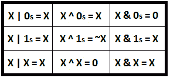
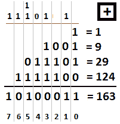
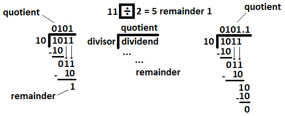
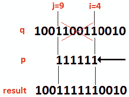
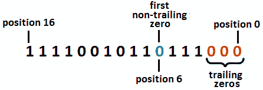

# 第九章：位操作

本章涵盖了位操作的最重要方面，这些方面在技术面试中是必须了解的。这类问题在面试中经常遇到，而且并不容易。人类的大脑并不是为了操作位而设计的；计算机是为了这个而设计的。这意味着操作位相当困难，而且极易出错。因此，建议始终仔细检查每个位操作。

掌握这些问题的两个极其重要的事情如下：

+   您必须非常了解位的理论（例如，位运算符）

+   您必须尽可能多地练习位操作

在我们解决以下主题时，我们需要牢记这两个陈述：

+   理解位操作

+   编码挑战

让我们从理论部分开始。强烈建议您从本节中提取图表。它们将是本章第二部分中最好的朋友。

# 技术要求

本章中的所有代码都可以在 GitHub 上找到[`github.com/PacktPublishing/The-Complete-Coding-Interview-Guide-in-Java/tree/master/Chapter09`](https://github.com/PacktPublishing/The-Complete-Coding-Interview-Guide-in-Java/tree/master/Chapter09)。

# 位操作简介

在 Java 中，我们可以操作以下数据类型的位：`byte`（8 位）、`short`（16 位）、`int`（32 位）、`long`（64 位）和`char`（16 位）。

例如，让我们使用正数 51。在这种情况下，我们有以下陈述：

+   51 的二进制表示是 110011。

+   因为 51 是一个`int`，它被表示为一个 32 位的值；也就是说，32 个 1 或 0 的值（从 0 到 31）。

+   110011 左边的所有位置实际上都填满了零，总共 32 位。

+   这意味着 51 是 00000000 00000000 00000000 00110011（我们将其渲染为 110011，因为通常不需要额外的零来显示二进制表示）。

## 获取 Java 整数的二进制表示

我们如何知道 110011 是 51 的二进制表示？我们如何计算 112 或任何其他 Java 整数的二进制表示？一个简单的方法是不断地将数字除以 2，直到商小于 1，并将余数解释为 0 或 1。余数为 0 被解释为 0，而大于 0 的余数被解释为 1。例如，让我们将这个应用到 51：

1.  51/2 = 25.5，商为 25，余数为 5 -> 存储 1

1.  25/2 = 12.5，商为 12，余数为 5 -> 存储 1

1.  12/2 = 6，商为 6，余数为 0 -> 存储 0

1.  6/2 = 3，商为 3，余数为 0 -> 存储 0

1.  3/2 = 1.5，商为 1，余数为 5 -> 存储 1

1.  1/2 = 0.5，商为 0，余数为 5 -> 存储 1

所以，我们存储了 110011，这是 51 的二进制表示。其余的 26 位都是零（00000000 00000000 00000000 00**110011**）。反向过程从右到左开始，涉及在位等于 1 的地方添加 2 的幂。所以这里，51 = 20+21+24+25。以下图表可以帮助我们理解这一点：


图 9.1 - 二进制到十进制（32 位整数）

在 Java 中，我们可以通过`Integer#toString(int i, int radix)`或`Integer#toBinaryString(int i)`快速查看数字的二进制表示。例如，基数为 2 表示二进制：

```java
// 110011
System.out.println("Binary: " + Integer.toString(51, 2));
System.out.println("Binary: " + Integer.toBinaryString(51));
```

反向过程（从二进制到十进制）可以通过`Integer#parseInt(String nr, int radix)`获得：

```java
System.out.println("Decimal: " 
  + Integer.parseInt("110011", 2));  //51
```

接下来，让我们来解决位运算符。这些运算符允许我们操作位，因此理解它们非常重要。

## 位运算符

操作位涉及几个运算符。这些运算符如下：

+   **一元按位补码运算符[~]**：作为一元运算符，此运算符需要一个放置在数字之前的单个操作数。此运算符取数字的每一位并翻转其值，因此 1 变为 0，反之亦然；例如，5 = 101，~5 = 010。

+   **按位与[&]**：此运算符需要两个操作数，并放置在两个数字之间。此运算符逐位比较两个数字的位。它充当逻辑 AND（&&），意味着只有在比较的位都等于 1 时才返回 1；例如，5 = 101，7 = 111，5 & 7 = 101 & 111 = 101 = 5。

+   **按位或[****|****]**：此运算符需要两个操作数，并放置在两个数字之间。此运算符逐位比较两个数字的位。它充当逻辑 OR（||），意味着如果至少有一个比较的位为 1（或两者都是），则返回 1。否则返回 0；例如，5 = 101，7 = 111，5 | 7 = 101 | 111 = 111 = 7。

+   **按位异或（XOR）[****^****]**：此运算符需要两个操作数，并放置在两个数字之间。此运算符逐位比较两个数字的位。只有在比较的位具有不同的值时才返回 1。否则返回 0；例如，5 = 101，7 = 111，5 ^ 7 = 101 | 111 = 010 = 2。

以下图是一个方便的工具，当你需要处理位时，应该随时保持接近。基本上，它总结了位运算符的工作原理（我建议你在阅读*编码挑战*部分时将此表格保持在附近）：


图 9.2 - 按位操作符

此外，以下图表示了一些对于操作位非常有用的提示。0s 表示一系列零，而 1s 表示一系列 1：



图 9.3 - 按位操作提示

慢慢来，探索每一个提示。拿一张纸和一支笔，逐个浏览。此外，也尝试发现其他提示。

## 位移操作符

在处理位时，移位是一种常见的操作。这里有`byte`（8 位）、`short`（16 位）、`int`（32 位）、`long`（64 位）和`char`（16 位）；位移操作符不会抛出异常。

### 有符号左移[<<]

有符号左移，或简称左移，需要两个操作数。左移获取第一个操作数（左操作数）的位模式，并将其向左移动由第二个操作数（右操作数）给出的位置数。

例如，以下是将 23 左移 3 个位置的结果，23 << 3：


图 9.4 - 有符号左移

正如我们所看到的，整数 12（10111）的每一位都向左移动 3 个位置，而右边的所有位置都自动填充为零。

重要提示

以下是在某些情况下可能非常有用的两个提示：

1. 将一个数字左移*n*个位置等同于乘以 2n（例如，23 << 3 等同于 184，等同于 184 = 23 * 23）。

2. 要移位的位置数自动减少为模 32；也就是说，23 << 35 等同于 23 << (35 % 32)，等同于 23 << 3。

### Java 中的负整数

首先，重要的是要记住，二进制表示本身并不能告诉我们一个数字是否为负数。这意味着计算机需要一些规则来表示负数。通常，计算机以所谓的*二进制补码*表示存储整数。Java 也使用这种表示。

简而言之，*二进制补码*表示将负数的二进制表示取反（否定）所有位。之后，加 1 并将其附加到位符号的左侧。如果最左边的位为 1，则数字为负数。否则，它为正数。

让我们以 4 位整数-5 为例。我们有一位用于符号，三位用于值。我们知道 5（正数）表示为 101，而-5（负数）表示为**1**011。这是通过翻转 101 得到的，使其变为 010，加 1 得到 011，并将其附加到符号位（**1**）的左侧以获得**1**011。粗体中的 1 是符号位。所以我们有一位用于符号，三位用于值。

另一种方法是知道*-Q*（负*Q*）的二进制表示作为*n*位数是通过将 1 与 2n - 1 - *Q*连接起来获得的。

### 右移签名[>>]

签名右移，或算术右移[>>]，需要两个操作数。签名右移获取第一个操作数（左操作数）的位模式，并通过保留符号将其向右移动给定的位置数（右操作数）。

例如，-75 >> 1 的结果如下（-75 是一个 8 位整数，其中符号位是**最高有效位**（**MSB**））：


图 9.5 - 签名右移

正如我们所看到的，-75（10110101）的每一位都向右移动了 1 个位置（请注意**最低有效位**（**LSB**）已经改变），并且位符号被保留。

重要提示

以下是在某些情况下可能非常有用的三个提示：

将一个数字向右移动*n*个位置等同于除以 2n（例如，24 >> 3 等于 3，这等同于 3 = 24/23）。

要移动的位置数自动减少到模 32；也就是说，23 >> 35 等同于 23 >> (35 % 32)，这等同于 23 >> 3。

在（有符号）二进制术语中，一系列 1 代表十进制形式的-1。

### 无符号右移[>>>]

无符号右移，或逻辑右移[>>>]，需要两个操作数。无符号右移获取第一个操作数（左操作数）的位模式，并通过右操作数给定的位置数将其向右移动。MSB 设置为 0。这意味着对于正数，有符号和无符号右移返回相同的结果，而负数总是变为正数。

例如，-75 >>> 1 的结果如下（-75 是一个 8 位整数，其中符号位是 MSB）：


图 9.6 - 无符号右移

重要提示

要移动的位置数自动减少到模 32；也就是说，23 >>> 35 等同于 23 >>> (35 % 32)，这等同于 23 >>> 3。

现在你已经了解了位移操作符是什么，是时候去探索更多的技巧和窍门了。

## 技巧和窍门

当使用位操作符并知道一些技巧和窍门时，操作位需要很大的技巧。在本章的前面，你已经看到了一些技巧。现在，让我们将一些更多的技巧添加为项目符号列表：

+   如果我们对一个数字进行偶数次异或[^]，那么结果就是 0（*x ^ x =* 0；*x ^ x ^ x^ x =* (*x ^ x*) *^* (*x ^ x*) *=* 0 ^ 0 = 0）。

+   如果我们对一个数字进行奇数次异或[^]，那么结果就是那个数字（*x ^ x ^ x =* (*x ^* (*x ^ x*)) *=* (*x ^* 0) *= x；x ^ x ^ x ^ x ^ x =* (*x ^* (*x ^ x*) *^* (*x ^ x*)) *=* (*x ^* 0 ^ 0) *= x*）。

+   我们可以计算表达式*p % q*的值，其中*p* > 0，*q* > 0，*q*是 2 的幂；也就是*p* & (*q* - 1)。一个简单的应用程序，你可以在*ComputeModuloDivision*中看到这一点。

+   对于给定的正整数*p*，如果((*p* & 1) != 0)则我们说它是奇数，如果((*p* & 1) == 0)则我们说它是偶数。一个简单的应用程序，你可以在*OddEven*中看到这一点。

+   对于给定的两个数字*p*和*q*，我们可以说*p*等于*q*，如果((*p* ^ *q*) == 0)。一个简单的应用程序，你可以在*CheckEquality*中看到这一点。

+   对于两个给定的整数*p*和*q*，我们可以通过*p* = *p* ^ *q* ^ (*q* = *p*)来交换它们。一个简单的应用程序，你可以在*SwapTwoIntegers*中看到这一点。

好的，现在是时候解决一些编码挑战了。

# 编码挑战

在接下来的 25 个编码挑战中，我们将利用位操作的不同方面。由于这些问题确实很费脑子，所以在面试中更受青睐。理解操纵位的代码片段并不是一件容易的事情，所以请花时间分析每个问题和代码片段。这是解决这类问题的唯一方法，以获得一些模式和模板。

以下图包含了一组四个重要的位掩码，这些位掩码对于需要操作位的各种问题是有用的：


图 9.7 - 位掩码

它们对于解决需要操作位的各种问题是有用的。

## 编码挑战 1 - 获取位值

**问题**：考虑一个 32 位整数*n*。编写一小段代码，返回给定位置*k*处*n*的位值。

**解决方案**：让我们假设*n*=423。它的二进制表示是 1**1**0100111。我们如何说出位置*k*=7 的位的值（位置 7 的粗体位的值为 1）？一个解决方案将包括将给定的数字右移*k*位（*n* >> *k*）。这样，第*k*位就变成了位置 0 的位（1**1**0100111 >> 7 = 00000001**1**）。接下来，我们可以应用 AND [&]操作符，如 1 & (*n* >> *k*)：

.jpg)

图 9.8 - 二进制表示

如果位置 0 的位值为 1，则 AND[&]操作符将返回 1；否则，它将返回 0。在代码方面，我们有以下内容：

```java
public static char getValue(int n, int k) {
  int result = n & (1 << k);
  if (result == 0) {
    return '0';
  }
  return '1';
}
```

另一种方法是用表达式*n* & (1 << *k*)替换表达式 1 & (*n* >> *k*)。花点时间来分析它。完整的应用程序称为*GetBitValue*。

## 编码挑战 2 - 设置位值

**亚马逊**，**谷歌**，**Adobe**，**微软**，**Flipkart**

**问题**：考虑一个 32 位整数*n*。编写一小段代码，将*n*在给定位置*k*的位值设置为 0 或 1。

**解决方案**：让我们假设*n*=423。它的二进制表示是 1**1**0100111。我们如何将位置*k*=7 的位，现在为 1，设置为 0？将位操作符表放在我们面前有助于我们看到 AND[&]操作符是唯一一个允许我们写 1 & 0 = 0 或第 7 位 & 0 = 0 的操作符。此外，我们有 1 & 1 = 1，0 & 1 = 0 和 0 & 0 = 0，所以我们可以取一个位掩码为 1...101111111 并写如下：

.jpg)

图 9.9 - 二进制表示

这正是我们想要的。我们想把第 7 位从 1 变成 0，其他位保持不变。但是我们如何获得 1...101111...掩码？嗯，有两个位掩码你需要知道。首先，一个位掩码，有一个 1，其余都是 0（10000...）。这可以通过将 1 左移*k*位来获得（例如，位掩码 1000 可以通过 1 << 3 获得，尽管如果我们将其表示为 32 位掩码，我们得到 00000000 00000000 00000000 000**1000**）。另一个位掩码包含一个 0，其余都是 1（01111...）。这可以通过对位掩码 10000....应用一元位求反操作符[~]来获得（例如，~(1000) = 0111，尽管如果我们将其表示为 32 位掩码，我们得到 11111111 11111111 11111111 111**0111**）。因此，我们可以将 1...101111...位掩码获得为~(1 << *k*)。最后，我们所要做的就是使用 AND[&]操作符，如下面的代码所示：

```java
public static int setValueTo0(int n, int k) {       
  return n & ~(1 << k);
}
```

如果我们取*k*=3, 4, 或 6，那么我们得到 0 & 0 = 0。

让我们考虑*n*=295。它的二进制表示是 1**0**0100111。我们如何设置位置*k*=7 的位，现在是 0，变为 1？在我们面前有位运算符表有助于我们看到，OR[|]和 XOR[^]运算符是允许我们写成 0|1=1 或 0¹=1 的两个操作数的运算符。

或者，我们可以写成第 7 个|1=1 和第 7 个¹=1。

再进一步，我们可以看到在 OR[|]运算符的情况下，我们可以写成以下内容：

1|1=1，而在 XOR[^]运算符的情况下，我们写 1¹=0。

由于我们想要将第 7 位的值从 0 变为 1，我们可以使用这两个运算符中的任何一个。然而，如果*k*指示具有初始值 1 的位，那么 1¹=0 就不再帮助我们了，而 1|1=1 正是我们想要的。所以在这里，我们应该使用 10000...位掩码，如下所示：

.jpg)

图 9.10-二进制表示

在代码方面，我们有以下内容：

```java
public static int setValueTo1(int n, int k) {       
  return n | (1 << k);
}
```

如果我们取*k*=0, 1, 2, 5, 或 8，那么我们得到 1|1=1。

完整的应用程序称为*SetBitValue*。

## 编码挑战 3-清除位

**亚马逊**，**谷歌**，**Adobe**

**问题**：考虑一个 32 位整数*n*。编写一小段代码，清除*n*之间的位（将它们的值设置为 0）MSB 和给定的*k*之间。

**解决方案**：让我们考虑*n*=423。它的二进制表示是**110**100111。我们如何清除 MSB 和位置*k*=6 之间的位，以便有 110 位？在我们面前有位运算符表有助于我们看到，我们需要一个类型为 00011111 的位掩码。让我们看看如果我们在*n*和这个位掩码之间应用 AND[&]运算符会发生什么：

.jpg)

图 9.11-二进制表示

所以，我们清除了 MSB 和*k*=6 之间的位。一般来说，我们需要一个包含 MSB 和*k*（包括）之间的 0 和*k*（不包括）和 LSB 之间的 1 的位掩码。我们可以通过将 1 的位左移*k*位（例如，对于*k*=6，我们得到 1000000）并减去 1 来实现这一点。这样，我们就得到了所需的位掩码，0111111。因此，在代码方面，我们有以下内容：

```java
public static int clearFromMsb(int n, int k) {        
  return n & ((1 << k) - 1);
}
```

如何清除给定*k*和 LSB 之间的位？让我向你展示代码：

```java
public static int clearFromPosition(int n, int k) {        
  return n & ~((1 << k) - 1);
}
```

现在，花点时间来分解这个解决方案。此外，我们可以用这个解决方案替换这个解决方案：*n* & (-1 << (*k* + 1))。

再次使用纸和笔一步一步地进行。完整的应用程序称为*ClearBits*。

## 编码挑战 4-在纸上求二进制和

**问题**：考虑几个正的 32 位整数。拿一支笔和一些纸，向我展示如何求它们的二进制表示。

**注意**：这不完全是一个编码挑战，但了解这一点很重要。

**解决方案**：求和二进制数可以用几种方法来完成。一个简单的方法是做以下操作：

1.  求当前列的所有位之和（第一列是 LSB 的列）。

1.  将结果转换为二进制（例如，通过连续除以 2）。

1.  保留最右边的位作为结果。

1.  将剩余的位带入剩余的列（每列一个位）。

1.  转到下一列并重复从*步骤 1*开始。

一个例子将澄清事情。让我们加 1（1）+9（1001）+29（011101）+124（1111100）=163（10100011）。

以下图表代表了这些数字相加的结果：



图 9.12-求和二进制数

现在，让我们一步一步地看（粗体部分是进行的）：

+   在第 0 列上求和位：1+1+1+0=3=**1**1 1

+   在第 1 列上求和位：**1**+0+0+0=1=1 1

+   在第 2 列上求和位：0+1+1=2=**1**0 0

+   在第 3 列上求和位：**1**+1+1+1=4=**10**0 0

+   在第 4 列上求和位：**0**+1+1=2=**1**0 0

+   在第 5 列上求和位：**1**+**1**+0+1=3=**1**1 1

+   在第 6 列上求和位：**1**+1=2=**1**0 0

+   在第 7 列上求和位：**1**=1=1 1

因此，结果是 10100011。

## 编码挑战 5 - 代码中的二进制求和

**问题**：考虑两个 32 位整数*q*和*p*。编写一小段代码，使用它们的二进制表示来计算*q* + *p*。

**解决方案**：我们可以尝试实现前面编码挑战中提出的算法，或者我们可以尝试另一种方法。这种方法引入了一个有用的等式：


注意到 AND[&]和 XOR[^]位运算符的存在。如果我们用*and*表示*p* & *q*，用*xor*表示*p* ^ *q*，那么我们可以写成如下：


如果*p*和*q*没有共同的位，那么我们可以将其简化为以下形式：


例如，如果*p*=1010，*q*=0101，那么*p* & *q*=0000。由于 2*0000=0，我们得到*p* + *q*=*xor*，或者*p* + *q*=1111。

然而，如果*p*和*q*有共同的位，那么我们必须处理*and*和*xor*的加法。因此，如果我们强制*and*表达式返回 0，那么*and + xor*就可以解决。这可以通过递归来实现。

通过递归，我们可以将递归的第一步写成：


或者，如果我们表示*and*{1} = 2 * *and* & *xor*，*xor*{1} = 2 * *and* ^ *xor*，其中{1}表示递归的一步，那么我们可以写成这样：


但是这个递归什么时候停止呢？嗯，当两个位序列（*p*和*q*）在*and*{*n*}表达式中的交集返回 0 时，它应该停止。所以，在这里，我们强制*and*表达式返回 0。

在代码方面，我们有以下内容：

```java
public static int sum(int q, int p) {
  int xor;
  int and;
  int t;
  and = q & p;
  xor = q ^ p;
  // force 'and' to return 0
  while (and != 0) {
    and = and << 1; // this is multiplication by 2
    // prepare the next step of recursion
    t = xor ^ and;
    and = and & xor;
    xor = t;
  }
  return xor;
}
```

完整的应用程序称为*SummingBinaries*。

## 编码挑战 6 - 纸上的二进制相乘

**问题**：考虑两个正的 32 位整数*q*和*p*。拿出纸和笔，向我展示如何计算这两个数字的二进制表示（*q***p*）的乘法。

**注意**：这不完全是一个编码挑战，但了解这一点很重要。

**解决方案**：当我们相乘二进制数时，我们必须记住，将一个二进制数乘以 1 会得到完全相同的二进制数，而将一个二进制数乘以 0 会得到 0。相乘两个二进制数的步骤如下：

1.  从最右边的列（第 0 列）开始，将第二个二进制数的每一位乘以第一个二进制数的每一位。

1.  总结结果。

让我们做 124（1111100）* 29（011101）= 3596（111000001100）。

以下图表示了我们计算的结果：


图 9.13 - 相乘二进制数

因此，我们将 29 的每一位与 124 的每一位相乘。接下来，我们将这些二进制数相加，就像你在*编码挑战 4 - 纸上的二进制求和*部分看到的那样。

## 编码挑战 7 - 代码中的二进制相乘

**亚马逊**，**谷歌**，**Adobe**

**问题**：考虑两个 32 位整数*q*和*p*。编写一小段代码，使用它们的二进制表示来计算*q* * *p*。

**解决方案**：我们可以尝试实现前面编码挑战中提出的算法，或者我们可以尝试另一种方法。这种方法首先假设*p*=1，所以这里，我们有*q**1=*q*。我们知道任何*q*乘以 1 都是*q*，所以我们可以说*q**1 遵循下一个和（我们从 0 到 30，所以我们忽略位置 31 上的符号位）：


图 9.14 - 代码中的二进制相乘

例如，如果*q*=5（101），那么 5 * 1 = 0*230 + 0*229 + ...1*22 + 0*21 + 1*20 = 5。

因此，5 * 1 = 5。

到目前为止，这并不是什么大不了的事，但让我们继续 5 * 2；也就是说，101 * 10。如果我们认为 5 * 2 = 5 * 0 + 10 * 1，那么这意味着 101 * 10 = 101 * 0 + 1010 * 1。所以，我们将 5 左移了一位，将 2 右移了一位。

让我们继续进行 5*3。这是 101*011。然而，5*3=5*1+10*1。因此，它就像 101*1+1010*1。

让我们继续进行 5*4。这是 101*100。然而，5*4=5*0+10*0+20*1。因此，它就像 101*0+1010*0+10100*1。

现在，我们可以开始看到遵循这些步骤的模式（最初，*result*=0）：

1.  如果*p*的 LSB 为 1，则我们写下以下内容：

图 9.15- p 的 LSB 为 1

1.  我们将*q*左移一位，将*p*逻辑右移一位。

1.  我们重复从*步骤 1*直到*p*为 0。

如果我们将这三个步骤编写成代码，那么我们将得到以下输出：

```java
public static int multiply(int q, int p) {
  int result = 0;
  while (p != 0) {
    // we compute the value of q only when the LSB of p is 1            
    if ((p & 1) != 0) {
      result = result + q;
    }
    q = q << 1;  // q is left shifted with 1 position
    p = p >>> 1; // p is logical right shifted with 1 position
  }
  return result;
}
```

完整的应用程序称为*MultiplyingBinaries*。

## 编码挑战 8-在纸上减去二进制数

**问题**：考虑两个正的 32 位整数*q*和*p*。拿出纸和笔，向我展示如何减去这两个数字的二进制表示（*q*-*p*）。

**注意**：这不完全是一个编码挑战，但了解这一点很重要。

**解决方案**：减去二进制数可以简化为计算 0 减 1。主要是，我们知道 1 减 1 是 0，0 减 0 是 0，1 减 0 是 1。要计算 0 减 1，我们必须按照以下步骤进行：

1.  从当前列开始，我们搜索左列，直到找到一个 1 位。

1.  我们借用这个位，并将其放在前一列作为两个值为 1。

1.  然后我们从前一列借用这两个值为 1，作为另外两个值为 1。

1.  对每一列重复*步骤 3*，直到达到当前列。

1.  现在，我们可以进行计算。

1.  如果我们遇到另一个 0 减 1，那么我们从*步骤 1*重复这个过程。

让我们做 124（1111100）-29（011101）=95（1011111）。

以下图表示了我们计算的结果：


图 9.16-减去二进制数

现在，让我们一步一步来看：

1.  从第 0 列开始，所以从 0 减 1。我们在左列中搜索，直到找到一个 1 位。我们在第 2 列找到了它（这个位对应于 22=4）。我们从第 1 列借用这个位，并将其用作两个值为 1（换句话说，2 的两倍是 21+21）。我们从第 0 列借用这两个值为 1（这是 21=2），并将它们用作另外两个值为 1（换句话说，1 的两倍是 20+20）。现在，我们可以计算为 2 减 1 等于 1。我们写下 1，并移动到第 1 列。

1.  我们继续进行第 1 列，所以是 1 减 0 等于 1。我们写下 1，然后移动到第 2 列。

1.  然后我们继续进行第 2 列，所以是 0 减 1。我们在左列中搜索，直到找到一个 1 位。我们在第 3 列找到了它（这个位对应于 23=8）。我们从第 2 列借用这个位，并将其用作两个值为 1（换句话说，2 的两倍是 22+22）。现在，我们可以计算为 2 减 1 等于 1。我们写下 1，然后移动到第 3 列。

1.  我们继续进行第 3 列，所以是 0 减 1。我们在左列中搜索，直到找到一个 1 位。我们在第 4 列找到了它（这个位对应于 24=16）。我们从第 3 列借用这个位，并将其用作两个值为 1（换句话说，2 的两倍是 23+23）。现在，我们可以计算为 2 减 1 等于 1。我们写下 1，然后移动到第 4 列。

1.  我们继续进行第 4 列，所以是 0 减 1。我们在左列中搜索，直到找到一个 1 位。我们在第 5 列找到了它（这个位对应于 25=32）。我们从第 4 列借用这个位，并将其用作两个值为 1（换句话说，2 的两倍是 24+24）。现在，我们可以计算为 2 减 1 等于 1。我们写下 1，然后移动到第 5 列。

1.  我们继续进行第 5 列，所以是 0 减 0。我们写下 0，然后移动到第 6 列。

1.  我们继续进行第 6 列，所以是 1 减 0。我们写下 1，然后我们完成了。

因此，结果是 1011111。

## 编码挑战 9-在代码中减去二进制数

**问题**：考虑两个 32 位整数*q*和*p*。编写一小段代码，使用它们的二进制表示来计算*q - p*。

**解决方案**：我们已经从之前的编码挑战中知道，减去二进制数可以简化为计算 0 减 1。此外，我们知道如何使用*借位*技术解决 0 减 1。除了借位技术，重要的是要注意|*q - p*| = *q* ^ *p*；例如：

|1 - 1| = 1 ^ 1 = 0, |1 - 0| = 1 ^ 0 = 1, |0 - 1| = 0 ^ 1 = 1 和|0 - 0| = 0 ^ 0 = 0。

基于这两个陈述，我们可以实现两个二进制数的减法，如下所示：

```java
public static int subtract(int q, int p) {
  while (p != 0) {
    // borrow the unset bits of q AND set bits of p
    int borrow = (~q) & p;
    // subtraction of bits of q and p 
    // where at least one of the bits is not set
    q = q ^ p;
    // left shift borrow by one position            
    p = borrow << 1;
  }
  return q;
}
```

完整的应用程序称为*SubtractingBinaries*。

## 编码挑战 10 - 纸上的二进制除法

**问题**：考虑两个正的 32 位整数*q*和*p*。拿出纸和笔，向我展示如何除以这两个数字的二进制表示（*q*/*p*）。

**注意**：这不完全是一个编码挑战，但了解这一点很重要。

**解决方案**：在二进制除法中，只有两种可能性：0 或 1。除法涉及*被除数*（*q*）、*除数*（*p*）、*商*和*余数*。例如，我们知道 11（被除数）/ 2（除数）= 5（商）1（余数）。或者，在二进制表示中，我们有 1011（被除数）/ 10（除数）= 101（商）1（余数）

我们首先将除数与被除数的最高位进行比较（让我们称之为*子被除数*），然后进行以下操作：

a.如果除数不适合子被除数（除数>子被除数），则我们将 0 附加到商。

a.a)我们将被除数的下一位附加到子被除数上，并从*步骤 a*继续)。

b.如果除数适合子被除数（除数<=子被除数），则我们将 1 附加到商。

b.a)我们从当前子被除数中减去除数。

b.b)我们将被除数的下一位附加到减法的结果（这是新的子被除数），然后从*步骤 a*重复)。

c.当我们处理完被除数的所有位时，我们应该得到商和余数，这是除法的结果。

c.a)我们可以在这里停下来，并用获得的商和余数表示结果。

c.b)我们可以在商中附加一个点（“**.**”），在当前余数中附加 0（这是新的子被除数），并继续从*步骤 a*，直到余数为 0 或我们对结果满意为止。

以下图表示了 11/2 的除法：



图 9.17 - 二进制数的除法

现在，让我们一步一步来看（专注于前面图表的左侧）：

+   子被除数= 1，10 > 1，因为 2 > 1，因此我们将 0 附加到商。

+   子被除数= 10，10 = 10，因为 2 = 2，因此我们将 1 附加到商。

+   进行减法，10 - 10 = 0。

+   子被除数= 01，10 > 01，因为 2 > 1，因此我们将 0 附加到商。

+   子被除数= 011，10 < 011，因为 2 < 3，因此我们将 1 附加到商。

+   进行减法，011 - 10 = 1。

+   从被除数中没有更多的位需要处理，因此我们可以说 11/2 的商为 101（即 5），余数为 1。

如果您看一下前面图表的右侧，那么您将看到我们可以继续计算，直到余数为 0，通过应用给定的*步骤 c.b*。

## 编码挑战 11 - 代码中的二进制除法

**亚马逊**，**谷歌**，**Adobe**

**问题**：考虑两个 32 位整数*q*和*p*。编写一小段代码，使用它们的二进制表示来计算*q*/*p*。

**解决方案**：我们可以使用几种方法来除两个二进制数。让我们专注于实现一个仅计算商的解决方案，这意味着我们跳过余数。

这种方法非常直接。我们知道 32 位整数包含我们在 31 和 0 之间计数的位。我们所要做的就是将除数（*p*）左移*i*个位置（*i*=31,30,29,...,2,1,0）并检查结果是否小于被除数（*q*）。每次我们找到这样的位时，我们更新第*i*位位置。我们累积结果并将其传递到下一个位置。以下代码不言自明：

```java
private static final int MAX_BIT = 31;
...
public static long divideWithoutRemainder(long q, long p) {
  // obtain the sign of the division
  long sign = ((q < 0) ^ (p < 0)) ? -1 : 1;
  // ensure that q and p are positive
  q = Math.abs(q);
  p = Math.abs(p);
  long t = 0;
  long quotient = 0;
  for (int i = MAX_BIT; i >= 0; --i) {
    long halfdown = t + (p << i);
    if (halfdown <= q) {
      t = t + p << i;
      quotient = quotient | 1L << i;
    }
  }
  return sign * quotient;
}
```

完整的应用程序称为*DividingBinaries*。它还包含计算余数的实现。

## 编码挑战 12 - 替换位

亚马逊，谷歌，Adobe

**问题**：考虑两个正的 32 位整数*q*和*p*，以及两个位位置*i*和*j*。编写一小段代码，用*p*的位替换*q*在位置*i*和*j*之间的位。您可以假设在*i*和*j*之间，有足够的空间来容纳*p*的所有位。

**解决方案**：让我们考虑*q*=4914（二进制中为 1001100110010），*p*=63（二进制中为 111111），*i*=4，*j*=9。以下图表显示了我们拥有的内容以及我们想要获得的内容：



图 9.18 - 替换 i 和 j 之间的位

正如我们所看到的，解决方案应该完成三个主要步骤。首先，我们需要清除*i*和*j*之间的*q*位。其次，我们需要将*p*左移*i*个位置（这样，我们将*p*放在正确的位置）。最后，我们将*p*和*q*合并到最终结果中。

为了清除*i*和*j*之间的*q*位（将这些位设置为 0，无论它们的初始值如何），我们可以使用 AND[&]运算符。我们知道只有 1 和 1 返回 1，所以如果我们有一个包含*i*和*j*之间的 0 的位掩码，那么*q*和*位掩码*将导致*i*和*j*之间只包含 0 的位序列，因为 1 和 0 以及 0 和 0 都是 0。此外，在 MSB 和*j*（不包括在内）之间，以及位掩码的 LSB 和*i*（不包括在内）之间，我们应该只有 1 的值。这样，*q*和*位掩码*将保留*q*位，因为 1 和 1=1，0 和 1=0。因此，我们的位掩码应该是 1110000001111。让我们看看它是如何工作的：

.jpg)

图 9.19 - 位掩码（a）

但是我们如何获得这个掩码？我们可以通过 OR[|]运算符获得它，如下所示：

.jpg)

图 9.20 - 位掩码（b）

1110000000000 位掩码可以通过将-1 左移*j*+1 个位置获得，而 0000000001111 位掩码可以通过将 1 左移*i*个位置并减去 1 获得。

在这里，我们解决了前两个步骤。最后，我们需要把*p*放在正确的位置。这很容易：我们只需将*p*左移*i*个位置。最后，我们在*q*和*i*和*j*之间的位清除后，应用 OR[|]运算符与移位后的*p*：

.jpg)

图 9.21 - 二进制表示

我们完成了！现在，让我们把这个放入代码中：

```java
public static int replace(int q, int p, int i, int j) {
  int ones = ~0; // 11111111 11111111 11111111 11111111          
  int leftShiftJ = ones << (j + 1);
  int leftShiftI = ((1 << i) - 1);
  int mask = leftShiftJ | leftShiftI;
  int applyMaskToQ = q & mask;
  int bringPInPlace = p << i;
  return applyMaskToQ | bringPInPlace;
}
```

完整的应用程序称为*ReplaceBits*。

## 编码挑战 13 - 最长 1 序列

**亚马逊**，**Adobe**，**微软**，**Flipkart**

**问题**：考虑一个 32 位整数*n*。101 的序列可以被视为 111。编写一小段代码，计算最长 1 序列的长度。

**解决方案**：我们将看几个例子（以下三列代表整数，其二进制表示和最长 1 序列的长度）：

.jpg)

图 9.22 - 三个例子

如果我们知道*n* & 1 = 1，如果*n*的 LSB 为 1，*n* & 0 = 0，如果*n*的 LSB 为 0，那么这个问题的解决方案就很容易实现。让我们专注于第一个例子，67534（100000**11111**001110）。在这里，我们做了以下事情：

+   初始化最长序列= 0。

+   应用 AND[&]：100000**11111**001110 & 1 = 0，最长序列= 0。

+   右移并应用 AND[&]：100000**11111**00111 & 1 = 1，最长序列 = 1。

+   右移并应用 AND[&]：100000**11111**0011 & 1 = 1，最长序列 = 2。

+   右移并应用 AND[&]：100000**11111**001 & 1 = 1，最长序列 = 3。

+   右移并应用 AND[&]：100000**11111**00 & 1 = 0，最长序列 = 0

+   右移并应用 AND[&]：100000**11111**0 & 1 = 0，最长序列 = 0。

+   右移并应用 AND[&]：100000**11111** & 1 = 1，最长序列 = 1。

+   右移并应用 AND[&]：100000**1111** & 1 = 1，最长序列 = 2。

+   右移并应用 AND[&]：100000**111** & 1 = 1，最长序列 = 3。

+   右移并应用 AND[&]：100000**11** & 1 = 1，最长序列 = 4。

+   右移并应用 AND[&]：100000**1** & 1 = 1，最长序列 = 5。

+   右移并应用 AND[&]：100000 & 1 = 0，最长序列 = 0。

因此，只要在最长的 1 序列中没有 0 交错，我们就可以实现前面的方法。然而，这种方法对于第三种情况 339809（10100**101111011**00001）不起作用。在这种情况下，我们需要进行一些额外的检查；否则，最长序列的长度将等于 4。但由于 101 可以被视为 111，正确的答案是 9。这意味着当*n* & 1 = 0 时，我们必须执行以下检查（主要是检查 0 的当前位是否由 101 这样的两位 1 保护）：

+   检查下一个位是否为 1 或 0，(*n* & 2) == 1 或 0

+   如果下一个位是 1，则检查前一个位是否为 1

我们可以将这写成代码如下：

```java
public static int sequence(int n) {
  if (~n == 0) {
    return Integer.SIZE; // 32
  }
  int currentSequence = 0;
  int longestSequence = 0;
  boolean flag = true;
  while (n != 0) {
    if ((n & 1) == 1) {
      currentSequence++;
      flag = false;
    } else if ((n & 1) == 0) {
      currentSequence = ((n & 0b10) == 0) // 0b10 = 2
        ? 0 : flag 
        ? 0 : ++currentSequence;
      flag = true;
    }
    longestSequence = Math.max(
      currentSequence, longestSequence);
    n >>>= 1;
  }
  return longestSequence;
}
```

完整的应用称为*LongestSequence*。

## 编码挑战 14 - 下一个和上一个数字

**Adobe**，**Microsoft**

**问题**：考虑一个 32 位整数*n*。编写一段代码，返回包含完全相同数量的 1 位的下一个最大数字。

**解决方案**：让我们考虑*n*=124344（11110010110111000）。为了获得另一个具有相同数量的 1 位的数字，我们必须翻转一个 1 位以将其变为 0，并翻转另一个 0 位以将其变为 1。得到的数字将与给定的数字不同，并且包含相同数量的 1 位。现在，如果我们希望这个数字比给定的数字大，那么从 0 翻转为 1 的位应该在从 1 翻转为 0 的位的左边。换句话说，有两个位位置*i*和*j*，并且翻转位*i*从 1 到 0 和位*j*从 0 到 1，如果*i > j*，那么新数字将比给定数字小，而如果*i < j*，则新数字将比给定数字大。

这意味着我们必须找到第一个不仅包含右侧全为 0 的位的 0 位（换句话说，第一个非尾随零位）。这样，如果我们将这一位从 0 翻转为 1，那么我们知道在这一位的右侧至少有一位 1 可以从 1 翻转为 0。这意味着我们可以获得一个具有相同数量的 1 位的更大数字。以下图表以图形形式显示了这些数字：



图 9.23 - 非尾随零

因此，对于我们的数字，第一个非尾随零位于第 6 位。如果我们将这一位从 0 翻转为 1，那么得到的数字将大于给定的数字。但现在，我们必须选择一个位，从这个位的右边开始，将其从 1 翻转为 0。基本上，我们必须在位置 3、4 和 5 之间进行选择。然而，这是正确的逻辑吗？请记住，我们必须返回比给定数字大的下一个数字，而不是任何比给定数字大的数字。翻转位置 5 的位比翻转位置 3 或 4 的位更好，但这不是下一个最大的数字。查看以下关系（下标是二进制表示对应的十进制值）：

![图 9.24 二进制表示对应的十进制值]

](img/coding_challenge_14_(Fig_9.24).jpg)

图 9.24 - 几个关系

到目前为止，我们可以得出结论，1111001011**10**11000124376 看起来是正确的选择。但是，我们还应该注意以下内容：

1111001011**10**11000124376 > 11110010111000011124355

因此，下一个最大的数字是如果我们计算位置 6（不包括）和 0 之间的 1 位数（让我们用*k*=3），清除位置 6（不包括）和 0 之间的所有位（将它们设置为 0），并在位置*k*-1 和 0 之间设置*k*-1 位为 1。

好吧，到目前为止一切顺利！现在，让我们将这个算法编写成代码。首先，我们需要找到第一个非尾随零位的位置。这意味着我们需要将尾随零的计数与我们得到第一个 0 之前的 1 的计数相加。计算尾随零可以按以下方式进行（我们正在处理*n*的副本，因为我们不想移动给定数字的位）：

```java
int copyn = n;
int zeros = 0;
while ((copyn != 0) && ((copyn & 1) == 0)) {
  zeros++;
  copyn = copyn >> 1;
}
```

计算直到第一个 0 的 1 可以这样做：

```java
int ones=0;
while ((copyn & 1) == 1) {
  ones++;
  copyn = copyn >> 1;
}
```

现在，`marker = zeros + ones`给出了我们搜索的位置。接下来，我们翻转从此位置到 0 的位，从 0 清除所有位：

```java
n = n | (1 << marker);
```

在我们的情况下，`marker`=6。这行的效果产生以下输出：

.jpg)

图 9.25 - 输出（1）

```java
n = n & (-1 << marker);
```

.jpg)

图 9.26 - 输出（2）

最后，我们将位设置为 1，介于（`ones` - 1）和 0 之间：

```java
n = n | (1 << (ones - 1)) - 1;
```

在我们的情况下，`ones`=3。这行的效果产生以下输出：

.jpg)

图 9.27 - 输出（3）

因此，最终结果是 11110010111000011，即 124355。因此，最终的方法如下所示：

```java
public static int next(int n) {
  int copyn = n;
  int zeros = 0;
  int ones = 0;
  // count trailing 0s
  while ((copyn != 0) && ((copyn & 1) == 0)) {
    zeros++;
    copyn = copyn >> 1;
  }
  // count all 1s until first 0
  while ((copyn & 1) == 1) {
    ones++;
    copyn = copyn >> 1;
  }
  // the 1111...000... is the biggest number 
  // without adding more 1
  if (zeros + ones == 0 || zeros + ones == 31) {
    return -1;
  }
  int marker = zeros + ones;
  n = n | (1 << marker);
  n = n & (-1 << marker);
  n = n | (1 << (ones - 1)) - 1;
  return n;
}
```

完整的应用程序称为*NextNumber*。它还包含一个返回包含完全相同数量的 1 位的下一个最小数字的方法。接受挑战，尝试自己提供解决方案。完成后，只需将您的解决方案与捆绑代码中的解决方案进行对比。作为提示，您将需要尾随 1 的数量（让我们用*k*表示）和直到达到第一个 1 的尾随 1 左侧的 0 的数量。总结这些值将给出应该从 1 翻转为 0 的位的位置。接下来，清除此位置右侧的所有位，并在此位置右侧立即设置（*k* + 1）位为 1。

## 编码挑战 15 - 转换

**亚马逊**，**谷歌**，**Adobe**

**问题**：考虑两个正的 32 位整数*q*和*p*。编写一小段代码，以便计算我们应该在*q*中翻转的位数，以便将其转换为*p*。

**解决方案**：如果我们观察到 XOR[^]运算符只在操作数不同时返回 1，那么这个问题的解决方案就变得清晰了。让我们考虑*q* = 290932（1000111000001110100）和*p* = 352345（1010110000001011001）。让我们应用 XOR[^]运算符：

.jpg)

图 9.28 - 转换

换句话说，如果我们用*xor*（*xor* = *q* ^ *p*）表示*q* ^ *p*，那么我们所要做的就是计算*xor*中 1 的位数（在我们的示例中，我们有 6 个 1）。这可以使用 AND[&]运算符来完成，该运算符仅在 1 & 1 = 1 时返回 1，因此我们可以为*xor*中的每个位计算*xor* & 1。在每次比较后，我们将*xor*右移一位。代码说明了这一点：

```java
public static int count(int q, int p) {
  int count = 0;
  // each 1 represents a bit that is 
  // different between q and p
  int xor = q ^ p;
  while (xor != 0) {
    count += xor & 1; // only 1 & 1 = 1
    xor = xor >> 1;
  }
  return count;
}
```

完整的应用程序称为*Conversion*。

## 编码挑战 16 - 最大化表达式

**问题**：考虑两个正的 32 位整数*q*和*p*，其中*q≠ p*。最大化表达式（*q* AND *s*）*（*p* AND *s*）的*q*和*p*之间的关系是什么，其中 AND 是逻辑运算符[&]？

**解决方案**：这是一种听起来很难但实际上非常简单的问题。让我们从一个简单的*a * b*开始。*a * b*何时达到最大值？好吧，让我们考虑*b* = 4。*a ** 4 何时达到最大值？让我们写一些测试案例：

*a* = 1, 1 * 4 = 4

*a* = 2, 2 * 4 = 8

*a* = 3, 3 * 4 = 12

*a* = 4, 4 * 4 = 16

因此，当*a = b*时，我们达到了最大值 16。然而，*a*可以是 5，5 * 4 = 20 > 16。这是正确的，但这意味着*b*也可以是 5，所以 5 * 5 = 25 > 20。这远远不是数学证明，但我们可以注意到如果*a = b*，那么*a * b*达到最大值。

对于那些对数学证明感兴趣的人，让我们假设我们有以下内容：

.jpg)

图 9.29 - 最大化表达式（1）

这意味着我们有以下内容：

.jpg)

图 9.30 - 最大化表达式（2）

此外，这意味着我们有以下内容：

.jpg)

图 9.31 - 最大化表达式（3）

现在，如果我们说当*a = b*时，*a * b*是最大的，那么让我们表示*a* =（*q* AND *s*）和*b* =（*p* AND *s*）。因此，当（*q* AND *s*）=（*p* AND *s*）时，（*q* AND *s*）*（*p* AND *s*）是最大的。

让我们假设*q* = 822（1100110110）和*p* = 663（1010010111）。 *q*的 LSB 为 0，而*p*的 LSB 为 1，因此我们可以写成以下形式：

（1 AND *s*）=（0 AND *s*）→ *s* = 0 →（1 & 0）=（0 & 0）= 0

如果我们将*q*和*p*向右移动 1 个位置，那么我们会发现*q*的 LSB 为 1，*p*的 LSB 也为 1：


图 9.32 - 将 q 和 p 向右移动 1 个位置

在这里，我们有另外两种情况，可以直观地解释如下：


图 9.33 - 两种情况

在这里，我们可以看到我们问题的答案是*q* & *p* = *s*。让我们看看这是如何工作的：

.jpg)

图 9.34 - 答案

答案是 1000010110，即 534。这意味着（822 AND 534）=（663 AND 534）。

## 编码挑战 17 - 交换奇数和偶数位

**Adobe**, **Microsoft**, **Flipkart**

**问题**：考虑一个正的 32 位整数*n*。编写一小段代码，交换这个整数的奇数位和偶数位。

**解决方案**：让我们假设*n* = 663（1010010111）。如果我们手动进行交换，那么我们应该得到 0101101011。我们可以分两步完成：

1.  我们取奇数位并将它们向右移动一位。

1.  我们取偶数位并将它们向左移动一位。

但我们如何做到这一点？

我们可以通过 AND[&]运算符和包含奇数位置上的 1 的位掩码来获取奇数位：10101010101010101010101010101010。让我们看看这个过程：

.jpg)

图 9.35 - 交换奇数和偶数位（1）

结果显示 1010010111 包含 1 的奇数位在位置 1、7 和 9。接下来，我们将结果 1010000010 向右移动一位。这将得到 0101000001。

我们可以通过 AND[&]运算符和包含奇数位置上的 1 的位掩码来获取偶数位：1010101010101010101010101010101。让我们看看这个过程：

.jpg)

图 9.36 - 交换奇数和偶数位（2）

结果显示 1010010111 包含 0、2 和 4 位置上的 1 的偶数位。接下来，我们将结果 0000010101 向左移动一位。这将得到 0000101010。

要获得最终结果，我们只需要将这两个结果应用 OR[|]运算符：

.jpg)

图 9.37 - 最终结果

最终结果是 0101101011。实现遵循这些步骤*ad litteram*，因此这是直接的：

```java
public static int swap(int n) {
  int moveToEvenPositions
    = (n & 0b10101010101010101010101010101010) >>> 1;
  int moveToOddPositions
    = (n & 0b1010101010101010101010101010101) << 1;
  return moveToEvenPositions | moveToOddPositions;
}
```

完整的应用程序称为*SwapOddEven*。

## 编码挑战 18 - 旋转位

**Amazon**, **Google**, **Adobe**, **Microsoft**, **Flipkart**

**问题**：考虑一个正的 32 位整数*n*。编写一小段代码，将*k*位向左或向右旋转。通过旋转，我们理解二进制表示的一端掉落的位被发送到另一端。因此，在左旋转中，从左端掉落的位被发送到右端，而在右旋转中，从右端掉落的位被发送到左端。

**解决方案**：让我们专注于左旋转（通常，右旋转解决方案是左旋转解决方案的镜像）。我们已经知道，通过将*k*位向左移动，我们将位向左移动，空位填充为零。然而，在这些零的位置，我们必须放置从左端掉落的位。

让我们假设*n*= 423099897（00011001001101111111110111111001）和*k*=10，所以我们向左旋转 10 位。下图突出显示了掉落的位和最终结果：

.jpg)

图 9.38 - 左旋转位

前面的图表给出了解决方案。如果我们仔细观察 b)和 c)点，我们会发现掉落的位出现在最终结果中。这个结果可以通过将掉落的位右移 32-10 = 22 位来获得。

因此，如果我们将*n*左移 10 位，我们将得到一个二进制表示，在右侧填充了零（如前面图表的 b 点）或下一个除法的被除数）。如果我们将*n*右移 22 位，我们将得到一个在左侧填充了零的二进制表示（作为下一个除法的除数）。此时，OR[|]运算符进入场景，如下例所示：

![图 9.39 OR [|] 运算符

](img/Figure_9.39_B15403.jpg)

图 9.39 - 应用 OR[|]运算符

左旋转的最终结果是 11011111111101111110010001100100。现在，我们可以轻松地将其转换为代码，如下所示：

```java
public static int leftRotate(int n, int bits) {
  int fallBits = n << bits;
  int fallBitsShiftToRight = n >> (MAX_INT_BITS - bits);
  return fallBits | fallBitsShiftToRight;
}
```

现在，挑战自己，实现右旋转。

对于右旋转，代码将如下所示（你应该能够毫无问题地跟随这个解决方案）：

```java
public static int rightRotate(int n, int bits) {
  int fallBits = n >> bits;
  int fallBitsShiftToLeft = n << (MAX_INT_BITS - bits);
  return fallBits | fallBitsShiftToLeft;
}
```

完整的应用程序称为*RotateBits*。

## 编码挑战 19 - 计算数字

**问题**：考虑两个位置，*i*和*j*（*j > i*），表示二进制表示中两个位的位置。编写一小段代码，返回一个 32 位整数，其中包含 1s（设置）在*i*（包括）和*j*（包括）之间，其余位为 0s（未设置）。

**解决方案**：让我们假设*i*=3 和*j*=7。我们知道所需的 32 位整数是 248，或者用二进制表示是 11111000（或者全部为 0 的 00000000000000000000000011111000）。

如果你注意到了*编码挑战 8 - 纸上减法*，那么你应该知道 0 减 1 是一个可以通过从当前位的左边*借位*来完成的操作。*借位*技术向左传播，直到找到一个 1 位。此外，如果我们记得 1 减 0 是 1，那么我们可以写出以下减法：


图 9.40 - 减法

观察这个减法的结果。1s 恰好位于位置*i*=3（包括）和*j*=7（包括）之间。这正是我们要找的数字：248。被除数和除数分别通过将 1 左移(*j*+1)位和*i*位来获得。

有了这些陈述，很容易将它们转换为代码：

```java
public static int setBetween(int left, int right) {
  return (1 << (right + 1)) - (1 << left);
}
```

完整的应用程序称为*NumberWithOneInLR*。

## 编码挑战 20 - 独特元素

**亚马逊**，**谷歌**，**Adobe**，**微软**，**Flipkart**

**问题**：考虑一个给定的整数数组*arr*。除了一个元素只出现一次外，数组中的每个元素都恰好出现三次。这使得它是唯一的。编写一小段代码，在 O(n)复杂度时间和 O(1)额外空间中找到这个唯一的元素。

**解决方案**：假设给定的数组是*arr*={4, 4, 3, 1, 7, 7, 7, 1, 1, 4}，所以 3 是唯一的元素。如果我们写出这些数字的二进制表示，我们得到以下结果：100，100，011，001，111，111，111，001，001，100。现在，让我们将相同位置的位相加，并检查结果的和是否是 3 的倍数，如下所示：

+   第一位的和 % 3 = 0+0+1+1+1+1+1+1+1+0 = 7 % 3 = 1

+   第二位的和 % 3 = 0+0+1+0+1+1+1+0+0+0 = 4 % 3 = 1

+   第三位的和 % 3 = 1+1+0+0+1+1+1+0+0+1 = 6 % 3 = 0

唯一的数字是 011 = 3。

让我们看另一个例子。这次，*arr*={51, 14, 14, 51, 98, 7, 14, 98, 51, 98}，所以 7 是唯一的元素。让我们将之前使用的逻辑应用于二进制表示：110011，1110，1110，110011，1100010，111，1110，1100010，110011，1100010。这次，让我们使用图表，因为这样更清晰：


图 9.41 – 找到给定数组中的唯一元素

因此，基于这两个例子，我们可以详细说明以下算法：

1.  在相同的位置上求和位。

1.  对于每个*sum*，计算模 3。

1.  如果*sum* % 3 = 0（*sum*是 3 的倍数），这意味着该位在给定元素中出现三次的元素中被设置。

1.  如果*sum* % 3 != 0（*sum*不是 3 的倍数），这意味着该位在只出现一次的元素中被设置（**但不能确定该位在出现三次的元素中是未设置还是设置**）。

1.  我们必须对所有给定的元素和所有位的位置重复*步骤 1*、*2*和*3*。通过这样做，我们将得到只出现一次的元素，就像你在前面的图表中看到的那样。

这段代码如下：

```java
private static final int INT_SIZE = 32;
public static int unique(int arr[]) {
  int n = arr.length;
  int result = 0;
  int nr;
  int sumBits;
  // iterate through every bit 
  for (int i = 0; i < INT_SIZE; i++) {
    // compute the sum of set bits at 
    // ith position in all array
    sumBits = 0;
    nr = (1 << i);
    for (int j = 0; j < n; j++) {
      if ((arr[j] & nr) == 0) {
        sumBits++;
      }
    }
    // the sum not multiple of 3 are the 
    // bits of the unique number
    if ((sumBits % 3) == 0) {                
      result = result | nr;
    }
  }
  return result;
}
```

这是解决这个问题的一种方法。另一种方法是从异或[^]运算符的事实开始，当应用于相同的数字两次时，返回 0。此外，异或[^]运算符是可结合的（给出相同的结果，无论分组方式：1 ^ 1 ^ 2 ^ 2 = 1 ^ 2 ^ 1 ^ 2 = 0）和可交换的（与顺序无关：1 ^ 2 = 2 ^ 1）。然而，如果我们将相同的数字异或[^]三次，那么结果将是相同的数字，因此在所有数字上使用异或[^]在这里将没有帮助。然而，我们可以采用以下算法：

使用一个变量来记录该变量第一次出现。

1.  对于每个新元素，将其异或[^]放入一个变量`oneAppearance`中。

1.  如果元素出现第二次，那么它将从`oneAppearance`中移除，并将其异或[^]放入另一个变量`twoAppearances`中。

1.  如果元素出现第三次，那么它将从`oneAppearance`和`twoAppearances`中移除。`oneAppearance`和`twoAppearances`变量变为 0，我们开始寻找一个新元素。

1.  对于所有出现三次的元素，`oneAppearance`和`twoAppearances`变量将为 0。另一方面，对于只出现一次的元素，`oneAppearance`变量将被设置为该值。

在代码方面，看起来是这样的：

```java
public static int unique(int arr[]) {
  int oneAppearance = 0;
  int twoAppearances = 0;
  for (int i = 0; i < arr.length; i++) {
    twoAppearances = twoAppearances
        | (oneAppearance & arr[i]);
    oneAppearance = oneAppearance ^ arr[i];
    int neutraliser = ~(oneAppearance & twoAppearances);
    oneAppearance = oneAppearance & neutraliser;
    twoAppearances = twoAppearances & neutraliser;
  }
  return oneAppearance;
}
```

这段代码的运行时间是 O(n)，额外时间是 O(1)。完整的应用程序称为*OnceTwiceThrice*。

## 编码挑战 21 – 查找重复项

**亚马逊**，**谷歌**，**Adobe**，**微软**，**Flipkart**

**问题**：假设你有一个整数数组，范围从 1 到*n*，其中*n*最多可以是 32,000。数组可能包含重复项，而且你不知道*n*的值。编写一小段代码，只使用 4 千字节（KB）的内存，从给定数组中打印出所有重复项。

`BitSet`类（这个类实现了一个根据需要增长的位向量）。

使用`BitSet`，我们可以遍历给定的数组，并对于每个遍历的元素，将相应索引处的位从 0 翻转为 1。如果我们尝试翻转已经为 1 的位，那么我们就找到并打印了一个重复项。这段代码非常简单：

```java
  private static final int MAX_N = 32000;
  public static void printDuplicates(int[] arr) {
    BitSet bitArr = new BitSet(MAX_N);
    for (int i = 0; i < arr.length; i++) {
      int nr = arr[i];
      if (bitArr.get(nr)) {                
        System.out.println("Duplicate: " + nr);
      } else {
        bitArr.set(nr);
      }
    }
  }
```

完整的应用程序称为*FindDuplicates*。

## 编码挑战 22 - 两个不重复的元素

**亚马逊**，**谷歌**，**Adobe**

**问题**：假设你有一个包含 2*n*+2 个元素的整数数组。2*n*个元素是*n*个元素重复一次。因此，2*n*中的每个元素在给定数组中都出现两次。剩下的两个元素只出现一次。编写一小段代码来找到这两个元素。

**解决方案**：让我们考虑给定的数组是*arr*={2, 7, 1, 5, 9, 4, 1, 2, 5, 4}。我们要找的两个数字是 7 和 9。这两个数字在数组中只出现一次，而 2、1、5 和 4 出现两次。

如果我们考虑蛮力方法，那么迭代数组并检查每个元素的出现次数是很直观的。但是面试官不会对这个解决方案印象深刻，因为它的运行时间是 O(n2)。

另一种方法是对给定数组进行排序。这样，重复的元素被分组在一起，这样我们可以计算每个组的出现次数。大小为 1 的组表示一个不重复的值。在找到更好的解决方案的过程中提到这种方法是很好的。

更好的解决方案依赖于*哈希*。创建一个`Map<`*Element*`,` *Count*`>`并用元素和出现次数填充它（例如，对于我们的数据，我们将有以下对：(2, 2)，(7, 1)，(1, 2)，(5, 2)，(9, 1)和(4, 2)）。现在，遍历地图并找到计数为 1 的元素。在找到更好的解决方案的过程中提到这种方法是很好的。

在这一章中，我们处理位，因此最好的解决方案应该依赖于位操作。这个解决方案依赖于异或[^]运算符和我们在*提示和技巧*部分提到的技巧：

+   如果我们对一个数字进行偶数次的异或[^]，那么结果如下 0（*x* ^ *x* = 0；*x* ^ *x* ^ *x*^ *x* = (*x* ^ *x*) ^ (*x* ^ *x*) = 0 ^ 0 = 0）

另一方面，如果我们对两个不同的数字*p*和*q*应用异或[^]运算符，那么结果是一个包含*p*和*q*不同的位置的位（1 位）的数字。这意味着如果我们对数组中的所有元素应用异或[^]（*xor* = *arr*[0]^*arr*[1]^*arr*[2] ^ ... ^ *arr*[*arr.length*-1]），那么所有重复的元素将互相抵消。

因此，如果我们取结果的任何设置位（例如，最右边的位）并将数组的元素分成两组，那么一组将包含具有相同位设置的元素，另一组将包含具有相同位未设置的元素。换句话说，我们通过比较 XOR[^]的最右边的设置位与每个元素相同位置的位，将元素分成两组。通过这样做，我们将在一组中得到*p*，在另一组中得到*q*。

现在，如果我们对第一组中的所有元素应用异或[^]运算符，那么我们将得到第一个不重复的元素。在另一组中做同样的操作将得到第二个不重复的元素。

让我们将这个流程应用到我们的数据*arr*={2, 7, 1, 5, 9, 4, 1, 2, 5, 4}。所以，7 和 9 是不重复的值。首先，我们对所有数字应用异或[^]运算符：

*xor* = 2 ^ 7 ^ 1 ^ 5 ^ 9 ^ 4 ^ 1 ^ 2 ^ 5 ^ 4 = 0010（2）^ 0111（7）^ 0001（1）^ 0101（5）^ 1001（9）^ 0100（4）^ 0001（1）^ 0010（2）^ 0101（5）^ 0100（4）= 1110 = 7 ^ 9 = 0111 & 1001 = 1110 = 14。

因此，7 ^ 9！= 0 如果 7！= 9。因此，至少会有一个设置位（至少一个 1 位）。我们可以取任何设置位，但是取最右边的位作为*xor* & ~(*xor*-1)相当简单。所以，我们有 1110 & ~(1101) = 1110 & 0010 = 0010。随意选择其他设置位。

到目前为止，我们在这两个数字（7 和 9）的 XOR[^]中找到了这个设置位（0010），所以这个位必须存在于 7 或 9 中（在这种情况下，它存在于 7 中）。接下来，让我们通过比较 XOR[^]的最右边的设置位与每个元素相同位置的位来将元素分成两组。我们得到第一组，包含元素{2, 7, 2}，和第二组，包含元素{1, 5, 9, 4, 1, 5, 4}。由于 2、7 和 2 包含了设置位，它们在第一组中，而 1、5、9、4、1、5 和 4 不包含设置位，这意味着它们是第二组的一部分。

有了这个，我们隔离了第一个非重复元素（7）在一个集合中，并把第二个非重复元素（9）放在另一个集合中。此外，每个重复的元素都将在相同的位表示的集合中（例如，{2, 2}将始终在同一个集合中）。

最后，我们对每个集合应用 XOR[^]。因此，我们有*xor_first_set* = 2 ^ 7 ^ 2 = 010 ^ 111 ^ 010 = 111 = 7（第一个非重复元素）。

对于第二组，我们有：

*xor_second_set* = 1 ^ 5 ^ 9 ^ 4 ^ 1 ^ 5 ^ 4 = 0001 ^ 0101 ^ 1001 ^ 0100 ^ 0001 ^ 0101 ^ 0100 = 1001 = 9（第二个非重复元素）。

完成！

在代码方面，我们有以下内容：

```java
public static void findNonRepeatable(int arr[]) {
  // get the XOR[^] of all elements in the given array
  int xor = arr[0];
  for (int i = 1; i < arr.length; i++) {
    xor ^= arr[i];
  }
  // get the rightmost set bit (you can use any other set bit)
  int setBitNo = xor & ~(xor - 1);
  // divide the elements in two sets by comparing the 
  // rightmost set bit of XOR[^] with the bit at the same 
  // position in each element
  int p = 0;
  int q = 0;
  for (int i = 0; i < arr.length; i++) {
    if ((arr[i] & setBitNo) != 0) {
      // xor of the first set
      p = p ^ arr[i];
    } else {
      // xor of the second set
      q = q ^ arr[i];
    }
  }
  System.out.println("The numbers are: " + p + " and " + q);
}
```

这段代码的运行时间是 O(n)，辅助空间是 O(1)（*n*是给定数组中的元素数）。完整的应用程序称为*TwoNonRepeating*。

## 编码挑战 23 - 集合的幂集

**亚马逊**，**谷歌**，**Adobe**

**问题**：考虑一个给定的集合*S*。编写一段代码，返回*S*的幂集。一个集合*S*的幂集 P(*S*)是*S*的所有可能子集的集合，包括空集和*S*本身。

**解决方案**：考虑给定的*S*是{*a, b, c*}。如果是这样，幂集包括{}，{*a*}，{*b*}，{*c*}，{*a, b*}，{*a, c*}，{*a, c*}和{*a, b, c*}。注意，对于包含三个元素的集合，幂集包含 23=8 个元素。对于包含四个元素的集合，幂集包含 24=16 个元素。一般来说，对于包含*n*个元素的集合，幂集包含 2n 个元素。

现在，如果我们生成从 0 到 2n-1 的所有二进制数，那么我们得到类似以下的东西（这个例子是 23-1）：

20=000, 21=001, 22=010, 23=011, 24=100, 25=101, 26=110, 27=111

接下来，如果我们列出这些二进制数，并且我们认为第一个设置位（最右边的位）与*a*相关联，第二个设置位与*b*相关联，第三个设置位（最左边的位）与*c*相关联，那么我们得到以下结果：

20 = 000 = {}

21 = 001 = {*a*}

22 = 010 = {*b*}

23 = 011 = {*a*, *b*}

24 = 100 = {*c*}

25 = 101 = {*a*, *c*}

26 = 110 = {*b*, *c*}

27 = 111 = {*a*, *b*, *c*}

注意，如果我们用*a*、*b*和*c*替换 1 的位，那么我们就得到了给定集合的幂集。基于这些陈述，我们可以为给定集合*S*创建以下伪代码：

```java
Compute the Power Set size as 2 size of S
Iterate via i from 0 to Power Set size
     Iterate via j from 0 to size of S
          If jth bit in i is set then
               Add jth element from set to current subset
     Add the resulted subset to subsets
Return all subsets
```

因此，这个问题的解决方案可以写成如下形式：

```java
public static Set<Set<Character>> powerSet(char[] set) {
  // total number of subsets (2^n)
  long subsetsNo = (long) Math.pow(2, set.length);
  // store subsets
  Set<Set<Character>> subsets = new HashSet<>();
  // generate each subset one by one
  for (int i = 0; i < subsetsNo; i++) {
    Set<Character> subset = new HashSet<>();
    // check every bit of i
    for (int j = 0; j < set.length; j++) {
      // if j'th bit of i is set, 
      // add set[j] to the current subset
      if ((i & (1 << j)) != 0) {                    
        subset.add(set[j]);
      }
    }
    subsets.add(subset);
  }
  return subsets;
}
```

完整的代码称为*PowerSetOfSet*。

## 编码挑战 24 - 查找唯一设置位的位置

**Adobe**，**微软**

**问题**：考虑一个正整数*n*。这个数字的二进制表示中有一个位被设置为 1。编写一段代码，返回这个位的位置。

**解决方案**：问题本身给了我们一个重要的细节或约束：给定的数字包含一个设置为 1 的单个位。这意味着给定的数字必须是 2 的幂。只有 20、21、22、23、24、25、...、2n 有包含一个设置为 1 的二进制表示。所有其他数字包含 0 或多个值为 1。

*n* & (*n*-1)公式可以告诉我们给定的数字是否是 2 的幂。看看下面的图表：


图 9.42 - n & (n-1)公式给出了 2 的幂

因此，数字 0、1、2、8、16 等的二进制表示为*n* & (*n*-1)为 0000。到目前为止，我们可以说给定的数字是 2 的幂。如果不是，那么我们可以返回-1，因为没有 1 位或者有多个 1 位。

接下来，我们可以将*n*向右移动，直到*n*不为 0，同时跟踪移动的次数。当*n*为 0 时，这意味着我们已经移动了 1 的单个位，因此我们可以停止并返回计数的移位。基于这些陈述，这段代码非常简单：

```java
public static int findPosition(int n) {
  int count = 0;
  if (!isPowerOfTwo(n)) {
    return -1;
  }
  while (n != 0) {
    n = n >> 1;
    ++count;
  }
  return count;
}
private static boolean isPowerOfTwo(int n) {
  return (n > 0) && ((n & (n - 1)) == 0);
}
```

完整的代码称为*PositionOfFirstBitOfOne*。

## 编码挑战 25 - 将浮点数转换为二进制，反之亦然

`float`数字*n*。编写一小段代码，将这个`float`转换为 IEEE 754 单精度二进制浮点数（二进制 32），反之亦然。

`float`数字。IEEE 754 标准规定二进制 32 具有符号位（1 位）、指数宽度（可以表示 256 个值的 8 位）和有效精度（24 位（23 位显式存储）），也称为尾数。

以下图表代表了 IEEE 754 标准中的二进制 32：


图 9.43 - IEEE 754 单精度二进制浮点数（二进制 32）

`float`值，当用给定符号、偏置指数*e*（8 位无符号整数）和 23 位小数表示的 32 位二进制数据时，如下所示：


图 9.44 - 浮点值

存储在 8 位上的指数使用从 0 到 127 的值来表示负指数（例如，2-3），并使用从 128 到 255 的值来表示正指数。10-7 的负指数将具有值-7+127=120。127 值被称为指数偏差。

有了这些信息，你应该能够将`float`数字转换为 IEEE 754 二进制 32 表示，反之亦然。在检查名为*FloatToBinaryAndBack*的源代码之前，尝试使用自己的实现。

这是本章的最后一个编码挑战。让我们快速总结一下！

# 总结

由于本章是位操作的综合资源，所以如果你走到了这一步，你已经大大提高了你的位操作技能。我们涵盖了主要的理论方面，并解决了 25 个编码挑战，以帮助你学习解决位操作问题的模式和模板。

在下一章中，我们将继续探讨数组和字符串。
