# 第十五章：树和图

本章涵盖了面试中经常被问到的最棘手的主题之一：树和图。虽然与这两个主题相关的问题有很多，但实际上只有少数问题会在面试中遇到。因此，非常重要的是要优先考虑与树和图相关的最受欢迎的问题。

在本章中，我们将首先简要概述树和图。随后，我们将解决在像亚马逊，微软，Adobe 和其他公司的 IT 巨头的面试中遇到的最受欢迎和具有挑战性的问题。通过本章结束时，你将知道如何以高效和全面的方式回答面试问题并解决关于树和图的编码挑战。

本章涵盖以下主题：

+   树的概述

+   图的概述

+   编码挑战

所以，让我们开始吧！

# 技术要求

本章中的所有代码都可以在 GitHub 上找到：[`github.com/PacktPublishing/The-Complete-Coding-Interview-Guide-in-Java/tree/master/Chapter13`](https://github.com/PacktPublishing/The-Complete-Coding-Interview-Guide-in-Java/tree/master/Chapter13)。

# 树的概述

树是一种非线性数据结构，以节点的层次结构组织数据，不能包含循环。树有一个特定的术语，可能会有些许不同，但通常采用以下概念：

+   **根节点**是最顶层的节点。

+   **边缘**是两个节点之间的链接或连接。

+   **父节点**是具有到子节点的边缘的节点。

+   **子节点**是具有父节点的节点。

+   **叶子**是没有子节点的节点。

+   **高度**是到叶子的最长路径的长度。

+   **深度**是到其根的路径的长度。

下图举例说明了这些术语在树上的使用：


图 13.1 – 树术语

通常情况下，任何树都可以有一个根。树的节点可以遵循一定的顺序（或不遵循），可以存储任何类型的数据，并且可以链接到它们的父节点。

树编码挑战充斥着模糊的细节和/或不正确的假设。非常重要的是要在面试中澄清每一个细节，以消除歧义。其中最重要的一个方面涉及到树的类型。让我们来看看最常见的树类型。

## 一般树

粗略地说，我们可以将树分类为二叉树和其他允许的树。二叉树是一种每个节点最多有两个子节点的树。在下面的图表中，左侧的图像是非二叉树，而右侧的图像是二叉树：


图 13.2 – 非二叉树与二叉树

在代码方面，二叉树可以被塑造如下（这个实现稍后会在*编码挑战*部分中使用，所以请记住这一点）：

```java
private class Node {
  private Node left;
  private Node right;
  private final T element;
  public Node(T element) {
    this.element = element;
    this.left = null;
    this.right = null;
  }
  public Node(Node left, Node right, T element) {
    this.element = element;
    this.left = left;
    this.right = right;
  }
  // operations
}
```

正如你所看到的，每个`Node`都保留对其他两个`Node`元素的引用，以及一个通用数据（元素）。左节点和右节点代表当前节点的子节点。在面试中遇到的大多数树编码挑战都使用二叉树，因此它们值得特别关注。二叉树可以被分类如下。

### 了解二叉树遍历

在参加技术面试之前，你必须知道如何遍历二叉树。通常情况下，遍历二叉树本身不会成为问题，但你必须熟悉**广度优先搜索**（**BFS**）和**深度优先搜索**（**DFS**）算法，以及它们的三种变体：**前序**，**中序**和**后序**。下图表示了每种遍历类型的结果：

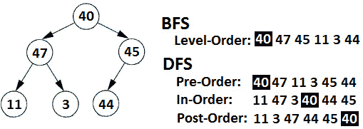

图 13.3 – 二叉树遍历

让我们简要概述一下 BFS 和 DFS 算法。

#### 树的广度优先搜索（BFS）

树的 BFS 也被称为层次遍历。其主要思想是维护一个节点队列，以确保遍历顺序。最初，队列只包含根节点。算法步骤如下：

1.  从队列中弹出第一个节点作为当前节点。

1.  访问当前节点。

1.  如果当前节点有左节点，则将该左节点入队。

1.  如果当前节点有右节点，则将该右节点入队。

1.  重复从*步骤 1*开始，直到队列为空。

在代码方面，我们有以下内容：

```java
private void printLevelOrder(Node node) {
  Queue<Node> queue = new ArrayDeque<>();
  queue.add(node);
  while (!queue.isEmpty()) {
    // Step 1
    Node current = queue.poll();
    // Step 2
    System.out.print(" " + current.element);
    // Step 3
    if (current.left != null) {
      queue.add(current.left);
    }
    // Step 4
    if (current.right != null) {
      queue.add(current.right);
    }
  }
}
```

接下来，让我们专注于 DFS。

#### 深度优先搜索（DFS）用于树

树的 DFS 有三种变体：**先序遍历**、**中序遍历**和**后序遍历**。

先序遍历在访问其子节点之前访问当前节点，如下所示**(根节点 | 左子树 | 右子树)**：

```java
private void printPreOrder(Node node) {
  if (node != null) {
    System.out.print(" " + node.element);
    printPreOrder(node.left);
    printPreOrder(node.right);
  }
}
```

中序遍历先访问左分支，然后访问当前节点，最后访问右分支，如下所示**(左子树 | 根节点 | 右子树)**：

```java
private void printInOrder(Node node) {
  if (node != null) {
    printInOrder(node.left);
    System.out.print(" " + node.element);
    printInOrder(node.right);
  }
}
```

后序遍历在访问其子节点之后访问当前节点，如下所示**(左子树 | 右子树 | 根节点)**：

```java
private void printPostOrder(Node node) {
  if (node != null) {
    printPostOrder(node.left);
    printPostOrder(node.right);
    System.out.print(" " + node.element);
  }
}
```

完整的应用程序称为*BinaryTreeTraversal*。除了前面的示例之外，完整的代码还包含了返回`List`和`Iterator`的 BFS 和 DFS 实现。

## 二叉搜索树

**二叉搜索树**（BST）是一种遵循排序规则的二叉树。通常，在 BST 中，左子节点（根的左侧所有元素）小于或等于根元素，右子节点（根的右侧所有元素）大于根元素。然而，这个顺序不仅适用于根元素。它适用于每个节点*n*，因此在 BST 中，*n*的*左子节点* ≤ *n* < *n*的*右子节点*。在下图中，左侧的图像是二叉树，右侧的图像是 BST：

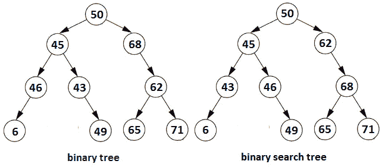

图 13.4 – 二叉树与二叉搜索树

通常，BST 不接受重复项，但当它接受时，它们可以在一侧（例如，仅在左侧）或两侧都存在。重复项也可以存储在单独的哈希映射中，或者直接通过计数器存储在树的结构中。请注意并与面试官澄清这些细节。在亚马逊、Flipkart 和微软的面试中，处理 BST 中的重复项是一个常见问题，因此它将在*编码挑战*部分中进行讨论。

在本书附带的代码中，您可以找到一个名为*BinarySearchTreeTraversal*的应用程序，其中包含以下一组方法：`insert(T element)`、`contains(T element)`、`delete(T element)`、`min()`、`max()`、`root()`、`size()`和`height()`。此外，它包含了用于打印节点和将节点返回为`List`或`Iterator`的 BFS 和 DFS 的实现。请花时间仔细研究代码。

## 平衡和不平衡的二叉树

当二叉树保证插入和查找操作的 O(log n)时间时，我们可以说我们有一个*平衡*的二叉树，但这并不一定是尽可能平衡的。当树中任何节点的左子树和右子树的高度差不超过 1 时，树就是*高度平衡*的。在下图中，左侧的树是不平衡的二叉树，中间的树是平衡的二叉树，但不是高度平衡的，右侧的树是高度平衡的树：

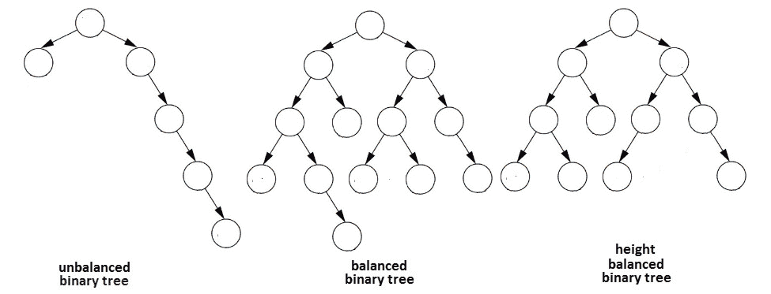

图 13.5 – 不平衡二叉树与平衡二叉树与高度平衡二叉树

平衡树有两种类型：红黑树和 AVL 树。

### 红黑树

红黑树是一种自平衡的二叉搜索树，其中每个节点都受以下规则的影响：

+   每个节点要么是红色，要么是黑色

+   根节点始终是黑色

+   每个叶子（NULL）都是黑色

+   红色节点的两个子节点都是黑色

+   从节点到 NULL 节点的每条路径具有相同数量的黑色节点

以下图表示了红黑树：

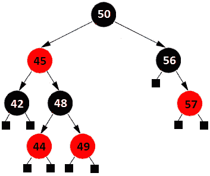

图 13.6 - 红黑树示例

红黑树永远不会变得非常不平衡。如果所有节点都是黑色，那么树就变成了*完全平衡树*。当其最长路径上的节点交替为黑色和红色节点时，红黑树的高度最大。黑红树的高度始终小于或等于 2log2(n+1)，因此其高度始终在 O(log n)的数量级内。

由于其复杂性和实施时间，涉及红黑树的问题在面试中并不常见。然而，当它们出现时，问题可能会要求您实现插入、删除或查找操作。在本书附带的代码中，您可以找到一个展示这些操作的红黑树实现。花些时间研究代码，熟悉红黑树的概念。该应用程序名为*RedBlackTreeImpl*。

您可能想要查看的更多实现可以在[github.com/williamfiset/data-structures/blob/master/com/williamfiset/datastructures/balancedtree/RedBlackTree.java](http://github.com/williamfiset/data-structures/blob/master/com/williamfiset/datastructures/balancedtree/RedBlackTree.java)和[algs4.cs.princeton.edu/33balanced/RedBlackBST.java.html](http://algs4.cs.princeton.edu/33balanced/RedBlackBST.java.html)找到。有关图形可视化，请考虑[www.cs.usfca.edu/~galles/visualization/RedBlack.html](http://www.cs.usfca.edu/~galles/visualization/RedBlack.html)。

如果您需要深入研究这个主题，我强烈建议您阅读一本专门讲述数据结构的书，因为这是一个非常广泛的主题。

### AVL 树

**AVL**树（以其发明者**A**delson-**V**elsky 和**L**andis 命名）是一种自平衡的 BST，遵守以下规则：

+   子树的高度最多相差 1。

+   节点(*n*)的平衡因子(*BN*)为-1、0 或 1，并定义为高度(*h*)差：*BN=h*(*right_subtree*(*n*)) *- h*(*left_subtree*(*n*))或*BN=h*(*left_subtree*(*n*)) *- h*(*right_subtree(n*)。

以下图表示了 AVL 树：


图 13.7 - AVL 树示例

AVL 树允许所有操作（插入、删除、查找最小值、查找最大值等）在 O(log n)的时间内执行，其中*n*是节点数。

由于其复杂性和实施时间，涉及 AVL 树的问题在面试中并不常见。然而，当它们出现时，问题可能会要求您实现插入、删除或查找操作。在本书附带的代码中，您可以找到一个展示这些操作的 AVL 树实现。花些时间研究代码，熟悉 AVL 树的概念。该应用程序名为*AVLTreeImpl*。

您可能想要查看的更多实现可以在[github.com/williamfiset/data-structures/blob/master/com/williamfiset/datastructures/balancedtree/AVLTreeRecursiveOptimized.java](http://github.com/williamfiset/data-structures/blob/master/com/williamfiset/datastructures/balancedtree/AVLTreeRecursiveOptimized.java)和[algs4.cs.princeton.edu/code/edu/princeton/cs/algs4/AVLTreeST.java.html](http://algs4.cs.princeton.edu/code/edu/princeton/cs/algs4/AVLTreeST.java.html)找到。有关图形可视化，请考虑[www.cs.usfca.edu/~galles/visualization/AVLtree.html](http://www.cs.usfca.edu/~galles/visualization/AVLtree.html)。

如果您需要深入研究这个主题，我强烈建议您阅读一本专门讲述数据结构的书，因为这是一个非常广泛的主题。

## 完全二叉树

完全二叉树是指每一层（最后一层可能除外）都是完全填充的二叉树。此外，所有节点尽可能靠左。在下图中，左侧显示了一个非完全二叉树，而右侧显示了一个完全二叉树：


图 13.8 – 非完全二叉树与完全二叉树

完全二叉树必须从左到右填充，因此上图中左侧显示的树不是完全二叉树。具有*n*个节点的完全二叉树始终具有 O(log n)的高度。

## 满二叉树

满二叉树是指每个节点都有两个子节点或没有子节点的二叉树。换句话说，一个节点不能只有一个子节点。在下图中，左侧显示了一个非满二叉树，而右侧显示了一个满二叉树：

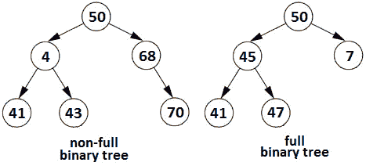

图 13.9 – 非满二叉树与满二叉树

在上图中，左侧的树不是满树，因为节点 68 只有一个子节点。

## 完美二叉树

完美二叉树既是完全的又是满的。下图显示了这样一棵树：

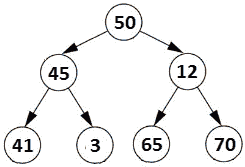

图 13.10 – 完美二叉树

因此，在完美二叉树中，所有叶节点都在同一级别。这意味着最后一级包含最大数量的节点。这种树在面试中相当罕见。

重要提示

```java
Is this a balanced tree? Is it a full binary tree?, Is it a BST?. In other words, don't base your solution on assumptions that may not be true for the given binary tree.
```

现在，让我们更详细地讨论二叉堆。

## 二叉堆

简而言之，二叉堆是一棵具有*堆属性*的完全二叉树。当元素按升序排列时（堆属性表示每个节点的元素大于或等于其父节点的元素），我们有一个最小二叉堆（最小元素是根元素），而当它们按降序排列时（堆属性表示每个节点的元素小于或等于其父节点的元素），我们有一个最大二叉堆（最大元素是根元素）。

下图显示了一个完全二叉树（左侧），一个最小二叉堆（中间），和一个最大二叉堆（右侧）：


图 13.11 – 完全二叉树和最小和最大堆

二叉堆不是排序的。它是部分有序的。在任何给定级别上，节点之间没有关系。

二叉堆通常表示为一个数组（我们将其表示为*heap*），其根节点位于*heap*[0]。更重要的是，对于*heap*[*i*]，我们有以下情况：

+   *heap*[(*i* - 1) / 2]：返回父节点

+   *heap*[(2 * *i*) + 1]：返回左子节点

+   *heap*[(2 * *i*) + 2]：返回右子节点

当通过数组实现最大二叉堆时，它看起来如下：

```java
public class MaxHeap<T extends Comparable<T>> {
  private static final int DEFAULT_CAPACITY = 5;
  private int capacity;
  private int size;
  private T[] heap;
  public MaxHeap() {
    capacity = DEFAULT_CAPACITY;
    this.heap = (T[]) Array.newInstance(
      Comparable[].class.getComponentType(),DEFAULT_CAPACITY);
  }
  // operations
}
```

与堆一起使用的常见操作是`add()`、`poll()`和`peek()`。添加或轮询元素后，我们必须修复堆，以使其符合堆属性。这一步通常被称为*堆化*堆。

向堆中添加元素是一个 O(log n)的时间操作。新元素添加到堆树的末尾。如果新元素小于其父元素，则我们不需要做任何操作。否则，我们必须向上遍历堆以修复违反的堆属性。这个操作被称为*堆化上*。*堆化上*背后的算法有两个步骤：

1.  从堆的末尾开始作为当前节点。

1.  当前节点有父节点且父节点小于当前节点时，交换这些节点。

从堆中轮询元素也是一个 O(log n)的时间操作。在我们轮询了堆的根元素之后，我们必须修复堆，使其遵守堆属性。这个操作被称为*heapify-down*。*heapify-down*背后的算法有三个步骤：

1.  从堆的根开始作为当前节点。

1.  确定当前节点的子节点中最大的节点。

1.  如果当前节点小于其最大的子节点，则交换这两个节点，并从*步骤 2*重复；否则，没有其他事情可做，所以停止。

最后，peeking 是一个 O(1)的操作，返回堆的根元素。

在本书附带的代码中，您可以找到一个名为*MaxHeap*的应用程序，它公开了以下一组方法：`add(T element)`、`peek()`和`poll()`。

重要提示

树的一个特殊情况被称为 Trie。Trie 也被称为*数字树*或*前缀树*，是一种用于存储字符串的有序树结构。它的名称来自于 Trie 是一种检索数据结构。它的性能比二叉树好。Trie 在我的书《Java 编程问题》中有详细介绍（[`www.packtpub.com/programming/java-coding-problems`](https://www.packtpub.com/programming/java-coding-problems)），以及其他数据结构，如元组、不相交集、二进制索引树（Fenwick 树）和 Bloom 过滤器。

接下来，让我们简要概述一下图。

# 图简介

图是用于表示可以通过边连接的节点集合的数据结构。例如，图可以用于表示社交媒体平台上成员的网络，因此它是表示现实生活连接的良好数据结构。树（如前一节中详细介绍的）是图的一种特殊类型。换句话说，树是没有循环的图。在图的术语中，没有循环的图被称为*无环图*。

图的特定术语涉及两个主要术语：

+   **顶点**表示信息（例如成员、狗或值）

+   **边**是两个顶点之间的连接或关系

连接可以是单向的（如二叉树的情况）或双向的。当连接是双向的（比如双向街道）时，图被称为*无向图*，它有*无向边*。当连接是单向的（比如单向街道）时，图被称为*有向图*，它有*有向边*。

图的边可以携带称为权重的信息（例如，道路的长度）。在这种情况下，图被称为*加权图*。当图有一个指向相同顶点的单个边时，它被称为*自环图*。下图提供了每种图类型的表示：


图 13.12 - 图类型

与二叉树不同，通过节点链接表示图形是不实际的。在计算机中，图通常通过邻接矩阵或邻接表表示。让我们来解决前者；也就是邻接矩阵。

## 邻接矩阵

邻接矩阵由一个大小为*n* x *n*的布尔二维数组（或只包含 0 和 1 的整数二维数组）表示，其中*n*是顶点的数量。如果我们将这个二维数组表示为一个*矩阵*，那么*matrix*[*i*][*j*]为 true（或 1），如果从顶点*i*到顶点*j*有一条边；否则为 false（或 0）。下图显示了一个无向图的邻接矩阵的示例：


图 13.13 - 无向图的邻接矩阵

为了节省空间，也可以使用位矩阵。

在加权图的情况下，邻接矩阵可以存储边的权重，而 0 可以用于表示边的不存在。

根据邻接矩阵实现图可以如下进行（我们只需要顶点列表，因为边被传递给每个必须遍历图的方法，作为邻接矩阵的一部分）：

```java
public class Graph<T> {
  // the vertices list
  private final List<T> elements;
  public Graph() {
    this.elements = new ArrayList<>();
  }
  // operations
}
```

我们可以使用另一种方法来在计算机中表示图，那就是邻接表。

## 邻接表

邻接表是一个列表数组，其大小等于图中顶点的数量。每个顶点都存储在这个数组中，并且它存储了一个相邻顶点的列表。换句话说，数组中索引*i*处的列表包含了存储在数组索引*i*处的顶点的相邻顶点。下图显示了一个无向图的邻接表示例：

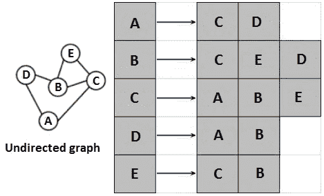

图 13.14 - 无向图的邻接表

根据邻接表实现图可以如下进行（这里，我们使用`Map`来实现邻接表）：

```java
public class Graph<T> {
  // the adjacency list is represented as a map
  private final Map<T, List<T>> adjacencyList;
  public Graph() {
    this.adjacencyList = new HashMap<>();
  }
  // operations
}
```

接下来，让我们简要介绍一下图的遍历。

## 图的遍历

遍历图的两种最常见方法是**深度优先搜索**（**DFS**）和**广度优先搜索**（**BFS**）。让我们简要介绍一下每种方法。**BFS**主要用于图。

在图的情况下，我们必须考虑到图可能有循环。普通的 BFS 实现（就像你在二叉树的情况下看到的那样）不考虑循环，所以在遍历 BFS 队列时存在无限循环的风险。通过额外的集合来消除这种风险，这个集合保存了已访问的节点。该算法的步骤如下：

1.  将起始节点（当前节点）标记为已访问（将其添加到已访问节点的集合中）并将其添加到 BFS 队列中。

1.  从队列中弹出当前节点。

1.  访问当前节点。

1.  获取当前节点的相邻节点。

1.  循环相邻节点。对于每个非空且未访问的节点，执行以下操作：

a. 将其标记为已访问（将其添加到已访问节点的集合中）。

b. 将其添加到队列中。

1.  重复从*步骤 2*直到队列为空。

### 图的深度优先搜索（DFS）

在图的情况下，我们可以通过递归或迭代实现 DFS 算法。 

#### 通过递归实现图的 DFS

通过递归实现图的 DFS 算法的步骤如下：

1.  从当前节点（给定节点）开始，并将当前节点标记为已访问（将其添加到已访问节点的集合中）。

1.  访问当前节点。

1.  通过递归遍历未访问的相邻顶点。

#### 图的深度优先搜索 - 迭代实现

DFS 算法的迭代实现依赖于`Stack`。步骤如下：

1.  从当前节点（给定节点）开始，并将当前节点推入`Stack`。

1.  当`Stack`不为空时，执行以下操作：

a. 从`Stack`中弹出当前节点。

b. 访问当前节点。

c. 将当前节点标记为已访问（将其添加到已访问节点的集合中）。

d. 将未访问的相邻顶点推入`Stack`。

在本书附带的代码中，你可以找到基于邻接矩阵的图实现，名为*GraphAdjacencyMatrixTraversal*。你还可以找到一个基于邻接表的实现，名为*GraphAdjacencyListTraversal*。这两个应用程序都包含了 BFS 和 DFS 的实现。

# 编程挑战

现在我们已经简要了解了树和图，是时候挑战自己，解决关于这些主题的面试中遇到的 25 个最受欢迎的编程问题了。

和往常一样，我们有一系列通常由世界顶级公司遇到的问题，包括亚马逊、Adobe 和谷歌等 IT 巨头。所以，让我们开始吧！

## 编码挑战 1 - 两个节点之间的路径

如果两个给定节点之间存在路径（路由），则返回`true`。

**解决方案**：让我们考虑下图所示的有向图：


图 13.15 - 从 D 到 E 和从 E 到 D 的路径

如果我们考虑节点*D*和*E*，我们可以看到从*D*到*E*有三条路径，而从*E*到*D*没有路径。因此，如果我们从*D*开始遍历图（通过 BFS 或 DFS），那么在某个时候，我们必须经过节点*E*，否则*D*和*E*之间将没有路径。因此，解决这个问题的解决方案包括从给定节点中的一个开始，并遍历图直到到达第二个给定节点，或者直到没有更多有效的移动。例如，我们可以通过 BFS 来做到这一点：

```java
public boolean isPath(T from, T to) {
  Queue<T> queue = new ArrayDeque<>();
  Set<T> visited = new HashSet<>();
  // we start from the 'from' node
  visited.add(from);
  queue.add(from);
  while (!queue.isEmpty()) {
    T element = queue.poll();
    List<T> adjacents = adjacencyList.get(element);
    if (adjacents != null) {
      for (T t : adjacents) {
        if (t != null && !visited.contains(t)) {
          visited.add(t);
          queue.add(t);
          // we reached the destination (the 'to' node)
          if (t.equals(to)) {
            return true;
          }
        }
      }
    }
  }
  return false;
}
```

完整的应用程序称为*DirectedGraphPath*。

## 编码挑战 2 - 排序数组到最小 BST

**亚马逊**，**谷歌**

**问题**：假设你得到了一个有序（升序）的整数数组。编写一小段代码，从这个数组创建最小的 BST。我们将最小的 BST 定义为高度最小的 BST。

**解决方案**：将给定的数组视为{-2, 3, 4, 6, 7, 8, 12, 23, 90}。可以从该数组创建的最小 BST 如下所示：


图 13.16 - 排序数组到最小 BST

为了获得最小高度的 BST，我们必须努力在左右子树中分配相等数量的节点。考虑到这一点，注意到我们可以选择排序数组的中间值作为根。中间值左侧的数组元素小于中间值，因此它们可以形成左子树。中间值右侧的数组元素大于中间值，因此它们可以形成右子树。

因此，我们可以选择 7 作为树的根。接下来，-2、3、4 和 6 应该形成左子树，而 8、12、23 和 90 应该形成右子树。然而，我们知道我们不能简单地将这些元素添加到左子树或右子树，因为我们必须遵守 BST 属性：在 BST 中，对于每个节点*n*，*n*的左子节点≤*n*<*n*的右子节点。

然而，我们可以简单地遵循相同的技术。如果我们将-2、3、4 和 6 视为一个数组，那么它的中间值是 3，如果我们将 8、12、24 和 90 视为一个数组，那么它的中间值是 12。因此，3 是包含-2 的左子子树的根，右子子树是包含 4 和 6 的子树。同样，12 是包含 8 的左子子树的根，右子子树是包含 24 和 90 的子树。

嗯，我认为我们有足够的经验来直觉地应用相同的技术，直到我们处理完所有的子数组。此外，很直观地，这个解决方案可以通过递归来实现（如果你不认为递归是你的顶级技能之一，请查看*第八章**，递归和动态规划*）。因此，我们可以将我们的算法总结为四个步骤：

1.  将数组的中间元素插入树中。

1.  将左子数组的元素插入左子树。

1.  将右子数组的元素插入右子树。

1.  触发递归调用。

以下实现将这些步骤转化为代码：

```java
public void minimalBst(T m[]) {       
  root = minimalBst(m, 0, m.length - 1);
}
private Node minimalBst(T m[], int start, int end) {
  if (end < start) {
    return null;
  }
  int middle = (start + end) / 2;
  Node node = new Node(m[middle]);
  nodeCount++;
  node.left = minimalBst(m, start, middle - 1);
  node.right = minimalBst(m, middle + 1, end);
  return node;
}
```

完整的应用程序称为*SortedArrayToMinBinarySearchTree*。

## 编码挑战 3 - 每层列表

**问题**：假设你得到了一个二叉树。编写一小段代码，为树的每一层创建一个元素列表（例如，如果树的深度为*d*，那么你将有*d*个列表）。

**解决方案**：让我们考虑下面图中显示的二叉树：


图 13.17 - 每层列表

因此，我们有一个深度为 3 的二叉树。在深度 0 上，我们有根 40。在深度 1 上，我们有 47 和 45。在深度 2 上，我们有 11、13、44 和 88。最后，在深度 3 上，我们有 3 和 1。

这样想是很直观的：如果我们逐级遍历二叉树，那么我们可以为每个级别创建一个元素列表。换句话说，我们可以调整 BFS 算法（也称为层次遍历），以便捕获每个遍历级别的元素。更确切地说，我们从遍历根节点开始（并创建一个包含此元素的列表），继续遍历第 1 级（并创建一个包含此级别的元素的列表），依此类推。

当我们到达第*i*级时，我们将已经完全访问了前一级，*i*-1 上的所有节点。这意味着要获得第*i*级的元素，我们必须遍历前一级，*i*-1 上的所有节点的子节点。以下解决方案需要 O(n)时间运行：

```java
public List<List<T>> fetchAllLevels() {
  // each list holds a level
  List<List<T>> allLevels = new ArrayList<>();
  // first level (containing only the root)
  Queue<Node> currentLevelOfNodes = new ArrayDeque<>();
  List<T> currentLevelOfElements = new ArrayList<>();
  currentLevelOfNodes.add(root);
  currentLevelOfElements.add(root.element);
  while (!currentLevelOfNodes.isEmpty()) {
    // store the current level as the previous level
    Queue<Node> previousLevelOfNodes = currentLevelOfNodes;
    // add level to the final list
    allLevels.add(currentLevelOfElements);
    // go to the next level as the current level
    currentLevelOfNodes = new ArrayDeque<>();
    currentLevelOfElements = new ArrayList<>();
    // traverse all nodes on current level
    for (Node parent : previousLevelOfNodes) {
      if (parent.left != null) {
        currentLevelOfNodes.add(parent.left);                    
        currentLevelOfElements.add(parent.left.element);
      }
      if (parent.right != null) {
        currentLevelOfNodes.add(parent.right);                      
        currentLevelOfElements.add(parent.right.element);
      }
    }
  }
  return allLevels;
}
```

完整的应用程序称为*ListPerBinaryTreeLevel.*

## 编码挑战 4 – 子树

**Adobe**，**微软**，**Flipkart**

如果*q*是*p*的子树，则返回`true`。

**解决方案**：考虑以下图表：

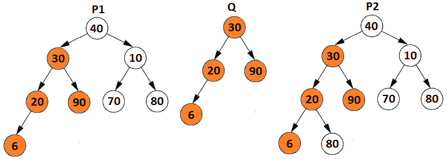

图 13.18 – 一个二叉树的子树

正如我们所看到的，中间的二叉树*q*是*p1*二叉树（左侧）的子树，但不是*p2*二叉树（右侧）的子树。

此外，该图表揭示了两种情况：

+   如果*p*的根与*q*的根匹配（*p.root.element == q.root.element*），那么问题就变成了检查*q*的右子树是否与*p*的右子树相同，或者*q*的左子树是否与*p*的左子树相同。

+   如果*p*的根节点与*q*的根节点不匹配（*p.root.element != q.root.element*），那么问题就变成了检查*p*的左子树是否与*q*相同，或者*p*的右子树是否与*q*相同。

为了实现第一个方法，我们需要两种方法。为了更好地理解为什么我们需要两种方法，请查看以下图表：

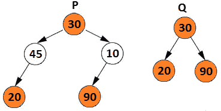

图 13.19 – 根和叶匹配，但中间节点不匹配

如果*p*和*q*的根匹配，但左/右子树的一些节点不匹配，那么我们必须回到*p*和*q*的起点，检查*q*是否是*p*的子树。第一个方法应该检查根相同的情况下树是否相同。第二个方法应该处理我们发现树不相同但从某个节点开始的情况。注意这一点，因为许多候选人没有考虑到这一点。

因此，在代码方面，我们有以下内容（对于*n*个节点，这需要 O(n)时间运行）：

```java
public boolean isSubtree(BinaryTree q) {
  return isSubtree(root, q.root);
}
private boolean isSubtree(Node p, Node q) {
  if (p == null) {
    return false;
  }
  // if the roots don't match
  if (!match(p, q)) {
    return (isSubtree(p.left, q) || isSubtree(p.right, q));
  }
  return true;
}
private boolean match(Node p, Node q) {
  if (p == null && q == null) {
    return true;
  }
  if (p == null || q == null) {
    return false;
  }
  return (p.element == q.element
      && match(p.left, q.left)
      && match(p.right, q.right));
}
```

该应用程序称为*BinaryTreeSubtree**.*

## 编码挑战 5 – 着陆预订系统

**亚马逊**，**Adobe**，**微软**

**问题**：考虑一个只有一条跑道的机场。这个机场接收来自不同飞机的着陆请求。着陆请求包含着陆时间（例如，9:56）和完成程序所需的分钟数（例如，5 分钟）。我们将其表示为 9:56（5）。编写一段代码，使用 BST 设计这个预订系统。由于只有一条跑道，代码应拒绝任何与现有请求重叠的着陆请求。请求的顺序决定了预订的顺序。

**解决方案**：让我们考虑一下我们着陆时间线的时间截图（着陆请求的顺序是 10:10（3），10:14（3），9:55（2），10:18（1），9:58（5），9:47（2），9:41（2），10:22（1），9:50（6）和 10:04（4）。这可以在以下图表中看到：


图 13.20 – 时间线截图

因此，我们已经做了几次预订，如下：在 9:41，一架飞机将着陆，需要 2 分钟完成程序；在 9:47 和 9:55，还有两架飞机需要 2 分钟完成着陆；在 9:58，我们有一架飞机需要 5 分钟完成着陆；等等。此外，我们还有两个新的着陆请求，图中标记为*R1*和*R2*。

请注意，我们无法批准*R1*着陆请求。着陆时间是 9:50，需要 6 分钟完成，所以在 9:56 结束。然而，在 9:56 时，我们已经有了来自 9:55 的飞机。由于我们只有一个跑道，我们拒绝了这个着陆请求。我们认为这种情况是重叠的。

另一方面，我们批准*R2*着陆请求。请求时间是 10:04，需要 4 分钟完成，所以在 10:08 结束。在 10:08 时，跑道上没有其他飞机，因为下一次着陆是在 10:10。

请注意，我们必须使用 BST 来解决这个问题，但使用数组（排序或未排序）或链表（排序或未排序）也是一种有效的方法。使用未排序的数组（或链表）将需要 O(1)时间来插入着陆请求，并且需要 O(n)时间来检查潜在的重叠。如果我们使用排序的数组（或链表）和二分搜索算法，那么我们可以在 O(log n)时间内检查潜在的重叠。但是，要插入着陆请求，我们将需要 O(n)，因为我们必须将插入位置右侧的所有元素移动。

使用 BST 如何？首先，让我们将前面的时间线截图表示为 BST。请查看以下图表（着陆请求的顺序是 10:10（3），10:14（3），9:55（2），10:18（1），9:58（5），9:47（2），9:41（2），10:22（1），*9:50（6）*和 10:04（4））：


图 13.21-时间线截图作为 BST

这一次，对于每个着陆请求，我们只需要扫描树的一半。这是使用 BST 的结果（左侧的所有节点都小于右侧的所有节点，因此着陆请求时间只能在左侧或右侧子树中）。例如，10:04 的着陆请求小于根（10:10），因此它进入左子树。如果在任何给定的着陆请求中，我们遇到重叠，那么我们只需返回而不将相应的节点插入树中。我们可以在 O(h)时间内找到潜在的重叠，其中*h*是 BST 的高度，并且我们可以在 O(1)时间内插入它。

重叠由以下简单的计算给出（我们使用 Java 8 日期时间 API，但您也可以将其简化为简单的整数-如果您不熟悉 Java 8 日期时间 API，那么我强烈建议您购买我的书*Java 编码问题*，由 Packt 出版（[`www.packtpub.com/programming/java-coding-problems`](https://www.packtpub.com/programming/java-coding-problems)）。这本书有一章关于这个主题的惊人章节，对于任何候选人来说都是*必读*：

```java
long t1 = Duration.between(current.element.
  plusMinutes(current.time), element).toMinutes();
long t2 = Duration.between(current.element,   
  element.plusMinutes(time)).toMinutes();
if (t1 <= 0 && t2 >= 0) {
    // overlapping found
}
```

因此，在*t1*中，我们计算当前节点的（*着陆时间*+*完成所需时间*）与当前请求的*着陆时间*之间的时间。在*t2*中，我们计算当前节点的*着陆时间*与（*当前请求的着陆时间*+*完成所需时间*）之间的时间。如果*t1*小于或等于*t2*，那么我们已经找到了一个重叠，因此我们拒绝当前的着陆请求。让我们看看完整的代码：

```java
public class BinarySearchTree<Temporal> {
  private Node root = null;
  private class Node {
    private Node left;
    private Node right;
    private final LocalTime element;
    private final int time;
    public Node(LocalTime element, int time) {
      this.time = time;
      this.element = element;
      this.left = null;
      this.right = null;
    }
    public Node(Node left, Node right, 
            LocalTime element, int time) {
      this.time = time;
      this.element = element;
      this.left = left;
      this.right = right;
    }
  }
  public void insert(LocalTime element, int time) {
    if (element == null) {
      throw new IllegalArgumentException("...");
    }
    root = insert(root, element, time);
  }
  private Node insert(Node current, 
          LocalTime element, int time) {
    if (current == null) {
      return new Node(element, time);
    }
    long t1 = Duration.between(current.element.
        plusMinutes(current.time), element).toMinutes();
    long t2 = Duration.between(current.element, 
        element.plusMinutes(time)).toMinutes();
    if (t1 <= 0 && t2 >= 0) {
      System.out.println("Cannot reserve the runway at "
        + element + " for " + time + " minutes !");
      return current;
    }
    if (element.compareTo(current.element) < 0) {
      current.left = insert(current.left, element, time);
    } else {
      current.right = insert(current.right, element, time);
    }
    return current;
  }
  public void printInOrder() {
    printInOrder(root);
  }
  private void printInOrder(Node node) {
    if (node != null) {
      printInOrder(node.left);
      System.out.print(" " + node.element
        + "(" + node.time + ")");
      printInOrder(node.right);
    }
  }
}
```

请注意，我们可以通过使用 BST 的中序遍历轻松打印时间线。完整的应用程序称为*BinaryTreeLandingReservation*。

## 编码挑战 6-平衡二叉树

**亚马逊**，**微软**

如果二叉树是平衡的，则为`true`。

**解决方案**：因此，为了拥有平衡的二叉树，对于每个节点，两个子树的高度不能相差超过一。遵循这个声明，右侧的图像代表一个平衡的二叉树，而左侧的图像代表一个不平衡的二叉树：

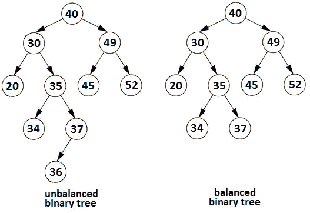

图 13.22 – 不平衡和平衡二叉树

左侧的二叉树不平衡，因为根节点 40 和 30 的左子树的高度和右子树的高度之差大于一（例如，*left-height*(40) = 4，而*right-height*(40) = 2）。

右侧的二叉树是平衡的，因为对于每个节点，左子树和右子树的高度差不大于一。

根据这个例子，我们可以直观地得出一个简单的解决方案，即递归算法。我们可以遍历每个节点并计算左右子树的高度。如果这些高度之间的差大于一，那么我们返回`false`。在代码方面，这非常简单：

```java
public boolean isBalanced() {
  return isBalanced(root);
}
private boolean isBalanced(Node root) {
  if (root == null) {
    return true;
  }
  if (Math.abs(height(root.left) - height(root.right)) > 1) {
    return false;
  } else {
    return isBalanced(root.left) && isBalanced(root.right);
  }
}
private int height(Node root) {
  if (root == null) {
    return 0;
  }
  return Math.max(height(root.left), height(root.right)) + 1;
}
```

这种方法的执行时间为 O(n log n)，因为在每个节点上，我们通过整个子树应用递归。因此，问题在于`height()`调用的次数。目前，`height()`方法只计算高度。但它可以改进为检查树是否平衡。我们只需要通过错误代码来表示不平衡的子树。另一方面，对于平衡树，我们返回相应的高度。我们可以使用`Integer.MIN_VALUE`代替错误代码，如下所示：

```java
public boolean isBalanced() {
  return checkHeight(root) != Integer.MIN_VALUE;
}
private int checkHeight(Node root) {
  if (root == null) {
    return 0;
  }
  int leftHeight = checkHeight(root.left);
  if (leftHeight == Integer.MIN_VALUE) {
    return Integer.MIN_VALUE; // error 
  }
  int rightHeight = checkHeight(root.right);
  if (rightHeight == Integer.MIN_VALUE) {
    return Integer.MIN_VALUE; // error 
  }
  if (Math.abs(leftHeight - rightHeight) > 1) {
    return Integer.MIN_VALUE; // pass error back
  } else {
    return Math.max(leftHeight, rightHeight) + 1;
  }
}
```

这段代码运行时间为 O(n)，空间为 O(h)，其中*h*是树的高度。该应用程序称为*BinaryTreeBalanced*。

## 编码挑战 7 – 二叉树是 BST

**亚马逊**，**谷歌**，**Adobe**，**微软**，**Flipkart**

`true`如果这棵树是**二叉搜索树**（**BST**）。

**解决方案**：从一开始，我们注意到问题明确提到给定的二叉树可能包含重复项。为什么这很重要？因为如果二叉树不允许重复项，那么我们可以依赖简单的中序遍历和数组。如果我们将每个遍历的元素添加到数组中，那么结果数组只有在二叉树是 BST 时才会排序。让我们通过以下图表澄清这一方面：


图 13.23 – 有效和无效的 BSTs

我们知道 BST 属性表示 BST 的每个节点*n*的*左子代 n ≤ n < 右子代 n*。这意味着前面图表中显示的前两个二叉树是有效的 BST，而最后一个不是有效的 BST。现在，将中间和最后一个二叉树的元素添加到数组中将得到一个数组[40, 40]。这意味着我们无法根据此数组验证或使 BST 无效，因为我们无法区分树。因此，总之，如果给定的二叉树不接受重复项，您应该依赖这个简单的算法。

现在，是时候更进一步了。让我们检查下面二叉树中所示的*n ≤ n < n 的左子代*语句：


图 13.24 – 无效的 BST

看看这个！对于每个节点*n*，我们可以写成*n.left ≤ n < n.right*，但很明显 55 放错了地方。所以，让我们强调当前节点的所有左节点应小于或等于当前节点，当前节点必须小于所有右节点。

换句话说，仅仅验证当前节点的左右节点是不够的。我们必须将每个节点与一系列节点的范围进行验证。更确切地说，左子树或右子树的所有节点应该在最小接受元素和最大接受元素（*min, max*）所限定的范围内进行验证。让我们考虑以下树：


图 13.25 - 验证 BST

我们从根节点（40）开始，并考虑(*min*=null, *max*=null)，所以 40 满足条件，因为没有最小或最大限制。接下来，我们转向左子树（让我们将这个子树称为 40-left-sub-tree）。40-left-sub-tree 中的所有节点应该在(null, 40)范围内。接下来，我们再次向左转，遇到 35-left-sub-tree，它应该在(null, 35)范围内。基本上，我们继续向左走，直到没有节点为止。在这一点上，我们开始向右走，所以 35-right-sub-tree 应该在(35, 40)范围内，40-right-sub-tree 应该在(40, null)范围内，依此类推。所以，当我们向左走时，最大值会更新。当我们向右走时，最小值会更新。如果出了问题，我们就停下来并返回`false`。让我们基于这个算法来看看代码：

```java
public boolean isBinarySearchTree() {
  return isBinarySearchTree(root, null, null);
}
private boolean isBinarySearchTree(Node node, 
        T minElement, T maxElement) {
  if (node == null) {
    return true;
  }
  if ((minElement != null && 
    node.element.compareTo(minElement) <= 0)
       || (maxElement != null && node.element.
              compareTo(maxElement) > 0)) {
    return false;
  }
  if (!isBinarySearchTree(node.left, minElement, node.element)
          || !isBinarySearchTree(node.right, 
                node.element, maxElement)) {
    return false;
  }
  return true;
}
```

完整的应用程序称为*BinaryTreeIsBST*。

## 编码挑战 8 - 后继节点

**谷歌**，**微软**

**问题**：考虑到你已经得到了一个**二叉搜索树**（**BST**）和这个树中的一个节点。编写一小段代码，打印出中序遍历上给定节点的后继节点。

**解决方案**：因此，让我们回顾一下二叉树的中序遍历。这种**深度优先搜索**（**DFS**）的遍历方式先遍历左子树，然后是当前节点，然后是右子树。现在，让我们假设我们任意选择了 BST 中的一个节点（让我们将其称为*n*），并且我们想在中序遍历的上下文中找到它的后继节点（让我们将其称为*s*）。

让我们将以下图表视为给定的 BST。我们可以用它来区分可能的情况：

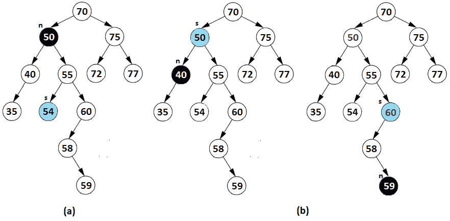

图 13.26 - 具有起始和后继节点的 BST 示例

如前面的图表所示，我们将两个主要情况标记为（a）和（b）。在情况（a）中，节点*n*有右子树。在情况（b）中，节点*n*不包含右子树。

情况（a）在左侧 BST 中得到了例证，如果节点*n*有右子树，那么后继节点*s*就是这个右子树的最左节点。例如，对于*n*=50，后继节点是 54。

情况（b）有两个子情况：一个简单情况和一个棘手情况。简单情况在前面图表中显示的中间 BST 中得到了例证。当节点*n*不包含右子树且*n*是其父节点的左子节点时，后继节点就是这个父节点。例如，对于*n*=40，后继节点是 50。这是情况（b）的简单子情况。

(b)的棘手子情况在前面图表中显示的右侧 BST 中得到了例证。当节点*n*不包含右子树且*n*是其父节点的右子节点时，我们必须向上遍历，直到*n*成为其父节点的左子节点。一旦我们做到了这一点，我们返回这个父节点。例如，如果*n*=59，则后继节点是 60。

此外，我们必须考虑如果*n*是遍历中的最后一个节点，那么我们返回根节点的父节点，这个父节点可能为空。

如果我们将这些情况组合起来形成一些伪代码，那么我们得到以下内容：

```java
Node inOrderSuccessor(Node n) {
  if (n has a right sub-tree) {
    return the leftmost child of right sub-tree
  } 
  while (n is a right child of n.parent) {
    n = n.parent; // traverse upwards 
  }
  return n.parent; // parent has not been traversed
}
```

现在，我们可以将这个伪代码转换成代码，如下所示：

```java
public void inOrderSuccessor() {
  // choose the node
  Node node = ...;
  System.out.println("\n\nIn-Order:");
  System.out.print("Start node: " + node.element);
  node = inOrderSuccessor(node);
  System.out.print(" Successor node: " + node.element);
}
private Node inOrderSuccessor(Node node) {
  if (node == null) {
    return null;
  }
  // case (a)
  if (node.right != null) {
    return findLeftmostNode(node.right);
  }
  // case (b)
  while (node.parent != null && node.parent.right == node) {
    node = node.parent;
  }
  return node.parent;
}
```

完整的应用程序称为*BinarySearchTreeSuccessor*。这个应用程序也包含了同样的问题，但是通过先序遍历和后序遍历来解决。在检查先序遍历和后序遍历上下文的解决方案之前，你应该挑战自己，识别可能的情况，并勾画伪代码及其实现。

## 编码挑战 9 – 拓扑排序

**亚马逊**，**谷歌**，**Adobe**，**微软**，**Flipkart**

**问题**：假设你已经得到了一个**有向无环图**（**DAG**）；即，一个没有循环的有向图。编写一小段代码，返回顶点的线性排序，使得对于每条有向边*XY*，顶点*X*在排序中出现在*Y*之前。换句话说，对于每条边，源节点在目标节点之前。这也被称为拓扑排序，它只适用于 DAGs。 

解决方案：让我们通过以下有向无环图（DAG）来深入研究这个问题：


图 13.27 – 有向无环图（DAG）

让我们从顶点 D 开始进行拓扑排序。在顶点 D 之前，没有其他顶点（没有边），所以我们可以将 D 添加到结果中，(D)。从 D，我们可以到达 B 或 A。让我们去顶点 A。我们不能将 A 添加到结果中，因为我们没有处理边 BA 的顶点 B，所以让我们去顶点 B。在 B 之前，我们只有 D，已经添加到结果中，所以我们可以将 B 添加到结果中，(D, B)。从 B，我们可以到达 A、E、C 和 F。我们不能到达 C，因为我们没有处理 AC，我们也不能到达 F，因为我们没有处理 CF。然而，我们可以到达 A，因为 DA 和 BA 已经被处理，我们也可以到达 E，因为在 E 之前只有 B，它在结果中。注意，拓扑排序可能会提供不同的结果。让我们去 E。因此，E 被添加到结果中（D, B, E）。接下来，我们可以将 A 添加到结果中，这使我们可以添加 C，这使我们可以添加 F。因此，结果现在是（D, B, E, A, C, F）。从 F，我们可以到达 G。由于 EG 已经被处理，我们可以将 G 添加到结果中。最后，从 G，我们到达 H，得到的拓扑排序结果为（D, B, E, A, C, F, G, H）。

这种遍历只是一种任意的遍历，我们无法将其编写成代码。然而，我们知道图可以通过 BFS 和 DFS 算法进行遍历。如果我们尝试在 DFS 的上下文中思考，那么我们从节点 D 开始，遍历 B、A、C、F、G、H 和 E。在执行 DFS 遍历时，我们不能简单地将顶点添加到结果中，因为我们违反了问题的要求（对于每条有向边*XY*，顶点*X*在排序中出现在*Y*之前）。然而，我们可以使用一个`Stack`，在遍历完所有邻居节点后将一个顶点推入这个栈中。这意味着 H 是第一个被推入栈中的顶点，然后是 G、F、C、A、E、B 和 D。现在，从栈中弹出直到为空将给我们拓扑排序的结果，即 D、B、E、A、C、F、G 和 H。

因此，拓扑排序只是基于`Stack`的 DFS 变种，可以实现如下：

```java
public Stack<T> topologicalSort(T startElement) {
  Set<T> visited = new HashSet<>();
  Stack<T> stack = new Stack<>();
  topologicalSort(startElement, visited, stack);
  return stack;
}
private void topologicalSort(T currentElement, 
      Set<T> visited, Stack<T> stack) {
  visited.add(currentElement);
  List<T> adjacents = adjacencyList.get(currentElement);
  if (adjacents != null) {
    for (T t : adjacents) {
      if (t != null && !visited.contains(t)) {
        topologicalSort(t, visited, stack);
        visited.add(t);
      }
    }
  }
  stack.push(currentElement);
}
```

完整的应用程序称为*GraphTopologicalSort*。

## 编码挑战 10 – 共同祖先

**亚马逊**，**谷歌**，**微软**，**Flipkart**

**问题**：假设你已经得到了一棵二叉树。编写一小段代码，找到两个给定节点的第一个共同祖先。你不能在数据结构中存储额外的节点。

解决方案：分析这种问题的最佳方法是拿一些纸和笔，画一个二叉树并标注一些样本。注意，问题没有说这是一个二叉搜索树。实际上，它可以是任何有效的二叉树。

在下图中，我们有三种可能的情况：


图 13.28 – 寻找第一个共同祖先

在这里，我们可以看到给定的节点可以位于不同的子树（左子树和右子树）或者位于同一个子树（中间子树）。因此，我们可以从根节点开始遍历树，使用`commonAncestor(Node root, Node n1, Node n2)`类型的方法，并返回如下（*n1*和*n2*是给定的两个节点）：

+   如果根的子树包括*n1*（但不包括*n2*），则返回*n1*

+   如果根的子树包括*n2*（但不包括*n1*），则返回*n2*

+   如果根的子树中既没有*n1*也没有*n2*，则返回`null`

+   否则，返回*n1*和*n2*的公共祖先。

当`commonAncestor(n.left, n1, n2)`和`commonAncestor(n.right, n1, n2)`返回非空值时，这意味着*n1*和*n2*在不同的子树中，而*n*是它们的公共祖先。让我们看看代码：

```java
public T commonAncestor(T e1, T e2) {
  Node n1 = findNode(e1, root);
  Node n2 = findNode(e2, root);
  if (n1 == null || n2 == null) {
    throw new IllegalArgumentException("Both nodes 
             must be present in the tree");
  }
  return commonAncestor(root, n1, n2).element;
}
private Node commonAncestor(Node root, Node n1, Node n2) {
  if (root == null) {
    return null;
  }
  if (root == n1 && root == n2) {
    return root;
  }
  Node left = commonAncestor(root.left, n1, n2);
  if (left != null && left != n1 && left != n2) {
    return left;
  }
  Node right = commonAncestor(root.right, n1, n2);
  if (right != null && right != n1 && right != n2) {
    return right;
  }
  // n1 and n2 are not in the same sub-tree
  if (left != null && right != null) {
    return root;
  } else if (root == n1 || root == n2) {
    return root;
  } else {
    return left == null ? right : left;
  }
}
```

完整的应用程序称为*BinaryTreeCommonAncestor*。

## 编程挑战 11 - 国际象棋骑士

**亚马逊**，**微软**，**Flipkart**

**问题**：假设你已经得到了一个国际象棋棋盘和一个骑士。最初，骑士放在一个单元格（起始单元格）中。编写一小段代码，计算将骑士从起始单元格移动到给定目标单元格所需的最小移动次数。

**解决方案**：让我们考虑一个例子。国际象棋棋盘的大小为 8x8，骑士从单元格（1, 8）开始。目标单元格是（8, 1）。正如下图所示，骑士需要至少移动 6 次才能从单元格（1, 8）到单元格（8, 1）：


图 13.29 - 将骑士从单元格（1, 8）移动到单元格（8, 1）

正如这张图片所显示的，一个骑士可以从一个（*r，c*）单元格移动到另外八个有效的单元格，如下：（*r*+2，*c*+1），（*r*+1，*c*+2），（*r*-1，*c*+2），（*r*-2，*c*+1），（*r*-2，*c*-1），（*r*-1，*c*-2），（*r*+1，*c*-2），和（*r*+2，*c*-1）。因此，有八种可能的移动。如果我们将这些可能的移动看作方向（边）和单元格看作顶点，那么我们可以在图的上下文中可视化这个问题。边是可能的移动，而顶点是骑士的可能单元格。每个移动都保存从当前单元格到起始单元格的距离。对于每次移动，距离增加 1。因此，在图的上下文中，这个问题可以简化为在图中找到最短路径。因此，我们可以使用 BFS 来解决这个问题。

该算法的步骤如下：

1.  创建一个空队列。

1.  将起始单元格入队，使其与自身的距离为 0。

1.  只要队列不为空，执行以下操作：

a. 从队列中弹出下一个未访问的单元格。

b. 如果弹出的单元格是目标单元格，则返回它的距离。

c. 如果弹出的单元格不是目标单元格，则将此单元格标记为已访问，并通过增加距离 1 来将八个可能的移动入队列。

由于我们依赖 BFS 算法，我们知道所有最短路径为 1 的单元格首先被访问。接下来，被访问的单元格是最短路径为 1+1=2 的相邻单元格，依此类推；因此，任何最短路径等于*其父节点的最短路径* + 1 的单元格。这意味着当我们第一次遍历目标单元格时，它给出了我们的最终结果。这就是最短路径。让我们看看代码：

```java
private int countknightMoves(Node startCell, 
            Node targetCell, int n) {
  // store the visited cells
  Set<Node> visited = new HashSet<>();
  // create a queue and enqueue the start cell
  Queue<Node> queue = new ArrayDeque<>();
  queue.add(startCell);
  while (!queue.isEmpty()) {
    Node cell = queue.poll();
    int r = cell.r;
    int c = cell.c;
    int distance = cell.distance;
    // if destination is reached, return the distance
    if (r == targetCell.r && c == targetCell.c) {
      return distance;
    }
    // the cell was not visited
    if (!visited.contains(cell)) {
      // mark current cell as visited
      visited.add(cell);
      // enqueue each valid movement into the queue 
      for (int i = 0; i < 8; ++i) {
        // get the new valid position of knight from current
        // position on chessboard and enqueue it in the queue 
        // with +1 distance
        int rt = r + ROW[i];
        int ct = c + COL[i];
        if (valid(rt, ct, n)) {
          queue.add(new Node(rt, ct, distance + 1));
        }
      }
    }
  }
  // if path is not possible
  return Integer.MAX_VALUE;
}
// Check if (r, c) is valid    
private static boolean valid(int r, int c, int n) {
  if (r < 0 || c < 0 || r >= n || c >= n) {
    return false;
  }
  return true;
}
```

该应用程序称为*ChessKnight*。

## 编程挑战 12 - 打印二叉树的角

**亚马逊**，**谷歌**

**问题**：假设你已经得到了一棵二叉树。编写一小段代码，打印出每个级别的树的角。

**解决方案**：让我们考虑以下树：


图 13.30 - 打印二叉树的角

因此，主要思想是打印每个级别的最左边和最右边的节点。这意味着层序遍历（BFS）可能很有用，因为我们可以遍历每个级别。我们所要做的就是识别每个级别上的第一个和最后一个节点。为了做到这一点，我们需要通过添加一个条件来调整经典的层序遍历，该条件旨在确定当前节点是否代表一个角落。代码本身说明了这一点：

```java
public void printCorners() {
  if (root == null) {
    return;
  }
  Queue<Node> queue = new ArrayDeque<>();
  queue.add(root);
  int level = 0;
  while (!queue.isEmpty()) {
    // get the size of the current level
    int size = queue.size();
    int position = size;
    System.out.print("Level: " + level + ": ");
    level++;
    // process all nodes present in current level
    while (position > 0) {
      Node node = queue.poll();
      position--;
      // if corner node found, print it
      if (position == (size - 1) || position == 0) {
        System.out.print(node.element + " ");
      }
      // enqueue left and right child of current node
      if (node.left != null) {
        queue.add(node.left);
      }
      if (node.right != null) {
        queue.add(node.right);
      }
    }
    // level done            
    System.out.println();
  }
}
```

该应用程序称为*BinaryTreePrintCorners.*

## 编程挑战 13 - 最大路径和

**亚马逊**，**谷歌**，**Adobe**，**微软**，**Flipkart**

**问题**：考虑到你已经得到了一个非空的二叉树。编写一小段代码来计算最大路径和。路径被认为是从任何节点开始并在树中的任何节点结束的任何节点序列，以及父子连接。路径必须包含至少一个节点，可能经过树的根，也可能不经过树的根。

**解决方案**：下图显示了最大路径和的三个例子：


图 13.31 - 最大路径和的三个例子

解决这个问题需要我们确定当前节点可以成为最大路径的一部分的方式数量。通过检查前面的例子，我们可以得出四种情况，如下图所示（花点时间看更多例子，直到得出相同的结论）：


图 13.32 - 当前节点可以成为最大路径的一部分的方式数量

因此，作为最大路径的一部分的节点被放入以下四种情况之一：

1.  节点是最大路径中唯一的节点

1.  节点是最大路径的一部分，紧邻其左子节点

1.  节点是最大路径的一部分，紧邻其右子节点

1.  节点是最大路径的一部分，紧邻其左右子节点

这四个步骤使我们得出一个明确的结论：我们必须遍历树的所有节点。一个很好的选择是 DFS 算法，但更确切地说是后序遍历树遍历，它将遍历顺序规定为**左子树** | **右子树** | **根**。当我们遍历树时，我们将树的其余部分的最大值传递给父节点。下图显示了这个算法：


图 13.33 - 后序遍历并将树中的最大值传递给父节点

因此，如果我们按照这个算法逐步应用到前面的图中，我们得到以下结果（记住这是后序遍历）：

+   41 没有子节点，所以 41 被添加到 max(0, 0)，41+max(0, 0)=41。

+   3 只有左子节点-5，所以 3 被添加到 max(-5, 0)，3+max(-5, 0)=3。

+   -2 被添加到 max(41, 3)子树，所以-2+max(41, 3)=39。

+   -7 没有子节点，所以-7 被添加到 max(0, 0)，-7+max(0, 0)=-7。

+   70 没有子节点，所以 70 被添加到 max(0, 0)，70+max(0, 0)=70。

+   -1 被添加到 max(-7, 70)子树，所以-1+70=69。

+   50 被添加到左（39）和右（69）子树的最大值，所以 39+69+50=158（这是最大路径和）。

以下代码显示了这个算法的实现：

```java
public int maxPathSum() {
  maxPathSum(root);
  return max;
}
private int maxPathSum(Node root) {
  if (root == null) {
    return 0;
  }
  // maximum of the left child and 0
  int left = Math.max(0, maxPathSum(root.left));
  // maximum of the right child and 0
  int right = Math.max(0, maxPathSum(root.right));
  // maximum at the current node (all four cases 1,2,3 and 4)
  max = Math.max(max, left + right + root.element);
  //return the maximum from left, right along with current               
  return Math.max(left, right) + root.element;
}
```

该应用程序称为*BinaryTreeMaxPathSum.*

## 编程挑战 14 - 对角线遍历

**亚马逊**，**Adobe**，**微软**

**问题**：考虑到你已经得到了一个非空的二叉树。编写一小段代码，打印每个负对角线（\）上的所有节点。负对角线具有负斜率。

**解决方案**：如果你对二叉树的负对角线概念不熟悉，请确保与面试官澄清这一方面。他们可能会为你提供一个例子，类似于下图所示的例子：

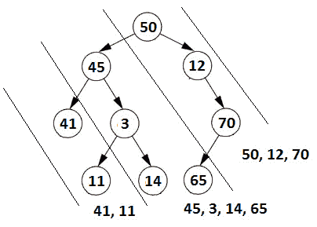

图 13.34-二叉树的负对角线

在上图中，我们有三条对角线。第一条对角线包含节点 50、12 和 70。第二条对角线包含节点 45、3、14 和 65。最后，第三条对角线包含节点 41 和 11。

### 基于递归的解决方案

解决这个问题的一个解决方案是使用递归和*哈希*（如果您不熟悉哈希的概念，请阅读*第六章**，面向对象编程*，*哈希表*问题）。在 Java 中，我们可以通过内置的`HashMap`实现使用哈希，因此无需从头开始编写哈希实现。但是这个`HashMap`有什么用呢？我们应该在这个地图的条目（键值对）中存储什么？

我们可以将二叉树中的每条对角线与地图中的一个键关联起来。由于每条对角线（键）包含多个节点，因此将值表示为`List`非常方便。当我们遍历二叉树时，我们需要将当前节点添加到适当的`List`中，因此在适当的对角线下。例如，在这里，我们可以执行前序遍历。每次我们进入左子树时，我们将对角线增加 1，每次我们进入右子树时，我们保持当前对角线。这样，我们得到类似以下的东西：


图 13.35-前序遍历并将对角线增加 1 以处理左子节点

以下解决方案的时间复杂度为 O(n log n)，辅助空间为 O(n)，其中*n*是树中的节点数：

```java
// print the diagonal elements of given binary tree
public void printDiagonalRecursive() {
  // map of diagonals
  Map<Integer, List<T>> map = new HashMap<>();
  // Pre-Order traversal of the tree and fill up the map
  printDiagonal(root, 0, map);
  // print the current diagonal
  for (int i = 0; i < map.size(); i++) {
    System.out.println(map.get(i));
  }
}
// recursive Pre-Order traversal of the tree 
// and put the diagonal elements in the map
private void printDiagonal(Node node, 
        int diagonal, Map<Integer, List<T>> map) {
  if (node == null) {
    return;
  }
  // insert the current node in the diagonal
  if (!map.containsKey(diagonal)) {
    map.put(diagonal, new ArrayList<>());
  }
  map.get(diagonal).add(node.element);
  // increase the diagonal by 1 and go to the left sub-tree
  printDiagonal(node.left, diagonal + 1, map);
  // maintain the current diagonal and go 
  // to the right sub-tree
  printDiagonal(node.right, diagonal, map);
}
```

现在，让我们看看这个问题的另一个解决方案。

### 基于迭代的解决方案

解决这个问题也可以通过迭代完成。这次，我们可以使用层次遍历，并使用`Queue`将对角线的节点入队。这个解决方案的主要伪代码可以写成如下形式：

```java
(first diagonal)
Enqueue the root and all its right children 
While the queue is not empty
	Dequeue (let's denote it as A)
	Print A
    (next diagonal)
	If A has a left child then enqueue it 
    (let's denote it as B)
		Continue to enqueue all the right children of B
```

将这个伪代码转换成代码后，我们得到以下结果：

```java
public void printDiagonalIterative() {
  Queue<Node> queue = new ArrayDeque<>();
  // mark the end of a diagonal via dummy null value
  Node dummy = new Node(null);
  // enqueue all the nodes of the first diagonal
  while (root != null) {
    queue.add(root);
    root = root.right;
  }
  // enqueue the dummy node at the end of each diagonal
  queue.add(dummy);
  // loop while there are more nodes than the dummy
  while (queue.size() != 1) {
    Node front = queue.poll();
    if (front != dummy) {
      // print current node
      System.out.print(front.element + " ");
      // enqueue the nodes of the next diagonal 
      Node node = front.left;
      while (node != null) {
        queue.add(node);
        node = node.right;
      }
    } else {
      // at the end of the current diagonal enqueue the dummy                 
      queue.add(dummy);
      System.out.println();
    }
  }
}
```

上述代码的运行时间为 O(n)，辅助空间为 O(n)，其中*n*是树中的节点数。完整的应用程序称为*BinaryTreePrintDiagonal*。

## 编码挑战 15-处理 BST 中的重复项

**亚马逊**，**微软**，**Flipkart**

**问题**：假设你有一个允许重复的 BST。编写一个支持插入和删除操作的实现，同时处理重复项。

**解决方案**：我们知道 BST 的属性声称对于每个节点*n*，我们知道*n*的左子节点≤*n*<*n*的右子节点。通常，涉及 BST 的问题不允许重复项，因此不能插入重复项。但是，如果允许重复项，那么我们的约定将是将重复项插入左子树。

然而，面试官可能希望看到一个允许我们将计数与每个节点关联的实现，如下图所示：


图 13.36-处理 BST 中的重复项

为了提供这个实现，我们需要修改经典 BST 的结构，以便支持计数：

```java
private class Node {
  private T element;
  private int count;
  private Node left;
  private Node right;
  private Node(Node left, Node right, T element) {
    this.element = element;
    this.left = left;
    this.right = right;
    this.count = 1;
  }
}
```

每次创建一个新节点（树中不存在的节点）时，计数器将等于 1。

当我们插入一个节点时，我们需要区分新节点和重复节点。如果我们插入一个重复节点，那么我们只需要将该节点的计数增加一，而不创建新节点。插入操作的相关部分如下：

```java
private Node insert(Node current, T element) {
  if (current == null) {
    return new Node(null, null, element);
  }
  // START: Handle inserting duplicates
  if (element.compareTo(current.element) == 0) {
    current.count++;
    return current;
  }
  // END: Handle inserting duplicates
...
}
```

删除节点遵循类似的逻辑。如果我们删除一个重复节点，那么我们只需将其计数减一。如果计数已经等于 1，那么我们只需删除节点。相关代码如下：

```java
private Node delete(Node node, T element) {
  if (node == null) {
    return null;
  }
  if (element.compareTo(node.element) < 0) {
    node.left = delete(node.left, element);
  } else if (element.compareTo(node.element) > 0) {
    node.right = delete(node.right, element);
  }
  if (element.compareTo(node.element) == 0) {
    // START: Handle deleting duplicates
    if (node.count > 1) {
      node.count--;
      return node;
    }
    // END: Handle deleting duplicates
    ...
}
```

完整的应用程序称为*BinarySearchTreeDuplicates.* 这个问题的另一个解决方案是使用哈希表来计算节点的数量。这样，您就不需要修改树的结构。挑战自己，完成这个实现。

## 编码挑战 16 - 二叉树同构

**亚马逊**，**谷歌**，**微软**

**问题**：假设你已经得到了两棵二叉树。编写一小段代码，判断这两棵二叉树是否同构。

**解决方案**：如果你对*同构*一词不熟悉，那么你必须向面试官澄清。这个术语在数学上有很明确的定义，但面试官可能不会给出数学上的解释/演示，而且你知道，数学家有自己的语言，几乎不可能流利和易于理解的英语。此外，在数学中，同构的概念指的是任何两个结构，不仅仅是二叉树。因此，面试官可能会给你一个解释，如下（让我们将树表示为*T1*和*T2*）：

**定义 1**：*如果 T1 可以通过多次交换子节点而改变为 T2，那么 T1 和 T2 是同构的，T1 和 T2 根本不必是相同的物理形状。*

**定义 2**：*如果你可以将 T1 翻译成 T2，将 T2 翻译成 T1 而不丢失信息，那么 T1 和 T2 是同构的。*

**定义 3**：*想想两个字符串，AAB 和 XXY。如果 A 被转换成 X，B 被转换成 Y，那么 AAB 就变成了 XXY，所以这两个字符串是同构的。因此，如果 T2 在结构上是 T1 的镜像，那么两个二叉树是同构的。*

无论面试官给出什么定义，我相当肯定他们都会试图给你一个例子。下图显示了一堆同构二叉树的例子：


图 13.37 - 同构二叉树示例

根据前面的定义和示例，我们可以制定以下算法来确定两个二叉树是否同构：

1.  如果*T1*和*T2*是`null`，那么它们是同构的，所以返回`true.`

1.  如果*T1*或*T2*是`null`，那么它们不是同构的，所以返回`false.`

1.  如果*T1.data*不等于*T2.data*，那么它们不是同构的，所以返回`false.`

1.  遍历*T1*的左子树和*T2*的左子树。

1.  遍历*T1*的右子树和*T2*的右子树：

a. 如果*T1*和*T2*的结构相同，那么返回`true.`

b. 如果*T1*和*T2*的结构不相同，那么我们检查一个树（或子树）是否镜像另一个树（子树），

1.  遍历*T1*的左子树和*T2*的右子树。

1.  遍历*T1*的右子树和*T2*的左子树：

a. 如果结构是镜像的，那么返回`true`；否则返回`false.`

将这个算法编写成代码，结果如下：

```java
private boolean isIsomorphic(Node treeOne, Node treeTwo) {
  // step 1
  if (treeOne == null && treeTwo == null) {
    return true;
  }
  // step 2
  if ((treeOne == null || treeTwo == null)) {
    return false;
  }
  // step 3
  if (!treeOne.element.equals(treeTwo.element)) {
    return false;
  }
  // steps 4, 5, 6 and 7
  return (isIsomorphic(treeOne.left, treeTwo.right)
    && isIsomorphic(treeOne.right, treeTwo.left)
    || isIsomorphic(treeOne.left, treeTwo.left)
    && isIsomorphic(treeOne.right, treeTwo.right));
}
.
```

完整的应用程序称为*TwoBinaryTreesAreIsomorphic.*

## 编码挑战 17 - 二叉树右视图

**亚马逊**，**谷歌**，**Adobe**，**微软**，**Flipkart**

**问题**：假设你已经得到了一棵二叉树。编写一小段代码，打印出这棵树的右视图。打印*右视图*意味着打印出你从右侧看这棵二叉树时能看到的所有节点。

**解决方案**：如果你不确定二叉树的右视图是什么，那么请向面试官澄清。例如，下图突出显示了代表二叉树右视图的节点：


图 13.38 - 二叉树的右视图

因此，如果您被放在这棵树的右侧，您只会看到节点 40、45、44、9 和 2。如果我们考虑层次遍历（BFS），我们得到以下输出：

+   **40**，47，**45**，11，3，**44**，7，5，**9**，**2**

突出显示的节点是表示右视图的节点。但是，这些节点中的每一个都代表树中每个级别的最右节点。这意味着我们可以调整 BFS 算法并打印每个级别的最后一个节点。

这是一个 O(n)复杂度的时间算法，辅助空间为 O(n)（由队列表示），其中*n*是树中的节点数：

```java
private void printRightViewIterative(Node root) {
  if (root == null) {
    return;
  }
  // enqueue root node
  Queue<Node> queue = new ArrayDeque<>();
  queue.add(root);
  Node currentNode;
  while (!queue.isEmpty()) {
    // number of nodes in the current level is the queue size
    int size = queue.size();
    int i = 0;
    // traverse each node of the current level and enqueue its
    // non-empty left and right child
    while (i < size) {
      i++;
      currentNode = queue.poll();
      // if this is last node of current level just print it
      if (i == size) {
        System.out.print(currentNode.element + " ");
      }
      if (currentNode.left != null) {
        queue.add(currentNode.left);
      }
      if (currentNode.right != null) {
        queue.add(currentNode.right);
      }
    }
  }
}
```

在这里，我们也可以实现递归解决方案。

这是一个 O(n)复杂度的时间算法，辅助空间为 O(n)（由映射表示），其中*n*是树中的节点数。您可以在本书附带的代码中找到递归方法，该代码在*BinaryTreeRightView*应用程序中。挑战自己，实现二叉树的左视图。

## 编码挑战 18 - 第 k 个最大元素

**Google**，**Flipkart**

**问题**：假设您已经得到了一个 BST。编写一小段代码，打印出第*k*个最大元素，而不改变 BST。

**解决方案**：让我们考虑以下 BST：


图 13.39 - BST 中的第 k 个最大元素

对于*k*=1，我们可以看到 56 是第一个最大的元素。对于*k*=2，我们可以看到 55 是第二大的元素，依此类推。

暴力解法非常简单，将在 O(n)时间内运行，其中*n*是树中的节点数。我们所要做的就是提取一个数组，并将其放在树的中序遍历**(左子树 | 右子树 | 根)**中：45, 47, 50, 52, 54, 55, 56。完成后，我们可以找到*array*[*n-k*]作为*k*th 元素。例如，对于*k*=3，第三个元素是*array*[7-3] = *array*[4]=54。如果您愿意，可以挑战自己并提供此实现。

然而，还可以基于逆中序遍历**(右子树 | 左子树 | 根)**编写另一种在 O(k+h)复杂度时间内运行的方法，其中*h*是 BST 的高度，该方法可以按降序给出元素：56, 55, 54, 52, 50, 47, 45。

代码说明自己（`c`变量计算访问的节点数）：

```java
public void kthLargest(int k) {
  kthLargest(root, k);
}
private int c;
private void kthLargest(Node root, int k) {
  if (root == null || c >= k) {
    return;
  }
  kthLargest(root.right, k);
  c++;
  // we found the kth largest value
  if (c == k) {
    System.out.println(root.element);
  }
  kthLargest(root.left, k);
}
```

完整的应用程序称为*BinarySearchTreeKthLargestElement*。

## 编码挑战 19 - 镜像二叉树

**Amazon**，**Google**，**Adobe**，**Microsoft**

**问题**：假设您已经得到了一棵二叉树。编写一小段代码，构造这棵树的镜像。

**解决方案**：镜像树如下所示（右侧树是左侧树的镜像版本）：


图 13.40 - 给定树和镜像树

因此，镜像树就像给定树的水平翻转。要创建树的镜像，我们必须决定是否将镜像树作为新树返回，还是在原地镜像给定树。

### 在新树中镜像给定树

将镜像作为新树返回可以通过遵循以下步骤的递归算法完成：


图 13.41 - 递归算法

在代码方面，我们有以下内容：

```java
private Node mirrorTreeInTree(Node root) {
  if (root == null) {
    return null;
  }
  Node node = new Node(root.element);
  node.left = mirrorTreeInTree(root.right);
  node.right = mirrorTreeInTree(root.left);
  return node;
}
```

现在，让我们尝试在原地镜像给定树。

### 在原地镜像给定树

在原地镜像给定树也可以通过递归来完成。这次，算法遵循以下步骤：

1.  镜像给定树的左子树。

1.  镜像给定树的右子树。

1.  交换左右子树（交换它们的指针）。

在代码方面，我们有以下内容：

```java
private void mirrorTreeInPlace(Node node) {
  if (node == null) {
    return;
  }
  Node auxNode;
  mirrorTreeInPlace(node.left);
  mirrorTreeInPlace(node.right);
  auxNode = node.left;
  node.left = node.right;
  node.right = auxNode;
}
```

完整的应用程序称为*MirrorBinaryTree*。

## 编码挑战 20 - 二叉树的螺旋级别顺序遍历

**Amazon**，**Google**，**Microsoft**

**问题**：假设你有一个二叉树。编写一小段代码，打印这个二叉树的螺旋级遍历。更确切地说，应该从左到右打印所有在第 1 级的节点，然后从右到左打印所有在第 2 级的节点，然后从左到右打印所有在第 3 级的节点，依此类推。因此，奇数级应从左到右打印，偶数级应从右到左打印。

**解决方案**：螺旋级遍历可以用两种方式来表达，如下所示：

+   奇数级应从左到右打印，偶数级应从右到左打印。

+   奇数级应从右到左打印，偶数级应从左到右打印。

以下图表示这些陈述：


图 13.42 - 螺旋顺序遍历

因此，在左侧，我们得到 50、12、45、12、3、65、70、24 和 41。另一方面，在右侧，我们得到 50、45、12、70、65、3、12、41 和 24。

### 递归方法

让我们尝试从前面图表的左侧实现螺旋顺序遍历。请注意，奇数级应从左到右打印，而偶数级应以相反的顺序打印。基本上，我们需要通过翻转偶数级的方向来调整众所周知的层次遍历。这意味着我们可以使用一个布尔变量来交替打印顺序。因此，如果布尔变量为`true`（或 1），那么我们从左到右打印当前级别；否则，我们从右到左打印。在每次迭代（级别）中，我们翻转布尔值。

通过递归应用可以这样做：

```java
public void spiralOrderTraversalRecursive() {
  if (root == null) {
    return;
  }
  int level = 1;
  boolean flip = false;
  // as long as printLevel() returns true there 
  // are more levels to print
  while (printLevel(root, level++, flip = !flip)) {
    // there is nothing to do
  };
}
// print all nodes of a given level 
private boolean printLevel(Node root, 
      int level, boolean flip) {
  if (root == null) {
    return false;
  }
  if (level == 1) {
    System.out.print(root.element + " ");
    return true;
  }
  if (flip) {
    // process left child before right child
    boolean left = printLevel(root.left, level - 1, flip);
    boolean right = printLevel(root.right, level - 1, flip);
    return left || right;
  } else {
    // process right child before left child
    boolean right = printLevel(root.right, level - 1, flip);
    boolean left = printLevel(root.left, level - 1, flip);
    return right || left;
  }
}
```

这段代码运行时间为 O(n2)，效率相当低。我们能更有效地做到吗？是的 - 我们可以用额外空间 O(n)的迭代方法在 O(n)的时间内完成。

### 迭代方法

让我们尝试从给定图表的右侧实现螺旋顺序遍历。这次我们将通过迭代方法来实现。主要是，我们可以使用两个栈（`Stack`）或双端队列（`Deque`）。让我们学习如何通过两个栈来实现这一点。

使用两个栈的主要思想非常简单：我们使用一个栈来打印从左到右的节点，另一个栈来打印从右到左的节点。在每次迭代（或级别）中，一个栈中有相应级别的节点。在我们打印一个栈中的节点时，我们将下一级别的节点推入另一个栈中。

以下代码将这些陈述转化为代码形式：

```java
private void printSpiralTwoStacks(Node node) {
  if (node == null) {
    return;
  }
  // create two stacks to store alternate levels         
  Stack<Node> rl = new Stack<>(); // right to left         
  Stack<Node> lr = new Stack<>(); // left to right 
  // Push first level to first stack 'rl' 
  rl.push(node);
  // print while any of the stacks has nodes 
  while (!rl.empty() || !lr.empty()) {
    // print nodes of the current level from 'rl' 
    // and push nodes of next level to 'lr'
    while (!rl.empty()) {
      Node temp = rl.peek();
      rl.pop();
      System.out.print(temp.element + " ");
      if (temp.right != null) {
        lr.push(temp.right);
      }
      if (temp.left != null) {
        lr.push(temp.left);
      }
    }
    // print nodes of the current level from 'lr' 
    // and push nodes of next level to 'rl'
    while (!lr.empty()) {
      Node temp = lr.peek();
      lr.pop();
      System.out.print(temp.element + " ");
      if (temp.left != null) {
        rl.push(temp.left);
      }
      if (temp.right != null) {
        rl.push(temp.right);
      }
    }
  }
}
```

完整的应用程序称为*BinaryTreeSpiralTraversal*。在这个应用程序中，您还可以找到基于`Deque`的实现。

## 编码挑战 21 - 距离叶节点 k 的节点

**亚马逊**，**谷歌**，**微软**，**Flipkart**

**问题**：假设你有一个整数二叉树和一个整数*k*。编写一小段代码，打印所有距离叶节点*k*的节点。

**解决方案**：我们可以直觉地认为距离叶子*k*的距离意味着叶子上方*k*级。但为了澄清任何疑问，让我们遵循经典方法，尝试可视化一个例子。以下图表表示二叉树；突出显示的节点（40、47 和 11）表示距离叶节点*k*=2 的节点：

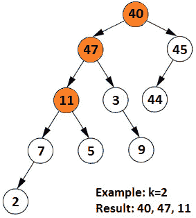

图 13.43 - 距离叶节点 k=2 的节点

从前面的图表中，我们可以得出以下观察结果：

+   节点 40 距离叶子 44 有 2 个距离。

+   节点 47 距离叶子 9 和叶子 5 有 2 个距离。

+   节点 11 距离叶子 2 有 2 个距离。

如果我们观察每个级别，那么我们可以看到以下内容：

+   距离叶节点 1 个距离的节点是 3、11、7 和 45。

+   距离叶节点 2 个距离的节点是 11、47 和 40。

+   距离叶节点 3 个距离的节点是 40 和 47。

+   距离叶节点 4 的节点是 40。

因此，根节点是距离叶节点最远的节点，*k*不应该大于层级数；也就是说，1\. 如果我们从根开始并沿着树向下直到找到一个叶子，那么结果路径应该包含一个距离该叶子有*k*距离的节点。

例如，一个可能的路径是 40（根），47，11，7 和 2（叶子）。如果*k*=2，那么节点 11 距离叶子有 2 的距离。另一个可能的路径是 40（根），47，11 和 5（叶子）。如果*k*=2，那么节点 47 距离叶子有 2 的距离。另一条路径是 40（根），47，3 和 9（叶子）。如果*k*=2，那么节点 47 距离叶子有 2 的距离。我们已经找到了这个节点；因此，我们现在必须注意并删除重复项。

到目前为止列出的路径表明，存在树的前序遍历**(根|左子树|右子树)**。在遍历过程中，我们必须跟踪当前路径。换句话说，构建的路径由前序遍历中当前节点的祖先组成。当我们找到一个叶节点时，我们必须打印距离这个叶节点*k*的祖先。

为了消除重复，我们可以使用一个`Set`（让我们将其表示为`nodesAtDist`），如下面的代码所示：

```java
private void leafDistance(Node node, 
    List<Node> pathToLeaf, Set<Node> nodesAtDist, int dist) {
  if (node == null) {
    return;
  }
  // for each leaf node, store the node at distance 'dist'
  if (isLeaf(node) && pathToLeaf.size() >= dist) {
    nodesAtDist.add(pathToLeaf.get(pathToLeaf.size() - dist));
    return;
  }
  // add the current node into the current path        
  pathToLeaf.add(node);
  // go  to left and right subtree via recursion
  leafDistance(node.left, pathToLeaf, nodesAtDist, dist);
  leafDistance(node.right, pathToLeaf, nodesAtDist, dist);
  // remove the current node from the current path       
  pathToLeaf.remove(node);
}
private boolean isLeaf(Node node) {
  return (node.left == null && node.right == null);
}
```

前面的代码的运行时间复杂度为 O(n)，辅助空间为 O(n)，其中*n*是树中的节点数。完整的应用程序称为*BinaryTreeDistanceFromLeaf*。

## 编码挑战 22 - 给定总和的一对

**亚马逊**，**谷歌**，**Adobe**，**微软**，**Flipkart**

如果有一对节点的总和为这个数，则返回`true`。

**解决方案**：让我们考虑下面图表中显示的 BST 和*总和*=74：

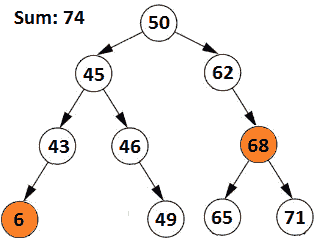

图 13.44 - 总和为 74 的一对包含节点 6 和 68

因此，对于*总和*=74，我们可以找到一对（6，68）。如果*总和*=89，那么一对是（43，46）。如果*总和*=99，那么一对是（50，49）。组成一对的节点可以来自同一子树或不同的子树，也可以包括根和叶节点。

这个问题的一个解决方案依赖于*哈希*和递归。主要是，我们使用中序遍历(`HashSet`)遍历树。此外，在将当前节点插入集合之前，我们检查(*给定的总和 - 当前节点的元素*)是否存在于集合中。如果是的话，那么我们找到了一对，所以我们停止这个过程并返回`true`。否则，我们将当前节点插入集合并继续这个过程，直到找到一对，或者遍历完成。

这个代码如下所示：

```java
public boolean findPairSum(int sum) {
  return findPairSum(root, sum, new HashSet());
}
private static boolean findPairSum(Node node, 
        int sum, Set<Integer> set) {
  // base case
  if (node == null) {
    return false;
  }
  // find the pair in the left subtree 
  if (findPairSum(node.left, sum, set)) {
    return true;
  }
  // if pair is formed with current node then print the pair      
  if (set.contains(sum - node.element)) {
    System.out.print("Pair (" + (sum - node.element) + ", "
      + node.element + ") = " + sum);
    return true;
  } else {
    set.add(node.element);
  }
  // find the pair in the right subtree 
  return findPairSum(node.right, sum, set);
}
```

这段代码的运行时间复杂度为 O(n)，辅助空间为 O(n)。完整的应用程序称为*BinarySearchTreeSum*。

另一个你可能想考虑并挑战自己的解决方案是，BST 在使用中序遍历时，以排序顺序输出节点。这意味着如果我们扫描 BST 并将输出存储在数组中，那么问题与在数组中找到给定总和的一对完全相同。但是这个解决方案需要对所有节点进行两次遍历，并且需要 O(n)的辅助空间。

另一种方法从 BST 属性开始：*n 的左子节点≤n<n 的右子节点*。换句话说，树中的最小节点是最左边的节点（在我们的例子中是 6），树中的最大节点是最右边的节点（在我们的例子中是 71）。现在，考虑树的两次遍历：

+   前序中序遍历（最左边的节点是第一个访问的节点）

+   逆序中序遍历（最右边的节点是第一个访问的节点）

现在，让我们评估(*最小+最大*)表达式：

+   如果(*最小+最大*)<*总和*，那么去下一个*最小*（前序中序遍历返回的下一个节点）。

+   如果(*最小值 + 最大值*) > *总和*，那么转到下一个*最大值*（反向中序遍历返回的下一个节点）。

+   如果(*最小值 + 最大值*) = *总和*，那么返回`true`。

主要问题在于我们需要管理这两个遍历。一种方法可以依赖于两个堆栈。在一个堆栈中，我们存储前向中序遍历的输出，而在另一个堆栈中，我们存储反向中序遍历的输出。当我们到达*最小*（最左边）和*最大*（最右边）节点时，我们必须弹出堆栈的顶部并对给定的*总和*执行相等性检查。

这个相等性检查通过了前面三个检查（由前面的三个项目符号给出），并且解释如下：

+   如果(*最小值 + 最大值*) < *总和*，那么我们通过前向中序遍历转到弹出节点的右子树。这是我们如何找到下一个最大的元素。

+   如果(*最小值 + 最大值*) > *总和*，那么我们通过反向中序遍历转到弹出节点的左子树。这是我们如何找到下一个最小的元素。

+   如果(*最小值 + 最大值*) = *总和*，那么我们找到了一个验证给定*总和*的一对。

只要前向中序遍历和反向中序遍历不相遇，算法就会应用。让我们看看这段代码：

```java
public boolean findPairSumTwoStacks(int sum) {
  return findPairSumTwoStacks(root, sum);
}
private static boolean findPairSumTwoStacks(
              Node node, int sum) {
  Stack<Node> fio = new Stack<>(); // fio - Forward In-Order
  Stack<Node> rio = new Stack<>(); // rio - Reverse In-Order
  Node minNode = node;
  Node maxNode = node;
  while (!fio.isEmpty() || !rio.isEmpty()
           || minNode != null || maxNode != null) {
    if (minNode != null || maxNode != null) {
      if (minNode != null) {
        fio.push(minNode);
        minNode = minNode.left;
      }
      if (maxNode != null) {
        rio.push(maxNode);
        maxNode = maxNode.right;
      }
    } else {
      int elem1 = fio.peek().element;
      int elem2 = rio.peek().element;
      if (fio.peek() == rio.peek()) {
        break;
      }
      if ((elem1 + elem2) == sum) {
        System.out.print("\nPair (" + elem1 + ", " 
             + elem2 + ") = " + sum);
        return true;
      }
      if ((elem1 + elem2) < sum) {
        minNode = fio.pop();
        minNode = minNode.right;
      } else {
        maxNode = rio.pop();
        maxNode = maxNode.left;
      }
    }
  }
  return false;
}
```

这段代码的运行时间是 O(n)，辅助空间是 O(n)。完整的应用程序称为*BinarySearchTreeSum*。

## 编码挑战 23 - 二叉树中的垂直求和

**亚马逊**，**谷歌**，**Flipkart**

**问题**：假设你已经得到了一个二叉树。编写一小段代码，计算这个二叉树的垂直求和。

**解决方案**：为了清晰地理解这个问题，非常重要的是你画一个有意义的图表。最好使用一个有方格的笔记本（数学笔记本）。这很有用，因为你必须以 45 度角画出节点之间的边缘；否则，可能看不到节点的垂直轴线。通常，当我们画一个二叉树时，我们不关心节点之间的角度，但在这种情况下，这是理解问题并找到解决方案的一个重要方面。

以下图表是二叉树的草图。它显示了一些有用的地标，将引导我们找到解决方案：


图 13.45 - 二叉树中的垂直求和

如果我们从左边扫描树到右边，我们可以识别出七个垂直轴，它们的总和分别为 5、7、16、35、54、44 和 6。在图表的顶部，我们添加了每个节点距离根节点的水平距离。如果我们将根节点视为距离 0，那么我们可以通过减少或增加 1 来轻松地从根的左侧或右侧唯一地识别每个垂直轴，分别为-3、-2、-1、0（根）、1、2、3。

每个轴都是通过它距离根的距离唯一标识的，并且每个轴都包含我们必须求和的节点。如果我们将轴的唯一距离视为一个键，将该轴上节点的总和视为一个值，那么我们可以直观地认为这个问题可以通过*哈希*（如果你不熟悉哈希的概念，请参阅*第六章**，面向对象编程*，*哈希表*问题）。在 Java 中，我们可以通过内置的`HashMap`实现使用哈希，因此无需从头开始编写哈希实现。

但是我们如何填充这个映射呢？很明显，我们必须在遍历树的同时填充映射。我们可以从根开始，将键添加到映射为 0（0 对应包含根的轴），值为根（21）。接下来，我们可以使用递归通过减小距离从根到左轴。我们也可以使用递归通过增加距离从根到右轴。在每个节点，我们更新映射中对应于标识当前轴的键的值。因此，如果我们递归地遵循路径**root**|**left sub-tree**|**right sub-tree**，那么我们使用二叉树的前序遍历。

最后，我们的映射应该包含以下键值对：(-3, 5)，(-2, 7)，(-1, 16)，(0, 35)，(1, 54)，(2, 44)和(3, 6)。

将此算法编码为以下结果（`map`包含垂直和）：

```java
private void verticalSum(Node root, 
        Map<Integer, Integer> map, int dist) {
  if (root == null) {
    return;
  }
  if (!map.containsKey(dist)) {
    map.put(dist, 0);
  }

  map.put(dist, map.get(dist) + root.element);        
  // or in functional-style
  /*
  BiFunction <Integer, Integer, Integer> distFunction
    = (distOld, distNew) -> distOld + distNew;
  map.merge(dist, root.element, distFunction);
  */
  // decrease horizontal distance by 1 and go to left
  verticalSum(root.left, map, dist - 1);
  // increase horizontal distance by 1 and go to right
  verticalSum(root.right, map, dist + 1);
}
```

前面的代码在 O(n log n)时间内运行，辅助空间为 O(n)，其中*n*是树的总节点数。将映射添加到具有 O(log n)复杂度的时间，因为我们对树的每个节点进行一次添加，这意味着我们得到 O(n log n)。对于面试来说，这里提出的解决方案应该足够了。但是，你可以挑战自己，通过使用额外的双向链表将时间复杂度降低到 O(n)。主要是，你需要将每个垂直和存储在链表的一个节点中。首先，将与包含根的轴对应的垂直和添加到链表中。然后，链表的*node.next*和*node.prev*应该存储根轴左侧和右侧轴的垂直和。最后，依靠递归在遍历树时更新链表。

完整的应用程序称为* BinaryTreeVerticalSum。*

## 编码挑战 23 - 将最大堆转换为最小堆

**亚马逊**，**谷歌**，**Adobe**，**微软**，**Flipkart**

**问题**：考虑到你已经得到了一个表示最小二叉堆的数组。编写一小段代码，将给定的最小二叉堆在线性时间内转换为最大二叉堆，而且不需要额外的空间。

**解决方案**：这个问题的解决方案受到了*Heap Sort*算法的启发（该算法在*第十四章**，排序和搜索*中介绍）。

最初，这个问题可能听起来很复杂，但经过几分钟的思考，你可能会得出结论，问题可以简化为从未排序的数组构建最大二叉堆。因此，给定的数组是或不是最小二叉堆并不重要。我们可以通过以下两个步骤从任何数组（排序或未排序）构建所需的最大二叉堆：

1.  从给定数组的最右下方节点（最后一个内部节点）开始。

1.  通过自底向上的技术*Heapify*所有节点。

代码说明自己：

```java
public static void convertToMinHeap(int[] maxHeap) {
  // build heap from last node to all 
  // the way up to the root node
  int p = (maxHeap.length - 2) / 2;
  while (p >= 0) {
    heapifyMin(maxHeap, p--, maxHeap.length);
  }
}
// heapify the node at index p and its two direct children    
private static void heapifyMin(int[] maxHeap,
      int p, int size) {
  // get left and right child of node at index p
  int left = leftChild(p);
  int right = rightChild(p);
  int smallest = p;
  // compare maxHeap[p] with its left and 
  // right child and find the smallest value
  if ((left < size) && (maxHeap[left] < maxHeap[p])) {
    smallest = left;
  }
  if ((right < size) 
      && (maxHeap[right] < maxHeap[smallest]))  {
    smallest = right;
  }
  // swap 'smallest' with 'p' and heapify
  if (smallest != p) {
    swap(maxHeap, p, smallest);
    heapifyMin(maxHeap, smallest, size);
  }
}
/* Helper methods */
private static int leftChild(int parentIndex) {
  return (2 * parentIndex + 1);
}
private static int rightChild(int parentIndex) {
  return (2 * parentIndex + 2);
}
// utility function to swap two indices in the array
private static void swap(int heap[], int i, int j) {
  int aux = heap[i];
  heap[i] = heap[j];
  heap[j] = aux;
}
```

这段代码的运行时间是 O(n)，不需要额外的空间。完整的应用程序称为*MaxHeapToMinHeap。*它还包含将最小二叉堆转换为最大二叉堆。

## 编码挑战 24 - 查找二叉树是否对称

**亚马逊**，**谷歌**，**Adobe**，**微软**，**Flipkart**

如果这个二叉树是对称的（镜像的或不是；左子树和右子树是彼此的镜像），则返回`true`。

**解决方案**：首先，让我们看一下包含对称和不对称二叉树的图表。标有(a)、(b)和(d)的二叉树是不对称的，而标有(c)、(e)和(f)的二叉树是对称的。请注意，如果二叉树的结构和数据都是对称的，那么二叉树是对称的：

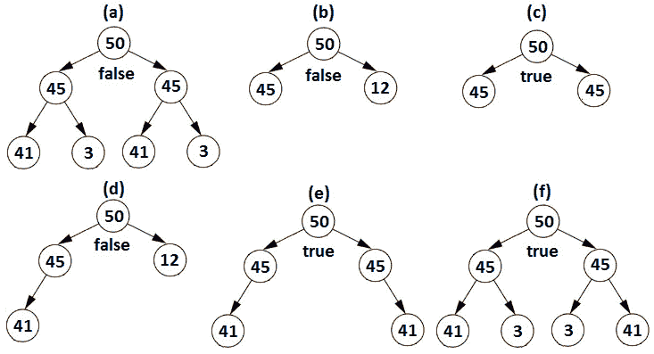

图 13.46 - 对称和不对称的二叉树示例

我们可以将这个问题看作是镜像*root.left*并检查它是否与*root.right*相同。如果它们相同，那么二叉树是对称的。然而，我们也可以通过三个条件来表达两个二叉树的对称性，如下所示（理解这些条件最简单的方法是将它们分别应用到前面图表中显示的示例中）：

1.  根节点的元素相同。

1.  左树的左子树和右树的右子树必须是镜像。

1.  左树的右子树和右树的左子树必须是镜像。

我认为我们有足够的经验来认识到这些条件可以通过递归来实现，如下所示：

```java
private boolean isSymmetricRecursive(
      Node leftNode, Node rightNode) {
  boolean result = false;
  // empty trees are symmetric
  if (leftNode == null && rightNode == null) {
    result = true;
  }
  // conditions 1, 2, and 3 from above
  if (leftNode != null && rightNode != null) {
    result = (leftNode.element.equals(rightNode.element))
      && isSymmetricRecursive(leftNode.left, rightNode.right)
      && isSymmetricRecursive(leftNode.right, rightNode.left);
  }
  return result;
}
```

这段代码的时间复杂度是 O(n)，额外空间是 O(h)，其中*h*是树的高度。那么迭代实现呢？我们可以通过队列提供迭代实现。以下代码是对这种方法的最好解释：

```java
public boolean isSymmetricIterative() {        
  boolean result = false;
  Queue<Node> queue = new LinkedList<>();
  queue.offer(root.left);
  queue.offer(root.right);
  while (!queue.isEmpty()) {
    Node left = queue.poll();
    Node right = queue.poll();
    if (left == null && right == null) {
      result = true;
    } else if (left == null || right == null 
                || left.element != right.element) {
      result = false;
      break;
    } else {
      queue.offer(left.left);
      queue.offer(right.right);
      queue.offer(left.right);
      queue.offer(right.left);
    }
  }
  return result;
}
```

这段代码的时间复杂度是 O(n)，额外空间是 O(h)，其中*h*是树的高度。完整的应用程序称为*IsSymmetricBinaryTree*。

## 编码挑战 25 - 以最小成本连接*n*根绳子

亚马逊，谷歌，Adobe，微软，Flipkart

**问题**：假设你有一个包含*n*根绳子长度的数组，我们需要将所有这些绳子连接成一根绳子。考虑到连接两根绳子的成本等于它们长度的总和。编写一小段代码，以最小成本将所有绳子连接成一根绳子。

**解决方案**：假设我们有四根长度分别为 1、3、4 和 6 的绳子。让我们首先连接最短的两根绳子。这意味着我们需要连接长度为 1 和 3 的绳子，成本为 1+3=4。按照相同的逻辑，接下来的两根绳子是长度为 4（我们刚刚得到的）和 4。成本是 4+4=8，所以总成本是 4+8=12。我们还剩下两根长度分别为 8 和 6 的绳子。连接它们的成本是 8+6=14。因此，总成本和最终成本是 12+14=26。

现在，让我们尝试另一种策略。让我们首先连接最长的两根绳子。这意味着我们需要连接长度为 4 和 6 的绳子，成本为 4+6=10。按照相同的逻辑，接下来的两根绳子是 10（我们刚刚得到的）和长度为 3。成本是 10+3=13，所以总成本是 10+13=23。我们还剩下两根绳子，长度分别为 13 和 1。连接它们的成本是 13+1=14。因此，总成本和最终成本是 23+14=37。

由于 37>26，很明显第一种方法比第二种方法更好。但是，有什么陷阱吗？嗯，如果你还没有注意到，首先连接的绳子的长度在其余的连接中出现。例如，当我们连接绳子 1 和 3 时，我们写 1+3=4。所以，4 是到目前为止的总成本。接下来，我们加上 4+4=8，所以新的总成本是之前的总成本+8，即 4+8，但 4 是从 1+3 得到的，所以 1+3 再次出现。最后，我们连接 8+6=14。新的总成本是之前的成本+14，即 12+14，但 12 是从 4+8 得到的，4 是从 1+3 得到的，所以 1+3 再次出现。

分析上述陈述会让我们得出结论，如果重复添加的绳子是最小的，那么我们可以获得连接所有绳子的最小成本，然后是第二小的，依此类推。换句话说，我们可以将此算法视为如下所示：

1.  按长度降序对绳子进行排序。

1.  连接前两根绳子并更新部分最小成本。

1.  用结果替换前两根绳子。

1.  从*步骤 1*开始重复，直到只剩下一根绳子（连接所有绳子的结果）。

实现了这个算法后，我们应该得到最终的最小成本。如果我们尝试通过快速排序或归并排序等排序算法来实现这个算法，那么结果将在 O(n2 log n)的时间内执行。正如你从*第七章**，算法的大 O 分析*中所知道的那样，这些排序算法的执行时间为 O(n log n)，但我们必须每次连接两根绳子时对数组进行排序。

我们能做得更好吗？是的，我们可以！在任何时候，我们只需要最小长度的两根绳子；我们不关心数组的其余部分。换句话说，我们需要一个数据结构，它能够有效地让我们访问最小的元素。因此，答案是最小二进制堆。向最小二进制堆添加和移除是一个 O(log n)复杂度时间的操作。这个算法可以表达如下：

1.  从绳长数组创建最小二进制堆（O(log n)）。

1.  从最小二进制堆的根部取出元素，这将给我们最小的绳子（O(log n)）。

1.  再次从根部取出元素，这将给我们第二小的绳子（O(log n)）。

1.  连接两根绳子（将它们的长度相加）并将结果放回最小二进制堆中。

1.  从*步骤 2*重复，直到只剩下一根绳子（连接所有绳子的结果）。

因此，以 O(n log n)复杂度时间执行的算法如下：

```java
public int minimumCost(int[] ropeLength) {
  if (ropeLength == null) {
    return -1;
  }
  // add the lengths of the ropes to the heap
  for (int i = 0; i < ropeLength.length; i++) {           
    add(ropeLength[i]);
  }
  int totalLength = 0;
  while (size() > 1) {         
    int l1 = poll();
    int l2 = poll();
    totalLength += (l1 + l2);
    add(l1 + l2);
  }
  return totalLength;
}
```

完整的应用程序称为*HeapConnectRopes*。

# 高级主题

从一开始，你应该知道以下主题在技术面试中很少遇到。首先，让我将这些主题列举为一个非穷尽的列表：

+   AVL 树（本书附带的代码中提供了简要描述和实现）

+   红黑树（本书附带的代码中提供了简要描述和实现）

+   Dijkstra 算法

+   Rabin-Karp 子字符串搜索

+   Bellman-Ford 算法

+   Floyd-Warshall 算法

+   区间树

+   最小生成树

+   B-树

+   二分图

+   图着色

+   P、NP 和 NP 完全

+   组合和概率

+   正则表达式

+   A*

如果你已经掌握了本书涵盖的所有问题，那么我强烈建议你继续学习上述主题。如果你不这样做，那么请将所有问题视为比这些主题更重要。

这里概述的大部分主题可能在面试中被问到，也可能不会。它们代表了复杂的算法，你要么知道，要么不知道——面试官无法真正洞察你的逻辑和思维能力，仅仅因为你能够重现一个著名的算法。面试官想要看到你能够利用你的知识。这些算法并不能展示你解决之前未见过的问题的能力。显然，你无法直觉地理解这些复杂的算法，因此你的印记几乎微不足道。如果你不知道这些算法，不要担心！它们既不会让你看起来更聪明，也不会让你看起来更愚蠢！此外，由于它们很复杂，需要大量时间来实现，在面试中时间是有限的。

然而，多学习也没有坏处！这是一个规则，所以如果你有时间，那么也看看这些高级主题。

# 总结

这是本书中最艰难的章节之一，也是任何技术面试的*必读*。树和图是如此广泛、美妙和具有挑战性的主题，以至于整整一本书都专门献给了它们。然而，当你要准备面试时，你没有时间去研究大量的书籍并深入研究每个主题。这正是本章的魔力所在：这一章（就像整本书一样）完全专注于你必须实现你的目标：通过技术面试。

换句话说，本章包含了在技术面试中可能遇到的最流行的树和图问题，以及有意义的图表、全面的解释和清晰干净的代码。

在下一章中，我们将解决与排序和搜索相关的问题。
