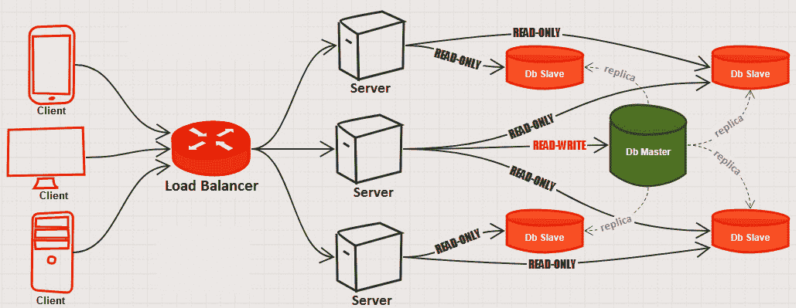
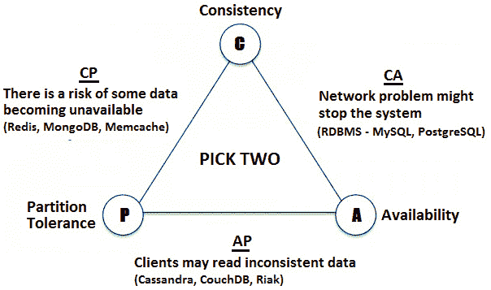

*第十九章*：

# 系统可伸缩性

可伸缩性无疑是 Web 应用程序成功的最关键需求之一。应用程序的可伸缩能力取决于整个系统架构，而在构建项目时考虑可伸缩性是最佳选择。当业务的成功可能需要应用程序因大量流量而需要高度可伸缩时，您以后会非常感激。

因此，随着网络的发展，设计和构建可伸缩的应用程序也变得更加重要。在本章中，我们将涵盖您在初级/中级面试中可能会被问到的所有可伸缩性问题，比如 Web 应用程序软件架构师、Java 架构师或软件工程师等职位。如果您正在寻找的职位不涉及与软件架构和设计相关的任务，那么可伸缩性很可能不会成为面试话题。

本章的议程包括以下内容：

+   简而言之，可伸缩性

+   问题和编码挑战

让我们开始吧！

# 简而言之，可伸缩性

面试官最可预测但也最重要的问题是：什么是可伸缩性？可伸缩性是指一个过程（系统、网络、应用程序）应对工作负载增加的能力和能力（通过工作负载，我们理解任何推动系统极限的东西，如流量、存储容量、最大交易数量等），当添加资源（通常是硬件）时。可伸缩性可以表示系统性能提升与资源使用增加之间的比率。此外，可伸缩性还意味着能够在不影响/修改主节点结构的情况下添加额外的资源。

如果增加更多资源导致性能略微提高，甚至更糟的是，增加资源对性能没有影响，那么您面临所谓的*可伸缩性差*。

您如何实现可伸缩性？在涉及可伸缩性问题的面试中，您很可能也会被问到这个问题。给出一个一般、全面且不会花费太多时间的答案是最佳选择。应该触及的主要点包括以下内容：

+   **利用 12 要素**（https://12factor.net/）：这种方法与编程语言无关，对于交付灵活和可伸缩的应用程序非常有帮助。

+   **明智地实现持久性**：从为应用程序选择合适的数据库和开发最优化的模式，到掌握扩展持久层的技术（例如，集群、副本、分片等），这是值得您全部关注的关键方面之一。

+   **不要低估查询**：数据库查询是获取短事务的关键因素。调整连接池和查询以实现可伸缩性。例如，注意跨节点连接，这可能会迅速降低性能。

+   **选择托管和工具**：扩展不仅仅是代码！基础设施也非常重要。今天，许多云服务提供商（例如亚马逊）提供自动扩展和专用工具（Docker、Kubernetes 等）。

+   **考虑负载均衡和反向代理**：有一天，您必须从单服务器切换到多服务器架构。在云基础设施下运行（例如亚马逊），只需进行几项配置即可轻松提供这些设施（对于大多数云服务提供商，负载均衡和反向代理是*即插即用*的一部分）。否则，您必须为这一重大变化做好准备。

+   **缓存**：在扩展应用程序时，考虑新的缓存策略、拓扑和工具。

+   **减轻后端负担**：尽可能将尽可能多的计算从后端移到前端。这样，您可以减轻后端的工作负担。

+   **测试和监控**：测试和监控代码将帮助您尽快发现问题。

还有许多其他方面需要讨论，但在这一点上，面试官应该准备将面试推进到下一步。

# 问题和编码挑战

在本节中，我们涵盖了 13 个问题和编码挑战，这些问题和挑战在初中级可扩展性面试中是必须了解的。让我们开始吧！

## 编码挑战 1 - 扩展类型

**问题**：扩展和扩展意味着什么？

**解决方案**：扩展（或纵向扩展）是通过向现有系统添加更多资源来实现更好的性能并成功应对更大的工作负载。通过资源，我们可以理解更多的存储、更多的内存、更多的网络、更多的线程、更多的连接、更强大的主机、更多的缓存等。添加新资源后，应用程序应能够遵守服务级别协议。今天，在云中扩展是非常高效和快速的。像 AWS、Azure、Oracle、Heroku、Google Cloud 等云可以根据阈值计划自动分配更多的资源，仅需几分钟。当流量减少时，AWS 可以禁用这些额外的资源。这样，您只需支付您使用的部分。

扩展（或横向扩展）通常与分布式架构相关。有两种基本形式的扩展：

+   在预打包的基础设施/节点块中增加更多的基础设施容量（例如，超融合）。

+   使用独立的分布式服务来收集有关客户的信息。

通常，扩展是通过添加更多与当前使用的相同类型或任何兼容类型的服务器或 CPU 来完成的。扩展使服务提供商能够为客户提供“按需增长”的基础设施和服务。扩展速度相当快，因为不需要导入或重建任何东西。然而，扩展速度受服务器通信速度的限制。

像 AWS 这样的云可以根据阈值计划自动分配更多的基础设施，仅需几分钟。当流量较低时，AWS 可以禁用这些额外的基础设施。这样，您只需支付您使用的部分。

通常，扩展提供比扩展更好的性能。

## 编码挑战 2 - 高可用性

**问题**：什么是高可用性？

**解决方案**：高可用性和低延迟对于许多企业来说至关重要。

通常以一年中的正常运行时间的百分比来表示，当应用程序在没有中断的情况下对用户可用时，就实现了高可用性（在一年内 99.9%的时间内）。

通过集群实现高可用性是常见的。

## 编码挑战 3 - 低延迟

**问题**：什么是低延迟？

**解决方案**：低延迟是与计算机网络相关的术语，它被优化为以最小的延迟或延迟处理极高数量的数据。这样的网络被设计和构建用于处理试图实现几乎实时数据处理能力的操作。

## 编码挑战 4 - 集群

**问题**：什么是集群，为什么我们需要集群？

**解决方案**：集群是一组可以单独运行应用程序的机器。我们可以有应用程序服务器集群、数据库服务器集群等。

拥有集群显著降低了我们的服务在集群中的一台机器失败时变得不可用的机会。换句话说，集群的主要目的是实现 100%的可用性或服务的零停机时间（高可用性 - 见*编码挑战 2*）。当然，所有集群机器同时失败的可能性仍然很小，但通常通过将机器放置在不同的位置或由它们自己的资源支持来减轻这种可能性。

## 编码挑战 5 - 延迟、带宽和吞吐量

**问题**：什么是延迟、带宽和吞吐量？

**解决方案**：在面试中解释这些概念的最佳方法是使用下图中的管道进行简单类比：

图 19.1 – 延迟与带宽与吞吐量

**延迟**是通过管道传输所需的时间，而不是管道长度。但是，它作为管道长度的函数来衡量。

**带宽**是管道有多宽。

**吞吐量**是通过管道流动的水量。

## 编码挑战 6 – 负载均衡

**问题**：什么是负载均衡？

**解决方案**：负载均衡是一种用于在多台机器或集群之间分配工作负载的技术。在负载均衡使用的算法中，有循环轮询、粘性会话（或会话亲和性）和 IP 地址亲和性。常见且简单的算法是循环轮询，它按循环顺序分配工作负载，确保所有可用的机器获得相等数量的请求，没有一台机器过载或负载不足。

例如，下图标记了典型主从架构中负载均衡器的位置：

图 19.2 – 主从架构中的负载均衡器

通过在机器之间分配工作，负载均衡力求实现最大吞吐量和响应时间。

## 编码挑战 7 – 粘性会话

**问题**：什么是粘性会话（或会话亲和性）？

**解决方案**：粘性会话（或会话亲和性）是负载均衡器中遇到的一个概念。通常，用户信息存储在会话中，并且会话在集群中的所有机器上都有副本。但是会话复制（参见*编码挑战 11*）可以通过从同一台机器为特定用户会话请求提供服务来避免。

因此，会话与机器关联。这发生在会话创建时。对于此会话的所有传入请求始终重定向到关联的机器。用户数据仅在该机器上。

在 Java 中，粘性会话通常通过`jsessionid` cookie 来实现。在第一次请求时，cookie 被发送到客户端。对于每个后续请求，客户端请求也包含 cookie。这样，cookie 标识了会话。

粘性会话方法的主要缺点在于，如果机器失败，则用户信息丢失，该会话无法恢复。如果客户端浏览器不支持 cookie 或禁用 cookie，则无法通过 cookie 实现粘性会话。

## 编码挑战 8 – 分片

**问题**：什么是分片？

**解决方案**：分片是一种将单个逻辑数据库系统分布在一组机器上的架构技术。下图描述了这种说法：

图 19.3 – 分片

如前面的图所示，分片是关于数据库方案的水平分区。主要是将数据库表（例如`teams`）的行分别存储（例如，西数据中心保存奇数行，而东数据中心保存偶数行），而不是将表分割为列（将表分割为列称为规范化和垂直分区）。

每个分区称为*分片*。从前面的图中可以看出，每个分片可以独立地位于物理位置或单独的数据库服务器上。

分片的目标是使数据库系统具有高度可伸缩性。每个分片中的行数较少，减少了索引大小，并提高了读取/搜索操作的性能。

分片的缺点如下：

+   应用程序必须知道数据的位置。

+   向系统添加/删除节点需要重新平衡系统。

+   跨节点连接查询会带来性能惩罚。

## 编码挑战 9 – 无共享架构

**问题**：什么是无共享架构？

**解决方案**：无共享架构（标记为**SN**）是一种分布式计算技术，它认为每个节点都是独立的，并包含其需要具有自治权的一切。此外，系统中不需要任何单一的争用点。SN 架构的主要方面包括以下内容：

+   节点独立工作。

+   节点之间没有共享资源（内存、文件等）。

+   如果一个节点失败，那么它只影响其用户（其他节点继续工作）。

具有线性和理论上无限的可扩展性，SN 架构非常受欢迎。谷歌是依赖 SN 的主要参与者之一。

## 编码挑战 10 - 故障转移

**问题**：什么是故障转移？

**解决方案**：故障转移是一种通过在集群中的另一台机器上切换来实现高可用性的技术。通常，故障转移是通过负载均衡器自动应用的，通过心跳检查机制。主要是通过负载均衡器检查机器的可用性，确保它们响应。如果某台机器的心跳失败（机器没有响应），那么负载均衡器就不会向其发送任何请求，并将请求重定向到集群中的另一台机器。

## 编码挑战 11 - 会话复制

**问题**：什么是会话复制？

**解决方案**：会话复制通常出现在应用服务器集群中，其主要目标是实现会话故障转移。

会话复制是每次用户更改其当前会话时应用的。主要是，用户会话会自动复制到集群中的其他机器。这样，如果一台机器失败，负载均衡器会将传入的请求发送到集群中的另一台机器。由于集群中的每台机器都有用户会话的副本，负载均衡器可以选择其中任何一台机器。

虽然会话复制可以维持会话故障转移，但在内存和网络带宽方面可能会有额外的成本。

## 编码挑战 12 - CAP 定理

**问题**：CAP 定理是什么？

**解决方案**：CAP 定理由 Eric Brewer 发布，专门针对分布式计算。根据这个定理，分布式计算系统只能同时提供以下三个中的两个：

+   **一致性**：并发更新对所有节点都是可用的。

+   **可用性**：每个请求都会收到成功或失败的响应。

+   **分区容忍性**：系统在部分故障的情况下仍然可以运行。

以下图描述了 CAP 定理：

图 19.4 - CAP 定理

谷歌、Facebook 和亚马逊等公司使用 CAP 定理来决定其应用架构。

## 编码挑战 13 - 社交网络

**问题**：您将如何为像 Facebook 这样的社交网络设计数据结构？描述一种算法来显示两个人之间的最短路径（例如，Tom → Alice → Mary → Kely）。

**解决方案**：通常，社交网络是使用图来设计的。结果是一个庞大的图，如下图所示（此图是通过 Google 图像通过*社交网络图*关键字收集的）：

图 19.5 - 社交网络图

因此，找到两个人之间的路径意味着在这样的图中找到一条路径。在这种情况下，问题就变成了如何在这样一个庞大的图中高效地找到两个节点之间的路径。

我们可以从一个人开始，遍历图来找到另一个人。遍历图可以使用**BFS**（**广度优先搜索**）或**DFS**（**深度优先搜索**）来完成。有关这些算法的更多细节，请查看*第十三章*，*树和图*。

DFS 将非常低效！两个人可能只相隔一度，但 DFS 可能在找到这种相对即时的连接之前遍历数百万个节点（人）。

因此，胜利者是 BFS。更确切地说，我们可以采用双向 BFS。就像两列火车从相反的方向开来，在某个时刻相交一样，我们使用一个从人*A*（源）开始的 BFS，和一个从人*B*（目的地）开始的 BFS。当搜索相撞时，我们找到了*A*和*B*之间的路径。

为什么不使用单向 BFS？因为从*A*到*B*会遍历*p+p*p*人。主要是，单向 BFS 将遍历*A*的*p*个朋友，然后是每个朋友的*p*个朋友。这意味着对于长度为*q*的路径，单向 BFS 将在 O(pq)的运行时间内执行。另一方面，双向 BFS 遍历 2*p*个节点：每个*A*的*p*个朋友和每个*B*的*p*个朋友。这意味着对于长度为*q*的路径，双向 BFS 执行 O(pq/2+ pq/2) = O(pq/2)。显然，O(pq/2)比 O(pq)更好。

让我们考虑一个路径，比如 Ana -> Bob -> Carla -> Dan -> Elvira，每个人都有 100 个朋友。单向 BFS 将遍历 1 亿（1004）个节点。双向 BFS 只会遍历 2 万个节点（2 x 1002）。

找到连接*A*和*B*的有效方法只是其中一个问题。另一个问题是由于人数众多，当数据量如此之大以至于无法存储在一台机器上时。这意味着我们的图将使用多台机器（例如，一个集群）。如果我们将用户列表表示为 ID 列表，那么我们可以使用分片并在每台机器上存储 ID 范围。这样，我们通过首先进入包含该人 ID 的机器来沿着路径前进到下一个人。

为了减少在机器之间的大量随机跳跃，这将降低性能，我们可以通过考虑国家、城市、州等来分布用户到机器上。同一个国家的用户更有可能成为朋友。

需要回答的更多问题包括缓存使用、何时停止没有结果的搜索、如果机器出现故障该怎么办等等。

很明显，解决前述问题等问题并不是一件容易的事。这需要解决很多问题和问题，因此阅读和尽可能多地实践是必须的。

# 实践是成功的关键

这个简短章节的主题值得一本整书。但是，挑战自己解决以下前 10 个问题将增强您对可扩展性的见解，并增加成为软件工程师的机会。

## 设计 bitly、TinyURL 和 goo.gl（用于缩短 URL 的服务）

需要解决的问题：

+   如何为每个给定的 URL 分配一个唯一的标识符（ID）？

+   每秒有数千个 URL，如何在规模上生成唯一的标识符（ID）？

+   如何处理重定向？

+   如何处理自定义短 URL？

+   如何处理过期的 URL（删除它们）？

+   如何跟踪统计数据（例如，点击统计）？

## 设计 Netflix、Twitch 和 YouTube（全球视频流服务）

需要解决的问题：

+   如何存储和分发数据以适应大量同时用户（用户可以观看和分享数据）？

+   如何跟踪统计数据（例如，总浏览次数、投票等）？

+   如何允许用户在视频上添加评论（最好是实时的）？

## 设计 WhatsApp 和 Facebook Messenger（全球聊天服务）

需要解决的问题：

+   如何设计用户之间的一对一对话/会议？

+   如何设计群聊/会议？

+   如何处理离线用户（未连接到互联网）？

+   何时发送推送通知？

+   如何支持端到端加密？

## 设计 Reddit、HackerNews、Quora 和 Voat（留言板服务和社交网络）

需要解决的问题：

+   如何跟踪每个答案的统计数据（总浏览次数、投票等）？

+   如何允许用户关注其他用户或主题？

+   如何设计包含用户热门问题的时间线（类似于新闻源生成）？

## 设计谷歌云盘、谷歌相册和 Dropbox（全球文件存储和共享服务）

需要解决的问题：

+   如何设计用户功能，如上传、搜索、查看和共享文件/照片？

+   如何跟踪文件共享的权限？

+   如何允许一组用户编辑同一文档？

## 设计 Twitter、Facebook 和 Instagram（一个非常大的社交媒体服务）

需要解决的问题：

+   如何高效存储和搜索帖子/推文？

+   如何实现新闻源生成？

+   如何解决社交图（参见*编码挑战 13*）？

## 设计 Lyft、Uber 和 RideAustin（共乘服务）

需要解决的问题：

+   如何将乘车请求与附近的司机匹配？

+   如何为不断移动的乘客和司机存储数百万个位置（地理坐标）？

+   如何更新驾驶员/乘客位置（每秒更新一次）？

## 设计类型提前和网络爬虫（与搜索引擎相关的服务）

需要解决的问题：

+   如何刷新数据？

+   如何存储先前的搜索查询？

+   如何检测已输入字符串的最佳匹配？

+   当用户输入速度过快时，如何解决？

+   如何找到新页面（网页）？

+   如何为动态变化的网页分配优先级？

+   如何确保爬虫不会永远卡在同一个域上？

## 设计 API 速率限制器（例如 GitHub 或 Firebase）

需要解决的问题：

+   如何限制在时间窗口内的请求数量（例如，每秒 30 个请求）？

+   如何实现在服务器集群中工作的速率限制？

+   如何解决限流（软限流和硬限流）？

## 设计附近的地方/朋友和 Yelp（一个临近服务器）

需要解决的问题：

+   如何搜索附近的朋友或地点？

+   如何对地点进行排名？

+   如何根据人口密度存储位置数据？

回答这些挑战并不是一件容易的事，需要丰富的经验。然而，如果你是一名初级/中级程序员，并且已经阅读了关于可扩展性的介绍性章节，那么你应该能够决定你的职业道路是否应该朝这个方向发展。然而，请记住，设计大规模分布式系统是软件工程面试中一个非常苛刻的领域。

# 总结

这是本书的最后一章。我们刚刚涵盖了一系列与可扩展性主题相关的问题。

恭喜你走到了这一步！现在，在本书的最后，记得尽可能多地练习，对自己的判断有信心，永不放弃！我真诚地希望你的下一个 Java 职位能给你带来梦想的工作，而这本书能为你的成功做出贡献。
