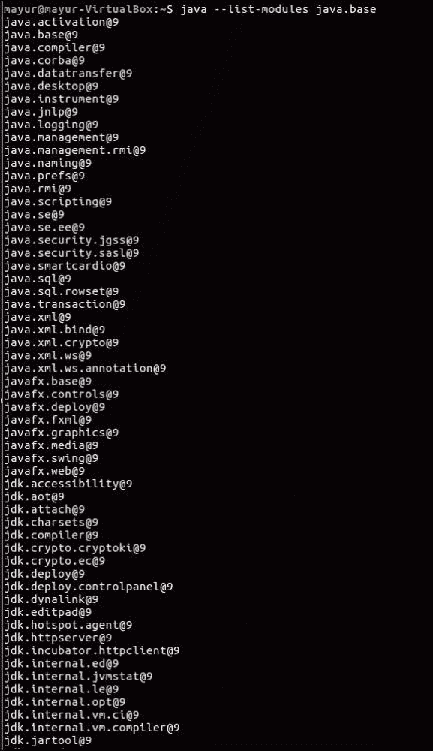
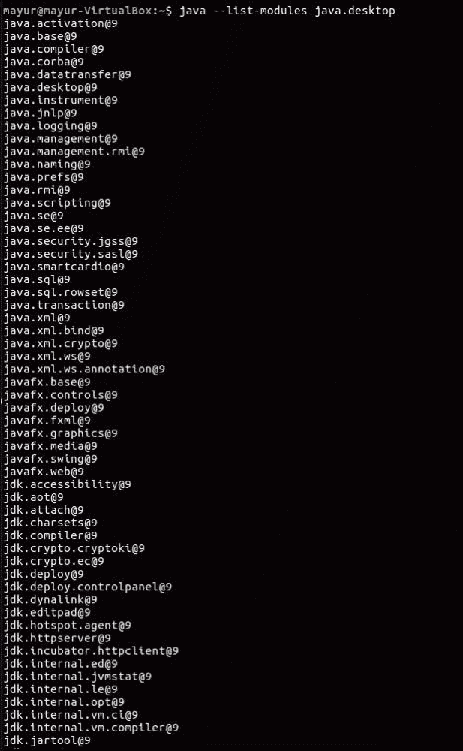
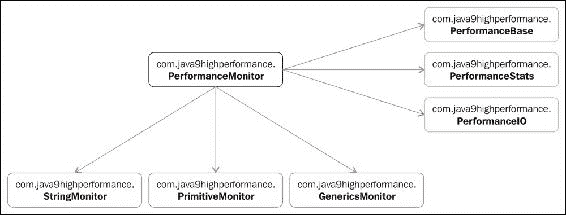

# 第一章。学习 Java 9 的底层性能改进

就在你以为你已经掌握了 Java 8 的 lambda 和所有与性能相关的功能时，Java 9 就出现了。接下来是 Java 9 中的一些功能，可以帮助改进应用程序的性能。这些功能超越了像字符串存储或垃圾收集变化这样的字节级变化，这些变化你几乎无法控制。还有，忽略实现变化，比如用于更快的对象锁定的变化，因为你不需要做任何不同的事情，你会自动获得这些改进。相反，有新的库功能和全新的命令行工具，可以帮助你快速创建应用程序。

在本课程中，我们将涵盖以下主题：

+   模块化开发及其对性能的影响

+   各种与字符串相关的性能改进，包括紧凑字符串和字符串连接的改进

+   并发的进步

+   各种底层编译器改进，如分层归因和**提前编译**（**AOT**）编译

+   安全管理器的改进

+   图形光栅化器的增强

# 介绍 Java 9 的新功能

在本课程中，我们将探讨许多在新环境中运行应用程序时自动获得的性能改进。在内部，字符串的改变也大大减少了在不需要完整的 Unicode 支持的字符字符串时的内存占用。如果你的大部分字符串可以被编码为 ISO-8859-1 或 Latin-1（每个字符 1 个字节），它们将在 Java 9 中存储得更有效。因此，让我们深入研究核心库，并学习底层性能改进。

# 模块化开发及其影响

在软件工程中，模块化是一个重要的概念。从性能和可维护性的角度来看，创建称为**模块**的自主单元非常重要。这些模块可以被绑定在一起以构建完整的系统。模块提供了封装，其中实现对其他模块隐藏。每个模块可以暴露出不同的 API，可以作为连接器，使其他模块可以与之通信。这种设计有助于促进松散耦合，有助于专注于单一功能以使其具有内聚性，并使其能够在隔离环境中进行测试。它还减少了系统复杂性并优化了应用程序开发过程。改进每个模块的性能有助于提高整体应用程序性能。因此，模块化开发是一个非常重要的概念。

我知道你可能会想，等一下，Java 不是已经是模块化的了吗？Java 的面向对象性质不是已经提供了模块化操作吗？嗯，面向对象确实强调了独特性和数据封装。它只建议松散耦合，但并不严格执行。此外，它未能在对象级别提供标识，并且也没有接口的版本控制。现在你可能会问，JAR 文件呢？它们不是模块化的吗？嗯，尽管 JAR 文件在一定程度上提供了模块化，但它们缺乏模块化所需的独特性。它们确实有规定版本号的规定，但很少被使用，而且也隐藏在 JAR 的清单文件中。

因此，我们需要与我们已有的不同的设计。简单来说，我们需要一个模块化系统，其中每个模块可以包含多个包，并且相对于标准的 JAR 文件，提供了强大的封装。

这就是 Java 9 的模块化系统所提供的。除此之外，它还通过明确声明依赖关系来取代了不可靠的类路径机制。这些增强功能提高了整体应用程序的性能，因为开发人员现在可以优化单个自包含单元，而不会影响整体系统。

这也使得应用程序更具可扩展性并提供高度的完整性。

让我们来看一下模块系统的一些基础知识以及它们是如何联系在一起的。首先，您可以运行以下命令来查看模块系统的结构：

```java
$java --list-modules

```


如果您对特定模块感兴趣，您可以简单地在命令的末尾添加模块名称，如下命令所示：

```java
$java --list-modules java.base

```



之前的命令将显示基本模块中包的所有导出。Java base 是系统的核心。

这将显示所有图形用户界面包。这也将显示`requires`，即依赖项：

```java
$java --list-modules java.desktop

```



到目前为止，一切都还好，对吧？现在您可能会想，我已经开发了我的模块，但如何将它们集成在一起呢？让我们来看看。Java 9 的模块化系统配备了一个名为**JLink**的工具。我知道你可以猜到我现在要说什么。你是对的，它链接一组模块并创建一个运行时映像。现在想象一下它可以提供的可能性。您可以使用自己的自定义模块创建自己的可执行系统。我希望对您来说生活将会更有趣！哦，另一方面，您将能够控制执行并删除不必要的依赖项。

让我们看看如何将模块链接在一起。嗯，很简单。只需运行以下命令：

```java
$jlink --module-path $JAVA_HOME/jmods:mlib --add-modules java.desktop --output myawesomeimage

```

这个链接器命令将为您链接所有模块并创建一个运行时映像。您需要提供一个模块路径，然后添加您想要生成图形并给出名称的模块。很简单，不是吗？

现在，让我们检查之前的命令是否正常工作。让我们从图中验证模块：

```java
$myawesomeimage/bin/java --list-modules

```

输出如下所示：


有了这个，现在您将能够在应用程序中分发一个快速运行时。这太棒了，不是吗？现在您可以看到我们是如何从有点庞大的设计转变为一个自包含的连贯设计的。每个模块都包含自己的导出和依赖项，而 JLink 允许您创建自己的运行时。有了这个，我们得到了我们的模块化平台。

请注意，本节的目的只是为了向您介绍模块化系统。还有很多内容可以探索，但这超出了本书的范围。在本书中，我们将专注于性能增强领域。

## 模块的快速介绍

我相信在阅读了模块化平台的介绍之后，您一定会对深入了解模块架构并了解如何开发模块感到兴奋。请稍等兴奋，我很快会带您进入模块的激动人心的世界。

正如您可能已经猜到的那样，每个模块都有一个`name`属性，并且由包组织。每个模块都作为一个自包含的单元，并且可能具有本地代码、配置、命令、资源等。模块的详细信息存储在一个名为`module-info.java`的文件中，该文件位于模块源代码的根目录中。在该文件中，可以定义一个模块，如下所示：

```java
module <name>{
}
```

为了更好地理解它，让我们通过一个例子来看一下。假设我们的模块名是`PerformanceMonitor`。这个模块的目的是监控应用程序的性能。输入连接器将接受方法名称和该方法所需的参数。该方法将从我们的模块中调用，以监视模块的性能。输出连接器将为给定模块提供性能反馈。让我们在性能应用程序的根目录中创建一个`module-info.java`文件，并插入以下部分：

```java
module com.java9highperformance.PerformanceMonitor{
}
```

太棒了！你得到了你的第一个模块声明。但等一下，它还没有做任何事情。别担心，我们只是创建了一个框架。让我们给这个框架加点肉。假设我们的模块需要与我们已经创建并命名为`PerformanceBase`、`StringMonitor`、`PrimitiveMonitor`、`GenericsMonitor`等的其他（了不起的）模块进行通信。换句话说，我们的模块有外部依赖。你可能想知道，我们如何在模块声明中定义这种关系？好吧，耐心点，这就是我们现在要看到的：

```java
module com.java9highperformance.PerformanceMonitor{
    exports com.java9highperformance.StringMonitor;
    exports com.java9highperformance.PrimitiveMonitor;
    exports com.java9highperformance.GenericsMonitor;
    requires com.java9highperformance.PerformanceBase;
    requires com.java9highperformance.PerformanceStat;
    requires com.java9highperformance.PerformanceIO;
}
```

是的，我知道你已经发现了两个子句，即`exports`和`requires`。我相信你很好奇它们的含义以及为什么我们要在这里使用它们。我们首先来谈谈这些子句以及它们在模块声明中的含义：

+   `exports`：当你的模块依赖于另一个模块时，使用这个子句。它表示这个模块只向其他模块公开公共类型，内部包都是不可见的。在我们的例子中，模块`com.java9highperformance.PerformanceMonitor`依赖于`com.java9highperformance.StringMonitor`、`com.java9highperformance.PrimitiveMonitor`和`com.java9highperformance.GenericsMonitor`。这些模块分别导出它们的 API 包`com.java9highperformance.StringMonitor`、`com.java9highperformance.PrimitiveMonitor`和`com.java9highperformance.GenericsMonitor`。

+   `requires`：这个子句表示模块在编译和运行时依赖于声明的模块。在我们的例子中，`com.java9highperformance.PerformanceBase`、`com.java9highperformance.PerformanceStat`和`com.java9highperformance.PerformanceIO`模块都被`com.java9highperformance.PerformanceMonitor`模块所需。然后模块系统会定位所有可观察的模块，递归解析所有依赖关系。这种传递闭包给我们一个模块图，显示了两个依赖模块之间的有向边。

### 注意

**注意**：每个模块都依赖于`java.base`，即使没有明确声明。正如你所知，Java 中的一切都是对象。

现在你知道了模块及其依赖关系。所以，让我们画一个模块表示来更好地理解它。下图显示了各种包依赖于`com.java9highperformance.PerformanceMonitor`。



底部的模块是`exports`模块，右侧的模块是`requires`模块。

现在让我们探讨一个叫做**可读性关系**的概念。可读性关系是两个模块之间的关系，其中一个模块依赖于另一个模块。这种可读性关系是可靠配置的基础。因此在我们的例子中，我们可以说`com.java9highperformance.PerformanceMonitor`读取`com.java9highperformance.PerformanceStat`。

让我们来看看`com.java9highperformance.PerformanceStat`模块的描述文件`module-info.java`：

```java
module com.java9highperformance.PerformanceStat{
    requires transitive java.lang;
}
```

这个模块依赖于`java.lang`模块。让我们详细看看`PerformanceStat`模块：

```java
package com.java9highperformance.PerformanceStat;
import java.lang.*;

public Class StringProcessor{
    public String processString(){...}
}
```

在这种情况下，`com.java9highperformance.PerformanceMonitor`只依赖于`com.java9highperformance.PerformanceStat`，但`com.java9highperformance.PerformanceStat`依赖于`java.lang`。`com.java9highperformance.PerformanceMonitor`模块不知道`com.java9highperformance.PerformanceStat`模块对`java.lang`的依赖。模块系统已经解决了这种问题，它添加了一个叫做**transitive**的新修饰符。如果你看`com.java9highperformance.PerformanceStat`，你会发现它需要 transitive`java.lang`。这意味着任何依赖于`com.java9highperformance.PerformanceStat`的模块都会读取`java.lang`。

请看下面的图表，显示了可读性图：


现在，为了编译`com.java9highperformance.PerformanceMonitor`模块，系统必须能够解析所有依赖关系。这些依赖关系可以从模块路径中找到。这是显而易见的，不是吗？然而，不要将类路径误解为模块路径。它是一个完全不同的品种。它没有包的问题。

# 字符串操作性能

如果你不是编程新手，字符串一定是你迄今为止最好的朋友。在许多情况下，你可能会更喜欢它而不是你的配偶或伴侣。我们都知道，没有字符串你无法生存，事实上，甚至没有一个字符串的使用你都无法完成你的应用程序。好了，关于字符串已经表达得足够多了，我已经感到头晕，就像早期版本的 JVM 一样。开玩笑的，让我们谈谈 Java 9 中发生了什么改变，将帮助你的应用程序表现更好。虽然这是一个内部变化，但作为应用程序开发人员，了解这个概念很重要，这样你就知道在哪里集中精力进行性能改进。

Java 9 已经迈出了改善字符串性能的一步。如果你曾经遇到过 JDK 6 的失败尝试`UseCompressedStrings`，那么你一定在寻找改善字符串性能的方法。由于`UseCompressedStrings`是一个实验性功能，容易出错且设计不太好，它在 JDK 7 中被移除了。不要为此感到难过，我知道这很糟糕，但金色时代终将到来。JEP 团队经历了巨大的痛苦，添加了一项紧凑字符串功能，将减少字符串及其相关类的占用空间。

紧凑字符串将改善字符串的占用空间，并帮助高效使用内存空间。它还保留了所有相关的 Java 和本地接口的兼容性。第二个重要的特性是**Indify String Concatenation**，它将在运行时优化字符串。

在这一部分，我们将仔细研究这两个特性及其对整体应用程序性能的影响。

## 紧凑字符串

在我们谈论这个特性之前，了解为什么我们要关心这个问题是很重要的。让我们深入了解 JVM 的地下世界（或者正如任何星球大战迷所说的，原力的黑暗面）。让我们首先了解 JVM 如何对待我们心爱的字符串，这将帮助我们理解这个新的闪亮的紧凑字符串改进。让我们进入堆的神奇世界。事实上，没有讨论这个神秘世界的性能书籍是不完整的。

### 堆的世界

每次 JVM 启动时，它从底层操作系统获取一些内存。它被分成两个不同的区域，称为**堆空间**和**Permgen**。这些是你的应用程序资源的家园。就像生活中的所有美好事物一样，这个家园的大小是有限的。这个大小在 JVM 初始化时设置；然而，你可以通过指定 JVM 参数`-Xmx`和`-XX:MaxPermSize`来增加或减少这个大小。

堆大小分为两个区域，幼年空间和老年空间。顾名思义，幼年空间是新对象的家园。这听起来很棒，但每个房子都需要清理。因此，JVM 有一个非常高效的清理工具，称为**垃圾收集器**（最有效？嗯...我们暂时不讨论这个）。就像任何高效的清洁工一样，垃圾收集器高效地收集所有未使用的对象并回收内存。当这个幼年空间被新对象填满时，垃圾收集器会负责将那些在幼年空间中生活了足够长时间的对象移动到老年空间。这样，幼年空间总是有更多对象的空间。

同样，如果老年空间被填满，垃圾收集器会回收使用的内存。

## 为什么要压缩字符串？

现在你对堆有了一点了解，让我们来看看`String`类和字符串在堆上是如何表示的。如果你解剖你的应用程序的堆，你会注意到有两个对象，一个是 Java 语言`String`对象，它引用第二个对象`char[]`，实际上处理数据。`char`数据类型是 UTF-16，因此占用 2 个字节。让我们看看以下两种不同语言字符串的例子：

```java
2 byte per char[]
Latin1 String : 1 byte per char[]
```

因此，你可以看到`Latin1 String`只占用 1 个字节，因此我们在这里损失了大约 50%的空间。有机会以更密集的形式表示它并改进占用空间，这最终也将有助于加快垃圾回收的速度。

现在，在对此进行任何更改之前，了解其对现实应用的影响是很重要的。了解应用程序是使用 1 个字节还是 2 个字节的`char[]`字符串是至关重要的。

为了得到这个答案，JPM 团队分析了大量真实数据的堆转储。结果表明，大多数堆转储中有大约 18%到 30%的整个堆被`chars[]`占用，这些来自字符串。此外，大多数字符串由`char[]`的单个字节表示。因此，很明显，如果我们尝试改进单字节字符串的占用空间，将会显著提高许多现实应用的性能。

### 他们做了什么？

经过了许多不同的解决方案，JPM 团队最终决定制定一项在构建过程中压缩字符串的策略。首先，乐观地尝试以 1 个字节压缩，如果不成功，再复制为 2 个字节。还有一些可能的捷径，例如使用像 ISO-8851-1 这样的特殊情况编码器，它总是输出 1 个字节。

这个实现比 JDK 6 的`UseCompressedStrings`实现要好得多，因为它只对少数应用有帮助，因为它在每个实例上都对字符串进行重新打包和解包。因此，性能的提升来自于它现在可以同时处理两种形式。

### 逃逸路线是什么？

尽管这一切听起来很棒，但如果你的应用程序只使用 2 个字节的`char[]`字符串，它可能会影响应用程序的性能。在这种情况下，不使用前面提到的检查，直接将字符串存储为 2 个字节的`char[]`是有意义的。因此，JPM 团队提供了一个关闭开关`--XX: -CompactStrings`，你可以使用它来禁用这个功能。

### 性能提升是什么？

前面的优化影响了堆，因为我们之前看到字符串是在堆中表示的。因此，它影响了应用程序的内存占用。为了评估性能，我们真的需要关注垃圾收集器。我们将稍后探讨垃圾收集的主题，但现在让我们专注于运行时性能。

## Indify 字符串连接

我相信你一定对我们刚刚学到的紧凑字符串功能感到兴奋。现在让我们来看看字符串最常见的用法，即连接。你是否曾经想过当我们尝试连接两个字符串时到底发生了什么？让我们来探索一下。看下面的例子：

```java
public static String getMyAwesomeString(){
    int javaVersion = 9;
    String myAwesomeString = "I love " + "Java " + javaVersion + " high       performance book by Mayur Ramgir";
    return myAwesomeString;
}
```

在前面的例子中，我们试图连接几个带有`int`值的字符串。编译器将获取你的精彩字符串，初始化一个新的`StringBuilder`实例，然后追加所有这些单独的字符串。让我们看看`javac`生成的以下字节码。我使用了**Eclipse**的**ByteCode Outline**插件来可视化这个方法的反汇编字节码。你可以从[`andrei.gmxhome.de/bytecode/index.html`](http://andrei.gmxhome.de/bytecode/index.html)下载它。

```java
// access flags 0x9
public static getMyAwesomeString()Ljava/lang/String;
  L0
  LINENUMBER 10 L0
  BIPUSH 9
  ISTORE 0
  L1
  LINENUMBER 11 L1
  NEW java/lang/StringBuilder
  DUP
  LDC "I love Java "
  INVOKESPECIAL java/lang/StringBuilder.<init> (Ljava/lang/String;)V
  ILOAD 0
  INVOKEVIRTUAL java/lang/StringBuilder.append (I)Ljava/lang/StringBuilder;
  LDC " high performance book by Mayur Ramgir"
  INVOKEVIRTUAL java/lang/StringBuilder.append (Ljava/lang/String;)Ljava/lang/StringBuilder;
  INVOKEVIRTUAL java/lang/StringBuilder.toString ()Ljava/lang/String;
  ASTORE 1
  L2
  LINENUMBER 12 L2
  ALOAD 1
  ARETURN
  L3
  LOCALVARIABLE javaVersion I L1 L3 0
  LOCALVARIABLE myAwesomeString Ljava/lang/String; L2 L3 1
  MAXSTACK = 3
  MAXLOCALS = 2
```

快速说明：我们如何解释这个？

+   `INVOKESTATIC`：这对于调用静态方法很有用

+   `INVOKEVIRTUAL`：这使用动态分派来调用公共和受保护的非静态方法

+   `INVOKEINTERFACE`：这与`INVOKEVIRTUAL`非常相似，只是方法分派是基于接口类型的。

+   `INVOKESPECIAL`：这对于调用构造函数、超类方法和私有方法非常有用

然而，在运行时，由于将`-XX:+-OptimizeStringConcat`包含到 JIT 编译器中，它现在可以识别`StringBuilder`的附加和`toString`链。如果识别到匹配，就会产生低级代码进行最佳处理。计算所有参数的长度，确定最终容量，分配存储空间，复制字符串，并对原始数据进行就地转换。之后，将此数组交给`String`实例而不进行复制。这是一个有利可图的优化。

但是，这在连接方面也有一些缺点。一个例子是，如果连接长字符串或双精度字符串，它将无法正确优化。这是因为编译器首先必须执行`.getChar`，这会增加开销。

此外，如果您将`int`附加到`String`，那么它的工作效果很好；但是，如果您有像`i++`这样的增量运算符，那么它就会出错。其原因是您需要回到表达式的开头并重新执行，因此您实际上是在做两次`++`。现在是 Java 9 中最重要的变化：紧凑字符串的长度拼写为`value.length >> coder`；`C2`无法优化它，因为它不知道 IR。

因此，为了解决编译器优化和运行时支持的问题，我们需要控制字节码，而不能指望`javac`来处理。

我们需要推迟在运行时决定哪些连接可以完成。那么我们是否可以只有`String.concat`方法来完成这一点。好吧，不要急着这样做，因为你如何设计`concat`方法呢。让我们来看看。解决这个问题的一种方法是接受`String`实例的数组：

```java
public String concat(String... n){
    //do the concatenation
}
```

然而，这种方法在处理原始数据时不起作用，因为现在您需要将每个原始数据转换为`String`实例，而且正如我们之前看到的，长字符串和双精度字符串连接将不允许我们进行优化。我知道，我能感觉到你脸上闪现出一丝光芒，就像你想到了解决这个痛苦问题的绝妙主意。你在考虑使用`Object`实例而不是`String`实例，对吗？正如你所知道的，`Object`实例是一个通用实例。让我们来看看你的绝妙主意：

```java
public String concat(Object... n){
    //do the concatenation
}
```

首先，如果您正在使用`Object`实例，那么编译器需要进行自动装箱。此外，您正在传递`varargs`数组，因此它不会表现出最佳性能。那么，我们被困在这里了吗？这意味着我们不能在字符串连接中使用卓越的紧凑字符串特性吗？让我们再想一想；也许我们可以让`javac`处理连接而不是使用`runtime`方法，并为我们提供优化的字节码。这听起来是个好主意。等一下，我知道你也在想同样的事情。如果 JDK 10 进一步优化这一点怎么办？这是否意味着当我升级到新的 JDK 时，我必须重新编译我的代码并再次部署？在某些情况下，这不是问题，但在其他情况下，这是一个大问题。所以，我们又回到了原点。

我们需要一些可以在运行时处理的东西。好吧，这意味着我们需要一些可以动态调用方法的东西。嗯，这让人想起了什么。如果我们回到时光机，回到 JDK 7 时代的黎明，它给了我们`invokedynamic`。我知道你能看到解决方案，我能感觉到你眼中的闪光。是的，你是对的，`invokedynamic`可以帮助我们。如果您不了解`invokedynamic`，让我们花点时间来了解一下。对于那些已经掌握了这个主题的人，你可以跳过它，但我建议你再次阅读一遍。

### 调用动态

`invokedynamic`功能是 Java 历史上最显著的功能。现在，我们不再受限于 JVM 字节码，可以自定义操作的方式。那么`invokedynamic`是什么？简单来说，它是用户可定义的字节码。这种字节码（而不是 JVM）决定了执行和优化策略。它提供了各种方法指针和适配器，这些适配器以方法处理 API 的形式存在。JVM 然后根据字节码中给定的指针进行工作，并使用类似反射的方法指针来优化它。这样，作为开发人员，您可以完全控制代码的执行和优化。

它本质上是用户定义的字节码（称为**字节码+引导**）和方法句柄的混合。我知道你也在想方法句柄--它们是什么，如何使用它们？好的，我听到你了，让我们谈谈方法句柄。

方法句柄提供各种指针，包括字段、数组和方法，用于传递数据并获取结果。借助这一点，您可以进行参数操作和流控制。从 JVM 的角度来看，这些是本机指令，它可以将其优化为字节码。但是，您可以选择以编程方式生成此字节码。

让我们来看看方法句柄，看看它们是如何联系在一起的。主要包的名称是`java.lang.invoke`，其中包括`MethodHandle`、`MethodType`和`MethodHandles`。`MethodHandle`是将用于调用函数的指针。`MethodType`是来自方法的一组参数和返回值的表示。实用类`MethodHandles`将充当指向一个方法的指针，该方法将获得`MethodHandle`的实例并映射参数。

我们不会深入探讨这一部分，因为目的只是让您了解`invokedynamic`功能是什么以及它是如何工作的，这样您就能理解字符串连接的解决方案。所以，我们回到了我们对字符串连接的讨论。我知道，你正在享受`invokedynamic`的讨论，但我想我已经给了你足够的见解，让你理解 Indify 字符串连接的核心思想。

让我们回到我们正在寻找解决方案来连接我们的精简字符串的部分。为了连接这些精简字符串，我们需要注意方法的类型和数量以及这就是`invokedynamic`给我们的。

所以让我们为`concat`使用`invokedynamic`。好吧，朋友，不要那么快。这种方法存在一个根本问题。我们不能只是使用`invokedynamic`来解决这个问题。为什么？因为存在循环引用。`concat`函数需要`java.lang.invoke`，而`java.lang.invoke`使用`concat`。这种情况会继续下去，最终会导致`StackOverflowError`。

看一下以下代码：

```java
String concat(int i, long l, String s){
    return s + i + l
}
```

所以如果我们在这里使用`invokedynamic`，`invokedynamic`调用会是这样的：

```java
InvokeDynamic #0: makeConcat(String, int, long)
```

有必要打破循环引用。然而，在当前的 JDK 实现中，您无法控制`java.invoke`从完整的 JDK 库中调用什么。此外，从`java.invoke`中删除完整的 JDK 库引用会产生严重的副作用。我们只需要`java.base`模块来进行 Indify 字符串连接，如果我们能找到一种方法只调用`java.base`模块，那么它将显著提高性能并避免不愉快的异常。我知道你在想什么。我们刚刚学习了 Java 9 的最酷的新功能，**Project Jigsaw**。它提供了模块化的源代码，现在我们只能接受`java.base`模块。这解决了我们在连接两个字符串、原语等方面所面临的最大问题。

经过几种不同的策略，Java 性能管理团队已经确定了以下策略：

1.  对所有引用参数调用`toString()`方法。

1.  调用`tolength()`方法或者由于所有底层方法都是公开的，只需在每个参数上调用`T.stringSize(T t)`。

1.  找出编码器并为所有引用参数调用`coder()`。

1.  分配`byte[]`存储，然后复制所有参数。然后，在原地转换原始数据。

1.  通过将数组传递给`String`的私有构造函数来调用。

有了这个，我们能够在同一代码中获得优化的字符串连接，而不是在`C2 IR`中。这种策略使我们的性能提高了 2.9 倍，垃圾减少了 6.4 倍。

# 将 Interned Strings 存储在 CDS 存档中

这个功能的主要目标是减少每个 JVM 进程中创建新字符串实例所造成的内存占用。在任何 JVM 进程中加载的所有类都可以通过**类数据共享**（**CDS**）存档与其他 JVM 进程共享。

哦，我没告诉你 CDS 的事。我认为花点时间了解 CDS 是很重要的，这样你就能理解底层的性能改进。

许多时候，特别是小型应用在启动操作上花费相对较长的时间。为了减少这种启动时间，引入了一个叫做 CDS 的概念。CDS 使得可以在 JRE 安装期间将从系统 JAR 文件加载的一组类共享到私有内部表示中。这对于任何进一步的 JVM 调用都很有帮助，因为它们可以利用这些加载类的共享存档中的表示，而不是再次加载这些类。与多个 JVM 进程共享与这些类相关的元数据。

CDS 在常量池中以 UTF-8 形式存储字符串。当这些加载的类中的一个类开始初始化过程时，这些 UTF-8 字符串会按需转换为`String`对象。在这种结构中，每个受限字符串中的每个字符在`String`对象中占据 2 个字节，在 UTF-8 中占据 1 个字节到 3 个字节，这实际上浪费了内存。由于这些字符串是动态创建的，不同的 JVM 进程无法共享这些字符串。

共享字符串需要一个名为**固定区域**的功能来利用垃圾收集器。由于唯一支持固定的 HotSpot 垃圾收集器是 G1；它只能与 G1 垃圾收集器一起使用。

# 并发性能

多线程是一个非常流行的概念。它允许程序同时运行多个任务。这些多线程程序可能有多个单位可以同时运行。每个单位可以处理不同的任务，保持可用资源的最佳利用。这可以通过多个线程并行运行来管理。

Java 9 改进了争用锁定。也许你想知道什么是争用锁定。让我们来探讨一下。每个对象都有一个监视器，一次只能被一个线程拥有。监视器是并发的基本构建块。为了让一个线程执行在对象上标记为同步的代码块或对象声明的同步方法，它必须拥有这个对象的监视器。由于有多个线程试图访问所述监视器，JVM 需要协调这个过程，并且一次只允许一个线程。这意味着其余的线程进入等待状态。然后这个监视器被称为争用。由于这个规定，程序在等待状态中浪费了时间。

此外，**Java 虚拟机**（**JVM**）还要做一些工作来协调锁争用。此外，它还必须管理线程，因此一旦现有线程完成执行，它就可以允许新线程进入。这肯定会增加开销，并对性能产生不利影响。Java 9 已经采取了一些措施来改进这一领域。该规定完善了 JVM 的协调，最终将导致高度竞争代码的性能改进。

以下基准测试可以用来检查争用 Java 对象监视器的性能改进：

+   `CallTimerGrid`（这更像是一个压力测试而不是基准测试）

+   `Dacapo-bach`（之前的 dacapo2009）

+   _ avrora

+   _ batik

+   _ fop

+   _ h2

+   _ luindex

+   _ lusearch

+   _ pmd

+   _ sunflow

+   _ tomcat

+   _ tradebeans

+   _ tradesoap

+   _ xalan

+   DerbyContentionModelCounted

+   HighContentionSimulator

+   LockLoops-JSR166-Doug-Sept2009（早期的 LockLoops）

+   PointBase

+   SPECjbb2013-critical（早期的 specjbb2005）

+   SPECjbb2013-max

+   specjvm2008

+   volano29（早期的 volano2509）

# 编译器改进

已经做出了一些努力来改进编译器的性能。在本节中，我们将重点关注编译器方面的改进。

## Tiered Attribution

提供编译器改进的首要变化与**Tiered Attribution**（**TA**）有关。这个改变更多地涉及到 lambda 表达式。目前，多态表达式的类型检查是通过多次对同一树针对不同目标进行类型检查来完成的。这个过程被称为**Speculative Attribution**（**SA**），它使得可以使用不同的重载解析目标来检查 lambda 表达式。

尽管这种类型检查方式是一种强大的技术，但它对性能有显著的不利影响。例如，采用这种方法，*n*个重载候选者将在每个重载阶段对相同的参数表达式进行检查，严格、宽松和可变参数分别进行一次，总共*n*3 次。除此之外，还有一个最终的检查阶段。当 lambda 返回一个多态方法调用结果时，会导致属性调用的组合爆炸，这会造成巨大的性能问题。因此，我们确实需要一种不同的多态表达式类型检查方法。

核心思想是确保方法调用为每个多态参数表达式创建自下而上的结构类型，其中包含每个细节，这将在执行重载解析适用性检查之前执行重载解析时需要。

因此，总的来说，性能改进能够通过减少尝试的总次数来实现对给定表达式的属性。

## 提前编译

用于编译器改进的第二个显著变化是提前编译。如果你对这个术语不熟悉，让我们看看 AOT 是什么。你可能知道，任何语言中的程序都需要一个运行时环境来执行。Java 也有自己的运行时环境，被称为**Java 虚拟机**（**JVM**）。我们大多数人使用的典型运行时是一个字节码解释器，也是 JIT 编译器。这个运行时被称为**HotSpot JVM**。

这个 HotSpot JVM 以通过 JIT 编译和自适应优化来提高性能而闻名。到目前为止一切都很好。然而，这并不适用于每个单独的应用程序。如果你有一个非常轻量的程序，比如一个单独的方法调用，那该怎么办呢？在这种情况下，JIT 编译将帮助不大。你需要一些能够更快加载的东西。这就是 AOT 将会帮助你的地方。与 JIT 相反，AOT 不是编译成字节码，而是编译成本地机器代码。运行时然后使用这个本地机器代码来管理对新对象的调用，将其分配到 malloc 中，以及对文件访问的系统调用。这可以提高性能。

# 安全管理器改进

好的，让我们谈谈安全性。如果你不是那些更关心在发布中推出更多功能而不是应用程序安全的人，那么你的表情可能会像**嗯！那是什么？**如果你是其中之一，那么让我们首先了解安全性的重要性，并找到一种方法来考虑在应用程序开发任务中。在今天由 SaaS 主导的世界中，一切都暴露在外部世界。一个决心的个人（委婉地说，一个**恶意黑客**）可以访问你的应用程序，并利用你可能由于疏忽而引入的安全漏洞。我很乐意深入讨论应用程序安全，因为这是我非常感兴趣的另一个领域。然而，应用程序安全超出了本书的范围。我们在这里谈论它的原因是 JPM 团队已经采取了改进现有安全管理器的举措。因此，在谈论安全管理器之前，首先了解安全性的重要性是很重要的。

希望这一行描述可能已经引起了您对安全编程的兴趣。然而，我理解有时候您可能没有足够的时间来实现完整的安全编程模型，因为时间安排很紧。因此，让我们找到一种可以适应您紧张时间表的方法。让我们思考一分钟；有没有办法自动化安全？我们是否可以有一种方法来创建一个蓝图，并要求我们的程序保持在边界内？好吧，你很幸运，Java 确实有一个名为**安全管理器**的功能。它只是一个为应用程序定义安全策略的策略管理器。听起来很令人兴奋，不是吗？但这个策略是什么样的？它包含什么？这两个问题都是合理的提问。这个安全策略基本上规定了具有危险或敏感性质的行为。如果您的应用程序不符合这个策略，那么安全管理器会抛出`SecurityException`。另一方面，您可以让您的应用程序调用这个安全管理器来了解允许的操作。现在，让我们详细了解安全管理器。

在 Web 小程序的情况下，浏览器提供了安全管理器，或者 Java Web Start 插件运行此策略。在许多情况下，除了 Web 小程序之外的应用程序都没有安全管理器，除非这些应用程序实现了一个。毫无疑问地说，如果没有安全管理器和没有附加安全策略，应用程序将无限制地运行。

现在我们对安全管理器有了一些了解，让我们来看看这一领域的性能改进。根据 Java 团队的说法，安装了安全管理器的应用程序可能会导致性能下降 10%至 15%。然而，虽然不可能消除所有性能瓶颈，但缩小这一差距可以有助于改善安全性和性能。

Java 9 团队研究了一些优化措施，包括执行安全策略和评估权限，这将有助于改善使用安全管理器的整体性能。在性能测试阶段，突出显示了即使权限类是线程安全的，它们也会显示为 HotSpot。已经进行了许多改进，以减少线程争用并提高吞吐量。

改进了`java.security.CodeSource`的`hashcode`方法，以使用代码源 URL 的字符串形式，以避免潜在昂贵的 DNS 查找。此外，`java.lang.SecurityManager`的`checkPackageAccess`方法，其中包含包检查算法，已经得到改进。

安全管理器改进中的一些其他显着变化如下：

+   第一个显著的变化是，使用`ConcurrentHashMap`代替`Collections.synchronizedMap`有助于提高`Policy.implie`方法的吞吐量。看看下面的图表，摘自 OpenJDK 网站，突出显示了使用`ConcurrentHashMap`时吞吐量的显著增加：

+   除此之外，在`java.security.SecureClassLoader`中用于维护`CodeSource`内部集合的`HashMap`已被`ConcurrentHashMap`替换。

+   还有一些其他小的改进，比如通过从`getPermissions`方法（`CodeSource`）中删除兼容性代码来提高吞吐量，该方法在身份上进行同步。

+   使用`ConcurrentHashMap`代替在权限检查代码中被同步块包围的`HashMap`可以显著提高线程性能，从而实现了性能的显著增加。

# 图形光栅化器

如果您对 Java 2D 和使用 OpenJDK 感兴趣，您将会欣赏 Java 9 团队所做的努力。Java 9 主要与图形光栅化器有关，这是当前 JDK 的一部分。OpenJDK 使用 Pisces，而 Oracle JDK 使用 Ductus。Oracle 的闭源 Ductus 光栅化器的性能优于 OpenJDK 的 Pisces。

这些图形光栅化器对于抗锯齿渲染非常有用，除了字体。因此，对于图形密集型应用程序，这种光栅化器的性能非常重要。然而，Pisces 在许多方面都表现不佳，其性能问题非常明显。因此，团队决定将其替换为一个名为 Marlin Graphics Renderer 的不同光栅化器。

Marlin 是用 Java 开发的，最重要的是，它是 Pisces 光栅化器的分支。对其进行了各种测试，结果非常令人期待。它的性能始终优于 Pisces。它展示了多线程可伸缩性，甚至在单线程应用程序中也优于闭源的 Ductus 光栅化器。

# 总结

在这节课中，我们已经看到了一些令人兴奋的功能，可以在不费吹灰之力的情况下提高您的应用程序性能。

在下一课中，我们将学习 JShell 和**提前**（**AOT**）编译器。我们还将学习**读取-求值-打印循环**（**REPL**）工具。

# 评估

1.  JLink 是 Java 9 模块系统的 ___________。

1.  两个模块之间的关系是什么，其中一个模块依赖于另一个模块？

1.  可读性关系

1.  可操作性关系

1.  模块化关系

1.  实体关系

1.  判断真假：每次 JVM 启动时，它都会从底层操作系统获取一些内存。

1.  以下哪项执行一些工作来编排锁争用？

1.  固定区域

1.  可读性关系

1.  Java 虚拟机

1.  类数据共享

1.  以下哪项使得可以使用不同的过载解析目标来检查 lambda 表达式？

1.  分层归因

1.  HotSpot JVM

1.  推测性归因

1.  Permgen
