# Java 中的第一步编程

欢迎阅读《初学者 Java 自动化测试实战》。这是您在互联网上找到的唯一一本教授每个需要的主题，以成为强大的 Java 自动化测试人员的书籍。它包含简单的教学和简单的技术，以有效地处理与 Java 相关的自动化/项目。考虑到我们将详细解释每个核心 Java 主题，这将真正帮助我们开发和评估我们自己的 Java 自动化项目。

所有核心 Java 概念都将从零开始解释。我们不假设读者具有任何先决知识，因此我们认为所有读者都来自非编码背景，并且我们将教授每个读者，并在实时中使用的示例中支持他们。因此，我们不会仅限于理论。

在市场上查找课程时，你应该尝试学习一个新概念。你只会看到三行定义，然后是例子；就是这样。但在这里，我们将了解为什么、何时以及在何处我们在 Java 中使用**面向对象编程系统**（**OOPS**）概念。还将提供适当的编程示例，展示实时使用中的特定 OOPS 概念。这样，我们的书将通过实时项目进行驱动；这完全是关于实际学习。当我们开始使用 Java 集合时，这将发挥作用，比如核心 Java，这是我们书中的主要概念之一，因为你肯定需要从基础开始，并在工作场所开发自动化框架。此外，由于 Java 集合是核心部分之一，在整本书中，我们将非常注意为我们讨论的每个 Java 集合提供所有必要的实际场景。

我们将研究棘手的 Java 程序，查看输出、质数、斐波那契数列和金字塔。我们将按降序排列输出，查看数组矩阵，并打印最大列数。本书将为您提供详细的策略和技巧，这些将帮助您在处理这些程序时需要使用的逻辑。这将帮助您超越界限，获得编写困难 Java 程序所需的逻辑。

本书讨论的程序源自许多公司面试中常见的问题。您将获得有关这些问题的帮助，包括详细的解决方案和处理该逻辑的方法。因此，本书主要侧重于核心 Java。我们不涉及 Swing 和按钮，这在本书中超出了 Java 学习的范围。

在本书中，我们将学习核心 Java、集合和其他概念，如循环、类和数组。这些对于您开始和开发 Java 项目已经足够了。无论您被安排在哪个领域，从本书中获得的知识将帮助您立即开始测试自动化项目。

本章将涵盖以下概念：

+   Java 及其安装简介

+   使用 Java 编辑工具

+   在 Java 中编写您的第一个可执行程序

# Java 及其安装简介

当我们谈论 Java 时，首先想到的是它是平台无关的。这个特性使 Java 成为市场上炙手可热的编程工具。那么平台无关到底意味着什么呢？

我们编写的代码与环境无关；无论是 Windows、Unix、Linux 还是 Solaris。基本上，当我们编写一个 Java 程序时，Java 编译器将程序转换为字节码。当我们运行 Java 代码时，Java 编译器将整个编程代码转换为字节码。例如，我们正在使用 Windows 机器。当我们运行程序时，Java 编译器运行并为我们创建字节码，这个字节码可以在任何其他平台上执行，比如 Linux、macOS 和 Unix。这意味着我们在 Windows 上开发了一个字节码，而这个字节码可以在任何其他平台上运行。这就是我们所说的平台无关性。

这是 Java 编程中我们拥有的一个非常酷的功能。每当你让别人下载 Java 时，你会被问到的第一个问题是，是 JDK 还是 JRE？人们往往会在这两个术语之间感到困惑。在我们开始下载和配置 Java 之前，我们需要对此有清楚的认识。让我们来看看 JRE 和 JDK：

+   **JRE**代表**Java 运行环境**：它负责运行我们的 Java 程序。如果我们的目标只是运行一个普通的 Java 核心代码，那么 JRE 就足够了。

+   **JDK**代表**Java 开发工具包**：它用于调试我们的 Java 代码，或者如果我们想要 Java 文档或类似的东西。

JDK 包含 JRE、Java 文档和调试工具，以及其他很酷的东西。它是一个完整的 Java 工具包，我们将从中获得所有的组件。所以我们下载什么取决于我们，但我建议我们只下载 JDK 以确保安全。如果我们只是想练习和运行我们的程序，JRE 也足够了，但让我们坚持使用 JDK。

现在让我们回去从互联网上下载 Java 并尝试在我们的机器上配置它。要下载 Java，导航到以下页面：[`java.com/en/download/`](https://java.com/en/download/)。当你点击免费 Java 下载按钮时，如下面的截图所示，JRE 版本将被下载：


但我们打算在我们的程序中使用 JDK，所以导航到以下网站：[`www.oracle.com/technetwork/java/javase/downloads/index.html`](https://www.oracle.com/technetwork/java/javase/downloads/index.html)。在这里，有多个版本的 JDK。目前市场上最新的版本是 Java SE 10.0.2。点击下载，如下面的截图所示，以便所有组件都被下载并配置在我们的机器上：

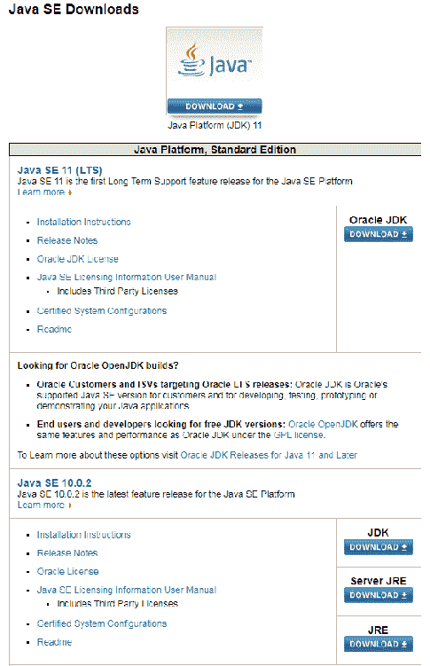

配置需要一些时间，因为有相当多的步骤。不断点击下一步，以便 Java 能够成功配置在我们的机器上。要检查 Java 是否安装在我们的机器上，导航到`C:\Program Files`。如果我们在那里找到名为`Java`的文件夹，这意味着 Java 已经成功安装在我们的机器上。`Java`文件夹如下截图所示：

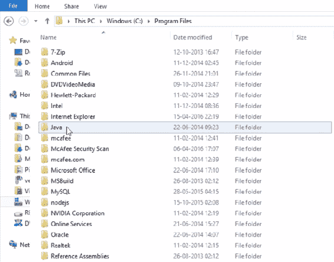

这里需要记住的一个重要点是，如果我们是 64 位的，那么我们只会在`Program Files`中看到这个`Java`文件夹。如果我们的机器是 32 位的，那么我们需要回到`Program Files (x86)`去获取`Java`文件夹。

我们可以通过进入控制面板并点击系统来检查我们的系统类型。我正在使用的系统是 64 位的，如下面的截图所示：


成功下载后，我们进入`Java`文件夹，观察到 JDK 和 JRE 都已经下载。我们进入 JDK 文件夹并复制整个文件路径。我们这样做是因为我们需要设置环境变量。设置环境变量意味着我们让系统知道 Java 文件夹的位置。

在我们的情况下，Java 文件夹位于 `C:/Program Files/Java/JDK`，但 Windows 不知道确切的位置。因此，为了让我们的系统知道这个位置，我们将把 JDK 主目录路径放在系统变量中。这将帮助我们的机器知道 Java 文件夹的位置，这样每当我们运行程序时，它将识别确切的 JDK 版本并运行我们的程序。要在系统环境变量中更新这个，我们复制整个 JDK 路径。转到控制面板，选择系统和安全，选择系统，然后点击高级系统设置。在高级系统设置中，选择环境变量。当我们点击环境变量时，会出现以下窗口：

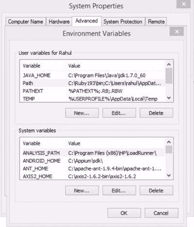

当我们在 Rahul 部分的用户变量中点击“新建”，我们将收到一个提示添加新的用户变量。我们将名称设置为 `JAVA_HOME`，将 JDK 路径粘贴到变量值文本框中，然后点击“确定”，如下屏幕截图所示：


这就是我们让系统知道`Java`文件夹的确切位置的方法。我们还需要更新另一个变量。为此，我们返回到 JDK 文件夹并进入`bin`文件夹。我们会看到多个`.exe`文件，如下屏幕截图所示：

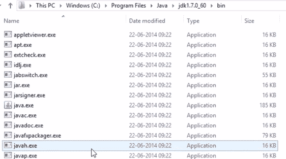

我们复制`bin`文件夹的位置路径，然后返回到我们的系统属性窗口。在系统变量中，我们会看到一个名为`Path`的变量。双击它将显示一个提示以编辑系统变量，如下屏幕截图所示：

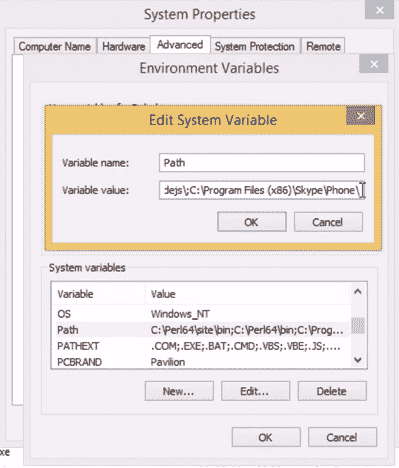

在变量值中，我们到末尾，添加一个分号，并粘贴`bin`文件夹路径。这意味着我们将`Path`变量设置为`bin`文件夹。我们还创建一个名为`JAVA_HOME`的新变量，指向`Java`文件夹。在开始使用 Java 之前，我们需要设置这两个变量。一旦我们设置了这两个变量并点击“确定”，我们将成功设置环境变量。

如果我们想要交叉检查环境变量是否正确配置，我们使用命令提示符。在命令提示符中，我们输入 `java -version` 并按 *Enter*。如果我们得到如下屏幕截图所示的输出，这意味着 Java 已成功配置在我们的系统上：

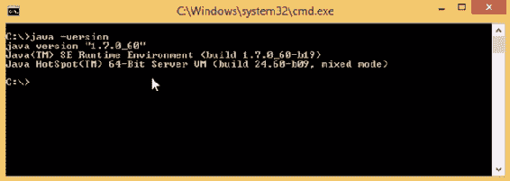

如果我们在添加变量之前运行命令，我们会发现 Java 无法识别。只有在设置系统环境变量之后，我们才能成功配置 Java。

前面的说明已经照顾到了从我们这边安装和配置系统。接下来，我们将尝试下载 Eclipse，这是一个 Java 编辑工具，我们可以在其中编写、运行和调试我们的代码。在下载 Eclipse 之前，我们必须确保 Java 在我们的机器上正确配置。如果安装或配置步骤中的任何一个没有正确完成，Eclipse 将无法正确安装。

# 使用 Java 编辑工具

在这里，我们将看一下我们将用来编写 Java 代码的编辑工具。市场上有许多工具可以作为新的 Java 编辑器，但我个人更喜欢使用 Eclipse。它带有许多内置功能和语法补充。随着我们的进展，我们将看到 Eclipse 的其他优势。有些优势无法在理论上讨论，所以一旦我们进展并开始实际编码，我们将了解它如何提示我们编写正确的语法。因此，在整本书的过程中，我们将在 Eclipse IDE 编辑器中编写所有的 Java 代码。

首先，我们下载 Eclipse IDE 编辑器并查看其提供的界面。以下链接将带我们到 Eclipse 的官方网站：[`www.eclipse.org/downloads/`](https://www.eclipse.org/downloads/)。该网站将看起来像以下屏幕截图所示：


当我们点击下载 64 位按钮下面的下载包时，它会带我们到下面的页面：


我们将使用 Eclipse IDE for Java EE Developers。我们可以根据我们正在使用的系统选择 32 位或 64 位。我们已经知道如何检查我们的系统是 32 位还是 64 位，方法是访问控制面板并按照安装阶段给出的说明进行操作。

我们需要确保的一件重要的事情是，我们的 Java 版本与我们下载的 IDE 兼容。如果我们的系统是 32 位并且我们下载了 64 位的 Java，那么 Eclipse 将无法打开。因此，请确保我们的系统、Java 和 Eclipse 版本都在同一条线上。

文件将以 ZIP 文件形式下载，我们可以解压它。下面的屏幕截图显示了`eclipse`文件夹中将存在的文件夹：

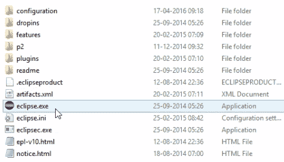

如果我们双击`eclipse.exe`文件，Eclipse UI 将会打开。

如果我们想要编写我们的 Java 代码，我们需要创建一个 Java 项目。右键单击左侧的白色窗格窗口，然后点击新建|项目。这在下面的屏幕截图中显示：


我们会收到提示，告诉 Eclipse 我们正在进行什么样的项目，如下面的屏幕截图所示：

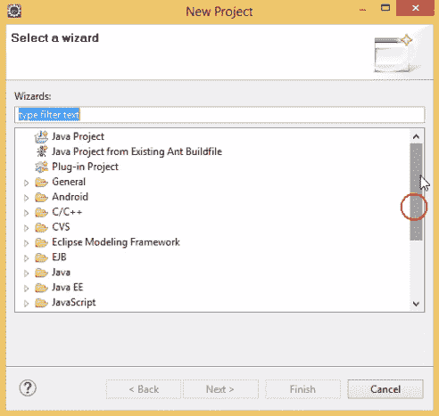

正如我们所看到的，有许多不同的框架可用，比如 Java 项目、C/C++和 Android，但我们只对 Java 项目感兴趣，所以我们选择 Java 项目，然后点击下一步。我们将得到一个新的 Java 项目窗口，在这里我们将填写我们新项目的所有信息，如下面的屏幕截图所示：


我们为我们将要创建的 Java 项目选择一个项目名称。我们将命名我们的第一个项目为`coreJavaTraining`。点击下一步，然后完成。我们将收到一个提示，询问我们是否要打开关联的透视？选择否：

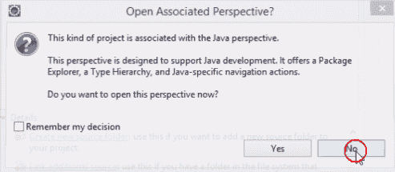

这将成功创建`coreJavaTraining`。在项目中，会自动创建一个源文件夹。这意味着我们需要在这个源文件夹中编写我们的类。什么是类？基本上，所有的 Java 代码都是写在一个类中的。当我们在记事本中写 Java 时，我们打开记事本，写入 Java 代码，并将特定的记事本文件保存为`.java`扩展名。但是在 Eclipse 中，所有这些工作都是由这个工具自己完成的。因此，我们只需要创建一个类，这将给我们一个合适的模板。我们右键单击源（`src`）文件，然后点击新建|类。我们将得到一个 Java 类提示，我们将在其中输入类名。我们将命名这个类为`Firstclass`，并确保我们选择了`public static void main (String[] args)`的复选框；我们将在后面讨论这个的重要性。最后，我们点击完成。这在下面的屏幕截图中显示：


我们可以看到内置的层次结构已经为我们创建好了，因为 Eclipse 创建了一个外部模板。我们可以在编辑器中看到一个类和`public static void main`已经存在。所有这些都是由 Eclipse 工具创建的。如果我们在记事本上正常写作而不使用任何工具，我们需要创建模板。但是在 Eclipse 中，我们只需要给出类名。我们将要输入的代码将被封装在类中；也就是说，在类的括号内。我们在创建文件时使用的任何名称都将成为类名。

所有代码的执行都将放在 `public static void main` 中，因为每当我们运行此文件时，Java 控制将直接转到此块。它不会触及任何在 `public static void main` 之外编写的代码。简而言之，我们在 `public static void main` 块之外编写代码，但最终我们需要在块内调用该代码。这是因为只有 `main` 块负责执行我们的 Java 代码。这就是为什么我们写 `public static void main`。随着我们在本书中的进一步学习，我们将了解 `public` 和 `void` 关键字，因为现在深入了解这些关键字还为时过早。我们可以在以下截图中看到模板：


Eclipse 工具创建的类

# 在 Java 中编写您的第一个可执行程序

让我们从这一节开始进行基本编码。如果我们想要在输出中打印一些内容，Java 中有一个命令叫做 `System.out.println()`。这个命令将在控制台中打印输出。假设我们想要打印 `hello world`，当我们运行以下代码时，`hello world` 将在我们的输出控制台中打印出来：

```java
Firstclass.java
```

所以让我们运行代码。有两种方法来运行代码：

+   在项目资源管理器中右键单击文件名，点击“作为”并选择“Java 应用程序”。

+   或者，我们可以点击工具栏中给出的运行图标，然后在保存和启动窗口上点击 OK。图标看起来像这样：


这将运行我们的代码并打印输出。以下截图显示了我们编辑器中的 `hello world` 消息：


根据代码显示输出 `hello world`

简而言之，`System.out.println()` 用于在控制台中打印输出。我们将在几乎所有的实际示例中使用它来演示实际示例。如果我们从语句中删除 `ln`，它将不会在下一行打印输出。

让我们尝试打印一个语句，它将在同一行上显示两个打印命令的输出。在这里，我们在 `hello world` 语句之前添加了一个 `System.out.println("hi")` 语句。如果我们运行代码，输出将如下所示：

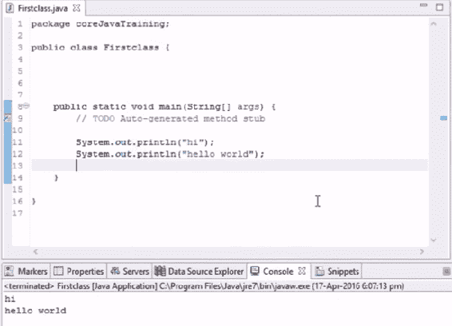

输出显示在两行上

观察一下 `hi` 是如何显示在一行上，然后 `hello world` 显示在下一行上的。在这里，`ln` 将输出显示在下一行。如果我们从这两个语句中删除 `ln` 并运行代码，消息将显示如下：

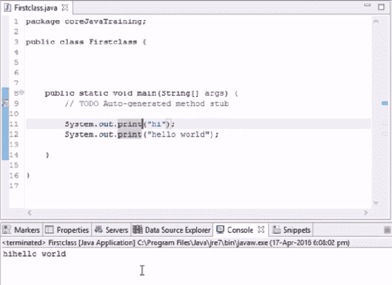

输出显示在同一行上

我们看到，`hihello world` 打印在同一行上。

如果我们编写代码，然后想部分检查输出，我们不需要删除代码行；我们只需要将其注释掉。我们可以通过在开头简单地放置双斜杠 (`//`) 来将其注释掉，这样 Java 将不会选择这行。这在以下截图中显示：

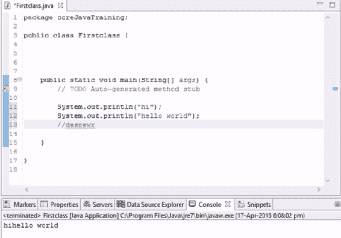

使用双斜杠进行注释

如果您删除斜杠并且语句只是一些随机单词，那么它将抛出错误。我们将看到一个下划线为红色的代码。这意味着在带有交叉标记的行上有一个错误。这在以下截图中显示：

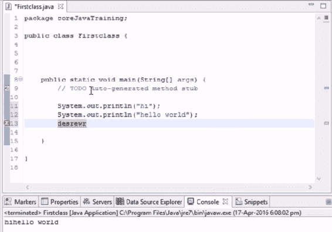

错误在行号旁边标有一个交叉标记

再次添加反斜杠以注释掉错误。

请记住，这里我们只在 `main` 块中编写我们的实际代码。如果我们想要打印一个整数怎么办？

假设我们想要打印数字`4`。要打印它，我们首先需要将它存储在一个变量中，然后我们将打印这个变量。因此，当我们打印变量时，表示该变量的值将自动打印出来。对于这个例子，我们选择数字`4`，并将数字赋给一个名为`a`的变量。问题在于`a`不知道分配给它的数据类型是什么。因此，我们必须明确说明`a`是一个整数。如果我们不说明`a`是一个整数，它就会报错。

简而言之，我们首先创建一个名为`a`的变量，它只充当整数，然后将整数值`4`放入其中。下面的截图说明了我们所讨论的示例：


值 4 被赋给变量 a

因此，对于这种类型的代码，我们可以在外部输入，但如果要打印它，我们将不得不在主块中输入它。在这个例子中，我们想要打印`a`的值，所以我们添加了另一个`System.out.println(a)`语句。编辑器将为`print`语句中的变量`a`抛出一个错误。要知道错误是什么，我们将鼠标悬停在错误上，弹出窗口显示错误和可能的修复，如下面的截图所示：

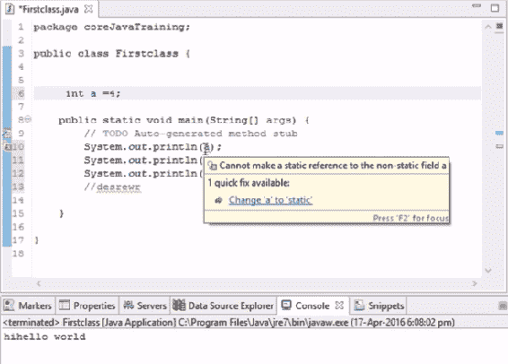

当鼠标悬停在错误上时，会显示错误详细信息

在错误详细信息中将有一个点击选项。这将通过添加所需的内容自动解决错误。这是编辑器具有的一个令人惊讶的功能，随着我们进入更复杂的示例，它非常有帮助。

在我们的示例中，当我们点击错误详细信息弹出窗口中的`将'a'更改为'static'`时，`static`被添加到变量`a`中，我们能够运行代码。运行代码后，控制台将如下所示：

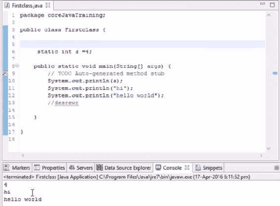

根据代码显示变量 a 的值

我们将在后面的章节中详细了解`static`到底是什么

# 总结

在本章中，我们简要介绍了 Java。然后安装和配置了与 Java 一起工作所需的各种工具。接下来，我们看了一下我们将使用的编辑器来编写我们自己的 Java 代码。

最后，我们执行了我们的第一个示例，看到了编辑器的工作原理以及它如何处理错误。

在下一章中，我们将学习一些基本概念，如字符串、变量和方法，以及它们在代码中的不同之处。
