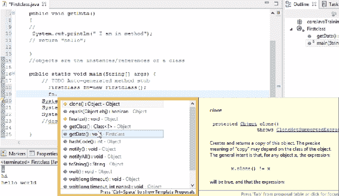

# 理解 Java 中的类、对象及其用法

在上一章中，我们简要介绍了 Java 以及如何安装我们将在其中输入代码的编辑器。我们还在编辑器上编写并执行了我们的第一行代码。

在本章中，我们将更深入地了解一些基本概念，比如字符串和变量，以及它们之间的区别。我们还将看到方法是什么，以及它们如何与不同的代码一起使用。我们将讨论为什么对象在我们的代码中很重要，以及我们如何可以实现它们。

在本章中，我们将涵盖以下主题：

+   字符串和变量之间的区别

+   使用方法

+   在 Java 中类和对象的重要性

# 字符串和变量之间的区别

在第一章中，*Java 中的第一步编程*，我们打印了一个字符串和一个变量。如果我们仔细观察，当我们打印一个变量时，我们不使用双引号，但当我们打印一个字符串时，我们使用它们。这是因为值已经存在于变量中，因此我们不需要使用任何双引号。如果我们使用它们，Java 会将其视为字符串，并且输出将如下例中的字母`a`打印出来。如果我们运行这个并观察输出，将会打印出字母`a`，如下面的截图所示：


输出显示代码中 a 的值

如果我们不使用双引号，Java 会检查是否有任何变量定义为这个字母。如果有，它会打印出该变量中的值。如果没有定义变量，则会出现错误。如果我们注释掉变量声明，我们会看到一个错误。将鼠标悬停在变量上，会得到一个提示，提示说创建一个本地变量'a'，或者我们可以通过添加双引号来使用它：


快速修复下拉菜单，提供纠正代码错误的建议

简而言之，如果我们只是使用双引号，那么变量将被视为字符串，但如果我们不使用双引号，我们必须在某处声明变量。这就是打印字符串和打印变量之间的区别。

# 使用方法

基本上，方法是我们 Java 类中的代码块。让我们在这里写一个代码块作为示例，并观察打开和关闭的括号放在哪里。以下示例显示了一个完整的代码块：

```java
public void getData()
{
    static int a=4;
}
```

在这段代码中，我们将代码块命名为`getData()`，`void`是这个方法的返回类型。

如果我们期望从方法中返回一个数字，并且这个数字是一个整数，那么我们必须在`void`的位置写`integer`。对于字符串也是一样；如果我们计划从`getData()`方法中返回一个字符串，那么我们必须将其声明为`string`。如果我们不返回任何东西，也就是说，如果我们只是写了几行代码，那么我们将其保留为`void`。

看一下下面的截图：


为 getData()指定返回类型为 void

在这里，我们没有返回任何东西，所以我们将其保留为`void`。

让我们在`System.out.println(" I am in method");`下面添加一行`return 2;`。在这里，我们返回的是一个整数。这就是为什么我们会在这里收到一个错误。如果我们将鼠标悬停在`return 2;`上显示的错误上，你会看到一个建议，将方法返回类型更改为'int'：


快速修复下拉菜单，提供纠正代码错误的建议

点击建议后，我们的 IDE 会自动将返回类型修改为整数，错误就消失了。字符串数据类型也是一样的情况。

我们将在第十章中稍后讨论`public`访问修饰符，*final 关键字、包和修饰符的重要性*。有很多要讨论的，因为 Java 中有不同的访问修饰符，如`public`、`private`、`protected`和`default`。我们将通过适当的示例来看看每个访问修饰符，以便详细解释它们。现在，让我们将所有访问修饰符都视为`public`。

现在你一定想知道为什么 Java 中存在这些方法。它们有什么用途？

假设我们正在执行一个 10 行的代码块，例如，在页面上添加两个整数。现在每次我们到达需要我们添加两个整数的页面时，我们都必须再次编写这 10 行代码。也许复制 10 行代码对于一个实例来说并不重要，但是如果我们需要在整个项目中的 10 个实例中需要这个代码块呢？因此，10 页和 10 行代码使我们在一个 Java 程序中复制了 100 行代码。为了避免这种情况，我们将所有 10 行代码写入一个代码块中，并将该代码块命名为，例如`getData`或其他任何名称。此后，每当我们需要我们键入的 10 行代码时，我们只需调用`getData`方法。所有 10 行代码将进入该特定的代码块，并将被执行。在这种情况下，我们避免了 10 次编写代码；我们只在一个方法中编写一次，并在需要时调用该方法。

让我们通过一个例子来解释这一点：

```java
package coreJavaTraining;

public class Firstclass {

    public void getData()
    {
        System.out.println(" I am in method")
    }
    public static void main(String[] args) {
        System.out.println(a);
        System.out.println("hi");
        System.out.println("hello world");
    }
}
```

在上述类中，我们将考虑“我在方法中”作为我们之前谈到的 10 行代码。我们想要调用这个方法，但是`getData()`块在`main`块之外，这意味着代码无法执行。为了执行它，我们必须将其移动到`main`块内。在大多数情况下，人们只是将代码复制到`main`块内，然后收到错误，因为`main`块内不允许有方法。方法应该写在`main`块外，但在类内。如果我们在类外写点东西，那就没有意义，因为 Java 不会捕捉到它。但是如果我们在`main`块外写方法，我们如何将其放入`main`块内呢？为此，我们需要为包含我们的方法的类创建一个对象。在这里，我们的方法是在`Firstclass`类中定义的，因此我们为这个类创建一个对象，并且通过该对象我们可以访问类中存在的方法和变量。

在下一节中，我们将看到对象是什么，我们在哪里使用它们，以及如何使用对象来调用方法和变量。

# Java 中类和对象的重要性

对象是类的实例或引用。因此，我们可以通过它们的对象调用这个类中存在的方法和变量。我们不能直接调用方法和对象，只能使用它们的对象。因此，首先我们需要为类创建对象，然后我们可以在`main`类中调用方法。

让我们通过之前的例子来解释这一点：

```java
package coreJavaTraining;

public class Firstclass {

    public void getData()
    {
        System.out.println(" I am in method");
    }
    public static void main(String[] args) 
    {
        System.out.println("hi");
        System.out.println("hello world");
    }
}
```

由于`main`块已经在类中，为什么我们需要再次为这个类创建一个对象并调用它呢？

答案是`main`块不可能知道它外部的方法，除非我们创建一个对象来调用该方法。有一个例外，即`static`变量，表示该方法是静态的。因此，一般来说，只有通过对象才能访问其他方法。

# 在 Java 中创建对象

首先，我们需要在类中为对象分配一些内存。可以使用`new`运算符后跟类名来分配内存。然后我们为其定义一个对象名称。返回类型应始终是类名。这是为类创建内存分配的语法。因此，上述示例的内存分配代码将如下所示：

```java
Firstclass fn=new Firstclass();
```

在这里，我们说`fn`是`Firstclass`类的对象。现在我们已经创建了一个对象，让我们看看如何访问它。

# 在 Java 中访问对象

要访问类的方法，我们写入对象名称，然后`.`（点）。所有符合该类的方法都显示在下拉菜单中——这是 Eclipse 中的另一个很棒的功能。我们只需在下拉菜单中查找方法，而不是通过代码搜索它。

在示例中，我们使用了`getData()`方法。显示的其余方法都是内置的 Java 方法。观察方法的显示方式：



下拉菜单显示编辑器可用的所有类方法

单击`getData()`时，`getData()`块将被转移到调用对象的行，当我们运行程序时，代码将被执行，因为它是`main`块的一部分。访问代码最终将如下所示：

```java
fn.getData();
```

让我们看看这个例子的最终代码将是什么样子：

```java
package coreJavaTraining;

public class Firstclass {

    public void getData()
    {
        System.out.println(" I am in method")
    }
    public static void main(String[] args) 
    {
        Firstclass fn=new Firstclass();
        fn.getData();
        System.out.println("hi");
        System.out.println("hello world");
    }
}
```

因此，如果我们运行示例中给出的类，我们的结果将如下：


输出显示我在方法中是代码

我们在输出中看到`我在方法`；这是因为控制从内存分配行开始，创建一个对象，并使用该对象调用该类的方法。控制返回到`getData()`块，并完成该块中存在的代码行；它执行打印语句，我们看到它被打印出来。这就是为什么对象在调用方法时是强大的。

相同的技术可以用于调用整数。假设我们在`a`类中声明一个变量并为其赋值。我们可以通过在`main`方法中添加以下行来打印变量值：

```java
System.out.println(fn.a);
```

这是在 Java 中使用类、对象和方法的一种方式；基本上我们是在封装。

# 在不同类中访问方法

假设我们遇到这样一种情况：我们正在使用一个类，但需要访问另一个类中的对象；这在 Java 中是可以做到的。让我们用一个例子来帮助解释这一点。我们使用两个类，`Firstclass()`（来自*在 Java 中访问对象*部分），然后我们创建一个新类，叫做`secondclass()`。创建新类时，编辑器会创建默认代码，我们可以在其中添加代码。我们添加一个随机方法，`public void setData()`，在其中我们打印`我在第二类方法`语句。

现在，我们希望`Firstclass()`类中有`setData()`方法。基本上我们想在`Firstclass()`中执行`setData()`方法。方法只能通过该类的对象来调用。为此，我们在调用另一个类中的方法的方法中创建一个对象。我们使用与前面示例中用于为对象分配内存的相似代码。以下代码添加到`Firstclass()`的`main`方法中：

```java
secondclass sn= new secondclass();
sn.setData();
```

在`main`类中输入代码时，当我们键入`sn.`来调用方法时，我们将再次获得 Java 中所有方法的选择。由于我们想调用`setData()`，我们从与我们共享的多个选项中选择它。通过为该类创建一个对象，这将成功地将`setData()`带入`Firstclass()`的`main`方法中。

如果我们运行代码，我们将得到以下输出：


输出显示我在代码中是第二类方法

# 摘要

我们首先讨论了字符串和变量之间的区别，以及它们在代码中的出现方式。然后我们看到了方法是什么，以及如何使用它们来编写我们的代码。之后，我们讨论了类和对象的重要性，以及它们如何用于调用执行类的方法。我们学会了如何为对象分配内存并在执行代码时调用该对象的方法。最后，我们学会了如何使用对象访问另一个类中存在的方法。

在下一章中，我们将更多地了解字符串，并查看`String`类。
