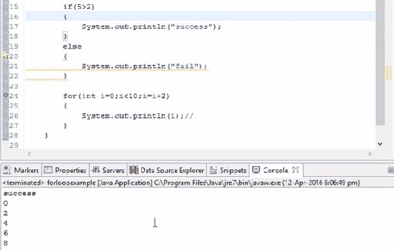
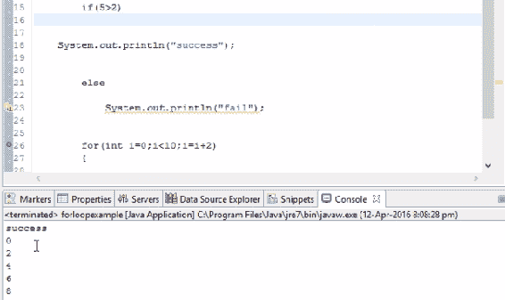
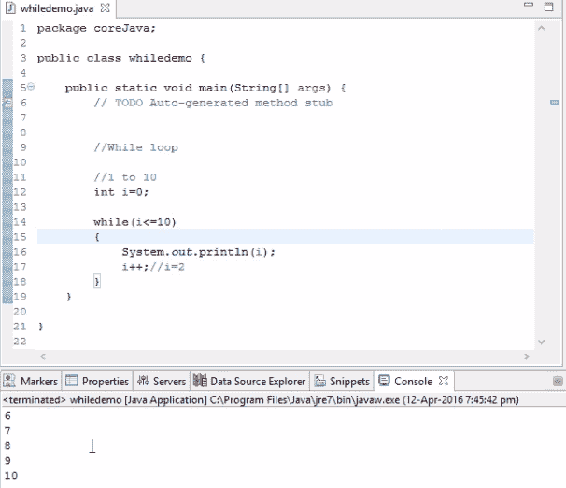
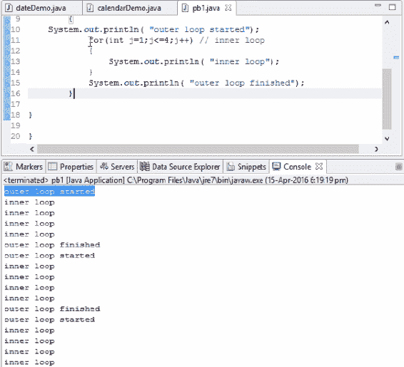

# 第四章：Java 程序的构建模块-循环和条件

循环和条件是 Java 程序的基本组成部分。本章将通过示例帮助我们理解重要的循环和条件。学习 Java 中的这些循环和条件将使编写代码变得更容易。

在本章中，我们将涵盖以下主题：

+   for 循环

+   if...else 条件

+   while 循环

+   嵌套循环

# for 循环

让我们看看`for`循环的工作原理。`for`循环是 Java 程序中最常用的循环之一，了解它的内部工作原理非常重要。因此，假设我们想使用`for`循环打印从 1 到 100 的数字。对于在`for`循环中执行 1 到 100 的数字的语法，并将其写入`for`循环，我们只需写：

```java
// 1 to 100

/*  for(initialization;condition;increment)
       {
       } */
    for (int i=0;i<100;i++)
    {
        system.out.println(i);
        }
}

```

由于我们想打印`0`、`1`、`2`、`3`，我们使用`i++`。这意味着对于每个循环，它只增加`1`。并且在循环时，每次它还会检查前面的条件是否满足。因此，如果`1`小于`100`，它会进入；如果`2`小于`100`，它会进入。直到满足此条件，它将继续循环。当`i`的值达到`100`时，`100`小于`100`，这是假的。此时，它终止循环并退出循环。我们将在这里使用一个基本示例：

```java
for (int i=0;i<5;i++)
    {
         system.out.println(i);
    }
```

在 IDE 中以调试模式运行测试用例，双击以下截图中显示的位置：


调试开始的行

当您看到蓝色图标时，点击像昆虫一样的符号以调试模式运行。它会要求您以调试模式启动。只需点击保存即可：


编辑器顶部的调试图标

您将在这里看到所有变量值。逐步进行，我们将进入循环，并执行程序的下一步：


调试时的变量值

最后，当它达到值`4`并再次增加`1`时，它是`5`。请注意，当值变为`5`时，它会退出循环而不会进入循环内部。因此，这意味着条件不再满足，循环将运行五次。输出如下截图所示：


根据代码的最终输出

所以，这就是`for`循环的工作原理。

现在，如果我们将条件设置为以下内容，即使第一次条件为假，也不会进入`for`循环内部：

```java
for (int i=5;i<3;i++)
```

在调试模式下运行前面的条件时，完整的循环被跳过，输出中什么也看不到。

让我们看另一个例子：

```java
for (int i=0;i<10;i+2 )
```

输出将是：

```java
0
2
4
6
8
```

这就是`for`循环的内部工作原理。

在下一节中，我们将学习`if...else`和`do...while`循环。

# 如果...else 条件

在学习`while`和`do...while`循环之前，我们将在本节讨论`if`条件。在 Java 程序中，当使用`if`条件语句时，仅当条件满足时才执行`if`块中的语句。否则，将运行`else`块中的语句。此执行仅发生一次。在`for`循环中，初始化一个变量，并且循环运行直到条件满足。

然而，在`if`情况下，它不会一直循环。只有在`if`条件满足时，它才会进入循环；否则，它将进入`else`块。因此，控制将执行此`else`块中的语句，如下截图所示：


根据代码的 if...else 条件输出

但所有这些只发生一次，不像`for`循环，条件满足直到返回并执行。

让我们看看以下示例：

```java
    if(5>2)
    {
        System.out.println("success");
    }
    else
    {
        System.out.println("fail");
    }
```

以下截图显示了这些错误：


快速修复下拉菜单，提供纠正代码错误的建议

第一个错误是删除包含条件，可以忽略。运行上述程序时，您将看到输出为“成功”，因为进入的条件`5`大于`2`是真的：



输出显示成功，根据代码

如果我们改变条件，使`5`小于`2`，使条件为假，它将跳到`else`块并执行`else`中的语句。


代码接收失败作为输出

这次输出应该是“失败”，如下面的屏幕截图所示：


输出显示成功，根据代码

这就是`if`条件的工作原理。

请注意，如果您的块中只有一行，则可以摆脱这些大括号，因为它最终会假定如果条件为真，则将执行下一行。这意味着如果您的块中只有一行，则可以摆脱大括号。但是，如果您想要有多于一个语句，如果您的条件为真，那么请确保您在大括号中编写以避免冲突。如果您不指定大括号，它仍将打印为“成功”，如下面的屏幕截图所示：



修改代码后，输出显示成功

在这里，`5`大于`2`。运行此代码时，程序将在没有大括号的情况下运行。

现在，添加一个附加语句，比如“第二步”，它会抛出一个错误，如下面的屏幕截图所示：


错误在行号旁边标有一个交叉标记，显示语法错误

请注意前面屏幕截图中标记的标记的语法错误。要么您应该保留一个大括号，要么您应该避免这一步。为了摆脱这一点，我们将整个块都放在大括号中。这样，错误就消失了。

# 将 if...else 条件带入 for 循环

现在，让我们将`if...else`条件带入`for`循环。让我们将以下内容添加到我们的代码中：

```java
for (int i=0;i<10;i=i+2)
{
     if(i==8)
     system.out.println("print 8 is displayed");
     else 
        system.out.println("I did not find");
}
```

由于这里只有一个语句，我们不会将其写在大括号中。现在，让我们分析一下。值将从零开始进入`for`循环，直到该值小于`10`。

进入`for`循环后，它将检查第一个值`0`是否等于`8`。由于它不相等，它将显示“我没有找到”。现在，第二次，`2`将被加到`0`（根据我们设置的条件）。请注意，这个新值仍然不等于`8`；因此对于值`0`、`2`、`4`和`6`，输出将保持不变。接下来，当`8`进入`for`循环时，条件得到满足，并且“8 被显示”语句作为输出显示：


“8 被显示”和“我没有找到”显示为输出

现在，如果我们说`i=9`，它将永远不会被打印，因为我们设置的条件是`i+2`，这将是一个递增的偶数。这意味着条件不满足，并且在`if`条件之后的下一步不会被执行。因此，我们可以说，如果条件为真，那么它才会被执行；如果不是，那么`else`块中的条件或语句将被执行。当您运行此代码时，您总是会得到输出“我没有找到”。

但是，如果我们写以下语法，我们将得到输出“9 被显示”：

```java
for(int i=0;i<10;i=i+3)
```

这就是使用`for`循环的`if...else`条件的工作原理。在下一节中，我们将详细了解`for`循环。

# while 循环

在本节中，我们将详细学习`while`循环。首先，创建一个新类。现在让我们看看在编写代码时如何利用这个`while`循环。假设我们想要按顺序打印从 1 到 10 的数字。我们如何使用`while`循环打印这个？`while`循环的基本语法是：

```java
// While loop

while(boolean)
{

}
```

在这里，如果布尔表达式返回`true`，那么控制权才会进入这个循环，而如果表达式返回`false`，那么控制权就不会进入循环。这就是你对`while`循环的基本简单概念。现在假设我们想要输出从 1 到 10 的数字。为此，我们将编写以下代码：

```java
//While loop 

//1 to 10

int i=0;
while(i<10)
{
      System.out.println(i);
}
```

正如你所看到的，在前面的代码示例中，我们可以看到给定的条件是 true。所以，它进入循环并打印`i`的值。这个循环会一直执行，直到表达式评估为 false。根据我们的例子，条件将始终为 true；因此，它将进入无限循环并打印零。

这就是`while`循环的工作原理。除非在这个参数中条件变为 false，否则这个循环永远不会停止执行。现在，如果我们在打印变量之后递增会发生什么？让我们看看当我们这样做时会发生什么：

```java
//While loop 

//1 to 10

int i=0;
while(i<10)
{
      System.out.println(i);
      i++;
}
```

输出将如下截图所示：


根据代码的 while 条件输出

如果我们使用以下条件：

```java
while(i<=10)
```

新的输出将是：



修改代码后的 while 条件输出

同样，你可以反转条件，如下所示：

```java
//While loop 

//1 to 10

int i=10;
while(i>0)
{
      System.out.println(i);
      i++;//i=2
}
```

输出将会无限循环，因为数字会不断增加，因为`10`大于`0`。

如果我们使用递减条件，它将一直减少直到条件变为 false。之后，它将退出循环，如下面的代码示例所示：

```java
//While loop 

//1 to 10

int i=10;
while(i>0)
{
      System.out.println(i);
      i--;//i=2
}
```

前面的代码示例的输出将是：

```java
5
4
3
2
1
```

因此，这就是我们如何在 Java 程序中使用`while`循环语法。在下一节中，我们将看到如何使用`do...while`循环。

# `do...while`循环

`do...while`循环的语法是：

```java
do
{
}while();
```

让我们考虑以下例子，我们想要打印从 20 到 30 的数字：

```java
    int j=20;
do
{
    j++;
}while(j<30); // 1 loop of execution is guaranteed 
```

前面的代码将打印`20`、`21`、`22`直到`29`作为输出。因此，首先执行，然后再比较。

`while`和`do...while`循环之间的基本区别在于，`while`循环在评估布尔表达式之前不会执行，而`do...while`循环首先执行一次循环，然后评估是否继续执行更多循环。

让我们考虑以下例子，变量的值大于`30`：

```java
int j=20;
do
{
    j++;
}while(j>30); // 1 loop of execution is guaranteed 
```

在这里，输出将是`20`，之后的脚本将被终止，因为正如在本节前面提到的，在`do...while`循环中，执行一个循环是有保证的。如果你在`while`循环中运行相同的逻辑，即使是第一次，它也不会运行。 

因此，在下一节中，我们将尝试进行一个基于`for`循环、`while`循环、`do...while`循环和`if`条件的练习。这些程序将是理解循环的好的实践学习。

在下一节中，我们将学习嵌套循环的工作原理。

# 嵌套循环

这是最重要的概念之一。所有的编程逻辑都来自嵌套循环。如果你能掌握它背后的概念，那么你就能轻松地解决 Java 编程示例。所以，首先我会写一个语法：

```java
for(int i=1;i<=4;i++)  // this block will loop for 4 times
{
}
```

前面的语法意味着循环将运行四次。如果我们在前面的代码块中再写一个`for`循环会怎么样？在循环中实现循环的概念称为**嵌套循环**：

```java
     for(int i=1;i<=4;i++)  
     // (outer for loop) it will loop for 4 times
     {
         System.out.println("outer loop started");
         for(int j=1;j<=4;j++) //(inner for loop)
         {
             System.out.println("inner loop");
         }
         System.out.println("outer loop finished");
     }

```

因此，当我们完成前一个迭代时，一个循环系统就完成了。要完成一个外部循环，我们必须完成所有四个内部循环。这意味着我们必须运行这个内部循环 16 次（四次四次）才能完成这个外部循环四次。

输出如下截图所示：



根据代码的嵌套循环的输出

在更进一步，`for`循环的概念将更频繁地被使用。为了理解`for`循环的概念，让我们尝试解决一些例子。

# 例子 1

编写以下输出的代码：

```java
1 2 3 4
5 6 7
8 9
10
```

正如我们在输出中观察到的，对于每一行，一个数字在递减。我们将在这里看一下外部循环和内部循环的概念。代码将如下：

```java
int k=1;
for(int i=0;i<4;i++)  
// (outer for loop) it will loop for 4 times
     {
         //System.out.println("outer loop started");
         for(int j=1;j<=4;j++) //(inner for loop)
         {
             System.out.print("k");
             System.out.print("\t");
         }
         System.out.println(" ");
    }
```

# 例子 2

编写以下输出的代码：

```java
1
2 3
4 5 6 
7 8 9 10
```

正如您所看到的，这个例子中使用的输出与第一个例子中的输出相反：

```java
int k=1;
for(int i=1;i<5;i++)  
// (outer for loop) it will loop for 4 times
     {
         //System.out.println("outer loop started");
         for(int j=1;j<=i;j++) //(inner for loop)
         {
             System.out.print("k");
             System.out.print("\t");
             k++;
         }
        System.out.println(" ");
     }
```

# 例子 3

以类似的方式，还有一个程序，称为排序数字

编写以下输出的代码：

```java
1
1 2 
1 2 3
1 2 3 4
```

上述输出的代码将是：

```java
    for(int i=1;i<5;i++)  
    // (outer for loop) it will loop for 4 times
         {
              for(int j=1;j<=i;j++) //(inner for loop)
              {
                  System.out.print("j");
                  System.out.print("\t");
              }
              System.out.println(" ");
         }
```

# 总结

通过使用简单的例子，我们学会了如何在 Java 中使用`if...else`条件。我们还看到了如何使用`for`循环和`while`循环来获得所需的输出。更进一步，我们学会了如何使用嵌套的`for`循环来以特定的模式获得输出。

在下一章中，我们将学习一些重要的概念，比如接口，它们的工作原理以及它们在 Java 中的用法。我们还将使用一个实际的例子来讨论继承。
