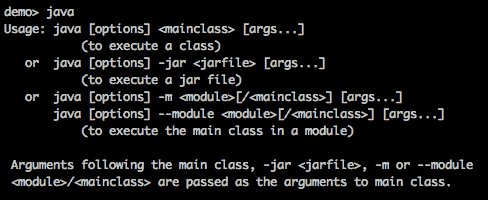
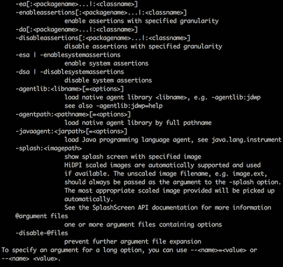
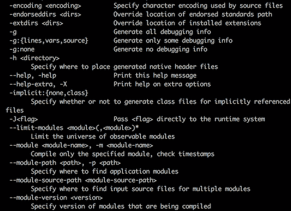

# 在您的计算机上安装 Java 虚拟机（JVM）

本书将指导您达到中级 Java 编程技能。编程不仅仅是了解语言语法。它还涉及编写、编译和执行程序或运行整个软件系统所需的工具和信息来源。这条路上的第一步是学习 Java 的重要组件，包括**Java 开发工具包**（**JDK**）和**Java 虚拟机**（**JVM**）。

本章将介绍 Java 作为一种语言和工具，并建立最重要的术语。它还将描述 Java 创建背后的动机，涵盖其历史、版本、版本和技术，并概述 Java 的营销位置和主要应用领域。然后，一系列实际步骤将引导读者完成在其计算机上安装和配置 Java，并介绍主要的 Java 命令。

在本章中，我们将涵盖以下主题：

+   什么是 Java？

+   Java 平台、版本、版本和技术

+   Java SE 开发工具包（JDK）的安装和配置

+   主要的 Java 命令

+   练习- JDK 工具和实用程序

# 什么是 Java？

由于本书是为初学者编写的，我们将假设你对 Java 几乎一无所知。但即使你知道一些，甚至很多，回顾基础知识也总是有帮助的，即使只是让你通过欣赏自己已经掌握了多少而感到自豪。因此，我们将从定义 Java、JVM、编译、字节码等术语开始。

# 基本术语

在谈论 Java 时，人们将 Java、JVM、JDK、SDK 和 Java 平台视为同义词。法律定义将 Java 视为*Sun 公司一套技术的商标*，但我们通常不会将 Java 视为商标。最常见的情况是，当有人说 Java 时，他们指的是一种由人类用来表达一系列指令（程序）的编程语言，这些指令可以由计算机执行（不是直接执行，而是在程序被编译/转换为计算机理解的代码之后）。人类可读的 Java 程序称为**源代码**，经过所有转换后的计算机可读程序称为**二进制代码**，因为它只使用 1 和 0 来表示。

您可以在[`docs.oracle.com/javase/specs/`](https://docs.oracle.com/javase/specs/)找到完整的**Java 语言规范**（描述）。它比人们预期的要容易得多，即使对于新手来说，它也可能会有所帮助，特别是如果将其用作参考文档。不要因为前几节的正式语言而感到泄气。尽量阅读你能理解的部分，并在理解 Java 的过程中回来，以及对更深入和更精确的定义的动力增加时再来阅读。

JVM 是一个程序，它将 Java`.class`文件的字节码翻译成二进制机器码，并将其发送到微处理器执行。

你有没有注意到有两个类似的术语，*bytecode*和*byte code*？在对话中，这两者的区别几乎是不可察觉的，所以人们可以互换使用它们。但是它们是有区别的。*Byte code*（或*Byte Code*，更准确地说）是一种可以由名为 JVM 的特殊程序执行的语言。相比之下，*bytecode*是由 Java 编译器（另一个程序）生成的指令的格式（每个指令占用一个字节，因此得名），该编译器读取人类可读的源代码并将其转换为 Byte Code。

Bytecode 是以 JVM 理解的格式表达的二进制代码。然后，JVM 读取（加载，使用名为**类加载器**的程序）字节码，将指令转换为二进制代码（JVM 正在运行的特定计算机微处理器理解的格式中的指令），并将结果传递给 CPU，即执行它的微处理器。

类是由 Java 编译器生成的文件（扩展名为.class），从具有相同名称和扩展名为.java 的源代码文件中生成。有十多种 JVM 实现，由不同公司创建，但我们将重点关注 Oracle JVM 的实现，称为 HotSpot。在第十一章，JVM 进程和垃圾收集中，我们将更仔细地查看 JVM 的功能、架构和进程。

在 Java 语言规范（https://docs.oracle.com/javase/specs）的同一页上，您可以找到 Java 虚拟机规范。我们建议您将其用作术语和理解 JVM 功能的参考来源。

JDK 是一组软件工具和支持库，允许创建和执行 Java 语言程序。

自 Java 9 以来，不再支持小程序（可以在浏览器中执行的组件），因此我们将不再详细讨论它们。应用程序是可以（编译后）在安装了 JVM 的计算机上执行的 Java 程序。因此，JDK 至少包括编译器、JVM 和 Java 类库（JCL）-一组可供应用程序调用的即用程序。但实际上，它还有许多其他工具和实用程序，可以帮助您编译、执行和监视 Java 应用程序。包含 JVM、JCL、类加载器和支持文件的 JDK 子集允许执行（运行）字节码。这样的组合称为 Java 运行时环境（JRE）。每个 Java 应用程序都在单独的 JVM 实例（副本）中执行，该实例具有自己分配的计算机内存，因此两个 Java 应用程序不能直接交流，而只能通过网络（Web 服务和类似手段）进行交流。

软件开发工具包（SDK）是一组软件工具和支持库，允许使用特定编程语言创建应用程序。Java 的 SDK 称为 JDK。

因此，当人们在提到 JDK 时使用 SDK 时，他们是正确的，但不够精确。

Java 平台由编译器、JVM、支持库和其他工具组成。

在前述定义中的支持库是 Java 标准库，也称为 JCL，并且对于执行字节码是必需的。如果程序需要一些其他库（不包括在 JCL 中），则它们必须在编译时添加（参见第三章，您的开发环境设置，描述了如何执行此操作），并包含在生成的字节码中。Java 平台可以是以下四种之一：Java 平台标准版（Java SE）、Java 平台企业版（Java EE）、Java 平台微型版（Java ME）或 Java Card。以前还有 JavaFX 平台，但自 Java 8 以来已合并到 Java SE 中。我们将在下一节讨论差异。

Open JDK 是 Java SE 的免费开源实现。

这些是最基本的术语。其他术语将根据需要在本书的相应上下文中介绍。

# 历史和流行度

Java 于 1995 年首次由 Sun Microsystems 发布。它源自 C 和 C++，但不允许用户在非常低的层次上操纵计算机内存，这是许多困难的根源，包括内存泄漏相关的问题，如果 C 和 C++程序员对此不太小心的话，他们会遇到。Java 因其简单性、可移植性、互操作性和安全性而脱颖而出，这使其成为最受欢迎的编程语言之一。据估计，截至 2017 年，全球有近 2000 万程序员（其中近 400 万在美国），其中大约一半使用 Java。有充分的理由相信，未来对软件开发人员的需求，包括 Java 开发人员，只会增长。因此，学习 Java 看起来是迈向稳定职业的一步。而学习 Java 实际上并不是非常困难。我们将向您展示如何做到这一点；只需继续阅读、思考，并在计算机上实践所有建议。

Java 被构想为一种允许用户*一次编写，到处运行*的工具-这是另一个解释和理解的术语。这意味着编译后的 Java 代码可以在支持 Java 的所有计算机上运行，而无需重新编译。正如您已经了解的那样，*支持 Java*意味着对于每个操作系统，都存在一个可以将字节码转换为二进制代码的解释器。这就是*到处运行*的实现方式：只要有 Java 解释器可用的地方。

在概念被证明受欢迎并且 Java 牢固地确立为其他面向对象语言中的主要参与者之一后，Sun Microsystems 将其大部分 JVM 作为自由和开源软件，并受 GNU**通用公共许可证**（**GPL**）管理。2007 年，Sun Microsystems 将其所有 JVM 的核心代码都以自由和开源的分发条款提供，除了一小部分 Sun 没有版权的代码。2010 年，甲骨文收购了 Sun Microsystems，并宣布自己是*Java 技术的管理者，致力于培育参与和透明度的社区*。

如今，Java 在许多领域中被广泛使用，最突出的是在 Android 编程和其他移动应用程序中，在各种嵌入式系统（各种芯片和专用计算机）、桌面**图形用户界面**（**GUI**）开发以及各种网络应用程序，包括网络应用程序和网络服务。Java 也广泛用于科学应用程序，包括快速扩展的机器学习和人工智能领域。

# 原则

根据*Java 编程语言的设计目标*（[`www.oracle.com/technetwork/java/intro-141325.html`](http://www.oracle.com/technetwork/java/intro-141325.html)），在创建 Java 语言时有五个主要目标。Java 语言必须是：

+   **面向对象和熟悉**：这意味着它必须看起来像 C++，但没有不必要的复杂性（我们将在第二章中讨论面向对象的术语，*Java 语言基础*）

+   **架构中立和可移植**：这意味着能够使用 JVM 作为将语言（源代码）与每个特定操作系统的知识（通常称为平台）隔离的环境

+   **高性能**：它应该与当时领先的编程语言一样工作

+   **解释性**：它可以在不链接的情况下移至执行阶段（从多个`.class`文件创建单个可执行文件），从而允许更快的编写-编译-执行循环（尽管现代 JVM 经过优化，以保持经常使用的`.class`文件的二进制版本，以避免重复解释）

+   **多线程**：它应该允许多个并发执行作业（线程），例如同时下载图像和处理其他用户命令和数据

+   动态：链接应该在执行期间发生

+   安全：它必须在运行时受到良好的保护，以防未经授权的修改

结果证明这些目标是明确定义的和富有成效的，因为 Java 成为了互联网时代的主要语言。

# Java 平台、版本、版本和技术

在日常讨论中，一些程序员会交替使用这些术语，但是 Java 平台、版本、版本和技术之间是有区别的。本节将重点解释这一点。

# 平台和版本

我们几乎每天都会听到“平台”这个术语。它的含义取决于上下文，但在最一般的意义上，它指的是一个允许某人做某事的设备或环境。它作为一个基础、一个环境、一个平台。在信息技术领域，平台提供了一个操作环境，软件程序可以在其中开发和执行。操作系统是平台的典型例子。Java 有自己的操作环境，正如我们在前面的部分中提到的，它有四个平台（和六个版本）：

+   Java 平台标准版（Java SE）：当人们说 Java 时，他们指的是这个版本。它包括 JVM、JCL 和其他工具和实用程序，允许在桌面和服务器上开发和部署 Java 应用程序。在本书中，我们将在这个版本的范围内进行讨论，并且只在本节中提到其他版本。

+   Java 平台企业版（Java EE）：由 Java SE、服务器（提供应用程序服务的计算机程序）、增强库、代码示例、教程和其他文档组成，用于开发和部署大规模、多层次和安全的网络应用程序。

+   Java 平台微型版（Java ME）：这是 Java SE 的一个小型（使用少量资源）子集，具有一些专门的类库，用于开发和部署嵌入式和移动设备的 Java 应用程序，比如手机、个人数字助理、电视机顶盒、打印机、传感器等。还有一个针对 Android 编程的 Java ME 变体（具有自己的 JVM 实现），由 Google 开发。它被称为 Android SDK。

+   Java Card：这是 Java 平台中最小的一个，用于开发和部署 Java 应用程序到小型嵌入式设备，比如智能卡。它有两个版本（引用自官方 Oracle 文档，网址为[`www.oracle.com/technetwork/java/embedded/javacard/documentation/javacard-faq-1970428.html#3`](http://www.oracle.com/technetwork/java/embedded/javacard/documentation/javacard-faq-1970428.html#3)）：

+   Java Card Classic Edition，它针对的是当今所有垂直市场上部署的智能卡，基于 ISO7816 和 ISO14443 通信。

+   Java Card Connected Edition，这是为了支持一个 Web 应用程序模型而开发的，其中 servlet 在卡上运行，TCP/IP 作为基本协议，并且在高端安全微控制器上运行，通常基于 32 位处理器，并支持像 USB 这样的高速通信接口。

# 版本

自 1996 年首次发布以来，Java 已经发展了九个主要版本：

+   JDK 1.0（1996 年 1 月 23 日）

+   JDK 1.1（1997 年 2 月 19 日）

+   J2SE 1.2（1998 年 12 月 8 日）

+   J2SE 1.3（2000 年 5 月 8 日）

+   J2SE 1.4（2002 年 2 月 6 日）

+   J2SE 5.0（2004 年 9 月 30 日）

+   Java SE 6（2006 年 12 月 11 日）

+   Java SE 7（2011 年 7 月 28 日）

+   Java SE 8（2014 年 3 月 18 日）

+   Java SE 9（2017 年 9 月 21 日）

+   Java SE 10（2018 年 3 月 20 日）

关于更改 Java 版本方案有几个建议。自 Java 10 以来，JDK 引入了新的基于时间的版本`$YEAR.$MONTH`。此外，计划每年 3 月和 9 月发布一个新的 Java 版本。因此，Java 11 将于 2018 年 9 月发布，JVM 版本为 18.9。我们将很快向您展示如何显示您正在使用的 JDK 版本。

# 技术

技术这个词被滥用了。程序员几乎用它来表示任何东西。如果您查看甲骨文的 Java 技术列表（[`www.oracle.com/java/technologies/index.html`](https://www.oracle.com/java/technologies/index.html)），您将找到以下列表：

+   **嵌入式**，包括以前列出的除了 Java EE 之外的所有 Java 平台，通常经过一些修改，通常具有更小的占用空间和其他优化

+   **Java SE**，包括 Java SE 和 Java SE Advanced，其中包括 Java SE 和一些用于企业级（不仅仅是开发计算机）安装的监控和管理工具

+   **Java EE**，如前所述

+   **云**，包括基于云的可靠、可扩展和弹性的服务

但在 Oracle 词汇表（[`www.oracle.com/technetwork/java/glossary-135216.html`](http://www.oracle.com/technetwork/java/glossary-135216.html)）中，以下技术被添加到列表中：

+   **JavaSpaces**：提供分布式持久性的技术

+   **Jini 技术**：一种**应用程序编程接口**（**API**），可以自动连接设备和服务

在其他地方，在 Oracle Java 10 文档的首页（[`docs.oracle.com/javase/10`](https://docs.oracle.com/javase/10)），客户端技术列如下：


与此同时，在 Oracle Java 教程（[`docs.oracle.com/javase/tutorial/getStarted/intro/cando.html`](https://docs.oracle.com/javase/tutorial/getStarted/intro/cando.html)）中，**Java Web Start**和**Java Plug-In**被提及为部署技术，<q>用于将您的应用程序部署到最终用户。</q>

然而，甲骨文提供的最大的 Java 技术列表在专门用于技术网络的页面上（[`www.oracle.com/technetwork/java/index.html`](http://www.oracle.com/technetwork/java/index.html)）。除了 Java SE、Java SE Advanced 和 Suite、Java 嵌入式、Java EE、Java FX 和 Java Card 之外，还列出了**Java TV**、**Java DB**和**开发工具**。如果您转到 Java SE 或 Java EE 页面，在“技术”选项卡下，您会发现超过两打的 API，以及各种软件组件也列为技术。因此，人们不应该感到惊讶在任何地方找到任何种类的 Java 技术列表。

似乎与 Java 有关的任何东西都至少被称为技术一次。为了避免进一步的混淆，从现在开始，在本书中，我们将尽量避免使用技术这个词。

# Java SE 开发工具包（JDK）安装和配置

从现在开始，每当我们谈论 Java 时，我们指的是 Java SE 10 版。我们将把它称为 Java 10，或 Java，或 JDK，除非另有说明。

# 从哪里开始

在您的计算机上进行任何 Java 开发之前，您需要安装和配置 JDK。为了做到这一点，搜索互联网以获取 JDK 下载，并选择任何以[`www.oracle.com/`](https://www.oracle.com/)开头的链接。截至目前，最好的链接应该是[`www.oracle.com/technetwork/java/javase/downloads/index.html`](http://www.oracle.com/technetwork/java/javase/downloads/index.html)。

如果您按照上述链接，您将看到这个部分：


让我们称这个页面为*Page1*，以供以后参考。现在，您可以点击 JDK 下的下载链接。其他两个下载链接提供了 JRE，正如您已经知道的，它只允许您运行已经编译的 Java 程序；我们需要编写一个程序，将其编译成字节码，然后运行它。

# 带有 Java 安装程序的页面

点击后，您将看到一个页面（*Page2*）有这个部分：


这些是不同**操作系统**（**OS**）的 Java 安装程序。您需要选择适合您操作系统的程序，并单击相应的链接（不要忘记使用单选按钮点击接受许可协议；如果有疑问，通过链接 Oracle Binary Code License Agreement for Java SE 阅读许可协议）。对于 Linux，有两个安装程序 - 一个是 Red Hat Package Manager 格式（`.rpm`），另一个只是一个存档（`.tar`）和压缩（`.gz`）版本。还要注意，在此列表中，只有 64 位操作系统的安装程序。截至目前，尚不清楚 32 位版本是否会被正式弃用，尽管它作为早期访问版本可用。

选择您需要的安装程序，并下载它。

# 如何安装

现在是安装 Java 的时候，基本上包括以下四个步骤：

1.  扩展安装程序

1.  创建目录

1.  将文件复制到这些目录中

1.  使 Java 可执行文件无需输入完整路径

要找到详细的安装说明，返回*Page1*并点击安装说明链接。找到适用于您操作系统的链接，并按照提供的步骤进行操作，但只选择与 JDK 相关的步骤。

最终，您将能够运行`java -version`命令，它将显示以下内容：


如您所见，它显示 Java 的版本为 10.0.1，JRE 和 JVM 的版本为 18.3（构建 10.0.1）。目前还不清楚未来的 Java、JRE 和 JVM 版本是否会遵循相同的格式。

无论如何，如果`java -version`命令显示您尝试安装的版本，这意味着您已经正确安装了 Java，现在可以享受与之一起工作。从现在开始，每当有新版本发布时，您都会收到升级提示，您只需点击提供的链接即可进行升级。或者，您可以转到安装程序页面（*Page2*），下载相应的安装程序，启动它，并重复您已经熟悉的过程。

实际上，程序员并不会每次都升级他们的 Java 安装。他们会保持开发版本与生产环境中的 Java 版本相同（以避免潜在的不兼容性）。如果他们想在升级生产环境之前尝试新版本，他们可能会在计算机上安装两个版本的 Java，并行使用。在第三章中，*您的开发环境设置*，您将学习如何做到这一点，以及如何在它们之间切换。

# 主要的 Java 命令

在前一节中，您看到了一个 Java 命令的示例，显示了 JVM 版本。顺便说一句，命令`java`启动了 JVM，并用于运行编译后的 Java 程序的字节码（我们将在第四章中详细演示如何做到这一点，*您的第一个 Java 项目*）。

# JVM 执行命令

现在，如果您只运行`java`，输出将显示帮助的简短版本。由于它相当长，我们将分几部分显示。这是第一部分：



它显示了三种运行 JVM 的方式：

+   执行一个类，一个包含字节码的`.class`文件

+   要执行一个 jar 文件，一个带有扩展名`.jar`的文件，其中包含以 ZIP 格式的`.class`文件（甚至可能是整个应用程序），还包括一个特定于 Java 的清单文件

+   执行模块中的主类（一组`.class`文件和其他资源，比`.jar`文件更好地结构化），通常是应用程序或其一部分

如你所见，在上述每个命令中，都必须显式提供一个主类。它是必须首先执行的`.class`文件。它充当应用程序的主入口，并启动加载其他类（在需要时）以运行应用程序的链。这样的命令示例是：

```java

java MyGreatApplication

```

实际上，这意味着当前目录中有一个名为`MyGreatApplication.class`的文件，但我们不应指定文件扩展名。否则，JVM 将寻找文件`MyGreatApplication.class.class`，当然找不到，也无法运行任何内容。

在本书中，我们不会显式使用这些命令中的任何一个，并且将其留给编辑器在幕后运行，因为现代编辑器不仅帮助编写和修改源代码；它还可以编译和执行编写的代码。这就是为什么它不仅被称为编辑器，而是**集成开发环境**（**IDE**）。

尽管如此，我们将继续概述所有`java`命令选项，这样你就会知道在你的 IDE 背后发生了什么。要享受驾车乐趣，不需要了解引擎的内部工作细节，但了解其运作原理是有帮助的。此外，随着你的专业水平的提高和你所工作的应用程序的增长，你将需要调整 JVM 配置，因此这是第一次在幕后偷看。

以下是`java`命令输出的下一部分：


在前面的屏幕截图中，你可以看到两个已弃用的选项，后面是与类路径和模块路径相关的选项。最后两个选项非常重要。它们允许指定应用程序所在位置的类和应用程序使用的库的位置。后者可以是你编写的类或第三方库。

模块的概念超出了本书的范围，但模块路径的使用方式与类路径非常相似。类路径选项告诉 JVM 在哪里查找类，而模块路径告诉 JVM 模块的位置。可以在同一命令行中同时使用两者。

例如，假设你有一个名为`MyGreatApplication.class`的文件（其中包含你的程序的字节码`MyGreatApplication.java`），存储在`dir2`目录中，这是`dir1`目录的子目录，你的终端窗口当前显示的是`dir1`目录的内容：


如你所见，还有另一个目录`dir3`，我们创建它来存储另一个文件`SomeOtherProgram.class`，这是你的应用程序使用的。我们还在`dir4`中放入了其他支持的`.class`文件库，这些文件被收集在`SomeLibrary.jar`中。然后运行你的应用程序的命令行如下：

```java

java -cp dir2:dir3:dir4/SomeLibrary.jar  MyGreatApplication //on Unix

java -cp dir2;dir3;dir4\SomeLibrary.jar  MyGreatApplication //on Windows

```

或者，我们可以将`SomeOtherProgram.class`和`MyGreatApplication.class`放入`some.jar`或`some.zip`文件，并将其放在`dir5`中。然后，命令将采用以下形式之一：

```java

java -cp dir4/SomeLibrary.jar:dir5/some.zip MyGreatApplication //Unix

java -cp dir4/SomeLibrary.jar:dir5/some.jar MyGreatApplication //Unix

java -cp dir4\SomeLibrary.jar;dir5\some.zip MyGreatApplication //Windows

java -cp dir4\SomeLibrary.jar;dir5\some.jar MyGreatApplication //Windows

```

我们可以使用`-cp`选项，也可以使用`-classpath`或`--class-path`选项。它们只是三种不同的约定，以便习惯于其中一种的人可以直观地编写命令行。这些风格中没有一个比其他更好或更差，尽管我们每个人都有偏好和意见。如果没有使用任何 classpath 选项，JVM 只会在当前目录中查找类。一些类（标准库）总是位于 Java 安装的某些目录中，因此无需使用 classpath 选项列出它们。我们将在第三章中更详细地讨论设置 classpath。

`java`命令输出的下一部分列出了一些选项，允许在实际执行应用程序之前验证一切是否设置正确：


由于模块超出了本书的范围，我们将跳过这些内容，继续输出的下一部分：


`-D` 选项允许设置一个可供应用程序访问的带有值的参数。它经常用于向应用程序传递一些值或标志，应用程序可以用来改变其行为。如果需要传递更多信息，那么就使用`.properties`文件（带有许多标志和各种值），而属性文件的位置则通过`-D`选项传递。完全取决于程序员，`.properties`文件或通过`-D`选项传递的值应该是什么。但是与应用程序配置相关的最佳实践也取决于您使用的特定框架或库。您将随着时间学会它们，这些实践超出了初学者程序员课程。

`-verbose` 选项提供了更多信息（比我们在这些截图中看到的）和一些特定的数据，取决于标志`class`、`module`、`gc`或`jni`，其中**gc**代表**垃圾收集器**，将在第十一章中讨论。对于其他标志，您可以阅读官方的 Oracle 文档，但很可能您不会很快使用它们。

`-version` 选项显示已安装的 Java 版本。这在第一天就非常有用，因为它允许随时检查当前使用的 Java 版本。在前面的部分中，我们演示了如何做到这一点，以及它产生的输出。当发布新版本的 Java 时，许多程序员会与他们当前使用的版本并行安装它，并在它们之间切换，无论是为了学习新功能还是为了开始为新版本编写代码，同时保留为旧版本编写的旧代码。您将学会如何在同一台计算机上安装两个版本的 Java，并在第三章中，*您的开发环境设置*中学会如何在它们之间切换。

我们将跳过与模块相关的选项。

在前面的截图中的其余选项与帮助相关。选项`-?`、`-h`、`-help`和`--help`显示了我们在这些截图中展示的内容，而选项`-X`和`--help-extra`提供了额外的信息。您可以自己尝试所有这些选项。

帮助输出的最后一部分如下：



我们将不讨论这些选项。只需注意如何使用上一行中解释的长选项（带有两个连字符）。

# 编译命令

如前所述，用 Java 编写的程序称为源代码，并存储在`.java`文件中。编译命令`javac`读取它，并创建相应的带有 Java 字节码的`.class`文件。

让我们运行`javac`命令，而不指定`.java`文件。它将显示帮助信息。让我们分部分地进行审查：


帮助告诉我们，这个命令的格式如下：

```java

javac <options> <source files>

```

要编译一些文件，可以在选项后的命令行中列出它们（如果文件不在当前目录中，必须使用绝对或相对路径前置文件名）。 列出的文件在 Oracle Solaris 中用冒号（`:`）分隔，在 Windows 中用分号（`;`）分隔，可以是目录、`.jar`文件或`.zip`文件。 还可以列出文件中的所有源文件，并使用`@filename`选项提供此文件名（请参阅前面的屏幕截图）。 但不要试图记住所有这些。 您很少（如果有的话）会显式运行`java`或`javac`命令。 您可能会使用一个 IDE 为您执行（请参阅第三章，*您的开发环境设置*）。 这也是我们将跳过前面屏幕截图中列出的大多数选项并仅提到其中两个选项的原因：`--class-path`（或`-classpath`或`-cp`），它指定当前编译代码所需的`.class`文件的位置，和`-d`，它指示创建`.class`文件的位置。

以下是`javac`帮助的下一部分：



我们将在此提到前面屏幕截图中的唯一选项是`--help`（或`-help`），它提供了我们现在正在浏览的相同帮助消息。

最后，`javac`帮助的最后一部分如下：


我们已经描述了选项`--source-path`（或`-sourcepath`）。 选项`-verbose`要求编译器提供更详细的报告，说明它正在做什么，而选项`--version`（或`-version`）显示 JDK 版本：


# 命令 jcmd 和其他命令

还有十几个其他的 Java 命令（工具和实用程序），您可能只有在专业编程几年后才会开始使用，如果有的话。 它们都在 Oracle Java 在线文档中有描述。 只需搜索 Java 实用程序和工具。

其中，我们只找到一个从 Java 编程的第一天起就非常有用的命令`jcmd`。 如果运行它，它会显示计算机上正在运行的所有 Java 进程（JVM 实例）。 在此示例中，您可以看到三个 Java 进程，进程 ID 分别为 3408、3458 和 3454：


进程 3408 运行 Maven 服务器（您的 IDE 通常会启动它）。 进程 3458 是我们运行`jcmd`。 进程 3454 是一个编辑器（IDE）IntelliJ IDEA，正在运行小型演示应用程序`com.packt.javapath.App`。

这样，您可以随时检查您的计算机上是否有一个失控的 Java 进程。 如果您想要停止它，可以使用任务管理器，或者需要 PID 的`kill`命令。

当您想要监视您的 Java 应用程序时，也需要了解 PID。 我们将在第十一章，*JVM 进程和垃圾收集*中讨论这一点。

通过这一点，我们完成了对 Java 命令的概述。 正如我们已经提到的，您的 IDE 将在幕后使用所有这些命令，因此您可能永远不会使用它们，除非您进行生产支持（这是在您开始学习 Java 几年后）。 但我们认为您需要了解它们，这样您就可以连接 Java 开发过程的各个方面。

# 练习 - JDK 工具和实用程序

在您的计算机上，找到 Java 安装目录，并列出所有命令（工具和实用程序） - 执行文件 - 存在那里。

如果您在其他可执行文件中看到`java`和`javac`，则您就在正确的位置。

# 答案

以下是安装在 Java 10.0.1 中的所有可执行文件的列表：


找到这个目录的一种方法是查看环境变量`PATH`的值。例如，在 Mac 电脑上，Java 安装在目录`/Library/Java/JavaVirtualMachines/jdk-10.jdk/Contents/Home/bin`中。

描述 JVM 安装位置的 Oracle 文档可以在[`www.java.com/en/download/help/version_manual.xml`](https://www.java.com/en/download/help/version_manual.xml)找到。

# 总结

在本章中，您已经学习了最重要的与 Java 相关的术语——JVM、JDK、SDK、Java 平台等，涵盖了 Java 程序生命周期的主要阶段，从源代码到字节码再到执行。您还了解了 Java 的历史、创建背后的动机、版本和版本。提供的实际步骤和建议帮助您在计算机上安装 Java 并运行其主要命令`java`、`javac`和`jcmd`。有关更多详细信息，您被引用到官方的 Oracle 文档。找到并理解这些文档的能力是成为 Java 程序员成功的先决条件，因此我们建议您跟随所有提供的链接，并在互联网上进行一些相关搜索，以便您能够轻松找到良好的信息来源。

在下一章中，我们将深入探讨 Java 作为一种编程语言，并涵盖基础知识。这将成为接下来章节的基础（或者说是一个跳板）。如果您是 Java 的新手，我们建议您继续阅读而不要跳过，因为每一章都建立在前一章的知识基础上。即使您对 Java 有一些了解，重新复习基础知识也总是有帮助的。拉丁谚语说：“Repetitio est mater studiorum”（重复是学习之母）。
