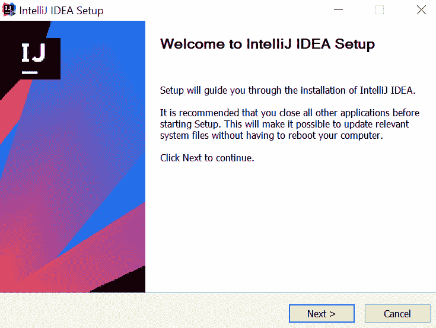
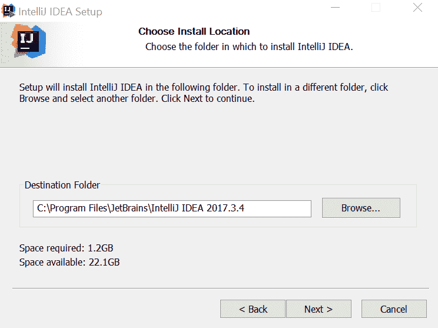
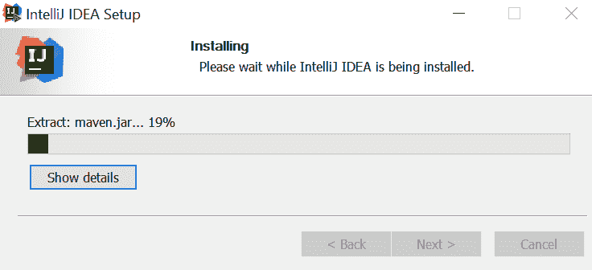
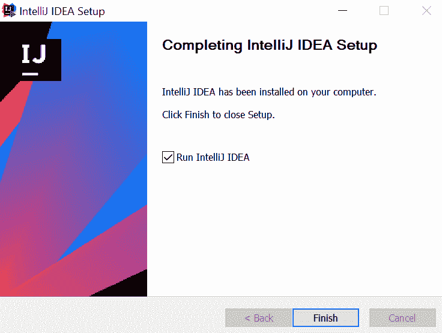
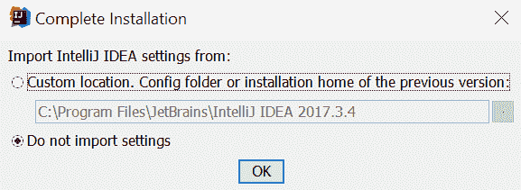
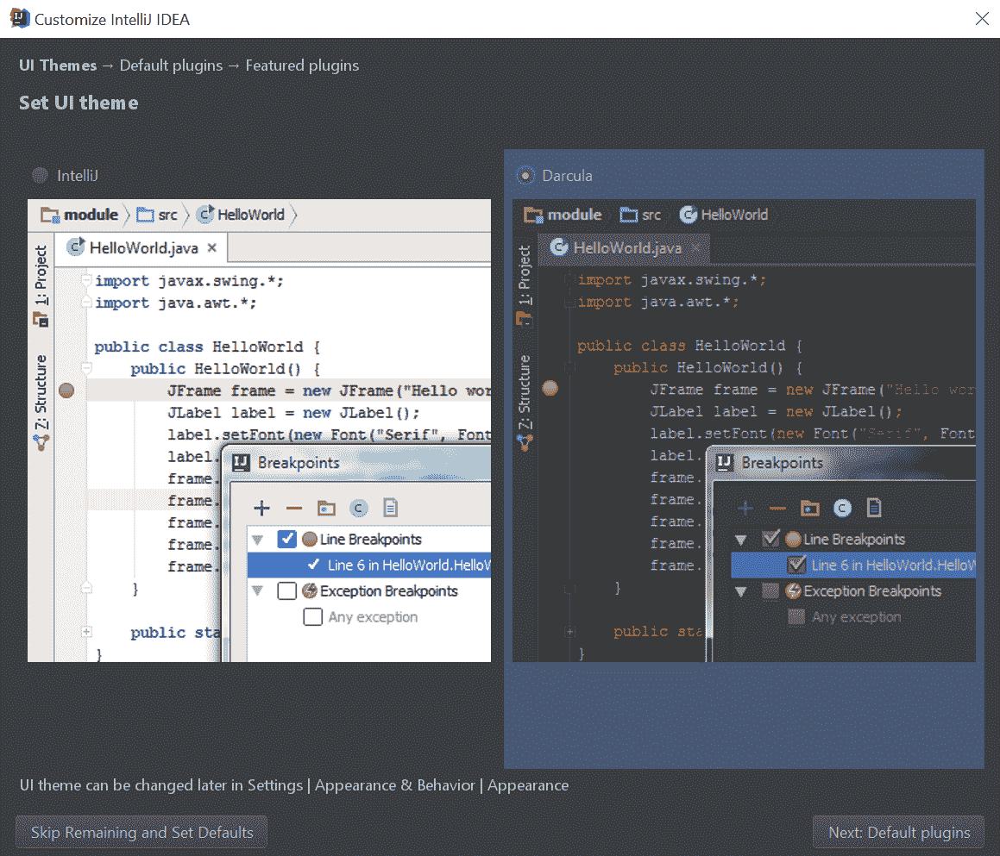
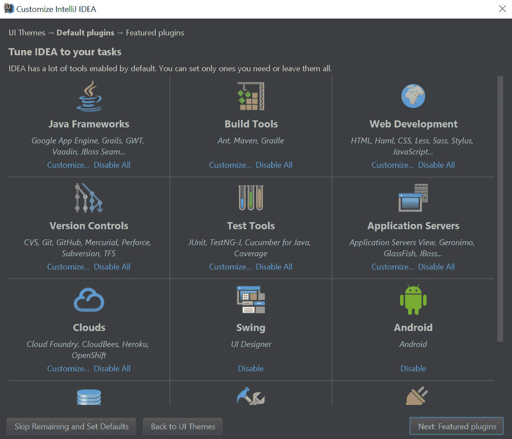
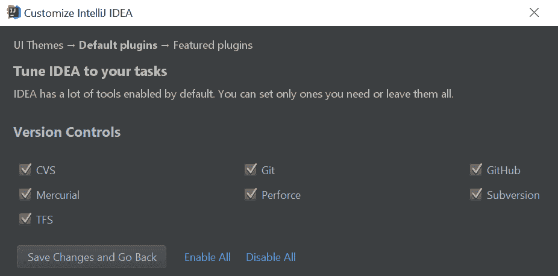
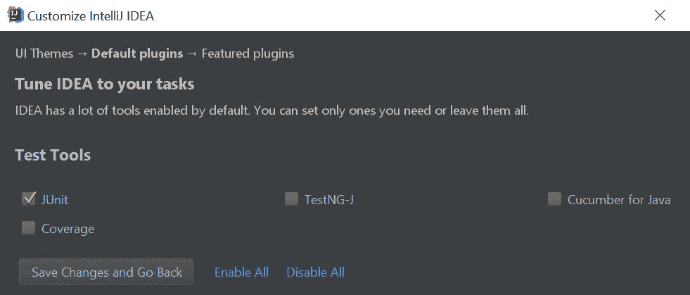

# 你的开发环境设置

到目前为止，你可能已经对如何在计算机上编译和执行 Java 程序有了相当好的了解。现在，是时候学习如何编写程序了。在你能够做到这一点之前，这一章是最后一步。因为你需要先设置好你的开发环境，所以这一章将解释什么是开发环境，以及为什么你需要它。然后，它将引导你进行配置和调整，包括设置类路径。在此过程中，我们将提供流行编辑器的概述和 IntelliJ IDEA 的具体建议。

在这一章中，我们将涵盖以下主题：

+   什么是开发环境？

+   设置类路径

+   IDE 概述

+   如何安装和配置 IntelliJ IDEA

+   练习 - 安装 NetBeans

# 什么是开发环境？

开发环境是安装在你的计算机上的一组工具，它允许你编写 Java 程序（应用程序）和测试它们，与同事分享源代码，并对源代码进行编译和运行。我们将在本章讨论每个开发工具和开发过程的各个阶段。

# Java 编辑器是你的主要工具

一个支持 Java 的编辑器是开发环境的中心。原则上，你可以使用任何文本编辑器来编写程序并将其存储在`.java`文件中。不幸的是，普通文本编辑器不会警告你有关 Java 语言语法错误。这就是为什么支持 Java 的专门编辑器是编写 Java 程序的更好选择。

现代 Java 语言编辑器不仅仅是一个写作工具。它还具有与同一台计算机上安装的 JVM 集成的能力，并使用它来编译应用程序，执行它，等等。这就是为什么它不仅仅被称为编辑器，而是 IDE。它还可以与其他开发工具集成，因此你不需要退出 IDE 来将源代码存储在远程服务器上，例如源代码控制系统。

Java IDE 的另一个巨大优势是它可以提醒你有关语言的可能性，并帮助你找到实现所需功能的更好方法。

IDE 还支持代码重构。这个术语意味着改变代码以获得更好的可读性、可重用性或可维护性，而不影响其功能。例如，如果有一段代码在多个方法中使用，可以将其提取到一个单独的方法中，并在所有地方使用它，而不是复制代码。另一个例子是当类、方法或变量的名称更改为更具描述性的名称。使用普通编辑器需要你手动查找旧名称使用的所有地方。而 IDE 会为你完成这项工作。

IDE 的另一个有用功能是能够生成类的样板代码和标准方法，比如构造函数、getter、setter 或`toString()`方法。它通过让程序员专注于重要的事情来提高程序员的生产力。

因此，请确保你对所选择的 IDE 感到舒适。作为程序员，你将在大部分工作时间内与你的 IDE 编辑器一起工作。

# 源代码编译

一个集成开发环境（IDE）使用计算机上安装的`javac`编译器来查找所有 Java 语言的语法错误。早期发现这些错误比在应用程序已经在生产环境中运行后发现要容易得多。

并非所有编程语言都可以通过这种方式支持。Java 可以，因为 Java 是一种严格类型的语言，这意味着在使用变量之前需要为每个变量声明类型。在第二章中的示例中，您看到了`int`和`String`类型。之后，如果尝试对变量进行不允许的操作，或者尝试为其分配另一种类型，IDE 将警告您，您可以重新查看或坚持您编写代码的方式（当您知道自己在做什么时）。

尽管名称相似，JavaScript 与之相反，是一种动态类型的语言，允许在不定义其类型的情况下声明变量。这就是为什么 Java 新手可以从一开始就开发一个更复杂和完全功能的应用程序，而复杂的 JavaScript 代码即使对于经验丰富的程序员来说也仍然是一个挑战，并且仍然无法达到 Java 代码的复杂程度。

顺便说一下，尽管 Java 是在 C++之后引入的，但它之所以受欢迎，却是因为它对对象类型操作施加的限制。在 Java 中，与 C++相比，难以追踪的运行时错误的风险要小得多。运行时错误是那些不能仅根据语言语法在编译时由 IDE 找到的代码问题。

# 代码共享

IDE 集成了代码共享系统。在相同代码上的协作需要将代码放置在一个称为**源代码存储库**或版本控制存储库的共享位置，所有团队成员都可以访问。最著名的共享存储库之一是基于 Git 版本控制系统的基于 Web 的版本控制存储库 GitHub（[`github.com/`](https://github.com/)）。其他流行的源代码控制系统包括 CVS、ClearCase、Subversion 和 Mercurial 等。

关于这些系统的概述和指导超出了本书的范围。我们提到它们是因为它们是开发环境的重要组成部分。

# 代码和测试执行

使用 IDE，甚至可以执行应用程序或其测试。为了实现这一点，IDE 首先使用`javac`工具编译代码，然后使用 JVM（`java`工具）执行它。

IDE 还允许我们以调试模式运行应用程序，当执行可以在任何语句处暂停。这允许程序员检查变量的当前值，这通常是查找可怕的运行时错误的最有效方式。这些错误通常是由执行过程中分配给变量的意外中间值引起的。调试模式允许我们缓慢地沿着有问题的执行路径走，并查看导致问题的条件。

IDE 功能中最有帮助的一个方面是它能够维护类路径或管理依赖关系，我们将在下一节中讨论。

# 设置类路径

为了使`javac`编译代码并使`java`执行它，它们需要知道组成应用程序的文件的位置。在第二章中，*Java 语言基础*，在解释`javac`和`java`命令的格式时，我们描述了`-classpath`选项允许您列出应用程序使用的所有类和第三方库（或者说依赖的）的方式。现在，我们将讨论如何设置这个列表。

# 手动设置

有两种设置方式：

+   通过`-classpath`命令行选项

+   通过`CLASSPATH`环境变量

我们将首先描述如何使用`-classpath`选项。它在`javac`和`java`命令中具有相同的格式：

```java

-classpath dir1;dir2\*;dir3\alibrary.jar  (适用于 Windows)

javac -classpath dir1:dir2/*:dir3/alibrary.jar   (适用于 Lunix)

```

在前面的例子中，`dir1`、`dir2`和`dir3`是包含应用程序文件和应用程序依赖的第三方`.jar`文件的文件夹。每个文件夹也可以包括对目录的路径。路径可以是绝对路径，也可以是相对于运行此命令的当前位置的路径。

如果一个文件夹不包含`.jar`文件（例如只有`.class`文件），那么只需要列出文件夹名称即可。两个工具`javac`和`java`在搜索特定文件时都会查看文件夹内的内容。`dir1`文件夹提供了这样一个例子。

如果一个文件夹包含`.jar`文件（其中包含`.class`文件），则可以执行以下两种操作之一：

+   指定通配符`*`，以便在该文件夹中搜索所有`.jar`文件以查找所请求的`.class`文件（前面的`dir2`文件夹就是这样一个例子）

+   单独列出每个`.jar`文件（存储在`dir3`文件夹中的`alibrary.jar`文件就是一个例子）

`CLASSPATH`环境变量与`-classpath`命令选项具有相同的目的。作为`CLASSPATH`变量的值指定的文件位置列表的格式与前面描述的`-classpath`选项设置的列表相同。如果使用`CLASSPATH`，则可以在不使用`-classpath`选项的情况下运行`javac`和`java`命令。如果两者都使用，则`CLASSPATH`的值将被忽略。

要查看`CLASSPATH`变量的当前值，请打开命令提示符或终端，然后在 Windows OS 中键入`echo %CLASSPATH%`，在 Linux 中键入`echo $CLASSPATH`。很可能你什么都不会得到，这意味着`CLASSPATH`变量在您的计算机上没有使用。您可以使用`set`命令为其分配一个值。

可以使用`-classpath`选项包括`CLASSPATH`值：

```java

-classpath %CLASSPATH%;dir1;dir2\*;dir3\alibrary.jar（适用于 Windows）

-classpath $CLASSPATH:dir1:dir2/*:dir3/alibrary.jar（适用于 Lunix）

```

请注意，`javac`和`java`工具是 JDK 的一部分，因此它们知道在 JDK 中附带的 Java 标准库的位置，并且无需在类路径上指定标准库的`.jar`文件。

Oracle 提供了如何设置类路径的教程，网址为[`docs.oracle.com/javase/tutorial/essential/environment/paths.html`](https://docs.oracle.com/javase/tutorial/essential/environment/paths.html)。

# 在类路径上搜索

无论使用`-classpath`还是`CLASSPATH`，类路径值都表示`.class`和`.jar`文件的列表。`javac`和`java`工具总是从左到右搜索列表。如果同一个`.class`文件被列在多个位置（例如在多个文件夹或`.jar`文件中），那么只会找到它的第一个副本。如果类路径中包含同一库的多个版本，可能会导致问题。例如，如果在旧版本之后列出了库的新版本，则可能永远找不到库的新版本。

此外，库本身可能依赖于其他`.jar`文件及其特定版本。两个不同的库可能需要相同的`.jar`文件，但版本不同。

如您所见，当类路径上列出了许多文件时，它们的管理可能很快就会成为一项全职工作。好消息是，您可能不需要担心这个问题，因为 IDE 会为您设置类路径。

# IDE 会自动设置类路径

正如我们已经提到的，`javac`和`java`工具知道在 JDK 安装中附带的标准库的位置。如果您的代码使用其他库，您需要告诉 IDE 您需要哪些库，以便 IDE 可以找到它们并设置类路径。

为了实现这一点，IDE 使用了一个依赖管理工具。如今最流行的依赖管理工具是 Maven 和 Gradle。由于 Maven 的历史比 Gradle 长，所有主要的 IDE 都有这个工具，无论是内置的还是通过插件集成的。插件是可以添加到应用程序（在这种情况下是 IDE）中以扩展其功能的软件。

Maven 有一个广泛的在线存储库，存储了几乎所有现有的库和框架。要告诉具有内置 Maven 功能的 IDE 您的应用程序需要哪些第三方库，您必须在名为`pom.xml`的文件中标识它们。IDE 从`pom.xml`文件中读取您需要的内容，并从 Maven 存储库下载所需的库到您的计算机。然后，IDE 可以在执行`javac`或`java`命令时将它们列在类路径上。我们将向您展示如何在第四章中编写`pom.xml`内容，*您的第一个 Java 项目*。

现在是选择你的 IDE，安装它并配置它的时候了。在下一节中，我们将描述最流行的 IDE。

# 有许多 IDE

有许多可免费使用的 IDE：NetBeans、Eclipse、IntelliJ IDEA、BlueJ、DrJava、JDeveloper、JCreator、jEdit、JSource、jCRASP 和 jEdit 等。每个都有一些追随者，他们坚信自己的选择是最好的，所以我们不打算争论。毕竟这是一个偏好问题。我们将集中在三个最流行的 IDE 上 - NetBeans、Eclipse 和 IntelliJ IDEA。我们将使用 IntelliJ IDEA 免费的 Community Edition 进行演示。

我们建议在最终选择之前阅读有关这些和其他 IDE 的文档，甚至尝试它们。对于您的初步研究，您可以使用维基百科文章[`en.wikipedia.org/wiki/Comparison_of_integrated_development_environments#Java`](https://en.wikipedia.org/wiki/Comparison_of_integrated_development_environments#Java)，其中有一张表比较了许多现代 IDE。

# NetBeans

NetBeans 最初是在 1996 年作为布拉格查理大学的 Java IDE 学生项目创建的。1997 年，围绕该项目成立了一家公司，并生产了 NetBeans IDE 的商业版本。1999 年，它被 Sun Microsystems 收购。2010 年，在 Oracle 收购 Sun Microsystems 后，NetBeans 成为由 Oracle 生产的开源 Java 产品的一部分，并得到了大量开发人员的贡献。

NetBeans IDE 成为 Java 8 的官方 IDE，并可以与 JDK 8 一起下载在同一个捆绑包中；请参阅[`www.oracle.com/technetwork/java/javase/downloads/jdk-netbeans-jsp-142931.html`](http://www.oracle.com/technetwork/java/javase/downloads/jdk-netbeans-jsp-142931.html)。

2016 年，Oracle 决定将 NetBeans 项目捐赠给 Apache 软件基金会，并表示*通过即将发布的 Java 9 和 NetBeans 9 以及未来的成功，开放 NetBeans 治理模型，使 NetBeans 成员在项目的方向和未来成功中发挥更大的作用*。

NetBeans IDE 有 Windows、Linux、Mac 和 Oracle Solaris 版本。它可以编码、编译、分析、运行、测试、分析、调试和部署所有 Java 应用程序类型 - Java SE、JavaFX、Java ME、Web、EJB 和移动应用程序。除了 Java，它还支持多种编程语言，特别是 C/C++、XML、HTML5、PHP、Groovy、Javadoc、JavaScript 和 JSP。由于编辑器是可扩展的，可以插入对许多其他语言的支持。

它还包括基于 Ant 的项目系统、对 Maven 的支持、重构、版本控制（支持 CVS、Subversion、Git、Mercurial 和 ClearCase），并可用于处理云应用程序。

# Eclipse

Eclipse 是最广泛使用的 Java IDE。它有一个不断增长的广泛插件系统，因此不可能列出其所有功能。它的主要用途是开发 Java 应用程序，但插件也允许我们用 Ada、ABAP、C、C++、C#、COBOL、D、Fortran、Haskell、JavaScript、Julia、Lasso、Lua、NATURAL、Perl、PHP、Prolog、Python、R、Ruby、Rust、Scala、Clojure、Groovy、Scheme 和 Erlang 编写代码。开发环境包括 Eclipse **Java 开发工具**（**JDT**）用于 Java 和 Scala，Eclipse CDT 用于 C/C++，Eclipse PDT 用于 PHP 等。

*Eclipse*这个名字是在与微软 Visual Studio 的竞争中创造出来的，Eclipse 的目标是超越 Visual Studio。随后的版本以木星的卫星——卡利斯托、欧罗巴和迦尼米德的名字命名。之后，以发现这些卫星的伽利略的名字命名了一个版本。然后，使用了两个与太阳有关的名字——希腊神话中的太阳神赫利俄斯和彩虹的七种颜色之一——靛蓝。之后的版本，朱诺，有三重含义：罗马神话中的人物、一个小行星和前往木星的宇宙飞船。开普勒、月球和火星延续了天文主题，然后是来自化学元素名称的氖和氧。光子代表了对太阳主题名称的回归。

Eclipse 还可以编码、编译、分析、运行、测试、分析、调试和部署所有 Java 应用程序类型和所有主要平台。它还支持 Maven、重构、主要版本控制系统和云应用程序。

可用插件的种类繁多可能对新手构成挑战，甚至对更有经验的用户也是如此，原因有两个：

+   通常有多种方法可以向 IDE 添加相同的功能，通过组合不同作者的类似插件

+   一些插件是不兼容的，这可能会导致难以解决的问题，并迫使我们重新构建 IDE 安装，特别是在新版本发布时

# IntelliJ IDEA

IntelliJ IDEA 付费版本绝对是当今市场上最好的 Java IDE。但即使是免费的 Community Edition 在三大主要 IDE 中也占据着强势地位。在下面的维基百科文章中，您可以看到一个表格，它很好地总结了付费的 Ultimate 和免费的 Community Edition 之间的区别：[`en.wikipedia.org/wiki/IntelliJ_IDEA`](https://en.wikipedia.org/wiki/IntelliJ_IDEA)

它是由 JetBrains（以前被称为 IntelliJ）软件公司开发的，该公司在布拉格、圣彼得堡、莫斯科、慕尼黑、波士顿和新西伯利亚拥有约 700 名员工（截至 2017 年）。第一个版本于 2001 年 1 月发布，是最早具有集成高级代码导航和代码重构功能的 Java IDE 之一。从那时起，这个 IDE 以其对代码的深入洞察而闻名，正如作者在其网站上描述产品特性时所说的那样：[`www.jetbrains.com/idea/features`](https://www.jetbrains.com/idea/features)。

与前面描述的另外两个 IDE 一样，它可以编码、编译、分析、运行、测试、分析、调试和部署所有 Java 应用程序类型和所有主要平台。与前两个 IDE 一样，它还支持 Ant、Maven 和 Gradle，以及重构、主要版本控制系统和云应用程序。

在下一节中，我们将为您介绍 IntelliJ IDEA Community Edition 的安装和配置过程。

# 安装和配置 IntelliJ IDEA

以下步骤和截图将演示在 Windows 上安装 IntelliJ IDEA Community Edition，尽管对于 Linux 或 macOS，安装并没有太大的不同。

# 下载和安装

您可以从[`www.jetbrains.com/idea/download`](https://www.jetbrains.com/idea/download)下载 IntelliJ IDEA 社区版安装程序。下载安装程序后，通过双击它或右键单击并从菜单中选择“打开”选项来启动它。然后，通过单击“下一个>”按钮，接受所有默认设置，除非您需要执行其他操作。这是第一个屏幕：



您可以使用“浏览...”按钮并选择“任何位置”作为目标文件夹，或者只需单击“下一个>”并在下一个屏幕上接受默认位置：



在下一个屏幕上选中 64 位启动器（除非您的计算机仅支持 32 位）和`.java`：


我们假设您已经安装了 JDK，因此在前一个屏幕上不需要检查“下载并安装 JRE”。如果您尚未安装 JDK，可以检查“下载并安装 JRE”，或者按照第一章中描述的步骤安装 JDK，*计算机上的 Java 虚拟机（JVM）*。

下一个屏幕允许您自定义启动菜单中的条目，或者您可以通过单击“安装”按钮接受默认选项：


安装程序将花费一些时间来完成安装。下一个屏幕上的进度条将让您了解还有多少时间才能完成整个过程：



安装完成后，下一个>按钮变为可点击时，请使用它转到下一个屏幕。

在下一个屏幕上选中“运行 IntelliJ IDEA”框，并单击“完成”按钮：



安装已完成，现在我们可以开始配置 IDE。

# 配置 IntelliJ IDEA

当 IntelliJ IDEA 第一次启动时，它会询问您是否有来自先前 IDE 版本的设置：



由于这是您第一次安装 IntelliJ IDEA，请单击“不导入设置”。

接下来的一个或两个屏幕也只会显示一次——在新安装的 IDE 首次启动时。它们将询问您是否接受 JetBrains 的隐私政策，以及您是否愿意支付许可证费用，还是希望继续使用免费的社区版或免费试用版（这取决于您获得的特定下载）。以您喜欢的方式回答问题，如果您接受隐私政策，下一个屏幕将要求您选择主题——白色（*IntelliJ*）或黑色（*Darcula*）。

我们选择了暗色主题，正如您将在我们的演示屏幕上看到的那样。但您可以选择任何您喜欢的，然后以后再更改：



在上面的屏幕上，底部可以看到两个按钮：跳过剩余和设置默认和下一个：默认插件。如果您单击“跳过剩余并设置默认”，您将跳过现在配置一些设置的机会，但以后可以进行配置。对于此演示，我们将单击“下一个：默认插件”按钮，然后向您展示如何稍后重新访问设置。

这是默认设置选项的屏幕：



您可以单击前面屏幕上的任何“自定义...”链接，查看可能的选项，然后返回。我们将仅使用其中的三个——构建工具、版本控制和测试工具。我们将首先通过单击“自定义...”来开始构建工具：


我们将保留 Maven 选项的选择，但其他选项的存在不会有害，甚至可以帮助您以后探索相关功能。

点击保存更改并返回，然后点击版本控制符号下的自定义...链接：



我们稍后会谈一下源代码控制工具（或版本控制工具，它们也被称为），但是本书不涵盖这个主题的完整内容。在前面的屏幕上，您可以勾选您知道将要使用的版本控制系统的复选框。否则，请保持所有复选框都被勾选，这样一旦您打开从列出的工具之一检出的代码源树，版本控制系统就会自动集成。

点击保存更改并返回，然后点击测试工具符号下的自定义...链接：



在前面的屏幕上，我们将只保留 JUnit 复选框被选中，因为我们希望我们的演示配置清除不必要的干扰。但您可以保持所有复选框都被选中。拥有其他选项也没有坏处。此外，您可能决定在将来使用其他选项。

正如您所见，原则上，我们不需要更改任何默认设置。我们只是为了向您展示可用的功能。

点击保存更改并返回，然后点击“下一步：特色插件”按钮，然后点击“开始使用 IntelliJ IDEA”按钮。

如果您在安装时没有配置 IDE，或者做了一些不同的事情并希望更改配置，可以稍后进行更改。

我们将在安装后解释如何访问 IntelliJ IDEA 中的配置设置，并在第四章《您的第一个 Java 项目》中提供相应的屏幕截图。

# 练习 - 安装 NetBeans IDE

下载并安装 NetBeans IDE。

# 答案

截至撰写本文时，下载最新版本的 NetBeans 页面为[`netbeans.org/features/index.html`](https://netbeans.org/features/index.html)。

下载完成后，启动安装程序。您可能会收到一条消息，建议您在启动安装程序时使用`--javahome`选项。找到相应的安装说明，并执行。NetBeans 版本需要特定版本的 Java，不匹配可能会导致安装或运行问题。

如果安装程序启动而没有警告，您可以按照向导进行操作，直到屏幕显示安装成功完成并有“完成”按钮。点击“完成”按钮，然后运行 NetBeans。您现在可以开始使用 NetBeans IDE 编写 Java 代码。阅读完第四章《您的第一个 Java 项目》后，尝试在 NetBeans 中创建一个类似的项目，并看看与 IntelliJ IDEA 相比您是否喜欢它。

# 摘要

现在您知道开发环境是什么，以及您在计算机上需要哪些工具来开始编码。您已经学会了如何配置 IDE 以及它在幕后为您做了什么。您现在知道在选择 IDE 时要寻找什么。

在下一章中，您将开始使用它来编写和编译代码并进行测试。您将学习什么是 Java 项目，如何创建和配置一个项目，以及如何在不离开 IDE 的情况下执行代码和测试代码，这意味着您将成为一名 Java 程序员。
