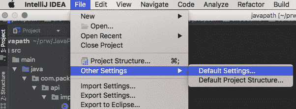
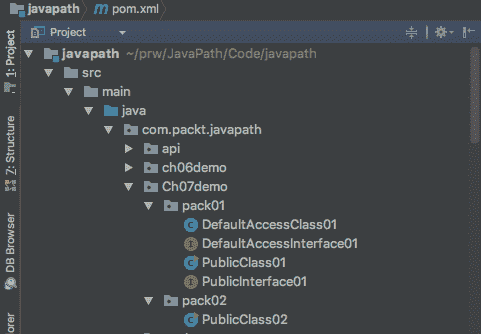

# 第八章：包和可访问性（可见性）

到目前为止，您已经对包非常熟悉。在本章中，我们将完成其描述，然后讨论类和类成员（方法和字段）的不同可访问性级别（也称为可见性）。这一切都将归结为面向对象编程的关键概念——封装——并为我们讨论面向对象设计原则奠定基础。

在本章中，我们将涵盖以下主题：

+   什么是导入？

+   静态导入

+   接口访问修饰符

+   类访问修饰符

+   方法访问修饰符

+   属性访问修饰符

+   封装

+   练习-遮蔽

# 什么是导入？

导入允许我们在`.java`文件的开头只指定一次完全限定的类或接口名称，然后是类或接口声明。导入语句的格式如下：

```java
import <package>.<class or interface name>;
```

例如，看下面的例子：

```java
import com.packt.javapath.ch04demo.MyApplication;
```

从现在开始，这个类只能在代码中通过它的名字`MyApplication`来引用。还可以使用通配符字符(`*`)导入包的所有类或接口：

```java
import com.packt.javapath.ch04demo.*;
```

注意，前面的导入语句导入了`com.packt.javapath.ch04demo`包的子包的类和接口。如果需要，每个子包都必须单独导入。

但在我们继续之前，让我们谈谈`.java`文件的结构和包。

# .java 文件和包的结构

正如您已经知道的那样，包名反映了目录结构，从包含`.java`文件的项目目录开始。每个`.java`文件的名称必须与其中定义的公共类的名称相同。`.java`文件的第一行是以`package`关键字开头的包语句，后面是实际的包名称——此文件的目录路径，其中斜杠用点替换。让我们看一些例子。我们将主要关注包含类定义的`.java`文件，但我们还将查看包含接口和`enum`类定义的文件，因为有一种特殊的导入（称为静态导入）主要用于接口和`enum`。

我们假设`src/main/java` (for Linux)或`src\main\java` (for Windows)项目目录包含所有`.java`文件，并且`MyClass`和`MyEnum`类以及`MyInterface`接口的定义来自`com.packt.javapath`包存储在以下文件中：

```java
src/main/java/com/packt/javapath/MyClass.java (for Linux) 
src/main/java/com/packt/javapath/MyEnum.java
src/main/java/com/packt/javapath/MyInterface.java 
```

或（对于 Windows）

```java
src\main\java\com\packt\javapath\MyClass.java (for Windows) 
src\main\java\com\packt\javapath\MyEnum.java
src\main\java\com\packt\javapath\MyInterface.java 
```

这些文件的每一行的第一行如下：

```java
package com.packt.javapath;
```

如果我们没有导入任何内容，那么每个文件的下一行就是一个类或接口声明。

`MyClass`类的声明如下：

```java
public class MyClass extends SomeClass 
     implements Interface1, Interface2, ... {...}
```

它包括以下内容：

+   访问修饰符；文件中的一个类必须是`public`

+   `class`关键字

+   以大写字母开头的类名（标识符）

+   如果类是另一个类的子类，则使用`extends`关键字和父类的名称

+   如果类实现了一个或多个接口，使用`implements`关键字后跟随逗号分隔的接口列表

+   类的主体（定义字段和方法的地方）由大括号`{}`括起来

`MyEnum`类的声明如下：

```java
public enum MyEnum implements Interface1, Interface2, ... {...}
```

它包括以下内容：

+   一个访问修饰符；如果它是文件中唯一定义的类，则必须是`public`

+   `enum`关键字

+   以大写字母开头的类名（标识符）按照约定

+   没有`extends`关键字，因为枚举类型隐式地扩展了`java.lang.Enum`类，在 Java 中，一个类只能有一个父类

+   如果类实现了一个或多个接口，则使用`implements`关键字后跟逗号分隔的接口列表

+   类的主体（常量和方法的定义）由大括号`{}`括起来

`MyInterface`接口的声明如下：

```java
public interface MyInterface extends Interface1, Interface2, ... {...}
```

它包括以下内容：

+   一个访问修饰符；文件中的一个接口必须是`public`

+   `interface`关键字

+   按照约定以大写字母开头的接口名称（标识符）

+   如果接口是一个或多个接口的子接口，则使用`extends`关键字后跟父接口的逗号分隔列表

+   接口的主体（字段和方法的定义）由大括号`{}`括起来

如果不导入，我们需要通过完全限定的名称引用我们使用的每个类或接口，其中包括包名和类或接口名。例如，`MyClass`类的声明将如下所示：

```java
public class MyClass 
          extends com.packt.javapath.something.AnotherMyClass 
          implements com.packt.javapath.something2.Interface1,
                     com.packt.javapath.something3.Interface2
```

或者，假设我们想要实例化`com.packt.javapath.something`包中的`SomeClass`类。该类的完全限定名称将是`com.packt.javapath.something.SomeClass`，其对象创建语句如下所示：

```java
com.packt.javapath.something.SomeClass someClass =
                    new com.packt.javapath.something.SomeClass();
```

太啰嗦了，不是吗？这就是包导入发挥作用的地方。

# 单个类导入

为了避免在代码中使用完全限定的类或接口名称，我们可以在包声明和类或接口声明之间的空间中添加一个导入语句：

```java
package com.packt.javapath;
import com.packt.javapath.something.SomeClass;
public class MyClass {
  //... 
  SomeClass someClass = new SomeClass();
  //...
}
```

正如你所看到的，import 语句允许避免使用完全限定的类名，这样使得代码更容易阅读。

# 多个类导入

如果从同一包中导入了多个类或接口，则可以使用星号（`*`）通配符字符导入所有包成员。

如果`SomeClass`和`SomeOtherClass`属于同一个包，则导入语句可能如下所示：

```java
package com.packt.javapath;
import com.packt.javapath.something.*;
public class MyClass {
  //... 
  SomeClass someClass = new SomeClass();
  SomeOtherClass someClass1 = new SomeOtherClass();
  //...
}
```

使用星号的优点是更短的导入语句列表，但这种样式隐藏了导入的类和接口的名称。因此，程序员可能不知道它们确切来自哪里。此外，当两个或更多个包包含具有相同名称的成员时，您只需将它们作为单个类导入显式导入。否则，编译器将生成错误。

另一方面，喜欢通配符导入的程序员认为，这有助于防止意外地创建一个与导入包中已存在的名称相同的类。因此，当涉及到样式和配置 IDE 使用或不使用通配符导入时，你必须自己做出选择。

在 IntelliJ IDEA 中，默认的导入样式是使用通配符。如果你想切换到单个类导入，点击文件|其他设置|默认设置，如下截图所示：



在打开的屏幕上，选择编辑器|Java，并选中使用单个类导入复选框：


这个页面上还有其他一些你可能会发现有用的设置，所以试着记住如何访问它。

# 静态导入

静态导入允许单独导入一个类或接口，以及它的公共成员——字段和方法。如果你查看我们的一个测试类，你会看到以下静态导入语句：

```java
import static org.junit.jupiter.api.Assertions.*;

```

这个语句允许我们编写以下内容：

```java
Person p = new Person("Joe", "Blow", dob);
assertTrue(p.equals(p));

```

这样写：

```java
Person p = new Person("Joe", "Blow", dob);
Assertions.assertTrue(p.equals(p));

```

这是静态导入用法的一个普遍情况。另一个常见情况是静态导入接口或`enum`的常量。例如，如果我们有一个如下的接口：

```java
package com.packt.javapath.api;
public interface Constants {
  String NAME = "name";
}
```java

然后，要使用它的常量，可以静态导入它们：

```java
package com.packt.javapath;
import static com.packt.javapath.api.Constants.*;
public class MyClass {
  //...
  String s = "My " + NAME + " is Joe";
  System.out.println(s);        //Prints: My name is Joe
  //...
} 
```

顺便说一句，通过非静态导入`Constants`接口并让类实现它也可以达到同样的效果：

```java
package com.packt.javapath;
import com.packt.javapath.api.Constants;
public class MyClass implements Constants {
  //...
  String s = "My " + NAME + " is Joe";
  System.out.println(s);        //Prints: My name is Joe
  //...
} 
```

这种实现接口以使用它们的常量的方式在 Java 程序员中相当流行。

使用静态导入来使用`enum`常量的示例看起来很相似：

```java
import static java.time.DayOfWeek.*;
```

它允许代码将`DayOfWeek`常量用作`MONDAY`，而不是`DayOfWeek.MONDAY`。

# 访问修饰符

有三种显式访问修饰符——public、private 和 protected——以及一种隐式（默认）访问修饰符，当没有设置访问修饰符时会被隐含。它们可以应用于顶级类或接口、它们的成员和构造函数。*顶级*类或接口可以包括*成员*类或接口。类或接口的其他*成员*是字段和方法。类还有*构造函数*。

为了演示可访问性，让我们创建一个`com.packt.javapath.Ch07demo.pack01`包，其中包含两个类和两个接口：

```java
public class PublicClass01 {
  public static void main(String[] args){
    //We will write code here
  }
}

class DefaultAccessClass01 {
}

public interface PublicInterface01 {
  String name = "PublicInterface01";
}

interface DefaultAccessInterface01 {
  String name = "DefaultAccessInterface01";
}
```

我们还将创建另一个`com.packt.javapath.Ch07demo.pack02`包，并在其中创建一个类：

```java
public class PublicClass02 {
  public static void main(String[] args){
    //We will write code here
  }
}
```

前面的每个类和接口都在自己的文件中：



现在我们准备探索类、接口、它们的成员和构造函数的可访问性。

# 顶级类或接口的可访问性

公共类或接口可以从任何地方访问。我们可以导入它们并从另一个包中访问它们：

```java
import com.packt.javapath.Ch07demo.pack01.PublicClass01;
import com.packt.javapath.Ch07demo.pack01.PublicInterface01;
//import com.packt.javapath.Ch07demo.pack01.DefaultAccessClass01;
//import com.packt.javapath.Ch07demo.pack01.DefaultAccessInterface01;

public class PublicClass02 {
  public static void main(String[] args){
    System.out.println(PublicInterface01.name);
    PublicClass01 o = new PublicClass01();

  }
}
```

在上述代码中，两个导入语句被注释掉，因为它们会生成错误。这是因为在`DefaultAccessClass01`类和`DefaultAccessClass01`接口中，我们没有使用访问修饰符，这使它们只能被同一包的成员访问。

没有访问修饰符的顶层类或接口只能被同一包的成员访问。

在顶层类或接口的声明中使用`private`访问修饰符会使它们无法访问，因此在顶层类或接口中使用`private`访问修饰符是没有意义的。

`protected`关键字不能应用于顶层。这个限制并不那么明显。我们将在下一节中看到`protected`意味着它对包成员和子类是可访问的。因此，有人可能会认为`protected`访问也适用于顶层类或接口。然而，Java 的作者决定不这样做，如果您尝试将顶层类或接口设置为`protected`，编译器将生成异常。

然而，`private`和`protected`访问修饰符可以应用于内部类或接口-顶层类或接口的成员。

# 访问类或接口成员

即使类或接口成员被声明为公共，如果封闭类或接口是不可访问的，它们也无法被访问。因此，以下所有讨论都将在类或接口是可访问的假设下进行。

类或接口的成员可以访问同一类或接口的其他成员，无论它们有什么访问修饰符。这是有道理的，不是吗？这一切都发生在同一个封闭类或接口内。

默认情况下，接口成员是公共的。因此，如果可以访问接口本身，则其没有访问修饰符的成员也可以被访问。而且，只是提醒一下，接口字段默认是静态和最终的（常量）。

另一方面，没有访问修饰符的类成员只能被包成员访问。因此，类或接口可能是公共的，但它们的成员是不太可访问的，除非明确设置为公共。

私有类或接口成员只能被同一类或接口的其他成员访问。这是可能的最受限制的访问。甚至类的子类也不能访问其父类的私有成员。

受保护的包成员对于同一包中的其他成员和类或接口的子类是可访问的，这意味着受保护的成员可以被覆盖。程序员经常使用这种方式来表达意图：他们将那些他们期望被覆盖的成员设置为受保护。否则，他们将它们设置为私有或公共。默认-没有访问修饰符-访问很少被使用。

**私有**：仅允许从相同的类（或接口）访问

**无修饰符（默认）**：允许从相同的类（或接口）和相同的包中访问

**受保护的**：允许从相同的类（或接口）、相同的包和任何子类访问

**公共**：允许从任何地方访问

相同的可访问性规则也适用于内部类和接口。这是一个包含内部类和接口的类的示例：

```java
public class PublicClass01 {
  public static void main(String[] args){
    System.out.println(DefaultAccessInterface01.name);
    DefaultAccessClass01 o = new DefaultAccessClass01();
  }
  class DefaultAccessClass{
  }
  protected class ProtectedClass{
  }
  private class PrivateClass{
  }
  interface DefaultAccessInterface {
  }
  protected class ProtectedInterface{
  }
  private class PrivateInterface{
  }
}
```

这是一个带有内部类和接口的接口：

```java
public interface PublicInterface01 {
  String name = "PublicInterface01";

  class DefaultAccessClass{
  }
  interface DefaultAccessInterface {
  }
}
```

正如你所看到的，接口的内部类和接口只允许默认（公共）访问。

而且，为了重复我们已经讨论过的内容，我们将简要提及一些与成员可访问性相关的其他方面：

+   静态嵌套类（在静态类的情况下被称为嵌套类，但按照惯例）不能访问同一类的非静态成员，而它们可以访问它

+   作为某个顶级类的成员，静态嵌套类可以是公共的、受保护的、包访问（默认）的或私有的

+   类的公共、受保护和包访问成员都会被子类继承

# 构造函数的可访问性与任何类成员相同

正如本节标题所述，这就是我们对构造函数可访问性能说的一切。当然，当我们谈论构造函数时，我们只谈论类。

构造函数的有趣之处在于它们只能具有私有访问权限。这意味着一个类可以提供自己的工厂方法（参见第六章，*接口、类和对象构造*），控制每个对象的构造方式，甚至控制可以将多少个对象放入流通中。在每个对象都需要访问某个资源（文件或另一个数据库）的情况下，最后一个特性尤为有价值，因为这些资源对并发访问的支持有限。以下是一个具有有限创建对象数量的最简单版本的工厂方法的样子：

```java
private String field;
private static int count;
private PublicClass02(String s){
  this.field = s;
}
public static PublicClass02 getInstance(String s){
  if(count > 5){
    return null;
  } else {
    count++;
    return new PublicClass02(s);
  }
}
```

这段代码的用处并不大，我们只是为了演示私有可访问的构造函数如何被使用。这是可能的，因为每个类成员都可以访问所有其他类成员，无论它们的访问修饰符是什么。

除非可访问性相关的特性带来了一些优势，否则它们是不需要的。这就是我们将在下一节讨论的内容——面向对象编程的中心概念封装的优势。

# 封装

面向对象编程的概念诞生于管理软件系统日益增长的复杂性的努力中。将数据和程序捆绑在一个对象中，并对它们进行受控访问（称为封装）的概念允许更好地组织数据和程序在层中，其中一些被隐藏，其他则暴露给外部访问。前面章节中描述的可访问性控制是其中的重要部分。连同继承、接口（也称为抽象）和多态性，封装成为面向对象编程的中心概念之一。

通常很难清晰地将一个面向对象的概念与另一个分开。接口也有助于隐藏（封装）实现细节。继承具有覆盖和隐藏父类方法的能力，为可访问性增加了动态方面。所有这三个概念使得多态的概念成为可能——同一个对象可以根据上下文（基于继承或实现的接口）呈现为不同类型，或者根据数据可用性改变其行为（使用组合——我们将在第八章中讨论，*面向对象设计（OOD）原则*，或者方法重载、隐藏和覆盖）。

但没有封装，这些概念都是不可能的。这就是为什么它是面向对象编程的四个概念中最基本的。很有可能，你会经常听到它被提到，所以我们决定专门为这一部分介绍在封装的背景下经常使用的术语，基于它提供的优势：

+   数据隐藏和解耦

+   灵活性，可维护性，重构

+   可重用性

+   可测试性

# 数据隐藏和解耦

当我们使对象状态（字段的值）和一些方法私有或对内部对象数据施加一些其他限制访问的措施时，我们参与了*数据隐藏*。对象功能的用户只能根据其可访问性调用特定的方法，并且不能直接操纵对象的内部状态。对象的用户可能不知道功能的具体实现方式和数据的存储方式。他们将所需的输入数据传递给可访问的方法，并获得结果。这样我们就*解耦*了内部状态和其使用，以及 API 中的实现细节。

将相关方法和数据放在同一个类中也增加了*解耦*，这次是在不同功能区域之间。

你可能会听到*紧耦合*这个术语，只有在无法避免的情况下才应该允许，因为它通常意味着一个部分的任何更改都需要相应地更改另一个部分。即使在日常生活中，我们也更喜欢处理模块化系统，允许仅替换一个模块而不更改其余系统的任何其他组件。

因此，*松耦合*通常是程序员喜欢的东西，尽管它经常以不确定系统在所有可能的执行路径中测试之前是否会出现意外惊喜的代价。一个经过深思熟虑的测试系统，覆盖了基本用例，通常有助于减少生产中缺陷传播的机会。

# 灵活性，可维护性和重构

当我们在上一节中谈到解耦时，灵活性和可维护性的概念可能会因为联想而浮现。松耦合的系统更灵活，更易于维护。

例如，在第六章中，*接口、类和对象构造*，我们演示了一种灵活的解决方案，用于实现对象工厂：

```java
public static Calculator createInstance(){
  WhichImpl whichImpl = 
      Utils.getWhichImplValueFromConfig(Utils.class,
            Calculator.CONF_NAME, Calculator.CONF_WHICH_IMPL);
  switch (whichImpl){
    case multiplies:
      return new CalculatorImpl();
    case adds:
      return new AnotherCalculatorImpl();
    default:
      throw new RuntimeException("Houston, we have another problem."+
                  " We do not have implementation for the key " +
                  Calculator.CONF_WHICH_IMPL + " value " + whichImpl);
    }
}
```

```java
private static Calculator calculator = null;
public static Calculator createInstance(){
  WhichImpl whichImpl = 
      Utils.getWhichImplValueFromConfig(Utils.class,
            Calculator.CONF_NAME, Calculator.CONF_WHICH_IMPL);
  switch (whichImpl){
    case multiplies:
      if(calculator == null){
        calculator = new CalculatorImpl();
      }
      return calculator;
    case adds:
      return new AnotherCalculatorImpl();
    default:
      throw new RuntimeException("Houston, we have another problem."+
                      " We do not have implementation for the key " +
                  Calculator.CONF_WHICH_IMPL + " value " + whichImpl);
    }
}
```java

private static Calculator calculator = null;

public static Calculator createInstance(){

WhichImpl whichImpl =

Utils.getWhichImplValueFromConfig(Utils.class,

Calculator.CONF_NAME, Calculator.CONF_WHICH_IMPL);

switch (whichImpl){

案例乘法：

if(calculator == null){

calculator = new CalculatorImpl();

}

返回计算器；

案例添加：

返回新的 AnotherCalculatorImpl();

default:

抛出新的 RuntimeException("休斯顿，我们又有问题了。"+

"我们没有关键的实现" +

Calculator.CONF_WHICH_IMPL + "值" + whichImpl);

```java
public static Calculator createInstance(){
  String whichImpl = Utils.getStringValueFromConfig(CalculatorFactory.class,
            "calculator.conf", "which.impl");
  if(whichImpl.equals("multiplies")){
    return new Whatever();
  } else if (whichImpl.equals("adds")){
    return new AnotherCalculatorImpl();
  } else {
    throw new RuntimeException("Houston, we have a problem. " +
              "Unknown key which.impl value " + whichImpl +
              " is in config.");
  }

}

static class Whatever implements Calculator {
  public static String addOneAndConvertToString(double d){
    System.out.println(Whatever.class.getName());
    return Double.toString(d + 1);
  }
  public int multiplyByTwo(int i){
    System.out.println(Whatever.class.getName());
    return i * 2;
  }
}
```

或者我们可以将另一个`Calculator`实现作为嵌套类添加到工厂中，并使用它来代替`CalculatorImpl`：

```java
public long sum(String s1, String s2){
  int i1 = Integer.parseInt(s1);
  int i2 = Integer.parseInt(s1);
  return i1 + i2;
}
```

而这个工厂的客户端代码永远不会知道这种区别，除非它通过对从工厂返回的对象使用`getClass()`方法打印类的信息。但这是另一回事。从功能上讲，我们的`Whatever`的新实现将像旧的一样工作。

这实际上是一个常见的做法——从一个版本到另一个版本改变内部实现。当然有 bug 修复，还有新功能添加。随着实现代码的演变，程序员们不断地关注重构的可能性。在计算机科学中，factoring 是 decomposition 的同义词，它是将复杂的代码分解成更简单的部分，目的是使代码更易读和易维护。例如，假设我们被要求编写一个方法，接受两个`String`类型的参数（每个表示一个整数），并将它们的和作为整数返回。思考了一会儿后，我们决定这样做：

```java
public long sum(String s1, String s2){
  long l1 = Long.parseLong(s1);
  long l2 = Long.parseLong(s2);
  return l1 + l2;
}
```

但后来我们要求提供可能输入值的样本，这样我们就可以在接近生产条件的情况下测试我们的代码。结果发现，一些值可能高达 10,000,000,000，这超过了 2,147,483,647（Java 允许的最大`Integer.MAX_VALUE` int 值）。因此，我们将我们的代码更改为以下内容：

```java
long l1 = Long.parseLong(s1);

```

现在我们的代码可以处理高达 9,223,372,036,854,775,807 的值（即`Long.MAX_VALUE`）。我们将代码部署到生产环境，它在几个月内都运行良好，被一个处理统计数据的大型软件系统使用。然后系统切换到了新的数据源，代码开始出现问题。我们调查后发现，新的数据源产生的值可能包含字母和其他一些字符。我们已经为这种情况测试了我们的代码，并发现以下行会抛出`NumberFormatException`：

```java
public long sum(String s1, String s2){
  long l1 = 0;
  try{
    l1 = Long.parseLong(s1);
  } catch (NumberFormatException ex){
    //make a record to a log
  }
  long l2 = 0;
  try{
    l2 = Long.parseLong(s2);
  } catch (NumberFormatException ex){
    //make a record to a log
  }
  return l1 + l2;
}
```

我们与领域专家讨论了这种情况，他们建议我们记录不是整数的值，跳过它们，并继续进行求和计算。因此，我们已经修复了我们的代码，如下所示：

```java
private long getLong(String s){
  double d = 0;
  try{
    d = Double.parseDouble(s);
  } catch (NumberFormatException ex){
    //make a record to a log
  }
  return Math.round(d);
}
public long sum(String s1, String s2){
  return getLong(s1) + getLong(s2);
}
```

我们迅速将代码发布到生产环境，但在下一个版本中得到了新的要求：输入的`String`值可以包含小数。因此，我们已经改变了处理输入`String`值的方式，假设它们包含小数值（也包括整数值），并重构了代码，如下所示：

```java
public long sum(int i, String s2){
  return i + getLong(s2);
}
```

这就是重构的作用。它重新构造代码而不改变其 API。随着新的需求不断出现，我们可以改变`getLong()`方法，甚至不用触及`sum()`方法。我们还可以在其他地方重用`getLong()`方法，这将是下一节的主题。

# 可重用性

封装绝对使得实现可重用性更容易，因为它隐藏了实现细节。例如，我们在上一节中编写的`getLong()`方法可以被同一类的另一个方法重用：

```java
int i = new Ch07DemoApp().getLong("23", "45.6");
```

它甚至可以被设为公共的并被其他类使用，就像以下行一样：

```java
int i = Ch07DemoApp.getLong("23", "45.6");
```

这将是一个组合的例子，当某些功能是使用不相关的类的方法构建（组合）时。而且，由于它不依赖于对象状态（这样的方法称为无状态），它可以被设为静态：

```java
public class ShadowingDemo {
  private String x = "x";
  public void printX(){
    System.out.println(x);   
    String x = "y";
    System.out.println(x);   
  }
}
```

嗯，如果该方法在运行时被几个其他方法同时使用，即使是这样一个简单的代码也可能需要受到保护（同步）以防并行使用。但这些考虑超出了本书的范围。现在，如果有疑问，不要将方法设为静态。

如果你了解面向对象编程的历史，你会发现继承最初的任务之一是成为代码重用的主要机制。它做到了。子类继承（重用）其父类的所有方法，并且只覆盖那些需要为子类专门化的方法。

但实际上，实践中似乎更受欢迎的是其他可重用性技术，尤其是对于重用方法是无状态的情况。我们将在第八章中更多地讨论这些原因，*面向对象设计（OOD）原则*。

# 可测试性

代码可测试性是另一个封装有所帮助的领域。如果实现细节没有被隐藏，我们将需要测试每一行代码，并且每次改变实现的任何一行时都需要改变测试。但是将细节隐藏在 API 的外观后面，使我们只需要专注于所需的测试用例，并且受到可能的输入数据（参数值）的限制。

此外，还有一些框架允许我们创建一个对象，根据输入参数的某个值返回某个结果。Mockito 是一个流行的框架，它可以做到这一点（[`site.mockito.org`](http://site.mockito.org)）。这样的对象被称为模拟对象。当你需要从一个对象的方法中获得某些结果来测试其他方法时，它们尤其有帮助，但你不能运行你用作数据源的方法的实际实现，因为你没有数据库中需要的数据，或者它需要一些复杂的设置。为了解决这个问题，你可以用返回你需要的数据的方法替换某些方法的实际实现-模拟它们-无条件地或者响应于某些输入数据。没有封装，这样模拟方法行为可能是不可能的，因为客户端代码将与特定实现绑定，你将无法在不改变客户端代码的情况下进行更改。

# 练习-阴影

编写演示变量阴影的代码。我们还没有讨论过它，所以你需要做一些研究。

# 答案

以下是一个可能的解决方案：

```java
String x = "y";

```

如果您运行`new ShadowingDemo().printX();`，它将首先打印`x`，然后打印`y`，因为以下行中的局部变量`x`遮蔽了`x`实例变量：

```java
private String x = "x";
public void setX(String x) {
  this.x = x;
}
```

请注意，遮蔽可能是程序的缺陷来源，也可以用于程序的利益。如果没有它，您将无法使用已经被实例变量使用的局部变量标识符。这里是另一个变量遮蔽有帮助的情况的例子：

[PRE40]

`x`局部变量（参数）遮蔽了`x`实例变量。它允许使用相同的标识符作为已经用于实例变量名称的局部变量名称。为了避免可能的混淆，建议使用关键字`this`来引用实例变量，就像我们在上面的示例中所做的那样。

# 总结

在本章中，您了解了面向对象语言的基本特性之一 - 类、接口、成员和构造函数的可访问性规则。现在您可以从其他包中导入类和接口，并避免使用它们的完全限定名称。所有这些讨论使我们能够介绍面向对象编程的核心概念 - 封装。有了这个，我们可以开始对面向对象设计（OOD）原则进行有根据的讨论。

下一章介绍了 Java 编程的更高层次视图。它讨论了良好设计的标准，并提供了经过验证的 OOD 原则指南。每个设计原则都有详细描述，并使用相应的代码示例进行说明。
