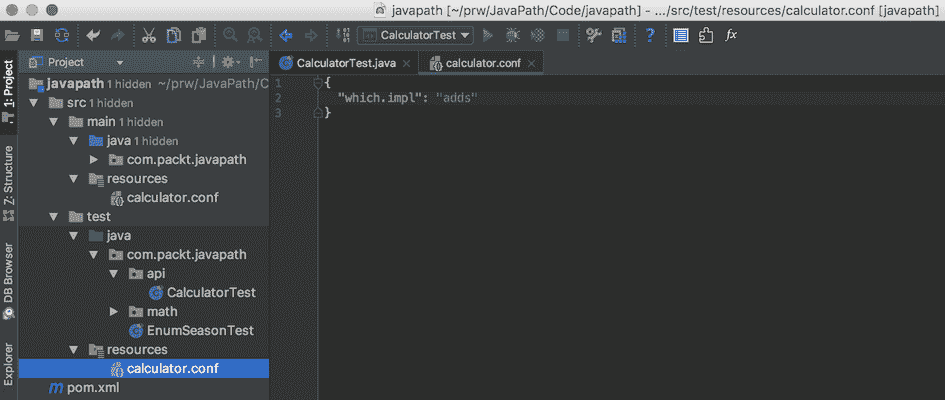

由于配置文件中存在两种实现和两种可能的值，我们需要运行我们的单元测试`CalculatorTest`两次——对于配置的每种可能的值——以确保两种实现都按预期工作。但我们不想改变交付软件组件本身的配置。

这是`test/resources`目录（对于 Windows 为`test\resources`）再次发挥作用的时候。让我们在其中创建一个`calculator.conf`文件，并将以下行添加到`CalculatorTest`测试中，这将打印出该文件中的当前设置：

```java
String whichImpl = 
   Utils.getStringValueFromConfig(Calculator.CONF_NAME, 
                                     Calculator.CONF_WHICH_IMPL);
System.out.println(Calculator.CONF_WHICH_IMPL + "=" + whichImpl);

```

`CalculatorTest`代码应如下所示：

```java
void multiplyByTwo() {
  WhichImpl whichImpl = 
      Utils.getWhichImplValueFromConfig(Calculator.CONF_NAME, 
                                        Calculator.CONF_WHICH_IMPL);
  System.out.println("\n" + Calculator.CONF_WHICH_IMPL + 
                                                   "=" + whichImpl);
  Calculator calculator = Calculator.createInstance();
  int i = 2;
  int result = calculator.multiplyByTwo(i);
  assertEquals(4, result);
}
```

我们还可以添加一行，打印出每个实现的类名：

```java
public class CalculatorImpl implements Calculator {
  public int multiplyByTwo(int i){
    System.out.println(CalculatorImpl.class.getClass().getName());
    return i * 2;
  }
}
public class AnotherCalculatorImpl implements Calculator {
  public int multiplyByTwo(int i){
    System.out.println(AnotherCalculatorImpl.class.getClass().getName());
    return i + i;
 }
}
```

如果我们将`test`目录中的`calculator.conf`文件中的`which.impl`值设置为`adds`，则会变成这样：



`CalculatorTest`测试的结果将是：


输出告诉我们三件事：

+   `calculator.conf`中`which.impl`的值被设置为`adds`

+   使用了相应的`AnotherCalculatorImpl`实现

+   调用的实现按预期工作

类似地，我们可以针对`calculator.conf`文件设置为`multiplies`运行我们的单元测试。

结果看起来很好，但我们仍然可以改进代码，使其不那么容易出错，如果将来某人决定通过添加新的实现或类似的方式来增强功能。我们可以利用添加到`Calculator`接口的常量，并使`create()`工厂方法更不容易受人为错误影响：

```java
public static Calculator create(){
  String whichImpl = Utils.getStringValueFromConfig(Calculator.CONF_NAME, 
                                       Calculator.CONF_WHICH_IMPL);         
  if(whichImpl.equals(Calculator.WhichImpl.multiplies.name())){
    return new CalculatorImpl();
  } else if (whichImpl.equals(Calculator.WhichImpl.adds.name())){
    return new AnotherCalculatorImpl();
  } else {
    throw new RuntimeException("Houston, we have a problem. " +
                     "Unknown key " + Calculator.CONF_WHICH_IMPL +
                     " value " + whichImpl + " is in config.");
  }
}
```

为了确保测试完成了其工作，我们将测试目录中的`calculator.conf`文件中的值更改为`add`（而不是`adds`），然后再次运行测试。输出将如下所示：


如预期的那样，测试失败了。这使我们对代码的工作方式有了一定的信心，而不仅仅是显示成功。

然而，当代码被修改或扩展时，代码可以改进以变得更易读，更易测试，并且更不易受人为错误影响。利用`enum`功能的知识，我们可以编写一个方法，将`calculator.conf`文件中键`which.impl`的值转换为类`enum WhichImpl`的一个常量（实例）。为此，我们将此新方法添加到类`Utils`中：
