# 开始使用 Java

无论这是你第一次涉足高级面向对象的编程语言，比如 Java，还是你已经编程了一段时间，只是想要把 Java 加入你的技能库，甚至你一生中从未接触过一行代码，这本书都是为你设计的。我们将快速前进，不会回避繁重的主题；然而，我们将从最基础的知识开始，随着学习面向对象编程的概念。

在本章中，我们将了解 Java 是什么，以及它的特性。然后，我们将按步骤设置开发环境，使我们能够编写和执行 Java 程序。一旦我们完成这一步，我们将编写我们的第一个 Java 程序并运行它。最后，我们将看看当我们遇到错误时该怎么办。

具体来说，我们将涵盖以下主题：

+   什么是 Java

+   Java 的特性和应用

+   安装 JDK

+   安装 NetBeans IDE

+   编写`HelloWorld.java`

+   NetBeans 的错误检测能力

# 什么是 Java？

Java 是由 Sun Microsystems 于 1995 年开发的，但它经受住了时间的考验，至今仍然非常相关和广泛使用。那么 Java 究竟是什么？Java 是一种高级的、通用的面向对象的编程语言。

# Java 的特性

以下是 Java 的主要特性：

+   **高级和通用**：Java 不是为了完成一个非常特定的任务而创建的，而是允许我们在一个开放的环境中编写计算机可读的指令。因为每台计算机系统都有自己专门的编程语言并不现实，甚至不可取，所以绝大多数代码都是用高级通用语言编写的，比如 Java。

+   **面向对象**：Java 也是我们所说的面向对象的语言。虽然我们在本书的后面才会深入讨论对象和类的具体内容，但现在知道对象允许我们在程序中定义模块化实体，使它们更易于阅读和更易于创建大规模的软件项目。对面向对象概念的牢固掌握对于任何现代软件开发人员来说绝对是必不可少的。

+   **平台无关**：最后，Java 的设计初衷是成为一种一次编写，随处运行的语言。这意味着如果你和我都有安装了 Java 的系统，即使我们的系统通常不相同--例如，我用的是 Windows 系统，你用的是 Mac--我在我的机器上运行的 Java 程序，我给你，也会在你的机器上基本上相同地运行，而无需重新编译。

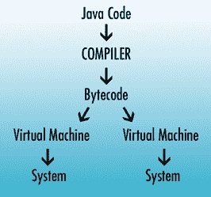**编译**Java 等编程语言是将我们编写的人类可读代码转换为解释的机器友好代码的行为。不幸的是，这通常对人类来说并不友好。为了做到这一点，我们使用一个称为编译器的程序，它接收我们的代码作为文本，并将其转换为机器代码。

传统上，我们必须为每个要运行的系统重新编译程序，因为所有系统对其机器代码的理解都不同。Java 通过将所有 Java 程序编译为一种称为字节码的相同类型的解释代码来避免这个问题。

字节码中的编译 Java 程序可以在安装了 Java 的任何系统上运行。这是因为当我们在您的系统上安装 Java 时，我们还会安装一个特定于该系统的 Java 虚拟机。这台机器的责任是将字节码转换为最终发送到该系统处理器的指令。

通过使系统负责进行最终转换，Java 创造了一种一次编写，随处运行的语言，我可以把一个 Java 程序交给你，你可以在你的计算机上运行它，而且相当肯定它会以与我的计算机上相同的方式运行。这种强大的跨平台支持水平使得 Java 成为软件开发世界的主要工具之一。

# Java 应用程序

在当今的现代时代，Java 被用于开发桌面应用程序、Web 服务器和客户端 Web 应用程序。它是 Android 操作系统的本地语言，可以在 Android 手机和平板电脑上运行。

Java 已被用于编写视频游戏，有时甚至被移植到没有传统操作系统的较小设备上。它仍然是当今技术世界中的一个重要角色，我期待与您一起学习它。

# 设置您的开发环境

在本节中，我们将编写我们的第一个 Java 程序，但在我们开始编码之前，我们需要设置一个友好的 Java 开发环境。

# 安装 JDK

要开始这个过程，让我们下载一个**Java 开发工具包**（**JDK**）或 Java SDK。这个工具包包含允许我们用 Java 代码做很多不同事情的库和可执行文件。最重要的是，安装了我们的 SDK 后，我们将能够编译 Java 代码，然后运行已完成的 Java 程序。

您可能已经在您的计算机上安装了 Java；但是，除非您明确地这样做，您可能还没有安装 Java SDK。普通用户在其计算机上安装的 Java 版本称为**Java 运行环境**（**JRE**）。这允许执行 Java 程序，并且没有安装 JRE 的环境中无法运行 Java 程序。但是 JRE 不包含任何真正的开发工具，而这是我们需要的。好消息是 Java JRE 和 Java SDK 可以和谐共存。Java JRE 实际上只是 SDK 的一个子集，因此如果我们只安装了即将下载的 Java 开发工具包，我们就没问题了。

如果您以前已经下载了 Java 开发工具包，当您实际安装这个工具包时，Java 会让您知道它已经安装了，您可以跳过本节的这部分。对于其他人，请查看如何下载开发工具包：

1.  首先，通过浏览器导航到[www.oracle.com/technetwork/java/javase/downloads/index.html](http://www.oracle.com/technetwork/java/javase/downloads/index.html)。

1.  我们将使用由 Oracle 维护的 Java SE 或标准版开发工具包。要获取此工具包，只需转到“下载”选项卡，并选择我们想要 JDK：

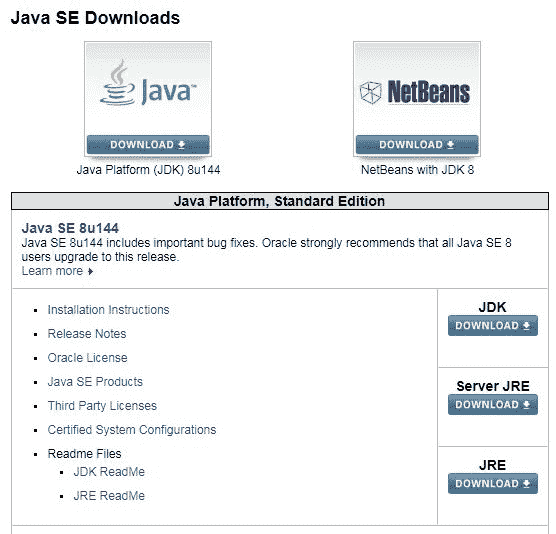

向下滚动，查看许可协议，接受许可协议，然后下载适合您操作系统的 SDK 版本。对我来说，这是`jdk-8u144-windows-x64.exe`，列在最后。

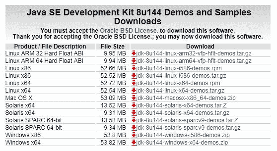

1.  一旦您的下载完成，安装它就像我们安装其他程序一样。在适当的时候选择默认选项，并确保记下我们将安装开发工具包的目录。

# 安装 NetBeans IDE

安装了我们的 Java 开发工具包，我们从技术上讲已经拥有了开始编写 Java 程序所需的所有工具。但是，我们必须通过命令行来编译它们，这在不同的操作系统上可能看起来有些不同。

为了保持一切简单，让我们通过在**集成开发环境**（**IDE**）中编写 Java 代码来开始学习 Java。这是一个独立的软件程序，可以帮助我们编写、编译和运行 Java 程序。我们将使用 NetBeans IDE，这很棒，因为它是免费的、开源的，并且在 Windows、Mac 和 Linux 环境中运行几乎相同。

要获取这个 IDE，前往[netbeans.org/downloads/](http://netbeans.org/downloads/)。

您将看到以下页面：

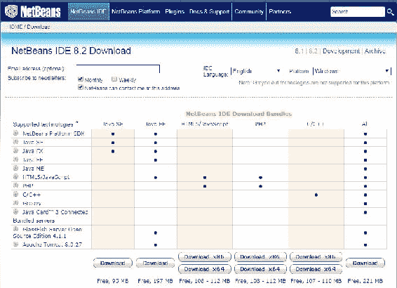

因为我们已经下载了 Java 标准版开发工具包，所以这里我们要下载的是 NetBeans 的 Java SE 版本。选择“Java SE”列下面的下载按钮。NetBeans 应该会自动开始下载，但如果没有，点击以下图片中显示的链接：


再次，我们将像安装任何其他程序一样安装 NetBeans，在适当的时候选择默认选项。很可能，NetBeans 会在我们的计算机上找到 Java 开发工具包。如果没有，它会提示我们安装 Java 开发工具包的目录。

# 编写我们的第一个 Java 程序

希望您已经安装了 NetBeans，并且没有遇到任何麻烦就启动了它。NetBeans 会管理我们程序的文件结构，但首先，我们需要告诉 NetBeans 我们准备开始一个新项目。

# 创建一个新项目

要创建一个新项目，点击“文件”，然后“新建项目”，选择 Java 应用程序：


我们需要给我们的项目一个独特的名称；让我们称这个为`HelloWorld`。然后，我们可以选择一个放置文件的位置。因为这是我们的第一个 Java 程序，我们可能应该尽可能地从零开始。所以让我们取消选中“创建主类”选项，这样 NetBeans 会给我们一个几乎是空白的项目。然后，点击“完成”：

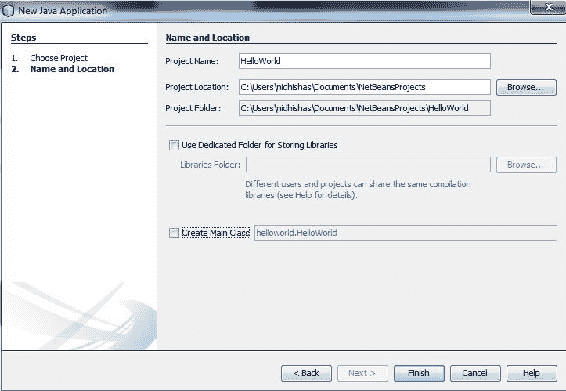

NetBeans 会为我们设置一个文件系统。我们可以像在标准文件系统资源管理器中一样浏览这个文件系统：


`Source Packages`文件是我们将编写代码的地方。您会注意到在`Libraries`文件下，JDK 是链接的，允许我们访问其许多库资源：

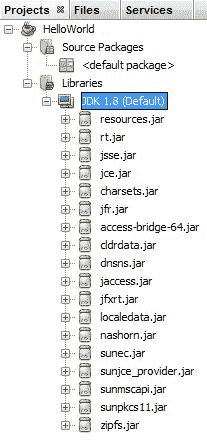

# 创建一个 Java 类

创建一个新项目后，我们应该看到我在下面的图片中看到的项目、文件和服务选项卡。让我们看看文件选项卡。虽然项目选项卡有点抽象，但文件选项卡显示了我们的`HelloWorld`项目所在的文件系统中实际包含的内容：

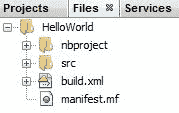

最重要的是，这里的`src`文件没有任何文件。这是因为我们的项目没有与之关联的源代码，所以现在它不会做任何事情。为了解决这个问题，右键单击`src`，选择“新建”，然后选择“Java 类...”：

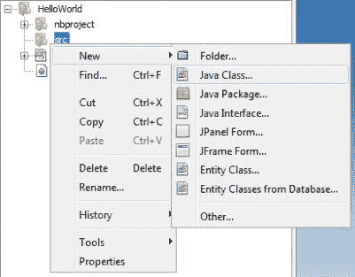

我们将把我们的 Java 类命名为`HelloWorld`，就像项目的名称一样，因为这是我们的主类，程序应该从这里输入和开始。其他的东西现在都应该正常工作，所以点击“完成”，NetBeans 会为我们创建`HelloWorld.java`。一个`.java`文件本质上是一个文本文件，但它应该只包含 Java 代码和注释：


# 编写代码

当我们告诉 NetBeans 创建`HelloWorld.java`文件时，它已经为我们添加了一些代码，如下面的截图所示：

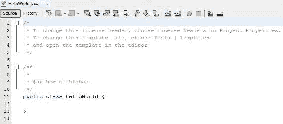

# Java 注释

您会注意到这个文档的一些内容是完全可读的；这些就是我们所谓的注释。在 Java 文件中出现在`/*`和`*/`符号之间的任何文本都将被编译器完全忽略。我们可以在这里写任何我们想要的东西，它不会影响我们的程序如何运行。现在，让我们删除这些注释，这样我们就可以纯粹地处理我们的 Java 代码。

# main()函数

Java 代码，就像英语一样，是从上到下，从左到右阅读的。即使我们的项目包含许多文件和许多类，我们仍然需要从特定点开始阅读和执行我们的代码。我们将这个文件和类命名为`HelloWorld`，与我们的项目同名，因为我们希望它是特殊的，并包含`public static void main(String[] args)`方法，我们的代码执行将从这里开始。这是一个很啰嗦的行话。现在，只需将其输入并知道这是我们的 Java 程序开始阅读和执行的地方。`main()`函数的代码用大括号括起来：

```java
public class HelloWorld {
  public static void main(String[] args) {
  }
}
```

在 IDE 中工作的一个很棒的地方是它会突出显示哪些括号相互对应。括号允许我们将代码放在其他代码区域中。例如，我们的`main()`方法包含在`HelloWorld`类中，我们即将编写和执行的 Java 代码将包含在我们的`main()`方法中。目前什么都没有的第 4 行是我们的程序将开始阅读和执行 Java 代码的地方。

# 打印字符串

我们的`HelloWorld`程序的目标相当温和。当它运行时，我们希望它将一些文本打印到屏幕底部的输出框中。

当我们下载了 Java SDK 时，我们获得了一个有用函数库，其中一个函数将做到这一点。这就是`println()`，或者打印行，函数。当我们的 Java 代码执行这个函数时，它会立即执行，因为它是我们`main()`方法入口点中的第一个函数，Java 代码将向我们的输出框打印一些文字。函数名后面跟着开括号和闭括号。在这些括号内，我们放置函数完成任务所需的信息。`println()`方法当然需要知道我们想要它打印什么。在 Java 中，一行文本由两个双引号括起来，我们称之为**字符串**。让我们让我们的程序打印`"Hello World!"`：


# Java 语法

你可能已经注意到 NetBeans 一直在对我们大声呼喊。左边有一个灯泡和一个红点，文本下面有一些红色的抖动，很像在一些文本编辑器中出现拼写错误。这确实是我们所做的。我们犯了一个语法错误。我们的 Java 代码显然有问题，NetBeans 知道这一点。

这里有两个问题。首先是我们的代码没有以分号结束。Java 不能很好地读取空格和换行，所以我们需要在每行功能代码的末尾加上分号，原因与摩尔斯电码操作员在每行末尾发送消息“停止”是一样的。让我们在我们的`println()`语句的末尾添加一个分号：


NetBeans 变得更加满意了；抖动减少了，但如前面的截图所示，仍然有些问题。

问题在于编程语言中的函数，就像计算机上的文件一样，有一个存在的位置。NetBeans 不确定在哪里找到我们尝试使用的`println()`函数。所以我们只需要告诉 NetBeans 这个函数存在的位置。`println()`函数的完整路径始于`System`包，其中包括`out`类，该类定义了`println()`函数。我们在 Java 中写成`System.out.println("Hello World!");`，如下面的代码块所示。

让我们去掉我在第 5、6 和 7 行创建的额外空格，不是因为它们会影响我们程序的运行方式，而是因为这样看起来不够好看。现在我们已经写好了我们的`HelloWorld`程序：

```java
public class HelloWorld { 
    public static void main(String[] args) { 
        System.out.println("Hello World!"); 
    } 
} 
```

# 执行我们的程序

那我们该怎么办呢？正如我们所知，我们的计算机无法直接阅读这段 Java 代码。它必须将其转换为计算机可读的语言。因此，执行这段代码变成了一个两步过程：

1.  **编译我们的程序**：首先，我们要求 NetBeans 构建我们的项目。这意味着项目中的所有代码将被编译并转换为计算机可读的代码，基本上是一个计算机可读的项目！[](img/6929328e-d378-484b-9a23-cbdc8ac4acdd.jpg)

当我们按下“构建项目”按钮时，屏幕底部的输出框中会显示一大堆文本--希望是友好的“构建成功”消息，然后是构建项目所花费的时间：


1.  **运行我们的程序**：一旦我们构建了我们的项目，我们可以按下“运行项目”按钮来执行我们的代码和我们的`println`语句：


然后 NetBeans 会给我们以下弹出框：

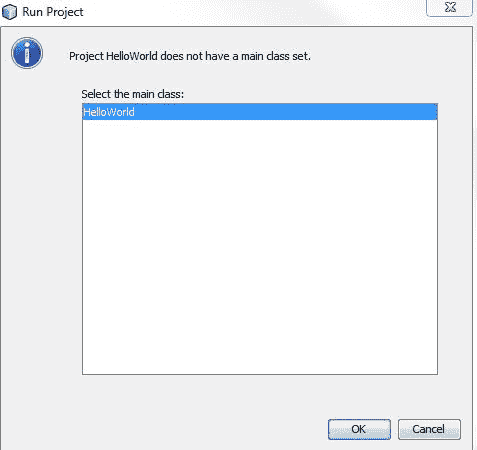

当我们在 IDE 之外执行程序时，我们通过启动其中一个可执行文件来执行它。因为我们现在处于集成开发环境中，NetBeans 想要确定我们希望将我们的哪个文件作为程序的入口点。我们只有一个选择，因为我们只写了一个 Java 类。所以让我们向 NetBeans 确认`HelloWorld`是我们的主类，因此`HelloWorld`程序中的`main()`函数将是我们开始执行 Java 程序的地方。然后，当我们点击“确定”时，输出框将告诉我们程序已经开始运行，然后我们的程序会像我们预期的那样在输出框中打印`"Hello World!"`：


就是这样！现在我们是 Java 程序员了。当然，还有很多要学习的。事实上，Java 中的`HelloWorld`可能是你写过的最简单的程序。Java 非常强大，事实上我们在写第一个程序时根本无法希望理解它的所有复杂性。真正的好消息是，从这一点开始，我们需要更少的信仰飞跃，我们可以开始逐步建立对 Java 的非常扎实的理解。

# 如何解释 NetBeans 检测到的错误？

随着我们编写越来越复杂的 Java 程序，我们不可避免地会犯一些错误。其中一些错误将是重大的逻辑错误或者是我们的误解，我们可能需要进一步教育自己才能解决。但是，特别是在开始编程时，我们会犯很多小错误，只要我们知道在哪里找，这些错误就非常容易修复。

幸运的是，Java 编译器设计成在遇到错误时向我们指出错误。为了看到这一点，让我们简单地使我们的`HelloWorld`程序不正确，方法是删除`println`语句末尾的分号：


现在 NetBeans 会在错误的行上显示红色波浪线，以让我们知道它相当确定有些地方出错了，但是我们仍然可以让编译器试一试。如果我们尝试构建这个项目，我们将不会得到通常的`编译成功`消息；相反，我们会得到一个错误消息：


这个错误是“需要';'”，这是一个非常方便和自解释的错误消息。同样重要的是这条消息后面的数字，是`4`。这让我们知道编译器在哪一行遇到了这个错误。在 NetBeans 中，如果我们点击错误消息，IDE 将会突出显示该行代码：


如果我们加入分号，那么我们的程序将成功构建，如下面的屏幕截图所示：

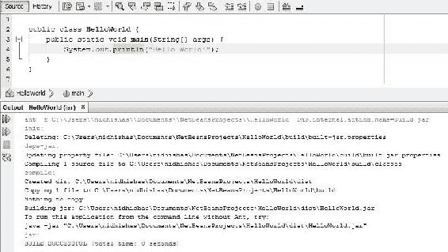

这就是全部内容。

当然，并非所有的错误消息都是那么自解释的。举例来说，让我们创建一个稍微复杂一点的错误。如果在这个程序中我们忘记插入一个括号会发生什么？这在下面的代码中有所说明：


当我们按下构建项目时，我们得到了两个错误，尽管我们只犯了一个错误：


我们的第一个错误是`not a statement`，然后它告诉我们它不理解的那一行。如果我们仔细看一下第一个错误，我们可能会注意到我们缺少一对括号，所以我们将能够修复这个错误；但是，第二个错误呢？我们再次得到了`';' expected`，尽管在这种情况下我们确实有一个分号。

嗯，一旦程序中发生了一个错误，编译器理解代码行的能力就会很快破裂。当我们调试我们的代码时，一个基本的经验法则是只处理列表中的顶部错误；那是编译器在我们的代码中遇到的第一个错误。我们可能能够从下面更多的错误中获得一些有用的信息，但更多的情况是，它们只是由我们第一个语法错误生成的错误。这里没有什么太惊人的，但我想向你指出这一点，因为能够追踪编译器错误可以在我们学习编程时节省我们很多麻烦。

# 代码补全功能

在谈论 NetBeans 时，让我们快速了解另一个 IDE 功能。假设我想写一行新代码，我要使用`System`库中的某个东西：

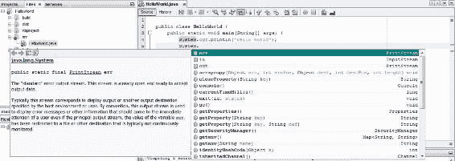

一旦我输入`System.`，NetBeans 就可以为我建议有效的响应。当然，其中只有一个是我要找的。NetBeans 编译器有很多这样的有用功能。如果你是那种认为代码补全很棒的人，可以继续使用这些工具。我们可以通过转到工具 | 选项 | 代码补全，并勾选我们想要的功能来实现这一点：


如果你更希望 NetBeans 的行为更像文本编辑器，可以取消所有功能的勾选。

我们开始吧，在这一节中有很多清理工作，但希望会很快，也不会太痛苦。

# 总结

在本章中，您了解了 Java 是什么，以及它的特点。我们通过查看它在各个领域的应用来看到了 Java 的广泛应用。

我们走过了安装 Java 开发工具包的步骤。然后设置了一个名为**NetBeans**的开发环境，用于编写和执行 Java 程序。我们看到了如何使用 NetBeans 并在其中编写了我们的第一个 Java 程序。接下来，我们看到了如何使用 NetBeans 的错误检测功能来纠正错误。

在下一章中，我们将看一下各种 Java 数据类型以及如何使用变量。
