# 第二章：理解有类型的变量

要创建甚至是简单的 Java 程序，我们需要一种存储和操作信息的方法。在这种情况下，我们的主要资源是变量，这就是我们将在本章中讨论的内容。我们将看看 Java 中的不同数据类型以及如何在程序中使用它们。我们还将看到`Math`类库及其一个函数。

具体来说，我们将讨论以下主题：

+   变量的介绍及其必要性

+   整数变量

+   浮点变量

+   `Math`类库及其`pow()`函数

+   字符变量

+   `String`类及其方法

# 整数变量

首先，让我们在 NetBeans 中创建一个新项目。我将把我的称为`Variables`，这次我们将允许 NetBeans 为我们创建主类，以便我们尽快开始编码。我们需要删除 NetBeans 在创建新项目时自动创建的所有注释，以便尽可能保持一切清晰可读，然后我们就可以开始了：

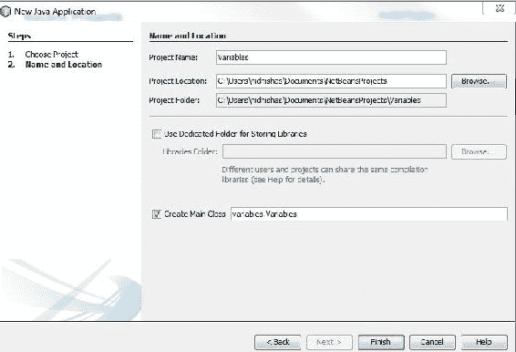

最初的计算机只不过是计算器，当然，Java 保留了这种功能。例如，Java 可以计算`1+1`，结果当然是`2`。然而，Java 相当复杂，设计用于执行许多不同的任务，因此我们需要为我们的命令提供上下文。在这里，我们告诉 Java 我们希望它打印`1+1`的结果：

```java
package variables; 

public class Variables { 

    public static void main(String[] args) { 
        System.out.println(1+1); 
    } 

} 
```

我们之前的程序将如预期般运行：


除了其他一些操作，Java 可以执行所有基本的算术运算。它可以进行加法、减法、乘法（我们使用`*`，而不是键盘上的`X`），以及除法。如果我们运行以下程序并输入`2`和`3`，我们将看到四个`println()`命令，所有这些命令都将给出正确的计算结果。当然，我们可以将这些数字更改为任何我们认为合适的数字组合：

```java
package variables; 

public class Variables { 

    public static void main(String[] args) { 
        System.out.println(2+3); 
        System.out.println(2-3); 
        System.out.println(2*3); 
        System.out.println(2/3); 
    } 
} 
```

以下是前面代码的输出：

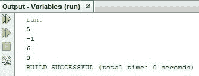

手动更改这些行有点麻烦，如果我们编写非常复杂的程序或接受用户输入的动态程序，这很快就变得不可行。

# 变量的解决方案

幸运的是，编程给了我们一种存储和检索数据的方法；这就是**变量**。要在 Java 中声明一个变量，我们首先必须指定我们将使用的变量类型。变量有许多不同的类型。在这种情况下，我们满足于使用整数，即没有指定小数位并且不是分数的数字。此外，在这种情况下，使用 Java 的原始类型是合适的。这些基本上是 Java 编程语言中信息的基本级别；我们在 Java 中使用的几乎所有其他东西都是由原始类型构建的。

要声明整数原始类型的变量，即整数，我们使用`int`关键字，全部小写。一旦我们这样做，我们需要给我们的变量一个名称。这是一个唯一的标识符，我们将用它来在将来访问这个信息。我们本地程序中的每个变量都应该有自己的名称。让我们称我们的第一个变量为`x`，我们的第二个变量为`y`：

```java
package variables; 

public class Variables { 

    public static void main(String[] args) { 
        int x; 
        int y; 

        System.out.println(2+3); 
        System.out.println(2-3); 
        System.out.println(2*3); 
        System.out.println(2/3); 
    } 
} 
```

我们刚刚编写了两行完全合法的 Java 代码。如果我们现在运行程序，我们将看到与之前相同的输出：


然而，在幕后，Java 也会为我们的`x`和`y`变量设置内存空间。这种分配不会影响我们的`println`命令，因为变量在其中还没有被引用。

所以让我们在变量中存储一些信息。我们可以在创建变量后通过变量的名称来引用变量。重要的是我们不要再次键入`int x`来引用我们的变量，因为这是 Java 创建一个全新变量`x`而不是访问现有变量`x`的命令：


一旦我们引用了变量，我们就可以使用等号更改其值。所以让我们将`x`设置为`4`，`y`设置为`3`。我们的`println`命令目前使用两个明确声明的整数：数字`2`和`3`。由于`x`和`y`也是整数，我们可以简单地用变量`x`和`y`替换现有的数字：

```java
package variables; 

public class Variables { 

    public static void main(String[] args) { 
        int x; 
        int y; 
        x = 4; 
        y = 3; 
        System.out.println(x+y); 
        System.out.println(x-y); 
        System.out.println(x*y); 
        System.out.println(x/y); 
    } 
} 
```

以下是前述代码的输出：


当我们的 Java 代码涉及变量`x`和`y`时，它将查看它们当前具有的整数值。它会找到数字`4`和`3`。因此，如果我们运行程序，我们应该期望第一个`println`语句`x+y`计算为`4+3`，然后计算为`7`。这正是发生的事情。

所以这里有一些有趣的事情。我们程序的最后一行，其中我们将`x`除以`y`，并没有像我们在数学上期望的那样进行评估。在这行代码中，`x`的值为`4`，`y`的值为`3`，现在`4`除以`3`等于 1.3，但我们的程序只是输出`1`。那是因为 1.3 不是有效的整数值。整数只能是整数，永远不是分数或小数。因此，为了让我们使用整数，Java 会将具有小数部分的任何计算向下舍入到最接近的整数。如果我们想要在可能有分数结果的环境中工作，我们需要使用除整数以外的原始类型。

无论如何，现在我们已经设置了我们的`println`命令以接受整数变量输入而不是明确的数字，我们可以通过简单地更改这些整数变量的值来修改所有四行计算的行为。例如，如果我们希望我们的程序在输入值`-10`和`5`（整数可以是负数；它们只是不能有分数部分）上运行，我们只需要更改我们给变量`x`和`y`的值：

```java
package variables; 

public class Variables { 

    public static void main(String[] args) { 
        int x; 
        int y; 

        x = -10; 
        y = 5; 

        System.out.println(x+y); 
        System.out.println(x-y); 
        System.out.println(x*y); 
        System.out.println(x/y); 
    } 
} 
```

如果我们快速运行前述代码，我们将看到预期的结果：


太棒了！您刚刚学会了在 Java 中使用整数和变量的基础知识。

# 整数变量的内存分配

让我们来看一个边缘情况，并了解一下 Java 的思维方式。您可能还记得我之前提到过，Java 在声明新变量时会设置内存。这是在高级编程语言（如 Java）中工作的巨大优势之一。Java 为我们抽象化或自动处理大部分内存管理。这通常使编写程序更简单，我们可以编写更短、更干净和更易读的代码。当然，重要的是我们要欣赏幕后发生的事情，以免遇到问题。

例如，每当 Java 为整数变量设置内存时，它也为所有整数变量设置相同数量的内存。这意味着 Java 可能在整数变量中存储的最大和最小值。最大整数值为`2147483647`，最小整数值为`2147483648`。

那么让我们做一个实验。如果我们尝试存储并打印一个比最大值大一的整数变量会发生什么？首先，让我们简化我们的程序。我们只是将一个比可能的值高一的值分配给变量`x`：

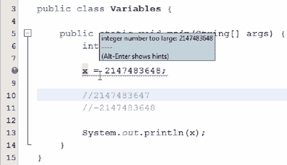

当我们尝试这样做时，NetBeans 会对我们大喊大叫。它内置了一些逻辑，试图阻止我们犯下这个非常基本和常见的错误。如果我们尝试编译这个程序，我们也会得到一个错误。

然而，我们想要以科学的名义犯这个错误，所以我们要欺骗 NetBeans。我们将把变量`x`的值设置为最大可能的整数值，然后在我们的代码的下一行，我们将把`x`的值设置为比当前`x`高一的值，也就是`x=x+1`。实际上，我们可以使用一个巧妙的简写：`x=x+1`等同于`x++`。好的，当我们运行这个程序时，它将欺骗编译器和 NetBeans，并在运行时进行加法运算，我们尝试打印出一个整数值，这个值比 Java 可以存储在内存位置中的最大整数值多一：

```java
package variables; 

public class Variables { 

    public static void main(String[] args) { 
        int x; 

        x = 2147483647; 

        x++; 
        System.out.println(x); 

    } 
} 
```

当我们运行上述程序时，我们会得到以下负数：


这个数字恰好是我们可以存储在整数中的最小数字。这在视觉上有一定的意义。我们已经走得如此之远，或者说向右，在我们的整数数线上，以至于我们到达了最左边或最负的点。当然，在数学上，这可能会变得相当混乱。

我们不太可能编写需要比这个值更高的整数的程序。然而，如果我们确实需要，我们当然需要意识到这个问题并规避它，使用一个可以处理更大值的变量类型。`long`变量类型就像整数一样，但我们需要为它分配更多的内存：

```java
package variables; 

public class Variables { 

    public static void main(String[] args) { 
        long x; 

        x = 2147483647; 

        x++; 
        System.out.println(x); 

    } 
} 
```

当我们运行上述程序时，我们将得到一个数学上准确的结果：

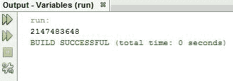

# 浮点变量

当我们只是简单地计数和操作整个对象时，整数是很棒的。然而，有时我们需要以更数学的方式处理数字，我们需要一个数据类型，可以让我们表达不完全是整数的想法。浮点数，或者浮点数，是 Java 的一个原始类型，允许我们表示有小数点和分数的数字。在本节中，我们将修改一些浮点和整数变量，以便看到它们的相似之处和不同之处。

让我们创建一个新的 Java 项目（你现在已经知道了）并将其命名为`FloatingPointNumbers`。让我们首先声明两个变量：一个整数（`iNumber`）和一个浮点数（`fNumber`）。正如我们所知，一旦声明了这些变量，我们就可以在我们的 Java 程序中修改和赋值给它们。这一次，让我向你展示，我们也可以在声明这些变量的同一行中修改和赋值给这些变量。所以当我声明了我的`iNumber`整数变量时，我可以立即给它赋值`5`：

```java
package floatingpointnumbers; 

public class FloatingPointNumbers { 

    public static void main(String[] args) { 
        int iNumber = 5; 
        float fNumber; 
    } 
} 
```

请注意，如果我们尝试用我们的浮点变量做类似的事情，NetBeans 会对我们大喊大叫，左侧会显示一个灯泡和红点：


实际上，如果我们尝试编译我们的程序，我们会得到一个合法的编译器错误消息：


让我们分析一下为什么会发生这种情况。当我们在 Java 中使用一个显式数字，也就是说，打出数字而不是使用一个变量时，Java 仍然会给这个显式数字一个类型。因此，当我们打出一个没有小数位的数字时，这个数字被假定为整数类型。所以我们的赋值工作得很好。然而，带有小数位的数字被假定为这种类型，称为`double`；它是`float`数据类型的姐妹类型，但并不完全相同。我们稍后会讨论`double`。现在，我们需要告诉 Java 将`5.5`视为`float`类型的数字，而不是`double`。为此，我们只需要在数字后面加上`f`，如下所示：

```java
float fNumber = 5.5f; 
```

你会发现灯泡和红点已经消失了。为了确保我们的语法正确，让我们给我们的程序一些超级基本的功能。让我们使用`System.out.println()`按顺序打印我们的整数和浮点数变量：

```java
System.out.println(iNumber); 
System.out.println(fNumber); 
```

当我们构建这个程序时，我们的编译器错误消失了，当我们运行它时，我们看到了两个分配的值，一切都如预期那样。没有什么太激动人心的地方：

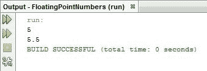

# 整数和浮点数据类型之间的行为差异

现在，我们不再为变量分配显式值，而是进行一些基本的算术运算，以便我们可以看到在 Java 中修改整数和浮点数时的不同行为。在 Java 中，`float`和`int`都是原始类型，是编程语言的逻辑构建块。这意味着我们可以使用数学运算符进行比较和修改，例如除法。

我们知道，如果我们尝试将一个整数除以另一个整数，我们总是会得到一个整数作为结果，即使标准数学规则并不产生预期的结果。然而，如果我们将一个浮点数除以另一个浮点数，我们将得到一个更符合数学规则的结果：

```java
package floatingpointnumbers; 

public class FloatingPointNumbers { 

    public static void main(String[] args) { 
        int iNumber = 5/4; 
        float fNumber = 5.0f/4.0f; 
        System.out.println(iNumber); 
        System.out.println(fNumber); 
    } 
} 
```

以下是前面代码的输出：


有时，Java 会让我们做一些可能不是那么好的主意的事情。例如，Java 允许我们将浮点变量`fNumber`的值设置为一个整数除以另一个整数，而不是一个浮点数除以另一个浮点数：

```java
int iNumber = 5/4; 
float fNumber = 5/4; 
```

因为等号右侧的计算发生在我们的浮点变量`fNumber`的值改变之前，所以我们将在`5/4`的计算中看到相同的输出。这是因为 5 和 4 都是整数变量。因此，当我们运行程序时，即使`fNumber`仍然是一个浮点数（因为它带有小数点），它的值仍然设置为`5/4`的向下取整整数部分：

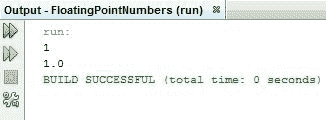

解决这个问题非常简单；我们只需要将我们的整数值之一更改为浮点数，通过在其后添加`f`：

```java
int iNumber = 5/4; 
float fNumber = 5/4.0f; 
```

现在计算将知道如何进行小数点的除法：


当我们停止使用显式声明的数字并开始使用变量时，正确地导航这一点变得更加棘手和重要。

现在让我们声明两个整数变量。我只是称它们为`iNumber1`和`iNumber2`。现在，我们不再试图将`fNumber`的值设置为一个显式声明的数字除以另一个数字，而是将其值设置为`iNumber1/iNumber2`，然后我们将打印出存储在`fNumber`中的结果：

```java
package floatingpointnumbers; 

public class FloatingPointNumbers { 

    public static void main(String[] args) { 
        int iNumber1 = 5; 
        int iNumber2 = 6; 
        float fNumber = iNumber1/iNumber2; 

        System.out.println(fNumber); 
    } 
} 
```

当我们运行这个程序时，因为我们再次将一个整数除以另一个整数，我们将看到向下取整的现象。存储在我们的浮点变量中的值是`0.0`，即`5/6`的向下取整结果：

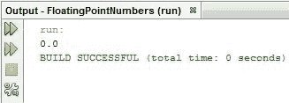

如果我们正在处理显式声明的数字，我们可以通过将两个整数数字中的一个更改为浮点数来解决这个问题，只需在其后加上小数点和`f`。在这种情况下，使用`iNumber2f`不是一个选择，因为 Java 不再认为我们要求它将`iNumber2`视为浮点数，而是认为它正在寻找一个名为`iNumber2f`的变量，而这在这个上下文中显然不存在。

# 类型转换

我们也可以通过使用所谓的**转换**来实现类似的结果。这是一个命令，我们要求 Java 将一个类型的变量视为另一个类型。在这里，我们绕过了 Java 自然倾向于将`iNumber1`和`iNumber2`视为整数的倾向。我们介入并说：“你知道 Java，把这个数字当作浮点数处理”，当我们这样做时，我们承担了一些责任。Java 会尝试按照我们的要求做，但如果我们选择不当并尝试将一个对象转换为它不能转换的对象，我们的程序将崩溃。

幸运的是，我们在这里使用的是原始类型，原始类型知道如何像另一种类型一样行事。因此，我们可以通过将变量`iNumber1`转换为浮点数来实现类似的结果，方法是在其前面加上`(float)`：

```java
float fNumber = (float)iNumber1/iNumber2; 
```

现在，如果我们运行我们的程序，我们将看到预期的`5/6`结果：


这是一个非常扎实的关于使用浮点数的介绍，我们几乎在任何时候都会使用它们来处理数学意义上的数字，而不是作为整数来计算整个对象。

# 双精度数据类型

让我们简要谈谈`double`数据类型。它是`float`的姐妹类型。它提供更高的分辨率：`double`数字可以有更多的小数位。但它们占用了更多的内存。在这个时候，使用 double 或 float 几乎总是一个风格或个人偏好的决定。除非你正在处理必须以最高内存效率运行的复杂软件，否则双精度占用的额外内存空间并不是非常重要的。

为了说明`double`的工作原理，让我们将`FloatingPointNumbers.java`程序中的两个整数更改为`double`数据类型。当我们只更改变量的名称时，程序的逻辑并没有改变。但是当我们将这些变量的声明从整数更改为双精度时，逻辑确实发生了变化。无论如何，当我们显式声明带有小数位的数字时，默认为`double`：


现在我们需要修复错误。错误是因为将`double`数据类型除以另一个`double`数据类型将返回一个`double`结果。我们可以通过两种方式解决这个问题：

1.  首先，我们可以将`dNumber1`和`dNumber2`转换为浮点数，然后再将它们相除：

```java
float fNumber = (float) dNumber1/ (float) dNumber2; 
```

1.  然而，将我们的两个双精度数字相除是一个完全合法的操作。那么为什么不允许这种自然发生，然后将结果的双精度转换为浮点数，从而保留更多的分辨率。就像在代数中一样，我们可以使用括号将我们希望在另一个块之前发生的程序的概念块分解：

```java
float fNumber = (float) (dNumber1/dNumber2); 
```

现在如果我们运行这个程序，我们会得到预期的结果：


# Math 类库

在任何软件开发项目中，我们将花费大量时间教导我们的程序解决它经常遇到的问题类型。作为程序员，我们也会一次又一次地遇到某些问题。有时，我们需要编写自己的解决方案，并希望将它们保存以备将来使用。然而，更多的时候，有人之前遇到过这些问题，如果他们已经公开提供了解决方案，我们的一个选择就是利用他们的解决方案来获益。

在这一部分，我们将使用与 JDK 捆绑在一起的`Math`类库来解决一些数学问题。要开始这一部分，创建一个全新的 NetBeans 项目（我将其命名为`TheMathLib`）并输入`main()`函数。我们将编写一个非常简单的程序。让我们声明一个浮点数变量并给它一个值（不要忘记在我们显式数字的末尾加上`f`字母，让 Java 知道我们声明了一个浮点数），然后使用`System.out.println()`将这个值打印到屏幕上：

```java
package themathlib; 

public class TheMathLib { 
    public static void main(String[] args) { 
        float number = 4.321f; 
        System.out.println(number); 
    } 
} 
```

好的，我们到这里： 


现在，通过这个程序，我们希望能够轻松地将我们的浮点数提高到各种幂。所以，如果我们只想将这个数字平方，我想我们可以直接打印出`number*number`的值。如果我们想将其立方，我们可以打印出`number*number*number`。如果我们想将它提高到 6 次幂，我们可以将它乘以自身六次。当然，这很快就会变得难以控制，肯定有更好的方法。

让我们利用 Java 的`Math`类库来帮助我们将数字提升到不同的指数幂。现在，我刚告诉你我们正在寻找的功能存在于`Math`类库中。这是你应该期望从 Google 搜索中得到的正确方向，或者如果你是一名经验丰富的软件开发人员，你可以实现一个特定的 API。不幸的是，这对我们来说还不够信息来开始使用这个类库的功能。我们不知道它的工作细节，甚至不知道它为我们提供了什么功能。

要找出这个，我们需要查看它的文档。这是由 Oracle 管理的 Java 开发工具包中的库的文档网页：[docs.oracle.com/javase/7/docs/api/](http://docs.oracle.com/javase/7/docs/api/)。在页面上显示的库中，有`java.lang`。当我们选择它时，我们会在类摘要下找到我们一直在寻找的`Math`类。一旦我们导航到`Math`类库页面，我们会得到两件事。首先，我们得到一些关于库的人性化文本描述，它的历史，它的预期用途，非常元级别的东西。如果我们向下滚动，我们会看到库实现的功能和方法。这就是我们想要的细节：

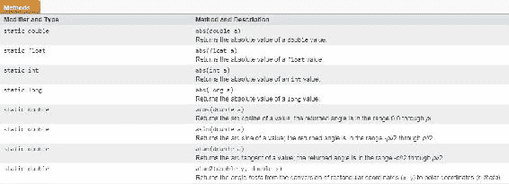

# 使用 pow()函数

其中一个函数应该引起我们的注意，那就是`pow()`，或者幂函数。它返回第一个参数（`double a`）的值提高到第二个参数（`double b`）的幂。简而言之，它允许我们将数字提高到任意幂：


让我们回到编码。好的，让我们在声明变量`number`之后使用`pow()`函数来修改它的值。我们要做的事情是`number = pow`之类的事情，但我们需要更多的信息：


我们如何使用这个`pow()`函数？嗯，如果我们点击我们的文档，我们会看到当`pow()`函数被声明时，除了它的名称之外，还有在括号之间指定的两个参数。这些参数，`double a`和`double b`，是函数在操作之前请求的两个信息。 

为了使用这个函数，我们的工作是用实际变量或显式值替换请求的`double a`和`double b`，以便`pow()`函数可以发挥作用。我们的文档告诉我们，`double a`应该被替换为我们想要提高到`double b`次幂的变量或值。

所以让我们用我们想要提高到任意幂的变量`number`替换第一个类型参数。在这一点上，`number`是`float`而不是`double`，除非我们简单地将其更改为`double`，否则这将给我们带来一些麻烦。所以让我们这样做。对于第二个参数，我们没有一个预先创建的变量来替换`double b`，所以让我们使用一个显式值，比如`4.0`：


注意，当我调用`pow()`函数时，我去掉了`double`说明符。这个说明符只是为了让我们知道 Java 期望的类型。

理论上，`pow()`函数现在具有运行并将我们的数字变量的值提高到 4 次幂所需的所有信息。然而，NetBeans 仍然给我们显示红色警告标志。现在，这是因为 NetBeans，以及 Java 本身，不知道在哪里找到这个`pow`关键字。出于与我们需要指定完整路径到`System.out.println()`相同的原因，我们需要指定一个完整路径，以便 Java 可以找到`pow()`函数。这是我们在文档中找到`pow()`函数的路径。因此，让我们在我们的代码中指定`java.lang.Math.pow()`作为它的路径：

```java
package themathlib; 

public class TheMathLib { 
    public static void main(String[] args) { 
        double number = 4.321; 
        number = java.lang.Math.pow(number, 4.0); 
        System.out.println(number); 
    } 
} 
```

现在我们基本上可以开始了。让我们在`println`语句中使用一次`number`变量，然后我们应该能够运行我们的程序：


如果我们想的话，我们可以将它插入我们的计算器，但我非常有信心，我们的程序已经输出了 4.321 的值提高到 4 次幂。

这很棒！我们刚刚使用外部代码不仅使我们的程序更容易编写，而且使它非常易读。它所需的代码行数比以前少得多。

# 导入类库

关于我们的程序，有一件事不太容易阅读，那就是到`pow()`和`println()`等函数的长路径。我们能不能缩短它们？当然可以。如果 Java 的制造商想要的话，他们可以让我们在所有情况下通过简单地输入`Math.pow()`来调用这个函数。不幸的是，这可能会产生一些意想不到的副作用。例如，如果有两个库链接到 Java，并且它们都声明了`Math.pow()`函数，Java 将不知道使用哪一个。因此，默认情况下，我们期望直接和明确地链接到库。

因此，如果我们想要只输入`Math.pow()`，我们可以将一个库导入到我们正在工作的本地空间中。我们只需要在我们的类和`main()`函数声明上面执行一个`import`命令。导入命令所需的输入只是我们希望 Java 在遇到一个关键字时查找的路径，比如`pow()`，它不立即识别。为了让我们在程序中使用更简单的语法`Math.pow()`，我们只需要输入`import java.lang.Math`：

```java
package themathlib; 

import java.lang.Math; 

public class TheMathLib { 
    public static void main(String[] args) { 
        double number = 4.321; 
        number = java.lang.Math.pow(number, 4.0); 
        System.out.println(number); 
    } 
} 
```

有一些特殊的导入语法。假设我们想要导入`java.lang`中的所有类库。为了做到这一点，我们可以用`.*`替换`.Math`，并将其变为`java.lang.*`，这意味着“导入`java.lang`包中的每个库”。我应该告诉你，在 NetBeans 中工作的人，这个导入是默认完成的。然而，在这种情况下，我们将明确地这样做，因为你可能在其他 Java 环境中工作时也需要这样做。

# 字符变量

操作数字的程序都很好，但通常我们也想要能够处理文本和单词。为了帮助我们做到这一点，Java 定义了字符或`char`，原始类型。字符是您可以在计算机上处理的最小文本实体。一开始我们可以把它们想象成单个字母。

让我们创建一个新项目；我们将其命名为`Characters.java`。我们将通过简单地定义一个单个字符来开始我们的程序。我们将其称为`character1`，并将其赋值为大写的`H`：

```java
package characters; 

public class Characters { 
    public static void main(String[] args) { 
        char character1 = 'H'; 
    } 
} 
```

就像在明确定义浮点数时我们必须使用一些额外的语法一样，当定义一个字符时，我们需要一些额外的语法。为了告诉 Java 我们在这里明确声明一个字符值，我们用两个单引号将我们想要分配给变量的字母括起来。单引号与双引号相反，让 Java 知道我们正在处理一个字符或一个单个字母，而不是尝试使用整个字符串。字符只能有单个实体值。如果我们尝试将`Hi`的值分配给`character1`，NetBeans 和 Java 都会告诉我们这不是一个有效的选项：


现在，让我们继续编写一个有些复杂但对我们的示例目的非常有效的程序。让我们定义五个字符。我们将它们称为`character1`到`character5`。我们将它们中的每一个分配给单词"Hello"的五个字母中的一个，按顺序。当这些字符一起打印时，我们的输出将显示`Hello`。在我们程序的第二部分，让我们使用`System.out.print()`在屏幕上显示这些字母。`System.out.print()`代码的工作方式与`System.out.println()`完全相同，只是它不会在我们的行末添加回车。让我们将最后一个命令设置为`println`，这样我们的输出就与控制台中呈现的所有附加文本分开了：

```java
package characters; 

public class Characters { 

    public static void main(String[] args) { 
        char character1 = 'H'; 
        char character2 = 'e'; 
        char character3 = 'l'; 
        char character4 = 'l'; 
        char character5 = 'o'; 
        System.out.print(character1); 
        System.out.print(character2); 
        System.out.print(character3); 
        System.out.print(character4); 
        System.out.println(character5); 
    } 
} 
```

如果我们运行这个程序，它会向我们打招呼。它会说`Hello`，然后还会有一些额外的文本：


这很简单。

现在让我向您展示一些东西，这将让我们对计算机如何处理字符有一点了解。事实证明，我们不仅可以通过在两个单引号之间明确声明大写字母`H`来设置`character1`的值，还可以通过给它一个整数值来设置它的值。每个可能的字符值都有一个相应的数字，我们可以用它来代替。如果我们用值`72`替换`H`，我们仍然会打印出`Hello`。如果我们使用值`73`，比`72`大一的值，而不是大写字母`H`，我们现在会得到大写字母`I`，因为 I 是紧随 H 之后的字母。

我们必须确保不要在两个单引号之间放置`72`。最好的情况是 Java 会认识到`72`不是一个有效的字符，而更像是两个字符，那么我们的程序就不会编译。如果我们用单引号括起来的单个数字，我们的程序会编译得很好，但我们会得到完全意想不到的输出`7ello`。

那么我们如何找出字符的数值呢？嗯，有一个通用的查找表，**ASCII**表，它将字符映射到它们的数值：


在本节中，我们一直在处理第 1 列（**Dec**）和第 5 列（**Chr**），它们分别是十进制数和它们映射到的字符。您会注意到，虽然许多这些字符是字母，但有些是键盘符号、数字和其他东西，比如制表符。就编程语言而言，换行、制表符和退格都是字符元素。

为了看到这个过程，让我们尝试用十进制值`9`替换程序中的一些字符，这应该对应一个制表符。如果我们用制表符替换单词中间的三个字母，作为输出，我们应该期望`H`，三个制表符和`o`：

```java
package characters; 

public class Characters { 

    public static void main(String[] args) { 
        char character1 = 'H'; 
        char character2 = 9; 
        char character3 = 9; 
        char character4 = 9; 
        char character5 = 'o'; 
        System.out.print(character1); 
        System.out.print(character2); 
        System.out.print(character3); 
        System.out.print(character4); 
        System.out.println(character5); 
    } 
```

以下是前述代码的输出：


# 字符串

让我们谈谈 Java 中的字符串。首先，创建一个新的 NetBeans 项目，命名为`StringsInJava`，并输入`main()`函数。然后，声明两个变量：一个名为`c`的字符和一个名为`s`的`String`。很快，我们就清楚地看到`String`有点不同。您会注意到 NetBeans 没有选择用蓝色对我们的`String`关键字进行着色，就像我们声明原始类型的变量时那样：


这是因为`String`不像`char`那样是原始类型。`String`是我们所谓的类。类是面向对象编程的支柱。正如我们可以声明原始类型的变量一样，我们也可以声明类的变量，称为实例。在我们的程序中，变量`s`是`String`类的一个实例。与原始类型的变量不同，类的实例可以包含由它们是实例的类声明的自己的特殊方法和函数。在本节中，我们将使用一些特定于字符串的方法和函数来操作文本。

但首先，让我们看看`String`类有什么特别之处。我们知道，我们几乎可以将字符变量和字符文字互换使用，就像我们可以用任何其他原始类型一样。`String`类也可以与字符串文字互换使用，它类似于字符文字，但使用双引号并且可以包含许多或没有字符。大多数 Java 类不能与任何类型的文字互换，而我们通过`String`类来操作字符串文字的能力正是它如此宝贵的原因。

# 连接运算符

字符串还有一项功能，大多数 Java 类都做不到，那就是利用加号（`+`）运算符。如果我们声明三个字符串（比如`s1`，`s2`和`s3`），我们可以将第三个字符串的值设置为一个字符串加上另一个字符串。我们甚至可以将一个字符串文字添加到其中。然后，我们打印`s3`：

```java
package stringsinjava; 

public class StringsInJava { 

    public static void main(String[] args) { 
        char c = 'c'; 
        String s1 = "stringone"; 
        String s2 = "stringtwo"; 
        String s3 = s1+s2+"LIT"; 
        System.out.println(s3); 
    } 
} 
```

当我们运行这个程序时，我们将看到这三个字符串被添加在一起，就像我们所期望的那样：


# toUpperCase()函数

所以我向您承诺，字符串具有简单原始类型中看不到的功能。为了使用这个功能，让我们转到我们的 Java 文档中的`String`类，网址是[docs.oracle.com/javase/7/docs/api/](http://docs.oracle.com/javase/7/docs/api/)。在 Packages 下选择 java.lang，然后向下滚动并选择 ClassSummary 中的 String。与所有 Java 类的文档一样，String 文档包含 Method Summary，它将告诉我们关于现有`String`对象可以调用的所有函数。如果我们在 Method Summary 中向下滚动，我们将找到`toUpperCase()`函数，它将字符串中的所有字符转换为大写字母：


现在让我们使用这个函数。回到 NetBeans，我们现在需要确定在我们的程序中使用`toUpperCase()`函数的最佳位置：

```java
package stringsinjava; 
public class StringsInJava { 
    public static void main(String[] args) { 
        char c = 'c'; 
        String s1 = "stringone"; 
        String s2 = "stringtwo"; 
        String s3 = s1 + s2 + "LIT"; 
        System.out.println(s3); 
    } 
} 
```

我们知道我们需要在`StringsInJava.java`程序中确定`s3`的值之后，使用`toUpperCase()`函数。我们可以做以下两件事中的任何一件：

+   在确定`s3`的值之后，立即在下一行上使用该函数（只需键入`s3.toUpperCase();`）。

+   在我们打印出`s3`的值的那一行的一部分中调用该函数。我们可以简单地打印出`s3`的值，也可以打印出`s3.toUpperCase()`的值，如下面的代码块所示：

```java
package stringsinjava; 

public class StringsInJava { 

   public static void main(String[] args) { 
      char c = 'c'; 
      String s1 = "stringone"; 
      String s2 = "stringtwo"; 
      String s3 = s1+s2+"LIT"; 

      System.out.println(s3.toUpperCase()); 
   } 
} 
```

如果您还记得我们的文档，`toUpperCase()`函数不需要参数。它知道它是由`s3`调用的，这就是它所需要的所有知识，但我们仍然提供双空括号，以便 Java 知道我们实际上正在进行函数调用。如果我们现在运行这个程序，我们将得到预期的字符串大写版本：

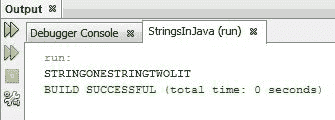

但是，重要的是我们要理解这里发生了什么。`System.out.println(s3.toUpperCase());`代码行并不修改`s3`的值，然后打印出该值。相反，我们的`println`语句评估`s3.toUpperCase()`，然后打印出该函数返回的字符串。为了看到`s3`的实际值并没有被这个函数调用修改，我们可以再次打印`s3`的值：

```java
System.out.println(s3.toUpperCase()); 
System.out.println(s3); 
```

我们可以看到`s3`保留了它的小写组件：

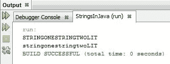

如果我们想永久修改`s3`的值，我们可以在上一行这样做，并且我们可以将`s3`的值设置为函数的结果：

```java
package stringsinjava; 

public class StringsInJava { 
    public static void main(String[] args) { 
        char c = 'c'; 
        String s1 = "stringone"; 
        String s2 = "stringtwo"; 
        String s3 = s1 + s2 + "LIT"; 

        s3 = s3.toUpperCase(); 

        System.out.println(s3); 
        System.out.println(s3); 
    } 
} 
```

以下是前面代码的输出：


# replace()函数

为了确认我们都在同一页面上，让我们再使用`String`类的一个方法。如果我们回到我们的文档并向上滚动，我们可以找到 String 的`replace()`方法：


与我们的`toUpperCase()`方法不同，它不带参数，`replace()`需要两个字符作为参数。该函数将返回一个新的字符串，其中我们作为参数给出的第一个字符（`oldChar`）的所有实例都被我们作为参数给出的第二个字符（`newChar`）替换。

让我们在`StringsInJava.java`的第一个`println()`行上使用这个函数。我们将输入`s3.replace()`并给我们的函数两个字符作为参数。让我们用字符`g`替换字符`o`：

```java
package stringsinjava; 

public class StringsInJava { 
    public static void main(String[] args) { 
       char c = 'c'; 
        String s1 = "stringone"; 
        String s2 = "stringtwo"; 
        String s3 = s1 + s2 + "LIT"; 

        s3 = s3.toUpperCase(); 

        System.out.println(s3.replace('g', 'o')); 
        System.out.println(s3); 
    } 
} 
```

当我们运行我们的程序时，当然什么也不会发生。这是因为当我们到达打印语句时，没有小写的`g`字符，也没有剩余的小写的`g`字符在`s3`中；只有大写的`G`字符。所以让我们尝试替换大写的`G`字符：

```java
System.out.println(s3.replace('G', 'o')); 
System.out.println(s3); 
```

现在，如果我们运行我们的程序，我们会看到替换发生在第一个`println`的实例上，而不是第二个实例上。这是因为我们实际上没有改变`s3`的值：

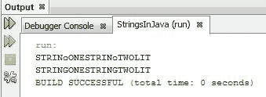

太好了！现在你已经装备精良，只要你随时准备好 Java 文档，就可以调用各种`String`方法。

# 转义序列

如果你花了很多时间处理字符串，我预计你会遇到一个常见的问题。让我们快速看一下。我要在这里写一个全新的程序。我要声明一个字符串，然后让我们的程序将字符串打印到屏幕上。但我要给这个字符串赋值的值会有点棘手。我希望我们的程序打印出`The program says: "Hello World"`（我希望`Hello World`被双引号括起来）：


这里的问题是，在字符串文字中放置双引号会让 Java 感到困惑，就像前面的屏幕截图所示的那样。当它阅读我们的程序时，它看到的第一个完整字符串是`"The program says:"`，这告诉 Java 我们已经结束了字符串。这当然不是我们想要的。

幸运的是，我们有一个系统可以告诉 Java，我们希望一个字符被视为字符文字，而不是它可能具有的特殊功能。为此，我们在字符前面放一个反斜杠。这被称为转义序列：

```java
String s= "The program says: \"Hello World\""; 
System.out.println(s); 
```

现在，当 Java 阅读这个字符串时，它将读取`The program says:`，然后看到反斜杠，并知道如何将我们的双引号视为双引号字符，而不是围绕字符串的双引号。当我们运行我们的程序时，我们将看不到反斜杠；它们本身是特殊字符：


如果我们确实想在字符串中看到反斜杠，我们需要在其前面加上一个反斜杠：

```java
String s= "The program says: \\ \"Hello World\""; 
System.out.println(s); 
```

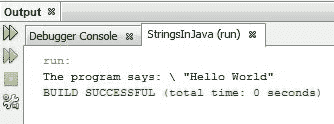

这就是字符串 101！

# 总结

在本章中，我们解释了变量是什么，以及它们对于创建更好的程序有多重要。我们详细介绍了 Java 的一些原始数据类型，即`int`、`long`、`float`、`char`和`double`。我们还看到了`String`类及其两种操作方法。

在下一章中，我们将看一下 Java 中的分支语句。
