# 分支

每次运行时执行相同操作的程序都很好，但最有趣的计算机程序每次运行时都会做一些不同的事情，这可能是因为它们具有不同的输入，甚至是因为用户正在积极地与它们交互。有了这个，让我们通过理解条件语句来启动本章，然后我们将进一步探讨 Java 如何处理复杂的条件语句，修改程序的控制流，并研究循环功能。

具体来说，本章将涵盖以下主题：

+   理解`if`语句

+   复杂的条件语句

+   `switch`、`case`和`break`语句

+   `while`和`do...while`循环

+   `for`循环

# 理解 if 语句

今天，我们将探讨非常基本的`if`和`else`条件语句。要进一步理解这一点，请参考以下项目列表：

1.  让我们在 NetBeans 中创建一个新的 Java 项目。我将把我的项目命名为`ConditionalStatements`，并允许 NetBeans 为我创建`main`类；参考以下截图：

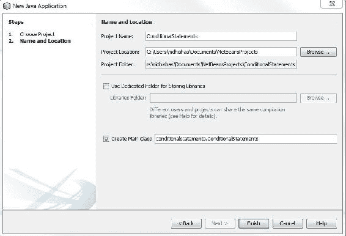

为了保持清晰，我们可以摆脱所有的注释；现在我们可以开始了。为了让我们编写更有趣的程序，我们将快速学习如何在 Java 中进行一些基本的用户输入。在这个时候，你还没有足够的知识基础来完全理解我们即将要做的复杂性，但是你可能对正在发生的事情有基本的理解，并且将来肯定可以自己重复这个过程。

在这个**InputStream**/**Console**窗口中写入是一种简单的一次性过程，但是在 Java 中读取输入可能会更加复杂：

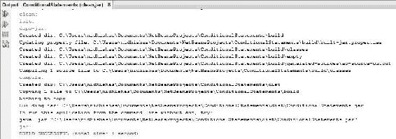

1.  用户输入被放入一个缓冲区，我们的程序在提示时访问它；因此，我们需要声明一个变量，允许我们在需要获取新用户输入时访问这个缓冲区。为此，我们将使用`Scanner`类。让我们称我们的新实例为`reader`。NetBeans 对我们大喊大叫，因为`Scanner`位于`java.util`包中，我们需要显式访问它。我们可以随时导入`java.util`包：

```java
package conditionalstatements; 

public class ConditionalStatements { 

    public static void main(String[] args) { 
        java.util.Scanner reader; 
    } 
} 
```

1.  这是你需要有点信心并超前一点，超出你现在真正准备完全理解的范围。我们需要为`reader`变量分配一个值，这个值是`Scanner`类型的，这样它就可以连接到 InputStream 窗口，用户将在其中输入。为此，我们将把它的值设置为一个全新的`Scanner()`对象的值，但是这个 Scanner 对象将使用一个类型参数，即`(System.in)`，这恰好是我们的用户将要使用的 InputStream 的链接：

```java
package conditionalstatements; 

import java.util.*; 

public class ConditionalStatements { 

    public static void main(String[] args) { 
        Scanner reader = new Scanner(System.in); 
    } 
} 
```

以下是前面代码的输出：


1.  就像我说的，这是一些重要的内容，你肯定不应该期望现在就完全理解它是如何工作的。现在，知道`reader`与我们的 InputStream 窗口连接，我们的`Scanner`对象具有`next()`函数，允许我们访问用户刚刚输入到流中的输入。就像大多数函数一样，这个函数只是返回这个输入，所以我们需要创建一个字符串来存储这个输入。

1.  完成这些后，我们可以使用`System.out.println()`函数将`input`值打印回控制台：

```java
package conditionalstatements; 

import java.util.*; 

public class ConditionalStatements { 

    public static void main(String[] args) { 
        Scanner reader = new Scanner(System.in); 
        String input = reader.next(); 
        System.out.println(input); 
    } 
} 
```

1.  当我们运行程序时，似乎没有任何事情发生，但实际上，我们的控制台在这里等待用户输入。现在，当我们在控制台中输入我们的输入并按下*Enter*键时，它将立即回显给我们：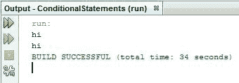

1.  我们可以通过让程序提示用户输入而不是静静地等待来使其更加友好：

```java
public static void main(String[] args) { 
    Scanner reader = new Scanner(System.in); 
    System.out.println("Input now: "); 
    String input = reader.next(); 
    System.out.println(input); 
} 
```

# 条件语句

在本章的开头，我承诺过你会学习条件语句，我们现在就要做到这一点。但首先，让我们对我们程序的用户输入部分进行一个小修改。与其获取一个字符串，如果我们学习使用用户提供的整数值来工作，那将会更容易得多。因此，让我们将我们的`input`变量的值或类型更改为`int`数据类型；`reader.next()`函数返回一个字符串，但有一个类似的函数叫做`nextInt()`，它将返回一个整数：

```java
int input = reader.nextInt(); 
```

我们肯定不会在我们非常简单的程序中加入任何错误处理机制。

要知道，如果我们不小心向这个 Java 程序提供除整数以外的任何东西，程序将崩溃。

那么条件语句到底是什么？条件语句允许我们根据某些事情是真还是假，将我们的程序引导到不同的路径上，执行不同的代码行。在本章中，我们将使用条件语句根据用户给我们的输入值来打印不同的响应。具体来说，我们将告诉他们他们给我们的值是小于、大于还是等于数字 10。为了开始这个过程，让我们设置我们的输出情况。

如果我们的用户提供的输入大于 10，我们打印出`MORE`。如果用户提供的输入恰好小于 10，我们打印出`LESS`。当然，如果我们现在运行这个程序，它将简单地打印出`MORE`或`LESS`，两行都会打印。我们需要使用条件语句来确保这两行中只有一行在任何程序运行中执行，并且当然执行正确的行。您可能已经注意到，NetBeans 为我们创建的默认项目将我们的代码分成了用大括号括起来的段。

我们可以使用自己的括号进一步将我们的代码分成段。惯例规定，一旦我们创建了一组新的括号，一个新的代码段，我们需要在括号之间的所有内容之前添加一个制表符，以使我们的程序更易读。

# 使用 if 语句

一旦我们将我们的两个`system.out.println`语句分开，我们现在可以提供必须为真的情况，如果这些语句要运行的话。为此，我们用 Java 的`if`语句作为前缀，其中`if`是一个 Java 关键字，后面跟着两个括号，我们在括号之间放置要评估的语句。如果 Java 确定我们在括号之间写的语句为真，则以下括号中的代码将执行。如果 Java 确定该语句为假，则括号中的代码将被完全跳过。基本上，我们将给这个`if`语句两个输入。我们将给它变量`input`，如果你还记得，它包含我们从用户那里得到的整数值，我们将给它显式值`10`，这是我们要比较的值。Java 理解大于（`>`）和小于（`<`）比较运算符。因此，如果我们使这个`if`语句`if(input > 10)`，那么`System.out.println`命令（如下面的屏幕截图中所示）只有在用户提供大于 10 的值时才会运行：

```java
if(input > 10) 
        { 
            System.out.println("MORE!"); 
        } 
        { 
            System.out.println("LESS!"); 
        } 
```

现在，我们需要提供一个`if`语句，以确保我们的程序不会总是打印出`LESS`。

我们可以使用小于运算符，要求我们的程序在用户提供小于 10 的输入时打印出`LESS`。在几乎所有情况下，这都是很好的，但如果我们的用户提供的输入值是 10，我们的程序将什么也不打印。为了解决这个问题，我们可以使用小于或等于运算符来确保我们的程序始终对用户输入做出响应：

```java
package conditionalstatements; 

import java.util.*; 

public class ConditionalStatements { 

    public static void main(String[] args) { 
        Scanner reader = new Scanner(System.in); 
        System.out.println("Input now: "); 
        int input =  reader.nextInt(); 

        if(input > 10) 
        { 
            System.out.println("MORE!"); 
        } 
        if(input <= 10) 
        { 
            System.out.println("LESS"); 
        } 
    } 
} 
```

现在，让我们快速运行我们的程序，确保它能正常工作。

在 InputStream 窗口中有一个输入提示。让我们首先给它一个大于 10 的值，然后按*Enter*键。我们得到了`MORE`的响应，而不是`LESS`的响应；这是我们预期的结果：


我们的程序不循环，所以我们需要再次运行它来测试`LESS`输出，这次让我们给它一个值`10`，这应该触发我们的小于或等于运算符。大功告成！


# 使用 else 语句

事实证明，有一种稍微更容易的方法来编写前面的程序。当我们编写一个条件语句或者说一对条件语句，其中我们总是要执行两个代码块中的一个时，现在可能是使用`else`关键字的好时机。`else`关键字必须跟在带括号的`if`块后面，然后跟着它自己的括号。`else`语句将在前一个`if`括号之间的代码未执行时评估为 true，并执行其括号之间的代码：

```java
import java.util.*; 

public class ConditionalStatements { 

    public static void main(String[] args) { 
        Scanner reader = new Scanner(System.in); 
        System.out.println("Input now: "); 
        int input =  reader.nextInt(); 

        if(input > 10) 
        { 
            System.out.println("MORE!"); 
        } 
       else 
        { 
            System.out.println("LESS"); 
        } 
    } 
} 
```

如果我们运行这个程序，我们将得到与之前相同的结果，只是少写了一点逻辑代码：


让我们以简要介绍我们的`if`语句中可以使用的其他运算符结束这个话题，然后我们将看看如果需要比较非原始类型的项目该怎么办。除了大于和小于运算符之外，我们还可以使用相等运算符（`==`），如果两侧的项目具有相同的值，则为 true。当使用相等运算符时，请确保不要意外使用赋值运算符（`=`）：

```java
if(input == 10) 
```

在某些情况下，您的程序不会编译，但在其他情况下，它将编译，并且您将得到非常奇怪的结果。如果您想使用相等运算符的相反操作，可以使用不等于（`!=`），如果两个项目的值不相同，则返回 true：

```java
if(input != 10) 
```

重要的是，当比较类的实例时，我们不应尝试使用这些相等运算符。我们只应在处理原始类型时使用它们。

为了证明这一点，让我们修改我们的程序，以便我们可以将`String`作为用户输入。我们将看看`String`是否等同于秘密密码代码：


如果是，它将打印出`YES`；如果不是，它将打印出`NO`。现在，NetBeans 给了我们一个警告（如前面的截图所示）；实际上，如果我们尝试使用一些不同的运算符来比较字符串，NetBeans 会让我们知道我们的程序可能甚至无法编译。这是因为 Java 不希望我们使用这些运算符来比较类的实例。相反，类应该公开允许我们逻辑比较它们的函数。几乎每个 Java 对象都有一些用于此目的的函数。其中最常见的之一是`equals()`函数，它接受相同类型的对象，并让我们知道它们是否等价。这个函数返回一个称为**布尔类型**的东西，它是自己的原始类型，可以具有 true 或 false 的值。我们的`if`语句知道如何评估这个布尔类型：

```java
import java.util.*; 

public class ConditionalStatements { 

    public static void main(String[] args) { 
        Scanner reader = new Scanner(System.in); 
        System.out.println("Input now: "); 
        String input =  reader.next(); 

        if(input.equals("password")) 
        { 
            System.out.println("YES"); 
        } 
        else 
        { 
            System.out.println("NO"); 
        } 
    } 
} 
```

让我们快速运行我们的程序，首先输入一个错误的字符串，然后输入`password`来看看我们的程序是否工作：


这就是`if-else`语句的基础。我现在鼓励你尝试一些我们看过的比较运算符，并尝试在彼此之间嵌套`if...else`语句。

最后一点，有时您可能会看到没有后续括号的`if`语句。这是有效的语法，基本上相当于将整个语句放在一行上。

# 复杂条件

首先，让我们编写一个非常简单的 Java 程序。我们将首先导入`java.util`，以便我们可以通过`Scanner`对象获得一些用户输入，并将这个`Scanner`对象与`System.in`输入字符串链接起来，这样我们就可以在控制台窗口中使用它。

完成这些后，我们需要从用户那里获取一些输入并存储它，因此让我们创建一个新的字符串并将其值分配给用户给我们的任何值。为了保持事情有趣，让我们给自己再增加两个 String 变量来使用。我们将它们称为`sOne`和`sTwo`；我们将第一个字符串变量的值分配为`abc`，第二个字符串变量的值分配为`z`：

```java
package complexconditionals; 

import java.util.*; 

public class ComplexConditionals { 
    public static void main(String[] args) { 
      Scanner reader = new Scanner (System.in); 
      String input = reader.next(); 
      String sOne = "abc"; 
      String sTwo = "z"; 
    } 
} 
```

因为这个话题是关于条件语句，我们可能需要其中之一，所以让我们创建一个`if...else`块。这是我们将评估我们条件语句的地方。我们将设置一些输出，这样我们就可以看到发生了什么。如果我们的条件语句评估为 true 并且我们进入块的以下部分，我们将简单地打印出`TRUE`：

```java
if() 
{ 
    System.out.println("TRUE");     
} 
else 
{ 

} 
```

如果条件语句评估为 false 并且我们跳过块的前一个`if`部分，而是进入`else`部分，我们将打印出`FALSE`：

```java
if() 
{ 
    System.out.println("TRUE");     
} 
else 
{ 
    System.out.println("FALSE"); 
} 
```

# 包含函数

现在可能是时候编写我们的条件语句了。让我向您介绍一个名为`contains`函数的新字符串函数：

```java
if(input.contains()) 
```

`contains`函数接受一个字符序列作为输入，其中包含一个字符串的资格。作为输出，它给我们一个布尔值，这意味着它将输出`TRUE`或`FALSE`。因此，我们的`if`语句应该理解这个函数的结果并评估为相同。为了测试我们的程序，让我们首先简单地通过以下过程。

我们将为我们的`contains`函数提供存储在`sOne`字符串中的值，即`abc`：

```java
package complexconditionals; 

import java.util.*; 

public class ComplexConditionals { 
    public static void main(String[] args) { 
      Scanner reader = new Scanner (System.in); 
      String input = reader.next(); 
      String sOne = "abc"; 
      String sTwo = "z"; 
      if(input.contains(sOne)) 
      { 
           System.out.println("TRUE");     
      } 
      else 
      { 
           System.out.println("FALSE"); 
      } 
    } 
} 
```

因此，如果我们运行我们的程序并为其提供`abcdefg`，其中包含`abc`字符串，我们将得到`TRUE`的结果。这是因为`input.contains`评估为 true，我们进入了我们的`if...else`块的`if`部分：

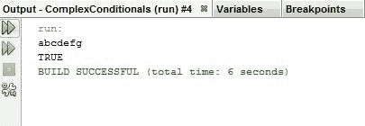

如果我们运行并提供一些不包含`abc`字符串的胡言乱语，我们可以进入块的`else`语句并返回`FALSE`：


没有太疯狂的地方。但是，假设我们想让我们的程序变得更加复杂。让我们在下一节中看看这个。

# 复杂的条件语句

如果我们想要检查并查看我们的输入字符串是否同时包含`sOne`和`sTwo`两个字符串呢？有几种方法可以做到这一点，我们将看看一些其他方法。但是，对于我们的目的来说，可能最简单的方法是在`if(input.contains(sOne))`行上使用**复杂**条件。Java 允许我们使用`&&`或`|`条件运算符一次评估多个 true 或 false 语句，或布尔对象。当与`&&`运算符比较的所有条件都评估为 true 时，`&&`运算符给我们一个 true 结果。当与`|`运算符比较的任何条件评估为 true 时，`|`运算符给我们一个 true 结果。在我们的情况下，我们想知道我们的输入字符串是否同时包含`sOne`和`sTwo`的内容，所以我们将使用`&&`运算符。这个运算符通过简单地在它的两侧提供两个条件语句来工作。因此，我们将在`sOne`和`sTwo`上运行我们的`input.contains`函数。如果`&&`运算符的两侧的这些函数都评估为 true，即(`if(input.contains(sOne) && input.contains(sTwo))`，我们的条件语句也将为 true：

```java
package complexconditionals; 

import java.util.*; 

public class ComplexConditionals { 
    public static void main(String[] args) { 
        Scanner reader = new Scanner (System.in); 
        String input = reader.next(); 
        String sOne = "abc"; 
        String sTwo = "z"; 
        if(input.contains(sOne)) 
        { 
            System.out.println("TRUE"); 
        } 
        else 
        { 
            System.out.println("FALSE"); 
        } 
    } 
} 
```

让我们运行我们的程序。`abcz`字符串在两种情况下都应该评估为 true，当我们按下*Enter*键时，我们看到实际情况确实如此：


如果我们只提供有效的字符串`z`，我们会得到一个 false 的结果，因为我们的`&&`运算符会评估为 false 和 true，这评估为 false。如果我们使用`|`运算符，这将是字符串：

```java
if(input.contains(sOne) || input.contains(sTwo)) 
```

以下是前面代码的输出：


这实际上会给我们一个真正的结果，因为现在我们只需要其中一个函数返回 true。布尔逻辑可能会变得非常疯狂。例如，我们可以将`&& false`语句放在我们的布尔条件的末尾，即`if(input.contains(sOne) || input.contains(sTwo) && false)`。在 Java 中，`true`和`false`代码术语是关键字；实际上，它们是显式值，就像数字或单个字符一样。`true`关键字评估为 true，`false`关键字评估为 false。

任何以`false`结尾的单个条件语句将始终作为整体评估为 false：

```java
if(input.contains(sOne) && false) 
```

有趣的是，如果我们返回到我们之前的原始语句，并运行以下程序，提供它最有效的可能输入，我们将得到真正的结果：

```java
package complexconditionals;
import java.util.*;
public class ComplexConditionals {
    public static void main(String[] args) {
        Scanner reader = new Scanner(System.in);
        String input = reader.next();
        String sOne = "abc";
        String sTwo = "z";
        if(input.contains(sOne) || input.contains(sTwo) && false)
        {
            System.out.println("TRUE");
        }
        else
        {
            System.out.println("FALSE");
        }
    }
}
```

以下是前面代码的输出：


有趣的是，如果 Java 首先评估`if(input.contains(sOne) || input.contains(sTwo))`语句，然后是`&& false`语句，我们将得到一个 false 的结果；相反，Java 似乎选择首先评估`(input.contains(sTwo) && false)`语句，然后是`||`语句，即`(input.contains(sOne) ||)`。这可能会让事情变得非常混乱。

幸运的是，就像在代数中一样，我们可以要求 Java 按特定顺序执行操作。我们通过用括号括起我们的代码块来做到这一点。括号内的代码块将在 Java 离开括号以评估其他内容之前进行评估：

```java
if((input.contains(sOne) || input.contains(sTwo)) && false) 
```

因此，在我们用括号括起`||`语句之后，我们将计算`||`语句，然后以`false`结束该结果：

```java
package complexconditionals;
import java.util.*;
public class ComplexConditionals {
    public static void main(String[] args) {
        Scanner reader = new Scanner(System.in);
        String input = reader.next();
        String sOne = "abc";
        String sTwo = "z";
        if((input.contains(sOne) || input.contains(sTwo)) && false)
        {
            System.out.println("TRUE");
        }
        else
        {
            System.out.println("FALSE");
        }
    }
}
```

我们现在将看到我们前面的程序总是在这里评估为 false：


复杂的条件可能会变得非常复杂。如果我们在代码中遇到这样的`if`语句，特别是如果这是我们没有编写的代码，可能需要花费很长时间才能弄清楚到底发生了什么。

# 布尔变量

为了帮助我们理解前面部分讨论的内容，我们有布尔变量：

```java
boolean bool = true; 
```

在上一行代码中，`boolean`是 Java 中的一个原始类型，`boolean`类型的变量只能有两个值之一：它可以是`true`或`false`。我们可以将我们的布尔变量的值设置为任何条件语句。因此，如果我们想要简化实际`if`语句中的代码外观，我们可以继续存储这些布尔值：

```java
boolean bool1 = input.contains(sOne); 
boolean bool2 = input.contains(sTwo);  
```

在实际评估`if`语句之前，我们需要这样做，使一切更加紧凑和可读：

```java
if((bool1 || bool2) && false) 
```

记住，游戏的名字是尽可能保持我们的代码简单和可读。一个非常长的条件语句可能写起来感觉很棒，但通常有更加优雅的解决方案。

这就是 Java 中复杂条件的实质。

# Switch，case 和 break

在本节中，我们将看一下`switch`语句，这是我们可以修改程序控制流的另一种方式。

首先，在 NetBeans 中创建一个新项目。至少在我的端上，我要摆脱所有这些注释。为了展示`switch`语句的强大，我们将首先编写一个仅使用`if`块的程序，然后将程序转换为使用`switch`语句的程序。以下是仅使用`if`块的程序的步骤：

1.  首先，让我们简单地声明一个变量`x`（`int x =1;`），这是我们的目标：如果`x`的值是`1`、`2`或`3`，我们想要分别打印出响应`RED`、`BLUE`或`GREEN`。如果`x`不是这些数字之一，我们将只打印出默认响应。

1.  使用`if`块做这件事情相当简单，尽管有点乏味：

```java
if(x == 1) 
{ 
System.out.println("RED") 
} 
```

然后，我们基本上只需复制并粘贴这段代码，并为蓝色和绿色情况进行修改：

```java
int x=1; 
if(x==1) 
{ 
    System.out.println("RED"); 
} 
if(x==2) 
{ 
    System.out.println("BLUE"); 
} 
if(x==3) 
{ 
    System.out.println("GREEN"); 
} 
```

1.  对于我们的默认情况，我们只想检查`x`不等于`1`，`x`不等于`2`，`x`不等于`3`：

```java
if((x != 1) && (x != 2) && (x != 3)) 
{ 
    System.out.println("NONE"); 
} 
```

让我们快速运行一下我们的程序：

```java
package switcher; 

public class Switcher { 
    public static void main(String[] args) { 
        int x=1; 

       if(x==1) 
       { 
           System.out.println("RED"); 
       } 
       if(x==2) 
       { 
           System.out.println("BLUE"); 
       } 
       if(x==3) 
       { 
           System.out.println("GREEN"); 
       } 
    } 
} 
```

以下是预期结果的屏幕截图：

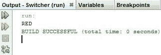

这是我们在编写更大程序的过程中可能会做的事情的简化版本。虽然我们以相当快的速度组织了这个程序，但很容易看出，如果我们要处理许多可能的`x`情况，这个问题将变得非常难以控制。而且，对于某人来阅读和弄清楚这里发生了什么，也是相当困难的。解决方案，你可能已经猜到了，是使用`switch`语句来控制程序的流程。

# 使用 switch、case 和 break 的程序

当我们想要根据一个变量的值执行不同的行或代码块时，`switch`语句非常有效。现在让我们使用`switch`语句来重写我们的一系列`if`块。语法在以下步骤中解释：

1.  我们首先声明我们将使用`switch`语句，`switch`是 Java 中的一个保留关键字。然后，我们提供我们希望`switch`语句作用的变量的名称，在这种情况下是`x`，因为我们将根据`x`的值执行不同的代码块：

```java
package switcher; 

public class Switcher { 
    public static void main(String[] args) { 
        int x=1; 

        switch(x) 
        { 

        } 
    } 
} 
```

然后，就像使用`if`或`else`语句一样，我们将使用两个括号创建一个新的代码段。

1.  现在，我们不再创建一系列难以控制的`if`块，而是使用`case`关键字在我们的`switch`语句中创建单独的代码块。在每个`case`关键字之后，我们给出一个规定的值，如果`x`的值与`case`关键字的值匹配，接下来的代码将执行。

因此，就像我们在做`if`块时一样，如果`x`的值是`1`，我们想要打印出`RED`。现在为每种可能的值编写单独的情况变得更加清晰和易于阅读。

1.  `switch`语句还有一个特殊情况，即`default`情况，我们几乎总是将其放在`switch`语句的末尾。

只有在其他情况都没有执行时，这种情况才会执行，这意味着我们不必为我们最后的`if`块编写复杂的布尔逻辑：

```java
package switcher; 

public class Switcher { 
    public static void main(String[] args) { 
        int x=7; 

        switch(x) 
        { 
            case 1: case 5: case 7: 
                System.out.println("RED"); 
            case 2: 
                System.out.println("BLUE"); 
            case 3: 
                System.out.println("GREEN"); 
            default: 
                System.out.println("NONE"); 
        } 
    }  
} 
```

如果我们运行前面的程序，实际上会看到每种可能的输出都会执行。这是因为我们忘记了做一件非常重要的事情：

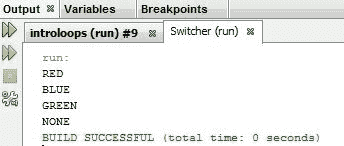

`switch`语句允许我们创建复杂的逻辑树，因为一旦一个`case`开始执行，它将继续执行，即使通过了队列中的下一个`case`。因为我们正在编写一个非常简单的程序，我们只希望执行一个`case`，所以我们需要在进入一个`case`并完成代码后明确结束执行。

1.  我们可以使用`break`关键字来做到这一点，它存在于一行代码中，并且简单地将我们从当前的`case`中跳出来：

```java
package switcher; 

public class Switcher { 
    public static void main(String[] args) { 
        int x=1; 

        switch(x) 
        { 
            case 1: 
                System.out.println("RED"); 
                break; 
            case 2: 
                System.out.println("BLUE"); 
                break; 
            case 3: 
                System.out.println("GREEN"); 
                break; 
            default: 
                System.out.println("NONE"); 
        } 
    } 
} 
```

现在，如果我们运行我们的程序，我们将看到预期的结果：


1.  除了从一个情况自由地转到另一个情况，我们还可以通过在一行中添加多个情况来增加我们的 switch 语句的复杂性和功能。因为情况自由地相互转到，做一些像`case 1: case 5: case;`这样的事情意味着如果我们提供这些数字之一：`1`，`5`或`7`，接下来的代码块将执行。所以这是`switch`语句的快速简单方法：

```java
package switcher; 

public class Switcher { 
    public static void main(String[] args) { 
        int x=7; 

        switch(x) 
        { 
            case 1: case 5: case 7: 
                System.out.println("RED"); 
                break; 
            case 2: 
                System.out.println("BLUE"); 
                break; 
            case 3: 
                System.out.println("GREEN"); 
                break; 
            default: 
                System.out.println("NONE"); 
        } 
    } 
} 
```

以下是前面代码的输出：

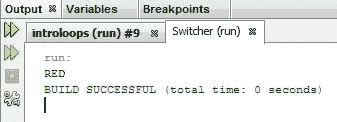

Switch 语句基本上是使用等号（`==`）运算符比较我们正在切换的变量或显式值和情况。如果元素不能使用等号运算符进行比较，switch 语句将无法正常工作。

从 Java SE v7 开始，您可以使用等号运算符比较字符串，因此可以在`switch`语句中使用它们。这并不总是这样，而且最好避免在`switch`语句中使用等号运算符与字符串。这是因为它破坏了您正在编写的代码的向后兼容性。

# While 和 do...while 循环

欢迎来到循环的入门课程。在本节结束时，我们将掌握 Java 的`while`和`do...while`循环。我对此感到非常兴奋，因为循环允许我们执行一块 Java 代码多次，正如我们所希望的那样。这是我们学习过程中非常酷的一步，因为能够连续多次执行小任务是使计算机在某些任务上比人类更优越的原因之一：

1.  开始这个话题，让我们创建一个新的 NetBeans 项目，输入`main`方法，然后简单地声明一个整数并给它一个值。我们可以选择任何正值。我们将要求我们的程序打印出短语`Hello World`的次数等于我们整数的值。

1.  为此，我们将使用`while`循环。`while`循环的语法看起来很像我们在写一个`if`语句。我们从保留的`while`关键字开始，然后跟着两个括号；在这些括号里，我们最终会放置一个条件语句。就像它是一个`if`语句一样，只有当我们的程序到达我们的`while`循环并且评估其条件语句为真时，接下来的代码块才会执行：

```java
package introtoloops; 

public class IntroToLoops { 
    public static void main(String[] args) { 
        int i=5; 

        while () 
        { 

        }  
    } 
} 
```

然而，将`while`循环与`if`语句分开的是，当到达`while`循环的代码块的末尾时，我们的程序基本上会跳回并再次执行这行代码，评估条件语句并且如果条件语句仍然为真，则重新进入`while`循环的代码块。

让我们从设置`while`循环的逻辑开始。我们希望循环执行的次数存储在整数 i 的值中，但我们需要一种方法将这个值传达给我们的循环。嗯，任何不会无限运行的循环都需要在循环内容中进行一些控制流的改变。在我们的情况下，让我们每次循环运行时改变程序的状态，通过减少 i 的值，这样当 i 达到 0 时，我们将循环运行了五次。

1.  如果是这种情况，这意味着我们只希望我们的循环在`i`的值大于`0`时执行。让我们暂停一下，快速看一下这行代码。这里`i = i -1`是一个完全有效的语句，但我们可以使用一个更快更容易阅读的快捷方式。我们可以使用`i--`来将整数变量的值减少一。一旦我们设置好这个，唯一剩下的事情就是将功能代码放在我们的循环内；那就是一个简单的`println`语句，说`Hello world`：

```java
package introtoloops; 

public class IntroToLoops { 
    public static void main(String[] args) { 
        int i=5; 

        while (i>0) 
        { 
            System.out.println("Hello world"); 
            i--; 
        }  
    } 
} 
```

1.  现在，让我们运行我们的程序，看看会发生什么：

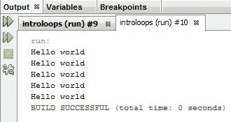

好了，五个`Hello world`实例打印到我们的控制台窗口中，就像我们打算的那样。

# While 循环

通常，我们允许小程序，比如我们在这里编写的程序，在没有更多代码可执行时结束。但是，在使用循环时，我们可能会错误地创建一个无限的`while`循环并运行一个没有结束的程序：

```java
package introtoloops; 

public class IntroToLoops { 
    public static void main(String[] args) { 
        int i=5; 

        while (i>0) 
        { 
            System.out.println("Hello world"); 
        }  
    } 
} 
```

当这种情况发生时，我们需要手动关闭我们的程序。在 NetBeans 中，输出窗口的左侧有一个称为“停止”的方便小功能：

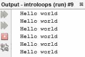

如果我们通过命令提示符运行程序，“Ctrl”+“C”是取消执行程序的常用命令。现在我们已经掌握了基本的`while`循环语法，让我们尝试一些更复杂和更动态的东西：

1.  我心目中的程序将需要一些用户输入，因此让我们导入`java.util`并设置一个新的`Scanner`对象：

```java
public class IntroToLoops { 
    public static void main(String[] args) { 
        Scanner reader = new Scanner(System.in); 
```

1.  不过，我们不会立即收集用户输入，而是每次我们的`while`循环成功执行时收集新的用户输入：

```java
while(i > 0) { 
   reader.nextLine(); 
   System.out.println("Hello world"); 
} 
```

1.  每次我们收集这个输入，我们都需要一个地方来存储它，所以让我们创建一个新的字符串，其目的是存储新获取的输入的值：

```java
public class IntroToloops { 
    public static void main(String[] args) { 
        Scanner reader = new Scanner(System.in); 
        String input; 
        int i=5; 
        while(i>0) { 
            input= reader.nextLine(); 
            System.out.println("Hello world"); 
        } 
    }   
} 
```

这个`input`变量的值将在程序执行过程中多次更改，因为在每个`while`循环的开始，我们将为它分配一个新值。如果我们简单地执行这个程序，对我们用户来说将不会很有趣，因为当我们为它分配一个新值时，输入字符串的旧值将不断丢失。

1.  因此，让我们创建另一个字符串，其目的是存储我们从用户那里得到的所有连接值。然后，在我们的程序结束时，我们将打印出这个字符串的值，以便用户可以看到我们一直在存储他们的输入：

```java
public class IntroToloops { 
    public static void main(String[] args) { 
        Scanner reader = new Scanner(System.in); 
        String input; 
        String all = ""; 
        int i=5; 
        while(i>0) { 
            input = reader.nextLine(); 
        }   
        System.out.println(all); 
    }   
}
```

1.  在这里所示的行上将输入的值添加到所有字符串中：

```java
while(i>0) { 
   input = reader.nextLine(); 
   all = 
}
```

我们可以做一些事情。我们可以使用加法运算符很好地添加字符串。因此，`all = all + input`语句，其中`all`和`input`是字符串，加号是完全有效的。但是，当我们将某物添加到它自身并使用原始类型或可以像字符串一样起作用的类型时，我们还可以使用`+=`运算符，它执行相同的功能。此外，我们不能忘记重新实现整数值`i`的递减，以便我们的程序不会无限运行：

```java
package introtoloops; 
import java.util.*; 
public class IntroToLoops { 
    public static void main(String[] args) { 
        Scanner reader = new Scanner(System.in); 

        String input; 
        String all = ""; 
        int i=5; 

        while (i>0) { 
            input = reader.nextLine(); 
            all += input; 
            i--; 
        }  
        System.out.println(all); 
    } 
 }  
```

现在，如果我们运行这个程序并提供五个输入字符串，我们将得到如下屏幕截图所示的输出：

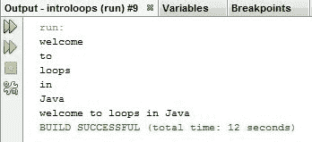

我们将看到它们如预期般全部输出，这很酷，但我对这个程序有更大的计划。

实际上，如果我们只想编写我们在这里拥有的程序，稍后我们将学习的`for`循环可能完全合适。但是对于我们即将要做的事情，`while`和`do...while`循环是非常必要的。我想做的是在这个程序中摆脱我们的计数变量。相反，我们将允许用户告诉我们何时停止执行我们的程序。

当用户将输入的值设置为`STOP`字符串时，以所有大写字母，我们将退出执行我们的`while`循环并打印出他们迄今为止给我们的所有字符串。因此，我们只希望这个`while`循环在输入的值不是`STOP`值时运行。您会注意到，我们将得到一个预编译错误，如下屏幕截图所示：


如果我们尝试运行程序，我们将会得到一个完整的编译器错误。这是因为我们的程序知道，当我们尝试执行这个条件语句的时候，输入的值还没有被设置。即使输入的不存在的值不等于`STOP`，这也是非常糟糕的形式。在这里的字符串情况下，它不是一个原始的值，我们的计算机在给它任何值之前是不可能访问它的任何方法的。

这里一个不太优雅的解决方案是给输入一个起始值，就像我们在`all`中所做的那样，但有一个更好的方法。一旦我们的循环执行了一次，我们知道输入将会有一个由用户给出的正确值，这个值可能是`STOP`，也可能不是。

# do...while 循环

如果我们不是在循环的开始检查条件，而是在循环的结束检查条件呢？这实际上是一个选项。`do...while`循环的操作方式与`while`循环相同，但第一次运行时，它们不会检查条件是否为真；它们只会运行并在最后检查它们的条件语句。我们需要在`do...while`循环的后面的条件语句的末尾加上一个分号。我提到这个是因为我总是忘记。现在，如果我们运行我们的程序，我们可以输入任意数量的字符串，然后输入`STOP`字符串，以查看到目前为止我们输入的所有内容并打印到屏幕上：

```java
public static void main(String[] args) { 
    Scanner reader = new Scanner(System.in); 

    String input; 
    String all = ""; 
    int i=5; 

    do 
    { 
        input = reader.nextLine(); 
        all += input; 
        i--; 
    } while(!input.equals("STOP")); 
    System.out.println(all); 
} 
```

以下是前面代码的输出：

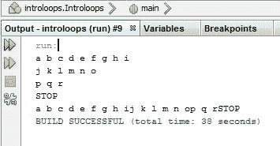

最后一点说明，几乎任何后面跟着自己代码块的东西，你会看到这样的语法，你会有一个关键字，可能是一个条件语句，然后是后面的括号；或者，你可能会看到括号从与关键字和条件语句相同的行开始。这两种方法都是完全有效的，事实上，括号从与关键字相同的行开始可能很快就变得更加普遍。

我鼓励你玩弄一下我们写的程序。尝试执行你认为会推动字符串所能容纳的信息量边界的循环，或者玩弄一下向屏幕呈现大量信息的循环。这是计算机做的事情，我们简单地无法用铅笔和纸做到，所以这很酷。

# for 循环

在这一部分，我们将快速看一下`for`循环。我们使用`for`循环以非常语义优雅的方式解决 Java 中的一个常见问题。当我们需要迭代一个变量来计算我们循环了多少次时，这些循环是合适的。

首先，我写了一个非常基本的程序，使用了一个`while`循环；它将值`1`到`100`打印到我们屏幕上的窗口。一旦你在脑海中理清了这个`while`循环是如何工作的，我们将使用`for`循环编写相同的循环，这样我们就可以看到在这种特定情况下`for`循环更加优雅。让我们注释掉我们的`while`循环，这样我们仍然可以在下面的截图中看到它，而不执行任何代码，并开始编写我们的`for`循环：

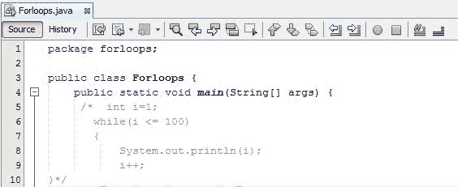

`for`循环的基本语法看起来非常类似于`while`循环。我们有保留关键字，在两个括号中我们将放一些循环需要的信息，以及我们将要循环的代码块。与`while`循环不同的是，`while`循环只在这些括号之间提供一个条件语句，而我们将为`for`循环提供大量信息。因为`for`循环设计用于处理特定情况，一旦我们提供了所有这些信息，它就会准确知道如何处理。这减轻了我们处理循环外的代码和在循环内手动递增或递减的需要。它使我们的代码的功能部分，即`println`语句，以及在更复杂的程序中可能在`for`循环内的更复杂的信息，更加独立。

我们典型的`for`循环需要三个输入。它们如下：

1.  首先，我们需要声明我们将要递增或递减以计算我们循环的次数的变量。在这种情况下，我们将使用一个整数`i`，并给它一个初始值`1`。我们在这个初始语句后面加上一个分号。这不是一个函数调用；这是`for`循环的特殊语法。

1.  特殊语法需要的第二个信息是我们需要评估每次重新开始循环时的条件语句。如果这个条件语句不成立，那么我们的`for`循环就结束了，我们继续在`for`循环块之后恢复我们的代码。在这种情况下，我们的条件语句将与`while`循环的条件语句相同。我们希望我们的`for`循环的最后一次迭代是当`i`等于`100`时，也就是当我们打印出`100`时。一旦`i`不再小于或等于 100，就是退出我们的`for`循环的时候了。

1.  就像我们特别给`for`循环的第一个信息使我们不必处理循环范围之外的变量一样，我们将给`for`循环的最后一个信息取代我们在循环范围内手动递增或递减计数器。这是特殊的修改代码，无论我们在这里为`for`循环提供什么，都将在每次循环结束时运行。在这种情况下，我们只想在每次循环结束时递增`i`的值。我想你会同意，这个程序比我们的`while`循环要干净得多：

```java
package forloops; 

public class Forloops { 
    public static void main(String[] args) { 
    /*  int i=1; 
        while(i <= 100) { 
            System.out.println(i); 
            i++; 
        }*/ 
        for(int i=1; i<=100; i++) 
        { 
            System.out.println(i); 
        } 
    } 
} 
```

现在，让我们检查一下它是否执行了相同的任务，即将值从`1`打印到`100`到我们的屏幕上，如下面的截图所示：

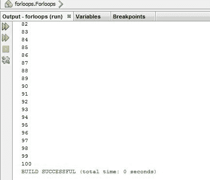

如果这个语句在我们的`for`循环的最开始执行，`0`就是正确的，但是这个语句在最后执行。

当我们在 Java 或任何编程语言中处理大数字和增量时，我们会遇到错误，就像我们刚刚遇到的那样，**一错再错**（**OBOE**）错误。OBOE 是那种即使有经验的程序员也会遇到的小逻辑错误，如果他们不注意或者只是看错了一瞬间。学会识别 OBOE 的症状，例如，输出的行数比预期的多一行，将使我们能够更有效地追踪并找到它们。

# 摘要

在本章中，我们基本上看到了如何使用条件`if...else`语句来运行复杂的条件，使用诸如`contains`、`complex`和`boolean`等函数。我们通过程序详细讨论了`switch`、`case`和`break`的复杂性；此外，我们深入探讨了如何使用`while`、`do...while`和`for`循环的循环功能。

在下一章中，我们将看一下所谓的**数据结构**。
