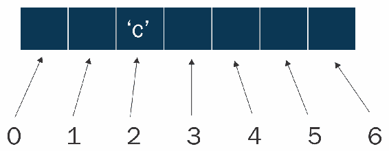
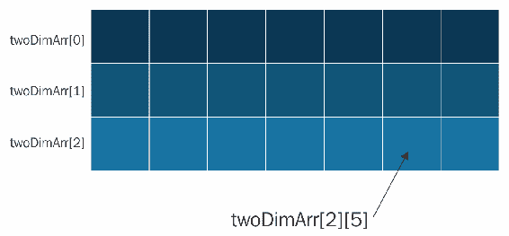
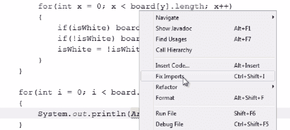
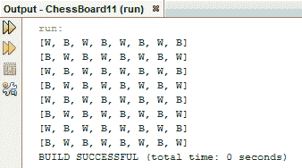
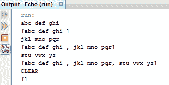
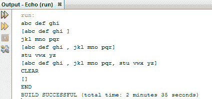

# 数据结构

在本章中，我们将学习 Java 中一些最重要的数据结构。我们将研究数组是什么，以及当我们需要处理变量序列时它们如何有用。我们将在 NetBeans 中使用数组编写一个程序来理解它们的工作原理。本章还将介绍多维数组的概念。我们将编写一个程序，使用二维数组创建一个棋盘。

接下来，本章将说明 ArrayList 是什么，以及与数组相比，它们如何提供增强功能。最后，我们将看看`Map`数据结构，并在 NetBeans 中实现它。

更具体地，我们将涵盖以下主题：

+   数组及其语法

+   一个打印英文字母表的数组示例

+   多维数组

+   使用 2D 数组创建棋盘的程序

+   ArrayList 及其示例

+   在 NetBeans 中的地图及其实现

# 使用数组

在本节中，我们将学习 Java 数组。数组是 Java 最基本和常用的数据结构。数据结构是一种工具，允许我们存储和访问信息序列，而不是使用单个变量。当我们在本地编程空间中需要一个特定的信息片段时，变量非常有用，但是当我们想要存储大量或复杂的信息集或系列时，就会使用数据结构。我们将从一些视觉学习模式开始本节，然后我们将进入 NetBeans IDE 编写一些实际的 Java 代码并使用数组。

# 声明和初始化数组

让我们首先看一下在 Java 中声明和初始化数组的语法。以下代码行将使一个数组产生，有足够的空间来容纳七个字符：

```java
char[] arrayVar = new char[7]; 
```

在我们的赋值运算符（`=`）的左侧，语法看起来非常熟悉，与声明任何其他原始或对象时使用的语法非常相似。我们首先告诉 Java 我们要在这里声明什么类型的元素。在这种情况下，我们声明了一个字符数组。空方括号让 Java 知道，我们不是要创建一个单个字符变量，而是要声明一个数组类型变量，因为我们的数组就像任何其他变量一样。我们将通过数组的变量名本身访问数组的元素，而不是通过元素的单独变量名，因为它们被存储在数组中，我们不需要分配它们。告诉 Java 我们要创建什么类型的数组后，我们给我们的数组变量一个名称。我把这个叫做`arrayVar`。

在我们的等号运算符右侧，情况看起来有些不同。您可能已经在过去看到`new`关键字的使用，当我们需要创建一个对象的新实例时，而不是原始元素。在 Java 中创建原始元素时，Java 知道需要多少内存空间来存储原始元素，无论其值如何。然而，对象和数组可能具有许多不同的大小要求。因为单个数组变量可以分配给不同长度的数组，所以当我们创建它们时，我们需要告诉 Java 为这些不同长度的数组中的每一个分配多少内存。因此，在创建对象或数组时，我们使用`new`关键字告诉 Java 应该设置多少内存空间来放置我们即将产生的东西，而那个东西是一个长度为七的字符数组。

在声明和初始化我们的七个字符数组之后，我们程序的本地内存中存在以下内容：


我们的数组基本上是一个足够大的内存块，可以存储七个单独的字符。

# 为数组分配值

当我们调用`arrayVar`变量时，我们的程序访问数组的位置。这使我们能够运行以下代码行：

```java
arrayVar[2] = 'c'; 
```

我们的`arrayVar`变量基本上让我们可以访问七个不同的字符变量。当我们不想给我们的`arrayVar`变量分配一个新的数组时，我们可能会单独访问这些字符变量。我们只需使用`arrayVar`的变量名，后面跟着方括号，其中包括我们想要访问的单个字符的索引。请记住，当我们的计算机计算索引时，它们几乎总是从**0**开始。因此，在 Java 中，我们的七个字符数组具有这些索引：**0**，**1**，**2**，**3**，**4**，**5**和**6**。如果我们执行上面的代码行，同时将我们的`arrayVar`中索引`2`的值设置为`c`，我们将取出内存的第三个块，并将其值分配给字符`c`，如下图所示：



有时，当我们声明一个数组时，我们只想继续在代码中明确地为所有的内存块分配值。当我们想要这样做时，我们可以像明确声明原始类型一样，而不是使用`new`关键字并让计算机告诉它数组的长度，我们可以明确声明一个数组。例如，我们可以使用以下代码为我们的`arrayVar`变量做到这一点：

```java
arrayVar = {'a', 'b', 'c', 'd', 'e', 'f', 'g'}; 
```

前面的语句将创建一个长度为七的数组，因为声明了七个元素，并且当然，它将相应地映射值：


现在，让我们跳入一些 Java 代码，并让数组开始工作。

# NetBeans 中的数组示例

好了，我想现在是时候运用我们的新知识并编写一个计算机程序了。数组允许我们处理在单个元素级别处理起来会很麻烦的信息量。因此，我们将直接进入重要的内容，并创建一个很酷的计算机程序。数组是一个很大的逻辑步骤，如果你以前没有使用过类似的东西，可能需要一点时间来理解它们。好消息是，如果你通过了 Java 中的数组，你可能会很好地处理语言可以给你带来的其他任何东西。

我想要编写的程序将把英语字母表打印到屏幕上。当然，我们可以自己做所有这些，只需按照以下代码的方式进行：

```java
System.out.println("abcdefg"); 
```

然而，使用这个方法相当令人昏昏欲睡，而且不会教会我们太多东西。相反，我们要编写的程序将学习、存储并打印出英语字母表。

为了做到这一点，我们需要运用我们对数组的新知识，我们对字符如何工作和在 ASCII 表上映射整数值的现有知识，以及一个`for`循环。

# 创建一个数组

让我们开始我们的编程，声明并初始化一个字符数组，用来存储英语语言的字符。因此，我们告诉 Java 我们需要一个变量来指向一个字符数组。我会把这个变量称为`alpha`。然后我们要求 Java 使用`new`关键字为`26`个字符分配内存空间，因为英语语言有 26 个字母：

```java
char[] alpha = new char[26]; 
```

现在，如果你记得，字符值也可以映射到整数值。要找到这些值，我们将查找 ASCII 表。（您可以在[www.asciitable.com](http://www.asciitable.com/)上访问 ASCII 表。）


我们要找的值是**97**，小写字母**a**的整数值，这是英语语言中的第一个字符。因此，让我们在我们的程序中创建一个小注释，并将值`97`存储起来以备后用：

```java
package alphabet; 

public class Alphabet { 
    public static void main(String[] args) { 
        // 97 
        char[] alpha = new char[26]; 
    } 
} 
```

# 创建一个 for 循环

现在让我们开始创建我们的`for`循环。我们的`for`循环将运行 26 次；每次运行时，它将取出英语字母表中的下一个字符，并将其放入我们的字符数组`alpha`中。

为了确保我们的`for`循环运行 26 次，我们应该声明一个计数变量，比如`i`，并将其设置为`0`，即（`i=0`）。接下来，让我们说我们的`for`循环应该继续运行，只要我们的计数变量的值小于`26`，也就是说，它应该在`0`和`25`之间取值（`i<26`）。最后，每次我们的`for`循环运行时，我们需要增加我们的计数变量的值，以便它每次都增加，经过 26 次迭代后，`i<26`语句将不再为真，我们的循环将在（`i++`）处停止： 

```java
for(int i = 0; i < 26; i++) 
{ 

} 
```

现在，在我们的`for`循环内部，我们将逐个为字符数组中的空格赋值。要访问其中一个空格，我们将使用分配给数组的变量的名称，即`alpha`，后跟方括号内的数字（或索引），以告诉 Java 我们想要为数组中的哪个字符赋值。

我们数组的索引应该在每次循环中都不同。这就是`for`循环的美妙之处。通过将我们的计数变量`i`从`0`开始，我们可以使用它来映射到数组的索引。也就是说，我们可以使用`alpha[i]`逐个访问数组的元素。随着循环运行，我们的计数变量的值将从 0 到 25 变化。数组的索引值（因为计算机从零开始计数）也从 0 到 25 变化。

那么，我们为每个字符分配什么值，以便我们的计算机学会字母表呢？嗯，我喜欢这样想：当我们第一次运行循环时，当`i`为`0`时，我们数组的第一个元素的值应该是`97`，这是字符**a**的整数值。现在，当我们应该将`97+i`作为数组中每个字符的值。当我们第二次运行循环时，`i`增加了一，我们将分配值 97 + 1，或**98**，这是字符**b**的整数值：

```java
for(int i = 0; i < 26; i++) 
{ 
    alpha[i] = (char)(97 + i); 
} 
```

在这种情况下，Java 要求我们明确告诉它，我们希望将这个整数值转换为字符，然后存储它。

# 打印字母表

现在，要完成我们的程序，我们需要做的就是打印出我们的`alpha`数组。为此，让我们利用一个始终可访问的对象中的一个巧妙的函数，称为`Arrays`。`Arrays.toString()`函数将转换为字符串的单维数组（这是我们创建的数组的类型），可以转换为字符串：

```java
public class Alphabet { 
    public static void main(String[] args) { 
        //97 
        char[] alpha = new char[26]; 

        for(int i = 0; i < 26; i++) 
        { 
            alpha[i] = (char)(97 + i); 
        } 

        System.out.println(Arrays.toString(alpha)); 
    } 
} 
```

现在，如果我们运行我们的程序，我们将看到 Java 以数组形式表示的英文字母：

！[](img/f64fbff0-7f63-4e4b-bc9b-42930ad80643.jpg)

如果您一直跟着做，那么您应该给自己一个坚实的鼓励。我们刚刚做了一些重活。

# Java 中数组的默认初始化

现在，让我们回到理论中的其余部分。我之前误导了你，让你相信我们新创建的数组是用空内存空间填充的。实际上，当我们声明一个新的原始类型数组，即字符、整数、布尔值、浮点数等时，Java 会用默认值填充它。例如，我们的七个字符的新数组被七个空格字符填充，也就是如果您在键盘上按空格键会得到的结果：

！[](img/83398f87-f920-4c84-9b7d-3a7227bb310a.png)

同样，整数数组将填充七个零：

！[](img/c2e6f3b3-fef4-445f-9385-8a0f2eb177a9.png)

我建议您启动 Java IDE 并创建一些空的原始数组，并使用`println`将它们打印出来，以查看默认值是什么。

现在我们可以创建任何可用对象的数组。但是，与原始类型不同，对象在初始化为数组的一部分时不会设置默认值。这是一个重要的事实。

我们需要使用`new`关键字创建的任何内容都不会在数组中进行默认初始化。

假设出于某种原因，我们决定必须在数组中有七个`Scanner`对象。以下语句并不会为我们创建七个`Scanner`对象；它只是简单地设置了内存空间：


我们可以创建`Scanner`对象并将它们分配到这些内存空间，但如果在我们分配`Scanner`对象给内存位置之前尝试调用其中一个内存空间并使用 Scanner 特定的函数，我们的程序将崩溃。我们将得到所谓的`NullReferenceException`，这意味着 Java 要求虚无行为像一个`Scanner`对象。

# 多维数组

在 Java 中，我们最基本的数据结构是数组，它允许我们存储轻类型信息的序列，并通过内存中的单个位置访问这些信息。然而，有时数组不灵活，我们希望使用更强有力的组织数据结构，以便人类更容易理解和编写程序。在这种情况下，通常适合使用多维数组。

“多维数组”听起来是一个相当可怕的名字，但实际上它背后的概念非常基本。问题是如果我们创建一个数组的数组会发生什么？以下代码显示了如何做到这一点的语法：

```java
char[][] twoDimArr = new char[3][7];
```

这行代码将创建一个二维多维数组。你会看到它非常类似于在正常情况下简单创建字符数组的语法，但在我们现在引用数组变量的每个实例中，Java 将需要两个信息（或两个索引）。前面的代码将告诉 Java 创建三个数组，每个数组都有足够的空间来存储七个字符或长度为七的三个数组：



为了巩固我们对这个概念的理解，让我们编写一个利用二维数组的 Java 程序。

# 在 NetBeans 中的多维数组示例

我们可以使用多维数组以抽象的方式存储信息，但最容易的学习方法可能是通过用二维数组表示实际的二维对象，比如国际象棋棋盘。

经典的国际象棋棋盘被分成黑色和白色方块；宽度为八个方块，高度为八个方块。我们即将编写的程序将在 Java 中存储一个虚拟棋盘，并正确标记黑色和白色方块。然后，在最后，我们将打印出这个棋盘，以便我们可以检查我们是否正确地编写了程序。

# 创建多维数组

让我们首先声明并初始化我们将要使用的数组。我们将使用字符数组来完成这个任务，给白色方块赋予字符值`W`，给黑色方块赋予字符值`B`。由于国际象棋棋盘是一个八乘八的网格，我们将声明一个包含八个数组的二维数组，每个数组应包含八个字符：

```java
char[][] board = new char[8][8]; 
```

让我们通过将我们棋盘的尺寸存储在一个单独的位置来使某人更难无意中破坏。为此，只需创建一个名为`boardDim`的变量，为棋盘尺寸，将其赋值为`8`，然后在创建数组时引用它。数组将很乐意使用变量中的整数来初始化自己，让我们可以根据需要创建动态链接的数组。现在，如果有人想要扩大我们的国际象棋棋盘，他们只需要改变`boardDim`的值：

```java
int boardDim = 8; 
char[][] board = new char[boardDim][boardDim]; 
```

为了给我们的方块分配适当的值，我们需要循环遍历这个数组，以便到达每个单独的节点并给它赋予我们想要的值。

# 使用嵌套循环进行多维数组

循环和数组非常合适，因为数组总是知道它们的长度，但单个`for`循环不能让我们有意义地循环遍历二维数组。`for`循环实际上只是沿着一个方向进行，而我们的二维数组有两个方向。

为了解决这个问题，我们将利用嵌套的`for`循环，或者`for`循环中的`for`循环。我们的外部`for`循环将依次循环每个数组，而内部`for`循环的工作将是循环遍历这些数组包含的节点。

创建`for`循环时的常见做法是使用整数变量`i`作为初始`for`循环，然后使用`j`、`k`等变量作为后续`for`循环。然而，因为我们正在创建一个实际对象的棋盘，我将选择值`y`作为我们外部循环的计数变量。这是因为我们的循环正在沿着棋盘的*y*轴进行迭代。

如前所述，`for`循环和数组非常合适，因为数组知道它们的长度。我们可以简单地声明我们希望这个循环运行八次（`y<8`），但这不是良好的动态编程，因为如果有人改变了棋盘的大小，我们的程序现在就会出错。我们可以编写这个循环，使其适用于任何大小的棋盘。

为了做到这一点，我们不应该明确地说我们的循环应该运行八次，而是应该让它开始询问我们的数组有多长。要询问数组的长度，我们只需要写`array.length`，这将返回一个整数值。这是一个二维数组，所以简单地调用数组的名称来使用`length`变量将得到数组最外层段的长度。在这种情况下，我们正在询问我们的二维数组，“你有多少个数组？”为了完成这个`for`循环，我们只需要在每次运行后递增`y`。因此，我们的外部`for`循环将循环遍历我们的 2D 数组`board`包含的每个数组：

```java
for(int y = 0; y < board.length; y++) 
{ 
} 
```

现在，让我们对内部循环做类似的事情。因为这个循环将遍历我们行的单个元素，所以对于*x*轴来说，`x`似乎是一个合适的变量名。因为我们的数组目前在两个部分中的长度相同，即一个八乘八的数组，简单地使用`board.length`语句，现在可以工作。但再一次，这不是良好的动态编程。如果有人通过更改我们的棋盘大小为八乘十，这个程序将不再正确执行。相反，在这个内部`for`循环执行的开始，让我们询问我们当前通过外部循环访问的数组有多长。这再次使我们的程序健壮，并允许我们适应棋盘的多种尺寸：

```java
for(int x = 0; x < board[y].length; x++) 
{ 
} 
```

好的，我们程序的下一步是为数组中的每个节点分配字符值：黑色方块为`B`，白色方块为`W`。让我们首先编写代码使所有方块都是白色的。当我们执行双重`for`循环时，它将通过我们的二维数组中的每个节点。因此，每次我们执行内部`for`循环中的代码时，我们都是根据单个二维数组节点来执行的。为了获得这个节点，我们需要询问我们的`board`数组在第`y`行和第`x`列的位置是什么，然后我们将改变该节点的值：

```java
for(int y = 0; y < board.length; y++) 
   { 
      for(int x = 0; x < board[y].length; x++) 
      { 
         board[y][x] = 'W'; 
      } 
   } 
```

# 为我们的棋盘分配不同的颜色

问题是，每次这个内部循环执行时，我们都希望节点的值不同，这样我们就得到了交替的白色和黑色方块的棋盘。为了帮助我们做到这一点，让我们在程序中添加另一个变量。它将是一个布尔变量，我们将其称为`isWhite`。如果`isWhite`为`true`，那么我们添加的下一个方块将是白色；如果`isWhite`为 false，方块将是黑色。

为了编写代码，让我们使用一些`if`语句。首先，`if(isWhite)`代码术语检查`isWhite`是否为`true`。如果是，我们就在方块中放一个`W`。如果`isWhite`是`false`，我们就在方块中放一个`B`代表黑色。要检查某事是否不是真的，我们可以在条件语句之前用感叹号来翻转任何布尔值。这对布尔值甚至条件语句都适用。

接下来，我们只需要翻转`isWhite`的值。好吧，利用我们对感叹号运算符的知识，它可以翻转布尔值的值，我们可以通过简单地将其值设置为其自身的倒数版本，将`isWhite`的值从`true`翻转为`false`或从`false`翻转为`true`：

```java
public static void main(String[] args) { 
   int boardDim = 8; 
   char[][] board = new char[boardDim][boardDim]; 
   boolean isWhite = true; 

   for(int y = 0; y < board.length; y++) 
   { 
       for(int x = 0; x < board[y].length; x++) 
       { 
           if(isWhite) board[y][x] = 'W'; 
           if(!isWhite) board[y][x] = 'B'; 
           isWhite = !isWhite; 
       } 
    } 
} 
```

不幸的是，这个程序还不够完美。事实证明，如果我们这样做，我们的棋盘将每一行都以白色方块开头，而真正的棋盘是每隔一行用不同颜色的方块交替的。

幸运的是，外部循环对棋盘的每一行运行一次。因此，如果我们在每一行的开头简单地给我们的`isWhite`布尔值添加一个额外的翻转，我们也会得到交替的行开头。如果我们这样做，我们需要将`isWhite`的初始值设为`false`，因为当外部循环第一次执行时，它将立即更改为`true`：

```java
public static void main(String[] args) { 

   int boardDim = 8;  
   char[][] board = new char[boardDim][boardDim]; 
   boolean isWhite = false; 

   for(int y = 0; y < board.length; y++) 
   { 
      isWhite = !isWhite; 
      for(int x = 0; x < board[y].length; x++) 
      { 
         if(isWhite) board[y][x] = 'W'; 
         if(!isWhite) board[y][x] = 'B'; 
         isWhite = !isWhite; 
      } 
   } 
```

# 打印棋盘

如果您迄今为止一直在跟进，请继续编写我们程序的最后一部分，一行代码来将我们的棋盘打印到屏幕上。实际上，我们需要的不仅仅是一行代码。我们可以使用`println()`函数以及`arrays.toString()`来将单个数组的内容打印到屏幕上，但是这种技术在二维或更高维数组中效果不佳。

因此，我们需要再次使用`for`循环来依次抓取每个数组，然后将它们打印到屏幕上。这很有效，因为`println`将自动换行，或者在我们打印每一行之间给我们一个新行。在这里，让我们使用传统的语法变量`i`来迭代我们的`for`循环：


您会注意到，Java 还不理解前面截图中显示的`Arrays`关键字；这是因为`Arrays`位于`java.lang`包中。当我们调用函数或类时，Java 不知道立即在哪里找到它，我们必须上网在 Google 上找到它时，这可能有点烦人。如果我们在 IDE 中工作，比如 NetBeans，有时会有一个查找常用包的快捷方式。在这种情况下，如果我们右键单击问题语句并转到“修复导入”，NetBeans 将浏览常用包并检查是否可以弄清楚我们在做什么：



在这种情况下，NetBeans 已经找到了`Arrays`类并为我们添加了导入语句：

```java
import java.util.Arrays; 
```

现在，因为我们不想在每次`for`循环执行时尝试打印二维数组的内容（这样也不会很好），我们将告诉我们的`println`语句打印`board[i]`的内容，或者我们已经访问的二维数组中的单个数组：

```java
public static void main(String[] args) { 
   int boardDim = 8;  
   char[][] board = new char[boardDim][boardDim]; 
   boolean isWhite = false; 

   for(int y = 0; y < board.length; y++) 
   { 
       isWhite = !isWhite; 
       for(int x = 0; x < board[y].length; x++) 
       { 
           if(isWhite) board[y][x] = 'W'; 
           if(!isWhite) board[y][x] = 'B'; 
           isWhite = !isWhite; 
       } 
   } 

   for(int i = 0; i < board.length; i++) 
   { 
       System.out.println(Arrays.toString(board[i])); 
   } 
} 
```

现在，让我们看看我们第一次是否做得对，并运行我们的程序：



哇！看起来我们做到了。有一个交替的白色和黑色的棋盘表示，以白色方块开始，并且行以正确的方式开始。现在可能看起来不起眼，但它的意义很大。我们基本上教会了我们的程序棋盘是什么样子。这是我们朝着创建更大的东西迈出的第一步，比如一个下棋的程序。

如果我们创建一个下棋程序（这有点超出了本节的范围，但我们可以在概念上讨论一下），我们可能希望我们的每个方块能够存储更多信息，而不仅仅是它们的颜色。例如，我们可能希望它们知道上面有什么棋子。为了实现这一点，我们可以利用三维数组。我们可以创建一个看起来像下面这样的数组，以便每个方块可以存储一个包含两个信息的数组，一个字符表示它的颜色，另一个字符表示它上面有什么棋子：

```java
char[][][] board = new char[boardDim][boardDim][2]; 
```

这就是 Java 中多维数组的基础。

# ArrayLists

当我们需要一个 Java 数据结构时，我们应该首先问自己是否简单的数组就足够了。如果我们可以使用一个简单的数组轻松整洁地编写我们的程序，那可能是保持程序简单的最佳选择。如果你正在编写必须尽可能快地运行并尽可能高效地使用内存的代码，数组也将几乎没有额外开销。但是，在今天的开发世界中，内存效率和速度对于普通程序来说真的不是问题，有时我们需要使用具有更多内置功能的数据结构，或者可能是为特定目的而设计的数据结构。

具有附加功能的数据结构称为 ArrayList。传统数组的一个弱点是，当我们实例化它们时，我们必须给它们一个特定的长度，因此我们必须知道我们希望数组有多大。ArrayList 基本上是一个包装在一些附加代码中的数组，这些代码导致数组的大小增加或减小，以始终保持与其包含的元素数量相同的大小。

# NetBeans 中的一个 ArrayList 示例

要看到这个实例，让我们编写一个程序，如果我们只使用标准数组而不是 ArrayList，那么编写起来可能会更困难一些。我想编写一个程序，它将从用户那里获取一个输入字符串。它将存储这个输入字符串以及用户以前给它的每个其他输入字符串，然后每次用户输入一个新字符串时都打印它们出来。

这将是非常困难的，因为如果用户输入的字符串比数组设计的容量多一个，数组将在最好的情况下不接受字符串；在最坏的情况下，程序可能会崩溃。但是，我们的 ArrayList 对象将简单地调整大小以适应它当前持有的字符串数量。

# 创建一个 ArrayList

我们需要从导入`java.util`开始，因为`java.util`是`Scanner`类（我们需要获取用户输入）和`ArrayList`类本身所在的地方。一旦我们声明了一个`Scanner`，我们稍后会更多地利用它，现在是时候声明我们的`ArrayList`了：

```java
package echo; 

import java.util.*; 

public class Echo { 
    public static void main(String[] args) { 
        Scanner reader = new Scanner(System.in); 
        ArrayList memory = new ArrayList(); 
    } 
} 
```

简单地声明`ArrayList`看起来很像声明任何其他对象。我们说出我们想创建的对象的类型。我们给它一个名字。我们使用`new`关键字，因为 Java 将不得不设置一些内存来创建这个对象，因为它不是原始的。然后，我们告诉 Java 实际创建对象。即使我们不会为我们的`ArrayList`创建提供任何参数，我们仍然需要在其后跟上双括号。这实际上是我们刚刚编写的有效代码，但通常当我们创建一个`ArrayList`时，我们会做更多的事情。

我们创建的`ArrayList`内存实际上将存储我们放入其中的任何类型的单个实体。这一开始听起来可能非常好，但老实说，在我们的程序中这不是一件好事。如果我们有 ArrayLists，或者任何数据结构，实际上存储了几乎任何东西，很容易感到困惑，如果我们觉得有必要这样做，要么我们正在做一些非常复杂的事情，要么更可能的是我们没有编写我们的代码如我们应该那样清晰。更重要的是，一旦我们在 ArrayList 中存储任何东西，我们就有可能绕过编译器并创建编译正常的代码。然而，另一种可能性是它会在运行时出错，导致那种在商业软件中非常糟糕的 bug，因为它们在人们实际使用时可能会出现问题。

为了解决这个问题，我们可以告诉我们的 ArrayList 只接受特定类型的信息。我们通过在`ArrayList`声明和实例化后跟随双字符括号，并在其中放置一个类型来实现这一点：

```java
ArrayList<String> memory = new ArrayList<String>(); 
```

我们声明并使`ArrayList`数据结构成为可能，它只允许存储字符串。

# 获取用户输入

我们需要一个循环，这样我们的用户可以向程序输入多个字符串。现在，让我们只使用一个无限循环。它将永远运行，但在构建程序和调试程序时，我们总是可以手动停止它：

```java
while(true) 
{ 

} 
```

每次循环运行时，我们都要使用 Scanner 变量`reader`上的`nextLine()`函数，从用户那里获取一个新的输入行，并将其存储在我们的 ArrayList 中。

当我们使用对象数据结构时，也就是说，具有自己的代码包装、函数和方法的数据结构时，通常不需要处理内存的各个索引，这可能非常好。相反，我们使用它们提供的函数来添加、删除和操作其中的信息。

在这种情况下，向 ArrayList 添加内容非常容易。ArrayList 中的`add()`函数将添加我们提供的任何输入，也就是说，只要它是一个字符串，就会将其添加到 ArrayList 包含的数组的末尾。因此，让我们添加以下代码行，它将请求用户输入一个新的字符串，然后将其放在我们的无限`while`循环内的 ArrayList 末尾：

```java
memory.add(reader.nextLine()); 
```

# 打印用户输入的 ArrayList

现在，我们可以简单地使用`println`将我们的 ArrayList 打印给用户。请注意，`println`代码行不知道如何将 ArrayList 作为输入。实际上，它可能知道，但我们应该明确使用`toString()`函数，几乎每个 Java 对象都实现了它：

```java
package echo; 

import java.util.*; 

public class Echo { 
    public static void main(String[] args) { 
        Scanner reader = new Scanner(System.in); 
        ArrayList<String> memory = new ArrayList<String>(); 

        while(true) 
        { 
            memory.add(reader.nextLine()); 
            System.out.println(memory.toString()); 
        } 
    } 
} 
```

现在，当我们运行我们的程序时，我们将被提示输入一些用户输入，并且我们将看到输入被回显。如果我们给 Java 一些更多的输入，我们将看到更多的输入，并且旧的输入将被存储在我们的`ArrayList`中：


所以这很酷！我们已经构建了一个非常基本的程序，使用简单的数组写起来会更困难。

# 将控制权交给用户

ArrayLists 内含有很多强大的功能。我们可以将它们转换为数组，从数组创建它们，以及各种其他操作。如果我们去 Java 文档并在`java.util`下查找 ArrayList，我们可以找到它们的所有方法。让我们给我们的 ArrayList 程序添加一些功能，这样我就可以向您介绍一些常见的 ArrayList 方法。

ArrayLists 有一个不需要输入的函数，称为`clear()`，它将擦除我们的 ArrayList。我们可以利用这个函数来让我们的用户对我们的程序有一些控制。假设如果用户输入字符串`CLEAR`，我们想要擦除 ArrayList 中的所有信息。好吧，这是一个条件语句，所以我们使用`if`语句。我们将在我们的`while`循环内部使用以下`if`语句代码来实现这个功能：

```java
if((memory.get(memory.size()-1)).equals("CLEAR")) memory.clear(); 
```

首先，我们需要检查刚刚添加到我们的 ArrayList 中的项目是否与字符串`CLEAR`相匹配。这个项目将位于最后，也就是说，它将是具有最高索引值的最后一个项目。不幸的是，ArrayList 没有实现`lastItem()`函数，但我们可以通过将两个 ArrayList 函数`get()`和`size()`组合在一起来创建一个自己的函数。

首先，为了从 ArrayList 中获取一个项目，我们利用`get()`函数。请注意，`get()`与我们访问传统数组中的项目时会使用的方括号非常相似。此外，`get()`函数将接受一个整数值，并将该整数映射到包含在我们的 ArrayList 中的数组的索引。

因此，要获取我们的 ArrayList 中的最后一个项目，我们需要知道 ArrayList 中有多少个项目。然后，我们想从该值中减去一个，因为长度为 7 的数组的最后一个索引将是 6，因为数组从零开始计数。要获取我们的 ArrayList 中有多少个项目，我们使用`size()`函数，它不需要参数，只是给我们一个整数，即数组的大小，即它包含多少个项目。我们从该值中减去`1`，以便我们可以正确访问最后一个索引，而不是其后面的索引，它可能包含任何内容。然后，我们将整个`memory.get(memory.size()-1)`块，它访问我们的`ArrayList`的最后一个项目，用括号括起来。

我们刚刚括起来的`if`语句块为我们获取了一个字符串对象。我们知道可以使用`equals()`方法来比较字符串。实际上，我们可以从这个代码块返回的字符串对象中调用该方法，即使我们还没有为它分配一个特定的变量名。对象存在，即使我们没有它们的名称，如果我们刚刚从其他地方返回它们，我们可以调用它们的方法，并且可以做任何我们喜欢的事情。

```java
while(true) 
{ 
    memory.add(reader.nextLine()); 
    if((memory.get(memory.size()-1)).equals("CLEAR")) 
        memory.clear(); 
    System.out.println(memory.toString()); 
} 
```

因此，这是一个我们刚刚写的非常疯狂的语句，但只要我们写得正确，当我们的用户在程序中输入`CLEAR`时，我们将擦除 ArrayList。

写完这段代码后，我们可以编写非常类似的代码，为我们的用户提供不同的功能选项。让我们也允许用户输入`END`。目前，我们处于一个将无限循环直到我们手动关闭它的程序中。但是通过使用`break` Java 关键字，它将使我们跳出我们所在的任何循环，或者如果我们在一个函数中，它将使我们跳出该函数，我们可以使这个循环可以被打破。这样，我们可以让用户基本上关闭我们的程序，因为一旦我们离开这个循环，就没有更多的代码可以执行，我们的程序将结束：

```java
public static void main(String[] args) { 
    Scanner reader = new Scanner(System.in); 
    ArrayList<String> memory = new ArrayList<String>(); 

    while(true) 
    { 
        memory.add(reader.nextLine()); 
        if((memory.get(memory.size()-1)).equals("CLEAR")) { 
            memory.clear(); 
        } 
        if((memory.get(memory.size()-1)).equals("END")) 
        break; 
    } 
    System.out.println(memory.toString()); 
} 
```

在使用`break`语句时要小心。确保这样做是有意义的，因为如果你在阅读别人的代码时，它们可能会让人有点困惑。它们会打破并跳转控制流到各个地方。

所以让我们运行这个程序，看看会发生什么。我们将从给我们的程序一些输入开始，并构建 ArrayList：


现在让我们尝试输入`CLEAR`并检查它是否清空了我们的 ArrayList。哦，不！我把它弄坏了：


这实际上是一个非常有趣的错误。我实际上犯了这个错误；这不是预先计划的。我会留下它，因为这对我们来说是一个很好的学习经验。它还表明，即使你是一名经验丰富的程序员，你也会犯错误。例如，我们应该尽可能使用带类型的 ArrayList，这样我们就可以轻松地找出并纠正我们的错误。

# 分析 ArrayIndexOutOfBoundsException

我们的程序抛出了`ArrayIndexOutOfBoundsException`。这意味着我们试图访问我们的`memory`数组没有访问权限的内存。具体来说，我们试图查看数组索引-1 处的内容。由于数组从索引 0 开始，它们没有任何内容在索引-1 处。计算机内存的任何部分都可能在那里，出于安全原因，程序不允许随意查看计算机的内存。那么，为什么会发生这种情况？为什么我们要求查看数组的索引-1，这永远不会是有效的数组索引？

嗯，我们第一个实现清除 ArrayList 功能的`if`语句执行得很好。我们的程序看到了我们的`CLEAR`命令，理解了我们对数组索引的第一次查看，并清空了数组。

紧接着，我们要求程序再次检查添加到数组中的最后一项，使用第二个`if`语句。当我们这样做时，我们执行了`memory.size()-1`。首先，我们询问 Java 关于我们的 ArrayList 的大小。因为我们刚刚清空了 ArrayList，Java 告诉我们 ArrayList 的大小为零，里面什么也没有。然后我们从这个值中减去 1，得到-1。然后，我们在这个-1 值上运行`memory.get()`。因此，我们要求 Java 查看数组索引-1 处的内容，此时 Java 说：“哇！你在干什么？这不好，我要崩溃了！”

那么，我们该如何解决这个问题呢？嗯，我们可以做一些事情。我们应该在运行第二个`if`语句中的函数之前检查并确保我们的数组不为空。这个选项看起来比我想要的代码行数多一些。这并不是不可逆转的，我鼓励你尝试并实现比这更好的解决方案。

目前，为了让我们的程序快速启动并且不崩溃，让我们将一对`if`块改为`if...else`语句如下：

```java
while(true) 
{ 
    memory.add(reader.nextLine()); 
    if((memory.get(memory.size()-1)).equals("CLEAR")) { 
    memory.clear(); 
    } 
    else { 
        if((memory.get(memory.size()-1)).equals("END")) 
        break; 
    } 
    System.out.println(memory.toString()); 
} 
```

我们将第二个`if`语句嵌入了`else`块中。这将阻止我们连续运行两个`if`块。如果我们的第一个`if`语句评估为真并且我们的清除语句被执行，那么我们将不会检查第二个`if`语句。

现在，如果我们运行程序并输入一些胡言乱语来构建我们的 ArrayList，然后输入`CLEAR`，我们将正确地得到一个空的 ArrayList 的响应：



我们永远不会在大小为 0 的数组上触发第二个`if`语句，因为我们总是会在之前向数组中添加一行。

现在，让我们祈祷并检查`END`输入是否有效：



它确实会！`break`命令专门用于跳出循环和函数，所以即使我们将其嵌套在 if 和 else 语句中，它仍然会将我们从`while`循环中跳出来。

我认为我们遇到的小问题是一个很好的学习经验。我们遇到的错误实际上是一个非常有趣的错误。尽管如此，我希望你已经看到不同的数据结构有不同的用途。

# 地图

在本节中，我们将研究 Java 的`Map`数据结构。我想从一堆已经格式化的信息开始，所以我自己创建了一个小程序。你可以在本书的附属文件中找到以下程序。仔细查看它，确保你理解它的工作原理：

```java
package maps; 
import java.util.*; 
public class Maps { 
    public static void main(String[] args) { 
        String[] allNames =   
            //<editor-fold desc="raw names data"> 
            {"Jane", "Addams", 
            "Muhammad", "Ali", 
            "Stephen", "Ambrose", 
            "Louis", "Armstrong", 
            "Joan", "Baez", 
            "Josephine", "Baker", 
            "Eleanor", "Roosevelt", 
            "Frank", "Sinatra" 
            }; 
            //</editor-fold> 
        String[] firstNames = new String[allNames.length/2]; 
        String[] lastNames = new String[allNames.length/2]; 
        for(int i = 0; i < allNames.length; i++) 
        { 
            /*This if statement checks if we are in an EVEN      
            NUMBERED iteration  
            % is the "mod" or "modulus" operator...  
            it returns the remainder after we divide number1 by      
            number2)*/ 
            if(i % 2 == 0)  
            { 
                //We are in an even number iteration - looking at      
                a first name 
                firstNames[i/2] = allNames[i]; 
            } 
            else 
            { 
                //We are in an odd number iteration - looking at a   
                last name 
                lastNames[i/2] = allNames[i]; 
            } 
        } 
        System.out.println(Arrays.toString(firstNames)); 
        System.out.println(Arrays.toString(lastNames)); 
    } 
} 
```

我假设我们还不熟悉文件输入和输出，所以我把我们通常想要存储在文件中或其他更可管理的地方的所有数据都放在了我们程序的代码中。我创建了一个名为`allNames`的字符串数组，它是一组名人的名字。他们各自的名和姓也被分开。所以`简`，`亚当斯`是数组的前两个元素。她的名`简`是`allNames[0]`的一部分，然后`亚当斯`，她的姓，是在`allNames[1]`，以此类推，数组中的每两个元素是一个人的名和姓。

这也是我向你展示一个很棒的小功能的好机会，这个功能在大多数 IDE 中都可以使用。如果我们的 IDE 经常支持这样的功能，我们可以通过在代码的注释中放置对它们的指令来与它们交流。因为这些指令被注释掉了，它们不会以任何方式影响我们的 Java 代码的编译和运行，但我们可以与 IDE 交流。程序中的以下指令和它的结束指令告诉 NetBeans 我们想要它将它们之间包含的代码分隔开：

```java
//<editor-fold desc="raw names data"> 
. 
. 
. 
//</editor-fold> 
```

现在，我们可以使用左侧的小框来展开和收缩代码块，就像下面的截图所示：


它并没有使代码消失；它只是把它从我们面前隐藏起来，这样我们就可以在不弄乱屏幕的情况下开发它：


现在，让我们来看一下我写的程序的一个非常快速的解释，以开始这一部分。我们有一个名为`allNames`的字符串数组，其中包含许多名人的名和姓。我写的程序简单地循环遍历这个数组，并确定它是在查看名字还是姓。然后它将这些名字放在它们自己的单独的数组中。最后，当我们打印出这些数组时，我们有两个单独的数组：一个是名字的数组，一个是姓的数组。这些数组的关系是，因为我们将它们按顺序放入了两个单独的数组（`firstNames`和`lastNames`）中，所以数组的索引是匹配的。因此，在`firstNames[0]`和`lastNames[0]`，我们有简·亚当斯的名字和姓。

现在，我想扩展这个程序，并将所有这些信息放在一个单一的数据结构中：一个 Java`Map`。在创建这样一个 Map 时，我们让它知道一个集合之间的关系，我们称之为键，另一个集合，我们称之为值，这样每个键都映射到值。这将允许我们向我们的程序提问，比如，“给定一个名人的姓，与之相关联的名字是什么？”

# 创建一个 Map

首先，我已经导入了`java.util`，那里有`Map`接口。接下来，我将删除打印`firstNames`和`lastNames`数组的最后两个`println`语句。相反，在我们的代码中的这一点上，当我们的`firstNames`和`lastNames`数组已经设置好时，让我们开始构建我们的`Map`。为此，添加以下代码行：

```java
Map<String, String> famousPeople = new HashMap<>(); 
```

我们首先使用`Map`关键字，然后，与大多数数据结构一样，我们告诉 Java 我们的`Map`将要接受什么类型的信息。Map 接受两组信息，所以我们必须给它两个以逗号分隔的信息类型。第一个信息类型是 Map 的键的信息类型，第二个信息类型是 Map 的值的类型。

我们将使用`lastNames`作为我们的键，因为我们不希望我们的`Map`在一个键中存储多个值，而且我们很少会有多个相同的姓氏。此外，对我们来说，询问名为 Addams 的名人的名字比询问名为 Jane 的名人的姓氏更有价值，后者可能更多。无论如何，`lastNames`的数据类型是`String`，`firstNames`的数据类型也是`String`。

接下来，我们给我们的新`Map`变量取一个名字：`famousPeople`。然后，我们通过实例化来使我们的`Map`存在。为了做到这一点，我们使用`new`关键字。`Map`实际上不是一个对象，它是我们称之为接口。在大多数情况下，我们以相同的方式与接口和对象交互，但我们不能简单地声明一个接口的实例。相反，接口是我们放在对象之上的功能的额外包装，就像 ArrayLists 为数组添加了额外的功能一样。

因此，要创建一个新的`Map`，我们需要一个更简单的对象类型，我们可以在其周围包装`Map`接口。这方面的一个很好的候选者是`HashMap`。因此，我们创建我们的`HashMap`并将我们的 Map 变量`famousPeople`分配给它。现在，我们将与这个`famousPeople`变量交互，就像它是一个具有所有`Map`功能的对象一样。此外，如果我们愿意，我们也可以在这个对象上调用`HashMap`功能。

虽然这有点超出了本节的范围，但接口的强大之处在于我们可以将它们分配给不同类型的对象，从而为否则不同的对象类型提供共同的功能。但是，目前，我们主要只对 Java Maps 的功能和功能感兴趣。您会注意到，我们不必明确告诉 Java 我们的`HashMap`将采用什么类型。这实际上是一种风格选择；如果我们愿意，我们可以明确声明`HashMap`将采用的类型：

```java
Map<String, String> famousPeople = new HashMap<String, String>(); 
```

然而，由于我们只会根据其作为`Map`的功能与我们的`HashMap`进行交互，通过变量`famousPeople`与我们的`HashMap`进行交互时，我们只需要保护自己免受添加除字符串以外的任何东西的影响，这样就可以了。

# 为我们的 Map 分配值

一旦我们设置了我们的`Map`，就该是时候填充它的信息了。对此，我认为使用`for`循环是合适的：

```java
for(int i = 0; i < lastNames.length; i++) 
{ 
    famousPeople.put(lastNames[i], firstNames[i]); 
} 
```

我们需要向我们的 Map 添加许多信息对，即一个键和一个值，等于这些数组中的任何一个的项目数。这是因为它们的长度相同。因此，让我们设置一个`for`循环，遍历从`i`到（`lastNames-1`）的每个索引。`i`值将映射到`lastNames`数组的索引，因为`firstNames`数组的长度与`lastNames`数组的长度相同，它们也将映射到`firstNames`数组的索引。

现在，对于每个`i`，我们将执行我们的 Map 的`put()`函数。`put()`函数类似于`add()`函数。它将信息插入到我们的 Map 中。但是，这个函数期望两个信息。首先，它期望我们的键，即我们当前在`lastNames`中查看的值，然后它期望相关的值，即我们在`firstNames`中查看的值。每次我们在我们的`for`循环中执行`famousPeople.put(lastNames[i], firstNames[i]);`这行代码时，我们将向我们的`Map`添加一个新的键值对。

# 从我们的 Map 中获取信息

一旦我们设置了`Map`，程序中已经包含了所有信息，我们只需要问一些问题，确保我们得到正确的回答：

```java
System.out.println(famousPeople.get("Addams")); 
```

我们使用`get()`函数来询问我们的`Map`它设计来回答的基本问题，“与给定键配对的值是什么？”因此，让我们问我们的`Map`，“与`Addams`配对的值是什么？”，或者更容易理解的英语术语，“在我们的 Map 中，姓氏是`Addams`的人的名字是什么？”当我们运行这个程序时，我们得到了预期的结果，即`Jane`。


让我们再运行一次，以确保我们没有犯任何愚蠢的错误。让我们看看当我们输入`Sinatra`时，我们的程序是否会回答`Frank`：

```java
System.out.println(famousPeople.get("Sinatra")); 
```

确实如此！


虽然我们可以通过简单地循环遍历数组来编写这样的程序（当我们获得用户输入时找到`lastName`，存储该索引，并从`firstNames`获取它），但我们的 Map 接口基本上为我们做到了这一点。也许更重要的是，当我们与其他程序员合作或查看我们昨天没有编写的代码时，当我们看到`Map`时，我们立即理解它的预期目的以及它实现的功能。在几乎所有情况下，编写能够正常工作的代码同样重要，因为它是合理的，并且将被未来可能遇到代码的其他人理解。

# 总结

在本章中，我们讨论了数组，并举了一个使用数组打印英文字母表的例子。接下来，我们看了多维数组，并编写了一个创建二维棋盘的程序。

我们介绍了 ArrayList 是什么，以及它如何增强数组的功能。我们还编写了一个使用具有功能的 ArrayList 的程序，这在使用数组实现将会相当困难。最后，我们看了 Maps 并实现了一个例子以更好地理解它。

在下一章中，我们将详细讨论 Java 函数。
