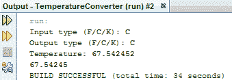
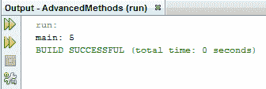
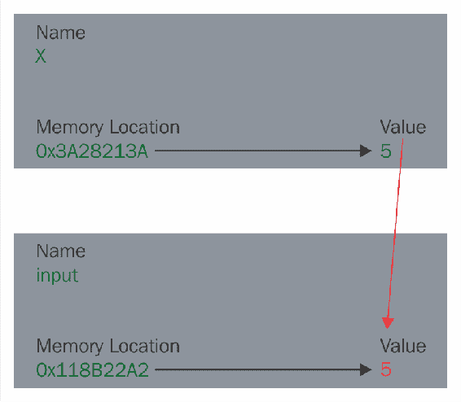
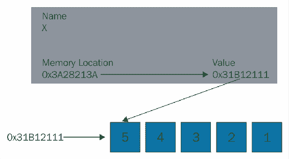
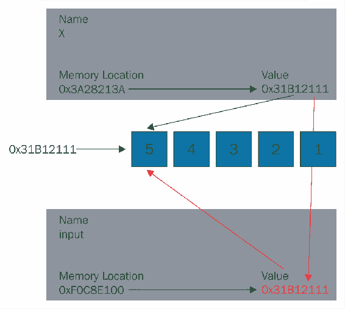
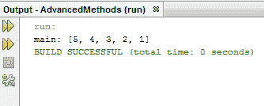

# 函数

在本章中，我们将从讨论 Java 程序基础知识中使用的一些基本概念和术语开始。你将通过简单的程序学习所有这些概念。你将了解到至关重要的 Java 方法。如果你是一名有经验的程序员，你可能以前遇到过函数。随着这些基本概念的进展，你将更多地了解高级 Java 函数。以下是我们计划在本章中涵盖的主题：

+   Java 函数的基础知识

+   方法

+   高级 Java 函数

+   操作 Java 变量

# Java 函数的基础知识

在 Java 中，“函数”和“方法”这两个术语基本上是可以互换使用的，而“方法”是更加技术上正确的术语，你会在文档中看到。

# 方法

**方法**是一种工具，允许我们打破程序的控制流。它们让我们声明一些小的**子程序**，有时我们可以把它们看作更小的程序，我们可以在我们的程序中引用它们，这样我们就不必把我们程序的所有逻辑代码都写在一个单一的块中：

```java
public class TemperatureConverter { 
    public static void main(String[] args) { 
        Scanner reader = new Scanner(System.in); 
        char inputType; 
        char outputType; 
        float inputValue; 
        float returnValue; 

        System.out.print("Input type (F/C/K): "); 
        inputType = reader.next().charAt(0); 
        System.out.print("Output type (F/C/K): "); 
        outputType = reader.next().charAt(0); 
        System.out.print("Temperature: "); 
        inputValue = reader.nextFloat(); 
    } 
} 
```

方法的一个例子是`Scanner`类中的`.next`方法。在我写的这个程序中，我们不必教`Scanner`对象如何获取用户输入的下一组数据，我只需从过去某人编写的类中调用`next`方法。这将把可能是几百行程序的东西转换成大约 22 行，如前面的代码所示。

通过编写我们自己的方法，我们可以通过将复杂的挑战分解成更小、更易管理的部分来解决它们。正确模块化并使用方法的程序也更容易阅读。这是因为我们可以给我们的方法起自己的名字，这样我们的程序就可以更加自解释，并且可以使用更多的英语（或者你的母语）单词。为了向你展示方法的强大之处，我已经计划了一个相当复杂的程序，今天我们要写这个程序。

# 温度转换程序

我们的目标是创建一个温度转换程序，我已经为我们设置了程序的输入部分：

```java
public class TemperatureConverter { 
    public static void main(String[] args) { 
        Scanner reader = new Scanner(System.in); 
        char inputType; 
        char outputType; 
        float inputValue; 
        float returnValue; 

        System.out.print("Input type (F/C/K): "); 
        inputType = reader.next().charAt(0); 
        System.out.print("Output type (F/C/K): "); 
        outputType = reader.next().charAt(0); 
        System.out.print("Temperature: "); 
        inputValue = reader.nextFloat(); 
    } 
} 
```

到目前为止，这个程序从用户那里获取了三条信息。第一条是温度类型：`F`代表华氏度，`C`代表摄氏度，`K`代表开尔文。然后它获取另一种温度类型。这是我们的用户希望我们转换到的类型；再一次，它可以是华氏度、摄氏度或开尔文。最后，我们从用户那里获取初始温度的值。有了这三条输入，我们的程序将把给定的温度值从华氏度、摄氏度或开尔文转换为用户所需的温度类型。

这是一个具有挑战性的程序，原因有两个：

+   首先，因为有两组三个用户输入，所以有六种可能的控制流情况。这意味着在最坏的情况下，我们可能不得不写六个`if...else`块，这将很快变得笨拙。

+   第二个挑战是进行实际的转换。我已经提前查找了三种温度转换的转换数学，即华氏度到摄氏度，摄氏度到开尔文，和开尔文到华氏度：

```java
package temperatureconverter; 

import java.util.*; 

// F to C: ((t-32.0f)*5.0f)/9.0f 
// C to K: t+273.15f 
// K to F: (((t-273.15f)*9.0f)/5.0f)+32.0f 

public class TemperatureConverter { 
    public static void main(String[] args) { 
        Scanner reader = new Scanner(System.in); 
        char inputType; 
        char outputType; 
        float inputValue; 
        float returnValue; 
```

正如你所看到的，虽然这不是困难的数学问题，但它肯定是笨拙的，如果我们开始在程序中到处复制和粘贴公式，我们的程序看起来会非常疯狂。你还应该注意，在前面的评论部分中，有三种转换，我们可以做出这个程序将被要求做的任何可能的转换。这是因为这三种转换创建了一个转换的循环，我们可以通过其中一个中间方程从一个特定类型到任何其他类型。

说了这么多，让我们直接开始编写我们的程序吧。

# 设置控制流

我们需要做的第一件事是设置一些控制流。正如我之前提到的，有六种可能的情况，可能会诱人地为每种可能的输入和输出类型设置六个`if`语句。不过这会有点笨拙，所以我有一个稍微不同的计划。我将不同的情况转换为每种可能的类型配对，首先要做的是将用户给出的初始温度值转换为摄氏度值。在我这样做之后，我们将把摄氏度值转换为用户最初寻找的类型。可以使用以下代码块来完成这个操作：

```java
System.out.print("Input type (F/C/K): "); 
inputType = reader.next().charAt(0); 
System.out.print("Output type (F/C/K): "); 
outputType = reader.next().charAt(0); 
System.out.print("Temperature: "); 
inputValue = reader.nextFloat(); 
```

设置控制流的优势在于让我们完全独立地处理两个用户输入。这使得我们的程序更加模块化，因为我们在开始下一个任务之前完成了一个任务。

因此，为了进行这个初始转换，我们需要利用`switch`语句：

```java
public static void main(String[] args) { 
    Scanner reader = new Scanner(System.in); 
    char inputType; 
    char outputType; 
    float inputValue; 
    float returnValue; 

    System.out.print("Input type (F/C/K): "); 
    inputType = reader.next().charAt(0); 
    System.out.print("Output type (F/C/K): "); 
    outputType = reader.next().charAt(0); 
    System.out.print("Temperature: "); 
    inputValue = reader.nextFloat(); 

    switch(inputType) 
} 
```

我们将在`inputType`字符变量之间切换，该变量告诉我们用户给出的温度类型是华氏度、摄氏度还是开尔文。在`switch`语句内部，我们将操作`inputValue`，其中存储着温度的值。

# 探索单独的情况-C、K 和 F

所以我想我们需要为每种可能或有效的输入类型编写单独的情况，即大写`F`代表华氏度，`C`代表摄氏度，`K`代表开尔文。我们可能还需要处理一个`default`情况。让我们先写`default`情况。我们将使用`System.exit`并以`1`退出，这在技术上是一个错误代码：

```java
switch(inputType) 
{ 
    case 'F': 
    case 'C': 
    case 'K': 
    default: 
        System.exit(1); 
```

`System.exit`基本上退出我们的程序。它告诉程序停止执行并传递给操作系统或者更高级的东西。

在这种情况下，程序将停止。因为这是`default`情况，我们只期望在用户未能输入`F`、`C`或`K`时进入它，这些是我们有效的输入类型。现在，让我们处理每种输入类型。

# 摄氏类型

我们将在所有情况下使用摄氏度作为我们的第一个转换点，所以如果用户输入了摄氏值，我们可以直接跳出这种情况，因为`inputValue`的值对我们来说已经可以了。

```java
switch(inputType) 
{ 
    case 'F': 
    case 'C': 
        break; 
    case 'K': 
        default: 
            System.exit(1); 
```

如果用户给出了华氏值怎么办？好吧，让我们滚动到代码的顶部；你会看到我们有一个明确的从华氏到摄氏的转换：

```java
// F to C: ((t-32.0f)*5.0f)/9.0f 
// C to K: t+273.15f 
// K to F: (((t-273.15f)*9.0f)/5.0f)+32.0f 
```

我们可以采用前面的代码块，我已经使其非常适合 Java，并只需更改此输入变量的值为其值上运行的转换语句。因此，我们将用输入变量替换`t`占位符：

```java
switch(inputType) 
{ 
    case 'F': 
        inputValue = ((inputValue-32.0f)*5.0f)/9.0f; 
        break; 
    case 'C': 
        break; 
    case 'K': 
    default: 
        System.exit(1); 
} 
```

这将正确地存储原始华氏值的摄氏等价值在这个变量中。

# 开尔文类型

我们可以对开尔文情况做类似的事情。我们没有一个明确的从开尔文到摄氏的转换，但我们知道如何将开尔文转换为华氏，然后再将华氏转换为摄氏。所以我们可以用以下方式做一些事情：

```java
switch(inputType) 
{ 
     case 'F': 
         inputValue = ((inputValue-32.0f)*5.0f)/9.0f; 
         break; 
     case 'C': 
         break; 
     case 'K': 
         inputValue = ((((((inputValue-273.15f)*9.0f)/5.0f)+32.0f) -   
         32.0f)*5.0f)/9.0f; 
     default: 
         System.exit(1); 
} 
```

在前面的代码中，我们将开尔文值转换为华氏值，用括号括起来，并对其进行华氏到摄氏的转换。

现在这在技术上是一行功能性的代码。如果我们运行程序并输入一个开尔文输入情况，它将正确地将开尔文值转换为摄氏度值。但是，让我说，如果我是一个程序员，我在工作中遇到这样一行代码，特别是没有任何解释的代码，我是不会很高兴的。这里有很多魔术数字-数字在一般情况下真的是信息；这并不是以任何方式自解释的。当然，作为原始程序员，至少当我们写它时，我们记得我们的目标是将开尔文值转换为摄氏度值；然而，对于任何没有时间坐下来查看整个程序的其他人来说，这真的是不可理解的。那么有没有更好的方法来做到这一点？是的，绝对有。

# 华氏度类型

现在让我们尝试理解华氏温度的情况。考虑以下代码：

```java
inputValue = ((inputValue-32.0f)*5.0f)/9.0f; 
```

上面的代码行比我们的开尔文情况好一点，因为它包含的数字更少，但从任何意义上来说，它仍然不够友好。那么，如果在我们最初实现这个程序时，我们可以提供真正对程序员友好的通信，会怎么样呢？如果我们不是在那里打印出等式，而是把等式放在程序的其他地方并调用一个华氏度到摄氏度的函数呢？

```java
inputValue = fToC(inputValue); 
```

现在我们只需输入 `fToC` 来保持简洁。这对于查看我们的程序的人来说更有意义。

我们可以在这里做类似的事情来处理开尔文情况：

```java
inputValue = fToC(kToF(inputValue)) 
```

如果我们想的话，我们可以调用一个开尔文到摄氏度的函数（`kToC`），或者如果我们甚至不想写那个，我们可以在我们的 `inputValue` 变量上调用一个开尔文到华氏度的函数，然后在此基础上调用 `fToC` 函数。这就是我们最初所做的所有数学概念上的事情，只是我们已经抽象出了那些数字，并把它们放在了程序的其他地方。这对程序员来说更友好。假设我们在数学上犯了一个错误，另一个程序员想要检查它。他们只需要找到我们即将编写的函数，比如 `fToC` 和 `kToF`，然后他们就可以深入了解所有的细节。因此，当然，我们确实需要编写这些函数。

当我们创建一个新函数时，我们实际上是在当前的函数或方法之外进行的：

```java
public static void main(String[] args) { 
```

目前，我们在程序的 `main` 方法中，这是一个特殊的方法，程序从这里开始执行。因此，为了编写我们的华氏度到摄氏度函数，我们将退出该方法并声明一个全新的方法；基本上，我们正在教我们的程序如何运行一个名为 `fToC` 的新程序：

```java
public static fToC() 
```

现在，继续在你的方法前面使用 `public static` 关键字。一旦我们真正进入 Java 的面向对象的特性，这些关键字将非常重要，但现在，我们将在我们声明的所有方法上使用它们。

关于我们接下来计划如何处理程序的更详细解释，让我们尝试更详细地分割程序，分成两部分。

# 执行程序的第一部分

您标准的 Java 方法在我们给它一个名称之前还有一个关键字，那就是这个方法将返回的信息类型：

```java
public static float fToC() 
{ 
} 
```

例如，我们希望能够在我们的开尔文到华氏度函数上调用`fToC`。当我们这样做时，我们基本上将我们的开尔文到华氏度函数的结果视为自己的浮点变量。这表明我们在这些函数中寻找的返回类型是`float`数据类型。这意味着当这些小程序执行完毕时，它们将向我们调用它们的`main`方法抛出一个浮点值。在命名函数之后，我们在其前面的函数声明中跟随两个括号。在这些括号之间，我们将告诉我们的程序这个函数需要运行的信息。我们通过基本上创建一些变量来做到这一点，如下面的代码块所示：

```java
public static float fToC(fVal) 
```

我们将需要一个变量，我将其称为`fVal`，因为我们从华氏度值开始。在每个输入变量之前，我们还需要告诉我们的程序那将是什么类型的信息；这样人们就无法不正确地调用我们的函数并传递诸如字符串之类的东西，这是毫无意义的。

```java
public static float fToC(float fVal) 
{ 
} 
```

因此，我们要告诉我们的函数，为了运行，它需要以给定的`float`信息作为输入进行调用。在我们之前编写的函数中，它们实际上存在于程序中。您会看到我们这样做：我们将`inputValue`或用户最初给我们的温度值的值作为这些函数的输入。

现在，我们需要我们的`fToC`函数，我们的华氏度到摄氏度函数，在代码中对`fVal`变量执行一些计算，其中将包含用户输入的温度值。由于我们从华氏度到摄氏度，我们可以只需复制并粘贴程序顶部的字符串，并将`fVal`替换为`t`：

```java
public static float fToC(float fVal) 
{ 
    fVal = ((fVal-32.0f)*5.0f)/9.0f; 
} 
```

现在，我们可能会诱惑我们的函数执行此操作来更改此变量的值。虽然我们当然可以这样做，但这不会给我们带来我们需要的结果。当我们的程序执行`inputValue = fToC(inputValue);`这行代码并运行我们的`fToC`函数时，将`inputValue`作为其输入变量，这个变量实际上不会降到我们函数的代码行中。相反，Java 只是复制`inputValue`的值并将其存储在我们的新变量中，如下面的代码块所示：

```java
public static float fToC(float fVal) 
{ 
    fVal = ((fVal-32.0f)*5.0f)/9.0f; 
} 
```

因此，我们对这个`fVal`变量所做的更改不会映射到我们的`inputValue`变量。幸运的是，我们明确地将`inputValue`的值更改为我们现在编写的函数返回的值。一旦我们准备退出函数的执行，我们可以让它丢弃任何与我们告诉 Java 此函数将返回的值类型相等的值。我们使用`return`关键字来做到这一点，后面跟着计算为我们的情况下浮点值的任何语句。因此，当我们的`fToC`函数在`inputValue`上运行时，它将打印出与存储在输入变量中的初始华氏值等效的浮点数：

```java
public static float fToC(float fVal) 
{ 
    return ((fVal-32.0f)*5.0f)/9.0f; 
} 
```

一旦我们编写了其中一个函数，编写其他类似的函数就变得非常容易。要编写我们的开尔文到华氏度的函数，我们只需要做同样的事情，但在这种情况下，我们需要采用我们的开尔文到华氏度转换方程并更改变量的名称。如果我们愿意，我们可以称之为`fVal`-`kVal`只是更具说明性，并返回该结果：

```java
public static float fToC(float fVal) 
{ 
    return ((fVal-32.0f)*5.0f)/9.0f; 
} 
public static float kToF(float kVal) 
{ 
    return (((kVal-273.15f)*9.0f)/5.0f)+32.0f; 
} 
```

这是我们程序的第一部分，我们将用户提供的任何值转换为摄氏度值。到目前为止，这比使用六个`if`语句更加优雅，但我们只写了程序的一半。

# 执行程序的第二部分

一旦我们完成了摄氏度的转换，我们将使用另一个`switch`语句。这一次，我们将在`outputType`上使用它，用户告诉我们他们想要看到等值的温度类型，或者在哪种温度类型下看到等值。我们的情况将看起来非常类似于`switch`语句的前半部分；然而，这里我们不是将所有东西转换为摄氏度，而是总是从摄氏度转换。同样，这意味着`C`情况可以在我们转换为摄氏度的任何情况下简单地中断，然后我们不再需要从摄氏度转换：

```java
// F to C: ((t-32.0f)*5.0f)/9.0f 
// C to K: t+273.15f 
// K to F: (((t-273.15f)*9.0f)/5.0f)+32.0f 
```

现在，我们明确的情况是摄氏度到开尔文的转换。我们知道这个公式，多亏了我们在代码顶部的小抄；我们可以很快地构建一个函数来做到这一点。我们将这个函数称为`cToK`；这是我们的变量名，这是逻辑：

```java
public static float fToC(float fVal) 
{ 
    return ((fVal-32.0f)*5.0f)/9.0f; 
} 
public static float kToF(float kVal) 
{ 
    return (((kVal-273.15f)*9.0f)/5.0f)+32.0f; 
} 
public static float cToK(float cVal) 
{ 
    return cVal+273.15f; 
} 
```

一旦我们声明了我们的`cToK`函数，我们可以在`inputValue`上调用它，因为`inputValue`现在存储了修改后的原始输入值，这将是一个摄氏度数字，要转换为开尔文值：

```java
case 'K': 
    inputValue = cToK(inputValue); 
```

类似于我们将开尔文转换为华氏度再转换为摄氏度的方式，当我们将所有东西都转换为摄氏度时，我们可以通过从摄氏值获取一个开尔文值来获得一个华氏输出。然后，我们可以使用开尔文转换为华氏度的函数将这个开尔文值转换为华氏度：

```java
case 'F': 
    inputValue = kToF(cToK(inputValue)); 
    break; 
case 'C': 
    break; 
case 'K': 
    inputValue = cToK(inputValue); 
    break; 
default: 
    System.exit(1);  
```

这是我们程序的第二部分。仍然只有两行真正的代码可能会让任何人停下来，它们都相当容易理解。然而，我们程序的所有逻辑和功能对于一个好奇的程序员来说仍然是可访问的，他想要重新访问它们：

```java
    } 
    System.out.println(inputValue); 
} 
```

# 程序的最后一步

我们可以使用 `println` 来结束我们的程序，输出 `inputValue`，它现在应该包含正确的转换。让我们运行这个程序，输入一些值并输出，看看我们的表现如何：


因此，当我们运行我们的程序时，它会询问我们要给它什么`inputType`。让我们给它一个华氏值。现在让我们说我们想要得到一个摄氏值作为输出。让我们看看`32`华氏度对应的摄氏值是多少。我们看到输出结果是`0`。`32`华氏度是`0`摄氏度，这是一个好迹象。让我们尝试一些更极端的情况。如果我们试图将摄氏度转换为摄氏度，我们得到的值与下面的截图中显示的值相同，这是我们所期望的：



让我们看看`1`开尔文度对应的华氏值是多少：


好消息是，这也是前面截图中的预期值。我们使用函数使一个本来非常复杂和难以阅读的程序变得更加可管理。我们在这里编写的程序有些复杂。它进行了一些数学和多功能语句，所以如果你第一次没有完全理解，我鼓励你回去检查是什么让你困惑。还有其他方法来解决这个问题，如果你有灵感，我鼓励你去探索一下。

# 高级 Java 函数

在这一部分，我希望你深入了解 Java 方法，并学习一些关于编程语言如何思考和操作信息的非常有价值的东西。为了帮助我们做到这一点，我想进行一种实验，并且为了开始这个实验，我写了一个非常基本的 Java 程序：

```java
package advancedmethods; 

public class AdvancedMethods { 
    public static void main(String[] args) { 
        int x = 5; 
        magic(x); 
        System.out.println("main: " + x); 
    } 
    public static void magic(int input) 
    { 
        input += 10; 
    } 
} 
```

在这个 Java 程序的核心是`magic`方法，它是在`main`方法之后用户自定义的。当我们遇到一个新的 Java 方法时，有三件事情我们应该注意：

1.  首先，我们应该问，“它的输入值是什么？”在我们的`magic`方法中，它只期望一个整数作为输入。

1.  然后，我们可能想问，“这个方法返回什么？”。在我们的情况下，该方法标记为返回`void`。Void 方法实际上根本不返回任何值；它们只是执行它们的代码并完成。您会注意到，当我们在程序的主要部分引用`magic`时，我们并没有尝试将其返回值存储在任何位置。这是因为当然没有返回值可以存储。

1.  然后，关于我们的方法要注意的第三件事是“它做什么？”。在我们的`magic`方法的情况下，我们只是取得我们作为`input`得到的值，并将该值增加`10`。

我想现在要求你做的是花一分钟时间，仔细看看这个程序，并尝试弄清楚当我们到达这个`println`语句时，程序的输出将是什么。这里的挑战性问题是当我们运行`magic(x)`代码行并调用我们的`magic`方法时，变量`x`的值会发生什么变化？当我们将其作为值传递给`magic`方法时，变量`x`是否保持不变，或者变量`x`是否被`magic`方法中的输入代码行修改，以至于我们打印出`15`而不是`5`的值？

要回答这个问题，我们只需要运行我们的程序，如果我们这样做，我们将看到我们得到了`5`的值，这让我们知道运行`magic`方法并没有修改主方法中变量`x`的值：



实际上，如果我们根本不运行`magic`方法，我们将得到相同的输出。那么这告诉我们什么？这为我们提供了一个非常重要的见解，即 Java 如何处理方法输入。要完全理解这里发生了什么，我们需要更深入地了解 Java 变量的操作。

# 操作 java 变量

以下是我们的变量`x`存储的信息的表示，即我们 Java 程序的`main`方法中的变量：


您会注意到这个变量有三个核心组件；让我们快速浏览一下：

+   在左侧，我放置了这个变量的名称，这是我们在范围内引用它所使用的关键字，以及一个内存位置。我们的变量指向一个内存位置，在这个内存位置中，我们存储变量的值。

+   我们可以将名称和内存位置视为非常静态的；在我们程序执行过程中，这个单独的变量标识符不会真正改变。然而，我们可以自由地更改变量引用的内存位置中存储的值。

那么这为什么重要呢？好吧，在我们的程序过程中，我们将不得不将存储在变量`x`中的信息转换为我们的`magic`方法试图使用的变量输入中存储的信息。如果我们仔细看看变量的设置方式，我们很快就会发现有两种可能的方法来做到这一点：

1.  首先，我们可以简单地创建一个名为`input`的全新变量，具有其自己独特的内存位置，然后简单地将我们在`x`引用的内存位置中找到的相同值放置在该内存位置中的值中：

当我们将变量`x`传递给一个方法时，这是 Java 用来创建变量`input`的技术，我们可以说 Java 通过值传递了我们的变量`x`。这是因为只有值在创建新变量时被保留。

1.  另一个选项是我们创建一个全新的变量`input`，但是我们不仅仅是将变量`x`的值复制到变量`input`，我们可以使`input`引用与`x`相同的内存位置。这将被称为通过引用传递变量`x`。在这种情况下，因为`x`和`input`都共享一个内存位置来存储它们的值，修改变量`input`的值也会修改变量`x`的值。

因此，根据您刚刚了解的关于 Java 变量的知识，并考虑到在`magic(x)`代码行上执行`magic`方法不会修改变量`x`的值，我们可以正确地得出结论，Java 选择通过值而不是通过引用将变量传递给其方法。

然而，这并不是故事的结束，或者说，这个事实可能对我们来说并不立即显而易见。如果我们重写我们的程序，使我们的`magic`方法接受字符输入、布尔输入或任何其他原始类型，我们将看到与我们已经看到的相同的行为。即使在`magic`方法的范围内修改此`input`变量的值，也不会修改`main`方法的范围内的变量`x`的值。所以，事情并不总是那么简单。

# 在程序中使用变量

为了看到这一点，让我们创建一个全新的方法，在它的声明中，我们将它与我们现有的`magic`方法相同。但是，我们将以整数数组的形式提供它作为输入：

```java
package advancedmethods;
public class AdvancedMethods {
    public static void main(String[] args) {
        int[] x = 5;
        magic(x);
        System.out.println("main: " + x);
    }

    public static void magic(int input)
    {
        input += 10;
    }
    public static void magic(int[] input)
    {
        input += 10;
    }
}
```

记住，我们的数组将被命名为一个单一的变量，所以我们需要做的就是让 Java 知道我们想要将一个数组传递给函数，通知它给定的变量是某种类型的数组。您还会注意到，我们现在在程序中有两个名为`magic`的方法。这被称为**方法重载**，只要 Java 有办法区分这些方法，这样做就是完全合法的。在这种情况下，Java 可以区分这些方法，因为这两个方法将被赋予不同的对象作为输入。

如果给`magic`调用的输入是单个整数，则我们的`magic`方法之一将执行，如果给方法的输入是整数数组，则我们的新`magic`方法将执行。现在，让我们编写一个快速的`for`循环，这样我们的新`magic`方法将将输入数组中的每个整数的值增加`10`：

```java
public static void magic(int[] input) 
{ 
    for(int i = 0; i < input.length; i++) 
    input[i] += 10; 
} 
```

这与我们最初编写的`magic`方法非常相似，只是它不是操作单个整数，而是操作任意数量的整数。然而，当我们修改我们的`main`方法以利用`magic`方法的新实现时，可能会发生一些奇怪的事情。为了实现这一点，我们需要对我们的程序进行一些快速修改。

让我们将变量`x`从整数更改为整数数组，这样我们的程序将知道如何利用新编写的`magic`方法，当我们给定整数数组作为输入时，它将运行：

```java
package advancedmethods; 

import java.util.*; 

public class AdvancedMethods { 
    public static void main(String[] args) { 
        int[] x = {5,4,3,2,1}; 
        magic(x); 
        System.out.println("main: " + Arrays.toString(x)); 
    } 
    public static void magic(int input) 
    { 
        input += 10; 
    } 
    public static void magic(int[] input) 
    { 
        for(int i = 0; i < input.length; i++) 
        input[i] += 10; 
    } 
} 
```

我们还需要修改我们的`println`语句，以利用`Arrays.toString`来正确显示`x`数组中存储的值。我们将导入`java.util`，以便 Java 知道`Arrays`库：

```java
import java.util.*; 

public class AdvancedMethods { 
    public static void main(String[] args) { 
        int[] x = {5,4,3,2,1}; 
        magic(x); 
        System.out.println("main: " + Arrays.toString(x)); 
    } 
```

现在是时候问自己另一个问题了：当我们在整数数组上运行`magic`函数时，我们是否会看到与我们在单个整数值上运行`magic`函数时看到的相同结果，即原始类型？要回答这个问题，我们只需要运行我们的程序，我们很快就会看到，存储在`x`数组中的输出或最终值与我们最初分配给`x`数组的值不同：


这让我们知道我们的`magic`方法确实修改了这些值。这有点奇怪。为什么我们的`magic`方法会根据我们给它的是单个原始类型还是原始类型数组而有不同的操作？为了回答这个问题，让我们看看当变量`x`被声明为整数数组而不是我们之前的单个整数时会发生什么：



请注意，`x`作为一个整数数组，而不是单个原始类型，仍然具有名称和内存位置来标识它以及它可以存在的位置；但是，它的值字段看起来与以前大不相同。当`x`只是一个整数时，我们可以简单地将一个显式整数存储在`x`的值字段中，但是作为数组，`x`意味着能够引用许多不同的值；这就是它成为数据结构的原因。为了实现这一点，数组-实际上每个比原始类型更复杂的元素-指向内存中的一个位置，而不是单个显式值。对于数组，我们只需要指向内存中数组的 0 索引。然后，通过从该索引开始，我们可以存储许多不同的值，我们的变量`x`知道如何访问。那么这为什么重要呢？

# 理解传递参数

好吧，让我们看看当我们按值传递`x`到方法时会发生什么。我们知道，当我们按值传递一个变量时，我们告诉 Java 在方法的上下文中创建一个新变量，该变量将具有自己独特的名称和内存位置：



然而，在我们的例子中，这个新变量-`input`-获取了旧变量的值作为自己的值。当我们处理原始类型时，这些值是完全独立的，但现在`input`和`x`都具有相同内存位置的值。因此，修改输入的值不会改变`x`的值，但修改输入指向的内存位置仍会改变`x`查看时的内存位置。

在方法的上下文中，如果我们明确引用一个输入变量，然后修改该变量，我们将只修改函数上下文中的变量，就像我们在第一个`magic`方法中所做的那样。但是，如果我们必须采取额外的步骤来访问我们正在修改的值，就像我们在声明数组的索引时必须做的那样，那么我们可能必须通过内存位置或引用来修改它。在这种情况下，我们可能会影响为我们函数变量提供值的变量：

```java
package advancedmethods; 

import java.util.*; 

public class AdvancedMethods { 
    public static void main(String[] args) { 
        int[] x = {5,4,3,2,1}; 
        magic(x); 
        System.out.println("main: " + Arrays.toString(x)); 
    } 
    public static void magic(int input) 
    { 
        input += 10; 
    } 
    public static void magic(int[] input) 
    { 
        input = new int[] {2,2,2,2,2}; 
    } 
} 
```

如果我们的接受数组的`magic`函数尝试将我们的整数数组的值设置为全新的整数值集合，并具有全新的起始内存位置，我们会发现当我们在其上运行此函数时，我们将不再修改`x`的值：



这是因为创建一个新的整数数组导致我们明确改变了输入的值。在这行代码之后，`input`和`x`不再共享值。非常感谢您的时间。希望您学到了一些东西。

# 总结

您还在吗？如果是的，恭喜。我们从一些基本的 Java 函数开始，比如方法，然后继续理解高级 Java 函数。我们刚刚讨论了一些复杂的东西。随着您成为更有经验的程序员，您将开始内化这些概念，当您编写日常代码时，您不必明确考虑它们。不过，现在有一些逻辑快捷方式可以帮助我们避免太多的困扰。

在下一章中，您将详细了解使用面向对象的 Java 程序进行建模。
