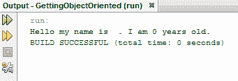

# 用面向对象的 Java 建模

在本章中，你将学习如何在 Java 中创建类和对象。面向对象编程使我们能够向计算机和自己解释高度复杂的系统。此外，关于对象如何相互配合、它们可以有哪些关系以及我们可以如何使用对象来使我们的程序更容易编写，还有很多要学习的关于面向对象编程的内容。我们还将讨论创建自定义类、成员变量和成员函数的主题。最后，我们将研究分配给我们自定义类的一个非常特殊的成员，即构造函数，以及构造函数的类型。

在本章中，我们将涵盖以下主题：

+   创建类和对象

+   创建自定义类

+   创建成员变量

+   创建成员函数

+   创建构造函数

+   构造函数的类型

# 创建类和对象

在这一部分，你将迈出学习 Java 面向对象编程的第一步。所以我想问的第一个问题是，“什么是面向对象编程？”嗯，在高层次上，面向对象编程是创建对象的过程，这些对象是独特的、相互独立的代码和逻辑实体，但它们之间可以有复杂的关系。

当我们编写面向对象的代码时，我们开始将代码看作一组物理部件或对象。Java 本质上是一种面向对象的语言。因此，如果你一直在学习 Java，至少你已经在使用对象而没有意识到。

要看到面向对象编程的威力，看一下下面的程序（`GettingObjectOriented.java`）：

```java
package gettingobjectoriented; 

import java.util.*; 

public class GettingObjectOriented { 
    public static void main(String[] args) { 
        Scanner reader = new Scanner(System.in); 

        System.out.println(reader.next()); 
    } 
} 
```

这个程序是一个非常基本的输入/输出程序，如果你一直在学习 Java，你可能已经写过这种程序。在这个程序中，我们使用了一个名为`Scanner`的对象，我们称之为`reader`，你会注意到我们在两行上使用了`reader`：在一行上，我们声明并初始化了`reader`，在另一行上，我们调用了`reader`的`next()`函数来获取一些用户输入。

我希望你注意到这两行代码之间的关系的重要之处是，当我们声明`reader`时，我们为它提供了除了简单地创建一个新的`Scanner`对象的命令之外的一些额外信息。这很有趣，因为当我们后来使用`reader`的`next()`函数时，我们不需要重新告诉它应该从哪个流中读取；相反，这些信息会被`reader`对象自动存储和调用。

这就是面向对象编程的美妙之处：我们创建的实体或对象可以被构造成这样一种方式，不仅它们知道如何处理给予它们的信息并为我们提供额外的功能，而且它们也知道要询问什么信息来执行它们以后的任务。

让我们确保我们的术语准确。首先，让我们分析我们代码中的`new Scanner(System.in)`部分。这个命令告诉 Java 为我们的程序创建一个新对象，一个新的`Scanner`对象。这个对象有它所在的位置和内存，这个位置由`reader`变量引用。我们可以创建多个变量，它们都指向同一个`Scanner`对象；然而，在这个简单程序的上下文中，`reader`是我们指向对象内存位置的唯一入口点。因此，我们通常可以通过它的变量名来简单地引用一个对象。

最后，不同的对象以不同的方式运行。我们可以创建多个`Scanner`对象；它们在内存中的位置可能不同，但它们会共享类似的功能。声明对象具有什么功能以及该功能如何运行的代码和逻辑称为对象的类。在这种情况下，我们正在创建一个`Scanner`类的对象，并用`reader`变量指向它。

这一切都很好，我们可以简单地使用 Java 提供的默认标准库创建许多程序；然而，为了真正打开大门，我们需要能够创建自定义的类。让我们开始并创建一个。

# 创建自定义类

现在，我们可以在我们已经在工作的文件中创建一个新的类；然而，类声明代码与像执行的`main()`方法之类的逻辑上是不同的，其中代码行是按顺序依次执行的。相反，我们要创建的类将更多地作为代码行的参考，比如`Scanner reader = new Scanner(System.in);`这行代码。通常，在面向对象的语言中，像 Java 这样的高级面向对象的语言，我们只需将我们创建的每一个新类放在自己单独的文件中。

要为我们的类创建一个新的 Java 文件，只需右键单击屏幕左侧的包名，即`gettingobjectoriented`。然后，选择新建，然后选择 Java 类。之后，我们只需提示给它一个名称。


在这种情况下，我们将创建一个类来提供和存储有关一个人的一些基本信息。我们将称之为`Person`类，它创建人物对象：


当我们按下“完成”时，NetBeans 非常方便，为我们设置了一些非常基本的代码行。它声明这个类在我们的本地包中。这意味着当我们从我们的`main()`方法中引用它时，我们不必像引用标准库那样导入这个类。NetBeans 很友好地为我们创建了类声明。这只是一行代码，让 Java 编译器知道我们将要声明一个新的类，如下面的屏幕截图所示：

```java
package gettingobjectoriented;
public class Person {
}
```

现在，我们将忽略`public`关键字，但知道它在这里是非常必要的。`class`关键字让我们知道我们将要声明一个类，然后就像我们创建并需要在将来引用的一切一样，我们给类一个名称或一个唯一的关键字。

现在是时候编写代码来设置我们的`Person`类了。请记住，我们在这里所做的是教会程序的未来部分如何创建`Person`对象或`Person`类的实例。因此，我们在这里编写的代码将与我们在一个简单地执行从头到尾的方法中所写的代码非常不同。

我们在类声明中放置的信息将属于这两类之一：

+   第一类是我们告诉 Java `Person`类应该能够存储什么信息

+   第二类是我们教 Java`Person`对象应该暴露什么功能

# 创建成员变量

让我们从第一类开始。让我们告诉 Java 我们想在`Person`中存储什么信息：

```java
package gettingobjectoriented; 

public class Person { 
    public String firstName; 
    public String lastName; 
} 
```

告诉 Java 要存储的信息很像在任何其他代码中声明变量。在这里，我们给`Person`类两个成员变量；这些是我们可以在任何`Person`对象中访问的信息。

在类声明中，几乎我们声明的每一样东西都需要给予保护级别。当我们成为更高级的 Java 用户时，我们将开始使用不同的保护级别，但现在，我们只是简单地声明一切为“public”。

因此，正如我们在这里设置的那样，每个`Person`对象都有`firstName`和`lastName`。请记住，这些成员变量对于`Person`对象的每个实例都是唯一的，因此不同的人不一定共享名字和姓氏。

为了让事情变得更有趣，让我们也给人们分配生日。我们需要导入`java.util`，因为我们将使用另一个类`Calendar`类：

```java
package gettingobjectoriented; 
import java.util.*; 
public class Person { 
    public String firstName; 
    public String lastName; 
    public Calendar birthday; 
} 
```

日历基本上是点和时间或日期，具有大量功能包装在其中。很酷的是`Calendar`是一个独立的类。因此，我们在`Person`类中放置了一个类；`String`也是一个类，但 Java 认为它有点特殊。

现在，让我们回到`GettingObjectOriented.java`文件中的`main()`方法，看看创建一个全新的人是什么样子。现在，我们将保留这行代码，以便将其用作模板。我们想要创建我们的`Person`类的一个新实例或创建一个新的`Person`对象。为此，我们首先要告诉 Java 我们想要创建什么类型的对象。

因为我们在使用的包中声明了`Person`类，Java 现在将理解`Person`关键字。然后，我们需要给我们将分配新人的变量一个名字；让我们将这个人命名为`john`。创建一个新人就像创建一个新的`Scanner`对象一样简单。我们使用`new`关键字让 Java 知道我们正在创建一些全新的尚不存在的东西，然后要求它创建一个人：

```java
package gettingobjectoriented; 

import java.util.*; 

public class GettingObjectOriented { 
    public static void main(String[] args) { 
        Scanner reader = new Scanner(System.in); 
        Person john = new Person(); 
        System.out.println(reader.next()); 
    } 
} 
```

在这里，`Person john = new Person ();`将导致变量`john`指向的人，我们将简单地认为是一个人 John，出现。现在`john`已经具有一些基本功能，因为我们已经为`Person`类声明了一些成员变量，因此即使我们对`Person`类的基本声明也给了 John 一些我们可以使用的成员变量。

例如，`john`有`firstName`，我们可以使用点(`.`)运算符作为变量进行访问，并且我们可以继续为这个变量分配一个值。我们也可以用同样的方法处理 John 的姓和当然是他的生日：

```java
package gettingobjectoriented;
import java.util.*;
public class GettingObjectOriented {
    public static void main(String[] args) {
        Scanner reader = new Scanner(System.in);
        Person john = new Person();
        john.firstName = "John";
        john.lastName = "Doe";
        john.birthday = 
        System.out.println(reader.next());
    }
}
```

现在，我已经提到`birthday`在我们到达这一点时会与`firstName`和`lastName`有些不同。虽然字符串在 Java 中在技术上是类，但 Java 也赋予它们能够被分配给显式值或字符串显式的特权。当然，日历没有这种独特的特权，因此我们需要创建一个新的`Calendar`对象放在我们的对象中，也就是`john`。

现在，`Calendar`是我们可以分配实例的类之一；但是，当我们想要创建一个全新的实例时，我们需要创建一个更具体的也是日历的东西。因此，对于这个实例，我们将使用`GregorianCalendar`。然后，让我们将`birthday`分配给`john`，比如`1988,1,5`。然后，为了查看一切是否按预期分配，只需打印出 John 的名和姓。

我们运行以下程序时：

```java
package gettingobjectoriented;
import java.util.*;
public class GettingObjectOriented {
    public static void main(String[] args) {
        Scanner reader = new Scanner(System.in);
        Person john = new Person();
        john.firstName = "John";
        john.lastName = "Doe";
        john.birthday = new GregorianCalendar(1988,1,5);
        System.out.println(john.firstName + john.lastName);
    }
}
```

我们看到`John Doe`并没有真正格式化，但是按预期打印到屏幕上：


我们已经成功地将信息存储在我们的`john`对象中。如果我们愿意，我们可以创建一个全新的人“Jane”，她将拥有自己的`firstName`、`lastName`和`birthday`；她的成员变量完全独立于 John 的。

# 创建成员函数

让我们回到我们的`Person`类，也就是`Person.java`文件，并为人们提供更多功能。因此，面向对象的 Java 的美妙之处在于，我们已经开始将我们的`Person`类的实例视为物理对象。这使得预期将会问到他们的问题变得更容易。

例如，当我遇到一个新的人时，我大多数情况下要么想知道他们的名字，要么想知道他们的全名。所以，如果我们的人存储了一个名为`fullName`的字符串，人们可以直接询问而不必单独获取他们的名字和姓氏，这不是很好吗？

当然，简单地添加另一个成员变量是不方便的，因为创建`Person`的新实例的人需要设置`fullName`。而且，如果人的名字、姓氏或全名发生变化，他们的`fullName`、`firstName`和`lastName`变量可能不会正确匹配。但是，如果我们提供一个成员方法而不是成员变量呢？

当我们在类的上下文中创建方法时，我们可以访问类的成员变量。如果我们想要修改它们，或者像我们刚刚做的那样，我们可以简单地利用它们的值，比如返回这个人动态构造的全名。

```java
package gettingobjectoriented; 
import java.util.*; 
public class Person { 
    public String firstName; 
    public String lastName; 
    public Calendar birthday; 
    public String fullName() 
    { 
         return firstName + " " + lastName; 
    } 
} 
```

我预计这个人会被问到另一个问题，那就是你多大了？这将很像我们刚刚写的方法，只有一个例外。为了知道这个人多大了，这个人需要知道今天的日期，因为这不是这个人已经存储的信息。

为了做到这一点，我们将要求人们在调用这个方法时传递这些信息，然后我们将简单地返回今天年份与这个人的生日年份之间的差异。

现在，从日历中获取年份的语法有点奇怪，但我认为我们应该能够理解。我们只需使用`get`方法，它有许多用途，然后我们需要告诉方法我们想从中获取什么，我们想从中获取一个日历年(`Calendar.YEAR`)。所以，让我们确保保存这个文件，跳转到我们的`main`方法，并利用我们刚刚添加到`Person`实例的新方法之一：

```java
package gettingobjectoriented;
import java.util.*;
public class Person {
    public String firstName;
    public String lastName;
    public Calendar birthday;
    public String fullName()
    {
         return firstName + " " + lastName;
    }
    public int age(Calendar today)
    {
         return today.get(Calendar.YEAR) - birthday.get(Calendar.YEAR);
    }
}
```

所以，我们设置了`john`。他有一个生日。让我们在这里的`println`语句中问 John 他多大了。为了做到这一点，我们只需调用 John 的`age`方法，并创建一个新的`Calendar`对象传递进去。我认为新的`GregorianCalendar`实例将默认设置为当前日期和时间。

如果我们运行以下程序：

```java
package gettingobjectoriented;
import java.util.*;
public class GettingObjectOriented {
    public static void main(String[] args) {
        Scanner reader = new Scanner(System.in);
        Person john = new Person();
        john.firstName = "John";
        john.lastName = "Doe";
        john.birthday = new GregorianCalendar(1988,1,5);
        System.out.println(john.age(new GregorianCalendar()));
    }
}
```

我们看到 John 今年`29`岁：


这就是我们的基本介绍了。这是我们对面向对象的 Java 的基本介绍，但最终都会归结为你刚学到的基础知识。

# 创建构造函数

在这一部分，你将学习到我们可以分配给自定义类的一个非常特殊的成员，那就是构造函数。首先，让我们看一下下面的代码：

```java
package gettingobjectoriented; 

import java.util.*; 

public class GettingObjectOriented { 
    public static void main(String[] args) { 
        Scanner reader = new Scanner(System.in); 
        Person john = new Person(); 
        john.firstName = "John"; 
        john.lastName = "Doe"; 
        john.birthday = new GregorianCalendar(1988,1,5); 
        System.out.println( 
            "Hello my name is " +            
            john.fullName() + 
            ". I am " + 
            john.age(new GregorianCalendar()) + 
            " years old."); 
    } 
} 
```

这个程序创建了我们自定义类`Person`的一个实例，并立即为`Person`的成员变量`firstName`、`lastName`和`birthday`赋值。然后，我们利用`Person`的一些成员函数打印出我们刚刚分配的一些信息。

虽然这是一个不错的程序，但很容易看到即使是这样一个简单的程序，也可能出现错误。例如，如果我忘记了或者根本没有意识到`birthday`是`Person`的成员变量之一会怎么样？如果我不立即为一个人分配生日，然后尝试使用`age()`成员方法，就像下面的代码块中所示的那样：

```java
package gettingobjectoriented; 

import java.util.*; 

public class GettingObjectOriented { 
    public static void main(String[] args) { 
        Person john = new Person(); 
        john.firstName = "John"; 
        john.lastName = "Doe"; 
        //john.birthday = new GregorianCalendar(1988,1,5); 
        System.out.println( 
        "Hello my name is " + 
        john.fullName() + 
        ". I am " + 
        john.age(new GregorianCalendar()) + 
        " years old."); 
    } 
} 
```

当程序尝试访问尚未设置任何内容的生日变量时，我们的程序将崩溃，如下面的截图所示：


对于程序员来说，这是一个非常合理的错误，既不知道他们应该将这个成员变量设置为一个值，也假设这个成员变量会有一个值，因为什么样的人没有生日呢？幸运的是，我们有一个系统，可以在允许用户创建对象实例之前要求用户提供信息。因此，让我们进入声明`Person`类的代码，并设置这个类，以便只有在一开始就提供了所有必要的信息时才能创建一个人。为此，我们将使用构造函数。

构造函数声明看起来很像普通方法声明，除了一点。普通方法会有一个返回值，甚至如果它不打算返回任何东西，也会有一个 null 值；构造函数甚至没有那个。此外，构造函数方法的名称与我们分配给类的名称相同；然而，就像普通方法一样，我们可以给构造函数传入参数。

首先，让我们假设所有人都有“名”、“姓”和“生日”；否则，他们根本就不应该存在。当我们创建`Person`类的新实例并且`Person`类已经定义了构造函数时，我们将始终使用`Person`构造函数创建类的实例：

```java
package gettingobjectoriented; 

import java.util.*; 

public class Person { 
    public String firstName; 
    public String lastName; 
    public Calendar birthday; 

    public Person(String firstName, String lastName, Calendar birthday) 
    { 

 } 

    public String fullName() 
    { 
         return firstName + " " + lastName; 
    } 

    public int age(Calendar today) 
    { 
         return today.get(Calendar.YEAR) - birthday.get(Calendar.YEAR); 
    } 
} 
```

如果我们保存了对`Person`类声明的这个更新，然后回到我们程序的`main`方法，我们将得到一个编译器错误，如下面的截图所示：


这是因为我们修改了`Person`类，要求我们使用新创建的构造函数。这个构造函数接受三个输入值：一个字符串，一个字符串和一个日历。因此，我们不会在这三行代码中修改`Person`的成员变量，而是将这三个变量作为参数传递给我们的构造函数方法：

```java
package gettingobjectoriented; 

import java.util.*; 

public class GettingObjectOriented { 
    public static void main(String[] args) { 
        Person john = new Person("John", "Doe", newGregorianCalendar(1988,1,5)); 

        System.out.println( 
        "Hello my name is " + john.fullName() + ". I am " + john.age(new 
        GregorianCalendar()) + 
        " years old."); 
    } 
} 
```

现在，就我们的程序中的`main`方法而言，程序的语法再次是有效的。当然，如果我们运行这个程序，我们将遇到一些麻烦，因为虽然我们将这些参数传递给`Person`构造函数，但我们还没有对它们做任何处理。

现在，这里的工作应该是我们的`Person`构造函数的工作，而不是我们 Java 程序中的`main`方法，将这些参数转换为`Person`的成员变量的值。所以，让我们这样做。让我们将`Person`类的`firstName`更改，或者说将其值设置为传递给这个函数的变量：

```java
package gettingobjectoriented;
import java.util.*;
public class Person {
    String firstName;
    String lastName;
    Calendar birthday;
    public Person(String firstName, String lastName, Calendar birthday)
    {
         firstName = firstName;
    }
    public String fullName()
    {
         return firstName + " " + lastName;
    }

    public int age(Calendar today)
    {
         return today.get(Calendar.YEAR) - birthday.get(Calendar.YEAR);
    }
}
```

现在，这是一个技术上正确的语法；它将做我们想要做的事情。

`firstName = firstName`这行代码真的很奇怪，如果你仔细阅读它，它是相当模糊的。毕竟，在每个实例中，我们在谈论哪个`firstName`变量？我们是在谈论`Person.firstName`，这个类的成员变量，还是在谈论作为构造函数方法参数传递的`firstName`？为了消除这种歧义，我们可以做一些事情。

首先，我们可以简单地更改我们分配给方法参数的名称，使其不与本地成员名称相同；然而，有时明确要求`firstName`是有意义的。对于将要使用构造函数的人来说，这可能更容易。当我们需要明确告诉我们的程序，我们正在使用`Person`类的成员变量之一时，我们应该正确地为其提供路径。`this`关键字将允许我们在程序运行时访问我们当前操作的类，或者说它的对象实例。因此，`this.firstName`将始终引用成员变量，而不是作为参数传递的变量。现在我们有了语法，我们可以快速地将参数值分配给我们的成员变量的值：


现在，当我们保存这个文件并返回到我们的`main`方法——也就是`GettingObjectOriented.java`——并运行我们的程序时，我们将得到原始输出，显示我们的`Person`构造函数已经正确地将这些输入值映射到我们`Person`对象中存储的值：


所以这很酷。我们修改了我们的`Person`类，使得程序员更难犯一个明显的错误并在它们注定失败时调用这些方法。如果程序员在创建我们的人之后修改了成员变量中的一个，他们仍然可能遇到麻烦。

然而，如果我们选择的话，有一个系统可以保护我们的类，使其成员不能在没有经过适当协议的情况下被修改。假设我们想要更改我们的`Person`类，以便这些成员只在构造函数调用时被修改一次。如果你记得的话，我们一直在给我们的类的所有成员打上`public`保护标签。被标记为`public`的东西基本上可以被我们程序中任何有权访问其容器的部分随时查看。

然而，我们可以使用一些其他不同的保护标签。如果我们将所有成员变量标记为`private`，那么它们只能在其当前类的上下文中查看。因此，我们仍然可以在我们的`Person`构造函数和我们的`fullName`和`age`方法中使用成员变量，但是当我们尝试在实际类声明之外访问`lastName`时，它将是无效的：

```java
package gettingobjectoriented; 

import java.util.*; 

public class Person { 
    private String firstName; 
    private String lastName; 
    private Calendar birthday; 
```

我们可以将成员标记为`private`，然后创建公共方法在适当的时候修改它们的值。通过这样做，我们将保护我们的对象免受无效值的影响。

# 构造函数的类型

现在，让我们回到谈论构造函数，然后结束。与普通方法一样，我们可以重写构造函数，并为程序员提供多个选择。

例如，假设在我们的程序中有时我们想要创建刚出生的新人。在这种情况下，我们可能会通过简单地将`firstName`和`lastName`传递给我们的构造函数，然后将`birthday`设置为`new Gregorian Calendar`来构造一个人，这将默认为今天的日期：

```java
package gettingobjectoriented; 

import java.util.*; 

public class Person { 
    private String firstName; 
    private String lastName; 
    private Calendar birthday; 
    public Person(String firstName, String lastName) 
    { 
         this.firstName = firstName; 
         this.lastName = lastName; 
         this.birthday = new GregorianCalendar(); 
    } 

    public Person(String firstName, String lastName, Calendar 
    birthday) 
    { 
         this.firstName = firstName; 
         this.lastName = lastName; 
         this.birthday = birthday; 
    } 
```

如果我们想在我们的程序中使用这个构造函数，我们只需调用只有两个字符串参数的构造函数。这将映射到我们在这里声明的新创建的构造函数。

考虑以下程序：

```java
package gettingobjectoriented; 

import java.util.*; 

public class GettingObjectOriented { 
    public static void main(String[] args) { 
            Person john = new Person("John", "Doe"); 

            System.out.println( 
                    "Hello my name is " +            
                    john.fullName() + 
                    ". I am " + 
                    john.age(new GregorianCalendar()) + 
                    " years old."); 
    } 
} 
```

当我们运行它时，由于出生日期已设置为当前日期和时间，我们将看到`John Doe`现在是`0`岁，如下面的截图所示：


最后，我们可以让某人选择使用我们的构造函数之一，或者只需创建一个不做任何事情的类的实例，只需声明一个空的构造函数。然后，语法看起来就像我们之前参与的 John 的创建一样：

```java
public Person() 
{ 

} 
```

一般来说，我们不想这样做。如果我们有一个空的或默认的构造函数，我们想要做的是为我们的成员变量分配默认值，这样至少，我们仍然不会破坏我们的程序。因此，我们的默认构造函数可能会将空字符串和今天的日期分配给我们的`firstName`、`lastName`和`birthday`字段：

```java
public Person() 
    { 
        firstName = ""; 
        lastName = ""; 
        birthday = new GregorianCalendar(); 
    } 
```

然后，即使我们的程序员在创建 John 的字段后没有正确地为它们分配值，这些字段中仍然会有一些有效的值，以保护我们免受在运行以下程序时实际抛出错误的影响：

```java
package gettingobjectoriented; 

import java.util.*; 

public class GettingObjectOriented { 
    public static void main(String[] args) { 
            Person john = new Person(); 

            System.out.println( 
                    "Hello my name is " +            
                    john.fullName() + 
                    ". I am " + 
                    john.age(new GregorianCalendar()) + 
                    " years old."); 
    } 
} 
```

以下是前面代码的输出：



这就是构造函数的要点，它是另一个帮助我们保护和使我们已经编写的代码更加健壮的工具。

# 总结

在本章中，我们看到了如何创建类和对象，以及如何创建成员变量和函数，这将使我们的代码变得不那么复杂。您还学习了关于创建分配给类的构造函数和构造函数类型的知识。
