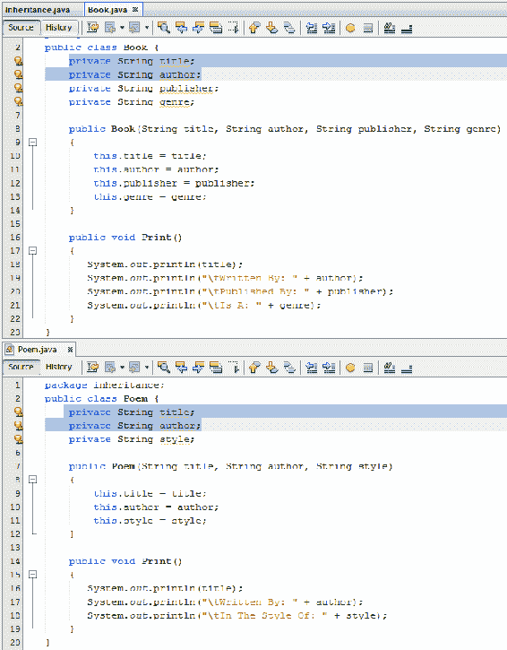
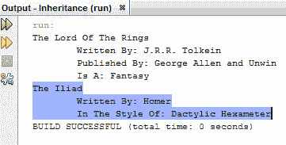
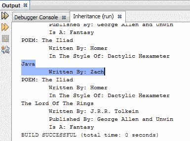

# 第七章：更多面向对象的 Java

在本章中，我们将通过创建超类和子类，理解它们之间的“is-a”关系，使用覆盖、数据结构、抽象方法和受保护方法等概念，来探讨 Java 中的继承。

我们将详细介绍以下概念：

+   继承

+   抽象

# 继承

与其从一个高层描述开始，我认为最好的方法是我们直接解决一个问题。

为了让我们开始，我创建了一个基本的 Java 程序，我们可以从给定的代码文件中访问。在这个程序中，我们声明了两个 Java 类：一个`Book`类和一个`Poem`类。`Book`和`Poem`类都存储了许多属性；例如，Book 可以有一个标题，一个作者，一个出版商和一个流派。它将所有这些属性作为构造函数输入，并提供一个`public`方法；我们可以在我们的主程序中使用`Print`方法来打印出我们创建的任何书籍的信息。

诗歌方法做的事情非常相似。它有一些属性和一个`Print`方法，我们通过它的构造函数设置它的属性。我匆匆忙忙地写了一个利用`Book`和`Poem`类的主函数。这个函数创建了一本新书和一首新诗，然后将它们打印出来：

```java
package inheritance;
public class Inheritance {
    public static void main(String[] args) {
        Book a = new Book(
                "The Lord Of The Rings", 
                "J.R.R. Tolkein",
                "George Allen and Unwin", 
                "Fantasy");
        Poem b = new Poem(
                "The Iliad",
                "Homer",
                "Dactylic Hexameter");

        a.Print();
        b.Print();
    }
}
```

前面的程序运行良好，但比必要的要复杂得多。

如果我们一起看看我们的`Book`和`Poem`类，并只看它们的成员变量，我们会发现`Book`和`Poem`都共享两个成员变量，即`title`和`author`：



他们对成员变量所采取的操作，即将它们打印到屏幕上，都是以非常相似的方式在两个类中执行和实现的：


`Book`和`Poem`从一个共同的类继承是一个好迹象。当我们将书籍和诗歌视为它们所代表的物体时，我们很容易看到这一点。我们可以说书籍和诗歌都是文学形式。

# 创建一个超类

一旦我们得出结论，即书籍和诗歌共享某些基本属性，所有文学作品的属性，我们就可以开始将这些类分解为组成部分。例如，我们的`Book`类有两个真实变量。它有一个`title`变量和一个`author`变量，这些是我们与所有文学作品相关联的属性。它还有一个`publisher`变量和一个`genre`变量，这些可能不仅仅是书籍独有的，我们也不一定认为所有形式的文学作品都具有这些属性。那么我们如何利用这些知识呢？嗯，我们可以构建我们的`Book`和`Poem`类，使它们在基本层面上共享它们作为文学作品的本质。但是，要实现这一点，我们首先需要教会我们的程序什么是一部文学作品。以下是一个逐步的过程：

1.  我们将创建一个全新的类，并将其命名为`Literature`。

1.  我们将为这个类分配我们迄今为止声明的文学作品共享的属性。在我们的情况下，书籍和诗歌已经被声明为作品，具有共享的标题和作者。将所有文学作品都具有标题和作者是有一定逻辑意义的：

```java
package inheritance;
public class Literature {
    protected String title;
    protected String author;
```

1.  从这里开始，我们将像处理任何其他类一样完善我们的`Literature`类。我们将给它一个构造函数；在这种情况下，我们的构造函数将接受两个变量：`title`和`author`。然后，我们将它们分配给字段，就像我们对`Poem`和`Book`类所做的那样：

```java
package inheritance;
public class Literature {
  protected String title;
  protected String author;

  public Literature(String title, String author)
  {
     this.title = title;
     this.author = author;
   }
```

1.  在这个过程中，让我们给`Literature`一个类似的`Print`方法，就像我们为`Book`和`Poem`类分配的那样：

```java
public void Print()
{
   System.out.println(title);
   System.out.println("\tWritten By: " + author);
 }
```

现在，如果我们愿意，我们可以去我们的`main`方法，并声明一个`Literature`类的对象，但这不是重点。这不是我们创建`Literature`类的原因。相反，我们的目标是利用这个`Literature`类作为一个基础，我们将在其上声明更多特定类型的文学作品，比如诗歌或书籍。为了利用我们的`Literature`类，让我们看看它如何适用于现有的`Poem`类。

# 是一个关系

我们的`Literature`类包含了管理文学作品标题和作者的声明和所有功能。如果我们让 Java 知道`Poem`和`Literature`之间存在继承关系，我们应该能够删除以下`Poem`类的标题和作者的所有真实引用：

```java
package inheritance;
public class Poem extends Literature{
    private String title;
    private String author;
    private String style;
```

首先，让我们谈谈我们修改过的`Poem`类的声明。当我们说一个类扩展另一个类时，我们是在说它们之间存在一个是关系，以至于我可以逻辑地说出这样的陈述：“一首诗是一种文学作品。”更多的是 Java 术语，我们是在说`Poem`子类扩展或继承自`Literature`类。这意味着当我们创建一个`Poem`对象时，它将拥有它扩展的类的所有成员和功能：

```java
package inheritance;
public class Poem extends Literature {
    private String style;

    public Poem(String title, String author, String style)
```

在我们的情况下，其中两个成员是`title`和`author`。`Literature`类声明了这些成员，并且在整个类的功能中很好地管理它们。因此，我们可以从我们的`Poem`类中删除这些成员，我们仍然可以在`Poem`类的方法中访问它们。这是因为`Poem`类只是从`Literature`继承了它的声明。但是，我们需要进行轻微修改，以使`Poem`类按预期工作。当我们构造从另一个类继承的类的对象时，默认情况下，子类的构造函数将首先调用超类的构造函数：

```java
package inheritance;
public class Literature {
    protected String title;
    protected String author;

    public Literature(String title, String author)
    {
         this.title = title;
         this.author = author;
    }
```

这让 Java 感到困惑，因为我们现在设置的是`Poem`构造函数接受三个变量作为输入，而`Literature`构造函数只期望两个。为了解决这个问题，在`Poem`构造函数中显式调用`Literature`构造函数，使用以下步骤：

1.  当我们在子类中时，我们可以使用`super`关键字调用我们超类的方法。因此，在这种情况下，我们将通过简单地调用`super`构造函数，或者`Literature`构造函数来开始我们的`Poem`构造函数，并向它传递我们希望它知道的属性：

```java
public Poem(String title, String author, String style)
{
     super(title, author);
     this.style = style;
 }
```

1.  我们可以在我们的`Print`方法中做类似的事情，因为我们的`Literature`类，我们的超类，已经知道如何打印标题和作者。`Poem`类没有实现这个功能是没有理由的：

```java
 public void Print()
 {
      super.Print();
      System.out.println("\tIn The Style Of: " + style);
 }
```

如果我们开始通过调用`super.Print`来开始`Print`方法，而不是在前面的截图中显示的原始显式打印行，我们将从我们的`Print`方法中获得相同的行为。现在，当`Poem`的`Print`方法运行时，它将首先调用超类的，也就是`Literature.java`类的`Print`方法。最后，它将打印出`Poem`类的风格，这种风格并不适用于所有文学作品。

虽然我们的`Poem`构造函数和`Literature`构造函数具有不同的名称，甚至不同的输入样式，但`Poem`和`Literature`之间共享的两个`Print`方法是完全相同的。我们稍后会详细讨论这一点，但现在你应该知道我们在这里使用了一种叫做**覆盖**的技术。

# 覆盖

当我们声明一个子类具有与其超类方法相同的方法时，我们已经覆盖了超类方法。当我们这样做时，最好使用 Java 的`Override`指示符：

```java
@Override public void Print()
```

这是对未来编码人员和我们编译套件的一些更深奥的元素的一个指示，即给定在前面的截图中的方法下隐藏了一个方法。当我们实际运行我们的代码时，Java 会优先考虑方法的最低或子类版本。

所以让我们看看我们是否成功声明了我们的`Poem`和`Literature`关系。让我们回到我们程序的`Inheritence.java`类的`main`方法，看看这个程序的诗歌部分是否像以前一样执行：



当我们运行这个程序时，我们得到了与之前完全相同的输出，这表明我们已经以合理的方式设置了我们的`Poem`类从`Literature`继承。

现在我们可以跳到我们的`Book`类。我们将按照以下步骤将其设置为`Book`和`Literature`类之间的 is-a 关系：

1.  首先，我们将声明`Book`扩展`Literature`类；然后，我们将在我们的`Book`类中删除对标题和作者的引用，因为现在`Literature`类，即超类，将负责这一点：

```java
        package inheritance;
        public class Book extends Literature{
        private String publisher;
        private String genre;
```

1.  与`Poem`类一样，我们需要显式调用`Literature`类的构造函数，并将`title`和`author`传递给它：

```java
        public Book(String title, String author, String publisher, String
        genre)
        {
             super(title, author);
             this.publisher = publisher;
             this.genre = genre;
         }
```

1.  然后，我们可以利用我们的超类的`Print`方法来简化我们的`Book`类的打印：

```java
        @Override public void Print()
        {
             super.Print();
             System.out.println("\tPublished By: " + publisher);
             System.out.println("\tIs A: " + genre);
```

1.  再次，让我们跳回到我们的`main`方法并运行它，以确保我们已经成功完成了这个任务！[](img/269c7dd3-0d67-4a9f-99cd-9bdae0783358.png)

我们成功了：“指环王”的输出，就像我们以前看到的那样。在风格上，这个改变真的很棒。通过添加`Literature`类，然后对其进行子类化以创建`Book`和`Poem`类，我们使得我们的`Book`和`Poem`类更加简洁，更容易让程序员理解发生了什么。

然而，这种改变不仅仅是风格上的。通过声明`Book`和`Poem`类继承自`Literature`类的 is-a 关系，我们给自己带来了实际上以前没有的功能。让我们看看这个功能。如果我们回到我们的`main`方法，假设我们不是处理单个`Book`和`Poem`类，而是处理一个需要存储在某种数据结构中的庞大网络。使用我们最初的实现，这将是一个真正的挑战。

# 数据结构

没有一个易于访问的数据结构可以愉快地存储书籍和诗歌。我们可能需要使用两种数据结构或打破强类型，这正是 Java 的全部意义所在：

```java
Book[] books = new Book[5];
```

然而，通过我们的新实现，`Book`和`Poem`都继承自`Literature`，我们可以将它们存储在相同的数据结构中。这是因为继承是一种 is-a 关系，这意味着一旦我们从某物继承了，我们可以宣称书是文学，诗歌也是文学。如果这是真的，那么`Literature`对象的数组应该能够在其中存储`Book`和`Poem`。让我们按照以下步骤来说明这一点：

1.  创建一个`Literature`对象的数组：

```java
 Literature[] lits = new Literature[5];
 lits[0] = a;
 lits[1] = b;
```

当我们构建这个项目时没有编译错误，这是一个非常好的迹象，表明我们正在做一些合法的事情。

1.  为了进行演示，让我们在这里扩展我们的数组，以包含书籍和诗歌的数量：

```java
 Literature[] lits = new Literature[5];
 lits[0] = a;
 lits[1] = b;
 lits[2] = a;
 lits[3] = b;
 lits[4] = a;
```

我们将修改我们的`main`方法，直接从数组中打印出来。现在，当我们像使用它们的超类对象一样使用我们的子类时，我们必须意识到我们现在是将它们作为该超类的对象引用。例如，当我们遍历并从我们的`Literature`数组中获取一个元素时，无论该元素是`Book`类，我们仍然无法访问诸如其`genre`字段之类的东西，即使这个字段是`public`：

```java
 Literature[] lits = new Literature[5];
 lits[0] = a;
 lits[1] = b;
 lits[2] = a;
 lits[3] = b;
 lits[4] = a;
 for(int i=0; i< lits.length; i++)
 {
      lits[i].Print(); 
 }
```

这是因为我们现在使用的`Literature`类作为一个对象（如前面的截图所示）没有`genre`成员变量。但我们可以调用超类中被子类重写的方法。

1.  我们可以在我们的`for`循环中调用`Literature`类的`Print`方法。Java 将优先考虑我们子类的`Print`方法：

```java
for(int i=0; i< lits.length; i++)
{
     lits[i].Print(); 
 }
```

这意味着，当我们运行这个程序时，我们仍然会得到我们归因于`Book`和`Poem`的特殊格式化输出，而不是我们存储在`Literature`类中的简化版本：

```java
public void Print()
{
     System.out.println(title);
     System.out.println("\tWritten By: " + author);
 }
```

# 抽象方法

我们有时会看到一些方法只存在于被子类重载。这些方法什么也不做，我们可以在超类（`Literature.java`）中使用`abstract`关键字标记它们，即`public abstract void Print()`。当然，如果一个类有声明为`abstract`的方法，这可能是一个好迹象，即这样的类的实例应该永远不会被显式创建。如果我们的`Literature`类的`Print`方法是抽象的，我们就不应该声明只是`Literature`的对象。我们应该只使用`Literature`的子类的对象。如果我们要走这条路，我们也应该将`Literature`声明为一个`abstract`类：

```java
package inheritance;
public abstract class Literature {
```

当然，如果我们这样做，我们就必须摆脱对`Literature`类的超级方法的引用，所以现在让我们撤销这些更改。

让我们看一下我们在最初构建这个程序时犯的一个小错误。在创建我们的 Literature 类时，我们声明了`title`和`author`为`public`成员变量。你可能知道，通常情况下，如果没有充分的理由，我们不会声明成员变量为 public。一旦宣布了，文学作品改变其作者并没有太多意义，所以`author`和`title`应该是`private`成员变量，它们在`Literature`类的构造函数中设置，其值不应该改变。不幸的是，如果我们对我们的 Literature 类进行这种更改，我们将限制我们的 Poem 和 Book 类的功能。

比如说，我们想要修改`Poem`类的`Print`函数，这样它就不必显式调用`Literature`类的`Print`函数了：

```java
@Override public void Print()
{
     System.out.println(title);
     System.out.println("\tWritten By: " + author);
     System.out.println("\tIn The Style Of: " + style);
 }
```

也许我们想要通过声明在这里创建一个`Poem`类来开始它：

```java
System.out.println("POEM: " + title);
```

不幸的是，因为我们已经将`title`和`author`私有化到`Literature`类中，即使`Poem`类是`Literature`的子类，也无法在其显式代码中访问这些成员变量。这有点烦人，似乎在`private`和`public`之间有一种保护设置，它对于类的子类来说是私有的。实际上，有一种保护设置可用。

# 受保护的方法

`protected`方法是受保护的保护设置。如果我们声明成员变量为`protected`，那么它意味着它们是私有的，除了类和它的子类之外，其他人都无法访问：

```java
package inheritance;
public class Literature {
    protected String title;
    protected String author;
```

只是为了让自己放心，我们在这里所做的一切都是合法的。让我们再次运行我们的程序，确保输出看起来不错，事实也是如此。之后，我们应该对继承有相当好的理解。我们可以开发很多系统，这些系统真正模拟它们的现实世界对应物，并且我们可以使用继承和小类编写非常优雅和功能性的代码，这些小类本身并不做太多复杂的事情。

# 抽象

在这一部分，我们将快速了解与 Java 中继承相关的一个重要概念。为了理解我们要讨论的内容，最好是从系统中的现有项目开始。让我们来看看代码文件中的代码。

到目前为止，我们已经做了以下工作：

+   我们程序的`main`方法创建了一个对象列表。这些对象要么是`Book`类型，要么是`Poem`类型，但我们将它们放在`Literature`对象的列表中，这让我们相信`Book`和`Poem`类必须继承或扩展`Literature`类。

+   一旦我们建立了这个数组，我们只需使用`for`循环迭代它，并在每个对象上调用这个`for`循环的`Print`方法。

+   在这一点上，我们处理的是`Literature`对象，而不是它们在最低级别的书籍或诗歌。这让我们相信`Literature`类本身必须实现一个`Print`方法；如果我们跳进类，我们会看到这确实是真的。

然而，如果我们运行我们的程序，我们很快就会看到书籍和诗歌以稍有不同的方式执行它们的`Print`方法，为每个类显示不同的信息。当我们查看`Book`和`Poem`类时，这一点得到了解释，它们确实扩展了`Literature`类，但每个类都覆盖了`Literature`类的`Print`方法，以提供自己的功能。这都很好，也是一个相当优雅的解决方案，但有一个有趣的案例我们应该看一看并讨论一下。因为`Literature`本身是一个类，我们完全可以声明一个新的`Literature`对象，就像我们可以为`Book`或`Poem`做的那样。`Literature`类的构造函数首先期望文学作品的`title`，然后是`author`。一旦我们创建了`Literature`类的新实例，我们可以将该实例放入我们的`Literature`类列表中，就像我们一直在做的`Book`和`Poem`类的实例一样：

```java
Literature l= new Literature("Java", "Zach");
Literature[] lits = new Literature[5];
lits[0] = a;
lits[1] = b;
lits[2] = l;
lits[3] = b;
lits[4] = a;
for(int i=0; i< lits.length; i++)
{
     lits[i].Print(); 
 }
```

当我们这样做并运行我们的程序时，我们将看到`Literature`类的`Print`方法被执行，我们创建的新`Literature`对象将显示在我们的书籍和诗歌列表旁边：



那么问题在哪里呢？嗯，这取决于我们试图设计的软件的真正性质，这可能有很多道理，也可能没有。假设我们正在作为图书馆系统的一部分进行这项工作，只提供某人所谓的 Java 是由某个叫 Zach 的人写的这样的信息，而不告诉他们它是一本书还是一首诗或者我们决定与特定类型的文学相关联的任何其他信息。这可能根本没有用，而且绝对不应该这样做。

如果是这样的话，Java 为我们提供了一个可以用于继承目的的类创建系统，但我们将永远无法合法地单独实例化它们，就像我们以前做的那样。如果我们想标记一个类为那种类型，我们将称其为`abstract`类，并且在类的声明中，我们只需使用`abstract`关键字。

```java
public abstract class Literature {
```

一旦我们将一个类标记为`abstract`，实例化这个类就不再是一个合法的操作。乍一看，这是一件非常简单的事情，主要是一种“保护我们的代码免受自己和其他程序员的侵害”的交易，但这并不完全正确；它是正确的，但这并不是将一个类声明为`abstract`的唯一目的。

一旦我们告诉 Java，我们永远不能创建一个单独的`Literature`实例，只能使用`Literature`作为它们的超类的类，当设置`Literature`类时，我们就不再受到限制。因为我们声明`Literature`是一个抽象类，我们和 Java 都知道`Literature`永远不会单独实例化，只有当它是一个正在实例化的类的超类时才会实例化。在这种情况下，我们可以不需要大部分 Java 类必须具有的这个类的部分。例如，我们不需要为`Literature`实际声明构造函数。如果`Literature`是一个标准的 Java 类，Java 不会接受这一点，因为如果我们尝试实例化`Literature`，它将不知道该怎么做。将没有构造函数可供调用。但是因为`Literature`是抽象的，我们可以确信`Literature`的子类将有自己的构造函数。当然，如果我们做出这个改变，我们将不得不摆脱子类中对`Literature`构造函数的引用，也就是删除子类中的`super`方法。因此，这个改变肯定是有所取舍的。这需要更多的代码在我们的子类中，以减少我们的`Literature`超类中的代码。在这种特定情况下，这种权衡可能不值得，因为我们在`Book`和`Poem`构造函数之间重复了代码，但如果可以假定`Literature`子类的构造函数做的事情非常不同，不声明一个共同的基础构造函数就是有意义的。

因此，简而言之，当我们设计我们的程序或更大的解决方案时，我们应该将那些在架构目的上非常合理但永远不应该单独创建的类声明为`abstract`。有时，当某些常见的类功能，比如拥有构造函数，对于这个类来说根本就没有意义时，我们真的会知道我们遇到了这样的类。

# 摘要

在本章中，我们了解了面向对象编程的一些复杂性，通过精确地使用继承的概念，创建了一个称为超类和子类的东西，并在它们之间建立了“是一个”关系。我们还讨论了一些关键方面的用法，比如覆盖子类和超类、数据结构和`protected`方法。我们还详细了解了`abstract`方法的工作原理。

在下一章中，您将了解有用的 Java 类。
