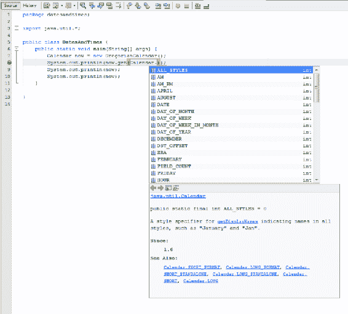
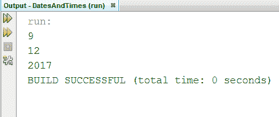
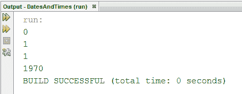
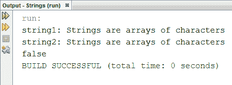
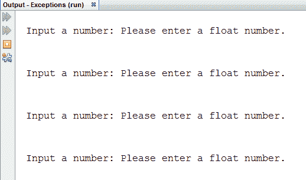
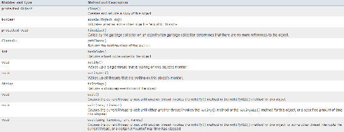
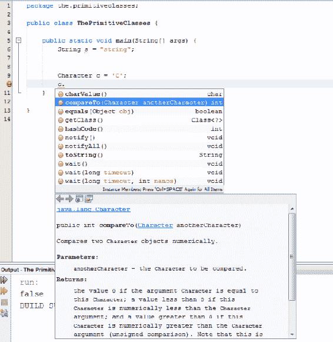

# 第八章：有用的 Java 类

一旦我们对 Java 的基础知识，包括 Java 语法和 Java 构建的基本面向对象概念，有了一定的信心，我们就可以看一下 Java 的 API 和类库，这些对我们来说是立即和轻松地可访问的，用于编写 Java 程序。我们要这样做是因为我们将使用这些类库来加快我们的编程速度，并利用那些编写了非常棒东西的程序员的工作。

此外，查看 Java 类库，或者任何编程语言的类库，也是了解编程语言设计用途以及该语言中最佳编码应该是什么样子的好方法。

因此，在本章中，我们将看一下`Calendar`类及其工作原理。我们将深入研究`String`类及其一些有趣的方法。接下来，我们将介绍如何检测异常，即程序中的异常情况，以及如何处理它们。我们将看一下`Object`类，它是 Java 中所有类的超类。最后，我们将简要介绍 Java 的原始类。

本章将涵盖以下主题：

+   Calendar 类

+   `String`类以及使用`String`对象和文字之间的区别

+   异常及如何处理它们

+   `Object`类

+   Java 的原始类

# Calendar 类

在本节中，我们将看一下 Java 的`Calendar`类。在编写 Java 代码时，我们通常使用`Calendar`类来指代特定的时间点。

`Calendar`类实际上是 Java API 的一个相对较新的添加。以前，我们使用一个叫做`Date`的类来执行类似的功能。如果你最终要处理旧的 Java 代码，或者编写涉及 SQL 或 MySQL 数据库的 Java 代码，你可能会偶尔使用 Java 的`Date`类。如果发生这种情况，不要惊慌；查阅 Java 文档，你会发现有一些非常棒的函数可以在`Calendar`和`Date`对象之间进行切换。

为了看到 Java 的`Calendar`类的强大之处，让我们跳入一个 Java 程序并实例化它。让我们创建一个新程序；首先，从`java.util`包中导入所有类，因为`Calendar`类就在那里。

接下来，我们声明一个新的`Calendar`对象；我将其称为`now`，因为我们的第一个目标是将这个`Calendar`对象的值设置为当前时刻。让我们将`now`的值设置为`Calendar`对象的默认值，并看看它给我们带来了什么。为了做到这一点，我想我们需要使用`new`关键字。虽然我们实际上还没有在文档中查找过，但这似乎是一个合理的起始或默认日期，用于`Calendar`实例。

最后，让我们设置我们的程序，以便打印出我们的`now`对象中包含的信息：

```java
package datesandtimes; 

import java.util.*; 

public class DatesAndTimes { 
    public static void main(String[] args) { 
        Calendar now = new Calendar(); 
        System.out.println(now); 
    } 

} 
```

也许令人惊讶的是，当我们尝试编译这个基本程序时，它实际上失败了：


我们的错误出现在`Calendar`上，我们已经实例化了`Calendar`类，根据控制台显示的错误。错误是`Calendar`是抽象的，不能被实例化。

如果你还记得，抽象类是那些纯粹设计为被子类化的类，我们永远不能单独声明抽象类的实例。那么如果我们永远不能实例化 Java 的`Calendar`类，那么它有什么好处呢？当然，这不是一个公平的问题，因为我们绝对可以创建`Calendar`对象；它们只是特定类型的`Calendar`对象。我们几乎总是会使用`GregorianCalendar`。

# Calendar 的子类

让我们退一步，假设也许是正确的，我们不知道`Calendar`有哪些选项可用。这是使用**IDE（集成开发环境）**，比如 NetBeans，真的很棒的时候之一。

通常，在这个时间点上，我们需要查看 Java 文档，以确定`Calendar`的子类有哪些可以实例化。但是因为我们的 IDE 知道我们已经导入的包的一些元数据，我们可以询问我们的 IDE 它认为可能是我们代码的一个可能解决方案。如果你在 NetBeans 中工作，你可以通过从工具|选项|代码完成中检查一些代码完成选项来经常获得这些类型的建议。

然而，为了防止代码完成一直弹出，我将在这个场合使用 NetBeans 的快捷方式。默认情况下，这个快捷键组合是*Ctrl* + space，这将在我们光标当前位置弹出一个代码完成弹出窗口，如下面的屏幕截图所示：


NetBeans 中的代码完成选项非常出色。NetBeans 给了我们三个可能的建议：抽象的`Calendar`类，`BuddhistCalendar`和`GregorianCalendar`。我们已经知道我们不想使用`Calendar`类，因为我们实际上不能实例化一个抽象类。`BuddhistCalendar`和`GregorianCalendar`看起来确实是`Calendar`的子类。

如果我们选择`GregorianCalendar`，我们会看到它是`Calendar`的一个子类。所以让我们试着创建一个全新的`GregorianCalendar`实例，使用默认的设置和值：

```java
package datesandtimes; 

import java.util.*; 

public class DatesAndTimes { 
    public static void main(String[] args) { 
        Calendar now = new GregorianCalendar(); 
        System.out.println(now); 
    } 

} 
```

如果我们运行这个 Java 程序，我们确实会得到一些输出：


这个输出意味着两件事：

+   我们的语法是正确的，因为我们成功编译了

+   我们可以看到 Java 在一个全新的`Calendar`对象中放入了什么值

Java 的一个很棒的地方是它要求新对象实现`toString()`方法，这个方法被`println()`使用。这意味着大多数 Java 标准库对象在我们要求它们打印自己时，能够以某种人类可读的格式打印出来。

我们这里打印出的新的`Calendar`类并不容易阅读，但我们可以浏览一下，看到许多字段已经被赋值，我们还可以看到`Calendar`类实际上有哪些字段（比如`areFieldsSet`，`areAllFieldsSet`等）。

# 获取当前的日，月和年

让我们看看如何从`Calendar`类中获取一个信息。让我们看看它是否实际上被设置为今天的值。让我们将日，月和年分别打印在三行`println`上，以保持简单。要访问当前的日，月和年，我们需要从`now`的`Calendar`对象中获取这些字段。如果我们的`Calendar`对象表示特定的时间点，它应该有日，月和年的字段，对吧？如果我们打开自动完成选项，我们可以看到我们的`Calendar`对象公开给我们的所有字段和方法，如下面的屏幕截图所示：


我们不会找到一个容易访问的日，月和年字段，这可能开始让我们对`Calendar`感到失望；然而，我们只是没有深入到足够的层次。

`Calendar`类公开了`get()`方法，允许我们获取描述特定`Calendar`实例或时间点的字段。这是一个以整数作为参数的函数。对于我们中的一些人来说，这一开始可能看起来有点混乱。为什么我们要提供一个整数给`get()`，告诉它我们正在寻找哪个`Calendar`字段？

这个整数实际上是一个枚举器，我们暂时将其视为`Calendar`类本身公开的静态字符串。如果我们在`get()`的参数中输入`Calendar`类名，就像我们想要获取一个静态成员变量，然后返回自动完成，我们会看到我们可以在这个实例中使用的选项列表，如下面的屏幕截图所示：



其中一些选项并不太合理。我们必须记住，自动完成只是告诉我们`Calendar`公开的内容；它并不给我们解决方案，因为它不知道我们想要做什么。例如，我们不希望使用我们的`Calendar`实例`now`来获取其`May`的值；这没有任何意义。但是，我们可以使用我们的`Calendar`实例来获取当前月份（`MONTH`）。同样，我们真正想要的是当月的日期（`DAY_OF_MONTH`）和当前年份（`YEAR`）。让我们运行以下程序：

```java
package datesandtimes; 

import java.util.*; 

public class DatesAndTimes { 
    public static void main(String[] args) { 
        Calendar now = new GregorianCalendar(); 
        System.out.println(now.get(Calendar.MONTH)); 
        System.out.println(now.get(Calendar.DAY_OF_MONTH)); 
        System.out.println(now.get(Calendar.YEAR)); 
    } 

} 
```

如果我们运行上述程序，我们得到输出`9`，`12`，`2017`：



我写这本书是在 2017 年 10 月 12 日，所以这实际上有点令人困惑，因为十月是一年中的第十个月。

幸运的是，对此有一个合理的解释。与一年中的日期和年份不同，它们可以存储为整数变量，大多数编程语言中的`Calendar`和类似`Calendar`的类的大多数实现（不仅仅是 Java）选择将月份存储为数组。这是因为除了数值之外，每个月还有一个相应的字符串：它的名称。

由于数组是从零开始的，如果你忘记了这一点，我们的月份看起来比它应该的要低一个月。我们的`println()`函数可能应该如下所示：

```java
System.out.println(now.get(Calendar.MONTH) + 1); 
```

我得到了以下输出。你得相信我；这是今天的日期：


因此，`Calendar`有很多与之关联的方法。除了使用`get()`函数将`Calendar`设置为当前时间点并从中读取外，我们还可以使用`set()`函数将`Calendar`设置为时间点。我们可以使用`add()`函数添加或减去负值来指定时间点。我们可以使用`before()`和`after()`函数检查时间点是在其他时间点之前还是之后。

# 日历的工作原理

然而，如果像我一样，你想知道这个`Calendar`对象是如何运作的。它是将月份、日期和时间秒存储在单独的字段中，还是有一个包含所有这些信息的大数字？

如果我们花一些时间查看`Calendar`类实现中可用的方法，我们会发现这两个方法：`setTimeInMillis()`及其姐妹方法`getTimeInMillis()`如下截图所示：


这些方法被特别设置是一个很好的机会，让我们看看`Calendar`类的真正思维方式。

让我们通过调用`getTimeInMillis()`函数并打印其输出来开始我们的探索：

```java
System.out.println(now.getTimeInMillis()); 
```

我们得到了一个非常大的整数，这很可能是自某个特定时间以来的毫秒数：


如果我们进行数学计算，我们会发现这个时间点实际上不是公元元年；相反，它的时间要比那更接近。`Calendar`类称这个时间点为**纪元**，这是我们开始计算的时间点，当我们在 Java 中存储时间时，我们计算了多少毫秒自纪元以来。

我们可以使用计算器通过一个相当费力的过程来准确计算这个时间点，或者我们可以在我们的本地 Java 环境中以更少的痛苦来做。让我们简单地将`now`的值更改为`0`时的时间点，最初设置为默认或当前时间点。我们将使用`setTimeInMillis()`并提供`0`作为参数：

```java
package datesandtimes; 

import java.util.*; 

public class DatesAndTimes { 
    public static void main(String[] args) { 
        Calendar now = new GregorianCalendar(); 

 now.setTimeInMillis(0); 

        System.out.println(now.getTimeInMillis()); 
        System.out.println(now.get(Calendar.MONTH) + 1); 
        System.out.println(now.get(Calendar.DAY_OF_MONTH)); 
        System.out.println(now.get(Calendar.YEAR)); 
    } 

} 
```

当我们再次运行程序时，我们得到相同的输出字段：



我们输出的第一个数字是我们确认毫秒已设置为`0`。现在我们的`Calendar`时间是 1970 年 1 月 1 日。因此，一旦我们开始向我们的对象添加天数，我们将从 1970 年 1 月 2 日开始计算。这个时间点被 Java `Calendar`称为时代。

为什么这对我们来说是一个非常有趣的事情？这意味着我们可以将我们的`Calendar`类转换为这些毫秒值，然后将它们作为整数值相加、相减，我想还可以将它们作为整数值相乘和相除。这使我们能够在数学的本机格式上对它们进行各种操作。

最后，我想向您展示另一件事，因为这是一个语法上的细节，您可能不熟悉，也可能不会在第一时间认出。如果您回忆一下本节开头，我们说`Calendar`是一个抽象类；我们只能实例化特定类型的`Calendar`类。然而，通常情况下，我们不会指定我们要找的确切类型的日历；我们会要求`Calendar`类来决定这一点。

正如我们在枚举中看到的，除了具有对象级方法之外，`Calendar`类还提供了一些静态方法，我们可以通过引用`Calendar`类型名称来使用。其中一个方法是`Calendar.getInstance()`，它将为我们创建 Java 可以找到的最佳匹配`Calendar`类：

```java
Calendar now = Calendar.getInstance(); 
```

在这种情况下，将是我们已经创建的相同的`GregorianCalendar`类。

# 字符串功能

在 Java 中处理字符串可能会有点令人困惑，因为它们确实是一个特殊情况。字符串与之相关联的是字符串字面值的概念，即双引号之间的字符序列。我们可以将它直接放入我们的 Java 程序中，Java 会理解它，就像它理解整数或单个字符一样。

与整数、字符和浮点数不同，Java 没有与这个字符串字面值相关联的原始关键字。如果我们想要的话，我们可能会得到的最接近的是字符数组；然而，通常情况下，Java 喜欢我们将字符串字面值与`String`类相关联。要更好地理解`String`类，请查看以下程序：

```java
package strings; 

public class Strings { 

    public static void main(String[] args) { 
        String s1 = new String
         ("Strings are arrays of characters"); 
        String s2 = new String
         ("Strings are arrays of characters"); 

        System.out.println("string1: " + s1); 
        System.out.println("string2: " + s2); 
        System.out.println(s1 == s2); 

    } 
} 
```

Java 中的`String`类是特殊的。在某些方面，它就像任何其他类一样。它有方法，正如我们在代码行中看到的，我们定义了变量`s1`和`s2`，它有一个构造函数。但是，我们可以对`String`类使用通常仅保留给字面值和基本类型的运算符。例如，在前面的程序中，我们将`s1`添加到字符串字面值`string 1:`中以获得有意义的结果。在处理 Java 对象时，这通常不是一个选项。

# 字符串字面值与字符串对象

Java 决定将`String`类的对象作为字符串字面值或真正的对象可以互换使用，这真的很强大。它给了我们比我们原本拥有的更多操作文本的选项，但它也有一些权衡。在处理`String`对象时，非常重要的是我们理解我们是在处理它的字符串值还是对象本身。这是因为我们可能会得到截然不同的行为。我们看到的前面的程序旨在说明其中一个实例。

这是一个非常简单的程序。让我们逐步进行并尝试预测其输出。我们首先声明并实例化两个`String`对象：`s1`和`s2`。我们使用`String`构造函数（我们很快会谈到为什么这很重要），并简单地将相同的字符串字面值传递给这些新对象中的每一个。然后，我们要求我们的程序打印出这些值，以便我们可以进行视觉比较。但是，我们还要求我们的程序执行这个有趣的任务：使用双等号比较运算符` s1`和`s2`进行比较。在运行此程序之前，花一秒钟时间问自己，“你认为这个比较的结果会是什么？”。

当我运行这个程序时，我发现 Java 不相信`s1`和`s2`的比较结果是`true`。我得到的结果是`false`：



根据我们当时对`s1`和`s2`的想法，输出要么是合理的，要么是令人困惑的。如果我们认为`s1`和`s2`是由比较运算符比较的字符串文字，那么我们会感到非常困惑。我们会想知道为什么我们没有得到`true`的结果，因为分配给`s1`和`s2`的字符串文字是相同的。

然而，如果我们把`s1`和`s2`看作它们实际上是的对象，`false`的结果就更有意义了，因为我们询问 Java 的是，“这两个对象是相同的吗？”显然不是，因为它们都是创建两个不同新对象的结果。

这就是为什么我们喜欢在 Java 中尽可能使用`equals()`方法。几乎每个对象都实现了`equals()`方法，而且应该为每个对象编写`equals()`方法，以便逻辑上比较这些对象的值。

如果我们使用`equals()`方法比较我们的字符串，我们也比较它们包含的字符串文字值：

```java
System.out.println(s1.equals(s2)); 
```

现在，如果我们执行我们的程序，我们得到的结果是`true`，而不是当我们试图看它们是否实际上是存储在内存的相同位置的相同对象时得到的`false`：


# 字符串函数

这个`String`实现给了我们什么能力？嗯，我们知道我们可以添加或连接字符串，因为我们可以将它们作为文字进行操作。除了文字操作，我们还可以利用`String`类本身提供的所有功能。我们可以查看 Java 文档，了解可用的功能，或者我们可以始终使用 NetBeans 的代码完成功能进行检查。我应该在这里指出，我们甚至可以在字符串文字上使用`String`类的功能，如下面的屏幕截图所示：


# replace()函数

你将在方法列表中看到的大多数方法都是相当不言自明的（`toLowerCase()`，`toUpperCase()`等）。但为了确保我们都明白，让我们使用其中一个。让我们使用`replace()`。`replace()`函数接受两个参数，这些参数可以是单个字符，也可以是字符串符合条件的字符序列。该方法简单地用第二个字符串或字符替换第一个字符串或字符的所有实例。让我们看下面的`replace()`示例：

```java
package strings; 

public class Strings { 

    public static void main(String[] args) { 
        String s1 = new String
        ("Strings are arrays of  characters"); 
        String s2 = new String
        ("Strings are arrays of characters"); 

        System.out.println
        ("string1: " + s1.replace("characters", "char")); 
        System.out.println("string2: " + s2); 
        System.out.println(s1.equals(s2)); 
    } 
} 
```

当我们运行我们的程序时，我们看到我们修改了它的输出：


大多数这些方法只是修改返回的值。我们可以看到我们的程序仍然发现在代码的最后一行`s1`等于`s2`，这表明我们对`replace()`方法的调用没有修改`s1`的值。`replace()`方法只是返回修改后的值供我们的`println()`函数使用。

# format()函数

也许，`String`类中最有趣的方法之一实际上是它的静态方法之一：`String.format()`。为了向您展示`String.format()`的强大功能，我想为我们的项目创建一个全新的功能类。因此，在屏幕左侧显示的文件系统中右键单击项目名称，在新建类中输入`CustomPrinter.java`：

```java
package strings; 

public class Strings { 

    public static void main(String[] args) { 
        CustomPrinter printer = new CustomPrinter("> > %s < <"); 

        String s1 = new String
        ("Strings are arrays of characters"); 
        String s2 = new String
        ("Strings are arrays of characters"); 

        printer.println
        ("string1: " + s1.replace("characters", "char")); 
        printer.println("string2: " + s2); 
    } 
} 
```

为了让你看到我们在设置`CustomPrinter`类时在做什么，让我们看一下我们将在`main()`方法中使用的预写代码。`CustomPrinter`类的想法是它将有一个以字符串作为输入的构造函数。这个输入字符串将格式化或包装我们使用`CustomPrinter`实例打印到控制台的任何字符串。我们将在`CustomPrinter`中实现`System.out.println()`，所以当我们想要利用它来格式化我们的文本时，我们可以直接调用`printer.println()`。

在 Java 中格式化字符串时，我们使用一些特殊的语法。在我们的格式字符串中，我们可以用百分号（就像我们在代码中使用的`%s`）来预先标识字符`f`或`d`或`s`。在`String.format()`函数方面，Java 将这些理解为我们的格式字符串中要插入其他信息的区域。

我们在代码中使用的格式字符串将用尖括号包装我们创建的任何字符串输出。这比简单地将字符串附加和前置更复杂，我们当然可以创建一个实现，允许我们向我们的格式化字符串添加多个部分。

接下来让我们编辑`CustomPrinter.java`文件。我们知道我们需要一个`CustomPrinter`构造函数，它接受一个格式字符串作为输入。然后，我们可能需要存储这个`format`字符串。所以让我们的构造函数接受提供的格式字符串，并将其存储以备后用在`formatString`变量中：

```java
package strings; 

public class CustomPrinter { 
    private String formatString; 

    public CustomPrinter(String format) 
    { 
        formatString = format; 
    } 
} 
```

我们还声明了一个`println()`函数，据推测它将是一个`void`函数；它只会利用`system.out.println()`将某些东西打印到屏幕上。那个*某些东西*会有点复杂。我们需要拿到我们给定的格式字符串，并用`println()`函数提供的输入替换`%s`。

我们使用了强大的`String.format()`静态函数，它接受两个参数：一个格式字符串和要格式化的数据。如果我们的格式字符串有多个要格式化的字符串，我们可以在`String.format()`中提供多个字段。这是一个可以接受任意数量输入的函数。但是，为了保持一切简单和顺利，我们只会假设我们的格式字符串只有一个输入实例。

一旦我们成功使用`String.format()`函数格式化了这个字符串，我们就会简单地将它打印到屏幕上，就像我们之前做的那样：

```java
package strings; 

public class CustomPrinter { 
    private String formatString; 

    public CustomPrinter(String format) 
    { 
        formatString = format; 
    } 

    public void println(String input) 
    { 
        String formatted = String.format(formatString, input); 
        System.out.println(formatted); 
    } 
} 
```

当我们运行这个程序（我们需要运行我们有`main()`方法的类），我们会看到我们所有的输出都被正确地包裹在尖括号中：


当然，像这样扩展自定义打印机，以接受更多的各种输入，并且比我们创建的快速东西更加动态，是任何东西的基础，比如日志系统，或者终端系统，你将能够看到相同的信息片段包裹在消息周围。例如，我们可以使用这样的自定义打印机，在向用户发送任何消息后放置日期和时间。然而，细节需要被正确格式化，这样它们不仅仅是被添加在末尾，而是在它们之间有适当的间距等。

我希望你已经学到了一些关于字符串的知识。Java 处理它们的方式真的很强大，但和大多数强大的编程工具一样，你需要在基本水平上理解它们，才能确保它们不会回来咬你。

# 异常

有时，我们的代码可能会失败。这可能是我们犯了编程错误，也可能是最终用户以我们没有预料到的方式使用我们的系统。有时，甚至可能是硬件故障；很多错误实际上不能真正归因于任何一个单一的来源，但它们会发生。我们的程序处理错误情况的方式通常和它处理理想使用情况的方式一样重要，甚至更重要。

在这一部分，我们将看一下 Java 异常。使用 Java 异常，我们可以检测、捕获，并在某些情况下从我们的程序中发生的错误中恢复。当我们处理异常时，有一件非常重要的事情要记住。异常之所以被称为异常，是因为它们存在于处理特殊情况，即我们在最初编写代码时无法处理或无法预料到的情况。

异常修改了我们程序的控制流，但我们绝不应该将它们用于除了捕获和处理或传递异常之外的任何其他用途。如果我们试图使用它们来实现逻辑，我们将制作一个对我们来说很快就会变得非常令人困惑，并且对于任何其他试图理解它的程序员来说立即变得非常令人困惑的程序。

为了帮助我们探索 Java 异常，我已经为我们设置了一个基本程序来玩耍；这是一个可能失败的东西。它是一个永恒的循环，做了两件真正的事情。首先，它使用`Scanner`的`nextFloat()`函数从用户那里获取输入，然后将该输入打印回用户：

```java
package exceptions; 

import java.util.*; 

public class Exceptions { 
    public static void main(String[] args) { 
        Scanner reader = new Scanner(System.in); 

        while(true) { 
            System.out.print("Input a number: "); 
            float input = reader.nextFloat(); 
            System.out.println("You input the number: " + input); 
            System.out.println("\r\n"); 
        } 
    } 
} 
```

如果我们将浮点值准确地分配为该程序的输入，那么该程序理论上将永远运行，如下面的屏幕截图所示：


然而，如果我们犯了一个错误，并给这个程序一个字符串作为输入，`nextFloat()`函数将不知道该怎么处理它，就会发生异常：


当这种情况发生时，我们在控制台中会看到红色的文本。这些红色文本实际上是发送到`System.err`流中的。

# 分析控制台异常消息

让我们浏览输出文本并理解它的含义。它有两个重要的部分。输出文本的第一部分，即没有缩进的部分，是这个异常的标识符。它让我们知道异常已经被抛出并且发生在哪里。然后它告诉我们发生了什么类型的异常。您会注意到这个异常在`java.util`路径中被发现（输出的这部分看起来非常类似于我们是否将某些东西导入到我们的代码中或直接将其路径到外部库）。这是因为这个异常实际上是一个 Java 对象，我们的输出文本让我们确切地知道它是什么类型的对象。

这个异常测试的第二部分（缩进的部分）是我们称之为堆栈跟踪。基本上它是我们的程序中 Java 跳过的部分。堆栈跟踪的最底部是异常最初抛出的位置；在这种情况下，它是`Scanner.java`，位于第`909`行。

那不是我们的代码；那是为`Scanner.java`编写的代码，可能是`nextFloat()`方法所在的地方或`nextFloat()`方法调用的代码。

堆栈跟踪是代码的层次，所以一旦发生`InputMismatchException`，Java 就开始跳过这些代码层次或括号区域，直到最终达到代码所在的顶层，这在我们的情况下是`Exceptions.java`。这是我们创建的文件，它在堆栈跟踪的顶部。我们的`Exception.java`代码文件的第 11 行是 Java 能够处理或抛出这个异常的最后位置。

一旦达到第 11 行并且异常仍在向上传播，就没有其他处理了，因为它已经达到了我们程序的顶部。因此，异常最终通过打印到我们的`System.err`流并且我们的程序以结果`1`终止，这是一个失败的情况。

这对于调试目的来说非常好；我们知道我们必须去哪里找出程序出了什么问题，即`Exceptions.java`的第 11 行。但是，如果我们正在创建一个我们希望出于某种合理目的发布的程序，我们通常不希望我们的程序在发生次要错误时崩溃，特别是像这样的输入错误，这是用户偶尔会犯的错误。因此，让我们探讨一下如何处理异常。

# 处理异常

当 Java 被告知抛出异常时，它会停止执行当前的代码块，并开始跳级，直到异常被处理。这就是我们从`Scanner.java`类的第 909 行深处跳转到`Exceptions.java`的第 11 行的方式，这是我们的代码中发生异常的地方。如果我们的代码被另一个代码块执行，因为我们没有处理这个异常，所以不会打印到`System.err`，我们只会将异常抛到另一个级别。因此，他们会在堆栈跟踪中看到`Exception.java`的第 11 行。

然而，有时不断抛出异常是没有意义的。有时，我们希望处理异常情况，因为我们知道该如何处理它，或者因为，就像我们现在处理的情况一样，有比提供堆栈跟踪和异常名称更好的方式来告知用户出了什么问题。

此外，如果我们在这里处理异常，那么我们没有理由不能像什么都没有发生一样恢复我们的`while`循环。这个`while`循环的一个失败案例并不一定是终止我们的程序的理由。如果我们要处理异常情况，我们将使用`try...catch`代码块。

# try 和 catch 块

在我们认为可能会抛出异常并且我们想处理异常的任何代码块中，我们将把该行代码包装在`try`块中。在大多数情况下，这不会影响代码的执行方式，除非在`try`块内发生异常。如果在`try`块内抛出异常，代码不会将异常传播到下一个级别，而是立即执行以下`catch`块中的代码。

请注意，`catch`块在执行之前需要更多的信息；它们需要知道它们要捕获的确切内容。我们可以通过简单地捕获`Exception`类的任何内容来捕获所有异常，但这可能不是一个公平的做法。关于异常处理有很多不同的思路，但一般来说，人们会同意你应该只捕获和处理你在某种程度上预期可能发生的异常。

在我们看到的例子中，我们知道如果我们通过用户输入提供无效信息，就会抛出`InputMismatchException`。因为当这种异常发生时，我们将打印一条消息，明确告诉用户`请输入一个浮点数。`，我们当然不希望捕获任何不是`InputMismatchException`的异常。因此，我们使用以下代码来捕获`InputMismatchException`：

```java
package exceptions; 

import java.util.*; 

public class Exceptions { 
    public static void main(String[] args) { 
        Scanner reader = new Scanner(System.in); 

        while(true) { 
            try{ 
              System.out.print("Input a number: "); 
              float input = reader.nextFloat(); 
              System.out.println("You input the number: " + input); 
              System.out.println("\r\n"); 

            } 
            catch(InputMismatchException e) 
            { 
                System.out.println
                ("Please enter a float number."); 
                System.out.println("\r\n"); 
            } 
        }  
    } 
} 
```

当我们运行这个程序时，首先我们必须快速测试它在一个良好的用例中是否正常工作，就像以前一样。然后，如果我们通过提供字符串输入导致`InputMismatchException`被抛出，我们应该看到我们的 catch 块执行，并且我们应该得到`请输入一个浮点数。`的响应：



现在，正如你所看到的，我们确实得到了那个响应，但不幸的是，我们一遍又一遍地得到了那个响应。我们无意中引入了一个更糟糕的错误。现在，我们的程序不是抛出异常并崩溃，而是进入了一个无限循环。

这是为什么会发生这种情况：我们的`Scanner`对象`reader`是一个流读取器，这意味着它有一个输入缓冲区供它读取。在正常的使用情况下，当我们的无限`while`循环执行时，我们的用户将浮点数添加到该输入缓冲区。我们提取这些内容，打印它们，然后返回循环的开始并等待另一个。然而，当该缓冲区中发现一个字符串时，我们调用`nextFloat()`函数的代码行会抛出一个异常，这没问题，因为我们用 catch 块捕获了它。

我们的 catch 块打印出一行文本，告诉用户他/她提供了无效的输入，然后我们回到 while 循环的开头。但是，我们`reader`对象缓冲区中的坏字符串仍然存在，因此当我们捕获异常时，我们需要清除该流。

幸运的是，这是我们可以处理的事情。一旦我们捕获并处理了异常，我们需要清除流读取器，只需获取其下一行并不使用其信息。这将从读取器中刷新`Please enter a float number.`行：

```java
catch(InputMismatchException e) 
{ 
    System.out.println("Please enter a float number."); 
    System.out.println("\r\n"); 
} 
```

如果我们现在运行程序，我们会看到它处理并从失败的输入中恢复，我们给它一个字符串，这很酷：


让我们再讨论一些我们可以处理异常的事情。首先，在异常情况结束时清除我们的读取器是有很多意义的，但在任何尝试的情况结束时清除我们的读取器可能更有意义。毕竟，我们进入这个`while`循环的假设是读取器中没有新行。因此，为了实现这一点，我们有`finally`块。

# 最后的块

如果我们想要无论我们在`try`块中是否成功，都要执行一个案例，我们可以在`catch`块后面跟着`finally`块。`finally`块无论如何都会执行，无论是否捕获了异常。这是为了让您可以在系统中放置清理代码。清理代码的一个例子是清除我们的`reader`对象缓冲区，以便以后或其他程序员不会困惑。

异常不仅仅是一个简单的被抛出的对象；它们可能包含很多非常重要的信息。正如我们之前看到的，异常可能包含堆栈跟踪。让我们快速修改我们的程序，以便在它仍然提供用户友好的`Please enter a float number.`信息的同时，也打印出堆栈跟踪，以便程序员可以调试我们的程序。

通常，当我们编写用户将要使用的完成代码时，我们永远不希望出现他们能够看到像堆栈跟踪这样深的东西。对大多数计算机用户来说这很困惑，并且在某些情况下可能构成安全风险，但作为调试模式或开发人员的功能，这些详细的异常可能非常有用。

`Exception`类公开了一个名为`printStackTrace()`的方法，它需要一个流作为输入。到目前为止，我们一直在使用`System.out`作为所有输出，所以我们将为`printStackTrace()`方法提供`System.out`作为其流：

```java
catch(InputMismatchException e) 
{ 
    System.out.println("Please enter a float number."); 
    e.printStackTrace(System.out); 
    System.out.println("\r\n"); 
} 
```

现在，当我们运行程序并给出一个错误的字符串时，我们会得到我们最初友好的异常文本代码。但是，我们仍然有堆栈跟踪，因此我们可以准确地看到错误的来源：


正如我之前提到的，异常处理是现代软件开发中一个非常深入的主题，但在本节结束时，您应该对基础知识有所了解。当您在代码中遇到异常或者在编写自己的代码时感到需要异常处理时，您应该做好充分的准备。

# 对象类

在本节中，我们将学习关于 Java 如何选择实现面向对象编程的一些非常重要的内容。我们将探索`Object`类本身。为了开始，我写了一个非常基本的程序：

```java
package theobjectclass; 

public class TheObjectClass { 

    public static void main(String[] args) { 
        MyClass object1 = new MyClass("abcdefg"); 
        MyClass object2 = new MyClass("abcdefg"); 

        object1.MyMethod(); 
        object2.MyMethod(); 

        System.out.println("The objects are the same: " + 
        (object1 == object2)); 
        System.out.println("The objects are the same: " + 
        object1.equals(object2)); 
    } 

} 
```

该程序利用了一个名为`MyClass`的自定义类，并创建了这个类的两个实例：`object1`和`object2`。然后，我们在这些对象上调用了一个名为`MyMethod`的 void 方法，该方法简单地打印出我们给它们的值。然后，程序比较了这些对象。

我们首先使用比较运算符（`==`）进行比较，检查这两个对象是否实际上是同一个对象。我们知道这不会是真的，因为我们可以看到这些对象是完全独立实例化的。它们共享一个类，但它们是`MyClass`类的两个不同实例。然后，我们使用`equals()`方法比较这些对象，在本节中我们将经常讨论这个方法。

当我们运行这个程序时，我们看到当使用比较运算符进行比较时，对象被发现不相同，这是我们所期望的。但是，我们还看到当它们使用`equals()`方法进行比较时，尽管这两个对象是在相同的参数下创建的，并且从它们的创建到现在做了完全相同的事情，但这两个对象被发现不相等。以下是上述代码的输出：


那么，当`equals()`方法发现对象不相等时，这意味着什么？我们应该问自己的第一个问题是，`equals()`方法来自哪里或者它是在哪里实现的？

如果我们按照`MyClass`类的定义，实际上找不到`equals()`方法，这是非常奇怪的，因为`MyClass`并没有声明从任何超类继承，但`equals()`直接在`MyClass`实例上调用。实际上，`MyClass`，就像所有的 Java 类一样，都继承自一个超类。在每个类继承树的顶部，都有`Object`类，即使它在我们的代码中没有明确声明。

如果我们前往 Java 文档（[docs.oracle.com/javase/7/docs/api/java/lang/Object.html](http://docs.oracle.com/javase/7/docs/api/java/lang/Object.html)）并查找`Object`类，我们会找到这样的定义：“`Object`类是类层次结构的根。每个类都有`Object`作为超类。所有对象，包括数组，都实现了这个类的方法。”然后，如果我们滚动页面，我们会得到一个简短但非常重要的方法列表：



因为所有的 Java 对象都继承自`Object`类，我们可以安全地假设我们正在处理的任何 Java 对象都实现了这里的每个方法。在这些方法中，就包括我们刚刚讨论并试图找出其来源的`equals()`方法。这让我们非常清楚，`MyClass`正在从它的`Object`超类中继承`equals()`方法。

在对象级别上，`equals()`方法的定义非常模糊。它说：“指示某个其他对象是否**等于**这个对象。”在某种程度上，这种模糊性让我们作为程序员来决定在逐个类的基础上真正意味着什么是相等的。

假设我们做出决定，合理的决定，即如果它们包含的值相同，那么`object1`和`object2`应该被确定为相等。如果我们做出这个决定，那么我们当前程序的实现就不太正确，因为它目前告诉我们`object1`和`object2`不相等。为了改变这一点，我们需要重写`MyClass`中的`equals()`方法。

# 重写 equals()方法

覆盖`Object`类方法并不比覆盖任何其他超类的方法更困难。我们只需声明一个相同的方法，当我们处理`MyClass`对象时，这个特定的方法将在适当的时候被使用。重要的是要注意，`equals()`方法不以`MyClass`对象作为输入；它以任何对象作为输入。因此，在我们继续比较这个对象的值与我们当前`MyClass`对象的值之前，我们需要保护自己，并确保作为输入的对象实际上是一个`MyClass`对象。

为了做到这一点，让我们检查一些坏的情况，我们希望我们的程序只需返回`false`，甚至不比较这些对象的内部值：

1.  如果我们得到的对象实际上没有被实例化，是一个指针，或者是一个空指针，我们只需返回`false`，因为我们实例化的`MyClass`对象与什么都不等价。

1.  更困难的问题是：我们得到的用于比较的对象是`MyClass`的一个实例吗？让我们检查相反的情况；让我们确认这个对象不是`MyClass`的一个实例。`instanceof`关键字让我们看到一个对象在其库存中有哪些类。如果我们的`instanceof`语句不评估为`true`，我们只需返回`false`，因为我们将比较一个`MyClass`对象和一个不是`MyClass`对象的对象。

一旦我们成功地通过了这些障碍，我们就可以安全地假设我们可以将给定的对象转换为`MyClass`对象。现在我们只需比较它们包含的值字段并返回适当的值。让我们将以下代码写入我们的`MyClass.java`文件，并返回到我们的`main()`方法来运行它：

```java
package theobjectclass; 

public class MyClass { 
    public String value; 
    public MyClass(String value) 
    { 
         this.value = value; 
         System.out.println
         ("A MyClass object was created with value:" + value); 
     } 
     public void MyMethod() 
     { 
        System.out.println
        ("MyMethod was called on a MyClass object with value: " + 
        value); 
      }  

      @Override 
      public boolean equals(Object obj) 
      { 
         if(obj == null) 
           return false; 

         if(!(obj instanceof MyClass)) 
         return false; 

         return value.equals(((MyClass)obj).value); 

       } 
} 
```

当我们运行这个程序时，我们会看到`object1`和`object2`被发现相互等价：


# 其他 Object 方法

`Object`类声明了许多方法。除了`equals()`之外，一些重要的方法是`hashCode()`和`toString()`。在本节中，我们不会实现`hashCode()`，因为它需要我们做比较复杂的数学运算，但我强烈建议你查看`hashCode()`的工作原理，方法是查看文档并探索它。

目前，让我们只知道一个对象的`hashCode()`方法应该返回一个描述该特定对象的整数值。在所有情况下，如果两个对象通过`equals()`方法被发现相等，它们的`hashCode()`函数也应该返回相同的整数值。如果两个对象不相等，就`equals()`方法而言，它们的`hashCode()`函数应该返回不同的值。

此时，我们应该熟悉`toString()`方法。这也是`Object`类中的一个方法，这意味着我们可以在任何单个对象上调用`toString()`方法。但是，在我们的自定义对象中，直到我们覆盖`toString()`，它可能不会返回有意义的、可读的信息。

当你学习 Java 时，我强烈建议你实现`equals()`和`toString()`，即使是在你学习时编写的小测试类上也是如此。这是一个很好的习惯，并且它让你以 Java 相同的方式思考面向对象编程。当我们创建最终的软件项目，其中有其他程序员可能会使用的公共类时，我们应该非常小心，确保所有我们的类以可理解的方式正确实现这些方法。这是因为 Java 程序员希望能够利用这些方法来操作和理解我们的类。

# 基本类

在本节中，我想快速看一下 Java 中可用的原始类。在 Java 中，我们经常说字符串很特殊，因为它们有一个由双引号标识的文字解释；然而，我们主要通过`String`类与它们交互，而不是通过我们实际上无法使用的`string`原始类型。

然而，在标准的 Java 原始类型中，我们通常通过其原始类型方法与其交互。对于每种原始类型，我们都有一个相应的原始类。这些是`Integer`、`Character`和`Float`类等。在大多数情况下，我们创建一个实例然后在该实例上调用方法的显式使用并不是很有用，除非我们重写它们以创建自己的类。让我们看一下以下程序：

```java
package the.primitiveclasses; 

public class ThePrimitiveClasses { 

    public static void main(String[] args) { 
        String s = "string"; 

        Character c = 'c'; 
    } 

} 
```

`Character`类的实例`c`给我们的方法主要是转换方法，如下面的屏幕截图所示，这些方法将自动发生，或者我们可以简单地进行转换： 



请注意，`compareTo()`有时也很有用。如果给定的其他字符等于并且小于`0`或大于`0`，则返回整数值`0`，具体取决于两个字符在整数转换比例中相对于彼此的位置。

然而，通常我们可能会发现自己使用这些原始类的静态方法来操作或从原始类型的实例中获取信息。例如，如果我想知道我们的字符`C`是否是小写，我当然可以将它转换为整数值，查看 ASCII 表，然后看看该整数值是否落在小写字符的范围内。但是，这是一项繁重的工作：


`Character`原始类为我提供了一个静态函数`isLowercase()`，如前面的屏幕截图所示，它将告诉我一个字符是否是小写。让我们运行以下程序：

```java
package the.primitiveclasses; 

public class ThePrimitiveClasses { 

    public static void main(String[] args) { 
        String s = "string"; 

        Character c = 'c'; 
        System.out.println(Character.isLowerCase(c)); 
    } 

} 
```

以下是前面代码的输出：


这确实是原始函数的要点。我们可以以相同的方式与其他文字类型及其原始类型进行交互：如果愿意，可以使用类与字符串交互。

当我们不需要原始类的功能时，应继续使用原始类型（例如，使用`char`而不是`Character`）。语法高亮功能的存在以及这些原始类型在各种语言中的统一外观使它们更加友好，便于程序员使用。

# 摘要

在本章中，我们看了 Java 的`Calendar`类来处理日期和时间。我们详细了解了`String`类。我们还了解了异常是什么，以及如何处理它们使我们的程序更加健壮。然后，我们走过了`Object`类及其一些方法。最后，我们看了 Java 的原始类。

在下一章中，我们将学习如何使用 Java 处理文件。
