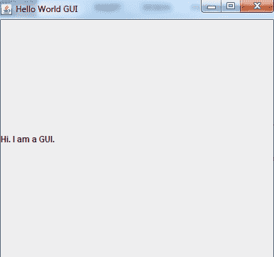
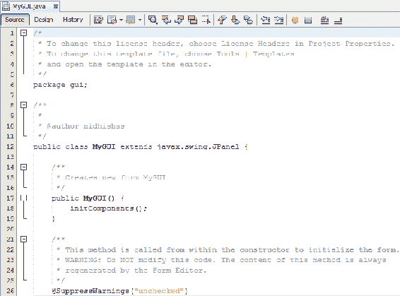
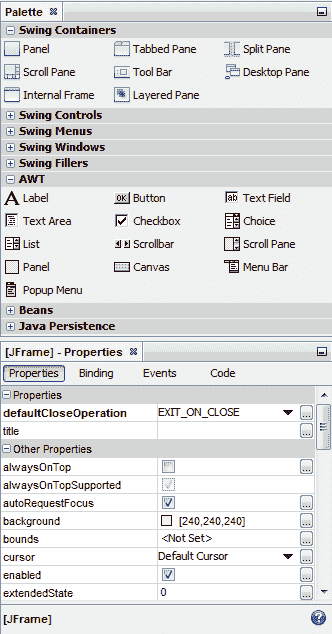
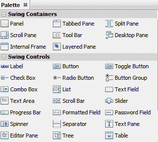
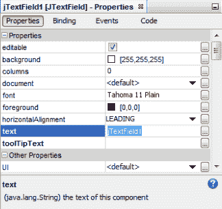
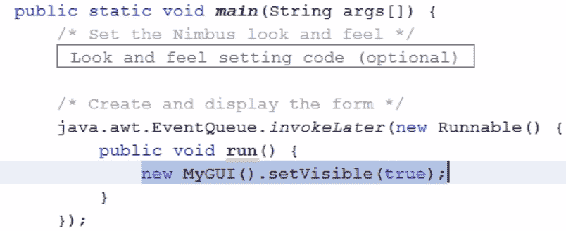
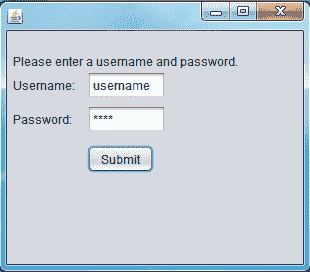

# 基本 GUI 开发

有时，我们编写的程序完全关乎原始功能。然而，我们经常编写的程序通常由我们或其他用户使用，他们期望与我们互动的过程变得流畅。在本章中，我们将看到 NetBeans 中**图形用户界面**（**GUI**）的基本功能。真正了不起的软件程序的几个定义是它们的 GUI 和用户体验。您将学习如何使用`JFrame`类创建应用程序窗口，设置其大小，向其添加标签，并关闭整个应用程序。然后是 GUI 编辑器的主题，即调色板；在这里，我们将看到调色板的工作实例以及其中可用的组件。最后，您将学习如何通过添加按钮并向其添加功能来触发事件。

本章我们将涵盖以下主题：

+   Swing GUI

+   可视化 GUI 编辑工具 - 调色板

+   事件处理

# Swing GUI

NetBeans 是一个功能强大的程序，提供了许多功能，我们通过 NetBeans 提供的 GUI、菜单和按钮来访问这些功能。理论上，我们可以选择将 NetBeans 作为一个命令行程序来操作，但是为了像那样使用 NetBeans，我们将不得不记住或查找一个大型的特定命令库，以执行我们想要执行的每个操作。一个功能强大且写得很好的应用程序具有流畅的界面，将引导我们进入重要的功能，并使我们轻松访问它。JDK 包含一个 Java 扩展库，即`swing`库，它使我们能够非常容易地将我们自己的代码包装在像 NetBeans 这样的 GUI 中。

# JFrame 类

为了开始这个跟踪，我们将编写一个程序，将打开一个新的 GUI 窗口。步骤如下：

1.  在`swing` Java GUI 中心是`JFrame`类。在我们的情况下，这个类将是我们的操作系统处理的实际窗口对象，我们可以在屏幕上移动它。我们可以创建一个新的`JFrame`类，就像创建任何其他对象一样。我们甚至可以向这个`JFrame`类的创建传递一些参数。如果我们只给它一个字符串参数，我们将告诉`JFrame`类要将什么作为它的名称呈现出来：

```java
        package GUI; 
        import javax.swing.*; 

        public class GUI { 
            public static void main(String[] args) { 
                JFrame frame = new JFrame("Hello World GUI"); 
            } 

        } 
```

1.  一旦我们声明了`JFrame`类，它就会像任何其他对象一样存在于 Java 的内存中。除非我们明确告诉它，否则它不会呈现给用户。它只是一个对`setVisible`函数的函数调用，我们将为这个函数分配值`true`，非常简单对吧：

```java
        frame.setVisible(true); 
```

1.  在我们使 JFrame 窗口可见之前，我们还应该调用`pack`方法：

```java
        frame.pack(); 
```

当我们创建更复杂的框架时，它们可能包含大量信息，在 GUI 中，这些信息占据了可见空间。`pack`方法基本上预先构建了框架中对象之间的物理关系，并确保当它实际对用户可见时，框架不会表现出奇怪的行为。到目前为止，我们已经编写了一个非常简单的程序 - 只有三行代码，我们不需要考虑太多：

```java
        package gui; 
        import javax.swing.*; 

        public class GUI { 

            public static void main(String[] args) { 
               JFrame frame = new JFrame("Hello World GUI"); 
               frame.pack(); 
               frame.setVisible(true); 
            } 

        } 
```

当我们运行这个程序时，可能会看起来什么都没有发生，但实际上是有的。在屏幕的左上角，出现了一个新窗口。如果我们点击这个窗口的右侧，理论上我们可以拖动它或者调整窗口的大小：


这是一个完全成熟的窗口，我们的操作系统现在可以处理，允许我们移动; 它甚至支持动态调整大小。您会看到我们的标题也已附加到我们的窗口上。所以这非常基础。

# 设置窗口的大小

现在让我们看看我们的现有`JFrame`类还能做些什么。当我们的 JFrame 窗口出现时，它非常小而且很难看到。这样大小的程序窗口永远不会对任何人有用，所以让我们看看`frame`在设置窗口大小方面给我们的能力。通常，我们会使用`setPreferredSize`方法来为我们的`JFrame`类应用大小。还有一个`setSize`方法，但是这个方法并不总是给我们期望的结果。这是因为现在我们的`JFrame`类被设置为可调整大小，我们不应该明确地为它分配一个大小；相反，我们应该指示它在没有用户的其他输入的情况下，即调整 JFrame 窗口大小，窗口应该是某个大小。

我们可以使用`Dimension`类来存储、操作和创建大小信息。要构造一个新的维度，我们只需给它一个宽度和高度。所以让我们将`JFrame`类的首选大小，即在拉伸之前它想要的大小，设置为`400 x 400`：

```java
frame.setPreferredSize(new Dimension(400, 400)); 
```

`Dimension`类位于另一个库中，所以我们需要导入`java.awt.*;`包，然后我们应该能够构建和编译我们的项目，然后再次打开我们的新 GUI：


现在我们有一个不错的正方形 GUI 来开始；但是，因为里面没有任何内容，它仍然相当无用。

# 添加一个标签

现在让我们从编程角度快速看一下如何向我们的 GUI 添加元素。可能我们可以放在`JFrame`中的最简单的元素是`JLabel`。标签负责包含文本，实例化它们非常简单。我们只需告诉它们应该包含什么文本。当然，在更复杂的程序和 GUI 中，这个文本可能会变得动态并且可能会改变，但现在，让我们只是显示一些文本：

```java
JLabel label = new JLabel("Hi. I am a GUI."); 
```

仅仅声明我们有一个`JLabel`类是不够的。我们还没有以任何方式将这个标签对象与我们现有的窗口关联起来。我们的窗口，你可能可以通过它公开的大量方法和成员来看出来，有很多组件，我们需要知道我们需要将我们的新`JLabel`类放在这些组件中的哪一个：

```java
package gui; 
import javax.swing.*; 
import java.awt.*; 
public class GUI { 

    public static void main(String[] args) { 
        JFrame frame = new JFrame("Hello World GUI"); 
        frame.setPreferredSize(new Dimension(400, 400)); 
        JLabel label = new JLabel("Hi. I am a GUI."); 

        frame.pack(); 
        frame.setVisible(true); 
    } 

} 
```

在我们的`JFrame`类中的一个组件是`contentPane`；那是我们在窗口内可见的区域，通常程序的 GUI 中的东西都放在那里。这似乎是我们添加新组件的一个合理位置，在这种情况下是`label`。再一次，让我们构建我们的程序，关闭旧实例，然后运行新程序：



现在我们的 GUI 中有文本了！我们成功地向我们的 JFrame 窗口的内容中添加了一个元素。

# 关闭我们的应用程序

有点烦人的是，我们的程序在关闭关联的 GUI 后仍在继续运行。这有点傻。当我在 NetBeans GUI 上按关闭按钮时，NetBeans 关闭自身，并在我的系统上停止运行作为一个进程。我们可以使用它的`setDefaultCloseOperation`方法指示我们的窗口终止关联的进程。这个方法的返回类型是`void`，并且以整数值作为参数。这个整数是一个枚举器，有很多选项可供我们选择。所有这些选项都是由`JFrame`类静态声明的，我们可能正在寻找的是`EXIT_ON_CLOSE`，当我们关闭窗口时，它将退出我们的应用程序。构建和运行程序，终止 GUI，我们的进程也随之结束，不再悄悄地在后台运行：

```java
frame.setDefaultCloseOperation(JFrame.EXIT_ON_CLOSE); 
```

这是我们对 Java 中 GUI 的基本介绍。创建 GUI 很复杂，但也很令人兴奋，因为它是视觉和即时的；而且它真的很强大。

如下面的代码块所示，我们的程序现在是功能性的，但如果我们要扩展它，我们可能最终会遇到一些非常奇怪和令人困惑的问题。我们现在所做的与创建新 GUI 时的推荐做法相悖。这些推荐做法是为了保护我们免受程序变得多线程时可能出现的一些非常低级的问题。

当我们说我们的程序是多线程的时，这是什么意思？嗯，当我们创建我们的 GUI，当我们使它出现时，我们的程序从执行单个任务，即简单地从头到尾执行`main`方法，变成执行多个任务。这是因为我们现在正在执行以下代码：

```java
package gui; 
import javax.swing.*; 
import java.awt.*; 
public class GUI { 

    public static void main(String[] args) { 
        JFrame frame = new JFrame("Hello World GUI"); 
        frame.setDefaultCloseOperation(JFrame.EXIT_ON_CLOSE); 
        frame.setPreferredSize(new Dimension(400, 400)); 
        JLabel label = new JLabel("Hi. I am a GUI."); 
        frame.getContentPane().add(label); 
        frame.pack(); 
        frame.setVisible(true); 
    } 

} 
```

然而，此外，该代码还管理了我们创建的新窗口以及该窗口执行的任何功能。为了保护自己免受多线程代码的复杂性，建议我们通过允许 Swing 实用程序异步地为我们构建此 GUI 来创建我们的新 Swing GUI。

为了实现这一点，我们实际上需要将我们写的所有代码从`main`方法中提取出来，放在一个地方，我们可以从`main`方法中引用它。这将是一个新的函数，如下面的代码行所示：

```java
private static void MakeGUI() 
```

我们可以把所有这些代码都粘贴回我们的新函数中：

```java
private static void MakeGUI() 
{ 
    JFrame frame = new JFrame("Hello World GUI"); 
    frame.setDefaultCloseOperation(JFrame.EXIT_ON_CLOSE); 
    frame.setPreferredSize(new Dimension(400, 400)); 
    JLabel label = new JLabel("Hi. I am a GUI."); 
    frame.getContentPane().add(label); 
    frame.pack(); 
    frame.setVisible(true); 
} 
```

# SwingUtilities 类

现在，让我们看看 Swing 建议我们如何使我们的 GUI 出现。正如我所说，`swing`包为我们提供了一些功能，可以为我们执行这么多的工作和思考。`SwingUtilities`类有一个静态的`invokeLater`方法，当没有其他线程真正需要被处理或者所有其他思考都做完一会儿时，它将创建我们的 GUI：

```java
SwingUtilities.invokeLater(null); 
```

这个`invokeLater`方法希望我们向它传递一个`Runnable`对象，所以我们将不得不为自己创建一个`Runnable`对象：

```java
Runnable GUITask = new Runnable() 
```

`Runnable`对象是可以转换为自己的线程的对象。它们有一个我们将要重写的方法，叫做`run`，`SwingUtilities.invokeLater`方法将在适当时调用`Runnable`的`run`方法。当这发生时，我们希望它只是调用我们的`MakeGUI`方法并开始执行我们刚刚测试过的代码，那个将创建 GUI 的代码。我们将添加`Override`注释以成为良好的 Java 程序员，并将我们的新`Runnable`对象传递给`SwingUtilities`的`invokeLater`方法：

```java
public static void main(String[] args) { 
    Runnable GUITask = new Runnable(){ 
        @Override 
        public void run(){ 
            MakeGUI(); 
        } 
    }; 
    SwingUtilities.invokeLater(GUITask); 
} 
```

运行上述程序，我们成功了！功能完全相同，我们所做的可能对于这么小的程序来说有点过度；然而，对于我们来说，看看我们在一个更大的软件项目中应该期望看到的东西是非常有益的，比如多线程可能会成为一个问题。我们走得有点快，所以让我们停下来再看一下这一部分：

```java
Runnable GUITask = new Runnable(){ 
    @Override 
    public void run(){ 
        MakeGUI(); 
    } 
}; 
```

在这段代码中，我们创建了一个匿名类。虽然看起来我们创建了一个新的`Runnable`对象，但实际上我们创建了`Runnable`对象的一个新子类，它有自己特殊的重写版本的`run`方法，并且我们把它放在了我们的代码中间。这是一种强大的方法，可以减少所需的代码量。当然，如果我们过度使用它，我们的代码很快就会变得非常复杂，对我们或其他程序员来说很难阅读和理解。

# 一个可视化 GUI 编辑器工具 - 调色板

Java 编程语言，GUI 扩展库如`Swing`，以及一个强大的开发环境 - 如 NetBeans - 可以是一个非常强大的组合。现在我们将看看如何使用 NetBeans 中的 GUI 编辑器来创建 GUI。

为了跟上，我强烈建议您在本节中使用 NetBeans IDE。

因此，让我们开始创建一个 Java 应用程序，就像我们通常做的那样，并给它一个名称，然后我们就可以开始了。我们将从简单地删除 NetBeans 提供的默认 Java 文件，而是要求 NetBeans 创建一个新文件。我们要求它为我们创建一个 JFrame 表单：


我们将为这个 JFrame 表单命名，并将其保留在同一个包中。当 NetBeans 创建此文件时，即使它是一个`.java`文件，弹出的窗口对我们来说看起来会非常不同。事实上，我们的文件仍然只是 Java 代码。单击“源”选项卡，以查看代码，如下图所示：



# 调色板的工作原理

我们可以在“源代码”选项卡中看到组成我们文件的 Java 代码；如果我们展开它，这个文件中实际上有很多代码。这些代码都是由 NetBeans 的调色板 GUI 编辑器为我们生成的，如下图所示。我们对这个 Java 文件所做的更改将影响我们的“设计”文件，反之亦然。从这个“设计”文件中，我们可以访问拖放编辑器，并且还可以编辑单个元素的属性，而无需跳转到我们的 Java 代码，也就是“源”文件。最终，在我们创建的任何应用程序中，我们都将不得不进入我们的 Java 代码，以为我们放入编辑器的部分提供后端编程功能；现在，让我们快速看一下编辑器的工作原理。

我想为密码保护对话框设置框架。这不会太复杂，所以我们将使 JFrame 表单比现在小一点。然后，看一下可用的 Swing 控件；有很多。事实上，借助 NetBeans，我们还可以使用其他 GUI 扩展系统：



以下是设置密码保护对话框框架的步骤：

1.  让我们只使用 Swing 控件，保持相当基本。标签是最基本的。我们的密码对话框需要一些文本：

1.  现在，密码对话框还需要一些用户交互。我们不仅需要密码，还需要用户的用户名。要获取用户名，我们将不得不在 Swing 控件下选择几个选项：

文本区是一个好选择。它允许用户在框中输入文本，不像标签，只有开发人员可以编辑。用户可以点击框并在其中输入一些文本。不幸的是，这个框相当大，如果我们点击它并尝试使其变小，我们将得到滚动条，以允许用户在其大小周围移动。

当滚动条出现时，我们可以通过更改我们可以从编辑器访问的任意数量的属性来修改此框的默认大小。然而，一个更简单的解决方案是简单地使用文本字段，它没有我们的框的所有多行功能。此外，在文本字段旁边放置标签，您会注意到图形编辑器有助于对齐事物。如果我们正确地双击诸如标签之类的字段，我们可以在那里编辑它们的文本：


现代 GUI 的一个很酷的功能是有一些非常专业化的控件。其中之一是密码字段。在许多方面，它将表现得就像我们的文本字段控件一样，只是它会用点来替换用户在其中输入的任何文本，以便正在旁边看的人无法学到他们的密码。如果您未能双击可编辑元素，它将带您返回到源代码。

我们将编辑两个组件 - 文本和密码字段 - 以便我们的用户可以在其中放置文本，以便它们最初不会显示为默认值。我们可以双击密码字段，或者只需编辑控件的属性：



在这里，我们的文本字段控件的文本值可以被修改为一开始什么都没有，我们的密码也可以做同样的事情。您会注意到我们的密码的文本值实际上有文本，但它只显示为一堆点。但是，程序员可以访问此值以验证用户的密码。在属性选项卡中还有很多其他选项：我们可以做诸如更改字体和前景和背景颜色，给它边框等等的事情。

当我们运行程序时，您将看到它实际上存在，并且用户可以将值放入这些字段中：


当然，我们还没有编写任何后端代码来对它们进行有用的操作，但 GUI 本身已经可以运行。这里没有发生任何魔法。如果我们跳转到这段代码的源代码并转到其`main`方法，我们将看到实际创建和显示给用户的 GUI 的代码（请参见以下屏幕截图）：



重要的是要意识到，当我们访问源代码中的元素时，所有这些方法论也可以通过原始 Java 提供给我们。这就是我在这一部分真正想向您展示的内容，只是原始的力量以及我们如何快速使用 NetBeans 图形编辑器为系统设置 GUI 窗口。

# 事件处理

在 Java 中工作的最好的事情之一是它的 GUI 扩展库有多么强大，以及我们可以多快地让一个程序运行起来，不仅具有功能代码，而且还有一个漂亮的专业外观的用户界面，可以帮助任何人与我们的程序交互。这就是我们现在要做的：将基本用户名和密码验证的设计界面与我们将要编写的一些后端代码连接起来，这些代码实际上将检查两个文本字段，看它们是否是我们正在寻找的。 

首先，我们有一个基本的 GUI，其中有一个文本字段，用户可以在其中放置用户名和密码，这些将显示为星号：


# 添加按钮

到目前为止，此 GUI 的源代码完全是自动生成的。我们还没有触及它；它只是反映了我们在这里做出的设计决策。在我们开始编写后端代码来验证用户名和密码之前，我们的用户需要一种方式告诉我们，他们已经输入了用户名和密码，并且希望对其进行验证。这似乎是一个适合全能按钮的工作。因此，让我们从 Swing Controls 菜单中向我们的 GUI 添加一个按钮。我们将在属性选项中将其文本更改为`提交`，用户需要单击此按钮以提交他们的信息。现在，当单击按钮时，我们希望它执行一些编程逻辑。我们要检查用户名和密码字段，因为我们只是在学习和简单易行的事情；我们将只检查它们是否与一些硬编码的文本匹配。

问题是我们如何从 GUI 到功能性的 Java 代码？一般来说，我们将通过**事件驱动**编程模式来实现这一点，用户与 GUI 的交互决定了执行哪些 Java 代码以及发生了什么后端逻辑。另一种思考方式是，我们可以设置我们的 Java 代码的片段或方法来监听特定的与 GUI 相关的事件，并在它们发生时执行。您会注意到我们的 GUI 组件或控件，比如我们的按钮，其属性下有一个名为事件的字段。这些都是与我们的控件相关的可能发生的事情。理论上，我们可以将这些事件中的每一个绑定到我们 Java 源代码中的一个方法，当特定事件发生时，无论是因为用户交互还是我们编写的其他代码，我们相关的 Java 方法都会被调用。

# 为我们的按钮添加功能

为了让用户点击我们的按钮字段并执行一些编码操作，我们将为我们的`actionPerformed`事件分配一个事件处理程序。如果我们点击这个字段，我们已经有一个选项。我们的 GUI 设计师建议我们添加一个处理程序，即`jButton1ActionPerformed`。这是一个糟糕的方法名称，它将在我们的代码中存在；`jBbutton1`相当不具描述性。然而，它被选择是因为它是在实际的 Java 代码中创建`jButton`时分配的变量名：

```java
// Variables declaration - do not modify 
private javax.swing.JButton jButton1; 
private javax.swing.JLabel jLabel1; 
private javax.swing.JLabel jLabel2; 
private javax.swing.JLabel jLabel3; 
private javax.swing.JPasswordField jPasswordField1; 
private javax.swing.JTextField jTextField1; 
// End of variables declaration 
```

如果我们在源代码中向下滚动，我们会看到实际的声明。我相信我们可以更改这些设置，但 NetBeans 会让我们知道我们可能不应该直接修改这个。这是因为设计师也将对其进行修改。所以我们只需将按钮的名称从不具描述性的`jButton1`更改为`SubmitButton`：

```java
// Variables declaration - do not modify 
private javax.swing.JButton SubmitButton; 
```

当我们进行这个更改时，我们会看到 NetBeans 会更新我们的源代码，有一个`SubmitButton`对象在那里跳来跳去。这是一个以大写字母开头的变量，所以我们将在事件部分进行一次更改，将其更改为`submitButton`。

现在 NetBeans 建议执行的操作是`submitButtonActionPerformed`。当我们转到源代码时，我们会看到一个事件已经被创建，并且链接到了一个巨大的生成代码块中的`jButton`，这是 NetBeans 为了模仿我们通过他们的工具创建的 GUI 而创建的。如果我们在源代码中搜索我们的`submitButtonActionPerformed`方法，我们实际上会看到它被添加到生成的代码中：

```java
public void actionPerformed(java.awt.event.ActionEvent evt) { 
    submitButtonActionPerformed(evt); 
} 
```

我们的`submitButtonActionPerformed`方法已被添加为`submitButton`中放置的`ActionListener`的最终调用：

```java
submitButton.addActionListener(new java.awt.event.ActionListener() { 
    public void actionPerformed(java.awt.event.ActionEvent evt) { 
        submitButtonActionPerformed(evt); 
    } 
}); 
```

`ActionListener`当然只有一个工作，那就是看我们的按钮是否被点击。如果被点击，它将调用我们的`submitButtonActionPerformed`方法。因此，在这个`submitButtonActionPerformed`方法中，我们可以放一些老式的功能性 Java 代码。为此，我们需要做两件事：

+   检查密码字段的值

+   检查用户名字段的值

只有`ActionEvent`（如前面的代码块中所示）被传递到我们的`submitButtonActionPerformed`方法中。虽然与这个事件相关联的有很多有趣和有用的方法，但是导致我们的方法被调用的动作的上下文，它不会给我们我们真正需要的东西。我们真正需要的是我们的密码字段和我们的文本字段，幸运的是它们是我们当前类的私有成员。验证我们文本字段的值的步骤如下：

1.  从用户名开始，也就是`jTextField1`：

```java
        private void submitButtonActionPerformed
        (java.awt.event.ActionEvent evt) { 
            jTextField1 
        } 
```

当我们有机会时，我们应该重命名它，但现在我们只能接受它，因为我们只有一个文本字段：


如果您记得，在属性选项卡下的编辑器中，这个文本字段有一个文本属性。我们去掉了这个文本，因为我们不希望我们的用户名文本字段以任何文本开头。我们希望它是空白的，这样用户就会知道他们必须在那里放入自己的信息。

1.  现在，如果这是设计师向我们公开的属性，那么对象本身应该有一个相关的属性，确实有，即`getText()`：

```java
        private void submitButtonActionPerformed
        (java.awt.event.ActionEvent evt) { 
            jTextField1.getText() 
        } 
```

1.  当我们调用`getText`时，当然，我们返回当前存储在文本字段中的文本，并且我们将我们的超级秘密用户名设置为非常“有创意”的单词`username`。

这是一个条件语句，我们将要做另一个条件语句。我们想要询问我们的程序文本字段和密码字段 - 在这种情况下将暴露一个类似的方法`getPassword` - 是否都等于硬编码的字符串。我们的秘密密码将是`java`。请注意，`getPassword`实际上返回一个字符数组，而不是一个字符串，所以为了保持简单，让我们将密码值分配给一个字符串，然后我们就可以将其用作字符串。在我们的条件语句前面加上`if`，在括号内，我们就可以开始了：

```java
            private void submitButtonActionPerformed
            (java.awt.event.ActionEvent evt) { 
                String password = new
                String(jPasswordField1.getPassword()); 
                if (jTextField1.getText().equals("username")
                && password.equals("java")) 
                { 

                } 
            } 
```

现在我们需要给我们的用户一些指示，无论他们是否成功提供了正确的用户名和密码。好的，如果用户成功输入了一个好的用户名和一个好的密码，我们该怎么办呢？嗯，我认为如果我们在这里显示一个弹出对话框会很酷。

1.  `JOptionPane`为我们提供了`showMessageDialog`方法，这是一种非常酷的方式，可以向用户传达非常重要和即时的信息。它会显示一个弹出框，非常轻量级且易于使用。您可能需要修复这个导入：

```java
        { 
            JOptionPane.showMessageDialog(rootPane, password); 
        } 
```

`MessageDialog`需要创建自己的唯一重量级信息是要附加到的 GUI 组件，作为其父级。我们可以通过`ActionEvent`获取`button evt`，但这并没有太多意义，因为对话框不仅仅与按钮绑定；它与这个 GUI 的整体相关，这是验证用户名和密码。因此，如果我们可以将消息对话框绑定到 JFrame 表单本身，GUI 的顶级元素，那将是很好的，实际上我们可以：

```java
            public class MyGUI extends javax.swing.JFrame { 

                /** 
                 * Creates new form MyGUI 
                */ 
                public MyGUI() { 
                    initComponents(); 
                } 
```

1.  如果我们向上滚动一点到我们的源代码部分，检查我们正在写代码的确切位置，我们会看到我们在一个名为`MyGUI`的类中，它扩展了`JFrame`类。整个类与我们正在使用的`JFrame`类相关联。因此，要将`JFrame`作为变量传递给我们的`showMessageDialog`方法，我们只需使用`this`关键字。现在只需输入一条消息，以便在验证密码和用户名时向用户显示：

```java
        private void submitButtonActionPerformed
        (java.awt.event.ActionEvent evt) { 
            String password = new String(jPasswordField1.getPassword()); 
            if (jTextField1.getText().equals("username") 
            && password.equals("java")) 
            { 
                 JOptionPane.showMessageDialog(this, "Login Good!"); 
            } 
        } 
```

让我们运行我们的程序，看看我们建立了什么。对话框出现了，这是我们之前见过的，也是我们期望的，然后执行以下步骤：

1\. 输入我们的有效用户名，即`username`。

2\. 输入我们的有效密码，即`java`。

3\. 然后，点击提交按钮。



我们得到一个对话框，看起来像下面的截图。我们可以自由地在我们的 JFrame 实例中移动这个框：


只是为了测试一下，让我们输入一些胡言乱语。无论我们点击多少次提交，我们都得不到任何东西。而且一个好的用户名和没有密码也得不到任何东西，非常酷！我们只是触及了 Java GUI 可能性的表面，当然，也是 Java 本身。

为我们的程序创建 Java GUI 是容易的，在许多情况下，也是无痛的。有时，GUI 强制我们实现事件处理模型，在某种程度上甚至可以使我们创建依赖用户交互的 Java 程序变得更容易。

另一个我无法再强调的重要事情是，尽管 GUI 设计师很棒，我们也可以通过简单地坐下来在源代码部分编写 Java 代码来创建完全相同的项目。

我并不是说我们不应该使用 GUI 设计师 - 尤其是因为有很多代码和很多由 GUI 设计师为我们生成的精心编写的代码，这可以节省我们大量的时间 - 但这里绝对没有任何魔法发生。这都是使用`Swing`扩展库的 Java 代码。

# 总结

在本章中，我们看到了 NetBeans 中 GUI 的基本功能。您学会了如何使用`JFrame`类创建应用程序窗口，设置其大小，向其添加标签，并关闭应用程序。然后，我们深入讨论了 GUI 编辑器，调色板的主题。我们看到了一个工作的调色板以及其中可用的组件。最后，您学会了如何通过添加按钮并为其添加功能来触发事件。

在下一章中，您将学习有关 XML 的知识。
