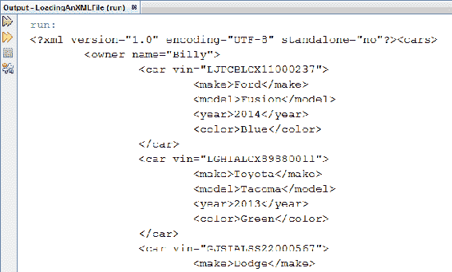
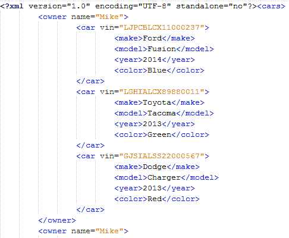

# XML

假设我们想要存储具有对我们程序有意义的结构的信息。此外，我们希望这些信息在某种程度上是可读的，有时甚至是可编辑的。为了实现这一点，我们经常转向 XML。

Java 为我们提供了强大的工具，用于操作、读取和编写 XML 原始文本和文件。然而，与许多强大的工具一样，我们需要学习如何使用它们。在本章中，我们首先将看看如何使用 Java 将 XML 文件加载到 Java 对象中。接下来，我们将逐步介绍如何使用 Java 解析 XML 数据。最后，我们将看到用于编写和修改 XML 数据的 Java 代码。

在本章中，我们将涵盖以下主题：

+   用于读取 XML 数据的 Java 代码

+   解析 XML 数据

+   编写和修改 XML 数据

# 读取 XML 数据

在本节中，我们将完成一个非常简单的任务，以便开始学习 Java 如何与 XML 交互的道路。我们将使用代码文件中提供的`cars.xml`文件中的 XML 信息。这个文件应该存储在我们 Java 项目的当前目录中，所以当我们运行我们的 Java 程序时，它将能够访问`cars.xml`而不需要任何额外的路径。我们将编辑以下 Java 程序以加载`cars.xml`文件：

```java
package loadinganxmlfile; 

import java.io.*; 
import javax.xml.parsers.*; 
import javax.xml.transform.*; 
import javax.xml.transform.dom.*; 
import javax.xml.transform.stream.*; 
import org.w3c.dom.*; 
import org.xml.sax.*; 

public class LoadingAnXMLFile { 
    public static void main(String[] args) { 

        try { 
            //Write code that can throw errors here 
        } 
        catch (ParserConfigurationException pce) { 
            System.out.println(pce.getMessage()); 
        } 
        catch (SAXException se) { 
            System.out.println(se.getMessage()); 
        } 
        catch (IOException ioe) { 
            System.err.println(ioe.getMessage()); 
        } 
    } 

    private static void PrintXmlDocument(Document xml) 
    { 
        try{ 
            Transformer transformer = 
             TransformerFactory.newInstance().newTransformer(); 
            StreamResult result = new StreamResult
             (new StringWriter()); 
            DOMSource source = new DOMSource(xml); 
            transformer.transform(source, result); 
            System.out.println(result.getWriter().toString()); 
        } 
        catch(TransformerConfigurationException e) 
        { 
            System.err.println("XML Printing Failed"); 
        } 
        catch(TransformerException e) 
        { 
            System.err.println("XML Printing Failed"); 
        } 
    } 
} 
```

在我们开始之前，请注意这个程序需要大量的导入。我们导入的`transform`类对我们将要编写的任何内容都不是必需的；我已经编写了一个名为`PrintXmlDocument()`的函数，如果我们成功加载它，它将把我们的 XML 文档打印到控制台窗口。如果您在本节中跟着代码，我建议您首先从一开始导入这些`transform`类。然后，当您使用额外的功能时，继续使用 NetBeans 的“修复导入”功能，以确切地看到工具所使用的库来自哪里。

让我们开始吧。我们的最终目标是拥有一个`Document`类的对象，其中包含我们`cars.xml`文件中的信息。一旦我们有了这个`Document`对象，我们只需要调用`Document`实例上的`PrintXmlDocument()`函数，就可以在我们的控制台窗口中看到信息。

不幸的是，创建这个`Document`对象并不像说`Document dom = new Document();`那样简单。相反，我们需要以一种结构化和程序化的方式创建它，以正确地保留我们的 XML 文件的可解析性。为此，我们将使用另外两个类：`DocumentBuilder`和`DocumentBuilderFactory`类。

`DocumentBuilder`类，信不信由你，将负责实际为我们构建文档。`DocumentBuilder`类作为一个独立的实体存在，与`Document`对象分开，这样我们作为程序员可以在逻辑上分开我们可以对文档本身执行的方法和创建该文档所需的附加方法的范围。与`Document`类类似，我们不能只是实例化`DocumentBuilder`类。相反，有一个第三个类我们将利用来获取`DocumentBuilder`，即`DocumentBuilderFactory`类。我已经将创建`Document`对象所需的代码分为三部分：

1.  `DocumentBuilderFactory`类包含一个名为`newInstance()`的静态方法。让我们在`main()`方法的第一个`try`块中添加以下方法调用。这将为我们实例化`DocumentBuilderFactory`以便我们可以使用它：

```java
        DocumentBuilderFactory factory = 
        DocumentBuilderFactory.newInstance(); 
```

1.  一旦我们有了`DocumentBuilderFactory`，我们就可以为自己获取一个新的`DocumentBuilder`对象。为此，我们将调用工厂的`newDocumentBuilder()`方法。让我们把它添加到我们的 try 块中：

```java
        DocumentBuilder builder = factory.newDocumentBuilder(); 
```

1.  最后，我们需要指示`DocumentBuilder`构建一个`Document`对象，并且该对象应该反映我们的`cars.xml`文件的结构。我们将在我们的`try`块中简单地用一个值实例化我们的`Document`对象。我们将从`builder`的`parse()`方法中获取这个值。这个方法的一个参数是一个引用文件名的字符串。如果我们在我们的 Java 程序中有一个引用文件对象，我们也可以使用它：

```java
        Document dom = builder.parse("cars.xml"); 
```

现在我们的`main()`方法看起来如下：

```java
        public static void main(String[] args) { 
            DocumentBuilderFactory factory = 
            DocumentBuilderFactory.newInstance(); 
            try { 
                // Write code that can throw errors here... 
                DocumentBuilder builder = 
                factory.newDocumentBuilder(); 
                Document dom = builder.parse("cars.xml"); 

                PrintXmlDocument(dom); 
            } 
            catch (ParserConfigurationException pce) { 
                System.out.println(pce.getMessage()); 
            }  
            catch (SAXException se) { 
                System.out.println(se.getMessage()); 
            } 
            catch (IOException ioe) { 
                System.err.println(ioe.getMessage()); 
            } 
        } 
```

现在是时候检查我们的代码是否有效了。我们使用`DocumentBuilderFactory`类的静态方法获取了`DocumentBuilderFactory`对象，并创建了一个全新的实例。通过`DocumentBuilderFactory`，我们创建了一个新的`DocumentBuilder`对象，它将能够智能地解析我们的 XML 文件。在解析我们的 XML 文件时，`DocumentBuilder`对象了解其中包含的信息的性质，并能够将其存储在我们的 XML 文档或`Document`对象模型元素中。当我们运行这个程序时，我们会得到原始 XML 文档的文本视图作为输出：



由于加载这样的 XML 文件有很多步骤，我想将其放在自己的部分中。这样，当我们作为程序员学习如何从 XML 中操作和读取有价值的信息时，我们不会被我们在这里看到的所有语法所困扰。

# 解析 XML 数据

`Document`类为我们提供了一种简单的方法来在对象中存储格式化的信息。在前面部分的程序中，我们从`cars.xml`文件中读取信息到我们的 Java `Document`对象中。`cars.xml`文件如下所示：

```java
<?xml version="1.0"?> 
<cars> 
    <owner name="Billy"> 
        <car vin="LJPCBLCX11000237"> 
            <make>Ford</make> 
            <model>Fusion</model> 
            <year>2014</year> 
            <color>Blue</color> 
        </car> 
        <car vin="LGHIALCX89880011"> 
            <make>Toyota</make> 
            <model>Tacoma</model> 
            <year>2013</year> 
            <color>Green</color> 
        </car> 
        <car vin="GJSIALSS22000567"> 
            <make>Dodge</make> 
            <model>Charger</model> 
            <year>2013</year> 
            <color>Red</color> 
        </car> 
    </owner> 
    <owner name="Jane"> 
        <car vin="LLOKAJSS55548563"> 
            <make>Nissan</make> 
            <model>Altima</model> 
            <year>2000</year> 
            <color>Green</color> 
        </car> 
        <car vin="OOKINAFS98111001"> 
            <make>Dodge</make> 
            <model>Challenger</model> 
            <year>2013</year> 
            <color>Red</color> 
        </car> 
    </owner> 
</cars> 
```

这个文件的根节点是`cars`节点，这个节点中包含两个`owner`节点，即 Billy 和 Jane，每个节点中都有一些`car`节点。这些`car`元素中存储的信息与我们之前的 Java 类中可以存储的信息相对应。

本节的目标是从`cars.xml`中获取特定所有者（在本例中是 Jane）的汽车信息，并将这些信息存储在我们自定义的`Car`类中，以便我们可以利用`Car`类的`toString()`重写以以良好格式的方式将 Jane 的所有汽车打印到我们的控制台上。

通过我们已经设置的代码，我们的`Document`对象`dom`以相同的格式反映了`cars.xml`中存储的信息，所以我们只需要弄清楚如何询问这个`Document`对象这个问题：Jane 拥有什么车？为了弄清楚如何编写代码，你需要了解一些关于 XML 术语的知识。在本节中，我们将处理术语“元素”和“节点”。

在 XML 中，**元素**是一个具有开始和结束标记的实体，它还包含其中的所有信息。当我们的`Document`对象返回信息时，通常会以节点的形式返回信息。**节点**是 XML 文档的构建块，我们几乎可以将它们视为继承关系，其中所有元素都是节点，但并非所有节点都是元素。节点可以比整个 XML 元素简单得多。

# 访问 Jane 的 XML 元素

本节将帮助我们访问关于 Jane 拥有的汽车的信息，使用以下代码。我已将要添加到我们的`main()`函数中的代码分为六部分：

1.  因此，在寻找 Jane 拥有的所有汽车的过程中，让我们看看我们的 XML 文档在一开始为我们提供了哪些功能。如果我们通过代码补全快速扫描我们的方法列表，我们可以从我们的`Document`实例中调用`dom`。我们将看到`getDocumentElement()`方法为我们返回一个元素：

这可能是一个很好的开始方式。这个方法返回我们的 XML 中的顶层元素；在这种情况下，我们将得到`cars`元素，其中包含了我们需要的所有信息。它还包含一些我们不需要的信息，比如 Billy 的车，但在我们访问之后我们会解析出来。一旦我们导入了正确的库，我们就可以直接在我们的代码中引用 XML 元素的概念，使用`Element`类。我们可以创建一个新的`Element`对象，并将其值分配给我们的 XML 文档的根元素：

```java
        Element doc = dom.getDocumentElement(); 
```

当然，我们需要更深入。我们的 XML 文档`cars`的根级别对我们来说并不直接有用；我们需要其中包含的信息。我们只真正想要一个`owner`节点的信息（包含关于 Jane 的车的信息）。但由于 XML 解析的方式，我们可能最好先获取这两个所有者节点，然后找到我们真正感兴趣的那个。

为了获取这两个节点，我们可以在我们刚刚创建并存储在`doc`中的根 XML 元素上调用一个方法。XML 元素可以包含其中的其他元素；在这种情况下，我们的根元素包含了许多`owner`元素。`getElementsByTagName()`方法允许我们收集这些内部元素的数量。XML 元素的标签名就是你所期望的；它是我们给我们的 XML 的特定元素的名称。在这种情况下，如果我们要求在我们文档的根元素中包含的所有标签名为`owner`的元素，我们将进一步缩小我们正在处理的 XML 的数量，接近我们所需的小节。

`getElementsByTagName()`方法返回的不是单个元素。即使在最高级别的这一部分中也有两个不同的元素，即两个所有者：`Billy`和`Jane`。因此，`getElementsByTagLineName()`方法不返回单个元素；而是返回一个`NodeList`对象，它是 XML 节点的集合。

```java
        NodeList ownersList = doc.getElementsByTagName("owner"); 
```

现在我们根本不再处理我们的根节点；我们只有它的内容。是时候真正地缩小我们的搜索范围了。我们的`NodeList`对象包含多个所有者，但我们只想要一个所有者，如果与该所有者相关联的属性名称恰好是`Jane`。为了找到这个特定的元素（如果存在的话），我们只需循环遍历`NodeList`，检查它包含的每个元素的属性。请注意，`ownersList`不是传统数组。它是一个`NodeList`对象，是它自己的一种对象。因此，我们不能在其上使用正常的数组语法。幸运的是，它向我们提供了模仿正常数组语法的方法。例如，`getLength()`方法将告诉我们`ownersList`中有多少个对象：

```java
        for(int i = 0; i < ownersList.getLength(); i++) 
        { 
        } 
```

1.  同样，当我们尝试创建一个新的`Element`对象并将该值分配给当前循环遍历的`ownersList`部分时，我们将无法使用数组的正常语法。不过，`ownersList`再次为我们提供了一个执行相同操作的方法。`item()`方法提供或要求一个索引作为输入。

请注意，`ownersList`是`NodeList`，但是元素是节点，不是所有节点都是元素，因此我们需要在这里做出决定。我们可以检查此函数返回的对象的性质，并确保它们实际上是 XML 元素。但为了保持事情的进行，我们只是假设我们的 XML 格式正确，并且我们只是让 Java 知道`item()`方法返回的节点实际上是一个元素；也就是说，它有一个开始标签和一个结束标签，并且可以包含其他元素和节点：

```java
            Element owner = (Element)ownersList.item(i); 
```

一旦我们成功地从所有者列表中访问了一个元素，现在是时候检查并看看这是否是我们正在寻找的所有者；因此，我们将需要一个条件语句。XML 元素向我们公开了`getAttribute()`方法，我们感兴趣的属性是`name`属性。因此，这里的代码将询问当前的`owner`，“你的`name`属性的值是多少？”如果该值等于`Jane`，那么我们知道我们已经访问了正确的 XML 元素。

现在在简的 XML 元素中，我们只有一些`car`元素。所以，再次是时候创建`NodeList`并用这些`car`元素填充它。我们现在需要在我们当前的所有者简上调用`getElementByTagName()`方法。如果我们使用顶层文档来调用这个函数，我们将得到文档中的所有`car`元素，甚至是比利的：

```java
            if(owner.getAttribute("name").equals("Jane")) 
            { 
                NodeList carsList = 
                owner.getElementsByTagName("car"); 
```

1.  这个`main()`方法变得有点复杂；这是我愿意在一个方法中做到的极限。我们的代码已经深入了几个层次，我们写的代码并不简单。我认为是时候将下一部分解析成自己的方法了。让我们简单地声明我们将要有一个`PrintCars()`方法，这个函数将接受`car`元素的`NodeList`来打印汽车节点：

```java
        PrintCars(carsList); 
```

我们的`main`方法现在如下所示：

```java
        public static void main(String[] args) { 
            DocumentBuilderFactory factory = 
            DocumentBuilderFactory.newInstance(); 
            try { 
                DocumentBuilder docBuilder = 
                factory.newDocumentBuilder(); 
                Document dom = docBuilder.parse("cars.xml"); 

                // Now, print out all of Jane's cars 
                Element doc = dom.getDocumentElement(); 
                NodeList ownersList = 
                doc.getElementsByTagName("owner"); 

                for(int i = 0; i < ownersList.getLength(); i++) 
                { 
                    Element owner = (Element)ownersList.item(i); 
                    if(owner.getAttribute("name").equals("Jane")) 
                    { 
                        NodeList carsList = 
                        owner.getElementsByTagName("car"); 
                        PrintCars(carsList); 
                    } 
                } 
            } 
            catch (ParserConfigurationException pce) { 
                System.out.println(pce.getMessage()); 
            }  
            catch (SAXException se) { 
                System.out.println(se.getMessage()); 
            }  
            catch (IOException ioe) { 
                System.err.println(ioe.getMessage()); 
            } 
        } 
```

# 打印简的汽车详情

现在，离开我们的`main()`方法，我们将定义我们的新的`PrintCars()`方法。我已经将`PrintCars()`函数的定义分成了八个部分：

1.  因为我们在程序的入口类中，`PrintCars()`方法是由静态的`main()`方法调用的，它可能应该是一个`static`函数。它将只是打印到我们的控制台，所以`void`是一个合适的返回类型。我们已经知道它将接受汽车的`NodeList`作为输入：

```java
        public static void PrintCars(NodeList cars) 
        { 
        } 
```

1.  一旦我们进入了这个函数，我们知道我们可以使用`car` XML 元素的列表。但为了打印出每一个，我们需要循环遍历它们。我们已经在程序中循环遍历了 XML 的`NodeList`，所以我们将使用一些非常相似的语法。让我们看看这个新代码需要改变什么。好吧，我们不再循环遍历`ownersList`；我们有一个新的`NodeList`对象来循环遍历`cars`的`NodeList`：

```java
        for(int i = 0; i < cars.getLength(); i++) 
        { 
        } 
```

1.  我们知道汽车仍然是`Element`实例，所以我们的强制转换仍然是合适的，但我们可能想要将我们用于循环遍历每辆汽车的变量重命名为类似`carNode`的东西。每次我们循环遍历一辆车时，我们将创建一个新的`Car`对象，并将该车的 XML 中的信息存储在这个实际的 Java 对象中：

```java
        Element carNode = (Element)cars.item(i); 
```

1.  因此，除了访问`car` XML，让我们也声明一个`Car`对象，并将其实例化为一个新的`Car`对象：

```java
        Car carObj = new Car(); 
```

1.  现在我们将通过从`carNode`中读取它们来构建存储在`carObj`中的值。如果我们快速跳回 XML 文件并查看存储在`car`元素中的信息，我们将看到它存储了`make`，`model`，`year`和`color`作为 XML 节点。车辆识别号`vin`实际上是一个属性。让我们简要看一下我们的`Car.java`类：

```java
        package readingxml; 

        public class Car { 
            public String vin; 
            public String make; 
            public String model; 
            public int year; 
            public String color; 
            public Car() 
            { 

            } 
            @Override 
            public String toString() 
            { 
                return String.format("%d %s %s %s, vin:%s", year, 
                color, make, model, vin); 
            } 
        } 
```

让我们先从简单的部分开始；所以，`make`，`model`和`color`都是存储在`Car`类中的字符串，它们恰好都是`car`元素内的节点。

回到我们的`PrintCars()`函数，我们已经知道如何访问元素内的节点。我们只需要再次使用`carNode`和`getElementsByTagName()`函数。如果我们获取所有标签名为`color`的元素，我们应该会得到一个只包含一个元素的列表，这个元素就是我们感兴趣的，告诉我们汽车颜色的元素。不幸的是，我们在这里有一个列表，所以我们不能直接操作该元素，直到我们从列表中取出它。不过，我们知道如何做到这一点。如果我们确信我们的 XML 格式正确，我们知道我们将获得一个只包含一个项目的列表。因此，如果我们获取该列表的第 0 个索引处的项目，那将是我们要找的 XML 元素。

存储在这个 XML 元素中的颜色信息不是一个属性，而是内部文本。因此，我们将查看 XML 元素公开的方法，看看是否有一个合适的方法来获取内部文本。有一个`getTextContent()`函数，它将给我们所有的内部文本，这些文本实际上不是 XML 元素标签的一部分。在这种情况下，它将给我们我们汽车的颜色。

获取这些信息还不够；我们需要存储它。幸运的是，`carObj`的所有属性都是公共的，所以我们可以在创建`car`对象后自由地为它们赋值。如果这些是私有字段而没有 setter，我们可能需要在构造`carObj`之前进行这些信息，然后通过它们传递给它希望有的构造函数。

```java
        carObj.color = 
        carNode.getElementsByTagName("color").item(0).getTextContent(); 
```

我们将为`make`和`model`做几乎完全相同的事情。我们唯一需要改变的是我们在查找元素时提供的关键字。

```java
        carObj.make = 
        carNode.getElementsByTagName("make").item(0).getTextContent(); 
        carObj.model = 
        carNode.getElementsByTagName("model").item(0).getTextContent(); 
```

1.  现在，我们可以继续使用相同的一般策略来处理我们车辆的`year`，但是我们应该注意，就`carObj`而言，`year`是一个整数。就我们的 XML 元素而言，`year`，就像其他任何东西一样，是一个`TextContent`字符串。幸运的是，将一个`string`转换为一个`integer`，只要它格式良好，这是一个我们在这里将做出的假设，不是太困难。我们只需要使用`Integer`类并调用它的`parseInt()`方法。这将尽力将一个字符串值转换为一个整数。我们将把它赋给`carObj`的`year`字段。

```java
        carObj.year = 
        Integer.parseInt(carNode.getElementsByTagName
        ("year").item(0).getTextContent()); 
```

1.  这样我们就只剩下一个字段了。注意`carObj`有一个车辆识别号字段。这个字段实际上不是一个整数；车辆识别号可以包含字母，所以这个值被存储为一个字符串。我们获取它会有一点不同，因为它不是一个内部元素，而是`car`元素本身的一个属性。我们再次知道如何从`carNode`获取属性；我们只是要获取名称为`vin`的属性并将其赋给`carObj`。

```java
         carObj.vin = carNode.getAttribute("vin"); 
```

1.  完成所有这些后，我们的`carObj`对象应该在所有成员中具有合理的值。现在是时候使用`carObj`存在的原因了：重写`toString()`函数。对于我们循环遍历的每辆车，让我们调用`carObj`的`toString()`函数，并将结果打印到控制台上。

```java
        System.out.println(carObj.toString()); 
```

我们的`PrintCars()`函数现在将如下所示：

```java
public static void PrintCars(NodeList cars) 
{ 
    for(int i = 0; i < cars.getLength(); i++) 
    { 
        Element carNode = (Element)cars.item(i); 
        Car carObj = new Car(); 
        carObj.color = 
         carNode.getElementsByTagName
         ("color").item(0).getTextContent(); 
        carObj.make = 
         carNode.getElementsByTagName
         ("make").item(0).getTextContent(); 
        carObj.model = carNode.getElementsByTagName
         ("model").item(0).getTextContent(); 
        carObj.year = 
         Integer.parseInt(carNode.getElementsByTagName
         ("year").item(0).getTextContent()); 
        carObj.vin = carNode.getAttribute("vin"); 
        System.out.println(carObj.toString()); 
    } 
} 
```

我们应该可以编译我们的程序了。现在当我们运行它时，希望它会打印出简的所有汽车，利用`carObj`的重写`toString()`方法，来很好地格式化输出。当我们运行这个程序时，我们得到两辆汽车作为输出，如果我们去我们的 XML 并查看分配给简的汽车，我们会看到这些信息确实与存储在这些汽车中的信息相匹配。


XML 和 Java 的组合真的非常强大。XML 是人类可读的。我们可以理解它，甚至可以对其进行修改，但它也包含了非常有价值的结构化信息。这是编程语言（如 Java）也能理解的东西。我们在这里编写的程序虽然有其特点，并且需要一定的知识来编写，但比起从原始文本文件中编写类似程序，它要容易得多，程序员也更容易理解和维护。

# 编写 XML 数据

能够读取 XML 信息当然很好，但是为了使语言对我们真正有用，我们的 Java 程序可能也需要能够写出 XML 信息。以下程序是一个从同一 XML 文件中读取和写入的程序的基本模型：

```java
package writingxml; 

import java.io.*; 
import javax.xml.parsers.*; 
import javax.xml.transform.*; 
import javax.xml.transform.dom.*; 
import javax.xml.transform.stream.*; 
import org.w3c.dom.*; 
import org.xml.sax.*; 

public class WritingXML { 
    public static void main(String[] args) { 
        File xmlFile = new File("cars.xml"); 
        Document dom = LoadXMLDocument(xmlFile);       
        WriteXMLDocument(dom, xmlFile); 
    } 

    private static void WriteXMLDocument
     (Document doc, File destination) 
    { 
        try{ 
            // Write doc to destination file here... 
        } 
        catch(TransformerConfigurationException e) 
        { 
            System.err.println("XML writing failed."); 
        } 
        catch(TransformerException e) 
        { 
            System.err.println("XML writing failed."); 
        } 
    } 

    private static Document LoadXMLDocument(File source) 
    { 
        try { 
            DocumentBuilderFactory factory = 
             DocumentBuilderFactory.newInstance(); 
            DocumentBuilder builder = 
             factory.newDocumentBuilder(); 
            Document dom = builder.parse(source); 
        } 
        catch (ParserConfigurationException e) { 
             System.err.println("XML loading failed."); 
        } 
        catch (SAXException e) { 
             System.err.println("XML loading failed."); 
        } 
        catch (IOException e) { 
            System.err.println("XML loading failed."); 
        } 

        return dom; 
    } 
} 
```

它的`main()`方法非常简单。它接受一个文件，然后从该文件中读取 XML，将其存储在 XML 文档的树对象中。然后，该程序调用`WriteXMLDocument()`将 XML 写回同一文件。目前，用于读取 XML 的方法已经为我们实现（`LoadXMLDocument()`）；然而，用于写出 XML 的方法尚未完成。让我们看看我们需要为我们写入 XML 信息到文档发生什么。我已将`WriteXMLDocument()`函数的代码分为四个部分。

# 用于编写 XML 数据的 Java 代码

编写 XML 数据需要执行以下步骤：

1.  由于 XML 文档的存储方式，我们需要将其转换为不同的格式，然后才能真正将其以与原始 XML 相同的格式打印到文件中。为此，我们将使用一个名为`Transformer`的专用于 XML 的类。与处理文档模型中的许多类一样，最好使用工厂来创建`Transformer`实例。在这种情况下，工厂称为`TransformerFactory`，像许多工厂一样，它公开了`newInstance()`方法，允许我们在需要时创建一个。要获取我们的新`Transformer`对象，它将允许我们将我们的`Document`对象转换为可发送到文件的流的东西，我们只需调用`TransformerFactory`的`newTransformer()`方法：

```java
        TransformerFactory tf = TransformerFactory.newInstance(); 
        Transformer transformer = tf.newTransformer(); 
```

1.  现在，在`Transformer`可以将我们的 XML 文档转换为其他内容之前，它需要知道我们希望它将我们当前`Document`对象的信息转换为什么。这个类就是`StreamResult`类；它是存储在我们当前`Document`对象中的信息的目标。流是一个原始的二进制信息泵，可以发送到任意数量的目标。在这种情况下，我们的目标将是提供给`StreamResult`构造函数的目标文件：

```java
        StreamResult result = new StreamResult(destination); 
```

1.  我们的`Transformer`对象并不会自动链接到我们的 XML 文档，它希望我们以唯一的方式引用我们的 XML 文档：作为`DOMSource`对象。请注意，我们的`source`对象（接下来定义）正在与`result`对象配对。当我们向`Transformer`对象提供这两个对象时，它将知道如何将一个转换为另一个。现在，要创建我们的`DOMSource`对象，我们只需要传入我们的 XML 文档：

```java
        DOMSource source = new DOMSource(doc); 
```

1.  最后，当所有设置完成后，我们可以执行代码的功能部分。让我们获取我们的`Transformer`对象，并要求它将我们的源（即`DOMSource`对象）转换为一个流式结果，目标是我们的目标文件：

```java
         transformer.transform(source, result); 
```

以下是我们的`WriteXMLDocument()`函数：

```java
private static void WriteXMLDocument
(Document doc, File destination) 
{ 
    try{ 
        // Write doc to destination file here 
        TransformerFactory tf = 
         TransformerFactory.newInstance(); 
        Transformer transformer = tf.newTransformer(); 
        StreamResult result = new StreamResult(destination); 
        DOMSource source = new DOMSource(doc); 

        transformer.transform(source, result); 
    } 
    catch(TransformerConfigurationException e) 
    { 
        System.err.println("XML writing failed."); 
    } 
    catch(TransformerException e) 
    { 
        System.err.println("XML writing failed."); 
    } 
} 
```

当我们运行这个程序时，我们将在文件中得到一些 XML，但是当我说这是我们之前拥有的相同的 XML 时，你必须相信我，因为我们首先读取 XML，然后将其作为结果打印回去。

为了真正测试我们的程序是否工作，我们需要在 Java 代码中对我们的`Document`对象进行一些更改，然后看看我们是否可以将这些更改打印到这个文件中。让我们改变汽车所有者的名字。让我们将所有汽车的交易转移到一个名叫 Mike 的所有者名下。

# 修改 XML 数据

XML I/O 系统的强大之处在于在加载和写入 XML 文档之间，我们可以自由修改存储在内存中的`Document`对象`dom`。而且，我们在 Java 内存中对对象所做的更改将被写入我们的永久 XML 文件。所以让我们开始做一些更改：

1.  我们将使用`getElementsByTagName()`来获取我们的 XML 文档中的所有`owner`元素。这将返回一个`NodeList`对象，我们将称之为`owners`：

```java
        NodeList owners = dom.getElementsByTagName("owner"); 
```

1.  为了将所有这些所有者的名字转换为`Mike`，我们需要遍历这个列表。作为复习，我们可以通过调用`owners`的`getLength()`函数来获取列表中的项目数，也就是我们的`NodeList`对象。要访问我们当前正在迭代的项目，我们将使用`owners`的`item()`函数，并传入我们的迭代变量`i`来获取该索引处的项目。让我们将这个值存储在一个变量中，以便我们可以轻松使用它；再次，我们将假设我们的 XML 格式良好，并告诉 Java，事实上，我们正在处理一个完全成熟的 XML 元素。

接下来，XML 元素公开了许多允许我们修改它们的方法。其中一个元素是`setAttribute()`方法，这就是我们将要使用的方法。请注意，`setAttribute()`需要两个字符串作为输入。首先，它想知道我们想要修改哪个属性。我们将要修改`name`属性（这是我们这里唯一可用的属性），并且我们将把它的值赋给`Mike`：

```java
            for(int i = 0; i < owners.getLength(); i++) 
            { 
                Element owner = (Element)owners.item(i); 
                owner.setAttribute("name", "Mike"); 
            } 
```

现在我们的`main()`方法将如下所示：

```java
public static void main(String[] args) { 
    File xmlFile = new File("cars.xml"); 
    Document dom = LoadXMLDocument(xmlFile); 

    NodeList owners = dom.getElementsByTagName("owner"); 
    for(int i = 0; i < owners.getLength(); i++) 
    { 
        Element owner = (Element)owners.item(i); 
        owner.setAttribute("name", "Mike"); 
    } 
    WriteXMLDocument(dom, xmlFile); 
} 
```

当我们运行程序并检查我们的 XML 文件时，我们将看到`Mike`现在是所有这些汽车的所有者，如下面的截图所示：



现在可能有意义将这两个 XML 元素合并，使`Mike`只是一个所有者，而不是分成两个。这有点超出了本节的范围，但这是一个有趣的问题，我鼓励你反思一下，也许现在就试一试。

# 总结

在本章中，我们看到了将 XML 文件读入`Document`对象的 Java 代码。我们还看到了如何使用 Java 解析 XML 数据。最后，我们看到了如何在 Java 中编写和修改 XML 数据。

恭喜！你现在是一个 Java 程序员。
