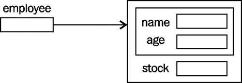
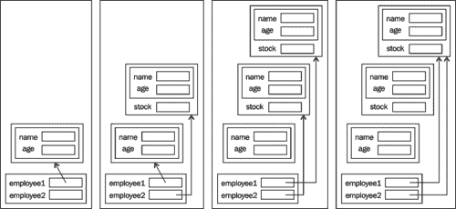

# 第七章。继承和多态性

在本章中，我们将研究 Java 如何支持包括继承和多态性在内的几个重要的面向对象的概念。当提到“继承”这个词时，我们会想到那位会留下巨额财富的富有的叔叔。或者我们会说她有她母亲的眼睛。在编程术语中，我们谈论类及它们之间的关系。术语“父类”和“子类”用于描述类之间的继承关系，其中类可以访问父类的功能。

### 注意

有几个术语用于指定父类和子类。您可能会看到父类被称为超类或基类。子类可能被称为子类或派生类。在本章中，我们将使用术语**基类**和**派生类**。

基类通常具有实现该类和从该类派生的类所需的公共功能的方法。例如，我们可能有一个代表个人的 *person* 类。它可能有允许我们维护个人姓名或年龄的方法。我们可能创建其他代表不同类型的人的类——屠夫、面包师或蜡烛制造商。这些不同类型的人具有超出我们为 *person* 类定义的功能之外的不同功能。

例如，当我们实现一个面包师时，该类可能有一个名为 *cook* 的方法，用于烹饪。然而，面包师仍然有姓名和年龄。我们不希望重新实现支持修改姓名或年龄的代码，而是希望重用我们为 person 类开发的代码。这个过程称为继承。

继承允许我们重用基类的功能。这反过来促进了软件的重用，并可以使开发人员更加高效。

我们还将解释 Java 如何支持多态性。这个概念很重要，有助于使应用程序更易于维护。多态性是重写基类方法的结果。重写类似于重载，但它使用与基类方法相同的签名。

多态性经常与抽象类一起使用。抽象类是一种不能被实例化的类。也就是说，不可能创建该类的实例。虽然我们不能创建抽象类的实例，但可以创建从抽象类派生的类的实例。这种能力可以增强应用程序的结构。

继承需要调用基类的构造函数。我们将研究 Java 用于控制初始化顺序的方法。此外，在某些情况下，确定类的类型和在继承层次结构中的类之间进行转换变得重要。

本章最后讨论的主题涉及与继承相关的内存组织。了解内存的组织和处理方式将加深您对语言的理解，并有助于调试应用程序。

# 继承

继承涉及两个类之间的关系——基类和派生类。在本节中，我们将涵盖以下内容：

+   实现子类

+   使用 `protected` 关键字

+   重写方法

+   使用 `@Override` 注解

+   使用 `final` 关键字与类

+   创建抽象方法和类

构造函数和继承的使用在 *The super keyword and constructors* 部分中有所涉及。

当继承发生时，派生类继承了基类的所有方法和属性。但它只能访问类的公共和受保护成员。它不能访问类的私有成员。

当向派生类添加一个与基类方法具有相同签名和可访问性的方法时，该方法被称为覆盖基类方法。这允许派生类重新定义该方法的含义。本章的示例将使用一个`Employee`基类和一个从基类派生的`SalaryEmployee`类。

## 实现子类

一个类是通过使用`extends`关键字实现的，后面跟着基类名。在下面的例子中，定义了`Employee`基类：

```java
class Employee {
   // Implementation of Employee class
}
```

`SalaryEmployee`类可以从基类`Employee`派生，如下面的代码片段所示：

```java
class SalaryEmployee extends Employee  {
   // Implementation of SalaryEmployee class
}
```

继承在 Java 库中被广泛使用。例如，小程序是通过扩展`Applet`类创建的。

### 注意

成为一名熟练的 Java 程序员的重要部分是学会找到、理解和使用与应用程序领域相关的库中的类。

在下面的例子中，`HelloWorldApplet`类扩展并继承了这个类的所有方法和属性。在这种情况下，`paint`方法被`HelloWorldApplet`覆盖：

```java
import java.awt.Graphics;

public class HelloWorldApplet extends java.applet.Applet {

   public void paint (Graphics g) {
      g.drawString ("Hello World!", 5, 15);
   }

}
```

一个基类可以有一个或多个派生类，这是可能的，也是完全可取的。对于`Employee`基类，我们可能不仅创建一个`SalaryEmployee`类，还可能创建一个`HourlyEmployee`类。它们将共享基类的通用功能，但又包含自己独特的功能。

让我们仔细研究`Employee`基类和`SalaryEmployee`类。首先，让我们从`Employee`类的更详细实现开始，如下面的代码片段所示：

```java
class Employee {
   private String name;
   private int zip;
   private int age;
   …

   public int getAge() {
      return age;
   }

   public void setAge(int age) {
      this.age = age;
   }

   …
}
```

在这个实现中，我们只包括了一个私有的`age`实例变量和一个用于它的 getter 和 setter 方法。在接下来的`SalaryEmployee`类中，我们没有添加任何字段：

```java
class SalaryEmployee extends Employee  {
   // Implementation of SalaryEmployee class
}
```

然而，即使我们没有向`SalaryEmployee`类添加任何新内容，它也具有基类的功能。在下面的序列中，我们创建了两个类的实例并使用它们的方法：

```java
public static void main(String[] args) {
   Employee employee1 = new Employee();
   SalaryEmployee employee2 = new SalaryEmployee();

   employee1.setAge(25);
   employee2.setAge(35);

   System.out.println("Employee1 age: " +
      employee1.getAge());
   System.out.println("Employee2 age: " + 
      employee2.getAge());
}
```

当代码执行时，我们得到以下输出：

```java
Employee1 age: 25
Employee2 age: 35

```

由于`getAge`和`setAge`方法是公共的，我们可以在`SalaryEmployee`类中使用它们，即使我们没有定义新版本。然而，如果我们尝试访问私有的`age`变量，如下面的代码片段所示，我们将得到一个语法错误：

```java
employee2.age = 35;
```

生成的语法错误如下：

```java
age has private access in Employee

```

在*作用域审查*部分，我们将更深入地探讨作用域和继承。

### 注意

Java 不支持类之间的多重继承。也就是说，派生类不能扩展多个类。派生类只能扩展一个类。然而，Java 支持接口之间的多重继承。

## 使用受保护的关键字

在前面的例子中，我们确定无法从实例变量`employee2.age`中访问私有成员。我们也无法从派生类的方法或构造函数中访问它。在下面的`SalaryEmployee`类的实现中，我们尝试在其默认构造函数中初始化`age`变量：

```java
public class SalaryEmployee extends Employee{

   public SalaryEmployee() {
      age = 35;
   }

}
```

语法错误如下：

```java
age has private access in Employee

```

然而，任何声明为公共的基类成员都可以从派生类的成员方法或构造函数中访问，或者通过引用派生类的实例变量。

有些情况下，成员变量应该可以从派生类的构造函数或方法中访问，但不能从其实例变量中访问。我们可能希望在比公共或私有更细的级别上限制对成员的访问。对于`age`变量，我们可能信任派生类正确使用变量，但可能不信任实例变量的使用者。使用受保护字段限制了应用程序中可以修改字段的位置以及可能引入问题的位置。

这就是`protected`访问修饰符的作用。通过在基类成员中使用`protected`关键字，我们限制对该成员的访问。它只能从基类内部或派生类的构造函数或方法中访问。

在`Employee`类的以下实现中，`age`变量被声明为`protected`：

```java
class Employee {
   protected int age;
   …

   public int getAge() {
      return age;
   }

   public void setAge(int age) {
      this.age = age;
   }

   …
}
```

`age`变量现在可以从`SalaryEmployee`类中访问，如下所示进行初始化：

```java
public SalaryEmployee() {
   age = 35;
}
```

这种初始化不会产生语法错误。然而，我们仍然无法从实例引用变量中访问`age`变量。假设该语句所在的类不在与`SalaryEmployee`类相同的包中，以下代码仍将导致语法错误。这在*作用域复习*部分中有解释：

```java
employee2.age = 35;
```

`protected`关键字也可以用于方法。它与方法一起进一步增强了您对类成员访问的控制能力。例如，下面的`Employee`类的实现使用`protected`关键字与`setAge`方法：

```java
class Employee {
   protected int age;
   …

   public int getAge() {
      return age;
   }

   protected void setAge(int age) {
      this.age = age;
   }

   …
}
```

这意味着类的任何用户都可以使用`getAge`方法，但只有基类、相同包中的类或派生类才能访问`setAge`方法。

## 覆盖方法

虽然基类的方法在派生类中自动可用，但实际的实现可能对派生类不正确。考虑使用一个方法来计算员工的工资。`Employee`类中的`computePay`方法可能只是返回一个基本金额，如下面的代码片段所示：

```java
class Employee {
   private float pay = 500.0f;

   public float computePay() {
      return pay;
   }

  …
}
```

这个例子是基于浮点数据类型的，这并不一定是表示货币值的最佳数据类型。`java.math.BigDecimal`类更适合这个目的。我们在这里使用浮点数据类型是为了简化示例。

然而，对于派生类如`HourlyEmployee`，`computePay`方法是不正确的。这种情况可以通过覆盖`computePay`方法来纠正，如下所示的简化的`HourlyEmployee`实现：

```java
public class HourlyEmployee extends Employee{
   private float hoursWorked;
   private float payRate;

   public HourlyEmployee() {
      this.hoursWorked = 40.0f;
      this.payRate = 22.25f;
   }

   public float computePay() {
      return hoursWorked * payRate;
   }

}
```

覆盖的方法具有两个基本特征：

+   具有与基类方法相同的签名

+   在派生类中找到

类的签名由其名称、参数数量、参数类型和参数顺序组成。这在第六章的*签名*部分中有更详细的讨论，*类、构造函数和方法*。

重载和覆盖这两个术语很容易混淆。以下表格总结了这些术语之间的关键区别：

| 特征 | 重载 | 覆盖 |
| --- | --- | --- |
| 方法名称 | 相同 | 相同 |
| 签名 | 不同 | 相同 |
| 类 | 相同类 | 在派生类中 |

让我们来看一下`computePay`方法的使用。在以下顺序中，`computePay`方法针对`employee1`和`employee3`实例变量执行：

```java
Employee employee1 = new Employee();
HourlyEmployee employee3 = new HourlyEmployee();

System.out.println("Employee1 pay: " + employee1.computePay());
System.out.println("Employee3 pay: " + employee3.computePay());
```

输出将如下所示：

```java
Employee1 pay: 500.0
Employee3 pay: 890.0

```

`Employee`基类的`computePay`方法针对`employee1`引用变量执行，而`HourlyEmployee`的`computePay`方法针对`employee3`引用变量执行。**Java 虚拟机**（**JVM**）在程序执行时确定要使用哪个方法。这实际上是多态行为的一个例子，我们将在*多态*部分中讨论。

在更复杂的类层次结构中，中间类可能不会覆盖一个方法。例如，如果`SupervisorEmployee`类是从`SalaryEmployee`类派生的，那么`SalaryEmployee`类不需要实现`computePay`方法。`SupervisorEmployee`类可以覆盖`Employee`的`computePay`方法，无论其直接基类是否覆盖了它。

## @Override 注解

一个 Java 语言设计问题涉及方法重写。问题在于开发人员可能打算重写一个方法，但由于方法声明中的简单错误，可能没有实际重写。然而，在以下尝试重写`computePay`方法时，方法名拼写错误：

```java
public float computPay() {
     return hoursWorked * payRate;
}
```

虽然方法拼写错误可能很明显（或者可能不明显），但开发人员可能没有注意到这个错误。使用前面的例子：

```java
Employee employee1 = new Employee();
HourlyEmployee employee3 = new HourlyEmployee();

System.out.println("Employee1 pay: " + 
   employee1.computePay());
System.out.println("Employee3 pay: " + 
   employee3.computePay());
```

程序仍将执行，但不会生成预期的输出，如下所示：

```java
Employee1 pay: 500.0
Employee3 pay: 500.0

```

注意在两种情况下都使用了基类的`computePay`方法。这是因为调用了`computePay`方法，而不是拼写错误的`computPay`方法。由于`HourlyEmployee`类不再有`computePay`方法，JVM 使用了基类方法。显然，这不是预期的结果。

很难立即发现这些类型的错误。为了帮助防止这些类型的错误，我们可以在方法中使用`@Override`注解，如下所示：

```java
@Override
public float computPay() {
   return hoursWorked * payRate;
}
```

这个注解通知编译器确保接下来的方法实际上重写了基类方法。在这种情况下，它没有，因为方法名拼写错误。当这种情况发生时，将生成一个语法错误，指示存在问题。语法错误消息如下：

```java
method does not override or implement a method from a supertype

```

当方法的拼写被纠正时，语法错误消息将消失。

正如名称注解所暗示的，注解是一种在稍后可以处理的 Java 应用程序部分中添加附加信息的方式。在编译时，`@Override`注解会进行检查以验证是否实际发生了重写。注解也可以用于其他目的，比如标记方法为弃用。

### 提示

始终使用`@Override`注解与重写的方法是一个好习惯。

## 使用 final 关键字与类

在声明类时，可以使用`public`、`abstract`和`final`关键字。`public`关键字指定了类的范围，将在*范围回顾*部分中解释。`abstract`关键字的使用在下一节*抽象方法和类*中介绍。当在`class`关键字之前使用`final`关键字时，表示该类不能被扩展。它将是继承层次结构中的那个分支中的最后一个类。

在下面的例子中，`Employee`类被指定为 final 类。虽然对于本章的例子来说，将`Employee`类设为 final 没有意义，但它确实说明了使类成为 final 所需的语法：

```java
final class Employee {
   …
}
```

通过限制其他类扩展类，可以确保类的预期操作不会被派生类覆盖基类方法而破坏。如果实现得当，这可以导致更可靠的应用程序基础。

`java.lang.String`类是核心 JDK 中的一个类的例子，它被定义为 final。不可能扩展这个类或修改它的行为。这意味着全世界的开发人员可以使用这个类，而不必担心意外使用派生类而不是`String`类。

`final`关键字也可以与方法定义一起使用。在这种情况下使用时，它意味着该方法不能在派生类中被重写。这比使一个类 final 提供了更多的灵活性。开发人员可以指定哪些方法可以被重写，哪些方法不能被重写。

以下示例说明了在`Employee`类中将`getAge`方法设为 final：

```java
public class Employee {
   ...
   public final int getAge() {
      return age;
   }
}
```

如果我们尝试在派生类中重写方法，比如`SalaryEmployee`类，我们将得到以下错误消息：

```java
getAge() in SalaryEmployee cannot override getAge() in Employee
 overridden method is final

```

## 抽象方法和类

抽象类在面向对象继承层次结构的设计中非常有用。它们通常用于强制派生类实现特定的一组方法。基类和/或类的一个或多个方法被声明为抽象。抽象类不能被实例化。相反，非抽象类必须在其层次树中实现所有抽象方法（如果有的话）。

以下示例说明了如何使`Employee`类成为抽象类。在这个例子中，没有抽象方法，但使用了`abstract`关键字来指定类为抽象类：

```java
public abstract class Employee {
   ...
}
```

由于`Employee`类没有抽象方法，因此派生类都不会被强制实现任何额外的方法。上述定义对本章中先前的示例没有实际影响。

`Employee`类的下一个定义使`computePay`方法成为抽象方法。注意该方法没有主体，而是以分号结束：

```java
public abstract class Employee {
   ...
   public abstract float computePay();
   ...
}
```

所有直接从`Employee`类派生的类必须实现抽象方法，否则它们本身将变成抽象类。如果它们选择不实现`computePay`方法，则必须将该类声明为抽象类。

当我们将一个方法声明为抽象时，我们被迫在类中使用`abstract`关键字。抽象类也可以拥有非抽象方法。

在复杂的层次结构中，你可能会发现非抽象类和抽象类的混合。例如，在`java.awt`包中，你会发现非抽象的`Container`类扩展了抽象的`Component`类，而`Component`类又扩展了非抽象的`Object`类。抽象类可以在层次结构的任何级别引入，以满足库的需求。

抽象类可以拥有最终方法，但不能被声明为最终。也就是说，`final`关键字不能用作抽象类或方法的修饰符。如果这是可能的，那么扩展该类将是不可能的。因为它是抽象的，所以它永远不能被实例化，因此将是无用的。但是，抽象类可以拥有最终方法。这些方法必须在该抽象类中实现。该类仍然可以被扩展，但最终方法不能被覆盖。

# 多态

多态是一个关键的面向对象编程概念，但最初可能很难理解。使用多态的主要目的是使应用程序更易于维护。当我们谈论多态时，通常说一个方法表现出多态行为。

### 注意

如果方法的行为取决于它正在执行的对象，则该方法被称为多态方法。

假设我们想要绘制某些东西。每个类可能都有一个名为`draw`的方法，它可以用来绘制自己。例如，圆形类可能有一个绘制自身为圆形的绘制方法。人类可能有一个显示该人的图像的绘制方法。这些方法的签名是相同的。

因此，如果我们对不同类的不同对象应用`draw`方法，这些类都有相同的基类，那么根据我们是对圆形还是对人应用`draw`方法，绘制的结果将不同。这就是多态行为。

通过设计我们的应用程序使用多态，我们可以更容易地添加具有绘制方法的新类，并将它们集成到我们的应用程序中，这比在非面向对象的编程语言中以前可能的要容易得多。

当创建对象的实例时，对象会经历一系列初始化步骤，详细信息请参阅第六章中的*Java 初始化顺序*部分，*类，构造函数和方法*。这也适用于从基类派生的对象。Java 内存管理是动态和自动的。当使用`new`关键字时，它会自动从堆中分配内存。

在 Java 中，可以将对基类及其派生类的引用分配给基类引用变量。这是可能的，因为为基类和派生类分配内存的方式。在派生类中，首先分配基类的实例变量，然后是派生类的实例变量。当将基类引用变量分配给派生类对象时，它会看到它所期望的基类实例变量以及“额外”的派生类实例变量。

让我们使用以下`Employee`和`SalaryEmployee`类的定义：

```java
public class Employee {
   private String name;
   private int age;

   ...

}

public class SalaryEmployee extends Employee {
   private float stock;
   …
}
```

在以下示例中，从引用变量的角度来看，将`Employee`或`SalaryEmployee`对象分配给基类引用是有意义的，因为它期望看到`name`和`age`的实例变量。我们可以将新的`Employee`对象分配给`employee`变量，如下面的代码片段所示：

```java
Employee employee;
employee = new Employee();
```

这也在以下图表中说明：


我们还可以使用以下代码将新的`SalaryEmployee`对象分配给`employee`变量。请注意，在前一个图中和这个图中，`employee`引用变量指向按顺序排列的`name`和`age`字段。`employee`引用变量期望一个由`name`字段和`age`字段组成的`Employee`对象，这就是它看到的。

```java
employee = new SalaryEmployee();
```

这种情况在以下图表中描述：



如果执行以下代码片段，基于`Employee`和`SalaryEmployee`类的先前声明，将执行`SalaryEmployee`的`computePay`方法，而不是`Employee`类的：

```java
Employee employee = new SalaryEmployee();
System.out.println(employee.computePay());
```

`computePay`方法在与其运行的对象相关时被称为多态的。如果`computePay`方法针对`Employee`对象运行，将执行`Employee`的`computePay`方法。

可以将对派生对象的引用分配给该类的对象引用变量或该类的任何基类。通过下一个示例可以更好地理解多态行为的优势。在这里，计算`employees`数组中所有员工的工资总和：

```java
Employee employees[] = new Employee[10];
float sum = 0;

// initialize array
employees[0] = new Employee();
employees[1] = new SalaryEmployee();
employees[2] = new HourlyEmployee();
...

for(Employee employee : employees) {
   sum += employee.computePay();
}
```

`computePay`方法针对数组的每个元素执行。根据它正在执行的对象，会调用适当的`computePay`方法。如果从`Employee`类派生出一个新类，比如`SalesEmployee`类，使求和过程正常工作所需的唯一修改是向数组中添加一个`SalesEmployee`对象。不需要进行其他更改。结果是一个更易维护和可扩展的应用程序。

为派生类分配内存有助于解释多态的工作原理。我们可以将对`SalaryEmployee`的引用分配给`SalaryEmployee`引用变量或`Employee`引用变量。这在以下代码序列中有所说明：

```java
Employee employee1 = new Employee();
SalaryEmployee employee2 = new SalaryEmployee();
employee1 = new SalaryEmployee();
employee1 = employee2;
```

以上所有分配都是合法的。可以将派生类对象分配给基类引用变量，因为基类引用变量实际上指向的是其第一部分包含基类实例变量的内存。这在以下图表中有所说明，其中每个堆栈反映了四个分配语句的累积效果：



请注意，一些对象不再被应用程序引用。这些对象有资格进行垃圾回收。如果需要，它们将在某个时候返回到堆中。

# 管理类和对象

本节涉及与类和对象的一般管理相关的一些问题。它包括：

+   创建和初始化对象

+   访问基类的方法

+   确定对象的类型

+   使用`Object`类

+   对象转换

+   控制类和成员的范围

## super 关键字和构造函数

正如我们在第六章的*使用 this 关键字*部分中所看到的，`this`关键字指的是当前对象。它可以用于：

+   访问实例变量

+   将当前对象传递给方法

+   从方法返回当前对象

`super`关键字在派生类中以一种互补的方式使用。它用于：

+   调用基类构造函数

+   访问基类中的重写方法

### 调用基类构造函数

让我们来看看在调用基类构造函数时的使用。当创建派生类对象时，会通过调用其构造函数来初始化。构造函数的使用在第六章的*构造函数*部分中有所涵盖。但是，在执行派生类构造函数之前，会调用基类构造函数。这导致基类在派生类之前被初始化。这在派生类在初始化序列中使用任何基类方法时尤为重要。

除非我们使用`super`关键字调用替代的基类构造函数，否则基类的默认构造函数会自动调用。以下是`Employee`类的实现，它定义了两个构造函数——一个默认构造函数和一个三个参数的构造函数：

```java
public class Employee {
   private String name;
   private int zip;
   private int age;
   ...

   public Employee() {
      this("Default name", 12345, 21);
   }

   public Employee(String name, int age, int zip) {
      this.name = name;
      this.zip = zip;
      this.age = age;
   }

   ...
}
```

注意使用`this`关键字调用三个参数的构造函数。以下是`SalaryEmployee`类的部分实现。只定义了一个默认构造函数：

```java
public class SalaryEmployee extends Employee {
   private int age;
   …
   public SalaryEmployee() {
      age = 35;
   }
}
```

在这个例子中，`Employee`类的默认构造函数会被自动调用。但是，我们可以通过使用`super`关键字后跟一对括号来显式地进行这个调用，如下所示：

```java
public SalaryEmployee() {
   super();
   age = 35;
}
```

在这两种情况下，`SalaryEmployee`对象中`Employee`基类的成员变量将按照基类构造函数中指定的方式进行初始化。

### 注意

如果我们明确使用`super`关键字来调用基类构造函数，它必须是派生类构造函数的第一行。`this`关键字必须是构造函数中调用同一类的另一个构造函数的第一个语句。这两个关键字不能在同一个构造函数中用于调用另一个构造函数。

然而，有些情况下，我们可能希望调用除默认基类构造函数之外的其他构造函数。为此，我们使用`super`关键字作为派生类构造函数中的第一个语句，并提供与另一个基类构造函数相匹配的参数列表。在以下示例中，`SalaryEmployee`的四个参数构造函数调用了基类的三个参数构造函数：

```java
public SalaryEmployee(String name, int age, int zip, 
         float stock) {
   super(name, age, zip);
   this.stock = stock;
}
```

如果我们无法选择基类构造函数，那么我们需要在基类的默认构造函数执行后显式调用适当的 setter 方法来初始化基类变量。这在以下代码片段中有所说明：

```java
public SalaryEmployee(String name, int age, int zip, 
         float stock) {
   this.setName(name);
   this.setAge(age);
   this.setZip(zip);
   this.stock = stock;
}
```

这种方法并不是首选方法。最好让基类初始化自己的成员变量。派生类并不总是能够确定它们应该如何初始化，如果它们完全隐藏了，派生类甚至可能不知道它们的存在。

### 注意

如果构造函数调用了基类方法，这些方法应该声明为 final。否则，覆盖它们的派生类可能会对初始化序列产生不利影响。

### 访问基类中的重写方法

我们还可以使用`super`关键字来访问基类方法的重写方法。例如，重写`toString`方法以返回表示该类实例的字符串总是一个好主意。以下代码片段提供了`Employee`类的此方法的一种可能实现：

```java
public class Employee {
   …
   @Override
   public String toString() {
      return "Name: " + this.name +
             "  Age: " + this.age;
   }
}
```

`SalaryEmployee`类的一个实现如下代码片段所示，它使用基类的 getter 方法返回名称和年龄：

```java
public class SalaryEmployee extends Employee {
   …
   @Override
   public String toString() {
      return "Name: " + this.getName() +
             "  Age: " + this.getAge() +
             "  Stock: " + this.stock;
   }
}
```

然而，这种实现方式很笨拙，因为它需要调用 getter 方法。这种方法的另一个问题是，每个派生类可能会提供基类变量的不同表示，可能会让使用这种方法的用户感到困惑。

理想情况下，在这个例子中我们应该简单地调用基类的`toString`方法来获得基类的字符串表示。然而，从派生类的`toString`方法中调用`toString`方法会导致递归调用。也就是说，运行时系统认为我们正在调用当前方法。这在下面的代码片段中得到了证明：

```java
public class SalaryEmployee extends Employee {
   …
   @Override
   public String toString() {
      // Results in a recursive call to the current method
      return toString() + "  Stock: " + this.stock;
   }
}
```

我们可以通过使用`super`关键字来调用基类方法来避免这些问题。这是通过在基类方法的名称前加上`super`关键字和一个句点来实现的，如下面的代码片段所示：

```java
public class SalaryEmployee extends Employee {
   …
   @Override
   public String toString() {
      return super.toString() + "  Stock: " + this.stock;
   }
}
```

使用`super`关键字的效果在下一个代码序列中得到了证明：

```java
   Employee employee1 = new Employee("Paula", 23, 12345);
   SalaryEmployee employee2 = 
      new SalaryEmployee("Phillip", 31, 54321, 32);

   System.out.println(employee1);
   System.out.println(employee2);
```

输出将如下所示：

```java
Name: Paula  Age: 23
Name: Phillip  Age: 31  Stock: 32.0

```

注意，在`println`方法中并没有显式调用`toString`方法。当在`print`或`println`方法中使用对象引用时，如果没有使用其他方法，`toString`方法会自动被调用。

不像必须在构造函数中使用`super`关键字作为第一条语句来调用基类构造函数，当用于调用派生类方法时，`super`关键字可以在任何地方使用。它不必在相同的重写方法中使用。

在接下来的例子中，`display`方法调用了基类的`toString`方法：

```java
public class SalaryEmployee extends Employee {
   …
   public void display() {
      System.out.println("Employee Base Data");
      System.out.println(super.toString());
      System.out.println("SalaryEmployee Data");
      System.out.println("Stock: " + this.stock);
    }
}
```

在这里，`display`方法被调用来对`employee2`引用变量进行操作：

```java
SalaryEmployee employee2 = new SalaryEmployee();
employee2.display();
```

结果输出如下：

```java
Employee Base Data
Name: Phillip  Age: 31
SalaryEmployee Data
Stock: 32.0

```

不可能调用当前基类以上的基类方法。也就是说，假设`Employee` - `SalaryEmployee` - `Supervisor`的继承层次结构，`Employee`类的基类方法不能直接从`Supervisor`方法中调用。以下代码将导致语法错误消息：

```java
super.super.toString();  //illegal
```

## 确定对象的类型

有时候知道对象的类是很有用的。有几种方法可以确定它的类型。第一种方法是使用`Class`类获取类名。第二种方法是使用`instanceof`运算符。

实际上，在 Java 中有一个名为`Class`的类，它位于`java.lang`包中。它用于获取有关当前对象的信息。为了我们的目的，我们将使用它的`getName`方法来返回类的名称。首先，我们使用`getClass`方法获取`Class`的一个实例。这个方法是`Object`类的一个成员。以下是这种方法的示例：

```java
Employee employee1 = new Employee();
SalaryEmployee employee2 = new SalaryEmployee();

Class object = employee1.getClass();
System.out.println("Employee1 type: " + object.getName());
object = employee2.getClass();
System.out.println("Employee2 type: " + object.getName());
```

当执行这个序列时，我们得到以下输出。在这个例子中，类名都是以它们的包名为前缀的。本书中开发的所有类都放在**packt**包中：

```java
Employee1 type: packt.Employee
Employee2 type: packt.SalaryEmployee

```

虽然在某些情况下知道类的名称可能很有用，但`instanceof`运算符通常更有用。我们可以使用这个运算符来确定一个对象是否是一个类的实例。这在下面的例子中得到了证明，我们确定了`employee1`和`employee2`变量引用的类的类型：

```java
System.out.println("Employee1 is an Employee: " + (employee1 instanceof Employee));
System.out.println("Employee1 is a SalaryEmployee: " + (employee1 instanceof SalaryEmployee));   
System.out.println("Employee1 is an HourlyEmployee: " + (employee1 instanceofHourlyEmployee));  
System.out.println("Employee2 is an Employee: " + (employee2 instanceof Employee));
System.out.println("Employee2 is a SalaryEmployee: " + (employee2 instanceof SalaryEmployee)); 
```

这个序列根据运算符的操作数显示一个 true 或 false 值。输出如下：

```java
Employee1 is an Employee: true
Employee1 is a SalaryEmployee: false
Employee1 is an HourlyEmployee: false
Employee2 is an Employee: true
Employee2 is a SalaryEmployee: true

```

## Object 类

`Object`类位于`java.lang`包中。这个类是所有 Java 类的最终基类。如果一个类没有明确地扩展一个类，Java 将自动从`Object`类扩展该类。为了说明这一点，考虑`Employee`类的以下定义：

```java
public class Employee {
   // Implementation of Employee class
}
```

虽然我们没有显式扩展`Object`类，但它是从`Object`类扩展的。要验证这一点，请考虑以下代码序列：

```java
Employee employee1 = new Employee();
System.out.println("Employee1 is an Object: " + (employee1 instanceof Object)); 
```

输出如下：

```java
Employee1 is an Object: true

```

`instanceof`运算符的应用确认`Employee`类最终是`Object`的对象。上述`Employee`类的定义具有与我们明确从`Object`派生它的效果相同，如下面的代码片段所示：

```java
public class Employee extends Object  {
   // Implementation of Employee class
}
```

在 Java 中使用一个共同的基类可以保证所有类都有共同的方法。`Object`类拥有大多数类可能需要的几种方法，如下表所示：

| 方法 | 意义 |
| --- | --- |
| `clone` | 生成对象的副本。 |
| `equals` | 如果两个对象“相等”，则返回 true。 |
| `toString` | 返回对象的字符串表示。 |
| `finalize` | 在对象返回给堆管理器之前执行。 |
| `getClass` | 返回一个提供有关对象的附加信息的`Class`对象。 |
| `hashCode` | 返回对象的唯一哈希码。 |
| `notify` | 用于线程管理。 |
| `notifyAll` | 也用于线程管理。 |
| `wait` | 重载方法，用于线程管理。 |

### 提示

创建新类时，始终要重写`toString`、`equals`和`hashCode`方法是一个好主意。

### 注意

在对象可以克隆之前，它的类必须实现`java.lang.Cloneable`接口。`clone`方法是受保护的。

## 对象转换

在 Java 中，我们能够将一个对象转换为原始对象以外的不同类。转换可以沿着层次结构向上或向下进行。当我们将一个派生类对象转换为基类引用变量时，称为**向上转型**。当我们将一个基类对象转换为派生类引用变量时，称为**向下转型**。让我们从以下声明开始，其中`Employee`是`SalaryEmployee`的基类：

```java
Employee employee1;
SalaryEmployee employee2;
```

以下示例说明了向上转型。将派生类`SalaryEmployee`的实例分配给基类引用变量`employee1`。这是合法的，也是多态行为的重要部分：

```java
employee1 = new SalaryEmployee();
```

下一条语句尝试执行向下转型。将基类的实例分配给派生类引用变量。这条语句将导致语法错误：

```java
employee2 = new Employee(); // Syntax error
```

然而，可以通过使用转换运算符来避免语法错误，如下所示：

```java
employee2 = (SalaryEmployee) new Employee(); 
```

但是，当执行上述语句时，将抛出`ClassCastException`异常，如下所示：

```java
java.lang.ClassCastException: packt.Employee cannot be cast to packt.SalaryEmployee

```

向上转型是可能的，因为派生对象包含基类具有的一切，以及更多的东西。向下转型不是一个好主意，因为引用变量期望提供比所提供的更多功能的对象。

请注意，通过向上转型，引用变量可用的方法是基类的方法，而不是派生类的方法。即使引用变量指向派生类对象，它也只能使用基类方法，因为这是我们告诉 Java 编译器对象的方式。这在以下语句中得到了说明，我们尝试使用派生类的`setStock`方法：

```java
employee1.setStock(35.0f);
```

对于此语句将生成以下语法错误：

```java
cannot find symbol
symbol:   method setStock(float)
 location: variable employee1 of type Employee

```

## 作用域的回顾

作用域是指变量何时可见和可访问。在早期的章节中，我们学习了`public`和`private`关键字如何用于控制成员变量的作用域。在本章的*使用 protected 关键字*部分，我们探讨了`protected`关键字的工作原理。然而，成员变量的声明不需要使用任何这些关键字。当不使用修饰符时，变量声明称为**包私有**。顾名思义，变量的作用域仅限于同一包中的那些类。

我们还需要考虑在类定义中使用`public`关键字。如果一个类声明为 public，它对所有类都是可见的。如果没有使用声明，它的可见性被限制在当前包内。该类被称为具有包私有可见性。

### 注意

`private`和`protected`关键字不能与类定义一起使用，除非该类是内部类。内部类是在另一个类中声明的类。

以下表格总结了应用于类成员变量和方法的访问修饰符的作用域：

| 修饰符 | 类 | 包 | 派生类 | 其他 |
| --- | --- | --- | --- | --- |
| public |  |  |  |  |
| private |  |  |  |  |
| protected |  |  |  |  |
| none |  |  |  |  |

让我们也考虑以下的包/类安排，这提供了对作用域规则的更详细的了解：


假设类`A`有以下声明：

```java
public class A {
   public int v1;
   private int v2;
   protected int v3;
   int v4;
}
```

以下表格总结了这些声明的作用域规则。这些规则适用于类`A`中声明的变量和方法。它与前一个表格略有不同，因为它说明了派生类在不同包中的放置。因此，受保护行中的访问权限似乎与前一个表格不同：

| 变量 | A | B | C | D | E |
| --- | --- | --- | --- | --- | --- |
| `public int v1;` |  |  |  |  |  |
| `private int v2;` |  |  |  |  |  |
| `protected int v3;` |  |  |  |  |  |
| `int v4;` |  |  |  |  |  |

在这些类中，可能需要声明类`A`的一个实例，以便访问`A`的实例变量。例如，在类`D`中，需要以下代码来访问类`A`：

```java
A a = new A();
a.v1 = 35;
…
```

### 提示

一般来说，使用最严格的访问权限是有意义的。这将通过避免意外访问成员导致意想不到的后果来提高应用程序的可靠性。

# 总结

在本章中，我们研究了 Java 定义的继承和多态行为。我们研究了对象在内存中的分配，以更全面地了解多态性和构造函数的工作原理。还研究了`this`和`super`关键字在构造函数和派生类方法中的使用。此外，还研究了抽象类以及它们对多态行为的影响。

涵盖了`protected`和`final`关键字。我们看到`final`关键字如何影响继承和重写方法。`protected`关键字允许我们更好地控制派生类中的信息访问。

解决了类和对象的管理，包括如何在包中组织类以及如何使用`Class`类获取关于对象的信息。介绍了包保护成员的使用。还涵盖了类的转换使用。

在下一章中，我们将涵盖异常处理这一重要主题。了解如何正确使用异常处理将使您能够创建更健壮和可维护的程序。

# 涵盖的认证目标

本章涉及的认证目标包括：

+   实现继承

+   开发演示多态使用的代码

+   区分引用类型和对象类型

+   确定何时需要转换

+   使用`super`和`this`访问对象和构造函数

+   使用抽象类和接口

# 测试你的知识

1.  哪组语句导致`ClassB`和`ClassC`从`ClassA`派生？

a. `ClassB 类扩展自 ClassA 类{}`

b. `ClassB 类扩展自 ClassC 类{}`

c. `ClassA 类扩展自 ClassB 类{}`

d. `ClassC 类扩展自 ClassB 类{}`

e. 没有组合会起作用

1.  以下哪些条件必须为方法支持多态性？

a. 该方法必须重写基类方法

b. 该方法必须重载基类方法

c. 该方法的类必须扩展具有被重写方法的基类

d. 该方法必须针对基类引用变量执行

1.  用于确定对象类型的方法是什么？

a. `isType`

b. `typeOf`

c. `instanceof`

d. `instanceOf`

1.  以下哪些是有效的转换？

a. `num1 = num2;`

b. `num1 = (int)num2;`

c. `num1 = (float)num2;`

d. `num1(int) = num2;`

1.  给定以下类定义：

```java
public class ClassA {
   public ClassA() {
      System.out.println("ClassA constructor");
   }

   public void someMethod() {
      System.out.println("ClassA someMethod");
   }
}

class ClassB extends ClassA {
   public ClassB() {
      System.out.println("ClassB constructor");
   }

   public void someMethod() {
      // comment
      System.out.println("ClassB someMethod");
   }    
   public static void main(String args[]) {
      ClassB b = new ClassB();
      b.someMethod();

   }
}
```

在注释行需要什么语句才能生成以下输出：

```java
ClassA constructor
ClassB constructor
ClassA someMethod
ClassB someMethod
```

a. `super();`

b. `super().someMethod;`

c. `super.someMethod();`

d. `someMethod();`

e. 以上都不是

1.  以下哪些陈述是真实的？

a. 抽象类在声明时必须使用 abstract 关键字

b. 抽象类必须有一个或多个抽象方法

c. 抽象类不能扩展非抽象类

d. 抽象类不能实现接口
