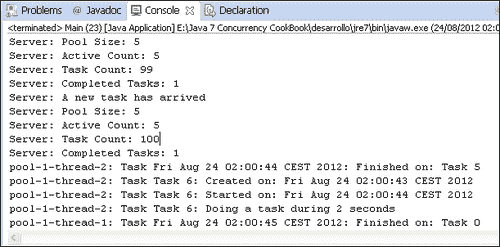
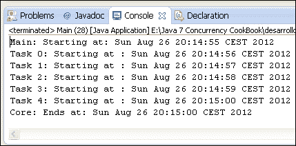
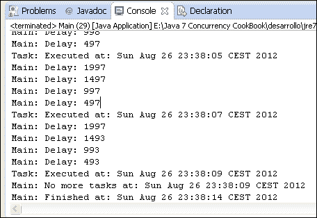
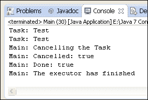

# 第四章：线程执行器

在本章中，我们将涵盖：

+   创建线程执行器

+   创建固定大小的线程执行器

+   在执行器中执行返回结果的任务

+   运行多个任务并处理第一个结果

+   运行多个任务并处理所有结果

+   在执行器中延迟运行任务

+   在执行器中定期运行任务

+   取消执行器中的任务

+   在执行器中控制任务的完成

+   在执行器中分离任务的启动和结果的处理

+   控制执行器的被拒绝任务

# 介绍

通常，在 Java 中开发简单的并发编程应用程序时，您会创建一些`Runnable`对象，然后创建相应的`Thread`对象来执行它们。如果必须开发运行大量并发任务的程序，这种方法有以下缺点：

+   您必须实现与`Thread`对象管理相关的所有代码信息（创建、结束、获取结果）。

+   为每个任务创建一个`Thread`对象。如果必须执行大量任务，这可能会影响应用程序的吞吐量。

+   您必须有效地控制和管理计算机的资源。如果创建了太多线程，可能会使系统饱和。

自 Java 5 以来，Java 并发 API 提供了一个旨在解决问题的机制。这个机制称为**Executor 框架**，围绕着`Executor`接口、它的子接口`ExecutorService`以及实现了这两个接口的`ThreadPoolExecutor`类。

这种机制将任务的创建和执行分开。有了执行器，您只需实现`Runnable`对象并将它们发送到执行器。执行器负责它们的执行、实例化和使用必要的线程运行。但它不仅如此，还使用线程池来提高性能。当您将任务发送到执行器时，它会尝试使用池化线程来执行此任务，以避免不断产生线程。

执行器框架的另一个重要优势是`Callable`接口。它类似于`Runnable`接口，但提供了两个改进，如下所示：

+   该接口的主要方法名为`call()`，可能会返回一个结果。

+   当您将`Callable`对象发送到执行器时，您会得到一个实现`Future`接口的对象。您可以使用此对象来控制`Callable`对象的状态和结果。

本章介绍了 11 个示例，向您展示如何使用 Executor 框架使用 Java 并发 API 提供的类和其他变体。

# 创建线程执行器

使用 Executor 框架的第一步是创建`ThreadPoolExecutor`类的对象。您可以使用该类提供的四个构造函数，或者使用一个名为`Executors`的工厂类来创建`ThreadPoolExecutor`。一旦您有了执行器，就可以发送`Runnable`或`Callable`对象进行执行。

在这个示例中，您将学习如何实现这两个操作，模拟一个从各个客户端接收请求的 Web 服务器。

## 准备工作

您应该阅读第一章中的*创建和运行线程*示例，以了解 Java 中线程创建的基本机制。您可以比较这两种机制，并根据问题选择最佳的机制。

本示例已使用 Eclipse IDE 实现。如果您使用 Eclipse 或其他 IDE，如 NetBeans，请打开它并创建一个新的 Java 项目。

## 如何做...

按照以下步骤实现示例：

1.  首先，您必须实现将由服务器执行的任务。创建一个名为`Task`的类，实现`Runnable`接口。

```java
public class Task implements Runnable {
```

1.  声明一个名为`initDate`的`Date`属性，用于存储任务的创建日期，以及一个名为`name`的`String`属性，用于存储任务的名称。

```java
  private Date initDate;
  private String name;
```

1.  实现初始化两个属性的类的构造函数。

```java
  public Task(String name){
    initDate=new Date();
    this.name=name;
  }
```

1.  实现`run()`方法。

```java
   @Override
  public void run() {
```

1.  首先，将`initDate`属性和实际日期写入控制台，即任务的开始日期。

```java
    System.out.printf("%s: Task %s: Created on: %s\n",Thread.currentThread().getName(),name,initDate);
    System.out.printf("%s: Task %s: Started on: %s\n",Thread.currentThread().getName(),name,new Date());
```

1.  然后，让任务随机休眠一段时间。

```java
    try {
      Long duration=(long)(Math.random()*10);
      System.out.printf("%s: Task %s: Doing a task during %d seconds\n",Thread.currentThread().getName(),name,duration);
      TimeUnit.SECONDS.sleep(duration);
    } catch (InterruptedException e) {
      e.printStackTrace();
    }
```

1.  最后，将任务的完成日期写入控制台。

```java
    System.out.printf("%s: Task %s: Finished on: %s\n",Thread.currentThread().getName(),name,new Date());
```

1.  现在，实现`Server`类，它将使用执行器执行接收到的每个任务。创建一个名为`Server`的类。

```java
public class Server {
```

1.  声明一个名为`executor`的`ThreadPoolExecutor`属性。

```java
  private ThreadPoolExecutor executor;
```

1.  实现初始化`ThreadPoolExecutor`对象的类的构造函数，使用`Executors`类。

```java
  public Server(){
  executor=(ThreadPoolExecutor)Executors.newCachedThreadPool();
  }
```

1.  实现`executeTask()`方法。它接收一个`Task`对象作为参数，并将其发送到执行器。首先，在控制台上写入一条消息，指示新任务已到达。

```java
  public void executeTask(Task task){
    System.out.printf("Server: A new task has arrived\n");
```

1.  然后，调用执行器的`execute()`方法来发送任务。

```java
    executor.execute(task);
```

1.  最后，将一些执行器数据写入控制台，以查看其状态。

```java
    System.out.printf("Server: Pool Size: %d\n",executor.getPoolSize());
    System.out.printf("Server: Active Count: %d\n",executor.getActiveCount());
    System.out.printf("Server: Completed Tasks: %d\n",executor.getCompletedTaskCount());
```

1.  实现`endServer()`方法。在这个方法中，调用执行器的`shutdown()`方法来结束其执行。

```java
  public void endServer() {
    executor.shutdown();
  }
```

1.  最后，通过创建一个名为`Main`的类并实现`main()`方法来实现示例的主类。

```java
public class Main {

  public static void main(String[] args) {
    Server server=new Server();
    for (int i=0; i<100; i++){
      Task task=new Task("Task "+i);
      server.executeTask(task);
    }
    server.endServer();
  }
}
```

## 工作原理...

这个例子的关键是`Server`类。这个类创建并使用`ThreadPoolExecutor`来执行任务。

第一个重要的点是在`Server`类的构造函数中创建`ThreadPoolExecutor`。`ThreadPoolExecutor`类有四个不同的构造函数，但是由于其复杂性，Java 并发 API 提供了`Executors`类来构造执行器和其他相关对象。虽然我们可以直接使用其中一个构造函数来创建`ThreadPoolExecutor`，但建议使用`Executors`类。

在这种情况下，你使用`newCachedThreadPool()`方法创建了一个缓存线程池。这个方法返回一个`ExecutorService`对象，因此被转换为`ThreadPoolExecutor`以便访问其所有方法。你创建的缓存线程池在需要执行新任务时创建新线程，并在现有线程完成任务执行后重用它们，这些线程现在可用。线程的重用有一个优点，就是它减少了线程创建所需的时间。然而，缓存线程池的缺点是为新任务不断保持线程，因此如果你向这个执行器发送太多任务，可能会使系统超载。

### 注意

只有在有合理数量的线程或者线程执行时间较短时，才使用`newCachedThreadPool()`方法创建的执行器。

一旦你创建了执行器，就可以使用`execute()`方法发送`Runnable`或`Callable`类型的任务进行执行。在这种情况下，你发送实现`Runnable`接口的`Task`类的对象。

你还打印了一些关于执行器的日志信息。具体来说，你使用了以下方法：

+   `getPoolSize()`: 此方法返回执行器池中实际的线程数量

+   `getActiveCount()`: 此方法返回执行器中正在执行任务的线程数量

+   `getCompletedTaskCount()`: 此方法返回执行器完成的任务数量

`ThreadPoolExecutor`类和执行器的一个关键方面是你必须显式地结束它。如果不这样做，执行器将继续执行，程序将无法结束。如果执行器没有要执行的任务，它将继续等待新任务，并且不会结束执行。Java 应用程序直到所有非守护线程执行完毕才会结束，因此如果不终止执行器，你的应用程序将永远不会结束。

要指示执行器您要结束它，可以使用`ThreadPoolExecutor`类的`shutdown()`方法。当执行器完成所有待处理任务的执行时，它将结束执行。在调用`shutdown()`方法后，如果尝试向执行器发送另一个任务，将被拒绝，并且执行器将抛出`RejectedExecutionException`异常。

以下屏幕截图显示了此示例的一次执行的部分：


当最后一个任务到达服务器时，执行器有一个包含 100 个任务和 97 个活动线程的池。

## 还有更多...

`ThreadPoolExecutor`类提供了许多方法来获取有关其状态的信息。我们在示例中使用了`getPoolSize()`、`getActiveCount()`和`getCompletedTaskCount()`方法来获取有关池大小、线程数量和执行器已完成任务数量的信息。您还可以使用`getLargestPoolSize()`方法，该方法返回池中曾经同时存在的最大线程数。

`ThreadPoolExecutor`类还提供了与执行器的完成相关的其他方法。这些方法包括：

+   `shutdownNow()`: 此方法立即关闭执行器。它不执行待处理的任务。它返回一个包含所有这些待处理任务的列表。当您调用此方法时正在运行的任务将继续执行，但该方法不会等待它们完成。

+   `isTerminated()`: 如果您调用了`shutdown()`或`shutdownNow()`方法，并且执行器完成了关闭过程，则此方法返回`true`。

+   `isShutdown()`: 如果您调用了执行器的`shutdown()`方法，则此方法返回`true`。

+   `awaitTermination(long``timeout,``TimeUnit``unit)`: 此方法阻塞调用线程，直到执行器的任务结束或超时发生。`TimeUnit`类是一个枚举，具有以下常量：`DAYS`、`HOURS`、`MICROSECONDS`、`MILLISECONDS`、`MINUTES`、`NANOSECONDS`和`SECONDS`。

### 注意

如果您想等待任务完成，无论其持续时间如何，可以使用较长的超时时间，例如`DAYS`。

## 另请参阅

+   第四章 *线程执行器* 中的 *控制执行器的拒绝任务* 配方

+   第八章 *测试并发应用* 中的 *监视执行器框架* 配方

# 创建固定大小线程执行器

当您使用使用`Executors`类的`newCachedThreadPool()`方法创建的基本`ThreadPoolExecutor`时，可能会出现执行器同时运行的线程数量问题。执行器为每个接收到的任务创建一个新线程（如果没有空闲的池线程），因此，如果您发送大量任务并且它们持续时间很长，可能会过载系统并导致应用程序性能不佳。

如果要避免此问题，`Executors`类提供了一个创建固定大小线程执行器的方法。此执行器具有最大线程数。如果发送的任务多于线程数，执行器将不会创建额外的线程，并且剩余的任务将被阻塞，直到执行器有空闲线程。通过这种行为，您可以确保执行器不会导致应用程序性能不佳。

在本配方中，您将学习如何创建一个固定大小的线程执行器，修改本章第一个配方中实现的示例。

## 准备就绪

您应该阅读本章中的 *创建线程执行器* 配方，并实现其中解释的示例，因为您将修改此示例。

此配方的示例是使用 Eclipse IDE 实现的。如果您使用 Eclipse 或其他 IDE（如 NetBeans），请打开它并创建一个新的 Java 项目。

## 如何做...

按照以下步骤实现示例：

1.  实现本章第一个示例中描述的示例。打开`Server`类并修改其构造函数。使用`newFixedThreadPool()`方法创建执行器，并将数字`5`作为参数传递。

```java
public Server(){
executor=(ThreadPoolExecutor)Executors.newFixedThreadPool(5);
}
```

1.  修改`executeTask()`方法，包括一行额外的日志消息。调用`getTaskCount()`方法来获取已发送到执行器的任务数量。

```java
    System.out.printf("Server: Task Count: %d\n",executor.getTaskCount());
```

## 它是如何工作的...

在这种情况下，您已经使用了`Executors`类的`newFixedThreadPool()`方法来创建执行器。此方法创建一个具有最大线程数的执行器。如果发送的任务多于线程数，剩余的任务将被阻塞，直到有空闲线程来处理它们。此方法接收最大线程数作为您希望在执行器中拥有的参数。在您的情况下，您已创建了一个具有五个线程的执行器。

以下截图显示了此示例的一次执行的部分输出：



为了编写程序的输出，您已经使用了`ThreadPoolExecutor`类的一些方法，包括：

+   `getPoolSize()`: 此方法返回执行器池中实际线程的数量

+   `getActiveCount()`: 此方法返回执行器中正在执行任务的线程数

您可以看到这些方法的输出是**5**，表示执行器有五个线程。它没有超过设定的最大线程数。

当您将最后一个任务发送到执行器时，它只有**5**个活动线程。剩下的 95 个任务正在等待空闲线程。我们使用`getTaskCount()`方法来显示您已发送到执行器的数量。

## 还有更多...

`Executors`类还提供了`newSingleThreadExecutor()`方法。这是一个固定大小线程执行器的极端情况。它创建一个只有一个线程的执行器，因此一次只能执行一个任务。

## 另请参阅

+   第四章中的*创建线程执行器*示例，*线程执行器*

+   第八章中的*监视执行器框架*示例，*测试并发应用*

# 在返回结果的执行器中执行任务

执行器框架的一个优点是可以运行返回结果的并发任务。Java 并发 API 通过以下两个接口实现了这一点：

+   `Callable`: 此接口有`call()`方法。在此方法中，您必须实现任务的逻辑。`Callable`接口是一个参数化接口，这意味着您必须指示`call()`方法将返回的数据类型。

+   `Future`: 此接口有一些方法，用于获取`Callable`对象生成的结果并管理其状态。

在本示例中，您将学习如何实现返回结果的任务并在执行器上运行它们。

## 准备就绪...

本示例已使用 Eclipse IDE 实现。如果您使用 Eclipse 或其他 IDE，如 NetBeans，请打开它并创建一个新的 Java 项目。

## 如何做...

按照以下步骤实现示例：

1.  创建一个名为`FactorialCalculator`的类。指定它实现了带有`Integer`类型的`Callable`接口。

```java
public class FactorialCalculator implements Callable<Integer> {
```

1.  `声明`一个私有的`Integer`属性叫做`number`，用于存储此任务将用于计算的数字。

```java
  private Integer number;
```

1.  实现初始化类属性的类构造函数。

```java
  public FactorialCalculator(Integer number){
    this.number=number;
  }
```

1.  实现`call()`方法。此方法返回`FactorialCalculator`的`number`属性的阶乘。

```java
   @Override
  public Integer call() throws Exception {
```

1.  首先，创建并初始化方法中使用的内部变量。

```java
       int result = 1;  
```

1.  如果数字是`0`或`1`，则返回`1`。否则，计算数字的阶乘。在两次乘法之间，出于教育目的，让此任务休眠 20 毫秒。

```java
    if ((num==0)||(num==1)) {
      result=1;
    } else {
      for (int i=2; i<=number; i++) {
        result*=i;
        TimeUnit.MILLISECONDS.sleep(20);
      }
    }
```

1.  在控制台上写入一条消息，其中包含操作的结果。

```java
    System.out.printf("%s: %d\n",Thread.currentThread().getName(),result);
```

1.  返回操作的结果。

```java
    return result;
```

1.  通过创建一个名为`Main`的类并实现`main()`方法来实现示例的主类。

```java
public class Main {
  public static void main(String[] args) {
```

1.  使用`Executors`类的`newFixedThreadPool()`方法创建`ThreadPoolExecutor`来运行任务。将`2`作为参数传递。

```java
    ThreadPoolExecutor executor=(ThreadPoolExecutor)Executors.newFixedThreadPool(2);
```

1.  创建一个`Future<Integer>`对象列表。

```java
    List<Future<Integer>> resultList=new ArrayList<>();
```

1.  使用`Random`类创建一个随机数生成器。

```java
    Random random=new Random();
```

1.  生成 10 个新的随机整数，介于零和 10 之间。

```java
    for (int i=0; i<10; i++){
      Integer number= random.nextInt(10);
```

1.  创建一个`FactorialCaculator`对象，传递这个随机数作为参数。

```java
      FactorialCalculator calculator=new FactorialCalculator(number);
```

1.  调用执行器的`submit()`方法，将`FactorialCalculator`任务发送到执行器。这个方法返回一个`Future<Integer>`对象来管理任务，并最终获得它的结果。

```java
      Future<Integer> result=executor.submit(calculator);
```

1.  将`Future`对象添加到之前创建的列表中。

```java
      resultList.add(result);
    }
```

1.  创建一个`do`循环来监视执行器的状态。

```java
    do {
```

1.  首先，使用执行器的`getCompletedTaskNumber()`方法向控制台写入一条消息，指示已完成的任务数。

```java
      System.out.printf("Main: Number of Completed Tasks: %d\n",executor.getCompletedTaskCount());
```

1.  然后，对列表中的 10 个`Future`对象，使用`isDone()`方法编写一条消息，指示它管理的任务是否已经完成。

```java
      for (int i=0; i<resultList.size(); i++) {
        Future<Integer> result=resultList.get(i);
        System.out.printf("Main: Task %d: %s\n",i,result.isDone());
      }
```

1.  让线程睡眠 50 毫秒。

```java
      try {
        TimeUnit.MILLISECONDS.sleep(50);
      } catch (InterruptedException e) {
        e.printStackTrace();
      }
```

1.  在执行器的已完成任务数小于 10 时重复此循环。

```java
    } while (executor.getCompletedTaskCount()<resultList.size());
```

1.  将每个任务获得的结果写入控制台。对于每个`Future`对象，使用`get()`方法获取其任务返回的`Integer`对象。

```java
    System.out.printf("Main: Results\n");
    for (int i=0; i<resultList.size(); i++) {
      Future<Integer> result=resultList.get(i);
      Integer number=null;
      try {
        number=result.get();
      } catch (InterruptedException e) {
        e.printStackTrace();
      } catch (ExecutionException e) {
        e.printStackTrace();
      }
```

1.  然后，将数字打印到控制台。

```java
      System.out.printf("Main: Task %d: %d\n",i,number);
    }
```

1.  最后，调用执行器的`shutdown()`方法来结束其执行。

```java
    executor.shutdown();
```

## 它是如何工作的...

在这个配方中，您已经学会了如何使用`Callable`接口来启动返回结果的并发任务。您已经实现了`FactorialCalculator`类，该类实现了`Callable`接口，结果类型为`Integer`。因此，它在`call()`方法的返回类型之前返回。

这个示例的另一个关键点在于`Main`类。您使用`submit()`方法将一个`Callable`对象发送到执行器中执行。这个方法接收一个`Callable`对象作为参数，并返回一个`Future`对象，您可以用它来实现两个主要目标：

+   您可以控制任务的状态：您可以取消任务并检查它是否已完成。为此，您已经使用了`isDone()`方法来检查任务是否已完成。

+   您可以获得`call()`方法返回的结果。为此，您已经使用了`get()`方法。该方法等待，直到`Callable`对象完成`call()`方法的执行并返回其结果。如果在`get()`方法等待结果时线程被中断，它会抛出`InterruptedException`异常。如果`call()`方法抛出异常，该方法会抛出`ExecutionException`异常。

## 还有更多...

当您调用`Future`对象的`get()`方法时，如果由该对象控制的任务尚未完成，该方法将阻塞直到任务完成。`Future`接口提供了`get()`方法的另一个版本。

+   `get(long``timeout,``TimeUnit``unit)`: 如果任务的结果不可用，此版本的`get`方法会等待指定的时间。如果指定的时间段过去了，结果仍然不可用，该方法将返回`null`值。`TimeUnit`类是一个枚举，具有以下常量：`DAYS`、`HOURS`、`MICROSECONDS`、`MILLISECONDS`、`MINUTES`、`NANOSECONDS`和`SECONDS`。

## 另请参阅

+   第四章中的*创建线程执行器*配方，*线程执行器*

+   第四章中的*运行多个任务并处理第一个结果*配方，*线程执行器*

+   第四章中的*运行多个任务并处理所有结果*配方，*线程执行器*

# 运行多个任务并处理第一个结果

并发编程中的一个常见问题是当您有各种并发任务来解决一个问题，而您只对这些任务的第一个结果感兴趣。例如，您想对数组进行排序。您有各种排序算法。您可以启动它们所有，并获得首个对数组进行排序的结果，也就是说，对于给定数组来说，最快的排序算法。

在本示例中，您将学习如何使用`ThreadPoolExecutor`类实现此场景。您将实现一个示例，其中用户可以通过两种机制进行验证。如果其中一种机制对用户进行验证，则用户将通过验证。

## 准备工作

本示例使用 Eclipse IDE 实现。如果您使用 Eclipse 或其他 IDE，如 NetBeans，请打开它并创建一个新的 Java 项目。

## 如何做...

按照以下步骤实现示例：

1.  创建一个名为`UserValidator`的类，它将实现用户验证的过程。

```java
public class UserValidator {
```

1.  声明一个名为`name`的私有`String`属性，它将存储用户验证系统的名称。

```java
  private String name;
```

1.  实现初始化其属性的类的构造函数。

```java
  public UserValidator(String name) {
    this.name=name;
  }
```

1.  实现`validate()`方法。它接收两个`String`参数，分别是要验证的用户的名称和密码。

```java
  public boolean validate(String name, String password) {
```

1.  创建一个名为`random`的`Random`对象。

```java
    Random random=new Random();
```

1.  等待随机一段时间以模拟用户验证过程。

```java
    try {
      long duration=(long)(Math.random()*10);
      System.out.printf("Validator %s: Validating a user during %d seconds\n",this.name,duration);
      TimeUnit.SECONDS.sleep(duration);
    } catch (InterruptedException e) {
      return false;
    }
```

1.  返回一个随机的`Boolean`值。当用户通过验证时，该方法返回`true`值，当用户未通过验证时，该方法返回`false`值。

```java
    return random.nextBoolean();
   }
```

1.  实现`getName()`方法。此方法返回名称属性的值。

```java
  public String getName(){
    return name;
  }
```

1.  现在，创建一个名为`TaskValidator`的类，它将使用`UserValidation`对象作为并发任务执行验证过程。指定它实现了参数化为`String`类的`Callable`接口。

```java
public class TaskValidator implements Callable<String> {
```

1.  声明一个名为`validator`的私有`UserValidator`属性。

```java
  private UserValidator validator;
```

1.  声明两个名为`user`和`password`的私有`String`属性。

```java
  private String user;
  private String password;
```

1.  实现将初始化所有属性的类的构造函数。

```java
  public TaskValidator(UserValidator validator, String user, String password){
    this.validator=validator;
    this.user=user;
    this.password=password;
  }
```

1.  实现将返回`String`对象的`call()`方法。

```java
  @Override
  public String call() throws Exception {
```

1.  如果用户未通过`UserValidator`对象进行验证，则向控制台写入一条消息指示此情况，并抛出`Exception`异常。

```java
    if (!validator.validate(user, password)) {
      System.out.printf("%s: The user has not been found\n",validator.getName());
      throw new Exception("Error validating user");
    }
```

1.  否则，向控制台写入一条消息，指示用户已经通过验证，并返回`UserValidator`对象的名称。

```java
    System.out.printf("%s: The user has been found\n",validator.getName());
    return validator.getName();
```

1.  现在，通过创建一个名为`Main`的类并向其中添加`main()`方法来实现示例的主类。

```java
public class Main {
  public static void main(String[] args) {
```

1.  创建两个名为`user`和`password`的`String`对象，并将它们初始化为`test`值。

```java
    String username="test";
    String password="test";
```

1.  创建两个名为`ldapValidator`和`dbValidator`的`UserValidator`对象。

```java
    UserValidator ldapValidator=new UserValidator("LDAP");
    UserValidator dbValidator=new UserValidator("DataBase");
```

1.  创建两个名为`ldapTask`和`dbTask`的`TaskValidator`对象。将它们分别初始化为`ldapValidator`和`dbValidator`。

```java
    TaskValidator ldapTask=new TaskValidator(ldapValidator, username, password);
    TaskValidator dbTask=new TaskValidator(dbValidator,username,password);
```

1.  创建一个`TaskValidator`对象列表，并将您创建的两个对象添加到其中。

```java
    List<TaskValidator> taskList=new ArrayList<>();
    taskList.add(ldapTask);
    taskList.add(dbTask);
```

1.  使用`Executors`类的`newCachedThreadPool()`方法创建一个新的`ThreadPoolExecutor`对象和一个名为`result`的`String`对象。

```java
    ExecutorService executor=(ExecutorService)Executors.newCachedThreadPool();
    String result;
```

1.  调用`executor`对象的`invokeAny()`方法。此方法接收`taskList`作为参数并返回`String`。此外，它将由此方法返回的`String`对象写入控制台。

```java
    try {
      result = executor.invokeAny(taskList);
      System.out.printf("Main: Result: %s\n",result);
    } catch (InterruptedException e) {
      e.printStackTrace();
    } catch (ExecutionException e) {
      e.printStackTrace();
    }
```

1.  使用`shutdown()`方法终止执行程序，并向控制台写入一条消息以指示程序已结束。

```java
    executor.shutdown();
    System.out.printf("Main: End of the Execution\n");
```

## 它是如何工作的...

示例的关键在于`Main`类。`ThreadPoolExecutor`类的`invokeAny()`方法接收任务列表，启动它们，并返回第一个完成而不抛出异常的任务的结果。此方法返回与您启动的任务的`call()`方法返回的相同的数据类型。在本例中，它返回一个`String`值。

以下屏幕截图显示了示例执行的输出，当一个任务验证了用户时：


示例有两个`UserValidator`对象，返回一个随机的`boolean`值。每个`UserValidator`对象都被一个`Callable`对象使用，由`TaskValidator`类实现。如果`UserValidator`类的`validate()`方法返回`false`值，`TaskValidator`类会抛出`Exception`。否则，它返回`true`值。

因此，我们有两个任务，可以返回`true`值，也可以抛出`Exception`异常。您可以有以下四种可能性：

+   两个任务都返回`true`值。`invokeAny()`方法的结果是第一个完成的任务的名称。

+   第一个任务返回`true`值，第二个任务抛出`Exception`。`invokeAny()`方法的结果是第一个任务的名称。

+   第一个任务抛出`Exception`，第二个任务返回`true`值。`invokeAny()`方法的结果是第二个任务的名称。

+   两个任务都会抛出`Exception`。在该类中，`invokeAny()`方法会抛出`ExecutionException`异常。

如果多次运行示例，您可以得到四种可能的解决方案。

以下屏幕截图显示了应用程序的输出，当两个任务都抛出异常时：


## 还有更多...

`ThreadPoolExecutor`类提供了`invokeAny()`方法的另一个版本：

+   `invokeAny(Collection<? extends Callable<T>> tasks, long timeout, TimeUnit unit)`: 此方法执行所有任务，并在给定的超时时间之前完成的第一个任务的结果，如果在给定的超时时间之前完成而不抛出异常，则返回。`TimeUnit`类是一个枚举，具有以下常量：`DAYS`，`HOURS`，`MICROSECONDS`，`MILLISECONDS`，`MINUTES`，`NANOSECONDS`和`SECONDS`。

## 另请参阅

+   第四章中的*运行多个任务并处理所有结果*示例，*线程执行程序*

# 运行多个任务并处理所有结果

Executor 框架允许您执行并发任务，而无需担心线程的创建和执行。它为您提供了`Future`类，您可以使用它来控制任何在执行程序中执行的任务的状态并获取结果。

当您想要等待任务的完成时，可以使用以下两种方法：

+   `Future`接口的`isDone()`方法在任务完成执行时返回`true`。

+   `ThreadPoolExecutor`类的`awaitTermination()`方法使线程休眠，直到所有任务在调用`shutdown()`方法后完成执行。

这两种方法都有一些缺点。使用第一种方法，您只能控制任务的完成，而使用第二种方法，您必须关闭执行程序以等待线程，否则方法的调用会立即返回。

`ThreadPoolExecutor`类提供了一种方法，允许您向执行程序发送任务列表，并等待列表中所有任务的完成。在这个示例中，您将学习如何通过实现一个包含三个任务的示例来使用这个特性，并在它们完成时打印出它们的结果。

## 准备工作

本示例已使用 Eclipse IDE 实现。如果您使用 Eclipse 或其他 IDE，如 NetBeans，请打开它并创建一个新的 Java 项目。

## 如何做...

按照以下步骤实现示例：

1.  创建一个名为`Result`的类，用于存储此示例中并发任务生成的结果。

```java
public class Result {
```

1.  声明两个私有属性。一个名为`name`的`String`属性，一个名为`value`的`int`属性。

```java
  private String name;
  private int value;
```

1.  实现相应的`get()`和`set()`方法来设置和返回名称和值属性的值。

```java
  public String getName() {
    return name;
  }
  public void setName(String name) {
    this.name = name;
  }
  public int getValue() {
    return value;
  }
  public void setValue(int value) {
    this.value = value;
  }
```

1.  创建一个名为`Task`的类，实现带有`Result`类参数的`Callable`接口。

```java
public class Task implements Callable<Result> {
```

1.  声明一个名为`name`的私有`String`属性。

```java
  private String name;
```

1.  实现初始化其属性的类的构造函数。

```java
  public Task(String name) {
    this.name=name;
  }
```

1.  实现类的`call()`方法。在这种情况下，此方法将返回一个`Result`对象。

```java
  @Override
  public Result call() throws Exception {
```

1.  首先，向控制台写入一条消息，指示任务正在开始。

```java
    System.out.printf("%s: Staring\n",this.name);
```

1.  然后，等待随机一段时间。

```java
    try {
      long duration=(long)(Math.random()*10);
      System.out.printf("%s: Waiting %d seconds for results.\n",this.name,duration);
      TimeUnit.SECONDS.sleep(duration);
    } catch (InterruptedException e) {
      e.printStackTrace();
    }
```

1.  为了生成要在`Result`对象中返回的`int`值，计算五个随机数的总和。

```java
    int value=0;
    for (int i=0; i<5; i++){
      value+=(int)(Math.random()*100);

    }
```

1.  创建一个`Result`对象，并使用此任务的名称和先前完成的操作的结果对其进行初始化。

```java
    Result result=new Result();
    result.setName(this.name);
    result.setValue(value);
```

1.  向控制台写入一条消息，指示任务已经完成。

```java
    System.out.println(this.name+": Ends");
```

1.  返回`Result`对象。

```java
    return result;
  }
```

1.  最后，通过创建一个名为`Main`的类并向其中添加`main()`方法来实现示例的主类。

```java
public class Main {

  public static void main(String[] args) {
```

1.  使用`Executors`类的`newCachedThreadPool()`方法创建一个`ThreadPoolExecutor`对象。

```java
    ExecutorService executor=(ExecutorService)Executors.newCachedThreadPool();
```

1.  创建一个`Task`对象列表。创建三个`Task`对象并将它们保存在该列表中。

```java
    List<Task> taskList=new ArrayList<>();
    for (int i=0; i<3; i++){
      Task task=new Task(i);
      taskList.add(task);
    }
```

1.  创建一个`Future`对象列表。这些对象使用`Result`类进行参数化。

```java
    List<Future<Result>>resultList=null;
```

1.  调用`ThreadPoolExecutor`类的`invokeAll()`方法。此类将返回先前创建的`Future`对象的列表。

```java
    try {
      resultList=executor.invokeAll(taskList);
    } catch (InterruptedException e) {
      e.printStackTrace();
    }
```

1.  使用`shutdown()`方法终止执行程序。

```java
    executor.shutdown();
```

1.  写入处理`Future`对象列表的任务结果。

```java
    System.out.println("Main: Printing the results");
    for (int i=0; i<resultList.size(); i++){
      Future<Result> future=resultList.get(i);
      try {
        Result result=future.get();
        System.out.println(result.getName()+": "+result.getValue());
      } catch (InterruptedException | ExecutionException e) {
        e.printStackTrace();
      }
    }
```

## 工作原理...

在本食谱中，您已经学会了如何将任务列表发送到执行程序，并使用`invokeAll()`方法等待它们全部完成。此方法接收`Callable`对象的列表并返回`Future`对象的列表。此列表将为列表中的每个任务具有一个`Future`对象。`Future`对象列表中的第一个对象将是控制列表中`Callable`对象的第一个任务的对象，依此类推。

首先要考虑的一点是，在存储结果对象的列表的声明中，用于参数化`Future`接口的数据类型必须与用于参数化`Callable`对象的数据类型兼容。在这种情况下，您使用了相同类型的数据：`Result`类。

关于`invokeAll()`方法的另一个重要点是，您将仅使用`Future`对象来获取任务的结果。由于该方法在所有任务完成时结束，如果调用返回的`Future`对象的`isDone()`方法，所有调用都将返回`true`值。

## 还有更多...

`ExecutorService`类提供了`invokeAll()`方法的另一个版本：

+   `invokeAll(Collection<?``extends``Callable<T>>``tasks,``long``timeout,``TimeUnit``unit)`: 此方法执行所有任务，并在所有任务都完成时返回它们的执行结果，如果它们在给定的超时时间之前完成。`TimeUnit`类是一个枚举，具有以下常量：`DAYS`，`HOURS`，`MICROSECONDS`，`MILLISECONDS`，`MINUTES`，`NANOSECONDS`和`SECONDS`。

## 另请参阅

+   第四章中的*在返回结果的执行程序中执行任务*食谱，*线程执行程序*

+   第四章中的*运行多个任务并处理第一个结果*食谱，*线程执行程序*

# 在延迟后在执行程序中运行任务

执行程序框架提供了`ThreadPoolExecutor`类，用于使用线程池执行`Callable`和`Runnable`任务，避免了所有线程创建操作。当您将任务发送到执行程序时，它将根据执行程序的配置尽快执行。有些情况下，您可能不希望尽快执行任务。您可能希望在一段时间后执行任务，或者定期执行任务。为此，执行程序框架提供了`ScheduledThreadPoolExecutor`类。

在本食谱中，您将学习如何创建`ScheduledThreadPoolExecutor`以及如何使用它在一定时间后安排任务的执行。

## 准备就绪

这个食谱的例子是使用 Eclipse IDE 实现的。如果你使用 Eclipse 或其他 IDE 如 NetBeans，打开它并创建一个新的 Java 项目。

## 如何做...

按照以下步骤实现示例：

1.  创建一个名为`Task`的类，实现参数为`String`类的`Callable`接口。

```java
public class Task implements Callable<String> {
```

1.  声明一个私有的`String`属性，名为`name`，用来存储任务的名称。

```java
  private String name;
```

1.  实现初始化`name`属性的类的构造函数。

```java
  public Task(String name) {
    this.name=name;
  }
```

1.  实现`call()`方法。在控制台上写入一个带有实际日期的消息，并返回一个文本，例如`Hello, world`。

```java
  public String call() throws Exception {
    System.out.printf("%s: Starting at : %s\n",name,new Date());
    return "Hello, world";
  }
```

1.  通过创建一个名为`Main`的类并在其中添加`main()`方法来实现示例的主类。

```java
public class Main {
  public static void main(String[] args) {
```

1.  使用`Executors`类的`newScheduledThreadPool()`方法创建一个`ScheduledThreadPoolExecutor`类的执行器，传递`1`作为参数。

```java
    ScheduledThreadPoolExecutor executor=(ScheduledThreadPoolExecutor)Executors.newScheduledThreadPool(1); 
```

1.  初始化并启动一些任务（在我们的例子中为五个），使用`ScheduledThreadPoolExecutor`实例的`schedule()`方法。

```java
    System.out.printf("Main: Starting at: %s\n",new Date());
    for (int i=0; i<5; i++) {
      Task task=new Task("Task "+i);
      executor.schedule(task,i+1 , TimeUnit.SECONDS);
    }
```

1.  使用`shutdown()`方法请求执行器的完成。

```java
    executor.shutdown();
```

1.  使用执行器的`awaitTermination()`方法等待所有任务的完成。

```java
    try {
      executor.awaitTermination(1, TimeUnit.DAYS);
    } catch (InterruptedException e) {
      e.printStackTrace();
    }
```

1.  写一条消息来指示程序完成的时间。

```java
    System.out.printf("Main: Ends at: %s\n",new Date());
```

## 它是如何工作的...

这个例子的关键点是`Main`类和`ScheduledThreadPoolExecutor`的管理。与`ThreadPoolExecutor`类一样，为了创建一个定时执行器，Java 建议使用`Executors`类。在这种情况下，你需要使用`newScheduledThreadPool()`方法。你需要将数字`1`作为参数传递给这个方法。这个参数是你想要在池中拥有的线程数。

要在定时执行器中在一段时间后执行任务，你需要使用`schedule()`方法。这个方法接收以下三个参数：

+   你想要执行的任务

+   你希望任务在执行之前等待的时间段

+   时间段的单位，指定为`TimeUnit`类的常量。

在这种情况下，每个任务将等待一定数量的秒数（`TimeUnit.SECONDS`），等于其在任务数组中的位置加一。

### 注意

如果你想在特定时间执行一个任务，计算那个日期和当前日期之间的差异，并将这个差异作为任务的延迟。

以下截图显示了此示例执行的输出：



你可以看到任务如何每秒开始执行一次。所有任务都同时发送到执行器，但每个任务的延迟比前一个任务晚 1 秒。

## 还有更多...

你也可以使用`Runnable`接口来实现任务，因为`ScheduledThreadPoolExecutor`类的`schedule()`方法接受这两种类型的任务。

尽管`ScheduledThreadPoolExecutor`类是`ThreadPoolExecutor`类的子类，因此继承了所有的特性，但 Java 建议仅将`ScheduledThreadPoolExecutor`用于定时任务。

最后，当你调用`shutdown()`方法并且有待处理的任务等待其延迟时间结束时，你可以配置`ScheduledThreadPoolExecutor`类的行为。默认行为是，尽管执行器已经完成，这些任务仍将被执行。你可以使用`ScheduledThreadPoolExecutor`类的`setExecuteExistingDelayedTasksAfterShutdownPolicy()`方法来改变这个行为。使用`false`，在`shutdown()`时，待处理的任务将不会被执行。

## 另请参阅

+   第四章中的*在返回结果的执行器中执行任务*食谱，*线程执行器*

# 定期在执行器中运行任务

Executor 框架提供了`ThreadPoolExecutor`类，使用线程池执行并发任务，避免了所有线程创建操作。当您将任务发送到执行程序时，根据其配置，它会尽快执行任务。当任务结束时，任务将从执行程序中删除，如果您想再次执行它们，您必须再次将其发送到执行程序。

但是，Executor 框架提供了通过`ScheduledThreadPoolExecutor`类执行定期任务的可能性。在这个食谱中，您将学习如何使用该类的这个功能来安排一个定期任务。

## 准备工作

这个食谱的例子是使用 Eclipse IDE 实现的。如果您使用 Eclipse 或其他 IDE，如 NetBeans，打开它并创建一个新的 Java 项目。

## 如何做...

按照以下步骤实现示例：

1.  创建一个名为`Task`的类，并指定它实现`Runnable`接口。

```java
public class Task implements Runnable {
```

1.  声明一个名为`name`的私有`String`属性，它将存储任务的名称。

```java
  private String name;
```

1.  实现初始化该属性的类的构造函数。

```java
  public Task(String name) {
    this.name=name;
  }
```

1.  实现`run()`方法。向控制台写入一个带有实际日期的消息，以验证任务是否在指定的时间内执行。

```java
  @Override
  public String call() throws Exception {
    System.out.printf("%s: Starting at : %s\n",name,new Date());
    return "Hello, world";
  }
```

1.  通过创建一个名为`Main`的类并在其中实现`main()`方法来实现示例的主类。

```java
public class Main {
  public static void main(String[] args) {
```

1.  使用`Executors`类的`newScheduledThreadPool()`方法创建`ScheduledThreadPoolExecutor`。将数字`1`作为该方法的参数。

```java
    ScheduledExecutorService executor=Executors.newScheduledThreadPool(1);
```

1.  向控制台写入一个带有实际日期的消息。

```java
    System.out.printf("Main: Starting at: %s\n",new Date());
```

1.  创建一个新的`Task`对象。

```java
    Task task=new Task("Task");
```

1.  使用`scheduledAtFixRate()`方法将其发送到执行程序。将任务创建的参数、数字一、数字二和常量`TimeUnit.SECONDS`作为参数。该方法返回一个`ScheduledFuture`对象，您可以使用它来控制任务的状态。

```java
    ScheduledFuture<?> result=executor.scheduleAtFixedRate(task, 1, 2, TimeUnit.SECONDS);
```

1.  创建一个循环，有 10 个步骤来写入任务下次执行的剩余时间。在循环中，使用`ScheduledFuture`对象的`getDelay()`方法来获取直到任务下次执行的毫秒数。

```java
    for (int i=0; i<10; i++){
      System.out.printf("Main: Delay: %d\n",result.getDelay(TimeUnit.MILLISECONDS));
Sleep the thread during 500 milliseconds.
      try {
        TimeUnit.MILLISECONDS.sleep(500);
      } catch (InterruptedException e) {
        e.printStackTrace();
      }
    }
```

1.  使用`shutdown()`方法结束执行程序。

```java
    executor.shutdown();
```

1.  将线程休眠 5 秒，以验证定期任务是否已经完成。

```java
    try {
      TimeUnit.SECONDS.sleep(5);
    } catch (InterruptedException e) {
      e.printStackTrace();
    }
```

1.  写一条消息来指示程序的结束。

```java
    System.out.printf("Main: Finished at: %s\n",new Date());
```

## 它是如何工作的...

当您想要使用 Executor 框架执行定期任务时，您需要一个`ScheduledExecutorService`对象。要创建它（与每个执行程序一样），Java 建议使用`Executors`类。这个类作为执行程序对象的工厂。在这种情况下，您应该使用`newScheduledThreadPool()`方法来创建一个`ScheduledExecutorService`对象。该方法接收池中线程的数量作为参数。在这个例子中，您已经将值`1`作为参数传递了。

一旦您有了执行定期任务所需的执行程序，您就可以将任务发送给执行程序。您已经使用了`scheduledAtFixedRate()`方法。该方法接受四个参数：您想要定期执行的任务，直到任务第一次执行之间的延迟时间，两次执行之间的时间间隔，以及第二个和第三个参数的时间单位。它是`TimeUnit`类的一个常量。`TimeUnit`类是一个枚举，具有以下常量：`DAYS`、`HOURS`、`MICROSECONDS`、`MILLISECONDS`、`MINUTES`、`NANOSECONDS`和`SECONDS`。

一个重要的要考虑的点是两次执行之间的时间间隔是开始这两次执行之间的时间间隔。如果您有一个需要 5 秒执行的周期性任务，并且您设置了 3 秒的时间间隔，那么您将有两个任务实例同时执行。

`scheduleAtFixedRate()`方法返回一个`ScheduledFuture`对象，它扩展了`Future`接口，具有用于处理计划任务的方法。`ScheduledFuture`是一个参数化接口。在本例中，由于您的任务是一个未参数化的`Runnable`对象，因此您必须使用`?`符号对其进行参数化。

您已经使用了`ScheduledFuture`接口的一个方法。`getDelay()`方法返回任务下一次执行的时间。此方法接收一个`TimeUnit`常量，其中包含您希望接收结果的时间单位。

以下屏幕截图显示了示例执行的输出：



您可以看到任务每 2 秒执行一次（以`Task:`前缀表示），并且控制台中每 500 毫秒写入延迟。这就是主线程被挂起的时间。当您关闭执行器时，计划任务结束执行，您将不会在控制台中看到更多消息。

## 还有更多...

`ScheduledThreadPoolExecutor`提供了其他方法来安排周期性任务。它是`scheduleWithFixedRate()`方法。它与`scheduledAtFixedRate()`方法具有相同的参数，但有一个值得注意的区别。在`scheduledAtFixedRate()`方法中，第三个参数确定两次执行开始之间的时间间隔。在`scheduledWithFixedRate()`方法中，参数确定任务执行结束和下一次执行开始之间的时间间隔。

您还可以使用`shutdown()`方法配置`ScheduledThreadPoolExecutor`类的实例的行为。默认行为是在调用该方法时计划任务结束。您可以使用`ScheduledThreadPoolExecutor`类的`setContinueExistingPeriodicTasksAfterShutdownPolicy()`方法来更改此行为，并使用`true`值。调用`shutdown()`方法时，周期性任务不会结束。

## 另请参阅

+   第四章中的*创建线程执行器*食谱，*线程执行器*

+   第四章中的*在延迟后在执行器中运行任务*食谱，*线程执行器*

# 在执行器中取消任务

当您使用执行器时，无需管理线程。您只需实现`Runnable`或`Callable`任务并将其发送到执行器。执行器负责创建线程，在线程池中管理它们，并在不需要时完成它们。有时，您可能希望取消发送到执行器的任务。在这种情况下，您可以使用`Future`的`cancel()`方法来执行取消操作。在本示例中，您将学习如何使用此方法来取消发送到执行器的任务。

## 准备工作

本示例使用 Eclipse IDE 实现。如果您使用 Eclipse 或其他 IDE（如 NetBeans），请打开它并创建一个新的 Java 项目。

## 如何做...

按照以下步骤实现示例：

1.  创建一个名为`Task`的类，并指定它实现了参数化为`String`类的`Callable`接口。实现`call()`方法。在无限循环中向控制台写入消息并将其挂起 100 毫秒。

```java
public class Task implements Callable<String> {
  @Override
  public String call() throws Exception {
    while (true){
      System.out.printf("Task: Test\n");
      Thread.sleep(100);
    }
  }
```

1.  通过创建一个名为`Main`的类并向其中添加`main()`方法来实现示例的主类。

```java
public class Main {
  public static void main(String[] args) {
```

1.  使用`Executors`类的`newCachedThreadPool()`方法创建一个`ThreadPoolExecutor`对象。

```java
    ThreadPoolExecutor executor=(ThreadPoolExecutor)Executors.newCachedThreadPool();
```

1.  创建一个新的`Task`对象。

```java
    Task task=new Task();
```

1.  使用`submit()`方法将任务发送到执行器。

```java
    System.out.printf("Main: Executing the Task\n");
    Future<String> result=executor.submit(task);
```

1.  将主任务挂起 2 秒。

```java
    try {
      TimeUnit.SECONDS.sleep(2);
    } catch (InterruptedException e) {
      e.printStackTrace();
    }
```

1.  使用`submit()`方法返回的名为`result`的`Future`对象的`cancel()`方法取消任务的执行。将`true`值作为`cancel()`方法的参数传递。

```java
    System.out.printf("Main: Canceling the Task\n");
    result.cancel(true);
```

1.  向控制台写入调用`isCancelled()`和`isDone()`方法的结果，以验证任务是否已被取消，因此已经完成。

```java
    System.out.printf("Main: Canceled: %s\n",result.isCanceled());
    System.out.printf("Main: Done: %s\n",result.isDone());
```

1.  使用`shutdown()`方法完成执行程序，并写入指示程序完成的消息。

```java
    executor.shutdown();
    System.out.printf("Main: The executor has finished\n");
```

## 它是如何工作的...

当您想要取消发送到执行程序的任务时，可以使用`Future`接口的`cancel()`方法。根据`cancel()`方法的参数和任务的状态，此方法的行为不同：

+   如果任务已经完成或之前已被取消，或者由于其他原因无法取消，则该方法将返回`false`值，任务将不会被取消。

+   如果任务正在等待执行它的`Thread`对象，则任务将被取消并且永远不会开始执行。如果任务已经在运行，则取决于方法的参数。`cancel()`方法接收一个`Boolean`值作为参数。如果该参数的值为`true`并且任务正在运行，则将取消任务。如果参数的值为`false`并且任务正在运行，则不会取消任务。

以下屏幕截图显示了此示例执行的输出：



## 还有更多...

如果您使用控制已取消任务的`Future`对象的`get()`方法，`get()`方法将抛出`CancellationException`异常。

## 另请参阅

+   第四章中的*在返回结果的执行程序中执行任务*食谱，*线程执行程序*

# 在执行程序中控制任务完成

`FutureTask`类提供了一个名为`done()`的方法，允许您在执行程序中执行任务完成后执行一些代码。它可以用于执行一些后处理操作，生成报告，通过电子邮件发送结果或释放一些资源。当控制此`FutureTask`对象的任务的执行完成时，`FutureTask`类在内部调用此方法。该方法在任务的结果设置并且其状态更改为`isDone`状态后调用，无论任务是否已被取消或正常完成。

默认情况下，此方法为空。您可以重写`FutureTask`类并实现此方法以更改此行为。在本示例中，您将学习如何重写此方法以在任务完成后执行代码。

## 准备工作

本示例的示例已使用 Eclipse IDE 实现。如果您使用 Eclipse 或其他 IDE（如 NetBeans），请打开它并创建一个新的 Java 项目。

## 如何做...

按照以下步骤实现示例：

1.  创建一个名为`ExecutableTask`的类，并指定它实现了参数为`String`类的`Callable`接口。

```java
public class ExecutableTask implements Callable<String> {
```

1.  声明一个名为`name`的私有`String`属性。它将存储任务的名称。实现`getName()`方法以返回此属性的值。

```java
  private String name;
  public String getName(){
    return name;
  }
```

1.  实现类的构造函数以初始化任务的名称。

```java
  public ExecutableTask(String name){
    this.name=name;
  }
```

1.  实现`call()`方法。让任务休眠一段随机时间并返回带有任务名称的消息。

```java
  @Override
  public String call() throws Exception {
    try {
      long duration=(long)(Math.random()*10);
      System.out.printf("%s: Waiting %d seconds for results.\n",this.name,duration);
      TimeUnit.SECONDS.sleep(duration);
    } catch (InterruptedException e) {
    }    
    return "Hello, world. I'm "+name;
  }
```

1.  实现一个名为`ResultTask`的类，它扩展了参数为`String`类的`FutureTask`类。

```java
public class ResultTask extends FutureTask<String> {
```

1.  声明一个名为`name`的私有`String`属性。它将存储任务的名称。

```java
  private String name;
```

1.  实现类的构造函数。它必须接收一个`Callable`对象作为参数。调用父类的构造函数，并使用接收到的任务的属性初始化`name`属性。

```java
  public ResultTask(Callable<String> callable) {
    super(callable);
    this.name=((ExecutableTask)callable).getName();
  }
```

1.  重写`done()`方法。检查`isCancelled()`方法的值，并根据返回的值向控制台写入不同的消息。

```java
  @Override
  protected void done() {
    if (isCancelled()) {
      System.out.printf("%s: Has been canceled\n",name);
    } else {
      System.out.printf("%s: Has finished\n",name);
    }
  }
```

1.  通过创建一个名为`Main`的类并向其添加`main()`方法来实现示例的主类。

```java
public class Main {
  public static void main(String[] args) {
```

1.  使用`Executors`类的`newCachedThreadPool()`方法创建`ExecutorService`。

```java
    ExecutorService executor=(ExecutorService)Executors.newCachedThreadPool();
```

1.  创建一个数组来存储五个`ResultTask`对象。

```java
    ResultTask resultTasks[]=new ResultTask[5];
```

1.  初始化`ResultTask`对象。对于数组中的每个位置，首先创建`ExecutorTask`，然后使用该对象创建`ResultTask`。然后使用`submit()`方法将`ResultTask`发送到执行器。

```java
    for (int i=0; i<5; i++) {
      ExecutableTask executableTask=new ExecutableTask("Task "+i);
      resultTasks[i]=new ResultTask(executableTask);
      executor.submit(resultTasks[i]);
    }
```

1.  让主线程休眠 5 秒。

```java
    try {
      TimeUnit.SECONDS.sleep(5);
    } catch (InterruptedException e1) {
      e1.printStackTrace();
    }
```

1.  取消所有发送到执行器的任务。

```java
    for (int i=0; i<resultTasks.length; i++) {
      resultTasks[i].cancel(true);
    }
```

1.  使用`ResultTask`对象的`get()`方法将未被取消的任务的结果写入控制台。

```java
    for (int i=0; i<resultTasks.length; i++) {
      try {
        if (!resultTasks[i].isCanceled()){
          System.out.printf("%s\n",resultTasks[i].get());
        }
      } catch (InterruptedException | ExecutionException e) {
        e.printStackTrace();
      }    }
```

1.  使用`shutdown()`方法结束执行器。

```java
    executor.shutdown();
  }
}
```

## 工作原理...

当被控制的任务完成执行时，`done()`方法由`FutureTask`类调用。在这个示例中，您已经实现了一个`Callable`对象，即`ExecutableTask`类，然后是`FutureTask`类的子类，用于控制`ExecutableTask`对象的执行。

`done()`方法在`FutureTask`类内部调用，用于确定返回值并将任务状态更改为`isDone`状态。您无法更改任务的结果值或更改其状态，但可以关闭任务使用的资源，编写日志消息或发送通知。

## 另请参阅

+   第四章中的*在返回结果的执行器中执行任务*一节，*线程执行器*

# 在执行器中分离任务的启动和处理它们的结果

通常，当您使用执行器执行并发任务时，您会将`Runnable`或`Callable`任务发送到执行器，并获取`Future`对象来控制方法。您可能会遇到需要在一个对象中将任务发送到执行器，并在另一个对象中处理结果的情况。对于这种情况，Java 并发 API 提供了`CompletionService`类。

这个`CompletionService`类有一个方法将任务发送到执行器，并有一个方法获取下一个完成执行的任务的`Future`对象。在内部，它使用一个`Executor`对象来执行任务。这种行为的优势是可以共享`CompletionService`对象，并将任务发送到执行器，以便其他对象可以处理结果。限制在于第二个对象只能获取已完成执行的任务的`Future`对象，因此这些`Future`对象只能用于获取任务的结果。

在这个示例中，您将学习如何使用`CompletionService`类来将在执行器中启动任务与处理它们的结果分离。

## 准备工作

这个示例使用 Eclipse IDE 实现。如果您使用 Eclipse 或其他 IDE，如 NetBeans，请打开它并创建一个新的 Java 项目。

## 如何做...

按照以下步骤实现示例：

1.  创建一个名为`ReportGenerator`的类，并指定它实现了参数化为`String`类的`Callable`接口。

```java
public class ReportGenerator implements Callable<String> {
```

1.  声明两个私有的`String`属性，名为`sender`和`title`，它们将代表报告的数据。

```java
  private String sender;
  private String title;
```

1.  实现类的构造函数，初始化两个属性。

```java
  public ReportGenerator(String sender, String title){
    this.sender=sender;
    this.title=title;
  }
```

1.  实现`call()`方法。首先让线程随机休眠一段时间。

```java
  @Override
  public String call() throws Exception {
    try {
      Long duration=(long)(Math.random()*10);
      System.out.printf("%s_%s: ReportGenerator: Generating a report during %d seconds\n",this.sender,this.title,duration);
      TimeUnit.SECONDS.sleep(duration);
    } catch (InterruptedException e) {
      e.printStackTrace();
    }
```

1.  然后，使用发送者和标题属性生成报告字符串，并返回该字符串。

```java
    String ret=sender+": "+title;
    return ret;
  }
```

1.  创建一个名为`ReportRequest`的类，并指定它实现`Runnable`接口。这个类将模拟一些报告请求。

```java
public class ReportRequest implements Runnable {
```

1.  声明一个私有的`String`属性，名为`name`，用于存储`ReportRequest`的名称。

```java
  private String name;
```

1.  声明一个私有的`CompletionService`属性，名为`service`。`CompletionService`接口是一个参数化的接口。使用`String`类。

```java
  private CompletionService<String> service;
```

1.  实现类的构造函数，初始化两个属性。

```java
  public ReportRequest(String name, CompletionService<String> service){
    this.name=name;
    this.service=service;
  }
```

1.  实现`run()`方法。创建三个`ReportGenerator`对象，并使用`submit()`方法将它们发送到`CompletionService`对象。

```java
  @Override
  public void run() {

      ReportGenerator reportGenerator=new ReportGenerator(name, "Report");
      service.submit(reportGenerator);

  }
```

1.  创建名为`ReportProcessor`的类。这个类将获取`ReportGenerator`任务的结果。指定它实现`Runnable`接口。

```java
public class ReportProcessor implements Runnable {
```

1.  声明一个名为`service`的私有`CompletionService`属性。由于`CompletionService`接口是一个参数化接口，因此在这个`CompletionService`接口的参数中使用`String`类。

```java
  private CompletionService<String> service;
```

1.  声明一个名为`end`的私有`boolean`属性。

```java
  private boolean end;
```

1.  实现类的构造函数以初始化这两个属性。

```java
  public ReportProcessor (CompletionService<String> service){
    this.service=service;
    end=false;
  }
```

1.  实现`run()`方法。当属性`end`为`false`时，调用`CompletionService`接口的`poll()`方法，以获取完成服务执行的下一个任务的`Future`对象。

```java
    @Override
  public void run() {
    while (!end){
      try {
        Future<String> result=service.poll(20, TimeUnit.SECONDS);
```

1.  然后，使用`Future`对象的`get()`方法获取任务的结果，并将这些结果写入控制台。

```java
        if (result!=null) {
          String report=result.get();
          System.out.printf("ReportReceiver: Report Received: %s\n",report);
        }      
      } catch (InterruptedException | ExecutionException e) {
        e.printStackTrace();
      }
    }
    System.out.printf("ReportSender: End\n");
  }
```

1.  实现`setEnd()`方法，修改`end`属性的值。

```java
  public void setEnd(boolean end) {
    this.end = end;
  }
```

1.  通过创建名为`Main`的类并向其中添加`main()`方法来实现示例的主类。

```java
public class Main {
  public static void main(String[] args) {
```

1.  使用`Executors`类的`newCachedThreadPool()`方法创建`ThreadPoolExecutor`。

```java
    ExecutorService executor=(ExecutorService)Executors.newCachedThreadPool();
```

1.  使用先前创建的执行器作为构造函数的参数创建`CompletionService`。

```java
    CompletionService<String> service=new ExecutorCompletionService<>(executor);
```

1.  创建两个`ReportRequest`对象和执行它们的线程。

```java
    ReportRequest faceRequest=new ReportRequest("Face", service);
    ReportRequest onlineRequest=new ReportRequest("Online", service);  
    Thread faceThread=new Thread(faceRequest);
    Thread onlineThread=new Thread(onlineRequest);
```

1.  创建一个`ReportProcessor`对象和执行它的线程。

```java
    ReportProcessor processor=new ReportProcessor(service);
    Thread senderThread=new Thread(processor);
```

1.  启动三个线程。

```java
    System.out.printf("Main: Starting the Threads\n");
    faceThread.start();
    onlineThread.start();
    senderThread.start();
```

1.  等待`ReportRequest`线程的最终完成。

```java
    try {
      System.out.printf("Main: Waiting for the report generators.\n");
      faceThread.join();
      onlineThread.join();
    } catch (InterruptedException e) {
      e.printStackTrace();
    }
```

1.  使用`shutdown()`方法完成执行器，并使用`awaitTermination()`方法等待任务的最终完成。

```java
    System.out.printf("Main: Shutting down the executor.\n");
    executor.shutdown();
    try {
      executor.awaitTermination(1, TimeUnit.DAYS);
    } catch (InterruptedException e) {
      e.printStackTrace();
    }
```

1.  完成`ReportSender`对象的执行，将其`end`属性的值设置为`true`。

```java
    processor.setEnd(true);
    System.out.println("Main: Ends");
```

## 它的工作原理...

在示例的主类中，使用`Executors`类的`newCachedThreadPool()`方法创建了`ThreadPoolExecutor`。然后，使用该对象初始化了`CompletionService`对象，因为完成服务使用执行器来执行其任务。要使用完成服务执行任务，可以像在`ReportRequest`类中一样使用`submit()`方法。

当这些任务中的一个在完成服务完成其执行时执行时，完成服务将`Future`对象存储在队列中，用于控制其执行。`poll()`方法访问此队列，以查看是否有任何已完成执行的任务，并在有任务完成执行时返回该队列的第一个元素，即已完成执行的任务的`Future`对象。当`poll()`方法返回一个`Future`对象时，它会从队列中删除。在这种情况下，您已向该方法传递了两个属性，以指示您希望等待任务完成的时间，以防已完成任务的结果队列为空。

创建`CompletionService`对象后，创建两个`ReportRequest`对象，每个对象在`CompletionService`中执行三个`ReportGenerator`任务，并创建一个`ReportSender`任务，该任务将处理两个`ReportRequest`对象发送的任务生成的结果。

## 还有更多...

`CompletionService`类可以执行`Callable`或`Runnable`任务。在这个例子中，您已经使用了`Callable`，但您也可以发送`Runnable`对象。由于`Runnable`对象不产生结果，因此`CompletionService`类的理念在这种情况下不适用。

这个类还提供了另外两个方法来获取已完成任务的`Future`对象。这些方法如下：

+   `poll()`: 不带参数的`poll()`方法检查队列中是否有任何`Future`对象。如果队列为空，它立即返回`null`。否则，它返回队列的第一个元素并将其从队列中删除。

+   `take()`: 这个方法没有参数，它检查队列中是否有任何`Future`对象。如果队列为空，它会阻塞线程，直到队列有元素。当队列有元素时，它会返回并从队列中删除第一个元素。

## 另请参阅

+   在第四章的*在返回结果的执行者中执行任务*配方中，*线程执行者*

# 控制执行者的被拒绝任务

当您想要完成执行者的执行时，使用`shutdown()`方法指示它应该完成。执行者等待正在运行或等待执行的任务完成，然后完成其执行。

如果在`shutdown()`方法和执行结束之间向执行者发送任务，则任务将被拒绝，因为执行者不再接受新任务。`ThreadPoolExecutor`类提供了一种机制，当任务被拒绝时调用该机制。

在这个配方中，您将学习如何管理实现了`RejectedExecutionHandler`的执行者中的拒绝任务。

## 准备工作

此示例已使用 Eclipse IDE 实现。如果您使用 Eclipse 或其他 IDE（如 NetBeans），请打开它并创建一个新的 Java 项目。

## 如何做...

按照以下步骤实现示例：

1.  创建一个名为`RejectedTaskController`的类，它实现`RejectedExecutionHandler`接口。实现该接口的`rejectedExecution()`方法。向控制台写入已被拒绝的任务的名称以及执行者的名称和状态。

```java
public class RejectedTaskController implements RejectedExecutionHandler {
  @Override
  public void rejectedExecution(Runnable r, ThreadPoolExecutor executor) {
    System.out.printf("RejectedTaskController: The task %s has been rejected\n",r.toString());
    System.out.printf("RejectedTaskController: %s\n",executor.toString());
    System.out.printf("RejectedTaskController: Terminating: %s\n",executor.isTerminating());
    System.out.printf("RejectedTaksController: Terminated: %s\n",executor.isTerminated());
  }
```

1.  实现一个名为`Task`的类，并指定它实现`Runnable`接口。

```java
public class Task implements Runnable{
```

1.  声明一个名为`name`的私有`String`属性。它将存储任务的名称。

```java
  private String name;
```

1.  实现类的构造函数。它将初始化类的属性。

```java
  public Task(String name){
    this.name=name;
  }
```

1.  实现`run()`方法。向控制台写入消息以指示方法的开始。

```java
   @Override
  public void run() {
    System.out.println("Task "+name+": Starting");
```

1.  等待一段随机时间。

```java
    try {
      long duration=(long)(Math.random()*10);
      System.out.printf("Task %s: ReportGenerator: Generating a report during %d seconds\n",name,duration);
      TimeUnit.SECONDS.sleep(duration);
    } catch (InterruptedException e) {
      e.printStackTrace();
    }
```

1.  向控制台写入消息以指示方法的最终化。

```java
    System.out.printf("Task %s: Ending\n",name);
  }
```

1.  重写`toString()`方法。返回任务的名称。

```java
  public String toString() {
    return name;
  }
```

1.  通过创建一个名为`Main`的类并向其中添加`main()`方法来实现示例的主类。

```java
public class Main {
  public static void main(String[] args) {
```

1.  创建一个`RejectedTaskController`对象来管理被拒绝的任务。

```java
    RejectecTaskController controller=new RejectecTaskController();
```

1.  使用`Executors`类的`newCachedThreadPool()`方法创建`ThreadPoolExecutor`。

```java
    ThreadPoolExecutor executor=(ThreadPoolExecutor) Executors.newCachedThreadPool();
```

1.  建立执行者的被拒绝任务控制器。

```java
    executor.setRejectedExecutionHandler(controller);
```

1.  创建三个任务并将它们发送到执行者。

```java
    System.out.printf("Main: Starting.\n");
    for (int i=0; i<3; i++) {
      Task task=new Task("Task"+i);
      executor.submit(task);
    }
```

1.  使用`shutdown()`方法关闭执行者。

```java
    System.out.printf("Main: Shutting down the Executor.\n");
    executor.shutdown();
```

1.  创建另一个任务并将其发送到执行者。

```java
    System.out.printf("Main: Sending another Task.\n");
    Task task=new Task("RejectedTask");
    executor.submit(task);
```

1.  向控制台写入消息以指示程序的最终化。

```java
    System.out.println("Main: End");
    System.out.printf("Main: End.\n");
```

## 它是如何工作的...

在下面的屏幕截图中，您可以看到示例执行的结果：


当执行被关闭并且`RejectecTaskController`写入控制台关于任务和执行者的信息时，可以看到任务被拒绝。

要管理执行者的被拒绝任务，您应该创建一个实现`RejectedExecutionHandler`接口的类。该接口有一个名为`rejectedExecution()`的方法，带有两个参数：

+   存储已被拒绝任务的`Runnable`对象

+   存储拒绝任务的执行者对象

对于每个被执行者拒绝的任务都会调用此方法。您需要使用`Executor`类的`setRejectedExecutionHandler()`方法来建立被拒绝任务的处理程序。

## 还有更多...

当执行者接收到要执行的任务时，它会检查是否调用了`shutdown()`方法。如果是，则拒绝任务。首先，它会查找使用`setRejectedExecutionHandler()`建立的处理程序。如果有一个，它会调用该类的`rejectedExecution()`方法，否则会抛出`RejectedExecutionExeption`。这是一个运行时异常，所以您不需要放置`catch`子句来控制它。

## 另请参阅

+   在第四章的*创建线程执行者*配方中，*线程执行者*
