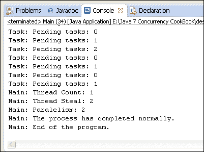
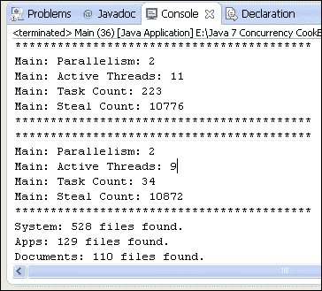
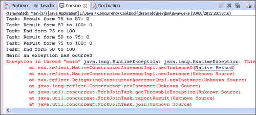
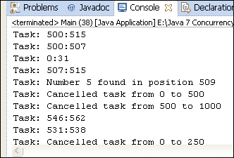

# 第五章。Fork/Join 框架

在本章中，我们将涵盖：

+   创建 Fork/Join 池

+   合并任务的结果

+   异步运行任务

+   在任务中抛出异常

+   取消任务

# 介绍

通常，当您实现一个简单的并发 Java 应用程序时，您实现一些`Runnable`对象，然后相应的`Thread`对象。您在程序中控制这些线程的创建、执行和状态。Java 5 通过`Executor`和`ExecutorService`接口以及实现它们的类（例如`ThreadPoolExecutor`类）引入了改进。

Executor 框架将任务的创建和执行分开。您只需实现`Runnable`对象并使用`Executor`对象。您将`Runnable`任务发送到执行程序，它将创建、管理和完成执行这些任务所需的线程。

Java 7 更进一步，并包括了`ExecutorService`接口的另一个针对特定问题的实现。这就是**Fork/Join 框架**。

该框架旨在使用分而治之的技术解决可以分解为较小任务的问题。在任务内部，您检查要解决的问题的大小，如果大于已确定的大小，则将其分解为较小的任务，使用框架执行。如果问题的大小小于已确定的大小，则直接在任务中解决问题，然后可选择地返回结果。以下图表总结了这个概念：


没有公式可以确定问题的参考大小，以确定是否对任务进行细分，这取决于其特性。您可以使用任务中要处理的元素数量和执行时间的估计来确定参考大小。测试不同的参考大小以选择最适合您问题的大小。您可以将`ForkJoinPool`视为一种特殊的`Executor`。

该框架基于以下两个操作：

+   **fork**操作：当您将任务分解为较小的任务并使用框架执行它们时

+   **join**操作：当一个任务等待它创建的任务的完成时

Fork/Join 和 Executor 框架之间的主要区别是**工作窃取**算法。与 Executor 框架不同，当任务等待使用 join 操作创建的子任务的完成时，执行该任务的线程（称为**工作线程**）会寻找尚未执行的其他任务并开始执行。通过这种方式，线程充分利用其运行时间，从而提高应用程序的性能。

为了实现这个目标，Fork/Join 框架执行的任务有以下限制：

+   任务只能使用`fork()`和`join()`操作作为同步机制。如果它们使用其他同步机制，当它们处于同步操作时，工作线程无法执行其他任务。例如，如果您在 Fork/Join 框架中将任务休眠，执行该任务的工作线程在休眠时间内将不会执行另一个任务。

+   任务不应执行 I/O 操作，例如在文件中读取或写入数据。

+   任务不能抛出已检查异常。它必须包含处理它们所需的代码。

Fork/Join 框架的核心由以下两个类组成：

+   `ForkJoinPool`：它实现了`ExecutorService`接口和工作窃取算法。它管理工作线程并提供有关任务状态和执行的信息。

+   `ForkJoinTask`：这是在`ForkJoinPool`中执行的任务的基类。它提供了在任务内执行`fork()`和`join()`操作的机制，以及控制任务状态的方法。通常，为了实现你的 Fork/Join 任务，你将实现这个类的两个子类的子类：`RecursiveAction`用于没有返回结果的任务，`RecursiveTask`用于返回一个结果的任务。

本章介绍了五个示例，向你展示如何有效地使用 Fork/Join 框架。

# 创建一个 Fork/Join 池

在这个示例中，你将学习如何使用 Fork/Join 框架的基本元素。这包括：

+   创建一个`ForkJoinPool`对象来执行任务

+   创建一个`ForkJoinTask`的子类在池中执行

你将在这个示例中使用 Fork/Join 框架的主要特性如下：

+   你将使用默认构造函数创建`ForkJoinPool`。

+   在任务内部，你将使用 Java API 文档推荐的结构：

```java
If (problem size > default size){
  tasks=divide(task);
  execute(tasks);
} else {
  resolve problem using another algorithm;
}
```

+   你将以同步的方式执行任务。当一个任务执行两个或更多子任务时，它会等待它们的完成。这样，执行该任务的线程（称为工作线程）将寻找其他任务来执行，充分利用它们的执行时间。

+   你要实现的任务不会返回任何结果，所以你将以`RecursiveAction`类作为它们实现的基类。

## 准备工作

这个示例已经使用 Eclipse IDE 实现。如果你使用 Eclipse 或其他 IDE，比如 NetBeans，打开它并创建一个新的 Java 项目。

## 如何做... 

在这个示例中，你将实现一个任务来更新产品列表的价格。最初的任务将负责更新列表中的所有元素。你将使用大小为 10 作为参考大小，所以如果一个任务需要更新超过 10 个元素，它会将分配给它的列表部分分成两部分，并创建两个任务来更新各自部分的产品价格。

按照以下步骤实现示例：

1.  创建一个名为`Product`的类，它将存储产品的名称和价格。

```java
public class Product {
```

1.  声明一个名为`name`的私有`String`属性和一个名为`price`的私有`double`属性。

```java
  private String name;
  private double price;
```

1.  实现两个方法并确定两个属性的值。

```java
  public String getName() {
    return name;
  }

  public void setName(String name) {
    this.name = name;
  }

  public double getPrice() {
    return price;
  }

  public void setPrice(double price) {
    this.price = price;
  }
```

1.  创建一个名为`ProductListGenerator`的类来生成一个随机产品列表。

```java
public class ProductListGenerator {
```

1.  实现`generate()`方法。它接收一个`int`参数作为列表的大小，并返回一个带有生成产品列表的`List<Product>`对象。

```java
  public List<Product> generate (int size) {
```

1.  创建返回产品列表的对象。

```java
    List<Product> ret=new ArrayList<Product>();
```

1.  生成产品列表。为所有产品分配相同的价格，例如 10，以检查程序是否正常工作。

```java
    for (int i=0; i<size; i++){
      Product product=new Product();
      product.setName("Product "+i);
      product.setPrice(10);
      ret.add(product);
    }
    return ret;
  }
```

1.  创建一个名为`Task`的类。指定它扩展`RecursiveAction`类。

```java
public class Task extends RecursiveAction {
```

1.  声明类的序列版本 UID。这个元素是必要的，因为`RecursiveAction`类的父类`ForkJoinTask`类实现了`Serializable`接口。

```java
  private static final long serialVersionUID = 1L;
```

1.  声明一个名为`products`的私有`List<Product>`属性。

```java
  private List<Product> products;
```

1.  声明两个私有的`int`属性，名为`first`和`last`。这些属性将确定该任务需要处理的产品块。

```java
  private int first;
  private int last;
```

1.  声明一个名为`increment`的私有`double`属性来存储产品价格的增量。

```java
  private double increment;
```

1.  实现类的构造函数，初始化类的所有属性。

```java
  public Task (List<Product> products, int first, int last, double increment) {
    this.products=products;
    this.first=first;
    this.last=last;
    this.increment=increment;
  }
```

1.  实现`compute()`方法来实现任务的逻辑。

```java
  @Override
  protected void compute() {
```

1.  如果`last`和`first`属性的差小于 10（任务必须更新少于 10 个产品的价格），使用`updatePrices()`方法增加该产品集的价格。

```java
    if (last-first<10) {
      updatePrices();
```

1.  如果`last`和`first`属性之间的差大于或等于 10，创建两个新的`Task`对象，一个用于处理产品的前一半，另一个用于处理产品的后一半，并使用`invokeAll()`方法在`ForkJoinPool`中执行它们。

```java
    } else {
      int middle=(last+first)/2;
      System.out.printf("Task: Pending tasks: %s\n",getQueuedTaskCount());
      Task t1=new Task(products, first,middle+1, increment);
      Task t2=new Task(products, middle+1,last, increment);
      invokeAll(t1, t2);  
    }
```

1.  实现`updatePrices()`方法。该方法更新产品列表中`first`和`last`属性值之间的位置上的产品。

```java
  private void updatePrices() {
    for (int i=first; i<last; i++){
      Product product=products.get(i);
      product.setPrice(product.getPrice()*(1+increment));
    }
  }
```

1.  通过创建一个名为`Main`的类并在其中添加`main()`方法来实现示例的主类。

```java
public class Main {
  public static void main(String[] args) {
```

1.  使用`ProductListGenerator`类创建一个包含 10,000 个产品的列表。

```java
    ProductListGenerator generator=new ProductListGenerator();
    List<Product> products=generator.generate(10000);
```

1.  创建一个新的`Task`对象来更新产品列表中所有产品的价格。参数`first`取值为`0`，`last`参数取值为`10,000`（产品列表的大小）。

```java
      Task task=new Task(products, 0, products.size(), 0.20);
```

1.  使用无参数的构造函数创建一个`ForkJoinPool`对象。

```java
    ForkJoinPool pool=new ForkJoinPool();
```

1.  使用`execute()`方法在池中执行任务。

```java
    pool.execute(task);
```

1.  实现一个代码块，每隔五毫秒显示池的演变信息，将池的一些参数值写入控制台，直到任务完成执行。

```java
    do {
      System.out.printf("Main: Thread Count: %d\n",pool.getActiveThreadCount());
      System.out.printf("Main: Thread Steal: %d\n",pool.getStealCount());
      System.out.printf("Main: Parallelism: %d\n",pool.getParallelism());
      try {
        TimeUnit.MILLISECONDS.sleep(5);
      } catch (InterruptedException e) {
        e.printStackTrace();
      }
    } while (!task.isDone());
```

1.  使用`shutdown()`方法关闭池。

```java
    pool.shutdown();
```

1.  使用`isCompletedNormally()`方法检查任务是否已经正常完成，如果是，则向控制台写入一条消息。

```java
    if (task.isCompletedNormally()){
      System.out.printf("Main: The process has completed normally.\n");
    }
```

1.  增加后所有产品的预期价格为 12 美元。写出所有价格差为 12 的产品的名称和价格，以检查它们是否都正确地增加了价格。

```java
    for (int i=0; i<products.size(); i++){
      Product product=products.get(i);
      if (product.getPrice()!=12) {
        System.out.printf("Product %s: %f\n",product.getName(),product.getPrice());
      }
    }
```

1.  写一条消息指示程序的完成。

```java
    System.out.println("Main: End of the program.\n");
```

## 工作原理...

在这个示例中，您创建了一个`ForkJoinPool`对象和`ForkJoinTask`类的一个子类，然后在池中执行它。创建`ForkJoinPool`对象时，您使用了无参数的构造函数，因此它将以默认配置执行。它创建了一个线程数等于计算机处理器数量的池。当`ForkJoinPool`对象创建时，这些线程被创建，并且它们在池中等待直到一些任务到达执行。

由于`Task`类不返回结果，它继承了`RecursiveAction`类。在这个示例中，您已经使用了推荐的结构来实现任务。如果任务需要更新超过 10 个产品，它会将这些元素分成两个块，创建两个任务，并将一个块分配给每个任务。您已经在`Task`类中使用了`first`和`last`属性来知道该任务在产品列表中需要更新的位置范围。您已经使用了`first`和`last`属性，以便只使用产品列表的一个副本，而不是为每个任务创建不同的列表。

要执行任务创建的子任务，调用`invokeAll()`方法。这是一个同步调用，任务在继续（可能完成）执行之前等待子任务的完成。当任务等待其子任务时，执行它的工作线程会取出另一个等待执行的任务并执行它。通过这种行为，Fork/Join 框架比`Runnable`和`Callable`对象本身提供了更有效的任务管理。

`ForkJoinTask`类的`invokeAll()`方法是 Executor 和 Fork/Join 框架之间的主要区别之一。在 Executor 框架中，所有任务都必须发送到执行器，而在这种情况下，任务包括在池内执行和控制任务的方法。您已经在`Task`类中使用了`invokeAll()`方法，该类扩展了`RecursiveAction`类，后者又扩展了`ForkJoinTask`类。

您已经向池中发送了一个唯一的任务来更新所有产品列表，使用`execute()`方法。在这种情况下，这是一个异步调用，主线程继续执行。

你已经使用了`ForkJoinPool`类的一些方法来检查正在运行的任务的状态和进展。该类包括更多的方法，可以用于此目的。请参阅*监视 Fork/Join 池*中的完整方法列表。

最后，就像使用 Executor 框架一样，你应该使用`shutdown()`方法来结束`ForkJoinPool`。

以下截图显示了此示例的部分执行：



你可以看到任务完成它们的工作，产品价格更新。

## 还有更多...

`ForkJoinPool`类提供了其他方法来执行任务。这些方法如下：

+   `execute (Runnable task)`: 这是在示例中使用的`execute()`方法的另一个版本。在这种情况下，你将一个`Runnable`任务发送给`ForkJoinPool`类。请注意，`ForkJoinPool`类不会使用工作窃取算法处理`Runnable`对象。它只用于`ForkJoinTask`对象。

+   `invoke(ForkJoinTask<T> task)`: 虽然`execute()`方法在示例中对`ForkJoinPool`类进行了异步调用，但`invoke()`方法对`ForkJoinPool`类进行了同步调用。这个调用直到作为参数传递的任务完成执行才返回。

+   你还可以使用`ExecutorService`接口中声明的`invokeAll()`和`invokeAny()`方法。这些方法接收`Callable`对象作为参数。`ForkJoinPool`类不会使用工作窃取算法处理`Callable`对象，因此最好使用执行器来执行它们。

`ForkJoinTask`类还包括在示例中使用的`invokeAll()`方法的其他版本。这些版本如下：

+   `invokeAll(ForkJoinTask<?>... tasks)`: 这个方法的版本使用可变参数列表。你可以传递任意数量的`ForkJoinTask`对象作为参数。

+   `invokeAll(Collection<T> tasks)`: 这个方法的版本接受一个泛型类型`T`的对象集合（例如`ArrayList`对象、`LinkedList`对象或`TreeSet`对象）。这个泛型类型`T`必须是`ForkJoinTask`类或它的子类。

虽然`ForkJoinPool`类设计用于执行`ForkJoinTask`对象，但你也可以直接执行`Runnable`和`Callable`对象。你还可以使用`ForkJoinTask`类的`adapt()`方法，该方法接受一个`Callable`对象或`Runnable`对象，并返回一个`ForkJoinTask`对象来执行该任务。

## 另请参阅

+   在第八章的*监视 Fork/Join 池*中

# 合并任务的结果

Fork/Join 框架提供了执行返回结果的任务的能力。这些任务由`RecursiveTask`类实现。这个类扩展了`ForkJoinTask`类，并实现了 Executor 框架提供的`Future`接口。

在任务内部，你必须使用 Java API 文档推荐的结构：

```java
If (problem size > size){
  tasks=Divide(task);
  execute(tasks);
  groupResults()
  return result;
} else {
  resolve problem;
  return result;
}
```

如果任务需要解决的问题比预定义的大小更大，你可以将问题分解为更多的子任务，并使用 Fork/Join 框架执行这些子任务。当它们完成执行时，发起任务获取所有子任务生成的结果，对它们进行分组，并返回最终结果。最终，当池中执行的发起任务完成执行时，你获得它的结果，这实际上是整个问题的最终结果。

在这个示例中，你将学习如何使用 Fork/Join 框架解决问题，开发一个在文档中查找单词的应用程序。你将实现以下两种任务：

+   一个文档任务，用于在文档的一组行中搜索单词

+   一行任务，用于在文档的一部分中搜索单词

所有任务将返回它们处理的文档或行中单词出现的次数。

## 如何做...

按照以下步骤实现示例：

1.  创建一个名为`Document`的类。它将生成一个模拟文档的字符串矩阵。

```java
public class Document {
```

1.  创建一个包含一些单词的字符串数组。这个数组将在生成字符串矩阵时使用。

```java
private String words[]={"the","hello","goodbye","packt", "java","thread","pool","random","class","main"};
```

1.  实现`generateDocument()`方法。它接收行数、每行单词数和示例将要查找的单词作为参数。它返回一个字符串矩阵。

```java
  public String[][] generateDocument(int numLines, int numWords, String word){
```

1.  首先，创建必要的对象来生成文档：`String`矩阵和一个`Random`对象来生成随机数。

```java
    int counter=0;
    String document[][]=new String[numLines][numWords];
    Random random=new Random();
```

1.  用字符串填充数组。在每个位置存储数组中随机位置的字符串，并计算程序将在生成的数组中查找的单词出现的次数。您可以使用这个值来检查程序是否正确执行其任务。

```java
    for (int i=0; i<numLines; i++){
      for (int j=0; j<numWords; j++) {
        int index=random.nextInt(words.length);
        document[i][j]=words[index];
        if (document[i][j].equals(word)){
          counter++;
        }
      }
    }
```

1.  编写一条消息，其中包含单词出现的次数，并返回生成的矩阵。

```java
    System.out.println("DocumentMock: The word appears "+ counter+" times in the document");
    return document;
```

1.  创建一个名为`DocumentTask`的类，并指定它扩展了参数为`Integer`类的`RecursiveTask`类。这个类将实现计算一组行中单词出现次数的任务。

```java
public class DocumentTask extends RecursiveTask<Integer> {
```

1.  声明一个私有的`String`矩阵，名为`document`，和两个私有的`int`属性，名为`start`和`end`。还声明一个私有的`String`属性，名为`word`。

```java
  private String document[][];
  private int start, end;
  private String word;
```

1.  实现类的构造函数以初始化所有属性。

```java
  public DocumentTask (String document[][], int start, int end, String word){
    this.document=document;
    this.start=start;
    this.end=end;
    this.word=word;
  }
```

1.  实现`compute()`方法。如果`end`和`start`属性之间的差小于 10，任务将调用`processLines()`方法计算这些位置之间行中单词出现的次数。

```java
  @Override
  protected Integer compute() {
      int result;
    if (end-start<10){
      result=processLines(document, start, end, word);
```

1.  否则，将行组分成两个对象，创建两个新的`DocumentTask`对象来处理这两组，并使用`invokeAll()`方法在池中执行它们。

```java
    } else {
      int mid=(start+end)/2;
      DocumentTask task1=new DocumentTask(document,start,mid,word);
      DocumentTask task2=new DocumentTask(document,mid,end,word);
      invokeAll(task1,task2);
```

1.  然后，使用`groupResults()`方法添加两个任务返回的值。最后，返回任务计算的结果。

```java
      try {
        result=groupResults(task1.get(),task2.get());
      } catch (InterruptedException | ExecutionException e) {
        e.printStackTrace();
      }
    }
    return result;
```

1.  实现`processLines()`方法。它接收字符串矩阵、`start`属性、`end`属性和`word`属性作为参数，任务是搜索的单词。

```java
  private Integer processLines(String[][] document, int start, int end,String word) {
```

1.  对于任务需要处理的每一行，创建一个`LineTask`对象来处理整行，并将它们存储在任务列表中。

```java
    List<LineTask> tasks=new ArrayList<LineTask>();  
    for (int i=start; i<end; i++){
      LineTask task=new LineTask(document[i], 0, document[i].length, word);
      tasks.add(task);
    }
```

1.  使用`invokeAll()`方法执行列表中的所有任务。

```java
    invokeAll(tasks);
```

1.  将所有这些任务返回的值相加，并返回结果。

```java
    int result=0;
    for (int i=0; i<tasks.size(); i++) {
      LineTask task=tasks.get(i);
      try {
        result=result+task.get();
      } catch (InterruptedException | ExecutionException e) {
        e.printStackTrace();
      }
    }
    return new Integer(result);
```

1.  实现`groupResults()`方法。它将两个数字相加并返回结果。

```java
  private Integer groupResults(Integer number1, Integer number2) {
    Integer result;
    result=number1+number2;
    return result;
  }
```

1.  创建一个名为`LineTask`的类，并指定它扩展了参数为`Integer`类的`RecursiveTask`类。这个类将实现计算一行中单词出现次数的任务。

```java
public class LineTask extends RecursiveTask<Integer>{
```

1.  声明类的序列化版本 UID。这个元素是必要的，因为`RecursiveTask`类的父类`ForkJoinTask`类实现了`Serializable`接口。声明一个私有的`String`数组属性，名为`line`，和两个私有的`int`属性，名为`start`和`end`。最后，声明一个私有的`String`属性，名为`word`。

```java
  private static final long serialVersionUID = 1L;
  private String line[];
  private int start, end;
  private String word;
```

1.  实现类的构造函数以初始化所有属性。

```java
  public LineTask(String line[], int start, int end, String word) {
    this.line=line;
    this.start=start;
    this.end=end;
    this.word=word;
  }
```

1.  实现类的`compute()`方法。如果`end`和`start`属性之间的差小于 100，任务将使用`count()`方法在由`start`和`end`属性确定的行片段中搜索单词。

```java
  @Override
  protected Integer compute() {
    Integer result=null;
    if (end-start<100) {
      result=count(line, start, end, word);
```

1.  否则，将行中的单词组分成两部分，创建两个新的`LineTask`对象来处理这两组，并使用`invokeAll()`方法在池中执行它们。

```java
    } else {
      int mid=(start+end)/2;
      LineTask task1=new LineTask(line, start, mid, word);
      LineTask task2=new LineTask(line, mid, end, word);
      invokeAll(task1, task2);
```

1.  然后，使用`groupResults()`方法添加两个任务返回的值。最后，返回任务计算的结果。

```java
      try {
        result=groupResults(task1.get(),task2.get());
      } catch (InterruptedException | ExecutionException e) {
        e.printStackTrace();
      }
    }
    return result;
```

1.  实现`count()`方法。它接收完整行的字符串数组，`star`属性，`end`属性和作为参数搜索任务的`word`属性。

```java
  private Integer count(String[] line, int start, int end, String word) {
```

1.  将存储在`start`和`end`属性之间位置的单词与任务正在搜索的`word`属性进行比较，如果它们相等，则增加一个`counter`变量。

```java
    int counter;
    counter=0;
    for (int i=start; i<end; i++){
      if (line[i].equals(word)){
        counter++;
      }
    }
```

1.  为了减慢示例的执行，让任务休眠 10 毫秒。

```java
    try {
      Thread.sleep(10);
    } catch (InterruptedException e) {
      e.printStackTrace();
    }
```

1.  返回`counter`变量的值。

```java
    return counter;
```

1.  实现`groupResults()`方法。它将两个数字相加并返回结果。

```java
  private Integer groupResults(Integer number1, Integer number2) {
    Integer result;
    result=number1+number2;
    return result;
  }
```

1.  通过创建一个名为`Main`的类并实现一个`main()`方法来实现示例的主类。

```java
public class Main{
  public static void main(String[] args) {
```

1.  使用`DocumentMock`类创建一个包含 100 行和每行 1,000 个单词的`Document`。

```java
    DocumentMock mock=new DocumentMock();
    String[][] document=mock.generateDocument(100, 1000, "the");
```

1.  创建一个新的`DocumentTask`对象来更新整个文档的产品。参数`start`取值`0`，`end`参数取值`100`。

```java
    DocumentTask task=new DocumentTask(document, 0, 100, "the");
```

1.  使用不带参数的构造函数创建一个`ForkJoinPool`对象，并使用`execute()`方法在池中执行任务。

```java
    ForkJoinPool pool=new ForkJoinPool();
    pool.execute(task);
```

1.  实现一段代码块，每秒向控制台写入池的一些参数值，直到任务完成执行为止，显示有关池进度的信息。

```java
    do {
      System.out.printf("******************************************\n");
      System.out.printf("Main: Parallelism: %d\n",pool.getParallelism());
      System.out.printf("Main: Active Threads: %d\n",pool.getActiveThreadCount());
      System.out.printf("Main: Task Count: %d\n",pool.getQueuedTaskCount());
      System.out.printf("Main: Steal Count: %d\n",pool.getStealCount());
      System.out.printf("******************************************\n");
      try {
        TimeUnit.SECONDS.sleep(1);
      } catch (InterruptedException e) {
        e.printStackTrace();
      }
    } while (!task.isDone());
```

1.  使用`shutdown()`方法关闭池。

```java
    pool.shutdown();
```

1.  使用`awaitTermination()`方法等待任务的完成。

```java
    try {
      pool.awaitTermination(1, TimeUnit.DAYS);
    } catch (InterruptedException e) {
      e.printStackTrace();
    }
```

1.  写下单词在文档中出现的次数。检查这个数字是否与`DocumentMock`类写的数字相同。

```java
    try {
      System.out.printf("Main: The word appears %d in the document",task.get());
    } catch (InterruptedException | ExecutionException e) {
      e.printStackTrace();
    }
```

## 它是如何工作的...

在这个例子中，您实现了两个不同的任务：

+   `DocumentTask`类：这个类的任务是处理由`start`和`end`属性确定的文档行集合。如果这组行的大小小于 10，它为每行创建一个`LineTask`，当它们完成执行时，它将这些任务的结果相加并返回总和的结果。如果任务必须处理的行集合大小为 10 或更大，它将这个集合分成两部分，并创建两个`DocumentTask`对象来处理这些新集合。当这些任务完成执行时，任务将它们的结果相加并返回该总和作为结果。

+   `LineTask`类：这个类的任务是处理文档行的一组单词。如果这组单词小于 100，任务直接在这组单词中搜索单词并返回单词出现的次数。否则，它将这组单词分成两部分，并创建两个`LineTask`对象来处理这些集合。当这些任务完成执行时，任务将两个任务的结果相加，并将该总和作为结果返回。

在`Main`类中，您使用默认构造函数创建了一个`ForkJoinPool`对象，并在其中执行了一个`DocumentTask`类，该类必须处理 100 行文档，每行 1,000 个单词。这个任务将使用其他`DocumentTask`对象和`LineTask`对象来分解问题，当所有任务完成执行时，您可以使用原始任务来获取整个文档中单词出现的总次数。由于任务返回一个结果，它们扩展了`RecursiveTask`类。

为了获得`Task`返回的结果，您使用了`get()`方法。这个方法在`RecursiveTask`类中声明。

当您执行程序时，您可以比较控制台中写的第一行和最后一行。第一行是在生成文档时计算单词出现次数，最后一行是由 Fork/Join 任务计算的相同数字。

## 还有更多...

`ForkJoinTask`类提供了另一个方法来完成任务的执行并返回结果，即`complete()`方法。此方法接受`RecursiveTask`类参数化中使用的类型的对象，并在调用`join()`方法时将该对象作为任务的结果返回。建议使用它来为异步任务提供结果。

由于`RecursiveTask`类实现了`Future`接口，因此`get()`方法还有另一个版本：

+   `get(long timeout, TimeUnit unit)`: 此版本的`get()`方法，如果任务的结果不可用，将等待指定的时间。如果指定的时间段过去，结果尚不可用，则该方法返回`null`值。`TimeUnit`类是一个枚举，具有以下常量：`DAYS`，`HOURS`，`MICROSECONDS`，`MILLISECONDS`，`MINUTES`，`NANOSECONDS`和`SECONDS`。

## 另请参阅

+   在第五章的*创建 Fork/Join 池*配方中，*Fork/Join Framework*

+   在第八章的*监视 Fork/Join 池*配方中，*测试并发应用程序*

# 异步运行任务

当您在`ForkJoinPool`中执行`ForkJoinTask`时，可以以同步或异步方式执行。当以同步方式执行时，将任务发送到池的方法直到任务完成执行才返回。当以异步方式执行时，将任务发送到执行程序的方法立即返回，因此任务可以继续执行。

您应该注意两种方法之间的重大区别。当您使用同步方法时，调用其中一个方法的任务（例如`invokeAll()`方法）将被挂起，直到它发送到池的任务完成执行。这允许`ForkJoinPool`类使用工作窃取算法将新任务分配给执行休眠任务的工作线程。相反，当您使用异步方法（例如`fork()`方法）时，任务将继续执行，因此`ForkJoinPool`类无法使用工作窃取算法来提高应用程序的性能。在这种情况下，只有当您调用`join()`或`get()`方法等待任务的完成时，`ForkJoinPool`类才能使用该算法。

在本配方中，您将学习如何使用`ForkJoinPool`和`ForkJoinTask`类提供的异步方法来管理任务。您将实现一个程序，该程序将在文件夹及其子文件夹中搜索具有确定扩展名的文件。您要实现的`ForkJoinTask`类将处理文件夹的内容。对于该文件夹中的每个子文件夹，它将以异步方式向`ForkJoinPool`类发送一个新任务。对于该文件夹中的每个文件，任务将检查文件的扩展名，并将其添加到结果列表中（如果适用）。

## 如何做...

按照以下步骤实现示例：

1.  创建一个名为`FolderProcessor`的类，并指定它扩展了使用`List<String>`类型参数化的`RecursiveTask`类。

```java
public class FolderProcessor extends RecursiveTask<List<String>> {
```

1.  声明类的序列版本 UID。这个元素是必需的，因为`RecursiveTask`类的父类`ForkJoinTask`类实现了`Serializable`接口。

```java
  private static final long serialVersionUID = 1L;
```

1.  声明一个名为`path`的私有`String`属性。此属性将存储此任务要处理的文件夹的完整路径。

```java
  private String path;
```

1.  声明一个名为`extension`的私有`String`属性。此属性将存储此任务要查找的文件的扩展名。

```java
  private String extension;
```

1.  实现类的构造函数以初始化其属性。

```java
  public FolderProcessor (String path, String extension) {
    this.path=path;
    this.extension=extension;
  }
```

1.  实现`compute()`方法。由于您使用`List<String>`类型参数化了`RecursiveTask`类，因此此方法必须返回该类型的对象。

```java
  @Override
  protected List<String> compute() {
```

1.  声明一个`String`对象列表，用于存储存储在文件夹中的文件的名称。

```java
    List<String> list=new ArrayList<>();
```

1.  声明一个`FolderProcessor`任务列表，用于存储将处理存储在文件夹中的子文件夹的子任务。

```java
    List<FolderProcessor> tasks=new ArrayList<>();
```

1.  获取文件夹的内容。

```java
    File file=new File(path);
    File content[] = file.listFiles();
```

1.  对于文件夹中的每个元素，如果有子文件夹，则创建一个新的`FolderProcessor`对象，并使用`fork()`方法异步执行它。

```java
    if (content != null) {
      for (int i = 0; i < content.length; i++) {
        if (content[i].isDirectory()) {
          FolderProcessor task=new FolderProcessor(content[i].getAbsolutePath(), extension);
          task.fork();
          tasks.add(task);
```

1.  否则，使用`checkFile()`方法比较文件的扩展名与您要查找的扩展名，如果它们相等，则将文件的完整路径存储在先前声明的字符串列表中。

```java
        } else {
          if (checkFile(content[i].getName())){
            list.add(content[i].getAbsolutePath());
          }
        }
      }
```

1.  如果`FolderProcessor`子任务列表的元素超过 50 个，向控制台写入消息以指示此情况。

```java
      if (tasks.size()>50) {
        System.out.printf("%s: %d tasks ran.\n",file.getAbsolutePath(),tasks.size());
      }

```

1.  调用辅助方法`addResultsFromTask()`，该方法将由此任务启动的子任务返回的结果添加到文件列表中。将字符串列表和`FolderProcessor`子任务列表作为参数传递给它。

```java
      addResultsFromTasks(list,tasks);
```

1.  返回字符串列表。

```java
    return list;
```

1.  实现`addResultsFromTasks()`方法。对于存储在任务列表中的每个任务，调用`join()`方法等待其完成，然后将任务的结果使用`addAll()`方法添加到字符串列表中。

```java
  private void addResultsFromTasks(List<String> list,
      List<FolderProcessor> tasks) {
    for (FolderProcessor item: tasks) {
      list.addAll(item.join());
    }
  }
```

1.  实现`checkFile()`方法。该方法比较传递的文件名是否以你要查找的扩展名结尾。如果是，则该方法返回`true`值，否则返回`false`值。

```java
  private boolean checkFile(String name) {
     return name.endsWith(extension);
  }
```

1.  通过创建一个名为`Main`的类并实现一个`main()`方法来实现示例的主类。

```java
public class Main {
  public static void main(String[] args) {
```

1.  使用默认构造函数创建`ForkJoinPool`。

```java
    ForkJoinPool pool=new ForkJoinPool();
```

1.  创建三个`FolderProcessor`任务。使用不同的文件夹路径初始化每个任务。

```java
    FolderProcessor system=new FolderProcessor("C:\\Windows", "log");
    FolderProcessor apps=new 
FolderProcessor("C:\\Program Files","log");
    FolderProcessor documents=new FolderProcessor("C:\\Documents And Settings","log");
```

1.  使用`execute()`方法在池中执行三个任务。

```java
    pool.execute(system);
    pool.execute(apps);
    pool.execute(documents);
```

1.  每秒向控制台写入有关池状态的信息，直到三个任务完成执行。

```java
    do {
      System.out.printf("******************************************\n");
      System.out.printf("Main: Parallelism: %d\n",pool.getParallelism());
      System.out.printf("Main: Active Threads: %d\n",pool.getActiveThreadCount());
      System.out.printf("Main: Task Count: %d\n",pool.getQueuedTaskCount());
      System.out.printf("Main: Steal Count: %d\n",pool.getStealCount());
      System.out.printf("******************************************\n");
      try {
        TimeUnit.SECONDS.sleep(1);
      } catch (InterruptedException e) {
        e.printStackTrace();
      }
    } while ((!system.isDone())||(!apps.isDone())||(!documents.isDone()));
```

1.  使用`shutdown()`方法关闭`ForkJoinPool`。

```java
    pool.shutdown();
```

1.  将每个任务生成的结果数量写入控制台。

```java
    List<String> results;

    results=system.join();
    System.out.printf("System: %d files found.\n",results.size());

    results=apps.join();
    System.out.printf("Apps: %d files found.\n",results.size());

    results=documents.join();
    System.out.printf("Documents: %d files found.\n",results.size());
```

## 工作原理...

以下屏幕截图显示了此示例的部分执行：



这个示例的关键在于`FolderProcessor`类。每个任务处理文件夹的内容。正如您所知，此内容具有以下两种元素：

+   文件

+   其他文件夹

如果任务找到一个文件夹，它会创建另一个`Task`对象来处理该文件夹，并使用`fork()`方法将其发送到池中。该方法将任务发送到池中，如果有空闲的工作线程，它将执行该任务，或者它可以创建一个新的工作线程。该方法立即返回，因此任务可以继续处理文件夹的内容。对于每个文件，任务将其扩展名与要查找的扩展名进行比较，如果它们相等，则将文件名添加到结果列表中。

一旦任务处理了分配的文件夹的所有内容，它将等待通过`join()`方法发送到池中的所有任务的完成。在任务中调用的此方法等待其执行的完成，并返回`compute()`方法返回的值。任务将其自己的结果与其发送的所有任务的结果分组，并将该列表作为`compute()`方法的返回值返回。

`ForkJoinPool`类还允许以异步方式执行任务。您已经使用`execute()`方法将三个初始任务发送到池中。在`Main`类中，您还使用`shutdown()`方法完成了池，并编写了有关正在其中运行的任务的状态和进展的信息。`ForkJoinPool`类包括更多对此有用的方法。请参阅*监视 Fork/Join 池*配方，以查看这些方法的完整列表。

## 还有更多...

在这个例子中，您已经使用`join()`方法等待任务的完成并获取它们的结果。您还可以使用`get()`方法的两个版本之一来实现这个目的：

+   `get()`：如果`ForkJoinTask`已经完成执行，此版本的`get()`方法将返回`compute()`方法返回的值，或者等待直到其完成。

+   `get(long timeout, TimeUnit unit)`：如果任务的结果不可用，此版本的`get()`方法将等待指定的时间。如果经过指定的时间段，结果仍然不可用，该方法将返回一个`null`值。`TimeUnit`类是一个枚举，具有以下常量：`DAYS`、`HOURS`、`MICROSECONDS`、`MILLISECONDS`、`MINUTES`、`NANOSECONDS`和`SECONDS`。

`get()`和`join()`方法之间有两个主要区别：

+   `join()`方法无法被中断。如果中断调用`join()`方法的线程，该方法将抛出`InterruptedException`异常。

+   `get()`方法将在任务抛出任何未检查的异常时返回`ExecutionException`异常，而`join()`方法将返回`RuntimeException`异常。

## 另请参阅

+   在第五章的*创建 Fork/Join 池*配方中，*Fork/Join Framework*

+   在第八章的*监视 Fork/Join 池*配方中，*测试并发应用*

# 在任务中抛出异常

Java 中有两种异常：

+   **已检查的异常**：这些异常必须在方法的`throws`子句中指定，或者在其中捕获。例如，`IOException`或`ClassNotFoundException`。

+   **未检查的异常**：这些异常不需要被指定或捕获。例如，`NumberFormatException`。

您不能在`ForkJoinTask`类的`compute()`方法中抛出任何已检查的异常，因为该方法在其实现中不包括任何 throws 声明。您必须包含必要的代码来处理异常。另一方面，您可以抛出（或者可以由方法或方法内部使用的对象抛出）未检查的异常。`ForkJoinTask`和`ForkJoinPool`类的行为与您可能期望的不同。程序不会完成执行，您也不会在控制台上看到有关异常的任何信息。它会被简单地吞没，就好像它没有被抛出一样。但是，您可以使用`ForkJoinTask`类的一些方法来了解任务是否抛出了异常以及异常的类型。在本配方中，您将学习如何获取这些信息。

## 准备工作

这个示例是使用 Eclipse IDE 实现的。如果您使用 Eclipse 或其他 IDE，如 NetBeans，请打开它并创建一个新的 Java 项目。

## 如何做...

按照以下步骤实现示例：

1.  创建一个名为`Task`的类。指定它实现了使用`Integer`类参数化的`RecursiveTask`类。

```java
public class Task extends RecursiveTask<Integer> {
```

1.  声明一个名为`array`的私有`int`数组。它将模拟您将在本示例中处理的数据数组。

```java
  private int array[];
```

1.  声明两个私有`int`属性，名为`start`和`end`。这些属性将确定该任务必须处理的数组元素。

```java
  private int start, end;
```

1.  实现初始化其属性的类的构造函数。

```java
  public Task(int array[], int start, int end){
    this.array=array;
    this.start=start;
    this.end=end;
  }
```

1.  实现任务的`compute()`方法。由于您使用`Integer`类对`RecursiveTask`类进行了参数化，因此该方法必须返回一个`Integer`对象。首先，在控制台上写入`start`和`end`属性的值。

```java
  @Override
  protected Integer compute() {
    System.out.printf("Task: Start from %d to %d\n",start,end); 
```

1.  如果该任务必须处理的元素块（由`start`和`end`属性确定）的大小小于 10，请检查数组中第四个位置（索引号为 3）的元素是否在该块中。如果是这样，抛出`RuntimeException`异常。然后，让任务休眠一秒钟。

```java
    if (end-start<10) {
      if ((3>start)&&(3<end)){
        throw new RuntimeException("This task throws an"+ "Exception: Task from  "+start+" to "+end);
      }      
      try {
        TimeUnit.SECONDS.sleep(1);
      } catch (InterruptedException e) {
        e.printStackTrace();
      }
```

1.  否则（此任务需要处理的元素块的大小为 10 或更大），将元素块分成两部分，创建两个`Task`对象来处理这些块，并使用`invokeAll()`方法在池中执行它们。

```java
    } else {
      int mid=(end+start)/2;
      Task task1=new Task(array,start,mid);
      Task task2=new Task(array,mid,end);
      invokeAll(task1, task2);
    }
```

1.  向控制台写入一条消息，指示任务结束，并写入`start`和`end`属性的值。

```java
    System.out.printf("Task: End form %d to %d\n",start,end);
```

1.  将数字`0`作为任务的结果返回。

```java
    return 0;
```

1.  通过创建一个名为`Main`的类并创建一个`main()`方法来实现示例的主类。

```java
public class Main {
  public static void main(String[] args) {
```

1.  创建一个包含 100 个整数的数组。

```java
    int array[]=new int[100];
```

1.  创建一个`Task`对象来处理该数组。

```java
    Task task=new Task(array,0,100);
```

1.  使用默认构造函数创建一个`ForkJoinPool`对象。

```java
    ForkJoinPool pool=new ForkJoinPool();
```

1.  使用`execute()`方法在池中执行任务。

```java
    pool.execute(task);
```

1.  使用`shutdown()`方法关闭`ForkJoinPool`类。

```java
    pool.shutdown();
```

1.  使用`awaitTermination()`方法等待任务的完成。由于您希望等待任务的完成时间长达多久，因此将值`1`和`TimeUnit.DAYS`作为参数传递给此方法。

```java
    try {
      pool.awaitTermination(1, TimeUnit.DAYS);
    } catch (InterruptedException e) {
      e.printStackTrace();
    }
```

1.  使用`isCompletedAbnormally()`方法检查任务或其子任务是否抛出异常。在这种情况下，使用`ForkJoinTask`类的`getException()`方法向控制台写入带有抛出的异常的消息。获取该异常。

```java
    if (task.isCompletedAbnormally()) {
      System.out.printf("Main: An exception has ocurred\n");
      System.out.printf("Main: %s\n",task.getException());
    }
    System.out.printf("Main: Result: %d",task.join());
```

## 它是如何工作的...

在这个示例中，您实现的`Task`类处理一个数字数组。它检查它需要处理的数字块是否有 10 个或更多元素。在这种情况下，它将块分成两部分，并创建两个新的`Task`对象来处理这些块。否则，它会查找数组的第四个位置（索引号为 3）的元素。如果该元素在任务需要处理的块中，则会抛出`RuntimeException`异常。

当执行程序时，会抛出异常，但程序不会停止。在`Main`类中，您已经包含了对`ForkJoinTask`类的`isCompletedAbnormally()`方法的调用，使用原始任务。如果该任务或其子任务中的一个抛出异常，则此方法返回`true`。您还使用了相同对象的`getException()`方法来获取它抛出的`Exception`对象。

当您在任务中抛出一个未经检查的异常时，它也会影响其父任务（将其发送到`ForkJoinPool`类的任务）以及其父任务的父任务，依此类推。如果您审查程序的所有输出，您会发现某些任务的完成没有输出消息。这些任务的开始消息如下：

```java
Task: Starting form 0 to 100
Task: Starting form 0 to 50
Task: Starting form 0 to 25
Task: Starting form 0 to 12
Task: Starting form 0 to 6
```

这些任务是抛出异常的任务及其父任务。它们全部都以异常方式完成。在开发使用`ForkJoinPool`和`ForkJoinTask`对象的程序时，如果不希望出现这种行为，应考虑这一点。

以下屏幕截图显示了此示例的部分执行：



## 还有更多...

如果您使用`ForkJoinTask`类的`completeExceptionally()`方法而不是抛出异常，则可以获得与示例中相同的结果。代码将如下所示：

```java
Exception e=new Exception("This task throws an Exception: "+ "Task from  "+start+" to "+end);
completeExceptionally(e);
```

## 另请参阅

+   在第五章的*创建 Fork/Join 池*示例中，*Fork/Join Framework*

# 取消任务

当您在`ForkJoinPool`类中执行`ForkJoinTask`对象时，可以在它们开始执行之前取消它们。`ForkJoinTask`类提供了`cancel()`方法来实现此目的。当您想要取消一个任务时，有一些要考虑的要点，如下所示：

+   `ForkJoinPool`类没有提供任何方法来取消它正在运行或等待在池中的所有任务

+   当您取消一个任务时，不会取消该任务执行的任务

在本示例中，您将实现取消`ForkJoinTask`对象的示例。您将在数组中查找一个数字的位置。找到数字的第一个任务将取消其余任务。由于 Fork/Join 框架没有提供此功能，您将实现一个辅助类来执行此取消操作。

## 准备就绪...

本示例已使用 Eclipse IDE 实现。如果您使用 Eclipse 或其他 IDE NetBeans，请打开它并创建一个新的 Java 项目

## 如何做...

按照以下步骤实现示例：

1.  创建一个名为`ArrayGenerator`的类。该类将生成指定大小的随机整数数组。实现一个名为`generateArray()`的方法。它将生成数字数组。它接收数组的大小作为参数。

```java
public class ArrayGenerator {
  public int[] generateArray(int size) {
    int array[]=new int[size];
    Random random=new Random();
    for (int i=0; i<size; i++){
      array[i]=random.nextInt(10);
    }
    return array;
  }
```

1.  创建一个名为`TaskManager`的类。我们将使用这个类来存储在示例中使用的`ForkJoinPool`中执行的所有任务。由于`ForkJoinPool`和`ForkJoinTask`类的限制，您将使用此类来取消`ForkJoinPool`类的所有任务。

```java
public class TaskManager {
```

1.  声明一个参数化为`ForkJoinTask`类参数化为`Integer`类的对象列表，命名为`List`。

```java
  private List<ForkJoinTask<Integer>> tasks;
```

1.  实现类的构造函数。它初始化任务列表。

```java
  public TaskManager(){
    tasks=new ArrayList<>();
  }
```

1.  实现`addTask()`方法。它将一个`ForkJoinTask`对象添加到任务列表中。

```java
  public void addTask(ForkJoinTask<Integer> task){
    tasks.add(task);
  }
```

1.  实现`cancelTasks()`方法。它将使用`cancel()`方法取消列表中存储的所有`ForkJoinTask`对象。它接收一个要取消其余任务的`ForkJoinTask`对象作为参数。该方法取消所有任务。

```java
  public void cancelTasks(ForkJoinTask<Integer> cancelTask){
    for (ForkJoinTask<Integer> task  :tasks) {
      if (task!=cancelTask) {
        task.cancel(true);
        ((SearchNumberTask)task).writeCancelMessage();
      }
    }
  }
```

1.  实现`SearchNumberTask`类。指定它扩展了参数化为`Integer`类的`RecursiveTask`类。该类将在整数数组的元素块中查找一个数字。

```java
public class SearchNumberTask extends RecursiveTask<Integer> {
```

1.  声明一个名为`array`的私有`int`数字数组。

```java
  private int numbers[];
```

1.  声明两个私有的`int`属性，命名为`start`和`end`。这些属性将确定该任务需要处理的数组元素。

```java
  private int start, end;
```

1.  声明一个名为`number`的私有`int`属性，用于存储要查找的数字。

```java
  private int number;
```

1.  声明一个名为`manager`的私有`TaskManager`属性。您将使用此对象来取消所有任务。

```java
  private TaskManager manager;
```

1.  声明一个私有的`int`常量，并将其初始化为`-1`值。当任务找不到数字时，它将是任务的返回值。

```java
  private final static int NOT_FOUND=-1;
```

1.  实现类的构造函数以初始化其属性。

```java
  public Task(int numbers[], int start, int end, int number, TaskManager manager){
    this.numbers=numbers;
    this.start=start;
    this.end=end;
    this.number=number;
    this.manager=manager;
  }
```

1.  实现`compute()`方法。开始方法时，向控制台写入一条消息，指示`start`和`end`属性的值。

```java
  @Override
  protected Integer compute() {
    System.out.println("Task: "+start+":"+end);
```

1.  如果`start`和`end`属性之间的差异大于 10（任务需要处理数组的元素超过 10 个），则调用`launchTasks()`方法将该任务的工作分成两个子任务。

```java
    int ret;
    if (end-start>10) {
      ret=launchTasks();
```

1.  否则，在调用`lookForNumber()`方法的任务所处理的数组块中查找数字。

```java
    } else {
      ret=lookForNumber();
    }
```

1.  返回任务的结果。

```java
    return ret;
```

1.  实现`lookForNumber()`方法。

```java
  private int lookForNumber() {
```

1.  对于该任务需要处理的元素块中的所有元素，将存储在该元素中的值与要查找的数字进行比较。如果它们相等，向控制台写入一条消息，指示在这种情况下使用`TaskManager`对象的`cancelTasks()`方法来取消所有任务，并返回找到数字的元素位置。

```java
    for (int i=start; i<end; i++){
      if (array[i]==number) {
        System.out.printf("Task: Number %d found in position %d\n",number,i);
        manager.cancelTasks(this);
        return i;
      }
```

1.  在循环内，使任务休眠一秒钟。

```java
      try {
        TimeUnit.SECONDS.sleep(1);
      } catch (InterruptedException e) {
        e.printStackTrace();
      }
    }
```

1.  最后，返回`-1`值。

```java
    return NOT_FOUND;
  }
```

1.  实现`launchTasks()`方法。首先，将这些任务需要处理的数字块分成两部分，然后创建两个`Task`对象来处理它们。

```java
  private int launchTasks() {
    int mid=(start+end)/2;

    Task task1=new Task(array,start,mid,number,manager);
    Task task2=new Task(array,mid,end,number,manager);
```

1.  将任务添加到`TaskManager`对象。

```java
    manager.addTask(task1);
    manager.addTask(task2);
```

1.  使用`fork()`方法异步执行这两个任务。

```java
    task1.fork();
    task2.fork();
```

1.  等待任务完成并返回第一个任务的结果（如果不同，则返回`-1`），或第二个任务的结果。

```java
    int returnValue;

    returnValue=task1.join();
    if (returnValue!=-1) {
      return returnValue;
    }

    returnValue=task2.join();
    return returnValue;
```

1.  实现`writeCancelMessage()`方法，在任务被取消时写一条消息。

```java
  public void writeCancelMessage(){
    System.out.printf("Task: Canceled task from %d to %d",start,end);
  }
```

1.  通过创建一个名为`Main`的类和一个`main()`方法来实现示例的主类。

```java
public class Main {
  public static void main(String[] args) {
```

1.  使用`ArrayGenerator`类创建一个包含 1,000 个数字的数组。

```java
    ArrayGenerator generator=new ArrayGenerator();
    int array[]=generator.generateArray(1000);
```

1.  创建一个`TaskManager`对象。

```java
    TaskManager manager=new TaskManager();
```

1.  使用默认构造函数创建一个`ForkJoinPool`对象。

```java
    ForkJoinPool pool=new ForkJoinPool();
```

1.  创建一个`Task`对象来处理之前生成的数组。

```java
    Task task=new Task(array,0,1000,5,manager);
```

1.  使用`execute()`方法在池中异步执行任务。

```java
    pool.execute(task);
```

1.  使用`shutdown()`方法关闭池。

```java
    pool.shutdown();
```

1.  使用`ForkJoinPool`类的`awaitTermination()`方法等待任务的完成。

```java
    try {
      pool.awaitTermination(1, TimeUnit.DAYS);
    } catch (InterruptedException e) {
      e.printStackTrace();
    }
```

1.  在控制台上写一条消息，指示程序的结束。

```java
    System.out.printf("Main: The program has finished\n");
```

## 它是如何工作的...

`ForkJoinTask`类提供了`cancel()`方法，允许您在任务尚未执行时取消任务。这是一个非常重要的点。如果任务已经开始执行，调用`cancel()`方法将没有效果。该方法接收一个名为`mayInterruptIfRunning`的`Boolean`值作为参数。这个名字可能会让你觉得，如果你向方法传递`true`值，即使任务正在运行，任务也会被取消。Java API 文档指定，在`ForkJoinTask`类的默认实现中，这个属性没有效果。任务只有在尚未开始执行时才会被取消。取消任务对该任务发送到池中的任务没有影响。它们会继续执行。

Fork/Join 框架的一个限制是它不允许取消`ForkJoinPool`中的所有任务。为了克服这个限制，您已经实现了`TaskManager`类。它存储了所有发送到池中的任务。它有一个方法可以取消它存储的所有任务。如果一个任务无法取消，因为它正在运行或已经完成，`cancel()`方法会返回`false`值，因此您可以尝试取消所有任务而不必担心可能的副作用。

在示例中，您已经实现了一个任务，该任务在数字数组中查找一个数字。您按照 Fork/Join 框架的建议将问题分解为更小的子问题。您只对数字的一个出现感兴趣，所以当您找到它时，取消其他任务。

以下截图显示了此示例的部分执行：



## 另请参阅

+   在第五章的*创建 Fork/Join 池*配方中，*Fork/Join Framework*
