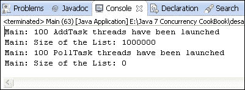
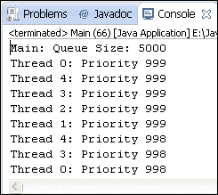
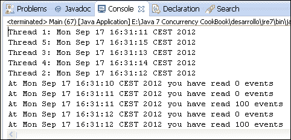
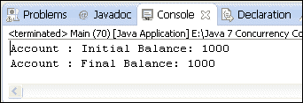

# 第六章。并发集合

在本章中，我们将涵盖：

+   使用非阻塞线程安全列表

+   使用阻塞线程安全列表

+   使用按优先级排序的阻塞线程安全列表

+   使用带延迟元素的线程安全列表

+   使用线程安全的可导航映射

+   生成并发随机数

+   使用原子变量

+   使用原子数组

# 介绍

**数据结构**是编程中的基本元素。几乎每个程序都使用一种或多种类型的数据结构来存储和管理它们的数据。Java API 提供了**Java 集合框架**，其中包含接口、类和算法，实现了许多不同的数据结构，您可以在程序中使用。

当您需要在并发程序中处理数据集合时，必须非常小心地选择实现。大多数集合类都不准备与并发应用程序一起工作，因为它们无法控制对其数据的并发访问。如果一些并发任务共享一个不准备与并发任务一起工作的数据结构，您可能会遇到数据不一致的错误，这将影响程序的正确运行。这种数据结构的一个例子是`ArrayList`类。

Java 提供了可以在并发程序中使用的数据集合，而不会出现任何问题或不一致。基本上，Java 提供了两种在并发应用程序中使用的集合：

+   **阻塞集合**：这种类型的集合包括添加和删除数据的操作。如果操作无法立即完成，因为集合已满或为空，进行调用的线程将被阻塞，直到操作可以完成。

+   **非阻塞集合**：这种类型的集合还包括添加和删除数据的操作。如果操作无法立即完成，操作将返回`null`值或抛出异常，但进行调用的线程不会被阻塞。

通过本章的示例，您将学习如何在并发应用程序中使用一些 Java 集合。这包括：

+   非阻塞列表，使用`ConcurrentLinkedDeque`类

+   使用`LinkedBlockingDeque`类的阻塞列表

+   使用`LinkedTransferQueue`类的阻塞列表与数据的生产者和消费者一起使用

+   通过`PriorityBlockingQueue`对其元素按优先级排序的阻塞列表

+   使用`DelayQueue`类的带延迟元素的阻塞列表

+   使用`ConcurrentSkipListMap`类的非阻塞可导航映射

+   随机数，使用`ThreadLocalRandom`类

+   原子变量，使用`AtomicLong`和`AtomicIntegerArray`类

# 使用非阻塞线程安全列表

最基本的集合是**列表**。列表具有不确定数量的元素，您可以在任何位置添加、读取或删除元素。并发列表允许各个线程同时在列表中添加或删除元素，而不会产生任何数据不一致。

在本示例中，您将学习如何在并发程序中使用非阻塞列表。非阻塞列表提供操作，如果操作无法立即完成（例如，您想获取列表的元素，而列表为空），它们会抛出异常或返回`null`值，具体取决于操作。Java 7 引入了实现非阻塞并发列表的`ConcurrentLinkedDeque`类。

我们将实现一个示例，其中包括以下两个不同的任务：

+   一个大量向列表中添加数据的任务

+   一个大量从同一列表中删除数据的任务

## 准备工作

本示例已使用 Eclipse IDE 实现。如果您使用 Eclipse 或其他 IDE（如 NetBeans），请打开它并创建一个新的 Java 项目。

## 如何做...

按照以下步骤实现示例：

1.  创建一个名为`AddTask`的类，并指定它实现`Runnable`接口。

```java
public class AddTask implements Runnable {
```

1.  声明一个参数为`String`类的私有`ConcurrentLinkedDeque`属性，命名为`list`。

```java
  private ConcurrentLinkedDeque<String> list;
```

1.  实现类的构造函数以初始化其属性。

```java
  public AddTask(ConcurrentLinkedDeque<String> list) {
    this.list=list;
  }
```

1.  实现类的`run()`方法。它将在列表中存储 10,000 个带有执行任务的线程名称和数字的字符串。

```java
   @Override
  public void run() {
    String name=Thread.currentThread().getName();
    for (int i=0; i<10000; i++){
      list.add(name+": Element "+i);
    }
  }
```

1.  创建一个名为`PollTask`的类，并指定它实现`Runnable`接口。

```java
public class PollTask implements Runnable {
```

1.  声明一个参数为`String`类的私有`ConcurrentLinkedDeque`属性，命名为`list`。

```java
  private ConcurrentLinkedDeque<String> list;
```

1.  实现类的构造函数以初始化其属性。

```java
  public PollTask(ConcurrentLinkedDeque<String> list) {
    this.list=list;
  }
```

1.  实现类的`run()`方法。它以 5,000 步的循环方式从列表中取出 10,000 个元素，每步取出两个元素。

```java
   @Override
  public void run() {
    for (int i=0; i<5000; i++) {
      list.pollFirst();
      list.pollLast();
    }
  }
```

1.  通过创建一个名为`Main`的类并添加`main()`方法来实现示例的主类。

```java
public class Main {

  public static void main(String[] args) {
```

1.  创建一个参数为`String`类的`ConcurrentLinkedDeque`对象，命名为`list`。

```java
    ConcurrentLinkedDeque<String> list=new ConcurrentLinkedDeque<>();
```

1.  创建一个包含 100 个`Thread`对象的数组，命名为`threads`。

```java
    Thread threads[]=new Thread[100];
```

1.  创建 100 个`AddTask`对象和一个线程来运行每个对象。将每个线程存储在之前创建的数组中，并启动这些线程。

```java
    for (int i=0; i<threads.length ; i++){
      AddTask task=new AddTask(list);
      threads[i]=new Thread(task);
      threads[i].start();
    }
    System.out.printf("Main: %d AddTask threads have been launched\n",threads.length);
```

1.  使用`join()`方法等待线程的完成。

```java
    for (int i=0; i<threads.length; i++) {
      try {
        threads[i].join();
      } catch (InterruptedException e) {
        e.printStackTrace();
      }
    }
```

1.  在控制台中写入列表的大小。

```java
    System.out.printf("Main: Size of the List: %d\n",list.size());
```

1.  创建 100 个`PollTask`对象和一个线程来运行每个对象。将每个线程存储在之前创建的数组中，并启动这些线程。

```java
    for (int i=0; i< threads.length; i++){
      PollTask task=new PollTask(list);
      threads[i]=new Thread(task);
      threads[i].start();
    }
    System.out.printf("Main: %d PollTask threads have been launched\n",threads.length);
```

1.  使用`join()`方法等待线程的完成。

```java
    for (int i=0; i<threads.length; i++) {
      try {
        threads[i].join();
      } catch (InterruptedException e) {
        e.printStackTrace();
      }
    }
```

1.  在控制台中写入列表的大小。

```java
    System.out.printf("Main: Size of the List: %d\n",list.size());
```

## 它是如何工作的...

在本示例中，我们使用了参数为`String`类的`ConcurrentLinkedDeque`对象来处理非阻塞并发数据列表。以下屏幕截图显示了此示例执行的输出：



首先，您已经执行了 100 个`AddTask`任务，向列表中添加元素。这些任务中的每一个都使用`add()`方法向列表中插入 10,000 个元素。此方法将新元素添加到列表的末尾。当所有这些任务都完成时，您已经在控制台中写入了列表的元素数量。此时，列表中有 1,000,000 个元素。

然后，您已经执行了 100 个`PollTask`任务来从列表中移除元素。这些任务中的每一个都使用`pollFirst()`和`pollLast()`方法从列表中移除 10,000 个元素。`pollFirst()`方法返回并移除列表的第一个元素，`pollLast()`方法返回并移除列表的最后一个元素。如果列表为空，这些方法返回一个`null`值。当所有这些任务都完成时，您已经在控制台中写入了列表的元素数量。此时，列表中没有元素。

要写入列表的元素数量，您已经使用了`size()`方法。您必须考虑到，这个方法可能会返回一个不真实的值，特别是在有线程向列表中添加或删除数据时。该方法必须遍历整个列表来计算元素的数量，列表的内容可能会因此操作而发生变化。只有在没有任何线程修改列表时使用它们，您才能保证返回的结果是正确的。

## 还有更多...

`ConcurrentLinkedDeque`类提供了更多的方法来从列表中获取元素：

+   `getFirst()`和`getLast()`：这些方法分别返回列表的第一个和最后一个元素。它们不会从列表中移除返回的元素。如果列表为空，这些方法会抛出一个`NoSuchElementExcpetion`异常。

+   `peek()`，`peekFirst()`和`peekLast()`：这些方法分别返回列表的第一个和最后一个元素。它们不会从列表中移除返回的元素。如果列表为空，这些方法返回一个`null`值。

+   `remove()`, `removeFirst()`, `removeLast()`: 这些方法分别返回列表的第一个和最后一个元素。它们会从列表中删除返回的元素。如果列表为空，这些方法会抛出`NoSuchElementException`异常。

# 使用阻塞线程安全列表

最基本的集合是列表。列表有不确定数量的元素，您可以从任何位置添加、读取或删除元素。并发列表允许多个线程同时添加或删除列表中的元素，而不会产生任何数据不一致性。

在本示例中，您将学习如何在并发程序中使用阻塞列表。阻塞列表和非阻塞列表之间的主要区别在于，阻塞列表具有用于插入和删除元素的方法，如果无法立即执行操作，因为列表已满或为空，它们将阻塞进行调用的线程，直到可以执行操作。Java 包括实现阻塞列表的`LinkedBlockingDeque`类。

您将实现一个示例，其中包括以下两个任务：

+   一个大规模地向列表中添加数据

+   一个大规模地从同一列表中删除数据

## 准备工作

本示例使用 Eclipse IDE 实现。如果您使用 Eclipse 或其他 IDE（如 NetBeans），请打开它并创建一个新的 Java 项目。

## 如何做...

按照下面描述的步骤来实现示例：

1.  创建一个名为`Client`的类，并指定它实现`Runnable`接口。

```java
public class Client implements Runnable{
```

1.  声明一个私有的`LinkedBlockingDeque`属性，命名为`requestList`，参数化为`String`类。

```java
  private LinkedBlockingDeque<String> requestList;
```

1.  实现类的构造函数以初始化其属性。

```java
  public Client (LinkedBlockingDeque<String> requestList) {
    this.requestList=requestList;
  }
```

1.  实现`run()`方法。使用`requestList`对象的`put()`方法每秒向列表中插入五个`String`对象。重复该循环三次。

```java
  @Override
  public void run() {
    for (int i=0; i<3; i++) {
      for (int j=0; j<5; j++) {
        StringBuilder request=new StringBuilder();
        request.append(i);
        request.append(":");
        request.append(j);
        try {
          requestList.put(request.toString());
        } catch (InterruptedException e) {
          e.printStackTrace();
        }
        System.out.printf("Client: %s at %s.\n",request,new Date());
      }
      try {
        TimeUnit.SECONDS.sleep(2);
      } catch (InterruptedException e) {
        e.printStackTrace();
      }
    }
    System.out.printf("Client: End.\n");
  }
```

1.  通过创建一个名为`Main`的类并向其中添加`main()`方法，创建示例的主类。

```java
public class Main {

  public static void main(String[] args) throws Exception {
```

1.  声明并创建`String`类命名为`list`的`LinkedBlockingDeque`。

```java
    LinkedBlockingDeque<String> list=new LinkedBlockingDeque<>(3);
```

1.  创建并启动一个`Thread`对象来执行客户端任务。

```java
    Client client=new Client(list);
    Thread thread=new Thread(client);
    thread.start();
```

1.  使用列表对象的`take()`方法每 300 毫秒获取列表的三个`String`对象。重复该循环五次。在控制台中写入字符串。

```java
    for (int i=0; i<5 ; i++) {
      for (int j=0; j<3; j++) {
        String request=list.take();
        System.out.printf("Main: Request: %s at %s. Size: %d\n",request,new Date(),list.size());
      }
      TimeUnit.MILLISECONDS.sleep(300);
    }
```

1.  编写一条消息以指示程序的结束。

```java
    System.out.printf("Main: End of the program.\n");
```

## 工作原理...

在本示例中，您已经使用了参数化为`String`类的`LinkedBlockingDeque`来处理非阻塞并发数据列表。

`Client`类使用`put()`方法向列表中插入字符串。如果列表已满（因为您使用固定容量创建了它），该方法将阻塞其线程的执行，直到列表中有空间。

`Main`类使用`take()`方法从列表中获取字符串。如果列表为空，该方法将阻塞其线程的执行，直到列表中有元素为止。

在本示例中使用的`LinkedBlockingDeque`类的两种方法，如果它们在被阻塞时被中断，可以抛出`InterruptedException`异常，因此您必须包含必要的代码来捕获该异常。

## 还有更多...

`LinkedBlockingDeque`类还提供了用于向列表中放置和获取元素的方法，而不是阻塞，它们会抛出异常或返回`null`值。这些方法包括：

+   `takeFirst()`和`takeLast()`: 这些方法分别返回列表的第一个和最后一个元素。它们会从列表中删除返回的元素。如果列表为空，这些方法会阻塞线程，直到列表中有元素。

+   `getFirst()`和`getLast()`: 这些方法分别返回列表中的第一个和最后一个元素。它们不会从列表中删除返回的元素。如果列表为空，这些方法会抛出`NoSuchElementExcpetion`异常。

+   `peek()`、`peekFirst()`和`peekLast()`：这些方法分别返回列表的第一个和最后一个元素。它们不会从列表中删除返回的元素。如果列表为空，这些方法返回一个`null`值。

+   `poll()`、`pollFirst()`和`pollLast()`：这些方法分别返回列表的第一个和最后一个元素。它们从列表中删除返回的元素。如果列表为空，这些方法返回一个`null`值。

+   `add()`、`addFirst()`、`addLast()`：这些方法分别在第一个和最后一个位置添加一个元素。如果列表已满（你使用固定容量创建了它），这些方法会抛出`IllegalStateException`异常。

## 另请参阅

+   第六章中的*使用非阻塞线程安全列表*配方，*并发集合*

# 使用按优先级排序的阻塞线程安全列表

在使用数据结构时，通常需要有一个有序列表。Java 提供了具有这种功能的`PriorityBlockingQueue`。

你想要添加到`PriorityBlockingQueue`中的所有元素都必须实现`Comparable`接口。这个接口有一个方法`compareTo()`，它接收一个相同类型的对象，所以你有两个对象可以比较：执行该方法的对象和作为参数接收的对象。如果本地对象小于参数，则该方法必须返回小于零的数字，如果本地对象大于参数，则返回大于零的数字，如果两个对象相等，则返回零。

当你向`PriorityBlockingQueue`中插入一个元素时，它会使用`compareTo()`方法来确定插入元素的位置。较大的元素将成为队列的尾部。

`PriorityBlockingQueue`的另一个重要特性是它是一个**阻塞数据结构**。它有一些方法，如果它们不能立即执行操作，就会阻塞线程，直到它们可以执行为止。

在这个示例中，你将学习如何使用`PriorityBlockingQueue`类来实现一个示例，其中你将在同一个列表中存储许多具有不同优先级的事件，以检查队列是否按照你的要求排序。

## 准备工作

这个示例使用 Eclipse IDE 实现。如果你使用 Eclipse 或其他 IDE，比如 NetBeans，打开它并创建一个新的 Java 项目。

## 如何做...

按照以下步骤实现示例：

1.  创建一个名为`Event`的类，并指定它实现了参数化为`Event`类的`Comparable`接口。

```java
public class Event implements Comparable<Event> {
```

1.  声明一个私有的`int`属性，命名为`thread`，用于存储创建事件的线程号。

```java
  private int thread;
```

1.  声明一个私有的`int`属性，命名为`priority`，用于存储事件的优先级。

```java
  private int priority;
```

1.  实现类的构造函数以初始化其属性。

```java
  public Event(int thread, int priority){
    this.thread=thread;
    this.priority=priority;
  }
```

1.  实现`getThread()`方法以返回线程属性的值。

```java
  public int getThread() {
    return thread;
  }
```

1.  实现`getPriority()`方法以返回优先级属性的值。

```java
  public int getPriority() {
    return priority;
  }
```

1.  实现`compareTo()`方法。它接收`Event`作为参数，并比较当前事件和接收的参数的优先级。如果当前事件的优先级较大，则返回`-1`，如果两个优先级相等，则返回`0`，如果当前事件的优先级较小，则返回`1`。请注意，这与大多数`Comparator.compareTo()`实现相反。

```java
@Override
  public int compareTo(Event e) {
    if (this.priority>e.getPriority()) {
      return -1;
    } else if (this.priority<e.getPriority()) {
      return 1; 
    } else {
      return 0;
    }
  }
```

1.  创建一个名为`Task`的类，并指定它实现了`Runnable`接口。

```java
public class Task implements Runnable {
```

1.  声明一个私有的`int`属性，命名为`id`，用于存储标识任务的编号。

```java
  private int id;
```

1.  声明一个私有的参数化为`Event`类的`PriorityBlockingQueue`属性，命名为`queue`，用于存储任务生成的事件。

```java
  private PriorityBlockingQueue<Event> queue;
```

1.  实现类的构造函数以初始化其属性。

```java
  public Task(int id, PriorityBlockingQueue<Event> queue) {
    this.id=id;
    this.queue=queue;
  }
```

1.  实现`run()`方法。它使用其 ID 将 1000 个事件存储在队列中，以标识创建事件的任务，并为它们分配一个递增的优先级数字。使用`add()`方法将事件存储在队列中。

```java
   @Override
  public void run() {
    for (int i=0; i<1000; i++){
      Event event=new Event(id,i);
      queue.add(event);
    }
  }
```

1.  通过创建一个名为`Main`的类并向其中添加`main()`方法来实现示例的主类。

```java
public class Main{
  public static void main(String[] args) {
```

1.  创建一个使用`Event`类参数化的`PriorityBlockingQueue`对象，命名为`queue`。

```java
    PriorityBlockingQueue<Event> queue=new PriorityBlockingQueue<>();
```

1.  创建一个包含五个`Thread`对象的数组，用于存储将执行五个任务的线程。

```java
    Thread taskThreads[]=new Thread[5];
```

1.  创建五个`Task`对象。将线程存储在先前创建的数组中。

```java
    for (int i=0; i<taskThreads.length; i++){
      Task task=new Task(i,queue);
      taskThreads[i]=new Thread(task);
    }
```

1.  启动先前创建的五个线程。

```java
    for (int i=0; i<taskThreads.length ; i++) {
      taskThreads[i].start();
    }
```

1.  使用`join()`方法等待五个线程的完成。

```java
    for (int i=0; i<taskThreads.length ; i++) {
      try {
        taskThreads[i].join();
      } catch (InterruptedException e) {
        e.printStackTrace();
      }
    }
```

1.  向控制台写入队列的实际大小和其中存储的事件。使用`poll()`方法从队列中取出事件。

```java
    System.out.printf("Main: Queue Size: %d\n",queue.size());
    for (int i=0; i<taskThreads.length*1000; i++){
      Event event=queue.poll();
      System.out.printf("Thread %s: Priority %d\n",event.getThread(),event.getPriority());
    }
```

1.  向控制台写入队列的最终大小的消息。

```java
    System.out.printf("Main: Queue Size: %d\n",queue.size());
    System.out.printf("Main: End of the program\n");
```

## 它是如何工作的...

在这个例子中，您已经使用`PriorityBlockingQueue`实现了一个`Event`对象的优先级队列。正如我们在介绍中提到的，存储在`PriorityBlockingQueue`中的所有元素都必须实现`Comparable`接口，因此您已经在 Event 类中实现了`compareTo()`方法。

所有事件都有一个优先级属性。具有更高优先级值的元素将成为队列中的第一个元素。当您实现了`compareTo()`方法时，如果执行该方法的事件具有比作为参数传递的事件的优先级更高的优先级，则返回`-1`作为结果。在另一种情况下，如果执行该方法的事件具有比作为参数传递的事件的优先级更低的优先级，则返回`1`作为结果。如果两个对象具有相同的优先级，则`compareTo()`方法返回`0`值。在这种情况下，`PriorityBlockingQueue`类不能保证元素的顺序。

我们已经实现了`Task`类，以将`Event`对象添加到优先级队列中。每个任务对象向队列中添加 1000 个事件，优先级在 0 到 999 之间，使用`add()`方法。

`Main`类的`main()`方法创建了五个`Task`对象，并在相应的线程中执行它们。当所有线程都完成执行时，您已经将所有元素写入控制台。为了从队列中获取元素，我们使用了`poll()`方法。该方法返回并删除队列中的第一个元素。

以下屏幕截图显示了程序执行的部分输出：



您可以看到队列有 5000 个元素，并且前几个元素具有最大的优先级值。

## 还有更多...

`PriorityBlockingQueue`类还有其他有趣的方法。以下是其中一些的描述：

+   `clear()`: 此方法删除队列的所有元素。

+   `take()`: 此方法返回并删除队列的第一个元素。如果队列为空，该方法将阻塞其线程，直到队列有元素。

+   `put(E``e)`: `E`是用于参数化`PriorityBlockingQueue`类的类。此方法将传递的元素插入队列。

+   `peek()`: 此方法返回队列的第一个元素，但不删除它。

## 另请参阅

+   第六章中的*使用阻塞线程安全列表*配方，*并发集合*

# 使用具有延迟元素的线程安全列表

Java API 提供的一个有趣的数据结构，您可以在并发应用程序中使用，是在`DelayedQueue`类中实现的。在这个类中，您可以存储具有激活日期的元素。返回或提取队列元素的方法将忽略那些数据在未来的元素。它们对这些方法是不可见的。

为了获得这种行为，您想要存储在`DelayedQueue`类中的元素必须实现`Delayed`接口。此接口允许您处理延迟对象，因此您将实现存储在`DelayedQueue`类中的对象的激活日期作为激活日期之间的剩余时间。此接口强制实现以下两种方法：

+   `compareTo(Delayed o)`：`Delayed`接口扩展了`Comparable`接口。如果执行该方法的对象的延迟小于作为参数传递的对象，则此方法将返回小于零的值；如果执行该方法的对象的延迟大于作为参数传递的对象，则返回大于零的值；如果两个对象的延迟相同，则返回零值。

+   `getDelay(TimeUnit unit)`：此方法必须返回直到指定单位的激活日期剩余的时间。`TimeUnit`类是一个枚举，具有以下常量：`DAYS`、`HOURS`、`MICROSECONDS`、`MILLISECONDS`、`MINUTES`、`NANOSECONDS`和`SECONDS`。

在此示例中，您将学习如何使用`DelayedQueue`类，其中存储了具有不同激活日期的一些事件。

## 准备工作

此示例已使用 Eclipse IDE 实现。如果您使用 Eclipse 或其他 IDE（如 NetBeans），请打开它并创建一个新的 Java 项目。

## 操作步骤...

按照以下步骤实现示例：

1.  创建一个名为`Event`的类，并指定它实现`Delayed`接口。

```java
public class Event implements Delayed {
```

1.  声明一个名为`startDate`的私有`Date`属性。

```java
  private Date startDate;
```

1.  实现类的构造函数以初始化其属性。

```java
  public Event (Date startDate) {
    this.startDate=startDate;
  }
```

1.  实现`compareTo()`方法。它接收一个`Delayed`对象作为参数。返回当前对象的延迟与传递的参数之间的差异。

```java
@Override
  public int compareTo(Delayed o) {
    long result=this.getDelay(TimeUnit.NANOSECONDS)-o.getDelay(TimeUnit.NANOSECONDS);
    if (result<0) {
      return -1;
    } else if (result>0) {
      return 1;
    }
    return 0;
  }
```

1.  实现`getDelay()`方法。以作为参数接收的`TimeUnit`返回对象的`startDate`和实际`Date`之间的差异。

```java
  public long getDelay(TimeUnit unit) {  
    Date now=new Date();
    long diff=startDate.getTime()-now.getTime();
    return unit.convert(diff,TimeUnit.MILLISECONDS);
  }
```

1.  创建一个名为`Task`的类，并指定它实现`Runnable`接口。

```java
public class Task implements Runnable {
```

1.  声明一个名为`id`的私有`int`属性，用于存储标识此任务的数字。

```java
  private int id;
```

1.  声明一个名为`queue`的私有参数化为`Event`类的`DelayQueue`属性。

```java
  private DelayQueue<Event> queue;
```

1.  实现类的构造函数以初始化其属性。

```java
  public Task(int id, DelayQueue<Event> queue) {
    this.id=id;
    this.queue=queue;
  }
```

1.  实现`run()`方法。首先，计算此任务将创建的事件的激活日期。将实际日期增加等于对象 ID 的秒数。

```java
@Override
  public void run() {
    Date now=new Date();
    Date delay=new Date();
    delay.setTime(now.getTime()+(id*1000));
    System.out.printf("Thread %s: %s\n",id,delay);
```

1.  使用`add()`方法将 100 个事件存储在队列中。

```java
    for (int i=0; i<100; i++) {
      Event event=new Event(delay);
      queue.add(event);
    }  
  }
```

1.  通过创建名为`Main`的类并向其添加`main()`方法来实现示例的主类。

```java
public class Main {
  public static void main(String[] args) throws Exception {
```

1.  创建一个参数化为`Event`类的`DelayedQueue`对象。

```java
    DelayQueue<Event> queue=new DelayQueue<>();
```

1.  创建一个包含五个`Thread`对象的数组，用于存储要执行的任务。

```java
    Thread threads[]=new Thread[5];
```

1.  创建五个具有不同 ID 的`Task`对象。

```java
    for (int i=0; i<threads.length; i++){
      Task task=new Task(i+1, queue);
      threads[i]=new Thread(task);
    }
```

1.  启动先前创建的所有五个任务。

```java
    for (int i=0; i<threads.length; i++) {
      threads[i].start();
    }
```

1.  使用`join()`方法等待线程的完成。

```java
    for (int i=0; i<threads.length; i++) {
      threads[i].join();
    }
```

1.  将存储在队列中的事件写入控制台。当队列的大小大于零时，使用`poll()`方法获取一个`Event`类。如果返回`null`，则将主线程等待 500 毫秒以等待更多事件的激活。

```java
    do {
      int counter=0;
      Event event;
      do {
        event=queue.poll();
        if (event!=null) counter++;
      } while (event!=null);
      System.out.printf("At %s you have read %d events\n",new Date(),counter);
      TimeUnit.MILLISECONDS.sleep(500);
    } while (queue.size()>0);
  }

}
```

## 它是如何工作的...

在此示例中，我们已经实现了`Event`类。该类具有一个唯一的属性，即事件的激活日期，并实现了`Delayed`接口，因此您可以将`Event`对象存储在`DelayedQueue`类中。

`getDelay()`方法返回激活日期和实际日期之间的纳秒数。这两个日期都是`Date`类的对象。您已经使用了`getTime()`方法，该方法返回转换为毫秒的日期，然后将该值转换为作为参数接收的`TimeUnit`。`DelayedQueue`类以纳秒为单位工作，但在这一点上，对您来说是透明的。

如果执行方法的对象的延迟小于作为参数传递的对象的延迟，则`compareTo()`方法返回小于零的值，如果执行方法的对象的延迟大于作为参数传递的对象的延迟，则返回大于零的值，并且如果两个延迟相等，则返回`0`值。

您还实现了`Task`类。此类具有名为`id`的`integer`属性。执行`Task`对象时，它将与任务的 ID 相等的秒数添加到实际日期，并且这是由此任务在`DelayedQueue`类中存储的事件的激活日期。每个`Task`对象使用`add()`方法在队列中存储 100 个事件。

最后，在`Main`类的`main()`方法中，您创建了五个`Task`对象并在相应的线程中执行它们。当这些线程完成执行时，您使用`poll()`方法将所有事件写入控制台。该方法检索并删除队列的第一个元素。如果队列没有任何活动元素，则该方法返回`null`值。您调用`poll()`方法，如果它返回一个`Event`类，则增加一个计数器。当`poll()`方法返回`null`值时，您将计数器的值写入控制台，并使线程休眠半秒钟以等待更多活动事件。当您获得队列中存储的 500 个事件时，程序的执行结束。

以下屏幕截图显示了程序执行的部分输出：



您可以看到程序在激活时仅获取 100 个事件。

### 注意

您必须非常小心使用`size()`方法。它返回包括活动和非活动元素的列表中的元素总数。

## 还有更多...

`DelayQueue`类还有其他有趣的方法，如下所示：

+   `clear()`: 此方法删除队列的所有元素。

+   `offer(E``e)`: `E`表示用于参数化`DelayQueue`类的类。此方法将作为参数传递的元素插入队列。

+   `peek()`: 此方法检索但不删除队列的第一个元素。

+   `take()`: 此方法检索并删除队列的第一个元素。如果队列中没有任何活动元素，则执行该方法的线程将被阻塞，直到线程有一些活动元素为止。

## 另请参阅

+   第六章中的*使用阻塞线程安全列表*食谱，*并发集合*

# 使用线程安全的可导航映射

Java API 提供的一个有趣的数据结构，您可以在并发程序中使用，由`ConcurrentNavigableMap`接口定义。实现`ConcurrentNavigableMap`接口的类在两个部分中存储元素：

+   **唯一标识元素的**键

+   定义元素的其余数据

每个部分必须在不同的类中实现。

Java API 还提供了一个实现该接口的类，即实现具有`ConcurrentNavigableMap`接口行为的非阻塞列表的`ConcurrentSkipListMap`接口。在内部，它使用**Skip List**来存储数据。跳表是一种基于并行列表的数据结构，允许我们获得类似于二叉树的效率。使用它，您可以获得一个排序的数据结构，其插入、搜索或删除元素的访问时间比排序列表更好。

### 注意

Skip List 由 William Pugh 于 1990 年引入。

当您在映射中插入元素时，它使用键对它们进行排序，因此所有元素都将被排序。该类还提供了一些方法来获取映射的子映射，以及返回具体元素的方法。

在本食谱中，您将学习如何使用`ConcurrentSkipListMap`类来实现联系人映射。

## 准备就绪

这个示例已经使用 Eclipse IDE 实现。如果你使用 Eclipse 或其他 IDE 如 NetBeans，打开它并创建一个新的 Java 项目。

## 如何做...

按照以下步骤实现示例：

1.  创建一个名为`Contact`的类。

```java
public class Contact {
```

1.  声明两个私有的`String`属性，命名为`name`和`phone`。

```java
  private String name;
  private String phone;
```

1.  实现类的构造函数以初始化其属性。

```java
  public Contact(String name, String phone) {
    this.name=name;
    this.phone=phone;
  }
```

1.  实现方法来返回`name`和`phone`属性的值。

```java
  public String getName() {
    return name;
  }

  public String getPhone() {
    return phone;
  }
```

1.  创建一个名为`Task`的类，并指定它实现`Runnable`接口。

```java
public class Task implements Runnable {
```

1.  声明一个私有的`ConcurrentSkipListMap`属性，参数化为`String`和`Contact`类，命名为`map`。

```java
  private ConcurrentSkipListMap<String, Contact> map;
```

1.  声明一个私有的`String`属性，命名为`id`，用于存储当前任务的 ID。

```java
  private String id;
```

1.  实现类的构造函数以存储其属性。

```java
  public Task (ConcurrentSkipListMap<String, Contact> map, String id) {
    this.id=id;
    this.map=map;
  }
```

1.  实现`run()`方法。它使用任务的 ID 和递增数字来创建 1,000 个不同的联系人，并使用`put()`方法将联系人存储在地图中。

```java
@Override
  public void run() {
    for (int i=0; i<1000; i++) {
      Contact contact=new Contact(id, String.valueOf(i+1000));
      map.put(id+contact.getPhone(), contact);
    }    
  }
```

1.  通过创建一个名为`Main`的类并向其中添加`main()`方法来实现示例的主类。

```java
public class Main {
  public static void main(String[] args) {
```

1.  创建一个参数为`String`和`Conctact`类的`ConcurrentSkipListMap`对象，命名为`map`。

```java
    ConcurrentSkipListMap<String, Contact> map;
    map=new ConcurrentSkipListMap<>();
```

1.  创建一个包含 25 个`Thread`对象的数组，用于存储所有要执行的`Task`对象。

```java
    Thread threads[]=new Thread[25];
    int counter=0;
```

1.  创建并启动 25 个任务对象，为每个任务分配一个大写字母作为 ID。

```java
    for (char i='A'; i<'Z'; i++) {
      Task task=new Task(map, String.valueOf(i));
      threads[counter]=new Thread(task);
      threads[counter].start();
      counter++;
    }
```

1.  使用`join()`方法等待线程的完成。

```java
    for (int i=0; i<25; i++) {
      try {
        threads[i].join();
      } catch (InterruptedException e) {
        e.printStackTrace();
      }
    }
```

1.  使用`firstEntry()`方法获取地图的第一个条目。将其数据写入控制台。

```java
    System.out.printf("Main: Size of the map: %d\n",map.size());

    Map.Entry<String, Contact> element;
    Contact contact;

    element=map.firstEntry();
    contact=element.getValue();
    System.out.printf("Main: First Entry: %s: %s\n",contact.getName(),contact.getPhone());

```

1.  使用`lastEntry()`方法获取地图的最后一个条目。将其数据写入控制台。

```java
    element=map.lastEntry();
    contact=element.getValue();
    System.out.printf("Main: Last Entry: %s: %s\n",contact.getName(),contact.getPhone());
```

1.  使用`subMap()`方法获取地图的子地图。将它们的数据写入控制台。

```java
    System.out.printf("Main: Submap from A1996 to B1002: \n");
    ConcurrentNavigableMap<String, Contact> submap=map.subMap("A1996", "B1002");
    do {
      element=submap.pollFirstEntry();
      if (element!=null) {
        contact=element.getValue();
        System.out.printf("%s: %s\n",contact.getName(),contact.getPhone());
      }
    } while (element!=null);
  }
```

## 它是如何工作的...

在这个示例中，我们实现了一个`Task`类来存储可导航地图中的`Contact`对象。每个联系人都有一个名称，即创建它的任务的 ID，以及一个电话号码，即 1,000 到 2,000 之间的数字。我们使用这些值的连接作为联系人的键。每个`Task`对象创建 1,000 个联系人，这些联系人使用`put()`方法存储在可导航地图中。

### 注意

如果你插入一个具有在地图中存在的键的元素，那么与该键关联的元素将被新元素替换。

`Main`类的`main()`方法创建了 25 个`Task`对象，使用字母 A 到 Z 作为 ID。然后，你使用了一些方法来从地图中获取数据。`firstEntry()`方法返回一个带有地图第一个元素的`Map.Entry`对象。这个方法不会从地图中移除元素。该对象包含键和元素。要获取元素，你调用了`getValue()`方法。你可以使用`getKey()`方法来获取该元素的键。

`lastEntry()`方法返回一个带有地图最后一个元素的`Map.Entry`对象，而`subMap()`方法返回一个`ConcurrentNavigableMap`对象，其中包含地图部分元素，即具有键在`A1996`和`B1002`之间的元素。在这种情况下，你使用了`pollFirst()`方法来处理`subMap()`方法的元素。该方法返回并移除子地图的第一个`Map.Entry`对象。

以下截图显示了程序执行的输出：


## 还有更多...

`ConcurrentSkipListMap`类还有其他有趣的方法。以下是其中一些：

+   `headMap(K``toKey)`: `K`是在`ConcurrentSkipListMap`对象的参数化中使用的键值的类。这个方法返回地图的第一个元素的子地图，其中包含具有小于传递的键的元素。

+   `tailMap(K``fromKey)`: `K`是用于`ConcurrentSkipListMap`对象参数化的键值的类。此方法返回具有大于传递的键的元素的子映射。

+   `putIfAbsent(K``key,``V``Value)`: 如果键在映射中不存在，则此方法将使用指定的键作为参数插入指定的值作为参数。

+   `pollLastEntry()`: 此方法返回并删除映射的最后一个元素的`Map.Entry`对象。

+   `replace(K``key,``V``Value)`: 如果指定的键存在于映射中，此方法将替换与参数指定的键关联的值。

## 参见

+   第六章中的*使用非阻塞线程安全列表*食谱，*并发集合*

# 生成并发随机数

Java 并发 API 提供了一个特定的类来在并发应用程序中生成伪随机数。它是`ThreadLocalRandom`类，它是 Java 7 版本中的新功能。它的工作方式类似于线程本地变量。想要生成随机数的每个线程都有一个不同的生成器，但所有这些生成器都是从同一个类中管理的，对程序员来说是透明的。通过这种机制，您将获得比使用共享的`Random`对象来生成所有线程的随机数更好的性能。

在这个示例中，您将学习如何使用`ThreadLocalRandom`类在并发应用程序中生成随机数。

## 准备就绪

此示例已使用 Eclipse IDE 实现。如果您使用 Eclipse 或其他 IDE（如 NetBeans），请打开它并创建一个新的 Java 项目。

## 如何做...

按照以下步骤实现示例：

1.  创建一个名为`TaskLocalRandom`的类，并指定它实现`Runnable`接口。

```java
public class TaskLocalRandom implements Runnable {
```

1.  实现类的构造函数。使用它来使用`current()`方法将随机数生成器初始化为实际线程。 

```java
  public TaskLocalRandom() {
    ThreadLocalRandom.current();
  }
```

1.  实现`run()`方法。获取执行此任务的线程的名称，并使用`nextInt()`方法将 10 个随机整数写入控制台。

```java
  @Override
  public void run() {
    String name=Thread.currentThread().getName();
    for (int i=0; i<10; i++){
      System.out.printf("%s: %d\n",name,ThreadLocalRandom.current().nextInt(10));
    }
  }
```

1.  通过创建名为`Main`的类并向其添加`main()`方法来实现示例的主类。

```java
public class Main {
  public static void main(String[] args) {
```

1.  为三个`Thread`对象创建一个数组。

```java
    Thread threads[]=new Thread[3];
```

1.  创建并启动三个`TaskLocalRandom`任务。将线程存储在之前创建的数组中。

```java
    for (int i=0; i<3; i++) {
      TaskLocalRandom task=new TaskLocalRandom();
      threads[i]=new Thread(task);
      threads[i].start();
    }
```

## 它是如何工作的...

这个示例的关键在于`TaskLocalRandom`类。在类的构造函数中，我们调用了`ThreadLocalRandom`类的`current()`方法。这是一个返回与当前线程关联的`ThreadLocalRandom`对象的静态方法，因此您可以使用该对象生成随机数。如果调用该方法的线程尚未关联任何对象，则该类将创建一个新对象。在这种情况下，您可以使用此方法初始化与此任务关联的随机生成器，因此它将在下一次调用该方法时创建。

在`TaskLocalRandom`类的`run()`方法中，调用`current()`方法以获取与此线程关联的随机生成器，还调用`nextInt()`方法并传递数字 10 作为参数。此方法将返回 0 到 10 之间的伪随机数。每个任务生成 10 个随机数。

## 还有更多...

`ThreadLocalRandom`类还提供了生成`long`、`float`和`double`数字以及`Boolean`值的方法。有一些方法允许您提供一个数字作为参数，以在零和该数字之间生成随机数。其他方法允许您提供两个参数，以在这些数字之间生成随机数。

## 参见

+   第一章中的*使用本地线程变量*食谱，*线程管理*

# 使用原子变量

**原子变量**是在 Java 版本 5 中引入的，用于对单个变量进行原子操作。当您使用普通变量时，您在 Java 中实现的每个操作都会被转换为多个指令，这些指令在编译程序时可以被机器理解。例如，当您给变量赋值时，在 Java 中只使用一条指令，但在编译此程序时，此指令会在 JVM 语言中转换为各种指令。当您使用多个共享变量的线程时，这个事实可能会导致数据不一致的错误。

为了避免这些问题，Java 引入了原子变量。当一个线程对原子变量进行操作时，如果其他线程想要对同一个变量进行操作，类的实现会包括一个机制来检查该操作是否一步完成。基本上，该操作获取变量的值，将值更改为本地变量，然后尝试将旧值更改为新值。如果旧值仍然相同，则进行更改。如果不是，则方法重新开始操作。这个操作被称为**比较和设置**。

原子变量不使用锁或其他同步机制来保护对其值的访问。它们所有的操作都基于比较和设置操作。保证多个线程可以同时使用原子变量而不会产生数据不一致的错误，并且其性能比使用由同步机制保护的普通变量更好。

在这个示例中，您将学习如何使用原子变量来实现一个银行账户和两个不同的任务，一个是向账户添加金额，另一个是从中减去金额。您将在示例的实现中使用`AtomicLong`类。

## 准备就绪

这个示例的实现已经使用了 Eclipse IDE。如果您正在使用 Eclipse 或其他 IDE，如 NetBeans，打开它并创建一个新的 Java 项目。

## 如何做...

按照以下步骤实现示例：

1.  创建一个名为`Account`的类来模拟银行账户。

```java
public class Account {
```

1.  声明一个私有的`AtomicLong`属性，名为`balance`，用于存储账户的余额。

```java
  private AtomicLong balance;
```

1.  实现类的构造函数以初始化其属性。

```java
  public Account(){
    balance=new AtomicLong();
  }
```

1.  实现一个名为“getBalance（）”的方法来返回余额属性的值。

```java
  public long getBalance() {
    return balance.get();
  }
```

1.  实现一个名为“setBalance（）”的方法来建立余额属性的值。

```java
  public void setBalance(long balance) {
    this.balance.set(balance);
  }
```

1.  实现一个名为“addAmount（）”的方法来增加`balance`属性的值。

```java
  public void addAmount(long amount) {
    this.balance.getAndAdd(amount);
  }
```

1.  实现一个名为“substractAmount（）”的方法来减少`balance`属性的值。

```java
  public void subtractAmount(long amount) {
    this.balance.getAndAdd(-amount);
  }
```

1.  创建一个名为`Company`的类，并指定它实现`Runnable`接口。这个类将模拟公司的付款。

```java
public class Company implements Runnable {
```

1.  声明一个私有的`Account`属性，名为`account`。

```java
  private Account account;
```

1.  实现类的构造函数以初始化其属性。

```java
  public Company(Account account) {
    this.account=account;
  }
```

1.  实现任务的“run（）”方法。使用账户的“addAmount（）”方法使其余额增加 1,000 的 10 次。

```java
@Override
  public void run() {
    for (int i=0; i<10; i++){
      account.addAmount(1000);
    }
  }
```

1.  创建一个名为`Bank`的类，并指定它实现`Runnable`接口。这个类将模拟从账户中取钱。

```java
public class Bank implements Runnable {
```

1.  声明一个私有的`Account`属性，名为`account`。

```java
  private Account account;
```

1.  实现类的构造函数以初始化其属性。

```java
  public Bank(Account account) {
    this.account=account;
  }
```

1.  实现任务的“run（）”方法。使用账户的“subtractAmount（）”方法使其余额减少 1,000 的 10 次。

```java
@Override
  public void run() {
    for (int i=0; i<10; i++){
      account.subtractAmount(1000);
    }
  }
```

1.  通过创建一个名为`Main`的类并向其添加“main（）”方法来实现示例的主类。

```java
public class Main {

  public static void main(String[] args) {
```

1.  创建一个`Account`对象并将其余额设置为`1000`。

```java
    Account  account=new Account();
    account.setBalance(1000);
```

1.  创建一个新的`Company`任务和一个线程来执行它。

```java
    Company  company=new Company(account);
    Thread companyThread=new Thread(company);
Create a new Bank task and a thread to execute it.
    Bank bank=new Bank(account);
    Thread bankThread=new Thread(bank);
```

1.  在控制台中写入账户的初始余额。

```java
    System.out.printf("Account : Initial Balance: %d\n",account.getBalance());
```

1.  启动线程。

```java
    companyThread.start();
    bankThread.start();
```

1.  使用“join（）”方法等待线程的完成，并在控制台中写入账户的最终余额。

```java
    try {
      companyThread.join();
      bankThread.join();
      System.out.printf("Account : Final Balance: %d\n",account.getBalance());
    } catch (InterruptedException e) {
      e.printStackTrace();
    }
```

## 它是如何工作的...

这个例子的关键在于`Account`类。在这个类中，我们声明了一个`AtomicLong`变量，名为`balance`，用于存储账户的余额，然后我们使用`AtomicLong`类提供的方法来实现处理这个余额的方法。为了实现`getBalance()`方法，返回`balance`属性的值，你使用了`AtomicLong`类的`get()`方法。为了实现`setBalance()`方法，用于设定余额属性的值，你使用了`AtomicLong`类的`set()`方法。为了实现`addAmount()`方法，用于向账户余额添加金额，你使用了`AtomicLong`类的`getAndAdd()`方法，该方法返回指定参数的值并将其增加到余额中。最后，为了实现`subtractAmount()`方法，用于减少`balance`属性的值，你也使用了`getAndAdd()`方法。

然后，你实现了两个不同的任务：

+   `Company`类模拟了一个增加账户余额的公司。该类的每个任务都会增加 1,000 的余额。

+   `Bank`类模拟了一个银行，银行账户的所有者取出了他的钱。该类的每个任务都会减少 1,000 的余额。

在`Main`类中，你创建了一个余额为 1,000 的`Account`对象。然后，你执行了一个银行任务和一个公司任务，所以账户的最终余额必须与初始余额相同。

当你执行程序时，你会看到最终余额与初始余额相同。以下截图显示了此示例的执行输出：



## 还有更多...

正如我们在介绍中提到的，Java 中还有其他原子类。`AtomicBoolean`、`AtomicInteger`和`AtomicReference`是原子类的其他示例。

## 另请参阅

+   在第二章的*Synchronizing a method*示例中，*Basic thread synchronization*

# 使用原子数组

当你实现一个并发应用程序，其中有一个或多个对象被多个线程共享时，你必须使用同步机制来保护对其属性的访问，如锁或`synchronized`关键字，以避免数据不一致错误。

这些机制存在以下问题：

+   死锁：当一个线程被阻塞等待被其他线程锁定的锁，并且永远不会释放它时，就会发生这种情况。这种情况会阻塞程序，因此它永远不会结束。

+   如果只有一个线程访问共享对象，它必须执行必要的代码来获取和释放锁。

为了提供更好的性能，开发了**对比交换操作**。这个操作实现了对变量值的修改，分为以下三个步骤：

1.  你获取了变量的值，这是变量的旧值。

1.  你将变量的值更改为临时变量，这是变量的新值。

1.  如果旧值等于变量的实际值，你用新值替换旧值。如果另一个线程已更改了变量的值，那么旧值可能与实际值不同。

通过这种机制，你不需要使用任何同步机制，因此可以避免死锁，并获得更好的性能。

Java 在**原子变量**中实现了这种机制。这些变量提供了`compareAndSet()`方法，这是对比交换操作的实现以及基于它的其他方法。

Java 还引入了**原子数组**，为`integer`或`long`数字的数组提供原子操作。在这个示例中，你将学习如何使用`AtomicIntegerArray`类来处理原子数组。

## 准备就绪

这个配方的示例是使用 Eclipse IDE 实现的。如果你使用 Eclipse 或其他 IDE，比如 NetBeans，打开它并创建一个新的 Java 项目。

## 如何做...

按照以下步骤来实现示例：

1.  创建一个名为`Incrementer`的类，并指定它实现`Runnable`接口。

```java
public class Incrementer implements Runnable {
```

1.  声明一个私有的`AtomicIntegerArray`属性，名为`vector`，用于存储一个整数数组。

```java
  private AtomicIntegerArray vector;
```

1.  实现类的构造函数以初始化其属性。

```java
  public Incrementer(AtomicIntegerArray vector) {
    this.vector=vector;
  }
```

1.  实现`run()`方法。使用`getAndIncrement()`方法递增数组的所有元素。

```java
@Override
  public void run() {
    for (int i=0; i<vector.length(); i++){
      vector.getAndIncrement(i);
    }
  }
```

1.  创建一个名为`Decrementer`的类，并指定它实现`Runnable`接口。

```java
public class Decrementer implements Runnable {
```

1.  声明一个私有的`AtomicIntegerArray`属性，名为`vector`，用于存储一个整数数组。

```java
  private AtomicIntegerArray vector;
```

1.  实现类的构造函数以初始化其属性。

```java
  public Decrementer(AtomicIntegerArray vector) {
    this.vector=vector;
  }
```

1.  实现`run()`方法。使用`getAndDecrement()`方法递减数组的所有元素。

```java
@Override
  public void run() {
    for (int i=0; i<vector.length(); i++) {
      vector.getAndDecrement(i);
    }  
  }
```

1.  通过创建一个名为`Main`的类并向其中添加`main()`方法来实现示例的主类。

```java
public class Main {
  public static void main(String[] args) {
```

1.  声明一个名为`THREADS`的常量，并将其赋值为`100`。创建一个包含 1,000 个元素的`AtomicIntegerArray`对象。

```java
    final int THREADS=100;
    AtomicIntegerArray vector=new AtomicIntegerArray(1000);
```

1.  创建一个`Incrementer`任务来处理之前创建的原子数组。

```java
    Incrementer incrementer=new Incrementer(vector);
```

1.  创建一个`Decrementer`任务来处理之前创建的原子数组。

```java
    Decrementer decrementer=new Decrementer(vector);
```

1.  创建两个数组来存储 100 个线程对象。

```java
    Thread threadIncrementer[]=new Thread[THREADS];
    Thread threadDecrementer[]=new Thread[THREADS];
```

1.  创建并启动 100 个线程来执行`Incrementer`任务，另外启动 100 个线程来执行`Decrementer`任务。将线程存储在之前创建的数组中。

```java
    for (int i=0; i<THREADS; i++) {
      threadIncrementer[i]=new Thread(incrementer);
      threadDecrementer[i]=new Thread(decrementer);

      threadIncrementer[i].start();
      threadDecrementer[i].start();
    }
```

1.  等待线程的完成，使用`join()`方法。

```java
    for (int i=0; i<100; i++) {
      try {
        threadIncrementer[i].join();
        threadDecrementer[i].join();
      } catch (InterruptedException e) {
        e.printStackTrace();
      }
    }
```

1.  在控制台中打印出原子数组中不为零的元素。使用`get()`方法来获取原子数组的元素。

```java
    for (int i=0; i<vector.length(); i++) {
      if (vector.get(i)!=0) {
        System.out.println("Vector["+i+"] : "+vector.get(i));
      }
    }
```

1.  在控制台中写入一条消息，指示示例的完成。

```java
    System.out.println("Main: End of the example");
```

## 它是如何工作的...

在这个示例中，你已经实现了两个不同的任务来处理`AtomicIntegerArray`对象：

+   `Incrementer`任务：这个类使用`getAndIncrement()`方法递增数组的所有元素

+   `Decrementer`任务：这个类使用`getAndDecrement()`方法递减数组的所有元素

在`Main`类中，你已经创建了一个包含 1,000 个元素的`AtomicIntegerArray`，然后执行了 100 个增量器和 100 个减量器任务。在这些任务结束时，如果没有不一致的错误，数组的所有元素必须具有值`0`。如果你执行程序，你会看到程序只会在控制台中写入最终消息，因为所有元素都是零。

## 还有更多...

现在，Java 只提供了另一个原子数组类。它是`AtomicLongArray`类，提供了与`IntegerAtomicArray`类相同的方法。

这些类提供的其他有趣的方法是：

+   `get(int``i)`: 返回由参数指定的数组位置的值

+   `set(int``I,``int``newValue)`: 建立由参数指定的数组位置的值。

## 另请参阅

+   *使用原子变量*配方在第六章, *并发集合*
