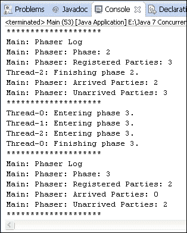
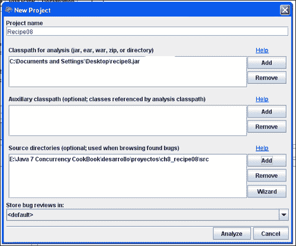
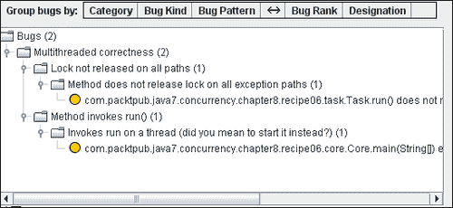
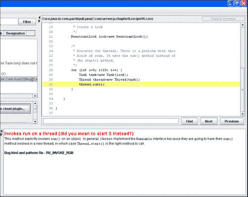
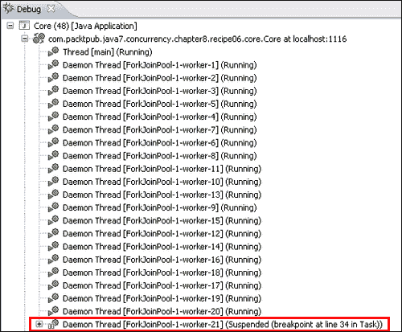
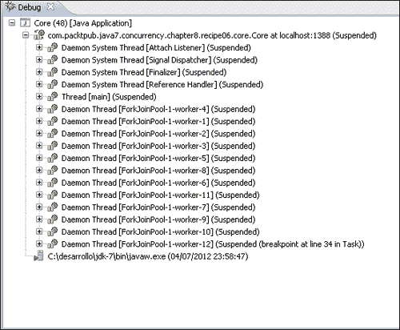
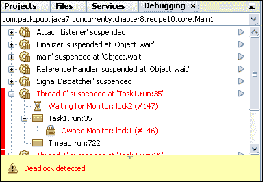
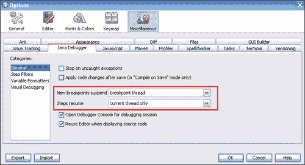

# 第八章：测试并发应用程序

在本章中，我们将涵盖：

+   监视`Lock`接口

+   监视`Phaser`类

+   监视 Executor 框架

+   监视 Fork/Join 池

+   编写有效的日志消息

+   使用 FindBugs 分析并发代码

+   配置 Eclipse 以调试并发代码

+   配置 NetBeans 以调试并发代码

+   使用 MultithreadedTC 测试并发代码

# 介绍

测试应用程序是一项关键任务。在应用程序准备交付给最终用户之前，您必须证明其正确性。您使用测试过程来证明已经实现了正确性并修复了错误。测试阶段是任何软件开发和**质量保证**流程中的常见任务。您可以找到大量关于测试过程和您可以应用于开发的不同方法的文献。还有许多库，如`JUnit`，以及应用程序，如 Apache `JMetter`，您可以使用它们以自动化的方式测试您的 Java 应用程序。这在并发应用程序开发中更加关键。

并发应用程序具有两个或更多个共享数据结构并相互交互的线程，这增加了测试阶段的难度。当您测试并发应用程序时，将面临的最大问题是线程的执行是不确定的。您无法保证线程执行的顺序，因此很难重现错误。

在本章中，您将学习：

+   如何获取有关并发应用程序中的元素的信息。这些信息可以帮助您测试并发应用程序。

+   如何使用集成开发环境（IDE）和其他工具，如 FindBugs，来测试并发应用程序。

+   如何使用诸如 MultithreadedTC 之类的库来自动化您的测试。

# 监视 Lock 接口

`Lock`接口是 Java 并发 API 提供的基本机制之一，用于同步代码块。它允许定义**临界区**。临界区是访问共享资源的代码块，不能同时由多个线程执行。这个机制由`Lock`接口和`ReentrantLock`类实现。

在本示例中，您将学习可以获取有关`Lock`对象的哪些信息以及如何获取这些信息。

## 准备工作

本示例使用 Eclipse IDE 实现。如果您使用 Eclipse 或其他 IDE，如 NetBeans，请打开它并创建一个新的 Java 项目。

## 如何做...

按照以下步骤实现示例：

1.  创建一个名为`MyLock`的类，继承`ReentrantLock`类。

```java
public class MyLock extends ReentrantLock {
```

1.  实现`getOwnerName()`方法。该方法使用`Lock`类的受保护方法`getOwner()`返回控制锁的线程（如果有）的名称。

```java
  public String getOwnerName() {
    if (this.getOwner()==null) {
      return "None";
    }
    return this.getOwner().getName();
  }
```

1.  实现`getThreads()`方法。该方法使用`Lock`类的受保护方法`getQueuedThreads()`返回排队在锁中的线程列表。

```java
  public Collection<Thread> getThreads() {
    return this.getQueuedThreads();
  }
```

1.  创建一个名为`Task`的类，实现`Runnable`接口。

```java
public class Task implements Runnable {
```

1.  声明一个名为`lock`的私有`Lock`属性。

```java
  private Lock lock;
```

1.  实现类的构造函数以初始化其属性。

```java
  public Task (Lock lock) {
    this.lock=lock;
  }
```

1.  实现`run()`方法。创建一个包含五个步骤的循环。

```java
  @Override
  public void run() {
    for (int i=0; i<5; i++) {
```

1.  使用`lock()`方法获取锁并打印一条消息。

```java
      lock.lock();
      System.out.printf("%s: Get the Lock.\n",Thread.currentThread().getName());
```

1.  使线程休眠 500 毫秒。使用`unlock()`方法释放锁并打印一条消息。

```java
      try {
        TimeUnit.MILLISECONDS.sleep(500);
        System.out.printf("%s: Free the Lock.\n",Thread.currentThread().getName());
      } catch (InterruptedException e) {
        e.printStackTrace();
      } finally {
        lock.unlock();
      }
        }
  }
}
```

1.  通过创建一个名为`Main`的类和一个`main()`方法来创建示例的主类。

```java
public class Main {

  public static void main(String[] args) throws Exception {
```

1.  创建一个名为`lock`的`MyLock`对象。

```java
    MyLock lock=new MyLock();
```

1.  为五个`Thread`对象创建一个数组。

```java
    Thread threads[]=new Thread[5];
```

1.  创建并启动五个线程来执行五个`Task`对象。

```java
    for (int i=0; i<5; i++) {
      Task task=new Task(lock);
      threads[i]=new Thread(task);
      threads[i].start();
    }
```

1.  创建一个包含 15 个步骤的循环。

```java
    for (int i=0; i<15; i++) {
```

1.  在控制台中写入锁的所有者的名称。

```java
      System.out.printf("Main: Logging the Lock\n");
      System.out.printf("************************\n");
      System.out.printf("Lock: Owner : %s\n",lock.getOwnerName());
```

1.  显示排队等待锁的线程的数量和名称。

```java
.out.printf("Lock: Queued Threads: %s\n",lock.hasQueuedThreads());
      if (lock.hasQueuedThreads()){
        System.out.printf("Lock: Queue Length: %d\n",lock.getQueueLength());
        System.out.printf("Lock: Queued Threads: ");
        Collection<Thread> lockedThreads=lock.getThreads();
        for (Thread lockedThread : lockedThreads) {
        System.out.printf("%s ",lockedThread.getName());
        }
        System.out.printf("\n");
      }
```

1.  显示关于`Lock`对象的公平性和状态的信息。

```java
      System.out.printf("Lock: Fairness: %s\n",lock.isFair());
      System.out.printf("Lock: Locked: %s\n",lock.isLocked());
      System.out.printf("************************\n");
```

1.  将线程休眠 1 秒并关闭循环和类。

```java
      TimeUnit.SECONDS.sleep(1);
    }

  }

}
```

## 工作原理...

在这个食谱中，您已经实现了`MyLock`类，该类扩展了`ReentrantLock`类，以返回原本无法获得的信息-这是`ReentrantLock`类的受保护数据。`MyLock`类实现的方法有：

+   `getOwnerName()`:只有一个线程可以执行由`Lock`对象保护的临界区。锁存储正在执行临界区的线程。此线程由`ReentrantLock`类的受保护`getOwner()`方法返回。此方法使用`getOwner()`方法返回该线程的名称。

+   `getThreads()`:当一个线程执行临界区时，试图进入它的其他线程被放到睡眠状态，直到它们可以继续执行该临界区。`ReentrantLock`类的受保护方法`getQueuedThreads()`返回等待执行临界区的线程列表。此方法返回`getQueuedThreads()`方法返回的结果。

我们还使用了`ReentrantLock`类中实现的其他方法：

+   `hasQueuedThreads()`:此方法返回一个`Boolean`值，指示是否有线程正在等待获取此锁

+   `getQueueLength()`:此方法返回正在等待获取此锁的线程数

+   `isLocked()`:此方法返回一个`Boolean`值，指示此锁是否由线程拥有

+   `isFair()`:此方法返回一个`Boolean`值，指示此锁是否已激活公平模式

## 还有更多...

`ReentrantLock`类中还有其他方法可用于获取有关`Lock`对象的信息：

+   `getHoldCount()`:返回当前线程获取锁的次数

+   `isHeldByCurrentThread()`:返回一个`Boolean`值，指示锁是否由当前线程拥有

## 另请参阅

+   第二章“基本线程同步”中的*使用锁同步代码块*食谱

+   第七章“自定义并发类”中的*实现自定义锁类*食谱

# 监视`Phaser`类

Java 并发 API 提供的最复杂和强大的功能之一是使用`Phaser`类执行并发分阶段任务的能力。当我们有一些并发任务分为步骤时，这种机制非常有用。`Phaser`类为我们提供了在每个步骤结束时同步线程的机制，因此在所有线程完成第一步之前，没有线程开始其第二步。

在这个食谱中，您将学习有关`Phaser`类状态的信息以及如何获取该信息。

## 准备工作

此食谱的示例是使用 Eclipse IDE 实现的。如果您使用 Eclipse 或其他 IDE（如 NetBeans），请打开它并创建一个新的 Java 项目。

## 操作步骤...

按照以下步骤实现示例：

1.  创建一个名为`Task`的类，实现`Runnable`接口。

```java
public class Task implements Runnable {
```

1.  声明一个名为`time`的私有`int`属性。

```java
  private int time;
```

1.  声明一个名为`phaser`的私有`Phaser`属性。

```java
  private Phaser phaser;
```

1.  实现类的构造函数以初始化其属性。

```java
  public Task(int time, Phaser phaser) {
    this.time=time;
    this.phaser=phaser;
  }
```

1.  实现`run()`方法。首先，使用`arrive()`方法指示`phaser`属性任务开始执行。

```java
    @Override
  public void run() {

    phaser.arrive();
```

1.  在控制台中写入一条消息，指示第一阶段的开始，将线程休眠指定`time`属性的秒数，在控制台中写入一条消息，指示第一阶段的结束，并使用`phaser`属性的`arriveAndAwaitAdvance()`方法与其余任务同步。

```java
    System.out.printf("%s: Entering phase 1.\n",Thread.currentThread().getName());
    try {
      TimeUnit.SECONDS.sleep(time);
    } catch (InterruptedException e) {
      e.printStackTrace();
    }
    System.out.printf("%s: Finishing phase 1.\n",Thread.currentThread().getName());
    phaser.arriveAndAwaitAdvance();
```

1.  重复第二和第三阶段的行为。在第三阶段结束时，使用`arriveAndDeregister()`方法而不是`arriveAndAwaitAdvance()`。

```java
    System.out.printf("%s: Entering phase 2.\n",Thread.currentThread().getName());
    try {
      TimeUnit.SECONDS.sleep(time);
    } catch (InterruptedException e) {
      e.printStackTrace();
    }
    System.out.printf("%s: Finishing phase 2.\n",Thread.currentThread().getName());
    phaser.arriveAndAwaitAdvance();

    System.out.printf("%s: Entering phase 3.\n",Thread.currentThread().getName());
    try {
      TimeUnit.SECONDS.sleep(time);
    } catch (InterruptedException e) {
      e.printStackTrace();
    }
    System.out.printf("%s: Finishing phase 3.\n",Thread.currentThread().getName());

    phaser.arriveAndDeregister();
```

1.  通过创建一个名为`Main`的类并实现`main()`方法来实现示例的主类。

```java
public class Main {

  public static void main(String[] args) throws Exception {
```

1.  创建一个名为`phaser`的新`Phaser`对象，其中包含三个参与者。

```java
    Phaser phaser=new Phaser(3);
```

1.  创建并启动三个线程来执行三个任务对象。

```java
    for (int i=0; i<3; i++) {
      Task task=new Task(i+1, phaser);
      Thread thread=new Thread(task);
      thread.start();
    }
```

1.  创建一个包含 10 个步骤的循环，以写入关于`phaser`对象的信息。

```java
    for (int i=0; i<10; i++) {
```

1.  写入关于已注册任务、phaser 阶段、已到达任务和未到达任务的信息。

```java
    for (int i=0; i<10; i++) {
      System.out.printf("********************\n");
      System.out.printf("Main: Phaser Log\n");
      System.out.printf("Main: Phaser: Phase: %d\n",phaser.getPhase());
      System.out.printf("Main: Phaser: Registered Parties: %d\n",phaser.getRegisteredParties());
      System.out.printf("Main: Phaser: Arrived Parties: %d\n",phaser.getArrivedParties());
      System.out.printf("Main: Phaser: Unarrived Parties: %d\n",phaser.getUnarrivedParties());
      System.out.printf("********************\n");
```

1.  将线程休眠 1 秒并关闭循环和类。

```java
        TimeUnit.SECONDS.sleep(1);
    }
  }
}
```

## 工作原理...

在这个食谱中，我们在`Task`类中实现了一个分阶段任务。这个分阶段任务有三个阶段，并使用`Phaser`接口与其他`Task`对象同步。主类启动三个任务，当这些任务执行它们的阶段时，它会在控制台上打印关于`phaser`对象状态的信息。我们使用以下方法来获取`phaser`对象的状态：

+   `getPhase()`:此方法返回`phaser`对象的实际阶段

+   `getRegisteredParties()`:此方法返回使用`phaser`对象作为同步机制的任务数

+   `getArrivedParties()`:此方法返回已到达实际阶段结束的任务数

+   `getUnarrivedParties()`:此方法返回尚未到达实际阶段结束的任务数

以下屏幕截图显示了程序的部分输出：



## 另请参阅

+   在第三章的*线程同步工具*中的*运行并发分阶段任务*食谱

# 监视执行器框架

执行器框架提供了一种机制，将任务的实现与线程的创建和管理分开，以执行这些任务。如果使用执行器，只需实现`Runnable`对象并将它们发送到执行器。执行器负责管理线程。当将任务发送到执行器时，它会尝试使用池化线程来执行此任务，以避免创建新线程。这种机制由`Executor`接口及其实现类`ThreadPoolExecutor`类提供。

在这个食谱中，您将学习如何获取关于`ThreadPoolExecutor`执行器状态的信息以及如何获取它。

## 准备工作

这个食谱的示例是使用 Eclipse IDE 实现的。如果您使用 Eclipse 或其他 IDE 如 NetBeans，请打开它并创建一个新的 Java 项目。

## 如何做...

按照以下步骤实现示例：

1.  创建一个名为`Task`的实现`Runnable`接口的类。

```java
public class Task implements Runnable {
```

1.  声明一个名为`milliseconds`的私有`long`属性。

```java
  private long milliseconds;
```

1.  实现类的构造函数以初始化其属性。

```java
  public Task (long milliseconds) {
    this.milliseconds=milliseconds;
  }
```

1.  实现`run()`方法。将线程休眠`milliseconds`属性指定的毫秒数。

```java
  @Override
  public void run() {

    System.out.printf("%s: Begin\n",Thread.currentThread().getName());
    try {
      TimeUnit.MILLISECONDS.sleep(milliseconds);
    } catch (InterruptedException e) {
      e.printStackTrace();
    }
    System.out.printf("%s: End\n",Thread.currentThread().getName());

  }
```

1.  通过创建一个名为`Main`的类并实现`main()`方法来实现示例的主类。

```java
public class Main {

  public static void main(String[] args) throws Exception {
```

1.  使用`Executors`类的`newCachedThreadPool()`方法创建一个新的`Executor`对象。

```java
    ThreadPoolExecutor executor = (ThreadPoolExecutor)Executors.newCachedThreadPool();
```

1.  创建并提交 10 个`Task`对象到执行器。使用随机数初始化对象。

```java
    Random random=new Random();
    for (int i=0; i<10; i++) {
      Task task=new Task(random.nextInt(10000));
      executor.submit(task);
    }
```

1.  创建一个包含五个步骤的循环。在每个步骤中，调用`showLog()`方法写入关于执行器的信息，并将线程休眠一秒。

```java
    for (int i=0; i<5; i++){
      showLog(executor);
      TimeUnit.SECONDS.sleep(1);
    }
```

1.  使用`shutdown()`方法关闭执行器。

```java
    executor.shutdown();
```

1.  创建另一个包含五个步骤的循环。在每个步骤中，调用`showLog()`方法写入关于执行器的信息，并将线程休眠一秒。

```java
    for (int i=0; i<5; i++){
      showLog(executor);
      TimeUnit.SECONDS.sleep(1);
    }
```

1.  使用`awaitTermination()`方法等待执行器的完成。

```java
      executor.awaitTermination(1, TimeUnit.DAYS);
```

1.  显示关于程序结束的消息。

```java
    System.out.printf("Main: End of the program.\n");
  }
```

1.  实现`showLog()`方法，该方法接收`Executor`作为参数。写入关于池的大小、任务数和执行器状态的信息。

```java
  private static void showLog(ThreadPoolExecutor executor) {
    System.out.printf("*********************");
    System.out.printf("Main: Executor Log");
    System.out.printf("Main: Executor: Core Pool Size: %d\n",executor.getCorePoolSize());
    System.out.printf("Main: Executor: Pool Size: %d\n",executor.getPoolSize());
    System.out.printf("Main: Executor: Active Count: %d\n",executor.getActiveCount());
    System.out.printf("Main: Executor: Task Count: %d\n",executor.getTaskCount());
    System.out.printf("Main: Executor: Completed Task Count: %d\n",executor.getCompletedTaskCount());
    System.out.printf("Main: Executor: Shutdown: %s\n",executor.isShutdown());
    System.out.printf("Main: Executor: Terminating: %s\n",executor.isTerminating());
    System.out.printf("Main: Executor: Terminated: %s\n",executor.isTerminated());
    System.out.printf("*********************\n");
  }
```

## 工作原理...

在此食谱中，您已经实现了一个任务，该任务会阻塞其执行线程一段随机毫秒数。然后，您已经将 10 个任务发送到执行器，同时等待它们的完成，您已经将有关执行器状态的信息写入控制台。您已使用以下方法来获取`Executor`对象的状态：

+   `getCorePoolSize()`: 此方法返回一个`int`数字，表示核心线程数。这是执行器在不执行任何任务时内部线程池中的最小线程数。

+   `getPoolSize()`: 此方法返回一个`int`值，表示内部线程池的实际大小。

+   `getActiveCount()`: 此方法返回一个`int`数字，表示当前正在执行任务的线程数。

+   `getTaskCount()`: 此方法返回一个`long`数字，表示已安排执行的任务数。

+   `getCompletedTaskCount()`: 此方法返回一个`long`数字，表示已由此执行器执行并已完成执行的任务数。

+   `isShutdown()`: 当执行器的`shutdown()`方法已被调用以结束其执行时，此方法返回一个`Boolean`值。

+   `isTerminating()`: 当执行器正在执行`shutdown()`操作但尚未完成时，此方法返回一个`Boolean`值。

+   `isTerminated()`: 当此执行器已完成其执行时，此方法返回一个`Boolean`值。

## 另请参阅

+   在第四章的*创建线程执行器*食谱中，*线程执行器*

+   在第七章的*自定义 ThreadPoolExecutor 类*食谱中，*自定义并发类*

+   在第七章的*实现基于优先级的 Executor 类*食谱中，*自定义并发类*

# 监视 Fork/Join 池

执行器框架提供了一种机制，允许将任务实现与执行这些任务的线程的创建和管理分离。Java 7 包括执行器框架的扩展，用于一种特定类型的问题，将改善其他解决方案的性能（如直接使用`Thread`对象或执行器框架）。这就是 Fork/Join 框架。

该框架旨在使用`fork()`和`join()`操作将问题分解为较小的任务来解决问题。实现此行为的主要类是`ForkJoinPool`类。

在此食谱中，您将学习有关`ForkJoinPool`类的信息以及如何获取它。

## 准备工作

此食谱的示例已使用 Eclipse IDE 实现。如果您使用 Eclipse 或其他 IDE（如 NetBeans），请打开它并创建一个新的 Java 项目。

## 如何做...

按照以下步骤实现示例：

1.  创建一个名为`Task`的类，该类扩展了`RecursiveAction`类。

```java
public class Task extends RecursiveAction{
```

1.  声明一个私有的`int`数组属性，命名为`array`，以存储要增加的元素数组。

```java
private int array[];
```

1.  声明两个私有的`int`属性，命名为`start`和`end`，以存储此任务必须处理的元素块的起始和结束位置。

```java
  private int start;
  private int end;
```

1.  实现类的构造函数以初始化其属性。

```java
  public Task (int array[], int start, int end) {
    this.array=array;
    this.start=start;
    this.end=end;
  }
```

1.  使用`compute()`方法实现任务的主要逻辑。如果任务需要处理超过 100 个元素，则将这组元素分成两部分，创建两个任务来执行这些部分，使用`fork()`方法开始执行，使用`join()`方法等待其完成。

```java
  protected void compute() {
    if (end-start>100) {
      int mid=(start+end)/2;
      Task task1=new Task(array,start,mid);
      Task task2=new Task(array,mid,end);

      task1.fork();
      task2.fork();

      task1.join();
      task2.join();
```

1.  如果任务需要处理 100 个或更少的元素，则通过在每个操作后使线程休眠 5 毫秒来增加这些元素。

```java
    } else {
      for (int i=start; i<end; i++) {
        array[i]++;

        try {
          Thread.sleep(5);
        } catch (InterruptedException e) {
          e.printStackTrace();
        }
      }
    }
  }
}
```

1.  通过创建一个名为`Main`的类并实现一个`main()`方法来实现示例的主类。

```java
public class Main {

  public static void main(String[] args) throws Exception {
```

1.  创建名为`pool`的`ForkJoinPool`对象。

```java
    ForkJoinPool pool=new ForkJoinPool();
```

1.  创建名为`array`的整数数组，其中包含 10,000 个元素。

```java
    int array[]=new int[10000];
```

1.  创建一个新的`Task`对象来处理整个数组。

```java
    Task task1=new Task(array,0,array.length);
```

1.  使用`execute()`方法将任务发送到池中执行。

```java
    pool.execute(task1);
```

1.  在任务未完成执行时，调用`showLog()`方法以写入有关`ForkJoinPool`类状态的信息，并使线程休眠一秒钟。

```java
    while (!task1.isDone()) {
      showLog(pool);
      TimeUnit.SECONDS.sleep(1);
    }
```

1.  使用`shutdown()`方法关闭池。

```java
    pool.shutdown();
```

1.  使用`awaitTermination()`方法等待池的完成。

```java
      pool.awaitTermination(1, TimeUnit.DAYS);
```

1.  调用`showLog()`方法以写入有关`ForkJoinPool`类状态的信息，并在控制台中写入程序结束的消息。

```java
    showLog(pool);
    System.out.printf("Main: End of the program.\n");
```

1.  实现`showLog()`方法。它接收一个`ForkJoinPool`对象作为参数，并写入有关其状态以及正在执行的线程和任务的信息。

```java
  private static void showLog(ForkJoinPool pool) {
    System.out.printf("**********************\n");
    System.out.printf("Main: Fork/Join Pool log\n");
    System.out.printf("Main: Fork/Join Pool: Parallelism: %d\n",pool.getParallelism());
    System.out.printf("Main: Fork/Join Pool: Pool Size: %d\n",pool.getPoolSize());
    System.out.printf("Main: Fork/Join Pool: Active Thread Count: %d\n",pool.getActiveThreadCount());
    System.out.printf("Main: Fork/Join Pool: Running Thread Count: %d\n",pool.getRunningThreadCount());
    System.out.printf("Main: Fork/Join Pool: Queued Submission: %d\n",pool.getQueuedSubmissionCount());
    System.out.printf("Main: Fork/Join Pool: Queued Tasks: %d\n",pool.getQueuedTaskCount());
    System.out.printf("Main: Fork/Join Pool: Queued Submissions: %s\n",pool.hasQueuedSubmissions());
    System.out.printf("Main: Fork/Join Pool: Steal Count: %d\n",pool.getStealCount());
    System.out.printf("Main: Fork/Join Pool: Terminated : %s\n",pool.isTerminated());
    System.out.printf("**********************\n");
  }
```

## 工作原理...

在此示例中，您已经实现了一个任务，该任务使用`ForkJoinPool`类和扩展`RecursiveAction`类的`Task`类来增加数组的元素；这是您可以在`ForkJoinPool`类中执行的任务类型之一。在任务处理数组时，您将有关`ForkJoinPool`类状态的信息打印到控制台。您已使用以下方法来获取`ForkJoinPool`类的状态：

+   `getPoolSize()`:此方法返回一个`int`值，即 fork join 池的内部池的工作线程数

+   `getParallelism()`:此方法返回为池建立的所需并行级别

+   `getActiveThreadCount()`:此方法返回当前执行任务的线程数

+   `getRunningThreadCount()`:此方法返回未在任何同步机制中阻塞的工作线程数

+   `getQueuedSubmissionCount()`:此方法返回已提交到池中但尚未开始执行的任务数

+   `getQueuedTaskCount()`:此方法返回已提交到池中并已开始执行的任务数

+   `hasQueuedSubmissions()`:此方法返回一个`Boolean`值，指示此池是否有已提交但尚未开始执行的任务

+   `getStealCount()`:此方法返回一个`long`值，表示工作线程从另一个线程中窃取任务的次数

+   `isTerminated()`:此方法返回一个`Boolean`值，指示 fork/join 池是否已完成执行

## 另请参阅

+   第五章中的*创建 Fork/Join 池*示例，*Fork/Join Framework*

+   第七章中的*实现 ThreadFactory 接口以为 Fork/Join 框架生成自定义线程*示例，*自定义并发类*

+   第七章中的*自定义 Fork/Join 框架中运行的任务*示例，*自定义并发类*

# 编写有效的日志消息

日志系统是一种机制，允许您将信息写入一个或多个目的地。Logger 具有以下组件：

+   **一个或多个处理程序**：处理程序将确定日志消息的目的地和格式。您可以将日志消息写入控制台、文件或数据库。

+   **一个名称**：通常，Logger 的名称基于类名和其包名。

+   **级别**：日志消息具有与之关联的级别，指示其重要性。Logger 还具有一个级别，用于决定它将要写入哪些消息。它只会写入与其级别一样重要或更重要的消息。

您应该使用日志系统来实现以下两个主要目的：

+   捕获异常时尽可能多地写入信息。这将有助于定位错误并解决问题。

+   写入程序正在执行的类和方法的信息。

在这个示例中，你将学习如何使用`java.util.logging`包提供的类为你的并发应用程序添加日志系统。

## 准备工作

这个示例已经使用 Eclipse IDE 实现。如果你使用 Eclipse 或其他 IDE，比如 NetBeans，打开它并创建一个新的 Java 项目。

## 如何做...

按照以下步骤实现示例：

1.  创建一个名为`MyFormatter`的类，它继承了`java.util.logging.Formatter`类。实现抽象的`format()`方法。它接收一个`LogRecord`对象作为参数，并返回一个带有日志消息的`String`对象。

```java
public class MyFormatter extends Formatter {
  @Override
  public String format(LogRecord record) {

    StringBuilder sb=new StringBuilder();
    sb.append("["+record.getLevel()+"] - ");
    sb.append(new Date(record.getMillis())+" : "); 
      sb.append(record.getSourceClassName()+ "."+record.getSourceMethodName()+" : ");
    sb.append(record.getMessage()+"\n");.
    return sb.toString();
  }
```

1.  创建一个名为`MyLogger`的类。

```java
public class MyLogger {
```

1.  声明一个私有静态的`Handler`属性，名为`handler`。

```java
  private static Handler handler;
```

1.  实现公共静态方法`getLogger()`来创建你要用来写日志消息的`Logger`对象。它接收一个名为`name`的`String`参数。

```java
  public static Logger getLogger(String name){
```

1.  使用`Logger`类的`getLogger()`方法，获取与接收的名称相关联的`java.util.logging.Logger`。

```java
    Logger logger=Logger.getLogger(name);
```

1.  使用`setLevel()`方法将日志级别设置为写入所有日志消息。

```java
    logger.setLevel(Level.ALL);
```

1.  如果 handler 属性的值为`null`，则创建一个新的`FileHandler`对象，将日志消息写入`recipe8.log`文件中。使用`setFormatter()`方法将一个`MyFormatter`对象分配给该 handler 作为格式化程序。

```java
    try {
      if (handler==null) {
        handler=new FileHandler("recipe8.log");
        Formatter format=new MyFormatter();
        handler.setFormatter(format);
      }
```

1.  如果`Logger`对象没有与之关联的处理程序，使用`addHandler()`方法分配处理程序。

```java
      if (logger.getHandlers().length==0) {
        logger.addHandler(handler);
      }
    } catch (SecurityException e) {
      e.printStackTrace();
    } catch (IOException e) {
      e.printStackTrace();
    }
```

1.  返回创建的`Logger`对象。

```java
    return logger;
  }
```

1.  创建一个名为`Task`的类，实现`Runnable`接口。它将是用来测试你的`Logger`对象的任务。

```java
public class Task implements Runnable {
```

1.  实现`run()`方法。

```java
  @Override
  public void run() {
```

1.  首先，声明一个名为`logger`的`Logger`对象。使用`MyLogger`类的`getLogger()`方法初始化它，传递这个类的名称作为参数。

```java
    Logger logger= MyLogger.getLogger(this.getClass().getName());
```

1.  使用`entering()`方法编写一个日志消息，指示方法执行的开始。

```java
    logger.entering(Thread.currentThread().getName(), "run()");
Sleep the thread for two seconds.
    try {
      TimeUnit.SECONDS.sleep(2);
    } catch (InterruptedException e) {
      e.printStackTrace();
    }
```

1.  使用`exiting()`方法编写一个日志消息，指示方法执行的结束。

```java
    logger.exiting(Thread.currentThread().getName(), "run()",Thread.currentThread());
  }
```

1.  通过创建一个名为`Main`的类并实现一个`main()`方法来实现示例的主类。

```java
public class Main {

  public static void main(String[] args) {
```

1.  声明一个名为`logger`的`Logger`对象。使用`MyLogger`类的`getLogger()`方法初始化它，传递字符串`Core`作为参数。

```java
    Logger logger=MyLogger.getLogger("Core");
```

1.  使用`entering()`方法编写一个日志消息，指示主程序的执行开始。

```java
    logger.entering("Core", "main()",args);
```

1.  创建一个`Thread`数组来存储五个线程。

```java
    Thread threads[]=new Thread[5];
```

1.  创建五个`Task`对象和五个线程来执行它们。编写日志消息来指示你将要启动一个新线程，并指示你已经创建了该线程。

```java
    for (int i=0; i<threads.length; i++) {
      logger.log(Level.INFO,"Launching thread: "+i);
      Task task=new Task();
      threads[i]=new Thread(task);
      logger.log(Level.INFO,"Thread created: "+ threads[i].getName());
      threads[i].start();
    }
```

1.  写一个日志消息来指示你已经创建了线程。

```java
    logger.log(Level.INFO,"Ten Threads created."+
"Waiting for its finalization");
```

1.  使用`join()`方法等待五个线程的完成。在每个线程完成后，编写一个日志消息，指示该线程已经完成。

```java
    for (int i=0; i<threads.length; i++) {
      try {
        threads[i].join();
        logger.log(Level.INFO,"Thread has finished its execution",threads[i]);
      } catch (InterruptedException e) {
        logger.log(Level.SEVERE, "Exception", e);
      }
    }
```

1.  使用`exiting()`方法编写一个日志消息，指示主程序的执行结束。

```java
    logger.exiting("Core", "main()");
  }
```

## 它是如何工作的...

在这个示例中，你已经使用了 Java 日志 API 提供的`Logger`类来在并发应用程序中写入日志消息。首先，你实现了`MyFormatter`类来给日志消息提供格式。这个类扩展了声明了抽象方法`format()`的`Formatter`类。这个方法接收一个带有日志消息所有信息的`LogRecord`对象，并返回一个格式化的日志消息。在你的类中，你使用了`LogRecord`类的以下方法来获取有关日志消息的信息：

+   `getLevel()`: 返回消息的级别

+   `getMillis()`: 返回消息被发送到`Logger`对象时的日期

+   `getSourceClassName()`: 返回发送消息给 Logger 的类的名称

+   `getSourceMessageName()`: 返回发送消息给 Logger 的方法的名称

`getMessage()`返回日志消息。`MyLogger`类实现了静态方法`getLogger()`，它创建一个`Logger`对象，并分配一个`Handler`对象来将应用程序的日志消息写入`recipe8.log`文件，使用`MyFormatter`格式化程序。您可以使用该类的静态方法`getLogger()`创建`Logger`对象。此方法根据传递的名称返回不同的对象。您只创建了一个`Handler`对象，因此所有`Logger`对象都将在同一个文件中写入其日志消息。您还配置了记录器以写入所有日志消息，而不管其级别如何。

最后，您已实现了一个`Task`对象和一个主程序，它在日志文件中写入不同的日志消息。您已使用以下方法：

+   `entering()`: 用`FINER`级别写入指示方法开始执行的消息

+   `exiting()`: 用`FINER`级别写入指示方法结束执行的消息

+   `log()`: 用指定级别写入消息

## 还有更多...

当您使用日志系统时，您必须考虑两个重要点：

+   **编写必要的信息**：如果您写的信息太少，日志记录器将不会有用，因为它无法实现其目的。如果您写的信息太多，将生成太大的日志文件，这将使其难以管理，并且难以获取必要的信息。

+   **使用适当的消息级别**：如果您使用更高级别的信息消息或更低级别的错误消息，将会使查看日志文件的用户感到困惑。在错误情况下更难知道发生了什么，或者您将获得太多信息以知道错误的主要原因。

还有其他提供比`java.util.logging`包更完整的日志系统的库，比如 Log4j 或 slf4j 库。但`java.util.logging`包是 Java API 的一部分，其所有方法都是多线程安全的，因此我们可以在并发应用中使用它而不会出现问题。

## 另请参阅

+   第六章中的*使用非阻塞线程安全列表*配方，*并发集合*

+   第六章中的*使用阻塞线程安全列表*配方，*并发集合*

+   第六章中的*使用按优先级排序的阻塞线程安全列表*配方，*并发集合*

+   第六章中的*使用延迟元素的线程安全列表*配方，*并发集合*

+   第六章中的*使用线程安全可导航映射*配方，*并发集合*

+   第六章中的*生成并发随机数*配方，*并发集合*

# 使用 FindBugs 分析并发代码

**静态代码分析工具**是一组分析应用程序源代码寻找潜在错误的工具。这些工具，如 Checkstyle、PMD 或 FindBugs，具有一组预定义的最佳实践规则，并解析源代码以查找违反这些规则的情况。其目标是在应用程序执行之前尽早发现错误或导致性能不佳的地方。编程语言通常提供此类工具，Java 也不例外。用于分析 Java 代码的工具之一是 FindBugs。这是一个开源工具，包括一系列规则来分析 Java 并发代码。

在此配方中，您将学习如何使用此工具分析您的 Java 并发应用程序。

## 准备就绪

在使用此配方之前，您应该从项目网页下载 FindBugs（[`findbugs.sourceforge.net/`](http://findbugs.sourceforge.net/)）。您可以下载一个独立的应用程序或一个 Eclipse 插件。在此配方中，您将使用独立版本。

## 如何做...

按照以下步骤实现示例：

1.  创建一个名为`Task`的类，该类扩展了`Runnable`接口。

```java
public class Task implements Runnable {
```

1.  声明一个名为`Lock`的私有`ReentrantLock`属性。

```java
  private ReentrantLock lock;
```

1.  实现类的构造函数。

```java
  public Task(ReentrantLock lock) {
    this.lock=lock;
  }
```

1.  实现`run()`方法。获取锁的控制权，使线程休眠 2 秒并释放锁。

```java
  @Override
  public void run() {
    lock.lock();
    try {
      TimeUnit.SECONDS.sleep(1);
      lock.unlock();
    } catch (InterruptedException e) {
      e.printStackTrace();
    }
  }
```

1.  通过创建一个带有`main()`方法的名为`Main`的类来创建示例的主类。

```java
public class Main {

  public static void main(String[] args) {
```

1.  声明并创建一个名为`lock`的`ReentrantLock`对象。

```java
    ReentrantLock lock=new ReentrantLock();
```

1.  创建 10 个`Task`对象和 10 个线程来执行这些任务。调用`run()`方法启动线程。

```java
    for (int i=0; i<10; i++) {
      Task task=new Task(lock);
      Thread thread=new Thread(task);
      thread.run();
    }
  }
```

1.  将项目导出为`jar`文件。将其命名为`recipe8.jar`。使用 IDE 的菜单选项或`javac`和`jar`命令来编译和压缩应用程序。

1.  运行`findbugs.bat`命令（Windows）或`findbugs.sh`命令（Linux）启动 FindBugs 独立应用程序。

1.  **使用菜单栏中的**文件**菜单中的**新建项目**选项创建新项目。**

1.  **FindBugs**应用程序显示了一个配置项目的窗口。在**项目名称**字段中输入文本`Recipe08`。在**分析的类路径**字段中添加带有项目的`jar`文件，在**源目录**字段中添加示例源代码的目录。参考以下屏幕截图：**

1.  **单击**分析**按钮以创建新项目并分析其代码。**

1.  **FindBugs**应用程序显示了代码分析的结果。在这种情况下，它发现了两个错误。

1.  **单击其中一个错误，您将在右侧面板看到错误的源代码，并在屏幕底部的面板中看到错误的描述。**

## **它是如何工作的...**

**以下屏幕截图显示了 FindBugs 的分析结果：**

****

**分析已检测到应用程序中以下两个潜在错误：**

+   **一个在`Task`类的`run()`方法中。如果抛出`InterruptedExeption`异常，则任务不会释放锁，因为它不会执行`unlock()`方法。这可能会导致应用程序中的死锁情况。**

+   **另一个在`Main`类的`main()`方法中，因为您直接调用了线程的`run()`方法，但没有调用`start()`方法来开始线程的执行。**

**如果您在两个错误中的一个上双击，您将看到有关它的详细信息。由于您已在项目的配置中包含了源代码引用，因此您还将看到检测到错误的源代码。以下屏幕截图显示了一个示例：**

****

## **还有更多...**

**请注意，FindBugs 只能检测一些有问题的情况（与并发代码相关或不相关）。例如，如果您在`Task`类的`run()`方法中删除`unlock()`调用并重复分析，FindBugs 不会警告您在任务中获取了锁但从未释放它。**

**使用静态代码分析工具来帮助提高代码质量，但不要期望能够检测到代码中的所有错误。**

## **另请参阅**

+   第八章中的*配置 NetBeans 以调试并发代码*配方，*测试并发应用程序***

**# 配置 Eclipse 以调试并发代码

如今，几乎每个程序员，无论使用何种编程语言，都会使用 IDE 创建他们的应用程序。它们提供了许多有趣的功能集成在同一个应用程序中，例如：

+   项目管理

+   自动生成代码

+   自动生成文档

+   与版本控制系统集成

+   用于测试应用程序的调试器

+   创建项目和应用程序元素的不同向导

IDE 最有用的功能之一是调试器。您可以逐步执行应用程序并分析程序的所有对象和变量的值。

如果您使用 Java 编程语言，Eclipse 是最受欢迎的 IDE 之一。它具有集成的调试器，允许您测试应用程序。默认情况下，当您调试并发应用程序并且调试器找到断点时，它只会停止具有该断点的线程，而其他线程会继续执行。

在本篇文章中，您将学习如何更改该配置，以帮助您测试并发应用程序。

## 准备工作

您必须安装 Eclipse IDE。打开它并选择一个包含并发应用程序的项目，例如，本书中实现的某个示例。

## 如何做...

按照以下步骤实现示例：

1.  选择菜单选项**窗口**|**首选项**。

1.  在左侧菜单中，展开**Java**选项。

1.  在左侧菜单中，选择**调试**选项。以下屏幕截图显示了该窗口的外观：

1.  将**新断点的默认挂起策略**的值从**挂起线程**更改为**挂起 VM**（在屏幕截图中标为红色）。

1.  单击**确定**按钮以确认更改。

## 它是如何工作的...

正如我们在本篇文章的介绍中提到的，默认情况下，在 Eclipse 中调试并发 Java 应用程序时，如果调试过程找到断点，它只会挂起首先触发断点的线程，而其他线程会继续执行。以下屏幕截图显示了这种情况的示例：



您可以看到只有**worker-21**被挂起（在屏幕截图中标为红色），而其他线程正在运行。但是，如果将**新断点的默认挂起策略**更改为**挂起 VM**，则在调试并发应用程序并且调试过程遇到断点时，所有线程都会暂停执行。以下屏幕截图显示了这种情况的示例：



通过更改，您可以看到所有线程都被挂起。您可以继续调试任何您想要的线程。选择最适合您需求的挂起策略。

# 为并发代码配置 NetBeans 调试

在今天的世界中，软件是必不可少的，以开发正常工作的应用程序，满足公司的质量标准，并且将来可以轻松修改，而且时间有限，成本尽可能低。为了实现这一目标，必须使用一个集成了多个工具（编译器和调试器）的 IDE，以便在一个公共界面下轻松开发应用程序。

如果您使用 Java 编程语言，NetBeans 是最受欢迎的 IDE 之一。它具有集成的调试器，允许您测试应用程序。

在本篇文章中，您将学习如何更改该配置，以帮助您测试并发应用程序。

## 准备工作

您应该已经安装了 NetBeans IDE。打开它并创建一个新的 Java 项目。

## 如何做...

按照以下步骤实现示例：

1.  创建一个名为`Task1`的类，并指定它实现`Runnable`接口。

```java
public class Task1 implements Runnable {
```

1.  声明两个私有的`Lock`属性，命名为`lock1`和`lock2`。

```java
    private Lock lock1, lock2;
```

1.  实现类的构造函数以初始化其属性。

```java
    public Task1 (Lock lock1, Lock lock2) {
        this.lock1=lock1;
        this.lock2=lock2;
    }
```

1.  实现`run()`方法。首先，使用`lock()`方法获取`lock1`对象的控制权，并在控制台中写入一条消息，指示您已经获得了它。

```java
 @Override
    public void run() {
        lock1.lock();
        System.out.printf("Task 1: Lock 1 locked\n");
```

1.  然后，使用`lock()`方法获取`lock2`对象的控制权，并在控制台中写入一条消息，指示您已经获得了它。

```java
        lock2.lock();
        System.out.printf("Task 1: Lock 2 locked\n");
Finally, release the two lock objects. First, the lock2 object and then the lock1 object.
        lock2.unlock();
        lock1.unlock();
    }
```

1.  创建一个名为`Task2`的类，并指定它实现`Runnable`接口。

```java
public class Task2 implements Runnable{
```

1.  声明两个私有的`Lock`属性，命名为`lock1`和`lock2`。

```java
    private Lock lock1, lock2;
```

1.  实现类的构造函数以初始化其属性。

```java
    public Task2(Lock lock1, Lock lock2) {
        this.lock1=lock1;
        this.lock2=lock2;
    }
```

1.  实现`run()`方法。首先使用`lock()`方法获取`lock2`对象的控制权，并在控制台中写入一条消息，指示您已经获得了它。

```java
 @Override
    public void run() {
        lock2.lock();
        System.out.printf("Task 2: Lock 2 locked\n");
```

1.  然后使用`lock()`方法获取`lock1`对象的控制权，并在控制台中写入一条消息，指示您已经获得了它。

```java
        lock1.lock();
        System.out.printf("Task 2: Lock 1 locked\n");
```

1.  最后，释放两个锁对象。首先是`lock1`对象，然后是`lock2`对象。

```java
        lock1.unlock();
        lock2.unlock();
    }
```

1.  通过创建名为`Main`的类并向其中添加`main()`方法来实现示例的主类。

```java
public class Main {
```

1.  创建名为`lock1`和`lock2`的两个锁对象。

```java
        Lock lock1, lock2;
        lock1=new ReentrantLock();
        lock2=new ReentrantLock();
```

1.  创建名为`task1`的`Task1`对象。

```java
        Task1 task1=new Task1(lock1, lock2);
```

1.  创建名为`task2`的`Task2`对象。

```java
        Task2 task2=new Task2(lock1, lock2);
```

1.  使用两个线程执行两个任务。

```java
        Thread thread1=new Thread(task1);
        Thread thread2=new Thread(task2);

        thread1.start();
        thread2.start();
```

1.  当两个任务尚未完成执行时，每 500 毫秒在控制台中写入一条消息。使用`isAlive()`方法检查线程是否已经完成执行。

```java
        while ((thread1.isAlive()) &&(thread2.isAlive())) {
            System.out.println("Main: The example is"+ "running");
            try {
                TimeUnit.MILLISECONDS.sleep(500);
            } catch (InterruptedException ex) {
                ex.printStackTrace();
            }
        }
```

1.  在`Task1`类的`run()`方法的第一个`println()`方法调用中添加断点。

1.  调试程序。您将在 NetBeans 主窗口的左上角看到**调试**窗口。下一个屏幕截图显示了该窗口的外观，其中显示了执行`Task1`对象的线程因为已到达断点而休眠，而其他线程正在运行：

1.  暂停主线程的执行。选择该线程，右键单击，然后选择**暂停**选项。以下屏幕截图显示了**调试**窗口的新外观。参考以下屏幕截图：

1.  恢复两个暂停的线程。选择每个线程，右键单击，然后选择**恢复**选项。

## 它是如何工作的...

在使用 NetBeans 调试并发应用程序时，当调试器命中断点时，它会暂停命中断点的线程，并在左上角显示**调试**窗口，其中显示当前正在运行的线程。

您可以使用该窗口使用**暂停**或**恢复**选项暂停或恢复当前正在运行的线程。您还可以使用**变量**选项卡查看线程的变量或属性的值。

NetBeans 还包括死锁检测器。当您在**调试**菜单中选择**检查死锁**选项时，NetBeans 会对您正在调试的应用程序进行分析，以确定是否存在死锁情况。此示例呈现了明显的死锁。第一个线程首先获取锁`lock1`，然后获取锁`lock2`。第二个线程以相反的方式获取锁。插入的断点引发了死锁，但如果使用 NetBeans 死锁检测器，您将找不到任何东西，因此应谨慎使用此选项。更改两个任务中使用的锁对象的`同步`关键字，并再次调试程序。`Task1`的代码将如下所示：

```java
    @Override
    public void run() {
        synchronized(lock1) {
            System.out.printf("Task 1: Lock 1 locked\n");
            synchronized(lock2) {
                System.out.printf("Task 1: Lock 2 locked\n");
            }
        }
    } 
```

`Task2`类的代码将类似于此，但更改锁的顺序。如果再次调试示例，您将再次获得死锁，但在这种情况下，它将被死锁检测器检测到，如下屏幕截图所示：



## 还有更多...

有选项来控制调试器。在**工具**菜单中选择**选项**选项。然后选择**其他**选项和**Java 调试器**选项卡。以下屏幕截图显示了该窗口的外观：



该窗口上有两个选项，用于控制前面描述的行为：

+   **新断点暂停**：使用此选项，您可以配置 NetBeans 的行为，该行为在线程中找到断点。您可以仅暂停具有断点的线程，也可以暂停应用程序的所有线程。

+   **步骤摘要**：使用此选项，您可以配置 NetBeans 在恢复线程时的行为。您可以只恢复当前线程或所有线程。

两个选项都已在之前呈现的屏幕截图中标记。

## 另请参阅

+   第八章中的*为调试并发代码配置 Eclipse*食谱，*测试并发应用程序*

# 使用 MultithreadedTC 测试并发代码

MultithreadedTC 是一个用于测试并发应用程序的 Java 库。它的主要目标是解决并发应用程序是非确定性的问题。您无法控制它们的执行顺序。为此，它包括一个内部的**节拍器**来控制应用程序的不同线程的执行顺序。这些测试线程被实现为一个类的方法。

在这个示例中，您将学习如何使用 MultithreadedTC 库为`LinkedTransferQueue`实现测试。

## 准备工作

您还必须从[`code.google.com/p/multithreadedtc/`](http://code.google.com/p/multithreadedtc/)下载 MultithreadedTC 库和 JUnit 库，版本为 4.10，从[`www.junit.org/`](http://www.junit.org/)。将`junit-4.10.jar`和`MultithreadedTC-1.01.jar`文件添加到项目的库中。

## 如何做...

按照以下步骤实现示例：

1.  创建一个名为`ProducerConsumerTest`的类，它继承自`MultithreadedTestCase`类。

```java
public class ProducerConsumerTest extends MultithreadedTestCase {
```

1.  声明一个私有的`LinkedTransferQueue`属性，参数化为`String`类，命名为`queue`。

```java
  private LinkedTransferQueue<String> queue;
```

1.  实现`initialize()`方法。这个方法不接收任何参数，也不返回任何值。它调用其父类的`initialize()`方法，然后初始化队列属性。

```java
   @Override
  public void initialize() {
    super.initialize();
    queue=new LinkedTransferQueue<String>();
    System.out.printf("Test: The test has been initialized\n");
  }
```

1.  实现`thread1()`方法。它将实现第一个消费者的逻辑。调用队列的`take()`方法，然后将返回的值写入控制台。

```java
  public void thread1() throws InterruptedException {
    String ret=queue.take();
    System.out.printf("Thread 1: %s\n",ret);
  }
```

1.  实现`thread2()`方法。它将实现第二个消费者的逻辑。首先，使用`waitForTick()`方法等待第一个线程在`take()`方法中休眠。然后，调用队列的`take()`方法，然后将返回的值写入控制台。

```java
  public void thread2() throws InterruptedException {
    waitForTick(1);
    String ret=queue.take();
    System.out.printf("Thread 2: %s\n",ret);
  }
```

1.  实现`thread3()`方法。它将实现生产者的逻辑。首先，使用`waitForTick()`方法两次等待两个消费者在`take()`方法中被阻塞。然后，调用队列的`put()`方法在队列中插入两个`String`。

```java
  public void thread3() {
    waitForTick(1);
    waitForTick(2);
    queue.put("Event 1");
    queue.put("Event 2");
    System.out.printf("Thread 3: Inserted two elements\n");
  }
```

1.  最后，实现`finish()`方法。在控制台中写入一条消息，指示测试已经完成执行。使用`assertEquals()`方法检查两个事件是否已被消耗（因此队列的大小为`0`）。

```java
  public void finish() {
    super.finish();
    System.out.printf("Test: End\n");
    assertEquals(true, queue.size()==0);
    System.out.printf("Test: Result: The queue is empty\n");
  }
```

1.  通过创建一个名为`Main`的类和一个`main()`方法来实现示例的主类。

```java
public class Main {

  public static void main(String[] args) throws Throwable {
```

1.  创建一个名为`test`的`ProducerConsumerTest`对象。

```java
    ProducerConsumerTest test=new ProducerConsumerTest();
```

1.  使用`TestFramework`类的`runOnce()`方法执行测试。

```java
     System.out.printf("Main: Starting the test\n");
    TestFramework.runOnce(test);
    System.out.printf("Main: The test has finished\n");
```

## 工作原理...

在这个示例中，您已经使用 MultithreadedTC 库为`LinkedTransferQueue`类实现了一个测试。您可以使用这个库及其节拍器为任何并发应用程序或类实现测试。在这个示例中，您已经实现了经典的生产者/消费者问题，其中有两个消费者和一个生产者。您希望测试第一个引入缓冲区的`String`对象是否被第一个到达缓冲区的消费者消耗，第二个引入缓冲区的`String`对象是否被第二个到达缓冲区的消费者消耗。

MultithreadedTC 库基于 JUnit 库，这是 Java 中最常用的用于实现单元测试的库。要使用 MultithreadedTC 库实现基本测试，您必须扩展`MultithreadedTestCase`类。此类扩展了`junit.framework.AssertJUnit`类，其中包含检查测试结果的所有方法。它不扩展`junit.framework.TestCase`类，因此无法将 MultithreadedTC 测试与其他 JUnit 测试集成。

然后，您可以实现以下方法：

+   `initialize()`: 此方法的实现是可选的。当您启动测试时执行，因此您可以使用它来初始化正在使用测试的对象。

+   `finish()`: 此方法的实现是可选的。当测试完成时执行。您可以使用它来关闭或释放测试期间使用的资源，或者检查测试的结果。

+   实现测试的方法：这些方法包含您实现的测试的主要逻辑。它们必须以`thread`关键字开头，后跟一个字符串。例如，`thread1()`。

要控制线程执行顺序，您可以使用`waitForTick()`方法。此方法接收一个`integer`类型的参数，并使执行该方法的线程休眠，直到测试中运行的所有线程都被阻塞。当它们被阻塞时，MultithreadedTC 库会恢复被`waitForTick()`方法阻塞的线程。

您传递给`waitForTick()`方法的整数参数用于控制执行顺序。MultithreadedTC 库的节拍器有一个内部计数器。当所有线程都被阻塞时，库会将该计数器递增到`waitForTick()`调用中指定的下一个数字。

在内部，当 MultithreadedTC 库需要执行一个测试时，首先执行`initialize()`方法。然后，它为每个以`thread`关键字开头的方法创建一个线程（在您的示例中，方法`thread1()`，`thread2()`和`thread3()`），当所有线程都完成执行时，执行`finish()`方法。要执行测试，您已经使用了`TestFramework`类的`runOnce()`方法。

## 还有更多...

如果 MultithreadedTC 库检测到测试的所有线程都被阻塞，但没有一个线程被阻塞在`waitForTick()`方法中，那么测试将被声明为死锁状态，并且将抛出`java.lang.IllegalStateException`异常。

## 另请参阅

+   在第八章中的*使用 FindBugs 分析并发代码*食谱，*测试并发应用程序***
