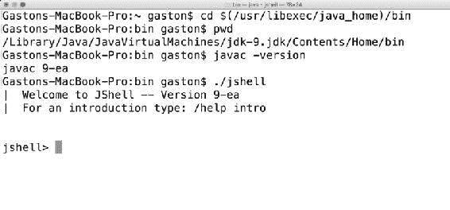
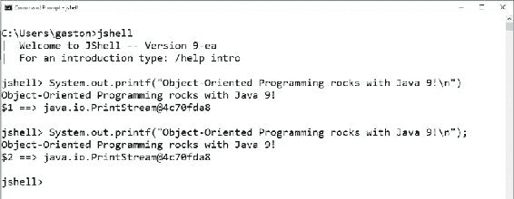
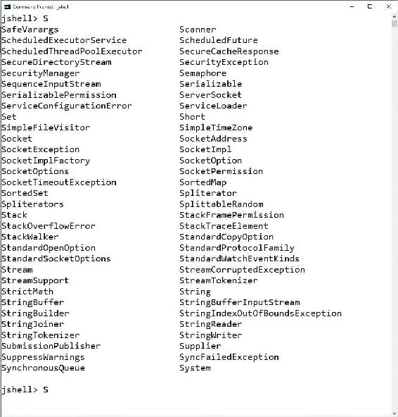
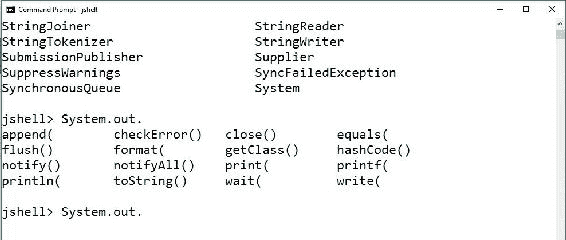
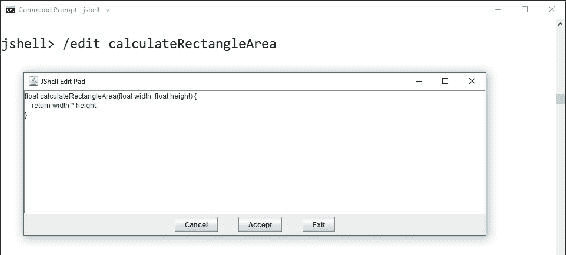
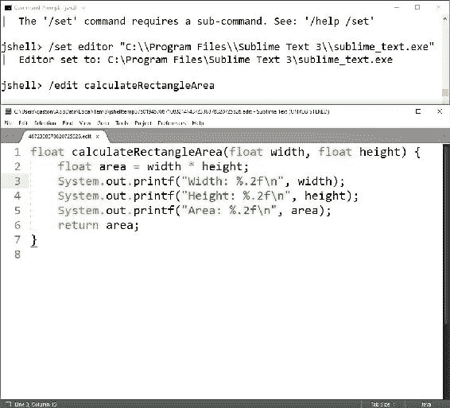
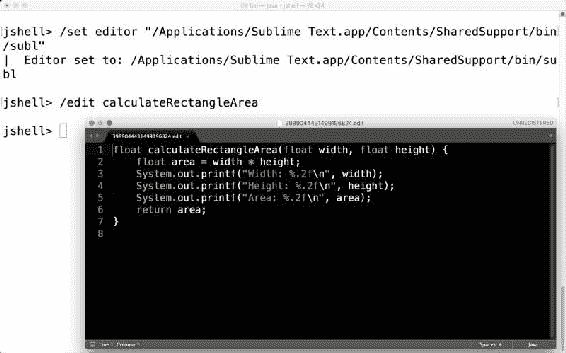

# 第一章：JShell-用于 Java 9 的读取-求值-打印-循环

在本章中，我们将开始使用 Java 9 进行面向对象编程的旅程。您将学习如何启动并使用 Java 9 中引入的新实用程序：JShell，它将使您能够轻松运行 Java 9 代码片段并打印其结果。我们将执行以下操作：

+   准备好使用 Java 9 进行**面向对象编程**的旅程

+   在 Windows，macOS 或 Linux 上安装所需的软件

+   了解使用**REPL**（**读取-求值-打印-循环**）实用程序的好处

+   检查默认导入并使用自动完成功能

+   在 JShell 中运行 Java 9 代码

+   评估表达式

+   使用变量，方法和源代码

+   在我们喜欢的外部代码编辑器中编辑源代码

+   加载源代码

# 准备好使用 Java 9 进行面向对象编程的旅程

在本书中，您将学习如何利用 Java 编程语言第 9 版中包含的所有面向对象的特性，即 Java 9。一些示例可能与以前的 Java 版本兼容，例如 Java 8，Java 7 和 Java 6，但是必须使用 Java 9 或更高版本，因为该版本不向后兼容。我们不会编写向后兼容以前的 Java 版本的代码，因为我们的主要目标是使用 Java 9 或更高版本，并使用其语法和所有新功能。

大多数情况下，我们不会使用任何**IDE**（**集成开发环境**），而是利用 JShell 和 JDK 中包含的许多其他实用程序。但是，您可以使用任何提供 Java 9 REPL 的 IDE 来使用所有示例。您将在接下来的章节中了解使用 REPL 的好处。在最后一章中，您将了解到使用 Java 9 引入的新模块化功能时，IDE 将给您带来的好处。

### 提示

无需具备 Java 编程语言的先前经验，即可使用本书中的示例并学习如何使用 Java 9 建模和创建面向对象的代码。如果您具有一些 C＃，C ++，Python，Swift，Objective-C，Ruby 或 JavaScript 的经验，您将能够轻松学习 Java 的语法并理解示例。许多现代编程语言都从 Java 中借鉴了功能，反之亦然。因此，对这些语言的任何了解都将非常有用。

在本章中，我们将在 Windows，macOS 或 Linux 上安装所需的软件。我们将了解使用 REPL，特别是 JShell，学习面向对象编程的好处。我们将学习如何在 JShell 中运行 Java 9 代码以及如何在 REPL 中加载源代码示例。最后，我们将学习如何在 Windows，macOS 和 Linux 上从命令行或终端运行 Java 代码。

# 在 Windows，macOS 或 Linux 上安装所需的软件

我们必须从[`jdk9.java.net/download/`](https://jdk9.java.net/download/)下载并安装适用于我们操作系统的最新版本的**JDK 9**（**Java 开发工具包 9**）。我们必须接受 Java 的许可协议才能下载软件。

与以前的版本一样，JDK 9 可用于许多不同的平台，包括但不限于以下平台：

+   Windows 32 位

+   Windows 64 位

+   macOS 64 位（以前称为 Mac OS X 或简称 OS X）

+   Linux 32 位

+   Linux 64 位

+   Linux on ARM 32 位

+   Linux on ARM 64 位

安装适用于我们操作系统的 JDK 9 的适当版本后，我们可以将 JDK 9 安装文件夹的`bin`子文件夹添加到`PATH`环境变量中。这样，我们就可以从我们所在的任何文件夹启动不同的实用程序。

### 提示

如果我们没有将 JDK 9 安装的文件夹的`bin`子文件夹添加到操作系统的`PATH`环境变量中，那么在执行命令时我们将始终需要使用`bin`子文件夹的完整路径。在启动不同的 Java 命令行实用程序的下一个说明中，我们将假设我们位于这个`bin`子文件夹中，或者`PATH`环境变量包含它。

一旦我们安装了 JDK 9，并将`bin`文件夹添加到`PATH`环境变量中，我们可以在 Windows 命令提示符或 macOS 或 Linux 终端中运行以下命令：

```java
javac -version

```

上一个命令将显示包含在 JDK 中的主要 Java 编译器的当前版本，该编译器将 Java 源代码编译为 Java 字节码。版本号应该以 9 开头，如下一个示例输出所示：

```java
javac 9-ea

```

如果上一个命令的结果显示的版本号不以 9 开头，我们必须检查安装是否成功。此外，我们必须确保`PATH`环境变量不包括 JDK 的旧版本路径，并且包括最近安装的 JDK 9 的`bin`文件夹。

现在，我们准备启动 JShell。在 Windows 命令提示符或 macOS 或 Linux 终端中运行以下命令：

```java
jshell

```

上一个命令将启动 JShell，显示包括正在使用的 JDK 版本的欢迎消息，并且提示符将更改为`jshell>`。每当我们看到这个提示时，这意味着我们仍然在 JShell 中。下面的屏幕截图显示了在 macOS 的终端窗口中运行的 JShell。



### 提示

如果我们想随时离开 JShell，我们只需要在 Mac 中按*Ctrl* + *D*。另一个选项是输入`/exit`并按*Enter*。

## 了解使用 REPL 的好处

Java 9 引入了一个名为 JShell 的交互式 REPL 命令行环境。这个工具允许我们执行 Java 代码片段并立即获得结果。我们可以轻松编写代码并查看其执行的结果，而无需创建解决方案或项目。我们不必等待项目完成构建过程来检查执行许多行代码的结果。JShell，像任何其他 REPL 一样，促进了探索性编程，也就是说，我们可以轻松地交互式地尝试和调试不同的算法和结构。

### 提示

如果您曾经使用过其他提供 REPL 或交互式 shell 的编程语言，比如 Python、Scala、Clojure、F#、Ruby、Smalltalk 和 Swift 等，您已经知道使用 REPL 的好处。

例如，假设我们必须与提供 Java 绑定的 IoT（物联网）库进行交互。我们必须编写 Java 代码来使用该库来控制无人机，也称为无人机（UAV）。无人机是一种与许多传感器和执行器进行交互的物联网设备，包括与发动机、螺旋桨和舵机连接的数字电子调速器。

我们希望能够编写几行代码来从传感器中检索数据并控制执行器。我们只需要确保事情按照文档中的说明进行。我们希望确保从高度计读取的数值在移动无人机时发生变化。JShell 为我们提供了一个适当的工具，在几秒钟内开始与库进行交互。我们只需要启动 JShell，加载库，并在 REPL 中开始编写 Java 9 代码。使用以前的 Java 版本，我们需要从头开始创建一个新项目，并在开始编写与库交互的第一行代码之前编写一些样板代码。JShell 允许我们更快地开始工作，并减少了创建整个框架以开始运行 Java 9 代码的需要。JShell 允许从 REPL 交互式探索 API（应用程序编程接口）。

我们可以在 JShell 中输入任何 Java 9 定义。例如，我们可以声明方法、类和变量。我们还可以输入 Java 表达式、语句或导入。一旦我们输入了声明方法的代码，我们就可以输入一个使用先前定义的方法的语句，并查看执行的结果。

JShell 允许我们从文件中加载源代码，因此，您将能够加载本书中包含的源代码示例并在 JShell 中评估它们。每当我们必须处理源代码时，您将知道可以从哪个文件夹和文件中加载它。此外，JShell 允许我们执行 JShell 命令。我们将在本章后面学习最有用的命令。

JShell 允许我们调用`System.out.printf`方法轻松格式化我们想要打印的输出。我们将在我们的示例代码中利用这个方法。

### 提示

JShell 禁用了一些在交互式 REPL 中没有用处的 Java 9 功能。每当我们在 JShell 中使用这些功能时，我们将明确指出 JShell 将禁用它们，并解释它们的影响。

在 JShell 中，语句末尾的分号(`;`)是可选的。但是，我们将始终在每个语句的末尾使用分号，因为我们不想忘记在编写项目和解决方案中的真实 Java 9 代码时必须使用分号。当我们输入要由 JShell 评估的表达式时，我们将省略语句末尾的分号。

例如，以下两行是等价的，它们都将在 JShell 中执行后打印`"Object-Oriented Programming rocks with Java 9!"`。第一行在语句末尾不包括分号(`;`)，第二行包括分号(`;`)。我们将始终使用分号(;)，如第二行中所示，以保持一致性。

```java
System.out.printf("Object-Oriented Programming rocks with Java 9!\n")
System.out.printf("Object-Oriented Programming rocks with Java 9!\n");
```

以下屏幕截图显示了在 Windows 10 上运行的 JShell 中执行这两行的结果：



在一些示例中，我们将利用 JShell 为我们提供的网络访问功能。这个功能对于与 Web 服务交互非常有用。但是，您必须确保您的防火墙配置中没有阻止 JShell。

### 提示

不幸的是，在我写这本书的时候，JShell 没有包括语法高亮功能。但是，您将学习如何使用我们喜欢的编辑器来编写和编辑代码，然后在 JShell 中执行。

## 检查默认导入并使用自动完成功能

默认情况下，JShell 提供一组常见的导入，我们可以使用`import`语句从任何额外的包中导入必要的类型来运行我们的代码片段。我们可以在 JShell 中输入以下命令来列出所有导入：

```java
/imports

```

以下行显示了先前命令的结果：

```java
|    import java.io.*
|    import java.math.*
|    import java.net.*
|    import java.nio.file.*
|    import java.util.*
|    import java.util.concurrent.*
|    import java.util.function.*
|    import java.util.prefs.*
|    import java.util.regex.*
|    import java.util.stream.*

```

与我们在 JShell 之外编写 Java 代码时一样，我们不需要从`java.lang`包导入类型，因为它们默认被导入，并且在 JShell 中运行`/imports`命令时不会列出它们。因此，默认情况下，JShell 为我们提供了访问以下包中的所有类型：

+   `java.lang`

+   `java.io`

+   `java.math`

+   `java.net`

+   `java.nio.file`

+   `java.util`

+   `java.util.concurrent`

+   `java.util.function`

+   `java.util.prefs`

+   `java.util.regex`

+   `java.util.stream`

JShell 提供自动完成功能。我们只需要在需要自动完成功能的时候按下*Tab*键，就像在 Windows 命令提示符或 macOS 或 Linux 中的终端中工作时一样。

有时，以我们输入的前几个字符开头的选项太多。在这些情况下，JShell 会为我们提供一个包含所有可用选项的列表，以提供帮助。例如，我们可以输入`S`并按*Tab*键。JShell 将列出从先前列出的包中导入的以`S`开头的所有类型。以下屏幕截图显示了 JShell 中的结果：



我们想要输入`System`。考虑到前面的列表，我们只需输入`Sys`，以确保`System`是以`Sys`开头的唯一选项。基本上，我们在作弊，以便了解 JShell 中自动补全的工作原理。输入`Sys`并按下*Tab*键。JShell 将显示`System`。

现在，在 JShell 中输入一个点（`.`），然后输入一个`o`（你将得到`System.o`），然后按下*Tab*键。JShell 将显示`System.out`。

接下来，输入一个点（`.`）并按下*Tab*键。JShell 将显示在`System.out`中声明的所有公共方法。在列表之后，JShell 将再次包括`System.out.`，以便我们继续输入我们的代码。以下屏幕截图显示了 JShell 中的结果：



输入`printl`并按下*Tab*键。JShell 将自动补全为`System.out.println(`，即它将添加一个`n`和开括号（`(`）。这样，我们只需输入该方法的参数，因为只有一个以`printl`开头的方法。输入`"Auto-complete is helpful in JShell");`并按下*Enter*。下一行显示完整的语句：

```java
System.out.println("Auto-complete is helpful in JShell");
```

在运行上述行后，JShell 将显示 JShell 中的结果的屏幕截图：


# 在 JShell 中运行 Java 9 代码

```java
Ctrl + *D* to exit the current JShell session. Run the following command in the Windows Command Prompt or in a macOS or Linux Terminal to launch JShell with a verbose feedback:
```

```java
jshell -v

```

```java
calculateRectangleArea. The method receives a width and a height for a rectangle and returns the result of the multiplication of both values of type float:
```

```java
float calculateRectangleArea(float width, float height) {
    return width * height;
}
```

在输入上述代码后，JShell 将显示下一个消息，指示它已创建了一个名为`calculateRectangleArea`的方法，该方法有两个`float`类型的参数：

```java
|  created method calculateRectangleArea(float,float)

```

### 提示

请注意，JShell 写的所有消息都以管道符号（`|`）开头。

在 JShell 中输入以下命令，列出我们在当前会话中迄今为止键入和执行的当前活动代码片段：

```java
/list

```

```java
 result of the previous command. The code snippet that created the calculateRectangleArea method has been assigned 1 as the snippet id.
```

```java
 1 : float calculateRectangleArea(float width, float height) {
 return width * height;
 }

```

在 JShell 中输入以下代码，创建一个名为`width`的新的`float`变量，并将其初始化为`50`：

```java
float width = 50;
```

在输入上述行后，JShell 将显示下一个消息，指示它已创建了一个名为`width`的`float`类型的变量，并将值`50.0`赋给了这个变量：

```java
width ==> 50.0
|  created variable width : float

```

在 JShell 中输入以下代码，创建一个名为`height`的新的`float`变量，并将其初始化为`25`：

```java
float height = 25;
```

在输入上述行后，JShell 将显示下一个消息，指示它已创建了一个名为`height`的`float`类型的变量，并将值`25.0`赋给了这个变量：

```java
height ==> 25.0
|  created variable height : float

```

输入`float area = ca`并按下*Tab*键。JShell 将自动补全为`float area = calculateRectangleArea(`，即它将添加`lculateRectangleArea`和开括号（`(`）。这样，我们只需输入该方法的两个参数，因为只有一个以`ca`开头的方法。输入`width, height);`并按下*Enter*。下一行显示完整的语句：

```java
float area = calculateRectangleArea(width, height);
```

在输入上述行后，JShell 将显示下一个消息，指示它已创建了一个名为`area`的`float`类型的变量，并将调用`calculateRectangleArea`方法并将先前声明的`width`和`height`变量作为参数。该方法返回`1250.0`作为结果，并将其赋给`area`变量。

```java
area ==> 1250.0
|  created variable area : float

```

在 JShell 中输入以下命令，列出我们在当前会话中迄今为止键入和执行的当前活动代码片段：

```java
/list

```

```java
 with the snippet id, that is, a unique number that identifies each code snippet. JShell will display the following lines as a result of the previous command:
```

```java
 1 : float calculateRectangleArea(float width, float height) {
 return width * height;
 }
 2 : float width = 50;
 3 : float height = 25;
 4 : float area = calculateRectangleArea(width, height);

```

在 JShell 中输入以下代码，使用`System.out.printf`来显示`width`、`height`和`area`变量的值。我们在作为`System.out.printf`的第一个参数传递的字符串中的第一个`%.2f`使得字符串后面的下一个参数（`width`）以两位小数的浮点数形式显示。我们重复两次`%.2f`来以两位小数的浮点数形式显示`height`和`area`变量。

```java
System.out.printf("Width: %.2f, Height: %.2f, Area: %.2f\n", width, height, area);
```

在输入上述行后，JShell 将使用`System.out.printf`格式化输出，并打印下一个消息，后面跟着一个临时变量的名称：

```java
Width: 50.00, Height: 25.00, Area: 1250.00
$5 ==> java.io.PrintStream@68c4039c
|  created scratch variable $5 : PrintStream

```

## 评估表达式

JShell 允许我们评估任何有效的 Java 9 表达式，就像我们在使用 IDE 和典型的表达式评估对话框时所做的那样。在 JShell 中输入以下表达式：

```java
width * height;
```

在我们输入上一行后，JShell 将评估表达式，并将结果分配给一个以`$`开头并后跟一个数字的临时变量。JShell 显示临时变量名称`$6`，分配给该变量的值指示表达式评估结果的`1250.0`，以及临时变量的类型`float`。下面的行显示在我们输入上一个表达式后 JShell 中显示的消息：

```java
$6 ==> 1250.0
|  created scratch variable $6 : float

```

```java
$6 variable as a floating point number with two decimal places. Make sure you replace $6 with the scratch variable name that JShell generated.
```

```java
System.out.printf("The calculated area is %.2f", $6);
```

在我们输入上一行后，JShell 将使用`System.out.printf`格式化输出，并打印下一个消息：

```java
The calculated area is 1250.00

```

我们还可以在另一个表达式中使用先前创建的临时变量。在 JShell 中输入以下代码，将`10.5`（`float`）添加到`$6`变量的值中。确保用 JShell 生成的临时变量名称替换`$6`。

```java
$6 + 10.5f;
```

在我们输入上一行后，JShell 将评估表达式，并将结果分配给一个新的临时变量，其名称以`$`开头，后跟一个数字。JShell 显示临时变量名称`$8`，分配给该变量的值指示表达式评估结果的`1260.5`，以及临时变量的类型`float`。下面的行显示在我们输入上一个表达式后 JShell 中显示的消息：

```java
$8 ==> 1250.5
|  created scratch variable $8 : float

```

### 提示

与之前发生的情况一样，临时变量的名称可能不同。例如，可能是`$9`或`$10`，而不是`$8`。

# 使用变量、方法和源

到目前为止，我们已经创建了许多变量，而且在我们输入表达式并成功评估后，JShell 创建了一些临时变量。在 JShell 中输入以下命令，列出迄今为止在当前会话中创建的当前活动变量的类型、名称和值：

```java
/vars

```

以下行显示结果：

```java
|    float width = 50.0
|    float height = 25.0
|    float area = 1250.0
|    PrintStream $5 = java.io.PrintStream@68c4039c
|    float $6 = 1250.0
|    float $8 = 1260.5

```

在 JShell 中输入以下代码，将`80.25`（`float`）赋给先前创建的`width`变量：

```java
width = 80.25f;
```

在我们输入上一行后，JShell 将显示下一个消息，指示它已将`80.25`（`float`）分配给现有的`float`类型变量`width`：

```java
width ==> 80.25
|  assigned to width : float

```

在 JShell 中输入以下代码，将`40.5`（`float`）赋给先前创建的`height`变量：

```java
height = 40.5f;
```

在我们输入上一行后，JShell 将显示下一个消息，指示它已将`40.5`（`float`）分配给现有的`float`类型变量`height`：

```java
height ==> 40.5
|  assigned to height : float

```

再次在 JShell 中输入以下命令，列出当前活动变量的类型、名称和值：

```java
/vars

```

以下行显示了反映我们已经为`width`和`height`变量分配的新值的结果：

```java
|    float width = 80.25
|    float height = 40.5
|    float area = 1250.0
|    PrintStream $5 = java.io.PrintStream@68c4039c
|    float $6 = 1250.0
|    float $8 = 1260.5

```

在 JShell 中输入以下代码，创建一个名为`calculateRectanglePerimeter`的新方法。该方法接收一个矩形的`width`变量和一个`height`变量，并返回`float`类型的两个值之和乘以`2`的结果。

```java
float calculateRectanglePerimeter(float width, float height) {
    return 2 * (width + height);
}
```

在我们输入上一行后，JShell 将显示下一个消息，指示它已创建一个名为`calculateRectanglePerimeter`的方法，该方法有两个`float`类型的参数：

```java
|  created method calculateRectanglePerimeter(float,float)

```

在 JShell 中输入以下命令，列出迄今为止在当前会话中创建的当前活动方法的名称、参数类型和返回类型：

```java
/methods

```

以下行显示结果。

```java
|    calculateRectangleArea (float,float)float
|    calculateRectanglePerimeter (float,float)float

```

在 JShell 中输入以下代码，打印调用最近创建的`calculateRectanglePerimeter`的结果，其中`width`和`height`作为参数：

```java
calculateRectanglePerimeter(width, height);
```

在我们输入上一行后，JShell 将调用该方法，并将结果分配给一个以`$`开头并带有数字的临时变量。JShell 显示了临时变量名`$16`，分配给该变量的值表示方法返回的结果`241.5`，以及临时变量的类型`float`。下面的行显示了在我们输入调用方法的先前表达式后，JShell 中显示的消息：

```java
$16 ==> 241.5
|  created scratch variable $16 : float

```

现在，我们想对最近创建的`calculateRectanglePerimeter`方法进行更改。我们想添加一行来打印计算的周长。在 JShell 中输入以下命令，列出该方法的源代码：

```java
/list calculateRectanglePerimeter

```

以下行显示了结果：

```java
 15 : float calculateRectanglePerimeter(float width, float height) {
 return 2 * (width + height);
 }

```

在 JShell 中输入以下代码，用新代码覆盖名为`calculateRectanglePerimeter`的方法，该新代码打印接收到的宽度和高度值，然后使用与内置`printf`方法相同的方式工作的`System.out.printf`方法调用打印计算的周长。我们可以从先前列出的源代码中复制和粘贴这些部分。这里突出显示了更改：

```java
float calculateRectanglePerimeter(float width, float height) {
 float perimeter = 2 * (width + height);
 System.out.printf("Width: %.2f\n", width);
 System.out.printf("Height: %.2f\n", height);
 System.out.printf("Perimeter: %.2f\n", perimeter);
 return perimeter;
}
```

在我们输入上述行后，JShell 将显示下一个消息，指示它已修改并覆盖了名为`calculateRectanglePerimeter`的方法，该方法有两个`float`类型的参数：

```java
|  modified method calculateRectanglePerimeter(float,float)
|    update overwrote method calculateRectanglePerimeter(float,float)

```

在 JShell 中输入以下代码，以打印调用最近修改的`calculateRectanglePerimeter`方法并将`width`和`height`作为参数的结果：

```java
calculateRectanglePerimeter(width, height);
```

在我们输入上一行后，JShell 将调用该方法，并将结果分配给一个以`$`开头并带有数字的临时变量。前几行显示了由我们添加到方法中的三次调用`System.out.printf`生成的输出。最后，JShell 显示了临时变量名`$19`，分配给该变量的值表示方法返回的结果`241.5`，以及临时变量的类型`float`。

下面的行显示了在我们输入调用方法的先前表达式后，JShell 中显示的消息：

```java
Width: 80.25
Height: 40.50
Perimeter: 241.50
$19 ==> 241.5
|  created scratch variable $19 : float

```

# 在我们喜爱的外部代码编辑器中编辑源代码

我们创建了`calculateRectanglePerimeter`方法的新版本。现在，我们想对`calculateRectangleArea`方法进行类似的更改。但是，这一次，我们将利用编辑器来更轻松地对现有代码进行更改。

在 JShell 中输入以下命令，启动默认的 JShell 编辑面板编辑器，以编辑`calculateRectangleArea`方法的源代码：

```java
/edit calculateRectangleArea

```

JShell 将显示一个对话框，其中包含 JShell 编辑面板和`calculateRectangleArea`方法的源代码，如下面的屏幕截图所示：



JShell 编辑面板缺少我们从代码编辑器中喜欢的大多数功能，我们甚至不能认为它是一个体面的代码编辑器。事实上，它只允许我们轻松地编辑源代码，而无需从先前的列表中复制和粘贴。我们将在以后学习如何配置更好的编辑器。

在 JShell 编辑面板中输入以下代码，以用新代码覆盖名为`calculateRectangleArea`的方法，该新代码打印接收到的宽度和高度值，然后使用`Sytem.out.printf`方法调用打印计算的面积。这里突出显示了更改：

```java
float calculateRectangleArea(float width, float height) {
 float area = width * height;
 System.out.printf("Width: %.2f\n", width);
 System.out.printf("Height: %.2f\n", height);
 System.out.printf("Area: %.2f\n", area);
 return area;
}
```

点击**接受**，然后点击**退出**。JShell 将关闭 JShell 编辑面板，并显示下一个消息，指示它已修改并覆盖了名为`calculateRectangleArea`的方法，该方法有两个`float`类型的参数：

```java
|  modified method calculateRectangleArea(float,float)
|    update overwrote method calculateRectangleArea(float,float)

```

在 JShell 中输入以下代码，以打印调用最近修改的`calculateRectangleArea`方法并将`width`和`height`作为参数的结果：

```java
calculateRectangleArea(width, height);
```

输入上述行后，JShell 将调用该方法，并将结果赋给一个以`$`开头并带有数字的临时变量。前几行显示了通过对该方法添加的三次`System.out.printf`调用生成的输出。最后，JShell 显示了临时变量名`$24`，指示方法返回的结果的值`3250.125`，以及临时变量的类型`float`。接下来的几行显示了在输入调用方法的新版本的前一个表达式后，JShell 显示的消息：

```java
Width: 80.25
Height: 40.50
Area: 3250.13
$24 ==> 3250.125
|  created scratch variable $24 : float

```

好消息是，JShell 允许我们轻松配置任何外部编辑器来编辑代码片段。我们只需要获取要使用的编辑器的完整路径，并在 JShell 中运行一个命令来配置我们想要在使用`/edit`命令时启动的编辑器。

例如，在 Windows 中，流行的 Sublime Text 3 代码编辑器的默认安装路径是`C:\Program Files\Sublime Text 3\sublime_text.exe`。如果我们想要使用此编辑器在 JShell 中编辑代码片段，必须运行`/set editor`命令，后跟用双引号括起来的路径。我们必须确保在路径字符串中用双反斜杠（\\）替换反斜杠（\）。对于先前解释的路径，我们必须运行以下命令：

```java
/set editor "C:\\Program Files\\Sublimet Text 3\\sublime_text.exe"

```

输入上述命令后，JShell 将显示一条消息，指示编辑器已设置为指定路径：

```java
| Editor set to: C:\Program Files\Sublime Text 3\sublime_text.exe

```

更改编辑器后，我们可以在 JShell 中输入以下命令，以启动新编辑器对`calculateRectangleArea`方法的源代码进行更改：

```java
/edit calculateRectangleArea

```

JShell 将启动 Sublime Text 3 或我们可能指定的任何其他编辑器，并将加载一个临时文件，其中包含`calculateRectangleArea`方法的源代码，如下截图所示：



### 提示

如果我们保存更改，JShell 将自动覆盖该方法，就像我们使用默认编辑器 JShell Edit Pad 时所做的那样。进行必要的编辑后，我们必须关闭编辑器，以继续在 JShell 中运行 Java 代码或 JShell 命令。

在任何平台上，JShell 都会创建一个带有`.edit`扩展名的临时文件。因此，我们可以配置我们喜欢的编辑器，以便在打开带`.edit`扩展名的文件时使用 Java 语法高亮显示。

在 macOS 或 Linux 中，路径与 Windows 中的不同，因此必要的步骤也不同。例如，在 macOS 中，为了在默认路径中安装流行的 Sublime Text 3 代码编辑器时启动它，我们必须运行`/Applications/Sublime Text.app/Contents/SharedSupport/bin/subl`。

如果我们想要使用此编辑器在 JShell 中编辑代码片段，必须运行`/set editor`命令，后跟完整路径，路径需用双引号括起来。对于先前解释的路径，我们必须运行以下命令：

```java
/set editor "/Applications/Sublime Text.app/Contents/SharedSupport/bin/subl"

```

输入上述命令后，JShell 将显示一条消息，指示编辑器已设置为指定路径：

```java
|  Editor set to: /Applications/Sublime Text.app/Contents/SharedSupport/bin/subl

```

更改编辑器后，我们可以在 JShell 中输入以下命令，以启动新编辑器对`calculateRectangleArea`方法的源代码进行更改：

```java
/edit calculateRectangleArea

```

JShell 将在 macOS 上启动 Sublime Text 3 或我们可能指定的任何其他编辑器，并将加载一个临时文件，其中包含`calculateRectangleArea`方法的源代码，如下截图所示：



# 加载源代码

当然，我们不必为每个示例输入源代码。自动补全功能很有用，但我们将利用一个命令，允许我们在 JShell 中从文件加载源代码。

按下*Ctrl* + *D*退出当前的 JShell 会话。在 Windows 命令提示符中或 macOS 或 Linux 终端中运行以下命令，以启动具有详细反馈的 JShell：

```java
jshell -v

```

以下行显示了声明`calculateRectanglePerimeter`和`calculateRectangleArea`方法的最新版本的代码。然后，代码声明并初始化了两个`float`类型的变量：`width`和`height`。最后，最后两行调用了先前定义的方法，并将`width`和`height`作为它们的参数。示例的代码文件包含在`java_9_oop_chapter_01_01`文件夹中的`example01_01.java`文件中。

```java
float calculateRectanglePerimeter(float width, float height) {
    float perimeter = 2 * (width + height);
    System.out.printf("Width: %.2f\n", width);
    System.out.printf("Height: %.2f\n", height);
    System.out.printf("Perimeter: %.2f\n", perimeter);
    return perimeter;
}

float calculateRectangleArea(float width, float height) {
    float area = width * height;
    System.out.printf("Width: %.2f\n", width);
    System.out.printf("Height: %.2f\n", height);
    System.out.printf("Area: %.2f\n", area);
    return area;
}

float width = 120.25f;
float height = 35.50f;
calculateRectangleArea(width, height);
calculateRectanglePerimeter(width, height);
```

```java
If the root folder for the source code in Windows is C:\Users\Gaston\Java9, you can run the following command to load and execute the previously shown source code in JShell:
```

```java
/open C:\Users\Gaston\Java9\java_9_oop_chapter_01_01\example01_01.java

```

如果 macOS 或 Linux 中源代码的根文件夹是`~/Documents/Java9`，您可以运行以下命令在 JShell 中加载和执行先前显示的源代码：

```java
/open ~/Documents/Java9/java_9_oop_chapter_01_01/example01_01.java

```

在输入先前的命令后，根据我们的配置和操作系统，JShell 将加载和执行先前显示的源代码，并在运行加载的代码片段后显示生成的输出。以下行显示了输出：

```java
Width: 120.25
Height: 35.50
Area: 4268.88
Width: 120.25
Height: 35.50
Perimeter: 311.50

```

现在，在 JShell 中输入以下命令，以列出到目前为止在当前会话中执行的来自源文件的当前活动代码片段：

```java
/list

```

以下行显示了结果。请注意，JShell 使用不同的片段 ID 为不同的方法定义和表达式添加前缀，因为加载的源代码的行为方式与我们逐个输入片段一样：

```java
 1 : float calculateRectanglePerimeter(float width, float height) {
 float perimeter = 2 * (width + height);
 System.out.printf("Width: %.2f\n", width);
 System.out.printf("Height: %.2f\n", height);
 System.out.printf("Perimeter: %.2f\n", perimeter);
 return perimeter;
 }
 2 : float calculateRectangleArea(float width, float height) {
 float area = width * height;
 System.out.printf("Width: %.2f\n", width);
 System.out.printf("Height: %.2f\n", height);
 System.out.printf("Area: %.2f\n", area);
 return area;
 }
 3 : float width = 120.25f;
 4 : float height = 35.50f;

 5 : calculateRectangleArea(width, height);
 6 : calculateRectanglePerimeter(width, height);

```

### 提示

确保在找到书中的源代码时，使用先前解释的`/open`命令，后跟代码文件的路径和文件名，以便在 JShell 中加载和执行代码文件。这样，您就不必输入每个代码片段，而且可以检查在 JShell 中执行代码的结果。

# 测试你的知识

1.  JShell 是：

1.  Java 9 REPL。

1.  在以前的 JDK 版本中等同于`javac`。

1.  Java 9 字节码反编译器。

1.  REPL 的意思是：

1.  运行-扩展-处理-循环。

1.  读取-评估-处理-锁。

1.  读取-评估-打印-循环。

1.  以下哪个命令列出了当前 JShell 会话中创建的所有变量：

1.  `/variables`

1.  `/vars`

1.  `/list-all-variables`

1.  以下哪个命令列出了当前 JShell 会话中创建的所有方法：

1.  `/methods`

1.  `/meth`

1.  `/list-all-methods`

1.  以下哪个命令列出了当前 JShell 会话中迄今为止评估的源代码：

1.  `/source`

1.  `/list`

1.  `/list-source`

# 摘要

在本章中，我们开始了使用 Java 9 进行面向对象编程的旅程。我们学会了如何启动和使用 Java 9 中引入的新实用程序，该实用程序允许我们轻松运行 Java 9 代码片段并打印其结果：JShell。

我们学习了安装 JDK 9 所需的步骤，并了解了使用 REPL 的好处。我们学会了使用 JShell 来运行 Java 9 代码和评估表达式。我们还学会了许多有用的命令和功能。在接下来的章节中，当我们开始使用面向对象的代码时，我们将使用它们。

现在我们已经学会了如何使用 JShell，我们将学会如何识别现实世界的元素，并将它们转化为 Java 9 中支持的面向对象范式的不同组件，这是我们将在下一章中讨论的内容。
