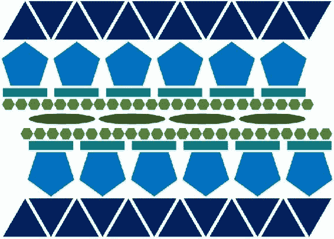
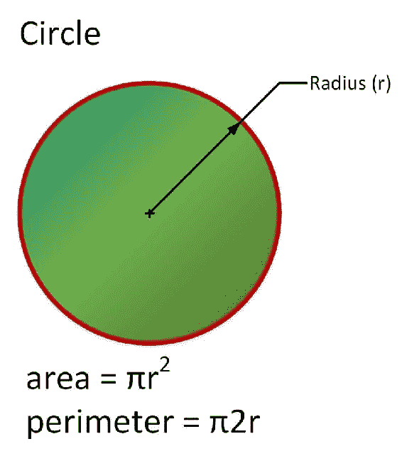
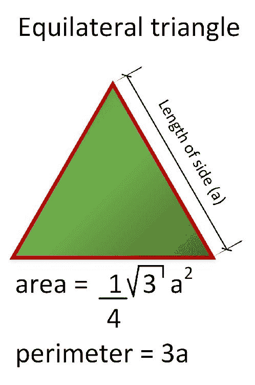
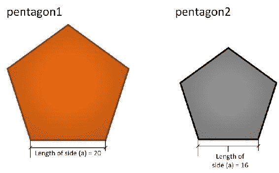
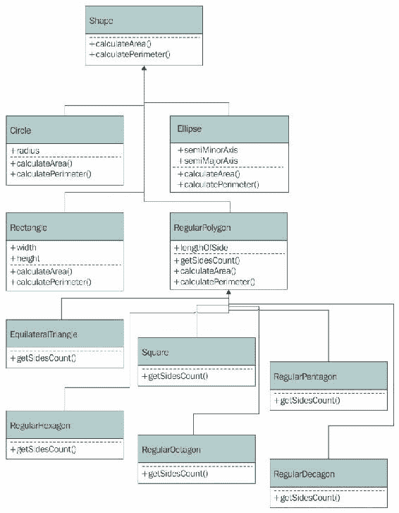
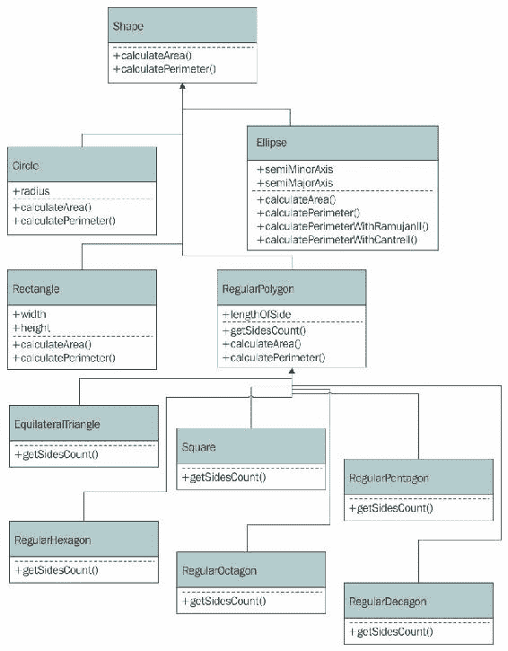

# 第二章：通过 JShell 识别 UML 图表和 Java 9 中的现实世界对象

在本章中，我们将学习如何从现实生活中的情况中识别对象。我们将了解，使用对象使得编写更易于理解和重用的代码变得更简单。我们将学习如何识别现实世界的元素，并将它们转化为 Java 9 中支持的面向对象范式的不同组件。我们将：

+   从应用程序需求中识别对象

+   从现实世界中捕捉对象

+   生成类以创建对象

+   识别变量和常量以创建字段

+   识别创建方法的动作

+   使用 UML 图表组织类

+   利用领域专家的反馈来改进我们的类

+   在 JShell 中使用 Java 对象

# 从应用程序需求中识别对象

每当你在现实世界中解决问题时，你都会使用元素并与它们互动。例如，当你口渴时，你拿起一个玻璃杯，倒满水、苏打水或你最喜欢的果汁，然后喝掉。同样，你可以轻松地从现实世界的场景中识别称为对象的元素，然后将它们转化为面向对象的代码。我们将开始学习面向对象编程的原则，以便在 Java 9 编程语言中开发任何类型的应用程序。

现在，我们将想象我们需要开发一个 RESTful Web 服务，这个服务将被移动应用程序和网络应用程序所使用。这些应用程序将具有不同的用户界面和多样化的用户体验。然而，我们不必担心这些差异，因为我们将专注于 Web 服务，也就是说，我们将成为后端开发人员。

艺术家使用不同的几何形状和有机形状的组合来创作艺术品。当然，创作艺术比这个简单的定义要复杂一些，但我们的目标是学习面向对象编程，而不是成为艺术专家。

几何形状由点和线组成，它们是精确的。以下是几何形状的例子：圆形、三角形、正方形、长方形。

有机形状是具有自然外观和弯曲外观的形状。这些形状通常是不规则的或不对称的。我们通常将来自自然界的事物，如动物和植物，与有机形状联系在一起。

当艺术家想要创造通常需要有机形状的事物的抽象解释时，他们使用几何形状。想象一下，Vanessa Pitstop 是一位画家和手工艺品制作人。几年前，她开始在 Instagram 和 YouTube 上上传关于她的艺术作品的视频，并在她的艺术生涯中取得了重要的里程碑：旧金山现代艺术博物馆准备举办她最重要艺术作品的展览。这一特别事件在社交网络网站上产生了巨大的影响，正如通常发生的那样，与这一重要的知名度提升相关的新软件开发任务也随之而来。

Pitstop 是一位非常受欢迎的 YouTuber，她的频道拥有超过四百万的粉丝。许多好莱坞女演员购买了她的艺术品，并在 Instagram 上上传了自拍照，背景是她的艺术作品。她的展览引起了对她作品的巨大额外兴趣，其中一位赞助商想要创建基于几何形状的移动应用程序和网络应用程序，并提供关于所有工具和丙烯颜料的细节，用户需要购买这些工具和颜料来制作艺术品。

Pitstop 草图基本形状，然后用丙烯颜料涂抹它们以构建几何图案。移动应用程序和 Web 应用程序将使用我们的 Web 服务来构建 Pitstop 的预定义图案，基于用户选择的画布大小和一些预定义的颜色方案。我们的 Web 服务将接收画布大小和颜色方案，以生成图案和材料清单。具体来说，Web 服务将提供用户必须购买的不同工具和丙烯颜料管、罐或瓶的清单，以绘制所绘制的图案。最后，用户将能够下订单请求所有或部分建议的材料。

以下图片显示了 Pitstop 的艺术作品的第一个例子，其中包含几何图案。让我们看一下图片，并提取组成图案的物体。

以下对象组成了几何图案，具体来说，从上到下的以下 2D 形状：

+   12 个等边三角形

+   6 个正方形

+   6 个矩形

+   28 个圆

+   4 个椭圆

+   28 个圆

+   6 个矩形

+   6 个正方形

+   12 个等边三角形

相当简单地描述组成图案的 108 个物体或 2D 形状。我们能够识别所有这些物体，并指出每个物体的具体 2D 形状。如果我们测量每个三角形，我们会意识到它们是等边三角形。

以下图片显示了 Pitstop 的艺术作品的第二个例子，其中包含几何图案。让我们看一下图片，并提取组成图案的物体。

以下对象组成了几何图案，具体来说，从上到下的以下 2D 形状：

+   12 个等边三角形

+   6 个正五边形

+   6 个矩形

+   24 个正六边形

+   4 个椭圆

+   24 个正六边形

+   6 个矩形

+   6 个正五边形

+   12 个等边三角形

这一次，我们可以描述组成图案的 100 个物体或 2D 形状。我们能够识别所有这些物体，并指出每个物体的具体 2D 形状。如果我们测量每个五边形和六边形，我们会意识到它们是正五边形和六边形。

以下图片显示了 Pitstop 的艺术作品的第三个例子，其中包含几何图案。在这种情况下，我们有大量的 2D 形状。让我们看一下图片，只提取图案中包含的不同 2D 形状。这一次，我们不会计算物体的数量。

该图案包括以下 2D 形状：

+   等边三角形

+   正方形

+   正五边形

+   正六边形

+   正七边形

+   正八边形

+   正十边形

以下图片显示了 Pitstop 的艺术作品的第四个例子，其中包含几何图案。在这种情况下，我们也有大量的 2D 形状，其中一些与彼此相交。然而，如果我们留意，我们仍然能够识别不同的 2D 形状。让我们看一下图片，只提取图案中包含的不同 2D 形状。我们不会计算物体的数量。

该图案包括以下 2D 形状：

+   正五边形

+   正十边形

+   圆形

+   等边三角形

+   正方形

+   正八边形

以下图片显示了 Pitstop 的艺术作品的第五个例子，其中包含几何图案。在这种情况下，我们将从左到右识别形状，因为图案有不同的方向。我们有许多形状相互交叉。让我们看一下图片，只提取图案中包含的不同 2D 形状。我们不会计算物体的数量。

该图案包括以下 2D 形状：

+   圆形

+   正八边形

+   等边三角形

+   正方形

+   正八边形

# 捕捉现实世界的物体

我们可以轻松地从 Pitstop 的艺术品中识别出对象。我们了解到每个模式由许多二维几何形状组成，并且我们在分析的所有示例中识别出了她使用的不同形状。现在，让我们专注于 Web 服务的核心需求之一，即计算所需的丙烯酸漆量以制作艺术品。我们必须考虑每个模式中包含的每种二维形状的以下数据，以便计算所需的材料和生产每种形状所需的丙烯酸漆的数量：

+   线颜色

+   周长

+   填充颜色

+   面积

可以使用特定颜色来绘制每个形状的边界线，因此，我们必须计算周长，以便将其用作估算用户必须购买的丙烯酸漆的数量之一，以绘制每个二维形状的边界。然后，我们必须计算面积，以便将其用作估算用户必须购买的丙烯酸漆的数量之一，以填充每个二维形状的区域。

我们必须开始为我们的 Web 服务后端代码进行工作，该代码计算我们在迄今为止分析的所有示例艺术品中识别出的不同二维形状的面积和周长。我们得出结论，Web 服务必须支持以下九种形状的模式：

+   圆

+   椭圆

+   等边三角形

+   正方形

+   矩形

+   正五边形

+   正六边形

+   正八边形

+   正十边形

在进行一些关于二维几何的研究后，我们可以开始编写 Java 9 代码。具体来说，我们可能会编写九种方法来计算先前列举的二维形状的面积，另外九种方法来计算它们的周长。请注意，我们正在谈论将返回计算值的方法，也就是函数。我们停止了对对象的思考，因此，我们将在这条路上遇到一些问题，我们将用面向对象的方法来解决这些问题。

例如，如果我们开始考虑解决问题的方法，一个可能的解决方案是编写以下十八个函数来完成工作：

+   `calculateCircleArea`

+   `calculateEllipseArea`

+   `calculateEquilateralTriangleArea`

+   `calculateSquareArea`

+   `calculateRectangleArea`

+   `calculateRegularPentagonArea`

+   `calculateRegularHexagonArea`

+   `calculateRegularOctagonArea`

+   `calculateRegularDecagonArea`

+   `calculateCirclePerimeter`

+   `calculateEllipsePerimeter`

+   `calculateEquilateralTrianglePerimeter`

+   `calculateSquarePerimeter`

+   `calculateRectanglePerimeter`

+   `calculateRegularPentagonPerimeter`

+   `calculateRegularHexagonPerimeter`

+   `calculateRegularOctagonPerimeter`

+   `calculateRegularDecagonPerimeter`

先前列举的每种方法都必须接收每种形状的必要参数，并返回其计算出的面积或周长。这些函数没有副作用，也就是说，它们不会改变接收到的参数，并且只返回计算出的面积或周长的结果。

现在，让我们暂时忘记方法或函数。让我们回到我们被分配的 Web 服务需求中的真实世界对象。我们必须计算九个元素的面积和周长，这些元素是需求中代表真实物体的九个名词，具体来说是二维形状。我们已经建立了一个包含九个真实世界对象的列表。

在识别了现实生活中的对象并对其进行了一些思考之后，我们可以通过遵循面向对象的范例来开始设计我们的 Web 服务。我们可以创建代表列举的 2D 形状的状态和行为的软件对象，而不是创建一组执行所需任务的方法。这样，不同的对象模拟了现实世界的 2D 形状。我们可以使用这些对象来指定计算面积和周长所需的不同属性。然后，我们可以扩展这些对象以包括计算其他所需值所需的附加数据，例如绘制边界所需的丙烯酸漆的数量。

现在，让我们进入现实世界，思考之前列举的九种形状中的每一种。想象一下，我们必须在纸上绘制每种形状并计算它们的面积和周长。在我们绘制每种形状之后，我们将使用哪些值来计算它们的面积和周长？我们将使用哪些公式？

### 提示

我们在开始编码之前就开始了面向对象的设计，因此，我们将像不了解几何学的许多概念一样工作。例如，我们可以很容易地推广我们用来计算正多边形周长和面积的公式。然而，在大多数情况下，我们不会是该主题的专家，我们必须在可以用面向对象的方法概括行为之前获得一些应用领域的知识。因此，我们将深入研究这个主题，就好像我们对这个主题知之甚少。

下图显示了一个绘制的圆和我们将用来计算其周长和面积的公式。我们只需要半径值，通常标识为**r**。

下图显示了一个绘制的椭圆和我们将用来计算其周长和面积的公式。我们需要半长轴（通常标记为**a**）和半短轴（通常标记为**b**）的值。请注意，提供的周长公式提供了一个不太精确的近似值。我们将稍后更深入地研究这个特定问题。

下图显示了一个绘制的等边三角形和我们将用来计算其周长和面积的公式。这种三角形的三条边相等，三个内角相等于 60 度。我们只需要边长值，通常标识为**a**。

下图显示了一个绘制的正方形和我们将用来计算其周长和面积的公式。我们只需要边长值，通常标识为**a**。

下图显示了一个绘制的矩形和我们将用来计算其周长和面积的公式。我们需要宽度和高度值，通常标识为**w**和**h**。

下图显示了一个绘制的正五边形和我们将用来计算其周长和面积的公式。我们只需要边长值，通常标记为**a**。

下图显示了一个绘制的正六边形和我们将用来计算其周长和面积的公式。我们只需要边长值，通常标记为**a**。

下图显示了一个绘制的正十边形和我们将用来计算其周长和面积的公式。我们只需要边长值，通常标记为**a**。

以下表格总结了计算每种形状的周长和面积所需的数据：

| 形状 | 所需数据 |
| --- | --- |
| 圆 | 半径 |
| 椭圆 | 半长轴和半短轴 |
| 等边三角形 | 边长 |
| 正方形 | 边长 |
| 矩形 | 宽度和高度 |
| 正五边形 | 边长 |
| 正六边形 | 边长 |
| 正八边形 | 边长 |
| 正十边形 | 边长 |

每个代表特定形状的对象都封装了我们确定的所需数据。例如，代表椭圆的对象将封装椭圆的半长轴和半短轴值，而代表矩形的对象将封装矩形的宽度和高度值。

### 注意

**数据封装**是面向对象编程的重要支柱之一。

# 生成类以创建对象

假设我们必须绘制和计算三个不同矩形的周长和面积。你最终会得到三个矩形，它们的宽度和高度值以及计算出的周长和面积。有一个蓝图来简化绘制每个具有不同宽度和高度值的矩形的过程将是很好的。

在面向对象编程中，**类**是创建对象的模板定义或蓝图。类是定义对象状态和行为的模型。声明了定义矩形状态和行为的类之后，我们可以使用它来生成代表每个真实世界矩形状态和行为的对象。

### 注意

对象也被称为实例。例如，我们可以说每个`矩形`对象是`Rectangle`类的一个实例。

下图显示了两个名为`rectangle1`和`rectangle2`的矩形实例。这些实例是根据它们指定的宽度和高度值绘制的。我们可以使用`Rectangle`类作为蓝图来生成这两个不同的`Rectangle`实例。请注意，`rectangle1`的宽度和高度值为`36`和`20`，`rectangle2`的宽度和高度值为`22`和`41`。每个实例的宽度和高度值都不同。理解类和通过其使用生成的对象或实例之间的区别非常重要。Java 9 支持的面向对象编程特性允许我们发现我们用来生成特定对象的蓝图。我们将在接下来的章节中使用这些特性。因此，我们可以确定每个对象是否是`Rectangle`类的实例。

下图显示了两个名为`pentagon1`和`pentagon2`的正五边形实例。这些实例是根据它们指定的边长值绘制的。我们可以使用`RegularPentagon`类作为蓝图来生成这两个不同的`RegularPentagon`实例。请注意，`pentagon1`的边长值为`20`，`pentagon2`的边长值为`16`。每个实例的边长值都不同。

下图显示了四个名为`ellipse1`、`ellipse2`、`ellipse3`和`ellipse4`的椭圆实例。这些实例是根据它们指定的半长轴和半短轴值绘制的。我们可以使用`Ellipse`类作为蓝图来生成这四个不同的`Ellipse`实例。请注意，每个椭圆都有其自己特定的半长轴和半短轴值。

我们从 Web 服务需求中识别出了九个完全不同的真实世界对象，因此，我们可以生成以下九个类来创建必要的对象：

+   `圆`

+   `椭圆`

+   `等边三角形`

+   `正方形`

+   `矩形`

+   `正五边形`

+   `正六边形`

+   `正八边形`

+   `正十边形`

### 提示

请注意类名使用**Pascal case**。Pascal case 意味着组成名称的每个单词的第一个字母大写，而其他字母小写。这是 Java 中的编码约定。例如，我们使用`EquilateralTriangle`名称来命名将允许我们生成多个等边三角形的蓝图类。

# 识别变量和常量

我们知道每个形状所需的信息以实现我们的目标。现在，我们必须设计类，包括提供所需数据给每个实例的必要字段。我们必须确保每个类都有必要的字段，封装了对象执行基于我们应用领域的所有任务所需的所有数据。

让我们从`Circle`类开始。我们需要为该类的每个实例，也就是每个圆形对象，知道半径。因此，我们需要一个封装的变量，允许`Circle`类的每个实例指定半径的值。

### 注意

在 Java 9 中，用于封装每个类实例的数据的变量被称为**字段**。每个实例都有其自己独立的字段值。字段允许我们为类的实例定义特征。在其他支持面向对象原则的编程语言中，这些在类中定义的变量被称为**属性**。

`Circle`类定义了一个名为`radius`的浮点字段，其初始值对于该类的任何新实例都等于`0`。创建`Circle`类的实例后，可以更改`radius`属性的值。因此，我们创建后的圆形可以变得更小或更大。

### 提示

请注意字段名称使用**Camel case**。Camel case 意味着第一个字母小写，然后组成名称的每个单词的第一个字母大写，而其他字母小写。这是 Java 中的编码约定，适用于变量和字段。例如，我们使用`radius`名称来存储半径的字段值，而在其他需要这些数据的类中，我们将使用`lengthOfSide`来存储边长的属性值。

想象一下，我们创建了`Circle`类的两个实例。一个实例名为`circle1`，另一个实例名为`circle2`。实例名称允许我们访问每个对象的封装数据，因此，我们可以使用它们来更改暴露字段的值。

Java 9 使用点（`.`）来允许我们访问实例的属性。因此，`circle1.radius`提供了对名为`circle1`的`Circle`实例的半径的访问，`circle2.radius`对名为`circle2`的`Circle`实例也是如此。

### 提示

请注意，命名约定使我们能够区分实例名称（即变量）和类名称。每当我们看到大写字母或首字母大写时，这意味着我们正在谈论一个类，如`Circle`或`Rectangle`。

我们可以将`14`分配给`circle1.radius`，将`39`分配给`circle2.radius`。这样，每个`Circle`实例将对`radius`字段有不同的值。

现在，让我们转到`Rectangle`类。我们必须为该类定义两个浮点字段：`width`和`height`。它们的初始值也将为`0`。然后，我们可以创建四个`Rectangle`类的实例，分别命名为`rectangle1`，`rectangle2`，`rectangle3`和`rectangle4`。

我们可以将下表总结的值分配给`Rectangle`类的四个实例：

| 实例名称 | `width` | `height` |
| --- | --- | --- |
| `rectangle1` | `141` | `281` |
| `rectangle2` | `302` | `162` |
| `rectangle3` | `283` | `73` |
| `rectangle4` | `84` | `214` |

这样，`rectangle1.width` 将等于 `141`，而 `rectangle4.width` 将等于 `84`。`rectangle1` 实例表示宽度为 `141`，高度为 `281` 的矩形。

以下表格总结了我们需要用于 Web 服务后端代码的九个类中定义的浮点字段：

| 类名 | 字段列表 |
| --- | --- |
| `圆` | `半径` |
| `椭圆` | `半短轴` 和 `半长轴` |
| `等边三角形` | `边长` |
| `正方形` | `边长` |
| `矩形` | `宽度` 和 `高度` |
| `正五边形` | `边长` |
| `正六边形` | `边长` |
| `正八边形` | `边长` |
| `正十边形` | `边长` |

### 提示

这些字段是各自类的成员。然而，字段并不是类可以拥有的唯一成员。

请注意，这六个类中有六个具有相同字段：`边长`，具体来说，以下六个类：`等边三角形`，`正方形`，`正五边形`，`正六边形`，`正八边形`和`正十边形`。我们稍后将深入研究这六个类的共同之处，并利用面向对象的特性来重用代码并简化我们的 Web 服务维护。然而，我们刚刚开始我们的旅程，随着我们学习 Java 9 中包含的其他面向对象特性，我们将进行改进。实际上，让我们记住我们正在学习应用领域，并且我们还不是 2D 形状的专家。

下图显示了一个带有九个类及其字段的**UML**（**统一建模语言**）类图。这个图非常容易理解。类名出现在标识每个类的矩形的顶部。与类名相同形状下方的矩形显示了类暴露的所有字段名称，并以加号（**+**）作为前缀。这个前缀表示其后是 UML 中的属性名称和 Java 9 中的字段名称。请注意，下一个 UML 图并不代表我们类的最佳组织。这只是第一个草图。

# 识别创建方法的操作

到目前为止，我们设计了九个类，并确定了每个类所需的字段。现在，是时候添加与先前定义的字段一起工作的必要代码片段，以执行所有必要的任务，即计算周长和面积。我们必须确保每个类都有必要的封装函数，以处理对象中指定的属性值来执行所有任务。

让我们暂时忘记不同类之间的相似之处。我们将分别处理它们，就好像我们对几何公式没有必要的了解一样。我们将从`圆`类开始。我们需要一些代码片段，允许该类的每个实例使用`半径`属性的值来计算面积和周长。

### 提示

类中定义的用于封装类的每个实例行为的函数称为**方法**。每个实例都可以访问类暴露的方法集。方法中指定的代码可以使用类中指定的字段。当我们执行一个方法时，它将使用特定实例的字段。每当我们定义方法时，我们必须确保我们将它们定义在一个逻辑的地方，也就是所需数据所在的地方。

当一个方法不需要参数时，我们可以说它是一个**无参数**方法。在这种情况下，我们最初为类定义的所有方法都将是无参数方法，它们只是使用先前定义的字段的值，并使用先前在详细分析每个 2D 形状时显示的公式。因此，我们将能够在不带参数的情况下调用这些方法。我们将开始创建方法，但稍后我们将能够根据特定的 Java 9 功能探索其他选项。

`Circle`类定义了以下两个无参数方法。我们将在`Circle`类的定义中声明这两个方法的代码，以便它们可以访问`radius`属性的值，如下所示：

+   `calculateArea`：此方法返回一个浮点值，表示圆的计算面积。它返回 Pi（`π`）乘以`radius`字段值的平方（*π * radius*²或*π * (radius ^ 2)*）。

+   `calculatePerimeter`：此方法返回一个浮点值，表示圆的计算周长。它返回 Pi（`π`）乘以 2 倍的`radius`字段值（*π * 2 * radius*）。

### 提示

在 Java 9 中，`Math.PI`为我们提供了 Pi 的值。`Math.pow`方法允许我们计算第一个参数的值的幂。我们将在以后学习如何在 Java 9 中编写这些方法。

这些方法没有副作用，也就是说，它们不会对相关实例进行更改。这些方法只是返回计算的值，因此我们认为它们是非变异方法。它们的操作自然由`calculate`动词描述。

Java 9 使用点（`.`）允许我们执行实例的方法。假设我们有两个`Circle`类的实例：`circle1`，`radius`属性为`5`，`circle2`，`radius`属性为`10`。

如果我们调用`circle1.calculateArea()`，它将返回*π * 5*²的结果，约为`78.54`。如果我们调用`square2.calculateArea()`，它将返回*π * 10*²的结果，约为`314.16`。每个实例的`radius`属性值不同，因此执行`calculateArea`方法的结果也不同。

如果我们调用`circle1.calculatePerimeter()`，它将返回*π * 2 * 5*的结果，约为`31.41`。另一方面，如果我们调用`circle2.calculatePerimeter()`，它将返回*π *2 * 10*的结果，约为`62.83`。

现在，让我们转到`Rectangle`类。我们需要两个与`Circle`类指定的相同名称的方法：`calculateArea`和`calculatePerimeter`。此外，这些方法返回相同的类型，不需要参数，因此我们可以像在`Circle`类中一样将它们都声明为无参数方法。然而，这些方法必须以不同的方式计算结果；也就是说，它们必须使用矩形的适当公式，并考虑`width`和`height`字段的值。其他类也需要相同的两个方法。但是，它们每个都将使用相关形状的适当公式。

我们在`Ellipse`类生成的`calculatePerimeter`方法中遇到了特定的问题。对于椭圆来说，周长计算非常复杂，因此有许多提供近似值的公式。精确的公式需要无限系列的计算。我们将使用一个初始公式，它并不是非常精确，但我们以后会找到解决这个问题的方法，并改进结果。初始公式将允许我们返回一个浮点值，该值是椭圆周长的计算近似值。

以下图表显示了更新后的 UML 图表，其中包括九个类、它们的属性和方法。它显示了第二轮的结果：

# 使用 UML 图表组织类

到目前为止，我们的面向对象的解决方案包括九个类及其字段和方法。然而，如果我们再看看这九个类，我们会注意到它们都有相同的两个方法：`calculateArea`和`calculatePerimeter`。每个类中方法的代码是不同的，因为每个形状使用特殊的公式来计算面积或周长。然而，方法的声明、契约、接口或协议是相同的。这两个方法都有相同的名称，始终没有参数，并返回一个浮点值。因此，它们都返回相同的类型。

当我们谈论这九个类时，我们说我们在谈论九种不同的几何 2D 形状或简单的形状。因此，我们可以概括这九种形状的所需行为、协议或接口。这九种形状必须定义具有先前解释的声明的`calculateArea`和`calculatePerimeter`方法。我们可以创建一个接口来确保这九个类提供所需的行为。

接口是一个名为`Shape`的特殊类，它概括了我们应用程序中的几何 2D 形状的要求。在这种情况下，我们将使用一个特殊的类来工作，我们不会用它来创建实例，但将来我们会使用接口来实现相同的目标。`Shape`类声明了两个没有参数的方法，返回一个浮点值：`calculateArea`和`calculatePerimeter`。然后，我们将这九个类声明为`Shape`类的子类，它们将继承这些定义，并为这些方法的每一个提供特定的代码。

### 提示

`Shape`的子类（`Circle`、`Ellipse`、`EquilateralTriangle`、`Square`、`Rectangle`、`RegularPentagon`、`RegularHexagon`、`RegularOctagon`和`RegularDecagon`）实现这些方法，因为它们提供了代码，同时保持了`Shape`超类中指定的相同方法声明。**抽象**和**层次结构**是面向对象编程的两个主要支柱。我们只是在这个主题上迈出了第一步。

面向对象编程允许我们发现一个对象是否是特定超类的实例。当我们改变这九个类的组织结构，它们成为`Shape`的子类后，`Circle`、`Ellipse`、`EquilateralTriangle`、`Square`、`Rectangle`、`RegularPentagon`、`RegularHexagon`、`RegularOctagon`或`RegularDecagon`的任何实例也是`Shape`类的实例。

事实上，解释抽象并不难，因为当我们说它代表现实世界时，我们说的是面向对象模型的真相。

说一个正十边形是一个形状是有道理的，因此，`RegularDecagon`的一个实例也是`Shape`类的一个实例。`RegularDecagon`的一个实例既是`Shape`（`RegularDecagon`的超类）又是`RegularDecagon`（我们用来创建对象的类）。

下图显示了 UML 图的更新版本，包括超类或基类（`Shape`）、它的九个子类以及它们的属性和方法。请注意，图中使用一条线以箭头结束，将每个子类连接到其超类。您可以将以箭头结束的线读作：线开始的类*是*线结束的类的子类。例如，`Circle`是`Shape`的子类，`Rectangle`是`Shape`的子类。该图显示了第三轮的结果。

### 注意

一个类可以是多个子类的超类。

# 使用领域专家的反馈

现在，是时候与我们的领域专家进行会议了，也就是那些对二维几何有着出色知识的人。我们可以使用 UML 图来解释解决方案的面向对象设计。在我们解释了用于抽象行为的不同类之后，领域专家向我们解释了许多形状都有共同之处，并且我们可以进一步概括行为。以下六种形状都是正多边形：

+   一个等边三角形（`EquilateralTriangle`类）有三条边

+   一个正方形（`Square`类）有四条边

+   一个正五边形（`RegularPentagon`类）有五条边

+   一个正六边形（`RegularHexagon`类）有六条边

+   一个正八边形（`RegularOctagon`类）有八条边

+   一个正十边形（`RegularDecagon`类）有十条边

正多边形是既等角又等边的多边形。组成正多边形的所有边都具有相同的长度，并围绕一个共同的中心放置。这样，任意两条边之间的所有角度都是相等的。

以下图片显示了六个正多边形和我们可以用来计算它们周长和面积的通用公式。计算面积的通用公式要求我们计算余切，该余切在公式中缩写为**cot**。

### 提示

在 Java 9 中，`Math`类没有提供直接计算余切的方法。但是，它提供了计算正切的方法：`Math.tan`。`x`的余切等于`x`的正切的倒数：`1/ Math.tan(x)`。因此，我们可以用这个公式轻松计算余切。

由于这三种形状使用相同的公式，只是参数（**n**）的值不同，我们可以为这六个正多边形概括所需的接口。该接口是一个名为`RegularPolygon`的特殊类，它定义了一个新的`getSidesCount`方法，返回一个整数值作为边数。`RegularPolygon`类是先前定义的`Shape`类的子类。这是有道理的，因为正多边形确实是一种形状。代表正多边形的六个类成为`RegularPolygon`的子类。然而，`RegularPolygon`类中编写了`calculateArea`和`calculatePerimeter`方法，使用了通用公式。子类编写了`getSidesCount`方法以返回正确的值，如下所示：

+   `EquilateralTriangle`: 3

+   `Square`: 4

+   `RegularPentagon`: 5

+   `RegularHexagon`: 6

+   `RegularOctagon`: 8

+   `RegularDecagon`: 10

`RegularPolygon`类还定义了`lengthOfSide`属性，该属性先前在代表正多边形的三个类中定义。现在，这六个类成为`RegularPolygon`的子类，并继承了`lengthOfSide`属性。以下图显示了 UML 图的更新版本，其中包括新的`RegularPolygon`类和代表正多边形的六个类的更改。代表正多边形的六个类不声明`calculateArea`或`calculatePerimeter`方法，因为这些类从`RegularPolygon`超类继承了这些方法，并且不需要对应用通用公式的这些方法进行更改。

该图显示了第四轮的结果。

当我们分析椭圆时，我们提到在计算其周长时存在问题。我们与我们的领域专家交谈，他为我们提供了有关该问题的详细信息。有许多公式可以提供该形状周长的近似值。添加使用其他公式计算周长的附加方法是有意义的。他建议我们使得可以使用以下公式计算周长：

+   *David W. Cantrell*提出的一个公式

+   由 *Srinivasa Aiyangar Ramanujan* 开发的公式的第二个版本

我们将为`Ellipse`类定义以下两个额外的无参数方法。新方法将返回一个浮点值，并解决椭圆形状的特定问题：

+   `calculatePerimeterWithRamanujanII`

+   `calculatePerimeterWithCantrell`

这样，`Ellipse`类将实现`Shape`超类中指定的方法，并添加两个特定方法，这些方法不包括在`Shape`的任何其他子类中。下图显示了更新后的 UML 图中`Ellipse`类的新方法。

该图显示了第五轮的结果：

# 测试您的知识

1.  对象也被称为：

1.  子类。

1.  字段。

1.  实例。

1.  以下哪个类名遵循帕斯卡命名约定，并且是 Java 9 中类的适当名称：

1.  `regularDecagon`

1.  `RegularDecagon`

1.  `Regulardecagon`

1.  在类的方法中指定的代码：

1.  可以访问类中指定的字段。

1.  无法与类的其他成员交互。

1.  无法访问类中指定的字段。

1.  在一个类中定义的函数，用于封装类的每个实例的行为，被称为：

1.  子类。

1.  字段。

1.  方法。

1.  子类：

1.  仅从其超类继承方法。

1.  仅从其超类继承字段。

1.  继承其超类的所有成员。

1.  在 Java 9 中，用于封装类的每个实例的数据的变量被称为：

1.  字段。

1.  方法。

1.  子类。

1.  在 Java 9 中，用于封装类的每个实例的数据的变量被称为：

1.  字段。

1.  方法。

1.  子类。

1.  以下哪个字段名称遵循驼峰命名约定，并且是 Java 9 中字段的适当名称：

1.  `SemiMinorAxis`

1.  `semiMinorAxis`

1.  `semiminoraxis`

# 摘要

在本章中，您学会了如何识别现实世界的元素，并将它们转化为 Java 9 中支持的面向对象范式的不同组件：类、字段、方法和实例。您了解到类代表了生成对象的蓝图或模板，也被称为实例。

我们设计了一些具有字段和方法的类，这些类代表了现实生活中的蓝图，具体来说是 2D 形状。然后，我们通过利用抽象的力量和专门化不同的类来改进了初始设计。随着我们添加了超类和子类，我们生成了初始 UML 图的许多版本。我们了解了应用领域，并随着知识的增加和我们意识到能够概括行为，我们对原始设计进行了更改。

现在您已经学会了面向对象范式的一些基础知识，我们准备在 Java 9 中使用 JShell 创建类和实例，这是我们将在下一章讨论的内容。是时候开始面向对象编码了！
