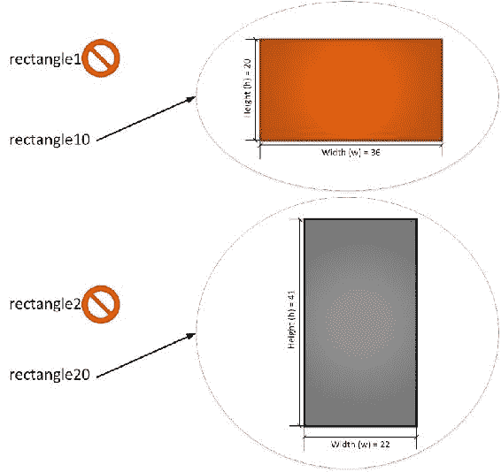
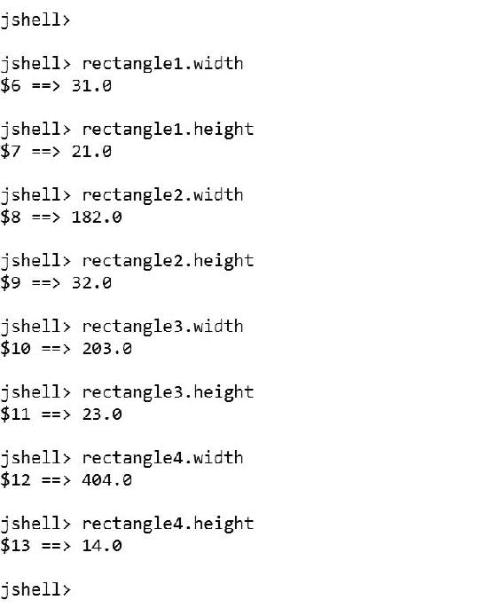

# 第三章：类和实例

在本章中，我们将开始使用 Java 9 中如何编写类和自定义实例初始化的示例。我们将了解类如何作为生成实例的蓝图工作，并深入了解垃圾回收机制。我们将：

+   在 Java 9 中理解类和实例

+   处理对象初始化及其自定义

+   了解对象的生命周期

+   介绍垃圾回收

+   声明类

+   自定义构造函数和初始化

+   了解垃圾回收的工作原理

+   创建类的实例并了解其范围

# 在 Java 9 中理解类和实例

在上一章中，我们学习了面向对象范式的一些基础知识，包括类和对象。我们开始为与 2D 形状相关的 Web 服务的后端工作。我们最终创建了一个具有许多类结构的 UML 图，包括它们的层次结构、字段和方法。现在是利用 JShell 开始编写基本类并在 JShell 中使用其实例的时候了。

在 Java 9 中，类始终是类型和蓝图。对象是类的工作实例，因此对象也被称为**实例**。

### 注意

类在 Java 9 中是一流公民，它们将是我们面向对象解决方案的主要构建块。

一个或多个变量可以持有对实例的引用。例如，考虑以下三个`Rectangle`类型的变量：

+   `矩形 1`

+   `矩形 2`

+   `矩形 10`

+   `矩形 20`

假设`rectangle1`变量持有对`Rectangle`类实例的引用，其`width`设置为`36`，`height`设置为`20`。`rectangle10`变量持有对`rectangle1`引用的相同实例。因此，我们有两个变量持有对相同的`Rectangle`对象的引用。

`rectangle2`变量持有对`Rectangle`类实例的引用，其`width`设置为`22`，`height`设置为`41`。`rectangle20`变量持有对`rectangle2`引用的相同实例。我们还有另外两个变量持有对相同的`Rectangle`对象的引用。

下图说明了许多`Rectangle`类型的变量持有对单个实例的引用的情况。变量名位于左侧，带有宽度和高度值的矩形代表`Rectangle`类的特定实例。


在本章的后面，我们将在 JShell 中使用许多持有对单个实例的引用的变量。

# 处理对象初始化及其自定义

当您要求 Java 创建特定类的实例时，底层会发生一些事情。Java 创建指定类型的新实例，**JVM**（**Java 虚拟机**）分配必要的内存，然后执行构造函数中指定的代码。

当 Java 执行构造函数中的代码时，类已经存在一个活动实例。因此，构造函数中的代码可以访问类中定义的字段和方法。显然，我们必须小心构造函数中放置的代码，因为我们可能会在创建类的实例时产生巨大的延迟。

### 提示

构造函数非常有用，可以执行设置代码并正确初始化新实例。

让我们忘记我们之前为代表 2D 形状的类工作的层次结构。想象一下，我们必须将`Circle`类编码为一个独立的类，不继承自任何其他类。在我们调用`calculateArea`或`calculatePerimeter`方法之前，我们希望每个新的`Circle`实例的`半径`字段都有一个初始化为代表圆的适当值的值。我们不希望创建新的`Circle`实例而不指定`半径`字段的适当值。

### 提示

当我们想要在创建实例后立即为类的实例的字段定义值，并在访问引用创建的实例的变量之前使用构造函数时，构造函数非常有用。事实上，创建特定类的实例的唯一方法是使用我们提供的构造函数。

每当我们需要在创建实例时提供特定参数时，我们可以声明许多不同的构造函数，其中包含必要的参数，并使用它们来创建类的实例。构造函数允许我们确保没有办法创建特定的类，而不使用提供必要参数的构造函数。因此，如果提供的构造函数需要一个`半径`参数，那么我们将无法创建类的实例，而不指定`半径`参数的值。

想象一下，我们必须将`Rectangle`类编码为一个独立的类，不继承自任何其他类。在我们调用`calculateArea`或`calculatePerimeter`方法之前，我们希望每个新的`Rectangle`实例的`宽度`和`高度`字段都有一个初始化为代表每个矩形的适当值的值。我们不希望创建新的`Rectangle`实例而不指定`宽度`和`高度`字段的适当值。因此，我们将为这个类声明一个需要`宽度`和`高度`值的构造函数。

# 引入垃圾收集

在某个特定时间，您的应用程序将不再需要使用实例。例如，一旦您计算了圆的周长，并且已经在 Web 服务响应中返回了必要的数据，您就不再需要继续使用特定的`Circle`实例。一些编程语言要求您小心地保留活动实例，并且必须显式销毁它们并释放它们消耗的内存。

Java 提供了自动内存管理。JVM 运行时使用垃圾收集机制，自动释放不再被引用的实例使用的内存。垃圾收集过程非常复杂，有许多不同的算法及其优缺点，JVM 有特定的考虑因素，应该考虑避免不必要的巨大内存压力。然而，我们将专注于对象的生命周期。在 Java 9 中，当 JVM 运行时检测到您不再引用实例，或者最后一个保存对特定实例的引用的变量已经超出范围时，它会使实例准备好成为下一个垃圾收集周期的一部分。

例如，让我们考虑我们先前的例子，其中有四个变量保存对`Rectangle`类的两个实例的引用。考虑到`rectangle1`和`rectangle2`变量都超出了范围。被`rectangle1`引用的实例仍然被`rectangle10`引用，而被`rectangle2`引用的实例仍然被`rectangle20`引用。因此，由于仍在被引用，没有一个实例可以从内存中删除。下图说明了这种情况。超出范围的变量在右侧有一个 NO 标志。



在`rectangle10`超出范围后，它引用的实例变得可处理，因此可以安全地添加到可以从内存中删除的对象列表中。以下图片说明了这种情况。准备从内存中删除的实例具有回收符号。


在`rectangle20`超出范围后，它引用的实例变得可处理，因此可以安全地添加到可以从内存中删除的对象列表中。以下图片说明了这种情况。这两个实例都准备从内存中删除，它们都有一个回收符号。


### 注意

JVM 会在后台自动运行垃圾收集过程，并自动回收那些准备进行垃圾收集且不再被引用的实例所消耗的内存。我们不知道垃圾收集过程何时会发生在特定实例上，也不应该干预这个过程。Java 9 中的垃圾收集算法已经得到改进。

想象一下，我们必须分发我们存放在盒子里的物品。在我们分发所有物品之后，我们必须将盒子扔进回收站。当我们还有一个或多个物品在盒子里时，我们不能将盒子扔进回收站。我们绝对不想丢失我们必须分发的物品，因为它们非常昂贵。

这个问题有一个非常简单的解决方案：我们只需要计算盒子中剩余物品的数量。当盒子中的物品数量达到零时，我们可以摆脱盒子，也就是说，我们可以将其扔进回收站。然后，垃圾收集过程将移除所有被扔进回收站的物品。

### 提示

幸运的是，我们不必担心将实例扔进回收站。Java 会自动为我们做这些。对我们来说完全透明。

一个或多个变量可以持有对类的单个实例的引用。因此，在 Java 可以将实例放入准备进行垃圾收集的列表之前，有必要考虑对实例的引用数量。当对特定实例的引用数量达到零时，可以安全地从内存中删除该实例并回收该实例消耗的内存，因为没有人再需要这个特定的实例。此时，实例已准备好被垃圾收集过程移除。

例如，我们可以创建一个类的实例并将其分配给一个变量。Java 将知道有一个引用指向这个实例。然后，我们可以将相同的实例分配给另一个变量。Java 将知道有两个引用指向这个单一实例。

在第一个变量超出范围后，仍然可以访问持有对实例的引用的第二个变量。Java 将知道仍然有另一个变量持有对这个实例的引用，因此该实例不会准备进行垃圾收集。此时，实例仍然必须可用，也就是说，我们需要它存活。

在第二个变量超出范围后，没有更多的变量持有对实例的引用。此时，Java 将标记该实例为准备进行垃圾收集，因为没有更多的变量持有对该实例的引用，可以安全地从内存中删除。

# 声明类

以下行声明了一个新的最小`Rectangle`类在 Java 中。示例的代码文件包含在`java_9_oop_chapter_03_01`文件夹中的`example03_01.java`文件中。

```java
class Rectangle {
}
```

`class`关键字，后面跟着类名（`Rectangle`），构成了类定义的头部。在这种情况下，我们没有为`Rectangle`类指定父类或超类。大括号（`{}`）对在类头部之后包围了类体。在接下来的章节中，我们将声明从另一个类继承的类，因此它们将有一个超类。在这种情况下，类体是空的。`Rectangle`类是我们可以在 Java 9 中声明的最简单的类。

### 注意

任何你创建的新类，如果没有指定超类，将会是`java.lang.Object`类的子类。因此，`Rectangle`类是`java.lang.Object`的子类。

以下行代表了创建`Rectangle`类的等效方式。然而，我们不需要指定类继承自`java.lang.Object`，因为这会增加不必要的样板代码。示例的代码文件包含在`java_9_oop_chapter_03_01`文件夹中的`example03_02.java`文件中。

```java
class Rectangle extends java.lang.Object {
}
```

# 自定义构造函数和初始化

我们希望用新矩形的宽度和高度值来初始化`Rectangle`类的实例。为了做到这一点，我们可以利用之前介绍的构造函数。构造函数是特殊的类方法，在我们创建给定类型的实例时会自动执行。在类内部的任何其他代码之前，Java 会运行构造函数内的代码。

我们可以定义一个构造函数，它接收宽度和高度值作为参数，并用它来初始化具有相同名称的字段。我们可以定义尽可能多的构造函数，因此我们可以提供许多不同的初始化类的方式。在这种情况下，我们只需要一个构造函数。

以下行创建了一个`Rectangle`类，并在类体内定义了一个构造函数。此时，我们并没有使用访问修饰符，因为我们希望保持类声明尽可能简单。我们稍后会使用它们。示例的代码文件包含在`java_9_oop_chapter_03_01`文件夹中的`example03_03.java`文件中。

```java
class Rectangle {
    double width;
    double height;

    Rectangle(double width, double height) {
        System.out.printf("Initializing a new Rectangle instance\n");
        System.out.printf("Width: %.2f, Height: %.2f\n", 
            width, height);
        this.width = width;
        this.height = height;
    }
}
```

构造函数是一个使用与类相同名称的类方法：`Rectangle`。在我们的示例`Rectangle`类中，构造函数接收`double`类型的两个参数：`width`和`height`。构造函数内的代码打印一条消息，指示代码正在初始化一个新的`Rectangle`实例，并打印`width`和`height`的值。这样，我们将了解构造函数内的代码何时被执行。因为构造函数有一个参数，它被称为**参数化构造函数**。

然后，以下行将作为参数接收的`width`双精度值分配给`width`双精度字段。我们使用`this.width`来访问实例的`width`字段，使用`width`来引用参数。`this`关键字提供了对已创建的实例的访问，我们希望初始化的对象，也就是正在构建的对象。我们使用`this.height`来访问实例的`height`字段，使用`height`来引用参数。

构造函数之前的两行声明了`width`和`height`双精度字段。这两个字段是成员变量，在构造函数执行完毕后我们可以无限制地访问它们。

以下行创建了`Rectangle`类的四个实例，分别命名为`rectangle1`、`rectangle2`、`rectangle3`和`rectangle4`。示例的代码文件包含在`java_9_oop_chapter_03_01`文件夹中的`example03_04.java`文件中。

```java
Rectangle rectangle1 = new Rectangle(31.0, 21.0);
Rectangle rectangle2 = new Rectangle(182.0, 32.0);
Rectangle rectangle3 = new Rectangle(203.0, 23.0);
Rectangle rectangle4 = new Rectangle(404.0, 14.0);
```

创建实例的每一行都指定了新变量（`Rectangle`）的类型，然后是将保存对新实例的引用的变量名（`rectangle1`、`rectangle2`、`rectangle3`或`rectangle4`）。然后，每一行都分配了使用`new`关键字后跟由逗号分隔并括在括号中的`width`和`height`参数的所需值的结果。

### 提示

在 Java 9 中，我们必须指定要保存对实例的引用的变量的类型。在这种情况下，我们使用`Rectangle`类型声明每个变量。如果您有其他编程语言的经验，这些语言提供了一个关键字来生成隐式类型的局部变量，比如 C#中的`var`关键字，您必须知道在 Java 9 中没有相应的关键字。

在我们输入了声明类和在 JShell 中创建了四个实例的所有行之后，我们将看到四条消息，这些消息说“正在初始化新的 Rectangle 实例”，然后是在构造函数调用中指定的宽度和高度值。以下截图显示了在 JShell 中执行代码的结果：


在执行了前面的行之后，我们可以检查我们创建的每个实例的`width`和`height`字段的值。以下行显示了 JShell 可以评估的表达式，以显示每个字段的值。示例的代码文件包含在`java_9_oop_chapter_03_01`文件夹中的`example03_05.java`文件中。

```java
rectangle1.width
rectangle1.height
rectangle2.width
rectangle2.height
rectangle3.width
rectangle3.height
rectangle4.width
rectangle4.height
```

以下截图显示了在 JShell 中评估先前表达式的结果。



在 JShell 中输入以下表达式。示例的代码文件包含在`java_9_oop_chapter_03_01`文件夹中的`example03_06.java`文件中。

```java
rectangle1 instanceof Rectangle
```

JShell 将显示`true`作为对先前表达式的评估结果，因为`rectangle1`是`Rectangle`类的一个实例。`instanceof`关键字允许我们测试对象是否为指定类型。使用此关键字，我们可以确定对象是否为`Rectangle`对象。

如前所述，`Rectangle`是`java.lang.Object`类的一个子类。JShell 已经从`java.lang`导入了所有类型，因此，我们可以将这个类简称为`Object`。在 JShell 中输入以下表达式。示例的代码文件包含在`java_9_oop_chapter_03_01`文件夹中的`example03_07.java`文件中。

```java
rectangle1 instanceof Object
```

JShell 将显示`true`作为对先前表达式的评估结果，因为`rectangle1`也是`java.lang.Object`类的一个实例。

在 JShell 中输入以下表达式。示例的代码文件包含在`java_9_oop_chapter_03_01`文件夹中的`example03_08.java`文件中。

```java
rectangle1.getClass().getName()
```

JShell 将显示`"Rectangle"`作为先前行的结果，因为`rectangle1`变量持有`Rectangle`类的一个实例。`getClass`方法允许我们检索对象的运行时类。该方法是从`java.lang.Object`类继承的。`getName`方法将运行时类型转换为字符串。

现在，我们将尝试创建一个`Rectangle`的实例，而不提供参数。以下行不会允许 Java 编译代码，并且将在 JShell 中显示构建错误，因为编译器找不到在`Rectangle`类中声明的无参数构造函数。对于这个类声明的唯一构造函数需要两个`double`参数，因此，Java 不允许创建未指定`width`和`height`值的`Rectangle`实例。示例的代码文件包含在`java_9_oop_chapter_03_01`文件夹中的`example03_09.java`文件中。

```java
Rectangle rectangleError = new Rectangle();
```

下一张截图显示了详细的错误消息：


# 了解垃圾回收的工作原理

```java
TipYou can follow best practices to release resources without having to add code to the `finalize` method. Remember that you don't know exactly when the `finalize` method is going to be executed. Even when the reference count reaches zero and all the variables that hold a reference have gone out of scope, the garbage collection algorithm implementation might keep the resources until the appropriate garbage collection destroys the instances. Thus, it is never a good idea to use the `finalize` method to release resources.
```

以下行显示了`Rectangle`类的新完整代码。新的行已经突出显示。示例的代码文件包含在`java_9_oop_chapter_03_01`文件夹中的`example03_10.java`文件中。

```java
class Rectangle {
    double width;
    double height;

    Rectangle(double width, double height) {
        System.out.printf("Initializing a new Rectangle instance\n");
        System.out.printf("Width: %.2f, Height: %.2f\n", 
            width, height);
        this.width = width;
        this.height = height;
    }

 // The following code doesn't represent a best practice
 // It is included just for educational purposes
 // and to make it easy to understand how the
 // garbage collection process works
 @Override
 protected void finalize() throws Throwable {
 try {
 System.out.printf("Finalizing Rectangle\n");
 System.out.printf("Width: %.2f, Height: %.2f\n", width, height);
 } catch(Throwable t){
 throw t;
 } finally{
 super.finalize();
 }
 }
}
```

新的行声明了一个`finalize`方法，覆盖了从`java.lang.Object`继承的方法，并打印一条消息，指示正在完成`Rectangle`实例，并显示实例的宽度和高度值。不要担心你尚不理解的代码片段，因为我们将在接下来的章节中学习它们。包含在类中的新代码的目标是让我们知道垃圾收集过程何时将对象从内存中删除。

### 提示

避免编写覆盖`finalize`方法的代码。Java 9 不鼓励使用`finalize`方法执行清理操作。

以下行创建了两个名为`rectangleToCollect1`和`rectangleToCollect2`的`Rectangle`类实例。然后，下一行将`null`分配给这两个变量，因此，两个对象的引用计数都达到了零，它们已准备好进行垃圾收集。这两个实例可以安全地从内存中删除，因为作用域中没有更多变量持有对它们的引用。示例的代码文件包含在`java_9_oop_chapter_03_01`文件夹中的`example03_11.java`文件中。

```java
Rectangle rectangleToCollect1 = new Rectangle(51, 121);
Rectangle rectangleToCollect2 = new Rectangle(72, 282);
rectangleToCollect1 = null;
rectangleToCollect2 = null;
```

以下截图显示了在 JShell 中执行上述行的结果：


两个矩形实例可以安全地从内存中删除，但我们没有看到消息表明对这些实例的`finalize`方法已被执行。请记住，我们不知道垃圾收集过程何时确定有必要回收这些实例使用的内存。

为了理解垃圾收集过程的工作原理，我们将强制进行垃圾收集。但是，非常重要的是要理解，在实际应用中我们不应该强制进行垃圾收集。我们必须让 JVM 在最合适的时机执行收集。

下一行显示了调用`System.gc`方法强制 JVM 执行垃圾收集的代码。示例的代码文件包含在`java_9_oop_chapter_03_01`文件夹中的`example03_12.java`文件中。

```java
System.gc();
```

以下截图显示了在 JShell 中执行上述行的结果。我们将看到表明两个实例的`finalize`方法已被调用的消息。


以下行创建了一个名为`rectangle5`的`Rectangle`类实例，然后将一个引用分配给`referenceToRectangle5`变量。这样，对象的引用计数增加到两个。下一行将`null`分配给`rectangle5`，使得对象的引用计数从两个减少到一个。`referenceToRectangle5`变量仍然持有对`Rectangle`实例的引用，因此，下一行强制进行垃圾收集不会将实例从内存中删除，我们也不会看到在`finalize`方法中代码执行的结果。仍然有一个在作用域中持有对实例的引用的变量。示例的代码文件包含在`java_9_oop_chapter_03_01`文件夹中的`example03_13.java`文件中。

```java
Rectangle rectangle5 = new Rectangle(50, 550);
Rectangle referenceToRectangle5 = rectangle5;
rectangle5 = null;
System.gc();
```

以下截图显示了在 JShell 中执行上述行的结果：


现在，我们将执行一行代码，将`null`分配给`referenceToRectangle5`，以使引用实例的引用计数达到零，并在下一行强制运行垃圾收集过程。示例的代码文件包含在`java_9_oop_chapter_03_01`文件夹中的`example03_14.java`文件中。

```java
referenceToRectangle5 = null;
System.gc();
```

以下截图显示了在 JShell 中执行前几行的结果。我们将看到指示实例的`finalize`方法已被调用的消息。


### 提示

非常重要的是，你不需要将引用赋值为`null`来强制 JVM 从对象中回收内存。在前面的例子中，我们想要了解垃圾回收的工作原理。Java 会在对象不再被引用时自动以透明的方式销毁对象。

# 创建类的实例并了解它们的作用域

我们将编写几行代码，在`getGeneratedRectangleHeight`方法的作用域内创建一个名为`rectangle`的`Rectangle`类的实例。方法内的代码使用创建的实例来访问并返回其`height`字段的值。在这种情况下，代码使用`final`关键字作为`Rectangle`类型的前缀来声明对`Rectangle`实例的**不可变引用**。

### 注意

不可变引用也被称为常量引用，因为我们不能用另一个`Rectangle`实例替换`rectangle`常量持有的引用。

在定义新方法后，我们将调用它并强制进行垃圾回收。示例的代码文件包含在`java_9_oop_chapter_03_01`文件夹中的`example03_15.java`文件中。

```java
double getGeneratedRectangleHeight() {
    final Rectangle rectangle = new Rectangle(37, 87);
    return rectangle.height; 
}

System.out.printf("Height: %.2f\n", getGeneratedRectangleHeight());
System.gc();
```

以下截图显示了在 JShell 中执行前几行的结果。我们将看到在调用`getGeneratedRectangleHeight`方法后，指示实例的`finalize`方法已被调用，并在下一次强制垃圾回收时的消息。当方法返回一个值时，矩形会超出作用域，因为它的引用计数从 1 下降到 0。

通过不可变变量引用的实例是安全的垃圾回收。因此，当我们强制进行垃圾回收时，我们会看到`finalize`方法显示的消息。


# 练习

现在你了解了对象的生命周期，是时候在 JShell 中花一些时间创建新的类和实例了。

## 练习 1

1.  创建一个新的`Student`类，其中包含一个需要两个`String`参数`firstName`和`lastName`的构造函数。使用这些参数来初始化与参数同名的字段。在创建类的实例时显示一个带有`firstName`和`lastName`值的消息。

1.  创建`Student`类的实例并将其分配给一个变量。检查在 JShell 中打印的消息。

1.  创建`Student`类的实例并将其分配给一个变量。检查在 JShell 中打印的消息。

## 练习 2

1.  创建一个接收两个`String`参数`firstName`和`lastName`的函数。使用接收到的参数来创建先前定义的`Student`类的实例。使用实例属性打印一个带有名字和姓氏的消息。稍后你可以创建一个方法并将其添加到`Student`类中来执行相同的任务。但是，我们将在接下来的章节中了解更多相关内容。

1.  使用必要的参数调用先前创建的函数。检查在 JShell 中打印的消息。

# 测试你的知识

1.  当 Java 执行构造函数中的代码时：

1.  我们无法访问类中定义的任何成员。

1.  该类已经存在一个活动实例。我们可以访问类中定义的方法，但无法访问其字段。

1.  该类已经存在一个活动实例，我们可以访问它的成员。

1.  构造函数非常有用：

1.  执行设置代码并正确初始化一个新实例。

1.  在实例被销毁之前执行清理代码。

1.  声明将对类的所有实例可访问的方法。

1.  Java 9 使用以下机制之一来自动释放不再被引用的实例使用的内存：

1.  实例映射减少。

1.  垃圾压缩。

1.  垃圾收集。

1.  Java 9 允许我们定义：

1.  一个主构造函数和两个可选的次要构造函数。

1.  许多具有不同参数的构造函数。

1.  每个类只有一个构造函数。

1.  我们创建的任何不指定超类的新类都将是一个子类：

1.  `java.lang.Base`

1.  `java.lang.Object`

1.  `java.object.BaseClass`

1.  以下哪行创建了`Rectangle`类的一个实例并将其引用分配给`rectangle`变量：

1.  `var rectangle = new Rectangle(50, 20);`

1.  `auto rectangle = new Rectangle(50, 20);`

1.  `Rectangle rectangle = new Rectangle(50, 20);`

1.  以下哪行访问了`rectangle`实例的`width`字段：

1.  `rectangle.field`

1.  `rectangle..field`

1.  `rectangle->field`

# 摘要

在本章中，您了解了对象的生命周期。您还了解了对象构造函数的工作原理。我们声明了我们的第一个简单类来生成对象的蓝图。我们了解了类型、变量、类、构造函数、实例和垃圾收集是如何在 JShell 中的实时示例中工作的。

现在您已经学会了开始创建类和实例，我们准备在 Java 9 中包含的数据封装功能中分享、保护、使用和隐藏数据，这是我们将在下一章讨论的内容。
