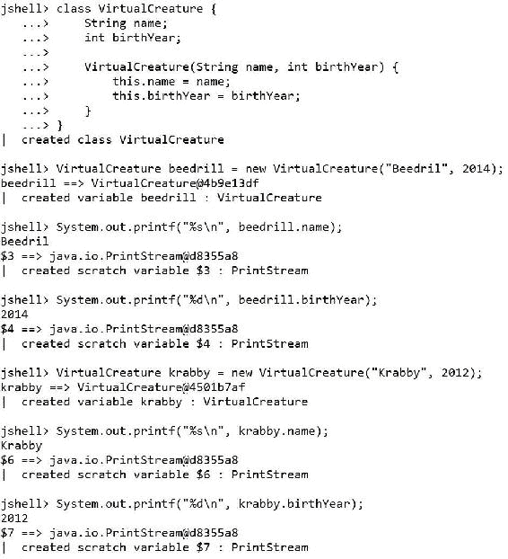
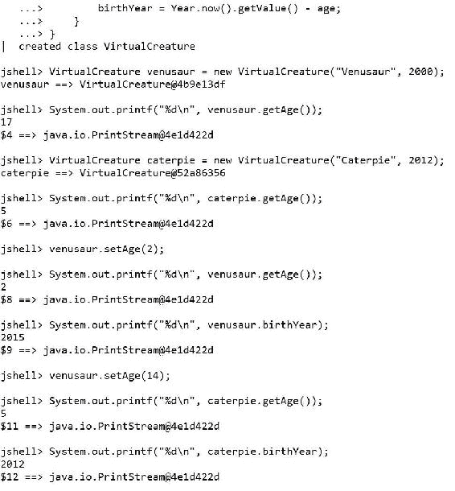
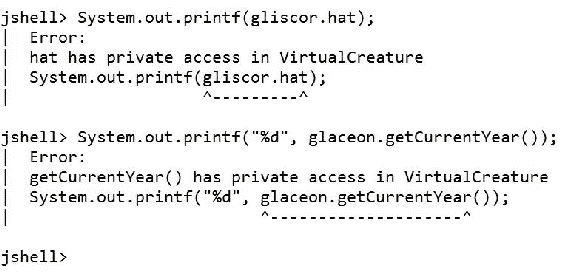

# 第四章。数据的封装

在本章中，我们将学习 Java 9 中类的不同成员以及它们如何在从类生成的实例的成员中反映出来。我们将使用实例字段、类字段、setter、getter、实例方法和类方法。我们将：

+   理解 Java 9 中组成类的成员

+   声明不可变字段

+   使用 setter 和 getter

+   在 Java 9 中理解访问修饰符

+   结合 setter、getter 和相关字段

+   使用 setter 和 getter 转换值

+   使用静态字段和静态方法来创建所有类实例共享的值

# 理解组成类的成员

到目前为止，我们一直在使用一个非常简单的`Rectangle`类。我们在 JShell 中创建了许多这个类的实例，并且理解了垃圾回收的工作原理。现在，是时候深入了解 Java 9 中组成类的不同成员了。

以下列表列举了我们可以在 Java 9 类定义中包含的最常见元素类型。每个成员都包括其在其他编程语言中的等价物，以便于将我们在其他面向对象语言中的经验转化为 Java 9。我们已经使用了其中的一些成员：

+   **构造函数**：一个类可能定义一个或多个构造函数。它们等价于其他编程语言中的初始化器。

+   **类变量或类字段**：这些变量对类的所有实例都是共同的，也就是说，它们的值对所有实例都是相同的。在 Java 9 中，可以从类和其实例中访问类变量。我们不需要创建特定实例来访问类变量。类变量也被称为静态变量，因为它们在声明中使用`static`修饰符。类变量等价于其他编程语言中的类属性和类型属性。

+   **类方法**：这些方法可以使用类名调用。在 Java 9 中，可以从类和其实例中访问类方法。我们不需要创建特定实例来访问类方法。类方法也被称为静态方法，因为它们在声明中使用`static`修饰符。类方法等价于其他编程语言中的类函数和类型方法。类方法作用于整个类，并且可以访问类变量、类常量和其他类方法，但它们无法访问任何实例成员，如实例字段或方法，因为它们在类级别上操作，根本没有实例。当我们想要包含与类相关的方法并且不想生成实例来调用它们时，类方法非常有用。

+   **常量**：当我们用`final`修饰符声明类变量或类字段时，我们定义了值不可更改的常量。

+   **字段、成员变量、实例变量或实例字段**：我们在之前的例子中使用了这些。类的每个实例都有自己独特的实例字段副本，具有自己的值。实例字段等价于其他编程语言中的属性和实例属性。

+   **方法或实例方法**：这些方法需要一个实例来调用，并且它们可以访问特定实例的字段。实例方法等价于其他编程语言中的实例函数。

+   **嵌套类**：这些类在另一个类中定义。静态嵌套类使用`static`修饰符。不使用`static`修饰符的嵌套类也被称为**内部类**。嵌套类在其他编程语言中也被称为嵌套类型。

# 声明不可变字段

Pokemon Go 是一款基于位置的增强现实游戏，玩家使用移动设备的 GPS 功能来定位、捕捉、训练和让虚拟生物进行战斗。这款游戏取得了巨大的成功，并推广了基于位置和增强现实的游戏。在其巨大成功之后，想象一下我们必须开发一个 Web 服务，供类似的游戏使用，让虚拟生物进行战斗。

我们必须进入虚拟生物的世界。我们肯定会有一个`VirtualCreature`基类。每种特定类型的虚拟生物都具有独特的特征，可以参与战斗，将是`VirtualCreature`的子类。

所有虚拟生物都将有一个名字，并且它们将在特定年份出生。年龄对于它们在战斗中的表现将非常重要。因此，我们的基类将拥有`name`和`birthYear`字段，所有子类都将继承这些字段。

当我们设计类时，我们希望确保所有必要的数据对将操作这些数据的方法是可用的。因此，我们封装数据。然而，我们只希望相关信息对我们的类的用户可见，这些用户将创建实例，更改可访问字段的值，并调用可用的方法。我们希望隐藏或保护一些仅需要内部使用的数据，也就是说，对于我们的方法。我们不希望对敏感数据进行意外更改。

例如，当我们创建任何虚拟生物的新实例时，我们可以将其名字和出生年份作为构造函数的两个参数。构造函数初始化了两个属性的值：`name`和`birthYear`。以下几行显示了声明`VirtualCreature`类的示例代码。示例的代码文件包含在`java_9_oop_chapter_04_01`文件夹中的`example04_01.java`文件中。

```java
class VirtualCreature {
    String name;
    int birthYear;

    VirtualCreature(String name, int birthYear) {
        this.name = name;
        this.birthYear = birthYear;
    }
}
```

接下来的几行创建了两个实例，初始化了两个字段的值，然后使用`System.out.printf`方法在 JShell 中显示它们的值。示例的代码文件包含在`java_9_oop_chapter_04_01`文件夹中的`example04_01.java`文件中。

```java
VirtualCreature beedrill = new VirtualCreature("Beedril", 2014);
System.out.printf("%s\n", beedrill.name);
System.out.printf("%d\n", beedrill.birthYear);
VirtualCreature krabby = new VirtualCreature("Krabby", 2012);
System.out.printf("%s\n", krabby.name);
System.out.printf("%d\n", krabby.birthYear);
```

以下屏幕截图显示了在 JShell 中声明类和执行先前行的结果：



我们不希望`VirtualCreature`类的用户能够在初始化实例后更改虚拟生物的名字，因为名字不应该改变。好吧，有些人改名字，但虚拟生物永远不会这样做。在我们之前声明的类中，有一种简单的方法可以实现这个目标。我们可以在类型（`String`）之前添加`final`关键字，以定义一个不可变的`name`字段，类型为`String`。当我们定义`birthYear`字段时，也可以在类型（`int`）之前添加`final`关键字，因为在初始化虚拟生物实例后，出生年份将永远不会改变。

以下几行显示了声明`VirtualCreature`类的新代码，其中包含两个不可变的实例字段：`name`和`birthYear`。请注意，构造函数的代码不需要更改，并且可以使用相同的代码初始化这两个不可变的实例字段。示例的代码文件包含在`java_9_oop_chapter_04_01`文件夹中的`example04_02.java`文件中。

```java
class VirtualCreature {
 final String name;
 final int birthYear;

    VirtualCreature(String name, int birthYear) {
        this.name = name;
        this.birthYear = birthYear;
    }
}
```

### 注意

不可变的实例字段也被称为非变异的实例字段。

接下来的几行创建了一个实例，初始化了两个不可变的实例字段的值，然后使用`System.out.printf`方法在 JShell 中显示它们的值。示例的代码文件包含在`java_9_oop_chapter_04_01`文件夹中的`example04_02.java`文件中。

```java
VirtualCreature squirtle = new VirtualCreature("Squirtle", 2014);
System.out.printf("%s\n", squirtle.name);
System.out.printf("%d\n", squirtle.birthYear);
```

接下来的两行代码尝试为`name`和`birthYear`不可变的实例字段分配新值。示例的代码文件包含在`java_9_oop_chapter_04_01`文件夹中的`example04_03.java`文件中。

```java
squirtle.name = "Tentacruel";
squirtle.birthYear = 2017;
```

这两行将无法成功，因为 Java 不允许我们为使用`final`修饰符声明的字段赋值，这会将其转换为不可变字段。下一张截图显示了在每行尝试为不可变字段设置新值后在 JShell 中显示的错误：


### 提示

当我们使用`final`关键字声明一个实例字段时，我们可以初始化该字段，但在初始化后，它将变为不可变的，也就是常量。

# 使用 setter 和 getter

到目前为止，我们一直在使用字段来封装实例中的数据。我们可以像实例的成员变量一样访问这些字段，没有任何限制。然而，有时在现实世界的情况下，需要限制以避免严重问题。有时，我们希望限制访问或将特定字段转换为只读字段。我们可以将对底层字段的访问限制与称为 setter 和 getter 的方法相结合。

**Setter**是允许我们控制如何设置值的方法；也就是说，这些方法用于改变相关字段的值。**Getter**允许我们控制在想要检索相关字段的值时返回的值。Getter 不会改变相关字段的值。

### 提示

有些框架（比如 JavaBeans）强制你使用 setter 和 getter 来让每个相关字段都可以访问，但在其他情况下，setter 和 getter 是不必要的。在接下来的例子中，我们将使用可变对象。在下一章，第五章，“可变和不可变类”，我们将同时使用可变和不可变对象。当使用不可变对象时，getter 和 setter 是无用的。

如前所述，我们不希望`VirtualCreature`类的用户能够在初始化实例后更改虚拟生物的出生年份，因为虚拟生物不会在不同日期再次出生。实际上，我们希望计算并使虚拟生物的年龄对用户可用。因为我们只考虑出生年份，所以我们将计算一个近似的年龄。我们保持示例简单，以便专注于 getter 和 setter。

我们可以定义一个名为`getAge`的 getter 方法，而不定义 setter 方法。这样，我们可以检索虚拟生物的年龄，但我们无法改变它，因为没有 setter 方法。getter 方法返回基于当前年份和`birthYear`不可变实例字段的值计算出的虚拟生物年龄的结果。

下面的行显示了具有新`getAge`方法的`VirtualCreature`类的新版本。请注意，需要导入`java.time.Year`以使用在 Java 8 中引入的`Year`类。`getAge`方法的代码在下面的行中突出显示。该方法调用`Year.now().getValue`来检索当前日期的年份组件，并返回当前年份与`birthYear`字段的值之间的差值。示例的代码文件包含在`java_9_oop_chapter_04_01`文件夹中，名为`example04_04.java`。

```java
import java.time.Year;

class VirtualCreature {
    final String name;
    final int birthYear;

    VirtualCreature(String name, int birthYear) {
        this.name = name;
        this.birthYear = birthYear;
    }

 int getAge() {
 return Year.now().getValue() - birthYear;
 }
}
```

下面的行创建一个实例，初始化了两个不可变实例字段的值，然后使用`System.out.printf`方法在 JShell 中显示`getAge`方法返回的值。在创建`VirtualCreature`类的新版本的代码之后输入这些行。示例的代码文件包含在`java_9_oop_chapter_04_01`文件夹中，名为`example04_04.java`。 

```java
VirtualCreature arbok = new VirtualCreature("Arbok", 2008);
System.out.printf("%d\n", arbok.getAge());
VirtualCreature pidgey = new VirtualCreature("Pidgey", 2015);
System.out.printf("%d\n", pidgey.getAge());
```

下一张截图显示了在 JShell 中执行前面几行的结果：


在与虚拟生物专家的几次会议后，我们意识到其中一些虚拟生物会前往其他星球进化，并在进化后从蛋中再次诞生。由于进化发生在不同的星球，虚拟生物的出生年份会改变，以在地球上具有等效的出生年份。因此，有必要允许用户自定义虚拟生物的年龄或出生年份。我们将添加一个带有计算出生年份的代码的 setter 方法，并将这个值分配给`birthYear`字段。首先，我们必须在声明`birthYear`字段时删除`final`关键字，因为我们希望它成为一个可变字段。

### 提示

还有另一种处理虚拟生物进化的方法。我们可以创建另一个实例来代表进化后的虚拟生物。我们将在下一章第五章中使用这种不可变的方法，*可变和不可变的类*。在这种情况下，我们将使用一个可变对象。在了解所有可能性之后，我们可以根据我们的具体需求决定最佳选项。

下面的代码展示了带有新`setAge`方法的`VirtualCreature`类的新版本。`setAge`方法的代码在下面的代码中突出显示。该方法接收我们想要为虚拟生物设置的新年龄，并调用`Year.now().getValue`来获取当前日期的年份组件，并将当前年份与`age`参数中接收到的值之间的差值分配给`birthYear`字段。这样，`birthYear`字段将根据接收到的`age`值保存虚拟生物出生的年份。示例的代码文件包含在`java_9_oop_chapter_04_01`文件夹中的`example04_05.java`文件中。

```java
import java.time.Year;

class VirtualCreature {
    final String name;
 int birthYear;

    VirtualCreature(String name, int birthYear) {
        this.name = name;
        this.birthYear = birthYear;
    }

    int getAge() {
        return Year.now().getValue() - birthYear;
    }

 void setAge(final int age) {
 birthYear = Year.now().getValue() - age;
 }
}
```

下面的代码创建了`VirtualCreature`类的新版本的两个实例，调用`setAge`方法并为虚拟生物设置所需的年龄，然后使用`System.out.printf`方法在 JShell 中显示`getAge`方法返回的值和`birthYear`字段的值。在创建`VirtualCreature`类的新版本的代码之后输入这些代码。示例的代码文件包含在`java_9_oop_chapter_04_01`文件夹中的`example04_05.java`文件中。

```java
VirtualCreature venusaur = new VirtualCreature("Venusaur", 2000);
System.out.printf("%d\n", venusaur.getAge());
VirtualCreature caterpie = new VirtualCreature("Caterpie", 2012);
System.out.printf("%d\n", caterpie.getAge());

venusaur.setAge(2);
System.out.printf("%d\n", venusaur.getAge());
System.out.printf("%d\n", venusaur.birthYear);

venusaur.setAge(14);
System.out.printf("%d\n", caterpie.getAge());
System.out.printf("%d\n", caterpie.birthYear);
```

调用`setAge`方法并传入新的年龄值后，该方法会改变`birthYear`字段的值。根据当前年份的值，运行代码的结果将会不同。下一张截图显示了在 JShell 中执行前几行代码的结果：



getter 和 setter 方法都使用相同的代码来获取当前年份。我们可以添加一个新的方法来获取当前年份，并从`getAge`和`setAge`方法中调用它。在这种情况下，这只是一行代码，但是新方法为我们提供了一个示例，说明我们可以添加方法来在我们的类中使用，并帮助其他方法完成它们的工作。稍后，我们将学习如何避免从实例中调用这些方法，因为它们只用于内部使用。

下面的代码展示了带有新`getCurrentYear`方法的`SuperHero`类的新版本。`getAge`和`setAge`方法的新代码调用了新的`getCurrentYear`方法，而不是重复用于获取当前年份的代码。示例的代码文件包含在`java_9_oop_chapter_04_01`文件夹中的`example04_06.java`文件中。

```java
import java.time.Year;

class VirtualCreature {
    final String name;
    int birthYear;

    VirtualCreature(String name, int birthYear) {
        this.name = name;
        this.birthYear = birthYear;
    }

 int getCurrentYear() {
 return Year.now().getValue();
 }

    int getAge() {
 return getCurrentYear() - birthYear;
    }

    void setAge(final int age) {
 birthYear = getCurrentYear() - age;
    }
}
```

下面的代码创建了`VirtualCreature`类的两个实例，调用`setAge`方法设置虚拟生物的年龄，然后使用`System.out.printf`方法在 JShell 中显示`getAge`方法返回的值和`birthYear`字段的值。在创建`VirtualCreature`类的新版本的代码之后输入这些行。示例的代码文件包含在`java_9_oop_chapter_04_01`文件夹中的`example04_06.java`文件中。

```java
VirtualCreature persian = new VirtualCreature("Persian", 2005);
System.out.printf("%d\n", persian.getAge());
VirtualCreature arcanine = new VirtualCreature("Arcanine", 2012);
System.out.printf("%d\n", arcanine.getAge());

persian.setAge(7);
System.out.printf("%d\n", persian.getAge());
System.out.printf("%d\n", persian.birthYear);

arcanine.setAge(9);
System.out.printf("%d\n", arcanine.getAge());
System.out.printf("%d\n", arcanine.birthYear);
```

下一张截图显示了在 JShell 中执行前面几行的结果：


## 在 Java 9 中探索访问修饰符

先前声明的`VirtualCreature`类公开了所有成员（字段和方法），没有任何限制，因为我们声明它们时没有使用任何访问修饰符。因此，我们的类的用户可以在创建类的实例后访问任何字段并调用任何已声明的方法。

Java 9 允许我们通过使用访问级别修饰符来控制对调用成员的访问。不同的关键字允许我们控制哪些代码可以访问类的特定成员。到目前为止，我们可以在类定义内部和类声明之外访问字段和方法。

我们可以使用以下任何访问修饰符来限制对任何字段的访问，而不是`public`：

+   `protected`：Java 不允许用户在类定义之外访问成员。只有类内部或其派生类的代码才能访问字段。声明了带有`protected`访问修饰符的成员的类的任何子类都可以访问该成员。

+   `private`：Java 不允许用户在类定义之外访问字段。只有类内部的代码才能访问字段。它的派生类无法访问字段。因此，声明了带有`private`访问修饰符的成员的类的任何子类将无法访问该成员。

下一行显示了如何将`birthYear`实例字段的声明更改为`protected`字段。我们只需要在字段声明中添加`protected`关键字。

```java
protected int birthYear;
```

每当我们在字段声明中使用`protected`访问修饰符时，我们限制对该字段的访问仅限于类定义内部和子类内部编写的代码。Java 9 为标记为`protected`的字段生成了真正的保护，没有办法在解释的边界之外访问它们。

下一行显示了如何将`birthYear`受保护的实例字段的声明更改为`private`字段。我们用`private`替换了`protected`访问修饰符。

```java
private int birthYear;
```

每当我们在字段声明中使用`private`访问修饰符时，我们限制对该字段的访问仅限于类定义内部和子类内部编写的代码。Java 为标记为`private`的字段生成了真正的保护，没有办法在类定义之外访问它们。这个限制也适用于子类，因此，只有类内部编写的代码才能访问标记为私有的属性。

### 提示

我们可以对任何类型成员应用先前解释的访问修饰符，包括类变量、类方法、常量、字段、方法和嵌套类。

# 结合 setter、getter 和字段

有时，我们希望对设置到相关字段和从中检索的值有更多的控制，并且我们可以利用 getter 和 setter 来做到这一点。我们可以结合使用 getter、setter、存储计算值的相关字段以及访问保护机制，防止用户对相关字段进行更改。这样，我们将强制用户始终使用 getter 和 setter。

虚拟生物喜欢任何类型的帽子。虚拟生物的帽子可以随着时间改变。我们必须确保帽子的名称是大写字母，也就是大写的`String`。我们将定义一个`setHat`方法，始终从接收到的`String`生成一个大写的`String`并将其存储在私有的`hat`字段中。

我们将提供一个`getHat`方法来检索存储在私有`hat`字段中的值。下面的几行显示了`VirtualCreature`类的新版本，其中添加了一个`hat`私有实例字段和`getHat`和`setHat`方法。我们使用之前学到的访问修饰符来为类的不同成员设置。示例的代码文件包含在`java_9_oop_chapter_04_01`文件夹中，名为`example04_07.java`。

```java
import java.time.Year;

public class VirtualCreature {
    public final String name;
    private int birthYear;
    private String hat = "NONE";

    VirtualCreature(String name, int birthYear, String hat) {
        this.name = name;
        this.birthYear = birthYear;
        setHat(hat);
    }

    private int getCurrentYear() {
        return Year.now().getValue();
    }

    public int getAge() {
        return getCurrentYear() - birthYear;
    }

    public void setAge(final int age) {
        birthYear = getCurrentYear() - age;
    }

    public String getHat() {
        return hat;
    }

    public void setHat(final String hat) {
        this.hat = hat.toUpperCase();
    }
}
```

如果你使用特定的 JDK 早期版本，在 JShell 中输入前面的代码时，你可能会看到以下警告消息：

```java
|  Warning:
|  Modifier 'public'  not permitted in top-level declarations, ignored
|  public class VirtualCreature {
|  ^----^
|  created class VirtualCreature this error is corrected:
|      Modifier 'public'  not permitted in top-level declarations, ignored
|      public class VirtualCreature {
|      ^----^

```

JShell 不允许我们在顶层声明中使用访问修饰符，比如类声明。然而，我们指定访问修饰符是因为我们希望编写的代码就好像我们是在 JShell 之外编写类声明一样。JShell 只是忽略了类的`public`访问修饰符，而一些包含 JShell 的 JDK 版本会在 REPL 中显示先前显示的警告消息。如果你看到这些消息，你应该升级已安装的 JDK 到不再显示警告消息的最新版本。

我们将`birthyear`和`hat`实例字段都声明为`private`。我们将`getCurrentYear`方法声明为`protected`。当用户创建`VirtualCreature`类的实例时，用户将无法访问这些`private`成员。这样，`private`成员将对创建`VirtualCreature`类实例的用户隐藏起来。

我们将`name`声明为`public`的不可变实例字段。我们将以下方法声明为`public`：`getAge`、`setAge`、`getHat`和`setHat`。当用户创建`VirtualCreature`类的实例时，他将能够访问所有这些`public`成员。

构造函数添加了一个新的参数，为新的`hat`字段提供了一个初始值。构造函数中的代码调用`setHat`方法，将接收到的`hat`参数作为参数，以确保从接收到的`String`生成一个大写的`String`，并将生成的`String`分配给`hat`字段。

下面的几行创建了`VirtualCreature`类的两个实例，使用`printf`方法显示`getHat`方法返回的值，调用`setHat`方法设置虚拟生物的新帽子，然后使用`System.out.printf`方法再次显示`getHat`方法返回的值。在创建`VirtualCreature`类的新版本的代码之后输入这些行。示例的代码文件包含在`java_9_oop_chapter_04_01`文件夹中，名为`example04_07.java`。

```java
VirtualCreature glaceon = 
    new VirtualCreature("Glaceon", 2009, "Baseball cap");
System.out.printf(glaceon.getHat());
glaceon.setHat("Hard hat")
System.out.printf(glaceon.getHat());
VirtualCreature gliscor = 
    new VirtualCreature("Gliscor", 2015, "Cowboy hat");
System.out.printf(gliscor.getHat());
gliscor.setHat("Panama hat")
System.out.printf(gliscor.getHat());
```

下一张截图显示了在 JShell 中执行前面几行的结果：


### 提示

我们可以结合 getter 和 setter 方法，以及访问保护机制和作为底层字段的相关字段，来绝对控制可变对象中的值如何被设置和检索。然而，我们必须确保初始化也必须使用 setter 方法，就像我们在构造函数中设置初始值时所做的那样。

下面的几行将尝试访问我们创建的`VirtualCreature`类实例的私有字段和私有方法。这两行都将无法编译，因为我们不能在实例中访问私有成员。第一行尝试访问`hat`实例字段，第二行尝试调用`getCurrentYear`实例方法。示例的代码文件包含在`java_9_oop_chapter_04_01`文件夹中，名为`example04_08.java`。

```java
System.out.printf(gliscor.hat);
System.out.printf("%d", glaceon.getCurrentYear());
```

下一个屏幕截图显示了在 JShell 中执行前面几行时生成的错误消息。



# 使用 setter 和 getter 转换值

我们可以定义一个 setter 方法，将接收到的值转换为相关字段的有效值。getter 方法只需要返回相关字段的值。用户只能使用 setter 和 getter 方法，我们的相关字段将始终具有有效值。这样，我们可以确保每当需要该值时，我们将检索到有效的值。

每个虚拟生物都有一个可见级别，确定任何人能够多容易地看到虚拟生物的身体。我们将添加一个私有的`visibilityLevel`字段，一个`setVisibility`方法和一个`getVisibility`方法。我们将更改构造函数代码，调用`setVisiblity`方法来为`visibilityLevel`字段设置初始值。

我们希望确保可见级别是一个从`0`到`100`（包括）的数字。因此，我们将编写 setter 方法来将低于`0`的值转换为`0`，将高于`100`的值转换为`100`。`setVisibility`方法保存相关私有`visibilityLevel`字段中的转换后或原始值，该值在有效范围内。

编辑过的行和新行已经高亮显示。示例的代码文件包含在`java_9_oop_chapter_04_01`文件夹中的`example04_09.java`文件中。

```java
import java.time.Year;

public class VirtualCreature {
    public final String name;
    private int birthYear;
    private String hat = "NONE";
 private int visibilityLevel;

 VirtualCreature(String name, 
 int birthYear, 
 String hat, 
 int visibilityLevel) {
        this.name = name;
        this.birthYear = birthYear;
        setHat(hat);
 setVisibilityLevel(visibilityLevel);
    }

    private int getCurrentYear() {
        return Year.now().getValue();
    }

    public int getAge() {
        return getCurrentYear() - birthYear;
    }

    public void setAge(final int age) {
        birthYear = getCurrentYear() - age;
    }

    public String getHat() {
        return hat;
    }

    public void setHat(final String hat) {
        this.hat = hat.toUpperCase();
    }

    public int getVisibilityLevel() {
        return visibilityLevel;
    }

 public void setVisibilityLevel(final int visibilityLevel) {
 this.visibilityLevel = 
 Math.min(Math.max(visibilityLevel, 0), 100);
 }
}
```

下面的行创建了一个`VirtualCreature`的实例，指定`150`作为`visibilityLevel`参数的值。然后，下一行使用`System.out.printf`方法在 JShell 中显示`getVisibilityLevel`方法返回的值。然后，我们调用`setVisibilityLevel`和`getVisibilityLevel`三次，设置`visibilityLevel`的值，然后检查最终设置的值。在创建`VirtualCreature`类的新版本的代码之后输入这些行。示例的代码文件包含在`java_9_oop_chapter_04_01`文件夹中的`example04_09.java`文件中。

```java
VirtualCreature lairon = 
    new VirtualCreature("Lairon", 2014, "Sombrero", 150);
System.out.printf("%d", lairon.getVisibilityLevel());
lairon.setVisibilityLevel(-6);
System.out.printf("%d", lairon.getVisibilityLevel());
lairon.setVisibilityLevel(320);
System.out.printf("%d", lairon.getVisibilityLevel());
lairon.setVisibilityLevel(25);
System.out.printf("%d", lairon.getVisibilityLevel());
```

构造函数调用`setVisibilityLevel`方法来为`visibilityLevel`相关的私有字段设置初始值，因此，该方法确保值在有效范围内。代码指定了`150`，但最大值是`100`，因此`setVisibilityLevel`将`100`分配给了`visibilityLevel`相关的私有字段。

在我们使用`-6`作为参数调用`setVisibilityLevel`后，我们打印了`getVisibilityLevel`返回的值，结果是`0`。在我们指定`320`后，实际打印的值是`100`。最后，在我们指定`25`后，实际打印的值是`25`。下一个屏幕截图显示了在 JShell 中执行前面几行的结果：


# 使用静态字段提供类级别的值

有时，类的所有成员共享相同的属性，我们不需要为每个实例设置特定的值。例如，虚拟生物类型具有以下配置值：

+   攻击力

+   防御力

+   特殊攻击力

+   特殊防御力

+   平均速度

+   捕捉率

+   增长率

对于这种情况，我们可能认为有用的第一种方法是定义以下类常量来存储所有实例共享的值：

+   `ATTACK_POWER`

+   `DEFENSE_POWER`

+   `SPECIAL_ATTACK_POWER`

+   `SPECIAL_DEFENSE_POWER`

+   `AVERAGE_SPEED`

+   `CATCH_RATE`

+   `GROWTH_RATE`

### 注意

请注意，在 Java 9 中，类常量名称使用大写字母和下划线（`_`）分隔单词。这是一种命名约定。

以下行显示了`VirtualCreature`类的新版本，该版本使用`public`访问修饰符定义了先前列出的七个类常量。请注意，`final`和`static`关键字的组合使它们成为类常量。示例的代码文件包含在`java_9_oop_chapter_04_01`文件夹中的`example04_10.java`文件中。

```java
import java.time.Year;

public class VirtualCreature {
 public final static int ATTACK_POWER = 45;
 public final static int DEFENSE_POWER = 85;
 public final static int SPECIAL_ATTACK_POWER = 35;
 public final static int SPECIAL_DEFENSE_POWER = 95;
 public final static int AVERAGE_SPEED = 85;
 public final static int CATCH_RATE = 25;
 public final static int GROWTH_RATE = 10;

    public final String name;
    private int birthYear;
    private String hat = "NONE";
    private int visibilityLevel;

    VirtualCreature(String name, 
        int birthYear, 
        String hat, 
        int visibilityLevel) {
        this.name = name;
        this.birthYear = birthYear;
        setHat(hat);
        setVisibilityLevel(visibilityLevel);
    }

    private int getCurrentYear() {
        return Year.now().getValue();
    }

    public int getAge() {
        return getCurrentYear() - birthYear;
    }

    public void setAge(final int age) {
        birthYear = getCurrentYear() - age;
    }

    public String getHat() {
        return hat;
    }

    public void setHat(final String hat) {
        this.hat = hat.toUpperCase();
    }

    public int getVisibilityLevel() {
        return visibilityLevel;
    }

    public void setVisibilityLevel(final int visibilityLevel) {
        this.visibilityLevel = 
            Math.min(Math.max(visibilityLevel, 0), 100);
    }
}
```

代码在同一行中初始化了每个类常量。以下行打印了先前声明的`SPECIAL_ATTACK_POWER`和`SPECIAL_DEFENSE_POWER`类常量的值。请注意，我们没有创建`VirtualCreature`类的任何实例，并且在类名和点(`.`)之后指定了类常量名称。示例的代码文件包含在`java_9_oop_chapter_04_01`文件夹中的`example04_10.java`文件中。

```java
System.out.printf("%d\n", VirtualCreature.SPECIAL_ATTACK_POWER);
System.out.printf("%d\n", VirtualCreature.SPECIAL_DEFENSE_POWER);
```

Java 9 允许我们从实例中访问类常量，因此，我们可以使用类名或实例来访问类常量。以下行创建了一个名为`golbat`的新版本`VirtualCreature`类的实例，并打印了从这个新实例访问的`GROWTH_RATE`类常量的值。示例的代码文件包含在`java_9_oop_chapter_04_01`文件夹中的`example04_10.java`文件中。

```java
VirtualCreature golbat = 
    new VirtualCreature("Golbat", 2015, "Baseball cap", 75);
System.out.printf("%d\n", golbat.GROWTH_RATE);
```

下一个屏幕截图显示了在 JShell 中执行先前行的结果。


# 使用静态方法提供可重写的类级值

类常量有一个很大的限制：我们不能在代表特定类型的虚拟生物的`VirtualCreature`类的未来子类中为它们提供新值。这是有道理的，因为它们是常量。这些子类需要为`ATTACK_POWER`或`AVERAGE_SPEED`设置不同的值。我们可以创建以下类方法来返回每个配置文件值的平均值，而不是使用类常量。我们将能够使这些方法在`VirtualCreature`类的子类中返回不同的值。

+   `getAttackPower`

+   `getDefensePower`

+   `getSpecialAttackPower`

+   `getSpecialDefensePower`

+   `getAverageSpeed`

+   `getCatchRate`

+   `getGrowthRate`

以下行显示了`VirtualCreature`类的新版本，该版本使用`public`访问修饰符定义了先前列出的七个类方法。请注意，方法声明中`static`关键字的使用使它们成为类方法。示例的代码文件包含在`java_9_oop_chapter_04_01`文件夹中的`example04_11.java`文件中。

```java
import java.time.Year;

public class VirtualCreature {
 public static int getAttackPower() {
 return 45;
 }

 public static int getDefensePower() {
 return 85;
 }

 public static int getSpecialAttackPower() {
 return 35;
 }

 public static int getSpecialDefensePower() {
 return 95;
 }

 public static int getAverageSpeed() {
 return 85;
 }

 public static int getCatchRate() {
 return 25;
 }

 public static int getGrowthRate() {
 return 10;
 }

    public final String name;
    private int birthYear;
    private String hat = "NONE";
    private int visibilityLevel;

    VirtualCreature(String name, 
        int birthYear, 
        String hat, 
        int visibilityLevel) {
        this.name = name;
        this.birthYear = birthYear;
        setHat(hat);
        setVisibilityLevel(visibilityLevel);
    }

    private int getCurrentYear() {
        return Year.now().getValue();
    }

    public int getAge() {
        return getCurrentYear() - birthYear;
    }

    public void setAge(final int age) {
        birthYear = getCurrentYear() - age;
    }

    public String getHat() {
        return hat;
    }

    public void setHat(final String hat) {
        this.hat = hat.toUpperCase();
    }

    public int getVisibilityLevel() {
        return visibilityLevel;
    }

    public void setVisibilityLevel(final int visibilityLevel) {
        this.visibilityLevel = 
            Math.min(Math.max(visibilityLevel, 0), 100);
    }
}
```

以下行打印了先前声明的`getSpecialAttackPower`和`getSpecialDefensePower`类方法返回的值。请注意，我们没有创建`VirtualCreature`类的任何实例，并且在类名和点(`.`)之后指定了类方法名称。示例的代码文件包含在`java_9_oop_chapter_04_01`文件夹中的`example04_11.java`文件中。

```java
System.out.printf("%d\n", VirtualCreature.getSpecialAttackPower());
System.out.printf("%d\n", VirtualCreature.getSpecialDefensePower());
```

与类常量一样，Java 9 允许我们从实例中访问类方法，因此，我们可以使用类名或实例来访问类方法。以下行创建了一个名为`vulpix`的新版本`VirtualCreature`类的实例，并打印了从这个新实例访问的`getGrowthRate`类方法返回的值。示例的代码文件包含在`java_9_oop_chapter_04_01`文件夹中的`example04_11.java`文件中。

```java
VirtualCreature vulpix = 
    new VirtualCreature("Vulpix", 2012, "Fedora", 35);
System.out.printf("%d\n", vulpix.getGrowthRate())
```

下一个屏幕截图显示了在 JShell 中执行先前行的结果：


# 测试你的知识

1.  我们使用`static`关键字后跟方法声明来定义：

1.  实例方法。

1.  一个类方法。

1.  一个类常量。

1.  我们使用`final` static 关键字后跟初始化的变量声明来定义：

1.  类常量。

1.  类变量。

1.  实例常量。

1.  类常量：

1.  对于类的每个实例都有自己独立的值。

1.  对于类的所有实例具有相同的值。

1.  除非通过类名后跟一个点（`.`）和常量名来访问，否则对于类的所有实例具有相同的值。

1.  一个实例字段：

1.  对于类的每个实例都有自己独立的值。

1.  对于类的所有实例具有相同的值。

1.  除非通过类名后跟一个点（`.`）和实例字段名来访问，否则对于类的所有实例具有相同的值。

1.  在 Java 9 中，`public`、`protected`和`private`是：

1.  在`java.lang`中定义的三个不同的类。

1.  三种等效的访问修饰符。

1.  三种不同的访问修饰符。

# 总结

在本章中，您了解了 Java 9 中可以组成类声明的不同成员。我们使用实例字段、实例方法、类常量和类方法。我们使用 getter 和 setter，并利用访问修饰符来隐藏我们不希望类的用户能够访问的数据。

我们与虚拟生物一起工作。首先，我们声明了一个简单的类，然后通过添加功能使其进化。我们在 JShell 中测试了一切是如何工作的。

现在您已经了解了数据封装，可以开始在 Java 9 中使用可变和不可变版本的类，这是我们将在下一章中讨论的内容。
