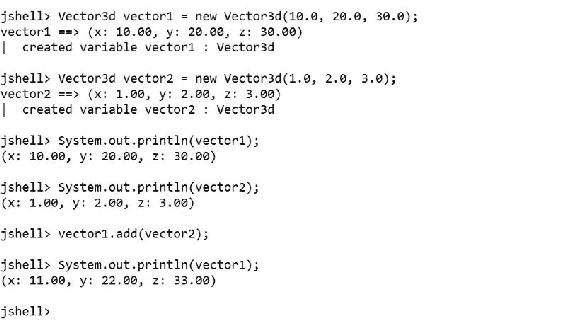
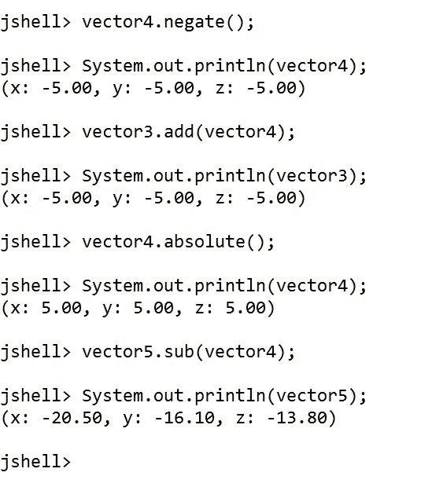
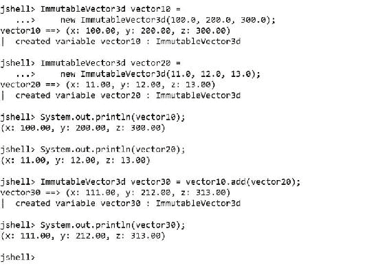

# 第五章：可变和不可变类

在本章中，我们将学习可变和不可变类。我们将了解它们在构建面向对象代码时的区别、优势和劣势。我们将：

+   创建可变类

+   在 JShell 中使用可变对象

+   构建不可变类

+   在 JShell 中使用不可变对象

+   了解可变和不可变对象之间的区别

+   学习在编写并发代码时不可变对象的优势

+   使用不可变`String`类的实例

# 在 Java 9 中创建可变类

当我们声明实例字段时没有使用`final`关键字时，我们创建了一个可变的实例字段，这意味着我们可以在字段初始化后为每个新创建的实例更改它们的值。当我们创建一个定义了至少一个可变字段的类的实例时，我们创建了一个可变对象，这是一个在初始化后可以改变其状态的对象。

### 注意

可变对象也称为可变对象。

例如，假设我们必须开发一个 Web 服务，渲染 3D 世界中的元素并返回高分辨率的渲染场景。这样的任务要求我们使用 3D 向量。首先，我们将使用一个可变的 3D 向量，其中有三个可变字段：`x`、`y`和`z`。可变的 3D 向量必须提供以下功能：

+   三个`double`类型的可变实例字段：`x`、`y`和`z`。

+   一个构造函数，通过提供`x`、`y`和`z`字段的初始值来创建一个实例。

+   一个构造函数，创建一个所有值都初始化为`0`的实例，即`x=0`、`y=0`和`z=0`。具有这些值的 3D 向量称为**原点向量**。

+   一个构造函数，创建一个所有值都初始化为一个公共值的实例。例如，如果我们指定`3.0`作为公共值，构造函数必须生成一个`x=3.0`、`y=3.0`和`z=3.0`的实例。

+   一个`absolute`方法，将 3D 向量的每个分量设置为其绝对值。

+   一个`negate`方法，就地否定 3D 向量的每个分量。

+   一个`add`方法，将 3D 向量的值设置为其自身与作为参数接收的 3D 向量的和。

+   一个`sub`方法，将 3D 向量的值设置为其自身与作为参数接收的 3D 向量的差。

+   `toString`方法的实现，打印 3D 向量的三个分量的值：`x`、`y`和`z`。

以下行声明了`Vector3d`类，表示 Java 中 3D 向量的可变版本。示例的代码文件包含在`java_9_oop_chapter_05_01`文件夹中的`example05_01.java`文件中。

```java
public class Vector3d {
    public double x;
    public double y;
    public double z;

 Vector3d(double x, double y, double z) {
 this.x = x;
 this.y = y;
 this.z = z;
 }

 Vector3d(double valueForXYZ) {
 this(valueForXYZ, valueForXYZ, valueForXYZ);
 }

 Vector3d() {
 this(0.0);
 }

    public void absolute() {
        x = Math.abs(x);
        y = Math.abs(y);
        z = Math.abs(z);
    }

    public void negate() {
        x = -x;
        y = -y;
        z = -z;
    }

    public void add(Vector3d vector) {
        x += vector.x;
        y += vector.y;
        z += vector.z;
    }

    public void sub(Vector3d vector) {
        x -= vector.x;
        y -= vector.y;
        z -= vector.z;
    }

    public String toString() {
        return String.format(
            "(x: %.2f, y: %.2f, z: %.2f)",
            x,
            y,
            z);
    }
}
```

新的`Vector3d`类声明了三个构造函数，它们的行在前面的代码列表中突出显示。第一个构造函数接收三个`double`参数`x`、`y`和`z`，并使用这些参数中接收的值初始化具有相同名称和类型的字段。

第二个构造函数接收一个`double`参数`valueForXYZ`，并使用`this`关键字调用先前解释的构造函数，将接收的参数作为三个参数的值。

### 提示

我们可以在构造函数中使用`this`关键字来调用类中定义的具有不同参数的其他构造函数。

第三个构造函数是一个无参数的构造函数，并使用`this`关键字调用先前解释的构造函数，将`0.0`作为`valueForXYZ`参数的值。这样，构造函数允许我们构建一个原点向量。

每当我们调用`absolute`、`negate`、`add`或`sub`方法时，我们将改变实例的状态，也就是说，我们将改变对象的状态。这些方法改变了我们调用它们的实例的`x`、`y`和`z`字段的值。

# 在 JShell 中使用可变对象

以下行创建了一个名为`vector1`的新`Vector3d`实例，其初始值为`x`、`y`和`z`的`10.0`、`20.0`和`30.0`。第二行创建了一个名为`vector2`的新`Vector3d`实例，其初始值为`x`、`y`和`z`的`1.0`、`2.0`和`3.0`。然后，代码调用`System.out.println`方法，参数分别为`vector1`和`vector2`。对`println`方法的两次调用将执行每个`Vector3d`实例的`toString`方法，以显示可变 3D 向量的`String`表示。然后，代码使用`vector2`作为参数调用`vector1`的`add`方法。最后一行再次调用`println`方法，参数为`vector1`，以打印调用`add`方法后`x`、`y`和`z`的新值。示例的代码文件包含在`java_9_oop_chapter_05_01`文件夹中的`example05_01.java`文件中。

```java
Vector3d vector1 = new Vector3d(10.0, 20.0, 30.0);
Vector3d vector2 = new Vector3d(1.0, 2.0, 3.0);
System.out.println(vector1);
System.out.println(vector2);
vector1.add(vector2);
System.out.println(vector1);
```

以下屏幕截图显示了在 JShell 中执行上述代码的结果：



`vector1`字段的初始值分别为`10.0`、`20.0`和`30.0`。`add`方法改变了三个字段的值。因此，对象状态发生了变化：

+   `vector1.x`从`10.0`变为*10.0 + 1.0 = 11.0*

+   `vector1.y`从`20.0`变为*20.0 + 2.0 = 22.0*

+   `vector1.z`从`30.0`变为*30.0 + 3.0 = 33.0*

在调用`add`方法后，`vector1`字段的值为`11.0`、`22.0`和`33.0`。我们可以说该方法改变了对象的状态。因此，`vector1`是一个可变对象，是可变类的一个实例。

以下行使用三个可用的构造函数创建了`Vector3d`类的三个实例，分别命名为`vector3`、`vector4`和`vector5`。然后，下一行调用`System.out.println`方法，以打印对象创建后的`x`、`y`和`z`的值。示例的代码文件包含在`java_9_oop_chapter_05_01`文件夹中的`example05_02.java`文件中。

```java
Vector3d vector3 = new Vector3d();
Vector3d vector4 = new Vector3d(5.0);
Vector3d vector5 = new Vector3d(-15.5, -11.1, -8.8);
System.out.println(vector3);
System.out.println(vector4);
System.out.println(vector5);
```

以下屏幕截图显示了在 JShell 中执行上述代码的结果：


接下来的行调用了先前创建的实例的许多方法。示例的代码文件包含在`java_9_oop_chapter_05_01`文件夹中的`example05_02.java`文件中。

```java
vector4.negate();
System.out.println(vector4);
vector3.add(vector4);
System.out.println(vector3);
vector4.absolute();
System.out.println(vector4);
vector5.sub(vector4);
System.out.println(vector5);
```

`vector4`字段的初始值为`5.0`。对`vector4.negate`方法的调用将三个字段的值改变为`-5.0`。

三个`vector3`字段（`x`、`y`和`z`）的初始值为`0.0`。对`vector3.add`方法的调用通过`vector3`和`vector4`的每个分量的和的结果改变了三个字段的值。因此，对象状态发生了变化：

+   `vector3.x`从`0.0`变为*0.0 + (-5.0) = -5.0*

+   `vector3.y`从`0.0`变为*0.0 + (-5.0) = -5.0*

+   `vector3.z`从`0.0`变为*0.0 + (-5.0) = -5.0*

`vector3`字段在调用`add`方法后被设置为`-5.0`。对`vector4.absolute`方法的调用将三个字段的值从`-5.0`改变为`5.0`。

`vector5`字段的初始值分别为`-15.5`、`-11.1`和`-8.8`。对`vector5.sub`方法的调用通过`vector5`和`vector4`的每个分量的减法结果改变了三个字段的值。因此，对象状态发生了变化：

+   `vector5.x`从`-15.5`变为*-15.5 - 5.0 = -20.5*

+   `vector5.y`从`-11.1`变为*-11.1 - 5.0 = -16.1*

+   `vector5.z`从`-8.8`变为*-8.8 - 5.0 = -13.8*

以下屏幕截图显示了在 JShell 中执行上述代码的结果：



# 在 Java 9 中构建不可变类

到目前为止，我们一直在使用可变类和变异对象。每当我们暴露可变字段时，我们都会创建一个将生成可变实例的类。在某些情况下，我们可能更喜欢一个对象，在初始化后无法更改其状态。我们可以设计类为不可变，并生成不可更改的实例，这些实例在创建和初始化后无法更改其状态。

不可变对象非常有用的一个典型场景是在处理并发代码时。不能更改其状态的对象解决了许多典型的并发问题，并避免了可能难以检测和解决的潜在错误。因为不可变对象不能更改其状态，所以在许多不同的线程修改它时，不可能出现对象处于损坏或不一致状态的情况，而没有适当的同步机制。

### 注意

不可变对象也被称为不可变对象。

我们将创建一个不可变版本的先前编码的`Vector3d`类，以表示不可变的 3D 向量。这样，我们将注意到可变类和其不可变版本之间的区别。不可变的 3D 向量必须提供以下功能：

+   三个`double`类型的不可变实例字段：`x`、`y`和`z`。这些字段的值在实例初始化或构造后不能更改。

+   通过为`x`、`y`和`z`不可变字段提供初始值来创建实例的构造函数。

+   一个构造函数，创建一个所有值都设置为`0`的实例，即`x = 0`、`y = 0`和`z = 0`。

+   一个构造函数，创建一个所有值都初始化为公共值的实例。例如，如果我们指定`3.0`作为公共值，构造函数必须生成一个不可变实例，其中`x = 3.0`、`y = 3.0`和`z = 3.0`。

+   一个`absolute`方法，返回一个新实例，其中调用该方法的实例的每个分量的绝对值设置为该实例的每个分量的绝对值。

+   一个`negate`方法，返回一个新实例，其中调用该方法的实例的每个分量的值设置为该方法的每个分量的否定值。

+   一个`add`方法，返回一个新实例，其中调用该方法的实例的每个分量设置为该方法和作为参数接收的不可变 3D 向量的每个分量的和。

+   一个`sub`方法，返回一个新实例，其中调用该方法的实例的每个分量设置为该方法和作为参数接收的不可变 3D 向量的每个分量的差。

+   `toString`方法的实现，打印 3D 向量的三个分量的值：`x`、`y`和`z`。

以下行声明了`ImmutableVector3d`类，该类表示 Java 中 3D 向量的不可变版本。示例的代码文件包含在`java_9_oop_chapter_05_01`文件夹中的`example05_03.java`文件中。

```java
public class ImmutableVector3d {
    public final double x;
    public final double y;
    public final double z;

 ImmutableVector3d(double x, double y, double z) {
 this.x = x;
 this.y = y;
 this.z = z;
 }

 ImmutableVector3d(double valueForXYZ) {
 this(valueForXYZ, valueForXYZ, valueForXYZ);
 }

 ImmutableVector3d() {
 this(0.0);
 }

    public ImmutableVector3d absolute() {
        return new ImmutableVector3d(
            Math.abs(x),
            Math.abs(y),
            Math.abs(z));
    }

    public ImmutableVector3d negate() {
        return new ImmutableVector3d(
            -x,
            -y,
            -z);
    }

    public ImmutableVector3d add(ImmutableVector3d vector) {
        return new ImmutableVector3d(
            x + vector.x,
            y + vector.y,
            z + vector.z);
    }

    public ImmutableVector3d sub(ImmutableVector3d vector) {
        return new ImmutableVector3d(
            x - vector.x,
            y - vector.y,
            z - vector.z);
    }

    public String toString() {
        return String.format(
            "(x: %.2f, y: %.2f, z: %.2f)",
            x,
            y,
            z);
    }
}
```

新的`ImmutableVector3d`类通过使用`final`关键字声明了三个不可变实例字段：`x`、`y`和`z`。在此类声明的三个构造函数的行在前面的代码列表中突出显示。这些构造函数具有我们为`Vector3d`类分析的相同代码。唯一的区别在于执行，因为构造函数正在初始化不可变实例字段，这些字段在初始化后不会更改其值。

每当我们调用`absolute`、`negate`、`add`或`sub`方法时，它们的代码将返回`ImmutableVector3d`类的新实例，其中包含每个操作的结果。我们永远不会改变我们的实例；也就是说，我们不会改变对象的状态。

# 在 JShell 中使用不可变对象

以下几行创建了一个名为`vector10`的新`ImmutableVector3d`实例，其`x`、`y`和`z`的初始值分别为`100.0`、`200.0`和`300.0`。第二行创建了一个名为`vector20`的新`ImmutableVector3d`实例，其`x`、`y`和`z`的初始值分别为`11.0`、`12.0`和`13.0`。然后，代码分别使用`vector10`和`vector20`作为参数调用`System.out.println`方法。对`println`方法的两次调用将执行每个`ImmutableVector3d`实例的`toString`方法，以显示不可变 3D 向量的`String`表示。然后，代码使用`vector10`和`vector20`作为参数调用`add`方法，并将返回的`ImmutableVector3d`实例保存在`vector30`中。

最后一行使用`vector30`作为参数调用`println`方法，以打印此实例的`x`、`y`和`z`的值，该实例包含了`vector10`和`vector20`之间的加法操作的结果。在声明`ImmutableVector3d`类的代码之后输入这些行。示例的代码文件包含在`java_9_oop_chapter_05_01`文件夹中的`example05_03.java`文件中。

```java
ImmutableVector3d vector10 = 
    new ImmutableVector3d(100.0, 200.0, 300.0);
ImmutableVector3d vector20 = 
    new ImmutableVector3d(11.0, 12.0, 13.0);
System.out.println(vector10);
System.out.println(vector20);
ImmutableVector3d vector30 = vector10.add(vector20);
System.out.println(vector30);
```

以下屏幕截图显示了在 JShell 中执行先前代码的结果：



由于`add`方法的结果，我们有另一个名为`vector30`的不可变实例，其字段值为`111.0`（`x`）、`212.0`（`y`）和`313.0`（`z`）。调用每个计算操作的方法的结果，我们将得到另一个不可变实例。

以下几行使用三个可用的构造函数创建了`ImmutableVector3d`类的三个实例，分别命名为`vector40`、`vector50`和`vector60`。然后，下一行调用`System.out.println`方法，以打印对象创建后`x`、`y`和`z`的值。示例的代码文件包含在`java_9_oop_chapter_05_01`文件夹中的`example05_03.java`文件中。

```java
ImmutableVector3d vector40 = 
    new ImmutableVector3d();
ImmutableVector3d vector50 = 
    new ImmutableVector3d(-5.0);
ImmutableVector3d vector60 = 
    new ImmutableVector3d(8.0, 9.0, 10.0);
System.out.println(vector40);
System.out.println(vector50);
System.out.println(vector60);
```

以下屏幕截图显示了在 JShell 中执行先前代码的结果：


接下来的几行调用了先前创建实例的许多方法，并生成了`ImmutableVector3d`类的新实例。示例的代码文件包含在`java_9_oop_chapter_05_01`文件夹中的`example05_03.java`文件中。

```java
ImmutableVector3d vector70 = vector50.negate();
System.out.println(vector70);
ImmutableVector3d vector80 = vector40.add(vector70);
System.out.println(vector80);
ImmutableVector3d vector90 = vector70.absolute();
System.out.println(vector90);
ImmutableVector3d vector100 = vector60.sub(vector90);
System.out.println(vector100);
```

`vector50`字段（`x`、`y`和`z`）的初始值为`-5.0`。对`vector50.negate`方法的调用返回一个新的`ImmutableVector3d`实例，代码将其保存在`vector70`中。新实例的三个字段（`x`、`y`和`z）的值为`5.0`。

`vector40`字段（`x`、`y`和`z`）的初始值为`0`。对`vector40.add`方法使用`vector70`作为参数的调用返回一个新的`ImmutableVector3d`实例，代码将其保存在`vector80`中。新实例的三个字段（`x`、`y`和`z`）的值为`5.0`。

对`vector70.absolute`方法的调用返回一个新的`ImmutableVector3d`实例，代码将其保存在`vector90`中。新实例的三个字段（`x`、`y`和`z`）的值为`5.0`。字段的绝对值与原始值相同，但代码仍然生成了一个新实例。

`vector60`字段的初始值分别为`8.0`（`x`）、`9.0`（`y`）和`10.0`（`z`）。对`vector60.sub`方法使用`vector90`作为参数的调用返回一个新的`ImmutableVector3d`实例，代码将其保存在`vector100`中。`vector100`字段的值分别为`3.0`（`x`）、`4.0`（`y`）和`5.0`（`z`）。

以下屏幕截图显示了在 JShell 中执行先前代码的结果：


# 理解可变和不可变对象之间的区别

与可变版本相比，不可变版本增加了开销，因为调用`absolute`、`negate`、`add`或`sub`方法时需要创建类的新实例。先前分析过的可变类`Vector3D`只是改变了字段的值，不需要生成新实例。因此，不可变版本的内存占用量高于可变版本。

与可变版本相比，名为`ImmutableVector3d`的不可变类在内存和性能方面都有额外的开销。创建新实例比改变少数字段的值更昂贵。然而，正如先前解释的那样，当我们使用并发代码时，为了避免可变对象可能引起的问题，为额外的开销付费是有意义的。我们只需要确保分析优势和权衡，以决定哪种方式是编写特定类最方便的方式。

现在，我们将编写一些使用可变版本的代码，并生成不可变版本的等效代码。这样，我们就能够简单而生动地比较这两段代码之间的区别。

以下行创建了一个名为`mutableVector3d1`的新的`Vector3d`实例，初始值为`x`、`y`和`z`的值分别为`-30.5`、`-15.5`和`-12.5`。然后，代码打印了新实例的`String`表示形式，调用了`absolute`方法，并打印了变异对象的`String`表示形式。示例的代码文件包含在`java_9_oop_chapter_05_01`文件夹中的`example05_04.java`文件中。

```java
// Mutable version
Vector3d mutableVector3d1 = 
    new Vector3d(-30.5, -15.5, -12.5);
System.out.println(mutableVector3d1);
mutableVector3d1.absolute();
System.out.println(mutableVector3d1);
```

以下截图显示了在 JShell 中执行先前代码的结果：


以下行创建了一个名为`immutableVector3d1`的新的`ImmutableVector3d`实例，初始值为`x`、`y`和`z`的值分别为`-30.5`、`-15.5`和`-12.5`。然后，代码打印了新实例的`String`表示形式，调用了`absolute`方法生成了一个名为`immutableVector3d2`的新的`ImmutableVector3d`实例，并打印了新对象的`String`表示形式。示例的代码文件包含在`java_9_oop_chapter_05_01`文件夹中的`example05_04.java`文件中。

```java
// Immutable version
ImmutableVector3d immutableVector3d1 = 
    new ImmutableVector3d(-30.5, -15.5, -12.5);
System.out.println(immutableVector3d1);
ImmutableVector3d immutableVector3d2 =
    immutableVector3d1.absolute();
System.out.println(immutableVector3d2);
```

以下截图显示了在 JShell 中执行先前代码的结果：


可变版本使用单个`Vector3d`实例。`Vector3d`类的构造函数只执行一次。当调用`absolute`方法时，原始实例会改变其状态。

不可变版本使用两个`ImmutableVector3d`实例，因此内存占用量高于可变版本。`ImmutableVector3d`类的构造函数被执行了两次。第一个实例在调用`absolute`方法时没有改变其状态。

# 学习在编写并发代码时不可变对象的优势

现在，让我们想象我们正在编写必须访问先前创建实例的字段的并发代码。首先，我们将分析可变版本的问题，然后我们将了解使用不可变对象的优势。

假设我们有两个线程，代码中引用了保存在`mutableVector3d1`中的实例。第一个线程调用这个可变对象的`absolute`方法。`absolute`方法的第一行代码将`Math.abs`的结果作为参数赋给`x`可变字段的实际值。

在这一点上，方法还没有完成执行，下一行代码将无法访问这些值。然而，在另一个线程中运行的并发代码可能会在`absolute`方法完成执行之前访问`x`、`y`和`z`字段的值。对象处于损坏状态，因为`x`字段的值为`30.5`，`y`字段的值为`-15.5`，`z`字段的值为`-12.5`。这些值不代表`absolute`方法执行完成后我们将拥有的 3D 向量。并发运行的代码片段并且可以访问相同实例而没有任何同步机制，这会产生问题。

并发编程和线程编程是复杂的主题，值得一整本书来讨论。有同步机制可以避免前面提到的问题，并使类成为线程安全的。然而，另一个解决方案是使用生成不可变对象的不可变类。

如果我们使用不可变版本，两个线程可以引用相同的初始实例。然而，当其中一个线程调用`absolute`方法时，原始的 3D 向量不会发生变化，因此之前的问题永远不会发生。另一个线程将继续使用对原始 3D 向量的引用，保持其原始状态。调用`absolute`方法的线程将生成一个完全独立于原始实例的新实例。

再次强调，理解这个主题需要一整本书。然而，了解为什么不可变类可能在实例将参与并发代码的特定场景中是一个特殊要求是很重要的。

# 使用不可变 String 类的实例

`String`类，特别是`java.lang.String`类，表示字符字符串，是一个生成不可变对象的不可变类。因此，`String`类提供的方法不会改变对象。

例如，以下行创建了一个新的`String`，也就是`java.lang.String`类的一个新实例，名为`welcomeMessage`，初始值为`"Welcome to Virtual Creatures Land"`。然后，代码对`welcomeMessage`进行了多次调用`System.out.println`，并将不同的方法作为参数。首先，我们调用`toUpperCase`方法生成一个所有字符都转换为大写的新`String`。然后，我们调用`toLowerCase`方法生成一个所有字符都转换为小写的新`String`。然后，我们调用`replaceAll`方法生成一个将空格替换为连字符（`-`）的新`String`。最后，我们再次调用`System.out.println`方法，并将`welcomeMessage`作为参数，以检查原始`String`的值。示例的代码文件包含在`java_9_oop_chapter_05_01`文件夹中的`example05_05.java`文件中。

```java
String welcomeMessage = "Welcome to Virtual Creatures Land";
System.out.println(welcomeMessage);
System.out.println(welcomeMessage.toUpperCase());
System.out.println(welcomeMessage.toLowerCase());
System.out.println(welcomeMessage.replaceAll(" ", "-"));
System.out.println(welcomeMessage);
```

以下截图显示了在 JShell 中执行前面代码的结果：


`welcomeMessage`字符串从未改变其值。对`toUpperCase`、`toLowerCase`和`replaceAll`方法的调用为每个方法生成并返回了一个新的`String`实例。

### 提示

无论我们为`String`实例调用哪个方法，它都不会改变对象。因此，我们可以说`String`是一个不可变类。

# 创建现有可变类的不可变版本

在上一章中，我们创建了一个名为`VirtualCreature`的可变类。我们提供了 setter 方法来改变`hat`、`visibilityLevel`和`birthYear`字段的值。我们可以通过调用`setAge`方法来改变`birthYear`。

虚拟生物在进化后会改变它们的年龄、帽子和可见性级别。当它们进化时，它们会变成不同的生物，因此在这种进化发生后生成一个新实例是有意义的。因此，我们将创建`VirtualCreature`类的不可变版本，并将其称为`ImmutableVirtualCreature`。

以下行显示了新`ImmutableVirtualCreature`类的代码。示例的代码文件包含在`java_9_oop_chapter_05_01`文件夹中的`example05_06.java`文件中。

```java
import java.time.Year;

public class ImmutableVirtualCreature {
 public final String name;
 public final int birthYear;
 public final String hat;
 public final int visibilityLevel;

    ImmutableVirtualCreature(final String name, 
        int birthYear, 
        String hat, 
        int visibilityLevel) {
        this.name = name;
        this.birthYear = birthYear;
        this.hat = hat.toUpperCase();
        this.visibilityLevel = 
            getValidVisibilityLevel(visibilityLevel);
    }

    private int getCurrentYear() {
        return Year.now().getValue();
    }

    private int getValidVisibilityLevel(int levelToValidate) {
        return Math.min(Math.max(levelToValidate, 0), 100);
    }

    public int getAge() {
        return getCurrentYear() - birthYear;
    }

    public ImmutableVirtualCreature evolveToAge(int age) {
        int newBirthYear = getCurrentYear() - age;
        return new ImmutableVirtualCreature(
            name,
            newBirthYear,
            hat,
            visibilityLevel);
    }

    public ImmutableVirtualCreature evolveToVisibilityLevel(
        final int visibilityLevel) {
        int newVisibilityLevel =
            getValidVisibilityLevel(visibilityLevel);
        return new ImmutableVirtualCreature(
            name,
            birthYear,
            hat,
            newVisibilityLevel);
    }
}
```

`ImmutableVirtualCreature`类使用`final`关键字声明了四个公共不可变实例字段：`name`、`birthYear`、`hat`和`visibilityLevel`。在实例被初始化或构造后，我们将无法更改这些字段的任何值。

构造函数从`hat`参数中接收的`String`生成大写的`String`并将其存储在公共的不可变字段`hat`中。我们对可见性级别有特定的验证，因此构造函数调用一个名为`getValidVisibilityLevel`的新私有方法，该方法使用`visibilityLevel`参数中接收的值来为具有相同名称的不可变字段分配一个有效值。

我们不再有 setter 方法，因为在初始化后我们无法更改不可变字段的值。该类声明了以下两个新的公共方法，它们返回一个新的`ImmutableVirtualCreature`实例：

+   `evolveToAge`：此方法接收`age`参数中进化虚拟生物的期望年龄。代码根据接收到的年龄和当前年份计算出出生年份，并返回一个具有新初始化值的新`ImmutableVirtualCreature`实例。

+   `evolveToVisibilityLevel`：此方法接收`visibilityLevel`参数中进化虚拟生物的期望可见性级别。代码调用`getValidVisibilityLevel`方法根据接收到的值生成一个有效的可见性级别，并返回一个具有新初始化值的新`ImmutableVirtualCreature`实例。

以下行创建了一个名为`meowth1`的`ImmutableVirtualCreature`类的实例。然后，代码使用`3`作为`age`参数的值调用`meowth1.evolveToAge`方法，并将此方法返回的新`ImmutableVirtualCreature`实例保存在`meowth2`变量中。代码打印了`meowth2.getAge`方法返回的值。最后，代码使用`25`作为`invisibilityLevel`参数的值调用`meowth2.evolveToVisibilityLevel`方法，并将此方法返回的新`ImmutableVirtualCreature`实例保存在`meowth3`变量中。然后，代码打印了存储在`meowth3.visibilityLevel`不可变字段中的值。示例的代码文件包含在`java_9_oop_chapter_05_01`文件夹中的`example05_06.java`文件中。

```java
ImmutableVirtualCreature meowth1 =
    new ImmutableVirtualCreature(
        "Meowth", 2010, "Baseball cap", 35);
ImmutableVirtualCreature meowth2 = 
    meowth1.evolveToAge(3);
System.out.printf("%d\n", meowth2.getAge());
ImmutableVirtualCreature meowth3 = 
    meowth2.evolveToVisibilityLevel(25);
System.out.printf("%d\n", meowth3.visibilityLevel);
```

以下屏幕截图显示了在 JShell 中执行上述代码的结果：


# 测试你的知识

1.  一个暴露可变字段的类将：

1.  生成不可变实例。

1.  生成可变实例。

1.  生成可变类但不可变实例。

1.  在构造函数中使用以下哪个关键字可以调用我们类中定义的具有不同参数的其他构造函数：

1.  `self`

1.  `constructor`

1.  `this`

1.  在初始化后无法更改其状态的对象称为：

1.  一个可变对象。

1.  一个不可变对象。

1.  一个接口对象。

1.  在 Java 9 中，`java.lang.String`生成：

1.  一个不可变对象。

1.  一个可变对象。

1.  一个接口对象。

1.  如果我们为`java.lang.String`调用`toUpperCase`方法，该方法将：

1.  将现有的`String`转换为大写字符并改变其状态。

1.  返回一个新的`String`，其中包含原始`String`转换为大写字符的内容。

1.  返回一个包含原始字符串内容的新的`String`。

# 总结

在本章中，你学习了可变和不可变类之间的区别，以及它们生成的可变和不可变实例。我们在 Java 9 中声明了可变和不可变版本的 3D 向量类。

然后，我们利用 JShell 轻松地处理这些类的可变和不可变实例，并分析了改变对象状态和在需要改变其状态时返回一个新对象之间的区别。我们分析了可变和不可变类的优缺点，并理解了为什么在处理并发代码时后者是有用的。

现在你已经学习了可变和不可变类，你已经准备好学习继承、抽象、扩展和专门化，这些是我们下一章要讨论的主题。
