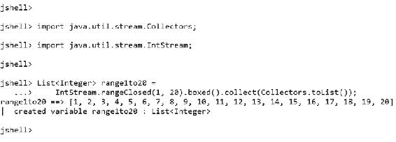
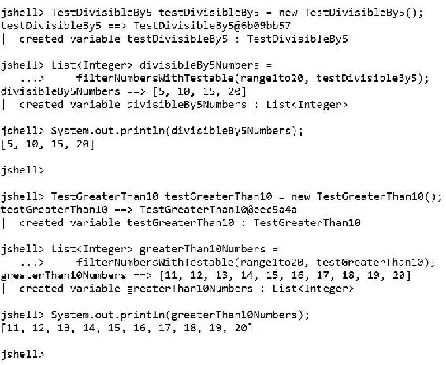
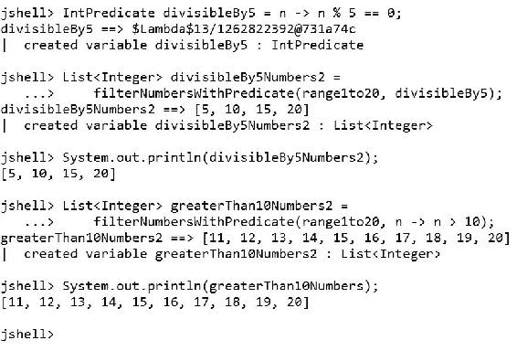
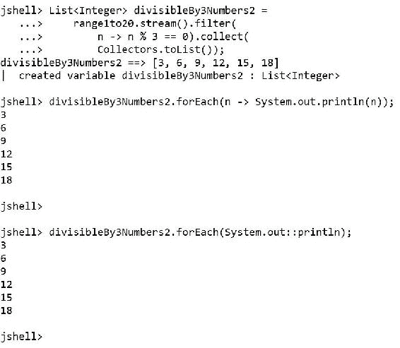

# 第十二章：面向对象，函数式编程和 Lambda 表达式

在本章中，我们将讨论函数式编程以及 Java 9 如何实现许多函数式编程概念。我们将使用许多示例来演示如何将函数式编程与面向对象编程相结合。我们将：

+   将函数和方法视为一等公民

+   使用函数接口和 Lambda 表达式

+   创建数组过滤的函数版本

+   使用泛型和接口创建数据存储库

+   使用复杂条件过滤集合

+   使用 map 操作转换值

+   将 map 操作与 reduce 结合

+   使用 map 和 reduce 链式操作

+   使用不同的收集器

# 将函数和方法视为一等公民

自 Java 首次发布以来，Java 一直是一种面向对象的编程语言。从 Java 8 开始，Java 增加了对**函数式编程**范式的支持，并在 Java 9 中继续这样做。函数式编程偏爱不可变数据，因此，函数式编程避免状态更改。

### 注意

使用函数式编程风格编写的代码尽可能声明性，并且专注于它所做的事情，而不是它必须如何做。

在大多数支持函数式编程范式的编程语言中，函数是一等公民，也就是说，我们可以将函数用作其他函数或方法的参数。Java 8 引入了许多更改，以减少样板代码，并使方法成为 Java 中的一等公民变得容易，并且使得编写使用函数式编程方法的代码变得容易。我们可以通过一个简单的示例，例如过滤列表，轻松理解这个概念。但是，请注意，我们将首先编写具有方法作为一等公民的**命令式代码**，然后，我们将为此代码创建一个使用 Java 9 中的过滤操作的完整函数式方法的新版本。我们将创建许多版本的此示例，因为这将使我们能够了解在 Java 9 中如何实现函数式编程。

首先，我们将编写一些代码，考虑到我们仍然不知道 Java 9 中包含的将方法转换为一等公民的功能。然后，我们将在许多示例中使用这些功能。

以下行声明了`Testable`接口，该接口指定了一个接收`int`类型的`number`参数并返回`boolean`结果的方法要求。示例的代码文件包含在`java_9_oop_chapter_12_01`文件夹中的`example12_01.java`文件中。

```java
public interface Testable {
    boolean test(int number);
}
```

以下行声明了实现先前声明的`Testable`接口的`TestDivisibleBy5`具体类。该类使用包含返回`boolean`值的代码实现`test`方法，指示接收到的数字是否可以被`5`整除。如果数字和`5`之间的模运算结果等于`0`，则表示该数字可以被`5`整除。示例的代码文件包含在`java_9_oop_chapter_12_01`文件夹中的`example12_01.java`文件中。

```java
public class TestDivisibleBy5 implements Testable {
    @Override
    public boolean test(int number) {
        return ((number % 5) == 0);
    }
}
```

以下行声明了实现先前声明的`Testable`接口的`TestGreaterThan10`具体类。该类使用包含返回`boolean`值的代码实现`test`方法，指示接收到的数字是否大于`10`。示例的代码文件包含在`java_9_oop_chapter_12_01`文件夹中的`example12_01.java`文件中。

```java
public class TestGreaterThan10 implements Testable {
    @Override
    public boolean test(int number) {
        return (number > 10);
    }
}
```

以下几行声明了`filterNumbersWithTestable`方法，该方法接收`numbers`参数中的`List<Integer>`和`tester`参数中的`Testable`实例。该方法使用外部的`for`循环，即命令式代码，为`numbers`中的每个`Integer`元素调用`tester.test`方法。如果`test`方法返回`true`，则代码将`Integer`元素添加到`filteredNumbersList<Integer>`中，具体来说，是一个`ArrayList<Integer>`。最后，该方法将`filteredNumbersList<Integer>`作为结果返回，其中包含满足测试条件的所有`Integer`对象。示例的代码文件包含在`java_9_oop_chapter_12_01`文件夹中的`example12_01.java`文件中。

```java
public List<Integer> filterNumbersWithTestable(final List<Integer> numbers,
    Testable tester) {
    List<Integer> filteredNumbers = new ArrayList<>();
    for (Integer number : numbers) {
        if (tester.test(number)) {
            filteredNumbers.add(number);
        }
    }
    return filteredNumbers; 
}
```

`filterNumbersWithTestable`方法使用两个`List<Integer>`对象，即两个`List`的`Integer`对象。我们讨论的是`Integer`而不是`int`原始类型。`Integer`是`int`原始类型的包装类。但是，我们在`Testable`接口中声明的`test`方法，然后在实现该接口的两个类中实现，接收的是`int`类型的参数，而不是`Integer`。

Java 会自动将原始值转换为相应包装类的对象。每当我们将对象作为参数传递给期望原始类型值的方法时，Java 编译器将该对象转换为相应的原始类型，这个操作称为**拆箱**。在下一行中，Java 编译器将`Integer`对象转换或拆箱为`int`类型的值。

```java
if (tester.test(number)) {
```

编译器将执行等效于调用`intValue()`方法的代码，该方法将`Integer`拆箱为`int`：

```java
if (tester.test(number.intValue())) {
```

我们不会编写`for`循环来填充`List`中的`Integer`对象。相反，我们将使用`IntStream`类，该类专门用于描述`int`原始类型的流。这些类定义在`java.util.stream`包中，因此，我们必须添加一个`import`语句才能在 JShell 中使用它。以下一行调用`IntStream.rangeClosed`方法，参数为`1`和`20`，以生成一个包含从`1`到`20`（包括）的`int`值的`IntStream`。链式调用`boxed`方法将生成的`IntStream`转换为`Stream<Integer>`，即从原始`int`值装箱成的`Integer`对象流。链式调用`collect`方法，参数为`Collectors.toList()`，将`Integer`对象流收集到`List<Integer>`中，具体来说，是一个`ArrayList<Integer>`。`Collectors`类也定义在`java.util.stream`包中。示例的代码文件包含在`java_9_oop_chapter_12_01`文件夹中的`example12_01.java`文件中。

```java
import java.util.stream.Collectors;
import java.util.stream.IntStream;

List<Integer> range1to20 = 
    IntStream.rangeClosed(1, 20).boxed().collect(Collectors.toList());
```

### 提示

装箱和拆箱会增加开销，并且会对性能和内存产生影响。在某些情况下，我们可能需要重写我们的代码，以避免不必要的装箱和拆箱，从而实现最佳性能。

非常重要的是要理解`collect`操作将开始处理管道以返回所需的结果，即从中间流生成的列表。在调用`collect`方法之前，中间操作不会被执行。以下屏幕截图显示了在 JShell 中执行前几行的结果。我们可以看到`range1to20`是一个包含从 1 到 20（包括）的`Integer`列表，装箱成`Integer`对象。



以下行创建了一个名为`testDivisibleBy5`的`TestDivisibleBy5`类的实例。然后，代码使用`List<Integer> range1to20`作为`numbers`参数，使用名为`testDivisibleBy5`的`TestDivisibleBy5`实例作为`tester`参数调用了`filterNumbersWithTestable`方法。代码运行后，`List<Integer> divisibleBy5Numbers`将具有以下值：`[5, 10, 15, 20]`。示例的代码文件包含在`java_9_oop_chapter_12_01`文件夹中的`example12_01.java`文件中。

```java
TestDivisibleBy5 testDivisibleBy5 = new TestDivisibleBy5();
List<Integer> divisibleBy5Numbers = 
filterNumbersWithTestable(range1to20, testDivisibleBy5);
System.out.println(divisibleBy5Numbers);
```

以下行创建了一个名为`testGreaterThan10`的`TestGreaterThan10`类的实例。然后，代码使用`range1to20`和`testGreaterThan10`作为参数调用了`filterNumbersWithTestable`方法。代码运行后，`List<Integer> greaterThan10Numbers`将具有以下值：`[11, 12, 13, 14, 15, 16, 17, 18, 19, 20]`。示例的代码文件包含在`java_9_oop_chapter_12_01`文件夹中的`example12_01.java`文件中。

```java
TestGreaterThan10 testGreaterThan10 = new TestGreaterThan10();
List<Integer> greaterThan10Numbers = 
    filterNumbersWithTestable(range1to20, testGreaterThan10);
System.out.println(greaterThan10Numbers);
```

以下屏幕截图显示了在 JShell 中执行前面行的结果：



# 使用函数接口和 Lambda 表达式

我们不得不声明一个接口和两个类，以使方法能够接收`Testable`的实例并执行每个类实现的`test`方法成为可能。幸运的是，Java 8 引入了**函数接口**，Java 9 使我们能够在代码需要函数接口时提供兼容的**Lambda 表达式**。简而言之，我们可以写更少的代码来实现相同的目标。

### 注意

函数接口是满足以下条件的接口：它具有单个抽象方法或单个方法要求。我们可以使用 Lambda 表达式、方法引用或构造函数引用创建函数接口的实例。我们将使用不同的示例来理解 Lambda 表达式、方法引用和构造函数引用，并看到它们的实际应用。

`IntPredicate`函数接口表示具有一个`int`类型参数并返回一个`boolean`结果的函数。布尔值函数称为谓词。该函数接口在`java.util.function`中定义，因此在使用之前我们必须包含一个`import`语句。

以下行声明了`filterNumbersWithPredicate`方法，该方法接收`List<Integer>`作为`numbers`参数，并接收`IntPredicate`实例作为`predicate`参数。该方法的代码与为`filterNumbersWithTestable`方法声明的代码相同，唯一的区别是，新方法接收的不是名为`tester`的`Testable`类型参数，而是名为`predicate`的`IntPredicate`类型参数。代码还调用了`test`方法，将从列表中检索的每个数字作为参数进行评估。`IntPredicate`函数接口定义了一个名为`test`的抽象方法，该方法接收一个`int`并返回一个`boolean`结果。示例的代码文件包含在`java_9_oop_chapter_12_01`文件夹中的`example12_02.java`文件中。

```java
import java.util.function.IntPredicate;

public List<Integer> filterNumbersWithPredicate(final List<Integer> numbers,
    IntPredicate predicate) {
    List<Integer> filteredNumbers = new ArrayList<>();
    for (Integer number : numbers) {
        if (predicate.test(number)) {
            filteredNumbers.add(number);
        }
    }
    return filteredNumbers; 
}
```

以下行声明了一个名为`divisibleBy5`的变量，类型为`IntPredicate`，并将一个 Lambda 表达式赋给它。具体来说，代码赋予了一个 Lambda 表达式，该表达式接收一个名为`n`的`int`参数，并返回一个`boolean`值，指示`n`和`5`之间的模运算（`%`）是否等于`0`。示例的代码文件包含在`java_9_oop_chapter_12_01`文件夹中的`example12_02.java`文件中。

```java
IntPredicate divisibleBy5 = n -> n % 5 == 0;
```

Lambda 表达式由以下三个组件组成：

+   `n`：参数列表。在这种情况下，只有一个参数，因此不需要用括号括起参数列表。如果有多个参数，需要用括号括起列表。我们不必为参数指定类型。

+   `->`：箭头标记。

+   `n % 5 == 0`：主体。在这种情况下，主体是一个单一表达式，因此不需要用大括号(`{}`)括起来。此外，在表达式之前也不需要写`return`语句，因为它是一个单一表达式。

前面的代码等同于以下代码。前面的代码是最短版本，下一行是最长版本：

```java
IntPredicate divisibleBy5 = (n) ->{ return n % 5 == 0 };
```

想象一下，使用前面两个版本的任何一个代码，我们正在执行以下任务：

1.  创建一个实现`IntPredicate`接口的匿名类。

1.  在匿名类中声明一个接收`int`参数并返回`boolean`的测试方法，指定箭头标记(`->`)后的主体。

1.  创建一个匿名类的实例。

每当我们输入 lambda 表达式时，当需要`IntPredicate`时，所有这些事情都是在幕后发生的。当我们为其他函数接口使用 lambda 表达式时，类似的事情会发生，不同之处在于方法名称、参数和方法的返回类型可能会有所不同。

### 注意

Java 编译器从函数接口中推断出参数和返回类型的类型。事物保持强类型，如果我们在类型上犯了错误，编译器将生成适当的错误，代码将无法编译。

以下行调用`filterNumbersWithPredicate`方法，使用`List<Integer> range1to20`作为`numbers`参数，名为`divisibleBy5`的`IntPredicate`实例作为`predicate`参数。代码运行后，`List<Integer> divisibleBy5Numbers2`将具有以下值：`[5, 10, 15, 20]`。示例的代码文件包含在`java_9_oop_chapter_12_01`文件夹中的`example12_02.java`文件中。

```java
List<Integer> divisibleBy5Numbers2 = 
    filterNumbersWithPredicate(range1to20, divisibleBy5);
System.out.println(divisibleBy5Numbers2);
```

以下行调用`filterNumbersWithPredicate`方法，使用`List<Integer> range1to20`作为`numbers`参数，使用 lambda 表达式作为`predicate`参数。lambda 表达式接收一个名为`n`的`int`参数，并返回一个`boolean`值，指示`n`是否大于`10`。代码运行后，`List<Integer> greaterThan10Numbers2`将具有以下值：`[11, 12, 13, 14, 15, 16, 17, 18, 19, 20]`。示例的代码文件包含在`java_9_oop_chapter_12_01`文件夹中的`example12_02.java`文件中。

```java
List<Integer> greaterThan10Numbers2 = 
    filterNumbersWithPredicate(range1to20, n -> n > 10);
System.out.println(greaterThan10Numbers2);
```

以下截图显示了在 JShell 中执行前几行的结果。



`Function<T, R>`函数接口表示一个函数，其中`T`是函数的输入类型，`R`是函数的结果类型。我们不能为`T`指定原始类型，比如`int`，因为它不是一个类，但我们可以使用装箱类型，即`Integer`。我们不能为`R`使用`boolean`，但我们可以使用装箱类型，即`Boolean`。如果我们想要与`IntPredicate`函数接口类似的行为，我们可以使用`Function<Integer, Boolean>`，即一个具有`Integer`类型的参数的函数，返回一个`Boolean`结果。这个函数接口在`java.util.function`中定义，因此在使用之前，我们必须包含一个`import`语句。

以下行声明了`filterNumbersWithFunction`方法，该方法接收`numbers`参数中的`List<Integer>`和`predicate`参数中的`Function<Integer, Boolean>`实例。该方法的代码与`filterNumbersWithCondition`方法声明的代码相同，不同之处在于新方法接收了`Function<Integer, Boolean>`类型的参数`function`，而不是接收了名为`predicate`的`IntPredicate`类型的参数。代码调用`apply`方法，并将从列表中检索到的每个数字作为参数进行评估，而不是调用`test`方法。

`Function<T, R>`功能接口定义了一个名为 apply 的抽象方法，该方法接收一个`T`并返回类型为`R`的结果。在这种情况下，apply 方法接收一个`Integer`并返回一个`Boolean`，Java 编译器将自动拆箱为`boolean`。示例的代码文件包含在`java_9_oop_chapter_12_01`文件夹中的`example12_03.java`文件中。

```java
import java.util.function.Function;

public List<Integer> filterNumbersWithFunction(final List<Integer> numbers,
 Function<Integer, Boolean> function) {
    List<Integer> filteredNumbers = new ArrayList<>();
    for (Integer number : numbers) {
 if (function.apply(number)) {
            filteredNumbers.add(number);
        }
    }
    return filteredNumbers; 
}
```

以下行调用了`filterNumbersWithFunction`方法，将`List<Integer> range1to20`作为`numbers`参数，并将 lambda 表达式作为`function`参数。lambda 表达式接收一个名为`n`的`Integer`参数，并返回一个`Boolean`值，指示`n`和`3`之间的模运算结果是否等于`0`。Java 会自动将表达式生成的`boolean`值装箱为`Boolean`对象。代码运行后，`List<Integer> divisibleBy3Numbers`将具有以下值：`[3, 6, 9, 12, 15, 18]`。示例的代码文件包含在`java_9_oop_chapter_12_01`文件夹中的`example12_03.java`文件中。

```java
List<Integer> divisibleBy3Numbers = 
    filterNumbersWithFunction(range1to20, n -> n % 3 == 0);
```

Java 将运行等效于以下行的代码。`intValue()`函数为`n`中接收的`Integer`实例返回一个`int`值，lambda 表达式返回表达式评估生成的`boolean`值的新`Boolean`实例。但是，请记住，装箱和拆箱是在幕后发生的。

```java
List<Integer> divisibleBy3Numbers = 
    filterNumbersWithFunction(range1to20, n -> new Boolean(n.intValue() % 3 == 0));
```

在`java.util.function`中定义了 40 多个功能接口。我们只使用了其中两个能够处理相同 lambda 表达式的接口。我们可以专门撰写一本书来详细分析所有功能接口。我们将继续专注于将面向对象与函数式编程相结合。然而，非常重要的是要知道，在声明自定义功能接口之前，我们必须检查`java.util.function`中定义的所有功能接口。

# 创建数组过滤的功能性版本

先前声明的`filterNumbersWithFunction`方法代表了使用外部`for`循环进行数组过滤的命令式版本。我们可以使用`Stream<T>`对象的`filter`方法，在这种情况下是`Stream<Integer>`对象，并以函数式方法实现相同的目标。

接下来的几行使用了一种功能性方法来生成一个`List<Integer>`，其中包含在`List<Integer> range1to20`中的能被`3`整除的数字。示例的代码文件包含在`java_9_oop_chapter_12_01`文件夹中的`example12_04.java`文件中。

```java
List<Integer> divisibleBy3Numbers2 = range1to20.stream().filter(n -> n % 3 == 0).collect(Collectors.toList());
```

如果我们希望先前的代码在 JShell 中运行，我们必须将所有代码输入到单行中，这对于 Java 编译器成功编译代码并不是必需的。这是 JShell、流和 lambda 表达式的一个特定问题。这使得代码有点难以理解。因此，接下来的几行展示了另一个使用多行的代码版本，这在 JShell 中不起作用，但会使代码更容易理解。只需注意，在下面的示例中，您必须将代码输入到单行中。代码文件使用单行。示例的代码文件包含在`java_9_oop_chapter_12_01`文件夹中的`example12_04.java`文件中。

```java
range1to20.stream()
.filter(n -> n % 3 == 0)
.collect(Collectors.toList());
```

### 提示

`stream`方法从`List<Integer>`生成一个`Stream<Integer>`。**流**是特定类型的元素序列，允许我们执行顺序或并行执行的计算或聚合操作。实际上，我们可以链接许多流操作并组成流管道。这些计算具有延迟执行，也就是说，直到有终端操作（例如请求将最终数据收集到特定类型的`List`中）之前，它们不会被计算。

`filter`方法接收一个`Predicate<Integer>`作为参数，并将其应用于`Stream<Integer>`。`filter`方法返回输入流的元素流，这些元素与指定的谓词匹配。该方法返回一个流，其中包含所有`Predicate<Integer>`评估为`true`的元素。我们将先前解释的 lambda 表达式作为`filter`方法的参数传递。

`collect`方法接收`filter`方法返回的`Stream<Integer>`。我们将`Collectors.toList()`作为`collect`方法的参数传递，以对`Stream<Integer>`的元素执行可变归约操作，并生成`List<Integer>`，即可变结果容器。代码运行后，`List<Integer> divisibleBy3Numbers2`将具有以下值：`[3, 6, 9, 12, 15, 18]`。

现在，我们希望采用功能方法来打印结果`List<Integer>`中的每个数字。`List<T>`实现了`Iterable<T>`接口，允许我们调用`forEach`方法对`Iterable`的每个元素执行指定为参数的操作，直到所有元素都被处理或操作引发异常。`forEach`方法的操作参数必须是`Consumer<T>`，因此在我们的情况下，它必须是`Consumer<Integer>`，因为我们将为结果`List<Integer>`调用`forEach`方法。

`Consumer<T>`是一个函数接口，表示访问类型为`T`的单个输入参数并返回无结果（`void`）的操作。`Consumer<T>`函数接口定义了一个名为`accept`的抽象方法，该方法接收类型为`T`的参数并返回无结果。以下行将 lambda 表达式作为`forEach`方法的参数传递。lambda 表达式生成一个`Consumer<Integer>`，打印接收到的`n`。示例的代码文件包含在`java_9_oop_chapter_12_01`文件夹中的`example12_04.java`文件中。

```java
divisibleBy3Numbers2.forEach(n -> System.out.println(n));
```

由于上一行的结果，我们将在 JShell 中看到以下数字的打印：

```java
3
6
9
12
15
18

```

生成`Consumer<Integer>`的 lambda 表达式调用`System.out.println`方法，并将`Integer`作为参数。我们可以使用方法引用来调用现有方法，而不是使用 lambda 表达式。在这种情况下，我们可以用`System.out::println`替换先前显示的 lambda 表达式，即调用`System.out`的`println`方法的方法引用。每当我们使用方法引用时，Java 运行时都会推断方法类型参数；在这种情况下，方法类型参数是单个`Integer`。示例的代码文件包含在`java_9_oop_chapter_12_01`文件夹中的`example12_04.java`文件中。

```java
divisibleBy3Numbers2.forEach(System.out::println);
```

该代码将产生与先前对 lambda 表达式调用`forEach`相同的结果。以下屏幕截图显示了在 JShell 中执行先前行的结果：



我们可以捕获在 lambda 表达式中未定义的变量。当 lambda 从外部世界捕获变量时，我们也可以称之为闭包。例如，以下行声明了一个名为`byNumber`的`int`变量，并将`4`赋给该变量。然后，下一行使用流、过滤器和收集的新版本来生成一个`List<Integer>`，其中包含能被`byNumber`变量指定的数字整除的数字。lambda 表达式包括`byNumber`，Java 在幕后从外部世界捕获了这个变量。示例的代码文件包含在`java_9_oop_chapter_12_01`文件夹中的`example12_04.java`文件中。

```java
int byNumber = 4;
List<Integer> divisibleBy4Numbers =
    range1to20.stream().filter(
        n -> n % byNumber == 0).collect(
        Collectors.toList());
divisibleBy4Numbers.forEach(System.out::println);
```

由于前一行的结果，我们将在 JShell 中看到以下数字的打印：

```java
4
8
12
16
20

```

如果我们使用一个与函数式接口不匹配的 lambda 表达式，代码将无法编译，Java 编译器将生成适当的错误。例如，以下行尝试将返回`int`而不是`Boolean`或`boolean`的 lambda 表达式分配给`IntPredicate`变量。示例的代码文件包含在`java_9_oop_chapter_12_01`文件夹中的`example12_05.java`文件中。

```java
// The following code will generate an error
IntPredicate errorPredicate = n -> 8;
```

JShell 将显示以下错误，向我们指出`int`无法转换为`boolean`：

```java
|  Error:
|  incompatible types: bad return type in lambda expression
|      int cannot be converted to boolean
|  IntPredicate errorPredicate = n -> 8;
|                                     ^

```

# 使用泛型和接口创建数据仓库

现在我们想要创建一个仓库，为我们提供实体，以便我们可以应用 Java 9 中包含的函数式编程特性来检索和处理这些实体的数据。首先，我们将创建一个`Identifiable`接口，该接口定义了可识别实体的要求。我们希望实现此接口的任何类都提供一个`getId`方法，该方法返回一个`int`，其值为实体的唯一标识符。示例的代码文件包含在`java_9_oop_chapter_12_01`文件夹中的`example12_06.java`文件中。

```java
public interface Identifiable {
    int getId();
}
```

接下来的行创建了一个`Repository<E>`通用接口，该接口指定`E`必须实现最近创建的`Identifiable`接口的通用类型约束。该类声明了一个`getAll`方法，该方法返回一个`List<E>`。实现该接口的每个类都必须为此方法提供自己的实现。示例的代码文件包含在`java_9_oop_chapter_12_01`文件夹中的`example12_06.java`文件中。

```java
public interface Repository<E extends Identifiable> {
    List<E> getAll();
}
```

接下来的行创建了`Entity`抽象类，它是所有实体的基类。该类实现了`Identifiable`接口，并定义了一个`int`类型的不可变`id`受保护字段。构造函数接收`id`不可变字段的期望值，并使用接收到的值初始化字段。抽象类实现了`getId`方法，该方法返回`id`不可变字段的值。示例的代码文件包含在`java_9_oop_chapter_12_01`文件夹中的`example12_06.java`文件中。

```java
public abstract class Entity implements Identifiable {
    protected final int id;

    public Entity(int id) {
        this.id = id;
    }

    @Override
    public final int getId() {
        return id;
    }
}
```

接下来的行创建了`MobileGame`类，具体来说，是先前创建的`Entity`抽象类的子类。示例的代码文件包含在`java_9_oop_chapter_12_01`文件夹中的`example12_06.java`文件中。

```java
public class MobileGame extends Entity {
    protected final String separator = "; ";
    public final String name;
    public int highestScore;
    public int lowestScore;
    public int playersCount;

    public MobileGame(int id, 
        String name, 
        int highestScore, 
        int lowestScore, 
        int playersCount) {
        super(id);
        this.name = name;
        this.highestScore = highestScore;
        this.lowestScore = lowestScore;
        this.playersCount = playersCount;
    }

    @Override
    public String toString() {
        StringBuilder sb = new StringBuilder();
        sb.append("Id: ");
        sb.append(getId());
        sb.append(separator);
        sb.append("Name: ");
        sb.append(name);
        sb.append(separator);
        sb.append("Highest score: ");
        sb.append(highestScore);
        sb.append(separator);
        sb.append("Lowest score: ");
        sb.append(lowestScore);
        sb.append(separator);
        sb.append("Players count: ");
        sb.append(playersCount);

        return sb.toString();
    }
}
```

该类声明了许多公共字段，它们的值在构造函数中初始化：`name`，`highestScore`，`lowestScore`和`playersCount`。该字段是不可变的，但其他三个是可变的。我们不使用 getter 或 setter 来保持事情更简单。但是，重要的是要考虑到，一些允许我们使用实体的框架要求我们对所有字段使用 getter，并且在字段不是只读时使用 setter。

此外，该类重写了从`java.lang.Object`类继承的`toString`方法，必须为实体返回一个`String`表示。此方法中声明的代码使用`java.lang.StringBuilder`类的一个实例（`sb`）以一种高效的方式附加许多字符串，最后返回调用`sb.toString`方法的结果以返回生成的`String`。此方法使用受保护的分隔符不可变字符串，该字符串确定我们在字段之间使用的分隔符。每当我们使用`MobileGame`的实例调用`System.out.println`时，`println`方法将调用重写的`toString`方法来打印该实例的`String`表示。

### 提示

我们也可以使用`String`连接（`+`）或`String.format`来编写`toString`方法的代码，因为我们将只使用`MobileGame`类的 15 个实例。然而，当我们必须连接许多字符串以生成结果并且希望确保在执行代码时具有最佳性能时，最好使用`StringBuilder`。在我们的简单示例中，任何实现都不会有任何性能问题。

以下行创建了实现`Repository<MobileGame>`接口的`MemoryMobileGameRepository`具体类。请注意，我们不说`Repository<E>`，而是指出`Repository<MobileGame>`，因为我们已经知道我们将在我们的类中实现的`E`类型参数的值。我们不是创建一个`MemoryMobileGameRepository<E extends Identifiable>`。相反，我们正在创建一个非泛型的具体类，该类实现了一个泛型接口并将参数类型`E`的值设置为`MobileGame`。示例的代码文件包含在`java_9_oop_chapter_12_01`文件夹中的`example12_06.java`文件中。

```java
import java.util.stream.Collectors;

public class MemoryMobileGameRepository implements Repository<MobileGame> {
    @Override
    public List<MobileGame> getAll() {
        List<MobileGame> mobileGames = new ArrayList<>();
        mobileGames.add(
            new MobileGame(1, "Uncharted 4000", 5000, 10, 3800));
        mobileGames.add(
            new MobileGame(2, "Supergirl 2017", 8500, 5, 75000));
        mobileGames.add(
            new MobileGame(3, "Super Luigi Run", 32000, 300, 90000));
        mobileGames.add(
            new MobileGame(4, "Mario vs Kong III", 152000, 1500, 750000));
        mobileGames.add(
            new MobileGame(5, "Minecraft Reloaded", 6708960, 8000, 3500000));
        mobileGames.add(
            new MobileGame(6, "Pikachu vs Beedrill: The revenge", 780000, 400, 1000000));
        mobileGames.add(
            new MobileGame(7, "Jerry vs Tom vs Spike", 78000, 670, 20000));
        mobileGames.add(
            new MobileGame(8, "NBA 2017", 1500607, 20, 7000005));
        mobileGames.add(
            new MobileGame(9, "NFL 2017", 3205978, 0, 4600700));
        mobileGames.add(
            new MobileGame(10, "Nascar Remix", 785000, 0, 2600000));
        mobileGames.add(
            new MobileGame(11, "Little BIG Universe", 95000, 3, 546000));
        mobileGames.add(
            new MobileGame(12, "Plants vs Zombies Garden Warfare 3", 879059, 0, 789000));
        mobileGames.add(
            new MobileGame(13, "Final Fantasy XVII", 852325, 0, 375029));
        mobileGames.add(
            new MobileGame(14, "Watch Dogs 3", 27000, 2, 78004));
        mobileGames.add(
            new MobileGame(15, "Remember Me", 672345, 5, 252003));

        return mobileGames;
    }
}
```

该类实现了`Repository<E>`接口所需的`getAll`方法。在这种情况下，该方法返回一个`MobileGame`的`List`（`List<MobileGame>`），具体来说是一个`ArrayList<MobileGame>`。该方法创建了 15 个`MobileGame`实例，并将它们附加到一个`MobileGame`的`ArrayList`，该方法作为结果返回。

以下行创建了`MemoryMobileGameRepository`类的一个实例，并为`getAll`方法返回的`List<MobileGame>`调用`forEach`方法。`forEach`方法在列表中的每个元素上调用一个体，就像在`for`循环中一样。作为`forEach`方法参数指定的闭包调用`System.out.println`方法，并将`MobileGame`实例作为参数。这样，Java 使用`MobileGame`类中重写的`toString`方法为每个`MobileGame`实例生成一个`String`表示。示例的代码文件包含在`java_9_oop_chapter_12_01`文件夹中的`example12_06.java`文件中。

```java
MemoryMobileGameRepository repository = new MemoryMobileGameRepository()
repository.getAll().forEach(mobileGame -> System.out.println(mobileGame));
```

以下行显示在执行打印每个`MobileGame`实例的`toString()`方法返回的`String`后生成的输出：

```java
Id: 1; Name: Uncharted 4000; Highest score: 5000; Lowest score: 10; Players count: 3800
Id: 2; Name: Supergirl 2017; Highest score: 8500; Lowest score: 5; Players count: 75000
Id: 3; Name: Super Luigi Run; Highest score: 32000; Lowest score: 300; Players count: 90000
Id: 4; Name: Mario vs Kong III; Highest score: 152000; Lowest score: 1500; Players count: 750000
Id: 5; Name: Minecraft Reloaded; Highest score: 6708960; Lowest score: 8000; Players count: 3500000
Id: 6; Name: Pikachu vs Beedrill: The revenge; Highest score: 780000; Lowest score: 400; Players count: 1000000
Id: 7; Name: Jerry vs Tom vs Spike; Highest score: 78000; Lowest score: 670; Players count: 20000
Id: 8; Name: NBA 2017; Highest score: 1500607; Lowest score: 20; Players count: 7000005
Id: 9; Name: NFL 2017; Highest score: 3205978; Lowest score: 0; Players count: 4600700
Id: 10; Name: Nascar Remix; Highest score: 785000; Lowest score: 0; Players count: 2600000
Id: 11; Name: Little BIG Universe; Highest score: 95000; Lowest score: 3; Players count: 546000
Id: 12; Name: Plants vs Zombies Garden Warfare 3; Highest score: 879059; Lowest score: 0; Players count: 789000
Id: 13; Name: Final Fantasy XVII; Highest score: 852325; Lowest score: 0; Players count: 375029
Id: 14; Name: Watch Dogs 3; Highest score: 27000; Lowest score: 2; Players count: 78004
Id: 15; Name: Remember Me; Highest score: 672345; Lowest score: 5; Players count: 252003

```

```java
 the same result. The code file for the sample is included in the java_9_oop_chapter_12_01 folder, in the example12_06.java file.
```

```java
repository.getAll().forEach(System.out::println);
```

# 使用复杂条件过滤集合

我们可以使用我们的新存储库来限制从复杂数据中检索的结果。我们可以将对`getAll`方法的调用与流、过滤器和收集结合起来，以生成一个`Stream<MobileGame>`，应用一个带有 lambda 表达式作为参数的过滤器，并调用`collect`方法，并将`Collectors.toList()`作为参数，从过滤后的`Stream<MobileGame>`生成一个过滤后的`List<MobileGame>`。`filter`方法接收一个`Predicate<MobileGame>`作为参数，我们使用 lambda 表达式生成该谓词，并将该过滤器应用于`Stream<MobileGame>`。`filter`方法返回输入流的元素流，这些元素流与指定的谓词匹配。该方法返回一个流，其中所有元素的`Predicate<MobileGame>`评估为`true`。

### 注意

接下来的行显示了使用多行的代码片段，这在 JShell 中无法工作，但将使代码更易于阅读和理解。如果我们希望代码在 JShell 中运行，我们必须将所有代码输入到一行中，这对于 Java 编译器成功编译代码并不是必需的。这是 JShell、流和 lambda 表达式的一个特定问题。代码文件使用单行以与 JShell 兼容。

以下行声明了`MemoryMobileGameRepository`类的新`getWithLowestScoreGreaterThan`方法。请注意，为了避免重复，我们没有包含新类的所有代码。示例的代码文件包含在`java_9_oop_chapter_12_01`文件夹中的`example12_07.java`文件中。

```java
public List<MobileGame> getWithLowestScoreGreaterThan(int minimumLowestScore) {
    return getAll().stream()
        .filter(game -> game.lowestScore > minimumLowestScore)
        .collect(Collectors.toList());
}
```

以下行使用名为`repository`的`MemoryMobileGameRepository`实例调用先前添加的方法，然后链式调用`forEach`以打印所有`lowestScore`值大于`1000`的游戏：

```java
MemoryMobileGameRepository repository = new MemoryMobileGameRepository()
repository.getWithLowestScoreGreaterThan(1000).forEach(System.out::println);
```

以下行显示了执行前面代码后生成的输出：

```java
Id: 4; Name: Mario vs Kong III; Highest score: 152000; Lowest score: 1500; Players count: 750000
Id: 5; Name: Minecraft Reloaded; Highest score: 6708960; Lowest score: 8000; Players count: 3500000

```

```java
java_9_oop_chapter_12_01 folder, in the example12_07.java file.
```

```java
public List<MobileGame> getWithLowestScoreGreaterThanV2(int minimumLowestScore) {
return getAll().stream()
 .filter((MobileGame game) -> game.lowestScore > minimumLowestScore) 
    .collect(Collectors.toList());
}
```

以下行声明了`MemoryMobileGameRepository`类的新`getStartingWith`方法。作为`filter`方法参数传递的 lambda 表达式返回调用游戏名称的`startsWith`方法的结果，该方法使用作为参数接收的前缀。在这种情况下，lambda 表达式是一个闭包，它捕获了`prefix`参数，并在 lambda 表达式体内使用它。示例的代码文件包含在`java_9_oop_chapter_12_01`文件夹中的`example12_08.java`文件中。

```java
public List<MobileGame> getStartingWith(String prefix) {
    return getAll().stream()
        .filter(game -> game.name.startsWith(prefix))
        .collect(Collectors.toList());
}
```

以下行使用名为`repository`的`MemoryMobileGameRepository`实例调用先前添加的方法，然后链式调用`forEach`以打印所有以`"Su"`开头的游戏的名称。

```java
MemoryMobileGameRepository repository = new MemoryMobileGameRepository()
repository.getStartingWith("Su").forEach(System.out::println);
```

以下行显示了执行前面代码后生成的输出：

```java
Id: 2; Name: Supergirl 2017; Highest score: 8500; Lowest score: 5; Players count: 75000
Id: 3; Name: Super Luigi Run; Highest score: 32000; Lowest score: 300; Players count: 90000

```

以下行声明了`MemoryMobileGameRepository`类的新`getByPlayersCountAndHighestScore`方法。该方法返回一个`Optional<MobileGame>`，即一个可能包含`MobileGame`实例的容器对象，也可能为空。如果有值，`isPresent`方法将返回`true`，我们将能够通过调用`get`方法检索`MobileGame`实例。在这种情况下，代码调用了`findFirst`方法链接到`filter`方法的调用。`findFirst`方法返回一个`Optional<T>`，在这种情况下，是由`filter`方法生成的`Stream<MobileGame>`中的第一个元素的`Optional<MobileGame>`。请注意，我们在任何时候都没有对结果进行排序。示例的代码文件包含在`java_9_oop_chapter_12_01`文件夹中的`example12_09.java`文件中。

```java
public Optional<MobileGame> getByPlayersCountAndHighestScore(
    int playersCount, 
    int highestScore) {
    return getAll().stream()
        .filter(game -> (game.playersCount == playersCount) && (game.highestScore == highestScore))
        .findFirst();
}
```

以下行使用名为`repository`的`MemoryMobileGameRepository`实例调用先前添加的方法。在每次调用`getByPlayersCountAndHighestScore`方法后，代码调用`isPresent`方法来确定`Optional<MobileGame>`是否有实例。如果方法返回`true`，代码将调用`get`方法从`Optional<MobileGame>`中检索`MobileGame`实例。示例的代码文件包含在`java_9_oop_chapter_12_01`文件夹中的`example12_09.java`文件中。

```java
MemoryMobileGameRepository repository = new MemoryMobileGameRepository()
Optional<MobileGame> optionalMobileGame1 = 
    repository.getByPlayersCountAndHighestScore(750000, 152000);
if (optionalMobileGame1.isPresent()) {
    MobileGame mobileGame1 = optionalMobileGame1.get();
    System.out.println(mobileGame1);
} else {
    System.out.println("No mobile game matches the specified criteria.");
}
Optional<MobileGame> optionalMobileGame2 = 
    repository.getByPlayersCountAndHighestScore(670000, 829340);
if (optionalMobileGame2.isPresent()) {
    MobileGame mobileGame2 = optionalMobileGame2.get();
    System.out.println(mobileGame2);
} else {
    System.out.println("No mobile game matches the specified criteria.");
}
```

以下行显示了执行前面代码后生成的输出。在第一次调用中，有一个符合搜索条件的移动游戏。在第二次调用中，没有符合搜索条件的`MobileGame`实例：

```java
Id: 4; Name: Mario vs Kong III; Highest score: 152000; Lowest score: 1500; Players count: 750000
No mobile game matches the specified criteria.

```

以下屏幕截图显示了在 JShell 中执行前面行的结果：


# 使用 map 操作来转换值

以下行为我们先前编写的`MemoryMobileGameRepository`类声明了一个新的`getGameNamesTransformedToUpperCase`方法。新方法执行了最简单的 map 操作之一。对`map`方法的调用将`Stream<MobileGame>`转换为`Stream<String>`。作为`map`方法参数传递的 lambda 表达式生成了一个`Function<MobileGame, String>`，即它接收一个`MobileGame`参数并返回一个`String`。对`collect`方法的调用从`map`方法返回的`Stream<String>`生成了一个`List<String>`。

示例的代码文件包含在`java_9_oop_chapter_12_01`文件夹中的`example12_10.java`文件中。

```java
public List<String> getGameNamesTransformedToUpperCase() {
    return getAll().stream()
        .map(game -> game.name.toUpperCase())
        .collect(Collectors.toList());
}
```

`getGameNamesTransformedToUpperCase`方法返回一个`List<String>`。`map`方法将`Stream<MobileGame>`中的每个`MobileGame`实例转换为一个带有`name`字段转换为大写的`String`。这样，`map`方法将`Stream<MobileGame>`转换为`List<String>`。

以下行使用名为`repository`的`MemoryMobileGameRepository`实例调用先前添加的方法，并生成一个转换为大写字符串的游戏名称列表。示例的代码文件包含在`java_9_oop_chapter_12_01`文件夹中的`example12_10.java`文件中。

```java
MemoryMobileGameRepository repository = new MemoryMobileGameRepository()
repository.getGameNamesTransformedToUpperCase().forEach(System.out::println);
```

以下行显示执行先前代码后生成的输出：

```java
UNCHARTED 4000
SUPERGIRL 2017
SUPER LUIGI RUN
MARIO VS KONG III
MINECRAFT RELOADED
PIKACHU VS BEEDRILL: THE REVENGE
JERRY VS TOM VS SPIKE
NBA 2017
NFL 2017
NASCAR REMIX
LITTLE BIG UNIVERSE
PLANTS VS ZOMBIES GARDEN WARFARE 3
FINAL FANTASY XVII
WATCH DOGS 3
REMEMBER ME

```

以下代码创建了一个新的`NamesForMobileGame`类，其中包含两个构造函数。示例的代码文件包含在`java_9_oop_chapter_12_01`文件夹中的`example12_11.java`文件中。

```java
public class NamesForMobileGame {
    public final String upperCaseName;
    public final String lowerCaseName;

    public NamesForMobileGame(String name) {
        this.upperCaseName = name.toUpperCase();
        this.lowerCaseName = name.toLowerCase();
    }

    public NamesForMobileGame(MobileGame game) {
        this(game.name);
    }
}
```

`NamesForMobileGame`类声明了两个`String`类型的不可变字段：`upperCaseName`和`lowerCaseName`。其中一个构造函数接收一个`nameString`，并将其转换为大写保存在`upperCaseName`字段中，并将其转换为小写保存在`lowerCaseName`字段中。另一个构造函数接收一个`MobileGame`实例，并使用接收到的`MobileGame`实例的`name`字段作为参数调用先前解释的构造函数。

以下代码为我们先前编写的`MemoryMobileGameRepository`类添加了一个新的`getNamesForMobileGames`方法。新方法执行了一个 map 操作。对`map`方法的调用将`Stream<MobileGame>`转换为`Stream<NamesForMobileGame>`。作为`map`方法参数传递的 lambda 表达式生成了一个`Function<MobileGame, NamesForMobileGame>`，即它接收一个`MobileGame`参数，并通过调用接收一个`name`作为参数的构造函数返回一个`NamesForMobileGame`实例。对`collect`方法的调用从`map`方法返回的`Stream<NamesForMobileGame>`生成了一个`List<NamesForMobileGame>`。示例的代码文件包含在`java_9_oop_chapter_12_01`文件夹中的`example12_11.java`文件中。

```java
public List<NamesForMobileGame> getNamesForMobileGames() {
    return getAll().stream()
        .map(game -> new NamesForMobileGame(game.name))
        .collect(Collectors.toList());
}
```

以下行使用名为`repository`的`MemoryMobileGameRepository`实例调用先前添加的方法。作为`forEach`方法参数传递的 lambda 表达式声明了一个用大括号括起来的主体，因为它需要多行。此主体使用`java.lang.StringBuilder`类的一个实例(`sb`)来附加许多带有大写名称、分隔符和小写名称的字符串。示例的代码文件包含在`java_9_oop_chapter_12_01`文件夹中的`example12_11.java`文件中。

```java
MemoryMobileGameRepository repository = new MemoryMobileGameRepository()
repository.getNamesForMobileGames().forEach(names -> {
    StringBuilder sb = new StringBuilder();
    sb.append(names.upperCaseName);
    sb.append(" - ");
    sb.append(names.lowerCaseName);
    System.out.println(sb.toString());
});
```

以下行显示执行先前代码后生成的输出：

```java
UNCHARTED 4000 - uncharted 4000
SUPERGIRL 2017 - supergirl 2017
SUPER LUIGI RUN - super luigi run
MARIO VS KONG III - mario vs kong iii
MINECRAFT RELOADED - minecraft reloaded
PIKACHU VS BEEDRILL: THE REVENGE - pikachu vs beedrill: the revenge
JERRY VS TOM VS SPIKE - jerry vs tom vs spike
NBA 2017 - nba 2017
NFL 2017 - nfl 2017
NASCAR REMIX - nascar remix
LITTLE BIG UNIVERSE - little big universe
PLANTS VS ZOMBIES GARDEN WARFARE 3 - plants vs zombies garden warfare 3
FINAL FANTASY XVII - final fantasy xvii
WATCH DOGS 3 - watch dogs 3
REMEMBER ME - remember me

```

下一行代码显示了`getNamesForMobileGames`方法的另一个版本，名为`getNamesForMobileGamesV2`，它是等效的并产生相同的结果。在这种情况下，我们用构造函数引用方法替换了生成`Function<MobileGame, NamesForMobileGame>`的 lambda 表达式：`NamesForMobileGame::new`。构造函数引用方法是指定类名后跟`::new`，将使用接收`MobileGame`实例作为参数的构造函数创建`NamesForMobileGame`的新实例。示例的代码文件包含在`java_9_oop_chapter_12_01`文件夹中，`example12_12.java`文件中。

```java
public List<NamesForMobileGame> getNamesForMobileGamesV2() {
    return getAll().stream()
        .map(NamesForMobileGame::new)
        .collect(Collectors.toList());
}
```

以下代码使用方法的新版本，并产生了第一个版本显示的相同结果。示例的代码文件包含在`java_9_oop_chapter_12_01`文件夹中，`example12_12.java`文件中。

```java
MemoryMobileGameRepository repository = new MemoryMobileGameRepository();
repository.getNamesForMobileGamesV2().forEach(names -> {
    StringBuilder sb = new StringBuilder();
    sb.append(names.upperCaseName);
    sb.append(" - ");
    sb.append(names.lowerCaseName);
    System.out.println(sb.toString());
});
```

# 结合地图操作和减少

以下行显示了一个`for`循环的命令式代码版本，用于计算移动游戏的所有`lowestScore`值的总和。示例的代码文件包含在`java_9_oop_chapter_12_01`文件夹中，`example12_13.java`文件中。

```java
int lowestScoreSum = 0;
for (MobileGame mobileGame : repository.getAll()) {
    lowestScoreSum += mobileGame.lowestScore;
}
System.out.println(lowestScoreSum);
```

代码非常容易理解。`lowestScoreSum`变量的初始值为`0`，`for`循环的每次迭代从`repository.getAll()`方法返回的`List<MobileGame>`中检索一个`MobileGame`实例，并增加`lowestScoreSum`变量的值与`mobileGame.lowestScore`字段的值。

我们可以将地图和减少操作结合起来，以创建先前命令式代码的功能版本，以计算移动游戏的所有`lowestScore`值的总和。下一行将`map`的调用链接到`reduce`的调用，以实现这个目标。看一下以下代码。示例的代码文件包含在`java_9_oop_chapter_12_01`文件夹中，`example12_14.java`文件中。

```java
int lowestScoreMapReduceSum = repository.getAll().stream().map(game -> game.lowestScore).reduce(0, (sum, lowestScore) -> sum + lowestScore);
System.out.println(lowestScoreMapReduceSum);
```

首先，代码使用调用`map`将`Stream<MobileGame>`转换为`Stream<Integer>`，其中`lowestScore`存储属性中的值被装箱为`Integer`对象。然后，代码调用`reduce`方法，该方法接收两个参数：累积值的初始值`0`和一个组合闭包，该闭包将重复调用累积值。该方法返回对组合闭包的重复调用的结果。

`reduce`方法的第二个参数中指定的闭包接收`sum`和`lowestScore`，并返回这两个值的总和。因此，闭包返回到目前为止累积的总和加上处理的`lowestScore`值。我们可以添加一个`System.out.println`语句，以显示`reduce`方法的第二个参数中指定的闭包中的`sum`和`lowestScore`的值。以下行显示了先前代码的新版本，其中添加了包含`System.out.println`语句的行，这将允许我们深入了解`reduce`操作的工作原理。示例的代码文件包含在`java_9_oop_chapter_12_01`文件夹中，`example12_15.java`文件中。

```java
int lowestScoreMapReduceSum2 = 
    repository.getAll().stream()
    .map(game -> game.lowestScore)
    .reduce(0, (sum, lowestScore) -> {
        StringBuilder sb = new StringBuilder();
        sb.append("sum value: ");
        sb.append(sum);
        sb.append(";lowestScore value: ");
        sb.append(lowestScore);
        System.out.println(sb.toString());

        return sum + lowestScore;
    });
System.out.println(lowestScoreMapReduceSum2);
```

以下行显示了先前行的结果，我们可以看到`sum`参数的值从`reduce`方法的第一个参数中指定的初始值（`0`）开始，并累积到目前为止的总和。最后，`lowestScoreSum2`变量保存了所有`lowestScore`值的总和。我们可以看到`sum`和`lowestScore`的最后一个值分别为`10910`和`5`。对于减少操作执行的最后一段代码计算`10910`加`5`并返回`10915`，这是保存在`lowestScoreSum2`变量中的结果。

```java
sum value: 0; lowestScore value: 10
sum value: 10; lowestScore value: 5
sum value: 15; lowestScore value: 300
sum value: 315; lowestScore value: 1500
sum value: 1815; lowestScore value: 8000
sum value: 9815; lowestScore value: 400
sum value: 10215; lowestScore value: 670
sum value: 10885; lowestScore value: 20
sum value: 10905; lowestScore value: 0
sum value: 10905; lowestScore value: 0
sum value: 10905; lowestScore value: 3
sum value: 10908; lowestScore value: 0
sum value: 10908; lowestScore value: 0
sum value: 10908; lowestScore value: 2
sum value: 10910; lowestScore value: 5
lowestScoreMapReduceSum2 ==> 10915
10915

```

在前面的例子中，我们结合使用 map 和 reduce 来执行求和。我们可以利用 Java 9 提供的简化代码来实现相同的目标。在下面的代码中，我们利用`mapToInt`生成一个`IntStream`；sum 使用`int`值工作，不需要将`Integer`转换为`int`。示例的代码文件包含在`java_9_oop_chapter_12_01`文件夹中，名为`example12_16.java`。

```java
int lowestScoreMapReduceSum3 =
    repository.getAll().stream()
    .mapToInt(game -> game.lowestScore).sum();
System.out.println(lowestScoreMapReduceSum3);
```

接下来的行也使用了不太高效的不同管道产生相同的结果。`map`方法必须将返回的`int`装箱为`Integer`并返回一个`Stream<Integer>`。然后，对`collect`方法的调用指定了对`Collectors.summingInt`的调用作为参数。`Collectors.summingInt`需要`int`值来计算总和，因此，我们传递了一个方法引用来调用`Stream<Integer>`中每个`Integer`的`intValue`方法。以下行使用`Collectors.summingInt`收集器来执行`int`值的求和。示例的代码文件包含在`java_9_oop_chapter_12_01`文件夹中，名为`example12_17.java`。

```java
int lowestScoreMapReduceSum4 = 
    repository.getAll().stream()
.map(game -> game.lowestScore)
.collect(Collectors.summingInt(Integer::intValue));
System.out.println(lowestScoreMapReduceSum4);
```

在这种情况下，我们知道`Integer.MAX_VALUE`将允许我们保存准确的求和结果。然而，在某些情况下，我们必须使用`long`类型。下面的代码使用`mapToLong`方法来使用`long`来累积值。示例的代码文件包含在`java_9_oop_chapter_12_01`文件夹中，名为`example12_18.java`。

```java
long lowestScoreMapReduceSum5 =
    repository.getAll().stream()
    .mapToLong(game -> game.lowestScore).sum();
System.out.println(lowestScoreMapReduceSum6);
```

### 提示

Java 9 提供了许多归约方法，也称为聚合操作。在编写自己的代码执行诸如计数、平均值和求和等操作之前，请确保考虑它们。我们可以使用它们在流上执行算术操作并获得数字结果。

# 使用 map 和 reduce 链接多个操作

我们可以链接`filter`、`map`和`reduce`操作。以下代码向`MemoryMobileGameRepository`类添加了一个新的`getHighestScoreSumForMinPlayersCount`方法。示例的代码文件包含在`java_9_oop_chapter_12_01`文件夹中，名为`example12_19.java`。

```java
public long getHighestScoreSumForMinPlayersCount(int minPlayersCount) {
    return getAll().stream()
        .filter(game -> (game.playersCount >= minPlayersCount))
        .mapToLong(game -> game.highestScore)
        .reduce(0, (sum, highestScore) -> sum + highestScore);
}
```

新方法执行了一个`filter`，链接了一个`mapToLong`，最后是一个`reduce`操作。对`filter`的调用生成了一个`Stream<MobileGame>`，其中包含`playersCount`值等于或大于作为参数接收的`minPlayersCount`值的`MobileGame`实例。`mapToLong`方法返回一个`LongStream`，即描述`long`原始类型流的专门化`Stream<T>`。对`mapToLong`的调用接收了每个经过筛选的`MobileGame`实例的`int`类型的`highestScore`值，并将此值转换为`long`返回。

`reduce`方法从处理管道中接收一个`LongStream`。`reduce`操作的累积值的初始值被指定为第一个参数`0`，第二个参数是一个带有组合操作的 lambda 表达式，该操作将重复调用累积值。该方法返回重复调用组合操作的结果。

`reduce`方法的第二个参数中指定的 lambda 表达式接收`sum`和`highestScore`，并返回这两个值的和。因此，lambda 表达式返回到目前为止累积的总和，接收到`sum`参数，加上正在处理的`highestScore`值。

接下来的行使用了先前创建的方法。示例的代码文件包含在`java_9_oop_chapter_12_01`文件夹中，名为`example12_19.java`。

```java
MemoryMobileGameRepository repository = new MemoryMobileGameRepository();
System.out.println(repository.getHighestScoreSumForMinPlayersCount(150000));
```

JShell 将显示以下值作为结果：

```java
15631274

```

正如我们从前面的示例中学到的，我们可以使用`sum`方法而不是编写`reduce`方法的代码。下一行代码显示了`getHighestScoreSumForMinPlayersCount`方法的另一个版本，名为`getHighestScoreSumForMinPlayersCountV2`，它是等效的并产生相同的结果。示例的代码文件包含在`java_9_oop_chapter_12_01`文件夹中的`example12_20.java`文件中。

```java
public long getHighestScoreSumForMinPlayersCountV2(int minPlayersCount) {
    return getAll().stream()
        .filter(game -> (game.playersCount >= minPlayersCount))
        .mapToLong(game -> game.highestScore)
        .sum();
}
```

以下代码使用方法的新版本，并产生了与第一个版本显示的相同结果。示例的代码文件包含在`java_9_oop_chapter_12_01`文件夹中的`example12_20.java`文件中。

```java
MemoryMobileGameRepository repository = new MemoryMobileGameRepository();
System.out.println(repository.getHighestScoreSumForMinPlayersCountV2(150000));
```

# 使用不同的收集器

我们可以遵循函数式方法，并使用 Java 9 提供的各种收集器来解决不同类型的算法，即`java.util.stream.Collectors`类提供的各种静态方法。在接下来的示例中，我们将为`collect`方法使用不同的参数。

以下行将所有`MobileGame`实例的名称连接起来，生成一个用分隔符(`"; "`)分隔的单个`String`。示例的代码文件包含在`java_9_oop_chapter_12_01`文件夹中的`example12_21.java`文件中。

```java
repository.getAll().stream()
.map(game -> game.name.toUpperCase())
.collect(Collectors.joining("; "));
```

该代码将`Collectors.joining(";" )`作为参数传递给`collect`方法。`joining`静态方法返回一个`Collector`，它将输入元素连接成一个由作为参数接收的分隔符分隔的`String`。以下显示了在 JShell 中执行前面行的结果。

```java
UNCHARTED 4000; SUPERGIRL 2017; SUPER LUIGI RUN; MARIO VS KONG III; MINECRAFT RELOADED; PIKACHU VS BEEDRILL: THE REVENGE; JERRY VS TOM VS SPIKE; NBA 2017; NFL 2017; NASCAR REMIX; LITTLE BIG UNIVERSE; PLANTS VS ZOMBIES GARDEN WARFARE 3; FINAL FANTASY XVII; WATCH DOGS 3; REMEMBER ME

```

```java
java_9_oop_chapter_12_01 folder, in the example12_22.java file.
```

```java
repository.getAll().stream().sorted(Comparator.comparing(game -> game.name)).map(game -> game.name.toUpperCase()).collect(Collectors.joining("; "));
```

该代码将`Comparator.comparing(game -> game.name)`作为参数传递给`sorted`方法。`comparing`静态方法接收一个函数，从`MobileGame`中提取所需的排序键，并返回一个`Comparator<MobileGame>`，使用指定的比较器比较此排序键。代码将一个 lambda 表达式作为参数传递给`comparing`静态方法，以指定名称为`MobileGame`实例的所需排序键。sorted 方法接收一个`Stream<MobileGame>`，并返回一个根据提供的`Comparator<MobileGame>`对`MobileGame`实例进行排序的`Stream<MobileGame>`。以下显示了在 JShell 中执行前面行的结果：

```java
FINAL FANTASY XVII; JERRY VS TOM VS SPIKE; LITTLE BIG UNIVERSE; MARIO VS KONG III; MINECRAFT RELOADED; NBA 2017; NFL 2017; NASCAR REMIX; PIKACHU VS BEEDRILL: THE REVENGE; PLANTS VS ZOMBIES GARDEN WARFARE 3; REMEMBER ME; SUPER LUIGI RUN; SUPERGIRL 2017; UNCHARTED 4000; WATCH DOGS 3

```

现在我们想要检查玩家数量等于或高于指定阈值的游戏。我们想要检查通过和未通过的游戏。以下行生成一个`Map<Boolean, List<MobileGame>`，其键指定移动游戏是否通过，值包括通过或未通过的`List<MobileGame>`。然后，代码调用`forEach`方法来显示结果。示例的代码文件包含在`java_9_oop_chapter_12_01`文件夹中的`example12_23.java`文件中。

```java
Map<Boolean, List<MobileGame>> map1 = 
repository.getAll().stream()
.collect(Collectors.partitioningBy(g -> g.playersCount >= 100000));
map1.forEach((passed, mobileGames) -> {
    System.out.println(
        String.format("Mobile games that %s:",
            passed ? "passed" : "didn't pass"));
    mobileGames.forEach(System.out::println);
});
```

该代码将`Collectors.partitioningBy(g -> g.playersCount >= 100000)`作为参数传递给`collect`方法。`partitioningBy`静态方法接收一个`Predicate<MobileGame>`。代码将一个 lambda 表达式作为参数传递给`partitioningBy`静态方法，以指定输入元素必须基于`playersCount`字段是否大于或等于`100000`进行分区。返回的`Collector<MobileGame>`将`Stream<MobileGame>`分区并将其组织成`Map<Boolean, List<MobileGame>>`，执行下游归约。

然后，代码调用`forEach`方法，其中 lambda 表达式作为参数接收来自`Map<Boolean, List<MobileGame>`中的`passed`和`mobileGames`参数的键和值。以下显示了在 JShell 中执行前面行的结果：

```java
Mobile games that didn't pass:
Id: 1; Name: Uncharted 4000; Highest score: 5000; Lowest score: 10; Players count: 3800
Id: 2; Name: Supergirl 2017; Highest score: 8500; Lowest score: 5; Players count: 75000
Id: 3; Name: Super Luigi Run; Highest score: 32000; Lowest score: 300; Players count: 90000
Id: 7; Name: Jerry vs Tom vs Spike; Highest score: 78000; Lowest score: 670; Players count: 20000
Id: 14; Name: Watch Dogs 3; Highest score: 27000; Lowest score: 2; Players count: 78004
Mobile games that passed:
Id: 4; Name: Mario vs Kong III; Highest score: 152000; Lowest score: 1500; Players count: 750000
Id: 5; Name: Minecraft Reloaded; Highest score: 6708960; Lowest score: 8000; Players count: 3500000
Id: 6; Name: Pikachu vs Beedrill: The revenge; Highest score: 780000; Lowest score: 400; Players count: 1000000
Id: 8; Name: NBA 2017; Highest score: 1500607; Lowest score: 20; Players count: 7000005
Id: 9; Name: NFL 2017; Highest score: 3205978; Lowest score: 0; Players count: 4600700
Id: 10; Name: Nascar Remix; Highest score: 785000; Lowest score: 0; Players count: 2600000
Id: 11; Name: Little BIG Universe; Highest score: 95000; Lowest score: 3; Players count: 546000
Id: 12; Name: Plants vs Zombies Garden Warfare 3; Highest score: 879059; Lowest score: 0; Players count: 789000
Id: 13; Name: Final Fantasy XVII; Highest score: 852325; Lowest score: 0; Players count: 375029
Id: 15; Name: Remember Me; Highest score: 672345; Lowest score: 5; Players count: 252003

```

```java
java_9_oop_chapter_12_01 folder, in the example12_24.java file.
```

```java
Map<Boolean, List<MobileGame>> map1 =
repository.getAll().stream()
.sorted(Comparator.comparing(game -> game.name))
.collect(Collectors.partitioningBy(g -> g.playersCount >= 100000));
map1.forEach((passed, mobileGames) -> {
    System.out.println(
        String.format("Mobile games that %s:",
            passed ? "passed" : "didn't pass"));
    mobileGames.forEach(System.out::println);
});
```

以下显示了在 JShell 中执行前面行的结果：

```java
Mobile games that didn't pass:
Id: 7; Name: Jerry vs Tom vs Spike; Highest score: 78000; Lowest score: 670; Players count: 20000
Id: 3; Name: Super Luigi Run; Highest score: 32000; Lowest score: 300; Players count: 90000
Id: 2; Name: Supergirl 2017; Highest score: 8500; Lowest score: 5; Players count: 75000
Id: 1; Name: Uncharted 4000; Highest score: 5000; Lowest score: 10; Players count: 3800
Id: 14; Name: Watch Dogs 3; Highest score: 27000; Lowest score: 2; Players count: 78004
Mobile games that passed:
Id: 13; Name: Final Fantasy XVII; Highest score: 852325; Lowest score: 0; Players count: 375029
Id: 11; Name: Little BIG Universe; Highest score: 95000; Lowest score: 3; Players count: 546000
Id: 4; Name: Mario vs Kong III; Highest score: 152000; Lowest score: 1500; Players count: 750000
Id: 5; Name: Minecraft Reloaded; Highest score: 6708960; Lowest score: 8000; Players count: 3500000
Id: 8; Name: NBA 2017; Highest score: 1500607; Lowest score: 20; Players count: 7000005
Id: 9; Name: NFL 2017; Highest score: 3205978; Lowest score: 0; Players count: 4600700
Id: 10; Name: Nascar Remix; Highest score: 785000; Lowest score: 0; Players count: 2600000
Id: 6; Name: Pikachu vs Beedrill: The revenge; Highest score: 780000; Lowest score: 400; Players count: 1000000
Id: 12; Name: Plants vs Zombies Garden Warfare 3; Highest score: 879059; Lowest score: 0; Players count: 789000
Id: 15; Name: Remember Me; Highest score: 672345; Lowest score: 5; Players count: 252003

```

# 测试你的知识

1.  函数接口是满足以下条件的接口：

1.  它在其默认方法中使用了一个 lambda 表达式。

1.  它具有单个抽象方法或单个方法要求。

1.  它实现了`Lambda<T, U>`接口。

1.  您可以使用以下哪个代码片段创建函数式接口的实例：

1.  Lambda 表达式、方法引用或构造函数引用。

1.  只有 lambda 表达式。方法引用和构造函数引用只能与`Predicate<T>`一起使用。

1.  方法引用和构造函数引用。Lambda 表达式只能与`Predicate<T>`一起使用。

1.  `IntPredicate`函数式接口表示一个带有：

1.  `int`类型的一个参数，返回`void`类型。

1.  `int`类型的一个参数，返回`Integer`类型的结果。

1.  `int`类型的一个参数，返回`boolean`类型的结果。

1.  当我们对`Stream<T>`应用`filter`方法时，该方法返回：

1.  `Stream<T>`。

1.  `List<T>`。

1.  `Map<T, List<T>>`。

1.  以下哪个代码片段等同于`numbers.forEach(n -> System.out.println(n));`：

1.  `numbers.forEach(n::System.out.println);`

1.  `numbers.forEach(System.out::println);`

1.  `numbers.forEach(n ->System.out.println);`

# 总结

在本章中，我们使用了 Java 9 中包含的许多函数式编程特性，并将它们与我们之前讨论的面向对象编程的所有内容结合起来。我们分析了许多算法的命令式代码和函数式编程方法之间的差异。

我们使用了函数式接口和 lambda 表达式。我们理解了方法引用和构造函数引用。我们使用泛型和接口创建了一个数据仓库，并用它来处理过滤、映射操作、归约、聚合函数、排序和分区。我们使用了不同的流处理管道。

现在您已经了解了函数式编程，我们准备利用 Java 9 中的模块化功能，这是我们将在下一章中讨论的主题。
