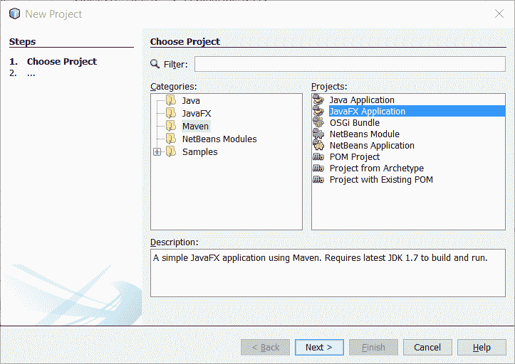
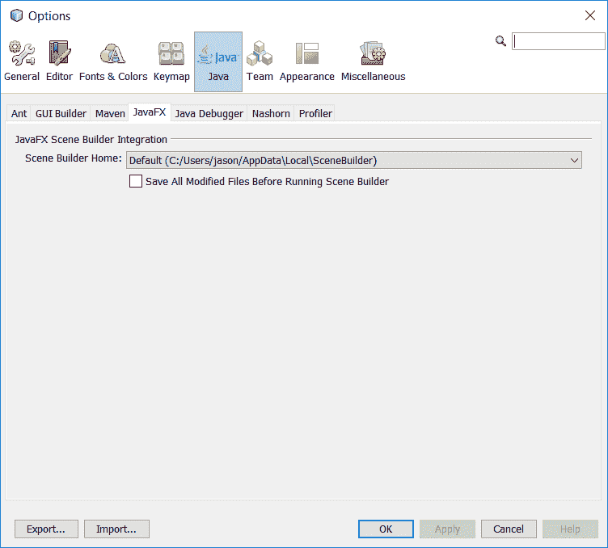
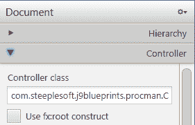

# 第二章：在 Java 中管理进程

通过快速浏览 Java 9 的一些重大新功能以及之前几个版本的功能，让我们将注意力转向以实际方式应用其中一些新的 API。我们将从一个简单的进程管理器开始。

尽管通常最好让应用程序或实用程序在内部处理用户的所有问题，但偶尔您可能需要出于各种原因运行（或**外壳到**）外部程序。从 Java 的最早时期开始，JDK 就通过`Runtime`类提供了各种 API 来支持这一点。以下是最简单的示例：

```java
    Process p = Runtime.getRuntime().exec("/path/to/program"); 

```

一旦进程创建完成，您可以通过`Process`类跟踪其执行，该类具有诸如`getInputStream()`、`getOutputStream()`和`getErrorStream()`等方法。我们还可以通过`destroy()`和`waitFor()`对进程进行基本控制。Java 8 通过添加`destroyForcibly()`和`waitFor(long, TimeUnit)`推动了事情的发展。从 Java 9 开始，这些功能将得到扩展。引用**Java Enhancement Proposal**（**JEP**）中的内容，我们可以看到为此新功能的以下原因：

*许多企业应用程序和容器涉及多个 Java 虚拟机和进程，并且长期以来一直需要以下功能：*

+   *获取当前 Java 虚拟机的 pid（或等效值）以及使用现有 API 创建的进程的 pid 的能力。*

+   *枚举系统上的进程的能力。每个进程的信息可能包括其 pid、名称、状态，以及可能的资源使用情况。*

+   *处理进程树的能力，特别是一些销毁进程树的方法。*

+   *处理数百个子进程的能力，可能是复用输出或错误流以避免为每个子进程创建一个线程。*

在本章中，我们将构建一个简单的进程管理器应用程序，类似于 Windows 任务管理器或*nix 的 top。当然，在 Java 中没有必要编写进程管理器，但这将是我们探索这些新的进程处理 API 的绝佳途径。此外，我们还将花一些时间研究其他语言功能和 API，即 JavaFX 和`Optional`。

本章涵盖以下主题：

+   创建项目

+   引导应用程序

+   定义用户界面

+   初始化用户界面

+   添加菜单

+   更新进程列表

说了这么多，让我们开始吧。

# 创建项目

通常来说，如果可以在不需要特定 IDE 或其他专有工具的情况下重现构建，那将会更好。幸运的是，NetBeans 提供了创建基于 Maven 的 JavaFX 项目的能力。点击文件 | 新建项目，然后选择`Maven`，然后选择 JavaFX 应用程序：



接下来，执行以下步骤：

1.  点击下一步。

1.  将项目名称输入为`ProcessManager`。

1.  将 Group ID 输入为`com.steeplesoft`。

1.  将包输入为`com.steeplesoft.processmanager`。

1.  选择项目位置。

1.  点击完成。

请考虑以下屏幕截图作为示例：


创建新项目后，我们需要更新 Maven 的`pom`以使用 Java 9：

```java
    <build> 
      <plugins> 
        <plugin> 
          <groupId>org.apache.maven.plugins</groupId> 
          <artifactId>maven-compiler-plugin</artifactId> 
          <version>3.6.1</version> 
          <configuration> 
            <source>9</source> 
            <target>9</target> 
          </configuration> 
        </plugin> 
      </plugins> 
    </build> 

```

现在，NetBeans 和 Maven 都配置为使用 Java 9，我们准备开始编码。

# 引导应用程序

如介绍中所述，这将是一个基于 JavaFX 的应用程序，因此我们将从创建应用程序的框架开始。这是一个 Java 9 应用程序，我们打算利用 Java 模块系统。为此，我们需要创建模块定义文件`module-info.java`，该文件位于源代码树的根目录。作为基于 Maven 的项目，这将是`src/main/java`：

```java
    module procman.app { 
      requires javafx.controls; 
      requires javafx.fxml; 
    } 

```

这个小文件做了几件不同的事情。首先，它定义了一个新的`procman.app`模块。接下来，它告诉系统这个模块`requires`两个 JDK 模块：`javafx.controls`和`javafx.fxml`。如果我们没有指定这两个模块，那么我们的系统在编译时将无法通过，因为 JDK 不会将所需的类和包提供给我们的应用程序。这些模块是作为 Java 9 的标准 JDK 的一部分，所以这不应该是一个问题。然而，在未来的 Java 版本中可能会发生变化，这个模块声明将有助于通过强制主机 JVM 提供模块或无法启动来防止我们的应用程序运行时失败。还可以通过**J-Link**工具构建自定义的 Java 运行时，因此在 Java 9 下缺少这些模块仍然是可能的。有了我们的模块配置，让我们转向应用程序。

新兴的标准目录布局似乎是`src/main/java/*<module1>*`，`src/main/java/*<module2>*`等。在撰写本书时，虽然 Maven 可以被迫采用这样的布局，但插件本身虽然可以在 Java 9 下运行，但似乎不够了解模块，无法让我们以这种方式组织我们的代码。因此，出于简单起见，我们将一个 Maven 模块视为一个 Java 模块，并保持项目的标准源布局。

我们将创建的第一个类是`Application`的子类，NetBeans 为我们创建了`Main`类，我们将其重命名为`ProcessManager`：

```java
    public class ProcessManager extends Application { 
      @Override 
      public void start(Stage stage) throws Exception { 
        Parent root = FXMLLoader 
         .load(getClass().getResource("/fxml/procman.fxml")); 

        Scene scene = new Scene(root); 
        scene.getStylesheets().add("/styles/Styles.css"); 

        stage.setTitle("Process Manager"); 
        stage.setScene(scene); 
        stage.show(); 
      } 

      public static void main(String[] args) { 
        launch(args); 
      } 
    } 

```

我们的`ProcessManager`类扩展了 JavaFX 基类`Application`，它提供了各种功能来启动和停止应用程序。我们在`main()`方法中看到，我们只是委托给`Application.launch(String[])`，它为我们在启动新应用程序时做了大部分工作。

这个类的更有趣的部分是`start()`方法，这是 JavaFX 生命周期调用我们的应用程序的地方，让我们有机会构建用户界面，接下来我们将这样做。

# 定义用户界面

在构建 JavaFX 应用程序的用户界面时，可以通过两种方式之一完成：代码或标记。为了使我们的代码更小更可读，我们将使用 FXML 构建用户界面--这是专门为 JavaFX 创建的基于 XML 的语言，用于表达用户界面。这给我们提供了另一个二元选择--我们是手动编写 XML，还是使用图形工具？同样，选择是简单的--我们将使用一个名为**Scene Builder**的工具，这是一个最初由 Oracle 开发，现在由 Gluon 维护和支持的所见即所得的工具。然而，我们也将查看 XML 源码，以便了解正在做什么，所以如果你不喜欢使用 GUI 工具，你也不会被排除在外。

安装和使用 Scene Builder 就像你期望的那样非常简单。它可以从[`gluonhq.com/labs/scene-builder/`](http://gluonhq.com/labs/scene-builder/)下载。安装完成后，您需要告诉 NetBeans 在哪里找到它，这可以在设置窗口中完成，在 Java | JavaFX 下，如下截图所示：



现在我们准备创建 FXML 文件。在项目视图中的`resources`目录下，创建一个名为`fxml`的新文件夹，在该文件夹中创建一个名为`procman.fxml`的文件，如下所示：

```java
    <BorderPane  

      fx:controller="com.steeplesoft.procman.Controller"> 
    </BorderPane> 

```

`BorderPane`是一个容器，定义了五个区域--`top`、`bottom`、`left`、`right`和`center`，让我们对控件在表单上的位置有了相当粗粒度的控制。通常，使用`BorderPane`，每个区域使用嵌套容器来提供通常必要的更细粒度的控制。对于我们的需求，这种控制水平将是完美的。

用户界面的主要关注点是进程列表，因此我们将从那些控件开始。从 Scene Builder 中，我们要点击左侧手风琴上的“控件”部分，然后向下滚动到`TableView`。单击此处并将其拖动到表单的`CENTER`区域，如 Scene Builder 中的此截图所示：


生成的 FXML 应该看起来像这样：

```java
    <center> 
        <TableView fx:id="processList" 
               BorderPane.alignment="CENTER"> 
        </TableView> 
    </center> 

```

在其他区域没有组件的情况下，`TableView`将扩展以填充窗口的整个区域，这是我们目前想要的。

# 初始化用户界面

虽然 FXML 定义了用户界面的结构，但我们确实需要一些 Java 代码来初始化各种元素，响应操作等。这个类，称为控制器，只是一个扩展`javafx.fxml.Initializable`的类：

```java
    public class Controller implements Initializable { 
      @FXML 
      private TableView<ProcessHandle> processList; 
      @Override 
      public void initialize(URL url, ResourceBundle rb) { 
      } 
    } 

```

`initialize()`方法来自接口，并且在调用`FXMLLoader.load()`时由 JavaFX 运行时初始化控制器。请注意`@FXML`注解在实例变量`processList`上。当 JavaFX 初始化控制器时，在调用`initialize()`方法之前，系统会查找指定了`fx:id`属性的 FXML 元素，并将该引用分配给控制器中适当的实例变量。为了完成这种连接，我们必须对我们的 FXML 文件进行一些更改：

```java
    <TableView fx:id="processList" BorderPane.alignment="CENTER">
    ...

```

更改也可以在 Scene Builder 中进行，如下面的截图所示：


fx:id 属性的值必须与已用`@FXML`注释注释的实例变量的名称匹配。当调用`initialize`时，`processList`将具有对我们在 Java 代码中可以操作的`TableView`的有效引用。

fx:id 的值也可以通过 Scene Builder 进行设置。要设置该值，请在表单编辑器中单击控件，然后在右侧手风琴中展开代码部分。在 fx:id 字段中，键入所需变量名称的名称。

拼图的最后一部分是指定 FXML 文件的控制器。在 XML 源中，您可以通过用户界面的根元素上的`fx:controller`属性来设置这一点：

```java
    <BorderPane  xmlns="http://javafx.com/javafx/8.0.60"
      xmlns:fx="http://javafx.com/fxml/1" 
      fx:controller="com.steeplesoft.procman.Controller">

```

这也可以通过 Scene Builder 进行设置。在左侧手风琴上的文档部分，展开控制器部分，并在控制器类字段中输入所需的完全限定类名：



有了这些部分，我们可以开始初始化`TableView`的工作，这让我们回到了我们的主要兴趣，即处理 API 的过程。我们的起点是`ProcessHandles.allProcesses()`。从 Javadoc 中，您可以了解到这个方法返回**当前进程可见的所有进程的快照**。从流中的每个`ProcessHandle`中，我们可以获取有关进程 ID、状态、子进程、父进程等的信息。每个`ProcessHandle`还有一个嵌套对象`Info`，其中包含有关进程的信息的快照。由于并非所有信息都可以在各种支持的平台上使用，并且受当前进程的权限限制，`Info`对象上的属性是`Optional<T>`实例，表示值可能设置或可能未设置。可能值得花点时间快速看一下`Optional<T>`是什么。

Javadoc 将`Optional<T>`描述为**可能包含非空值的容器对象**。受 Scala 和 Haskell 的启发，`Optional<T>`在 Java 8 中引入，允许 API 作者提供更安全的空值接口。在 Java 8 之前，`ProcessHandle.Info`上的方法可能定义如下：

```java
    public String command(); 

```

为了使用 API，开发人员可能会写出类似这样的代码：

```java
    String command = processHandle.info().command(); 
    if (command == null) { 
      command = "<unknown>"; 
    } 

```

如果开发人员未明确检查 null，几乎肯定会在某个时候发生`NullPointerException`。通过使用`Optional<T>`，API 作者向用户发出信号，表明返回值可能为 null，应该小心处理。然后，更新后的代码可能看起来像这样：

```java
    String command = processHandle.info().command() 
     .orElse("<unknown>"); 

```

现在，我们可以用一行简洁的代码来获取值，如果存在的话，或者获取默认值，如果不存在的话。正如我们将在后面看到的，`ProcessHandle.Info` API 广泛使用了这种构造方式。

作为开发人员，`Optional`还为我们提供了一些实例方法，可以帮助澄清处理 null 的代码：

+   `filter(Predicate<? super T> predicate)`: 使用这个方法，我们可以过滤`Optional`的内容。我们可以将`filter()`方法传递一个`Predicate`，而不是使用`if...else`块，并在内联进行测试。`Predicate`是一个接受输入并返回布尔值的`@FunctionalInterface`。例如，JavaFX 的`Dialog`的一些用法可能返回`Optional<ButtonType>`。如果我们只想在用户点击了特定按钮时执行某些操作，比如 OK，我们可以这样过滤`Optional`：

```java
        alert.showAndWait() 
         .filter(b -> b instanceof ButtonType.OK) 

```

+   `map(Function<? super T,? extends U> mapper)`: `map`函数允许我们将`Optional`的内容传递给一个函数，该函数将对其进行一些处理，并返回它。不过，函数的返回值将被包装在一个`Optional`中：

```java
        Optional<String> opts = Optional.of("hello"); 
        Optional<String> upper = opts.map(s ->  
         s.toUpperCase()); 
        Optional<Optional<String>> upper2 =  
         opts.map(s -> Optional.of(s.toUpperCase())); 

```

请注意，在`upper2`中`Optional`的双重包装。如果`Function`返回`Optional`，它将被包装在另一个`Optional`中，给我们带来这种不太理想的双重包装。幸运的是，我们有一个替代方案。

+   `flatMap(Function<? super T,Optional<U>> mapper)`: `flatMap`函数结合了两个函数式思想--映射和扁平化。如果`Function`的结果是一个`Optional`对象，而不是将值进行双重包装，它会被扁平化为一个单一的`Optional`对象。重新审视前面的例子，我们得到这样的结果：

```java
        Optional<String> upper3 = opts.flatMap(s ->      
         Optional.of(s.toUpperCase())); 

```

请注意，与`upper2`不同，`upper3`是一个单一的`Optional`：

+   `get()`: 如果存在值，则返回包装的值。如果没有值，则抛出`NoSuchElementException`错误。

+   `ifPresent(Consumer<? super T> action)`: 如果`Optional`对象包含一个值，则将其传递给`Consumer`。如果没有值存在，则什么也不会发生。

+   `ifPresentOrElse(Consumer<? super T> action, Runnable emptyAction)`: 像`ifPresent()`一样，如果有值存在，它会将值传递给`Consumer`。如果没有值存在，将执行`Runnable emptyAction`。

+   `isPresent()`: 如果`Optional`对象包含一个值，则简单地返回 true。

+   `or(Supplier<Optional<T>> supplier)`: 如果`Optional`对象有一个值，则描述该`Optional`。如果没有值存在，则返回`Supplier`生成的`Optional`对象。

+   `orElse(T other)`: 如果`Optional`对象包含一个值，则返回该值。如果没有值，则返回`other`。

+   `orElseGet(Supplier<? extends T> supplier)`: 这与前面提到的`orElse()`类似，但是如果没有值存在，则返回`Supplier`的结果。

+   `orElseThrow(Supplier<? extends X> exceptionSupplier)`: 如果存在值，则返回该值。如果没有值，则抛出`Supplier`提供的`Exception`。

`Optional`还有一些静态方法，可以方便地创建`Optional`实例，其中一些如下：

+   `empty()`: 这返回一个空的`Optional`对象。

+   `of(T value)`: 这返回一个描述非空值的`Optional`对象。如果该值为 null，则抛出`NullPointerException`。

+   `ofNullable(T value)`: 这返回一个描述该值的`Optional`对象。如果该值为 null，则返回一个空的`Optional`。

通过这个非常简短的介绍，我们可以看到`Optional<T>`的存在是如何影响我们的应用程序的。

然后，我们的第一步是获取要显示的进程列表。流 API 使这变得非常简单：

```java
    ProcessHandle.allProcesses() 
     .collect(Collectors.toList()); 

```

`allProcesses()`方法返回`Stream<ProcessHandle>`，这允许我们对问题应用新的流操作。在这种情况下，我们只想创建一个包含所有`ProcessHandle`实例的`List`，所以我们调用`collect()`，这是一个接受`Collector`的流操作。我们可以选择多种选项，但我们想要一个`List`，所以我们使用`Collectors.toList()`，它将收集流中的每个项目，并在流终止时最终返回一个`List`。注意，`List`的参数化类型将与`Stream`的参数化类型匹配，这种情况下是`ProcessHandle`。

这一行代码让我们得到了系统上每个进程的`List<ProcessHandle>`，当前进程可以看到，但这只让我们完成了一半。`TableView` API 不接受`List<T>`。它只支持`ObservableList<T>`，但这是什么？它的 Javadoc 非常简单地定义了它--*一个允许监听器在发生更改时跟踪更改的列表*。换句话说，当这个列表发生变化时，`TableView`会自动得到通知并重新绘制自己。一旦我们将`TableView`与这个列表关联起来，我们只需要担心数据，控件会处理其余的事情。创建`ObservableList`非常简单：

```java
    @FXML 
    private TableView<ProcessHandle> processView; 
    final private ObservableList<ProcessHandle> processList =  
      FXCollections.observableArrayList(); 
    // ... 
    processView.setItems(processList);      
    processList.setAll(ProcessHandle.allProcesses() 
     .collect(Collectors.toList())); 

```

在我们的情况下，`TableView`实例是由运行时注入的（这里包括是为了清晰起见），我们通过`FXCollections.observableArrayList()`创建`ObservableList`。在`initialize()`中，我们通过`setItems()`在`TableView`上设置`ObservableList`，然后通过`setAll()`填充`ObservableList`。有了这个，我们的`TableView`就有了渲染自己所需的所有数据。几乎。它有**数据**来渲染，但**如何**渲染呢？`ProcessHandle.Info`的每个字段放在哪里？为了回答这个问题，我们必须在表上定义列，并告诉每一列从哪里获取它的数据。

为了做到这一点，我们需要创建几个`TableColumn<S,T>`实例。`TableColumn`不仅负责显示其列标题（如果适用），还负责每个单元格的值。然而，你必须告诉它**如何**显示单元格。这是通过一个单元格值工厂来完成的。在 Java 7 下，该 API 会让我们得到这样的代码：

```java
    TableColumn<ProcessHandle, String> commandCol =  
     new TableColumn<>("Command"); 
    commandCol.setCellValueFactory(new  
      Callback<TableColumn.CellDataFeatures<ProcessHandle, String>,  
       ObservableValue<String>>() { 
         public ObservableValue<String> call( 
          TableColumn.CellDataFeatures<ProcessHandle,  
           String> p) { 
             return new SimpleObjectProperty(p.getValue()
              .info() 
              .command() 
              .map(Controller::afterLast) 
              .orElse("<unknown>")); 
           } 
       }
    ); 

```

我会提前说出来：这真的很丑。幸运的是，我们可以利用 lambda 和类型推断来让它更加愉快地阅读：

```java
    TableColumn<ProcessHandle, String> commandCol =  
     new TableColumn<>("Command"); 
    commandCol.setCellValueFactory(data ->  
     new SimpleObjectProperty(data.getValue().info().command() 
      .map(Controller::afterLast) 
      .orElse("<unknown>"))); 

```

这是六行代码取代了十四行。漂亮多了。现在，我们只需要再做五次，每次为一个列。尽管前面的代码可能已经改进了，但仍然有相当多的重复代码。同样，Java 8 的函数接口可以帮助我们进一步清理代码。对于每一列，我们想要指定标题、宽度以及从`ProcessHandle.Info`中提取什么。我们可以用这个方法来封装：

```java
    private <T> TableColumn<ProcessHandle, T>  
      createTableColumn(String header, int width,  
       Function<ProcessHandle, T> function) { 
         TableColumn<ProcessHandle, T> column = 
          new TableColumn<>(header); 

         column.setMinWidth(width); 
         column.setCellValueFactory(data ->  
          new SimpleObjectProperty<T>( 
           function.apply(data.getValue()))); 
           return column; 
    } 

```

`Function<T,R>`接口是`FunctionalInterface`，它表示一个接受一个类型`T`并返回另一个类型`R`的函数。在我们的情况下，我们正在定义这个方法，它以一个`String`、一个`int`和一个接受`ProcessHandle`并返回一个通用类型的函数作为参数。这可能很难想象，但有了这个方法的定义，我们可以用对这个方法的调用来替换前面的代码和类似的代码。同样的前面的代码现在可以被压缩为这样：

```java
    createTableColumn("Command", 250,  
      p -> p.info().command() 
      .map(Controller::afterLast) 
      .orElse("<unknown>")) 

```

现在我们只需要将这些列添加到控件中，可以用这个方法来实现：

```java
    processView.getColumns().setAll( 
      createTableColumn("Command", 250,  
      p -> p.info().command() 
       .map(Controller::afterLast) 
       .orElse("<unknown>")), 
      createTableColumn("PID", 75, p -> p.getPid()), 
      createTableColumn("Status", 150,  
       p -> p.isAlive() ? "Running" : "Not Running"), 
      createTableColumn("Owner", 150,  
       p -> p.info().user() 
        .map(Controller::afterLast) 
        .orElse("<unknown>")), 
      createTableColumn("Arguments", 75,  
       p -> p.info().arguments().stream() 
        .map(i -> i.toString()) 
        .collect(Collectors.joining(", ")))); 

```

请注意，我们在`ProcessHandle.Info`上使用的每种方法都返回了我们在前面的代码中看到的`Optional<T>`。由于它这样做，我们有一个非常好的和干净的 API 来获取我们想要的信息（或者一个合理的默认值），而不会在生产中出现`NullPointerException`的问题。

如果我们现在运行应用程序，应该会得到类似这样的东西：


到目前为止看起来不错，但还不够完善。我们希望能够启动新进程以及终止现有进程。这两者都需要菜单，所以我们接下来会添加这些。

# 添加菜单

JavaFX 中的菜单从一个名为`MenuBar`的组件开始。当然，我们希望这个菜单位于窗口的顶部，因此我们将该组件添加到`BorderPane`的`top`部分。如果您使用 Scene Builder，您的 FXML 文件中将会出现类似于以下内容：

```java
    <MenuBar BorderPane.alignment="CENTER"> 
      <menus> 
        <Menu mnemonicParsing="false" text="File"> 
          <items> 
            <MenuItem mnemonicParsing="false" text="Close" /> 
          </items> 
        </Menu> 
        <Menu mnemonicParsing="false" text="Edit"> 
          <items> 
            <MenuItem mnemonicParsing="false" text="Delete" /> 
          </items> 
        </Menu> 
        <Menu mnemonicParsing="false" text="Help"> 
          <items> 
            <MenuItem mnemonicParsing="false" text="About" /> 
          </items> 
        </Menu> 
      </menus> 
    </MenuBar> 

```

我们不需要编辑菜单，因此可以从 FXML 文件中删除该部分（或者通过右键单击 Scene Builder 中的第二个`Menu`条目，然后单击删除）。要创建我们想要的菜单项，我们将适当的`MenuItem`条目添加到`File`元素下的`item`元素中：

```java
    <Menu mnemonicParsing="true" text="_File"> 
      <items> 
        <MenuItem mnemonicParsing="true"  
          onAction="#runProcessHandler"  
          text="_New Process..." /> 
        <MenuItem mnemonicParsing="true"  
          onAction="#killProcessHandler"  
          text="_Kill Process..." /> 
        <MenuItem mnemonicParsing="true"  
          onAction="#closeApplication"  
          text="_Close" /> 
      </items> 
    </Menu> 

```

每个`MenuItem`条目都有三个属性定义：

+   `mnemonicParsing`：这指示 JavaFX 使用带有下划线前缀的任何字母作为键盘快捷键

+   `onAction`：这标识了在激活/单击`MenuItem`时将调用控制器上的方法

+   `text`：这定义了`MenuItem`的标签

最有趣的部分是`onAction`及其与控制器的关系。当然，JavaFX 已经知道这个表单由`com.steeplesoft.procman.Controller`支持，因此它将寻找具有以下签名的方法：

```java
    @FXML 
    public void methodName(ActionEvent event) 

```

`ActionEvent`是 JavaFX 在许多情况下使用的一个类。在我们的情况下，我们为每个菜单项专门有方法，因此事件本身并不是太有趣。让我们看看每个处理程序，从最简单的`closeApplication`开始：

```java
    @FXML 
    public void closeApplication(ActionEvent event) { 
      Platform.exit(); 
    } 

```

这里没有什么可看的；当单击菜单项时，我们通过调用`Platform.exit()`退出应用程序。

接下来，让我们看看如何终止一个进程：

```java
    @FXML 
    public void killProcessHandler(final ActionEvent event) { 
      new Alert(Alert.AlertType.CONFIRMATION,  
      "Are you sure you want to kill this process?",  
      ButtonType.YES, ButtonType.NO) 
       .showAndWait() 
       .filter(button -> button == ButtonType.YES) 
       .ifPresent(response -> { 
         ProcessHandle selectedItem =  
          processView.getSelectionModel() 
           .getSelectedItem(); 
         if (selectedItem != null) { 
           selectedItem.destroy(); 
           processListUpdater.updateList(); 
         } 
       }); 
    } 

```

我们这里有很多事情要做。我们首先要做的是创建一个`CONFIRMATION`类型的`Alert`对话框，询问用户确认请求。对话框有两个按钮：`YES`和`NO`。一旦对话框被创建，我们调用`showAndWait()`，它会显示对话框并等待用户的响应。它返回`Optional<ButtonType>`，其中包含用户点击的按钮的类型，可能是`ButtonType.YES`或`ButtonType.NO`，根据我们创建的`Alert`对话框的类型。有了`Optional`，我们可以应用`filter()`来找到我们感兴趣的按钮类型，即`ButtonType.YES`，其结果是另一个`Optional`。如果用户点击了 yes，`ifPresent()`将返回 true（感谢我们的过滤器），并且我们传递的 lambda 将被执行。非常好而简洁。

接下来感兴趣的是 lambda。一旦我们确定用户想要终止一个进程，我们需要确定**哪个**进程要终止。为此，我们通过`TableView.getSelectionModel().getSelectedItem()`询问`TableView`选择了哪一行。我们确实需要检查是否为 null（遗憾的是，这里没有`Optional`），以防用户实际上没有选择行。如果它不是 null，我们可以在`TableView`给我们的`ProcessHandle`上调用`destroy()`。然后我们调用`processListUpdater.updateList()`来刷新 UI。稍后我们会看看这个。

我们的最终操作处理程序必须运行以下命令：

```java
    @FXML 
    public void runProcessHandler(final ActionEvent event) { 
      final TextInputDialog inputDlg = new TextInputDialog(); 
      inputDlg.setTitle("Run command..."); 
      inputDlg.setContentText("Command Line:"); 
      inputDlg.setHeaderText(null); 
      inputDlg.showAndWait().ifPresent(c -> { 
        try { 
          new ProcessBuilder(c).start(); 
        } catch (IOException e) { 
            new Alert(Alert.AlertType.ERROR,  
              "There was an error running your command.") 
              .show(); 
          } 
      }); 
    } 

```

在许多方面，这与前面的`killProcessHandler()`方法类似——我们创建一个对话框，设置一些选项，调用`showAndWait()`，然后处理`Optional`。不幸的是，对话框不支持构建器模式，这意味着我们没有一个很好的流畅 API 来构建对话框，所以我们要分几个离散的步骤来做。处理`Optional`也类似。我们调用`ifPresent()`来查看对话框是否返回了命令行（也就是用户输入了一些文本**并**按下了 OK），并在存在的情况下将其传递给 lambda。

让我们快速看一下 lambda。这是多行 lambda 的另一个示例。到目前为止，我们看到的大多数 lambda 都是简单的一行函数，但请记住，lambda**可以**跨越多行。要支持这一点，需要做的就是像我们所做的那样将块包装在花括号中，然后一切照旧。对于这样的多行 lambda，必须小心，因为 lambda 给我们带来的可读性和简洁性的任何收益都可能很快被一个过大的 lambda 体所掩盖或抹去。在这些情况下，将代码提取到一个方法中并使用方法引用可能是明智的做法。最终，决定权在你手中，但请记住鲍勃·马丁叔叔的话--*清晰是王道*。

关于菜单的最后一项。为了更加实用，应用程序应该提供一个上下文菜单，允许用户右键单击一个进程并从那里结束它，而不是点击行，将鼠标移动到“文件”菜单等。添加上下文菜单是一个简单的操作。我们只需要修改我们在 FXML 中的`TableView`定义如下：

```java
    <TableView fx:id="processView" BorderPane.alignment="CENTER"> 
      <contextMenu> 
        <ContextMenu> 
          <items> 
            <MenuItem onAction="#killProcessHandler"  
               text="Kill Process..."/> 
          </items> 
        </ContextMenu> 
      </contextMenu> 
    </TableView> 

```

在这里，我们在`TableView`中添加了一个`contextMenu`子项。就像它的兄弟`MenuBar`一样，`contextMenu`有一个`items`子项，它又有 0 个或多个`MenuItem`子项。在这种情况下，`Kill Process...`的`MenuItem`看起来与`File`下的那个非常相似，唯一的区别是`mnemonicProcessing`信息。我们甚至重用了`ActionEvent`处理程序，因此没有额外的编码，无论您点击哪个菜单项，结束进程的行为始终相同。

# 更新进程列表

如果应用程序启动并显示了一个进程列表，但从未更新过该列表，那将毫无用处。我们需要的是定期更新列表的方法，为此，我们将使用一个`Thread`。

您可能知道，也可能不知道，`Thread`大致是在后台运行任务的一种方式（Javadoc 将其描述为程序中的*执行线程*）。系统可以是单线程或多线程的，这取决于系统的需求和运行时环境。多线程编程很难做到。幸运的是，我们这里的用例相当简单，但我们仍然必须小心，否则我们将看到一些非常意外的行为。

通常，在创建`Thread`时，您会得到的建议是实现一个`Runnable`接口，然后将其传递给线程的构造函数，这是非常好的建议，因为它使您的类层次结构更加灵活，因为您不会受到具体基类的约束（`Runnable`是一个`interface`）。然而，在我们的情况下，我们有一个相对简单的系统，从这种方法中获益不多，所以我们将直接扩展`Thread`并简化我们的代码，同时封装我们想要的行为。让我们来看看我们的新类：

```java
    private class ProcessListUpdater extends Thread { 
      private volatile boolean running = true; 

      public ProcessListRunnable() { 
        super(); 
        setDaemon(true); 
      } 

      public void shutdown() { 
        running = false; 
      } 

      @Override 
      public void run() { 
        while (running) { 
          updateList(); 
          try { 
            Thread.sleep(5000); 
          } catch (InterruptedException e) { 
              // Ignored 
            } 
        } 
      }  

      public synchronized void updateList() { 
        processList.setAll(ProcessHandle.allProcesses() 
          .collect(Collectors.toList())); 
        processView.sort(); 
      } 
    } 

```

我们有一个非常基本的类，我们给了它一个合理而有意义的名称，它扩展了`Thread`。在构造函数中，请注意我们调用了`setDaemon(true)`。这将允许我们的应用程序按预期退出，而不会阻塞，等待线程终止。我们还定义了一个`shutdown()`方法，我们将从我们的应用程序中使用它来停止线程。

`Thread`类确实有各种状态控制方法，如`stop()`、`suspend()`、`resume()`等，但这些方法都已被弃用，因为它们被认为是不安全的。搜索文章，为什么`Thread.stop`、`Thread.suspend`和`Thread.resume`被弃用？如果您想要更多细节；然而，现在建议的最佳做法是使用一个控制标志，就像我们用`running`做的那样，向`Thread`类发出信号，表明它需要清理并关闭。

最后，我们有我们的`Thread`类的核心，`run()`，它会无限循环（或直到`running`变为 false），在执行完工作后休眠五秒。实际工作是在`updateList()`中完成的，它构建了进程列表，更新了我们之前讨论过的`ObservableList`，然后指示`TableView`根据用户的排序选择重新排序自己，如果有的话。这是一个公共方法，允许我们在需要时调用它，就像我们在`killProcessHandler()`中所做的那样。这留下了以下的代码块来设置它：

```java
    @Override 
    public void initialize(URL url, ResourceBundle rb) { 
      processListUpdater = new ProcessListUpdater(); 
      processListUpdater.start(); 
      // ... 
    } 

```

以下代码将关闭它，我们已经在`closeHandler()`中看到了：

```java
    processListUpdater.shutdown(); 

```

敏锐的人会注意到`updateList()`上有`synchronized`关键字。这是为了防止由于从多个线程调用此方法而可能引起的任何竞争条件。想象一下，用户决定终止一个进程并在线程在恢复时点击确认对话框的确切时刻（这种情况比你想象的要常见）。我们可能会有两个线程同时调用`updateList()`，导致第一个线程在第二个线程调用`processList.setAll()`时刚好调用`processView.sort()`。当在另一个线程重建列表时调用`sort()`会发生什么？很难说，但可能是灾难性的，所以我们要禁止这种情况。`synchronized`关键字指示 JVM 一次只允许一个线程执行该方法，导致其他线程排队等待（请注意，它们的执行顺序是不确定的，所以你不能根据线程运行`synchronized`方法的顺序来做任何期望）。这避免了竞争条件的可能性，并确保我们的程序不会崩溃。

虽然在这里是合适的，但在使用`synchronized`方法时必须小心，因为获取和释放锁可能是昂贵的（尽管在现代 JVM 中要少得多），更重要的是，它强制线程在调用这个方法时按顺序运行，这可能会导致应用程序出现非常不希望的延迟，特别是在 GUI 应用程序中。在编写自己的多线程应用程序时要记住这一点。

# 摘要

有了这个，我们的应用程序就完成了。虽然不是一个非常复杂的应用程序，但它包括了一些有趣的技术，比如 JavaFX、Lambda、Streams、`ProcessHandle`以及相关的类和线程。

在下一章中，我们将构建一个简单的命令行实用程序来查找重复文件。通过这样做，我们将亲身体验新的文件 I/O API、Java 持久化 API（JPA）、文件哈希和一些更多的 JavaFX。
