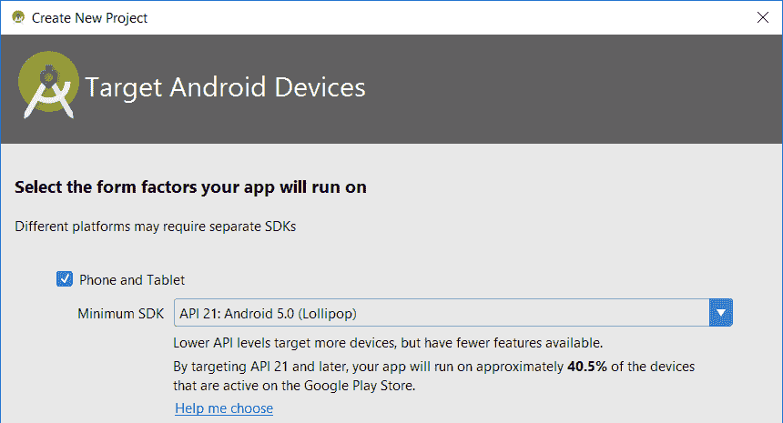
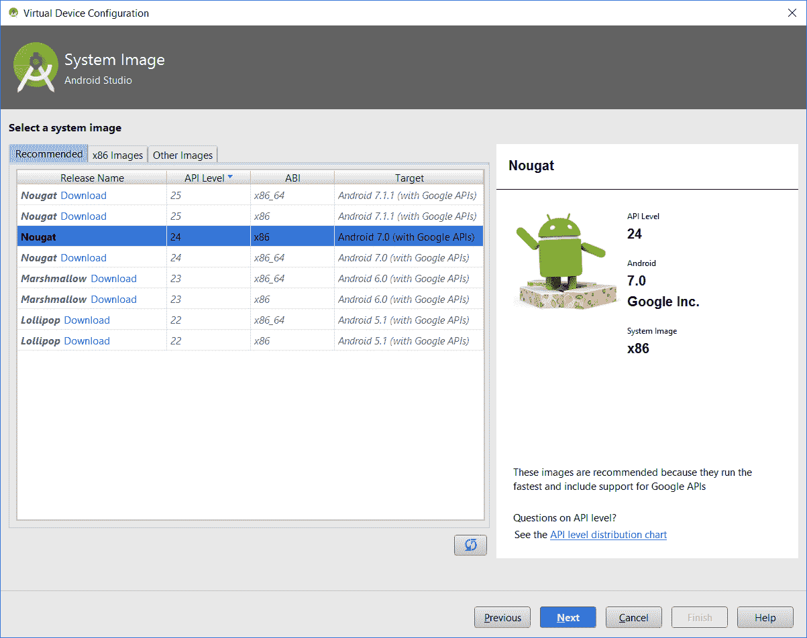
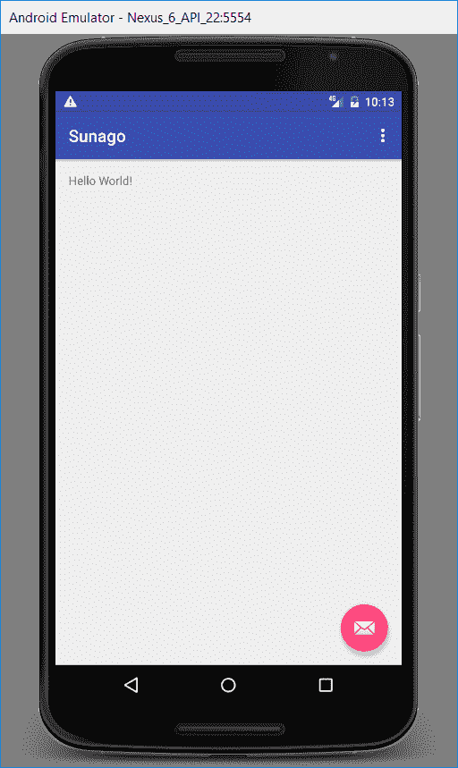

# 第六章：Sunago - 一个 Android 端口

在上一章中，我们构建了 Sunago，一个社交媒体聚合应用程序。在那一章中，我们了解到 Sunago 是一个基于 JavaFX 的应用程序，可以从各种社交媒体网络中获取帖子、推文、照片等，并在一个地方显示它们。该应用程序提供了许多有趣的架构和技术示例，但应用程序本身可能更实用--我们倾向于从手机和平板电脑等移动设备与社交网络互动，因此移动版本将更有用。因此，在本章中，我们将编写一个 Android 端口，尽可能重用尽可能多的代码。

Android 应用程序，虽然是用 Java 构建的，但看起来与桌面应用程序有很大不同。虽然我们无法涵盖 Android 开发的每个方面，但在本章中，我们将涵盖足够的内容来让您入门，包括以下内容：

+   设置 Android 开发环境

+   Gradle 构建

+   Android 视图

+   Android 状态管理

+   Android 服务

+   应用程序打包和部署

与其他章节一样，将有太多的小项目需要指出，但我们将尽力突出介绍新的项目。

# 入门

第一步是设置 Android 开发环境。与*常规*Java 开发一样，IDE 并不是绝对必要的，但它确实有帮助，所以我们将安装 Android Studio，这是一个基于 IntelliJ IDEA 的 IDE。如果您已经安装了 IDEA，您只需安装 Android 插件，就可以拥有所需的一切。不过，在这里，我们假设您两者都没有安装。

1.  要下载 Android Studio，前往[`developer.android.com/studio/index.html`](https://developer.android.com/studio/index.html)，并下载适合您操作系统的软件包。当您第一次启动 Android Studio 时，您应该看到以下屏幕：


1.  在我们开始一个新项目之前，让我们配置可用的 Android SDK。点击右下角的 Configure 菜单，然后点击 SDK Manager，以获取以下屏幕：


您选择的 SDK 将根据您的需求而变化。您可能需要支持旧设备，比如 Android 5.0，或者您可能只想支持最新的 Android 7.0 或 7.1.1。

1.  一旦你知道需要什么，选择适当的 SDK（或者像我在前面的屏幕截图中所做的那样，选择从 5.0 版本开始的所有内容），然后点击确定。在继续之前，您需要阅读并接受许可证。

1.  安装完成后，Android Studio 将开始下载所选的 SDK 和任何依赖项。这个过程可能需要一段时间，所以请耐心等待。

1.  当 SDK 安装完成时，点击完成按钮，这将带您到欢迎屏幕。点击开始一个新的 Android Studio 项目，以获取以下屏幕：


1.  这里没有什么激动人心的--我们需要指定应用程序名称，公司域和应用程序的项目位置：



1.  接下来，我们需要指定应用程序的形态因素。我们的选项是手机和平板电脑，佩戴，电视，Android Auto 和眼镜。如前面的屏幕截图所示，我们对这个应用程序感兴趣的是手机和平板电脑。

1.  在下一个窗口中，我们需要为应用程序的主`Activity`选择一个类型。在 Android 应用程序中，我们可能称之为“屏幕”（或者如果您来自 Web 应用程序背景，可能是“页面”）的东西被称为`Activity`。不过，并非每个`Activity`都是一个屏幕。

从 Android 开发者文档([`developer.android.com/reference/android/app/Activity.html`](https://developer.android.com/reference/android/app/Activity.html))中，我们了解到以下内容：

[a]活动是用户可以执行的单一、专注的事情。几乎所有的活动都与用户进行交互，因此活动类会为您创建一个窗口...

对于我们的目的，可能可以将两者等同起来，但要松散地这样做，并始终牢记这一警告。向导为我们提供了许多选项，如在此截图中所示：


1.  正如您所看到的，有几个选项：基本、空白、全屏、Google AdMobs 广告、Google 地图、登录等。选择哪个取决于应用程序的要求。就用户界面而言，我们的最低要求是告诉用户应用程序的名称，显示社交媒体项目列表，并提供一个菜单来更改应用程序设置。因此，从上面的列表中，基本活动是最接近的匹配，因此我们选择它，然后点击下一步：


1.  前面屏幕中的默认值大多是可以接受的（请注意，活动名称已更改），但在点击完成之前，还有一些最后的话。构建任何规模的 Android 应用程序时，您将拥有许多布局、菜单、活动等。我发现将这些工件命名为您在此处看到的名称很有帮助--活动的布局命名为`activity_`加上活动名称；菜单为活动名称加上`menu_`，或者对于共享菜单，是其内容的有意义的摘要。每种工件类型都以其类型为前缀。这种一般模式将帮助您在文件数量增加时快速导航到源文件，因为这些文件的排列非常扁平和浅。

1.  最后，请注意使用片段复选框。*片段是应用程序用户界面或行为的一部分，可以放置在活动中*。实际上，这是您作为开发人员将用户界面定义分解为多个片段（或片段，因此名称）的一种方式，这些片段可以根据应用程序当前上下文以不同的方式组合成一个整体在活动中。例如，基于片段的用户界面可能在手机上有两个屏幕用于某些操作，但在平板上可能将这些组合成一个活动。当然，情况比这更复杂，但我包含了这个简短而不完整的描述，只是为了解释复选框。我们不会在我们的应用程序中使用片段，因此我们将其取消选中，然后点击完成。

处理一段时间后，Android Studio 现在为我们创建了一个基本应用程序。在开始编写应用程序之前，让我们运行它，看看该过程是什么样子。我们可以以几种方式运行应用程序--我们可以单击“运行”|“运行‘app’”；单击工具栏中间的绿色播放按钮；或按下*Shift* + *F10*。所有这三种方法都会弹出相同的选择部署目标窗口，如下所示：


由于我们刚刚安装了 Android Studio，我们还没有创建任何模拟器，因此现在需要这样做。要创建模拟器，请按照以下步骤操作：

1.  单击“创建新虚拟设备”按钮后，会出现以下屏幕：


1.  让我们从一个相当现代的 Android 手机开始--选择 Nexus 6 配置文件，然后点击下一步：



在前面的屏幕中，您的选项将根据您安装了哪些 SDK 而有所不同。再次选择哪个 SDK 取决于您的目标受众、应用程序需求等等。尽管始终使用最新和最好的东西很愉快，但我们并不严格需要来自 Nougat 的任何 API。选择 Android 7.x 将限制 Sunago 仅适用于新手机上，并且没有充分的理由这样做。因此，我们将以 Lollipop（Android 5.0）为目标，这在支持尽可能多的用户和提供对新 Android 功能的访问之间取得了良好的平衡。

1.  如果需要 x86_64 ABI，请单击下载链接，选择该版本，然后在“验证配置”屏幕上单击“完成”。

1.  创建了一个模拟器后，我们现在可以在“选择部署目标”屏幕中选择它，并通过单击“确定”来运行应用程序。如果您想要在下次运行应用程序时跳过选择屏幕，可以在单击“确定”之前选中“将来启动使用相同的选择”复选框。

第一次运行应用程序时，由于应用程序正在构建和打包，模拟器正在启动，所以会花费更长的时间。几分钟后，您应该会看到以下屏幕：



这没什么特别的，但它表明一切都按预期运行。现在，我们准备开始在移植 Sunago 中进行真正的工作。

# 构建用户界面

简而言之，Android 用户界面是基于 Activities 的，它使用布局文件来描述用户界面的结构。当然，还有更多内容，但这个简单的定义对我们在 Sunago 上的工作应该足够了。那么，让我们开始看看我们的`Activity`，`MainActivity`，如下所示：

```java
    public class MainActivity extends AppCompatActivity { 
      @Override 
      protected void onCreate(Bundle savedInstanceState) { 
        super.onCreate(savedInstanceState); 
        setContentView(R.layout.activity_main); 
        Toolbar toolbar = (Toolbar) findViewById(R.id.toolbar); 
        setSupportActionBar(toolbar); 

        FloatingActionButton fab =
            (FloatingActionButton) findViewById(R.id.fab); 
        fab.setOnClickListener(new View.OnClickListener() { 
            @Override 
            public void onClick(View view) { 
                Snackbar.make(view,
                        "Replace with your own action",
                        Snackbar.LENGTH_LONG) 
                    .setAction("Action", null).show(); 
            } 
        }); 
      } 

     @Override 
     public boolean onCreateOptionsMenu(Menu menu) { 
        getMenuInflater().inflate(R.menu.menu_main, menu); 
        return true; 
     } 

     @Override 
     public boolean onOptionsItemSelected(MenuItem item) { 
        int id = item.getItemId(); 

        if (id == R.id.action_settings) { 
            return true; 
        } 

        return super.onOptionsItemSelected(item); 
      } 
    } 

```

最后一部分代码是由 Android Studio 生成的类。它非常基础，但它具有大部分创建`Activity`所需的内容。请注意，该类扩展了`AppCompatActivity`。尽管 Google 一直在积极推动 Android 平台，但他们也不遗余力地确保旧设备不会被抛弃得比必要的更早。为了实现这一点，Google 已经在“compat”（或兼容性）包中将许多新功能进行了后向兼容，这意味着许多新的 API 实际上可以在旧版本的 Android 上运行。然而，由于它们在单独的包中，所以不会破坏任何现有的功能——它们必须明确选择，这就是我们在这里要做的。虽然我们不打算支持旧版本的 Android，比如 KitKat，但建议您的`Activity`类扩展兼容性类，就像这个类一样，因为这些类内置了大量功能，否则我们将不得不自己实现。让我们逐步了解这个类，以便在接下来的步骤中了解正在进行的所有工作：

1.  第一个方法是`onCreate()`，这是一个`Activity`生命周期方法（我们稍后会详细讨论 Activity 生命周期）。当系统创建`Activity`类时，将调用此方法。在这里，我们初始化用户界面，设置值，将控件连接到数据源等。请注意，该方法需要一个**Bundle**。这是 Android 传递 Activity 状态的方式，以便可以恢复它。

在`setContentView(R.layout.activity_main)`方法中，我们告诉系统我们要为这个`Activity`使用哪个布局。一旦我们为`Activity`设置了内容`View`，我们就可以开始获取对各种元素的引用。请注意，我们首先寻找视图中定义的`Toolbar`，`findViewById(R.id.toolbar)`，然后我们告诉 Android 使用它作为我们的操作栏，通过`setSupportActionBar()`。这是一个通过`compat`类为我们实现的功能的例子。如果我们直接扩展了，比如说，`Activity`，我们将需要做更多的工作来使操作栏工作。现在，我们只需调用一个 setter，就完成了。

1.  接下来，我们查找另一个用户界面元素，即`FloatingActionButton`。在前面的屏幕截图中，这是右下角带有电子邮件图标的按钮。实际上，我们将删除它，但是由于 Android Studio 生成了它，所以在删除之前我们可以从中学到一些东西。一旦我们有了对它的引用，我们就可以附加监听器。在这种情况下，我们通过创建一个类型为`View.OnClickListener`的匿名内部类来添加一个`onClick`监听器。这样做是有效的，但是在过去的五章中，我们一直在摆脱这些。

1.  Android 构建系统现在原生支持使用 Java 8，因此我们可以修改`onClick`监听器注册，使其看起来像这样：

```java
    fab.setOnClickListener(view -> Snackbar.make(view,
        "Replace with your own action",
            Snackbar.LENGTH_LONG) 
        .setAction("Action", null).show()); 

```

当用户点击按钮时，Snackbar 会出现。根据谷歌的文档，*Snackbar 通过屏幕底部的消息提供有关操作的简短反馈*。这正是我们得到的 - 一条消息告诉我们用自己的操作替换`onClick`的结果。不过，正如前面所述，我们不需要浮动按钮，所以我们将删除这个方法，以及稍后从布局中删除视图定义。

1.  类中的下一个方法是`onCreateOptionsMenu()`。当选项菜单首次打开以填充项目列表时，将调用此方法。我们使用`MenuInflater`来填充菜单定义文件，并将其添加到系统传入的`Menu`中。这个方法只会被调用一次，所以如果你需要一个会变化的菜单，你应该重写`onPrepareOptionsMenu(Menu)`。

1.  最后一个方法`onOptionsItemSelected()`在用户点击选项菜单项时被调用。传入了特定的`MenuItem`。我们获取它的 ID，并调用适用于菜单项的方法。

这是一个基本的`Activity`，但是布局是什么样的呢？这是`activity_main.xml`的内容：

```java
    <?xml version="1.0" encoding="utf-8"?> 
     <android.support.design.widget.CoordinatorLayout  

      android:layout_width="match_parent" 
      android:layout_height="match_parent" 
      android:fitsSystemWindows="true" 
      tools:context="com.steeplesoft.sunago.MainActivity"> 

      <android.support.design.widget.AppBarLayout 
        android:layout_width="match_parent" 
        android:layout_height="wrap_content" 
        android:theme="@style/AppTheme.AppBarOverlay"> 

       <android.support.v7.widget.Toolbar 
            android:id="@+id/toolbar" 
            android:layout_width="match_parent" 
            android:layout_height="?attr/actionBarSize" 
            android:background="?attr/colorPrimary" 
            app:popupTheme="@style/AppTheme.PopupOverlay" /> 

      </android.support.design.widget.AppBarLayout> 

      <include layout="@layout/content_main" /> 

     <android.support.design.widget.FloatingActionButton 
        android:id="@+id/fab" 
        android:layout_width="wrap_content" 
        android:layout_height="wrap_content" 
        android:layout_gravity="bottom|end" 
        android:layout_margin="@dimen/fab_margin" 
        app:srcCompat="@android:drawable/ic_dialog_email" /> 

     </android.support.design.widget.CoordinatorLayout> 

```

这是相当多的 XML，所以让我们快速浏览一下主要的兴趣点，如下所示：

1.  根元素是`CoordinatorLayout`。它的 Java 文档将其描述为一个超级强大的`FrameLayout`。其预期目的之一是作为*顶级应用程序装饰或 Chrome 布局*，这正是我们在这里使用它的目的。诸如`CoordinatorLayout`之类的布局大致相当于 JavaFX 的容器。不同的布局（或`ViewGroup`）提供了各种功能，例如使用精确的 X/Y 坐标布置元素（`AbsoluteLayout`），在网格中布置元素（`GridLayout`），相对于彼此布置元素（`RelativeLayout`），等等。

1.  除了提供我们的顶级容器之外，该元素还定义了一些必需的 XML 命名空间。它还为控件设置了高度和宽度。该字段有三个可能的值 - `match_parent`（在 SDK 的早期版本中，这被称为`fill_parent`，如果你遇到过的话），这意味着控件应该与其父级的值匹配，`wrap_content`，这意味着控件应该足够大以容纳其内容；或者是一个确切的数字。

1.  接下来的元素是`AppBarLayout`，它是一个实现了一些材料设计应用栏概念的`ViewGroup`。**材料设计**是谷歌正在开发和支持的最新**视觉语言**。它为 Android 应用程序提供了现代、一致的外观和感觉。谷歌鼓励使用它，并且幸运的是，新的`Activity`向导已经设置好了让我们直接使用它。布局的宽度设置为`match_parent`，以便填满屏幕，宽度设置为`wrap_content`，以便刚好足够显示其内容，即一个`Toolbar`。

1.  暂时跳过`include`元素，视图中的最后一个元素是`FloatingActionButton`。我们唯一感兴趣的是注意到这个小部件的存在，以防其他项目中需要它。不过，就像我们在`Activity`类中所做的那样，我们需要移除这个小部件。

1.  最后，还有`include`元素。这做的就是你认为它应该做的--指定的文件被包含在布局定义中，就好像它的内容被硬编码到文件中一样。这允许我们保持布局文件的小巧，重用用户界面元素定义（对于复杂的情况尤其有帮助），等等。

包含的文件`content_main.xml`看起来是这样的：

```java
        <RelativeLayout

          android:id="@+id/content_main" 
          android:layout_width="match_parent" 
          android:layout_height="match_parent" 
          android:paddingBottom="@dimen/activity_vertical_margin" 
          android:paddingLeft="@dimen/activity_horizontal_margin" 
          android:paddingRight="@dimen/activity_horizontal_margin" 
          android:paddingTop="@dimen/activity_vertical_margin" 
          app:layout_behavior="@string/appbar_scrolling_view_behavior" 
          tools:context="com.steeplesoft.sunago.MainActivity" 
          tools:showIn="@layout/activity_main"> 

         <TextView 
            android:layout_width="wrap_content" 
            android:layout_height="wrap_content" 
            android:text="Hello World!" /> 
        </RelativeLayout> 

```

这个前面的视图使用`RelativeLayout`来包裹它唯一的子元素，一个`TextView`。请注意，我们可以设置控件的填充。这控制了控件周围*内部*空间有多大。想象一下，就像包装一个盒子--在盒子里，你可能有一个易碎的陶瓷古董，所以你填充盒子来保护它。你也可以设置控件的边距，这是控件*外部*的空间，类似于我们经常喜欢的个人空间。

不过`TextView`并不有用，所以我们将其移除，并添加我们真正需要的，即`ListView`，如下所示：

```java
    <ListView 
      android:id="@+id/listView" 
      android:layout_width="match_parent" 
      android:layout_height="match_parent" 
      android:layout_alignParentTop="true" 
      android:layout_alignParentStart="true"/> 

```

`ListView`是一个在垂直滚动列表中显示项目的控件。在用户体验方面，这基本上与我们在 JavaFX 中看到的`ListView`工作方式相似。不过，它的工作方式是完全不同的。为了了解它是如何工作的，我们需要对活动的`onCreate()`方法进行一些调整，如下所示：

```java
    protected void onCreate(Bundle savedInstanceState) { 
       super.onCreate(savedInstanceState); 
       setContentView(R.layout.activity_main); 

      if (!isNetworkAvailable()) { 
         showErrorDialog( 
            "A valid internet connection can't be established"); 
      } else { 
        Toolbar toolbar = (Toolbar) findViewById(R.id.toolbar); 
        setSupportActionBar(toolbar); 
        findPlugins(); 

        adapter = new SunagoCursorAdapter(this, null, 0); 
        final ListView listView = (ListView)
            findViewById(R.id.listView); 
        listView.setAdapter(adapter); 
        listView.setOnItemClickListener( 
                new AdapterView.OnItemClickListener() { 
            @Override 
            public void onItemClick(AdapterView<?> adapterView,
                    View view, int position, long id) { 
                Cursor c = (Cursor)
                    adapterView.getItemAtPosition(position); 
                String url = c.getString(c.getColumnIndex( 
                    SunagoContentProvider.URL)); 
                Intent intent = new Intent(Intent.ACTION_VIEW,
                    Uri.parse(url)); 
                startActivity(intent); 
            } 
         }); 

         getLoaderManager().initLoader(0, null, this); 
       } 
    } 

```

这里有几件事情正在进行，这为我们讨论 Android 中的数据访问做好了准备。在我们详细讨论之前，让我们先进行一个快速概述。

1.  我们检查设备是否有工作的网络连接通过`isNetworkAvailable()`，我们稍后在本章中会看到。

1.  如果连接可用，我们配置用户界面，首先设置工具栏。

1.  接下来，我们创建一个`SunagoCursorAdapter`的实例，我们稍后会详细讨论。不过现在，只需注意`Adapter`是`ListView`与数据源连接的方式，它们可以由各种各样的东西支持，比如 SQL 数据源或`Array`。

1.  我们将适配器传递给`ListView`，从而通过`ListView.setAdapter()`完成这个连接。就像 JavaFX 的`Observable`模型属性一样，我们将能够在数据发生变化时更新用户界面，而无需直接交互。

1.  接下来，我们为列表中的项目设置一个`onClick`监听器。我们将使用这个来在外部浏览器中显示用户点击（或点击）的项目。简而言之，给定`position`参数，我们获取该位置的项目，一个`Cursor`，提取项目的 URL，然后使用设备的默认浏览器通过`Intent`显示该 URL 的页面（我们稍后会详细讨论）。

1.  最后，完成我们的数据绑定，我们初始化将以异步方式处理加载和更新`Adapter`的`LoaderManager`。

在深入数据访问之前，我们要看的最后一点代码是`isNetworkAvailable()`，如下所示：

```java
        public boolean isNetworkAvailable() { 
          boolean connected = false; 
          ConnectivityManager cm = (ConnectivityManager)  
            getSystemService(Context.CONNECTIVITY_SERVICE); 
          for (Network network : cm.getAllNetworks()) { 
            NetworkInfo networkInfo = cm.getNetworkInfo(network); 
            if (networkInfo.isConnected() == true) { 
                connected = true; 
                break; 
            } 
          } 
         return connected; 
        } 

        private void showErrorDialog(String message) { 
          AlertDialog alertDialog = new AlertDialog.Builder(this) 
            .create(); 
          alertDialog.setTitle("Error!"); 
          alertDialog.setMessage(message); 
          alertDialog.setIcon(android.R.drawable.alert_dark_frame); 
          alertDialog.setButton(DialogInterface.BUTTON_POSITIVE,
          "OK", new DialogInterface.OnClickListener() { 
            @Override 
            public void onClick(DialogInterface dialog, int which) { 
              MainActivity.this.finish(); 
            } 
          }); 

          alertDialog.show(); 
       } 

```

在前面的代码中，我们首先获取系统服务`ConnectivityManager`的引用，然后循环遍历系统中已知的每个`Network`。对于每个`Network`，我们获取其`NetworkInfo`的引用并调用`isConnected()`。如果我们找到一个连接的网络，我们返回 true，否则返回 false。在调用代码中，如果我们的返回值是`false`，我们显示一个错误对话框，其方法也在这里显示。这是一个标准的 Android 对话框。不过，我们添加了一个`onClick`监听器到 OK 按钮，它关闭应用程序。使用这个，我们告诉用户需要网络连接，然后当用户点击 OK 时关闭应用程序。当然，这种行为是否可取是值得商榷的，但是确定设备的网络状态的过程是足够有趣的，所以我在这里包含了它。

现在让我们把注意力转向 Android 应用中经常进行的数据访问--`CursorAdapters`。

# Android 数据访问

在任何平台上，都有多种访问数据的方式，从内置设施到自制 API。安卓也不例外，因此，虽然你可以编写自己的方式从任意数据源加载数据，但除非你有非常特殊的要求，通常是没有必要的，因为安卓内置了一个系统——`ContentProvider`。

安卓文档会告诉你，*内容提供者管理对数据的中央存储库的访问*，并且它提供了一个一致的、*标准的数据接口，还处理进程间通信和安全数据访问*。如果你打算向外部来源（无论是读取还是写入）公开应用程序的数据，`ContentProvider`是一个很好的选择。然而，如果你不打算公开你的数据，你完全可以自己编写所需的 CRUD 方法，手动发出各种 SQL 语句。在我们的情况下，我们将使用`ContentProvider`，因为我们有兴趣允许第三方开发人员访问数据。

要创建一个`ContentProvider`，我们需要创建一个新的类，继承`ContentProvider`，如下所示：

```java
    public class SunagoContentProvider extends ContentProvider { 

```

我们还需要在`AndroidManfest.xml`中注册提供者，我们将这样做：

```java
    <provider android:name=".data.SunagoContentProvider 
      android:authorities="com.steeplesoft.sunago.SunagoProvider" /> 

```

与`ContentProvider`的交互永远不是直接进行的。客户端代码将指定要操作的数据的 URL，安卓系统将把请求转发给适当的提供者。因此，为了确保我们的`ContentProvider`按预期运行，我们需要注册提供者的权限，这已经在之前的 XML 中看到了。在我们的提供者中，我们将创建一些静态字段来帮助我们以 DRY 的方式管理我们权限的部分和相关的 URL。

```java
    private static final String PROVIDER_NAME =  
     "com.steeplesoft.sunago.SunagoProvider"; 
    private static final String CONTENT_URL =  
     "content://" + PROVIDER_NAME + "/items"; 
    public static final Uri CONTENT_URI = Uri.parse(CONTENT_URL); 

```

在上述代码的前两个字段中，是私有的，因为在类外部不需要它们。我们在这里将它们定义为单独的字段，以便更清晰。第三个字段`CONTENT_URI`是公共的，因为我们将在应用程序的其他地方引用该字段。第三方消费者显然无法访问该字段，但需要知道它的值`content://com.steeplesoft.sunago.SunagoProvider/items`，我们会在某个地方为附加开发人员记录这个值。URL 的第一部分，协议字段，告诉安卓我们正在寻找一个`ContentProvider`。接下来的部分是权限，它唯一标识特定的`ContentProvider`，最后一个字段指定我们感兴趣的数据类型或模型。对于 Sunago，我们只有一个数据类型，`items`。

接下来，我们需要指定我们想要支持的 URI。我们只有两个——一个用于项目集合，一个用于特定项目。请参考以下代码片段：

```java
    private static final UriMatcher URI_MATCHER =  
      new UriMatcher(UriMatcher.NO_MATCH); 
    private static final int ITEM = 1; 
    private static final int ITEM_ID = 2; 
    static { 
      URI_MATCHER.addURI(PROVIDER_NAME, "items", ITEM); 
      URI_MATCHER.addURI(PROVIDER_NAME, "items/#", ITEM_ID); 
     } 

```

在最后的代码中，我们首先创建了一个`UriMatcher`。请注意，我们将`UriMatcher.NO_MATCH`传递给构造函数。这个值的作用并不立即清楚，但如果用户传入一个不匹配任何已注册的 URI 的 URI，将返回这个值。最后，我们为每个 URI 注册一个唯一的`int`标识符。

接下来，像许多安卓类一样，我们需要指定一个`onCreate`生命周期钩子，如下所示：

```java
    public boolean onCreate() { 
      openHelper = new SunagoOpenHelper(getContext(), DBNAME,  
        null, 1); 
      return true; 
    } 

```

`SunagoOpenHelper`是`SQLiteOpenHelper`的子类，它管理底层 SQLite 数据库的创建和/或更新。这个类本身非常简单，如下所示：

```java
    public class SunagoOpenHelper extends SQLiteOpenHelper { 
      public SunagoOpenHelper(Context context, String name,  
            SQLiteDatabase.CursorFactory factory, int version) { 
          super(context, name, factory, version); 
      } 

      @Override 
      public void onCreate(SQLiteDatabase db) { 
        db.execSQL(SQL_CREATE_MAIN); 
      } 

      @Override 
      public void onUpgrade(SQLiteDatabase db, int oldVersion,  
        int newVersion) { 
      } 
    } 

```

我没有展示表的创建 DDL，因为它是一个非常简单的表创建，但这个类是你创建和维护数据库所需的全部。如果你有多个表，你将在`onCreate`中发出多个创建。当应用程序更新时，将调用`onUpgrade()`来允许你根据需要修改模式。

回到我们的`ContentProvider`，我们需要实现两个方法，一个用于读取数据，一个用于插入（考虑到应用程序的性质，我们现在不关心删除或更新）。对于读取数据，我们重写`query()`如下：

```java
    public Cursor query(Uri uri, String[] projection,  
      String selection, String[] selectionArgs,  
      String sortOrder) { 
        switch (URI_MATCHER.match(uri)) { 
          case 2: 
            selection = selection + "_ID = " +  
              uri.getLastPathSegment(); 
              break; 
        } 
        SQLiteDatabase db = openHelper.getReadableDatabase(); 
        Cursor cursor = db.query("items", projection, selection,  
          selectionArgs, null, null, sortOrder); 
        cursor.setNotificationUri( 
          getContext().getContentResolver(), uri); 
        return cursor; 
    } 

```

这最后一段代码是我们的 URI 及其`int`标识符的用处。使用`UriMatcher`，我们检查调用者传入的`Uri`。鉴于我们的提供者很简单，我们只需要为`#2`做一些特殊处理，这是针对特定项目的查询。在这种情况下，我们提取传入的 ID 作为最后的路径段，并将其添加到调用者指定的选择条件中。

一旦我们按照要求配置了查询，我们就从我们的`openHelper`中获得一个可读的`SQLiteDatabase`，并使用调用者传递的值进行查询。这是`ContentProvider`合同非常方便的地方之一--我们不需要手动编写任何`SELECT`语句。

在返回游标之前，我们需要对它进行一些处理，如下所示：

```java
    cursor.setNotificationUri(getContext().getContentResolver(), uri); 

```

通过上述调用，我们告诉系统我们希望在数据更新时通知游标。由于我们使用了`Loader`，这将允许我们在插入数据时自动更新用户界面。

对于插入数据，我们重写`insert()`如下：

```java
    public Uri insert(Uri uri, ContentValues values) { 
      SQLiteDatabase db = openHelper.getWritableDatabase(); 
      long rowID = db.insert("items", "", values); 

      if (rowID > 0) { 
        Uri newUri = ContentUris.withAppendedId(CONTENT_URI,  
            rowID); 
        getContext().getContentResolver().notifyChange(newUri,  
            null); 
        return newUri; 
      } 

    throw new SQLException("Failed to add a record into " + uri); 
    } 

```

使用`openHelper`，这一次，我们获得了数据库的可写实例，在这个实例上调用`insert()`。插入方法返回刚刚插入的行的 ID。如果我们得到一个非零的 ID，我们会为这一行生成一个 URI，最终会返回它。然而，在这之前，我们会通知内容解析器数据的变化，这会触发用户界面的自动重新加载。

然而，我们还有一步要完成我们的数据加载代码。如果你回顾一下`MainActivity.onCreate()`，你会看到这一行：

```java
    getLoaderManager().initLoader(0, null, this); 

```

这最后一行告诉系统我们要初始化一个`Loader`，并且`Loader`是`this`或`MainActivity`。在我们对`MainActivity`的定义中，我们已经指定它实现了`LoaderManager.LoaderCallbacks<Cursor>`接口。这要求我们实现一些方法，如下所示：

```java
    public Loader<Cursor> onCreateLoader(int i, Bundle bundle) { 
      CursorLoader cl = new CursorLoader(this,  
        SunagoContentProvider.CONTENT_URI,  
        ITEM_PROJECTION, null, null, 
           SunagoContentProvider.TIMESTAMP + " DESC"); 
      return cl; 
    } 

    public void onLoadFinished(Loader<Cursor> loader, Cursor cursor) { 
      adapter.swapCursor(cursor); 
    } 

    public void onLoaderReset(Loader<Cursor> loader) { 
      adapter.swapCursor(null); 
    } 

```

在`onCreateLoader()`中，我们指定要加载的内容和加载的位置。我们传入刚刚创建的`ContentProvider`的 URI，通过`ITEM_PROJECTION`变量（这是一个`String[]`，这里没有显示）指定我们感兴趣的字段，最后是排序顺序（我们已经指定为项目的时间戳按降序排列，这样我们就可以得到最新的项目）。`onLoadFinished()`方法是自动重新加载发生的地方。一旦为更新的数据创建了新的`Cursor`，我们就将其替换为`Adapter`当前正在使用的`Cursor`。虽然你可以编写自己的持久化代码，但这突出了为什么尽可能使用平台设施可能是一个明智的选择。

在数据处理方面还有一个重要的内容要看--`SunagoCursorAdapter`。再次查看 Android Javadocs，我们了解到*一个*`Adapter`*对象充当*`AdapterView`*和该视图的基础数据之间的桥梁*，而`CursorAdapter`*将*`Cursor`*中的数据暴露给*`ListView`*小部件*。通常--如果不是大多数情况--特定的`ListView`将需要一个自定义的`CursorAdapter`来正确渲染基础数据。Sunago 也不例外。因此，为了创建我们的`Adapter`，我们创建一个新的类，如下所示：

```java
    public class SunagoCursorAdapter extends CursorAdapter { 
      public SunagoCursorAdapter(Context context, Cursor c,  
      int flags) { 
        super(context, c, flags); 
    } 

```

这是非常标准的做法。真正有趣的部分在于视图的创建，这也是`CursorAdapter`存在的原因之一。当`Adapter`需要创建一个新的视图来保存游标指向的数据时，它会调用以下方法。这是我们通过调用`LayoutInflater.inflate()`来指定视图的外观的地方。

```java
    public View newView(Context context, Cursor cursor,  
        ViewGroup viewGroup) { 
          View view = LayoutInflater.from(context).inflate( 
          R.layout.social_media_item, viewGroup, false); 
          ViewHolder viewHolder = new ViewHolder(); 
          viewHolder.text = (TextView)
          view.findViewById(R.id.textView); 
          viewHolder.image = (ImageView) view.findViewById( 
          R.id.imageView); 

          WindowManager wm = (WindowManager) Sunago.getAppContext() 
            .getSystemService(Context.WINDOW_SERVICE); 
          Point size = new Point(); 
          wm.getDefaultDisplay().getSize(size); 
          viewHolder.image.getLayoutParams().width =  
            (int) Math.round(size.x * 0.33); 

          view.setTag(viewHolder); 
          return view; 
     } 

```

我们稍后会看一下我们的布局定义，但首先让我们来看一下`ViewHolder`：

```java
    private static class ViewHolder { 
      public TextView text; 
      public ImageView image; 
   } 

```

通过 ID 查找视图可能是一个昂贵的操作，因此一个非常常见的模式是使用`ViewHolder`方法。在视图被膨胀后，我们立即查找我们感兴趣的字段，并将这些引用存储在`ViewHolder`实例中，然后将其作为标签存储在`View`上。由于视图被`ListView`类回收利用（意味着，根据需要重复使用，当你滚动数据时），这昂贵的`findViewById()`只调用一次并缓存每个`View`，而不是在底层数据的每个项目中调用一次。对于大型数据集（和复杂的视图），这可能是一个重大的性能提升。

在这个方法中，我们还设置了`ImageView`类的大小。Android 不支持通过 XML 标记设置视图的宽度为百分比（如下所示），因此我们在创建`View`时手动设置。我们从中获取默认显示的大小，将显示的宽度乘以 0.33，这将限制图像（如果有的话）为显示宽度的 1/3，并将`ImageView`的宽度设置为这个值。

那么，每一行的视图是什么样子的呢？

```java
    <LinearLayout  

      android:layout_width="match_parent" 
      android:layout_height="match_parent" 
      android:orientation="horizontal"> 

      <ImageView 
        android:id="@+id/imageView" 
        android:layout_width="wrap_content" 
        android:layout_height="wrap_content" 
        android:layout_marginEnd="5dip" 
        android:layout_gravity="top" 
        android:adjustViewBounds="true"/> 

      <TextView 
        android:layout_width="match_parent" 
        android:layout_height="wrap_content" 
        android:id="@+id/textView" 
        android:scrollHorizontally="false" 
        android:textSize="18sp" /> 
     </LinearLayout> 

```

正如`ViewHolder`所暗示的，我们的视图由一个`ImageView`和一个`TextView`组成，由于包含的`LinearLayout`，它们是水平呈现的。

当`CursorAdapter`调用`newView()`创建一个`View`时，它调用`bindView()`来将`View`绑定到`Cursor`中的特定行。这就是`View`回收利用的地方。适配器有许多`View`实例被缓存，并根据需要传递给这个方法。我们的方法如下所示：

```java
    public void bindView(View view, Context context, Cursor cursor) { 
      final ViewHolder viewHolder = (ViewHolder) view.getTag(); 
      String image = cursor.getString(INDEX_IMAGE); 
      if (image != null) { 
        new DownloadImageTask(viewHolder.image).execute(image); 
      } else { 
        viewHolder.image.setImageBitmap(null); 
        viewHolder.image.setVisibility(View.GONE); 
      } 
      viewHolder.body.setText(cursor.getString(INDEX_BODY)); 
    } 

```

我们首先获取`ViewHolder`实例。正如之前讨论的，我们将使用存储在这里的小部件引用来更新用户界面。接下来，我们从游标中提取图像 URL。每个`SocialMediaItem`决定如何填充这个字段，但它可能是一条推文中的图像或者 Instagram 帖子中的照片。如果该项有图像，我们需要下载它以便显示。由于这需要网络操作，并且我们正在用户界面线程上运行，我们将这项工作交给`DownloadImageTask`。如果这个项目没有图像，我们需要将图像的位图设置为`null`（否则，上次使用此视图实例时显示的图像将再次显示）。这样可以释放一些内存，这总是很好的，但我们还将`ImageView`类的可见性设置为`GONE`，这将隐藏它不显示在用户界面上。你可能会想使用`INVISIBLE`，但那只会使它在用户界面上不可见**同时保留其空间**。最终，我们将`TextView`正文的文本设置为该项指定的文本。

图像下载由一个`AsyncTask`在非主线程中处理，如下所示：

```java
    private static class DownloadImageTask extends  
       AsyncTask<String, Void, Bitmap> { 
        private ImageView imageView; 

        public DownloadImageTask(ImageView imageView) { 
         this.imageView = imageView; 
        } 

```

Android 将创建一个后台`Thread`来运行此任务。我们的逻辑的主要入口点是`doInBackground()`。请参考以下代码片段：

```java
    protected Bitmap doInBackground(String... urls) { 
      Bitmap image = null; 
      try (InputStream in = new URL(urls[0]).openStream()) { 
        image = BitmapFactory.decodeStream(in); 
      } catch (java.io.IOException e) { 
         Log.e("Error", e.getMessage()); 
         } 
        return image; 
    } 

```

这不是最健壮的下载代码（例如，重定向状态代码被忽略），但它肯定是可用的。使用 Java 7 的`try-with-resources`，我们创建一个`URL`实例，然后调用`openStream()`。假设这两个操作都没有抛出`Exception`，我们调用`BitmapFactory.decodeStream()`将传入的字节转换为`Bitmap`，这是该方法预期返回的内容。

那么，一旦我们返回`Bitmap`，它会发生什么？我们在`onPostExecute()`中处理它，如下所示：

```java
    protected void onPostExecute(Bitmap result) { 
      imageView.setImageBitmap(result); 
      imageView.setVisibility(View.VISIBLE); 
      imageView.getParent().requestLayout(); 
    } 

```

在这个最后的方法中，我们使用现在下载的`Bitmap`更新`ImageView`，使其可见，然后请求视图在屏幕上更新自己。

到目前为止，我们已经构建了一个能够显示`SocialMediaItem`实例的应用程序，但我们没有任何内容可以显示。现在我们将通过查看 Android 服务来解决这个问题。

# Android 服务

对于 Sunago 的桌面版本，我们定义了一个 API，允许第三方开发者（或我们自己）为 Sunago 添加对任意社交网络的支持。这对于桌面来说是一个很好的目标，对于移动设备也是一个很好的目标。幸运的是，Android 为我们提供了一个可以实现这一目标的机制：服务。*服务是一个应用组件，代表应用程序要执行长时间操作而不与用户交互，或者为其他应用程序提供功能*。虽然服务的设计不仅仅是为了可扩展性，但我们可以利用这个功能来实现这一目标。

虽然有许多实现和与服务交互的方法，我们将把服务绑定到我们的`Activity`，以便它们的生命周期与我们的`Activity`绑定，并且我们将以异步方式向它们发送消息。我们将首先定义我们的类如下：

```java
    public class TwitterService extends IntentService { 
      public TwitterService() { 
        super("TwitterService"); 
      } 

     @Override 
      protected void onHandleIntent(Intent intent) { 
    } 

```

从技术上讲，这些是创建服务所需的唯一方法。显然，它并没有做太多事情，但我们将在片刻之后解决这个问题。在我们这样做之前，我们需要在`AndroidManifest.xml`中声明我们的新`Service`，如下所示：

```java
    <service android:name=".twitter.TwitterService"  
     android:exported="false"> 
      <intent-filter> 
        <action  
          android:name="com.steeplesoft.sunago.intent.plugin" /> 
        <category  
          android:name="android.intent.category.DEFAULT" /> 
       </intent-filter> 
    </service> 

```

请注意，除了服务声明之外，我们还通过`intent-filter`元素指定了一个`IntentFilter`。稍后我们将在`MainActivity`中使用它来查找和绑定我们的服务。虽然我们正在查看我们的服务，但让我们也看看绑定过程的这一方面。我们需要实现这两个生命周期方法：

```java
    public IBinder onBind(Intent intent) { 
      receiver = new TwitterServiceReceiver(); 
      registerReceiver(receiver,  
        new IntentFilter("sunago.service")); 
      return null; 
     } 

    public boolean onUnbind(Intent intent) { 
      unregisterReceiver(receiver); 
      return super.onUnbind(intent); 
    } 

```

这些先前的方法在服务绑定和解绑时被调用，这给了我们一个注册接收器的机会，这可能会引发一个问题：那是什么？Android 提供了**进程间通信**（**IPC**），但它在有效载荷大小上有一定限制，不能超过 1MB。虽然我们的有效载荷只是文本，但我们可以（并且根据我的测试肯定会）超过这个限制。因此，我们的方法将是通过接收器使用异步通信，并让服务通过我们的`ContentProvider`持久保存数据。

要创建一个接收器，我们扩展`android.content.BroadcastReceiver`如下：

```java
    private class TwitterServiceReceiver extends BroadcastReceiver { 
      @Override 
      public void onReceive(Context context, Intent intent) { 
        if ("REFRESH".equals(intent.getStringExtra("message"))) { 
            if (SunagoUtil.getPreferences().getBoolean( 
                getString(R.string.twitter_authd), false)) { 
                new TwitterUpdatesAsyncTask().execute(); 
            } 
          } 
       } 
     } 

```

我们的消息方案非常简单--Sunago 发送消息`REFRESH`，服务执行其工作，我们已经将其封装在`TwitterUpdatesAsyncTask`中。在`onBind()`中，我们使用特定的`IntentFilter`注册接收器，指定我们感兴趣的`Intent`广播。在`onUnbind()`中，当服务被释放时，我们取消注册接收器。

我们服务的其余部分在我们的`AsyncTask`中，如下所示：

```java
    private class TwitterUpdatesAsyncTask extends  
    AsyncTask<Void, Void, List<ContentValues>> { 
      @Override 
      protected List<ContentValues> doInBackground(Void... voids) { 
        List<ContentValues> values = new ArrayList<>(); 
        for (SocialMediaItem item :  
                TwitterClient.instance().getItems()) { 
            ContentValues cv = new ContentValues(); 
            cv.put(SunagoContentProvider.BODY, item.getBody()); 
            cv.put(SunagoContentProvider.URL, item.getUrl()); 
            cv.put(SunagoContentProvider.IMAGE, item.getImage()); 
            cv.put(SunagoContentProvider.PROVIDER,  
                item.getProvider()); 
            cv.put(SunagoContentProvider.TITLE, item.getTitle()); 
            cv.put(SunagoContentProvider.TIMESTAMP,  
                item.getTimestamp().getTime()); 
            values.add(cv); 
        } 
        return values; 
      } 

    @Override 
    protected void onPostExecute(List<ContentValues> values) { 
      Log.i(MainActivity.LOG_TAG, "Inserting " + values.size() +  
        " tweets."); 
      getContentResolver() 
        .bulkInsert(SunagoContentProvider.CONTENT_URI, 
           values.toArray(new ContentValues[0])); 
      } 
    }  

```

我们需要确保网络操作不是在用户界面线程上执行，因此我们在`AsyncTask`中执行工作。我们不需要将任何参数传递给任务，因此我们将`Params`和`Progress`类型设置为`Void`。但是，我们对`Result`类型感兴趣，它是`List<ContentValue>`，我们在`execute()`的类型声明和返回类型中看到了这一点。然后在`onPostExecute()`中，我们对`ContentProvider`进行批量插入以保存数据。通过这种方式，我们可以使新检索到的数据在不违反`IBinder`的 1MB 限制的情况下对应用程序可用。

定义了我们的服务之后，我们现在需要看看如何找到和绑定服务。回顾一下`MainActivity`，我们最终将看到一个我们已经提到过的方法`findPlugins()`：

```java
    private void findPlugins() { 
     Intent baseIntent = new Intent(PLUGIN_ACTION); 
     baseIntent.setFlags(Intent.FLAG_DEBUG_LOG_RESOLUTION); 
     List<ResolveInfo> list = getPackageManager() 
            .queryIntentServices(baseIntent, 
            PackageManager.GET_RESOLVED_FILTER); 
     for (ResolveInfo rinfo : list) { 
        ServiceInfo sinfo = rinfo.serviceInfo; 
        if (sinfo != null) { 
            plugins.add(new  
                ComponentName(sinfo.packageName, sinfo.name)); 
        } 
      } 
    } 

```

为了找到我们感兴趣的插件，我们创建一个具有特定操作的`Intent`。在这种情况下，该操作是`com.steeplesoft.sunago.intent.plugin`，我们已经在`AndroidManifest.xml`中的服务定义中看到了。使用这个`Intent`，我们查询`PackageManager`以查找与 Intent 匹配的所有`IntentServices`。接下来，我们遍历`ResolveInfo`实例列表，获取`ServiceInfo`实例，并创建和存储代表插件的`ComponentName`。

实际绑定服务是在以下`bindPlugins()`方法中完成的，我们从`onStart()`方法中调用它，以确保在活动的生命周期中适当的时间发生绑定：

```java
    private void bindPluginServices() { 
      for (ComponentName plugin : plugins) { 
        Intent intent = new Intent(); 
        intent.setComponent(plugin); 
        PluginServiceConnection conn =  
            new PluginServiceConnection(); 
        pluginServiceConnections.add(conn); 
        bindService(intent, conn, Context.BIND_AUTO_CREATE); 
      } 
    } 

```

对于找到的每个插件，我们使用我们之前创建的`ComponentName`创建一个`Intent`。每个服务绑定都需要一个`ServiceConnection`对象。为此，我们创建了`PluginServiceConnection`，它实现了该接口。它的方法是空的，所以我们不会在这里看这个类。有了我们的`ServiceConnection`实例，我们现在可以通过调用`bindService()`来绑定服务。

最后，在应用程序关闭时进行清理，我们需要解除服务的绑定。从`onStop()`中，我们调用这个方法：

```java
    private void releasePluginServices() { 
      for (PluginServiceConnection conn :  
            pluginServiceConnections) { 
        unbindService(conn); 
      } 
      pluginServiceConnections.clear(); 
    } 

```

在这里，我们只需循环遍历我们的`ServiceConnection`插件，将每个传递给`unbindService()`，这将允许 Android 回收我们可能启动的任何服务。

到目前为止，我们已经定义了一个服务，查找了它，并绑定了它。但我们如何与它交互呢？我们将采用简单的方法，并添加一个选项菜单项。为此，我们修改`res/menu/main_menu.xml`如下：

```java
    <menu  

      > 
      <item android:id="@+id/action_settings"  
        android:orderInCategory="100"  
        android: 
        app:showAsAction="never" /> 
     <item android:id="@+id/action_refresh"  
        android:orderInCategory="100"  
        android: 
        app:showAsAction="never" /> 
    </menu> 

```

要响应菜单项的选择，我们需要在这里重新访问`onOptionsItemSelected()`：

```java
    @Override 
    public boolean onOptionsItemSelected(MenuItem item) { 
      switch (item.getItemId()) { 
        case R.id.action_settings: 
            showPreferencesActivity(); 
            return true; 
        case R.id.action_refresh: 
            sendRefreshMessage(); 
            break; 
       } 

     return super.onOptionsItemSelected(item); 
    } 

```

在前面代码的`switch`块中，我们为`R.id.action_refresh`添加了一个`case`标签，该标签与我们新添加的菜单项的 ID 相匹配，在其中调用了`sendRefreshMessage()`方法：

```java
    private void sendRefreshMessage() { 
      sendMessage("REFRESH"); 
    } 

    private void sendMessage(String message) { 
      Intent intent = new Intent("sunago.service"); 
      intent.putExtra("message", message); 
      sendBroadcast(intent); 
    } 

```

第一个方法非常简单。实际上，鉴于其简单性，可能甚至是不必要的，但它确实为消费代码添加了语义上的清晰度，因此我认为这是一个很好的方法。

然而，有趣的部分是`sendMessage()`方法。我们首先创建一个指定我们动作的`Intent`，`sunago.service`。这是一个我们定义的任意字符串，然后为任何第三方消费者进行文档化。这将帮助我们的服务过滤掉没有兴趣的消息，这正是我们在`TwitterService.onBind()`中使用`registerReceiver(receiver, new IntentFilter("sunago.service"))`所做的。然后，我们将我们的应用程序想要发送的消息（在这种情况下是`REFRESH`）作为`Intent`的额外部分添加，然后通过`sendBroadcast()`进行广播。从这里，Android 将处理将消息传递给我们的服务，该服务已经在运行（因为我们已将其绑定到我们的`Activity`）并且正在监听（因为我们注册了`BroadcastReceiver`）。

# Android 选项卡和片段

我们已经看了很多，但还有一些我们没有看到的，比如`TwitterClient`的实现，以及任何关于网络集成的细节，比如我们在上一章中看到的 Instagram。在很大程度上，`TwitterClient`与我们在第五章中看到的 *Sunago - A Social Media Aggregator* 是相同的。唯一的主要区别在于流 API 的使用。一些 API 仅在特定的 Android 版本中可用，具体来说是版本 24，也被称为 Nougat。由于我们的目标是 Lollipop（SDK 版本 21），我们无法使用它们。除此之外，内部逻辑和 API 使用是相同的。您可以在源代码库中看到细节。不过，在我们结束之前，我们需要看一下 Twitter 偏好设置屏幕，因为那里有一些有趣的项目。

我们将从一个选项卡布局活动开始，如下所示：

```java
    public class PreferencesActivity extends AppCompatActivity { 
      private SectionsPagerAdapter sectionsPagerAdapter; 
      private ViewPager viewPager; 

      @Override 
      protected void onCreate(Bundle savedInstanceState) { 
        super.onCreate(savedInstanceState); 
        setContentView(R.layout.activity_preferences); 

        setSupportActionBar((Toolbar) findViewById(R.id.toolbar)); 
        sectionsPagerAdapter =  
        new SectionsPagerAdapter(getSupportFragmentManager()); 

        viewPager = (ViewPager) findViewById(R.id.container); 
        viewPager.setAdapter(sectionsPagerAdapter); 

        TabLayout tabLayout = (TabLayout) findViewById(R.id.tabs); 
        tabLayout.setupWithViewPager(viewPager); 
    } 

```

要创建一个分页界面，我们需要两样东西——`FragmentPagerAdapter`和`ViewPager`。`ViewPager`是一个实际显示选项卡的用户界面元素。把它想象成选项卡的`ListView`。然后，`FragmentPagerAdapter`就像选项卡的`CursorAdapter`。不过，与 SQL 支持的数据源不同，`FragmentPagerAdapter`是一个代表片段的适配器。在这种方法中，我们创建了我们的`SectionsPagerAdapter`的一个实例，并将其设置为我们的`ViewPager`上的适配器。我们还将`ViewPager`元素与`TabLayout`关联起来。

`SectionsPagerAdapter`是一个简单的类，写成如下：

```java
    public class SectionsPagerAdapter extends FragmentPagerAdapter { 
      public SectionsPagerAdapter(FragmentManager fm) { 
      super(fm); 
    } 

    @Override 
    public Fragment getItem(int position) { 
        switch (position) { 
            case 0 : 
                return new TwitterPreferencesFragment(); 
            case 1 : 
                return new InstagramPreferencesFragment(); 
            default: 
                throw new RuntimeException("Invalid position"); 
        } 
     } 

     @Override 
     public int getCount() { 
        return 2; 
     } 

     @Override 
     public CharSequence getPageTitle(int position) { 
        switch (position) { 
            case 0: 
                return "Twitter"; 
            case 1: 
                return "Instagram"; 
       } 
        return null; 
     } 
    } 

```

方法`getCount()`告诉系统我们支持多少个选项卡，每个选项卡的标题由`getPageTitle()`返回，所选选项卡的`Fragment`由`getItem()`返回。在这个例子中，我们根据需要创建`Fragment`实例。请注意，我们在这里暗示支持 Instagram，但其实现看起来与 Twitter 实现非常相似，因此我们不会在这里详细介绍。

`TwitterPreferencesFragment`如下所示：

```java
    public class TwitterPreferencesFragment extends Fragment { 
      @Override 
       public View onCreateView(LayoutInflater inflater,  
       ViewGroup container, Bundle savedInstanceState) { 
       return inflater.inflate( 
        R.layout.fragment_twitter_preferences,  
        container, false); 
     } 

      @Override 
      public void onStart() { 
        super.onStart(); 
        updateUI(); 
      } 

```

片段的生命周期与`Activity`略有不同。在这里，我们在`onCreateView()`中填充视图，然后在`onStart()`中使用当前状态更新用户界面。视图是什么样子？这由`R.layout.fragment_twitter_preferences`确定。

```java
    <LinearLayout  

      android:layout_width="match_parent" 
      android:layout_height="match_parent" 
      android:paddingBottom="@dimen/activity_vertical_margin" 
      android:paddingLeft="@dimen/activity_horizontal_margin" 
      android:paddingRight="@dimen/activity_horizontal_margin" 
      android:paddingTop="@dimen/activity_vertical_margin" 
      android:orientation="vertical"> 

     <Button 
       android:text="Login" 
       android:layout_width="wrap_content" 
       android:layout_height="wrap_content" 
       android:id="@+id/connectButton" /> 

     <LinearLayout 
       android:orientation="vertical" 
       android:layout_width="match_parent" 
       android:layout_height="match_parent" 
       android:id="@+id/twitterPrefsLayout"> 

     <CheckBox 
       android:text="Include the home timeline" 
       android:layout_width="match_parent" 
       android:layout_height="wrap_content" 
       android:id="@+id/showHomeTimeline" /> 

     <TextView 
       android:text="User lists to include" 
       android:layout_width="match_parent" 
       android:layout_height="wrap_content" 
       android:id="@+id/textView2" /> 

     <ListView 
       android:layout_width="match_parent" 
       android:layout_height="match_parent" 
       android:id="@+id/userListsListView" /> 
     </LinearLayout> 
    </LinearLayout> 

```

简而言之，正如您在上述代码中所看到的，我们有一个用于登录和注销的按钮，以及一个`ListView`，允许用户选择要从中加载数据的 Twitter 列表。

考虑到经常使用网络与 Twitter 进行交互以及 Android 对用户界面线程上的网络访问的厌恶，这里的代码变得有些复杂。我们可以在`updateUI()`中看到这一点，如下所示：

```java
    private void updateUI() { 
      getActivity().runOnUiThread(new Runnable() { 
        @Override 
        public void run() { 
          final Button button = (Button)  
          getView().findViewById(R.id.connectButton); 
          final View prefsLayout =  
          getView().findViewById(R.id.twitterPrefsLayout); 
          if (!SunagoUtil.getPreferences().getBoolean( 
          getString(R.string.twitter_authd), false)) { 
            prefsLayout.setVisibility(View.GONE); 
            button.setOnClickListener( 
              new View.OnClickListener() { 
            @Override 
            public void onClick(View view) { 
             new TwitterAuthenticateTask().execute(); 
            } 
            }); 
            } else { 
              button.setText(getString(R.string.logout)); 
              button.setOnClickListener( 
              new View.OnClickListener() { 
                @Override 
                public void onClick(View view) { 
                 final SharedPreferences.Editor editor =  
                 SunagoUtil.getPreferences().edit(); 
                 editor.remove(getString( 
                 R.string.twitter_oauth_token)); 
                 editor.remove(getString( 
                 R.string.twitter_oauth_secret)); 
                 editor.putBoolean(getString( 
                 R.string.twitter_authd), false); 
                 editor.commit(); 
                 button.setText(getString(R.string.login)); 
                 button.setOnClickListener( 
                 new LoginClickListener()); 
               } 
              }); 

               prefsLayout.setVisibility(View.VISIBLE); 
               populateUserList(); 
              } 
            } 
        });  
      }

```

在上述代码中，应该引起注意的第一件事是第一行。由于我们正在更新用户界面，我们必须确保此代码在用户界面线程上运行。为了实现这一点，我们将逻辑包装在`Runnable`中，并将其传递给`runOnUiThread()`方法。在`Runnable`中，我们检查用户是否已登录。如果没有，我们将`prefsLayout`部分的可见性设置为`GONE`，将`Button`的文本设置为登录，并将其`onClick`监听器设置为执行`TwitterAuthenticateTask`的`View.OnClickListener`方法。

如果用户未登录，我们则相反——使`prefsLayout`可见，将`Button`文本设置为注销，将`onClick`设置为一个匿名的`View.OnClickListener`类，该类删除与身份验证相关的偏好设置，并递归调用`updateUI()`以确保界面更新以反映注销状态。

`TwitterAuthenticateTask`是另一个处理与 Twitter 身份验证的`AsyncTask`。为了进行身份验证，我们必须获取 Twitter 请求令牌，这需要网络访问，因此必须在用户界面线程之外完成，因此使用`AsyncTask`。请参考以下代码片段：

```java
    private class TwitterAuthenticateTask extends  
        AsyncTask<String, String, RequestToken> { 
      @Override 
      protected void onPostExecute(RequestToken requestToken) { 
        super.onPostExecute(requestToken); 

        Intent intent = new Intent(getContext(),  
          WebLoginActivity.class); 
        intent.putExtra("url",  
          requestToken.getAuthenticationURL()); 
        intent.putExtra("queryParam", "oauth_verifier"); 
        startActivityForResult(intent, LOGIN_REQUEST); 
      } 

      @Override 
      protected RequestToken doInBackground(String... strings) { 
        try { 
          return TwitterClient.instance().getRequestToken(); 
        } catch (TwitterException e) { 
          throw new RuntimeException(e); 
        } 
      } 
    } 

```

一旦我们有了`RequestToken`，我们就会显示`WebLoginActivity`，用户将在其中输入服务的凭据。我们将在下一段代码中看到这一点。

当该活动返回时，我们需要检查结果并做出适当的响应。

```java
    public void onActivityResult(int requestCode, int resultCode,  
    Intent data) { 
      super.onActivityResult(requestCode, resultCode, data); 
      if (requestCode == LOGIN_REQUEST) { 
        if (resultCode == Activity.RESULT_OK) { 
            new TwitterLoginAsyncTask() 
                .execute(data.getStringExtra("oauth_verifier")); 
        } 
      } 
    } 

```

当我们启动`WebLoginActivity`时，我们指定要获取结果，并指定一个标识符`LOGIN_REQUEST`，设置为 1，以唯一标识返回结果的`Activity`。如果`requestCode`是`LOGIN_REQUEST`，并且结果代码是`Activity.RESULT_OK`（见下文给出的`WebLoginActivity`），那么我们有一个成功的响应，我们需要完成登录过程，为此我们将使用另一个`AsyncTask`。

```java
    private class TwitterLoginAsyncTask  
    extends AsyncTask<String, String, AccessToken> { 
      @Override 
      protected AccessToken doInBackground(String... codes) { 
        AccessToken accessToken = null; 
        if (codes != null && codes.length > 0) { 
            String code = codes[0]; 
            TwitterClient twitterClient =  
              TwitterClient.instance(); 
            try { 
              accessToken = twitterClient.getAcccessToken( 
                twitterClient.getRequestToken(), code); 
            } catch (TwitterException e) { 
              e.printStackTrace(); 
            } 
            twitterClient.authenticateUser(accessToken.getToken(),  
              accessToken.getTokenSecret()); 
           } 

        return accessToken; 
       } 

      @Override 
      protected void onPostExecute(AccessToken accessToken) { 
        if (accessToken != null) { 
          SharedPreferences.Editor preferences =  
            SunagoUtil.getPreferences().edit(); 
          preferences.putString(getString( 
              R.string.twitter_oauth_token),  
            accessToken.getToken()); 
          preferences.putString(getString( 
              R.string.twitter_oauth_secret),  
            accessToken.getTokenSecret()); 
          preferences.putBoolean(getString( 
             R.string.twitter_authd), true); 
            preferences.commit(); 
          updateUI(); 
        } 
      } 
    } 

```

在`doInBackground()`中，我们执行网络操作。当我们有了结果`AccessToken`时，我们使用它来验证我们的`TwitterClient`实例，然后返回令牌。在`onPostExecute()`中，我们将`AccessToken`的详细信息保存到`SharedPreferences`中。从技术上讲，所有这些都可以在`doInBackground()`中完成，但我发现这样做很有帮助，特别是在学习新东西时，不要走捷径。一旦你对所有这些工作原理感到满意，当你感到舒适时，当然可以随时随地走捷径。

我们还有最后一个部分要检查，`WebLoginActivity`。在功能上，它与`LoginActivity`是相同的——它呈现一个网页视图，显示给定网络的登录页面。当登录成功时，所需的信息将返回给调用代码。由于这是 Android 而不是 JavaFX，因此机制当然有些不同。

```java
    public class WebLoginActivity extends AppCompatActivity { 
      @Override 
      protected void onCreate(Bundle savedInstanceState) { 
        super.onCreate(savedInstanceState); 
        setContentView(R.layout.activity_web_view); 
        setTitle("Login"); 
        Toolbar toolbar = (Toolbar) findViewById(R.id.toolbar); 
        setSupportActionBar(toolbar); 
        Intent intent = getIntent(); 
        final String url = intent.getStringExtra("url"); 
        final String queryParam =  
            intent.getStringExtra("queryParam"); 
        WebView webView = (WebView)findViewById(R.id.webView); 
        final WebViewClient client =  
            new LoginWebViewClient(queryParam); 
        webView.setWebViewClient(client); 
        webView.loadUrl(url); 
      } 

```

大部分前面的代码看起来非常像我们写过的其他`Activity`类。我们进行一些基本的用户界面设置，然后获取对`Intent`的引用，提取感兴趣的两个参数--登录页面的 URL 和指示成功登录的查询参数。

为了参与页面加载生命周期，我们扩展了`WebViewClient`（然后将其附加到`Activity`中的`WebView`，如前所示）。操作如下：

```java
    private class LoginWebViewClient extends WebViewClient { 
      private String queryParam; 

      public LoginWebViewClient(String queryParam) { 
        this.queryParam = queryParam; 
      } 

     @Override 
     public void onPageStarted(WebView view, String url,  
            Bitmap favicon) { 
        final Uri uri = Uri.parse(url); 
        final String value = uri.getQueryParameter(queryParam); 
        if (value != null) { 
            Intent resultIntent = new Intent(); 
            for (String name : uri.getQueryParameterNames()) { 
                resultIntent.putExtra(name,  
                    uri.getQueryParameter(name)); 
            } 
            setResult(Activity.RESULT_OK, resultIntent); 
            finish(); 
        } 
        super.onPageStarted(view, url, favicon); 
       } 
   } 

```

虽然`WebViewClient`提供了许多生命周期事件，但我们现在只关心一个，即`onPageStarted()`，当页面开始加载时会触发。通过在这里挂钩，我们可以在相关的网络活动开始之前查看 URL。我们可以检查所需的 URL，看看感兴趣的查询参数是否存在。如果存在，我们创建一个新的`Intent`将数据传递回调用者，将所有查询参数复制到其中，将`Activity`结果设置为`RESULT_OK`，然后完成`Activity`。如果您回顾一下`onActivityResult()`，现在应该能够看到`resultCode`来自哪里了。

# 总结

有了这个，我们的应用程序就完成了。它不是一个完美的应用程序，但它是一个完整的 Android 应用程序，演示了您可能在自己的应用程序中需要的许多功能，包括`Activities`、服务、数据库创建、内容提供程序、消息传递和异步处理。显然，应用程序的某些部分在错误处理方面可能需要更加健壮，或者设计需要更广泛地通用化。然而，在这种情况下这样做会使应用程序的基础知识变得太过模糊。因此，对读者来说，做出这些改变将是一个很好的练习。

在下一章中，我们将看看一个完全不同类型的应用程序。我们将构建一个小型实用程序来处理可能是一个严重问题的事情--太多的电子邮件。这个应用程序将允许我们描述一组规则，用于删除或移动电子邮件。这是一个简单的概念，但它将允许我们使用 JSON API 和`JavaMail`包。您将学到一些知识，并最终得到一个有用的小工具。
