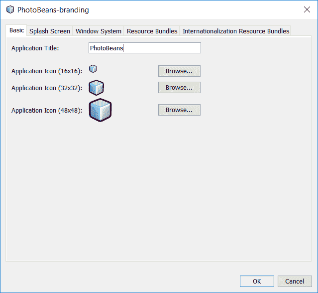
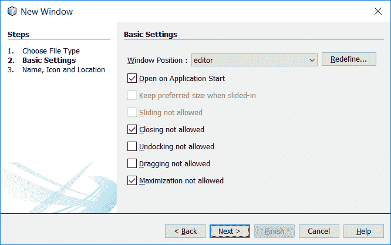
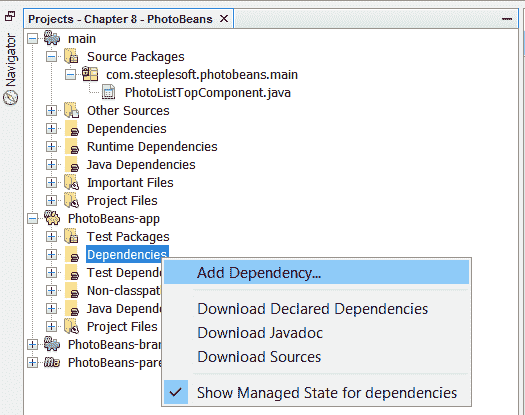
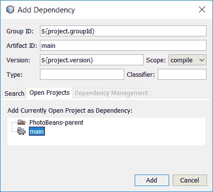
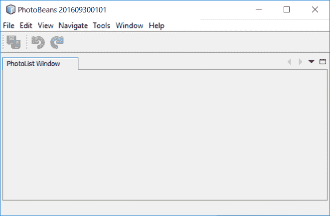
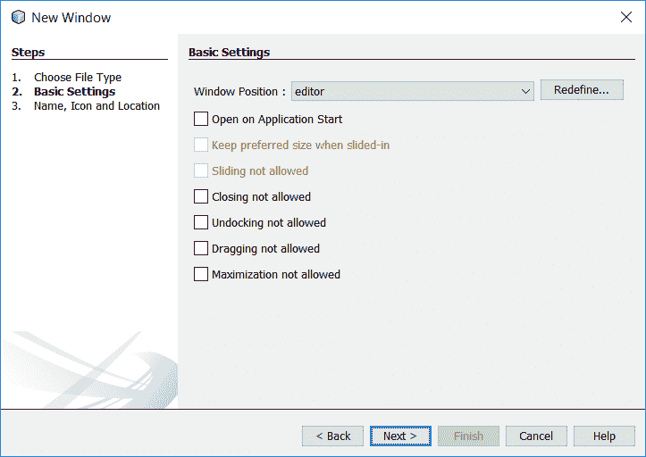
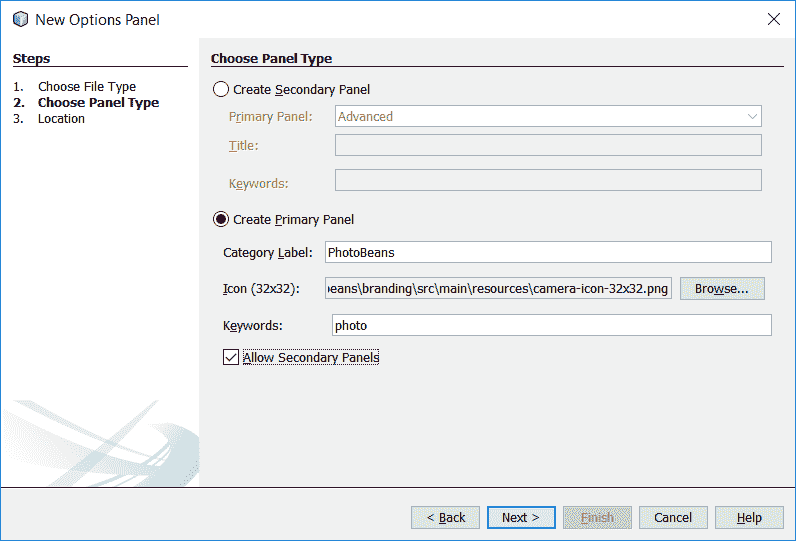
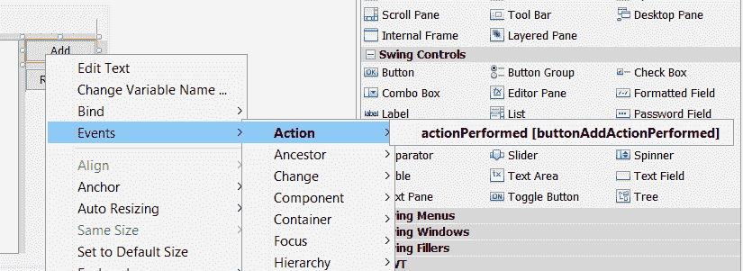

# 使用 PhotoBeans 进行照片管理

到目前为止，我们已经编写了库。我们编写了命令行实用程序。我们还使用 JavaFX 编写了 GUI。在本章中，我们将尝试完全不同的东西。我们将构建一个照片管理系统，当然，它需要是一个图形应用程序，但我们将采取不同的方法。我们将使用现有的应用程序框架。该框架是 NetBeans **Rich Client Platform**（**RCP**），这是一个成熟、稳定和强大的框架，不仅支持我们使用的 NetBeans IDE，还支持从石油和天然气到航空航天等各行各业的无数应用程序。

在本章中，我们将涵盖以下主题：

+   如何启动 NetBeans RCP 项目

+   如何将 JavaFX 与 NetBeans RCP 集成

+   RCP 应用程序的基本原理，如节点、操作、查找、服务和顶级组件

那么，话不多说，让我们开始吧。

# 入门

也许您的问题清单中排在前面或附近的问题是，**我为什么要使用 NetBeans RCP？**在我们深入了解应用程序的细节之前，让我们回答这个非常公平的问题，并尝试理解为什么我们要以这种方式构建它。

当您开始研究 NetBeans 平台时，您会注意到的第一件事是模块化的强烈概念。由于 Java 9 的 Java 模块系统是 Java 的一个突出特性，这可能看起来像一个细节，但 NetBeans 在应用程序级别向我们公开了这个概念，使插件变得非常简单，并允许我们以逐步更新应用程序。

RCP 还提供了一个强大、经过充分测试的框架，用于处理窗口、菜单、操作、节点、服务等。如果我们要像在前几章中使用**纯**JavaFX 一样从头开始构建这个应用程序，我们将不得不手动定义屏幕上的区域，然后手动处理窗口放置。使用 RCP，我们已经定义了丰富的窗口规范，可以轻松使用。它提供了诸如最大化/最小化窗口、滑动、分离和停靠窗口等功能。

RCP 还提供了**节点**的强大概念，将特定领域的数据封装在用户界面概念中，通常在应用程序的左侧树视图中看到，以及可以与这些节点（或菜单项）关联的操作，以对它们代表的数据进行操作。再次强调，所有这些都可以在 JavaFX（或 Swing）中完成，但您需要自己编写所有这些功能。实际上，有许多开源框架提供了这样的功能，例如 Canoo 的 Dolphin Platform（[`www.dolphin-platform.io`](http://www.dolphin-platform.io/)），但没有一个像 NetBeans RCP 那样经过多年的生产硬化和测试，因此我们将保持关注在这里。

# 启动项目

您如何创建 NetBeans RCP 项目将对项目的其余部分的处理方式产生非常基本的影响。默认情况下，NetBeans 使用 Ant 作为所有 RCP 应用程序的构建系统。几乎所有来自 NetBeans 项目的在线文档和 NetBeans 传道者的博客条目也经常反映了这种偏好。我们一直在使用 Maven 进行其他项目，这里也不会改变。幸运的是，NetBeans 确实允许我们使用 Maven 创建 RCP 项目，这就是我们要做的。


在新项目窗口中，我们选择 Maven，然后选择 NetBeans Application。在下一个屏幕上，我们像往常一样配置项目，指定项目名称、photobeans、项目位置、包等。

当我们点击“下一步”时，将会出现“新项目向导”的“模块选项”步骤。在这一步中，我们配置 RCP 应用程序的一些基本方面。具体来说，我们需要指定我们将使用的 NetBeans API 版本，以及是否要将 OSGi 捆绑包作为依赖项，如下面的屏幕截图所示：


在撰写本文时，最新的平台版本是 RELEASE82。到 Java 9 发布时，可以合理地期望 NetBeans 9.0，因此 RELEASE90 将可用。我们希望使用最新版本，但请注意，根据 NetBeans 项目的发布计划，它很可能 *不* 是 9.0。对于“允许将 OSGi 捆绑包作为依赖项”选项，我们可以安全地接受默认值，尽管更改它不会给我们带来任何问题，而且如果需要，我们可以很容易地稍后更改该值。

创建项目后，我们应该在项目窗口中看到三个新条目：`PhotoBeans-parent`、`PhotoBeans-app` 和 `PhotoBeans-branding`。`-parent` 项目没有真正的可交付成果。与其他章节的 `master` 项目一样，它仅用于组织相关模块、协调依赖关系等。

# 为您的应用程序进行品牌定制

`-branding` 模块是我们可以定义应用程序品牌细节的地方，正如你可能已经猜到的那样。您可以通过右键单击品牌模块并在内容菜单底部附近选择 `品牌...` 来访问这些品牌属性。这样做后，您将看到一个类似于这样的屏幕：



在上述选项卡中，您可以设置或更改应用程序的名称，并指定应用程序图标。

在“启动画面”选项卡中，您可以配置最重要的是在应用程序加载时显示在启动画面上的图像。您还可以启用或禁用进度条，并设置进度条和启动消息的颜色、字体大小和位置：


目前对我们感兴趣的唯一其他选项卡是“窗口系统”选项卡。在这个选项卡中，我们可以配置一些功能，比如窗口拖放、窗口滑动、关闭等等：


很可能，默认值对我们的目的是可以接受的。但是，在您自己的 NetBeans RCP 应用程序中，此屏幕可能更加重要。

我们主要关注 `-app` 模块。这个模块将定义应用程序的所有依赖关系，并且将是其入口点。不过，与我们在之前章节中看到的 JavaFX 应用程序不同，我们不需要定义 `public static void main` 方法，因为 NetBeans 会为我们处理。实际上，`-app` 模块根本没有任何 Java 类，但是应用程序可以直接运行，尽管它并没有做太多事情。我们现在来修复这个问题。

# NetBeans 模块

NetBeans 平台的一个优点是其模块化。如果您以前曾使用过 NetBeans IDE（比如在阅读本书之前），那么在使用插件时就已经看到了这种模块化的作用：每个 NetBeans 插件由一个或多个模块组成。实际上，NetBeans 本身由许多模块组成。这就是 RCP 应用程序设计的工作方式。它促进了解耦，并使扩展和升级应用程序变得更加简单。

通常接受的模式是，将 API 类放在一个模块中，将实现放在另一个模块中。这样可以使其他实现者重用 API 类，可以通过隐藏私有类来帮助强制低耦合等等。然而，为了简化我们学习平台的过程，我们将创建一个模块，该模块将提供所有核心功能。为此，我们右键单击父项目下的“模块”节点，然后选择“创建新模块...”：如下图所示：


一旦选择，您将看到新项目窗口。在这里，您需要选择 Maven 类别和 NetBeans 模块项目类型，如下所示：


点击“下一步”将进入“名称和位置”步骤，这是本书中已经多次见过的步骤。在这个窗格上，我们将模块命名为`main`，将包设置为`com.steeplesoft.photobeans.main`，并接受其他字段的默认值。在下一个窗格“模块选项”中，我们将确保 NetBeans 版本与之前选择的版本相同，并点击“完成”。

# TopComponent - 选项卡和窗口的类

现在我们有一个大部分为空的模块。NetBeans 为我们创建了一些工件，但我们不需要关心这些，因为构建将为我们管理这些。不过，我们需要做的是创建我们的第一个 GUI 元素，这将是 NetBeans 称为 TopComponent 的东西。从 NetBeans Javadoc 中，可以在[`bits.netbeans.org/8.2/javadoc/`](http://bits.netbeans.org/8.2/javadoc/)找到这个定义：

可嵌入的可视组件，用于在 NetBeans 中显示。这是显示的基本单位--窗口不应该直接创建，而应该使用这个类。顶部组件可能对应于单个窗口，但也可能是窗口中的选项卡（例如）。它可以被停靠或未停靠，有选定的节点，提供操作等。

正如我们将看到的，这个类是 NetBeans RCP 应用程序的主要组件。它将保存和控制各种相关的用户界面元素。换句话说，它位于用户界面的组件层次结构的顶部。要创建 TopComponent，我们可以通过在项目资源管理器树中右键单击我们现在空的包，并选择新建 | 窗口来使用 NetBeans 向导。如果“窗口”不是一个选项，选择其他 | 模块开发 | 窗口。

现在您应该看到以下基本设置窗口：



在前面的窗口中有许多选项。我们正在创建的是一个将显示照片列表的窗口，因此一些合理的设置是选择以下内容：

+   应用程序启动时打开

+   不允许关闭

+   不允许最大化

这些选项似乎非常直接了当，但“窗口位置”是什么？使用 NetBeans RCP 而不是从头开始编写的另一个好处是，平台提供了许多预定义的概念和设施，因此我们不需要担心它们。其中一个关注点是窗口定位和放置。NetBeans 用户界面规范（可以在 NetBeans 网站上找到，网址为[`ui.netbeans.org/docs/ui/ws/ws_spec-netbeans_ide.html`](https://ui.netbeans.org/docs/ui/ws/ws_spec-netbeans_ide.html)）定义了以下区域：

+   **资源管理器：** 这用于提供对用户对象的访问的所有窗口，通常是树浏览器

+   **输出：** 这是默认用于输出窗口和 VCS 输出窗口

+   **调试器：** 这用于所有调试器窗口和其他需要水平布局的支持窗口

+   **调色板：** 这用于组件调色板窗口

+   **检查器：** 这用于组件检查器窗口

+   **属性：** 这用于属性窗口

+   **文档：** 这用于所有文档窗口

文档还提供了这个有用的插图：


规范页面有大量的额外信息，但现在这些信息足够让您开始了。我们希望我们的照片列表在应用程序窗口的左侧，所以我们选择窗口位置为编辑器。点击“下一步”，我们配置组件的名称和图标。严格来说，我们不需要为 TopComponent 指定图标，所以我们只需输入`PhotoList`作为类名前缀，并点击“完成”：


当您在这里单击“完成”时，NetBeans 会为您创建一些文件，尽管只有一个文件会显示在项目资源管理器树中，即`PhotoListTopComponent.java`。还有一个名为`PhotoListTopComponent.form`的文件，您需要了解一下，尽管您永远不会直接编辑它。NetBeans 为构建用户界面提供了一个非常好的所见即所得（WYSIWYG）编辑器。用户界面定义存储在`.form`文件中，这只是一个 XML 文件。当您进行更改时，NetBeans 会为您修改这个文件，并在一个名为`initComponents()`的方法中生成相应的 Java 代码。您还会注意到，NetBeans 不允许您修改这个方法。当然，您可以使用另一个编辑器来这样做，但是如果您以这种方式进行更改，那么如果您在 GUI 编辑器中进行更改，那么您所做的任何更改都将丢失，所以最好还是让这个方法保持不变。`TopComponent`的其余部分是什么样子的呢？

```java
    @ConvertAsProperties( 
      dtd = "-//com.steeplesoft.photobeans.main//PhotoList//EN", 
      autostore = false 
    ) 
    @TopComponent.Description( 
      preferredID = "PhotoListTopComponent", 
      //iconBase="SET/PATH/TO/ICON/HERE", 
      persistenceType = TopComponent.PERSISTENCE_ALWAYS 
    ) 
    @TopComponent.Registration(mode = "editor",
     openAtStartup = true) 
    @ActionID(category = "Window", id =  
      "com.steeplesoft.photobeans.main.PhotoListTopComponent") 
    @ActionReference(path = "Menu/Window" /*, position = 333 */) 
    @TopComponent.OpenActionRegistration( 
      displayName = "#CTL_PhotoListAction", 
      preferredID = "PhotoListTopComponent" 
    ) 
    @Messages({ 
      "CTL_PhotoListAction=PhotoList", 
      "CTL_PhotoListTopComponent=PhotoList Window", 
      "HINT_PhotoListTopComponent=This is a PhotoList window" 
    }) 
    public final class PhotoListTopComponent 
     extends TopComponent { 

```

这是很多注释，但也是 NetBeans 平台为您做了多少事情的一个很好的提醒。在构建过程中，这些注释被处理以创建元数据，平台将在运行时使用这些元数据来配置和连接您的应用程序。

一些亮点如下：

```java
    @TopComponent.Registration(mode = "editor",
      openAtStartup = true) 

```

这样注册了我们的`TopComponent`，并反映了我们放置它的选择和何时打开它的选择。

我们还有一些国际化和本地化工作正在进行，如下所示：

```java
    @ActionID(category = "Window", id =  
      "com.steeplesoft.photobeans.main.PhotoListTopComponent") 
    @ActionReference(path = "Menu/Window" /*, position = 333 */) 
    @TopComponent.OpenActionRegistration( 
      displayName = "#CTL_PhotoListAction", 
      preferredID = "PhotoListTopComponent" 
    ) 
    @Messages({ 
      "CTL_PhotoListAction=PhotoList", 
      "CTL_PhotoListTopComponent=PhotoList Window", 
      "HINT_PhotoListTopComponent=This is a PhotoList window" 
    }) 

```

不要过多涉及细节并冒险混淆事情，前三个注释注册了一个开放的操作，并在我们的应用程序的“窗口”菜单中公开了一个项目。最后一个注释`@Messages`用于定义本地化键和字符串。当这个类被编译时，同一个包中会创建一个名为`Bundle`的类，该类使用指定的键来返回本地化字符串。例如，对于`CTL_PhotoListAction`，我们得到以下内容：

```java
    static String CTL_PhotoListAction() { 
      return org.openide.util.NbBundle.getMessage(Bundle.class,  
        "CTL_PhotoListAction"); 
    } 

```

上述代码查找了标准 Java 的`.properties`文件中的本地化消息的键。这些键值对与 NetBeans 向我们生成的`Bundle.properties`文件中找到的任何条目合并。

我们的`TopComponent`的以下构造函数也很有趣：

```java
    public PhotoListTopComponent() { 
      initComponents(); 
      setName(Bundle.CTL_PhotoListTopComponent()); 
      setToolTipText(Bundle.HINT_PhotoListTopComponent()); 
      putClientProperty(TopComponent.PROP_CLOSING_DISABLED,  
       Boolean.TRUE); 
      putClientProperty(TopComponent.PROP_MAXIMIZATION_DISABLED,  
       Boolean.TRUE); 
    } 

```

在上述构造函数中，我们可以看到组件的名称和工具提示是如何设置的，以及我们的与窗口相关的选项是如何设置的。

如果我们现在运行我们的应用程序，我们不会看到任何变化。因此，我们需要在应用程序中添加对`main`模块的依赖。我们可以通过右键单击应用程序模块的“Dependencies”节点来实现这一点，如下图所示：



现在您应该看到“添加依赖项”窗口。选择“打开项目”选项卡，然后选择`main`，如下图所示：



一旦我们添加了依赖项，我们需要先构建`main`模块，然后构建`app`，然后我们就可以准备运行 PhotoBeans 了：



注意上一个屏幕中窗口标题中的奇怪日期？那是 NetBeans 平台的构建日期，在我们的应用程序中看起来不太好看，所以让我们来修复一下。我们有两个选择。第一个是使用我们之前看过的品牌用户界面。另一个是直接编辑文件。为了保持事情的有趣，并帮助理解磁盘上的位置，我们将使用第二种方法。

在品牌模块中，在其他来源|nbm-branding 下，您应该找到`modules/org-netbeans-core-windows.jar/org/netbeans/core/windows/ view/ui/Bundle.properties`文件。在这个文件中，您应该看到这些行：

```java
    CTL_MainWindow_Title=PhotoBeans {0} 
    CTL_MainWindow_Title_No_Project=PhotoBeans {0} 

```

我们所需要做的就是删除`{0}`部分，重新构建这个模块和应用程序，我们的标题栏就会变得更漂亮。虽然看起来更好了，但是我们的 TopComponent 呢？为了解决这个问题，我们需要学习一些新的概念。

# 节点，NetBeans 演示对象

您已经听过 Node 这个术语。我已经多次使用它来描述点击的内容和位置。正式地说，一个 Node 代表对象（bean）层次结构中的一个元素。它提供了在资源管理器视图和 bean 之间进行通信所需的所有方法。在我们的应用程序的资源管理器部分，我们希望向用户表示照片列表。我们将每张照片以及拍摄日期和月份表示为一个 Node。为了显示这些节点，我们将使用一个名为`BeanTreeView`的 NetBeans 类，它将以树形式显示这个节点层次结构。还有一些概念需要学习，但让我们先从现有的开始。

我们将首先定义我们的节点，它们将作为我们应用程序业务领域模型和 NetBeans API 之间的一种包装或桥梁。当然，我们还没有定义这样的模型，所以现在需要解决这个问题。我们的基本数据项是一张照片，是存储在磁盘上的图像文件。在应用程序中，我们将以嵌套树结构显示这些照片，按年份和月份进行分组。如果展开一个年份节点，您将看到一个月份节点列表，如果展开一个月份节点，您将看到一个照片节点列表。这是一个非常基本、有些天真的数据模型，但它足够有效地演示了这些概念，同时也足够简单，不会使概念变得模糊。

与所有层次结构一样，我们需要一个根节点，所以我们将从那里开始：

```java
    public class RootNode extends AbstractNode 

```

所有节点的基类在技术上是 Node，但扩展该类会给我们带来更多的负担，因此我们使用 NetBeans 提供的`AbstractNode`，它为我们实现了大量节点的基本行为，并提供了合理的默认值。

接下来，我们定义一些构造函数，如下所示：

```java
    public RootNode() { 
      this(new InstanceContent()); 
    } 

    protected RootNode(InstanceContent ic) { 
      super(Children.create(new YearChildFactory(), true), 
       new AbstractLookup(ic)); 
      setDisplayName(Bundle.LBL_RootNode()); 
      setShortDescription(Bundle.HINT_RootNode()); 

      instanceContent = ic; 
    } 

```

请注意，我们有两个构造函数，一个是`public`，一个是`protected`。之所以这样做是因为我们想要创建和捕获`InstanceContent`的实例，这样我们作为这个类 Lookup 的创建者就可以控制 Lookup 中实际包含的内容。由于我们需要将 Lookup 传递给我们类的父构造函数，所以我们采用了这种两步实例化对象的方法。

# Lookup，NetBeans 的基础

什么是 Lookup？它是一个**通用注册表，允许客户端找到服务的实例（给定接口的实现）**。换句话说，它是一个机制，通过它我们可以发布各种工件，系统的其他部分可以通过一个键（可以是`Class`或`Lookup.Template`，这里我们不讨论）查找这些工件，模块之间没有耦合。

这通常用于查找服务接口的实现。您还记得我之前提到过吗？通常我们会看到 API 在一个模块中定义，而实现在另一个模块中。这就是它特别方便的地方。假设您正在开发一个从在线服务中检索照片的 API（这将是该应用程序的一个很棒的功能！）。您计划为一个服务提供实现，比如 Google 照片，但希望让第三方开发人员为 Flickr 提供实现。如果您将所需的 API 接口、类等放在一个模块中，将 Google 照片的实现放在另一个模块中，第三方开发人员可以仅依赖于您的 API 模块，避免依赖于您的实现模块。Flickr 模块将声明照片服务 API 的实现，我们可以通过查找请求加载 Flickr 和我们自己的 Google 照片实现。简而言之，该系统允许在一个非常干净、简单的 API 中解耦 API 定义、实现和实例获取。

这是 Lookup，但是`InstanceContent`是什么？Lookup API 只公开了获取项目的方法。没有机制可以向 Lookup 添加项目，这是有道理的，因为 Lookup 实例是由未知的第三方使用的，我们不希望他们随机更改我们的 Lookup 的内容。然而，我们可能确实希望更改这些内容，我们可以通过`InstanceContent`来实现，它公开了我们需要添加或删除项目的方法。我们将在应用程序的后续部分看到这个概念的演示。

# 编写我们自己的节点

前面的部分涵盖了这两个类，但是`YearChildFactory`是什么？类`RootNode`为系统定义了将成为我们树的根节点。但是，如果节点有子节点，它负责加载和构建这些子节点，这是通过这个`ChildFactory`类完成的。我们的实例看起来是这样的：

```java
    public class YearChildFactory extends ChildFactory<String> { 
      private final PhotoManager photoManager; 
      private static final Logger LOGGER =  
        Logger.getLogger(YearChildFactory.class.getName()); 
      public YearChildFactory() { 
        this.photoManager =  
          Lookup.getDefault().lookup(PhotoManager.class); 
        if (photoManager == null) { 
          LOGGER.log(Level.SEVERE,  
          "Cannot get PhotoManager object"); 
          LifecycleManager.getDefault().exit(); 
        } 
      } 

      @Override 
      protected boolean createKeys(List<String> list) { 
        list.addAll(photoManager.getYears()); 
        return true; 
      } 

      @Override 
      protected Node createNodeForKey(String key) { 
        return new YearNode(Integer.parseInt(key)); 
      } 
    } 

```

我们正在创建一个`ChildFactory`接口，它将返回操作字符串的节点。如果您有一个更复杂的数据模型，例如使用 POJOs 的模型，您可以将该类指定为参数化类型。

在我们的构造函数中，我们看到了通过 Lookup 查找服务实现的示例，就是这样：

```java
    this.photoManager=Lookup.getDefault().lookup(
      PhotoManager.class); 

```

我们稍后将讨论定义服务，但是现在，您需要理解的是，我们正在向全局 Lookup（与我们之前创建的 Lookup 不同，它不与特定类绑定）请求`PhotoManager`接口的一个实例。或许有些天真，我们假设只有一个这个接口的实例，但由于我们没有导出这个接口，我们对这个假设感到放心。不过，我们确实检查确保至少有一个实例，如果没有，就退出应用程序。

接下来的两个方法是工厂用来创建子节点的方法。第一个方法`createKeys(List<String> list)`是系统调用的，用于生成子节点的键列表。在我们的实现中，我们要求`PhotoManager`接口提供年份列表（正如我们将看到的，这是对数据库的一个简单查询，用于获取系统中我们拥有照片的年份列表）。然后平台获取这些键，并逐个传递给`createNodeForKey(String key)`来创建实际的节点。在这里，我们创建一个`YearNode`的实例来表示这一年。

`YearNode`，就像`RootNode`一样，扩展了`AbstractNode`。

```java
    public class YearNode extends AbstractNode { 
      public YearNode(int year) { 
        super(Children.create(new MonthNodeFactory(year), true),  
         Lookups.singleton(year)); 
        setName("" + year); 
        setDisplayName("" + year); 
      } 
    } 

```

前面的内容显然是一个更简单的节点，但基本原理是一样的——我们创建`ChildFactory`来创建我们的子节点，我们创建一个 Lookup，在这种情况下，它保存了一个值，即节点表示的年份。

`MonthNodeFactory`看起来几乎和`YearNodeFactory`一样，唯一的区别是它为给定年份加载月份，所以我们不会在这里显示源代码。它还为列表中的每个月创建`MonthNode`实例。像`YearNode`一样，`MonthNode`非常简单，您可以在以下代码片段中看到：

```java
    public class MonthNode extends AbstractNode { 
      public MonthNode(int year, int month) { 
        super(Children.create( 
          new PhotoNodeFactory(year, month), true),  
           Lookups.singleton(month)); 
          String display = month + " - " +  
           Month.values()[month-1].getDisplayName( 
             TextStyle.FULL, Locale.getDefault()); 
          setName(display); 
          setDisplayName(display); 
      } 
    } 

```

我们做了更多的工作来给节点一个有意义的名称和显示名称，但基本上是一样的。还要注意，我们有另一个`ChildFactory`，它将生成我们需要的`PhotoNodes`作为子节点。工厂本身没有什么新鲜的内容，但`PhotoNode`有，所以让我们来看看它：

```java
    public class PhotoNode extends AbstractNode { 
      public PhotoNode(String photo) { 
        this(photo, new InstanceContent()); 
    } 

    private PhotoNode(String photo, InstanceContent ic) { 
      super(Children.LEAF, new AbstractLookup(ic)); 
      final String name = new File(photo).getName(); 
      setName(name); 
      setDisplayName(name); 

      ic.add((OpenCookie) () -> { 
        TopComponent tc = findTopComponent(photo); 
        if (tc == null) { 
          tc = new PhotoViewerTopComponent(photo); 
          tc.open(); 
        } 
        tc.requestActive(); 
      }); 
    } 

```

在这里，我们再次看到了双构造函数方法，不过，在这种情况下，我们确实使用了`InstanceContent`。请注意，`super()`的第一个参数是`Children.LEAF`，表示这个节点没有任何子节点。我们还传递了现在熟悉的`new AbstractLookup(ic)`。

设置名称和显示名称后，我们向`InstanceContent`对象添加了一个 lambda。没有 lambda 版本的代码如下：

```java
    ic.add(new OpenCookie() { 
      @Override 
      public void open() { 
      } 
    }); 

```

`OpenCookie`是什么？它是标记接口`Node.Cookie`的子接口，cookie 是**一种设计模式，用于向现有数据对象和节点添加行为，或将实现与主对象分禅**。使用这个 cookie，我们可以很好地抽象出可以打开的信号以及如何打开它。

在这种情况下，当系统尝试打开节点表示的照片时，它将调用我们定义的`OpenCookie.open()`，该方法将尝试找到照片的打开实例。无论它找到现有的还是需要创建新的，它都会指示系统使其活动（或者给予焦点）。

请注意，打开的照片由另一个 TopComponent 表示。为了找到它，我们有这个方法：

```java
    private TopComponent findTopComponent(String photo) { 
      Set<TopComponent> openTopComponents =  
        WindowManager.getDefault().getRegistry().getOpened(); 
      for (TopComponent tc : openTopComponents) { 
        if (photo.equals(tc.getLookup().lookup(String.class))) { 
          return tc; 
        } 
      } 
      return null; 
    } 

```

我们要求`WindowManager`的查找器获取所有打开的 TopComponents，然后遍历每一个，将`String photo`（即图像的完整路径）与 TopComponent 的查找中存储的任何`String`进行比较。如果有匹配项，我们就返回该 TopComponent。这种按`String`查找有点天真，可能会在更复杂的应用程序中导致意外的匹配。在本应用程序中，我们可能足够安全，但在您自己的应用程序中，您需要确保匹配标准足够严格和唯一，以避免错误的匹配。

# 执行操作

我们稍后会看一下`PhotoViewerTopComponent`，但在继续之前，我们需要看一些其他项目。

`PhotoNode`覆盖了另外两个方法，如下所示：

```java
    @Override 
    public Action[] getActions(boolean context) { 
      return new Action[]{SystemAction.get(OpenAction.class)}; 
    } 

    @Override 
    public Action getPreferredAction() { 
      return SystemAction.get(OpenAction.class); 
    } 

```

毫不奇怪，`getActions()`方法返回了一个用于该节点的操作数组。操作是一个抽象（来自 Swing，而不是 NetBeans），它允许我们向菜单添加项目，并为用户与系统交互提供一种方式。主菜单或上下文菜单中的每个条目都由操作支持。在我们的情况下，我们将 NetBeans 定义的`OpenAction`与我们的节点关联起来，当点击时，它将在节点的查找中查找`OpenCookie`实例并调用`OpenCookie.open()`，这是我们之前定义的。

我们还覆盖了`getPreferredAction()`，这让我们定义了当节点被双击时的行为。这两种方法的结合使用户可以右键单击一个节点并选择“打开”，或者双击一个节点，最终结果是打开该节点的 TopComponent。

# 服务 - 暴露解耦功能

在查看我们的`TopComponent`的定义之前，让我们先看看`PhotoManager`，并了解一下它的服务。`PhotoManager`接口本身非常简单：

```java
    public interface PhotoManager extends Lookup.Provider { 
      void scanSourceDirs(); 
      List<String> getYears(); 
      List<String> getMonths(int year); 
      List<String> getPhotos(int year, int month); 
    } 

```

在上述代码中，除了`extends Lookup.Provider`部分外，没有什么值得注意的。通过在这里添加这个，我们可以强制实现来实现该接口上的唯一方法，因为我们以后会需要它。有趣的部分来自实现，如下所示：

```java
    @ServiceProvider(service = PhotoManager.class) 
    public class PhotoManagerImpl implements PhotoManager { 

```

这就是向平台注册服务所需的全部内容。注解指定了所需的元数据，构建会处理其余部分。让我们来看看实现的其余部分：

```java
    public PhotoManagerImpl() throws ClassNotFoundException { 
      setupDatabase(); 

      Preferences prefs =  
        NbPreferences.forModule(PhotoManager.class); 
      setSourceDirs(prefs.get("sourceDirs", "")); 
      prefs.addPreferenceChangeListener(evt -> { 
        if (evt.getKey().equals("sourceDirs")) { 
          setSourceDirs(evt.getNewValue()); 
          scanSourceDirs(); 
        } 
      }); 

      instanceContent = new InstanceContent(); 
      lookup = new AbstractLookup(instanceContent); 
      scanSourceDirs(); 
    } 

```

在这个简单的实现中，我们将使用 SQLite 来存储我们找到的照片的信息。该服务将提供代码来扫描配置的源目录，存储找到的照片信息，并公开检索那些在特定性上变化的信息的方法。

首先，我们需要确保数据库在应用程序首次运行时已经正确设置。我们可以包含一个预构建的数据库，但在用户的机器上创建它可以增加一些弹性，以应对数据库意外删除的情况。

```java
    private void setupDatabase() { 
      try { 
       connection = DriverManager.getConnection(JDBC_URL); 
       if (!doesTableExist()) { 
         createTable(); 
       } 
      } catch (SQLException ex) { 
        Exceptions.printStackTrace(ex); 
      } 
    } 

    private boolean doesTableExist() { 
      try (Statement stmt = connection.createStatement()) { 
        ResultSet rs = stmt.executeQuery("select 1 from images"); 
        rs.close(); 
        return true; 
      } catch (SQLException e) { 
        return false; 
      } 
    } 

    private void createTable() { 
      try (Statement stmt = connection.createStatement()) { 
        stmt.execute( 
          "CREATE TABLE images (imageSource VARCHAR2(4096), " 
          + " year int, month int, image VARCHAR2(4096));"); 
          stmt.execute( 
            "CREATE UNIQUE INDEX uniq_img ON images(image);"); 
      } catch (SQLException e) { 
        Exceptions.printStackTrace(e); 
      } 
    } 

```

接下来，我们要求引用`PhotoManager`模块的 NetBeans 首选项。我们将在本章后面更详细地探讨管理首选项，但现在我们只说我们将要向系统请求`sourceDirs`首选项，然后将其用于配置我们的扫描代码。

我们还创建了`PreferenceChangeListener`来捕获用户更改首选项的情况。在这个监听器中，我们验证我们关心的首选项`sourceDirs`是否已更改，如果是，我们将新值存储在我们的`PhotoManager`实例中，并启动目录扫描。

最后，我们创建`InstanceContent`，创建并存储一个 Lookup，并开始扫描目录，以确保应用程序与磁盘上的照片状态保持最新。

`getYears()`、`getMonths()`和`getPhotos()`方法基本相同，当然，它们的工作数据类型不同，所以我们让`getYears()`来解释这三个方法：

```java
    @Override 
    public List<String> getYears() { 
      List<String> years = new ArrayList<>(); 
      try (Statement yearStmt = connection.createStatement(); 
      ResultSet rs = yearStmt.executeQuery( 
        "SELECT DISTINCT year FROM images ORDER BY year")) { 
          while (rs.next()) { 
            years.add(rs.getString(1)); 
          } 
        } catch (SQLException ex) { 
          Exceptions.printStackTrace(ex); 
        } 
      return years; 
    } 

```

如果您熟悉 JDBC，这应该不足为奇。我们使用 Java 7 的`try-with-resources`语法来声明和实例化我们的`Statement`和`ResultSet`对象。对于不熟悉这种结构的人来说，它允许我们声明某些类型的资源，并且一旦`try`的范围终止，系统会自动关闭它们，因此我们不必担心关闭它们。但需要注意的主要限制是，该类必须实现`AutoCloseable`；`Closeable`不起作用。其他两个`get*`方法在逻辑上是类似的，因此这里不再显示。

这里的最后一个重要功能是源目录的扫描，由`scanSourceDirs()`方法协调，如下所示：

```java
    private final ExecutorService executorService =  
      Executors.newFixedThreadPool(5); 
    public final void scanSourceDirs() { 
      RequestProcessor.getDefault().execute(() -> { 
        List<Future<List<Photo>>> futures = new ArrayList<>(); 
        sourceDirs.stream() 
         .map(d -> new SourceDirScanner(d)) 
         .forEach(sds ->  
          futures.add((Future<List<Photo>>)  
          executorService.submit(sds))); 
        futures.forEach(f -> { 
          try { 
            final List<Photo> list = f.get(); 
            processPhotos(list); 
          } catch (InterruptedException|ExecutionException ex) { 
            Exceptions.printStackTrace(ex); 
          } 
        }); 
        instanceContent.add(new ReloadCookie()); 
      }); 
    } 

```

为了加快这个过程，我们为每个配置的源目录创建一个 Future，然后将它们传递给我们的`ExecutorService`。我们将其配置为池中最多有五个线程，这在很大程度上是任意的。更复杂的方法可能会使其可配置，或者自动调整，但对于我们的目的来说，这应该足够了。

一旦 Futures 被创建，我们遍历列表，请求每个结果。如果源目录的数量超过了我们线程池的大小，多余的 Futures 将等待直到有一个线程可用，此时`ExecutorService`将选择一个线程来运行。一旦它们都完成了，对`.get()`的调用将不再阻塞，应用程序可以继续。请注意，我们没有阻塞用户界面来让这个方法工作，因为我们将这个方法的大部分作为 lambda 传递给`RequestProcessor.getDefault().execute()`，以请求在用户界面线程之外运行。

当照片列表构建并返回后，我们用这个方法处理这些照片：

```java
    private void processPhotos(List<Photo> photos) { 
      photos.stream() 
       .filter(p -> !isImageRecorded(p)) 
       .forEach(p -> insertImage(p)); 
    } 

```

`isImageRecorded()` 方法检查图像路径是否已经在数据库中，如果是，则返回 true。我们根据这个测试的结果对流进行`filter()`操作，所以`forEach()`只对之前未知的图像进行操作，然后通过`insertImage()`将它们插入到数据库中。这两种方法看起来是这样的：

```java
    private boolean isImageRecorded(Photo photo) { 
      boolean there = false; 
      try (PreparedStatement imageExistStatement =  
        connection.prepareStatement( 
          "SELECT 1 FROM images WHERE image = ?")) { 
            imageExistStatement.setString(1, photo.getImage()); 
            final ResultSet rs = imageExistStatement.executeQuery(); 
            there = rs.next(); 
            close(rs); 
          } catch (SQLException ex) { 
            Exceptions.printStackTrace(ex); 
          } 
      return there; 
    } 

    private void insertImage(Photo photo) { 
      try (PreparedStatement insertStatement =  
       connection.prepareStatement( 
         "INSERT INTO images (imageSource, year, month, image)
          VALUES (?, ?, ?, ?);")) { 
            insertStatement.setString(1, photo.getSourceDir()); 
            insertStatement.setInt(2, photo.getYear()); 
            insertStatement.setInt(3, photo.getMonth()); 
            insertStatement.setString(4, photo.getImage()); 
            insertStatement.executeUpdate(); 
       } catch (SQLException ex) { 
         Exceptions.printStackTrace(ex); 
       } 
    } 

```

我们使用`PreparedStatement`，因为通常通过连接创建 SQL 语句是不明智的，这往往会导致 SQL 注入攻击，所以我们无法在第一个方法中完全使用`try-with-resources`，需要手动关闭`ResultSet`。

# PhotoViewerTopComponent

现在我们可以找到图像，但我们仍然不能告诉系统去哪里找。在转向处理 NetBeans 平台的偏好设置之前，我们还有一个 TopComponent 要看一看--`PhotoViewerTopComponent`。

如果你回想一下我们在 NetBeans 窗口系统提供的区域的讨论，当我们查看一张图片时，我们希望图片加载到`Editor`区域。为此，我们指示 NetBeans 通过右键单击所需的包，并选择 New | Window 来创建一个 TopComponent：



在下一个窗格中，我们为新的 TopComponent 指定一个类名前缀--如下截图所示的`PhotoViewer`：


NetBeans 现在将创建文件`PhotoViewerTopComponent.java`和`PhotoViewerTopComponent.form`，就像之前讨论的那样。不过，对于这个 TopComponent，我们需要做一些改变。当我们打开`Window`时，我们需要指定一个要加载的图片，因此我们需要提供一个带有图片路径的构造函数。然而，TopComponents 必须有一个无参数的构造函数，所以我们保留它，但让它调用我们的新构造函数并传入空的图片路径。

```java
    public PhotoViewerTopComponent() { 
      this(""); 
    } 

    public PhotoViewerTopComponent(String photo) { 
      initComponents(); 
      this.photo = photo; 
      File file = new File(photo); 
      setName(file.getName()); 
      setToolTipText(photo); 
      associateLookup(Lookups.singleton(photo)); 
      setLayout(new BorderLayout()); 
      init(); 
    } 

```

虽然这可能看起来很多，但这里的步骤很简单：我们将照片路径保存在一个实例变量中，然后从中创建一个`File`实例，以便更容易地获取文件名，将照片路径添加到 TopComponent 的 Lookup 中（这是我们如何找到给定照片的 TopComponent），更改布局，然后初始化窗口。

# 将 JavaFX 与 NetBeans RCP 集成

`init()`方法很有趣，因为我们将做一些略有不同的事情；我们将使用 JavaFX 来查看图片。我们在其他 TopComponent 中也可以使用 Swing，但这给了我们一个很好的机会，可以演示如何集成 JavaFX 和 Swing，以及 JavaFX 和 NetBeans 平台。

```java
    private JFXPanel fxPanel; 
    private void init() { 
      fxPanel = new JFXPanel(); 
      add(fxPanel, BorderLayout.CENTER); 
      Platform.setImplicitExit(false); 
      Platform.runLater(this::createScene); 
    } 

```

`JFXPanel`是一个 Swing 组件，用于将 JavaFX 嵌入 Swing 中。我们的窗口布局是`BorderLayout`，所以我们将`JFXPanel`添加到`CENTER`区域，并让它扩展以填充`Window`。JavaFX 组件的任何复杂布局将由我们`JFXPanel`内的另一个容器处理。不过，我们的用户界面相当简单。与我们之前的 JavaFX 系统一样，我们通过 FXML 定义用户界面如下：

```java
    <BorderPane fx:id="borderPane" prefHeight="480.0"  
      prefWidth="600.0"  

      fx:controller= 
        "com.steeplesoft.photobeans.main.PhotoViewerController"> 
      <center> 
        <ScrollPane fx:id="scrollPane"> 
          <content> 
            <Group> 
              <children> 
                <ImageView fx:id="imageView"  
                  preserveRatio="true" /> 
              </children> 
            </Group> 
          </content> 
        </ScrollPane> 
      </center> 
    </BorderPane> 

```

由于 FXML 需要一个根元素，我们指定了一个`BorderLayout`，正如讨论的那样，这给了我们在`JFXPanel`中的`BorderLayout`。这可能听起来很奇怪，但这就是嵌入 JavaFX 的工作方式。还要注意的是，我们仍然指定了一个控制器。在该控制器中，我们的`initialize()`方法如下：

```java
    @FXML 
    private BorderPane borderPane; 
    @FXML 
    private ScrollPane scrollPane; 
    public void initialize(URL location,
     ResourceBundle resources) { 
       imageView.fitWidthProperty() 
        .bind(borderPane.widthProperty()); 
       imageView.fitHeightProperty() 
        .bind(borderPane.heightProperty()); 
    } 

```

在这种最后的方法中，我们所做的就是将宽度和高度属性绑定到边界窗格的属性上。我们还在 FXML 中将`preserveRatio`设置为`True`，这样图片就不会被扭曲。当我们旋转图片时，这将很重要。

我们还没有看到旋转的代码，所以现在让我们来看一下。我们将首先添加一个按钮，如下所示：

```java
    <top> 
      <ButtonBar prefHeight="40.0" prefWidth="200.0"  
         BorderPane.alignment="CENTER"> 
         <buttons> 
           <SplitMenuButton mnemonicParsing="false" 
             text="Rotate"> 
              <items> 
                <MenuItem onAction="#rotateLeft"  
                  text="Left 90°" /> 
                <MenuItem onAction="#rotateRight"  
                  text="Right 90°" /> 
              </items> 
            </SplitMenuButton> 
         </buttons> 
      </ButtonBar> 
    </top> 

```

在`BorderPane`的`top`部分，我们添加了`ButtonBar`，然后添加了一个单独的`SplitMenuButton`。这给了我们一个像右侧的按钮。在非焦点状态下，它看起来像一个普通按钮。当用户点击箭头时，菜单会呈现给用户，提供了在列出的方向中旋转图片的能力：


我们已经将这些 MenuItems 绑定到了 FXML 定义中控制器中的适当方法：

```java
    @FXML 
    public void rotateLeft(ActionEvent event) { 
      imageView.setRotate(imageView.getRotate() - 90); 
    } 
    @FXML 
    public void rotateRight(ActionEvent event) { 
      imageView.setRotate(imageView.getRotate() + 90); 
    } 

```

使用 JavaFX `ImageView`提供的 API，我们设置了图片的旋转。

我们可以找到图片，查看它们，并旋转它们，但我们仍然不能告诉系统在哪里查找这些图片。是时候解决这个问题了。

# NetBeans 首选项和选项面板

管理首选项的关键在于`NbPreferences`和选项面板。`NbPreferences`是存储和加载首选项的手段，选项面板是向用户提供用于编辑这些首选项的用户界面的手段。我们将首先看看如何添加选项面板，这将自然地引向`NbPreferences`的讨论。接下来是 NetBeans 选项窗口：


在前面的窗口中，我们可以看到两种类型的选项面板--主选项和次要选项。主选项面板由顶部的图标表示：常规、编辑器、字体和颜色等。次要选项面板是一个选项卡，就像我们在中间部分看到的：Diff、Files、Output 和 Terminal。在添加选项面板时，您必须选择主选项或次要选项。我们想要添加一个新的主要面板，因为它将在视觉上将我们的首选项与其他面板分开，并且让我们有机会创建两种类型的面板。

# 添加一个主要面板

要创建一个主选项面板，请右键单击所需的包或项目节点，然后单击“新建|选项面板”。如果选项面板不可见，请选择“新建|其他|模块开发|选项面板”。接下来，选择“创建主选项面板”：



我们必须指定一个标签，这是我们将在图标下看到的文本。我们还必须选择一个图标。系统将允许您选择除 32x32 图像之外的其他内容，但如果它不是正确的大小，它在用户界面中看起来会很奇怪；因此，请谨慎选择。系统还要求您输入关键字，如果用户对选项窗口应用了过滤器，将使用这些关键字。最后，选择“允许次要面板”。主要面板没有任何真正的内容，只用于显示次要面板，我们将很快创建。

当您点击“下一步”时，将要求您输入类前缀和包：


当您点击“完成”时，NetBeans 将创建这个单一文件，`package-info.java`：

```java
    @OptionsPanelController.ContainerRegistration(id = "PhotoBeans", 
      categoryName = "#OptionsCategory_Name_PhotoBeans",  
      iconBase = "com/steeplesoft/photobeans/main/options/
       camera-icon-32x32.png",  
       keywords = "#OptionsCategory_Keywords_PhotoBeans",  
       keywordsCategory = "PhotoBeans") 
    @NbBundle.Messages(value = { 
      "OptionsCategory_Name_PhotoBeans=PhotoBeans",  
      "OptionsCategory_Keywords_PhotoBeans=photo"}) 
    package com.steeplesoft.photobeans.main.options; 

    import org.netbeans.spi.options.OptionsPanelController; 
    import org.openide.util.NbBundle; 

```

# 添加一个次要面板

定义了主要面板后，我们准备创建次要面板，这将完成我们的工作。我们再次右键单击包，并选择“新建|选项面板”，这次选择“创建次要面板”：


由于我们已经定义了自己的主要面板，我们可以将其选择为我们的父级，并且像之前一样设置标题和关键字。点击“下一步”，选择和/或验证类前缀和包，然后点击“完成”。这将创建三个文件--`SourceDirectoriesOptionPanelController.java`、`SourceDirectoriesPanel.java`和`SourceDirectoriesPanel.form`，NetBeans 将为您呈现面板的 GUI 编辑器。

我们想要向我们的面板添加四个元素--一个标签、一个列表视图和两个按钮。我们通过从右侧的工具栏拖动它们，并将它们排列在下一个表单中来添加它们：


为了使与这些用户界面元素的工作更有意义，我们需要设置变量名。我们还需要设置用户界面的文本，以便每个元素对用户来说都是有意义的。我们可以通过右键单击每个元素来做到这一点，如此屏幕截图所示：



在前面的屏幕上，我们可以看到三个感兴趣的项目--编辑文本、更改变量名称...和事件|操作|actionPeformed [buttonAddActionPerformed]。对于我们的按钮，我们需要使用所有三个，因此我们将文本设置为`Add`（或`Remove`），将变量名称更改为`buttonAdd`/`buttonRemove`，并选择`actionPerformed`。回到我们的 Java 源代码中，我们看到为我们创建的一个方法，我们需要填写它：

```java
    private void buttonAddActionPerformed(ActionEvent evt) {                                               
      String lastDir = NbPreferences 
       .forModule(PhotoManager.class).get("lastDir", null); 
      JFileChooser chooser = new JFileChooser(); 
      if (lastDir != null) { 
        chooser.setCurrentDirectory( 
          new java.io.File(lastDir)); 
      } 
      chooser.setDialogTitle("Add Source Directory"); 
      chooser.setFileSelectionMode(
        JFileChooser.DIRECTORIES_ONLY); 
      chooser.setAcceptAllFileFilterUsed(false); 
      if (chooser.showOpenDialog(null) ==  
        JFileChooser.APPROVE_OPTION) { 
          try { 
            String dir = chooser.getSelectedFile() 
            .getCanonicalPath(); 
            ensureModel().addElement(dir); 
            NbPreferences.forModule(PhotoManager.class) 
            .put("lastDir", dir); 
          } catch (IOException ex) { 
              Exceptions.printStackTrace(ex); 
            } 
        } else { 
            System.out.println("No Selection "); 
          } 
    } 

```

我们这里有很多事情要做：

1.  我们首先检索`lastDir`偏好值。如果设置了，我们将使用它作为选择要添加的目录的起点。通常，至少根据我的经验，感兴趣的目录在文件系统中通常相互靠近，因此我们使用这个偏好值来节省用户的点击次数。

1.  接下来，我们创建`JFileChooser`，这是一个 Swing 类，允许我们选择目录。

1.  如果`lastDir`不为空，我们将其传递给`setCurrentDirectory()`。

1.  我们将对话框的标题设置为有意义的内容。

1.  我们指定对话框只能让我们选择目录。

1.  最后，我们禁用“选择所有文件过滤器”选项。

1.  我们调用`chooser.showOpenDialog()`来向用户呈现对话框，并等待其关闭。

1.  如果对话框的返回代码是`APPROVE_OPTION`，我们需要将所选目录添加到我们的模型中。

1.  我们获取所选文件的规范路径。

1.  我们调用`ensureModel()`，稍后我们将看到，以获取我们`ListView`的模型，然后将这个新路径添加到其中。

1.  最后，我们将所选路径存储为`lastDir`在我们的偏好中，以设置起始目录，如前所述。

1.  删除按钮的操作要简单得多，如下所示：

```java
        private void buttonRemoveActionPerformed(ActionEvent evt) {                                              
          List<Integer> indexes = IntStream.of( 
            sourceList.getSelectedIndices()) 
            .boxed().collect(Collectors.toList()); 
          Collections.sort(indexes); 
          Collections.reverse(indexes); 
          indexes.forEach(i -> ensureModel().remove(i)); 
        } 

```

当我们从模型中删除项目时，我们按项目索引进行删除。但是，当我们删除一个项目时，之后的索引号会发生变化。因此，我们在这里所做的是创建一个选定索引的列表，对其进行排序以确保它处于正确的顺序（这可能在这里有些过度，但这是一个相对廉价的操作，并且使下一个操作更安全），然后我们反转列表的顺序。现在，我们的索引按降序排列，我们可以遍历列表，从我们的模型中删除每个索引。

我们现在已经多次使用了`ensureModel()`，让我们看看它是什么样子的：

```java
    private DefaultListModel<String> ensureModel() { 
      if (model == null) { 
        model = new DefaultListModel<>(); 
        sourceList.setModel(model); 
      } 
      return model; 
    } 

```

重要的是，我们将模型视为`DefaultListModel`而不是`ListView`期望的`ListModel`类型，因为后者不公开任何用于改变模型内容的方法，而前者则公开。通过处理`DefaultListModel`，我们可以根据需要添加和删除项目，就像我们在这里所做的那样。

# 加载和保存偏好

在这个类中还有两个我们需要看一下的方法，它们加载和存储面板中表示的选项。我们将从`load()`开始，如下所示：

```java
    protected void load() { 
      String dirs = NbPreferences 
       .forModule(PhotoManager.class).get("sourceDirs", ""); 
      if (dirs != null && !dirs.isEmpty()) { 
        ensureModel(); 
        model.clear(); 
        Set<String> set = new HashSet<>( 
          Arrays.asList(dirs.split(";"))); 
        set.forEach(i -> model.addElement(i)); 
      } 
    } 

```

`NbPreferences`不支持存储字符串列表，因此，正如我们将在下面看到的，我们将源目录列表存储为分号分隔的字符串列表。在这里，我们加载`sourceDirs`的值，如果不为空，我们在分号上拆分，并将每个条目添加到我们的`DefaultListModel`中。

保存源目录也相当简单：

```java
    protected void store() { 
      Set<String> dirs = new HashSet<>(); 
      ensureModel(); 
      for (int i = 0; i < model.getSize(); i++) { 
        final String dir = model.getElementAt(i); 
        if (dir != null && !dir.isEmpty()) { 
          dirs.add(dir); 
        } 
      } 
      if (!dirs.isEmpty()) { 
        NbPreferences.forModule(PhotoManager.class) 
        .put("sourceDirs", String.join(";", dirs)); 
      } else { 
        NbPreferences.forModule(PhotoManager.class) 
          .remove("sourceDirs"); 
      } 
    } 

```

我们遍历`ListModel`，将每个目录添加到本地`HashSet`实例中，这有助于我们删除任何重复的目录。如果`Set`不为空，我们使用`String.join()`创建我们的分隔列表，并将其`put()`到我们的偏好存储中。如果为空，我们将偏好条目从存储中删除，以清除可能早期持久化的任何旧数据。

# 对偏好更改做出反应

现在我们可以持久化更改，我们需要使应用程序对更改做出反应。幸运的是，NetBeans RCP 提供了一种巧妙的、解耦的处理方式。我们不需要在这里从我们的代码中显式调用一个方法。我们可以在系统中感兴趣的变化点附加一个监听器。我们已经在`PhotoManagerImpl`中看到了这段代码：

```java
    prefs.addPreferenceChangeListener(evt -> { 
      if (evt.getKey().equals("sourceDirs")) { 
        setSourceDirs(evt.getNewValue()); 
        scanSourceDirs(); 
      } 
    }); 

```

当我们保存`PhotoManager`模块的任何偏好设置时，将调用此监听器。我们只需检查确保它是我们感兴趣的键，并相应地采取行动，正如我们所见，这涉及重新启动源目录扫描过程。

一旦加载了新数据，我们如何使用户界面反映这种变化？我们需要手动更新用户界面吗？再次感谢 RCP，答案是否定的。我们已经在`scanSourceDirs()`的末尾看到了前半部分，即：

```java
    instanceContent.add(new ReloadCookie()); 

```

NetBeans 有许多 cookie 类来指示应该执行某些操作。虽然我们不共享类层次结构（由于不幸的依赖于节点 API），但我们希望通过共享相同的命名方式来窃取一点熟悉感。那么`ReloadCookie`是什么样子呢？它并不复杂；它是这样给出的：

```java
    public class ReloadCookie { 
    } 

```

在我们的情况下，我们只有一个空类。我们不打算在其他地方使用它，所以我们不需要在类中编码任何功能。我们将只是将其用作指示器，就像我们在 `RootNode` 的构造函数中看到的那样，如下所示：

```java
    reloadResult = photoManager.getLookup().lookup( 
      new Lookup.Template(ReloadCookie.class)); 
    reloadResult.addLookupListener(event -> setChildren( 
      Children.create(new YearChildFactory(), true))); 

```

`Lookup.Template` 用于定义系统可以过滤我们的 `Lookup` 请求的模式。使用我们的模板，我们创建一个 `Lookup.Result` 对象 `reloadResult`，并通过一个 lambda 为它添加一个监听器。这个 lambda 使用 `Children.create()` 和我们之前看过的 `YearChildFactory` 创建了一组新的子节点，并将它们传递给 `setChildren()` 来更新用户界面。

这似乎是相当多的代码，只是为了在首选项更改时更新用户界面，但解耦肯定是值得的。想象一个更复杂的应用程序或一个依赖模块树。使用这种监听器方法，我们无需向外部世界公开方法，甚至类，从而使我们的内部代码可以在不破坏客户端代码的情况下进行修改。简而言之，这是解耦代码的主要原因之一。

# 总结

再一次，我们来到了另一个应用程序的尽头。你学会了如何引导基于 Maven 的 NetBeans 富客户端平台应用程序。你了解了 RCP 模块，以及如何将这些模块包含在我们的应用程序构建中。你还学会了 NetBeans RCP Node API 的基础知识，如何创建我们自己的节点，以及如何嵌套子节点。我们解释了如何使用 NetBeans Preferences API，包括创建用于编辑首选项的新选项面板，如何加载和存储它们，以及如何对首选项的更改做出反应。

关于 NetBeans RCP 的最后一句话——虽然我们在这里构建了一个体面的应用程序，但我们并没有完全挖掘 RCP 的潜力。我尝试覆盖平台的足够部分来让你开始，但如果你要继续使用这个平台，你几乎肯定需要学到更多。虽然官方文档很有帮助，但全面覆盖的首选来源是 Jason Wexbridge 和 Walter Nyland 的 *NetBeans Platform for Beginners*（[`leanpub.com/nbp4beginners`](https://leanpub.com/nbp4beginners)）。这是一本很棒的书，我强烈推荐它。

在下一章中，我们将开始涉足客户端/服务器编程，并实现我们自己的记事应用程序。它可能不像市场上已经存在的竞争对手那样健壮和功能齐全，但我们将朝着那个方向取得良好进展，并希望在这个过程中学到很多东西。
