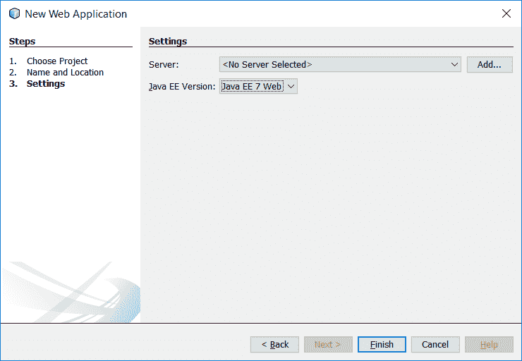
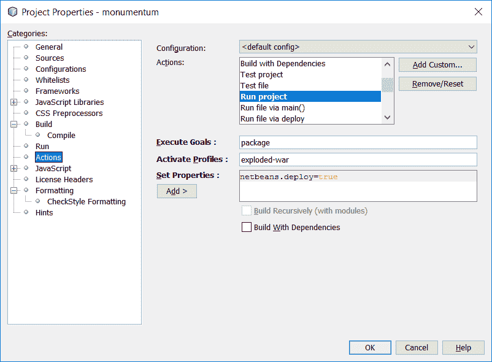
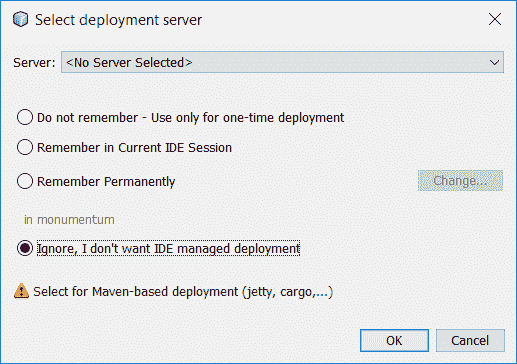

# 第九章：使用 Monumentum 做笔记

对于我们的第八个项目，我们将再次做一些新的事情--我们将构建一个 Web 应用程序。而我们所有其他的项目都是命令行、GUI 或两者的组合，这个项目将是一个单一模块，包括一个 REST API 和一个 JavaScript 前端，所有这些都是根据当前的微服务趋势构建的。

要构建这个应用程序，你将学习以下主题：

+   构建微服务应用程序的一些 Java 选项

+   Payara Micro 和`microprofile.io`

+   用于 RESTful Web 服务的 Java API

+   文档数据存储和 MongoDB

+   OAuth 身份验证（针对 Google，具体来说）

+   **JSON Web Tokens** (**JWT**)

正如你所看到的，从许多方面来看，这将是一个与我们到目前为止所看到的项目类型大不相同的项目。

# 入门

我们大多数人可能都使用过一些记事应用程序，比如 EverNote、OneNote 或 Google Keep。它们是一种非常方便的方式来记录笔记和想法，并且可以在几乎所有环境中使用--桌面、移动和网络。在本章中，我们将构建一个相当基本的这些行业巨头的克隆版本，以便练习一些概念。我们将称这个应用程序为 Monumentum，这是拉丁语，意思是提醒或纪念，这种类型的应用程序的一个合适的名字。

在我们深入讨论这些之前，让我们花点时间列出我们应用程序的需求：

+   能够创建笔记

+   能够列出笔记

+   能够编辑笔记

+   能够删除笔记

+   笔记正文必须能够存储/显示富文本

+   能够创建用户账户

+   必须能够使用 OAuth2 凭据登录到现有系统的应用程序

我们的非功能性需求相当温和：

+   必须有一个 RESTful API

+   必须有一个 HTML 5/JavaScript 前端

+   必须有一个灵活的、可扩展的数据存储

+   必须能够轻松部署在资源受限的系统上

当然，这个非功能性需求列表的选择部分是因为它们反映了现实世界的需求，但它们也为我们提供了一个很好的机会来讨论我想在本章中涵盖的一些技术。简而言之，我们将创建一个提供基于 REST 的 API 和 JavaScript 客户端的 Web 应用程序。它将由一个文档数据存储支持，并使用 JVM 可用的许多微服务库/框架之一构建。

那么这个堆栈是什么样的？在我们选择特定选择之前，让我们快速调查一下我们的选择。让我们从微服务框架开始。

# JVM 上的微服务框架

虽然我不愿意花太多时间来解释微服务是什么，因为大多数人对这个话题都很熟悉，但我认为至少应该简要描述一下，以防你不熟悉这个概念。话虽如此，这里有一个来自 SmartBear 的简洁的微服务定义，SmartBear 是一家软件质量工具提供商，也许最为人所知的是他们对 Swagger API 及相关库的管理：

基本上，微服务架构是一种开发软件应用程序的方法，它作为一套独立部署的、小型的、模块化的服务，每个服务运行一个独特的进程，并通过一个定义良好的、轻量级的机制进行通信，以实现业务目标。

换句话说，与将几个相关系统捆绑在一个 Web 应用程序中并部署到大型应用服务器（如 GlassFish/Payara 服务器、Wildfly、WebLogic 服务器或 WebSphere）的较老、更成熟的方法不同，这些系统中的每一个都将在自己的 JVM 进程中单独运行。这种方法的好处包括更容易的、分步的升级，通过进程隔离增加稳定性，更小的资源需求，更大的机器利用率等等。这个概念本身并不一定是新的，但它在近年来显然变得越来越受欢迎，并且以快速的速度不断增长。

那么在 JVM 上我们有哪些选择呢？我们有几个选择，包括但不限于以下内容：

+   Eclipse Vert.x：这是官方的*用于在 JVM 上构建反应式应用程序的工具包*。它提供了一个事件驱动的应用程序框架，非常适合编写微服务。Vert.x 可以在多种语言中使用，包括 Java、Javascript、Kotlin、Ceylon、Scala、Groovy 和 Ruby。更多信息可以在[`vertx.io/`](http://vertx.io/)找到。

+   Spring Boot：这是一个构建独立 Spring 应用程序的库。Spring Boot 应用程序可以完全访问整个 Spring 生态系统，并可以使用单个 fat/uber JAR 运行。Spring Boot 位于[`projects.spring.io/spring-boot/`](https://projects.spring.io/spring-boot/)。

+   Java EE MicroProfile：这是一个由社区和供应商主导的努力，旨在为 Java EE 创建一个新的配置文件，专门针对微服务。在撰写本文时，该配置文件包括**用于 RESTful Web 服务的 Java API**（**JAX-RS**），CDI 和 JSON-P，并得到了包括 Tomitribe、Payara、Red Hat、Hazelcast、IBM 和 Fujitsu 在内的多家公司以及伦敦 Java 社区和 SouJava 等用户组的赞助。MicroProfile 的主页是[`microprofile.io/`](http://microprofile.io/)。

+   Lagom：这是一个相当新的框架，是 Lightbend 公司（Scala 背后的公司）推出的反应式微服务框架。它被描述为一种有主见的微服务框架，并使用了 Lightbend 更著名的两个库--Akka 和 Play。Lagom 应用程序可以用 Java 或 Scala 编写。更多细节可以在[`www.lightbend.com/platform/development/lagom-framework`](https://www.lightbend.com/platform/development/lagom-framework)找到。

+   Dropwizard：这是一个用于开发运维友好、高性能、RESTful Web 服务的 Java 框架。它提供了 Jetty 用于 HTTP，Jersey 用于 REST 服务，以及 Jackson 用于 JSON。它还支持其他库，如 Guava、Hibernate Validator、Freemarker 等。您可以在[`www.dropwizard.io/`](http://www.dropwizard.io/)找到 Dropwizard。

还有一些其他选择，但很明显，作为 JVM 开发人员，我们有很多选择，这几乎总是好事。由于我们只能使用一个，我选择使用 MicroProfile。具体来说，我们将基于 Payara Micro 构建我们的应用程序，Payara Micro 是基于 GlassFish 源代码（加上 Payara 的错误修复、增强等）的实现。

通过选择 MicroProfile 和 Payara Micro，我们隐含地选择了 JAX-RS 作为我们 REST 服务的基础。当然，我们可以自由选择使用任何我们想要的东西，但偏离框架提供的内容会降低框架本身的价值。

这留下了我们选择数据存储的余地。我们已经看到的一个选择是关系数据库。这是一个经过验证的选择，支持行业的广泛范围。然而，它们并非没有局限性和问题。虽然数据库本身在分类和功能方面可能很复杂，但与关系数据库最流行的替代方案也许是 NoSQL 数据库。虽然这些数据库已经存在了半个世纪，但在过去的十年左右，随着**Web 2.0**的出现，这个想法才开始获得重要的市场份额。

虽然**NoSQL**这个术语非常广泛，但这类数据库的大多数示例往往是键值、文档或图形数据存储，每种都提供独特的性能和行为特征。对每种 NoSQL 数据库及其各种实现的全面介绍超出了本书的范围，因此为了节约时间和空间，我们将直接选择 MongoDB。它的可扩展性和灵活性，特别是在文档模式方面，与我们的目标用例非常契合。

最后，在客户端，我们再次有许多选项。最受欢迎的是来自 Facebook 的 ReactJS 和来自 Google 的 Angular。还有各种其他框架，包括较旧的选项，如 Knockout 和 Backbone，以及较新的选项，如 Vue.js。我们将使用后者。它不仅是一个非常强大和灵活的选项，而且在开始时也提供了最少的摩擦。由于本书侧重于 Java，我认为选择一个在满足我们需求的同时需要最少设置的选项是明智的。

# 创建应用程序

使用 Payara Micro，我们创建一个像平常一样的 Java web 应用程序。在 NetBeans 中，我们将选择文件|新项目|Maven|Web 应用程序，然后点击下一步。对于项目名称，输入`monumentum`，选择适当的项目位置，并根据需要修复 Group ID 和 Package：


接下来的窗口将要求我们选择服务器，我们可以留空，以及 Java EE 版本，我们要将其设置为 Java EE 7 Web：



过了一会儿，我们应该已经创建好并准备好去。由于我们创建了一个 Java EE 7 web 应用程序，NetBeans 已经将 Java EE API 依赖项添加到了项目中。在我们开始编码之前，让我们将 Payara Micro 添加到构建中，以准备好这部分。为了做到这一点，我们需要向构建中添加一个插件。它看起来会像这样（尽管我们只在这里展示了重点）：

```java
    <plugin>
      <groupId>org.codehaus.mojo</groupId>
      <artifactId>exec-maven-plugin</artifactId>
      <version>1.5.0</version>
      <dependencies>
        <dependency>
          <groupId>fish.payara.extras</groupId>
          <artifactId>payara-microprofile</artifactId>
          <version>1.0</version>
        </dependency>
      </dependencies>

```

这设置了 Maven exec 插件，用于执行外部应用程序或者，就像我们在这里做的一样，执行 Java 应用程序：

```java
    <executions>
      <execution>
        <id>payara-uber-jar</id>
        <phase>package</phase>
        <goals>
          <goal>java</goal>
        </goals>

```

在这里，我们将该插件的执行与 Maven 的打包阶段相关联。这意味着当我们运行 Maven 构建项目时，插件的 java 目标将在 Maven 开始打包项目时运行，从而允许我们精确地修改 JAR 中打包的内容：

```java
    <configuration>
      <mainClass>
        fish.payara.micro.PayaraMicro
      </mainClass>
      <arguments>
        <argument>--deploy</argument>
        <argument>
          ${basedir}/target/${warfile.name}.war
        </argument>
        <argument>--outputUberJar</argument>
        <argument>
          ${basedir}/target/${project.artifactId}.jar
        </argument>
      </arguments>
    </configuration>

```

这最后一部分配置了插件。它将运行`PayaraMicro`类，传递`--deploy <path> --outputUberJar ...`命令。实际上，我们正在告诉 Payara Micro 如何运行我们的应用程序，但是，而不是立即执行包，我们希望它创建一个超级 JAR，以便稍后运行应用程序。

通常，当您构建项目时，您会得到一个仅包含直接包含在项目中的类和资源的 jar 文件。任何外部依赖项都留作执行环境必须提供的内容。使用超级 JAR，我们的项目的 jar 中还包括所有依赖项，然后以这样的方式配置，以便执行环境可以根据需要找到它们。

设置的问题是，如果保持不变，当我们构建时，我们将得到一个超级 JAR，但我们将没有任何简单的方法从 NetBeans 运行应用程序。为了解决这个问题，我们需要稍微不同的插件配置。具体来说，它需要这些行：

```java
    <argument>--deploy</argument> 
    <argument> 
      ${basedir}/target/${project.artifactId}-${project.version} 
    </argument> 

```

这些替换了之前的`deploy`和`outputUberJar`选项。为了加快我们的构建速度，我们也不希望在我们要求之前创建超级 JAR，因此我们可以将这两个插件配置分成两个单独的配置文件，如下所示：

```java
    <profiles> 
      <profile> 
        <id>exploded-war</id> 
        <!-- ... --> 
      </profile> 
      <profile> 
        <id>uber</id> 
        <!-- ... --> 
      </profile> 
    </profiles> 

```

当我们准备构建部署工件时，我们在执行 Maven 时激活超级配置文件，然后我们将获得可执行的 jar：

```java
$ mvn -Puber install 

```

`exploded-war`配置文件是我们将从 IDE 中使用的配置文件，它运行 Payara Micro，并将其指向我们构建目录中的解压缩 war。为了指示 NetBeans 使用它，我们需要修改一些操作配置。为此，在 NetBeans 中右键单击项目，然后从上下文菜单的底部选择属性。在操作下，找到运行项目并选择它，然后在激活配置下输入`exploded-war`：



如果我们现在运行应用程序，NetBeans 会抱怨因为我们还没有选择服务器。虽然这是一个 Web 应用程序，通常需要服务器，但我们使用的是 Payara Micro，所以不需要定义应用服务器。幸运的是，NetBeans 会让我们告诉它，就像下面的截图所示：



选择忽略，我不想使用 IDE 管理部署，然后点击确定，然后观察输出窗口。你应该会看到大量的文本滚动过，几秒钟后，你应该会看到类似这样的文本：

```java
Apr 05, 2017 1:18:59 AM fish.payara.micro.PayaraMicro bootStrap 
INFO: Payara MicroProfile  4.1.1.164-SNAPSHOT (build ${build.number}) ready in 9496 (ms) 

```

一旦你看到这个，我们就准备测试我们的应用程序，就像现在这样。在你的浏览器中，打开`http://localhost:8080/monumentum-1.0-SNAPSHOT/index.html`，你应该会在页面上看到一个大而令人兴奋的*Hello World!*消息。如果你看到了这个，那么你已经成功地启动了一个 Payara Micro 项目。花点时间来祝贺自己，然后我们将使应用程序做一些有用的事情。

# 创建 REST 服务

这基本上是一个 Java EE 应用程序，尽管它打包和部署的方式有点不同，但你可能学到的关于编写 Java EE 应用程序的一切可能仍然适用。当然，你可能从未编写过这样的应用程序，所以我们将逐步介绍步骤。

在 Java EE 中，使用 JAX-RS 编写 REST 应用程序，我们的起点是`Application`。`Application`是一种与部署无关的方式，用于向运行时声明根级资源。运行时如何找到`Application`，当然取决于运行时本身。对于像我们这样的 MicroProfile 应用程序，我们将在 Servlet 3.0 环境中运行，因此我们无需做任何特殊的事情，因为 Servlet 3.0 支持无描述符的部署选项。运行时将扫描一个带有`@ApplicationPath`注解的`Application`类型的类，并使用它来配置 JAX-RS 应用程序，如下所示：

```java
    @ApplicationPath("/api") 
      public class Monumentum extends javax.ws.rs.core.Application { 
      @Override 
      public Set<Class<?>> getClasses() { 
        Set<Class<?>> s = new HashSet<>(); 
        return s; 
      } 
    } 

```

使用`@ApplicationPath`注解，我们指定了应用程序的 REST 端点的根 URL，当然，这是相对于 Web 应用程序的根上下文本身的。`Application`有三种我们可以重写的方法，但我们只对这里列出的一个感兴趣：`getClasses()`。我们很快会提供有关这个方法的更多细节，但是现在请记住，这是我们将向 JAX-RS 描述我们顶级资源的方式。

Monumentum 将有一个非常简单的 API，主要端点是与笔记交互。为了创建该端点，我们创建一个简单的 Java 类，并使用适当的 JAX-RS 注解标记它：

```java
    @Path("/notes") 
    @RequestScoped 
    @Produces(MediaType.APPLICATION_JSON)  
    public class NoteResource { 
    } 

```

通过这个类，我们描述了一个将位于`/api/notes`的端点，并将生成 JSON 结果。JAX-RS 支持例如 XML，但大多数 REST 开发人员习惯于 JSON，并且期望除此之外别无他物，因此我们无需支持除 JSON 之外的任何其他内容。当然，你的应用程序的需求可能会有所不同，所以你可以根据需要调整支持的媒体类型列表。

虽然这将编译并运行，JAX-RS 将尝试处理对我们端点的请求，但我们实际上还没有定义它。为了做到这一点，我们需要向我们的端点添加一些方法，这些方法将定义端点的输入和输出，以及我们将使用的 HTTP 动词/方法。让我们从笔记集合端点开始：

```java
    @GET 
    public Response getAll() { 
      List<Note> notes = new ArrayList<>(); 
      return Response.ok( 
        new GenericEntity<List<Note>>(notes) {}).build(); 
    } 

```

现在我们有一个端点，它在`/api/notes`处回答`GET`请求，并返回一个`Note`实例的`List`。在 REST 开发人员中，关于这类方法的正确返回有一些争论。有些人更喜欢返回客户端将看到的实际类型，例如我们的情况下的`List<Note>`，因为这样可以清楚地告诉开发人员阅读源代码或从中生成的文档。其他人更喜欢，就像我们在这里做的那样，返回一个 JAX-RS `Response`对象，因为这样可以更好地控制响应，包括 HTTP 头、状态码等。我倾向于更喜欢这种第二种方法，就像我们在这里做的那样。当然，你可以自由选择使用任何一种方法。

这里最后需要注意的一件事是我们构建响应体的方式：

```java
    new GenericEntity<List<Note>>(notes) {} 

```

通常，在运行时，由于类型擦除，List 的参数化类型会丢失。像这样使用`GenericEntity`允许我们捕获参数化类型，从而允许运行时对数据进行编组。使用这种方法可以避免编写自己的`MessageBodyWriter`。少写代码几乎总是一件好事。

如果我们现在运行我们的应用程序，我们将得到以下响应，尽管它非常无聊：

```java
$ curl http://localhost:8080/monumentum-1.0-SNAPSHOT/api/notes/
[] 

```

这既令人满意，也不令人满意，但它确实表明我们正在正确的轨道上。显然，我们希望该端点返回数据，但我们没有办法添加一个笔记，所以现在让我们来修复这个问题。

通过 REST 创建一个新的实体是通过将一个新的实体 POST 到它的集合中来实现的。该方法看起来像这样：

```java
    @POST 
    public Response createNote(Note note) { 
      Document doc = note.toDocument(); 
      collection.insertOne(doc); 
      final String id = doc.get("_id",  
        ObjectId.class).toHexString(); 

      return Response.created(uriInfo.getRequestUriBuilder() 
        .path(id).build()) 
      .build(); 
    } 

```

`@POST`注解表示使用 HTTP POST 动词。该方法接受一个`Note`实例，并返回一个`Response`，就像我们在前面的代码中看到的那样。请注意，我们不直接处理 JSON。通过在方法签名中指定`Note`，我们可以利用 JAX-RS 的一个很棒的特性--POJO 映射。我们已经在以前的代码中看到了`GenericEntity`的一点提示。JAX-RS 将尝试解组--也就是将序列化的形式转换为模型对象--JSON 请求体。如果客户端以正确的格式发送 JSON 对象，我们就会得到一个可用的`Note`实例。如果客户端发送了一个构建不当的对象，它会得到一个响应。这个特性使我们只需处理我们的领域对象，而不用担心 JSON 的编码和解码，这可以节省大量的时间和精力。

# 添加 MongoDB

在方法的主体中，我们第一次看到了与 MongoDB 的集成。为了使其编译通过，我们需要添加对 MongoDB Java Driver 的依赖：

```java
    <dependency> 
      <groupId>org.mongodb</groupId> 
      <artifactId>mongodb-driver</artifactId> 
      <version>3.4.2</version> 
    </dependency> 

```

MongoDB 处理文档，所以我们需要将我们的领域模型转换为`Document`，我们通过模型类上的一个方法来实现这一点。我们还没有看`Note`类的细节，所以现在让我们来看一下：

```java
    public class Note { 
      private String id; 
      private String userId; 
      private String title; 
      private String body; 
      private LocalDateTime created = LocalDateTime.now(); 
      private LocalDateTime modified = null; 

      // Getters, setters and some constructors not shown 

      public Note(final Document doc) { 
        final LocalDateTimeAdapter adapter =  
          new LocalDateTimeAdapter(); 
        userId = doc.getString("user_id"); 
        id = doc.get("_id", ObjectId.class).toHexString(); 
        title = doc.getString("title"); 
        body = doc.getString("body"); 
        created = adapter.unmarshal(doc.getString("created")); 
        modified = adapter.unmarshal(doc.getString("modified")); 
      } 

      public Document toDocument() { 
        final LocalDateTimeAdapter adapter =  
           new LocalDateTimeAdapter(); 
        Document doc = new Document(); 
        if (id != null) { 
           doc.append("_id", new ObjectId(getId())); 
        } 
        doc.append("user_id", getUserId()) 
         .append("title", getTitle()) 
         .append("body", getBody()) 
         .append("created",  
           adapter.marshal(getCreated() != null 
           ? getCreated() : LocalDateTime.now())) 
         .append("modified",  
           adapter.marshal(getModified())); 
         return doc; 
      } 
    } 

```

这基本上只是一个普通的 POJO。我们添加了一个构造函数和一个实例方法来处理与 MongoDB 的`Document`类型的转换。

这里有几件事情需要注意。第一点是 MongoDB `Document`的 ID 是如何处理的。存储在 MongoDB 数据库中的每个文档都会被分配一个`_id`。在 Java API 中，这个`_id`被表示为`ObjectId`。我们不希望在我们的领域模型中暴露这个细节，所以我们将它转换为`String`，然后再转换回来。

我们还需要对我们的日期字段进行一些特殊处理。我们选择将`created`和`modified`属性表示为`LocalDateTime`实例，因为新的日期/时间 API 优于旧的`java.util.Date`。不幸的是，MongoDB Java Driver 目前还不支持 Java 8，所以我们需要自己处理转换。我们将这些日期存储为字符串，并根据需要进行转换。这个转换是通过`LocalDateTimeAdapter`类处理的：

```java
    public class LocalDateTimeAdapter  
      extends XmlAdapter<String, LocalDateTime> { 
      private static final Pattern JS_DATE = Pattern.compile 
        ("\\d{4}-\\d{2}-\\d{2}T\\d{2}:\\d{2}:\\d{2}\\.\\d+Z"); 
      private static final DateTimeFormatter DEFAULT_FORMAT =  
        DateTimeFormatter.ISO_LOCAL_DATE_TIME; 
      private static final DateTimeFormatter JS_FORMAT =  
        DateTimeFormatter.ofPattern 
        ("yyyy-MM-dd'T'HH:mm:ss.SSS'Z'"); 

      @Override 
      public LocalDateTime unmarshal(String date) { 
        if (date == null) { 
          return null; 
        } 
        return LocalDateTime.parse(date,  
          (JS_DATE.matcher(date).matches()) 
          ? JS_FORMAT : DEFAULT_FORMAT); 
      } 

      @Override 
      public String marshal(LocalDateTime date) { 
        return date != null ? DEFAULT_FORMAT.format(date) : null; 
      } 
    } 

```

这可能比您预期的要复杂一些，这是因为它做的事情比我们到目前为止讨论的要多。我们现在正在研究的用法，即来自我们的模型类，不是这个类的主要目的，但我们稍后会讨论到这一点。除此之外，这个类的行为非常简单--接受一个`String`，确定它表示的是两种支持的格式中的哪一种，并将其转换为`LocalDateTime`。它也可以反过来。

这个类的主要目的是供 JAX-RS 使用。当我们通过网络传递`Note`实例时，`LocalDateTime`也需要被解组，我们可以通过`XmlAdapter`告诉 JAX-RS 如何做到这一点。

定义了这个类之后，我们需要告诉 JAX-RS 关于它。我们可以用几种不同的方式来做到这一点。我们可以在我们的模型中的每个属性上使用注释，就像这样：

```java
    @XmlJavaTypeAdapter(value = LocalDateTimeAdapter.class) 
    private LocalDateTime created = LocalDateTime.now(); 

```

虽然这样可以工作，但作为这类事情而言，这是一个相当大的注释，并且您必须将其放在每个`LocalDateTime`属性上。如果您有几个具有此类型字段的模型，您将不得不触及每个属性。幸运的是，有一种方法可以将类型与适配器关联一次。我们可以在一个特殊的 Java 文件`package-info.java`中做到这一点。大多数人从未听说过这个文件，甚至更少的人使用它，但它只是一个用于包级别文档和注释的地方。我们感兴趣的是后一种用法。在我们的模型类的包中，创建`package-info.java`并将其放入其中：

```java
    @XmlJavaTypeAdapters({ 
      @XmlJavaTypeAdapter(type = LocalDateTime.class,  
        value = LocalDateTimeAdapter.class) 
    }) 
    package com.steeplesoft.monumentum.model; 

```

我们在前面的代码中看到了与之前相同的注释，但它包裹在`@XmlJavaTypeAdapters`中。JVM 只允许在元素上注释给定类型，因此这个包装器允许我们绕过这个限制。我们还需要在`@XmlJavaTypeAdapter`注释上指定类型参数，因为它不再在目标属性上。有了这个设置，每个`LocalDateTime`属性都将被正确处理，而无需任何额外的工作。

这是一个相当复杂的设置，但我们还不太准备好。我们已经在 REST 端设置好了一切。现在我们需要将 MongoDB 类放在适当的位置。要连接到 MongoDB 实例，我们从`MongoClient`开始。然后，我们从`MongoClient`获取对`MongoDatabase`的引用，然后获取`MongoCollection`：

```java
    private MongoCollection<Document> collection; 
    private MongoClient mongoClient; 
    private MongoDatabase database; 

    @PostConstruct 
    public void postConstruct() { 
      String host = System.getProperty("mongo.host", "localhost"); 
      String port = System.getProperty("mongo.port", "27017"); 
      mongoClient = new MongoClient(host, Integer.parseInt(port)); 
      database = mongoClient.getDatabase("monumentum"); 
      collection = database.getCollection("note"); 
    } 

```

`@PostConstruct`方法在构造函数运行后在 bean 上运行。在这个方法中，我们初始化我们各种 MongoDB 类并将它们存储在实例变量中。有了这些准备好的类，我们可以重新访问，例如`getAll()`：

```java
    @GET 
    public Response getAll() { 
      List<Note> notes = new ArrayList<>(); 
      try (MongoCursor<Document> cursor = collection.find() 
      .iterator()) { 
        while (cursor.hasNext()) { 
          notes.add(new Note(cursor.next())); 
        } 
      } 

      return Response.ok( 
        new GenericEntity<List<Note>>(notes) {}) 
      .build(); 
    } 

```

现在我们可以查询数据库中的笔记，并且通过前面代码中`createNote()`的实现，我们可以创建以下笔记：

```java
$ curl -v -H "Content-Type: application/json" -X POST -d '{"title":"Command line note", "body":"A note from the command line"}' http://localhost:8080/monumentum-1.0-SNAPSHOT/api/notes/ 
*   Trying ::1... 
* TCP_NODELAY set 
* Connected to localhost (::1) port 8080 (#0) 
> POST /monumentum-1.0-SNAPSHOT/api/notes/ HTTP/1.1 
... 
< HTTP/1.1 201 Created 
... 
$ curl http://localhost:8080/monumentum-1.0-SNAPSHOT/api/notes/ | jq . 
[ 
  { 
    "id": "58e5d0d79ccd032344f66c37", 
    "userId": null, 
    "title": "Command line note", 
    "body": "A note from the command line", 
    "created": "2017-04-06T00:23:34.87", 
    "modified": null 
  } 
] 

```

为了使这在您的机器上运行，您需要一个正在运行的 MongoDB 实例。您可以在 MongoDB 网站上下载适合您操作系统的安装程序，并找到安装说明（[`docs.mongodb.com/manual/installation/`](https://docs.mongodb.com/manual/installation/)）。

在我们继续处理其他资源方法之前，让我们最后再看一下我们的 MongoDB API 实例。虽然像我们这样实例化实例是有效的，但它也给资源本身带来了相当多的工作。理想情况下，我们应该能够将这些问题移到其他地方并注入这些实例。希望这对你来说听起来很熟悉，因为这正是**依赖注入**（**DI**）或**控制反转**（**IoC**）框架被创建来解决的类型问题。

# 使用 CDI 进行依赖注入

Java EE 提供了诸如 CDI 之类的框架。有了 CDI，我们可以使用编译时类型安全将任何容器控制的对象注入到另一个对象中。然而，问题在于所涉及的对象需要由容器控制，而我们的 MongoDB API 对象不是。幸运的是，CDI 提供了一种方法，容器可以通过生产者方法创建这些实例。这会是什么样子呢？让我们从注入点开始，因为这是最简单的部分：

```java
    @Inject 
    @Collection("notes") 
    private MongoCollection<Document> collection; 

```

当 CDI 容器看到`@Inject`时，它会检查注解所在的元素来确定类型。然后它将尝试查找一个实例来满足注入请求。如果有多个实例，注入通常会失败。尽管如此，我们已经使用了一个限定符注解来帮助 CDI 确定要注入什么。该注解定义如下：

```java
    @Qualifier  
    @Retention(RetentionPolicy.RUNTIME)  
    @Target({ElementType.METHOD, ElementType.FIELD,  
      ElementType.PARAMETER, ElementType.TYPE})   
    public @interface Collection { 
      @Nonbinding String value() default "unknown";   
    } 

```

通过这个注解，我们可以向容器传递提示，帮助它选择一个实例进行注入。正如我们已经提到的，`MongoCollection`不是容器管理的，所以我们需要修复它，我们通过以下生产者方法来实现：

```java
    @RequestScoped 
    public class Producers { 
      @Produces 
      @Collection 
      public MongoCollection<Document>  
        getCollection(InjectionPoint injectionPoint) { 
          Collection mc = injectionPoint.getAnnotated() 
          .getAnnotation(Collection.class); 
        return getDatabase().getCollection(mc.value()); 
      } 
    } 

```

`@Produces`方法告诉 CDI，这个方法将产生容器需要的实例。CDI 从方法签名确定可注入实例的类型。我们还在方法上放置了限定符注解，作为运行时的额外提示，因为它试图解析我们的注入请求。

在方法本身中，我们将`InjectionPoint`添加到方法签名中。当 CDI 调用这个方法时，它将提供这个类的一个实例，我们可以从中获取有关每个特定注入点的信息，因为它们被处理。从`InjectionPoint`中，我们可以获取`Collection`实例，从中可以获取我们感兴趣的 MongoDB 集合的名称。现在我们准备获取我们之前看到的`MongoCollection`实例。`MongoClient`和`MongoDatabase`的实例化在类内部处理，与我们之前的用法没有显著变化。

CDI 有一个小的设置步骤。为了避免 CDI 容器进行潜在昂贵的类路径扫描，我们需要告诉系统我们希望打开 CDI，所以要说。为此，我们需要一个`beans.xml`文件，它可以是充满 CDI 配置元素的，也可以是完全空的，这就是我们要做的。对于 Java EE Web 应用程序，`beans.xml`需要在`WEB-INF`目录中，所以我们在`src/main/webapp/WEB-INF`中创建文件。

确保文件真的是空的。如果有空行，Weld，Payara 的 CDI 实现，将尝试解析文件，给你一个 XML 解析错误。

# 完成笔记资源

在我们可以从`Note`资源中继续之前，我们需要完成一些操作，即读取、更新和删除。读取单个笔记非常简单：

```java
    @GET 
    @Path("{id}") 
    public Response getNote(@PathParam("id") String id) { 
      Document doc = collection.find(buildQueryById(id)).first(); 
      if (doc == null) { 
        return Response.status(Response.Status.NOT_FOUND).build(); 
      } else { 
        return Response.ok(new Note(doc)).build(); 
      } 
    } 

```

我们已经指定了 HTTP 动词`GET`，但是在这个方法上我们有一个额外的注解`@Path`。使用这个注解，我们告诉 JAX-RS 这个端点有额外的路径段，请求需要匹配。在这种情况下，我们指定了一个额外的段，但我们用花括号括起来。没有这些括号，匹配将是一个字面匹配，也就是说，“这个 URL 末尾有字符串'id'吗？”但是，有了括号，我们告诉 JAX-RS 我们想要匹配额外的段，但它的内容可以是任何东西，我们想要捕获这个值，并给它一个名字`id`。在我们的方法签名中，我们指示 JAX-RS 通过`@PathParam`注解注入这个值，让我们可以在方法中访问用户指定的`Note` ID。

要从 MongoDB 中检索笔记，我们将第一次真正看到如何查询 MongoDB：

```java
    Document doc = collection.find(buildQueryById(id)).first(); 

```

简而言之，将`BasicDBObject`传递给`collection`上的`find()`方法，它返回一个`FindIterable<?>`对象，我们调用`first()`来获取应该返回的唯一元素（当然，假设有一个）。这里有趣的部分隐藏在`buildQueryById()`中：

```java
    private BasicDBObject buildQueryById(String id) { 
      BasicDBObject query =  
        new BasicDBObject("_id", new ObjectId(id)); 
      return query; 
    } 

```

我们使用`BasicDBObject`定义查询过滤器，我们用键和值初始化它。在这种情况下，我们想要按文档中的`_id`字段进行过滤，所以我们将其用作键，但请注意，我们传递的是`ObjectId`作为值，而不仅仅是`String`。如果我们想要按更多字段进行过滤，我们将在`BasicDBObject`变量中追加更多的键/值对，我们稍后会看到。

一旦我们查询了集合并获得了用户请求的文档，我们就使用`Note`上的辅助方法将其从`Document`转换为`Note`，并以状态码 200 或`OK`返回它。

在数据库中更新文档有点复杂，但并不过分复杂，就像你在这里看到的一样：

```java
    @PUT 
    @Path("{id}") 
    public Response updateNote(Note note) { 
      note.setModified(LocalDateTime.now()); 
      UpdateResult result =  
        collection.updateOne(buildQueryById(note.getId()), 
        new Document("$set", note.toDocument())); 
      if (result.getModifiedCount() == 0) { 
        return Response.status(Response.Status.NOT_FOUND).build(); 
      } else { 
        return Response.ok().build(); 
      } 
    } 

```

要注意的第一件事是 HTTP 方法--`PUT`。关于更新使用什么动词存在一些争论。一些人，比如 Dropbox 和 Facebook，说`POST`，而另一些人，比如 Google（取决于你查看的 API），说`PUT`。我认为选择在很大程度上取决于你。只要在你的选择上保持一致即可。我们将完全用客户端传递的内容替换服务器上的实体，因此该操作是幂等的。通过选择`PUT`，我们可以向客户端传达这一事实，使 API 对客户端更加自我描述。

在方法内部，我们首先设置修改日期以反映操作。接下来，我们调用`Collection.updateOne()`来修改文档。语法有点奇怪，但这里发生了什么--我们正在查询集合以获取我们想要修改的笔记，然后告诉 MongoDB 用我们提供的新文档替换加载的文档。最后，我们查询`UpdateResult`来查看有多少文档被更新。如果没有，那么请求的文档不存在，所以我们返回`NOT_FOUND`（`404`）。如果不为零，我们返回`OK`（`200`）。

最后，我们的删除方法如下：

```java
    @DELETE 
    @Path("{id}") 
    public Response deleteNote(@PathParam("id") String id) { 
      collection.deleteOne(buildQueryById(id)); 
      return Response.ok().build(); 
    } 

```

我们告诉 MongoDB 使用我们之前看到的相同查询过滤器来过滤集合，然后删除一个文档，这应该是它找到的所有内容，当然，鉴于我们的过滤器，但`deleteOne()`是一个明智的保障措施。我们可以像在`updateNote()`中做的那样进行检查，看看是否实际上删除了某些东西，但这没有多大意义--无论文档在请求开始时是否存在，最终都不在那里，这是我们的目标，所以从返回错误响应中获得的收益很少。

现在我们可以创建、读取、更新和删除笔记，但是你们中的敏锐者可能已经注意到，任何人都可以阅读系统中的每一条笔记。对于多用户系统来说，这不是一件好事，所以让我们来解决这个问题。

# 添加身份验证

身份验证系统很容易变得非常复杂。从自制系统，包括自定义用户管理屏幕，到复杂的单点登录解决方案，我们有很多选择。其中一个更受欢迎的选择是 OAuth2，有许多选项。对于 Monumentum，我们将使用 Google 进行登录。为此，我们需要在 Google 的开发者控制台中创建一个应用程序，该控制台位于[`console.developers.google.com`](https://console.developers.google.com)。

一旦您登录，点击页面顶部的项目下拉菜单，然后点击“创建项目”，这样应该会给您呈现这个屏幕：


提供项目名称，为下面两个问题做出选择，然后点击“创建”。项目创建后，您应该会被重定向到库页面。点击左侧的凭据链接，然后点击“创建凭据”并选择 OAuth 客户端 ID。如果需要，按照指示填写 OAuth 同意屏幕。选择 Web 应用程序作为应用程序类型，输入名称，并按照此屏幕截图中显示的授权重定向 URI。


在将其移至生产环境之前，我们需要在此屏幕上添加生产 URI，但是这个配置在开发中也可以正常工作。当您点击保存时，您将看到您的新客户端 ID 和客户端密钥。记下这些：


有了这些数据（请注意，这些不是我的实际 ID 和密钥，所以您需要生成自己的），我们就可以开始处理我们的身份验证资源了。我们将首先定义资源如下：

```java
    @Path("auth") 
    public class AuthenticationResource { 

```

我们需要在我们的“应用程序”中注册这个，如下所示：

```java
    @ApplicationPath("/api") 
    public class Monumentum extends javax.ws.rs.core.Application { 
      @Override 
      public Set<Class<?>> getClasses() { 
        Set<Class<?>> s = new HashSet<>(); 
        s.add(NoteResource.class); 
        s.add(AuthenticationResource.class); 
        return s; 
      } 
    } 

```

与 Google OAuth 提供程序一起工作，我们需要声明一些实例变量并实例化一些 Google API 类：

```java
    private final String clientId; 
    private final String clientSecret; 
    private final GoogleAuthorizationCodeFlow flow; 
    private final HttpTransport HTTP_TRANSPORT =  
      new NetHttpTransport(); 
    private static final String USER_INFO_URL =  
      "https://www.googleapis.com/oauth2/v1/userinfo"; 
    private static final List<String> SCOPES = Arrays.asList( 
      "https://www.googleapis.com/auth/userinfo.profile", 
      "https://www.googleapis.com/auth/userinfo.email"); 

```

变量`clientId`和`clientSecret`将保存 Google 刚刚给我们的值。另外两个类对我们即将进行的流程是必需的，`SCOPES`保存了我们想要从 Google 获取的权限，即访问用户的个人资料和电子邮件。类构造函数完成了这些项目的设置：

```java
    public AuthenticationResource() { 
      clientId = System.getProperty("client_id"); 
      clientSecret = System.getProperty("client_secret"); 
      flow = new GoogleAuthorizationCodeFlow.Builder(HTTP_TRANSPORT, 
        new JacksonFactory(), clientId, clientSecret, 
        SCOPES).build(); 
    } 

```

认证流程的第一部分是创建一个认证 URL，就像这样：

```java
    @Context 
    private UriInfo uriInfo; 
    @GET 
    @Path("url") 
    public String getAuthorizationUrl() { 
      return flow.newAuthorizationUrl() 
      .setRedirectUri(getCallbackUri()).build(); 
    } 
    private String getCallbackUri()  
      throws UriBuilderException, IllegalArgumentException { 
      return uriInfo.getBaseUriBuilder().path("auth") 
        .path("callback").build() 
        .toASCIIString(); 
    } 

```

使用 JAX-RS 类`UriInfo`，我们创建一个指向我们应用程序中另一个端点`/api/auth/callback`的`URI`。然后将其传递给`GoogleAuthorizationCodeFlow`以完成构建我们的登录 URL。当用户点击链接时，浏览器将被重定向到 Google 的登录对话框。成功认证后，用户将被重定向到我们的回调 URL，由此方法处理：

```java
    @GET 
    @Path("callback") 
    public Response handleCallback(@QueryParam("code")  
    @NotNull String code) throws IOException { 
      User user = getUserInfoJson(code); 
      saveUserInformation(user); 
      final String jwt = createToken(user.getEmail()); 
      return Response.seeOther( 
        uriInfo.getBaseUriBuilder() 
        .path("../loginsuccess.html") 
        .queryParam("Bearer", jwt) 
        .build()) 
      .build(); 
    } 

```

当 Google 重定向到我们的`callback`端点时，它将提供一个代码，我们可以使用它来完成认证。我们在`getUserInfoJson()`方法中这样做：

```java
    private User getUserInfoJson(final String authCode)  
    throws IOException { 
      try { 
        final GoogleTokenResponse response =  
          flow.newTokenRequest(authCode) 
          .setRedirectUri(getCallbackUri()) 
          .execute(); 
        final Credential credential =  
          flow.createAndStoreCredential(response, null); 
        final HttpRequest request =  
          HTTP_TRANSPORT.createRequestFactory(credential) 
          .buildGetRequest(new GenericUrl(USER_INFO_URL)); 
        request.getHeaders().setContentType("application/json"); 
        final JSONObject identity =  
          new JSONObject(request.execute().parseAsString()); 
        return new User( 
          identity.getString("id"), 
          identity.getString("email"), 
          identity.getString("name"), 
          identity.getString("picture")); 
      } catch (JSONException ex) { 
        Logger.getLogger(AuthenticationResource.class.getName()) 
        .log(Level.SEVERE, null, ex); 
        return null; 
      } 
    } 

```

使用我们刚从 Google 获取的认证代码，我们向 Google 发送另一个请求，这次是为了获取用户信息。当请求返回时，我们获取响应主体中的 JSON 对象并用它构建一个`User`对象，然后将其返回。

回到我们的 REST 端点方法，如果需要，我们调用此方法将用户保存到数据库中：

```java
    private void saveUserInformation(User user) { 
      Document doc = collection.find( 
        new BasicDBObject("email", user.getEmail())).first(); 
      if (doc == null) { 
        collection.insertOne(user.toDocument()); 
      } 
    } 

```

一旦我们从 Google 获取了用户的信息，我们就不再需要代码，因为我们不需要与任何其他 Google 资源进行交互，所以我们不会将其持久化。

最后，我们想要向客户端返回一些东西 --某种令牌 --用于证明客户端的身份。为此，我们将使用一种称为 JSON Web Token（JWT）的技术。JWT 是*用于创建断言某些声明的访问令牌的基于 JSON 的开放标准（RFC 7519）*。我们将使用用户的电子邮件地址创建一个 JWT。我们将使用服务器专用的密钥对其进行签名，因此我们可以安全地将其传递给客户端，客户端将在每个请求中将其传递回来。由于它必须使用服务器密钥进行加密/签名，不可信任的客户端将无法成功地更改或伪造令牌。

要创建 JWT，我们需要将库添加到我们的项目中，如下所示：

```java
    <dependency> 
      <groupId>io.jsonwebtoken</groupId> 
      <artifactId>jjwt</artifactId> 
      <version>0.7.0</version> 
    </dependency> 

```

然后我们可以编写这个方法：

```java
    @Inject 
    private KeyGenerator keyGenerator; 
    private String createToken(String login) { 
      String jwtToken = Jwts.builder() 
      .setSubject(login) 
      .setIssuer(uriInfo.getAbsolutePath().toString()) 
      .setIssuedAt(new Date()) 
      .setExpiration(Date.from( 
        LocalDateTime.now().plusHours(12L) 
      .atZone(ZoneId.systemDefault()).toInstant())) 
      .signWith(SignatureAlgorithm.HS512,  
        keyGenerator.getKey()) 
      .compact(); 
      return jwtToken; 
    } 

```

令牌的主题是电子邮件地址，我们的 API 基地址是发行者，到期日期和时间是未来 12 小时，令牌由我们使用新类`KeyGenerator`生成的密钥签名。当我们调用`compact()`时，将生成一个 URL 安全的字符串，我们将其返回给调用者。我们可以使用[`jwt.io`](http://jwt.io/)上的 JWT 调试器查看令牌的内部情况：


显然，令牌中的声明是可读的，所以不要在其中存储任何敏感信息。使其安全的是在签署令牌时使用秘钥，理论上使其不可能在不被检测到的情况下更改其内容。

用于给我们提供签名密钥的`KeyGenerator`类如下所示：

```java
    @Singleton 
    public class KeyGenerator { 
      private Key key; 

      public Key getKey() { 
        if (key == null) { 
          String keyString = System.getProperty("signing.key",  
            "replace for production"); 
          key = new SecretKeySpec(keyString.getBytes(), 0,  
            keyString.getBytes().length, "DES"); 
        } 

        return key; 
      } 
    } 

```

该类使用`@Singleton`进行注释，因此容器保证该 bean 在系统中只存在一个实例。`getKey()`方法将使用系统属性`signing.key`作为密钥，允许用户在启动系统时指定唯一的秘钥。当然，完全随机的密钥更安全，但这会增加一些复杂性，如果我们尝试将该系统水平扩展。我们需要所有实例使用相同的签名密钥，以便无论客户端被定向到哪个服务器，JWT 都可以被验证。在这种情况下，数据网格解决方案，如 Hazelcast，将是这些情况下的合适工具。就目前而言，这对我们的需求已经足够了。

我们的身份验证资源现在已经完成，但我们的系统实际上还没有被保护。为了做到这一点，我们需要告诉 JAX-RS 如何对请求进行身份验证，我们将使用一个新的注解和`ContainerRequestFilter`来实现这一点。

如果我们安装一个没有额外信息的请求过滤器，它将应用于每个资源，包括我们的身份验证资源。这意味着我们必须进行身份验证才能进行身份验证。显然这是没有意义的，所以我们需要一种方法来区分请求，以便只有对某些资源的请求才应用这个过滤器，这意味着一个新的注解：

```java
    @NameBinding 
    @Retention(RetentionPolicy.RUNTIME) 
    @Target({ElementType.TYPE, ElementType.METHOD}) 
    public @interface Secure { 
    } 

```

我们已经定义了一个语义上有意义的注解。`@NameBinding`注解告诉 JAX-RS 只将注解应用于特定的资源，这些资源是按名称绑定的（与在运行时动态绑定相对）。有了定义的注解，我们需要定义另一方面的东西，即请求过滤器：

```java
    @Provider 
    @Secure 
    @Priority(Priorities.AUTHENTICATION) 
    public class SecureFilter implements ContainerRequestFilter { 
      @Inject 
      private KeyGenerator keyGenerator; 

      @Override 
      public void filter(ContainerRequestContext requestContext)  
       throws IOException { 
        try { 
          String authorizationHeader = requestContext 
          .getHeaderString(HttpHeaders.AUTHORIZATION); 
          String token = authorizationHeader 
          .substring("Bearer".length()).trim(); 
          Jwts.parser() 
          .setSigningKey(keyGenerator.getKey()) 
          .parseClaimsJws(token); 
        } catch (Exception e) { 
          requestContext.abortWith(Response.status 
          (Response.Status.UNAUTHORIZED).build()); 
        } 
      } 
    } 

```

我们首先定义一个实现`ContainerRequestFilter`接口的类。我们必须用`@Provider`对其进行注释，以便 JAX-RS 能够识别和加载该类。我们应用`@Secure`注解来将过滤器与注解关联起来。我们将在一会儿将其应用于资源。最后，我们应用`@Priority`注解来指示系统该过滤器应该在请求周期中较早地应用。

在过滤器内部，我们注入了之前看过的相同的`KeyGenerator`。由于这是一个单例，我们可以确保在这里使用的密钥和身份验证方法中使用的密钥是相同的。接口上唯一的方法是`filter()`，在这个方法中，我们从请求中获取 Authorization 头，提取 Bearer 令牌（即 JWT），并使用 JWT API 对其进行验证。如果我们可以解码和验证令牌，那么我们就知道用户已经成功对系统进行了身份验证。为了告诉系统这个新的过滤器，我们需要修改我们的 JAX-RS`Application`如下：

```java
    @ApplicationPath("/api") 
    public class Monumentum extends javax.ws.rs.core.Application { 
      @Override 
      public Set<Class<?>> getClasses() { 
        Set<Class<?>> s = new HashSet<>(); 
        s.add(NoteResource.class); 
        s.add(AuthenticationResource.class); 
        s.add(SecureFilter.class); 
        return s; 
      } 
    } 

```

系统现在知道了过滤器，但在它执行任何操作之前，我们需要将其应用到我们想要保护的资源上。我们通过在适当的资源上应用`@Secure`注解来实现这一点。它可以应用在类级别，这意味着类中的每个端点都将被保护，或者在资源方法级别应用，这意味着只有那些特定的端点将被保护。在我们的情况下，我们希望每个`Note`端点都受到保护，所以在类上放置以下注解：

```java
    @Path("/notes") 
    @RequestScoped 
    @Produces(MediaType.APPLICATION_JSON) 
    @Secure 
    public class NoteResource { 

```

只需再做几个步骤，我们的应用程序就会得到保护。我们需要对`NoteResource`进行一些修改，以便它知道谁已登录，并且便笺与经过身份验证的用户相关联。我们将首先注入`User`：

```java
    @Inject 
    private User user; 

```

显然这不是一个容器管理的类，所以我们需要编写另一个`Producer`方法。在那里有一点工作要做，所以我们将其封装在自己的类中：

```java
    @RequestScoped 
    public class UserProducer { 
      @Inject 
      private KeyGenerator keyGenerator; 
      @Inject 
      HttpServletRequest req; 
      @Inject 
      @Collection("users") 
      private MongoCollection<Document> users; 

```

我们将其定义为一个请求范围的 CDI bean，并注入我们的`KeyGenerator`、`HttpServletRequest`和我们的用户集合。实际的工作是在`Producer`方法中完成的：

```java
    @Produces 
    public User getUser() { 
      String authHeader = req.getHeader(HttpHeaders.AUTHORIZATION); 
      if (authHeader != null && authHeader.contains("Bearer")) { 
        String token = authHeader 
        .substring("Bearer".length()).trim(); 
        Jws<Claims> parseClaimsJws = Jwts.parser() 
        .setSigningKey(keyGenerator.getKey()) 
        .parseClaimsJws(token); 
        return getUser(parseClaimsJws.getBody().getSubject()); 
      } else { 
        return null; 
      }  
    } 

```

使用 Servlet 请求，我们检索`AUTHORIZATION`头。如果存在并包含`Bearer`字符串，我们可以处理令牌。如果条件不成立，我们返回 null。要处理令牌，我们从头中提取令牌值，然后让`Jwts`为我们解析声明，返回一个`Jws<Claims>`类型的对象。我们在`getUser()`方法中构建用户如下：

```java
    private User getUser(String email) { 
      Document doc = users.find( 
        new BasicDBObject("email", email)).first(); 
      if (doc != null) { 
        return new User(doc); 
      } else { 
        return null; 
      } 
    } 

```

通过解析声明，我们可以提取主题并用它来查询我们的`Users`集合，如果找到则返回`User`，如果找不到则返回`null`。

回到我们的`NoteResource`，我们需要修改我们的资源方法以使其“用户感知”：

```java
    public Response getAll() { 
      List<Note> notes = new ArrayList<>(); 
      try (MongoCursor<Document> cursor =  
        collection.find(new BasicDBObject("user_id",  
        user.getId())).iterator()) { 
      // ... 
      @POST 
      public Response createNote(Note note) { 
        Document doc = note.toDocument(); 
        doc.append("user_id", user.getId()); 
        // ... 
      @PUT 
      @Path("{id}") 
      public Response updateNote(Note note) { 
        note.setModified(LocalDateTime.now()); 
        note.setUser(user.getId()); 
        // ... 
      private BasicDBObject buildQueryById(String id) { 
        BasicDBObject query =  
        new BasicDBObject("_id", new ObjectId(id)) 
         .append("user_id", user.getId()); 
        return query; 
    } 

```

我们现在有一个完整和安全的 REST API。除了像 curl 这样的命令行工具，我们没有任何好的方法来使用它，所以让我们构建一个用户界面。

# 构建用户界面

对于用户界面，我们有许多选择。在本书中，我们已经看过 JavaFX 和 NetBeans RCP。虽然它们是很好的选择，但对于这个应用程序，我们将做一些不同的事情，构建一个基于 Web 的界面。即使在这里，我们也有很多选择：JSF、Spring MVC、Google Web Toolkit、Vaadin 等等。在现实世界的应用程序中，虽然我们可能有一个 Java 后端，但我们可能有一个 JavaScript 前端，所以我们将在这里这样做，这也是你的选择可能变得非常令人眼花缭乱的地方。

在撰写本书时，市场上最大的两个竞争者是 Facebook 的 React 和 Google 的 Angular。还有一些较小的竞争者，如 React API 兼容的 Preact、VueJS、Backbone、Ember 等等。你的选择将对应用程序产生重大影响，从架构到更加平凡的事情，比如构建项目本身，或者你可以让架构驱动框架，如果有对特定架构的迫切需求。与往常一样，你的特定环境会有所不同，应该比书本或在线阅读的内容更多地驱动决策。

由于这是一本 Java 书，我希望避免过多地涉及 JavaScript 构建系统和替代**JavaScript VM**语言、转译等细节，因此我选择使用 Vue，因为它是一个快速、现代且流行的框架，满足我们的需求，但仍然允许我们构建一个简单的系统，而不需要复杂的构建配置。如果你有其他框架的经验或偏好，使用你选择的框架构建一个类似的系统应该是相当简单的。

请注意，我*不是*一个 JavaScript 开发者。本章中我们将构建的应用程序不应被视为最佳实践的示例。它只是一个尝试构建一个可用的，尽管简单的 JavaScript 前端，以演示一个完整的堆栈应用程序。请查阅 Vue 或您选择的框架的文档，了解如何使用该工具构建成语言应用程序的详细信息。

让我们从索引页面开始。在 NetBeans 的项目资源管理器窗口中，展开其他资源节点，在 webapp 节点上右键单击，选择新建|空文件，将其命名为`index.html`。在文件中，我们目前所需的最低限度是以下内容：

```java
    <!DOCTYPE html> 
      <html> 
        <head> 
          <title>Monumentum</title> 
          <meta charset="UTF-8"> 
          <link rel="stylesheet" href="monumentum.css"> 
          <script src="img/vue"></script> 
        </head> 
        <body> 
          <div id="app"> 
            {{ message }} 
          </div> 
          <script type="text/javascript" src="img/index.js"></script> 
        </body> 
      </html> 

```

目前这将显示一个空白页面，但它确实导入了 Vue 的源代码，以及我们需要创建的客户端应用程序`index.js`的 JavaScript 代码：

```java
    var vm = new Vue({ 
      el: '#app', 
      data: { 
        message : 'Hello, World!' 
      } 
    }); 

```

如果我们部署这些更改（提示：如果应用程序已经在运行，只需按下*F11*告诉 NetBeans 进行构建；这不会使任何 Java 更改生效，但它会将这些静态资源复制到输出目录），并在浏览器中刷新页面，我们现在应该在页面上看到*Hello, World!*。

大致上，正在发生的是我们正在创建一个新的`Vue`对象，将其锚定到具有`app` ID 的(`el`)元素。我们还为这个组件(`data`)定义了一些状态，其中包括单个属性`message`。在页面上，我们可以使用 Mustache 语法访问组件的状态，就像我们在索引页面中看到的那样--`{{ message }}`。让我们扩展一下我们的组件：

```java
    var vm = new Vue({ 
      el: '#app', 
      store, 
      computed: { 
        isLoggedIn() { 
          return this.$store.state.loggedIn; 
        } 
      }, 
      created: function () { 
        NotesActions.fetchNotes(); 
      } 
    }); 

```

我们在这里添加了三个项目：

+   我们引入了一个名为`store`的全局数据存储

+   我们添加了一个名为`isLoggedIn`的新属性，它的值来自一个方法调用

+   我们添加了一个生命周期方法`created`，它将在页面上创建组件时从服务器加载`Note`

我们的数据存储是基于 Vuex 的，它是一个用于`Vue.js`应用程序的状态管理模式和库。它作为应用程序中所有组件的集中存储，通过规则确保状态只能以可预测的方式进行变化。([`vuex.vuejs.org`](https://vuex.vuejs.org/))。要将其添加到我们的应用程序中，我们需要在我们的页面中添加以下代码行：

```java
    <script src="img/vuex"></script>

```

然后我们向我们的组件添加了一个名为`store`的字段，您可以在前面的代码中看到。到目前为止，大部分工作都是在`NotesActions`对象中进行的：

```java
    var NotesActions = { 
      buildAuthHeader: function () { 
        return new Headers({ 
          'Content-Type': 'application/json', 
          'Authorization': 'Bearer ' +    
          NotesActions.getCookie('Bearer') 
        }); 
      }, 
      fetchNotes: function () { 
        fetch('api/notes', { 
          headers: this.buildAuthHeader() 
        }) 
        .then(function (response) { 
          store.state.loggedIn = response.status === 200; 
          if (response.ok) { 
            return response.json(); 
          } 
        }) 
        .then(function (notes) { 
          store.commit('setNotes', notes); 
        }); 
      } 
    } 

```

页面加载时，应用程序将立即向后端发送一个请求以获取笔记，如果有的话，将在`Authorization`标头中发送令牌。当响应返回时，我们会更新存储中`isLoggedIn`属性的状态，并且如果请求成功，我们会更新页面上的`Notes`列表。请注意，我们正在使用`fetch()`。这是用于在浏览器中发送 XHR 或 Ajax 请求的新的实验性 API。截至撰写本书时，它在除 Internet Explorer 之外的所有主要浏览器中都受支持，因此如果您无法控制客户端的浏览器，请小心在生产应用程序中使用它。

我们已经看到存储器使用了几次，所以让我们来看一下它：

```java
    const store = new Vuex.Store({ 
      state: { 
        notes: [], 
        loggedIn: false, 
        currentIndex: -1, 
        currentNote: NotesActions.newNote() 
      } 
    }; 

```

存储器的类型是`Vuex.Store`，我们在其`state`属性中指定了各种状态字段。正确处理，任何绑定到这些状态字段之一的 Vue 组件都会自动更新。您无需手动跟踪和管理状态，反映应用程序状态的变化。Vue 和 Vuex 会为您处理。大部分情况下。有一些情况，比如数组突变（或替换），需要一些特殊处理。Vuex 提供了**mutations**来帮助处理这些情况。例如，`NotesAction.fetchNotes()`，在成功请求时，我们将进行此调用：

```java
     store.commit('setNotes', notes); 

```

前面的代码告诉存储器`commit`一个名为`setNotes`的 mutation，并将`notes`作为有效载荷。我们像这样定义 mutations：

```java
    mutations: { 
      setNotes(state, notes) { 
        state.notes = []; 
        if (notes) { 
          notes.forEach(i => { 
            state.notes.push({ 
              id: i.id, 
              title: i.title, 
              body: i.body, 
              created: new Date(i.created), 
              modified: new Date(i.modified) 
            }); 
        }); 
      } 
    } 

```

我们传递给此 mutation 的是一个 JSON 数组（希望我们在这里没有显示类型检查），因此我们首先清除当前的笔记列表，然后遍历该数组，创建和存储新对象，并在此过程中重新格式化一些数据。严格使用此 mutation 来替换笔记集，我们可以保证用户界面与应用程序状态的变化保持同步，而且是免费的。

那么这些笔记是如何显示的呢？为了做到这一点，我们定义了一个新的 Vue 组件并将其添加到页面中，如下所示：

```java
    <div id="app"> 
      <note-list v-bind:notes="notes" v-if="isLoggedIn"></note-list> 
    </div> 

```

在这里，我们引用了一个名为`note-list`的新组件。我们将模板变量`notes`绑定到同名的应用程序变量，并指定只有在用户登录时才显示该组件。实际的组件定义发生在 JavaScript 中。回到`index.js`，我们有这样的代码：

```java
    Vue.component('note-list', { 
      template: '#note-list-template', 
      store, 
      computed: { 
        notes() { 
          return this.$store.state.notes; 
        }, 
        isLoggedIn() { 
          return this.$store.state.loggedIn; 
        } 
      }, 
      methods: { 
        loadNote: function (index) { 
          this.$store.commit('noteClicked', index); 
        }, 
        deleteNote: function (index) { 
          if (confirm 
            ("Are you sure want to delete this note?")) { 
              NotesActions.deleteNote(index); 
            } 
        } 
      } 
    }); 

```

该组件名为`note-list`；其模板位于具有`note-list-template`ID 的元素中；它具有两个计算值：`notes`和`isLoggedIn`；并且提供了两种方法。在典型的 Vue 应用程序中，我们将有许多文件，最终使用类似 Grunt 或 Gulp 的工具编译在一起，其中一个文件将是我们组件的模板。由于我们试图尽可能简化，避免 JS 构建过程，我们在页面上声明了所有内容。在`index.html`中，我们可以找到我们组件的模板：

```java
    <script type="text/x-template" id="note-list-template"> 
      <div class="note-list"> 
        <h2>Notes:</h2> 
        <ul> 
          <div class="note-list"  
            v-for="(note,index) in notes" :key="note.id"> 
          <span : 
             v-on:click="loadNote(index,note);"> 
          {{ note.title }} 
          </span> 
            <a v-on:click="deleteNote(index, note);"> 
               
            </a> 
          </div> 
        </ul> 
        <hr> 
      </div>  
    </script> 

```

使用带有`text/x-template`类型的`script`标签，我们可以将模板添加到 DOM 中，而不会在页面上呈现。在此模板中，有趣的部分是带有`note-list`类的`div`标签。我们在其上有`v-`属性，这意味着 Vue 模板处理器将使用此`div`作为显示数组中每个`note`的模板进行迭代。

每个笔记将使用`span`标签进行渲染。使用模板标记`:title`，我们能够使用我们的应用程序状态为标题标签创建一个值（我们不能说因为字符串插值在 Vue 2.0 中已被弃用）。`span`标签的唯一子元素是`{{ note.title }}`表达式，它将`note`列表的标题呈现为字符串。当用户在页面上点击笔记标题时，我们希望对此做出反应，因此我们通过`v-on:click`将`onClick`处理程序绑定到 DOM 元素。这里引用的函数是我们在组件定义的`methods`块中定义的`loadNote()`函数。

`loadNote()`函数调用了一个我们还没有看过的 mutation：

```java
    noteClicked(state, index) { 
      state.currentIndex = index; 
      state.currentNote = state.notes[index]; 
      bus.$emit('note-clicked', state.currentNote); 
    } 

```

这个 mutation 修改状态以反映用户点击的笔记，然后触发（或发出）一个名为`note-clicked`的事件。事件系统实际上非常简单。它是这样设置的：

```java
    var bus = new Vue(); 

```

就是这样。这只是一个基本的、全局范围的 Vue 组件。我们通过调用`bus.$emit()`方法来触发事件，并通过调用`bus.$on()`方法来注册事件监听器。我们将在 note 表单中看到这是什么样子的。

我们将像我们对`note-list`组件做的那样，将 note 表单组件添加到页面中：

```java
    <div id="app"> 
      <note-list v-bind:notes="notes" v-if="isLoggedIn"></note-list> 
      <note-form v-if="isLoggedIn"></note-form> 
    </div> 

```

而且，组件如下所示在`index.js`中定义：

```java
    Vue.component('note-form', { 
      template: '#note-form-template', 
      store, 
      data: function () { 
        return { 
          note: NotesActions.newNote() 
        }; 
      }, 
      mounted: function () { 
        var self = this; 
        bus.$on('add-clicked', function () { 
          self.$store.currentNote = NotesActions.newNote(); 
          self.clearForm(); 
        }); 
        bus.$on('note-clicked', function (note) { 
          self.updateForm(note); 
        }); 
        CKEDITOR.replace('notebody'); 
      } 
    }); 

```

模板也在`index.html`中，如下所示：

```java
    <script type="text/x-template" id="note-form-template"> 
      <div class="note-form"> 
        <h2>{{ note.title }}</h2> 
        <form> 
          <input id="noteid" type="hidden"  
            v-model="note.id"></input> 
          <input id="notedate" type="hidden"  
            v-model="note.created"></input> 
          <input id="notetitle" type="text" size="50"  
            v-model="note.title"></input> 
          <br/> 
          <textarea id="notebody"  
            style="width: 100%; height: 100%"  
            v-model="note.body"></textarea> 
          <br> 
          <button type="button" v-on:click="save">Save</button> 
        </form> 
      </div> 
    </script> 

```

这基本上是普通的 HTML 表单。有趣的部分是 v-model 将表单元素与组件的属性绑定在一起。在表单上进行的更改会自动反映在组件中，而在组件中进行的更改（例如，通过事件处理程序）会自动反映在 UI 中。我们还通过现在熟悉的`v-on:click`属性附加了一个`onClick`处理程序。

你注意到我们在组件定义中提到了`CKEDITOR`吗？我们将使用富文本编辑器`CKEditor`来提供更好的体验。我们可以去`CKEditor`并下载分发包，但我们有更好的方法--WebJars。WebJars 项目将流行的客户端 Web 库打包为 JAR 文件。这使得向项目添加支持的库非常简单：

```java
    <dependency> 
      <groupId>org.webjars</groupId> 
      <artifactId>ckeditor</artifactId> 
      <version>4.6.2</version> 
    </dependency> 

```

当我们打包应用程序时，这个二进制 jar 文件将被添加到 Web 存档中。但是，如果它仍然被存档，我们如何访问资源呢？根据您正在构建的应用程序类型，有许多选项。我们将利用 Servlet 3 的静态资源处理（打包在 Web 应用程序的`lib`目录中的`META-INF/resources`下的任何内容都会自动暴露）。在`index.html`中，我们使用这一简单的行将`CKEditor`添加到页面中：

```java
    <script type="text/javascript"
      src="img/ckeditor.js"></script>

```

`CKEditor`现在可以使用了。

前端的最后一个重要部分是让用户能够登录。为此，我们将创建另一个组件，如下所示：

```java
    <div id="app"> 
      <navbar></navbar> 
      <note-list v-bind:notes="notes" v-if="isLoggedIn"></note-list> 
      <note-form v-if="isLoggedIn"></note-form> 
    </div> 

```

然后，我们将添加以下组件定义：

```java
    Vue.component('navbar', { 
      template: '#navbar-template', 
      store, 
      data: function () { 
        return { 
          authUrl: "#" 
        }; 
      }, 
      methods: { 
        getAuthUrl: function () { 
          var self = this; 
          fetch('api/auth/url') 
          .then(function (response) { 
            return response.text(); 
          }) 
          .then(function (url) { 
            self.authUrl = url; 
          }); 
        } 
      }, 
      mounted: function () { 
        this.getAuthUrl(); 
      } 
    }); 

```

最后，我们将添加以下模板：

```java
    <script type="text/x-template" id="navbar-template"> 
      <div id="nav" style="grid-column: 1/span 2; grid-row: 1 / 1;"> 
        <a v-on:click="add" style="padding-right: 10px;"> 
           
        </a> 
        <a v-on:click="logout" v-if="isLoggedIn">Logout</a> 
        <a v-if="!isLoggedIn" :href="authUrl"  
         style="text-decoration: none">Login</a> 
      </div> 
    </script> 

```

当这个组件被**挂载**（或附加到 DOM 中的元素）时，我们调用`getAuthUrl()`函数，该函数向服务器发送一个 Ajax 请求以获取我们的 Google 登录 URL。一旦获取到，登录锚点标签将更新以引用该 URL。

在我们这里没有明确涵盖的 JavaScript 文件中还有一些细节，但感兴趣的人可以查看存储库中的源代码，并阅读剩下的细节。我们已经为我们的笔记应用程序拥有了一个工作的 JavaScript 前端，支持列出、创建、更新和删除笔记，以及支持多个用户。这不是一个漂亮的应用程序，但它可以工作。对于一个 Java 程序员来说，还不错！

# 总结

现在我们回到了熟悉的调子 - 我们的应用程序已经**完成**。在这一章中我们涵盖了什么？我们使用 JAX-RS 创建了一个 REST API，不需要直接操作 JSON。我们学习了如何将请求过滤器应用到 JAX-RS 端点上，以限制只有经过身份验证的用户才能访问，我们使用 Google 的 OAuth2 工作流对他们的 Google 帐户进行了身份验证。我们使用 Payara Micro 打包了应用程序，这是开发微服务的一个很好的选择，并且我们使用了 MongoDB Java API 将 MongoDB 集成到我们的应用程序中。最后，我们使用 Vue.js 构建了一个非常基本的 JavaScript 客户端来访问我们的应用程序。

在这个应用程序中有很多新的概念和技术相互作用，这使得它在技术上非常有趣，但仍然有更多可以做的事情。应用程序可以使用大量的样式，支持嵌入式图像和视频也会很好，移动客户端也是如此。这个应用程序有很多改进和增强的空间，但感兴趣的人有一个坚实的基础可以开始。虽然对我们来说，现在是时候转向下一章和一个新的项目了，在那里我们将进入云计算的世界，使用函数作为服务。
