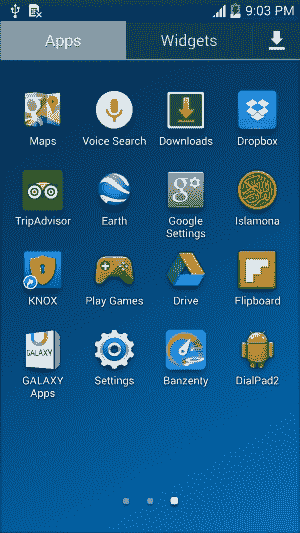
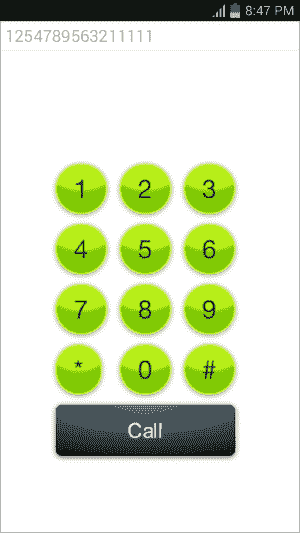

# 第四章：为 Android 开发 JavaFX 应用程序

毫无疑问，我们每天都在看到非 PC 客户端的增长。几乎每个人都至少有一部手机或平板电脑，可能来自不同的供应商，但肯定是带有 Android 或 iOS 的，因为它们在 2014 年占据了 96%的智能手机操作系统销售份额。

智能手机和平板电脑现在非常流行，这些数字每年都在增加。这就是为什么开发人员应该考虑获得开发这样一个巨大市场的应用程序所需的技能。

JavaFX 8 已经为 Web 和桌面提供了丰富的客户端应用程序，正如我们在第三章中所看到的，*开发 JavaFX 桌面和 Web 应用程序*。但是，如果像我一样，您已经编写了一个 JavaFX 应用程序，您肯定希望它能在尽可能多的设备上运行，以遵循*Write Once, Run Anywhere*的真正精神。我想借此机会告诉您，是的，我们可以在移动设备上运行 JavaFX。

基于 Oracle Corporation 对 JavaFX 的官方支持，JavaFX 社区内的许多人正在努力将 JavaFX 移植到尽可能多的设备和平台（桌面、移动和嵌入式）以及不同的操作系统上，使用相同的代码库。

他们已经成功地创建了 SDK，使我们能够开发 JavaFX 应用程序作为本机应用程序在 Android 或基于 iOS 的设备上运行在一个捆绑包中（*JVM 加应用程序*），而无需像在桌面或 Web 上运行它们一样需要任何额外的软件。

本章将为您提供关于 SDK 的基本实践知识，这将使您能够为 Android 创建、打包和部署本机应用程序。

在本章中将获得以下一些技能：

+   安装和配置 Android 环境工具和软件

+   准备和创建 JavaFX 8 移动项目结构

+   创建一个 Android JavaFX 8 应用程序

+   JavaFX 8 与 Android 低级 API 之间的互操作性

+   在移动设备上打包和部署应用程序

+   为最终的 Google Play 商店提交应用程序进行签名

# 为什么要将 JavaFX 移植到移动环境？

为什么要将 JavaFX 移植到移动环境？这不是**Write Once Run Anywhere**（**WORA**）吗？这是一个非常好的问题。任何 Java 应用程序都遵循 WORA 范例，但是有一个非常关键的抽象软件，它依赖于运行，被称为**Java Virtual Machine**（**JVM**）。

JVM 是负责将编译的字节码（*.class 文件*）翻译为特定机器并提供平台指令以便它能理解和运行的软件，因此您可以运行您的应用程序。因此，您会发现为每种硬件（Intel、AMD、SPARC 或 ARM）和平台（Windows、Mac、Linux 或 Solaris）都有不同版本的 JRE 或**JDK**。

在桌面、Web 或嵌入式设备上，您必须首先安装**Java Runtime Environment**（**JRE**）才能运行您的 Java 应用程序。但是，对于移动设备，您会注意到您只需从商店下载您的应用程序，安装它，最后运行它，而无需任何额外的软件。此外，一些封闭平台不允许安装 JVM。

为了更好的最终用户体验，运行 JavaFX 应用程序和运行其他针对 Android 或 iOS 的应用程序之间不应该有任何区别。

因此，我们应该有一个自包含的（应用程序加上 JVM）JavaFX 应用程序，可以在移动设备上运行。除了能够与 Android 低级 API 交互以控制设备功能外，它将被视为 Google Play 商店中的其他应用程序。

我们应该感谢社区提出这样的移植 SDK，并填补这一空白，使我们能够使用 RoboVM（[`www.robovm.org/`](http://www.robovm.org/)）上的移植和使用 JavaFXPorts（[`javafxports.org/`](http://javafxports.org/)）上的移植在 iOS 上创建和运行我们的 JavaFX 应用程序，并在 Android 上创建和运行我们的 JavaFX 应用程序。

自 2015 年 2 月以来，这些项目背后的公司之间达成了协议，现在一个名为`jfxmobile-plugin`的单一插件允许我们从相同的代码库构建三个平台的应用程序：桌面、Android 和 iOS。

此外，一家名为**Gluon**的新公司提供了一个免费插件（[`gluonhq.com/products/tools/ide-plugins/`](http://gluonhq.com/products/tools/ide-plugins/)），用于**NetBeans**，它创建了一个项目，其中包含构建基于`jfxmobile-plugin`的应用程序所需的一切。

### 注意

但请记住，所有这些都在不断发展，事情可能会有所变化。

## 它是如何工作的

RoboVM 用于 iOS 移植和 JavaFXPorts 用于 Android 移植都包含了所有必需的库，以便轻松打包您的 JavaFX 8 应用程序和所需的运行时环境。

使用 RoboVM 将 JavaFX 应用程序打包到 iOS（到`.ipa`包文件）时，所有 JavaFX 应用程序都会转换为**Objective-C**（目前是**Swift**）应用程序。

当使用 JavaFXPorts 将 JavaFX 应用程序打包到 Android（到`.apk`包文件）时，这些应用程序将被转换为在**Dalvik** VM 上运行的 Android 包。

这些 SDK 包含了大量的本地代码，将在将它们注入到您的 JavaFX 应用程序中后，被移植到 iOS 和 Android，以提高应用程序的性能。

使用这些 SDK，我们可以将我们的应用程序打包成适合提交到商店的格式（`.ipa`用于 iOS 和`.apk`用于 Android）。

## 谁在维护它？

不用担心 - 有大规模的免费支持，用于将 JavaFX 移植到 Android 和 iOS，以及商业支持。

### 注意

对于免费和商业支持，RoboVM 和 JavaFXPorts 社区都使用这个 Google 小组：

[`groups.google.com/forum/#!forum/javafxports`](https://groups.google.com/forum/#!forum/javafxports)

免费和商业支持主要来自社区中积极参与这两个项目的人，他们鼓励更多的第三方参与。

对于 iOS，RoboVM 为开发者提供了不同的计划；您可以在[`robovm.com/pricing/`](http://robovm.com/pricing/)上查看。

而对于 Android，公司**LodgON**提供对 JavaFX-Android 集成的支持，作为他们对 JavaFX 移植的支持的一部分（[`www.lodgon.com/dali/page/JavaFX_Consulting`](http://www.lodgon.com/dali/page/JavaFX_Consulting)）。

# 入门

我们现在已经有足够的信息，了解之前讨论的工具和 SDK 将如何让我们开始开发 JavaFX 应用程序，并将它们移植到 Android 移动设备上。

但在进入开发阶段之前，我们应该正确安装和配置工具和软件，以便根据提供的 SDK 完成开发过程，以便拥有最终的`.apk`包。

我们将在真实设备上部署这个`.apk`包，并最终对其进行签名，以便提交到 Google Play 商店。

因此，让我们开始安装先决工具和软件，以便开始开发我们的应用程序。

## 准备和安装先决软件

我们需要安装以下工具和软件列表，以便在没有任何问题的情况下完成我们的构建过程。

### Java SE 8 JDK8 u45

我们以前已经做过这个了；参考第一章中的*安装 Java SE 8 JDK*部分，*开始使用 JavaFX 8*。

### 注意

Java SE 8 更新 40 是为了开发 Android 的 JavaFX 应用程序所需的最低版本。

### Gradle

从他们的网站上，这是 Gradle 的定义：

> *Gradle 是一个开源的构建自动化系统。Gradle 可以自动化构建、测试、发布、部署等软件包或其他类型的项目，比如生成的静态网站、生成的文档，或者其他任何东西。*

最近，Android 开发工具将他们的构建系统更改为 Gradle。RoboVM 和 JavaFXPorts 移植项目模仿了相同的工具。

安装 Gradle 是一个非常简单的任务：

1.  转到[`gradle.org`](https://gradle.org)。

1.  从右侧，在**GET GRADLE!**部分，点击**Downloads 2.4**（截至目前为止），下载过程将开始下载`gradle-2.4-all.zip`文件。

1.  将下载的`.zip`文件复制到您选择的方便位置并解压缩它。

1.  最后一步是将环境变量设置到您的系统中，如下所示：

+   在 Windows 上 - 假设 Gradle 安装在`c:\tools\gradle_2.4`：

```java
set GRADLE_HOME=c:\tools\gradle_2.4
set PATH=%PATH%;%GRADLE_HOME%\bin

```

+   在 Mac 上 - 假设 Gradle 安装在`/usr/local/tools/gradle_2.4`：

```java
export GRADLE_HOME=/usr/local/tools/gradle_2.4
export PATH=${PATH}:${GRADLE_HOME}/bin

```

### Android SDK

Android SDK 包括 Android 平台的完整开发和调试工具集。

安装 Android SDK 是一个非常简单的任务：

1.  转到[`developer.android.com/sdk/index.html#Other`](http://developer.android.com/sdk/index.html#Other)。

1.  在 SDK Tools Only 下，点击`android-sdk_r24.2-{platform}`.`{exe|zip|tgz}`（截至目前为止），针对您喜欢的平台的名称：

1.  将打开一个`Download`页面；接受条款，点击`Download android-sdk_r24.2-{platform}`.`{exe|zip|tgz}`按钮，下载过程将开始。

1.  将下载的`.zip`文件复制到一个方便的位置并解压缩它，或者在 Windows 上双击`.exe`来开始安装。

1.  从命令行运行以下命令：

```java
$ android

```

Android SDK Manager 将打开；点击`Build-tools version 21.1.2`或更高版本以及 API 21 或更高版本的 SDK 平台。

点击**Install x packages**，接受许可证，然后点击**Install**。完成。

Android SDK Manager 的一个很好的参考资料在[`developer.android.com/sdk/installing/adding-packages.html`](http://developer.android.com/sdk/installing/adding-packages.html)。

1.  最后一步是在您的系统中设置环境变量，如下所示：

+   在 Windows 上 - 假设 Android SDK 安装在`c:\tools\android_ADT`：

```java
set ANDROID_HOME=c:\tools\android_ADT\sdk
set PATH=%PATH%;%ANDROID_HOME%\platform-tools;%ANDROID_HOME%\tools

```

+   在 Mac 上 - 假设 Android SDK 安装在`/usr/local/tools/android_ADT`：

```java
export ANDROID_HOME=/usr/local/tools/android_adt/sdk
export PATH=${PATH}:${ANDROID_HOME}/tools:${ANDROID_HOME}/platform-tools

```

+   这样做的最佳方法是在`C:\Users\<user>\.gradle\gradle.properties`下创建一个名为 ANDROID_HOME 的 Gradle 属性。

## 为 Android 准备项目

我们已经成功安装了先决条件软件和工具，并配置了环境变量，所以我们准备开始开发将被移植到 Android 设备的应用程序。

但在这之前，我们需要准备好我们的项目结构和构建文件，以便准备好使用 JavaFXPorts 库构建和打包我们的应用程序。

使用三种不同平台设置一个复杂的项目曾经是一项艰巨的任务，但最近 Gluon（http://gluonhq.com/）发布了一个 NetBeans 插件（[`gluonhq.com/gluon-plugin-for-netbeans/`](http://gluonhq.com/gluon-plugin-for-netbeans/)），大大简化了这项任务。

### 项目结构

最简单的方法是使用 NetBeans 的 Gluon 插件。这将为您创建一个 Java 项目，您只需要添加 JavaFX 源代码和一个带有所有任务准备的`build.gradle`文件。

安装了插件后，执行以下任务：

1.  只需创建一个新的 JavaFX 项目，并选择**Basic Gluon Application**，如下所示：

1.  为项目（`DialPad2`）、包（`packt.taman.jfx8.ch4`）和主类（`DialPad2`）选择有效的名称，您将在新项目中找到一堆文件夹。

1.  遵循 Gluon 插件的顶部项目结构将带来更复杂的结构，并且应该如下截图所示：

Gluon 插件项目结构

接下来，我们将添加我们的构建脚本文件以完成我们的任务。

#### 使用 Gradle

要构建一个 Gradle 项目，我们需要`build.gradle`脚本文件。Gluon 插件已经默认为您添加了此文件，包括所有属性，以允许我们的应用程序成功运行和编译。

默认的 Gradle 构建文件创建`build.gradle`文件应该如下所示：

```java
buildscript {
    repositories {
        jcenter()
    }
    dependencies {
        classpath 'org.javafxports:jfxmobile-plugin:1.0.0-b8'
    }
}

apply plugin: 'org.javafxports.jfxmobile'

repositories {
    jcenter()
}

mainClassName = 'packt.taman.jfx8.ch4.DialPad2'

jfxmobile {

    android {
        manifest = 'lib/android/AndroidManifest.xml'
    }
}
```

唯一需要更改的重要事项是将`jfxmobile-plugin`版本更改为 1.0.0-b8（或最新版本；请经常查看[`bitbucket.org/javafxports/javafxmobile-plugin/overview`](https://bitbucket.org/javafxports/javafxmobile-plugin/overview)以保持更新）。

## 该应用程序

您已经到达这一部分意味着我们已经正确设置了应用程序项目结构，并且现在已经准备好进行移动设备开发。

我们的应用程序将是一个新的智能手机拨号界面，用于在我们的设备上执行呼叫操作。它将使用 CSS 进行自定义以控制其外观样式，可以根据需要修改以获得不同平台的本机外观和感觉。

该应用程序的主要目的是提供一个新的 UI 概念（使用 CSS 自定义应用程序），您将学习如何使用 CSS id 和 class 选择器以及从代码内部设置它们以应用于不同的控件。

以下截图显示了应用程序在应用 CSS 文件之前和之后的样子：


### 使用 CSS 开发和样式化应用程序 UI

正如我们之前学到的，我将开始原型设计我们的应用程序；在原型设计之后，我们应该有之前看到的应用程序 UI。

该应用程序 UI 直接写在`DialPad2.java`类的`start(Stage)`函数内，作为一种开发 UI 的替代方式，而不是使用静态的 FXML 设计。

在这里，我们从代码内部嵌套控件，以防需要动态生成 UI 控件并为它们分配不同的设置、CSS 类、id 选择器和监听器。

以下代码片段显示了我们如何生成前面的应用程序 UI：

```java
BorderPane root = new BorderPane();
Rectangle2D bounds = Screen.getPrimary().getVisualBounds();
Scene scene = new Scene(root, bounds.getWidth(), bounds.getHeight());
scene.getStylesheets().add(getClass().getResource("ui/Mobile_UI."+PlatformFactory.getName()+".css").toExternalForm());
TextField output = new TextField("");
output.setDisable(true);

root.setTop(output);
String[] keys = {"1", "2", "3",
                 "4", "5", "6",
                 "7", "8", "9",
                 "*", "0", "#"};

GridPane numPad = new GridPane();
numPad.setAlignment(Pos.CENTER);
numPad.getStyleClass().add("num-pad");
for (int i = 0; i < keys.length; i++) {
       Button button = new Button(keys[i]);
       button.getStyleClass().add("dial-num-btn");
       button.setOnAction(e -> output.setText(output.getText().concat(Button.class.
      cast(e.getSource()).getText())));
      numPad.add(button, i % 3, (int) Math.ceil(i / 3));
}
// Call button
Button call = new Button("Call");
call.setOnAction(e->PlatformFactory.getPlatform().callNumber(output.getText()));
call.setId("call-btn");
call.setMaxSize(Double.MAX_VALUE, Double.MAX_VALUE);
numPad.add(call, 0, 4);
GridPane.setColumnSpan(call, 3);
GridPane.setHgrow(call, Priority.ALWAYS);
root.setCenter(numPad);

//Stage setup
stage.setScene(scene);
stage.setTitle("Phone Dial v2.0");
stage.show();
```

代码首先创建一个以`BorderPane`为根节点的场景。创建场景后，代码加载 CSS 样式表文件`Mobile_UI.<platform>.css`，通过`getStylesheets().add()`方法来为当前场景的节点设置样式，如下所示：

```java
scene.getStylesheets().add(getClass().getResource("ui/Mobile_UI."+PlatformFactory.getName()+".css").toExternalForm());
```

在我们创建了一个`TextField`输出来显示拨号结果并将其设置为禁用，以便我们无法编辑它之后，只需点击按钮即可添加和显示数字。

接下来，代码简单地使用`GridPane`类创建一个网格，并生成 12 个按钮放置在每个单元格中。请注意，在 for 循环中，每个按钮都通过`getStyleClass().add()`方法设置为名为`dial-num-btn`的样式类。

### 注意

在这里，我们使用了一个传统的`for`循环来添加按钮，而不是一个花哨的 Java 8 流。请注意，`Dalvik VM`仅在 Java 7 上运行，并且只能使用 lambda（因为在内部，JavaFXPorts 使用 Retrolambda 项目）。

最后，深蓝色的**Call**按钮将添加到网格窗格的最后一行。因为**Call**按钮是唯一的，它的 id 选择器设置为`#call-btn`，并且将使用 id 选择器进行样式设置，这意味着 CSS 文件中的选择器将以`#`符号为前缀。

以下是用于样式化应用程序的 CSS 文件：

```java
.root {
    -fx-background-color: white;
    -fx-font-size: 20px;
    bright-green: rgb(59,223, 86);
    bluish-gray: rgb(189,218,230);
}
.num-pad {
    -fx-padding: 15px, 15px, 15px, 15px;
    -fx-hgap: 10px;
    -fx-vgap: 8px;
}

#call-btn {
    -fx-background-color: 
        #090a0c,
        linear-gradient(#38424b 0%, #1f2429 20%, #191d22 100%),
        linear-gradient(#20262b, #191d22),
        radial-gradient(center 50% 0%, radius 100%, rgba(114,131,148,0.9), rgba(255,255,255,0));
    -fx-background-radius: 5,4,3,5;
    -fx-background-insets: 0,1,2,0;
    -fx-text-fill: white;
    -fx-effect: dropshadow( three-pass-box , rgba(0,0,0,0.6) , 5, 0.0 , 0 , 1 );
    -fx-font-family: "Arial";
    -fx-text-fill: linear-gradient(white, #d0d0d0);
    -fx-font-size: 16px;
    -fx-padding: 10 20 10 20;
}
#call-btn .text {
    -fx-effect: dropshadow( one-pass-box , rgba(0,0,0,0.9) , 1, 0.0 , 0 , 1 );
}

.dial-num-btn {
    -fx-background-color:
        linear-gradient(#f0ff35, #a9ff00),
        radial-gradient(center 50% -40%, radius 200%, #b8ee36 45%, #80c800 50%);
    -fx-background-radius: 30;
    -fx-background-insets: 0,1,1;
    -fx-effect: dropshadow( three-pass-box , rgba(0,0,0,0.4) , 5, 0.0 , 0 , 1 );
    -fx-text-fill: #395306;
}

.dial-num-btn:hover {
    -fx-background-color: 
        #c3c4c4,
        linear-gradient(#d6d6d6 50%, white 100%),
        radial-gradient(center 50% -40%, radius 200%, #e6e6e6 45%, rgba(230,230,230,0) 50%);
    -fx-background-radius: 30;
    -fx-background-insets: 0,1,1;
    -fx-text-fill: black;
    -fx-effect: dropshadow( three-pass-box , rgba(0,0,0,0.6) , 3, 0.0 , 0 , 1 );
}

.dial-num-btn:pressed {
    -fx-background-color: linear-gradient(#ff5400, #be1d00);
    -fx-background-radius: 30;
    -fx-background-insets: 0,1,1;
    -fx-text-fill: white;
}
```

有关 JavaFX 8 CSS 属性的更多信息，请访问以下 JavaFX 8 CSS 参考：

[`docs.oracle.com/javase/8/javafx/api/javafx/scene/doc-files/cssref.html`](http://docs.oracle.com/javase/8/javafx/api/javafx/scene/doc-files/cssref.html)

### 添加一些逻辑

正如您在代码片段中所看到的，每个 12 个按钮都有一个分配的操作，使用 lambda 表达式动态创建如下：

```java
button.setOnAction(e -> output.setText(output.getText().concat(Button.class.cast(e.getSource()).getText())));
```

我们得到输出`TextField`并通过获取事件`e`的源来连接下一个数字、星号或井号，而在我们的情况下，这是点击的按钮，然后它的文本值，包含要拨打的号码。

### 使您的项目适用于移动设备

基本上，这个新项目是使用 Gluon 插件生成的（`build.gradle`更新到**b8**）。

为了使应用程序适用于移动设备，我们需要调整其高度和宽度以适应目标设备屏幕，并使 UI 树相应地做出响应。

这是一个非常简单但非常重要的步骤，我们可以通过将场景高度和宽度设置为目标设备屏幕尺寸来调整以下代码行。看一下以下行：

```java
Scene scene = new Scene(root, 175, 300);
```

将此更改为以下代码行：

```java
Rectangle2D bounds = Screen.getPrimary().getVisualBounds();
Scene scene = new Scene(root, bounds.getWidth(), bounds.getHeight());
```

第一行获取设备屏幕`bounds`。然后我们从这个边界变量设置场景高度和宽度。

第二行将您的源添加到源包[Java]和资源[Main]。然后添加一个`PlatformFactory`类，负责查找项目正在运行的平台。看一下具有方法签名的`Platform`接口：

```java
public interface Platform {   
    void callNumber(String number);
}
```

这允许您在源上调用以下方法：

```java
Button call = new Button("Call");
call.setOnAction(e-> PlatformFactory.getPlatform().callNumber(output.getText()));
```

最后，您为每个平台提供本机解决方案。例如，对于 Android：

```java
public class AndroidPlatform implements Platform {

    @Override
    public void callNumber(String number) {
        if (!number.equals("")) {
            Uri uriNumber = Uri.parse("tel:" + number);
            Intent dial = new Intent(Intent.ACTION_CALL, uriNumber);
            FXActivity.getInstance().startActivity(dial);
         }
    }
}
```

为了使其在 Android 上工作，我们只需要修改`AndroidManifest.xml`，添加所需的权限和活动意图。这个自定义清单必须在`build.gradle`文件中引用，如下所示：

```java
android {
    manifest = 'lib/android/AndroidManifest.xml'
  }
```

#### 与低级 Android API 的互操作性

您需要`android.jar`来使用 Android API，并且您需要`jfxdvk.jar`来访问`FXActivity`类，它是`JavaFX`和`Dalvik`运行时之间的桥梁。我们在`FXActivity`上使用一个静态方法来检索`FXActivity`，它扩展了 Android`Context`。这个`Context`可以用来查找 Android 服务。

## 构建应用程序

为了为我们的应用程序创建 Android.apk 包文件，我们首先需要构建我们的应用程序；这是一个非常简单的任务。使用命令行（或从 NetBeans，右键单击**项目**选项卡，然后选择`Tasks/task`）指向当前项目文件夹，运行以下命令：

```java
$ gradle build

```

Gradle 将下载所有所需的库并开始构建我们的应用程序。完成后，您应该看到成功的输出如下：

```java
$ gradle build
Download https://jcenter.bintray.com/org/robovm/robovm-rt/1.0.0-beta-04/robovm-rt-1.0.0-beta-08.pom
:compileJava
:compileRetrolambdaMain
Download https://jcenter.bintray.com/net/orfjackal/retrolambda/retrolambda/1.8.0/retrolambda-1.8.0.pom
:processResources UP-TO-DATE
:classes
:compileDesktopJava UP-TO-DATE
:compileRetrolambdaDesktop SKIPPED
……...…
:check UP-TO-DATE
:build

BUILD SUCCESSFUL
Total time: 44.74 secs
```

到目前为止，我们已经成功构建了我们的应用程序。接下来，我们需要生成.apk 并将其部署到许多来源。

### 构建最终的.apk Android 包

在构建我们的.apk 文件时，有两个选项。第一个是通过运行以下命令：

```java
gradle android 

```

这将在目录`build/javafxports/android`中生成.apk 文件。

第二个是通过运行此命令：

```java
androidInstall 

```

这将在连接到您的台式机或笔记本设备的设备上部署生成的.apk 包。

我们将使用第一个选项（`gradle android`）来确保我们能够成功生成.apk 文件。成功完成后，您应该在先前提到的路径下有一个名为`DialPad2.apk`的文件。

## 部署应用程序

为了能够使用`gradle androidInstall`命令在连接的移动设备上部署我们的应用程序，您必须在设备上启用**开发者选项**并在其中启用一些其他设置，如下所示：

1.  从您的设备上，点击**设置**打开设置菜单。

1.  从顶部菜单中选择**更多**。选项取决于您的设备。

1.  在**更多选项**菜单列表的末尾，您应该看到**开发者选项**。

1.  点击**开发者选项**菜单。

1.  通过在右上角打开滑块来启用**开发者选项**。

1.  测试提示

1.  您必须在 Google Play 开发者中注册自己([`play.google.com/apps/publish/`](https://play.google.com/apps/publish/))，填写一个带有描述和几张截图的表格，最后提交 DialPad2 apk。

### 如果某些功能不如预期那样工作，请转到命令行并输入：

在交付应用程序之前最重要的一点是对其进行测试，特别是在不同的基于 Android 的移动设备上。

### 恭喜！您已完成——让我们去安装我们的应用程序。

发出此命令后，它将开始构建和打包 JavaFX 8 应用程序。插件将连接到您连接的设备并将应用程序安装到其中。这是您应该得到的结果：

```java
$ gradle androidinstall

```

`apk`必须签名才能发布。**签名**意味着您需要一个私钥；为此，我们可以使用 keytool ([`developer.android.com/tools/publishing/app-signing.html#signing-manually`](http://developer.android.com/tools/publishing/app-signing.html#signing-manually))。

```java
:compileJava
:compileRetrolambdaMain
………...…
:processAndroidResources UP-TO-DATE
:apk
:zipalign
:androidInstall
Installed on device.

BUILD SUCCESSFUL
Total time: 47.537 secs
```

在基于 Android 的设备上部署

在基于 Android 的设备上部署

为了在 Google Play 商店上部署您的应用程序，您必须执行以下操作：

点击**DialPad2**应用程序，您应该看到您的应用程序在设备上运行并完全按预期功能正常运行：

在 Google Play 商店上部署

根据我的经验，在移动测试领域中的四个黄金规则是：

JavaFX 8 应用程序拨打号码

而**发布**意味着我们需要将签名配置添加到`build.gradle`中，如下所示：

**可选**：如果您看不到**开发者选项**，不要担心。它是存在的，但是隐藏的。这里是魔法——点击**关于设备**，找到**构建号**，然后点击 5 次（Lollipop 上点击 7 次）。您将看到一个数字倒计时，最后**开发者选项**将被启用。

尽可能在尽可能多的真实设备和 Android 平台上进行测试，以覆盖应用程序将在其中运行的所有情况，并了解其在生产中的行为。

```java
$ adb logcat 

```



### 

现在，我们准备运行以下命令：

1.  

1.  右键单击**DialPad2**项目，从**任务**中选择**apk**，然后选择**apkRelease**。

1.  签署 APK

#### 仅使用模拟器进行*GUI 测试和功能*，而不是进行*性能测试*。所有模拟器都依赖于您的底层 PC/笔记本硬件和内存，而在移动硬件上将会有很大的不同，要达到相同的性能将是非常具有挑战性的。

然后，您将获得设备上所有应用程序的输出。

在**调试**下，启用**USB 调试**，点击**允许 USB 调试**警报窗口中的**确定**按钮，并启用**未知来源**。

```java
jfxmobile {
    android {
        signingConfig {
            storeFile file("path/to/my-release-key.keystore")
            storePassword 'STORE_PASSWORD'
            keyAlias 'KEY_ALIAS'
            keyPassword 'KEY_PASSWORD'
        }
        manifest = 'lib/android/AndroidManifest.xml'
        resDirectory = 'src/android/resources'
    }
}
```

现在打开您的设备，并从主屏幕上找到您的应用程序图标；在右下角，您应该看到您的`DialPad2` JavaFX 应用程序已安装，如下截图所示，带有默认的 Android 图标：

点击**呼叫**按钮，将启动 Android 默认的拨号器，拨打您输入的号码，如下所示：

## 恭喜！生成的`DialPad2.`apk 已准备好提交到 Google Play 商店。

注意

在我与移动行业的经验中，我发现有数十家供应商的测试手机和平板电脑运行 Android 平台，它们每个都定制了每个设备的 UI 层，具有不同的功能和性能。

您还可以在`application`标签下添加您应用程序的图标（`android:icon="@icons/ic_launcher`）。这里，`icons-*`是带有几种分辨率的图像文件夹。

1.  在 Android 设备上安装的 JavaFX 8 应用程序

1.  在`AndroidManifest.xml`中，您必须通过在`application`标签上添加`android:debuggable="false"`来禁用调试选项。

1.  Chrome 有一个名为 ARC Welder 的新模拟器。请访问[`developer.chrome.com/apps/getstarted_arc`](https://developer.chrome.com/apps/getstarted_arc)查看。

1.  最终生产和性能测试在真实设备上进行测试。这样您就可以确保您的应用程序在目标市场设备上能够正常运行。

# 总结

本章使您对移动行业有了很好的了解，以及如何使用不同的项目（如**RoboVM**用于**iOS**和**JavaFXPorts**用于**Android**）开发和定制基于 JavaFX 的应用程序，从而使您的应用程序能够在两个平台上运行。

然后，我们学习了如何安装所需的软件和工具进行 Android 开发，并启用 Android SDK 以及*JavaFXPorts*库来打包和安装我们的拨号器基于 JavaFX 的应用程序到真实的 Android 设备，并将其提交到 Google Play 商店。

我们看到如何使用 CSS 自定义我们的应用程序，使同一应用程序具有不同的外观和感觉，以确保您为 Android 版本提供了不同的 CSS。

接下来，我们学习了如何将我们的设备调试模式启用，以便通过命令行成功安装来自`jfxmobile-plugin`的应用程序。最后，我们介绍了测试的四个黄金规则。

下一章与本章不会有太大的不同，但会很好地介绍和了解如何将您的 JavaFX 8 应用程序定位到运行在基于 iOS 的设备上。您还将学习如何使用其开发工具。
