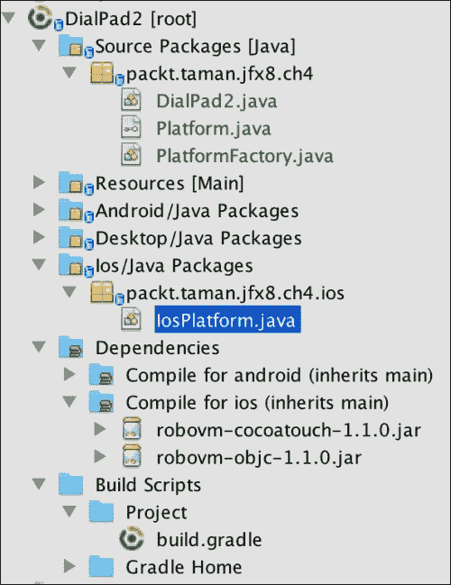
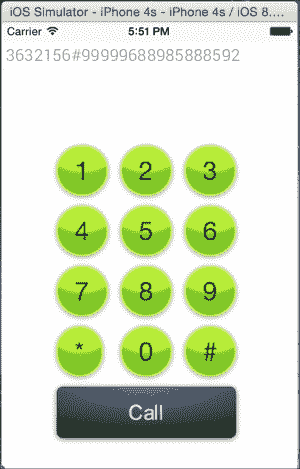

# 第五章。为 iOS 开发 JavaFX 应用程序

苹果在移动和 PC /笔记本世界拥有很大的市场份额，拥有许多不同的设备，从 iPhone 等手机到 iPod 等音乐设备和 iPad 等平板电脑。

它拥有一个快速增长的应用市场，称为 Apple Store，为其社区提供服务，可用应用程序的数量每天都在增加。移动应用程序开发人员应该为这样的市场做好准备。

同时针对 iOS 和 Android 的移动应用程序开发人员面临许多挑战。仅仅比较这两个平台的本机开发环境，就会发现它们存在实质性的差异。

根据苹果的说法，iOS 开发基于 Xcode IDE（[`developer.apple.com/xcode/`](https://developer.apple.com/xcode/)）及其编程语言。传统上是 Objetive-C，2014 年 6 月，苹果推出了 Swift（[`developer.apple.com/swift/`](https://developer.apple.com/swift/)）；另一方面，根据谷歌的定义，Android 开发基于 Intellij IDEA IDE 和 Java 编程语言。

没有多少开发人员精通两种环境。此外，这些差异排除了平台之间的任何代码重用。

JavaFX 8 正在填补平台之间可重用代码的差距，正如我们将在本章中看到的，通过在两个平台上共享相同的应用程序。

通过本章结束时，您将掌握以下一些技能：

+   安装和配置 iOS 环境工具和软件

+   创建 iOS JavaFX 8 应用程序

+   模拟和调试 JavaFX 移动应用程序

+   在 iOS 移动设备上打包和部署应用程序

# 使用 RoboVM 在 iOS 上运行 JavaFX

RoboVM 是从 Java 到 Objetive-C 的桥梁。使用它，开发运行在基于 iOS 的设备上的 JavaFX 8 应用程序变得容易，因为 RoboVM 项目的最终目标是解决这个问题，而不会影响开发人员体验或应用程序用户体验。

正如我们在前一章关于 Android 中看到的，使用 JavaFXPorts 生成 APK 是一个相对容易的任务，因为 Android 是基于 Java 和 Dalvik VM 的。

相反，iOS 没有为 Java 提供虚拟机，并且不允许动态加载本机库。

需要另一种方法。RoboVM 开源项目试图通过创建一个桥梁来解决 Java 开发人员的差距，该桥梁使用一个“提前编译”编译器，将 Java 字节码转换为本机 ARM 或 x86 机器代码。

## 特点

让我们来看看 RoboVM 的特点：

+   将 Java 和其他 JVM 语言（如 Scala、Clojure 和 Groovy）带到基于 iOS 的设备上

+   提前将 Java 字节码转换为机器代码，以便在 CPU 上直接进行快速执行，而不会产生任何开销

+   主要目标是 iOS 和 ARM 处理器（32 位和 64 位），但也支持在 x86 CPU 上运行的 Mac OS X 和 Linux（32 位和 64 位）

+   不对开发人员可访问的 Java 平台功能施加任何限制，如反射或文件 I/O

+   支持标准的 JAR 文件，让开发人员重用第三方 Java 库的庞大生态系统

+   通过 Java 到 Objective-C 桥接提供对完整本机 iOS API 的访问，实现具有真正本机 UI 和完整硬件访问的应用程序开发

+   与 NetBeans、Eclipse、Intellij IDEA、Maven 和 Gradle 等最流行的工具集成

+   App Store 准备就绪，已有数百款应用程序在商店中

## 限制

主要是由于 iOS 平台的限制，使用 RoboVM 时存在一些限制：

+   不支持在运行时加载自定义字节码。应用程序的所有类文件都必须在开发者机器上的编译时可用。

+   Java 本机接口技术通常在桌面或服务器上使用，从动态库加载本机代码，但是苹果不允许将自定义动态库与 iOS 应用一起发布。RoboVM 支持基于静态库的 JNI 变体。

+   另一个重要限制是，RoboVM 是一个处于开发中的 Alpha 状态项目，目前尚不建议用于生产。

### 注意

RoboVM 完全支持反射。

## 工作原理

如第四章中所述，自 2015 年 2 月以来，RoboVM 和 JavaFXPorts 背后的公司之间已经达成协议，现在一个名为 jfxmobile-plugin 的单一插件允许我们从相同的代码库构建三个平台的应用程序-桌面、Android 和 iOS。

JavaFXMobile 插件为您的 Java 应用程序添加了许多任务，允许您创建可以提交到 Apple Store 的.ipa 包。

Android 主要使用 Java 作为主要开发语言，因此很容易将您的 JavaFX 8 代码与其合并。在 iOS 上，情况在内部完全不同，但使用类似的 Gradle 命令。

该插件将下载并安装 RoboVM 编译器，并使用 RoboVM 编译器命令在`build/javafxports/ios`中创建 iOS 应用程序。

# 入门

在本节中，您将学习如何使用`JavaFXMobile`插件安装 RoboVM 编译器，并通过重用我们之前在第四章中开发的相同应用程序 Phone Dial 版本 1.0，确保工具链正确工作，*为 Android 开发 JavaFX 应用程序*。

## 先决条件

为了使用 RoboVM 编译器构建 iOS 应用程序，需要以下工具：

+   Oracle 的 Java SE JDK 8 更新 45。参考第一章，*开始使用 JavaFX 8*，*安装 Java SE 8 JDK*部分。

+   构建应用程序需要 Gradle 2.4 或更高版本的`jfxmobile`插件。参考第四章，*为 Android 开发 JavaFX 应用程序*，*安装 Gradle 2.4*部分。

+   运行**Mac OS X** 10.9 或更高版本的 Mac。

+   来自 Mac App Store 的 Xcode 6.x（[`itunes.apple.com/us/app/xcode/id497799835?mt=12`](https://itunes.apple.com/us/app/xcode/id497799835?mt=12)）。

### 提示

第一次安装**Xcode**，以及每次更新到新版本时，都必须打开它一次以同意 Xcode 条款。

## 为 iOS 准备项目

我们将重用我们之前在第四章中为 Android 平台开发的项目，因为在针对 iOS 时，代码、项目结构或 Gradle 构建脚本没有任何区别。

它们共享相同的属性和特性，但使用针对 iOS 开发的不同 Gradle 命令，并对 RoboVM 编译器的 Gradle 构建脚本进行了微小更改。

因此，我们将看到**WORA** *一次编写，到处运行*的强大功能，使用相同的应用程序。

### 项目结构

基于第四章中 Android 示例的相同项目结构，*为 Android 开发 JavaFX 应用程序*，我们的 iOS 应用程序的项目结构应如下图所示：



### 应用程序

我们将重用第四章中开发的相同应用程序，*为 Android 开发 JavaFX 应用程序*：Phone DialPad 版本 2.0 JavaFX 8 应用程序：


正如您所看到的，重用相同的代码库是一个非常强大和有用的功能，特别是当您同时开发以针对许多移动平台，如 iOS 和 Android。

#### 与低级 iOS API 的互操作性

为了具有与在 Android 中本机调用默认 iOS 电话拨号器相同的功能，我们必须提供 iOS 的本机解决方案，如以下`IosPlatform`实现：

```java
import org.robovm.apple.foundation.NSURL;
import org.robovm.apple.uikit.UIApplication;
import packt.taman.jfx8.ch4.Platform;

public class IosPlatform implements Platform {

  @Override
  public void callNumber(String number) {
    if (!number.equals("")) {
      NSURL nsURL = new NSURL("telprompt://" + number);
      UIApplication.getSharedApplication().openURL(nsURL);
    }
  }
}
```

### Gradle 构建文件

我们将使用与第四章中使用的相同的 Gradle 构建脚本文件，*为 Android 开发 JavaFX 应用程序*，但通过在脚本末尾添加以下行进行微小更改：

```java
jfxmobile {
  ios {
    forceLinkClasses = [ 'packt.taman.jfx8.ch4.**.*' ]
  }
  android {
    manifest = 'lib/android/AndroidManifest.xml' 
  }
}
```

安装和使用`robovm`编译器的所有工作都由`jfxmobile`插件完成。

这些行的目的是为 RoboVM 编译器提供主应用程序类的位置，该类必须在运行时加载，因为默认情况下编译器看不到它。

`forceLinkClasses`属性确保在 RoboVM 编译期间链接这些类。

#### 构建应用程序

在我们已经添加了必要的配置集以构建 iOS 脚本之后，现在是时候构建应用程序以将其部署到不同的 iOS 目标设备。为此，我们必须运行以下命令：

```java
$ gradle build

```

我们应该有以下输出：

```java
BUILD SUCCESSFUL

Total time: 44.74 secs
```

我们已经成功构建了我们的应用程序；接下来，我们需要生成`.ipa`文件，并且在生产环境中，您需要通过将其部署到尽可能多的 iOS 版本来测试它。

#### 生成 iOS .ipa 软件包文件

为了为我们的 JavaFX 8 应用程序生成最终的.ipa iOS 软件包，这对于最终分发到任何设备或 AppStore 是必要的，您必须运行以下`gradle`命令：

```java
gradle ios 

```

这将在目录`build/javafxports/ios`中生成`.ipa`文件。

### 部署应用程序

在开发过程中，我们需要在 iOS 模拟器上检查我们的应用程序 GUI 和最终应用程序原型，并在不同设备上测量应用程序的性能和功能。这些程序非常有用，特别是对于测试人员。

让我们看看在模拟器上运行我们的应用程序或在真实设备上运行是一个非常容易的任务。

#### 部署到模拟器

在模拟器上，您可以简单地运行以下命令来检查您的应用程序是否正在运行：

```java
$ gradle launchIPhoneSimulator 

```

此命令将打包并在*iPhone 模拟器*中启动应用程序，如下截图所示：



DialPad2 JavaFX 8 应用程序在 iOS 8.3/iPhone 4s 模拟器上运行

此命令将在 iPad 模拟器中启动应用程序：

```java
$ gradle launchIPadSimulator 

```

#### 部署到苹果设备

为了打包 JavaFX 8 应用程序并将其部署到苹果设备，只需运行以下命令：

```java
$ gradle launchIOSDevice 

```

此命令将在连接到您的台式机/笔记本电脑的设备中启动 JavaFX 8 应用程序。

然后，一旦应用程序在您的设备上启动，输入任何号码，然后点击呼叫。

iPhone 将请求使用默认移动拨号器拨号；点击**确定**。默认移动拨号器将启动，并显示号码，如下图所示：


默认移动拨号器

### 注意

要能够在您的设备上测试和部署您的应用程序，您需要与苹果开发者计划订阅。访问苹果开发者门户网站，[`developer.apple.com/register/index.action`](https://developer.apple.com/register/index.action)，进行注册。您还需要为开发配置您的设备。您可以在苹果开发者门户网站上找到有关设备配置的信息，或者按照此指南操作：[`www.bignerdranch.com/we-teach/how-to-prepare/ios-device-provisioning/`](http://www.bignerdranch.com/we-teach/how-to-prepare/ios-device-provisioning/)。

# 摘要

本章使我们对如何使用 RoboVM 开发和定制基于 JavaFX 的应用程序以在苹果平台上运行应用程序有了很好的理解。

您了解了 RoboVM 的特点和限制，以及它的工作原理；您还获得了用于开发的技能。

然后，您学会了如何安装 iOS 开发所需的软件和工具，以及如何启用 Xcode 以及 RoboVM 编译器，以在 OS 模拟器上打包和安装基于 JavaFX-8 的 Phone Dial 应用程序。

我们已经看到了如何重复使用我们在第四章中已经开发的相同应用程序，证明了 Java WORA 范式的有效性。

最后，我们提供了关于如何在真实设备上运行和部署应用程序的技巧。

下一章将为我们打开物联网开发世界的一扇窗户；我们将看到如何购买树莓派 2 型，安装和配置用于开发的 raspbian-wheezy 操作系统，以及如何安装用于嵌入式设备的 Java SE。然后，我们将开发一个 JavaFX 8 应用程序，该应用程序将在我们的信用卡大小的微型计算机上运行。
